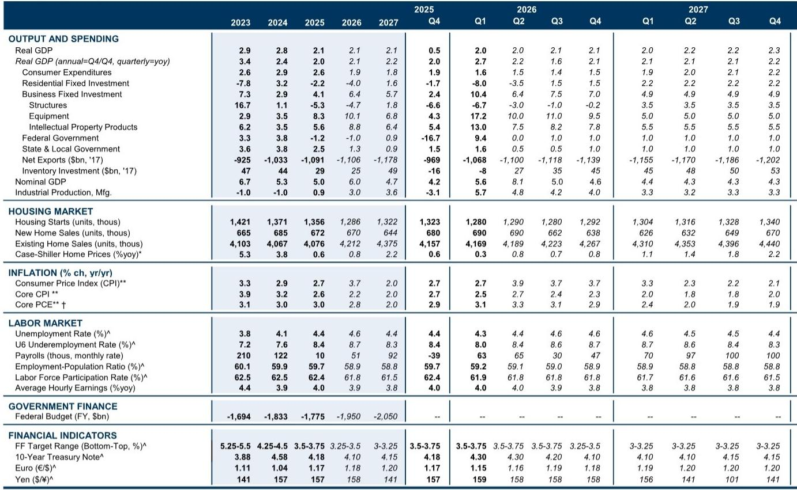
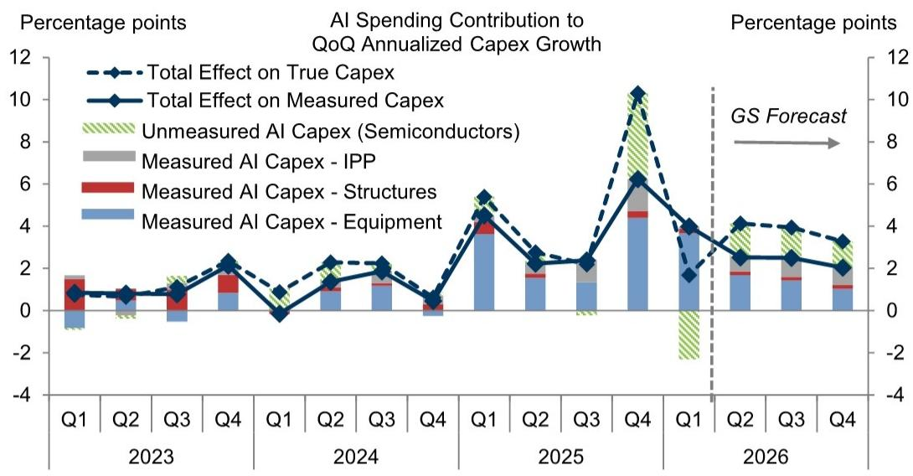
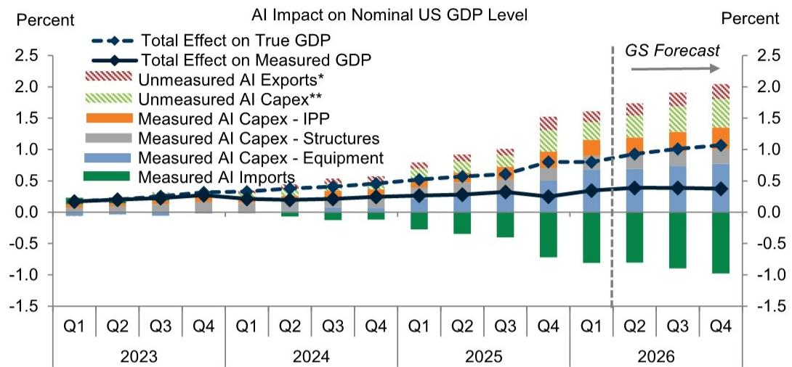

# 市场真正低估的不是AI支出规模，而是它如何被GDP统计“吃掉”

2026年一季度，美国商业固定投资以10.4%的年化速度增长，较去年全年5.6%的稳健步伐明显加速。这个数字本身并不令人意外——市场早已预期AI建设支出和新的税收激励会支撑投资。真正值得追问的是：这10.4%的增长背后，有多少是真实的国内经济扩张，有多少只是统计口径下的“幻象”？

某外资投行最新发布的年中资本开支更新报告，为这个问题提供了迄今为止最清晰的拆解。它的核心判断是：2026年企业投资将增长7.8%（Q4/Q4口径），但驱动因素的结构性变化，远比总量数字更重要。报告揭示了一个多数投资者尚未定价的真相——AI对GDP的拉动远比表面数据小，而新税改的刺激效应才刚刚开始显现。

如果你只关注资本开支的增速，你可能已经错过了更关键的信号。这份报告的价值不在于预测数字本身，而在于它给出了一个分析框架，让读者能够区分“统计上的增长”和“经济意义上的增长”。

## 1. AI对资本开支的拉动是真实的，但GDP统计至少“漏掉”了一半

报告最核心的洞察之一，是AI对资本开支的拉动与对GDP的拉动之间存在巨大的剪刀差。

根据该投行的测算，AI相关支出在2026年将为“真实资本开支”增长贡献约3.3个百分点。但所谓的“统计口径资本开支”增长中，AI的贡献只有2.8个百分点。这0.5个百分点的差距，源于美国经济分析局目前将半导体视为中间投入品，因而将其排除在投资统计之外。

更值得关注的是，AI对GDP的拉动被“压缩”得更厉害。报告估算，AI相关支出仅能为2026年的真实GDP增长贡献0.3个百分点，而统计口径的GDP增长中，AI的贡献只有0.1个百分点。

为什么差距如此之大？两个原因。第一，大量AI相关设备来自海外进口，投资增长在很大程度上被进口增加所抵消。第二，美国科技服务出口在统计中可能被严重低估——芯片设计等知识产权服务的海外销售，并未被GDP统计完整捕捉。

这意味着什么？对于宏观投资者而言，盯着GDP数据来判断AI投资周期，可能会严重低估AI对经济的真实渗透。对于产业决策者而言，这意味着“在美国本土建设AI基础设施”的GDP乘数效应，可能远低于传统基建投资。这是统计方法滞后于技术变革的典型案例。

## 2. 新税改激励已经在数据中“现形”，而市场尚未充分定价

报告的第二大看点，是对“一大美丽法案”中税收激励效果的早期验证。

该投行此前预测，新税改条款将通过降低美国企业的资本使用成本来刺激投资。制造业、交通运输、采矿等商品生产行业将获得最大幅度的资本成本下降。2026年一季度的数据初步验证了这一判断：在受新税改影响最大的投资品类中，资本开支增长出现了显著提升，且提升幅度与该投行基于学术研究的先验估计基本一致。

报告中一张散点图清晰地展示了这一关系：金属加工机械、软件、电气设备等资本成本下降幅度最大的品类，一季度投资增速也最为突出。而铁路设备、建筑机械等品类的表现则相对温和，这与其资本成本下降幅度较小一致。

该投行维持原有判断：新税改条款将在2026年全年为资本开支增长贡献约3个百分点，影响峰值出现在年中附近。

这里需要特别指出的是，市场目前对税改效果的定价可能还不够充分。2025年，政策不确定性曾拖累资本开支增长约1.5个百分点，而报告预计这一拖累将在2026年缩减至0.7个百分点。这意味着，除了税改本身的直接刺激效应，“政策确定性回升”本身也在释放投资需求。这两个效应的叠加，可能使2026年下半年的资本开支数据超出当前市场预期。

## 3. 油价上涨对资本开支的冲击，被市场过度担忧了

今年以来油价的波动引发了市场对资本开支前景的担忧。报告对此提供了一个相对乐观的评估框架。

历史数据显示，油价上涨确实曾推动能源行业的资本支出增加，但这一关系近年来显著弱化。原因在于，能源生产商已将资本纪律置于产量增长之上。截至5月的高频数据显示，钻井和生产活动几乎没有变化。

而在能源行业之外，设备投资对油价上涨的反应更为温和。报告指出，油价上涨的负面冲击主要集中在交通运输领域，对其他行业的拖累有限。综合来看，报告认为油价上涨最多只会对资本开支增长造成温和拖累。

这个判断的关键隐含前提是：当前油价水平尚未高到足以改变企业投资决策的临界点。如果油价持续攀升并突破某个阈值，能源行业的资本开支纪律是否会被打破，以及非能源行业的成本压力是否会显著放大，仍是需要密切跟踪的变量。报告对此没有给出明确的阈值判断，这可能是投资者需要自行推演的部分。

## 4. 两个2025年的拖累因素正在消退，但消退速度不同

2025年，有两个政策相关因素拖累了资本开支增长。一是受《通胀削减法案》和《芯片法案》补贴的制造业建筑投资回落，二是关税上升带来的不确定性和资本品成本上升。

报告预计，前者对资本开支增长的拖累将从2025年的约1.0个百分点缩减至2026年的0.6个百分点。后者的拖累则从1.5个百分点缩减至0.7个百分点。

值得关注的是，这两个拖累因素的消退速度并不相同。制造业建筑投资的回落是补贴周期自然消退的结果，其节奏相对可预测。而关税拖累的消退，则依赖于政策环境的实际改善。如果贸易政策出现新的变数，这一拖累的消退速度可能慢于预期。

报告对此给出了一个谨慎乐观的基准判断，但并未详细讨论关税政策的不确定性风险。这可能是完整报告中需要进一步展开的内容。

## 5. 报告尚未完全回答的关键问题：AI投资如果突然逆转，后果究竟有多严重？

报告最引人深思的部分，是对AI投资下行风险的场景分析。该投行模拟了两种情景：一是AI设备投资下降8%，二是AI结构和知识产权投资也分别下降10%和3%。

结论是：如果收缩仅局限于设备投资，对GDP的影响微乎其微，因为投资下降会被进口下降所抵消。但如果收缩蔓延至结构和知识产权投资，拖累将显著放大——2026年GDP增长可能被拖累0.2至0.4个百分点。

但报告也坦承，这些估算仅捕捉了AI投资收缩对GDP的直接机械影响。如果AI投资出现急剧收缩，很可能伴随更广泛的金融市场压力，从而放大对经济增长的拖累。报告直言：“这些机械性估算之外的影响可能更为显著。”

这正是当前市场讨论中最不充分的部分。AI投资的“二阶效应”——即通过金融条件、企业信心、就业市场等渠道传导的间接冲击——尚未被任何模型充分捕捉。报告给出了一个分析起点，但远非终点。

对于产业决策者而言，这个场景分析的核心启示是：AI投资的结构（设备vs.建筑vs.知识产权）比总量更重要。一个过度集中于设备的AI投资周期，其经济韧性可能比表面看起来更强；而一个依赖长期建设承诺的投资周期，其下行风险则被低估。

---

这份报告为我们提供了一个难得的框架：它不仅告诉读者2026年资本开支会增长多少，更重要的是，它拆解了增长背后的结构性驱动力，并指出了统计口径与真实经济之间的差异。但这些差异的长期含义、政策环境的不确定性、以及AI投资逆转的尾部风险，仍是悬而未决的问题。

如果你对这些未解问题感兴趣——比如新税改的效果能否持续到2027年、AI投资的结构性变化如何影响不同行业的竞争格局、以及GDP统计方法的滞后性会如何影响政策制定者的判断——欢迎来知识星球微信群继续讨论。完整报告中还包含了更多关于行业层面的资本开支分解、以及不同政策情景下的敏感性分析，这些内容在本篇导读中并未完全展开。

Personal reading notes and learning share only. Not investment advice.

