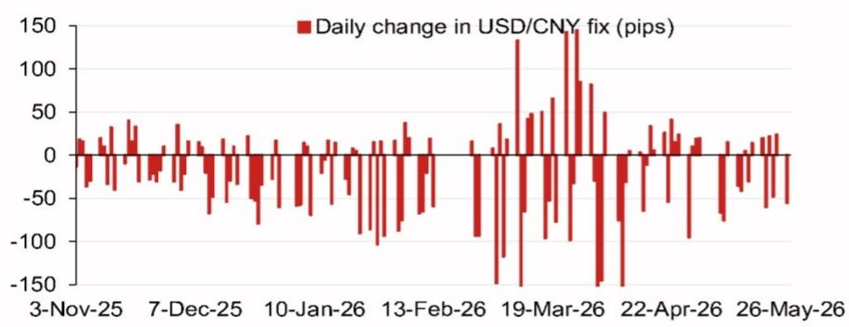
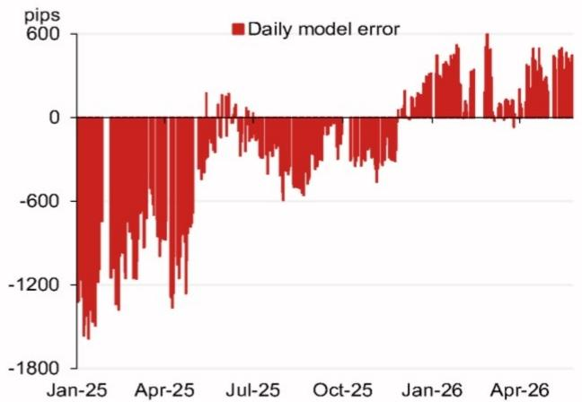

# The PBOC Is Not Letting the Renminbi Float Freely — And That Signal Matters More Than the Fix Level Itself

A single number in a central bank’s daily fixing can tell you more about state intent than a dozen policy statements. On 26 May 2026, the PBOC set the USD/CNY central parity rate at a level that, according to a global investment bank’s proprietary model, was nearly 500 pips lower than the previous day’s projection. The headline number was 6.7827. The model, which strips out the so-called counter-cyclical factor, had projected 6.8318. The actual fix landed 491 pips below that neutral estimate. Even after including the counter-cyclical factor, the fix was still 284 pips below the prior day’s official close.

For most market participants, the immediate reaction is to ask: Is the renminbi strengthening or weakening? That is the wrong question. The right question is: What is the PBOC signalling about its tolerance for depreciation, and how should investors position for the next six months?

The answer is not about the level of the fix. It is about the gap between the model and the actual fix — and what that gap reveals about the central bank’s evolving strategy. When the PBOC deliberately sets a fix far below what a transparent, rules-based model would produce, it is not making a technical adjustment. It is making a political statement about the boundaries of acceptable renminbi weakness. Investors who ignore this signal and focus only on the spot rate will miss the most important strategic insight in the entire foreign exchange market today.

This article unpacks what the fix model actually reveals, why the counter-cyclical factor is the most important variable to watch, and how sophisticated investors should build a decision framework around central bank signalling rather than around spot price forecasts. The analysis draws on a detailed research report from a leading Asia FX strategy team, but extends the logic to second-order implications that the report does not fully explore.

## The Fix Model Reveals That the PBOC Is Actively Managing Depreciation Expectations, Not Just the Exchange Rate

The core analytical insight from the research report is not the fix level itself, but the decomposition of what drives the fix. The model projects a neutral fix of 6.7827 based on a basket of currency movements, primarily driven by the Korean won, the Turkish lira, the Russian ruble, and the Australian dollar. The top four weighted contributors — KRW, TRY, RUB, and AUD — collectively explain most of the projected change. The KRW contributes 5 pips upward, the TRY contributes 2.5 pips upward, while the RUB and AUD contribute 4 and 5 pips downward respectively.

This is not random. The PBOC’s fixing mechanism is designed to reflect a basket of trading partner currencies, but the actual fix is never purely mechanical. The counter-cyclical factor — a discretionary adjustment that the PBOC introduced in 2017 and has used intermittently since — allows the central bank to override the model when it judges that market forces are pushing the currency in a direction inconsistent with broader economic or political objectives.

The key observation is that the actual fix with the counter-cyclical factor applied is 6.8034, which is 284 pips lower than the previous fix. But the neutral model — without the counter-cyclical factor — would have produced a fix of 6.7827, which is 491 pips lower than the previous neutral projection. The difference between these two numbers — 207 pips — is the counter-cyclical factor itself. That means the PBOC is using the counter-cyclical factor to push the fix higher than the neutral model would suggest, but still lower than the previous day’s level.

Why does this matter? Because it tells you that the PBOC wants the renminbi to weaken, but only slowly and in a controlled manner. The central bank is not fighting depreciation; it is managing the pace of depreciation. The counter-cyclical factor is being used to slow the speed of decline, not to reverse it. This is a fundamentally different signal from what many market participants expect. The conventional wisdom is that the PBOC will defend the renminbi at all costs. The data suggests otherwise: the PBOC is willing to let the currency weaken, but it wants to avoid triggering a self-fulfilling panic.

For investors, this means that betting on a sharp renminbi depreciation is risky because the PBOC will intervene to smooth the move. But betting on a stable renminbi is equally risky because the central bank is clearly signalling a gradual depreciation path. The optimal strategy is to position for a slow grind lower, with periodic interventions that create short-term reversals.

## The Model Error History Shows That the PBOC Has Changed Its Tolerance for Deviation, and the Pattern Is Not Random

The research report provides a time series of daily model errors — the difference between the neutral model projection and the actual fix — from January 2025 through April 2026. The pattern is striking. In January 2025, the model error was negative 1,800 pips. By April 2025, it had narrowed to negative 1,200 pips. By July 2025, it was essentially zero. Then it turned positive, reaching 600 pips in both January and April 2026.

What does this pattern mean? A negative model error means the actual fix was lower than the neutral model projection — the PBOC was setting the fix weaker than the basket would suggest. A positive model error means the opposite: the PBOC was setting the fix stronger than the basket would suggest.

The trajectory from large negative errors in early 2025 to zero in mid-2025 to positive errors in early 2026 tells a clear story. In early 2025, the PBOC was actively pushing the renminbi weaker, using the fix to accelerate depreciation. By mid-2025, it had achieved its desired level and allowed the fix to align with the model. By early 2026, the PBOC was actively pushing the renminbi stronger, using the fix to resist depreciation pressure.

But here is the critical point: the most recent data point — 26 May 2026 — shows a model error of negative 491 pips when excluding the counter-cyclical factor, and negative 284 pips when including it. That means the PBOC has shifted back to a weakening bias. The model error has swung from positive 600 pips in April 2026 to negative 284 pips in May 2026 — a swing of nearly 900 pips in one month.

This is not a routine adjustment. It is a deliberate policy shift. The PBOC is signalling that it now sees renminbi weakness as desirable or at least acceptable, and it is using the fixing mechanism to communicate that view. The question is why.

Several plausible explanations exist, but the research report does not definitively answer them. One possibility is that the PBOC is responding to a deteriorating export outlook. Another is that it is pre-positioning for a period of heightened geopolitical uncertainty — note the calendar of events in the report, which includes a potential Xi-Trump meeting towards the end of 2026. A third possibility is that the PBOC is simply following the broader dollar trend, allowing the renminbi to weaken along with other Asian currencies.

The report leaves these questions open, which is intellectually honest. But for investors, the implication is clear: the PBOC has changed its stance, and the burden of proof is now on those who believe the renminbi will strengthen.

## The Calendar of Events Reveals a Sequence of Political Deadlines That Will Constrain PBOC Flexibility

The research report includes a calendar of key events from late July 2026 through the end of the year. This is not a throwaway appendix. It is a roadmap for understanding when the PBOC will have the most and least flexibility to manage the renminbi.

The sequence is as follows: the Politburo meeting for economic work in late July, the National Day Golden Week holiday in early October, the APEC summit in Shenzhen in November, the Central Economic Work Conference in mid-December, another Politburo meeting in late December, and a potential Xi-Trump meeting towards the end of the year.

Each of these events creates a different set of constraints. Before the July Politburo meeting, the PBOC may want to project an image of stability. During the Golden Week holiday, market liquidity will be thin, and the PBOC may avoid large moves. Before the APEC summit, the PBOC may want to avoid any perception of competitive devaluation. Before the Central Economic Work Conference, the PBOC may want to keep the currency stable to avoid distracting from domestic policy discussions. And before a potential Xi-Trump meeting, the PBOC may want to avoid any currency moves that could be interpreted as a negotiating tactic.

The implication is that the PBOC’s room to manoeuvre will shrink and expand in predictable patterns. The most likely periods for active depreciation management are between the July Politburo meeting and the Golden Week holiday, and between the Central Economic Work Conference and the end of the year. The most likely periods for stability are immediately before major political events.

Investors who ignore this calendar are trading blind. The PBOC is not a mechanical actor. It is a political institution that responds to political incentives. The calendar tells you when those incentives will shift.

## What the Report Does Not Fully Answer: The Counter-Cyclical Factor Remains a Black Box, and Its Future Direction Is the Most Important Unknown

For all its analytical rigour, the research report leaves one critical question unanswered: what drives the PBOC’s decision to adjust the counter-cyclical factor? The report models the factor as a residual — the difference between the actual fix and the neutral model projection. But it does not provide a predictive framework for when the PBOC will increase or decrease the factor.

This is not a criticism of the report. The counter-cyclical factor is deliberately opaque. The PBOC has never fully disclosed the formula, and it changes the weightings based on factors that are not publicly observable. The report’s analysts are doing the best they can with the available data.

But for investors, this opacity creates a significant risk. If the counter-cyclical factor can swing by 900 pips in one month, then any position based on a directional view of the renminbi is subject to sudden and unpredictable reversals. A trader who is short the renminbi based on the May 2026 fix data could be caught off guard if the PBOC decides in June to increase the counter-cyclical factor and push the fix higher.

The report’s model errors chart provides some historical context, but it does not provide a forward-looking signal. The best investors can do is to monitor the model error on a daily basis and adjust positions accordingly. But that is a reactive strategy, not a predictive one.

This is where the report’s analytical framework is most valuable. By forcing investors to think about the fix as a combination of a neutral model and a discretionary adjustment, the report makes it clear that the discretionary adjustment is the only thing that matters for short-term trading. The neutral model is predictable. The counter-cyclical factor is not. The entire game is about predicting the PBOC’s discretionary behaviour.

## A Decision Framework for Investors: How to Read the Fix Signal and Adjust Positioning

Given the analytical framework from the report, investors need a structured approach to interpreting the fix data and translating it into actionable decisions. The following framework is based on the report’s logic but extends it into a practical decision tool.

First, monitor the model error on a daily basis. The report provides the methodology for calculating the neutral model projection. Investors should replicate this calculation or subscribe to a service that does so. The key metric is the difference between the actual fix and the neutral model projection, both with and without the counter-cyclical factor.

Second, classify the PBOC’s stance into one of three regimes: weakening bias (negative model error), neutral (model error near zero), or strengthening bias (positive model error). The regime determines the direction of your core positioning. In a weakening bias regime, favour long USD/CNY positions. In a strengthening bias regime, favour short USD/CNY positions. In a neutral regime, reduce position size and wait for clearer signals.

Third, assess the magnitude of the model error relative to historical norms. The report shows that model errors have ranged from negative 1,800 pips to positive 600 pips over the past 18 months. A model error of negative 284 pips is moderate by historical standards. It suggests a weakening bias, but not an extreme one. Investors should adjust position sizing accordingly: larger positions for extreme errors, smaller positions for moderate errors.

Fourth, overlay the political calendar. Before major political events, assume the PBOC will prioritise stability and reduce the counter-cyclical factor. After major political events, assume the PBOC may have more room to adjust the fix in either direction. The most dangerous period for a directional renminbi trade is immediately before a high-stakes political meeting, because the PBOC can and will surprise the market.

Fifth, use the counter-cyclical factor as a contrarian indicator. When the factor is large and positive (pushing the fix stronger), it suggests the PBOC is fighting depreciation pressure. That pressure will eventually reassert itself, creating an opportunity to short the renminbi. Conversely, when the factor is large and negative (pushing the fix weaker), it suggests the PBOC is comfortable with depreciation. That comfort may not last, creating an opportunity to go long the renminbi.

This framework is not a mechanical trading system. It requires judgment and constant monitoring. But it is far more sophisticated than simply looking at the spot rate and guessing where it will go next.

## The Unresolved Questions That Make This Report Essential Reading

The research report is valuable not because it provides all the answers, but because it forces investors to ask the right questions. Several of those questions remain unresolved, and they are precisely the questions that will determine whether a renminbi trade succeeds or fails over the next six months.

First, what is the PBOC’s ultimate target for the renminbi? The report does not provide a specific level, and it would be irresponsible to guess. But the model error pattern suggests that the PBOC has a zone of comfort, not a single target. The question is where that zone is, and how wide it is.

Second, how will the PBOC respond if the renminbi weakens too quickly? The report shows that the PBOC uses the counter-cyclical factor to slow depreciation, but it does not say at what threshold the PBOC will shift from slowing depreciation to actively reversing it. That threshold is the single most important unknown in the entire renminbi market.

Third, what is the relationship between the fix and the offshore CNH market? The report focuses exclusively on the onshore CNY fixing. But the offshore CNH market often trades at a premium or discount to the onshore rate, and that premium or discount contains information about market expectations. The report does not explore this linkage, but it is essential for any investor trading CNH.

Fourth, how will the PBOC’s stance evolve as the US presidential election approaches? The calendar includes a potential Xi-Trump meeting towards the end of 2026. The renminbi has been a flashpoint in US-China relations for years, and any major move in the currency could become a political issue. The PBOC may be constrained not just by domestic political considerations, but by the need to avoid provoking a US response.

These questions are not answerable from the report alone. They require additional analysis, market intelligence, and judgment. But the report provides the analytical foundation for asking them, and that is its greatest value.

Join the community to read the full report and review the original charts. The detailed model outputs, the historical error analysis, and the calendar of events are essential for any serious investor who wants to understand the renminbi market. The summary above captures the key insights, but the full report contains the data and methodology that make those insights actionable.

*This article is for learning and discussion only and does not constitute investment advice.*

Personal reading notes and learning share only. Not investment advice.

