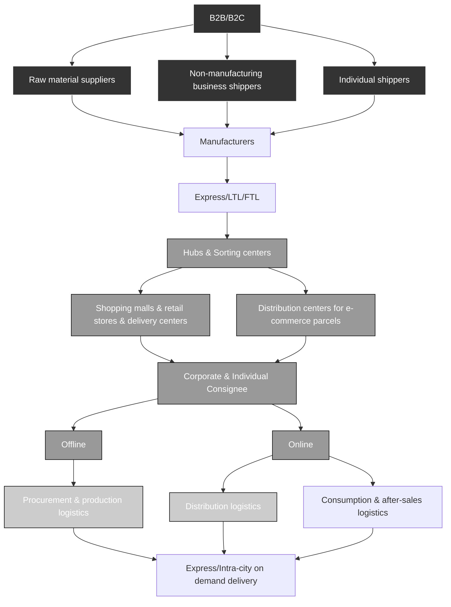
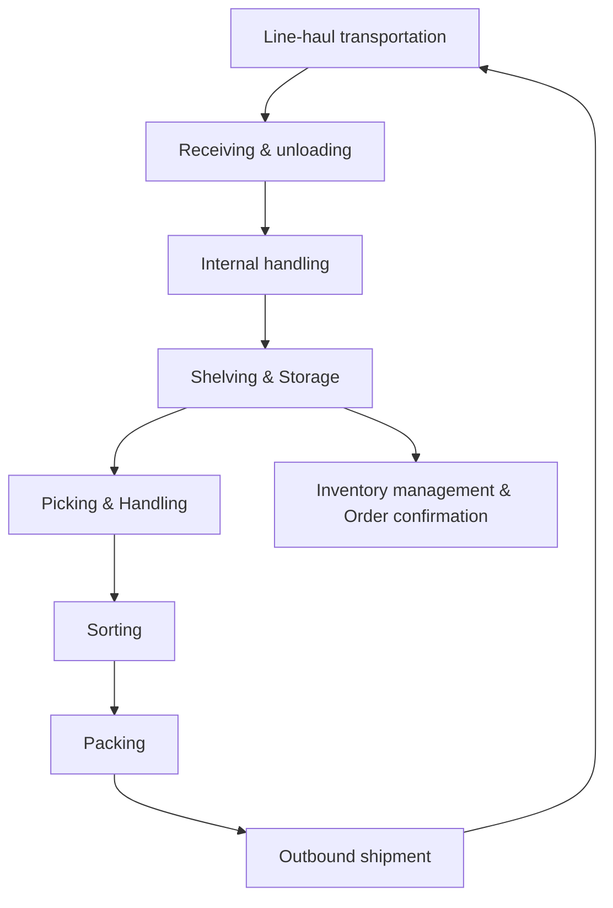

你是麦肯锡/投研风格的微信公众号财经文章主笔，擅长用金字塔原理把研报内容转化为“有主张、有层次、有洞察、但仍保留完整报告阅读欲望”的长文。

【目标】
- 基于下面的研报解析内容，写一篇微信公众号文章 Markdown。
- 风格：稳重、专业、克制、有洞察，像咨询公司合伙人写给高净值读者/产业决策者的研报导读。
- 长度：约 3000 字，允许上下浮动 15%。
- 不要使用 emoji。
- 可以基于报告内容做适度发散，但必须是从原文逻辑推出的判断，不要编造数据、公司动作或引用。
- 不要把研报所有正文内容讲完，要留下明确但自然的伏笔，让读者愿意加入社群阅读完整报告。

【金字塔原理写作原则】
1. 结论先行：文章开头先回答“这份报告最值得看的判断是什么”，而不是介绍背景。
2. 统领思想：全文只能服务一个主判断，避免变成摘要合集。
3. 纵向回答：每一层都要回答上一层提出的“为什么”或“所以呢”。
4. 横向 MECE：每个一级小节必须彼此独立、共同支撑主判断，避免重叠。
5. Synthesis over summary：不要复述报告段落，要提炼“这些事实合在一起意味着什么”。
6. So what：每个小节末尾必须落到对行业、公司、竞争格局、资产定价或读者观察框架的含义。
7. Action title：所有 `##` 小标题必须是“直接讲述洞察的完整句子”，不能是目录标签。

【标题与小标题硬性要求】
- `# 标题` 必须直接表达一个判断，例如“市场真正低估的不是需求，而是供给侧的再定价”。
- 禁止使用以下机械标题：
  - 一、核心判断
  - 二、真正重要的是结构性变量
  - 三、报告没有说透
  - 四、对读者的启发
  - 关键变化
  - 投资启示
  - 总结
- 所有 `##` 标题都要像麦肯锡报告里的 action title：读完标题就知道这一节结论。
- 小标题可以带序号，但序号后必须是一句洞察，例如：`## 1. 这轮变化真正考验的是企业能否把规模转化为议价权`。

【建议结构，但不要机械照抄标题】
1. `# 标题`：一句主判断，不超过 32 字。
2. 开头 4-6 段：直接给出主判断、为什么现在重要、报告提供了什么新信号。
3. 4-6 个 `##` 小节：每个小节标题都是洞察句，不是栏目名。
4. 至少一个小节讨论“报告尚未完全回答的关键问题”，但标题也要是洞察句。
5. 至少一个小节给出读者的观察框架，但不要命名为“对读者的启发”。
6. 文末自然承接未解问题，引导读者加入社群/微信群继续讨论。不要照抄固定话术，请基于本文未解问题每次重新写一段自然 CTA；语义可以参考：欢迎来星球微信群里继续讨论。
7. 在免责声明前，单独插入这张图片链接：``
8. 结尾只输出英文灰色免责声明：`
Personal reading notes and learning share only. Not investment advice.
`

【hook 要求】
- 不要硬插“加入社群”。
- hook 应该来自正文自然出现的未解问题，比如：关键假设尚未验证、竞争优势仍需拆解、图表背后的二阶影响没有展开。
- 文末 CTA 要像“顺着这些未解问题继续读完整报告/继续讨论”，不是广告口吻。
- CTA 必须每篇重新写，不能固定输出“加入社群，领取完整研报解读与原始图表”。可以类似“欢迎来星球微信群里继续讨论”。

【图片要求】
- 不要主动生成 MinerU 图片 markdown；系统会在文章生成后自动插入 MinerU 原始图片。
- 但文末免责声明前必须保留知识星球图片：``。

【内容边界】
- 只能基于研报原文和解析结果推导，不要编造数据、公司动作、引用。
- 遇到不确定内容，要用“这里仍需验证”“报告没有完全展开”等表达。
- 避免“震惊”“爆款”“一文看懂”等浮夸表达。
- 不要出现小红书话题标签。
- 不要出现 emoji。
- 默认避免出现具体投行品牌名，比如“GS”“GS”，统一写作“投行研报”。
- 不要解释你的思考过程，不要输出多余说明。

【研报解析内容】
"""
# Asia Industrial Technology and Asia Emerging Robotics

# Humanoid robots: The road toward attractive ROI in warehouses

Jay Huang, Ph.D.

+852 2123 2631

jay.huang@bernsteinsg.com

Dien Wang, Ph.D.

+852 2123 2622

dien.wang@bernsteinsg.com

Robin Zhu

+852 2123 2659

robin.zhu@bernsteinsg.com

Min-Joo Kang

+852 2123 2644

minjoo.kang@bernsteinsg.com

Weibin Liang, Ph.D.

+852 2123 2666

weibin.liang@bernsteinsg.com

Charles Gou

+852 2123 2618

charles.gou@bernsteinsg.com

Hyrum Caesar

+81 3 6777 6979

hyrum.caesar@bernsteinsg.com

Investors have questioned the lack of practical applications for humanoid robots. As discussed in our previous report (here), we see killer applications emerge. In this note, we show that the payback period of humanoid robots for warehouse applications is around 3 years today and can be shortened to <1 year in both China and the western countries relatively soon with volume induced reduction of robot price. This will remove a critical hurdle for mass adoption.

Warehouse is a consensus field of humanoid early adoption. Even as humanoid technology remains imperfect and continues to improve, warehouse pilot projects have been actively underway (Exhibit 1). More than 20 humanoid players are active in this field (Exhibit 2), focusing on material handling and sorting, with partners, including Amazon, GXO, and SF Express, in e-commerce, logistics, and manufacturers' warehouses.

Why warehouse? We see three key reasons: 1) Humanoid robots cannot yet handle generalized tasks in open environments very well. Warehouse tasks (e.g. material handling, pick-and-place, sorting) are less complex than in manufacturing and households, and the structured environment makes a natural starting point (Exhibit 4 and Exhibit 5). 2) the automation demand of relatively standardized tasks is abundant in warehouses, making it easier for successful pilot projects to scale up; and 3) warehousing offers a clear pathway into broader logistics (Exhibit 3), especially last-mile delivery, which represents a highly attractive market.

Humanoid robots vs. existing warehouse automation. Warehouse automation has long been in demand (Exhibit 7 and Exhibit 8), leading to the deployment of various equipment (Exhibit 6) such as industrial robots, mobile robots (AGVs, AMRs), sorters, conveyors, AS/RS. However, adoption is heterogeneous, and many warehouses still operate at low automation levels and many workers still remain in even the most automated ones. Humanoid robots offer greater flexibility than conventional solutions to potentially fill in the automation gaps, especially in loading/unloading, sorting, and packaging.

ROI estimate. There are still technological and process hurdles for broader deployment, but cost is no longer a major concern. Given the different labor costs and robot prices (Exhibit 10 to Exhibit 14), we assess China and the U.S. separately (Exhibit 15 to Exhibit 20). Based on current industry progress (\~75% of human worker efficiency + current robot prices), the payback period is about 3.3 years in China and 2.9 years in the U.S. If robotic efficiency reaches human parity, and unit prices fall by 50% to USD 25K in China and USD 75K in the U.S., the payback period will be reduced to 0.8 years in China and 0.7 years in the U.S., a very attractive ROI for large-scale adoption in warehouses.

# DETAILS

EXHIBIT 1: Humanoid robots work in warehouses: material handling and sorting   

natural_image

Industrial robot arm operating in a factory setting with yellow structural components (no visible text or symbols)

Agility Robotics

natural_image

Robot in a warehouse carrying cardboard boxes on pallets (no visible text or symbols)

Apptronik

natural_image

Robot in a warehouse-like environment with stacked boxes and metal shelving (no visible text or symbols)

Boston Dynamics

natural_image

Human robot handling packages in a warehouse (no visible text or symbols)

Figure

natural_image

Robot in a warehouse handling packages, no visible text or symbols on the robot or background

RobotEra

text_image

物流作业场景
AGIBOT
1 复刻
马物流中心

AgiBot   
Source: Agility Robotics, Appronik, Boston Dynamics, Figure, RobotEra, AgiBot, Bernstein analysis

EXHIBIT 2: >20 humanoid players are exploring the potential of humanoid robots in warehouses 

<table><tr><td rowspan="2">Company</td><td rowspan="2">Region</td><td rowspan="2">Ticker</td><td colspan="2">Warehouse tasks</td><td rowspan="2">Customers for humanoid robots in warehouses</td></tr><tr><td>Handling</td><td>Sorting</td></tr><tr><td>Agility Robotics</td><td>USA</td><td>Private</td><td>✓</td><td></td><td>GXO, Amazon, Toyota</td></tr><tr><td>Apptronik</td><td>USA</td><td>Private</td><td>✓</td><td>✓</td><td>Jabil</td></tr><tr><td>Boston Dynamics</td><td>USA</td><td>Subsidiary of Hyundai Motor Group</td><td>✓</td><td></td><td>Amazon</td></tr><tr><td>Figure</td><td>USA</td><td>Private</td><td>✓</td><td>✓</td><td></td></tr><tr><td>1X Technologies</td><td>USA</td><td>Private</td><td>✓</td><td></td><td></td></tr><tr><td>Reflex Robotics</td><td>USA</td><td>Private</td><td>✓</td><td></td><td>GXO</td></tr><tr><td>Kinisi Robotics</td><td>USA</td><td>Private</td><td>✓</td><td></td><td></td></tr><tr><td>Humanoid</td><td>UK</td><td>Private</td><td>✓</td><td></td><td>Siemens</td></tr><tr><td>Oversonic Robotics</td><td>Italy</td><td>Private</td><td>✓</td><td></td><td></td></tr><tr><td>Mentee Robotics</td><td>Israel</td><td>Private</td><td>✓</td><td></td><td></td></tr><tr><td>Rainbow Robotics</td><td>South Korea</td><td>277810.KS</td><td>✓</td><td></td><td>CJ Logistics</td></tr><tr><td>VinMotion</td><td>Vietnam</td><td>Subsidiary of Vingroup</td><td>✓</td><td></td><td></td></tr><tr><td>AgiBot</td><td>China</td><td>Private</td><td>✓</td><td>✓</td><td>Damon</td></tr><tr><td>UBTech</td><td>China</td><td>9880.HK</td><td>✓</td><td>✓</td><td>BYD, Foxconn, Rossmann</td></tr><tr><td>RobotEra</td><td>China</td><td>Private</td><td>✓</td><td>✓</td><td>SF Express, China Post</td></tr><tr><td>Geek+</td><td>China</td><td>2590.HK</td><td>✓</td><td></td><td>A global customer</td></tr><tr><td>Dobot</td><td>China</td><td>2432.HK</td><td>✓</td><td></td><td></td></tr><tr><td>Galbot</td><td>China</td><td>Private</td><td>✓</td><td></td><td></td></tr><tr><td>LimX Dynamics</td><td>China</td><td>Private</td><td>✓</td><td></td><td></td></tr><tr><td>PaXini</td><td>China</td><td>Private</td><td>✓</td><td>✓</td><td></td></tr><tr><td>Kepler</td><td>China</td><td>Pricate</td><td>✓</td><td></td><td></td></tr><tr><td>Leju Robot</td><td>China</td><td>Private</td><td>✓</td><td></td><td></td></tr><tr><td>Standard Robots</td><td>China</td><td>Private</td><td>✓</td><td></td><td></td></tr></table>

Source: Company websites, industry news, Bernstein analysis

EXHIBIT 3: Illustration of logistic process   

flowchart

Source: SF Holding Prospectus, Frost & Sullivan, Bernstein analysis

EXHIBIT 4: Workflow in warehouses   

flowchart

Source: Logclub, Logistics Business, Niutong Logistics, Logistics salon, Changjiang Daily, Bernstein analysis

EXHIBIT 5: Warehouses with different automation levels   

natural_image

Overhead view of a large warehouse with workers sorting packages on pallets and shipping containers (no visible text or signage)

Low automation level

natural_image

Interior view of a large automated warehouse with conveyor systems and workers in green uniforms (no visible text or symbols)

High automation level   
Source: The Break-down, Addverb, Bernstein analysis

EXHIBIT 6: Typical solutions for warehouse automation 

<table><tr><td rowspan="6">Existing solutions</td><td>Solutions</td><td>Functions</td><td colspan="4">Examples of typical equipment</td></tr><tr><td>Mobile robots (incl. AMR, AGV)</td><td>Warehouse operations including goods or shelf handling, autonomous picking, and parcel sorting</td><td>Underride</td><td>Bin-handling</td><td>Autonomous forklift</td><td>RollerTop</td></tr><tr><td>Robotic arms</td><td>Repetitive tasks like loading/unloading, palletizing, and sorting</td><td>Palletizing</td><td colspan="2">Loading &amp; unloading</td><td>Sorting</td></tr><tr><td>Sorting systems</td><td>High-throughput and continuous sorting</td><td>Cross-belt sorter</td><td colspan="2">Linear sorter</td><td>Wheel sorter</td></tr><tr><td>Automated storage &amp; retrieval systems (AS/RS)</td><td>AS/RS, mainly for storage, are used for automatically storing and retrieving goods in a warehouse</td><td>AS/RS</td><td colspan="2">Stacker cranes</td><td>Shuttle robot</td></tr><tr><td>Conveyor</td><td>Conveyors transports goods quickly and continuously within a warehouse</td><td colspan="2">Belt conveyor</td><td colspan="2">Roller conveyor</td></tr><tr><td>Future solution</td><td>Humanoid robots</td><td>General-purpose warehouse worker</td><td>Handling</td><td colspan="2">Sorting</td><td>Packing</td></tr></table>

Note: AMR refers to autonomous mobile robot; AGV refers to automated guided vehicle; AS/RS refers to automated storage and retrieval system  
Source: China Insights Consultancy, Suzhou Kuaijie, GoASRS, M Force Machinery, FANUC, Shenzhen Dongchang Automation Equipment, Nanjing Auto Electric, Bluesky Intelligence, Xiayun Machinery, Apptronik, Figure, AgiBot, Bernstein analysis

EXHIBIT 7: Global warehouse automation solution market size and penetration rate   
Global warehouse automation solution market size and penetration rate, 2020-2029E   

bar_line

| Year   | Market size (USD, bn) | Penetration rate |
| ------ | --------------------- | ---------------- |
| 2020   | 44                    | 18%              |
| 2021   | 59                    | 18%              |
| 2022   | 66                    | 20%              |
| 2023   | 66                    | 21%              |
| 2024   | 65                    | 23%              |
| 2025E  | 74                    | 24%              |
| 2026E  | 84                    | 25%              |
| 2027E  | 94                    | 26%              |
| 2028E  | 104                   | 27%              |
| 2029E  | 115                   | 29%              |

Note: The penetration rate of warehouse automation solutions is defined as the proportion of warehouses globally that have adopted any automation solution, relative to the total number of warehouses worldwide.   
Source: Geek+ prospectus, Modern Materials Handling, CIC, Bernstein analysis and estimates

EXHIBIT 8: Warehouse automation market breakdown by solutions in 2024   
Global warehouse automation market in 2024 (total market size USD65bn)   

pie

| Category | Percentage (%) |
| :--- | :--- |
| AS/RS | 26 |
| Conveyors | 19 |
| Sorting belts | 18 |
| AMRs | 8 |
| Others | 29 |

Note: AS/RS refers to automated storage and retrieval system; AMR refers to autonomous mobile robot.   
Source: Geek+ prospectus, Bernstein analysis

EXHIBIT 9: Barriers to adopting and implementing warehouse automation   
What do you consider to be the biggest barriers to adopting and implementing warehouse AS/RS system in your organization?   

bar

| Category | Value (%) |
|---|---|
| Complicated and lengthy implementation process | 26 |
| Additional time needed to onboard and retrain staff | 24 |
| Existing software won't integrate easily | 22 |
| Lack of internal IT resources/skills to maintain and operate new systems | 22 |
| Retrun on investment would take too long | 21 |
| Budget for initial CAPEX (large upgront investment) | 21 |
| High unplanned downtime and disruption to operations | 20 |

Note: AS/RS refers to automated storage and retrieval system. This is a survey-based data, the sample size is 336. The survey interviewed a diverse group of decision-makers from across the global warehousing and fulfillment industry.   
Source: AutoStore, Bernstein analysis

EXHIBIT 10: US warehousing & storage labor demand has grown over the past decade   
US warehousing & storage total employees (2014-2024)   

line

| Year | Value (Thousand) |
| :--- | :--- |
| 2014 | 727 |
| 2015 | 808 |
| 2016 | 909 |
| 2017 | 1,006 |
| 2018 | 1,146 |
| 2019 | 1,214 |
| 2020 | 1,418 |
| 2021 | 1,657 |
| 2022 | 1,902 |
| 2023 | 1,913 |
| 2024 | 1,941 |

Source: US Bureau of Labor Statistics (BLS), Bernstein analysis

EXHIBIT 11: The U.S. warehousing and storage workforce is shifting toward fulfillment-driven roles   

bar_stacked

US warehousing & storage employees breakdown (2014-2024)
| Year | Material Movers (%) | Stockers and Order Fillers (%) | Truck and Tractor Operators (%) | Shipping, Receiving & Inventory Clerks (%) | Heavy and Tractor-Trailer Truck Drivers (%) | Packers and Packagers, Hand (%) | Others (%) |
|---|---|---|---|---|---|---|---|
| 2014 | 26 | 8 | 13 | 5 | 5 | 5 | 0 |
| 2015 | 26 | 8 | 13 | 5 | 5 | 5 | 0 |
| 2016 | 28 | 8 | 14 | 5 | 5 | 5 | 0 |
| 2017 | 27 | 8 | 15 | 5 | 5 | 5 | 0 |
| 2018 | 29 | 9 | 16 | 5 | 5 | 5 | 0 |
| 2019 | 25 | 15 | 16 | 5 | 5 | 5 | 0 |
| 2020 | 23 | 19 | 15 | 5 | 5 | 5 | 0 |
| 2021 | 20 | 20 | 19 | 5 | 5 | 5 | 0 |
| 2022 | 22 | 22 | 17 | 5 | 5 | 5 | 0 |
| 2023 | 23 | 24 | 15 | 5 | 5 | 5 | 0 |
| 2024 | 23 | 21 | 17 | 5 | 5 | 5 | 0 |

Note: Material Movers refer to “Laborers and Freight, Stock, and Material Movers, Hand”, Stockers and Order Fillers refer to “Laborers receiving, storing, and issuing items from warehouse to fill shelves or customers' orders”, Truck and Tractor Operators refer to “Industrial Truck and Tractor Operators”
Source: US Bureau of Labor Statistics (BLS), Bernstein analysis

EXHIBIT 12: The U.S.: Rising wages have increased labor costs in warehouses   

line

Average annual wage of US warehousing & storage employees (2014-2024)
| Year | Material Movers ($) | Stockers and Order Fillers ($) | Truck and Tractor Operators ($) | All Occupations ($) |
|---|---|---|---|---|
| 2014 | 30000 | 32500 | 32800 | 37500 |
| 2015 | 30300 | 33000 | 33200 | 38000 |
| 2016 | 30600 | 32500 | 33500 | 38500 |
| 2017 | 31300 | 32800 | 35500 | 39200 |
| 2018 | 32700 | 33500 | 36200 | 40200 |
| 2019 | 33500 | 34500 | 37800 | 41200 |
| 2020 | 34500 | 35500 | 39000 | 41800 |
| 2021 | 36800 | 38200 | 41800 | 43800 |
| 2022 | 40800 | 42200 | 44800 | 47500 |
| 2023 | 42200 | 43800 | 48200 | 50200 |
| 2024 | 44100 | 44800 | 50100 | 52500 |

Note: Material Movers refer to “Laborers and Freight, Stock, and Material Movers, Hand”, Stockers and Order Fillers refer to “Laborers receiving, storing, and issuing items from warehouse to fill shelves or customers' orders”, Truck and Tractor Operators refer to “Industrial Truck and Tractor Operators”
Source: US Bureau of Labor Statistics (BLS), Bernstein analysis

EXHIBIT 13: China logistics

[中间内容因长度限制已省略]

 learning or artificial intelligence system, or as a prompt or input into any such system. You also may not, without Bernstein's express written consent, do any of the foregoing in connection with your own internal machine learning or artificial intelligence system.

Bernstein may use artificial intelligence tools in the preparation of its materials. Any such materials are reviewed by Bernstein's research analysts prior to publication.

This report has been prepared for information purposes only and is based on current public information that we consider reliable, but the entities noted herein do not warrant or represent (express or implied) as to the sources of information or data contained herein are accurate, complete, not misleading or as to its fitness for the purpose intended even though the entities noted herein rely on reputable or trustworthy data providers, it should not be relied upon as such. Opinions expressed are the author(s)' current opinions as of the date appearing on the material only and we do not undertake to advise you of any change in the reported information or in the opinions herein.

This publication was prepared and issued by the entity referred to herein for distribution to eligible counterparties or professional clients. The information in this report is intended for general circulation and does not constitute an offer to buy or sell any security, investment, legal or tax advice nor a personal recommendation, as defined by any of the aforementioned regulators. It does not take into account the particular investment objectives, financial situations, or needs of individual investors. The report has not been reviewed by any of the aforementioned regulators and does not represent any official recommendation from the aforementioned regulators. The investments referred to herein may not be suitable for you. Investors must make their own investment decisions in consultation with advice sought from a financial adviser regarding the suitability of the investment product, taking into account the specific investment objectives, financial situation or particular needs of any recipient of the recommendation, before the recipient makes a commitment to purchase the investment product.

The analysis contained herein is based on numerous assumptions. Different assumptions could result in materially different results. The information in this report does not constitute, or form part of, any offer to sell or issue, or any offer to purchase or subscribe for shares, or to induce engage in any other investment activity. The value of any securities or financial instruments mentioned in this report may fluctuate subject to market conditions. Information about past performance of an investment is not necessarily a guide to, indicative of, or assurance of future performance. Estimates of future performance mentioned by the research analyst in this report are based on assumptions that may not be realized due to unforeseen factors like market volatility/fluctuation. In relation to securities or financial instruments denominated in a foreign currency other than the clients' home currency, movements in exchange rates will have an effect on the value, either favorable or unfavorable. Before acting on any recommendations in this report, recipients should consider the appropriateness of investing in the subject securities or financial instruments mentioned in this report and, if necessary, seek for independent professional advice.

The securities described herein may not be eligible for sale in all jurisdictions or to certain categories of investors where that permission profile is not consistent with the licenses held by the entities noted herein. This document is for distribution only as may be permitted by law. It is not directed to, or intended for distribution to or use by, any person or entity who is a citizen or resident of or located in any locality, state, country or other jurisdiction where such distribution, publication, availability or use would be contrary to law or regulation or would subject the entities noted herein to any regulation or licensing requirement within such jurisdiction.

Source: Bloomberg Index Services Limited. BLOOMBERG® is a trademark and service mark of Bloomberg Finance L.P. and its affiliates (collectively “Bloomberg”). Bloomberg or Bloomberg’s licensors own all proprietary rights in the Bloomberg Indices. Neither Bloomberg nor Bloomberg’s licensors approves or endorses this material, or guarantees the accuracy or completeness of any information herein, or makes any warranty, express or implied, as to the results to be obtained therefrom and, to the maximum extent allowed by law, neither shall have any liability or responsibility for injury or damages arising in connection therewith.

No part of this material may be reproduced, distributed or transmitted or otherwise made available without prior consent of the entities noted herein. Copyright Bernstein Institutional Services LLC Bernstein Autonomous LLP, BSG France S.A., Bernstein (Hong Kong) Limited 盛博香港有限公司, Bernstein (Canada) Limited, Bernstein (India) Private Limited (SEBI registration no. INH000006378), Bernstein (Singapore) Private Limited and Bernstein Japan KK (サンフォード・C・バーンスタイン株式会社). All rights reserved. The trademarks and service marks contained herein are the property of their respective owners. Any unauthorized use or disclosure is strictly prohibited. The entities noted herein may pursue legal action if the unauthorized use results in any defamation and/or reputational risk to the entities noted herein and research published under the Bernstein and Autonomous brands.
"""
