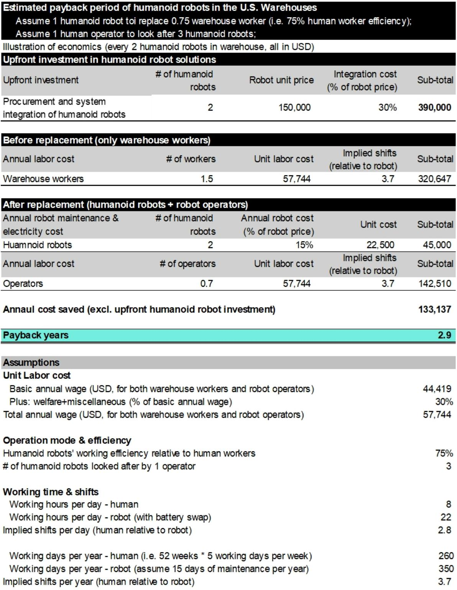
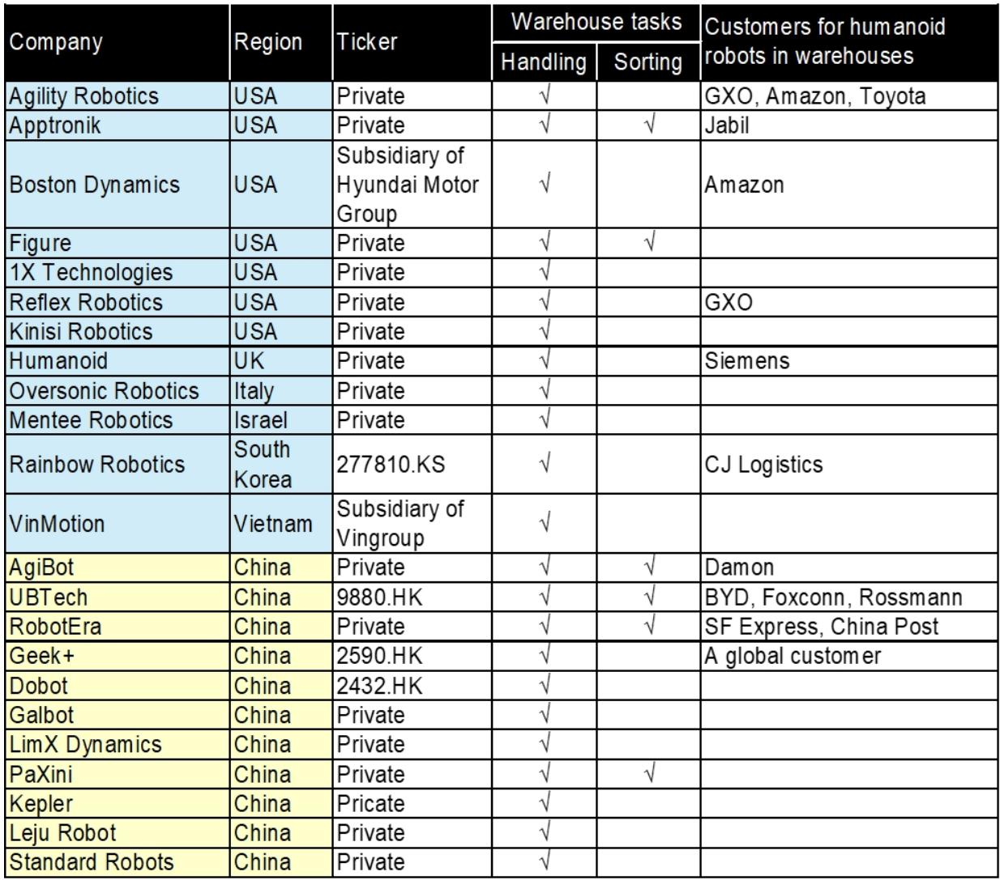
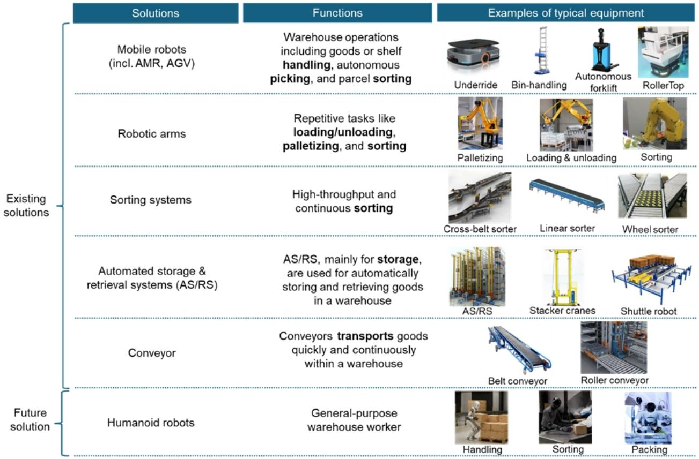

# 人形机器人在仓库的回报期已缩短至3年，规模量产将使其低于1年

关于人形机器人的商业化落地，市场一直存在一个核心疑问：这些昂贵的双足机器到底能用在哪里？一份来自某外资投行的最新研报给出了一个大胆且具体的答案——仓库。报告的核心判断是，人形机器人在仓库场景的经济账已经算得过来了。基于当前的技术效率和定价，其投资回报期约为3年。而随着量产带来的成本下降，这个周期在不久的将来有望缩短至1年以内。这意味着，阻碍人形机器人大规模部署的最后一道关键门槛——经济性——正在被拆除。

这份报告的价值不在于它描绘了一个宏大的未来图景，而在于它用具体的财务模型和场景分析，证明了“人形机器人+仓库”这个组合在商业上已经具备了可行性。对于产业决策者和投资者而言，真正需要关注的不是机器人能否学会走路，而是它们何时能以低于人工的成本，在仓库的流水线上稳定工作。

## 1. 仓库成为共识性落地场景，并非偶然的巧合

超过20家人形机器人公司正在探索仓库场景，这不仅包括美国的Agility Robotics、Figure、Boston Dynamics，也包括中国的宇树科技、智元机器人等。合作的客户名单涵盖了Amazon、GXO、顺丰速运等物流与电商巨头。这并非简单的概念验证，而是产业资本用真金白银做出的选择。

为什么是仓库？报告给出了三个逻辑层级清晰的原因。第一，人形机器人目前的技术能力尚无法胜任开放环境下的通用任务，而仓库是一个结构化的、任务相对标准化的场景。搬运、分拣、码垛这些工作，复杂度远低于家庭服务或精密制造。第二，仓库中存在大量重复、标准化、且劳动力需求旺盛的环节，这为机器人提供了充足的“就业岗位”，一旦验证成功，规模化复制相对容易。第三，仓库是物流链条的枢纽，从仓库切入，可以自然地向更广阔的物流场景延伸，尤其是最后一公里配送，这是一个更具想象力的市场。

这意味着，人形机器人的商业化路径不是“全能替代”，而是“定点突破”。仓库是这个突破点最现实的起点，因为它同时满足了技术可行、需求庞大、路径清晰三个条件。

## 2. 现有自动化方案无法填补的“夹缝”，正是人形机器人的机会

仓库自动化并非新鲜事物。从自动导引车到自动存取系统，从分拣带到机械臂，市场上已有大量成熟的自动化解决方案。然而，研报揭示了一个被忽视的事实：自动化渗透率仍然很低，且极不均衡。即使在最先进的自动化仓库中，仍有大量工人在工作。

这背后的原因在于，现有自动化设备是“专用工具”，每台设备只能完成特定任务。它们能高效地处理标准化的、重复性的工作，但在面对装卸、拆垛、包装等需要灵活性和适应性的任务时，就显得力不从心。而这些“夹缝”任务，恰恰构成了仓库中最大的劳动力需求。

人形机器人的核心价值在于“通用性”。它模仿人类形态，能够使用人类的工具，适应人类设计的空间，从而填补这些自动化设备无法覆盖的空白。它不是一个替代某个特定设备的解决方案，而是一个能够灵活应对多种任务的“通用工人”。这并非要取代所有的自动化设备，而是要在现有自动化体系中，补上最缺人、最不标准的那一块。

## 3. 经济账已经算清：3年回本，规模化后低于1年

这份研报最硬核的部分，是对中美两国仓库场景下人形机器人ROI的量化测算。报告基于当前行业进展，假设人形机器人能达到人类工人约75%的效率，并分别采用了中美两国当前的机器人售价和劳动力成本。

测算结果显示，在中国，投资一台人形机器人的静态回收期约为3.3年；在美国，这个数字约为2.9年。这个数字本身已经具备了初步的商业吸引力，尤其是考虑到机器人可以24小时不间断工作，且不存在招聘、培训、流失等人力管理成本。

更关键的是规模效应带来的成本下降。报告假设，当人形机器人的效率达到人类工人的100%，并且其单价在中国降至2.5万美元、在美国降至7.5万美元时，其投资回收期将分别缩短至0.8年和0.7年。这是一个极具诱惑力的数字，意味着不到一年就能收回全部投资成本。

这个测算的逻辑是清晰的：ROI的改善主要来自两个变量的共同作用——效率提升和成本下降。效率提升是技术迭代的必然结果，而成本下降则依赖于规模化生产。当前，这两个变量都处于加速改善的通道中。因此，报告判断，经济性不再是制约人形机器人大规模部署的核心障碍。

## 4. 报告尚未完全回答的关键问题：场景的“结构化红利”能持续多久？

尽管上述分析令人振奋，但报告也坦诚地指出了当前仍存在的技术和流程障碍。这些障碍并非不能克服，但它们的解决路径和速度，将直接影响上述ROI模型能否如期兑现。

一个值得深入思考的问题是：仓库场景的“结构化红利”能持续多久？当前人形机器人之所以能在仓库中工作，很大程度上是因为仓库本身的环境是高度结构化的——货架是固定的，通道是清晰的，任务是标准化的。但如果人形机器人大规模部署，仓库的物理布局和作业流程是否需要进行针对性改造？这种改造的成本由谁承担？如果改造是必要的，那么人形机器人相对于其他专用自动化方案的优势是否会被削弱？

另一个未被充分讨论的变量是软件生态和系统集成能力。人形机器人本身只是一个硬件平台，它需要与仓库管理系统、订单管理系统以及现有的自动化设备进行无缝对接。这种系统集成的复杂度和成本，往往被硬件成本所掩盖。报告提到了“现有软件无法轻松集成”是仓库自动化的主要障碍之一，人形机器人同样无法回避这个问题。

这意味着，未来的人形机器人竞争，可能不仅仅是硬件成本和运动能力的竞争，更是软件生态和行业解决方案能力的竞争。能够提供从硬件到软件、从部署到运维的一体化解决方案的公司，将建立起更深厚的护城河。

## 5. 一个可供投资者和决策者使用的观察框架

基于报告的分析，我们可以提炼出一个评估人形机器人公司价值的观察框架，它由三个核心维度构成：

第一，成本控制能力。这直接决定了ROI模型中的“机器人价格”能否如期下降。关注公司的供应链管理、核心零部件的自研程度、以及量产规划。那些能够将单价快速拉低至2.5万美元（中国）或7.5万美元（美国）的公司，将获得先发优势。

第二，效率提升速度。这决定了ROI模型中的“效率替代率”能否达到100%。关注公司在真实仓库场景中积累的运营数据，例如单次任务完成时间、故障率、连续工作时长等。不要只看演示视频，要看实际的运营指标。

第三，场景理解深度。这决定了公司能否解决上述“系统集成”和“流程改造”的难题。关注公司是否与头部物流企业建立了深度合作关系，是否针对特定仓库任务开发了定制化的软件模块。那些只卖机器人、不做场景服务的企业，其市场天花板可能较低。

这个框架可以帮助投资者和决策者穿透概念泡沫，聚焦于真正决定商业成功的核心变量。

---

这份研报的价值，在于它将人形机器人从“技术概念”拉回了“商业现实”。它证明了，在仓库这个具体场景中，人形机器人的经济账已经算清，大规模部署的临界点正在逼近。但正如我们所讨论的，成本与效率之外，还有场景适配和系统集成等关键问题需要解答。这些未解问题，恰恰是深入理解这个产业未来走向的关键。

如果您对这个话题感兴趣，欢迎来我们的星球微信群，我们将围绕这份研报，继续探讨人形机器人在更广泛物流场景中的应用前景、不同技术路线的优劣对比，以及产业链上值得关注的潜在投资标的。

Personal reading notes and learning share only. Not investment advice.

