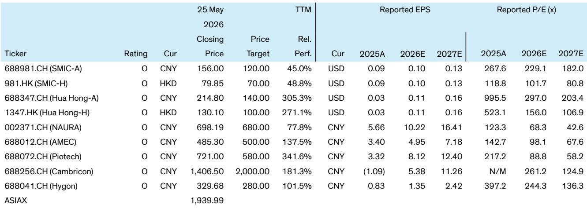
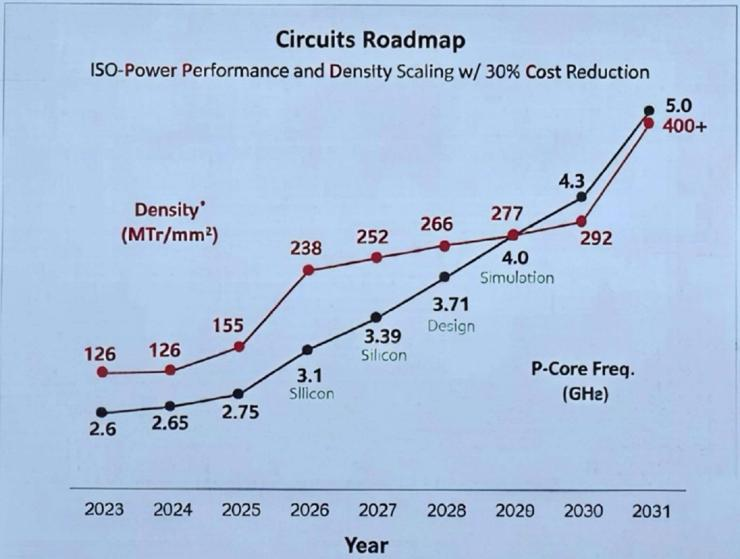

# China's Tau Law Is Not a Moore's Law Replacement — It Is a Strategic Workaround That Could Reshape the Semiconductor Investment Thesis

The announcement of Huawei's Tau Scaling Law at ISCAS 2025 on May 25 triggered an immediate 5.9% rally in the STAR 50 index, but the market's reaction risks conflating technological promise with investment reality. This is not merely another incremental innovation from a company under export controls. It is a deliberate, published roadmap that reframes how China's semiconductor ecosystem can improve chip performance without access to extreme ultraviolet lithography. The core argument of this article is that Tau Law represents a structural shift in the investability of China's semiconductor supply chain — but only for those who understand where the leverage points actually sit.

For years, the dominant narrative has been that China's semiconductor industry faces an insurmountable gap because it cannot shrink transistors below certain nodes without EUV tools. Tau Law challenges that assumption by redefining the metric of progress. Instead of measuring advancement by transistor area reduction, Huawei proposes measuring it by time constant reduction — the latency of signals across the entire computing stack. This is not a semantic trick. It is a fundamental reorientation of engineering effort that opens a parallel path to performance improvement. The question for investors is whether this path is credible, scalable, and investable.

What makes Tau Law a "DeepSeek moment" for China semiconductors is not the technical elegance of the idea. It is the confidence signal it sends to the entire domestic ecosystem. DeepSeek's algorithmic innovations demonstrated that China could achieve frontier AI performance with constrained hardware. Tau Law now attempts to do the same for chip design and manufacturing: prove that constraints can be turned into architectural advantages. If executed, this roadmap could unlock a wave of domestic capital expenditure, tool procurement, and design activity that extends far beyond Huawei itself.

Yet the gap between a published roadmap and a manufactured product is vast, and Tau Law comes with its own set of binding constraints that the market has not fully priced. This article dissects the roadmap, identifies where the real bottlenecks lie, and offers a decision framework for investors navigating this new landscape.

## Tau Law Replaces Geometric Scaling with Temporal Scaling, But the Real Innovation Is in the Packaging Stack

The essence of Tau Law is straightforward: instead of making transistors smaller, make signals faster. Huawei's technical paper, published at ISCAS 2025, argues that returns from dimensional shrinking have flattened, design budgets have exploded, and cost-per-transistor at leading nodes is no longer falling. The proposed alternative is to treat a single characteristic time constant, tau, as the unifying optimization target across twelve orders of magnitude — from a single switching transistor to a data-center workload.

This is not a theory without demonstration. Huawei has already shown what it calls "LogicFolding," a 3D integration technique that stacks logic on logic at a sub-2 micron bonding pitch. At first glance, this resembles TSMC's System-on-Integrated-Chips approach, but the difference is critical. TSMC stacks dies at the chip level, typically placing SRAM on logic. Huawei's LogicFolding stacks at the cell level, placing combinational logic directly on sequential logic. This reduces the critical-path delay between adjacent transistors, which is dominated by interconnect resistance-capacitance rather than transistor switching speed.

The result, according to Huawei's roadmap, is a step-change in transistor density from 155 million transistors per square millimeter in 2025 to 238 million in 2026 — equivalent to TSMC's N3 node density. By 2031, the target is 400 million transistors per square millimeter, matching TSMC's A14 density. The caveat, which the report explicitly acknowledges, is that these comparisons are not apple-to-apple. Huawei achieves these densities by stacking two chips, not by shrinking a single chip. The density metric is per-unit area of the package, not per-unit area of silicon.

The strategic significance is not the density number itself. It is that Huawei has identified a measurable, predictable, and communicable metric — tau reduction — that can guide engineering effort across the entire supply chain. This gives equipment vendors, foundries, and design houses a shared target. Without such a metric, the industry would be operating without a roadmap, making investment decisions in the dark. Tau Law provides the narrative coherence that the China semiconductor ecosystem desperately needs.

## The Roadmap Has Three Binding Constraints That the Market Has Not Fully Discounted

Tau Law is not a free lunch, and the report is transparent about the challenges. The first constraint is that the entire roadmap depends on sustained progress in 3DIC advanced packaging. This is an area where global leaders like TSMC still hold a meaningful technology and ecosystem lead. Hybrid bonding at sub-2 micron pitch with overlay accuracy under 0.5 microns requires manufacturing precision that China's packaging ecosystem is still developing. The tools for this process, particularly the bonding equipment, are not yet fully domestic. Piotech is working on bonding tools, but the reliability and throughput of these tools at scale remain unproven.

The second constraint is thermal. Stacking multiple dies on top of each other increases transistor density, but it also concentrates heat. Power density becomes a binding constraint that requires innovations in power delivery and thermal management. The report notes that Huawei is working on edge-to-surface 3D folding to relocate bandwidth, optical I/O, and power delivery from edges onto surfaces, but this is a design concept, not a deployed solution. Thermal constraints could limit the number of dies that can be stacked and the frequency at which they can operate.

The third constraint is yield and cost. The report mentions a target yield of approximately 100% with smart redundancy, but achieving this at scale is extraordinarily difficult. Each additional die in a stack multiplies the probability of a defect. The repair rate is targeted at 99.9%, but even small deviations from this target can render a product uneconomical. The cost structure of multi-die integration is also opaque. If the cost per transistor of a stacked solution exceeds the cost per transistor of a single-die solution at a comparable performance level, the economic case collapses.

These constraints mean that Tau Law will not allow China to close the gap with global leaders in the near term. The report states this explicitly: China will still be behind global leaders in semiconductors, although the innovations could allow Huawei to continuously improve and gradually narrow the gap. The differentiation will come down to how fast Huawei can solve these challenges, integrate the stacks more tightly, and scale manufacturing reliably and economically. This is not a certainty. It is a bet on execution.

## The Investment Upside Is Massive If Tau Law Succeeds, But the Distribution of Benefits Is Uneven

The report identifies three tiers of beneficiaries. The first tier is the foundry and advanced packaging supply chain. SMIC is the clear strategic partner and likely a critical enabler if Huawei is to deliver the roadmap. The demand for SMIC's most advanced DUV-based multi-patterning logic nodes would be sustained and potentially accelerated. Hua Hong could also benefit through its expected acquisition of Huali, which is potentially working on advanced logic packaging.

The second tier is the semiconductor capital equipment vendors. NAURA has the highest exposure to advanced logic fabrication tools and should benefit more than AMEC. Piotech is working on bonding tools for advanced packaging and is perceived as a core beneficiary. The market is already pricing this in: Piotech's trailing twelve-month relative performance was 341.6% at the time of the report, and NAURA's was 77.8%.

The third tier is the AI fabless companies. Cambricon and Hygon could benefit from a clearer path to sustain performance scaling under EUV constraints. However, they also face more intense competition from Huawei itself. The report explicitly states that the upside for AI fabless names will be smaller compared to foundry and semicap because they are both beneficiaries and competitors.

This uneven distribution of benefits creates a clear investment hierarchy. The foundry and packaging supply chain has the most direct and unambiguous exposure to the Tau Law roadmap. The equipment vendors have high exposure but also high expectations already priced in. The AI fabless companies have a more complex risk-reward profile because they benefit from the ecosystem but compete with its architect.

## What the Report Does Not Fully Answer: The Scalability of LogicFolding and the Competitive Response

The report leaves several meaningful open questions that investors should consider before committing capital. The first is scalability. LogicFolding has been demonstrated on a mobile SoC, but can it be scaled to the massive dies required for AI training chips? The thermal and yield challenges multiply with die size and the number of stacked layers. The report targets 125 times improvement in superPoD compute power by 2030, but this assumes that the stacking technology can be extended from two-layer stacks to multi-layer stacks without unacceptable yield loss.

The second open question is the competitive response. If Huawei's LogicFolding approach proves viable, global leaders like TSMC and Samsung will not stand still. They have their own advanced packaging roadmaps, and they have the advantage of access to EUV for single-die scaling. The question is whether Tau Law gives Huawei a unique architectural advantage or merely allows it to keep pace while the leaders continue to advance on multiple fronts.

The third open question is the timeline. The roadmap targets 238 million transistors per square millimeter by 2026 and 400 million by 2031. These are ambitious targets, and the history of semiconductor roadmaps is littered with missed deadlines. The report is based on Huawei's published projections, not on independent verification. Investors need to assess the credibility of these targets based on Huawei's track record of execution, not on the elegance of the theory.

## A Decision Framework for Investors Navigating the Tau Law Thesis

For investors considering exposure to the China semiconductor theme under the Tau Law framework, the following decision framework may help structure the analysis.

First, assess the credibility of the roadmap by tracking tangible milestones. The most important leading indicator is the yield and bonding pitch of LogicFolding in production. If Huawei can demonstrate sub-2 micron hybrid bonding at high yield in volume production by 2026, the roadmap gains significant credibility. If delays or yield issues emerge, the timeline should be pushed out.

Second, identify the binding constraints in the supply chain. The most critical bottleneck is the availability of domestic bonding tools and advanced packaging equipment. Piotech's progress in bonding tool development is a key variable to monitor. The second bottleneck is thermal management solutions. If domestic companies can develop effective power delivery and cooling solutions for stacked dies, the roadmap becomes more credible.

Third, distinguish between structural beneficiaries and cyclical beneficiaries. SMIC and NAURA are structural beneficiaries because their revenue is directly tied to the execution of the Tau Law roadmap. The AI fabless companies are more cyclical because their upside depends on both the roadmap's success and their ability to compete with Huawei.

Fourth, consider the valuation context. The report's ticker table shows that many of the beneficiary stocks trade at high multiples. SMIC-A trades at 267.6 times 2025 reported earnings. NAURA trades at 123.3 times. Piotech trades at 217.2 times. These multiples imply that the market is already pricing in significant success. The risk is that any disappointment in the roadmap's execution could lead to multiple compression.

Fifth, monitor the policy and geopolitical environment. The Tau Law roadmap is a direct response to export controls, and any change in the control regime could alter the thesis. If export controls are relaxed, the need for a workaround diminishes. If they are tightened, the urgency of the roadmap increases but the ability to execute may be impaired.

## The Open Question That Should Drive Your Research

The most important unresolved question from this report is not whether Tau Law works technically. It is whether the China semiconductor ecosystem can execute this roadmap at scale and at a cost that is competitive with global alternatives. The report makes a compelling case that Tau Law provides a predictable and scalable roadmap metric. It does not fully prove that the manufacturing ecosystem can deliver the required yield, cost, and reliability.

This is the question that separates the current market rally from a sustained investment theme. If Tau Law remains a theoretical framework with limited production-scale validation, the current valuations will prove unsustainable. If it becomes a production reality, the investment opportunity extends far beyond the names mentioned in this report. The entire domestic supply chain for advanced packaging, thermal management, and interconnect technology would need to scale.

Join the community to read the full report and review the original charts.

*This article is for learning and discussion only and does not constitute investment advice.*

Personal reading notes and learning share only. Not investment advice.

