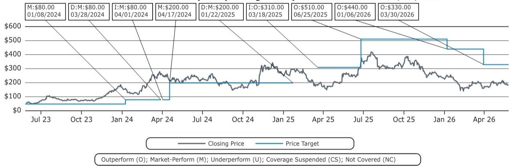
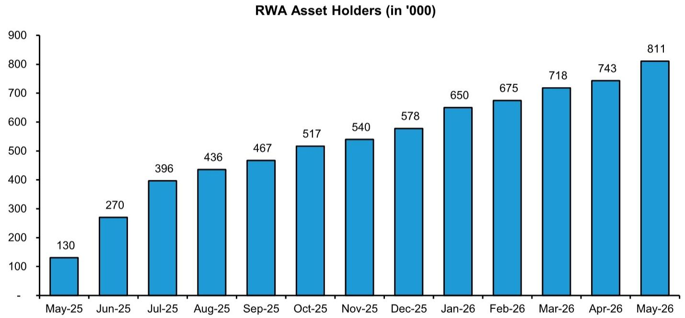
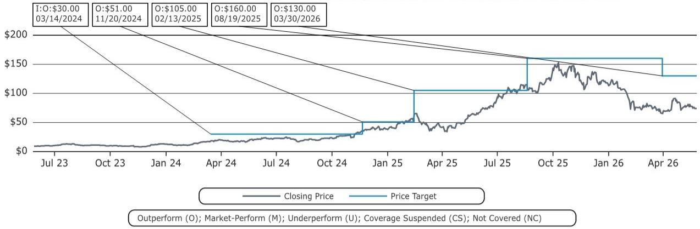

# 市场低估的不是加密货币，而是资产上链对金融基础设施的重构

代币化现实世界资产（RWA）的总市值已突破510亿美元，年内增长42%，而同期更广泛的加密市场下跌约15%。这一数据背后隐藏着一个被多数人忽视的结构性信号：真正在推动资金流入的，不是比特币或以太坊的价格叙事，而是一套正在悄然成型的、将传统金融资产迁移至区块链的新基础设施。某外资投行最新发布的研报《The Tokenization Memo》系统梳理了这一趋势，其核心判断值得我们认真对待——代币化不是加密货币的附属品，而是传统金融体系自身效率革命的下一站。

这份报告的价值不在于罗列数据，而在于它揭示了一个关键转折：从“加密原生资产”到“现实世界资产上链”的叙事迁移正在发生，而且参与方不再是散户，而是BlackRock、DTCC、NYSE、Citi、JPM等传统金融的基石机构。当这些名字开始集体建设代币化基础设施时，我们面对的不再是投机浪潮，而是制度性变革。

以下是我们从这份研报中提炼出的五层洞察，每一层都在回答同一个问题：为什么说代币化正在改变金融基础设施的底层逻辑？

## 1. 代币化的增长韧性暴露了加密市场的一个认知盲区

截至2026年5月，代币化RWA总市值约510亿美元，较年初增长42%。同期比特币和以太坊价格分别下跌约15%和20%。这一背离值得反复咀嚼。

传统解读认为，加密市场下行是因为宏观流动性收紧、监管不确定性上升。但代币化资产在同一环境下逆势增长，说明它的驱动因素与加密原生资产并不完全重叠。代币化资产的买家不是追逐alpha的散户，而是寻求效率提升的机构。当加密市场因投机情绪退潮而下跌时，代币化资产反而因真实业务需求而扩张。

这意味着什么？代币化资产的定价逻辑正在与加密原生资产脱钩。它的增长更多取决于传统金融体系的采纳速度、监管框架的清晰度以及基础设施的成熟度。如果这种脱钩持续，未来代币化资产可能形成一个独立于加密市场周期的资产类别。对于投资者而言，这意味着需要建立两套分析框架，而非将所有数字资产视为同一篮子。

## 2. 私人信贷是代币化最成熟的应用，但真正的突破在股权

从资产类别看，私人信贷占代币化RWA总市值的约44%，美国国债占约30%，大宗商品占约14%。私人信贷的主导地位并非偶然：它天然适合链上改造——非标准化、流动性差、依赖中介撮合，而区块链恰好能降低信任成本、提高结算效率。

Figure（FIGR）是这一领域的标杆。研报数据显示，Figure在2026年至今已代币化50亿美元消费贷款，4月单月贷款量创下13亿美元的历史新高。其区块链信用市场Connect贡献了Q1 2026总贷款量的56%。更值得注意的是，Figure推出的“民主化优先”产品，允许贷款发起人以SOFR+200bps的利率从DeFi和机构资本池获得短期融资——这本质上是在用区块链重构短期信用市场。

但真正具有范式意义的，是股权代币化的进展。尽管目前代币化股票仅约15亿美元存量和30亿美元月转移量，但多个关键事件正在堆叠：Bullish收购全球过户代理Equiniti（服务约3000家发行人客户），DTCC联合50多家金融机构计划在2026年10月推出代币化服务，NYSE与Securitize签署备忘录开发数字过户代理基础设施。这些动作的共同指向是：传统金融的“最后堡垒”——股权登记、清算、结算——正在被代币化技术渗透。

股权代币化的突破意味着什么？它意味着股票可以从发行、登记、交易到结算的全链条上链。一旦实现，传统T+1/T+2的NAV周期将被实时链上执行取代，过户代理、托管行、清算所的角色将被重新定义。这不是渐进式改良，而是基础设施层面的替代。

## 3. Hyperliquid的崛起验证了“链上衍生品”的需求真实存在

如果私人信贷和股权代币化代表着“资产上链”，那么Hyperliquid的HIP-3升级则代表着“定价上链”。HIP-3允许开发者通过质押HYPE代币，在Hyperliquid上列出追踪股票、大宗商品、货币等现实世界资产的永续期货。截至2026年4月，HIP-3已占Hyperliquid总永续合约交易量的35%，上线不到8个月。

4月HIP-3贡献了约650亿美元交易量，大宗商品（金属和石油）和指数是主力。这一数据揭示了两个关键事实：第一，链上衍生品市场对现实世界资产存在真实且快速增长的投机和对冲需求；第二，去中心化基础设施可以承载机构级别的交易量，650亿美元月交易量已经超过许多二线传统交易所。

这里有一个尚未被完全回答的问题：Hyperliquid的流动性深度能否承受极端市场事件？目前的数据只展示了“正常市况”下的增长，但链上衍生品市场的韧性尚未经过压力测试。如果未来出现类似2020年3月或2022年11月级别的冲击，HIP-3的清算机制和流动性供给能否稳定运行？这是一个需要持续观察的关键变量。

## 4. 资产管理者正在用代币化基金“钓鱼”，但真正的鱼是基础设施

BlackRock的BUIDL基金已超过25亿美元AUM，并计划再推出两只代币化基金。Franklin Templeton、Ondo、Circle等也在积极布局代币化国债产品。表面上看，这是资产管理者在追逐代币化基金的规模增长，但更深层的逻辑是：他们正在用这些产品作为“入口”，建立代币化资产的基础设施能力。

以BUIDL为例，渣打银行和OKX已允许客户将BUIDL作为交易保证金，无需放弃收益。这意味着代币化基金不再只是投资产品，而是开始扮演“链上抵押品”的角色。一旦代币化基金成为清算、保证金、融资等环节的标准抵押品，它就不再是一个简单的基金产品，而是一层新的金融基础设施。

报告没有完全展开的一点是：代币化基金的“可编程性”可能带来比即时申赎更深远的影响。例如，基金管理人可以通过智能合约实现自动化的收益分配、风险敞口调整、甚至合规检查。这些功能在传统基金结构中需要大量人工操作和中介协调，在链上则可以通过几行代码完成。对于资产管理行业而言，这不仅是效率提升，更是商业模式的潜在重构。

## 5. 报告尚未完全回答的关键问题：代币化的“杀手级应用”究竟是什么？

尽管报告提供了丰富的数据和案例，但一个核心问题仍悬而未决：代币化真正的“杀手级应用”是什么？是私人信贷的效率提升？是股权的全链条上链？还是衍生品的去中心化定价？

目前来看，私人信贷和国债代币化已经有了明确的PMF（产品市场匹配），但它们的市场规模相对有限。私人信贷全球总量约2万亿美元，代币化渗透率仍不足1%。国债代币化虽然增长快，但本质上是对现有国债市场的“技术替代”，而非创造新需求。

股权代币化可能是最具想象力的方向，但它面临两个关键障碍：一是监管框架仍不清晰，SEC推迟了“创新豁免”的发布；二是现有代币化股票市场规模太小（仅15亿美元），流动性不足会限制机构参与。Bullish收购Equiniti和DTCC的联合项目能否真正推动股权代币化进入主流，仍需时间验证。

另一个尚未被充分讨论的问题是：代币化资产的定价机制如何形成？当股票、信贷、国债在链上交易时，其价格与链下对应资产之间必然存在价差。谁来套利？套利成本有多高？这些价差会如何影响链上资产的价格发现功能？这些问题的答案将决定代币化资产能否真正成为独立的定价体系，而不仅仅是链下的镜像。

---

以上五层洞察只是这份研报的冰山一角。完整的报告还包含对Figure、Bullish、Coinbase等公司的估值分析、风险因素拆解以及更详细的行业仪表盘数据。例如，报告对Figure的估值建立在25倍2027年EV/EBITDA之上，这一倍数高于传统交易所和加密同行，其合理性取决于代币化信贷的扩张速度能否持续。Bullish的估值则面临美国DFS牌照获批时间的不确定性，这一变量可能对其2027年15%的美国收入占比假设产生重大影响。

这些细节和假设，恰恰是判断代币化趋势能否从“叙事”走向“现实”的关键。报告中的数据图表和估值模型背后，隐藏着大量需要进一步推敲的假设和边界条件。如果你对这些“尚未完全回答的问题”感兴趣，欢迎来星球微信群里继续讨论。我们会围绕这份报告展开更深入的拆解，逐一审视每个关键假设的合理性，并追踪后续的行业动态。

Personal reading notes and learning share only. Not investment advice.

