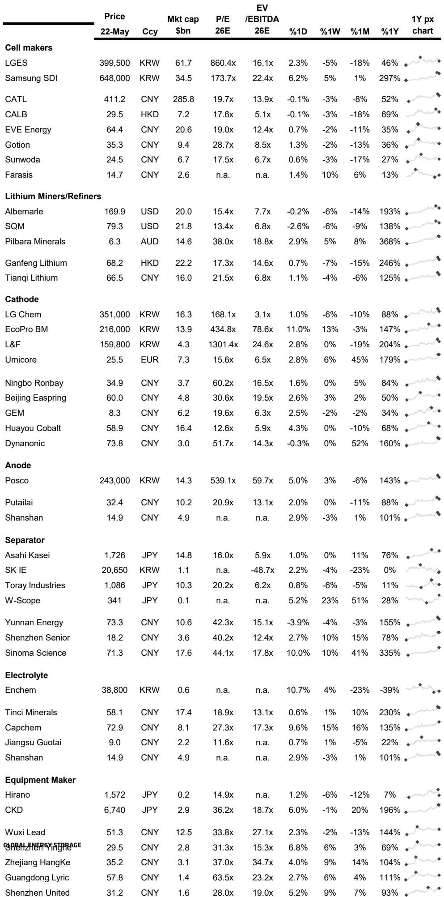
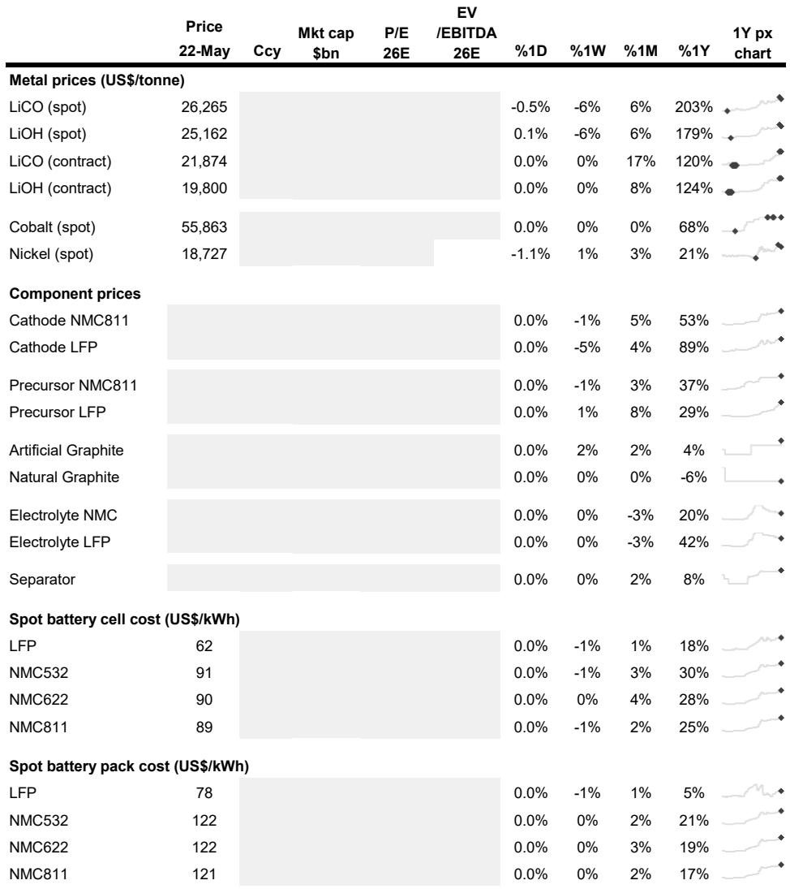
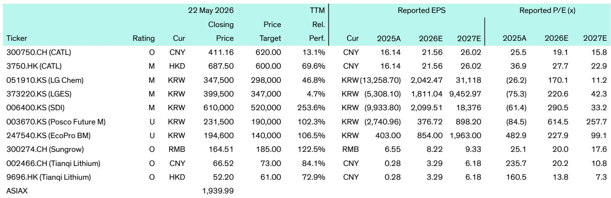

# The Battery Industry Is No Longer Just About Cars: The Strategic Pivot That Will Reshape Global Supply Chains

The global battery industry has reached an inflection point that most investors are still underestimating. For the past decade, the narrative has been simple: batteries power electric vehicles, and the race to dominate EV battery supply chains will determine the winners. That story is now incomplete. A careful reading of the latest industry developments reveals a more complex and strategically significant shift. The battery industry is fragmenting into distinct but interconnected ecosystems—mobility, stationary storage, and emerging high-performance applications—each with its own technology trajectories, supply chain requirements, and competitive dynamics. The companies that understand this fragmentation and position accordingly will capture disproportionate value. Those that remain wedded to a single-application view of batteries risk being disrupted.

Why now? Because the evidence is no longer anecdotal. In a single week of industry news, we see Ford converting a former EV battery plant to serve the energy storage market, Stellantis committing $60 billion to a turnaround plan centered on cheaper LFP batteries, and Xiaomi establishing its own battery production subsidiary to gain supply chain control. We see Sungrow winning a 7.5 GWh energy storage order in the UAE, and Vitzrocell targeting AI data centers with lithium-ion capacitors. These are not isolated events. They are signals of a structural transformation.

The price data confirms the story is real. Spot LFP battery cell costs have fallen to $62 per kWh, while NMC811 cells remain at $89 per kWh. This 30% cost gap is not just a technical footnote—it is the economic engine driving the adoption of LFP chemistry into stationary storage, mass-market EVs, and now even into premium applications through new cell-to-body designs. The battery industry is not a monolith. It is becoming a multi-application, multi-chemistry, multi-region ecosystem. The strategic question for every participant is no longer "how do I win in EV batteries?" but "which applications will I serve, with which chemistry, and at what point in the value chain?"

## The LFP Revolution Is Accelerating Beyond EVs, Creating New Market Structures That Incumbents Cannot Ignore

The most significant development in the battery industry over the past twelve months is not a breakthrough in solid-state technology or a new anode material. It is the rapid and decisive cost convergence of LFP batteries below the psychological threshold that unlocks mass-market adoption across multiple applications. At $62 per kWh for LFP cells and $78 per kWh for LFP packs, the economics now favor LFP for any application where energy density is secondary to cost and cycle life.

This is reshaping the competitive landscape in ways that go far beyond the EV market. The Ford BlueOvalSK plant conversion is a case study in how quickly the ground can shift. Ford took control of the Kentucky facility after the SK On joint venture split and is now replacing Korean battery equipment with Chinese technology from CATL to produce prismatic LFP batteries for the energy storage market under Ford Energy. The decision to pivot from pouch-type NCM production to prismatic LFP for ESS is not a minor adjustment. It represents a strategic recognition that the economics of LFP for stationary storage are now so compelling that they justify writing off existing equipment investments and reconfiguring an entire plant.

The implications for Korean battery suppliers are severe. Equipment orders from Hana Technology, MPLUS, Toptec, Yunsung F&C, PNT, and others have been cancelled or left without use. This is not a temporary disruption. It signals that the LFP wave is creating a new supply chain that bypasses traditional Korean equipment makers who optimized for NCM chemistry. The Korean battery ecosystem, which built its competitive advantage on high-nickel NCM chemistry for premium EVs, now faces a structural challenge: the fastest-growing market segments—mass-market EVs, ESS, and commercial applications—are all moving toward LFP.

The Sungrow deal in the UAE crystallizes this point. A 7.5 GWh order for PowerTitan 3.0 liquid-cooled ESS systems, operating on an 8-hour charge and 16-hour discharge cycle, designed for harsh Middle East conditions at up to 55 degrees Celsius without derating. This is not a niche application. This is utility-scale energy storage becoming a mainstream infrastructure investment. The total project combines 5.2 GW of solar PV with 19 GWh of battery storage to provide round-the-clock clean power. At this scale, the cost advantage of LFP over NCM is not marginal—it is the difference between a viable project and one that cannot achieve financial close.

The strategic takeaway is clear: LFP is no longer the "cheap alternative" to NCM. It is becoming the default chemistry for the largest addressable market in energy storage, and it is rapidly gaining share in the EV market through cell-to-body designs and 800V architectures. Stellantis's $60 billion turnaround plan, which includes LFP batteries and a new STLA One platform, confirms that even legacy automakers understand this shift. The question is whether the Korean and Japanese battery supply chains can adapt quickly enough, or whether they will be relegated to the shrinking premium NCM niche.

## Solid-State Batteries Are Real, But Their Commercial Impact Will Be Delayed and Concentrated in Specific High-Value Applications

The news flow around solid-state batteries has reached a fever pitch, and for good reason. Ganfeng Lithium has started pilot production of a 10Ah lithium-metal solid-state battery with an energy density of 500 Wh/kg, and its 400 Wh/kg solid-state battery has exceeded 1,100 charge cycles with engineering validation completed. SVOLT plans to begin series production of semi-solid-state batteries in September 2026, earlier than its previous 2027 target, with first-generation cells reaching approximately 300 Wh/kg.

These are genuine technical achievements. But the strategic question is not whether solid-state batteries work. It is where they will be deployed, at what cost, and at what scale. The answer, based on the current data, is more nuanced than the bullish headlines suggest.

Ganfeng is targeting applications such as premium EVs, drones, eVTOL aircraft, robotics, and consumer electronics. Notice what is not on that list: mass-market EVs, grid-scale storage, or commercial vehicles. The reason is straightforward. Solid-state batteries, even at 500 Wh/kg, remain significantly more expensive per kWh than LFP or NCM. The cost premium may be acceptable for applications where energy density is the binding constraint—drones that need to fly longer, eVTOL aircraft that need to carry passengers, and robotics that need to operate for extended periods. But for a $30,000 family sedan or a 100 MWh grid storage project, the economics do not work.

SVOLT's timeline is instructive. The company expects its first-generation semi-solid-state cells to reach 300 Wh/kg, which is roughly comparable to current high-performance NCM cells. The second generation targets 360 Wh/kg. This is incremental improvement, not a step-change. CEO Yang Hongxin's comment that semi-solid-state batteries could become the main near-term technology path because they offer better safety, energy density, and lifespan than conventional lithium-ion batteries, while fully solid-state batteries remain far from commercialization, is a realistic assessment.

The implication for investors and strategists is that solid-state batteries will create new market segments rather than replace existing ones. The premium EV market may see solid-state adoption in flagship models by 2028-2030, but the volumes will be limited. The real volume opportunity for solid-state lies in applications that do not yet exist at scale—urban air mobility, advanced robotics, and next-generation consumer electronics. These are high-growth, high-margin markets, but they are not the 100 GWh-per-year markets that battery manufacturers need to justify massive capital expenditure.

The unresolved question is whether solid-state battery technology can be scaled to automotive volumes at competitive costs. Ganfeng's 10Ah pilot production is a proof of concept, not a production line. SVOLT's 300 Wh/kg semi-solid-state cells are an improvement, but they do not fundamentally change the cost structure of battery packs. Until solid-state batteries can achieve $80-100 per kWh at gigawatt-hour scale, they will remain a niche technology. The report data suggests that timeline is at least five to seven years away for mainstream applications.

## The Energy Storage Market Is Becoming the Primary Battleground for Battery Supply Chains, and It Operates by Different Rules

The most underappreciated development in the battery industry is the emergence of energy storage as a market that is structurally different from EVs in ways that matter for supply chain strategy. The Sungrow 7.5 GWh order in the UAE is not just large—it is indicative of a market that values different attributes than the EV market.

In the EV market, the key performance metrics are energy density, charging speed, and cycle life. In the ESS market, the priorities are cost per kWh, cycle life, safety, and thermal performance in extreme conditions. The Sungrow system is designed for an 8-hour charge and 16-hour discharge cycle, operating at up to 55 degrees Celsius without derating. This is a fundamentally different operating profile than an EV battery, which typically charges in 30 minutes to an hour and operates in a controlled thermal environment.

The implications for supply chains are profound. ESS batteries do not need to be as energy-dense as EV batteries, which means LFP chemistry is ideal. ESS batteries need to last for thousands of cycles, which favors LFP over NCM. ESS batteries operate in stationary installations, which means weight and volume constraints are much looser than in vehicles. This opens the door for prismatic and large-format cells that are not suitable for automotive applications.

The Ford Energy decision to convert the Kentucky plant to LFP prismatic production for the ESS market is a direct response to these dynamics. The ESS market is growing faster than the EV market, and it is less exposed to the price competition that characterizes the automotive sector. Ford Energy can sell batteries to utility companies, commercial buildings, and industrial facilities at prices that reflect the value of grid services, not the competitive pressure of automotive OEMs.

The Vitzrocell development adds another dimension. The company is targeting AI data centers with lithium-ion capacitors that combine battery-like energy storage with capacitor-like fast charge and discharge performance. The application is managing power surges from GPU workloads, which can cause sudden 30-50% power fluctuations. This is a high-value, low-volume application that demands performance characteristics that neither standard batteries nor standard capacitors can deliver. Vitzrocell expects orders of over KRW 600 billion by 2029-2030 from this segment alone.

The strategic insight is that the ESS market is not a single market. It is a collection of sub-markets—utility-scale storage, commercial and industrial storage, residential storage, data center backup, and grid services—each with different technical requirements, customer profiles, and competitive dynamics. Companies that treat ESS as a monolithic market will miss the nuances that determine success. GoodWe's dominance in Australia's residential storage market, with three number-one rankings, demonstrates that focusing on a specific sub-market with tailored products can create defensible positions.

The unresolved question is how the ESS supply chain will evolve. Will it be dominated by the same cell manufacturers that serve the EV market, or will specialized ESS players emerge? The Sungrow deal suggests that system integrators with strong project execution capabilities can capture significant value. The Ford Energy conversion suggests that automakers see ESS as a natural extension of their battery investments. The Hanjung NCS story—a former ICE parts supplier that pivoted to ESS components and now generates 97% of sales from Samsung SDI's Samsung Battery Box—shows that the ESS supply chain is creating opportunities for new entrants.

## The Strategic Decision Framework: Four Questions Every Battery Industry Participant Must Answer

The fragmentation of the battery industry into multiple application segments, each with different chemistry requirements, supply chain structures, and competitive dynamics, demands a new strategic framework. Based on the report data and industry patterns, four questions emerge as the critical determinants of success.

First, which application segments will you serve? The choice between EV, ESS, consumer electronics, and emerging applications like AI data centers or eVTOL is not just a matter of market size. It determines the chemistry, cell format, manufacturing process, and customer relationship model. A company optimized for high-volume, low-cost LFP production for ESS will have a different cost structure, supply chain, and go-to-market approach than a company focused on high-energy-density NCM for premium EVs. The danger is trying to serve all segments with a one-size-fits-all strategy. The evidence from the report suggests that the most successful companies are making clear choices. GoodWe dominates Australian residential storage. Sungrow leads in Middle East utility-scale storage. CATL and BYD dominate Chinese EV batteries. No single company leads across all segments.

Second, where in the value chain will you compete? The battery value chain extends from raw materials to cell manufacturing to pack assembly to system integration to aftermarket services. The margins and competitive dynamics differ significantly at each layer. Raw material suppliers like Ganfeng Lithium benefit from commodity price cycles but have limited pricing power. Cell manufacturers like CATL capture significant value but face intense competition and capital intensity. System integrators like Sungrow can differentiate through project execution and local presence. The report data shows that the most profitable positions are shifting. As LFP commoditizes cell manufacturing, the value is moving toward system integration and aftermarket services. The Hanjung NCS example—a component supplier that captured 97% of sales from ESS—shows that there are attractive positions in the middle of the value chain.

Third, which technology trajectory will you bet on? The battery industry is not converging on a single chemistry. It is diverging. LFP is winning in cost-sensitive applications. NCM remains relevant for premium EVs. Solid-state is emerging for high-performance applications. Lithium-ion capacitors are finding niches in data centers. Each technology trajectory requires different R&D investments, manufacturing capabilities, and supply chain relationships. The risk is betting on the wrong trajectory or trying to hedge across too many. The report suggests that the winning approach is to make a clear bet on one or two trajectories and build deep capabilities, rather than spreading resources across all options.

Fourth, how will you manage geographic risk? The battery industry is becoming increasingly regionalized. The U.S. is building domestic supply chains through incentives and tariffs. Europe is supporting local production through programs like Spain's PERTE VEC, which awarded Gotion 92 million euros for battery projects. China remains the dominant producer but faces export restrictions and geopolitical headwinds. The Ford conversion of the Kentucky plant from Korean to Chinese equipment illustrates how quickly supply chains can reconfigure. Companies need to decide whether to build regional production capacity, partner with local players, or accept the risks of concentrated supply chains.

These four questions form a decision framework that every battery industry participant should use to evaluate their strategy. The answers will differ by company, but the framework provides a structured way to think about the choices ahead.

## What the Report Does Not Fully Answer: The Unresolved Questions That Will Determine the Next Phase

Despite the wealth of data in the report, several critical questions remain unanswered. These are not weaknesses of the analysis but rather reflections of genuine uncertainty in the industry. Investors and strategists should monitor these questions closely.

The first unresolved question is the pace and extent of Korean battery industry adaptation. The report documents multiple instances of Korean companies facing disruption from Chinese LFP technology. The BlueOvalSK plant conversion, the cancelled equipment orders, and the SK On Tennessee plant uncertainty all point to structural challenges. But the report also shows Korean companies fighting back. LG Energy Solution is strengthening its LMR battery patent strategy, targeting prismatic LMR batteries for future electric trucks and large SUVs in partnership with GM. POSCO Future M has secured mass production technology for silicon anodes that can store more than four times the energy of conventional graphite anodes, with batteries retaining over 80% capacity after 1,000 cycles. L&F has completed a new LFP cathode plant in Daegu with 30,000 tonnes of annual capacity. The question is whether these efforts are enough to maintain relevance, or whether the Korean battery ecosystem will be permanently marginalized in the LFP-dominated segments.

The second unresolved question is the trajectory of lithium prices and its impact on battery economics. The report shows lithium carbonate spot prices at $26,265 per tonne, up 203% year-over-year. Lithium hydroxide spot prices are at $25,162 per tonne, up 179%. These price increases are already feeding through to cathode and cell costs. The question is whether this is a cyclical spike driven by temporary supply constraints or the beginning of a structural shift to higher lithium prices. If lithium prices remain elevated, the cost advantage of LFP over NCM may narrow, potentially slowing the LFP adoption curve. If lithium prices retreat, LFP's cost advantage will widen further, accelerating the shift.

The third unresolved question is the role of Chinese companies in non-Chinese markets. The report documents Chinese companies expanding aggressively: CATL technology being deployed in Ford's Kentucky plant, Gotion receiving European funding for Spanish projects, Putailai investing $823 million in separator film capacity in Sichuan, and Xiaomi establishing battery production capabilities. The question is whether non-Chinese markets will accept this level of Chinese participation, or whether geopolitical tensions will lead to restrictions that reshape supply chains. The U.S. Inflation Reduction Act already limits Chinese battery content in qualifying EVs. Europe is developing similar policies. The outcome of this tension will determine whether the battery industry becomes a globally integrated market or a set of regional blocs with separate supply chains.

These are not questions that can be answered with current data. They will be resolved over the next two to three years through a combination of market forces, policy decisions, and technological developments. Investors and strategists should build scenarios around each question and monitor leading indicators.

## The Community of Practitioners Who Understand These Dynamics Will Have a Decisive Advantage

The battery industry is entering a period of structural change that rewards deep understanding and strategic clarity. The days of simple narratives—"EVs are the future, buy battery stocks"—are over. The industry is fragmenting into multiple application segments with different technologies, supply chains, and competitive dynamics. The companies that succeed will be those that make clear strategic choices about which segments to serve, where in the value chain to compete, which technologies to bet on, and how to manage geographic risk.

The data in this report provides a foundation for those strategic choices, but it is only a starting point. The full report contains detailed price tables, company valuations, and market share data that are essential for building investment theses and competitive strategies. The exhibits showing key commodities price performance, company valuations, and spot battery cell and pack costs are particularly valuable for understanding the current state of the industry and identifying inflection points.

Join the community to read the full report and review the original charts. The community brings together analysts, investors, and industry professionals who are working through these questions together. The insights that emerge from collective analysis are often more robust than what any individual can develop alone. The questions raised in this article—the pace of Korean adaptation, the trajectory of lithium prices, and the role of Chinese companies in global markets—are best explored in a community of practitioners who can share data, challenge assumptions, and refine strategies.

The battery industry is at an inflection point. The decisions made over the next 12 to 24 months will determine the winners and losers for the next decade. The community exists to help its members make those decisions with the best available information and analysis.

*This article is for learning and discussion only and does not constitute investment advice.*

Personal reading notes and learning share only. Not investment advice.

