# European Rates Watch

# EGB supply, positioning & flows

# Futures positioning: Core and more core

Outstanding: Across the German curve, DU remains the most net-long contract (Exhibit 11). Positioning is net short in OE and even more so in RX, while UB sits close to neutral. Investors remain net long in Italian futures, and neutral in French.

Weekly change (Wed-Wed): Open interest increased for all German future contracts, with net positioning turning more long/less short across the curve (Exhibit 12). In contrast, positioning in Italian and French futures was led by added shorts However, as we begin to approach the rolling period, we grow increasingly hesitant in relying on futures positioning as proxy for broader market positioning/sentiment.

# French headwinds, long 10y EU vs France

Heading into the summer months, we see several headwinds for France that the market may be underappreciating. First, 45% of expected 2026 net French govt bond supply is scheduled for the Jun-Aug period. Second, with the budget season approaching, the verdict determining Le Pen's potential candidacy in July, and the eventual presidential race beginning, we remain concerned that political & fiscal risks would start to weigh on OATs early on. Current valuations do not appear to reflect this. Lastly, Moody's maintains a negative outlook; by the October review that outlook will have been in place for 12 months - within the typical 12–18 month window when outlook-driven rating actions often occur.

In the Global Rates Weekly, 22 May 2026 we recommend going long EU 3.75% Dec-35 vs FRTF 3.5% Nov-35 at 30bp, targeting 40bp with a stop at 25bp (tightest level this year, reached on Feb 25th). The risks are a larger increase in EU bond supply than currently communicated and growth/fiscal outperformance in France.

# Germany: Central Banks & banks step up purchases

In March 2026: leveraged investors net sold €3bn of German government securities (Exhibit 43), with the largest outflows seen in 30y (Exhibit 44). Bank net purchases reached past €13bn, with largest purchases seen in Bubills and 10y (Exhibit 45 & Exhibit 46). Central bank net purchases notably picked up to €32bn, with the 2-10y sector seeing the largest inflows (Exhibit 47 & Exhibit 48).

# Supply: Time for syndications?

We expect gross EGB supply at €15-18bn next week through auctions. In addition, we see potential for several syndications. First, Portugal cancelled their auction next week, indicating they may instead offer a syndication (expect 15-30y for €3bn). Spain has in the last two years offered a 10y syndication at the end of May (expect €10-15bn). Greece may also offer €2-3bn, with 5y/15y/30y tenor or dual-tenor offering. Lastly, there will be large redemptions paid on Jun 1 $^{st}$ that could be reinvested from next week.

# 25 May 2026

Rates Research

Europe

European Rates Research
MLI (UK)

Edvard Davidsson

Rates Strategist

MLI (UK)

edvard.davidsson@bofa.com

Sphia Salim

Rates Strategist

MLI (UK)

sphia.salim@bofa.com

Nathan Thomas, CFA

Rates Strategist

MLI (UK)

nathan.thomas@bofa.com

See Team Page for List of Analysts

For a complete list of our open trade recommendations, as well as our trade recommendations closed over the last 12 months,, see latest Global Rates Weekly

Abbreviations can be found in: Exhibit 50

# Supply: Next 2 weeks and 2026 estimates

# Global bond supply/redemptions next 2 weeks

Exhibit 1: Eurozone, UK and US government bond supply and C&R in the next two weeks

Higher coupon and redemption flows with relatively lower gross supply leads to a negative net supply of €33.55bn

<table><tr><td rowspan="19">Europe</td><td>Date</td><td>Settle</td><td>Country</td><td>Sector</td><td>Amount (bn)</td><td>Bond</td><td>Type</td><td>Date</td><td>Country</td><td>Sector</td><td>Amt (bn)</td><td>Bond</td><td>Type</td></tr><tr><td>25-May</td><td>27-May</td><td>BE</td><td>10y</td><td>1.3-1.7(e)</td><td>BGB 3.4% 06/36</td><td>Tap</td><td>25-May</td><td>FR</td><td>-</td><td>32.9</td><td>OAT 0.5% 05/26</td><td>R</td></tr><tr><td>25-May</td><td>27-May</td><td>BE</td><td>17y</td><td></td><td>BGB 3.45% 06/43</td><td>Tap</td><td>25-May</td><td>AS</td><td>3-23y</td><td>0.7</td><td>RAGB</td><td>C</td></tr><tr><td>26-May</td><td>28-May</td><td>IT</td><td>2y</td><td>2.25-2.5</td><td>BTPShort 2.2% 02/28</td><td>Tap</td><td>25-May</td><td>FR</td><td>0-46y</td><td>20.2</td><td>OAT</td><td>C</td></tr><tr><td>26-May</td><td>28-May</td><td>IT</td><td>5y</td><td>1.0-1.5</td><td>BTP€I 1.1% 08/31</td><td>Tap</td><td>25-May</td><td>IT</td><td>7y</td><td>0.4</td><td>BTP 2.85% 02/33</td><td>C</td></tr><tr><td>26-May</td><td>28-May</td><td>IT</td><td>20y</td><td>0.75-1.0</td><td>BTP€I 2.25% 02/46</td><td>Tap</td><td></td><td></td><td></td><td></td><td></td><td></td></tr><tr><td>27-May</td><td>29-May</td><td>GE</td><td>15y</td><td>1.0</td><td>DBR 2.6% 05/41</td><td>Tap</td><td></td><td></td><td></td><td></td><td></td><td></td></tr><tr><td>27-May</td><td>29-May</td><td>GE</td><td>30y</td><td>1.0</td><td>DBR 2.9% 08/56</td><td>Tap</td><td></td><td></td><td></td><td></td><td></td><td></td></tr><tr><td>28-May</td><td>01-Jun</td><td>IT</td><td>TBA</td><td>7.0-9.0(e)</td><td>5y BTPS, 10y BTPS, CCTeu</td><td>Tap</td><td></td><td></td><td></td><td></td><td></td><td></td></tr><tr><td>28-May</td><td>01-Jun</td><td>FI</td><td>TBA</td><td>0.4</td><td>ORI Facility</td><td>ORI</td><td></td><td></td><td></td><td></td><td></td><td></td></tr><tr><td></td><td></td><td></td><td></td><td></td><td></td><td>€14.7-18.1(e)</td><td></td><td></td><td></td><td></td><td>Total week</td><td>€54.2</td></tr><tr><td>02-Jun</td><td>04-Jun</td><td>GE</td><td>2y</td><td>5.0</td><td>BKO 2.5% 06/28</td><td>Tap</td><td>1-Jun</td><td>SP</td><td>-</td><td>23.6</td><td>SPGB 2.8 05/26</td><td>R</td></tr><tr><td>04-Jun</td><td>08-Jun</td><td>FR</td><td>&gt;8y</td><td>10.5-13.5(e)</td><td>&gt;8y OAT</td><td>Tap</td><td>1-Jun</td><td>IT</td><td>-</td><td>19.9</td><td>BTPS 1.6 06/26</td><td>R</td></tr><tr><td>04-Jun</td><td>09-Jun</td><td>SP</td><td>TBA</td><td>5.5-6.5(e)</td><td>SPGB/SPGB€I</td><td>TBA</td><td>1-Jun</td><td>SP</td><td>0-5y</td><td>3.3</td><td>SPGB</td><td>C</td></tr><tr><td>05-Jun</td><td>09-Jun</td><td>BE</td><td>TBA</td><td>0.5(e)</td><td>ORI Facility</td><td>ORI Facility</td><td>1-Jun</td><td>IT</td><td>0-10y</td><td>4.0</td><td>BTP/BTP Italia, Italy Float</td><td>C</td></tr><tr><td></td><td></td><td></td><td></td><td></td><td></td><td></td><td>4-Jun</td><td>BE</td><td>-</td><td>0.2</td><td>BGBRT</td><td>R</td></tr><tr><td></td><td></td><td></td><td></td><td></td><td></td><td></td><td>4-Jun</td><td>IT</td><td>6y</td><td>0.2</td><td>BTPS 1.85% 06/32</td><td>C</td></tr><tr><td></td><td></td><td></td><td></td><td></td><td></td><td></td><td>5-Jun</td><td>IT</td><td>4y</td><td>0.5</td><td>BTP 3.25% 03/30</td><td>C</td></tr><tr><td></td><td></td><td></td><td></td><td></td><td>Total week</td><td>€15.15-20.65 (e)</td><td></td><td></td><td></td><td></td><td>Total week</td><td>€51.7</td></tr><tr><td rowspan="7">UK</td><td>27-May</td><td>28-May</td><td>UK</td><td>7y</td><td>4.0</td><td>UKT 4.125% 03/33</td><td>Tap</td><td></td><td></td><td></td><td></td><td></td><td></td></tr><tr><td>28-May</td><td>29-May</td><td>UK</td><td>4y</td><td>1.0</td><td>UKT 0.375% 10/30</td><td>Tap</td><td></td><td></td><td></td><td></td><td></td><td></td></tr><tr><td>28-May</td><td>29-May</td><td>UK</td><td>13y</td><td>1.0</td><td>UKT 1.125% 01/39</td><td>Tap</td><td></td><td></td><td></td><td></td><td></td><td></td></tr><tr><td></td><td></td><td></td><td></td><td></td><td>Total week</td><td>£4.0+</td><td></td><td></td><td></td><td></td><td>Total week</td><td>£0.0</td></tr><tr><td>02-Jun</td><td>03-Jun</td><td>UK</td><td>11y</td><td>TBA</td><td>Green UKT 4.625% 03/37</td><td>Tap</td><td></td><td></td><td></td><td></td><td></td><td></td></tr><tr><td>03-Jun</td><td>04-Jun</td><td>UK</td><td>9y</td><td>TBA</td><td>UKTI 1.125% 09/35</td><td>Tap</td><td></td><td></td><td></td><td></td><td></td><td></td></tr><tr><td></td><td></td><td></td><td></td><td></td><td>Total week</td><td>TBA</td><td></td><td></td><td></td><td></td><td>Total week</td><td>£0.0</td></tr><tr><td rowspan="6"></td><td>26-May</td><td>01-Jun</td><td>US</td><td>2y</td><td>69.0</td><td>T</td><td>New</td><td></td><td></td><td></td><td></td><td></td><td></td></tr><tr><td>27-May</td><td>29-May</td><td>US</td><td>2y</td><td>28.0</td><td>FRN</td><td>Tap</td><td></td><td></td><td></td><td></td><td></td><td></td></tr><tr><td>27-May</td><td>01-Jun</td><td>US</td><td>5y</td><td>70.0</td><td>T</td><td>New</td><td></td><td></td><td></td><td></td><td></td><td></td></tr><tr><td>28-May</td><td>01-Jun</td><td>US</td><td>7y</td><td>44.0</td><td>T</td><td>New</td><td></td><td></td><td></td><td></td><td></td><td></td></tr><tr><td></td><td></td><td></td><td></td><td></td><td>Total week</td><td>$142.0</td><td></td><td></td><td></td><td></td><td>Total week</td><td>$0.0</td></tr><tr><td></td><td></td><td></td><td></td><td></td><td>Total week</td><td>$0.0</td><td></td><td></td><td></td><td></td><td>Total week</td><td>$0.0</td></tr></table>

Treasuries, BofA Global Research. (e) = estimate, C= Coupon, R= Redemption   
Source: Treasuries, BofA Global Research.

BofA GLOBAL RESEARCH

Exhibit 2: Weekly DV01 of gross issuance: past and BofA estimates for remainder of 2Q26   
DV01 of gross EGB issuance expected to drop in this second half of Q2   
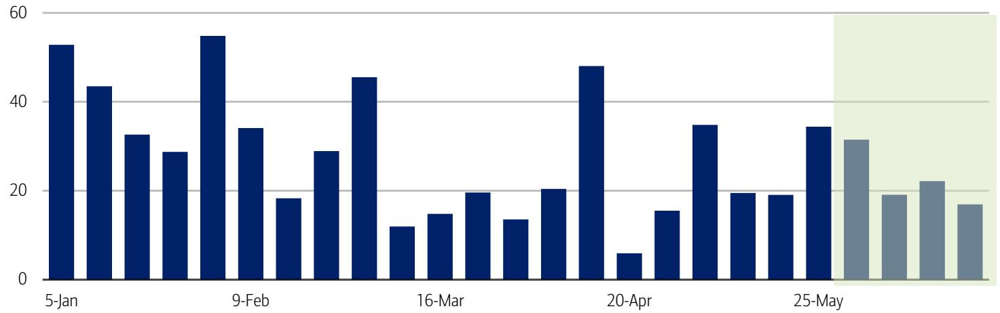

bar

| Date     | Value |
| -------- | ----- |
| 5-Jan    | 53    |
| 6-Jan    | 43    |
| 7-Jan    | 32    |
| 8-Jan    | 28    |
| 9-Feb    | 55    |
| 10-Feb   | 34    |
| 11-Feb   | 18    |
| 12-Feb   | 28    |
| 1-Mar    | 45    |
| 2-Jun    | 12    |
| 3-Jun    | 14    |
| 4-Jun    | 19    |
| 5-Jun    | 13    |
| 6-Jun    | 20    |
| 7-Jun    | 48    |
| 8-Jun    | 6     |
| 9-Jun    | 15    |
| 10-Jun   | 34    |
| 11-Jun   | 19    |
| 12-Jun   | 19    |
| 1-Mar    | 34    |
| 2-May    | 31    |
| 3-May    | 19    |
| 4-May    | 22    |
| 5-May    | 17    |

Source: Treasuries, BofA Global Research calculations   
BofA GLOBAL RESEARCH

# Gross and net supply estimates for 2026

# Exhibit 3: 2026 vs 2025 gross and net supply.

WAM of 2026 issuance is lower than WAM of issuance at this point last year.

<table><tr><td>2026</td><td>Austria</td><td>Belgium</td><td>Finland</td><td>France</td><td>Germany</td><td>Greece</td><td>Ireland</td><td>Italy</td><td>Netherlands</td><td>Portugal</td><td>Spain</td><td>Total</td></tr><tr><td>Gross EUR Bond Issuance</td><td>40</td><td>52</td><td>24</td><td>360</td><td>351</td><td>8</td><td>12</td><td>378</td><td>50</td><td>24</td><td>177</td><td>1475</td></tr><tr><td>Change versus 2025</td><td>0</td><td>6</td><td>-3</td><td>17</td><td>60</td><td>0</td><td>4</td><td>4</td><td>9</td><td>2</td><td>5</td><td>105</td></tr><tr><td>% completed</td><td>52%</td><td>62%</td><td>50%</td><td>50%</td><td>44%</td><td>54%</td><td>69%</td><td>42%</td><td>47%</td><td>46%</td><td>46%</td><td>46%</td></tr><tr><td>% completed versus 2025</td><td>-16%</td><td>0%</td><td>-2%</td><td>-5%</td><td>-1%</td><td>-43%</td><td>8%</td><td>-2%</td><td>-3%</td><td>-13%</td><td>-9%</td><td>-4%</td></tr><tr><td>WAM of 2026 supply YTD, years</td><td>12.5</td><td>13.6</td><td>11.2</td><td>10.8</td><td>9.9</td><td>10.1</td><td>12.1</td><td>8.5</td><td>10.7</td><td>9.2</td><td>10.7</td><td>10.2</td></tr><tr><td>Change vs same period in 2025, y</td><td>-0.8</td><td>3.1</td><td>-1.9</td><td>-0.5</td><td>-1.2</td><td>-3.1</td><td>-10.8</td><td>-0.1</td><td>-3.8</td><td>-3.9</td><td>1.0</td><td>-0.5</td></tr><tr><td>Buyback assumptions</td><td>0</td><td>5</td><td>0</td><td>50</td><td>0</td><td>0</td><td>0</td><td>20</td><td>0</td><td>0</td><td>0</td><td>75</td></tr><tr><td>Net of buybacks</td><td>40</td><td>47</td><td>24</td><td>310</td><td>351</td><td>8</td><td>12</td><td>358</td><td>50</td><td>24</td><td>177</td><td>1401</td></tr><tr><td>Change versus 2025</td><td>-0</td><td>4</td><td>-3</td><td>15</td><td>60</td><td>0</td><td>4</td><td>16</td><td>9</td><td>4</td><td>5</td><td>114</td></tr><tr><td>Total Redemptions</td><td>32</td><td>26</td><td>11</td><td>172</td><td>219</td><td>5</td><td>12</td><td>253</td><td>29</td><td>9</td><td>121</td><td>889</td></tr><tr><td>Net of redemptions &amp; buybacks (1)</td><td>8</td><td>21</td><td>13</td><td>138</td><td>132</td><td>3</td><td>0</td><td>105</td><td>21</td><td>15</td><td>56</td><td>511</td></tr><tr><td>Change versus 2025</td><td>-10</td><td>0</td><td>-2</td><td>11</td><td>32</td><td>-3</td><td>4</td><td>-6</td><td>0</td><td>8</td><td>5</td><td>40</td></tr><tr><td>Net Bill issuance (2)</td><td>3</td><td>2</td><td>-2</td><td>-2</td><td>27</td><td>-2</td><td>0</td><td>5</td><td>13</td><td>5</td><td>5</td><td>54</td></tr><tr><td>Change versus 2025</td><td>4</td><td>-1</td><td>-4</td><td>-8</td><td>40</td><td>-2</td><td>0</td><td>4</td><td>11</td><td>4</td><td>0</td><td>48</td></tr><tr><td>Total net bills &amp; bonds (3) = (1) + (2)</td><td>11</td><td>23</td><td>10</td><td>136</td><td>159</td><td>1</td><td>0</td><td>110</td><td>34</td><td>20</td><td>61</td><td>565</td></tr><tr><td>Change versus 2025</td><td>-6</td><td>-1</td><td>-7</td><td>3</td><td>72</td><td>-4</td><td>4</td><td>-1</td><td>11</td><td>12</td><td>5</td><td>87</td></tr></table>

Source: BofA Global Research   
BofA GLOBAL RESEARCH

Exhibit 4: Forecasted European government bond gross supply in 2026 Monthly supply throughout the year 

<table><tr><td></td><td>01</td><td>02</td><td>03</td><td>04</td><td>05</td><td>06</td><td>07</td><td>08</td><td>09</td><td>10</td><td>11</td><td>12</td><td></td></tr><tr><td>AT</td><td>9</td><td>2</td><td>5</td><td>3</td><td>2</td><td>2</td><td>2</td><td>5</td><td>2</td><td>2</td><td>2</td><td>2</td><td>40</td></tr><tr><td>BE</td><td>8</td><td>9</td><td>4</td><td>4</td><td>8</td><td>4</td><td>4</td><td>4</td><td>3</td><td>3</td><td>1</td><td>1</td><td>52</td></tr><tr><td>FI</td><td>3</td><td>2</td><td>2</td><td>5</td><td>1</td><td>2</td><td>0</td><td>5</td><td>1</td><td>2</td><td>2</td><td>0</td><td>24</td></tr><tr><td>FR</td><td>40</td><td>39</td><td>27</td><td>44</td><td>35</td><td>31</td><td>33</td><td>25</td><td>31</td><td>27</td><td>29</td><td>0</td><td>360</td></tr><tr><td>GE</td><td>42</td><td>27</td><td>35</td><td>31</td><td>31</td><td>29</td><td>34</td><td>28</td><td>33</td><td>33</td><td>23</td><td>9</td><td>351</td></tr><tr><td>GR</td><td>4</td><td>0</td><td>0</td><td>2</td><td>0</td><td>0</td><td>0</td><td>0</td><td>2</td><td>0</td><td>0</td><td>0</td><td>8</td></tr><tr><td>IR</td><td>5</td><td>0</td><td>1</td><td>0</td><td>1</td><td>0</td><td>0</td><td>0</td><td>2</td><td>2</td><td>0</td><td>0</td><td>12</td></tr><tr><td>IT</td><td>40</td><td>36</td><td>36</td><td>38</td><td>36</td><td>42</td><td>23</td><td>11</td><td>40</td><td>44</td><td>25</td><td>6</td><td>378</td></tr><tr><td>NL</td><td>6</td><td>2</td><td>9</td><td>4</td><td>5</td><td>4</td><td>3</td><td>0</td><td>9</td><td>3</td><td>5</td><td>0</td><td>50</td></tr><tr><td>PO</td><td>6</td><td>2</td><td>1</td><td>4</td><td>2</td><td>2</td><td>1</td><td>0</td><td>7</td><td>0</td><td>0</td><td>0</td><td>24</td></tr><tr><td>SP</td><td>31</td><td>21</td><td>12</td><td>17</td><td>29</td><td>12</td><td>15</td><td>5</td><td>13</td><td>11</td><td>11</td><td>0</td><td>177</td></tr><tr><td colspan="13">To</td><td>147</td></tr><tr><td>t.</td><td>192</td><td>139</td><td>132</td><td>152</td><td>149</td><td>127</td><td>115</td><td>84</td><td>142</td><td>128</td><td>98</td><td>17</td><td>5</td></tr></table>

Source: BofA Global Research. Note: Numbers are expressed in EUR bn   
BofA GLOBAL RESEARCH

Exhibit 5: Projected supply net of coupons, redemptions, buybacks and QE   
Monthly net supply through the year 

<table><tr><td></td><td>01</td><td>02</td><td>03</td><td>04</td><td>05</td><td>06</td><td>07</td><td>08</td><td>09</td><td>10</td><td>11</td><td>12</td><td>To.t</td></tr><tr><td>AT</td><td>9</td><td>0</td><td>-2</td><td>3</td><td>2</td><td>2</td><td>-2</td><td>5</td><td>2</td><td>-9</td><td>2</td><td>2</td><td>15</td></tr><tr><td>BE</td><td>8</td><td>9</td><td>-7</td><td>3</td><td>8</td><td>-11</td><td>3</td><td>3</td><td>3</td><td>2</td><td>0</td><td>0</td><td>21</td></tr><tr><td>FI</td><td>3</td><td>2</td><td>2</td><td>1</td><td>1</td><td>2</td><td>0</td><td>5</td><td>-1</td><td>2</td><td>2</td><td>0</td><td>17</td></tr><tr><td>FR</td><td>36</td><td>11</td><td>17</td><td>12</td><td>-4</td><td>26</td><td>26</td><td>21</td><td>7</td><td>19</td><td>-4</td><td>-4</td><td>163</td></tr><tr><td>GE</td><td>42</td><td>6</td><td>15</td><td>0</td><td>30</td><td>9</td><td>30</td><td>5</td><td>13</td><td>18</td><td>21</td><td>-11</td><td>177</td></tr><tr><td>GR</td><td>3</td><td>-1</td><td>0</td><td>2</td><td>0</td><td>-1</td><td>-1</td><td>0</td><td>2</td><td>0</td><td>0</td><td>0</td><td>4</td></tr><tr><td>IR</td><td>5</td><td>0</td><td>1</td><td>0</td><td>-6</td><td>0</td><td>0</td><td>0</td><td>2</td><td>2</td><td>0</td><td>0</td><td>4</td></tr><tr><td>IT</td><td>12</td><td>17</td><td>17</td><td>4</td><td>18</td><td>23</td><td>7</td><td>-21</td><td>12</td><td>38</td><td>10</td><td>-12</td><td>126</td></tr><tr><td>NL</td><td>-4</td><td>2</td><td>9</td><td>4</td><td>5</td><td>4</td><td>-8</td><td>0</td><td>9</td><td>3</td><td>5</td><td>0</td><td>30</td></tr><tr><td>PO</td><td>6</td><td>2</td><td>1</td><td>4</td><td>2</td><td>1</td><td>-3</td><td>0</td><td>7</td><td>-1</td><td>0</td><td>0</td><td>18</td></tr><tr><td>SP</td><td>15</td><td>21</td><td>12</td><td>0</td><td>14</td><td>12</td><td>-7</td><td>5</td><td>13</td><td>-13</td><td>11</td><td>0</td><td>83</td></tr><tr><td>Tot.</td><td>135</td><td>67</td><td>64</td><td>32</td><td>69</td><td>67</td><td>45</td><td>24</td><td>68</td><td>61</td><td>48</td><td>-25</td><td>657</td></tr></table>

Source: BofA Global Research. Note: Numbers are expressed in EUR bn   
BofA GLOBAL RESEARCH

# Syndication projections and results

# Exhibit 6: BofA expectations in terms of syndications by country

Most countries will conduct their first syndication in January, with a likely focus on the 10y sector. We also discuss what historical patterns imply for other syndications.

<table><tr><td rowspan="2">Country</td><td rowspan="2">Syndications Syndications done YTD</td><td rowspan="2">Exp. no. of syndications left</td><td colspan="3">Next syndication - BofA expectations</td><td rowspan="2">Remaining syndications</td></tr><tr><td>Timing</td><td>Tenor</td><td>Amount</td></tr><tr><td>Austria</td><td>2</td><td>1</td><td>Sep/Oct</td><td>Combined multiple tenors</td><td>€3-5bn</td><td>We don’t expect a fourth syndication</td></tr><tr><td>Belgium</td><td>3</td><td>0</td><td>-</td><td>-</td><td>-</td><td>We don’t expect a fourth syndication.</td></tr><tr><td>Finland</td><td>2</td><td>1</td><td>Q3</td><td>5y</td><td>€3-4bn</td><td>We don’t expect a fourth syndication.</td></tr><tr><td>France</td><td>3</td><td>0</td><td>-</td><td>-</td><td>-</td><td>We don’t expect a 4 $^{th}$  syndication</td></tr><tr><td>Germany</td><td>3</td><td>1</td><td>Q3</td><td>30y</td><td>€5-6bn</td><td>We don’t expect a 5 $^{th}$  syndication</td></tr><tr><td>Greece</td><td>1</td><td>1</td><td>May</td><td>5y/15y/30y (pot. dual)</td><td>€2-3bn</td><td>We don’t expect a third syndication</td></tr><tr><td>Ireland</td><td>2</td><td>0</td><td>-</td><td>-</td><td>-</td><td>We don’t expect a 2nd syndication</td></tr><tr><td>Italy</td><td>3</td><td>2</td><td>May</td><td>Dual syndicate</td><td>€5-8bn</td><td>Besides BTP Italy, will often do 4th + 5th around June then Sep/Oct. Tend to syndicate tenors not already offered. Volumes often +10bn in below 10y, and 5-10bn in higher tenors. NGEU uptake may lead to greater focus on shorter tenors.</td></tr><tr><td>Netherlands</td><td>1</td><td>1</td><td>Q3</td><td>+10y</td><td>€5-7bn</td><td>We don’t expect a third syndication</td></tr><tr><td>Portugal</td><td>1</td><td>2</td><td>May</td><td>15y, 20y, or 30y</td><td>€3bn</td><td>For the 3rd syndication, we see potential for new 10y 3-4bn. Timing around Sep.</td></tr><tr><td>Spain</td><td>2</td><td>1</td><td>Late Q2 or Q3</td><td>10y</td><td>€12bn</td><td>We don’t expect a fourth syndications</td></tr></table>

Source: Euro Area debt agencies, BofA Global Research   
BofA GLOBAL RESEARCH

Exhibit 7: 5y BGB syndications allocation results by investor type, % Increased allocation to banks   
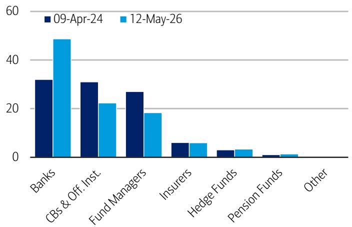

bar

| Category | 09-Apr-24 | 12-May-26 |
| :--- | :--- | :--- |
| Banks | 32 | 48 |
| CBS & Off. Inst. | 31 | 22 |
| Fund Managers | 27 | 18 |
| Insurers | 5 | 5 |
| Hedge Funds | 3 | 3 |
| Pension Funds | 1 | 1 |
| Other | 0 | 0 |

Source: Bondradar, Belgian debt agency, BofA Global Research   
BofA GLOBAL RESEARCH

Exhibit 8: 10y BGB syndications allocation by geography of investor, % Decreased allocation to non-European investors   
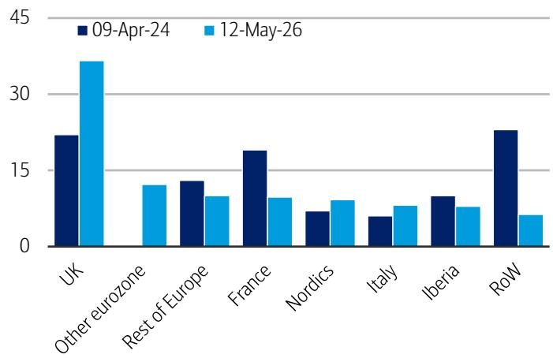

bar

| Region           | 09-Apr-24 | 12-May-26 |
| ---------------- | --------- | --------- |
| UK               | 17        | 33        |
| Other eurozone   | 0         | 14        |
| Rest of Europe   | 14        | 13        |
| France           | 16        | 13        |
| Nordics          | 2         | 13        |
| Italy            | 1         | 2         |
| Iberia           | 13        | 2         |
| RoW              | 20        | 1         |

Source: Bondradar, Belgian debt agency, BofA Global Research   
BofA GLOBAL RESEARCH

Exhibit 9: IRISH Oct43 Green syndications allocation results by investor type, %   
Increased allocations to official institutions   
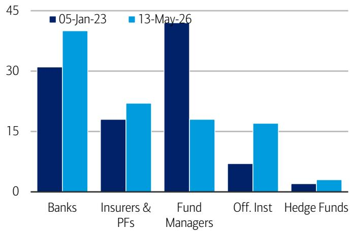

bar

| Category         | 05-Jan-23 | 13-May-26 |
| ---------------- | --------- | --------- |
| Banks            | 30        | 38        |
| Insurers & PFs   | 16        | 20        |
| Fund Managers    | 44        | 17        |
| Off. Inst        | 2         | 16        |
| Hedge Funds      | 1         | 1         |

Source: Bondradar, Irish debt agency, BofA Global Research   
BofA GLOBAL RESEARCH

Exhibit 10: IRISH Oct43 Green syndications allocation results by geography of investor, %   
Increased allocations to non-European investors   
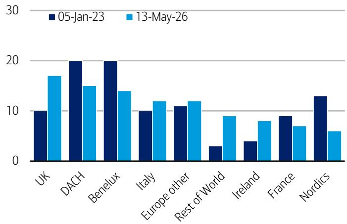

bar

| Region         | 05-Jan-23 | 13-May-26 |
| -------------- | --------- | --------- |
| UK             | 10        | 17        |
| DACH           | 20        | 15        |
| Benelux        | 20        | 14        |
| Italy          | 10        | 12        |
| Europe other   | 11        | 12        |
| Rest of World  | 3         | 9         |
| Ireland        | 4         | 8         |
| France         | 9         | 7         |
| Nordics        | 13        | 6         |

Source: Bondradar, Irish debt agency, BofA Global Research   
BofA GLOBAL RESEARCH

# Positioning: Market data

Exhibit 11: Current outstanding volumes in futures positioning, a-accounts ('000s)\*   
Neg. values for outstanding shorts equals the actual total values of outstanding shorts   
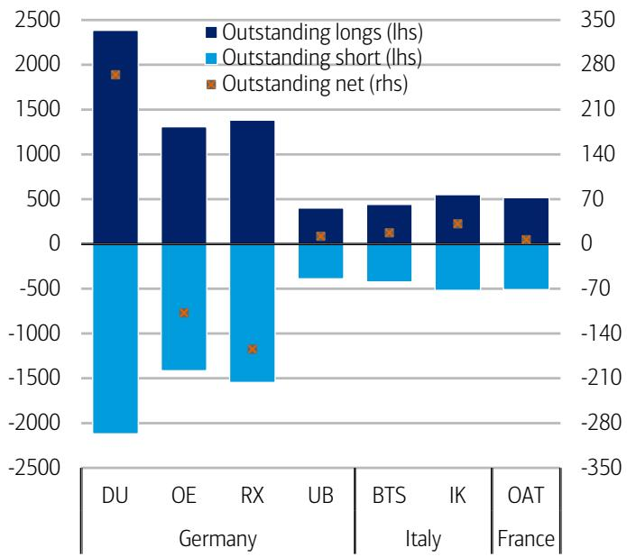

bar

| Country | Category | Outstanding longs (lhs) | Outstanding short (lhs) | Outstanding net (rhs) |
|---------|----------|--------------------------|--------------------------|------------------------|
| Germany | DU       | 2300                     | -2200                    | 1900                   |
| Germany | OE       | 1300                     | -1400                    | -800                   |
| Germany | RX       | 1350                     | -1600                    | -1200                  |
| Germany | UB       | 400                      | -400                     | 100                    |
| Italy   | BTS      | 450                      | -500                     | 200                    |
| Italy   | IK       | 550                      | -500                     | 300                    |
| Italy   | OAT      | 500                      | -500                     | 100                    |
| France  |        |                          |                          |                        |

Source: Deutsche Börse AG – Eurex Flows Insights, BofA Global Research. Data is from Jan-2024 to YTD.\* Latest data is from the most recent Wednesday

BofA GLOBAL RESEARCH

Exhibit 13: Futures positioning in DU, open interest\*   
DU contracts represent GER gov bond with remaining maturity of 1.75-2.25y   
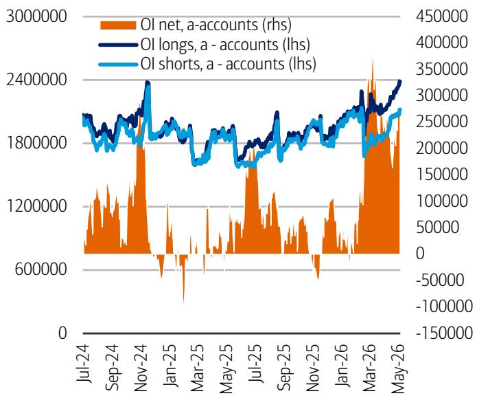

line

| Date   | OI net, a-accounts (rhs) | OI longs, a - accounts (lhs) | OI shorts, a - accounts (lhs) |
|--------|--------------------------|------------------------------|-------------------------------|
| Jul-24 | ~180000                  | ~250000                      | ~250000                       |
| Sep-24 | ~180000                  | ~250000                      | ~250000                       |
| Nov-24 | ~240000                  | ~350000                      | ~350000                       |
| Jan-25 | ~60000                   | ~180000                      | ~180000                       |
| Mar-25 | ~180000                  | ~250000                      | ~250000                       |
| May-25 | ~180000                  | ~250000                      | ~250000                       |
| Jul-25 | ~180000                  | ~250000                      | ~250000                       |
| Sep-25 | ~180000                  | ~250000                      | ~250000                       |
| Nov-25 | ~180000                  | ~250000                      | ~250000                       |
| Jan-26 | ~180000                  | ~250000                      | ~250000                       |
| Mar-26 | ~240000                  | ~350000                      | ~350000                       |
| May-26 | ~240000                  | ~350000                      | ~350000                       |

Source: Deutsche Börse AG – Eurex Flows Insights, BofA Global Research. Data is from Jan-2024 to YTD. \* Latest data is from the most recent Wednesday

BofA GLOBAL RESEARCH

Exhibit 12: Weekly change in outstanding volumes, a-accounts\*   
Neg. values for shorts indicate an increased short positioning   
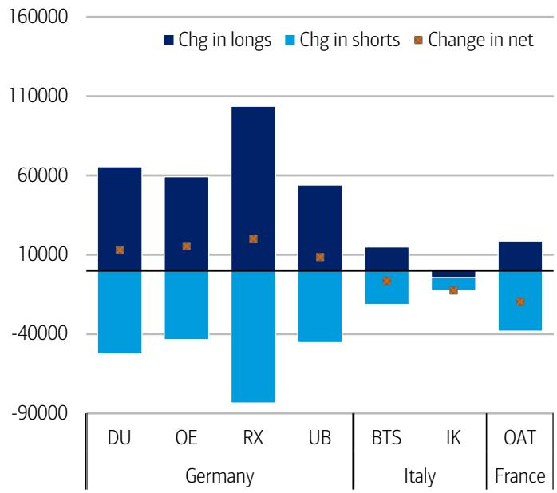

bar

| Country | Category | Chg in longs | Chg in shorts | Change in net |
|---------|----------|--------------|---------------|---------------|
| Germany | DU       | 62000        | -45000        | 10000         |
| Germany | OE       | 60000        | -42000        | 10500         |
| Germany | RX       | 108000       | -85000        | 11500         |
| Germany | UB       | 58000        | -43000        | 9500          |
| Italy   | BTS      | 10200        | -35000        | -7500         |
| Italy   | IK       | -8500        | -32000        | -8500         |
| France  | OAT      | 11000        | -42000        | -3500         |

Source: Deutsche Börse AG – Eurex Flows Insights, BofA Global Research. Data is from Jan-2024 to YTD. \* Latest data is from the most recent Wednesday

BofA GLOBAL RESEARCH

Exhibit 14: Futures positioning in OE, open interest\*   
OE contracts represent GER gov bond with remaining maturity of 4.5-5.5y   
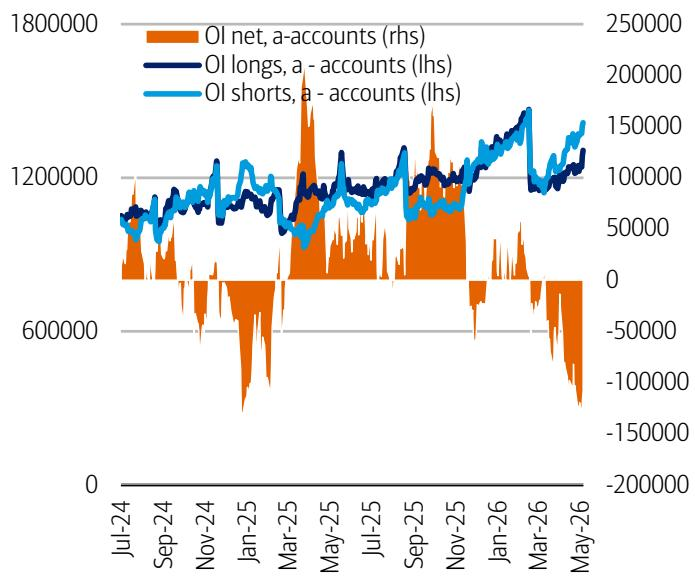

line

| Date   | OI net, a-accounts (rhs) | OI longs, a - accounts (lhs) | OI shorts, a - accounts (lhs) |
|--------|--------------------------|------------------------------|-------------------------------|
| Jul-24 | ~110000                  | ~100000                      | ~90000                        |
| Sep-24 | ~100000                  | ~110000                      | ~105000                       |
| Nov-24 | ~90000                   | ~115000                      | ~110000                       |
| Jan-25 | ~70000                   | ~120000                      | ~125000                       |
| Mar-25 | ~180000                  | ~130000                      | ~135000                       |
| May-25 | ~110000                  | ~125000                      | ~130000                       |
| Jul-25 | ~120000                  | ~135000                      | ~145000                       |
| Sep-25 | ~135000                  | ~145000                      | ~165000                       |
| Nov-25 | ~125000                  | ~145000                      | ~175000                       |
| Jan-26 | ~135000                  | ~155000                      | ~185000                       |
| Mar-26 | ~145000                  | ~165000                      | ~195000                       |
| May-26 | ~135000                  | ~175000                      | ~215000                       |

Source: Deutsche Börse AG – Eurex Flows Insights, BofA Global Research. Data is from Jan-2024 to YTD. \* Latest data is from the most recent Wednesday

BofA GLOBAL RESEARCH

Exhibit 15: Futures positioning in RX, open interest\*   
RX contracts represent GER gov bond with remaining maturity of 8.5-10.5y   
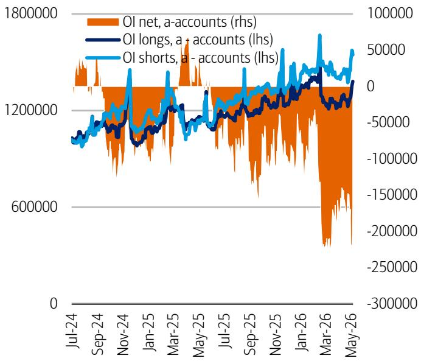

line

| Date   | OI net, a-accounts (rhs) | OI longs, a - accounts (lhs) | OI shorts, a - accounts (lhs) |
|--------|--------------------------|------------------------------|-------------------------------|
| Jul-24 | ~1300000                 | ~110000                      | ~10000                        |
| Sep-24 | ~1250000                 | ~115000                      | ~11000                        |
| Nov-24 | ~1200000                 | ~110000                      | ~125000                       |
| Jan-25 | ~1150000                 | ~105000                      | ~115000                       |
| Mar-25 | ~1350000                 | ~120000                      | ~130000                       |
| May-25 | ~1250000                 | ~115000                      | ~125000                       |
| Jul-25 | ~1200000                 | ~110000                      | ~120000                       |
| Sep-25 | ~1150000                 | ~105000                      | ~115000                       |
| Nov-25 | ~1250000                 | ~115000                      | ~135000                       |
| Jan-26 | ~1350000                 | ~125000                      | ~145000                       |
| Mar-26 | ~185000                  | ~135000                      | ~175000                       |
| May-26 | ~65000                   | ~125000                      | ~145000                       |

Source: Deutsche Börse AG – Eurex Flows Insights, BofA Global Research. Data is from Jan-2024 to YTD. \* Latest data is from the most recent Wednesday   
BofA GLOBAL RESEARCH

Exhibit 17: Futures positioning in BTS, open interest\*   
BTS contracts represent ITA gov bond with remaining maturity of 2.0-3.25y   
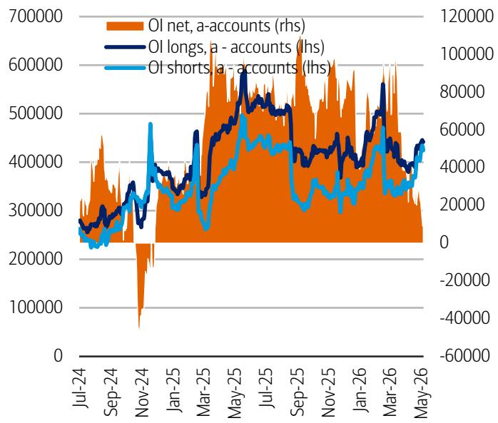

line

| Date   | OI net, a-accounts (rhs) | OI longs, a - accounts (lhs) | OI shorts, a - accounts (lhs) |
|--------|--------------------------|------------------------------|-------------------------------|
| Jul-24 | ~250000                  | ~250000                      | ~250000                       |
| Sep-24 | ~350000                  | ~300000                      | ~280000                       |
| Nov-24 | ~10000                   | ~350000                      | ~480000                       |
| Jan-25 | ~350000                  | ~380000                      | ~350000                       |
| Mar-25 | ~450000                  | ~450000                      | ~450000                       |
| May-25 | ~550000                  | ~550000                      | ~550000                       |
| Jul-25 | ~600000                  | ~600000                      | ~600000                       |
| Sep-25 | ~650000                  | ~650000                      | ~650000                       |
| Nov-25 | ~550000                  | ~550000                      | ~550000                       |
| Jan-26 | ~550000                  | ~550000                      | ~550000                       |
| Mar-26 | ~650000                  | ~650000                      | ~650000                       |
| May-26 | ~450000                  | ~450000                      | ~450000                       |

Source: Deutsche Börse AG – Eurex Flows Insights, BofA Global Research. Data is from Jan-2024 to YTD. \* Latest data is from the most recent Wednesday   
BofA GLOBAL RESEARCH

Exhibit 16: Futures positioning in UB, open interest\*   
UB contracts represent GER gov bond with remaining maturity of 24-35y   
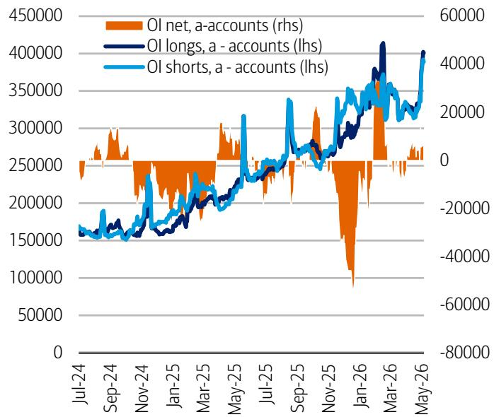

line

| Date   | OI net, a-accounts (rhs) | OI longs, a - accounts (lhs) | OI shorts, a - accounts (lhs) |
|--------|--------------------------|------------------------------|-------------------------------|
| Jul-24 | ~250000                  | ~150000                      | ~150000                       |
| Sep-24 | ~300000                  | ~170000                      | ~180000                       |
| Nov-24 | ~250000                  | ~160000                      | ~190000                       |
| Jan-25 | ~250000                  | ~180000                      | ~220000                       |
| Mar-25 | ~300000                  | ~200000                      | ~230000                       |
| May-25 | ~350000                  | ~250000                      | ~320000                       |
| Jul-25 | ~250000                  | ~220000                      | ~250000                       |
| Sep-25 | ~350000                  | ~350000                      | ~380000                       |
| Nov-25 | ~350000                  | ~350000                      | ~350000                       |
| Jan-26 | ~150000                  | ~380000                      | ~420000                       |
| Mar-26 | ~350000                  | ~420000                      | ~380000                       |
| May-26 | ~450000                  | ~480000                      | ~450000                       |

Source: Deutsche Börse AG – Eurex Flows Insights, BofA Global Research. Data is from Jan-2024 to YTD. \* Latest data is from the most recent Wednesday   
BofA GLOBAL RESEARCH

Exhibit 18: Futures positioning in IK, open interest\*   
IK contracts represent ITA gov bond with remaining maturity of 8.5-11.0y   
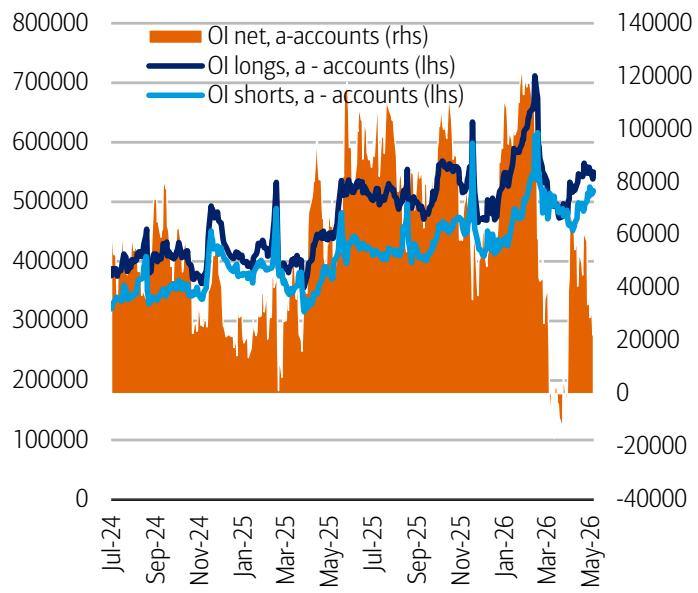

line

| Date   | OI net, a-accounts (rhs) | OI longs, a - accounts (lhs) | OI shorts, a - accounts (lhs) |
|--------|--------------------------|------------------------------|-------------------------------|
| Jul-24 | ~350000                  | ~380000                      | ~32000                        |
| Sep-24 | ~450000                  | ~420000                      | ~35000                        |
| Nov-24 | ~380000                  | ~480000                      | ~38000                        |
| Jan-25 | ~350000                  | ~450000                      | ~37000                        |
| Mar-25 | ~450000                  | ~520000                      | ~40000                        |
| May-25 | ~550000                  | ~580000                      | ~45000                        |
| Jul-25 | ~650000                  | ~620000                      | ~55000                        |
| Sep-25 | ~550000                  | ~580000                      | ~52000                        |
| Nov-25 | ~650000                  | ~620000                      | ~58000                        |
| Jan-26 | ~750000                  | ~720000                      | ~65000                        |
| Mar-26 | ~780000                  | ~750000                      | ~72000                        |
| May-26 | ~15000                   | ~55000                       | ~5800                         |

Source: Deutsche Börse AG – Eurex Flows Insights, BofA Global Research. Data is from Jan-2024 to YTD. \* Latest data is from the most recent Wednesday   
BofA GLOBAL RESEARCH

Exhibit 19: Futures positioning in OAT, open interest\*   
OAT contracts represent French gov bond with remaining maturity of 8.5-10.5y   
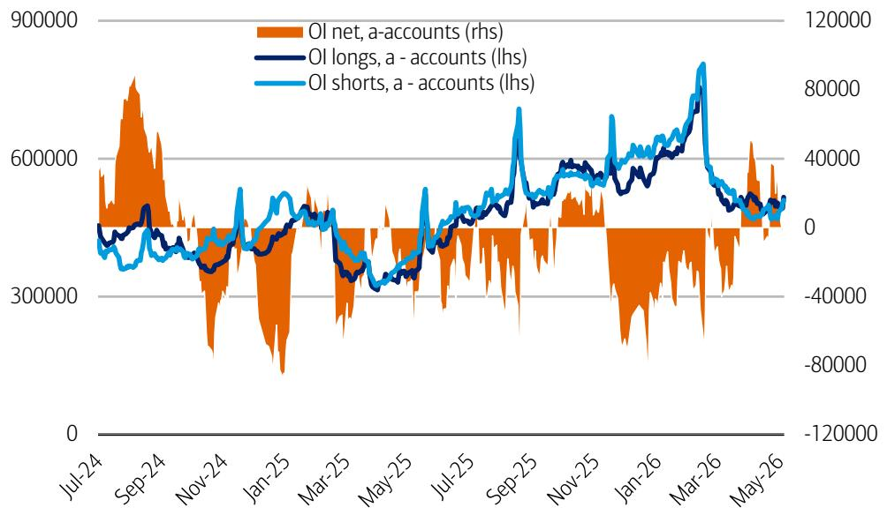

line

| Date   | OI net, a-accounts (rhs) | OI longs, a - accounts (lhs) | OI shorts, a - accounts (lhs) |
|--------|--------------------------|------------------------------|-------------------------------|
| Jul-24 | ~500000                  | ~300000                      | ~30000                        |
| Sep-24 | ~800000                  | ~400000                      | ~35000                        |
| Nov-24 | ~300000                  | ~350000                      | ~35000                        |
| Jan-25 | ~150000                  | ~450000                      | ~55000                        |
| Mar-25 | ~350000                  | ~350000                      | ~45000                        |
| May-25 | ~350000                  | ~350000                      | ~35000                        |
| Jul-25 | ~450000                  | ~450000                      | ~55000                        |
| Sep-25 | ~750000                  | ~650000                      | ~75000                        |
| Nov-25 | ~550000                  | ~550000                      | ~55000                        |
| Jan-26 | ~650000                  | ~650000                      | ~65000                        |
| Mar-26 | ~850000                  | ~850000                      | ~95000                        |
| May-26 | ~450000                  | ~450000                      | ~45000                        |

Source: Deutsche Börse AG – Eurex Flows Insights, BofA Global Research. Data is from Jan-2024 to YTD. \* Latest data is from the most recent Wednesday   
BofA GLOBAL RESEARCH

# Repo market: Special versus general collateral rates

Exhibit 20: Spread between special vs general collateral repo rate, bp   
More negative values indicate larger short positioning. \*SC - GC composite = 0.4\*(GER SC - GC) + 0.20\*(FRA SC - GC) + 0.20\*(ITA SC - GC) + 0.10\*(SPA SC - GC). Z-scores are based on 2y weekly data. 

<table><tr><td>Repo</td><td>Latest, bp</td><td>Chg WoW, bp</td><td>Latest levels, 2y z-score</td></tr><tr><td>GER SC - GC</td><td>-2.60</td><td>-0.30</td><td>0.38</td></tr><tr><td>FRA SC - GC</td><td>-0.50</td><td>0.40</td><td>0.71</td></tr><tr><td>ITA SC - GC</td><td>-0.90</td><td>1.10</td><td>1.51</td></tr><tr><td>SPA SC - GC</td><td>-2.50</td><td>1.20</td><td>0.40</td></tr><tr><td>SC - GC composite</td><td>-1.57</td><td>0.30</td><td>0.64</td></tr><tr><td>(ITA SC-GC) - (GER SC-GC)</td><td>1.70</td><td>1.40</td><td>1.12</td></tr></table>

Source: CME Group, BofA Global Research   
BofA GLOBAL RESEARCH

Exhibit 21: Spread between special and general collateral repo rate, 3m moving average in bps   
More negative values indicate larger short positioning, and values are 3m moving averages   
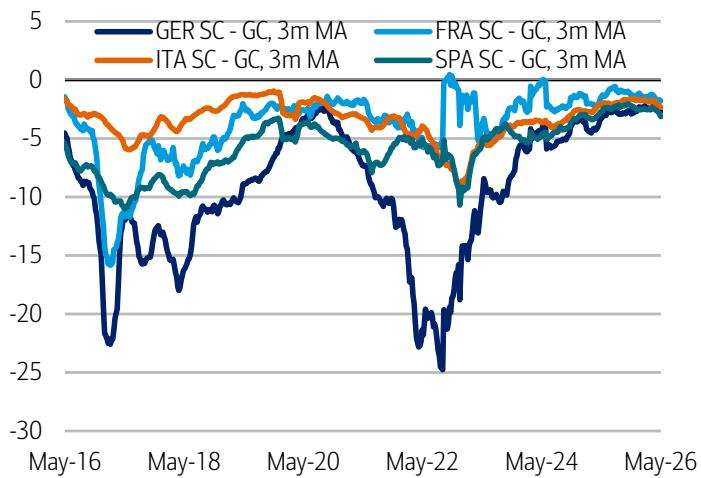

line

| Date   | GER SC - GC, 3m MA | FRA SC - GC, 3m MA | ITA SC - GC, 3m MA | SPA SC - GC, 3m MA |
|--------|---------------------|---------------------|---------------------|---------------------|
| May-16 | -5                  | -5                  | -5                  | -5                  |
| May-18 | -15                 | -10                 | -5                  | -10                 |
| May-20 | -10                 | -5                  | -5                  | -5                  |
| May-22 | -25                 | 0                   | -5                  | -10                 |
| May-24 | -5                  | 0                   | -5                  | -5                  |
| May-26 | -5                  | 0                   | -5                  | -5                  |

Source: CME Group, BofA Global Research   
BofA GLOBAL RESEARCH

# Positioning & Flows: EA Fund managers

Exhibit 22: Weekly flows into single country and Europe ex. UK mandated funds, % of total asset (4w cumulative)   
Values represent 4w cumulative flows, as % of assets under management   
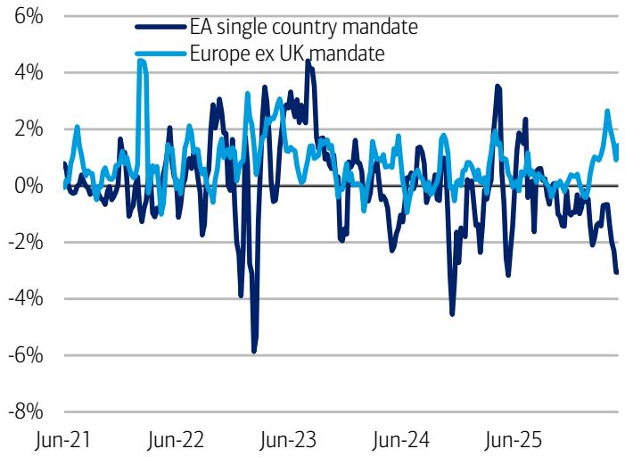

line

| Date   | EA single country mandate | Europe ex UK mandate |
|--------|---------------------------|----------------------|
| Jun-21 | ~0%                       | ~2%                  |
| Jun-22 | ~2%                       | ~4%                  |
| Jun-23 | ~-6%                      | ~3%                  |
| Jun-24 | ~-2%                      | ~1%                  |
| Jun-25 | ~-3%                      | ~2%                  |

Source: EPFR, BofA Global Research   
BofA GLOBAL RESEARCH

Exhibit 24: Cumulative inflows into Europe ex UK mandated funds + single country mandated funds by type of fund, % YTD   
Funds with institutional clients have seen more inflows in 2025   
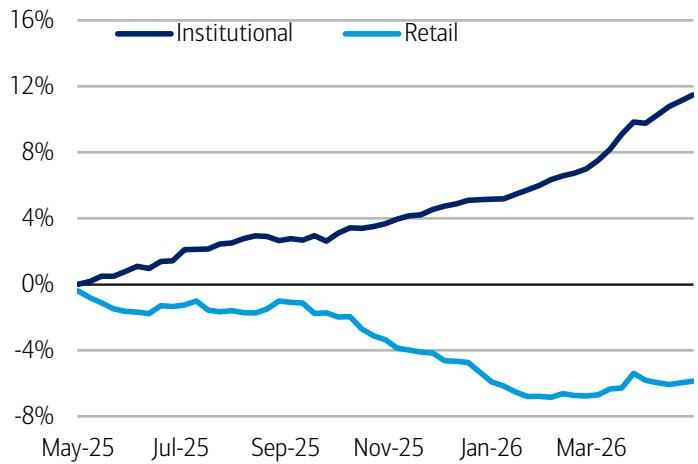

line

| Month   | Institutional | Retail |
|---------|---------------|--------|
| May-25  | 0%            | 0%     |
| Jul-25  | ~2%           | ~-2%   |
| Sep-25  | ~3%           | ~-1%   |
| Nov-25  | ~4%           | ~-3%   |
| Jan-26  | ~5%           | ~-5%   |
| Mar-26  | ~10%          | ~-7%   |

Source: EPFR, BofA Global Research   
BofA GLOBAL RESEARCH

Exhibit 23: Weekly flows into single country and Europe ex. UK mandated funds, % of total asset   
Right column represents 4-week cumulative flows, as % of AUMs 

<table><tr><td>Fund mandate</td><td>1 week</td><td>4 weeks</td></tr><tr><td>Germany</td><td>-0.58%</td><td>-2.55%</td></tr><tr><td>Austria</td><td>-0.01%</td><td>0.35%</td></tr><tr><td>France</td><td>0.10%</td><td>0.75%</td></tr><tr><td>Spain</td><td>-1.39%</td><td>-6.06%</td></tr><tr><td>Italy</td><td>-1.33%</td><td>-1.02%</td></tr><tr><td>Greece</td><td>9.30%</td><td>9.50%</td></tr><tr><td>Europe ex UK</td><td>0.38%</td><td>1.43%</td></tr><tr><td>Europe ex UK + sum of EA single country</td><td>0.24%</td><td>0.95%</td></tr></table>

Source: EPFR, BofA Global Research   
BofA GLOBAL RESEARCH

Exhibit 25: Cumulative inflows into Europe ex UK mandated funds + single country mandated funds by type of fund, % YTD   
Fund mandates Short term: 0-4y. Medium term: 4-6y. Long term: +6y   
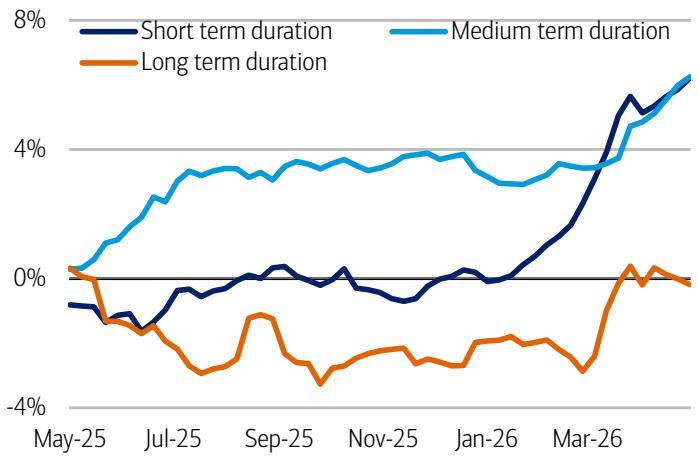

line

| Date   | Short term duration | Medium term duration | Long term duration |
|--------|---------------------|----------------------|--------------------|
| May-25 | -1%                 | 0%                   | 0%                 |
| Jul-25 | -2%                 | 3%                   | -3%                |
| Sep-25 | 0%                  | 3%                   | -2%                |
| Nov-25 | -1%                 | 3%                   | -3%                |
| Jan-26 | 0%                  | 3%                   | -3%                |
| Mar-26 | 4%                  | 4%                   | 0%                 |

Source: EPFR, BofA Global Research   
BofA GLOBAL RESEARCH

# Positioning & Flows: EA Pension & Insurance funds

# Dutch Pension funds

Exhibit 26: Breakdown of govt bond holdings of Dutch PFs (bn €) and holdings as a share of outstanding bonds GE, FR & NL central govt bonds dominate govt bond holdings of Dutch PFs

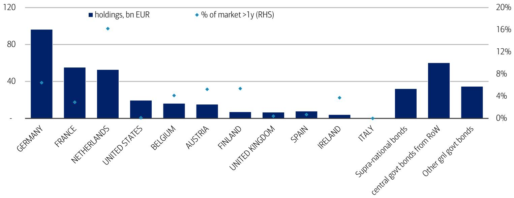

bar_line

| Country/Region | holdings, bn EUR | % of market >1y (RHS) |
| --- | --- | --- |
| GERMANY | 88 | 4.5 |
| FRANCE | 57 | 2.5 |
| NETHERLANDS | 55 | 16.5 |
| UNITED STATES | 20 | 0.5 |
| BELGIUM | 20 | 3.5 |
| AUSTRIA | 20 | 4.5 |
| FINLAND | 10 | 4.5 |
| UNITED KINGDOM | 10 | 0.5 |
| SPAIN | 10 | 0.5 |
| IRELAND | 5 | 3.5 |
| ITALY | 0 | 0.5 |
| Supra-national bonds | 35 | - |
| central govt bonds from RoW | 90 | - |
| Other grnl govt bonds | 35 | - |

Source: EIOPA Occupational Pension Statistics (3Q25), BofA ICE Indices, BofA Global Research This chart does not accounted for any govt bond holdings in debt & asset allocation funds

BofA GLOBAL RESEARCH

# Positioning & Flows: EA banks

Exhibit 27: Bank holdings of EA general gov bonds as % of total bank assets, by geographical location of banks. Last data point = Mar-26
Holdings have been on the rise in 2025   
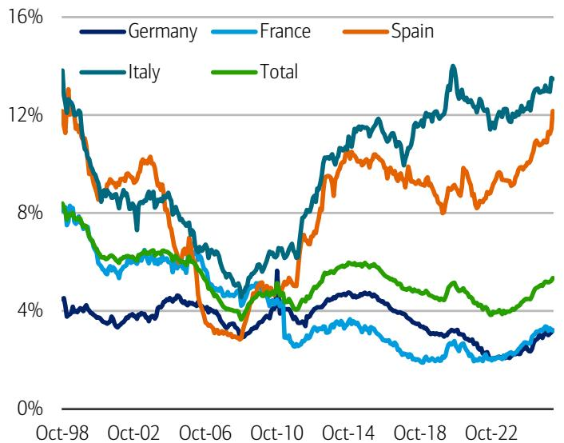

line

| Date   | Germany | France | Spain | Italy | Total |
|--------|---------|--------|-------|-------|-------|
| Oct-98 | 4%      | 8%     | 12%   | 13%   | 8%    |
| Oct-02 | 4%      | 6%     | 10%   | 8%    | 6%    |
| Oct-06 | 4%      | 4%     | 4%    | 6%    | 4%    |
| Oct-10 | 4%      | 4%     | 5%    | 5%    | 4%    |
| Oct-14 | 4%      | 4%     | 10%   | 12%   | 6%    |
| Oct-18 | 3%      | 3%     | 8%    | 13%   | 5%    |
| Oct-22 | 3%      | 3%     | 12%   | 13%   | 6%    |

Source: ECB, Haver, BofA Global Research   
BofA GLOBAL RESEARCH

Exhibit 28: Bank holdings of non-domestic EA general gov bonds as % of total bank EGB holdings, by geographical location of banks. Last data point = Mar-26
Increasing share of non-domestic EGB holdings   
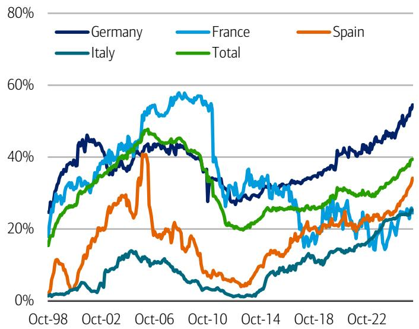

line

| Date   | Germany | France | Spain | Italy | Total |
|--------|---------|--------|-------|-------|-------|
| Oct-98 | ~25%    | ~20%   | ~10%  | ~5%   | ~15%  |
| Oct-02 | ~45%    | ~35%   | ~25%  | ~10%  | ~30%  |
| Oct-06 | ~40%    | ~55%   | ~40%  | ~15%  | ~45%  |
| Oct-10 | ~30%    | ~30%   | ~10%  | ~5%   | ~30%  |
| Oct-14 | ~35%    | ~35%   | ~15%  | ~10%  | ~25%  |
| Oct-18 | ~40%    | ~25%   | ~20%  | ~15%  | ~30%  |
| Oct-22 | ~55%    | ~25%   | ~35%  | ~25%  | ~40%  |

Source: ECB, Haver, BofA Global Research

BofA GLOBAL RESEARCH

Exhibit 29: Net transactions in EA general gov bonds by EA banks, split by domicile of banking system, EUR bn. Last data point = Mar-26   
Values split into domestic, non-domestic, & total as well as 1m, 3m & YTD   
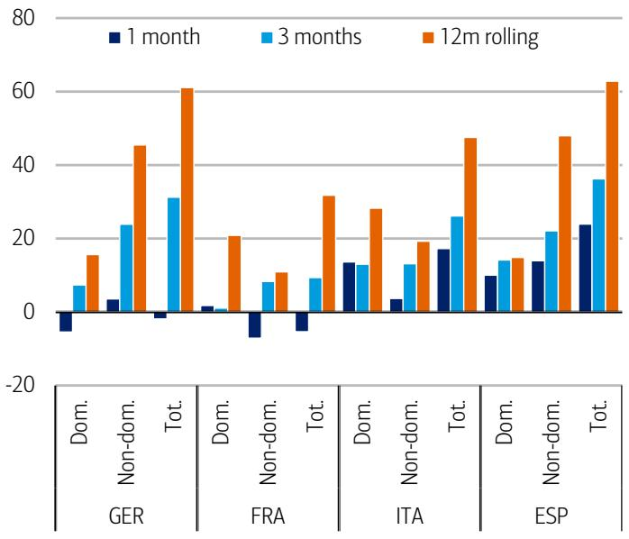

bar

| Category | Subcategory | 1 month | 3 months | 12m rolling |
| :--- | :--- | :--- | :--- | :--- |
| GER | Dom. | -5 | 7 | 15 |
| GER | Non-dom. | 3 | 23 | 45 |
| GER | Tot. | -2 | 31 | 61 |
| FRA | Dom. | 1 | 1 | 20 |
| FRA | Non-dom. | -8 | 8 | 11 |
| FRA | Tot. | -5 | 9 | 31 |
| ITA | Dom. | 13 | 12 | 28 |
| ITA | Non-dom. | 3 | 12 | 19 |
| ITA | Tot. | 17 | 25 | 47 |
| ESP | Dom. | 9 | 14 | 14 |
| ESP | Non-dom. | 13 | 21 | 47 |
| ESP | Tot. | 23 | 36 | 62 |
The bottom row is a duplicate label starting from the first row. The data appears to be estimated based on the visual representation of the bars.

Source: ECB, Haver, BofA Global Research   
BofA GLOBAL RESEARCH

Exhibit 30: Net transactions in EA general gov bonds by EA banks, split by domicile of banking system, EUR bn. Last data point = Mar-26   
Values split into domestic, non-domestic, & total as well as 1m, 3m & YTD   
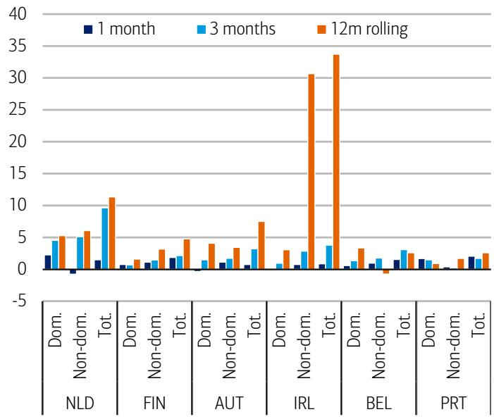  
Source: ECB, Haver, BofA Global Research   
BofA GLOBAL RESEARCH

# Positioning & Flows: Global investors

# Global investors – Fund managers

Exhibit 31: Duration exposure and view 2012-26ytd: Core Europe (May-26)   
In duration, both sentiment and exposure turned bullish   
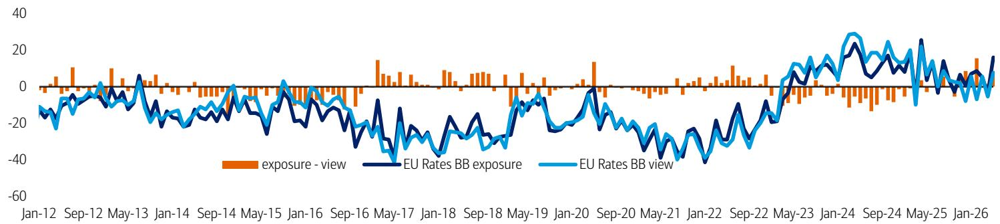

bar_line

| Date     | exposure - view | EU Rates BB exposure | EU Rates BB view |
|----------|-----------------|----------------------|------------------|
| Jan-12   | ~0              | ~-15                 | ~-20             |
| Sep-12   | ~0              | ~-10                 | ~-15             |
| May-13   | ~0              | ~0                   | ~0               |
| Jan-14   | ~0              | ~-5                  | ~-10             |
| Sep-14   | ~0              | ~-10                 | ~-15             |
| May-15   | ~0              | ~-15                 | ~-20             |
| Jan-16   | ~0              | ~-20                 | ~-25             |
| Sep-16   | ~0              | ~-25                 | ~-30             |
| May-17   | ~15             | ~-30                 | ~-35             |
| Jan-18   | ~0              | ~-25                 | ~-30             |
| Sep-18   | ~0              | ~-20                 | ~-25             |
| May-19   | ~0              | ~-15                 | ~-20             |
| Jan-20   | ~0              | ~-10                 | ~-15             |
| Sep-20   | ~15             | ~-5                  | ~-10             |
| May-21   | ~0              | ~0                   | ~-5               |
| Jan-22   | ~0              | ~5                   | ~10              |
| Sep-22   | ~0              | ~10                  | ~15              |
| May-23   | ~0              | ~15                  | ~20              |
| Jan-24   | ~0              | ~20                  | ~25              |
| Sep-24   | ~0              | ~25                  | ~30              |
| May-25   | ~0              | ~30                  | ~35              |
| Jan-26   | ~0              | ~35                  | ~40              |

Source: BofA Global Research FX and Rates Sentiment Survey   
BB is the Bull-Bear Index for exposure and view. It weights responses to create an index ranging from -100 to +100, zero representing neutral. See appendix for formulas.   
BofA GLOBAL RESEARCH

Exhibit 32: Duration exposure and view 2014-26ytd: Peripheral Europe (May-26)   
In peripheral Europe, sentiment turned neutral while positioning remained largely unchanged from last month's bullish levels   
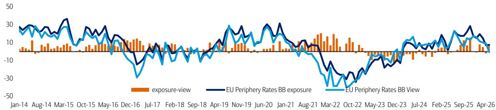

bar_line

| Date     | exposure-view | EU Periphery Rates BB exposure | EU Periphery Rates BB View |
|----------|---------------|-------------------------------|-----------------------------|
| Jan-14   | ~5            | ~25                           | ~20                         |
| Aug-14   | ~5            | ~30                           | ~25                         |
| Mar-15   | ~5            | ~35                           | ~30                         |
| Oct-15   | ~5            | ~25                           | ~20                         |
| May-16   | ~5            | ~30                           | ~25                         |
| Dec-16   | ~5            | ~10                           | ~-30                        |
| Jul-17   | ~5            | ~5                            | ~-10                        |
| Feb-18   | ~5            | ~10                           | ~-5                         |
| Sep-18   | ~5            | ~5                            | ~-10                        |
| Apr-19   | ~5            | ~10                           | ~-5                         |
| Nov-19   | ~5            | ~30                           | ~25                         |
| Jun-20   | ~5            | ~30                           | ~20                         |
| Jan-21   | ~5            | ~30                           | ~20                         |
| Aug-21   | ~5            | ~10                           | ~-10                        |
| Mar-22   | ~5            | ~-30                          | ~-40                        |
| Oct-22   | ~5            | ~-30                          | ~-40                        |
| May-23   | ~5            | ~-10                          | ~-10                        |
| Dec-23   | ~5            | ~-5                           | ~-5                         |
| Jul-24   | ~5            | ~10                           | ~10                         |
| Feb-25   | ~5            | ~30                           | ~25                         |
| Sep-25   | ~5            | ~30                           | ~20                         |
| Apr-26   | ~5            | ~10                           | ~5                          |

Source: BofA Global Research FX and Rates Sentiment Survey   
BB is the Bull-Bear Index for exposure and view. It weights responses to create an index ranging from -100 to +100, zero representing neutral. See appendix for formulas.   
BofA GLOBAL RESEARCH

Exhibit 33: Fund managers' duration exposure 2004-YTD, FXRS Survey index (latest May-26)   
Positive values indicate overweight positioning   
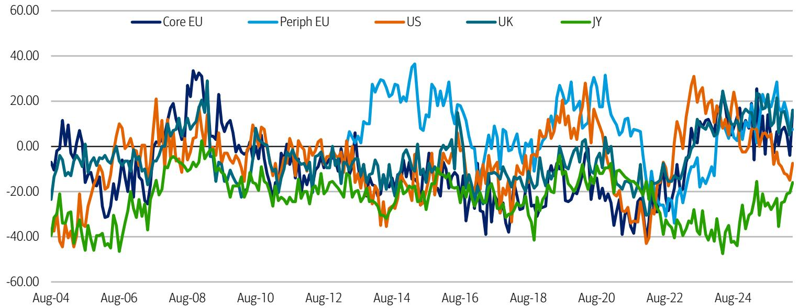

line

| Date   | Core EU | Periph EU | US   | UK   | JY   |
|--------|---------|-----------|------|------|------|
| Aug-04 | ~10.0   | ~-10.0    | ~-40.0 | ~-20.0 | ~-35.0 |
| Aug-06 | ~-20.0  | ~-10.0    | ~-15.0 | ~-10.0 | ~-40.0 |
| Aug-08 | ~35.0   | ~-5.0     | ~20.0  | ~15.0  | ~-10.0 |
| Aug-10 | ~-5.0   | ~-10.0    | ~10.0  | ~-5.0  | ~-20.0 |
| Aug-12 | ~-10.0  | ~-5.0     | ~5.0   | ~-10.0 | ~-25.0 |
| Aug-14 | ~-5.0   | ~35.0     | ~-35.0 | ~-15.0 | ~-30.0 |
| Aug-16 | ~-15.0  | ~15.0     | ~-10.0 | ~-5.0  | ~-25.0 |
| Aug-18 | ~-30.0  | ~5.0      | ~-15.0 | ~-10.0 | ~-40.0 |
| Aug-20 | ~-25.0  | ~30.0     | ~25.0  | ~-5.0  | ~-15.0 |
| Aug-22 | ~-40.0  | ~-15.0    | ~-45.0 | ~-25.0 | ~-35.0 |
| Aug-24 | ~-15.0  | ~30.0     | ~25.0  | ~15.0  | ~-25.0 |

Source: BofA Global Research FX and Rates Sentiment Survey. The Index for exposure weights responses to create an index ranging from -100 to +100, zero representing neutral. See appendix for formulas.   
BofA GLOBAL RESEARCH

Exhibit 34: Fund managers' duration exposure latest 12m, FXRS Survey index (latest Apr-26)   
Positive values indicate overweight positioning   
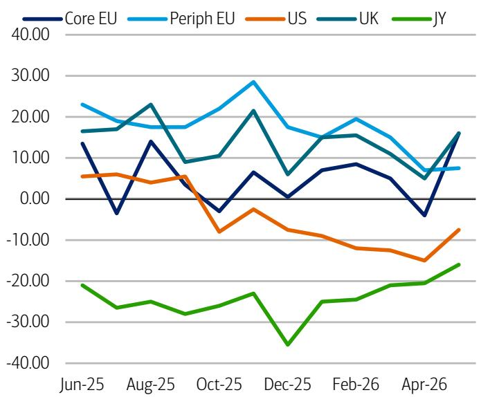

line

| Month   | Core EU | Periph EU | US    | UK    | JY     |
|---------|---------|-----------|-------|-------|--------|
| Jun-25  | 15.00   | 25.00     | 5.00  | 17.00 | -20.00 |
| Aug-25  | -5.00   | 18.00     | 5.00  | 25.00 | -25.00 |
| Oct-25  | -5.00   | 28.00     | -5.00 | 10.00 | -28.00 |
| Dec-25  | 5.00    | 18.00     | -10.00| 5.00  | -35.00 |
| Feb-26  | 10.00   | 20.00     | -15.00| 15.00 | -25.00 |
| Apr-26  | -5.00   | 5.00      | -18.00| 15.00 | -20.00 |

Source: BofA Global Research FX and Rates Sentiment Survey. The Index for exposure weights responses to create an index ranging from -100 to +100, zero representing neutral. See appendix for formulas.   
BofA GLOBAL RESEARCH

# Global investors - Japanese Investors

Exhibit 36: Weekly net investment abroad, medium and long term bonds, bn EUR.   
Values represent all non-Japanese bond purchases   
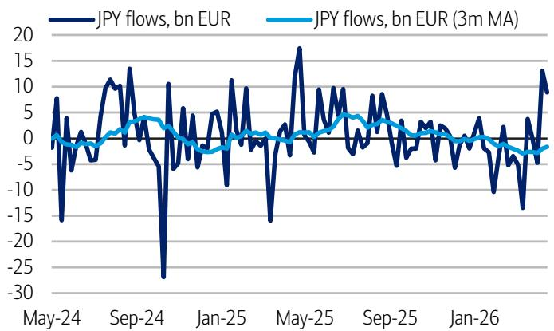

line

| Date   | JPY flows, bn EUR | JPY flows, bn EUR (3m MA) |
|--------|-------------------|---------------------------|
| May-24 | ~8                | ~0                        |
| Sep-24 | ~12               | ~2                        |
| Jan-25 | ~-10              | ~0                        |
| May-25 | ~18               | ~2                        |
| Sep-25 | ~5                | ~0                        |
| Jan-26 | ~-15              | ~-2                       |

Source: MoF, Bloomberg, BofA Global Research   
BofA GLOBAL RESEARCH

Exhibit 35: Difference between fund managers' duration sentiment vs exposure, latest reading from FXRS Survey index (latest Apr-26)   
Positive values indicate more bullish sentiment than positioning   
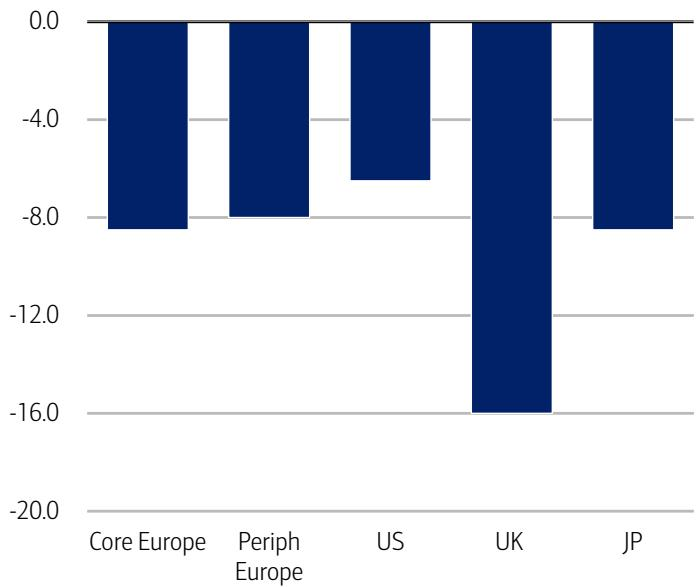

bar

| Region | Value |
| :--- | :--- |
| Core Europe | -8.5 |
| Periph Europe | -8.2 |
| US | -7.0 |
| UK | -16.0 |
| JP | -8.3 |

Source: BofA Global Research FX and Rates Sentiment Survey. The Index for exposure and sentiment weights responses to create an index ranging from -100 to +100, zero representing neutral. See appendix for formulas   
BofA GLOBAL RESEARCH

Exhibit 37: Net Japanese investors' flow in debt securities, bn EUR. Last monthly data point = March   
z--scores are based on 5y backward looking period 

<table><tr><td>Region</td><td>Last month (EUR bn)</td><td>Last month (5y z-score)</td><td>Last 3 months (EUR bn)</td></tr><tr><td>Germany</td><td>-2.9</td><td>-1.3</td><td>-3.3</td></tr><tr><td>Netherlands</td><td>-0.9</td><td>-0.7</td><td>-2.2</td></tr><tr><td>Finland</td><td>0.0</td><td>0.0</td><td>-0.1</td></tr><tr><td>Austria</td><td>-0.2</td><td>-0.9</td><td>0.4</td></tr><tr><td>Ireland</td><td>0.1</td><td>-0.3</td><td>1.5</td></tr><tr><td>France</td><td>-2.3</td><td>-0.7</td><td>-3.8</td></tr><tr><td>Belgium</td><td>0.2</td><td>0.7</td><td>-0.4</td></tr><tr><td>Spain</td><td>-0.1</td><td>0.0</td><td>0.9</td></tr><tr><td>Portugal</td><td>-0.1</td><td>-0.3</td><td>0.2</td></tr><tr><td>Italy</td><td>-0.3</td><td>-0.2</td><td>0.1</td></tr><tr><td>Greece</td><td>0.0</td><td>-0.5</td><td>-0.1</td></tr><tr><td>Sum Euro Area</td><td>-6.7</td><td>-1.2</td><td>-6.6</td></tr></table>

Source: MoF, Bloomberg, BofA Global Research   
BofA GLOBAL RESEARCH

Exhibit 38: Cum. net flows from JP investors in long term government debt since Jan-2014, bn EUR. Last monthly data point = January   
JP investors have been net sellers of core since Jan-2014   
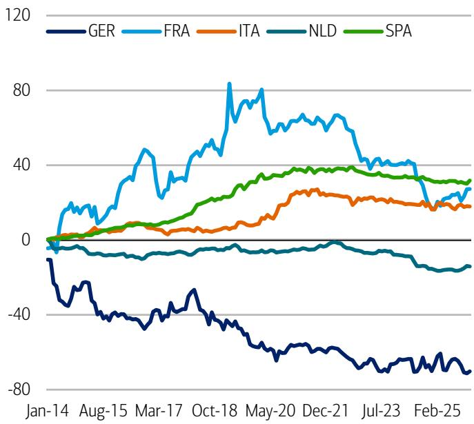

line

| Date    | GER   | FRA   | ITA   | NLD   | SPA   |
|---------|-------|-------|-------|-------|-------|
| Jan-14  | -30   | 0     | 0     | 0     | 0     |
| Aug-15  | -40   | 20    | 5     | -5    | 5     |
| Mar-17  | -45   | 40    | 10    | -10   | 10    |
| Oct-18  | -50   | 80    | 15    | -15   | 20    |
| May-20  | -60   | 70    | 20    | -20   | 30    |
| Dec-21  | -65   | 60    | 25    | -25   | 35    |
| Jul-23  | -70   | 40    | 30    | -30   | 35    |
| Feb-25  | -75   | 30    | 35    | -35   | 35    |

Source: MoF, Bloomberg, BofA Global Research   
BofA GLOBAL RESEARCH

Exhibit 39: Monthly net flows into EA vs US debt securities, bn USD. Last monthly data point = January   
Values are updated on a monthly basis   
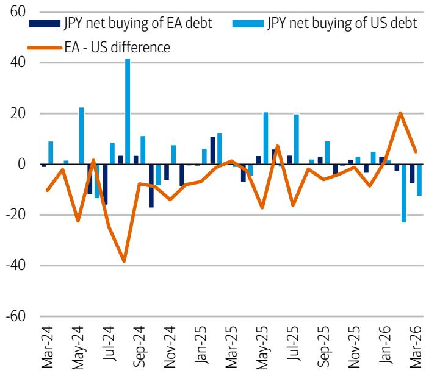

bar_line

| Month   | JPY net buying of EA debt | JPY net buying of US debt | EA - US difference |
|---------|---------------------------|---------------------------|--------------------|
| Mar-24  | -                         | 10                        | -10                |
| May-24  | -                         | 22                        | -25                |
| Jul-24  | -15                       | 8                         | -35                |
| Sep-24  | 3                         | 42                        | -10                |
| Nov-24  | -15                       | 10                        | -15                |
| Jan-25  | 10                        | 12                        | -5                 |
| Mar-25  | -5                        | 10                        | 0                  |
| May-25  | 3                         | 20                        | -15                |
| Jul-25  | 3                         | 20                        | -15                |
| Sep-25  | 1                         | 10                        | -5                 |
| Nov-25  | -5                        | 3                         | -5                 |
| Jan-26  | 3                         | 5                         | -10                |
| Mar-26  | -10                       | -25                       | 20                 |

Source: MoF, Bloomberg, BofA Global Research   
BofA GLOBAL RESEARCH

# Global investors – Balance of payments data

Exhibit 40: BoP: Financial account, portfolio liabilities, long term gov debt from Euro Area, cum. EUR bn. Latest monthly data = February   
Foreign purchases of Euro Area government bonds   
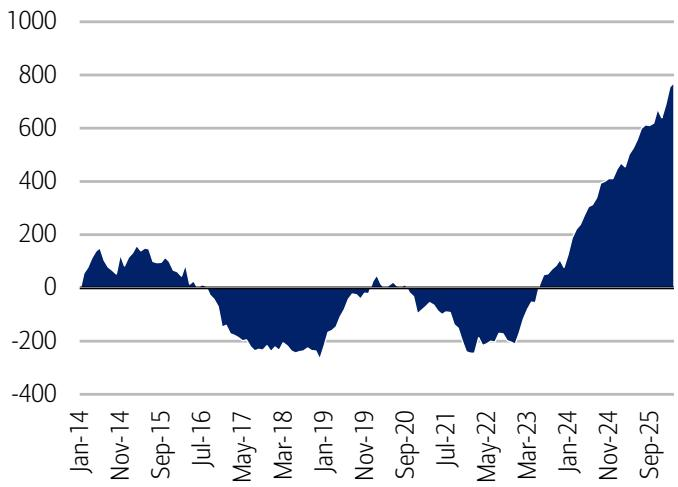

area

| Date    | Value |
|---------|-------|
| Jan-14  | 0     |
| Nov-14  | 100   |
| Sep-15  | 150   |
| Jul-16  | 0     |
| May-17  | -100  |
| Mar-18  | -200  |
| Jan-19  | -250  |
| Nov-19  | 0     |
| Sep-20  | 0     |
| Jul-21  | -100  |
| May-22  | -200  |
| Mar-23  | -150  |
| Jan-24  | 0     |
| Nov-24  | 400   |
| Sep-25  | 800   |

Source: ECB Balance of payment data, Bloomberg, BofA Global Research   
BofA GLOBAL RESEARCH

Exhibit 41: BoP: Financial account, portfolio liabilities, long term gov debt to Euro Area, cumulative EUR bn. Latest monthly data = February
Investment type recorded as being purchased by foreign investors: Germany Public debt. France: Debt securities, bonds and notes. Italy: Government bonds. Portugal: Bonds. Spain: Government debt   
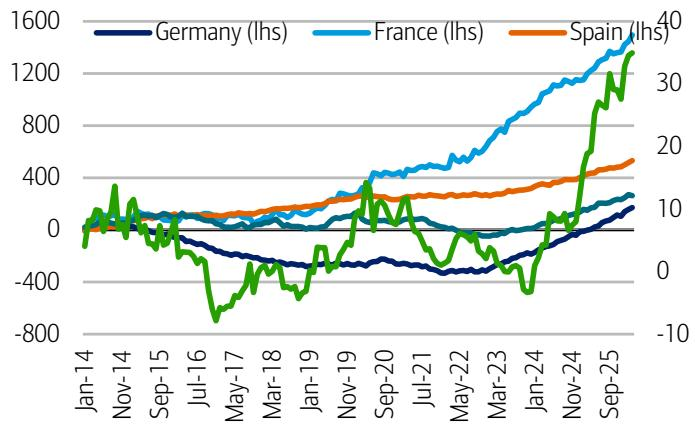

line

| Date    | Germany (lhs) | France (lhs) | Spain (lhs) |
|---------|---------------|--------------|-------------|
| Jan-14  | ~0            | ~0           | ~0          |
| Nov-14  | ~0            | ~0           | ~0          |
| Sep-15  | ~0            | ~0           | ~0          |
| Jul-16  | ~-200         | ~0           | ~0          |
| May-17  | ~-300         | ~0           | ~0          |
| Mar-18  | ~-300         | ~0           | ~0          |
| Jan-19  | ~-300         | ~0           | ~0          |
| Nov-19  | ~-300         | ~0           | ~0          |
| Sep-20  | ~-300         | ~400         | ~10         |
| Jul-21  | ~-300         | ~400         | ~10         |
| May-22  | ~-300         | ~400         | ~10         |
| Mar-23  | ~-300         | ~400         | ~10         |
| Jan-24  | ~-300         | ~400         | ~10         |
| Nov-24  | ~-300         | ~400         | ~15         |
| Sep-25  | ~200          | ~1500        | ~20         |

Source: ECB Balance of payment data, Bloomberg, BofA Global Research   
BofA GLOBAL RESEARCH

# ECB - Redemptions

Exhibit 42: Estimated ECB redemptions of EGBs   
We expect €305bn in redemptions by the ECB in 2026 

<table><tr><td>ECB</td><td>Jan</td><td>Feb</td><td>Mar</td><td>Apr</td><td>May</td><td>Jun</td><td>Jul</td><td>Aug</td><td>Sep</td><td>Oct</td><td>Nov</td><td>Dec</td><td>2026</td></tr><tr><td>Austria</td><td>0</td><td>0</td><td>4</td><td>0</td><td>0</td><td>0</td><td>2</td><td>0</td><td>0</td><td>7</td><td>0</td><td>0</td><td>13</td></tr><tr><td>Belgium</td><td>0</td><td>0</td><td>4</td><td>0</td><td>0</td><td>5</td><td>0</td><td>0</td><td>0</td><td>0</td><td>0</td><td>0</td><td>9</td></tr><tr><td>Finland</td><td>0</td><td>0</td><td>0</td><td>4</td><td>0</td><td>0</td><td>0</td><td>0</td><td>2</td><td>0</td><td>0</td><td>0</td><td>6</td></tr><tr><td>France</td><td>0</td><td>12</td><td>4</td><td>12</td><td>12</td><td>0</td><td>0</td><td>0</td><td>10</td><td>0</td><td>13</td><td>0</td><td>63</td></tr><tr><td>Germany</td><td>0</td><td>15</td><td>0</td><td>24</td><td>0</td><td>0</td><td>0</td><td>15</td><td>0</td><td>11</td><td>0</td><td>0</td><td>65</td></tr><tr><td>Greece</td><td>0</td><td>2</td><td>0</td><td>0</td><td>0</td><td>0</td><td>1</td><td>0</td><td>0</td><td>0</td><td>0</td><td>0</td><td>3</td></tr><tr><td>Ireland</td><td>0</td><td>0</td><td>0</td><td>0</td><td>5</td><td>0</td><td>0</td><td>0</td><td>0</td><td>0</td><td>0</td><td>0</td><td>5</td></tr><tr><td>Italy</td><td>5</td><td>6</td><td>9</td><td>14</td><td>5</td><td>6</td><td>5</td><td>5</td><td>9</td><td>0</td><td>4</td><td>6</td><td>73</td></tr><tr><td>Netherlands</td><td>5</td><td>0</td><td>0</td><td>0</td><td>0</td><td>0</td><td>8</td><td>0</td><td>0</td><td>0</td><td>0</td><td>0</td><td>13</td></tr><tr><td>Portugal</td><td>0</td><td>0</td><td>0</td><td>0</td><td>0</td><td>0</td><td>5</td><td>0</td><td>0</td><td>0</td><td>0</td><td>0</td><td>5</td></tr><tr><td>Spain</td><td>9</td><td>0</td><td>0</td><td>10</td><td>10</td><td>0</td><td>10</td><td>0</td><td>0</td><td>12</td><td>0</td><td>0</td><td>50</td></tr><tr><td>Total</td><td>19</td><td>36</td><td>21</td><td>62</td><td>32</td><td>11</td><td>31</td><td>20</td><td>21</td><td>30</td><td>17</td><td>6</td><td>305</td></tr></table>

Source: BofA Global Research   
BofA GLOBAL RESEARCH

# Net purchases of German gov securities

Exhibit 43: Leveraged investors' net sold in March   
Net purchases of German government securities by leveraged investors, €mn   
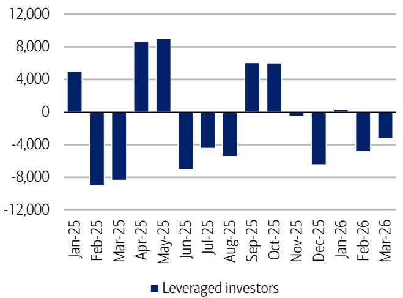

bar

| Month | Leveraged investors |
|---|---|
| Jan-25 | 4300 |
| Feb-25 | -10000 |
| Mar-25 | -8000 |
| Apr-25 | 8200 |
| May-25 | 8500 |
| Jun-25 | -7500 |
| Jul-25 | -4000 |
| Aug-25 | -5000 |
| Sep-25 | 6000 |
| Oct-25 | 6000 |
| Nov-25 | -100 |
| Dec-25 | -6500 |
| Jan-26 | 50 |
| Feb-26 | -4500 |
| Mar-26 | -3500 |

Source: Finanzagentur. Net purchases based on secondary market activities.   
BofA GLOBAL RESEARCH

Exhibit 45: Bank net purchases YTD are slightly less vs 2025 YTD   
Net purchases of German government securities by banks, €mn   
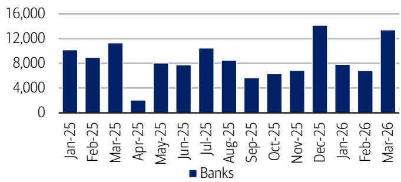

bar

| Month | Banks |
|---|---|
| Jan-25 | 10000 |
| Feb-25 | 8500 |
| Mar-25 | 11500 |
| Apr-25 | 3000 |
| May-25 | 8000 |
| Jun-25 | 7800 |
| Jul-25 | 11000 |
| Aug-25 | 8200 |
| Sep-25 | 6000 |
| Oct-25 | 7000 |
| Nov-25 | 7500 |
| Dec-25 | 13500 |
| Jan-26 | 8000 |
| Feb-26 | 7500 |
| Mar-26 | 12500 |

Source: Finanzagentur. Net purchases based on secondary market activities.   
BofA GLOBAL RESEARCH

Exhibit 47: Central bank net purchases surged in Mar 26   
Net purchases of German government securities by central banks, €mn   
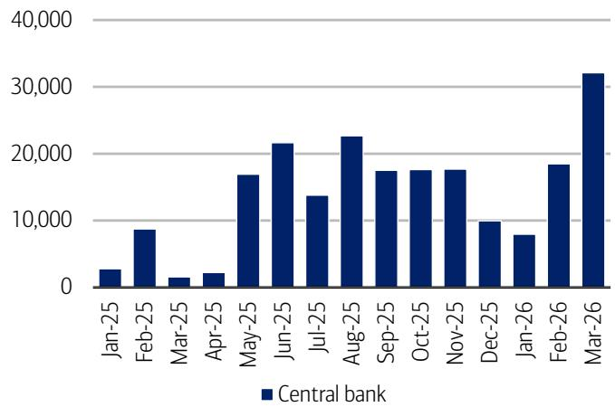

bar

| Month | Central bank |
|---|---|
| Jan-25 | 2500 |
| Feb-25 | 8500 |
| Mar-25 | 1200 |
| Apr-25 | 1800 |
| May-25 | 17000 |
| Jun-25 | 21500 |
| Jul-25 | 13500 |
| Aug-25 | 22500 |
| Sep-25 | 17500 |
| Oct-25 | 17500 |
| Nov-25 | 17800 |
| Dec-25 | 9800 |
| Jan-26 | 7800 |
| Feb-26 | 18500 |
| Mar-26 | 32000 |

Source: Finanzagentur. Net purchases based on secondary market activities.   
BofA GLOBAL RESEARCH

Exhibit 44: Leveraged investors net sold across curve ex. 10y & Bubills   
Net purchases by leveraged investors by tenor in Mar26, €mn   
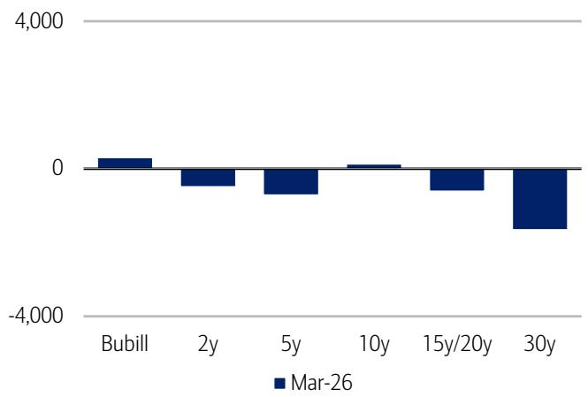

bar

| Period | Value |
| :--- | :--- |
| Bubill | 500 |
| 2y | -1000 |
| 5y | -1500 |
| 10y | 200 |
| 15y/20y | -800 |
| 30y | -3000 |

Source: Finanzagentur. Net purchases based on secondary market activities.   
BofA GLOBAL RESEARCH

Exhibit 46: Bank net purchases most in Bubills in March   
Net purchases by banks by tenor in Mar26, €mn   
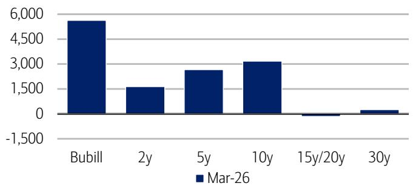

bar

| Category | Value |
|---|---|
| Bubill | 5800 |
| 2y | 1500 |
| 5y | 2700 |
| 10y | 3000 |
| 15y/20y | -50 |
| 30y | 50 |

Source: Finanzagentur. Net purchases based on secondary market activities.   
BofA GLOBAL RESEARCH

Exhibit 48: Central bank net purchases across curve ex. 15-20y   
Net purchases by central banks by tenor in Mar26, €mn   
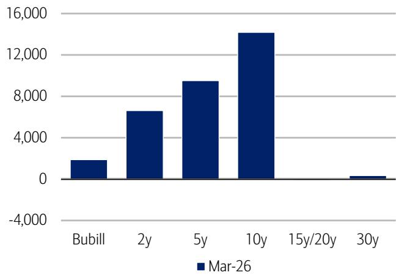

bar

| Category | Value |
|---|---|
| Bubill | 2000 |
| 2y | 6000 |
| 5y | 9000 |
| 10y | 14000 |
| 15y/20y | -100 |
| 30y | 500 |

Source: Finanzagentur. Net purchases based on secondary market activities   
BofA GLOBAL RESEARCH

# Appendix

# A guide to the BofA Global Investor Survey

Our monthly survey has asked the same two questions since its May 1989 start date: "Relative to your own benchmark, 1) how is your portfolio structured in terms of currency exposure, and 2) how is your portfolio structured in terms of duration exposure?". In December 2011, we added two questions: 1) "How would you describe your view on the following currencies, and 2) how would you describe your view on the following bond markets?". Regarding "exposure", there are five responses from which to choose: Heavily Overweight, Moderately Overweight, Neutral, Moderately Underweight, and Heavily Underweight, while for "view", the equivalent responses are Very Bullish, Bullish, Neutral, Bearish, and Very Bearish. In both cases, responses are weighted to create a Bull-Bear index from -100 to 100, with zero representing neutral.

$^{1}$ The formula used to calculate the Bull-Bear Index (B/B) is as follows:

B/B (exposure) = (% Heavy Overweight \* 1.0) + (% Moderately Overweight \* 0.5) + (% Neutral \* 0) - (% Moderately

Underweight \* 0.5) - (% Heavily Underweight \* 1.0).

B/B (view) = (% Very Bullish \* 1.0) + (% Bullish \* 0.5) + (% Neutral \* 0) - (% Bearish \* 0.5) - (% Very Bearish \* 1.0)

BofA makes no representations or warranties whatsoever as to the data and information provided in any referenced website and shall have no liability or responsibility arising out of or in connection with any referenced website. BofA Global Research did not participate in the gathering of data for this survey.

# List of Abbreviations

# Exhibit 49: List of abbreviations used.

Meaning of abbreviations used in the research note

<table><tr><td>Abbreviation</td><td>Meaning</td></tr><tr><td>AGBs</td><td>Australian government bonds</td></tr><tr><td>bp</td><td>Basis points</td></tr><tr><td>C&amp;R</td><td>Coupon and redemptions</td></tr><tr><td>CTD</td><td>Cheapest to deliver</td></tr><tr><td>EA</td><td>Euor Area</td></tr><tr><td>ECB</td><td>European Central Bank</td></tr><tr><td>EGB</td><td>European government bond</td></tr><tr><td>HH, &amp; NPISH</td><td>Households &amp; Non-profit institutions serving households</td></tr><tr><td>IGBs</td><td>Japanese government bonds</td></tr><tr><td>MA</td><td>Moving average</td></tr><tr><td>MFI</td><td>Euro Area Monetary Financial Institution</td></tr><tr><td>NFCs</td><td>Non financial corporates</td></tr><tr><td>Non MMF Inv Fnds</td><td>Non money market fund investment funds</td></tr><tr><td>OAT</td><td>French government bond</td></tr><tr><td>QE</td><td>Quantitative easing</td></tr><tr><td>QT</td><td>Quantitative tightening</td></tr><tr><td>UST</td><td>US Treasuries</td></tr><tr><td>WoW</td><td>Week over week</td></tr><tr><td>GER</td><td>Germany</td></tr><tr><td>NLD</td><td>the Netherlands</td></tr><tr><td>FIN</td><td>Finland</td></tr><tr><td>AUS</td><td>Austria</td></tr><tr><td>IRE</td><td>Ireland</td></tr><tr><td>FRA</td><td>France</td></tr><tr><td>BEL</td><td>Belgium</td></tr><tr><td>SPA</td><td>Spain</td></tr><tr><td>POR</td><td>Portugal</td></tr><tr><td>ITA</td><td>Italy</td></tr><tr><td>GRE</td><td>Greece</td></tr><tr><td>DU</td><td>2y German future</td></tr><tr><td>OE</td><td>5y German future</td></tr><tr><td>RX</td><td>10y German future</td></tr><tr><td>UB</td><td>30y German future</td></tr><tr><td>BTS</td><td>2y Italian future</td></tr><tr><td>IK</td><td>10y Italian future</td></tr><tr><td>OAT</td><td>10y French Future</td></tr><tr><td>SPGB</td><td>Spanish government bonds</td></tr></table>

Source: BofA Global Research   
BofA GLOBAL RESEARCH

For calculation details of charts, please refer to European Rates Watch: EGB supply, positioning & flows 29 September 2025.

# Analyst Certification

I, Edvard Davidsson, hereby certify that the views expressed in this research report accurately reflect my personal views about the subject securities and issuers. I also certify that no part of my compensation was, is, or will be, directly or indirectly, related to the specific recommendations or view expressed in this research report.

# Disclosures

# Important Disclosures

BofA Global Research personnel (including the analyst(s) responsible for this report) receive compensation based upon, among other factors, the overall profitability of BofA Corporation, including profits derived from investment banking. The analyst(s) responsible for this report may also receive compensation based upon, among other factors, the overall profitability of the Bank's sales and trading businesses relating to the class of securities or financial instruments for which such analyst is responsible.
BofA fixed income analysts regularly interact with sales and trading desk personnel in connection with their research, including to ascertain pricing and liquidity in the fixed income markets.

# Other Important Disclosures

Prices are indicative and for information purposes only. Except as otherwise stated in the report, for any recommendation in relation to an equity security, the price referenced is the publicly traded price of the security as of close of business on the day prior to the date of the report or, if the report is published during intraday trading, the price referenced is indicative of the traded price as of the date and time of the report and in relation to a debt security (including equity preferred and CDS), prices are indicative as of the date and time of the report and are from various sources including BofA trading desks.

The date and time of completion of the production of any recommendation in this report shall be the date and time of dissemination of this report as recorded in the report timestamp.

This report may refer to fixed income securities or other financial instruments that may not be offered or sold in one or more states or jurisdictions, or to certain categories of investors, including retail investors. Readers of this report are advised that any discussion, recommendation or other mention of such instruments is not a solicitation or offer to transact in such instruments. Investors should contact their BofA representative or Merrill Global Wealth Management financial advisor for information relating to such instruments. Rule 144A securities may be offered or sold only to persons in the U.S. who are Qualified Institutional Buyers within the meaning of Rule 144A under the Securities Act of 1933, as amended. SECURITIES OR OTHER FINANCIAL INSTRUMENTS DISCUSSED HEREIN MAY BE RATED BELOW INVESTMENT GRADE AND SHOULD THEREFORE ONLY BE CONSIDERED FOR INCLUSION IN ACCOUNTS QUALIFIED FOR SPECULATIVE INVESTMENT.

Recipients who are not institutional investors or market professionals should seek the advice of their independent financial advisor before considering information in this report in connection with any investment decision, or for a necessary explanation of its contents.

The securities or other financial instruments discussed in this report may be traded over-the-counter. Retail sales and/or distribution of this report may be made only in states where these instruments are exempt from registration or have been qualified for sale.

Officers of BofAS or one or more of its affiliates (other than research analysts) may have a financial interest in securities of the issuer(s) or in related investments.

This report, and the securities or other financial instruments discussed herein, may not be eligible for distribution or sale in all countries or to certain categories of investors, including retail investors.

Refer to BofA Global Research policies relating to conflicts of interest.

"BofA" includes BofA, Inc. ("BofAS") and its affiliates. Investors should contact their BofA representative or Merrill Global Wealth Management financial advisor if they have questions concerning this report or concerning the appropriateness of any investment idea described herein for such investor. "BofA" is a global brand for BofA Global Research.

# Information relating to Non-US affiliates of BofA and Distribution of Affiliate Research Reports:

BofAS and/or BofA, Pierce, Fenner & Smith Incorporated ("MLPF&S") may in the future distribute, information of the following non-US affiliates in the US (short name: legal name, regulator): BofA (South Africa): BofA South Africa (Pty) Ltd., regulated by the Financial Sector Conduct Authority; MLI (UK): BofA International, regulated by the Financial Conduct Authority (FCA) and the Prudential Regulation Authority (PRA); BofASE (France): BofA Europe SA is authorized by the Autorité de Contrôle Prudentiel et de Résolution (ACPR) and regulated by the ACPR and the Autorité des Marchés Financiers (AMF). BofA Europe SA ("BofASE") with registered address at 51, rue La Boétie, 75008 Paris is registered under no 842 602 690 RCS Paris. In accordance with the provisions of French Code Monétaire et Financier (Monetary and Financial Code), BofASE is an établissement de crédit et d'investissement (credit and investment institution) that is authorised and supervised by the European Central Bank and the Autorité de Contrôle Prudentiel et de Résolution (ACPR) and regulated by the ACPR and the Autorité des Marchés Financiers. BofASE's share capital can be found at www.bofaml.com/BofASEdisclaimer; BofA Europe (Milan): BofA Europe Designated Activity Company, Milan Branch, regulated by the Bank of Italy, the European Central Bank (ECB) and the Central Bank of Ireland (CBI); BofA Europe (Frankfurt): BofA Europe Designated Activity Company, Frankfurt Branch regulated by BaFin, the ECB and the CBI; BofA Europe (Zurich): BofA Europe Designated Activity Company, Zurich Branch, regulated by the Swiss Financial Market Supervisory Authority FINMA, the ECB and CBI; BofA Europe (Madrid): BofA Europe Designated Activity Company, Sucursal en España, regulated by the Bank of Spain, the ECB and the CBI; BofA (Australia): BofA Equities (Australia) Limited, regulated by the Australian Securities and Investments Commission; BofA (Hong Kong): BofA (Asia Pacific) Limited, regulated by the Hong Kong Securities and Futures Commission (HKSFC); BofA (Singapore): BofA (Singapore) Pte Ltd, regulated by the Monetary Authority of Singapore (MAS); BofA (Canada): BofA Canada Inc, regulated by the Canadian Investment Regulatory Organization; BofA (Mexico): BofA Mexico, SA de CV, Casa de Bolsa, regulated by the Comisión Nacional Bancaria y de Valores; BofAS Japan: BofA Japan Co., Ltd., regulated by the Financial Services Agency; BofA (Seoul): BofA International, LLC Seoul Branch, regulated by the Financial Supervisory Service; BofA (Taiwan): BofA (Taiwan) Ltd., regulated by the Securities and Futures Bureau; BofAS India: BofA India Limited, regulated by the Securities and Exchange Board of India (SEBI); BofA (Israel): BofA Israel Limited, regulated by Israel Securities Authority; BofA (DIFC): BofA International (DIFC Branch), regulated by the Dubai Financial Services Authority (DFSA); BofA (Brazil): BofA S.A. Corretora de Títulos e Valores Mobiliários, regulated by Comissão de Valores Mobiliários; BofA KSA Company: BofA Kingdom of Saudi Arabia Company, regulated by the Capital Market Authority. This information: has been approved for publication and is distributed in the United Kingdom (UK) to professional clients and eligible counterparties (as each is defined in the rules of the FCA and the PRA) by MLI (UK), which is authorized by the PRA and regulated by the FCA and the PRA - details about the extent of our regulation by the FCA and PRA are available from us on request; has been approved for publication and is distributed in the European Economic Area (EEA) by BofASE (France), which is authorized by the ACPR and regulated by the ACPR and the AMF; has been considered and distributed in Japan by BofAS Japan, a registered securities dealer under the Financial Instruments and Exchange Act in Japan, or its permitted affiliates; is issued and distributed in Hong Kong by BofA (Hong Kong) which is regulated by HKSFC; is issued and distributed in Taiwan by BofA (Taiwan); is issued and distributed in India by BofAS India; and is issued and distributed in Singapore to institutional investors and/or accredited investors (each as defined under the Financial Advisers Regulations) by BofA (Singapore) (Company Registration No 198602883D). BofA (Singapore) is regulated by MAS. BofA Equities (Australia) Limited (ABN 65 006 276 795), AFS License 235132 (MLEA) distributes this information in Australia only to 'Wholesale' clients as defined by s.761G of the Corporations Act 2001. With the exception of BofA N.A., Australia Branch, neither MLEA nor any of its affiliates involved in preparing this information is an Authorised Deposit-Taking Institution under the Banking Act 1959 nor regulated by the Australian Prudential Regulation Authority. No approval is required for publication or distribution of this information in Brazil and its local distribution is by BofA (Brazil) in accordance with applicable regulations. BofA (DIFC) is authorized and regulated by the DFSA. Information prepared and issued by BofA (DIFC) is done so in accordance with the requirements of the DFSA conduct of business rules. BofA Europe (Frankfurt) distributes this information in Germany and is regulated by BaFin, the ECB and the CBI. BofA entities, including BofA Europe and BofASE (France), may outsource/delegate the marketing and/or provision of certain research services or aspects of research services to other branches or members of the BofA group. You may be contacted by a different BofA entity acting for and on behalf of your service provider where permitted by applicable law. This does not change your service provider. Please refer to the Electronic Communications Disclaimers for further information.

This information has been prepared and issued by BofAS and/or one or more of its non-US affiliates. The author(s) of this information may not be licensed to carry on regulated activities in your jurisdiction and, if not licensed, do not hold themselves out as being able to do so. BofAS and/or MLPF&S is the distributor of this information in the US and accepts full responsibility for information distributed to BofAS and/or MLPF&S clients in the US by its non-US affiliates. Any US person receiving this information and wishing to effect any transaction in any security

discussed herein should do so through BofAS and/or MLPF&S and not such foreign affiliates. Hong Kong recipients of this information should contact BofA (Asia Pacific) Limited in respect of any matters relating to dealing in securities or provision of specific advice on securities or any other matters arising from, or in connection with, this information. Singapore recipients of this information should contact BofA (Singapore) Pte Ltd in respect of any matters arising from, or in connection with, this information. For clients that are not accredited investors, expert investors or institutional investors BofA (Singapore) Pte Ltd accepts full responsibility for the contents of this information distributed to such clients in Singapore.

# General Investment Related Disclosures:

Taiwan Readers: Neither the information nor any opinion expressed herein constitutes an offer or a solicitation of an offer to transact in any securities or other financial instrument. No part of this report may be used or reproduced or quoted in any manner whatsoever in Taiwan by the press or any other person without the express written consent of BofA. This document provides general information only, and has been prepared for, and is intended for general distribution to, BofA clients. Neither the information nor any opinion expressed constitutes an offer or an invitation to make an offer, to buy or sell any securities or other financial instrument or any derivative related to such securities or instruments (e.g., options, futures, warrants, and contracts for differences). This document is not intended to provide personal investment advice and it does not take into account the specific investment objectives, financial situation and the particular needs of, and is not directed to, any specific person(s). This document and its content do not constitute, and should not be considered to constitute, investment advice for purposes of ERISA, the US tax code, the Investment Advisers Act or otherwise. Investors should seek financial advice regarding the appropriateness of investing in financial instruments and implementing investment strategies discussed or recommended in this document and should understand that statements regarding future prospects may not be realized. Any decision to purchase or subscribe for securities in any offering must be based solely on existing public information on such security or the information in the prospectus or other offering document issued in connection with such offering, and not on this document.

Securities and other financial instruments referred to herein, or recommended, offered or sold by BofA, are not insured by the Federal Deposit Insurance Corporation and are not deposits or other obligations of any insured depository institution (including, BofA, N.A.). Investments in general and, derivatives, in particular, involve numerous risks, including, among others, market risk, counterparty default risk and liquidity risk. No security, financial instrument or derivative is suitable for all investors. Digital assets are extremely speculative, volatile and are largely unregulated. In some cases, securities and other financial instruments may be difficult to value or sell and reliable information about the value or risks related to the security or financial instrument may be difficult to obtain. Investors should note that income from such securities and other financial instruments, if any, may fluctuate and that price or value of such securities and instruments may rise or fall and, in some cases, investors may lose their entire principal investment. Past performance is not necessarily a guide to future performance. Levels and basis for taxation may change.

BofA is aware that the implementation of the ideas expressed in this report may depend upon an investor's ability to "short" securities or other financial instruments and that such action may be limited by regulations prohibiting or restricting "shortselling" in many jurisdictions. Investors are urged to seek advice regarding the applicability of such regulations prior to executing any short idea contained in this report.

This report may contain a trading idea or recommendation which highlights a specific identified near-term catalyst or event impacting a security, issuer, industry sector or the market generally that presents a transaction opportunity, but does not have any impact on the analyst's particular "Overweight" or "Underweight" rating (which is based on a three month trade horizon). Trading ideas and recommendations may differ directionally from the analyst's rating on a security or issuer because they reflect the impact of a near-term catalyst or event.

Foreign currency rates of exchange may adversely affect the value, price or income of any security or financial instrument mentioned in this report. Investors in such securities and instruments effectively assume currency risk.

BofAS or one of its affiliates is a regular issuer of traded financial instruments linked to securities that may have been recommended in this report. BofAS or one of its affiliates may, at any time, hold a trading position (long or short) in the securities and financial instruments discussed in this report.

BofA, through business units other than BofA Global Research, may have issued and may in the future issue trading ideas or recommendations that are inconsistent with, and reach different conclusions from, the information presented herein. Such ideas or recommendations may reflect different time frames, assumptions, views and analytical methods of the persons who prepared them, and BofA is under no obligation to ensure that such other trading ideas or recommendations are brought to the attention of any recipient of this information. In the event that the recipient received this information pursuant to a contract between the recipient and BofAS for the provision of research services for a separate fee, and in connection therewith BofAS may be deemed to be acting as an investment adviser, such status relates, if at all, solely to the person with whom BofAS has contracted directly and does not extend beyond the delivery of this report (unless otherwise agreed specifically in writing by BofAS). If such recipient uses the services of BofAS in connection with the sale or purchase of a security referred to herein, BofAS may act as principal for its own account or as agent for another person. BofAS is and continues to act solely as a broker-dealer in connection with the execution of any transactions, including transactions in any securities referred to herein.

# Copyright and General Information:

Copyright 2026 BofA Corporation. All rights reserved. iQdatabase® is a registered service mark of BofA Corporation. This information is prepared for the use of BofA clients and may not be redistributed, retransmitted or disclosed, in whole or in part, or in any form or manner, without the express written consent of BofA. This document and its content is provided solely for informational purposes and cannot be used for training or developing artificial intelligence (AI) models or as an input in any AI application (collectively, an AI tool). Any attempt to utilize this document or any of its content in connection with an AI tool without explicit written permission from BofA Global Research is strictly prohibited. BofA Global Research utilizes AI, including machine learning and other technologies, to enhance the services we provide to our clients. These technologies assist our analysts in various aspects of their work, including but not limited to data analysis, content extraction, content creation, data aggregation and summarization and identifying relevant information from diverse sources. All AI-driven processes are subject to review by BofA Global Research employees. BofA Global Research information is distributed simultaneously to internal and client websites and other portals by BofA and is not publicly-available material. Any unauthorized use or disclosure is prohibited. Receipt and review of this information constitutes your agreement not to redistribute, retransmit, or disclose to others the contents, opinions, conclusion, or information contained herein (including any investment recommendations, estimates or price targets) without first obtaining express permission from an authorized officer of BofA.

Materials prepared by BofA Global Research personnel are based on public information. Facts and views presented in this material have not been reviewed by, and may not reflect information known to, professionals in other business areas of BofA, including investment banking personnel. BofA has established information barriers between BofA Global Research and certain business groups. As a result, BofA does not disclose certain client relationships with, or compensation received from, such issuers. To the extent this material discusses any legal proceeding or issues, it has not been prepared as nor is it intended to express any legal conclusion, opinion or advice. Investors should consult their own legal advisers as to issues of law relating to the subject matter of this material. BofA Global Research personnel's knowledge of legal proceedings in which any BofA entity and/or its directors, officers and employees may be plaintiffs, defendants, co-defendants or co-plaintiffs with or involving issuers mentioned in this material is based on public information. Facts and views presented in this material that relate to any such proceedings have not been reviewed by, discussed with, and may not reflect information known to, professionals in other business areas of BofA in connection with the legal proceedings or matters relevant to such proceedings.

This information has been prepared independently of any issuer of securities mentioned herein and not in connection with any proposed offering of securities or as agent of any issuer of any securities. None of BofAS any of its affiliates or their research analysts has any authority whatsoever to make any representation or warranty on behalf of the issuer(s). BofA Global Research policy prohibits research personnel from disclosing a recommendation, investment rating, or investment thesis for review by an issuer prior to the publication of a research report containing such rating, recommendation or investment thesis.

Any information relating to sustainability in this material is limited as discussed herein and is not intended to provide a comprehensive view on any sustainability claim with respect to any issuer or security.

Any information relating to the tax status of financial instruments discussed herein is not intended to provide tax advice or to be used by anyone to provide tax advice. Investors are urged to seek tax advice based on their particular circumstances from an independent tax professional.

The information herein (other than disclosure information relating to BofA and its affiliates) was obtained from various sources and we do not guarantee its accuracy. This information may contain links to third-party websites. BofA is not responsible for the content of any third-party website or any linked content contained in a third-party website. Content contained on such third-party websites is not part of this information and is not incorporated by reference. The inclusion of a link does not imply any endorsement by or any affiliation with BofA. Access to any third-party website is at your own risk, and you should always review the terms and privacy policies at third-party websites before submitting any personal information to them. BofA is not responsible for such terms and privacy policies and expressly disclaims any liability for them.

All opinions, projections and estimates constitute the judgment of the author as of the date of publication and are subject to change without notice. Prices also are subject to change without notice. BofA is under no obligation to update this information and BofA ability to publish information on the subject issuer(s) in the future is subject to applicable quiet periods. You should therefore assume that BofA will not update any fact, circumstance or opinion contained herein.

Certain outstanding reports or investment opinions relating to securities, financial instruments and/or issuers may no longer be current. Always refer to the most recent research report relating

to an issuer prior to making an investment decision.

In some cases, an issuer may be classified as Restricted or may be Under Review or Extended Review. In each case, investors should consider any investment opinion relating to such issuer (or its security and/or financial instruments) to be suspended or withdrawn and should not rely on the analyses and investment opinion(s) pertaining to such issuer (or its securities and/or financial instruments) nor should the analyses or opinion(s) be considered a solicitation of any kind. Sales persons and financial advisors affiliated with BofAS or any of its affiliates may not solicit purchases of securities or financial instruments that are Restricted or Under Review and may only solicit securities under Extended Review in accordance with firm policies.

Neither BofA nor any officer or employee of BofA accepts any liability whatsoever for any direct, indirect or consequential damages or losses arising from any use of this information.

# Research Analysts

Mark Capleton

Rates Strategist

MLI (UK)

mark.capleton@bofa.com

Edvard Davidsson

Rates Strategist

MLI (UK)

edvard.davidsson@bofa.com

Ronald Man

Rates Strategist

MLI (UK)

ronald.man@bofa.com

Ralf Preusser, CFA

Rates Strategist

MLI (UK)

ralf.preusser@bofa.com

Sphia Salim

Rates Strategist

MLI (UK)

sphia.salim@bofa.com

Agne Stengeryte, CFA

Rates Strategist

MLI (UK)

agne.stengeryte@bofa.com

Trading ideas and investment strategies discussed herein may give rise to significant risk and are not suitable for all investors. Investors should have experience in relevant markets and the financial resources to absorb any losses arising from applying these ideas or strategies.