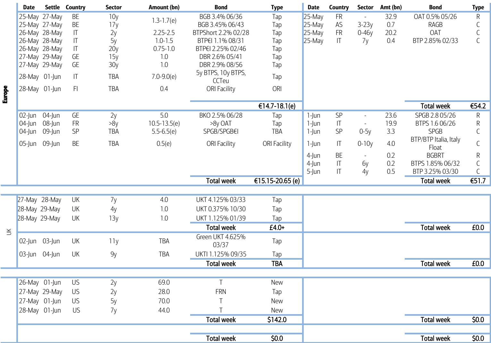
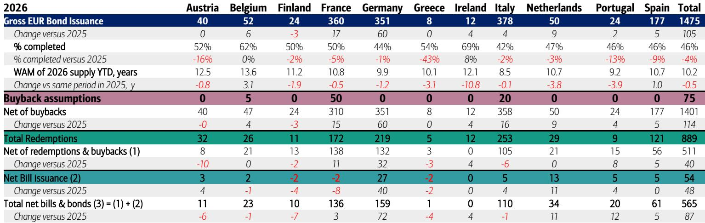

# European Government Bonds Are Entering a Period of Divergent Risk, Not Uniform Spread Compression

The conventional narrative that European government bond markets are converging toward a single, low-risk equilibrium is facing its most serious test since the pandemic-era fragmentation debates. The data from late May 2026 reveals a market that is not simply trading on aggregate supply and demand, but is instead being pulled apart by three distinct forces: a structural shift in German bund demand from both central banks and commercial banks, a looming political risk premium in French OATs that is not yet priced, and a futures positioning complex that is signaling exhaustion in the core-long, periphery-short consensus trade. The net result is a market where the old playbook of buying the entire European government bond complex on duration dips is no longer sufficient. Investors must now differentiate between sovereigns based on idiosyncratic supply calendars, political timelines, and the shifting composition of the buyer base.

This week's data is not a snapshot of a calm market. It is a warning signal. The aggregate net supply picture for the Eurozone over the next two weeks is a negative EUR 33.55 billion, driven by large redemptions in France and Spain on June 1st. That mechanical tailwind for prices is real, but it masks a deeper structural problem: the composition of that demand is changing. The report shows that central banks and banks stepped up purchases of German government securities in March, absorbing EUR 32 billion and EUR 13 billion respectively. Meanwhile, leveraged investors were net sellers. This is not a market where all participants are aligned. It is a market where the official sector is acting as a shock absorber for a private sector that is growing cautious, particularly at the long end of the curve.

The critical question for any rates strategist is not whether European government bonds are a good trade in aggregate. It is which sovereigns will benefit from this shift in buyer composition and which will be left exposed. The answer, based on the data, is that Germany is the clear beneficiary, while France is entering a period of elevated vulnerability that the market has not yet fully discounted.

## The Rotation in German Bund Positioning Is a Structural Signal, Not a Tactical Blip

The most important data point in the report is not the supply calendar. It is the shift in who is buying German bunds. In March 2026, leveraged investors net sold EUR 3 billion of German government securities, with the largest outflows concentrated in the 30-year sector. At the same time, bank net purchases reached over EUR 13 billion, and central bank net purchases jumped to EUR 32 billion, with the 2-10 year sector seeing the largest inflows. This is a textbook example of a buyer base rotation from price-sensitive, momentum-driven capital to price-insensitive, regulatory or reserve-driven capital.

The implication is profound. When central banks and commercial banks are the marginal buyers, the price elasticity of demand decreases. This means that the back-up in yields that would normally accompany a supply glut is muted. It also means that the duration risk in German bunds is being absorbed by the most stable holders in the system. For a portfolio manager, this suggests that the risk of a disorderly sell-off in German bunds is lower than the headline supply numbers would suggest. The market is being de-risked by the very institutions that are least likely to panic.

However, this rotation is not uniform across the curve. The data shows that the largest central bank inflows were in the 2-10 year sector, while leveraged investors sold the 30-year. This creates a curve dynamic where the front end and belly are supported by official sector demand, while the long end is more exposed to private sector sentiment. The futures positioning data reinforces this: across the German curve, the short end (DU) remains the most net-long contract, while the long end (RX) is net short. The market is essentially betting that the official sector will continue to support the front end, but it is skeptical about the long end. That divergence is a trade in itself.

## France Is Facing a Trifecta of Headwinds That the Market Is Underpricing

While Germany benefits from a supportive buyer base, France is entering a period where the market is likely underestimating the convergence of supply, political, and credit risks. The report identifies three specific headwinds for French OATs heading into the summer. First, 45 percent of the expected 2026 net French government bond supply is scheduled for the June to August period. This is a massive concentration of issuance in a short window. Second, the budget season is approaching, with the verdict on Marine Le Pen's potential candidacy in July and the eventual presidential race beginning. Political and fiscal risks are likely to start weighing on OATs early on, and current valuations do not appear to reflect this. Third, Moody's maintains a negative outlook on France, and by the October review, that outlook will have been in place for 12 months, which is within the typical 12-18 month window when outlook-driven rating actions often occur.

The combination of these three factors creates a scenario where France is facing a supply shock, a political risk premium, and a potential credit rating catalyst all at the same time. The market is currently treating OATs as a relatively safe carry trade, but the risk-reward is deteriorating. The report's recommendation to go long EU bonds versus French OATs is a direct expression of this view. The logic is that EU bonds, as a supranational instrument, are less exposed to French domestic political risk, while still offering a yield pickup over German bunds. The trade is a bet that the spread between EU and French bonds will widen from 30 basis points to 40 basis points, with a stop at 25 basis points, which was the tightest level this year reached on February 25th.

The key question for investors is whether this trade is just a tactical pair trade or the beginning of a larger repricing of French risk. The report suggests it is the latter. The political calendar is not a short-term event. The presidential race will dominate headlines for months, and the budget negotiations will be contentious. If Moody's does take a negative rating action in October, the impact on OATs could be significant. The market is currently pricing French risk as if the political situation will resolve itself without major disruption. That assumption is worth challenging.

## The Syndication Calendar Reveals a Market That Is Front-Loading Risk

The supply data for the next two weeks shows a market that is actively managing its issuance calendar to avoid the summer lull. The report expects gross EGB supply of EUR 15-18 billion next week through auctions, with potential for several syndications. Portugal has cancelled its auction, indicating a possible syndication in the 15-30 year tenor for EUR 3 billion. Spain has historically offered a 10-year syndication at the end of May, potentially for EUR 10-15 billion. Greece may also offer EUR 2-3 billion in a 5-year, 15-year, 30-year, or dual-tenor offering. The large redemptions paid on June 1st could be reinvested from next week, providing a natural source of demand.

This syndication activity is not random. It reflects a strategic decision by sovereign issuers to front-load supply before the summer months when market liquidity typically thins. The risk for investors is that this concentrated supply, combined with the French headwinds, creates a period of indigestion. The DV01 of gross issuance is expected to drop in the second half of Q2, but the next two weeks are still heavy. The market's ability to absorb this supply will depend on whether the central bank and bank demand for German bunds spills over into other sovereigns, or whether it remains concentrated in the core.

The report's data on the weighted average maturity (WAM) of 2026 issuance is instructive. The WAM of 2026 supply year-to-date is 10.2 years, which is 0.5 years lower than the same period in 2025. This means that issuers are shortening the duration of their new issuance, which reduces the interest rate risk for the market. However, it also means that the supply of long-duration bonds is relatively scarce, which could support long-end spreads for high-quality issuers like Germany, but it leaves lower-quality issuers more exposed to refinancing risk.

## What the Report Does Not Fully Answer: The Fragility of the Central Bank Demand Channel

The report provides excellent data on the shift in buyer composition for German bunds, but it does not fully address the sustainability of this demand. Central bank purchases of EUR 32 billion in a single month is a massive number. Is this a one-time adjustment, or is it the beginning of a sustained trend? The report does not specify whether these purchases are driven by reserve management, regulatory requirements, or outright monetary policy operations. If it is the latter, then the demand is conditional on the monetary policy stance, which could change.

Furthermore, the report does not explore the potential for a reversal of this flow. If leveraged investors are selling, and central banks are buying, what happens when the central banks stop buying? The market could be left with a vacuum of demand. The report's data on futures positioning shows that open interest increased for all German future contracts, with net positioning turning more long or less short across the curve. However, the report also notes that as we approach the rolling period, it grows increasingly hesitant in relying on futures positioning as a proxy for broader market positioning or sentiment. This is a crucial caveat. The futures data may be reflecting technical roll activity rather than genuine directional conviction.

The unanswered question is whether the central bank demand is a permanent feature of the market or a temporary backstop. If it is temporary, then the current level of bund prices is built on a fragile foundation. Investors should monitor the weekly flow data closely for any signs of a slowdown in central bank purchases.

## A Decision Framework for Navigating the Divergent EGB Market

For portfolio managers and rates traders, the report provides a clear framework for decision-making. The first step is to separate the market into three categories based on the primary risk factor. The first category is core sovereigns with strong official sector demand, such as Germany. These bonds are relatively safe from a sell-off driven by private sector sentiment, but they are also expensive. The trade is to be long the front end and belly, where central bank demand is strongest, and to be cautious on the long end, where leveraged investors are selling.

The second category is sovereigns with concentrated supply and political risk, such as France. These bonds offer a carry premium, but the risk of a sharp widening is elevated. The trade is to hedge French exposure by going long EU bonds or by using OAT versus bund spread wideners. The report's specific recommendation to go long EU 3.75% December 2035 versus French OAT 3.5% November 2035 at 30 basis points is a direct implementation of this view.

The third category is peripheral sovereigns with idiosyncratic supply events, such as Portugal, Spain, and Greece. These are event-driven trades. The syndication calendar creates opportunities to sell into strength or to buy on weakness, depending on the tenor and the pricing. The report's data on the supply calendar is the key input for these trades.

The overarching principle is that the EGB market is no longer a single trade. It is a collection of idiosyncratic stories that require active management. The days of buying duration across the board on any sell-off are over. The market is now rewarding investors who can differentiate between the sovereigns that have a stable buyer base and those that do not.

## The Full Picture Requires a Deeper Dive into the Data

The analysis presented here is based on the report's data on positioning, flows, supply, and political risk. However, the report contains much more granular data that is essential for a complete understanding. The detailed supply calendar, the breakdown of syndication expectations by country, and the historical patterns of issuance are all critical inputs for building a robust trading strategy. The charts on DV01 of gross issuance, net supply estimates, and the buyer composition by tenor provide a level of detail that cannot be summarized in a single article.

For those who want to see the original charts and the full set of trade recommendations, including the specific stops and targets, the complete report is essential reading. The data on the German curve positioning, the French headwinds, and the syndication projections are the building blocks of a sophisticated rates strategy. The report does not just tell you what is happening. It tells you why it matters and what to do about it.

Join the community to read the full report and review the original charts.

*This article is for learning and discussion only and does not constitute investment advice.*

Personal reading notes and learning share only. Not investment advice.

