# Global Semiconductors

# Watts to Tokens: AI Power Semis and the Transition to 800V Data Centers

Industry Overview

# AI Power: transformative opportunity for analog semis

Power is becoming a critical constraint in AI scaling. We estimate rising compute density drives rack power capacity up 100x from 10-15kW in traditional cloud servers to 1.5MW for Nvidia's Feynman platform (CY29/30). Existing infrastructure cannot meet demand, requiring wholesale revamp of power delivery from grid to rack to GPU/XPU core. This creates a transformative opportunity for analog semi vendors to shift mix away from cyclical auto/industrial demand toward secular, durable AI markets, where diverse architectures, new components, novel materials (wide-bandgap semis), and products create an unparalleled chance to differentiate and take share. In this report, we build a bottoms-up AI analog semi industry model translating accelerator/rack demand into content pools across components (VRM, IBC, SST, etc.) and device types (Si, SiC, GaN, etc.) into supplier revenue share across low power (<200kW) and high power (600kW+) racks. We estimate \~233GWs deployed through CY30 expands today's \$7.9bn AI analog market to \$27bn by CY30 (28% CAGR) inside a \$1.7tn AI data center systems LT TAM.

# Data Centers: \$25bn TAM led by 100x jump in rack power

We estimate rack content grows \~25x from \$36K today to nearly \$300K per 600kW rack and approaching \$1mn in the MW-class era. The TAM from “rack-to-core” expands to \$25bn CY30 from \$7.6bn today (27% CAGR). Value shifts towards components closest to the accelerator including multi-phase voltage regulator modules (Infineon, TXN, ADI, Renesas) and intermediate bus converters (IBC; ON, Infineon,) but also optics (STMicro, ADI, TXN). As high-performance power density becomes critical in 800 VDC architecture, silicon carbide (SiC) and gallium nitride (GaN) are greenfield new markets.

# Power Infra: additional \$2bn TAM as microgrids inflect

Select strategic opportunities in power infrastructure grow to \$38.9K per MW during the 800 VDC evolution from \$12.4K per MW today. The “grid-to-data hall” TAM grows to \$1.8bn by CY30 from \~\$245mn today (49% CAGR). Legacy equipment makes way for emerging tech like solid-state transformers (SSTs) and solid-state circuit breakers (SSCB) as facilities transition to microgrids. SiC is a big materials winner but we see ample analog IC, MCU, and sensing content in a market where there was little before.

# Revenue opp led by analog ICs; discretes gain most share

Best positioned vendors are those with: (1) broadest portfolio spanning the power tree across multiple device types; (2) products that meet high voltage and elite reliability requirements (similar to auto/industrial semi products); (3) provide system-level design expertise and optimization from grid-to-core. TXN's leading power semi franchise gives it the highest share in the market. Infineon boasts the broadest AI portfolio across Si, SiC, and GaN and may gain the most share CY25-30 from grid-to-core. ADI enjoys the third biggest revenue opportunity and also gains share enhanced by the Empower acquisition. ON has high leverage to novel SiC and GaN tech boosting share of wallet.

# 25 May 2026

Equity

Global

Semiconductors

Vivek Arya

Research Analyst

BofAS

vivek.arya@bofa.com

Duksan Jang

Research Analyst

BofAS

duksan.jang@bofa.com

Michael Mani

Research Analyst

BofAS

michael.mani@bofa.com

Didier Scemama >>

Research Analyst

MLI (UK)

didier.scemama@bofa.com

Mikio Hirakawa >>

Research Analyst

BofAS Japan

mikio.hirakawa@bofa.com

# Contents

Power is the ultimate AI scaling constraint 3   
Compute roadmap: 1MW per rack by CY30 4   
GW model: AI needs 233GW through CY30 7   
How power is delivered today 8   
800 VDC: power delivery for the GW era 9   
Analog semis: key beneficiaries in high power 14   
Data center: \$25bn TAM from rack to core 18   
Power Supply Units (PSU) 19   
Intermediate Bus Conversion (IBC) 20   
Server Board (GPU/XPU power, CPU, VRM, multi-phase) 23   
Other components (protection, sensors, optics, etc.) 26   
Power Infra: \$2bn TAM from grid to hall 29   
Energy Storage System (ESS)/Uninterruptible Power Supply (UPS) 30   
Solid-State Transformer (SST) 31   
Solid-State Circuit Breakers (SSCB) 32   
AI Power Analog Semi Model 34   
Glossary 44

# Power is the ultimate AI scaling constraint

Multiple bottlenecks are emerging in the multi-year AI infrastructure buildout – memory, optics, leading-edge logic wafers, advanced substrates, etc. – but among the greatest constraints to scaling is arguably power.

# Higher compute density is translating to higher power demands

Traditional cloud data center operators mainly worried about compute space as power and cooling infrastructure occupied a significantly smaller physical footprint. When the AI investment cycle began, server CPUs transitioned to power hungry GPUs, ordinary internet traffic evolved into intense training and inference workloads, and heavy computational needs turned into heavy power needs. As demand surges and clusters become larger, the need for higher compute density per server rack (e.g. Hopper had only 8 GPUs in a node while Blackwell's scale-up domain is 72) to optimize performance means power per rack also goes up. Whereas a traditional cloud rack may consume 10-15 kilowatts (kW), Blackwell generation racks require 100-120kW, and future generations like Feynman may drive a staggering over 1 megawatt per rack (enough to power up to 1000 US homes) as up to 576 GPUs are packed into a single node (exhibit 1).

Exhibit 1: By the end of the decade, we think Nvidia's roadmap could lead to $>1.5$ megawatt racks for the Feynman era, nearly 100x higher than a standard server CPU rack at 10-15 kilowatts   
Power capacity per rack (kilowatts) across various generations of Nvidia platforms vs. a traditional server rack   
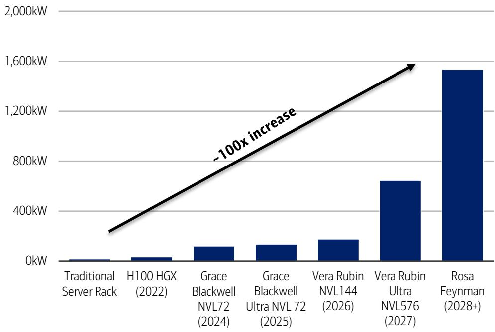

bar

| Category | Value (kW) |
| :--- | :--- |
| Traditional Server Rack | ~50 |
| H100 HGX (2022) | ~80 |
| Grace Blackwell NVL72 (2024) | ~150 |
| Grace Blackwell Ultra NVL 72 (2025) | ~160 |
| Vera Rubin NVL144 (2026) | ~190 |
| Vera Rubin Ultra NVL576 (2027) | ~720 |
| Rosa Feynman (2028+) | ~1550 |
~100x increase

Source: BofA Global Research estimates, Nvidia, company reports   
BofA GLOBAL RESEARCH

Performance-per-watt is a critical metric for operators as it determines the amount of tokens you can generate per unit of power, and thus, the amount of revenue. Data Centers operate inside a fixed power envelope which is heavily dependent on location, so maximizing access to power and converting it to tokens in an efficient manner is crucial.

# Bringing gigawatt-scale power online takes time

The gating factor in power stems having to build the entire physical infrastructure flow for a new data center from grid interconnects, substations, transformers, switchgear, cooling and more. It takes time to bring this capacity online. Key equipment is also constrained, including gas turbines (5-year delivery timeline) and transformers (2–3-year lead times) Sites that have secured grid power may be able to reach 1GW capacity in 1-4 years from construction but a greenfield project could take as long as 5 years, according to the International Energy Agency, before project delays.

# Compute roadmap: 1MW per rack by CY30

Hopper H100 HGX was Nvidia's first flagship anchor accelerator platform for the AI-era launched in 2022 and utilized Hopper GPUs where thermal design power (TDP) fetched only $0.7\mathrm{kW}$ per package while other functions like switches, CPUs, and NICs, represented a small part of the power budget all in an architecture that was air-cooled (exhibit 2).

As we moved into Blackwell (GB200 NVL72), total GPU power budget jumped +400% from 17kW to 86kW as GPU TDP increased and GPU die count multiplied to 144. Networking and CPUs became more relevant driving up power consumption and an entirely new liquid-cooled rack, Oberon, was required to handle the heat generation. Total power increased from 25kW per rack to 100-120kw per rack.

As the launch of Rubin gets underway, power climbs again albeit to a lesser extent, but Rubin Ultra in CY27 represents another inflection to over 600kW per rack (+240% platform-over-platform), with its significantly larger scale-up domain of up to 576 GPUs, higher TDPs in the 3kW range, 144 Vera CPUs equipped for agentic AI, and powerful NVSwitch 6 inside the next-generation Kyber rack form factor. This is when we would expect to see initial deployments of 800 VDC due to the power demands.

While we can only speculate on specifications as official details are sparse, these same trends should persist as we approach the Feynman era (likely launches CY29/30) where architectures begin to migrate to hybrid microgrids (more on this later) and compute TDP likely takes another step up again. The roadmap then enters the zone of 1MW class racks where the sheer amount of power density packed into the physical space of filing cabinets necessitates completely new infrastructure.

Exhibit 2: The main driver of higher rack power advancing towards 1MW per rack by CY30 (Feynman) is GPU where TDP (thermal design power) is approaching 5kW per package. Rising switching, NIC, CPU, and DPU power budgets are also factors.   
Detailed power budget estimates across various generations of Nvidia platforms 

<table><tr><td colspan="7">Nvidia</td></tr><tr><td>Compute Platform</td><td>Hopper (H100) H100 HGX Rack</td><td>GB200 (Blackwell B200) Grace Blackwell NVL72</td><td>GB300 (Blackwell Ultra/B300) Grace Blackwell Ultra NVL 72</td><td>Rubin (VR200) Vera Rubin NVL72</td><td>Rubin Ultra (VR300 Ultra) Vera Rubin Ultra NVL144</td><td>Feynman (RF200) Rosa Feynman NVL576</td></tr><tr><td>Rack Architecture</td><td>Air-Cooled</td><td>Oberon; Liquid-cooled</td><td>Oberon; Liquid-cooled</td><td>Oberon; Liquid-cooled</td><td>Kyber; Liquid-cooled</td><td>Hybrid microgrid</td></tr><tr><td>GPU</td><td>Hopper</td><td>Blackwell</td><td>Blackwell Ultra</td><td>Rubin</td><td>Rubin Ultra</td><td>Feynman</td></tr><tr><td>GPU Package Count</td><td>32</td><td>72</td><td>72</td><td>72</td><td>144</td><td>576</td></tr><tr><td>GPU Die Count per Package</td><td>1</td><td>2</td><td>2</td><td>2</td><td>4</td><td>2</td></tr><tr><td>Total Dies per Rack</td><td>32</td><td>144</td><td>144</td><td>144</td><td>576</td><td>1152</td></tr><tr><td>GPU Power per Package Consumption (kW)</td><td>0.7</td><td>1.2</td><td>1.4</td><td>1.8</td><td>3.6</td><td>1.8</td></tr><tr><td>GPU Power Budget (kW)</td><td>22.4</td><td>86.4</td><td>100.8</td><td>129.6</td><td>518.4</td><td>1036.8</td></tr><tr><td>CPU</td><td>Xeon/EPYC</td><td>Grace</td><td>Grace</td><td>Vera</td><td>Vera</td><td>Rosa</td></tr><tr><td>CPU Count</td><td>8</td><td>36</td><td>36</td><td>36</td><td>72</td><td>288</td></tr><tr><td>CPU Power Consumption (kW)</td><td>0.30</td><td>0.30</td><td>0.30</td><td>0.35</td><td>0.35</td><td>0.35</td></tr><tr><td>CPU Power Budget (kW)</td><td>2.4</td><td>10.8</td><td>10.8</td><td>12.6</td><td>25.2</td><td>100.8</td></tr><tr><td>NIC</td><td>CX-7</td><td>CX-7</td><td>CX-8</td><td>CX-9</td><td>CX-9</td><td>Next Gen CX</td></tr><tr><td>NIC Die Count</td><td>32</td><td>72</td><td>72</td><td>72</td><td>144</td><td>576</td></tr><tr><td>NIC Power Consumption (kw)</td><td>0.03</td><td>0.03</td><td>0.03</td><td>0.03</td><td>0.03</td><td>0.05</td></tr><tr><td>NIC Power Budget (kW)</td><td>0.8</td><td>1.8</td><td>2.2</td><td>2.2</td><td>4.3</td><td>28.8</td></tr><tr><td>NVLink Switch</td><td>NVSwitch3</td><td>NVSwitch5</td><td>NVSwitch5</td><td>NVSwitch6</td><td>NVSwitch7</td><td>Next Gen NVSwitch</td></tr><tr><td>Switch Die Count</td><td>12</td><td>18</td><td>18</td><td>18</td><td>36</td><td>144</td></tr><tr><td>Switch Power Consumption (kW)</td><td>0.3</td><td>0.8</td><td>0.8</td><td>1.1</td><td>2</td><td>2</td></tr><tr><td>Switch Power Budget (kW)</td><td>3.0</td><td>14.4</td><td>14.4</td><td>19.8</td><td>54.45</td><td>288</td></tr><tr><td>DPU</td><td>BlueField-3</td><td>BlueField-3</td><td>BlueField-3</td><td>BlueField-4</td><td>BlueField-4</td><td>Next Gen BlueField</td></tr><tr><td>DPU Die Count</td><td>3</td><td>18</td><td>18</td><td>18</td><td>36</td><td>144</td></tr><tr><td>DPU Power Consumption (kW)</td><td>0.1</td><td>0.1</td><td>0.1</td><td>0.2</td><td>0.2</td><td>0.2</td></tr><tr><td>DPU Power Budget (kW)</td><td>0.2</td><td>1.4</td><td>1.4</td><td>2.7</td><td>5.4</td><td>28.8</td></tr><tr><td>PSU Conversion Losses (kW)</td><td>0.7</td><td>3.5</td><td>3.9</td><td>5.7</td><td>22.8</td><td>31.4</td></tr><tr><td>Cooling (kW)</td><td>1.5</td><td>1.5</td><td>1.5</td><td>2</td><td>12</td><td>15</td></tr><tr><td>Other (kW)</td><td>0.5</td><td>1.0</td><td>1.0</td><td>2.0</td><td>3.0</td><td>5.0</td></tr><tr><td>Overhead Power Budget (kW)</td><td>2.7</td><td>6</td><td>6.4</td><td>9.7</td><td>37.8</td><td>51.4</td></tr><tr><td>Total Rack Power (kW)</td><td>32</td><td>121</td><td>136</td><td>177</td><td>646</td><td>1535</td></tr></table>

Source: BofA Global Research estimates, Nvidia

BofA GLOBAL RESEARCH

# Compute and networking contribute the most to rising power

As observed, when CPUs and GPUs improve, TDP typically increases 20% generation over generation thus leading to higher server power over time. As GPUs are networked together (via NVLink or another protocol for non-NVDA platforms) to upgrade performance by functioning as a synchronized node of compute, the use of copper interconnects for scale-up means that GPUs cannot be too far from each other (limited reach). Thus, limitation of tightly integrating GPUs on the same copper domain at limited distances creates a direct relationship between maximum power density and the ability to drive maximum performance as you need to pack as many GPUs possible into a smaller physical space in order to scale (Nvidia calls this the performance-density trap). Moving from Hopper to Blackwell led to a 75% increase in TDP but a 3.4x increase in rack power density which in turn translated to a 50x increase in performance. Every subsequent increase in the scale-up networking domain size is now translating into up to 2-4x increases in total power (exhibit 3).

Exhibit 3: Large inflections in power tend to coincide with architecture shifts like when Nvidia migrated to Oberon racks for Blackwell and eventually Kyber for Rubin Ultra. GPUs generally consume most power (65-75%) followed by Switches (10-13%)   
Nvidia power budget analysis spanning Hopper to Feynman 

<table><tr><td colspan="7">Power Budget Analysis (kW)</td></tr><tr><td>Compute Platform</td><td>Hopper (H200) H100 HGX</td><td>GB200 (Blackwell B200) Grace Blackwell NVL72</td><td>GB300 (Blackwell Ultra/B300) Grace Blackwell Ultra NVL 72</td><td>Rubin (VR200) Vera Rubin NVL144</td><td>Rubin Ultra (VR300 Ultra) Vera Rubin Ultra NVL576</td><td>Feynman (RF200) Rosa Feynman</td></tr><tr><td>GPU</td><td>22.4</td><td>86.4</td><td>100.8</td><td>129.6</td><td>518.4</td><td>1036.8</td></tr><tr><td>CPU</td><td>2.4</td><td>10.8</td><td>10.8</td><td>12.6</td><td>25.2</td><td>100.8</td></tr><tr><td>NIC</td><td>0.8</td><td>1.8</td><td>2.2</td><td>2.2</td><td>4.3</td><td>28.8</td></tr><tr><td>Switch</td><td>3.0</td><td>14.4</td><td>14.4</td><td>19.8</td><td>54.5</td><td>288.0</td></tr><tr><td>DPU</td><td>0.2</td><td>1.4</td><td>1.4</td><td>2.7</td><td>5.4</td><td>28.8</td></tr><tr><td>Overhead</td><td>2.7</td><td>6.0</td><td>6.4</td><td>9.7</td><td>37.8</td><td>51.4</td></tr><tr><td>Total Rack Power</td><td>32</td><td>121</td><td>136</td><td>177</td><td>646</td><td>1535</td></tr><tr><td colspan="7">Power Budget Analysis (% budget mix)</td></tr><tr><td>GPU</td><td>71.1%</td><td>71.6%</td><td>74.2%</td><td>73.4%</td><td>80.3%</td><td>67.6%</td></tr><tr><td>CPU</td><td>7.6%</td><td>8.9%</td><td>7.9%</td><td>7.1%</td><td>3.9%</td><td>6.6%</td></tr><tr><td>NIC</td><td>2.5%</td><td>1.5%</td><td>1.6%</td><td>1.2%</td><td>0.7%</td><td>1.9%</td></tr><tr><td>Switch</td><td>9.5%</td><td>11.9%</td><td>10.6%</td><td>11.2%</td><td>8.4%</td><td>18.8%</td></tr><tr><td>DPU</td><td>0.7%</td><td>1.1%</td><td>1.0%</td><td>1.5%</td><td>0.8%</td><td>1.9%</td></tr><tr><td>Overhead</td><td>8.6%</td><td>5.0%</td><td>4.7%</td><td>5.5%</td><td>5.9%</td><td>3.3%</td></tr><tr><td>Total Rack Power</td><td>100.0%</td><td>100.0%</td><td>100.0%</td><td>100.0%</td><td>100.0%</td><td>100.0%</td></tr><tr><td colspan="7">Power Budget Analysis (platform % change)</td></tr><tr><td>GPU</td><td>-</td><td>286%</td><td>17%</td><td>29%</td><td>300%</td><td>100%</td></tr><tr><td>CPU</td><td>-</td><td>350%</td><td>0%</td><td>17%</td><td>100%</td><td>300%</td></tr><tr><td>NIC</td><td>-</td><td>125%</td><td>20%</td><td>0%</td><td>100%</td><td>567%</td></tr><tr><td>Switch</td><td>-</td><td>380%</td><td>0%</td><td>38%</td><td>175%</td><td>429%</td></tr><tr><td>DPU</td><td>-</td><td>500%</td><td>0%</td><td>100%</td><td>100%</td><td>433%</td></tr><tr><td>Overhead</td><td>-</td><td>122%</td><td>7%</td><td>52%</td><td>290%</td><td>36%</td></tr><tr><td>Total Rack Power</td><td>-</td><td>283%</td><td>13%</td><td>30%</td><td>266%</td><td>138%</td></tr></table>

Source: BofA Global Research estimates, Nvidia

BofA GLOBAL RESEARCH

We think this relationship between packing more GPUs in a single domain, tighter integration, and larger networking topologies will be the common themes commanding higher power capacity in future Nvidia platforms for years to come.

# Alternative platforms to Nvidia also see rising power due to similar trends

Similarly, we think these trends apply to Nvidia alternatives also in the market (Exhibit 4). As of now, competing platforms offered by AMD or Intel are less power hungry as compute lags a generation behind Nvidia and there is less integrated networking. Custom ASICs are generally lower power consuming as key functions are optimized for specific tasks making them more efficient. Yet we still believe future platforms will converge towards higher power capacities as compute and networking intensity rise as this will be necessary for them to become competitive options against Nvidia's leading performance-per-watt offering. This evolution is evident in the latest platforms like AMD Helios where power budget exceeds 100kW.

Exhibit 4: Other merchant GPUs and custom ASIC platforms are seeing rising power over time due to higher compute and networking density

Merchant GPU and custom ASIC power budget analysis

<table><tr><td colspan="6">Other Merchant and Custom</td></tr><tr><td>Company Platform</td><td>AMD MI350X Server Rack</td><td>AMD Helios MI400X</td><td>Intel Gaudi Server Rack</td><td>AWS Trainium 3 UltraServer</td><td>Google v7 Ironwood Cube</td></tr><tr><td>XPU</td><td>MI355X</td><td>MI400X/MI455X</td><td>Gaudi 3</td><td>Trainium 3</td><td>TPU v7 Ironwood</td></tr><tr><td>XPU Package Count</td><td>64</td><td>72</td><td>40</td><td>64</td><td>64</td></tr><tr><td>XPU Die Count per Package</td><td>1</td><td>2</td><td>1</td><td>2</td><td>2</td></tr><tr><td>Total Dies per Rack</td><td>64</td><td>144</td><td>40</td><td>128</td><td>128</td></tr><tr><td>XPU Power per Package Consumption (kW)</td><td>1.4</td><td>2</td><td>1</td><td>1</td><td>1</td></tr><tr><td>GPU Power Budget (kW)</td><td>89.6</td><td>144.0</td><td>40</td><td>64</td><td>64</td></tr><tr><td>CPU</td><td>EPYC Turin</td><td>EPYC Venice</td><td>Xeon Granite Rapids</td><td>AWS Graviton</td><td>Axion</td></tr><tr><td>CPU Count</td><td>16</td><td>36</td><td>10</td><td>16</td><td>16</td></tr><tr><td>CPU Power Consumption (kW)</td><td>0.40</td><td>0.45</td><td>0.35</td><td>0.25</td><td>0.25</td></tr><tr><td>CPU Power Budget (kW)</td><td>6.4</td><td>16.2</td><td>3.5</td><td>4.0</td><td>4.0</td></tr><tr><td>NIC/Scale Out</td><td>Pensando/ConnectX</td><td>Pensando Vulcano</td><td>ConnectX-7</td><td>AWS Nitro v6</td><td>OSFP Optical</td></tr><tr><td>NIC Die Count</td><td>64</td><td>72</td><td>40</td><td>144</td><td>256</td></tr><tr><td>NIC Power Consumption (kw)</td><td>0.05</td><td>0.03</td><td>0.03</td><td>0.03</td><td>0.01</td></tr><tr><td>Scale-out Top of Rack (ToR) Switch</td><td>InfiniBand/Ethernet</td><td>Tomahawk 6</td><td>Ethernet</td><td>Spine-leaf</td><td>OCS chassis and ToR</td></tr><tr><td>Scale-out Top of Rack (kW)</td><td>2.0</td><td>Included above</td><td>2.0</td><td>3.0</td><td>3.0</td></tr><tr><td>NIC/Scale-Out Power Budget (kW)</td><td>5.2</td><td>1.8</td><td>3.0</td><td>7.3</td><td>5.6</td></tr><tr><td>Scale Up Fabric</td><td>InfinityFabric</td><td>UALink</td><td>RoCE</td><td>NeuronSwitch-v1</td><td>ICI 3D Torus and OCS</td></tr><tr><td>Switch Die Count</td><td>Mesh on chip</td><td>12</td><td>On-chip</td><td>24</td><td>Only external OCS</td></tr><tr><td>Switch Power Consumption (kW)</td><td>0</td><td>1.5</td><td>0</td><td>0.6</td><td>0</td></tr><tr><td>Switch Power Budget (kW)</td><td>0</td><td>0</td><td>0</td><td>14.4</td><td>0</td></tr><tr><td>DPU</td><td>Pensando NIC</td><td>Pensando NIC</td><td>BF-3</td><td>Nitro DPU</td><td>Axion</td></tr><tr><td>DPU Die Count</td><td>0</td><td>0</td><td>0.5</td><td>2</td><td>0</td></tr><tr><td>DPU Power Consumption (kW)</td><td>0.1</td><td>0.1</td><td>0.1</td><td>0.2</td><td>0.2</td></tr><tr><td>DPU Power Budget (kW)</td><td>0.0</td><td>0.0</td><td>0.0</td><td>0.3</td><td>0.0</td></tr><tr><td>PSU Conversion Losses (kW)</td><td>3</td><td>5</td><td>1</td><td>4</td><td>1</td></tr><tr><td>Cooling (kW)</td><td>2</td><td>4</td><td>2</td><td>4</td><td>3</td></tr><tr><td>Other (kW)</td><td>1</td><td>2</td><td>1</td><td>2</td><td>1</td></tr><tr><td>Overhead Power Budget (kW)</td><td>6</td><td>11</td><td>4</td><td>10</td><td>5</td></tr><tr><td>Total Rack Power (kW)</td><td>107</td><td>173</td><td>51</td><td>100</td><td>79</td></tr></table>

<table><tr><td colspan="6">Power Budget Analysis (kW)</td></tr><tr><td>Company Platform</td><td>AMD MI350X Server Rack</td><td>AMD Helios MI400X</td><td>Intel Gaudi Server Rack</td><td>AWS Trainium 3 UltraServer</td><td>Google v7 Ironwood Cube</td></tr><tr><td>GPU</td><td>89.6</td><td>144.0</td><td>40.0</td><td>64.0</td><td>64.0</td></tr><tr><td>CPU</td><td>6.4</td><td>16.2</td><td>3.5</td><td>4.0</td><td>4.0</td></tr><tr><td>NIC/Scale-out</td><td>5.2</td><td>1.8</td><td>3.0</td><td>7.3</td><td>5.6</td></tr><tr><td>Switch</td><td>0.0</td><td>0.0</td><td>0.0</td><td>14.4</td><td>0.0</td></tr><tr><td>DPU</td><td>0.0</td><td>0.0</td><td>0.0</td><td>0.3</td><td>0.0</td></tr><tr><td>Overhead</td><td>6.0</td><td>11.0</td><td>4.0</td><td>10.0</td><td>5.0</td></tr><tr><td>Total Rack Power</td><td>107</td><td>173</td><td>51</td><td>100</td><td>79</td></tr><tr><td colspan="6">Power Budget Analysis (% budget mix)</td></tr><tr><td>GPU</td><td>83.6%</td><td>83.2%</td><td>79.1%</td><td>64.0%</td><td>81.5%</td></tr><tr><td>CPU</td><td>6.0%</td><td>9.4%</td><td>6.9%</td><td>4.0%</td><td>5.1%</td></tr><tr><td>NIC/Scale-out</td><td>4.9%</td><td>1.0%</td><td>5.9%</td><td>7.3%</td><td>7.1%</td></tr><tr><td>Switch</td><td>0.0%</td><td>0.0%</td><td>0.0%</td><td>14.4%</td><td>0.0%</td></tr><tr><td>DPU</td><td>0.0%</td><td>0.0%</td><td>0.1%</td><td>0.3%</td><td>0.0%</td></tr><tr><td>Overhead</td><td>5.6%</td><td>6.4%</td><td>7.9%</td><td>10.0%</td><td>6.4%</td></tr><tr><td>Total Rack Power</td><td>100.0%</td><td>100.0%</td><td>100.0%</td><td>100.0%</td><td>100.0%</td></tr></table>

Source: BofA Global Research estimates, AMD, Intel, AWS, Google

BofA GLOBAL RESEARCH

# GW model: AI needs 233GW through CY30

Per the International Energy Agency (IEA), electricity consumption from data centers was almost 500TWh in CY25, or 1.5% of global electricity demand. Based on planned global project pipelines for data centers in early CY26, if all projects are realized, installed capacity could double in the coming years from just around 100GW to almost 200GW in the coming years. However, we think AI/compute estimates for current and upcoming GPU/XPU platforms suggest demand is well above that.

Exhibit 5: Cumulative data center power demand globally is expected to increase from \~100GW today to almost 300GW by CY30   
Data center power demand by region (GW)   
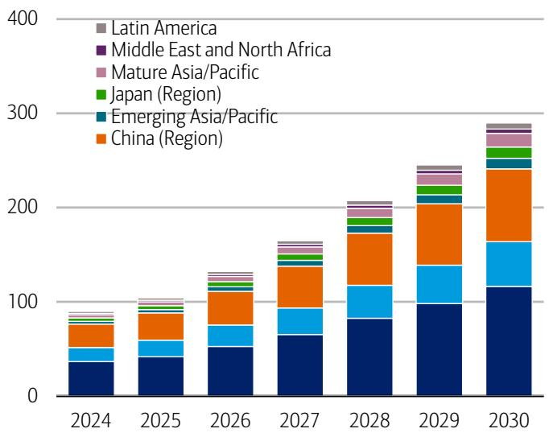

bar_stacked

| Year | Latin America | Middle East and North Africa | Mature Asia/Pacific | Japan (Region) | Emerging Asia/Pacific | China (Region) |
|------|---------------|------------------------------|---------------------|----------------|------------------------|----------------|
| 2024 | ~10           | ~10                          | ~10                 | ~10            | ~10                    | ~15            |
| 2025 | ~10           | ~10                          | ~10                 | ~10            | ~10                    | ~20            |
| 2026 | ~10           | ~10                          | ~10                 | ~10            | ~15                    | ~30            |
| 2027 | ~10           | ~10                          | ~10                 | ~10            | ~20                    | ~40            |
| 2028 | ~10           | ~10                          | ~10                 | ~10            | ~25                    | ~50            |
| 2029 | ~10           | ~10                          | ~10                 | ~10            | ~30                    | ~60            |
| 2030 | ~10           | ~10                          | ~10                 | ~10            | ~35                    | ~70            |

Source: BofA Global Research, Gartner   
BofA GLOBAL RESEARCH

Exhibit 6: Layering on top of conventional server power demand, AI is catalyzing electricity consumption to new heights   
Data center electricity consumption (TWh)   
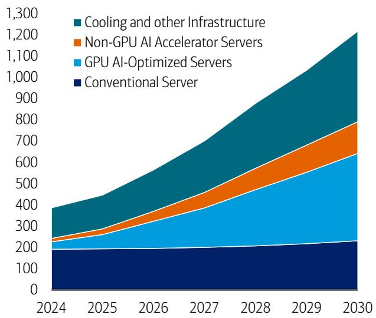

bar_stacked

| Year | Cooling and other Infrastructure | Non-GPU AI Accelerator Servers | GPU AI-Optimized Servers | Conventional Server |
|---|---|---|---|---|
| 2024 | 180 | 20 | 50 | 190 |
| 2025 | 210 | 30 | 70 | 195 |
| 2026 | 260 | 50 | 130 | 195 |
| 2027 | 330 | 80 | 190 | 195 |
| 2028 | 420 | 120 | 310 | 195 |
| 2029 | 510 | 160 | 440 | 205 |
| 2030 | 630 | 210 | 580 | 225 |

Source: BofA Global Research, Gartner   
BofA GLOBAL RESEARCH

Our bottoms-up analysis of accelerator and rack demand for both merchant GPUs and custom ASICs suggests that a cumulative 233GWs needs to be added between CY25-30. GW adds could escalate from \~17GW in CY25 to \~60GW by CY30, underscoring the urgency to move to new power delivery architecture.

Exhibit 7: We estimate AI accelerator demand implies that GWs installed per year for compute could 4x from 15GW in CY25 to 60GW in CY30, a cumulative 233GWs deployed during the period   
Implied GWs deployed across major accelerator platforms CY24-30   
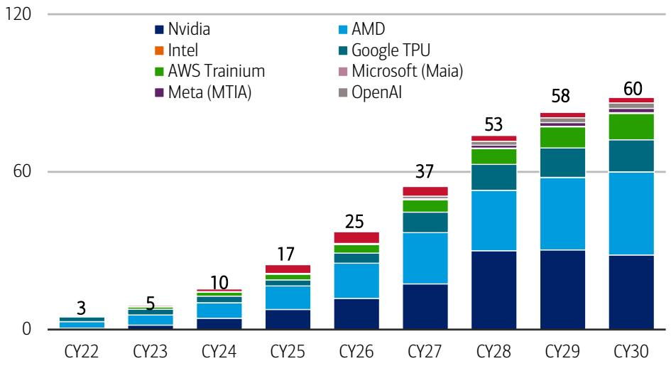

bar_stacked

| Year | Nvidia | Intel | AWS Trainium | Google TPU | Microsoft (Maia) | Meta (MTIA) | OpenAI |
|------|--------|-------|--------------|------------|------------------|-------------|--------|
| CY22 | 3      | 0     | 0            | 0          | 0                | 0           | 0      |
| CY23 | 5      | 0     | 0            | 0          | 0                | 0           | 0      |
| CY24 | 10     | 0     | 0            | 0          | 0                | 0           | 0      |
| CY25 | 17     | 0     | 0            | 0          | 0                | 0           | 0      |
| CY26 | 25     | 0     | 0            | 0          | 0                | 0           | 0      |
| CY27 | 37     | 0     | 0            | 0          | 0                | 0           | 0      |
| CY28 | 53     | 0     | 0            | 0          | 0                | 0           | 0      |
| CY29 | 58     | 0     | 0            | 0          | 0                | 0           | 0      |
| CY30 | 60     | 0     | 0            | 0          | 0                | 0           | 0      |

Source: BofA Global Research estimates, Nvidia, AMD, Intel, Amazon, Google   
BofA GLOBAL RESEARCH

# How power is delivered today

We have established why power density is rising with each subsequent rack generation and how that is driving a massive inflection in implied GW demand for compute. Now, we move on to evaluating the current state of infrastructure and why it is ill-equipped to address the power demands of tomorrow.

# Grid-to-chip today: multiple conversions leading to higher inefficiency

Distribution begins from a generation source, i.e. a power plant (gas turbine, nuclear, solar, etc.) which is then stepped up to ultra-high voltage (230-765kV) via a transformer for long distance transmission. It is better to keep electricity in high voltage form for as long as possible due to greater efficiency. This is because power (P) equals voltage (V) times current (I) and resistance leads to losses which scale with current squared (see below). For the same delivered power, doubling voltage halves current and quarters the losses. Therefore, high voltage for as long as possible is ideal for distribution.

$$
P (P o w e r) = V (V o l t a g e) \times I (C u r r e n t)
$$

$$
P _ {L} (P o w e r L o s s) = I (C u r r e n t) ^ {2} R (R e s i s t a n c e)
$$

Today, utility power is largely centered around alternating current (AC) due to legacy infrastructure, cheaper and more reliable transformers when compared to direct current (DC), and the need for costly and more complex power electronics when dealing with DC. However, DC is increasingly being adopted in the grid for long-range transmission due to its superior efficiency (lower losses) and advances in technology which make handling DC more economical (e.g. solid-state transformers) as we will discuss later. Once the high-voltage AC arrives at a data center campus, it gets stepped down at a substation to medium voltage (10-35kV), then again at on-site transformers to 480V or 415 three-phase AC and then distributed to the data hall. Inside the data hall, each rack receives 480VAC and converts it at the rack-level into 48V or 54V DC using a Power Supply Unit (PSU). This DC is bussed to each server, then converted 1-2x more to a lower voltage until it finally has been stepped down to the sub-1V rail a GPU/XPU core can run on.

# Exhibit 8: Today, power from the grid undergoes multiple conversions from high voltage AC to medium voltage AC and then multiple low voltage DCs before reaching the accelerator

Traditional 48V/54V power distribution architecture

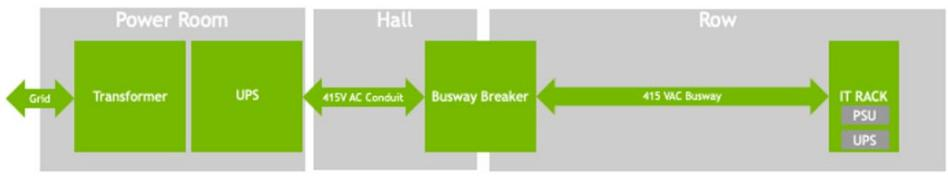

flowchart

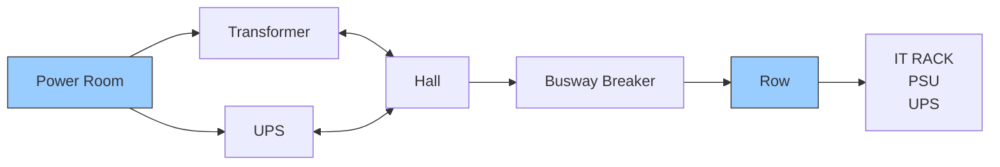
```mermaid
graph LR
    A["Power Room"] --> B["Transformer"]
    A --> C["UPS"]
    B <--> D["Hall"]
    C <--> D
    D --> E["Busway Breaker"]
    E --> F["Row"]
    F --> G["IT RACK\nPSU\nUPS"]
    style A fill:#99ccff,stroke:#333
    style F fill:#99ccff,stroke:#333
```

Source: Nvidia   
BofA GLOBAL RESEARCH

# The problem: this architecture is beginning to hit its physical limits

There are multiple problems with this method of distribution. (1) Space constraints: a GB300 NVL72 rack possesses up to eight power shelves to support all the computing and switching shelves. Using the same 54 VDC distribution would occupy 64 U of rack space for a Kyber rack (Rubin Ultra and beyond) leaving limited room for compute. (2)

Excessive copper: using 54 VDC for a single 1 MW rack requires up to 200kg of bulky copper busbar to shuttle electricity which isn't sustainable at the GW-scale; (3)

Conversion inefficiency: multiple AC/DC conversions and step downs in voltages are not energy efficient (roughly 1-2% lost per transformation) and increase the number of failure points. An entirely new power distribution architecture is necessary in the future.

# 800 VDC: power delivery for the GW era

As data centers evolve to support GW-scale capacity, an entirely new architecture for the power flow is vital that is purpose-built to address the limitations of traditional 48V/54V infrastructure while being future-proofed for inevitable migrations to racks with higher power density long-term. This is where 800-volt direct current (800 VDC) comes in.

# 800V architecture: upgraded infrastructure from grid-to-core

The crux of the issue for traditional power distribution is the multiple voltage conversions and inherent mechanical complexity. For 800V, the 13.8kV AC power that arrives from the grid is directly converted to 800 VDC when it arrives at the campus (eliminating the conversion to medium voltage) using rectifiers (device that converts AC to DC). This transformation that happens in the power room cuts down on multiple AC to DC and DC to DC conversions that minimizes inefficiency losses. System complexity is also reduced as fewer power supply units with fans are needed helping reliability, lower heat dissipation, and improving energy efficiency.

At the row-level, 800V power delivery units (PDUs)/busways carry the electricity rather than 415V AC in the previous model which enables up to 85% more power to be transmitted through the same conductor size. The lower current demands allow the conductor to be thinner thus also drastically cutting the amount of copper wiring needed (by 45% per Nvidia). Using DC rather than AC also helps circumvent AC-specific flaws like “skin effect” and reactive power losses.

Exhibit 9: 800V DC architecture minimizes energy losses and supports higher reliability by making fewer AC to DC and DC to DC conversions along with reducing system component complexity   
Existing power flow architecture vs. next generation 800V DC power distribution   
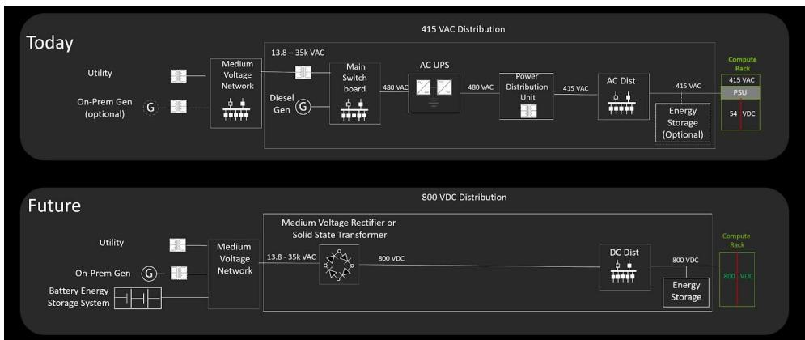

flowchart

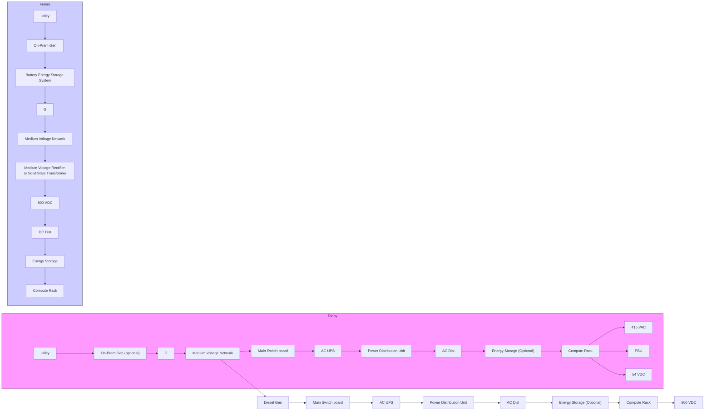
```mermaid
graph LR
    subgraph Today
        A["Utility"] --> B["On-Prem Gen (optional)"]
        B --> C["G"]
        C --> D["Medium Voltage Network"]
        D --> E["Main Switch board"]
        E --> F["AC UPS"]
        F --> G["Power Distribution Unit"]
        G --> H["AC Dist"]
        H --> I["Energy Storage (Optional)"]
        I --> J["Compute Rack"]
        J --> K["415 VAC"]
        J --> L["PBU"]
        J --> M["54 VDC"]
    end

    subgraph Future
        N["Utility"] --> O["On-Prem Gen"]
        O --> P["Battery Energy Storage System"]
        P --> Q["G"]
        Q --> R["Medium Voltage Network"]
        R --> S["Medium Voltage Rectifier or Solid State Transformer"]
        S --> T["800 VDC"]
        T --> U["DC Dist"]
        U --> V["Energy Storage"]
        V --> W["Compute Rack"]
    end

    D --> X["Diesel Gen"]
    X --> Y["Main Switch board"]
    Y --> Z["AC UPS"]
    Z --> AA["Power Distribution Unit"]
    AA --> AB["AC Dist"]
    AB --> AC["Energy Storage (Optional)"]
    AC --> AD["Compute Rack"]
    AD --> AE["800 VDC"]
    style Today fill:#f9f,stroke:#333
    style Future fill:#ccf,stroke:#333
```

Source: Nvidia   
BofA GLOBAL RESEARCH

From the power source or separate power rack, two distinct conductor 800V feeds use DC to DC conversion via multiple power supply units (PSUs) to 54v in the IT rack which is then distributed to compute trays for additional DC to DC conversions before reaching the GPU device. By eliminating prior intermediary conversions, there is more space for compute resources (i.e. what actually generates revenue) within the rack itself.

# Benefit #1 of 800 VDC: Scalability and futureproofing

800V architecture supports futureproofing for roadmap power density scaling as racks increase from 100kW capacity to over 1MW and beyond while using the same infrastructure. It also supports higher-density GPU clusters and enables higher performance per accelerator driving greater compute throughput and revenue potential.

# Benefit #2 of 800 VDC: Improved energy efficiency

Compared to traditional systems where efficiency can be under 90%, end-to-end efficiency could be boosted up to 5% when compared to 54V systems, per Nvidia, by eliminating redundant conversion steps and reducing waste heat in the process

# Benefit #3 of 800 VDC: Lower costs and copper material

The same wire gauge can carry up to 157% more power using 800 VDC vs. 415 VAC. To illustrate this, imagine that the current draw for legacy 48V architecture is 12,500 amps (600kW/48V). Leaving 1% of the voltage budget for resistive losses only leaves 38 micro-ohms across the delivery path which means a standard copper busbar which supports 1,000 amps per square inch would need 12 square inches of cross section extending to the full rack height and weighing up to 200kG per rack. However, upgrading to 800 VDC entails a current draw of only 750 amps, a resistance budget of milli-ohms (1000x better), power losses drop by over 10x, and copper material per rack is significantly lower. Further, fewer conductors and connectors would be required for 800 VDC as delivery would move to a simpler three-wire setup instead of the four needed for AC. Thus, copper use, overall material, and installation costs are reduced.

# Benefit #4 of 800 VDC: simpler and more reliable architecture, TCO

Centralizing and simplifying power conversion also enhances system reliability and serviceability when compared to traditional IT racks as it lowers the number of critical components such as transformers and phase-balancing equipment. Maintenance costs may be reduced by up to 70% due to fewer PSU failures and savings on labor costs for upkeep. These improvements throughout the revamped power flow accumulate to up to a 30% improvement in total cost of ownership (TCO) according to Nvidia.

Exhibit 10: The 800 VDC power conversion flow is given fewer current and voltage transformation steps along with a simplified distribution path   
Power conversion chain: 800 VDC vs. legacy 54V and why the new architecture is superior at any given stage 

<table><tr><td>Stage</td><td>800 VDC architecture</td><td>Legacy 54 V architecture</td><td>Why 800 VDC is better</td></tr><tr><td>Medium Voltage (MV) Grid Feed</td><td>Conversion: NoneV / I: 13.8 kVAC 3φ / ~42 ADevice class: MV switchgear</td><td>Conversion: NoneV / I: 13.8 kVAC 3φ / ~42 ADevice class: MV switchgear</td><td>No difference at this point; both start from the same MV AC utility feed.</td></tr><tr><td>Front-end conversion</td><td>Conversion: 13.8 kVAC to 800 VDCV / I: 800 VDC / ~1,250 ADevice class: Centralized AC/DC rectifier, SST, front-end power block</td><td>Conversion: 13.8 kVAC to 480 VACV / I: 480 VAC / ~1,203 ADevice class: Facility transformer</td><td>Starts DC distribution earlier and reduces downstream AC transformation / conversion stages.</td></tr><tr><td>Backup / energy buffer</td><td>Conversion: DC-coupled backup on 800 V busV / I: 800 VDC / ~1,250 ADevice class: DC breaker, solid-state protection, battery / supercap interface</td><td>Conversion: 480 VAC to DC link to 480 VACV / I: 480 VAC / ~1,203 ADevice class: Double-conversion UPS</td><td>Avoids repeated AC/DC/AC conversion for backup; fewer loss points and simpler power path.</td></tr><tr><td>Facility distribution</td><td>Conversion: None after front-end rectificationV / I: 800 VDC / ~1,250 ADevice class: DC switchgear, busway, switchboard, DC protection</td><td>Conversion: 480 VAC to 208 VACV / I: 208 VAC / ~2,776 ADevice class: PDU transformer, AC branch distribution</td><td>Higher voltage lowers current, reducing cable bulk, copper mass, and I2R losses.</td></tr><tr><td>Rack / sidecar input</td><td>Conversion: None at rack inputV / I: 800 VDC / ~1,250 ADevice class: HVDC input, pre-charge, hot-swap, disconnect, protection</td><td>Conversion: 208 VAC to 54 VDCV / I: 54 VDC / ~18,519 ADevice class: AC/DC rack PSU shelf, 54 V busbar</td><td>Avoids creating a massive ~18.5 kA rack-level 54 V bus, reducing busbar and connector burden.</td></tr><tr><td>Intermediate Bus Conversion (IBC) stage — option A: direct 12 V bus</td><td>Conversion: 800 VDC to 12 VDCV / I: 12 VDC / ~83,333 ADevice class: Isolated HV DC/DC, fixed-ratio or resonant IBC</td><td>Conversion: 54 VDC to 12 VDCV / I: 12 VDC / ~83,333 ADevice class: LV high-current DC/DC IBC</td><td>Keeps the 12 V high-current domain closer to compute instead of distributing 54 V at very high current across the rack.</td></tr><tr><td>IBC stage — option B: 50/54 V bridge bus</td><td>Conversion: 800 VDC to 50/54 VDCV / I: 50/54 VDC / ~18.5–20.0 kADevice class: Isolated HV DC/DC or power delivery board; may feed 12 V or 6 V next</td><td>Conversion: Already at 54 VDC after rack PSUV / I: 54 VDC / ~18,519 ADevice class: 54 V busbar feeding downstream DC/DC</td><td>Preserves 48/54 V ecosystem compatibility while moving the high-current 54 V domain closer to the load.</td></tr><tr><td>IBC stage — option C: final-evolution 6 V bus</td><td>Conversion: 800 VDC to 6 VDCV / I: 6 VDC / ~166,667 ADevice class: Isolated high-ratio bus converter located very close to compute</td><td>Conversion: Typically 54 VDC to 12 VDC before VRMV / I: 12 VDC / ~83,333 ADevice class: LV high-current IBC plus downstream VRM</td><td>Collapses the downstream chain to 800 V to 6 V to sub-1 V, delaying ultra-high current until very close to silicon.</td></tr><tr><td>Voltage Regulator Module (VRM) / point-of-load (POL)</td><td>Conversion: 12 VDC or 6 VDC to &lt;1 VV / I: ~0.8 V / ~1.25M A aggregateDevice class: Multiphase buck VRM / POL power stage</td><td>Conversion: 12 VDC to &lt;1 VV / I: ~0.8 V / ~1.25M A aggregateDevice class: Multiphase buck VRM / POL power stage</td><td>Final rail is still sub-1 V; the advantage is upstream, where 800 V reduces high-current distribution before the VRM zone.</td></tr></table>

Source: BofA Global Research, Nvidia, Infineon, Schneider; 3φ = 3-phase power, V = Voltage, I = Current

BofA GLOBAL RESEARCH

# Transition timing: occurs in phases to give ecosystem time to develop

800 VDC architecture is the optimal path forward as it provides scalable end-to-end integration, can already leverage the learning cycles from deploying 800V in the electric vehicle and utility-scale solar industries (hence why auto/industrial semis well positioned), and benefit from maturing silicon carbide (SiC) and gallium nitride (GaN) ecosystems. However, there might be multiple stages before data centers end up at the final state of 800 VDC systems in the future (exhibit 12).

Existing 415 VAC infrastructure involves medium voltage step-down transformers, low voltage switchboards, AC uninterruptible power supply (UPS), PDUs, and AC distribution panels (i.e. busways). Power arrives at each compute rack in 415 VAC form where a PSU integrated in the rack converts it to the 54 VDC for the various compute trays. External energy storage could be leveraged to manage power swings from GPU workloads.

The first transitional architecture is white space retrofit (second example in exhibit 11) where AC to DC conversion is placed outside the rack. This flow utilizes an 800 VDC side power rack which contains rectifiers and PDUs to convert from AC to DC local to each rack. While not the optimal solution, this is a necessary component until 800 VDC grade equipment is ready to deploy and allows compute rack density to risk by offloading power conversion from the IT rack.

Exhibit 11: By offloading power conversion and distribution to a dedicated side car that integrates power supply units (PSUs), battery back up units (BBUs), and power conversion system (PCS), Nvidia's Kyber configuration is able to prioritize more space for compute in its IT rack   
Example of a disaggregated Kyber IT rack with a dedicated power side car (vs. a standard 160kW rack)   
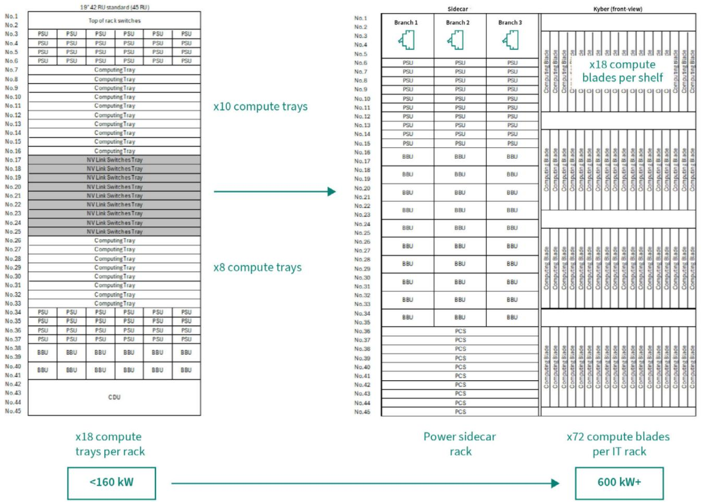  
Source: Infineon "Powering the future of AI" white paper

BofA GLOBAL RESEARCH

In the third evolution (hybrid power distribution in exhibit 12), AC to DC power rectifiers at the facility-level deliver 800 VDC from low-voltage AC (<600 V). These reduce rack-level complexity and help integrate energy storage at the DC output. While a low voltage transformer is still needed, this flow works as it relies on existing building blocks (MV/LV transformers, low-voltage switchboards, while using mature large rectifiers common in battery storage and renewables technology.

Exhibit 12: As existing facilities migrate to high voltage distribution, we expect there to be several intermediary stages before “true” 800 VDC architecture is architecture including using a power side car

Evolution of power delivery architecture towards the final end state of true 800 VDC distribution

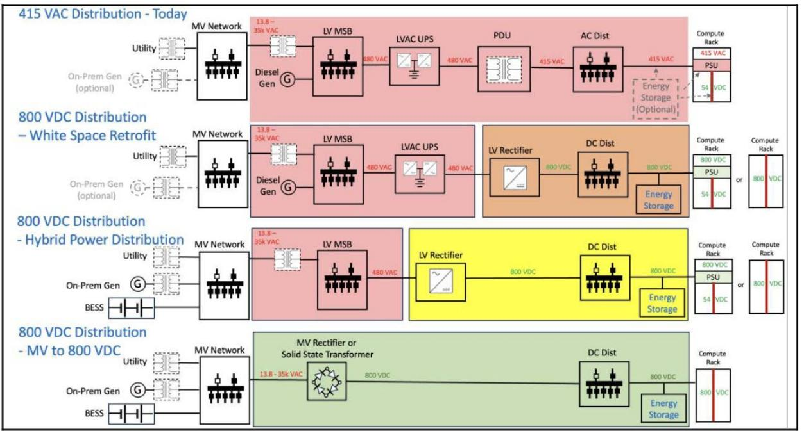

flowchart

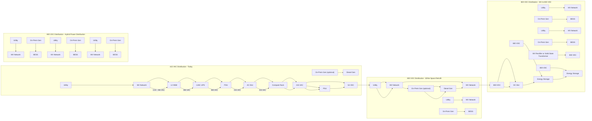
```mermaid
graph LR
    subgraph "415 VAC Distribution - Today"
        A["Utility"] --> B["MV Network"]
        C["On-Prem Gen (optional)"] --> D["Diesel Gen"]
        B --> E["LV MSB"]
        E --> F["LVAC UPS"]
        F --> G["PDU"]
        G --> H["AC Dist"]
        H --> I["Compute Rack"]
        I --> J["415 VAC"]
        J --> K["PSU"]
        J --> L["54 VDC"]
    end

    subgraph "800 VDC Distribution - White Space Retrofit"
        M["Utility"] --> N["MV Network"]
        O["On-Prem Gen (optional)"] --> P["Diesel Gen"]
        N --> Q["MV Network"]
        R["Utility"] --> S["MV Network"]
        T["On-Prem Gen"] --> U["BESS"]
    end

    subgraph "800 VDC Distribution - Hybrid Power Distribution"
        V["Utility"] --> W["MV Network"]
        X["On-Prem Gen"] --> Y["BESS"]
        Z["Utility"] --> AA["MV Network"]
        AB["On-Prem Gen"] --> AC["BESS"]
        AD["Utility"] --> AE["MV Network"]
        AF["On-Prem Gen"] --> AG["BESS"]
    end

    subgraph "800 VDC Distribution - MV to 800 VDC"
        AH["Utility"] --> AI["MV Network"]
        AJ["On-Prem Gen"] --> AK["BESS"]
        AL["Utility"] --> AM["MV Network"]
        AN["On-Prem Gen"] --> AO["BESS"]
        AP["MV Rectifier or Solid State Transformer"] --> AQ["800 VDC"]
        AR["800 VDC"] --> AS["DC Dist"]
        AT["800 VDC"] --> AU["Energy Storage"]
        AV["800 VDC"] --> AW["Energy Storage"]
    end

    B -->|13.8 - 35k VAC| E
    E -->|480 VAC| F
    F -->|480 VAC| G
    G -->|415 VAC| H
    H -->|415 VAC| I
    I --> J
    J --> K
    K --> L
    L --> M
    M --> N
    N --> O
    O --> P
    P --> Q
    Q --> AR
    AR --> AS
    AS --> AU
    AU --> AW
```

Source: Nvidia 800 VDC white paper

BofA GLOBAL RESEARCH

# Next generation: MV AC straight to 800 VDC using MV rectifiers or SSTs

The next generation of architecture could incorporate a medium voltage rectifier which converts 35 kvAC MV AC directly to 800 VDC which is then distributed to the racks (MV to 800 VDC example in exhibit 12). This is ideal as it eliminates multiple middle layers (no 480 VAC layer, less low-voltage AC switch gear, fewer conversion stages, simpler infrastructure flow). As an alternative to the MV rectifier which is a proven, high-capacity system widely used today in various industrial markets, Solid State Transformers (SST) could emerge as another strong technology to facilitate this conversion to MV. SSTs factor in a MV AC intake, power rectification modules, and DC distribution in a highly compact and dense design which provides significant space savings. There are challenges to scaling SSTs at the multi-MW scale today due to reliability, thermal issues, and electrical stress which is why MV rectifiers would likely be adopted first. However, SSTs represent a critical element of the “end state” for 800 VDC as the tech matures.

# Workload volatility: solved by moving to multi-timescale energy storage

There is another challenge when scaling AI data centers that 800V alone cannot solve which is workload volatility. Training an LLM involves thousands of GPUs executing multiple cycles of intensive computation followed by periods of data exchange in almost perfect synchronization as a single system. These dynamics lead to massive and rapid load swings across the facility which can lead to grid-scale oscillations in the power profile. In milliseconds, a rack can oscillate from 30% utilization to 100% and back again forcing components to be engineered as oversized to handle peak current needs which drives up the cost and physical footprint and threatening the overall stability of the grid.

Exhibit 13: Power needs to be managed at multiple timescales when dealing with AI workloads including grid level fluctuation requirements and GPU load demand requirements

Power envelope over a full compute cycle

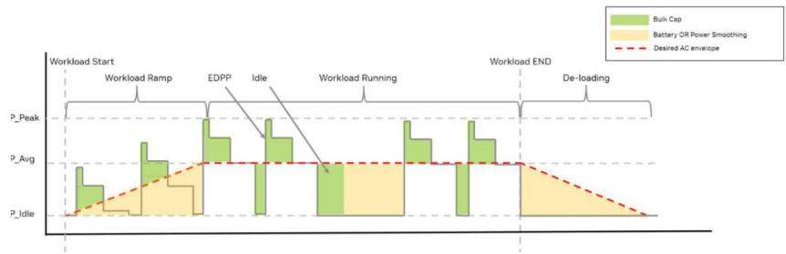

line

| Event           | Bulk Cap | Battery OR Power Smoothing | Desired AC envelope |
| --------------- | -------- | -------------------------- | --------------------- |
| Workload Start  |          |                            |                       |
| Workload Ramp   |          |                            |                       |
| EDPP            |          |                            |                       |
| Idle            |          |                            |                       |
| Workload Running|          |                            |                       |
| Workload End    |          |                            |                       |
| De-loading      |          |                            |                       |
| P_Peak          |          |                            |                       |
| P_Avg           |          |                            |                       |
| P_Idle          |          |                            |                       |

Source: Nvidia 800 VDC white paper   
BofA GLOBAL RESEARCH

To solve this problem, a buffer needs to be created that separates the volatile power demands of the AI infrastructure from the stability needs of the grid. This is where multi-timescale energy storage comes in as power fluctuations occur across multiple timescales. For short-duration storage (milliseconds to seconds) high power capacitors and supercapacitors sit next to the compute racks and absorb high-frequency power spikes while filling brief dips created by idle workload periods. Long-duration storage (seconds to minutes) is large, facility-level battery energy storage systems (BESS) located at the interconnection with the grid. These manage more gradual but larger-scale power shifts as entire workloads ramp up or down

# Hybrid microgrid: the final frontier for HV facility infrastructure

To holistically optimize the power distribution from energy generation to consumption at the GW scale, a radically different set of infrastructure is needed. DC microgrids removes AC to DC power flow and distributes high voltage straight from the grid via an HV bus that connects to the server racks. This is seen as a future-proof and “end state” type of solution where new technologies like SSTs, solid-state circuit breakers (SSCB), and high-grade energy storage systems/uninterruptible power supplies (ESS/UPS) will play an important role. By simplifying the flow and replacing bulky components with more modular tech, reliability is also enhanced while boosting overall efficiency. Retrofits are difficult, so we would expect microgrids to come from greenfield site development commencing towards the end of the decade (CY28-30).

Exhibit 14: DC microgrids optimize system efficiency through use of new equipment like SSTs, SSCBs, and more, representing an end state for the shift to 800 VDC architecture

Data center architecture evolution

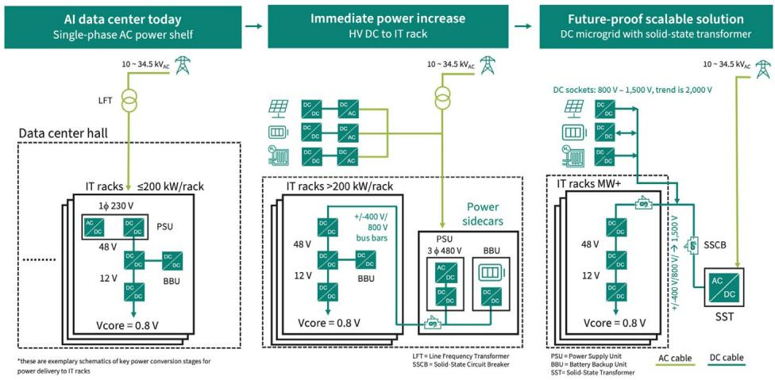

flowchart

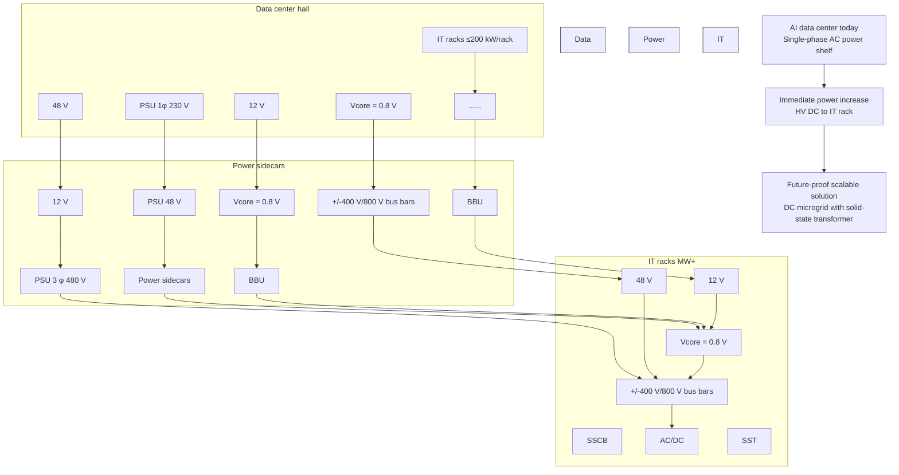
```mermaid
graph TD
    A["AI data center today\nSingle-phase AC power shelf"] --> B["Immediate power increase\nHV DC to IT rack"]
    B --> C["Future-proof scalable solution\nDC microgrid with solid-state transformer"]
    
    subgraph Data center hall
        D["IT racks ≤200 kW/rack"]
        E["PSU 1φ 230 V"]
        F["48 V"]
        G["12 V"]
        H["Vcore = 0.8 V"]
        I["......"]
    end
    
    subgraph Power sidecars
        J["PSU 48 V"]
        K["12 V"]
        L["Vcore = 0.8 V"]
        M["+/-400 V/800 V bus bars"]
        N["BBU"]
        O["Power sidecars"]
        P["PSU 3 φ 480 V"]
        Q["BBU"]
    end
    
    subgraph IT racks MW+
        R["48 V"]
        S["12 V"]
        T["Vcore = 0.8 V"]
        U["+/-400 V/800 V bus bars"]
        V["SSCB"]
        W["AC/DC"]
        X["SST"]
    end
    
    D --> I
    E --> J
    F --> K
    G --> L
    H --> M
    I --> N
    J --> O
    K --> P
    L --> Q
    M --> R
    N --> S
    O --> T
    P --> U
    Q --> T
    R --> U
    S --> T
    T --> U
    U --> W
    style Data center hall fill:#f9f,stroke:#333
    style Power sidecars fill:#ccf,stroke:#333
    style IT racks MW+ fill:#cfc,stroke:#333
```

Source: Infineon   
BofA GLOBAL RESEARCH

# Analog semis: key beneficiaries in high power

We believe the analog semi space will see transformational growth in their AI-related sales as the power tree becomes much more semiconductor intensive. In order for data centers to enjoy the benefits of higher efficiency, greater power density, and the maximization of physical space for compute, we think value will begin to accrue towards suppliers of active power conversion, protection, sensing, control, and high-voltage DC components within the data center rather than just bulky transformers, PSU shelves, or busbars. Major suppliers should enjoy content gains from unit growth, new socket/market expansion, and rising ASPs (sometimes 2-3x higher) as every layer of the power flow needs to be upgraded from facility power the processor rail.

We believe the ultimate winners in the space will (1) boast system-level expertise that can tackle the entire power tree (portfolio breadth) rather than single-point product vendors, (2) offer products that can adequately handle the demands of high voltages in an exceptionally reliable and safe way, (3) offer flexibility regardless of what architecture and topology wins the day, (4) support multiple device types (especially wide-band gap semis), and (5) be those that can provide reference designs and co-design support while being anchored to the main leaders in the ecosystem (e.g. Nvidia).

Exhibit 15: We expect the AI TAM for analog semis to grow 28% 5-year CAGR through CY30 to \$27bn from \$7.9bn in CY25. Average content per rack could grow from mid-\$20K to over \$60K by CY30   
Analog semi data center and strategic power infrastructure TAM (\$bn) and average content-per-rack (\$)   
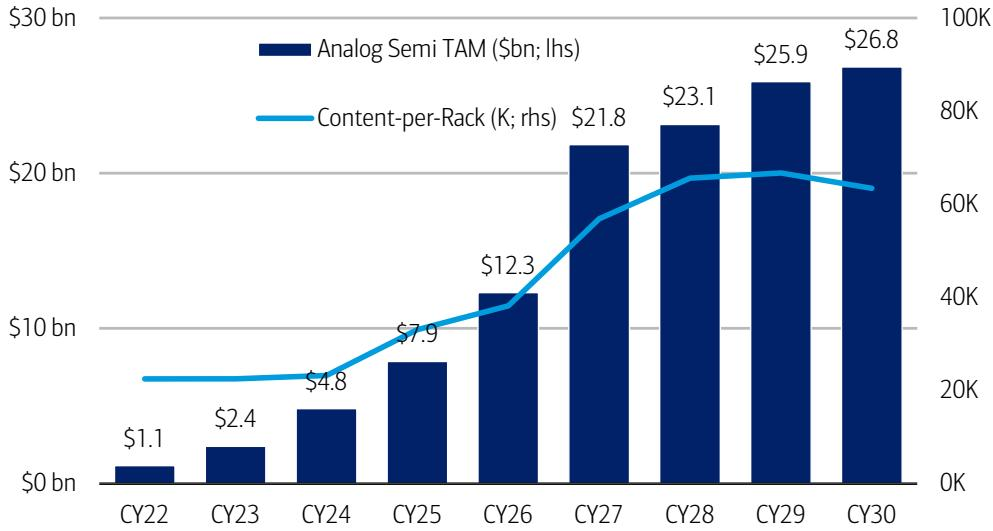

bar_line

| Year | Analog Semi TAM ($bn; lhs) | Content-per-Rack (K; rhs) |
| :--- | :--- | :--- |
| CY22 | 1.1 | 20000 |
| CY23 | 2.4 | 20000 |
| CY24 | 4.8 | 20000 |
| CY25 | 7.9 | 30000 |
| CY26 | 12.3 | 40000 |
| CY27 | 21.8 | 60000 |
| CY28 | 23.1 | 65000 |
| CY29 | 25.9 | 65000 |
| CY30 | 26.8 | 63000 |

Source: BofA Global Research estimates, company reports, Gartner, Omdia, Infineon, Nvidia   
BofA GLOBAL RESEARCH

# Our model: \$7.8bn TAM in CY25 surging to \$27bn in CY30 led by high power

We developed a bottoms-up industry demand model that sizes the analog semi TAM for AI across company revenue/share, device type, and component type within the data center for both low power (100-160kW, <100kW) and high power (>600kW, 1MW+) racks. Underpinning these forecasts are estimates on implied GWs deployed for AI based on expectations for XPU/GPU rack demand over the next few years.

Our TAM is segmented into two key categories: (1) data center (i.e. within the data hall at the server/rack level) and (2) power infrastructure (grid, utilities, core infra). We flag that our power infra-TAM focuses on the most “strategic” parts of the market which are still emerging (e.g. SSTs, solid-state circuit breakers) and likely underestimates the true sales related to infrastructure benefitting from AI (e.g. solar, transmission, etc.)

We estimate the analog AI market to be \$7.9bn as of CY25, expect it to grow to \$12bn in CY26, and predict a surge to \$28bn by CY30 (28% CAGR) as high power racks become a larger part of the mix. Average content-per-rack grows from mid-\$20K up to \$650K during this time as both unit attach and ASPs rise considerably.

As AI racks scale toward 1MW, the role of various device types enhances. Silicon remains the lower-voltage workhorse, SiC moves into high-voltage conversion/protection, GaN enables dense DC/DC near compute, analog adds safety/control, MCUs coordinate distributed power, and sensors provide real-time visibility. While analog ICs are the largest market, growing to \$14bn by CY30, we think that silicon carbide (SiC) and gallium nitride (GaN) should gain material share as power density becomes critical.

Per exhibit 18 and 19 (full model in back), we estimate TXN has the highest share in AI semis currently and should retain that title through CY30. Infineon sees the biggest share jump and should become the second largest AI vendor by the end of the decade. Close behind is analog leader ADI while we also note ON's sizable share expansion.

Exhibit 16: Every device type likely plays a larger role in the move to 1MW class racks. While analog ICs represent the largest market today and by CY30, we note that wide-bandgap semis like SiC and GaN are the fastest growing at 63%/69% CY25-30 CAGR, respectively

Comparing roles in the data center, market size, and CAGRs for major semiconductor device types

<table><tr><td>Semiconductor type</td><td>Role in today&#x27;s data center</td><td>Role in 1MW/800VDC racks</td><td>Key vendors/ companies</td><td>AI TAM size CY25 ($mn)</td><td>AI TAM size CY30 ($mn)</td><td>% of TAM CY25</td><td>% of TAM CY30</td><td>CY25-30 CAGR</td></tr><tr><td>Silicon discrete power</td><td>Workhorse for MOSFETs, synchronous rectification, load switching, protection, lower-/mid-voltage DC/DC, and many VRM power stages.</td><td>Remains the cost-effective backbone in mature lower-voltage stages; some premium high-voltage / high-density sockets shift to SiC or GaN.</td><td>onsemi; STMicroelectronics; Infineon; Alpha and Omega Semiconductor; ROHM; Monolithic Power Systems; Texas Instruments; Analog Devices</td><td>$1,791</td><td>$4,780</td><td>23%</td><td>18%</td><td>22%</td></tr><tr><td>Silicon carbide / SiC</td><td>More common in EV, industrial, renewables, UPS, and high-voltage power than in traditional server boards.</td><td>Moves upstream into high-voltage conversion, 800V protection, power-rack / sidecar stages, MV rectifier/SST concepts, and rugged hot-swap or pre-charge.</td><td>onsemi; STMicroelectronics; Infineon; ROHM; Wolfspeed</td><td>$183</td><td>$2,098</td><td>2%</td><td>6%</td><td>63%</td></tr><tr><td>Gallium nitride / GaN</td><td>Used where high frequency, small magnetics, high efficiency, and power density matter.</td><td>Becomes important for dense DC/DC conversion close to compute, including 800V to 50/54V, 800V to 12V, and 800V to 6V paths.</td><td>Navitas; STMicroelectronics; Texas Instruments; Infineon; Power Integrations; Innoscience</td><td>$118</td><td>$1,612</td><td>1%</td><td>6%</td><td>69%</td></tr><tr><td>Analog ICs</td><td>Controllers, drivers, hot-swap, current/voltage sense, isolation, telemetry, PMICs, supervisors, and digital power interfaces.</td><td>Becomes the safety and control layer: inrush control, fault detection, isolation, hot-swap, diagnostics, telemetry, and fail-safe operation.</td><td>Analog Devices; Texas Instruments; Microchip; Infineon; Renesas; Monolithic Power Systems</td><td>$5,198</td><td>$15,919</td><td>66%</td><td>59%</td><td>25%</td></tr><tr><td>MCUs</td><td>Local control for PSUs, fan/power management, telemetry, fault logging, and digital power loops.</td><td>Becomes distributed power orchestration across rectifiers, sidecars, IBCs, VRMs, backup energy storage, and thermal systems.</td><td>STMicroelectronics; Texas Instruments; Microchip; NXP; Renesas; Infineon</td><td>$332</td><td>$1,516</td><td>4%</td><td>6%</td><td>36%</td></tr><tr><td>Sensors</td><td>Current, voltage, temperature, airflow, pressure, leak, and power/thermal monitoring across servers and infrastructure.</td><td>Becomes the real-time visibility layer for MW-class racks: current, voltage, temperature, transient detection, fault prediction, and cooling health.</td><td>Allegro MicroSystems; STMicroelectronics; Infineon; Renesas;</td><td>$242</td><td>$867</td><td>3%</td><td>3%</td><td>29%</td></tr></table>

Source: BofA Global Research estimates, company reports, Gartner, Omdia, Infineon, Nvidia

BofA GLOBAL RESEARCH

Exhibit 16: Every device type likely plays a larger role in the move to 1MW class racks. While analog ICs represent the largest market today and by CY30, we note that wide-bandgap semis like SiC and GaN are the fastest growing at 63%/69% CY25-30 CAGR, respectively

Comparing roles in the data center, market size, and CAGRs for major semiconductor device types

<table><tr><td>Semiconductor type</td><td>Role in today&#x27;s data center</td><td>Role in 1MW/800VDC racks</td><td>Key vendors/ companies</td><td>AI TAM size CY25 ($mn)</td><td>AI TAM size CY30 ($mn)</td><td>% of TAM CY25</td><td>% of TAM CY30</td><td>CY25-30 CAGR</td></tr></table>

Exhibit 17: While analog ICs will continue to be the largest market, we believe SiC and GaN will enjoy the most share gains

AI analog semi TAM by device type   
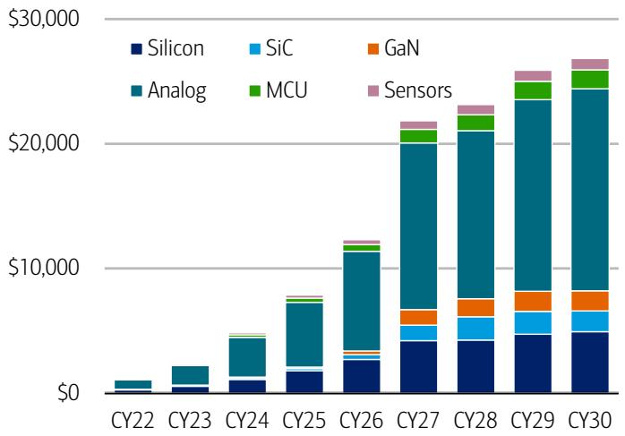

bar_stacked

| Year | Silicon ($) | SiC ($) | GaN ($) | Analog ($) | MCU ($) | Sensors ($) |
| :--- | :--- | :--- | :--- | :--- | :--- | :--- |
| CY22 | 500 | 100 | 0 | 800 | 0 | 0 |
| CY23 | 1000 | 200 | 0 | 1600 | 0 | 0 |
| CY24 | 1500 | 300 | 0 | 3200 | 0 | 0 |
| CY25 | 2000 | 400 | 0 | 4800 | 0 | 0 |
| CY26 | 3000 | 500 | 100 | 7500 | 100 | 100 |
| CY27 | 4500 | 1500 | 1500 | 11500 | 150 | 150 |
| CY28 | 4500 | 1500 | 1500 | 11500 | 150 | 150 |
| CY29 | 5000 | 1500 | 1500 | 12500 | 150 | 150 |
| CY30 | 5500 | 1500 | 1500 | 13500 | 150 | 150 |

Source: BofA Global Research estimates, company reports, Gartner, Omdia, Infineon, Nvidia   
BofA GLOBAL RESEARCH

Exhibit 18: TXN enjoys dominant share in the AI TAM but we flag that discrete suppliers ON and Infineon gain significant share   
Analog semi vendor AI market share   
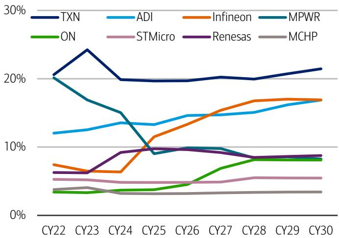

line

| Year | TXN  | ADI  | Infineon | MPWR | ON   | STMicro | Renesas | MCHP |
|------|------|------|----------|------|------|---------|---------|------|
| CY22 | 20%  | 12%  | 7%       | 20%  | 3%   | 5%      | 6%      | 4%   |
| CY23 | 25%  | 13%  | 6%       | 18%  | 3%   | 5%      | 6%      | 4%   |
| CY24 | 20%  | 14%  | 6%       | 15%  | 3%   | 5%      | 9%      | 3%   |
| CY25 | 20%  | 14%  | 11%      | 9%   | 3%   | 5%      | 9%      | 3%   |
| CY26 | 20%  | 15%  | 14%      | 10%  | 4%   | 5%      | 9%      | 3%   |
| CY27 | 20%  | 15%  | 16%      | 10%  | 6%   | 5%      | 9%      | 3%   |
| CY28 | 20%  | 16%  | 17%      | 8%   | 8%   | 5%      | 9%      | 3%   |
| CY29 | 20%  | 17%  | 17%      | 8%   | 8%   | 5%      | 9%      | 3%   |
| CY30 | 21%  | 17%  | 17%      | 8%   | 8%   | 5%      | 9%      | 3%   |

Source: BofA Global Research estimates, company reports, Gartner, Omdia, Infineon, Nvidia   
BofA GLOBAL RESEARCH

Exhibit 19: We estimate that AI-related (data center/power infra) revenue across the analog space grew +63% YoY in CY25 to \$7.9bn and could grow +56% YoY in CY26 to \$12bn. We believe the market will accelerate again in CY27 when high-power Kyber racks for Rubin Ultra become available on the market

Estimated analog semi supplier sales across data center and strategic power infrastructure CY22-30

<table><tr><td>Company Revenue Summary ($; mn)</td><td>CY22</td><td>CY23</td><td>CY24</td><td>CY25</td><td>CY26</td><td>CY27</td><td>CY28</td><td>CY29</td><td>CY30</td></tr><tr><td>Total</td><td>$1,147</td><td>$2,395</td><td>$4,829</td><td>$7,864</td><td>$12,302</td><td>$21,837</td><td>$23,094</td><td>$25,847</td><td>$26,793</td></tr><tr><td>TXN</td><td>$236</td><td>$580</td><td>$959</td><td>$1,547</td><td>$2,416</td><td>$4,368</td><td>$4,549</td><td>$5,277</td><td>$5,658</td></tr><tr><td>ADI</td><td>$138</td><td>$300</td><td>$654</td><td>$1,045</td><td>$1,794</td><td>$3,173</td><td>$3,424</td><td>$4,106</td><td>$4,439</td></tr><tr><td>Infineon</td><td>$85</td><td>$155</td><td>$307</td><td>$904</td><td>$1,647</td><td>$3,415</td><td>$3,949</td><td>$4,490</td><td>$4,630</td></tr><tr><td>MPWR</td><td>$231</td><td>$404</td><td>$726</td><td>$710</td><td>$1,212</td><td>$2,110</td><td>$1,915</td><td>$2,179</td><td>$2,176</td></tr><tr><td>ON</td><td>$39</td><td>$80</td><td>$178</td><td>$295</td><td>$566</td><td>$1,577</td><td>$1,979</td><td>$2,219</td><td>$2,298</td></tr><tr><td>STMicro</td><td>$60</td><td>$124</td><td>$233</td><td>$379</td><td>$597</td><td>$1,090</td><td>$1,301</td><td>$1,452</td><td>$1,504</td></tr><tr><td>Renesas</td><td>$72</td><td>$149</td><td>$445</td><td>$767</td><td>$1,181</td><td>$1,986</td><td>$1,931</td><td>$2,194</td><td>$2,306</td></tr><tr><td>MCHP</td><td>$43</td><td>$97</td><td>$155</td><td>$249</td><td>$393</td><td>$716</td><td>$764</td><td>$865</td><td>$901</td></tr><tr><td>Other</td><td>$242</td><td>$504</td><td>$1,172</td><td>$1,969</td><td>$2,496</td><td>$3,402</td><td>$3,282</td><td>$3,065</td><td>$2,880</td></tr><tr><td>Low Power/Voltage</td><td>$1,147</td><td>$2,394</td><td>$4,829</td><td>$7,864</td><td>$10,862</td><td>$10,790</td><td>$8,530</td><td>$9,527</td><td>$10,739</td></tr><tr><td>TXN</td><td>$236</td><td>$580</td><td>$959</td><td>$1,547</td><td>$2,172</td><td>$2,226</td><td>$1,799</td><td>$2,055</td><td>$2,369</td></tr><tr><td>ADI</td><td>$138</td><td>$300</td><td>$654</td><td>$1,045</td><td>$1,617</td><td>$1,718</td><td>$1,449</td><td>$1,713</td><td>$1,983</td></tr><tr><td>Infineon</td><td>$85</td><td>$155</td><td>$307</td><td>$904</td><td>$1,413</td><td>$1,498</td><td>$1,246</td><td>$1,456</td><td>$1,665</td></tr><tr><td>MPWR</td><td>$231</td><td>$404</td><td>$726</td><td>$710</td><td>$1,090</td><td>$1,131</td><td>$805</td><td>$899</td><td>$959</td></tr><tr><td>ON</td><td>$39</td><td>$80</td><td>$178</td><td>$295</td><td>$475</td><td>$568</td><td>$492</td><td>$593</td><td>$716</td></tr><tr><td>STMicro</td><td>$60</td><td>$124</td><td>$233</td><td>$379</td><td>$525</td><td>$527</td><td>$425</td><td>$478</td><td>$543</td></tr><tr><td>Renesas</td><td>$72</td><td>$149</td><td>$445</td><td>$767</td><td>$1,058</td><td>$1,048</td><td>$784</td><td>$875</td><td>$986</td></tr><tr><td>MCHP</td><td>$43</td><td>$97</td><td>$155</td><td>$249</td><td>$344</td><td>$342</td><td>$271</td><td>$302</td><td>$341</td></tr><tr><td>Other</td><td>$242</td><td>$504</td><td>$1,172</td><td>$1,969</td><td>$2,169</td><td>$1,733</td><td>$1,259</td><td>$1,156</td><td>$1,176</td></tr><tr><td>High Power/Voltage</td><td>$0</td><td>$0</td><td>$0</td><td>$0</td><td>$1,439</td><td>$11,047</td><td>$14,564</td><td>$16,320</td><td>$16,054</td></tr><tr><td>TXN</td><td>$0</td><td>$0</td><td>$0</td><td>$0</td><td>$244</td><td>$2,142</td><td>$2,750</td><td>$3,222</td><td>$3,289</td></tr><tr><td>ADI</td><td>$0</td><td>$0</td><td>$0</td><td>$0</td><td>$177</td><td>$1,455</td><td>$1,976</td><td>$2,393</td><td>$2,455</td></tr><tr><td>Infineon</td><td>$0</td><td>$0</td><td>$0</td><td>$0</td><td>$234</td><td>$1,917</td><td>$2,702</td><td>$3,035</td><td>$2,964</td></tr><tr><td>MPWR</td><td>$0</td><td>$0</td><td>$0</td><td>$0</td><td>$122</td><td>$979</td><td>$1,109</td><td>$1,280</td><td>$1,217</td></tr><tr><td>ON</td><td>$0</td><td>$0</td><td>$0</td><td>$0</td><td>$91</td><td>$1,009</td><td>$1,486</td><td>$1,626</td><td>$1,583</td></tr><tr><td>STMicro</td><td>$0</td><td>$0</td><td>$0</td><td>$0</td><td>$72</td><td>$563</td><td>$876</td><td>$974</td><td>$961</td></tr><tr><td>Renesas</td><td>$0</td><td>$0</td><td>$0</td><td>$0</td><td>$123</td><td>$939</td><td>$1,147</td><td>$1,319</td><td>$1,321</td></tr></table>

Exhibit 19: We estimate that AI-related (data center/power infra) revenue across the analog space grew +63% YoY in CY25 to \$7.9bn and could grow +56% YoY in CY26 to \$12bn. We believe the market will accelerate again in CY27 when high-power Kyber racks for Rubin Ultra become available on the market

Estimated analog semi supplier sales across data center and strategic power infrastructure CY22-30

<table><tr><td>Company Revenue Summary ($; mn)</td><td>CY22</td><td>CY23</td><td>CY24</td><td>CY25</td><td>CY26</td><td>CY27</td><td>CY28</td><td>CY29</td><td>CY30</td></tr><tr><td>MCHP</td><td>$0</td><td>$0</td><td>$0</td><td>$0</td><td>$49</td><td>$374</td><td>$493</td><td>$563</td><td>$561</td></tr><tr><td>Other</td><td>$0</td><td>$0</td><td>$0</td><td>$0</td><td>$326</td><td>$1,669</td><td>$2,023</td><td>$1,909</td><td>$1,703</td></tr><tr><td>Company Revenue Summary YoY Growth</td><td>CY22</td><td>CY23</td><td>CY24</td><td>CY25</td><td>CY26</td><td>CY27</td><td>CY28</td><td>CY29</td><td>CY30</td></tr><tr><td>Total</td><td>-</td><td>108.8%</td><td>101.7%</td><td>62.9%</td><td>56.4%</td><td>77.5%</td><td>5.8%</td><td>11.9%</td><td>3.7%</td></tr><tr><td>TXN</td><td>-</td><td>145.8%</td><td>65.2%</td><td>61.3%</td><td>56.2%</td><td>80.8%</td><td>4.1%</td><td>16.0%</td><td>7.2%</td></tr><tr><td>ADI</td><td>-</td><td>117.4%</td><td>118.0%</td><td>59.7%</td><td>71.7%</td><td>76.9%</td><td>7.9%</td><td>19.9%</td><td>8.1%</td></tr><tr><td>Infineon</td><td>-</td><td>82.4%</td><td>97.7%</td><td>194.5%</td><td>82.3%</td><td>107.3%</td><td>15.6%</td><td>13.7%</td><td>3.1%</td></tr><tr><td>MPWR</td><td>-</td><td>75.2%</td><td>79.5%</td><td>-2.2%</td><td>70.7%</td><td>74.0%</td><td>-9.2%</td><td>13.8%</td><td>-0.1%</td></tr><tr><td>ON</td><td>-</td><td>103.3%</td><td>123.7%</td><td>65.7%</td><td>91.7%</td><td>178.7%</td><td>25.4%</td><td>12.1%</td><td>3.6%</td></tr><tr><td>STMicro</td><td>-</td><td>106.0%</td><td>87.5%</td><td>62.2%</td><td>57.7%</td><td>82.6%</td><td>19.4%</td><td>11.6%</td><td>3.6%</td></tr><tr><td>Renesas</td><td>-</td><td>107.0%</td><td>198.5%</td><td>72.5%</td><td>54.0%</td><td>68.2%</td><td>-2.8%</td><td>13.6%</td><td>5.1%</td></tr><tr><td>MCHP</td><td>-</td><td>124.6%</td><td>59.5%</td><td>60.5%</td><td>57.6%</td><td>82.3%</td><td>6.7%</td><td>13.1%</td><td>4.1%</td></tr><tr><td>Other</td><td>-</td><td>108.4%</td><td>132.5%</td><td>68.0%</td><td>26.8%</td><td>36.3%</td><td>-3.5%</td><td>-6.6%</td><td>-6.1%</td></tr><tr><td>Low Power/Voltage</td><td>-</td><td>108.7%</td><td>101.7%</td><td>62.9%</td><td>38.1%</td><td>-0.7%</td><td>-20.9%</td><td>11.7%</td><td>12.7%</td></tr><tr><td>High Power/Voltage</td><td>-</td><td>-</td><td>-</td><td>-</td><td>-</td><td>667.6%</td><td>31.8%</td><td>12.1%</td><td>-1.6%</td></tr><tr><td>Company Share (%)</td><td>CY22</td><td>CY23</td><td>CY24</td><td>CY25</td><td>CY26</td><td>CY27</td><td>CY28</td><td>CY29</td><td>CY30</td></tr><tr><td>Total</td><td>100.0%</td><td>100.0%</td><td>100.0%</td><td>100.0%</td><td>100.0%</td><td>100.0%</td><td>100.0%</td><td>100.0%</td><td>100.0%</td></tr><tr><td>TXN</td><td>20.6%</td><td>24.2%</td><td>19.9%</td><td>19.7%</td><td>19.6%</td><td>20.0%</td><td>19.7%</td><td>20.4%</td><td>21.1%</td></tr><tr><td>ADI</td><td>12.0%</td><td>12.5%</td><td>13.5%</td><td>13.3%</td><td>14.6%</td><td>14.5%</td><td>14.8%</td><td>15.9%</td><td>16.6%</td></tr><tr><td>Infineon</td><td>7.4%</td><td>6.5%</td><td>6.4%</td><td>11.5%</td><td>13.4%</td><td>15.6%</td><td>17.1%</td><td>17.3%</td><td>17.3%</td></tr><tr><td>MPWR</td><td>20.1%</td><td>16.9%</td><td>15.0%</td><td>9.0%</td><td>9.9%</td><td>9.7%</td><td>8.3%</td><td>8.4%</td><td>8.1%</td></tr><tr><td>ON</td><td>3.4%</td><td>3.3%</td><td>3.7%</td><td>3.8%</td><td>4.6%</td><td>7.2%</td><td>8.6%</td><td>8.6%</td><td>8.6%</td></tr><tr><td>STMicro</td><td>5.3%</td><td>5.2%</td><td>4.8%</td><td>4.8%</td><td>4.9%</td><td>5.0%</td><td>5.6%</td><td>5.6%</td><td>5.6%</td></tr><tr><td>Renesas</td><td>6.3%</td><td>6.2%</td><td>9.2%</td><td>9.8%</td><td>9.6%</td><td>9.1%</td><td>8.4%</td><td>8.5%</td><td>8.6%</td></tr><tr><td>MCHP</td><td>3.8%</td><td>4.1%</td><td>3.2%</td><td>3.2%</td><td>3.2%</td><td>3.3%</td><td>3.3%</td><td>3.4%</td><td>3.4%</td></tr><tr><td>Other</td><td>21.1%</td><td>21.1%</td><td>24.3%</td><td>25.0%</td><td>20.3%</td><td>15.6%</td><td>14.2%</td><td>11.9%</td><td>10.8%</td></tr></table>

Source: BofA Global Research estimates, company reports, Gartner, Omdia, Infineon, Nvidia

BofA GLOBAL RESEARCH

# Data center: \$25bn TAM from rack to core

We estimate the data-center analog semi opportunity grows from \$7.6bn in CY25 to \$25.0bn in CY30, a \~26% CAGR, with growth near +60-80% CY26/27 as high-power AI racks ramp into CY27. As AI racks scale from sub-100kW systems to 600kW+ sidecar designs and eventually 1MW+ hybrid-microgrid architectures, overall content per rack grows, but the component value mix migrates. In lower power racks, content is spread across conventional rack PSUs, 48V distribution, switching, CPU/GPU board power, optics, sensing, and timing. As racks move into the 600kW+ class, this value shifts towards sidecar power delivery, high voltage intermediate conversion, optics, protection, PCS/transient buffering, and much larger compute board power content. In this phase, the rack is still power supply-heavy, but the PSU evolves from a simple in-rack box to a higher power sidecar system feeding increasingly dense GPU tray.

Exhibit 20: The data center analog TAM at \$7.6bn CY25 growing to \$25bn by CY30, a \~28% CAGR   
Analog semi AI data center TAM   
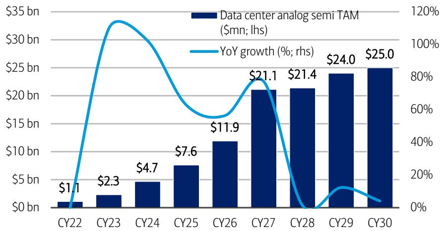

bar_line

| Year | Data center analog semi TAM ($mn; lhs) | YoY growth (%; rhs) |
| :--- | :--- | :--- |
| CY22 | 1.1 | - |
| CY23 | 2.3 | 115.0 |
| CY24 | 4.7 | 95.0 |
| CY25 | 7.6 | 60.0 |
| CY26 | 11.9 | 55.0 |
| CY27 | 21.1 | 80.0 |
| CY28 | 21.4 | 0.0 |
| CY29 | 24.0 | 15.0 |
| CY30 | 25.0 | 5.0 |

Source: BofA Global Research estimates, company reports, Gartner, Omdia, Infineon, Nvidia

BofA GLOBAL RESEARCH

While there are no official specs from Nvidia, we assume rack density for 1MW class racks continues toward a 576 GPU package architecture, while centralized SST/HVDC microgrid infrastructure is captured separately. Rack-local PSU, BBU, and PCS content therefore grow less, while incremental value concentrates in HV/MV/LV IBC conversion, GPU-board VRM and vertical power delivery, CPU-complex attached power, optics, HBM/memory power, protection, sensing, and telemetry.

Exhibit 21: We estimate analog semi content will surge from \$36K per 100-160kW rack today to almost \$300K per rack at 600kW and potentially up to \$917K after 1MW   
Evolution of component content as racks increase in power capacity 

<table><tr><td></td><td colspan="2">&lt;100kW per rack</td><td colspan="2">&lt;160kW per rack</td><td colspan="2">600+kW per rack</td><td colspan="2">1MW class racks</td></tr><tr><td>Components</td><td>Content</td><td>%</td><td>Content</td><td>%</td><td>Content</td><td>%</td><td>Content</td><td>%</td></tr><tr><td>Switching Infrastructure</td><td>$1,589</td><td>9%</td><td>$3,284</td><td>9%</td><td>$9,364</td><td>3%</td><td>$18,727</td><td>2%</td></tr><tr><td>PSU</td><td>$2,938</td><td>17%</td><td>$5,760</td><td>16%</td><td>$29,250</td><td>10%</td><td>$29,250</td><td>3%</td></tr><tr><td>BBU</td><td>$395</td><td>2%</td><td>$840</td><td>2%</td><td>$6,300</td><td>2%</td><td>$6,300</td><td>1%</td></tr><tr><td>48V Bus Converter | HV IBC</td><td>$1,271</td><td>7%</td><td>$2,700</td><td>7%</td><td>$43,200</td><td>15%</td><td>$216,000</td><td>24%</td></tr><tr><td>GPU Board</td><td>$4,320</td><td>25%</td><td>$9,720</td><td>27%</td><td>$68,040</td><td>23%</td><td>$272,160</td><td>30%</td></tr><tr><td>Smart NIC cards</td><td>$691</td><td>4%</td><td>$864</td><td>2%</td><td>$3,600</td><td>1%</td><td>$10,368</td><td>1%</td></tr><tr><td>Protection</td><td>$424</td><td>2%</td><td>$900</td><td>2%</td><td>$7,200</td><td>2%</td><td>$28,800</td><td>3%</td></tr><tr><td>Optical Infrastructure</td><td>$1,728</td><td>10%</td><td>$4,401</td><td>12%</td><td>$43,963</td><td>15%</td><td>$131,888</td><td>14%</td></tr><tr><td>HBM PMIC/memory power</td><td>$813</td><td>5%</td><td>$1,728</td><td>5%</td><td>$8,640</td><td>3%</td><td>$34,560</td><td>4%</td></tr><tr><td>CPU complex and power</td><td>$1,382</td><td>8%</td><td>$3,240</td><td>9%</td><td>$45,360</td><td>16%</td><td>$136,080</td><td>15%</td></tr><tr><td>Clocks and timing</td><td>$518</td><td>3%</td><td>$792</td><td>2%</td><td>$2,592</td><td>1%</td><td>$5,184</td><td>1%</td></tr><tr><td>Signal Chain Sensing</td><td>$1,210</td><td>7%</td><td>$2,088</td><td>6%</td><td>$4,176</td><td>1%</td><td>$8,352</td><td>1%</td></tr><tr><td>PCS</td><td>$0</td><td>0%</td><td>$0</td><td>0%</td><td>$19,500</td><td>7%</td><td>$19,500</td><td>2%</td></tr><tr><td>Total</td><td>$17,280</td><td>100%</td><td>$36,317</td><td>100%</td><td>$291,184</td><td>100%</td><td>$917,170</td><td>100%</td></tr></table>

Source: BofA Global Research estimates, company reports, Gartner, Omdia, Infineon, Nvidia

BofA GLOBAL RESEARCH

# Power Supply Units (PSU)

A power supply unit (PSU) is the rack's AC to DC conversion block. It takes data center AC power and produces a stable 48V/50V DC rail that feeds the rack busbar, server trays, and backup units. In today's architecture, multiple PSUs sit in a power shelf inside the rack (exhibit 22). Each PSU includes a PFC (power factor correction) front end which helps to draw power cleanly from the AC grid, an isolated DC to DC stage to create the regulated output, auxiliary/standby power, protection so multiple PSUs can share the bus safely, and control/communications for monitoring and current sharing. Today, 3kW/5.5kW 48V PSUs are the workhorses of 160kW racks, with 12kW single-phase PSUs as an intermediate step as rack power rises.

Exhibit 22: PSUs are evolving from single-phase 3.3kW architectures towards three-phase 30kW devices disaggregated into sidecars Infineon PSU roadmap   
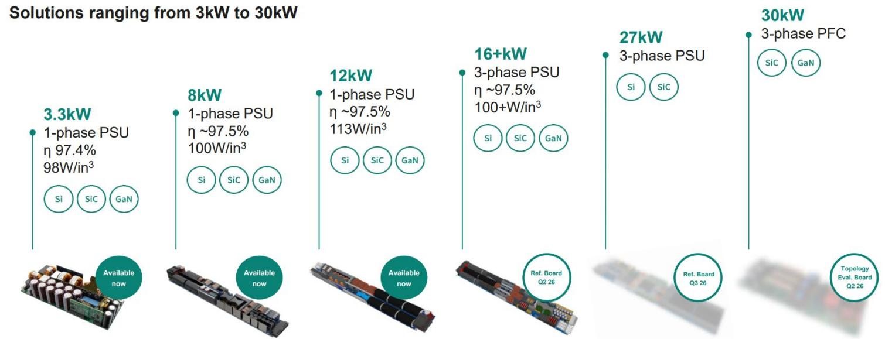

other

| Solutions Range | Capacity (kW) | Percentage (%) | Power Consumption (W/in³) |
| -------------- | ------------- | -------------- | ------------------------- |
| 3.3kW          | 3.3           | 97.4%          | 98                        |
| 8kW            | 8             | ~97.5%         | 100                       |
| 12kW           | 12            | ~97.5%         | 113                       |
| 16+kW          | 16            | ~97.5%         | 100+                      |
| 27kW           | 27            | ~97.5%         | 100+                      |
| 30kW           | 30            | ~97.5%         | 100+                      |

| Technology        | Category       | Value     |
| ----------------- | -------------- | --------- |
| Available now    | Available now | Present   |
| Available now    | Available now | Present   |
| Ref. Board Q2 26 | Ref. Board Q2 26 | Present   |
| Ref. Board Q3 26 | Ref. Board Q3 26 | Present   |
| Topology Eval. Board Q2 26 | Topology Eval. Board Q2 26 | Present   |
| SiC               | SiC            | Present   |
| GaN               | GaN            | Present   |
| Si                 | SiC            | Present   |
| SiC               | GaN            | Present   |
| Si                 | SiC            | Present   |
| SiC               | GaN            | Present   |
| Si                 | SiC            | Present   |
| SiC               | GaN            | Present   |
| Si                 | SiC            | Present   |
| SiC               | GaN            | Present   |
| Si                 | SiC            | Present   |
| SiC               | GaN            | Present, not present in diagram |
| Si                 | GaN            | Present, not present in diagram |
| Si                 | GaN            | Present, not present in diagram |
| Si                 | GaN            | Present, not present in diagram |
| Si                 | GaN            | Present, not present in diagram |
| Si                 | GaN            | Present, not present in diagram |
| Si                 | GaN            | Present, not present in diagram |
| Si                 | GaN            | Present, not present, not present in diagram |
| Si                 | GaN            | Present, not present, not present in diagram |
| Si                 | GaN            | Present, not present, not present in diagram |
| Si                 | GaN            | Present, not present, not present in diagram |
| Si                 | GaN            | Present, not present, not present in diagram |
| Si                 | GaN            | Present, not present, not present in diagram |
| Si                 = Available now; Si          |
| Si                 = Available now; Si          |
| Si                 = Available now; Si          |
| Si                 = Available now; Si          |
| Si                 = Available now; Si          |
| Si                 = Available now; Si          |
| Si                 = Available now; Si          |
| Si                 = Available now; Si          |
| Si                 = Available now; Si          |
| Si                 = Available now; Si          |
| Si                 = Available now; Si, Ref. Board Q2 26 |
| Si                 = Available now; Si, Ref. Board Q2 26 |
| Si                 = Available now; Si, Ref. Board Q2 26 |
| Si                 = Available now; Si, Ref. Board Q2 26 |
| Si                 = Available now; Si, Ref. Board Q2 26 |
| Si                 = Available now; Si, Ref. Board Q2 26 |
| Si                 = Available now; Si          |
| Si                 = Available now; Si          |
| Si                 = Available now; Si          |
| Si                 = Available now; Si          |
| Si                 = Available now; Si          |
| Si                 = Available now; Si          |
| Si                 = Available now; Si          |
| Si                 = Available now; Si          |
| Si                 = Available now; Si          |
| Si                 = Available now; Si                            |
| Ti                  | Ti             |
| Ti                  | Ti             |
| Ti                  | Ti             |
| Ti                  | Ti             |
| Ti                  | Ti             |
| Ti                  | Ti             |
| Ti                  | Ti             |
| Ti                  | Ti             |
| Ti                  | Ti             |
| Ti                  | Ti             |
| Ti                  | Ti             |
| Ti                  | Ti             |
| Ti                  | Ti             |
| Ti                  | Ti             |
| Ti                  | Ti             |
|
| Ti                  | Ti             |
|
| Ti                  | Ti             |
|
| Ti                  | Ti             |
|
| Ti                  | Ti             |
|
| Ti                  | Ti             |
|
| Ti                  | Ti             |
|
| Ti                  | Ti             |
|
| Ti                  | Ti             |
|
| Ti                  | Ti             |
|
| Ti                  | Ti             |
|
| Ti                  | Ti             |
|
| Ti                  | Ti             |
|
| Ti                  (Ref. Board Q2 26)      | Reference     | Present    |
| Reference Q3 26       | Reference     | Present    |
| Reference Q3 26       | Reference     | Present    |
| Reference Q3 26       | Reference     | Present    |
| Reference Q3 26       | Reference     | Present    |
| Reference Q3 26       | Reference     | Present    |
| Reference Q3 26       | Reference     | Present    |
| Reference Q3 26       | Reference     | Present    |
| Reference RQ2 26       | Reference     | Present    |
| Reference RQ2 26       | Reference     | Present    |
| Reference RQ2 26       | Reference     | Present    |
| Reference RQ2 26       | Reference     | Present    |
| Reference RQ2 26       | Reference     | Present    |
| Reference RQ2 26       | Reference     | Present    |
| Reference RQ2 26 (Topology Eval. Board Q2 26)      | Reference     | Present    |
| Reference RQ2 26 (Topology Eval. Board Q2 26)      | Reference     | Present    |
| Reference RQ2 26 (Topology Eval. Board Q2 26)      | Reference     | Present    |
| Reference RQ2 26 (Topology Eval. Board Q2 26)      | Reference     | Present    |
| Reference RQ2 26/Topology Eval. Board Q2 26 / Reference RQ2 26/Topology Eval. Board Q2 26 / Reference RQ2 26/Topology Eval. Board Q2 26 / Reference RQ2 26/Topology Eval. Board Q2 26 / Reference RQ2 26/Topology Eval. Board Q2 26 / Reference RQ2 26/Topology Eval. Board Q2 26 / Reference RQ2/Topology Eval. Board Q2 26 / Topology Eval. Board Q2 26 / Topology Eval. Board Q2 26 / Topology Eval. Board Q2 26 / Topology Eval. Board Q2 26 / Topology Eval. Board Q2 26 / Topology Eval. Board Q2 26 / Topology Eval. Board Q2 26 / Topology Eval. Board Q2 26 / Topology Eval. Board Q2 26 / Topological Eval. Board Q2 26 / Topological Eval. Board Q2 26 / Topological Eval. Board Q2 26 / Topological Eval. Board Q2 26 / Topological Eval. Board Q2 26 / Topological Eval. Board Q2 26 / Topological Eval. Board Q2 26 / Topological Eval. Board Q2 26 / Topological Eval. Board Q2

Rising power demands require the transition to advanced three-phase PSU architectures   

flowchart

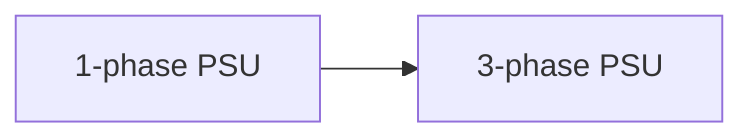
```mermaid
graph LR
    A["1-phase PSU"] --> B["3-phase PSU"]
```

Source: Infineon

BofA GLOBAL RESEARCH

In higher-power AI racks, the PSU's role changes from a relatively contained in-rack 48V power box into part of a sidecar or high-voltage power system. Along with BBUs, PSUs move out of the IT rack and into sidecars as racks approach 1MW, with three-phase PSUs (for higher power delivery) taking 400V/480V AC and producing 400V or 800V DC. The sidecar PSU can be seen as a transition architecture that converts legacy 480V AC to 800V DC (essentially helping data centers be able to adopt Rubin Ultra), while the longer-term end state moves toward DC distribution where compact IBCs in the IT tray replace much of the traditional rack PSU function. Moving to the three-phase PSUs requires several enhancements to the circuitry. The PFC (power intake) is adapted for three-phase power, DC to DC stages are upgraded for higher voltages, higher performance protection (e.g. hot swap controllers), and faster transient control (being able to react quickly if GPUs suddenly jump from low power to high power or vice versa).

Whereas traditional PSUs rely heavily on advanced silicon MOSFETs, we see a shift towards SiC and GaN (40-50% of content each). SiC is best suited for high voltage front end of larger PSUs (e.g. PFC and AC to DC stages) and high voltage DC to DC stages given its ability to deal with higher voltages with better efficiency and lower losses. GaN is applied where switching speed and power density are critical, including high-frequency PFC and certain DC to DC conversion stages.

Currently, PSUs, make up 16-18% of the TAM but this could decline as this stage of power delivery is moved upstream as microgrid architectures gain traction. Suppliers that are well positioned include Infineon, ON, STMicro (broad discrete platform) and analog vendors ADI and TXN in key sockets like protection.

Exhibit 23: PSU total content could grow from \~\$1.2bn today to \$2.6bn by CY30   
Power Supply Unit analog semi TAM estimates (\$ mn; lhs) and \% of total content (%; rhs)   
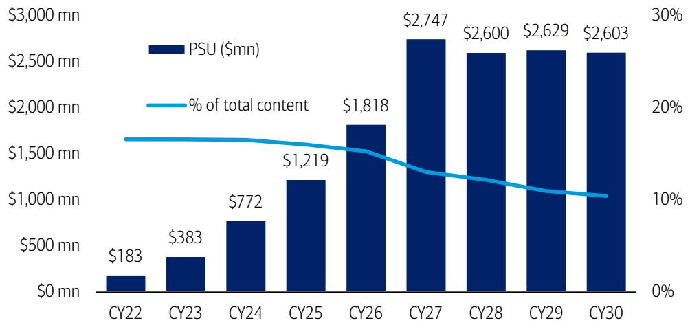

bar_line

| Year | PSU ($mn) |
| :--- | :--- |
| CY22 | 183 |
| CY23 | 383 |
| CY24 | 772 |
| CY25 | 1,219 |
| CY26 | 1,818 |
| CY27 | 2,747 |
| CY28 | 2,600 |
| CY29 | 2,629 |
| CY30 | 2,603 |

Source: BofA Global Research estimates, company reports, Gartner, Omdia, Infineon, Nvidia   
BofA GLOBAL RESEARCH

# Intermediate Bus Conversion (IBC)

An intermediate bus converter (IBC) is the conversion stage between rack-level distribution and the final processor VRM. It creates an intermediate rail the compute tray can use before the sub-1V GPU core rail stage, such as 50V, 12V, or 6V. The legacy 48V/54V IBC architecture was a practical low-voltage rack bus for lower-density systems, but it becomes inefficient as rack power moves from 100–160kW toward 600kW and 1MW+.

Exhibit 24: IBC experiences among the most dramatic increases of content as the component becomes an essential bridge between the high voltage and low voltage flow. We see a \$600mn market today growing quickly to \$3.6bn by CY30 with content % rising towards >20%.   
Intermediate Bus Conversion (IBC) TAM and \% of total content   
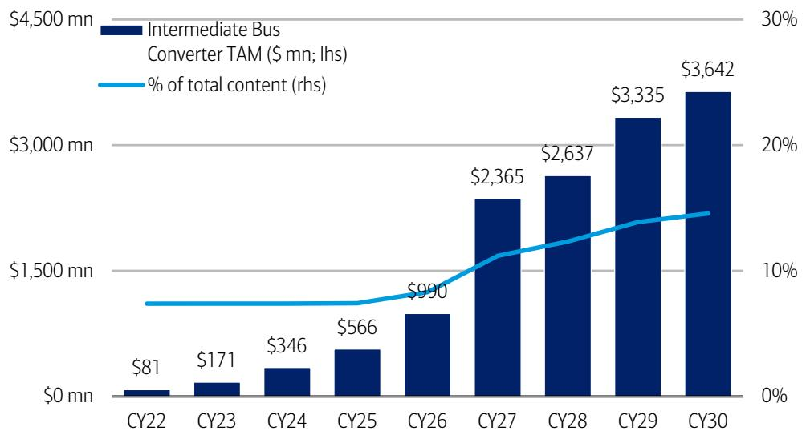

bar_line

| Year | Intermediate Bus ($ mn; lhs) | % of total content (rhs) |
| :--- | :--- | :--- |
| CY22 | 81 | 7.5 |
| CY23 | 171 | 7.5 |
| CY24 | 346 | 7.5 |
| CY25 | 566 | 8.0 |
| CY26 | 990 | 9.5 |
| CY27 | 2,365 | 11.5 |
| CY28 | 2,637 | 13.0 |
| CY29 | 3,335 | 14.5 |
| CY30 | 3,642 | 15.0 |

Source: BofA Global Research estimates, company reports, Gartner, Omdia, Infineon, Nvidia   
BofA GLOBAL RESEARCH

In a 100–160kW rack, the IBC function is still mostly a 48V/54V bus-conversion problem, so the value is concentrated in the lower-voltage ecosystem and content is relatively modest (\$2.7K/rack per our estimates). In a 600kW+ sidecar rack, value moves into the high voltage (HV) and medium voltage (MV) portions because the rack now needs to receive 800V/400V, protect it, and step it down into usable tray rails, leading to a large step up in value (15% of rack TAM). In a 1MW+ rack, the value shifts even more toward the MV conversion bridge between 800V distribution and the processor tray. At 1MW+, the power per tray and current density are so high that the conversion moves even closer to the compute board with more of an emphasis on 800V to 12V, 800V to 6V, or 50V to 6V stages sitting close to the GPU tray.

Exhibit 25: IBC's role only increases in prominence as we move to next generation power distribution flows, still retaining the important function as high to low conversion (see placed in IT racks below) even as other components move upstream   
IBC's role in a final generation AI computing SST and DC distribution   
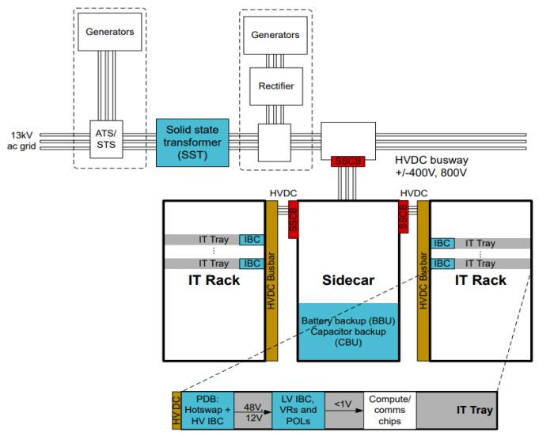

flowchart

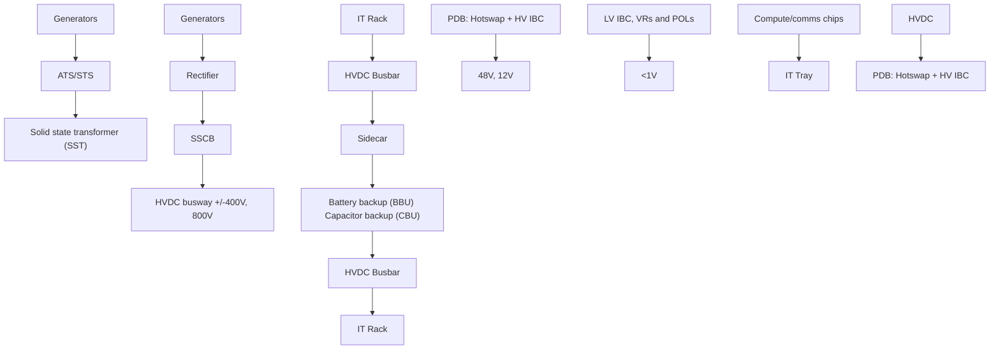
```mermaid
graph TD
    A["Generators"] --> B["ATS/STS"]
    B --> C["Solid state transformer (SST)"]
    D["Generators"] --> E["Rectifier"]
    E --> F["SSCB"]
    F --> G["HVDC busway +/-400V, 800V"]
    H["IT Rack"] --> I["HVDC Busbar"]
    I --> J["Sidecar"]
    J --> K["Battery backup (BBU) Capacitor backup (CBU)"]
    K --> L["HVDC Busbar"]
    L --> M["IT Rack"]
    N["PDB: Hotswap + HV IBC"] --> O["48V, 12V"]
    P["LV IBC, VRs and POLs"] --> Q["<1V"]
    R["Compute/comms chips"] --> S["IT Tray"]
    T["HVDC"] --> U["PDB: Hotswap + HV IBC"]
```

Source: Texas Instruments   
BofA GLOBAL RESEARCH

Exhibit 26: While legacy 48V IBC components disappear, these are replaced by higher value HV/MV/LV IBCs that carry more wide-bandgap semi content such as SiC and GaN   
48V Intermediate Bus Converter block diagram   
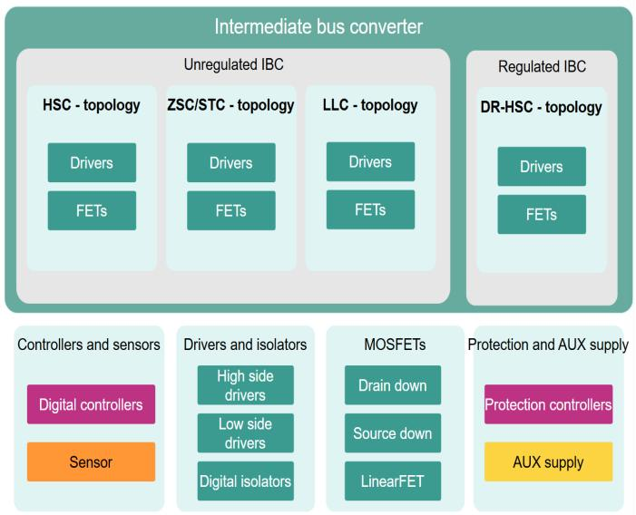

flowchart

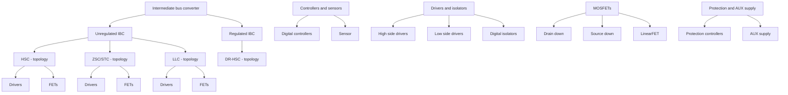
```mermaid
graph TD
    A["Intermediate bus converter"] --> B["Unregulated IBC"]
    A --> C["Regulated IBC"]
    B --> D["HSC - topology"]
    B --> E["ZSC/STC - topology"]
    B --> F["LLC - topology"]
    C --> G["DR-HSC - topology"]
    D --> H["Drivers"]
    D --> I["FETs"]
    E --> J["Drivers"]
    E --> K["FETs"]
    F --> L["Drivers"]
    F --> M["FETs"]
    N["Controllers and sensors"] --> O["Digital controllers"]
    N --> P["Sensor"]
    Q["Drivers and isolators"] --> R["High side drivers"]
    Q --> S["Low side drivers"]
    Q --> T["Digital isolators"]
    U["MOSFETs"] --> V["Drain down"]
    U --> W["Source down"]
    U --> X["LinearFET"]
    Y["Protection and AUX supply"] --> Z["Protection controllers"]
    Y --> AA["AUX supply"]
```

Source: Infineon   
BofA GLOBAL RESEARCH

There are several potential architecture paths for the conversion flow, each with tradeoffs. 800V to 12V to core keeps the chain shorter and preserves a familiar board rail, but it puts a large step-down ratio into one IBC which can add stress. 800V to 50V to 6V to core spreads the work across stages, keeps part of the 48V/50V ecosystem alive, and lets the 6V stage sit closer to the processor. 800V to 6V to core is the most direct which reduces stages and lowers the conversion ratio handled by the final VRM, but it forces the 6V converter very close to the GPU board because current is much higher. The location of value therefore moves from rack-level 48V bus conversion toward HVDC sidecar or rack distribution, then into denser conversion modules near the compute tray, and in the most aggressive architecture into ultra-dense 800V-to-6V conversion close to the GPU board.

Exhibit 27: Suppliers (like Infineon below) often offer solutions that support alternative IBC flows such as 3-stage approaches (800V to 50V to 12V/6V) or 2-stage (800V to 12V). Each architecture comes with distinct tradeoffs and benefits.   
Potential approaches for IBC   
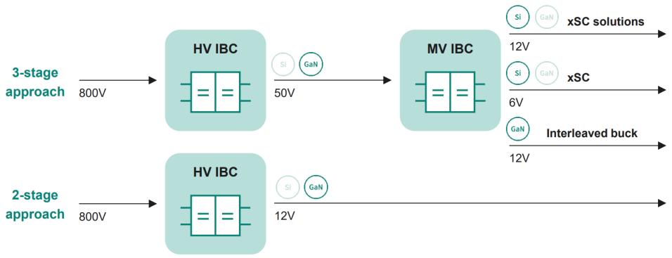

flowchart

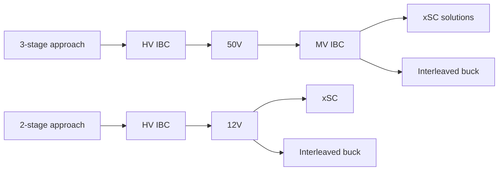
```mermaid
graph LR
    A["3-stage approach"] --> B["HV IBC"]
    B --> C["50V"]
    C --> D["MV IBC"]
    D --> E["xSC solutions"]
    D --> F["Interleaved buck"]
    G["2-stage approach"] --> H["HV IBC"]
    H --> I["12V"]
    I --> J["xSC"]
    I --> K["Interleaved buck"]
```

Source: Infineon   
BofA GLOBAL RESEARCH

SiC and GaN are specifically useful in IBCs because the converter must combine high ratio conversion, high efficiency, density, and thermal reliability. SiC is most relevant in the high-voltage input stage of an 800V-to-50V or 800V-to-12V IBC, where the devices must withstand the 800V bus, handle transients, and switch efficiently without creating excess heat. GaN is more relevant where the design is optimizing for very high switching frequency, smaller magnetics, and compact high-density conversion closer to the compute tray. Vertical GaN is an emerging GaN-on-GaN power device architecture where current flows through the device vertically rather than laterally across the surface. In AI racks, the relevant sockets IBCs such as 800V-to-50V, 800V-to-12V, or potentially 800V-to-6V, where designers want GaN-like fast switching and density but more voltage headroom and ruggedness than lateral GaN. Silicon remains relevant in lower-voltage secondary-side MOSFETs, synchronous rectification, controllers, drivers, sensing, and protection where cost and maturity matter. We expect GaN to be the leading IBC material for high power racks.

Exhibit 28: ON's vGaN transistors are fabricated on bulk GaN substrates, enabling current to flow vertically through the crystal lattice rather than laterally. Using the same substrate for fabrication (Rather than GaN-on-Si) can lead to improved yield and ruggedness, a sort of cross between SiC and standard GaN. However, manufacturing vGaN is technically challenging.   
Vertical GaN example   
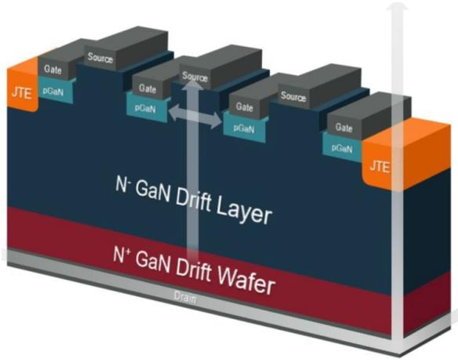

text_image

JTE
Gate
pGaN
Source
Gate
pGaN
Source
Gate
pGaN
Source
Gate
pGaN
JTE
N+ GaN Drift Layer
N+ GaN Drift Wafer
Drain

Source: Onsemi   
BofA GLOBAL RESEARCH

The competitive landscape is dynamic for these sockets. Infineon is competing across the full IBC stack, including power devices, protection, sensing, control, and downstream power. Renesas is focused on GaN-based high-density DC/DC conversion, including 48V-to-400V architectures with stacking to 800V. TXN is advocating for a direct jump to an 800V-to-6V isolated bus converter followed by 6V-to-sub-1V multiphase power, plus 800V hot-swap protection and 800V-to-12V options. MPS remains relevant where the intermediate rail feeds tightly integrated processor power and where control and density near the accelerator matter. Navitas is a wide-bandgap supplier targeting both 800V-to-50V and 800V-to-6V conversion, with the latter framed around reducing conversion stages and freeing board space near the GPU board.

# Server Board (GPU/XPU power, CPU, VRM, multi-phase)

On the GPU/compute board, the biggest power challenge is delivering very high current into very low-voltage rails. As accelerators integrate more compute silicon, HBM, and high-speed I/O, total board power rises while GPU core voltage stays below 1V. The voltage regulator module (VRM) is the local power stage that converts an intermediate board rail into the sub-1V GPU/ASIC core rail. These VRMs sit close to the accelerator package because long power paths create loss and heat. As future processors move toward 2–4kW per GPU, high-density DC to DC stages supply <1V GPU core power where currents rise into the thousands of amps.

# Exhibit 29: Multi-phase and single phase voltage regulator modules are among the most valuable sockets on the server board (bottom right box), helping to power GPUs, CPUs, and more

Block diagram of power delivery to the sever board and key components

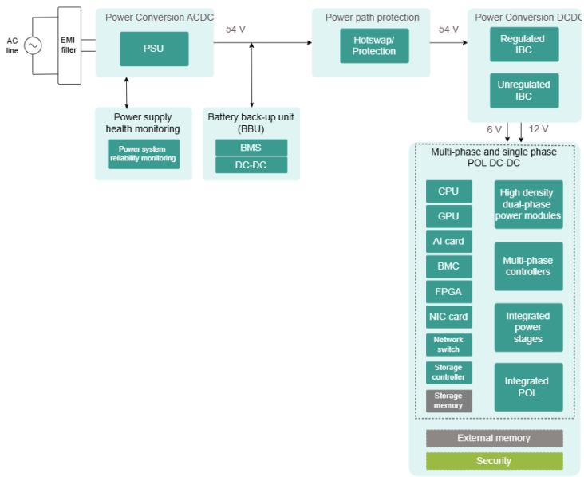

flowchart

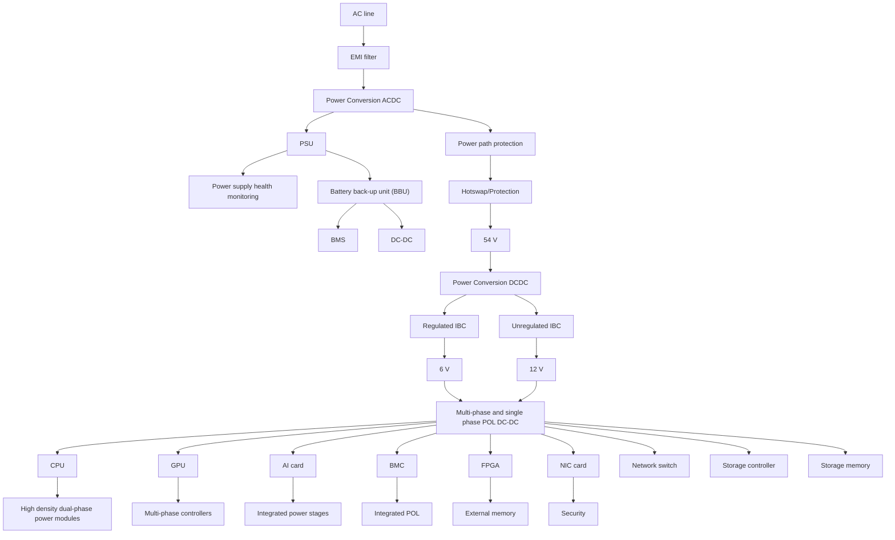
```mermaid
graph TD
    A["AC line"] --> B["EMI filter"]
    B --> C["Power Conversion ACDC"]
    C --> D["PSU"]
    D --> E["Power supply health monitoring"]
    D --> F["Battery back-up unit (BBU)"]
    F --> G["BMS"]
    F --> H["DC-DC"]
    C --> I["Power path protection"]
    I --> J["Hotswap/Protection"]
    J --> K["54 V"]
    K --> L["Power Conversion DCDC"]
    L --> M["Regulated IBC"]
    L --> N["Unregulated IBC"]
    M --> O["6 V"]
    N --> P["12 V"]
    O --> Q["Multi-phase and single phase POL DC-DC"]
    P --> Q
    Q --> R["CPU"]
    Q --> S["GPU"]
    Q --> T["AI card"]
    Q --> U["BMC"]
    Q --> V["FPGA"]
    Q --> W["NIC card"]
    Q --> X["Network switch"]
    Q --> Y["Storage controller"]
    Q --> Z["Storage memory"]
    R --> AA["High density dual-phase power modules"]
    S --> AB["Multi-phase controllers"]
    T --> AC["Integrated power stages"]
    U --> AD["Integrated POL"]
    V --> AE["External memory"]
    W --> AF["Security"]
```

Source: Infineon   
BofA GLOBAL RESEARCH

VRMs use multiphase power because the GPU core rail needs more current than a single power stage can practically deliver. Multiphase spreads the load across many smaller phases, which improves thermal spreading, current sharing, transient response, and board layout. This becomes more important as GPU load steps get faster and larger. Analog multiphase control is proven, but digital multiphase control becomes more valuable as phase counts rise because it adds telemetry, programmable tuning, current balancing, fault reporting, and easier reuse across processor platforms.

Exhibit 30: Power delivery to the processor (GPU/XPU) is among the most valuable components (mid-20% of content TAM) and grows from \$2bn in CY25 to over \$6.6bn by CY30   
TAM for GPU related components on the server board   
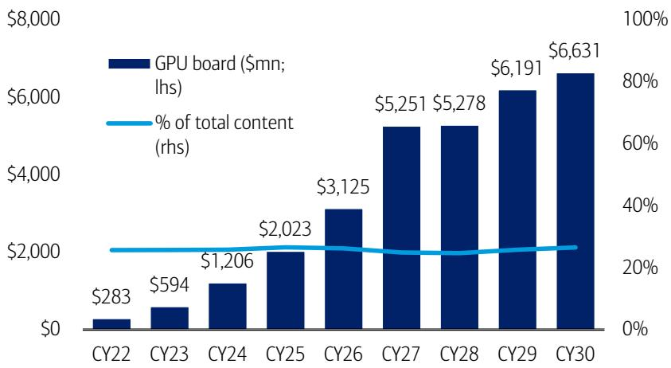

bar_line

| Year | GPU board ($mn; lhs) | % of total content (rhs) |
| :--- | :--- | :--- |
| CY22 | 283 | 25 |
| CY23 | 594 | 25 |
| CY24 | 1,206 | 25 |
| CY25 | 2,023 | 26 |
| CY26 | 3,125 | 27 |
| CY27 | 5,251 | 26 |
| CY28 | 5,278 | 25 |
| CY29 | 6,191 | 26 |
| CY30 | 6,631 | 27 |

Source: BofA Global Research estimates, company reports, Gartner, Omdia, Infineon, Nvidia   
BofA GLOBAL RESEARCH

The compute tray power architecture is also changing at the processor level. In lower-power systems, the final VRM typically steps down from a familiar board rail such as 12V. In higher-power trays, more architectures are looking at lower intermediate rails closer to the processor, such as 6V, to reduce the burden on the final VRM. The tradeoff is that lower intermediate voltage means higher current, so the conversion stage must sit closer to the load. This is why the opportunity is shifting toward high-density VRMs, integrated power stages, better capacitors, tighter sensing, and advanced packaging around the processor rather than just more discrete regulators across the board.

Exhibit 31: VRMs increasingly have to channel more current through a smaller physical footprint as power density rises with the roadmap tripling amps per millimeter squared in several years via smaller packages, multiphase integration, and innovations in advanced packaging   
Voltage Regulator Module roadmap   
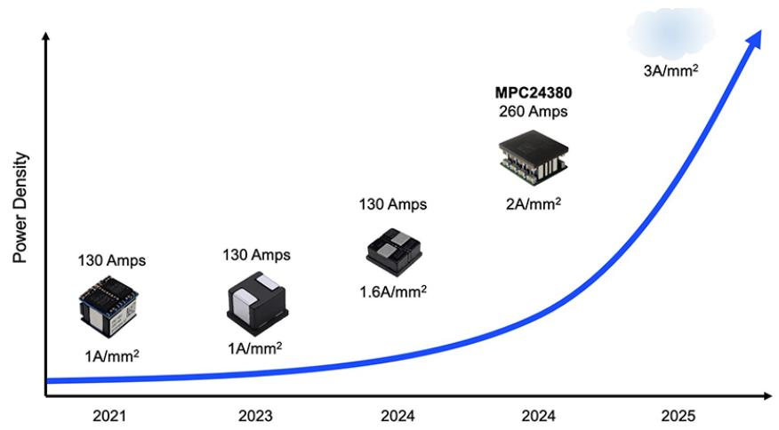

line

| Year | Power Density (A/mm²) |
| :--- | :--- |
| 2021 | 1 |
| 2023 | 1 |
| 2024 | 1.6 |
| 2024 | 130 |
| 2024 | 2 |
| 2025 | 3 |
MPC24380
260 Amps
2A/mm²

Source: Monolithic Power Systems   
BofA GLOBAL RESEARCH

GPU-board content remains the largest socket, and in our model GPU-board content rises from roughly \$9.7k in a 100–160kW rack to \$272k in a 1MW+ rack, reflecting more GPUs, higher current per accelerator, more phases, more vertical power, and more package-adjacent regulation. However, the CPU and HBM broaden the analog opportunity beyond the GPU core VRM.

CPU content is smaller per socket, but it grows as we push deeper into the agentic AI. If NVIDIA deploys separate CPU racks, the opportunity expands from CPU attach inside the GPU tray to a standalone pool of CPU VRMs, memory power, board-level point of loads, sensing, timing, protection, NIC/DPU power, and platform-management rails. HBM also adds content as memory capacity, bandwidth, and stack complexity rise, driving more PMICs, low-noise rails, sequencing, sensing, and thermal monitoring.

Exhibit 32: The board opportunity is expanding as content tied to CPU and HBM continues to rise in conjunction with rising processor power as well as with new agentic workloads   
CPU complex and attach content along with HBM/memory attach content   
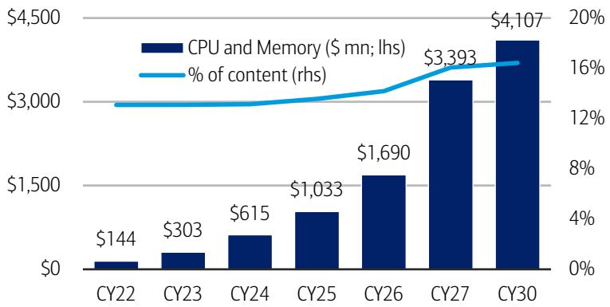

bar_line

| Year | CPU and Memory ($ mn; lhs) | % of content (rhs) |
| :--- | :--- | :--- |
| CY22 | 144 | 12.5 |
| CY23 | 303 | 12.5 |
| CY24 | 615 | 12.5 |
| CY25 | 1,033 | 13.5 |
| CY26 | 1,690 | 14.5 |
| CY27 | 3,393 | 16.5 |
| CY30 | 4,107 | 17.5 |

Source: BofA Global Research estimates, company reports, Gartner, Omdia, Infineon, Nvidia

BofA GLOBAL RESEARCH

Power delivery is also shifting physically. Lateral power delivery places regulators beside the processor and routes current across the PCB and package. It is mature and lower cost, but losses rise at very high current, and it consumes valuable real estate around the package that can be used for other functions. Vertical power delivery moves power under the processor or through the backside of the board/package, shortening the current path and reducing losses. Integrated power delivery goes further by moving regulation and capacitance into or next to the package. ADI's acquisition of Empower fits directly here because ADI says Empower adds integrated voltage regulator and silicon capacitor technology, enabling conversion closer to the processor and improving efficiency for higher-density systems.

Exhibit 33: Lateral power delivery today is increasingly making way for vertical power delivery in order to reduce losses. Integrated voltage regulators extend the roadmap further LT   
Power delivery options to the core 

<table><tr><td>Lateral Power Delivery</td><td>Discrete (Lateral)
+ Power stages, inductors and capacitors located next to the processor
+ Lowest cost, with established eco-system and quality record
+ PDN losses exceed 100W for GPU currents beyond 850-1000A</td><td>Lumped PDN&#x27; 90-140μΩ</td><td>xPU substrate motherboard</td></tr><tr><td>Vertical Power Delivery</td><td>BVM – Backside Vertical Module (Vertical)
+ Increases power density by eliminating required spacing between multiple smaller modules
+ Simplifies motherboard design by eliminating routing of input power and control signals under processor</td><td>Lumped PDN&#x27; 10-15μΩ
-89%
downarrow</td><td></td></tr><tr><td>Vertical Power Delivery</td><td>SiVR – Substrate integrated Voltage Regulator (Vertical)
+ Reduces substrate PDN losses by additional 10-15%
+ Removes substrate interconnect current limitations</td><td>Lumped PDN&#x27; 7-10μΩ
-93%
downarrow</td><td>motherboard</td></tr></table>

Source: Infineon   
BofA GLOBAL RESEARCH

The competitive landscape is shifting from selling discrete power parts to owning more of the compute power delivery architecture. MPS is competing through density, integration, digital control, and proximity to the accelerator. Infineon is competing with breadth across processor power, vertical power, protection, sensing, and control. ADI is moving from high-performance analog power into package-adjacent power through Empower, which gives it a stronger position in the highest-value last-inch socket. TI is positioned around broad analog power management and simplified processor power paths. Renesas is competing around high-density DC/DC conversion, controllers, drivers, and 800V architecture support. This is such a valuable socket because units and ASPs both rise. Units rise as GPU count, HBM content, rails, phases, sensors, and protection points increase per tray. ASPs rise because the solution is moving from commodity discretes toward digital multiphase controllers, integrated power stages, vertical modules, IVRs, silicon capacitors, telemetry, and advanced packaging. Discrete component count may consolidate, but content dollars per GPU/compute board rise materially as power delivery becomes a limiting factor for AI performance.

# Other components (protection, sensors, optics, etc.)

We have covered the major and most valuable sockets as data centers move towards high voltage architecture, but next we will cover the smaller categories of components.

# Protection (i.e. hot swap controllers)

Protection is the circuitry that lets trays, boards, and power modules connect to a live DC bus without damaging the rack. In 48V systems, this is mostly eFuse, hot-swap, overcurrent, short-circuit, and telemetry around the rack bus. In 400V/800V systems, it becomes a higher-ASP socket because the controller has to manage pre-charge, inrush current, discharge, fault isolation, live serviceability, and real-time telemetry at much higher stored energy. ADI has an established hot-swap portfolio, while Infineon and TI are also pushing 400V/800V protection and hot-swap for AI racks. We think protection can grow to become a \$700mn market by CY30 but note Infineon believes the AI protection SAM could reach \$800mn during the same time led by 400V/800V products.

# Optical infrastructure

Optical analog content is one of the largest categories in our model because AI rack bandwidth scales with GPU count, cluster size, and the move from 800G to 1.6T links. In our content build, optical infrastructure rises from roughly \$4.4k in a 100–160kW rack to \$44k in a 600kW+ rack and \$132k in a 1MW+ rack because there are more optical ports, more lanes per port, higher-speed analog front ends, and more power/thermal management around each module. An 800G 200G/lane module can include roughly one TIA, four photodiodes, and zero to one laser drivers, depending on whether the architecture uses external lasers, linear drive, or a more integrated optical engine. Moving to 1.6T can roughly double that analog footprint, and in some architectures the analog content can more than double as control, CDR, power, TEC, monitoring, and SiPho interface content increases. Regardless of whether the industry pursues retimed transceivers, LPO/LRO, or even CPO, analog content should remain constant.

ADI sells optical control and power solutions including precision controllers, converters, and TEC controllers making up roughly half their data center revenue. Renesas sells VCSEL drivers and TIA receiver arrays. MTSI sells CDRs, TIAs, laser drivers, CW lasers, photodiodes, and analog CDR-based optical components. STMicro's optical angle is a full module level stack. Its PIC100 platform is the photonic IC (PIC) layer for silicon photonics optical interconnects, supporting 200G-per-lane capability for 800G/1.6T-class modules, while its SiGe BiCMOS technology supports the electronic IC (EIC) layer, including high-speed TIAs and laser drivers. ST also emphasizes the MCU another major component inside the transceiver, used to control module operations

Exhibit 34: PICs, EICs, and MCUs are examples of analog products that vendors like STMicro can sell into both an optical transceiver (pluggable) or a co-packaged optics (CPO) solution

Analog content in optics

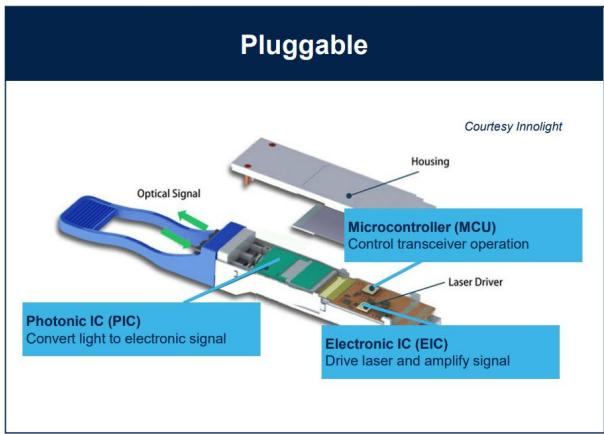

text_image

Pluggable
Courtesy Innolight
Housing
Optical Signal
Microcontroller (MCU)
Control transceiver operation
Laser Driver
Photonic IC (PIC)
Convert light to electronic signal
Electronic IC (EIC)
Drive laser and amplify signal

Source: STMicro, Innolight

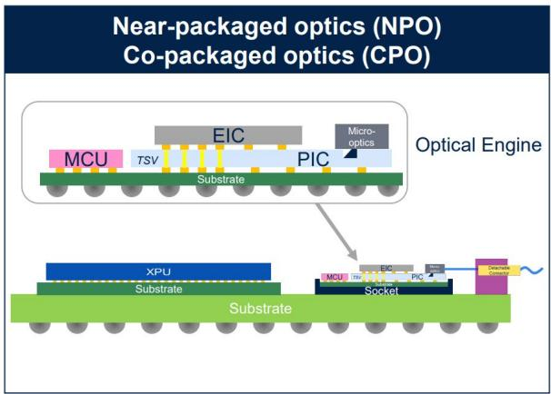

flowchart

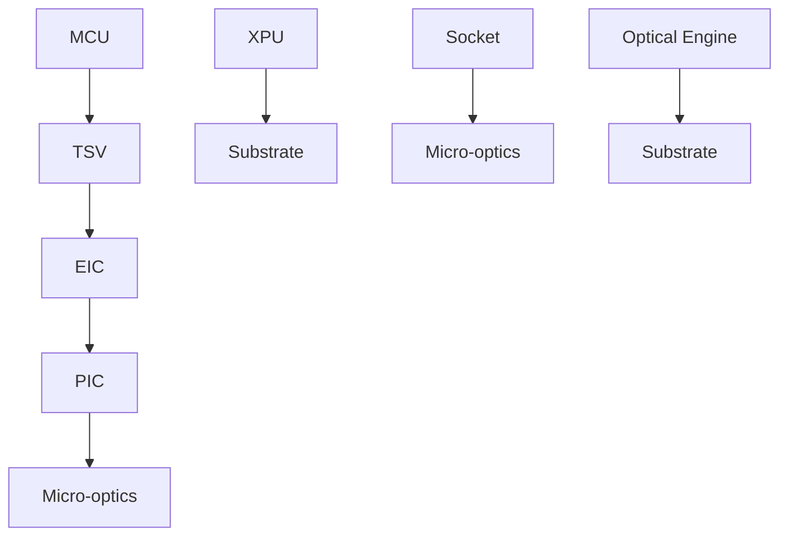
```mermaid
graph TD
    A["MCU"] --> B["TSV"]
    B --> C["EIC"]
    C --> D["PIC"]
    D --> E["Micro-optics"]
    F["XPU"] --> G["Substrate"]
    H["Socket"] --> I["Micro-optics"]
    J["Optical Engine"] --> K["Substrate"]
```

BofA GLOBAL RESEARCH

# Clocking and timing

Clocks and timing ICs generate and distribute clean reference signals, while retimers regenerate PCIe/CXL links so GPUs, CPUs, NICs, switches, and accelerators can communicate across longer traces and denser rack topologies. Content rises because PCIe 5/6, CXL, 800G networking, optics, and pooled accelerator architectures need more lanes, lower jitter, longer reach, and better telemetry. MCHP sells PCIe oscillators, clock generators, and buffers through Gen7, and its 3nm Gen 6 PCIe switch adds a higher-value adjacency with 64GT/s PCIe 6.0, up to 160 lanes, low latency, diagnostics, and CPU/GPU/accelerator/storage connectivity. MCHP also is involved in retimers but Marvell and Astera Labs are stronger here. ASPs rise as the socket moves from basic clocks toward low-jitter timing, PCIe switching, retiming, security, and fleet reliability

# Sensors/Signal chain

Current sensors measure current flow for regulation, protection, telemetry, and fault response. In today's 48V racks, the job is monitoring busbars, PSUs, BBUs, VRMs, and protection paths. In 800V/high-power racks, current sensing becomes more important because GaN/SiC stages switch faster, fault windows shrink, and racks need real-time visibility across IBCs, hot swap, BBU, PCS, and tray power. TMR sensors are attractive because they can provide faster, lower-noise, contactless current measurement versus traditional magnetic sensors. Key players include ALGM, Infineon, TDK, AKM, Melexis, and TXN/ADI in adjacent current-sense amplifiers and isolation. Signal-chain sensing is the broader analog layer around measurement, isolation, conversion, and monitoring. It includes voltage/temperature sensing, isolated amplifiers, ADCs, DACs, digital isolators, bias supplies, telemetry, and MCU control. In lower-voltage racks, this is a support socket around PSUs, BBUs, fans, VRMs, and thermal monitoring. In 400V/800V racks, it becomes more strategic because the system needs isolated measurement, faster fault detection, higher common-mode robustness, and tighter feedback loops. Key players include ADI, TXN, Infineon, Renesas, and Silicon Laboratories.

# Battery Backup Unit (BBU)

A battery backup unit provides short-duration backup and power conditioning so the rack can ride through grid events, shut down safely, or bridge to other backup sources. In lower-voltage racks, BBUs can sit in or near the rack and support the 48V/50V bus. In higher-power racks, the BBU function increasingly shifts toward sidecar or centralized UPS-ESS/battery infrastructure, while rack-local BBU content grows more slowly if the central microgrid table captures the larger energy-storage opportunity (as we capture in our model) although content generally improves. Materials include lithium-ion batteries, silicon MOSFETs, GaN in high density partial-power conversion, gate drivers, MCUs, current sensors, and protection devices. Infineon, ADI, and TXN have the most comprehensive product portfolio to address BBUs.

Exhibit 35: The BBU shelf provides backup power if an AC power outage occurs for a defined period of time, giving time for the rack to be moved between power sources without disrupting the IT gear. OCP's architecture below shows a shelf that sends power across a common bus bar to IT gear but for Rubin Ultra we think BBU functions could relocate to the power sidecar

BBU shelf configuration in an Open Compute Project ORV3 open rack power architecture

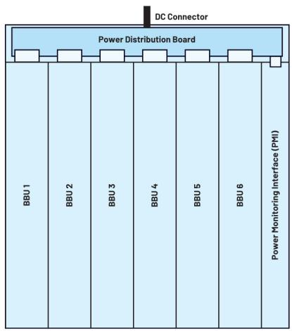

text_image

DC Connector
Power Distribution Board
BBU 1
BBU 2
BBU 3
BBU 4
BBU 5
BBU 6
Power Monitoring Interface (PHI)

Source: Analog Devices, Open Compute Project

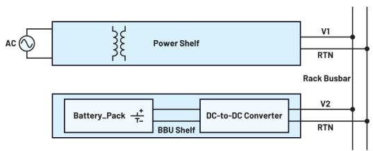

flowchart

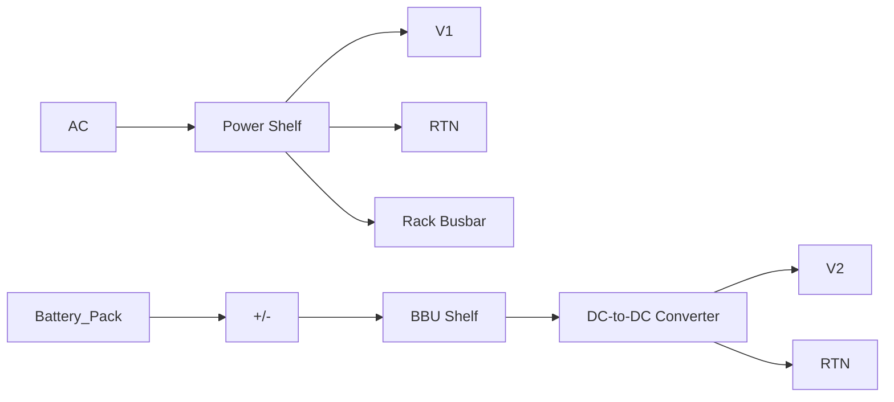
```mermaid
graph LR
    A["AC"] --> B["Power Shelf"]
    B --> C["V1"]
    B --> D["RTN"]
    B --> E["Rack Busbar"]
    F["Battery_Pack"] --> G["+/-"]
    G --> H["BBU Shelf"]
    H --> I["DC-to-DC Converter"]
    I --> J["V2"]
    I --> K["RTN"]
```

BofA GLOBAL RESEARCH

# Power Conversion System (PCS)

PCS is the power conversion system that buffers fast rack or tray-level transients. It is not long-duration backup like a BBU but instead is a fast response energy buffer that helps keep the DC bus stable when GPUs ramp power quickly. In lower power racks, this function can be handled by bulk capacitance inside PSUs, trays, or VRM input networks. In 800V/1MW racks, it becomes a more visible socket because the rack needs to manage sharper load steps, higher energy on the DC bus, and more serviceable power shelves or sidecars (hence why content begins after 600kw/rack). Content depends on whether buffering sits centrally at 800V, inside a sidecar, or closer to trays. TXN and Infineon are both closely involved here. In 1MW racks, PCS content likely moves upstream as the buffering could move into a centralized HVDC bus or microgrid energy storage layer but does not disappear from the rack entirely.

# Power Infra: \$2bn TAM from grid to hall

We estimate the strategic power infrastructure analog semi opportunity grows from \$300mn in CY25 to \$1.8bn in CY30, a \~49% CAGR, with growth near +90%/140% CY26/27 as Solid-State Transformers (SST) and Solid-State Circuit Breakers (SSCB) gain traction. Our model drives content on a MW basis and we note the inflection in CY28 begins with the 1MW level racks and the introduction of the hybrid microgrid architecture which moves power content upstream. This is not an exhaustive TAM, and analog suppliers are likely shipping more to energy/power infrastructure that is seeing a “halo effect” from AI, but we focus on the more prominent categories. These sales would likely be reported in the industrial or infrastructure segments of the various analog vendors rather than in data center.

Exhibit 36: We forecast the power infra-analog semi TAM to grow from <\$300mn today to \$1.8bn by the end of the decade, a 49% CAGR

Strategic power infrastructure TAM (\$mn)

\$2,400 mn

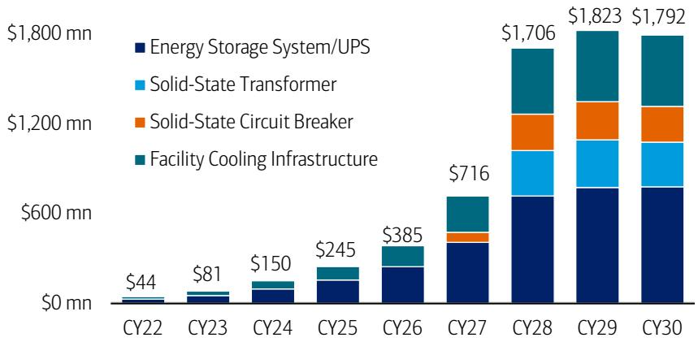

bar_stacked

| Year | Energy Storage System/UPS ($ mn) | Solid-State Transformer ($ mn) | Solid-State Circuit Breaker ($ mn) | Facility Cooling Infrastructure ($ mn) |
| :--- | :--- | :--- | :--- | :--- |
| CY22 | 44 | | | |
| CY23 | 81 | | | |
| CY24 | 150 | | | |
| CY25 | 245 | | | |
| CY26 | 385 | | | |
| CY27 | 716 | | | |
| CY28 | 1,706 | 400 | 200 | 400 |
| CY29 | 1,823 | 300 | 200 | 400 |
| CY30 | 1,792 | 250 | 200 | 400 |

Source: BofA Global Research estimates, company reports, Gartner, Omdia, Infineon, Nvidia   
BofA GLOBAL RESEARCH

The end state of 800V turns AI power delivery into a site-level microgrid architecture, where the rack becomes more compute-dense and DC-native while more value moves upstream into HVDC conversion, storage, protection, and cooling. In our model, content rises from roughly \$12.4k to \$38.9k because 1MW+ racks need an 800V backbone, centralized ESS/UPS for ride-through, SST or high-voltage conversion to create the DC bus, SSCBs and hot-swap protection to make the bus safe and serviceable, and facility liquid-cooling infrastructure to remove the heat. SiC becomes more important in high-voltage conversion and protection where blocking voltage, thermal robustness, and fault handling matter. GaN fits higher-frequency, higher-density conversion stages where smaller magnetics and efficiency matter. Silicon remains important in controllers, drivers, sensing, telemetry, lower-voltage power stages, and cooling controls.

Exhibit 37: 1MW racks will introduce new infrastructure-level technologies including SSTs and SSCBs. Content per MW could rise over 3x to \$38.9K by the end of the decade.   
Strategic power infra-analog semi content evolution from low voltage to high voltage 

<table><tr><td></td><td colspan="2">Per MW (Low Voltage Era)</td><td colspan="2">Per MW (High Voltage Era)</td></tr><tr><td>Components</td><td>Sales</td><td>%</td><td>Sales</td><td>%</td></tr><tr><td>Energy Storage System/UPS</td><td>$7,850</td><td>64%</td><td>$14,130</td><td>36%</td></tr><tr><td>Solid-State Transformer</td><td>$0</td><td>0%</td><td>$8,772</td><td>23%</td></tr><tr><td>Solid-State Circuit Breaker</td><td>$0</td><td>0%</td><td>$7,018</td><td>18%</td></tr><tr><td>Facility Cooling Infrastructure</td><td>$4,500</td><td>36%</td><td>$9,000</td><td>23%</td></tr><tr><td>Total</td><td>$12,350</td><td>100%</td><td>$38,920</td><td>100%</td></tr></table>

Source: BofA Global Research estimates, company reports, Gartner, Omdia, Infineon, Nvidia   
BofA GLOBAL RESEARCH

Exhibit 38: Previous functions like the HVDC sidecar rack for 500-600kW+ racks could be disaggregated and content can move up the chain as new technologies like solid-state transformers, enhanced ESS, and solid-state circuit breakers bear more of the load for 1MW+ class racks   
Grid-to-core block diagram evolution   
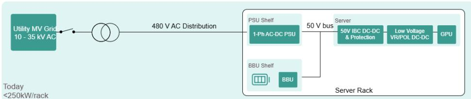

flowchart

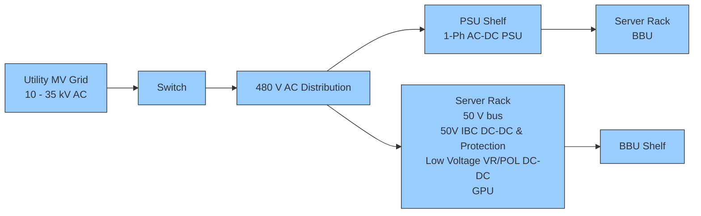
```mermaid
graph LR
    A["Utility MV Grid\n10 - 35 kV AC"] --> B["Switch"]
    B --> C["480 V AC Distribution"]
    C --> D["PSU Shelf\n1-Ph AC-DC PSU"]
    C --> E["Server Rack\n50 V bus\n50V IBC DC-DC & Protection\nLow Voltage VR/POL DC-DC\nGPU"]
    D --> F["Server Rack\nBBU"]
    E --> G["BBU Shelf"]
    style A fill:#99ccff,stroke:#333
    style B fill:#99ccff,stroke:#333
    style C fill:#99ccff,stroke:#333
    style D fill:#99ccff,stroke:#333
    style E fill:#99ccff,stroke:#333
    style F fill:#99ccff,stroke:#333
    style G fill:#99ccff,stroke:#333
```

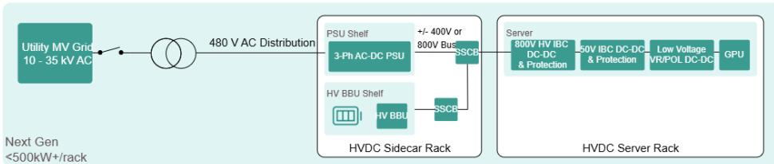

flowchart

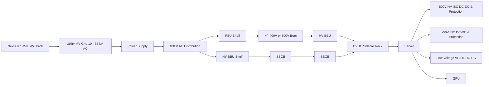
```mermaid
graph LR
    A["Utility MV Grid 10 - 35 kV AC"] --> B["Power Supply"]
    B --> C["480 V AC Distribution"]
    C --> D["PSU Shelf"]
    C --> E["HV BBU Shelf"]
    D --> F["+/- 400V or 800V Burc"]
    E --> G["SSCB"]
    F --> H["HV BBU"]
    G --> I["SSCB"]
    H --> J["HVDC Sidecar Rack"]
    I --> J
    J --> K["Server"]
    K --> L["800V HV IBC DC-DC & Protection"]
    K --> M["-50V IBC DC-DC & Protection"]
    K --> N["Low Voltage VR/OL DC-DC"]
    K --> O["GPU"]
    P["Next Gen <500kW+/rack"] --> A
```

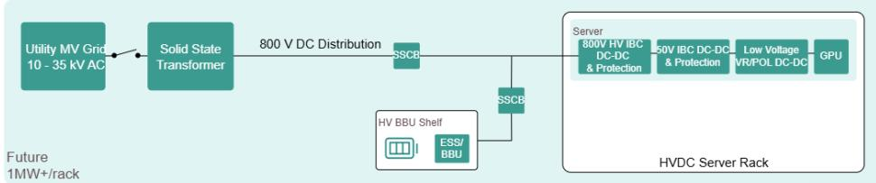

flowchart

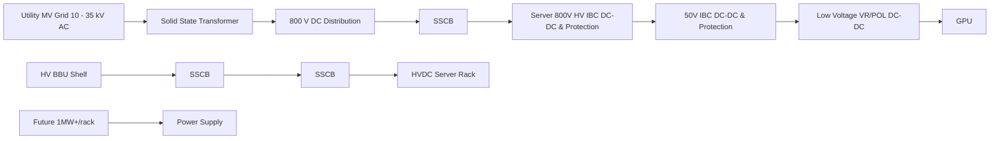
```mermaid
graph LR
    A["Utility MV Grid 10 - 35 kV AC"] --> B["Solid State Transformer"]
    B --> C["800 V DC Distribution"]
    C --> D["SSCB"]
    D --> E["Server 800V HV IBC DC-DC & Protection"]
    E --> F["50V IBC DC-DC & Protection"]
    F --> G["Low Voltage VR/POL DC-DC"]
    G --> H["GPU"]
    I["HV BBU Shelf"] --> J["SSCB"]
    J --> K["SSCB"]
    K --> L["HVDC Server Rack"]
    M["Future 1MW+/rack"] --> N["Power Supply"]
```

Source: Infineon   
BofA GLOBAL RESEARCH

# Energy Storage System (ESS)/Uninterruptible Power Supply (UPS)

Historically, ESS was mainly a residential, commercial, and utility-scale power asset. In residential and commercial settings, batteries stored excess solar or low-cost grid power and provided backup during outages. At utility scale, ESS helped buffer renewable intermittency, shift power from low-demand to high-demand periods, and stabilize the grid by smoothing supply/demand imbalances. The semiconductor opportunity was formerly concentrated around the battery-management system, inverter/PCS, sensing, isolation, MCUs, and protection needed to safely monitor battery health and move energy in and out of the pack. For AI data centers, the role expands because the load is not just larger, it is also more concentrated and more dynamic. Rather than just acting as a standby reserve, energy storage becomes a core part of the power delivery architecture by helping provide ride-through, smooth GPU-driven load swings, support the HV sidecars, and ultimately bridge to a hybrid microgrid style facility design.

Exhibit 39: ESS battery shipments grow +31% CAGR CY25 to CY30   
Global ESS battery shipment forecasts 2025/2026/2028 (Infineon)   
Global ESS battery shipment forecast   
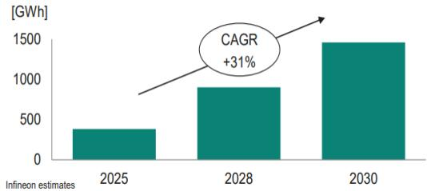

bar

| Year | Value (GWh) |
| :--- | :--- |
| 2025 | 400 |
| 2028 | 900 |
| 2030 | 1500 |
CAGR +31%

Source: Infineon   
BofA GLOBAL RESEARCH

Exhibit 40: Most of the ESS content is concentrated in power, but control (e.g. MCUs), and analog (gate drivers sensors) are valuable too   
Devices used in ESS   
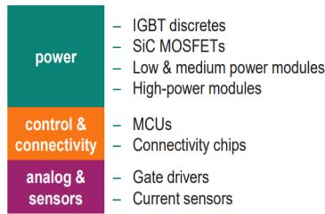

text_image

power
- IGBT discretes
- SiC MOSFETs
- Low & medium power modules
- High-power modules
control &
connectivity
- MCUs
- Connectivity chips
analog &
sensors
- Gate drivers
- Current sensors

Source: Infineon   
BofA GLOBAL RESEARCH

We assume ESS/UPS content per MW rises from \$7.9k in the low-voltage era to \$14.1k in the high-voltage era. The uplift comes from the electronics around the storage system as it must interface with higher voltage buses and higher power transient loads, which adds more battery monitoring, current and voltage sensing, isolation, gate drivers, MCUs, and protection. SiC should benefit most as ESS connects to higher-voltage PCS/UPS and protection stages. GaN should be more selective, showing up where high-frequency DC/DC conversion improves density rather than as the main ESS content. By company, Infineon looks best positioned where ESS becomes part of the broader grid-to-core HVDC architecture because it participates across Si, SiC, GaN, MCUs, sensors, drivers, and protection. TI should benefit from the breadth of its power path portfolio across ESS/UPS, sensing, conversion, eFuse, hot-swap, and MCU content. Renesas is relevant where backup power shifts toward higher-voltage BBU and distributed storage designs, specifically arguing that wide-bandgap devices can help HV BBU systems address weight, volume, and efficiency constraints. We estimate the ESS opportunity for AI data centers specifically today to be relatively small at \$156mn but believe it can reach nearly \$800mn by CY30, a +38% CAGR.

# Solid-State Transformer (SST)

Solid-state transformers are the next infrastructure layer above ESS in the data center high voltage power stack. Historically, the transformer was mostly a passive grid asset that stepped medium voltage utility power down to lower voltage AC, after which the data center still needed layers of UPS, switchgear, PDUs, PSUs, and AC to DC conversion before power reached the rack. This was acceptable when rack power was lower and loads were less dynamic, but AI changes the problem because power availability, deployment speed, and conversion efficiency become larger constraints. Indeed, there are many reports of potential data center projects at risk of delay due to grid constraints and supply shortages in conventional transformers (medium voltage transformer lead times up to 3 years per Wolfspeed). This is where SSTs come in as they replace a bulky, long lead time, low-frequency transformer with a modular power-electronics system that can convert medium-voltage AC, typically 13.8kV to 35kV, directly to an 800 VDC bus for the compute rack. In doing so, this helps (1) compress the power chain by reducing downstream AC to DC stages, and (2) creates a more modular grid interconnect that can be easier to deploy. Compared with a conventional transformer, SSTs could be \~40x lighter, \~14x smaller, and have a \~50% faster construction time, per Infineon.

Exhibit 41: When compared to a conventional transformer, SSTs are superior as it replaces much of the passive transformer function typically done using copper wirings and magnetic cores to something that is more active, with high frequency switching, isolation, digital control, and protection. In a hybrid microgrid, SSTs will be a core block as part of the 800 VDC backbone.

Solid-state transformer vs. a low frequency transformer (LFT)

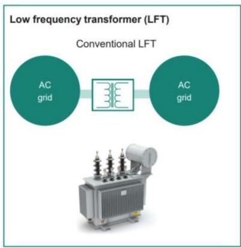

flowchart

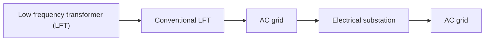
```mermaid
graph LR
    A["Low frequency transformer (LFT)"] --> B["Conventional LFT"]
    B --> C["AC grid"]
    C --> D["Electrical substation"]
    D --> E["AC grid"]
```

Source: Infineon

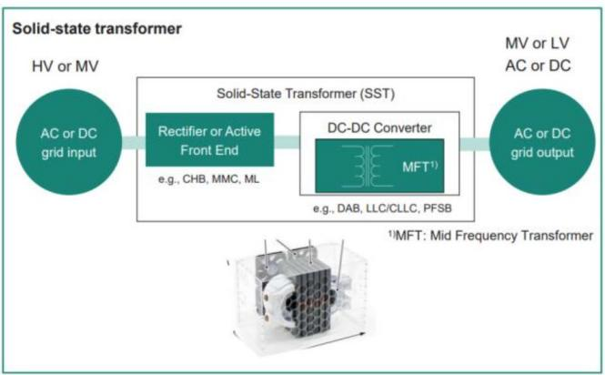

flowchart

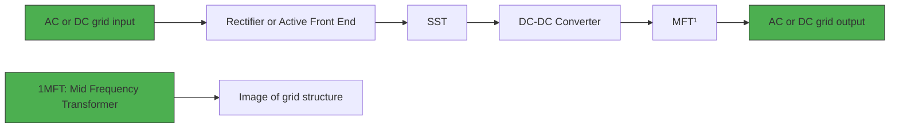
```mermaid
graph LR
    A["AC or DC grid input"] --> B["Rectifier or Active Front End"]
    B --> C["SST"]
    C --> D["DC-DC Converter"]
    D --> E["MFT¹"]
    E --> F["AC or DC grid output"]
    G["1MFT: Mid Frequency Transformer"] --> H["Image of grid structure"]
    style A fill:#4CAF50,stroke:#333
    style F fill:#4CAF50,stroke:#333
    style G fill:#4CAF50,stroke:#333
```

BofA GLOBAL RESEARCH

We assume SST content moves from essentially \$0/MW in the low voltage era (virtually no deployments today) to \$8.8k/MW in the high voltage era. A conventional transformer has next to zero analog semi content, but an SST is built out of high voltage power devices, gate drivers, isolation, current and voltage sensing, controllers, protection, magnetics, and digital control. SiC should be the primary material winner because the main SST challenge is high voltage, high efficiency switching at the grid interface. We expect pilot tests to begin soon if not already ongoing, with emerging wide-bandgap vendors like Wolfspeed and Navitas demonstrating solutions, but with larger suppliers like Infineon also well positioned given their portfolio breadth (not just discretes needed, also analog and MCUs). We think the real inflection should begin CY28-30 when hybrid microgrid architectures begin to see adoption. Infineon believes the entire SST market (not just semi content) could be \$1bn by CY30 and we think the analog semi opportunity could reach \$500mn by that same point in time.

Exhibit 42: A key debate of SSTs is whether to implement medium voltage-based designs or high voltage-based designs. The high voltage market is less established but could be ideal in the longer term due to its design simplicity and higher performance.

Tradeoffs between a medium voltage and high voltage silicon carbide SST design

<table><tr><td>Design Nuances</td><td>MV-rated SiC power devices &lt;5kW blocking voltage</td><td>HV-rated SiC power devices &gt;5kW blocking voltage</td></tr><tr><td>Architecture</td><td>Series stacking of multiple devices, often in three to five-level architectures</td><td>Wolfspeed 10kV die can enable a simple two-level cell</td></tr><tr><td>Modularity</td><td>Smaller building blocks are easier to handle and service</td><td>Larger and less modular therefore not as easy to handle</td></tr><tr><td>Insulation</td><td>Requires precise attention to insulation coordination between cells</td><td>Simpler insulation</td></tr><tr><td>Control Scheme</td><td>Control algo needed to gate series switches for cleaner output</td><td>Less complex control scheme due to fewer cells</td></tr><tr><td>Gate Driver</td><td>3.3kW rated SiC gate drivers commercially available</td><td>Very few comparable solutions available above 3.3kV requiring vendors to do custom development and qualification</td></tr><tr><td>Electromagnetic Interference (EMI)</td><td>Multi-level architecture requires smaller dv/dt</td><td>Switch with high dv/dt requiring ultra-low-parasitic design</td></tr></table>

Source: Wolfspeed, BofA Global Research; dv/dt = change in voltage over time

BofA GLOBAL RESEARCH

# Solid-State Circuit Breakers (SSCB)

Solid-state circuit breakers are the protection layer that becomes more important as data center power shifts from lower-voltage AC/48V architectures toward HVDC distribution. Historically, protection was handled by electromechanical breakers, relays, fuses, and lower voltage eFuses, which were adequate when power levels were lower and AC systems naturally crossed zero current. The issue in high-voltage AI data centers is that DC distribution and higher rack power create faster, higher-energy fault events where mechanical breakers are too slow and arcing becomes harder to manage. Doing this with a SSCB, however, grants the ability to interrupt current on a nano/microsecond scale rather than the millisecond scale of mechanical breakers, a critical capability. Also a core part of the hybrid microgrid architecture, SSCBs enable ultra-fast overload and short-circuit interruption, integrated monitoring, and remote control. Similar to an ESS or SST, circuit protection moves from a relatively passive safety component to an active, monitored power-management node that helps make 400/800V distribution serviceable, fault-tolerant, and safe enough for 600kW to 1MW-class AI racks.

Exhibit 43: SSCBs are superior to electromechanical breakers in controllability, speed, arcing mitigation, and reliability/maintenance (no mechanical parts)

Feature comparison between solid-state circuit breakers and electromechanical breakers

<table><tr><td>Feature</td><td>Solid-state breaker(Si, SJ, SiC, IGBT, IGCT)</td><td>Electromechanical breaker</td></tr><tr><td>Full controllability</td><td>●●●●●</td><td>●●●</td></tr><tr><td>High speed</td><td>●●●●●</td><td>●●</td></tr><tr><td>Conduction loss</td><td>●●</td><td>●●●●●</td></tr><tr><td>No arcing</td><td>●●●●●</td><td>●●</td></tr><tr><td>Use cycles: no maintenance</td><td>●●●●●</td><td>●●</td></tr><tr><td>Cost per amp</td><td>●●</td><td>●●●●●</td></tr><tr><td>Voltage rating vs. on RDS(on)</td><td>●●●</td><td>●●●●●</td></tr></table>

Source: Onsemi, BofA Global Research

BofA GLOBAL RESEARCH

Exhibit 44: SSCB content is higher vs. traditional circuit breakers due to the inclusion of high voltage power switches, gate drivers, sensing, MCUs and more vs. the traditional mechanical design   
SSCB block diagram   
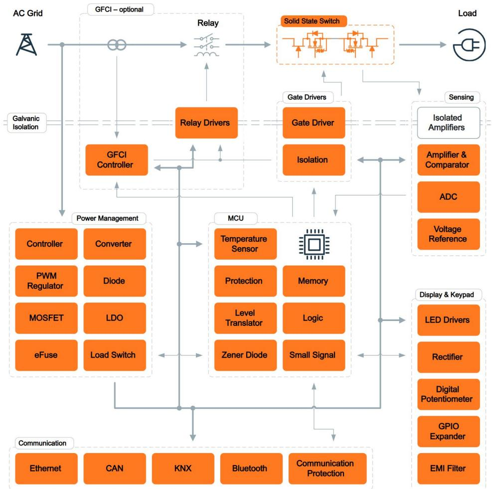

flowchart

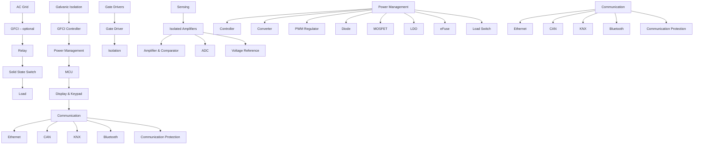
```mermaid
graph TD
    A["AC Grid"] --> B["GFCI – optional"]
    B --> C["Relay"]
    C --> D["Solid State Switch"]
    D --> E["Load"]
    F["Galvanic Isolation"] --> G["GFCI Controller"]
    G --> H["Power Management"]
    H --> I["MCU"]
    I --> J["Display & Keypad"]
    J --> K["Communication"]
    K --> L["Ethernet"]
    K --> M["CAN"]
    K --> N["KNX"]
    K --> O["Bluetooth"]
    K --> P["Communication Protection"]
    Q["Gate Drivers"] --> R["Gate Driver"]
    R --> S["Isolation"]
    T["Sensing"] --> U["Isolated Amplifiers"]
    U --> V["Amplifier & Comparator"]
    U --> W["ADC"]
    U --> X["Voltage Reference"]
    Y["Power Management"] --> Z["Controller"]
    Y --> AA["Converter"]
    Y --> AB["PWM Regulator"]
    Y --> AC["Diode"]
    Y --> AD["MOSFET"]
    Y --> AE["LDO"]
    Y --> AF["eFuse"]
    Y --> AG["Load Switch"]
    AH["Communication"] --> AI["Ethernet"]
    AH --> AJ["CAN"]
    AH --> AK["KNX"]
    AH --> AL["Bluetooth"]
    AH --> AM["Communication Protection"]
```

Source: Onsemi   
BofA GLOBAL RESEARCH

We assume SSCB content moves from essentially \$0/MW in the low voltage era to \$7k/MW in the high voltage era. The content uplift comes because the breaker itself becomes a semiconductor system with high voltage power switches, gate drivers, current/voltage sensing, isolation, MCUs/control, thermal monitoring, and communications replacing a mostly mechanical protection element. Silicon MOSFETs are cost-effective below 600V, but once voltage exceeds 600V, silicon resistance becomes too high. In the 600V–2000V range, SiC FETs offer the lowest resistance per unit area, while SiC devices can tolerate high instantaneous temperature rise and handle up to 4x the energy per unit area of silicon. This makes SiC the best device type in HVDC SSCBs, especially 750V/1200V/1700V-class devices. Both Infineon and ON look well positioned for SSCBs given their SiC JFET (junction field effect transistor) to MOSFET portfolio which unlocks the energy savings and supports the reliability and scalability requirements needed. We think SSCBs could see adoption into CY27, but the opportunity mainly inflects when 1MW racks become more commonplace leading to a \~\$400mn opportunity for analog semi vendors by CY30 when compared to an overall \$800mn SSCB module market (total not just semis) per Infineon also by decade-end.

# AI Power Analog Semi Model

# Exhibit 45: Inside a \$7.9bn TAM today growing to \$26.8bn, TXN should enjoy the largest revenue position but we note ADI and Infineon also have large scale due to portfolio breadth

Total company revenue summary across data center and power infra

<table><tr><td>Company Revenue Summary ($; mn)</td><td>CY22</td><td>CY23</td><td>CY24</td><td>CY25</td><td>CY26</td><td>CY27</td><td>CY28</td><td>CY29</td><td>CY30</td></tr><tr><td>Total</td><td>$1,147</td><td>$2,395</td><td>$4,829</td><td>$7,864</td><td>$12,302</td><td>$21,837</td><td>$23,094</td><td>$25,847</td><td>$26,793</td></tr><tr><td>TXN</td><td>$236</td><td>$580</td><td>$959</td><td>$1,547</td><td>$2,416</td><td>$4,368</td><td>$4,549</td><td>$5,277</td><td>$5,658</td></tr><tr><td>ADI</td><td>$138</td><td>$300</td><td>$654</td><td>$1,045</td><td>$1,794</td><td>$3,173</td><td>$3,424</td><td>$4,106</td><td>$4,439</td></tr><tr><td>Infineon</td><td>$85</td><td>$155</td><td>$307</td><td>$904</td><td>$1,647</td><td>$3,415</td><td>$3,949</td><td>$4,490</td><td>$4,630</td></tr><tr><td>MPWR</td><td>$231</td><td>$404</td><td>$726</td><td>$710</td><td>$1,212</td><td>$2,110</td><td>$1,915</td><td>$2,179</td><td>$2,176</td></tr><tr><td>ON</td><td>$39</td><td>$80</td><td>$178</td><td>$295</td><td>$566</td><td>$1,577</td><td>$1,979</td><td>$2,219</td><td>$2,298</td></tr><tr><td>STMicro</td><td>$60</td><td>$124</td><td>$233</td><td>$379</td><td>$597</td><td>$1,090</td><td>$1,301</td><td>$1,452</td><td>$1,504</td></tr><tr><td>Renesas</td><td>$72</td><td>$149</td><td>$445</td><td>$767</td><td>$1,181</td><td>$1,986</td><td>$1,931</td><td>$2,194</td><td>$2,306</td></tr><tr><td>MCHP</td><td>$43</td><td>$97</td><td>$155</td><td>$249</td><td>$393</td><td>$716</td><td>$764</td><td>$865</td><td>$901</td></tr><tr><td>Other</td><td>$242</td><td>$504</td><td>$1,172</td><td>$1,969</td><td>$2,496</td><td>$3,402</td><td>$3,282</td><td>$3,065</td><td>$2,880</td></tr><tr><td>Low Power/Voltage</td><td>$1,147</td><td>$2,394</td><td>$4,829</td><td>$7,864</td><td>$10,862</td><td>$10,790</td><td>$8,530</td><td>$9,527</td><td>$10,739</td></tr><tr><td>TXN</td><td>$236</td><td>$580</td><td>$959</td><td>$1,547</td><td>$2,172</td><td>$2,226</td><td>$1,799</td><td>$2,055</td><td>$2,369</td></tr><tr><td>ADI</td><td>$138</td><td>$300</td><td>$654</td><td>$1,045</td><td>$1,617</td><td>$1,718</td><td>$1,449</td><td>$1,713</td><td>$1,983</td></tr><tr><td>Infineon</td><td>$85</td><td>$155</td><td>$307</td><td>$904</td><td>$1,413</td><td>$1,498</td><td>$1,246</td><td>$1,456</td><td>$1,665</td></tr><tr><td>MPWR</td><td>$231</td><td>$404</td><td>$726</td><td>$710</td><td>$1,090</td><td>$1,131</td><td>$805</td><td>$899</td><td>$959</td></tr><tr><td>ON</td><td>$39</td><td>$80</td><td>$178</td><td>$295</td><td>$475</td><td>$568</td><td>$492</td><td>$593</td><td>$716</td></tr><tr><td>STMicro</td><td>$60</td><td>$124</td><td>$233</td><td>$379</td><td>$525</td><td>$527</td><td>$425</td><td>$478</td><td>$543</td></tr><tr><td>Renesas</td><td>$72</td><td>$149</td><td>$445</td><td>$767</td><td>$1,058</td><td>$1,048</td><td>$784</td><td>$875</td><td>$986</td></tr><tr><td>MCHP</td><td>$43</td><td>$97</td><td>$155</td><td>$249</td><td>$344</td><td>$342</td><td>$271</td><td>$302</td><td>$341</td></tr><tr><td>Other</td><td>$242</td><td>$504</td><td>$1,172</td><td>$1,969</td><td>$2,169</td><td>$1,733</td><td>$1,259</td><td>$1,156</td><td>$1,176</td></tr><tr><td>High Power/Voltage</td><td>$0</td><td>$0</td><td>$0</td><td>$0</td><td>$1,439</td><td>$11,047</td><td>$14,564</td><td>$16,320</td><td>$16,054</td></tr><tr><td>TXN</td><td>$0</td><td>$0</td><td>$0</td><td>$0</td><td>$244</td><td>$2,142</td><td>$2,750</td><td>$3,222</td><td>$3,289</td></tr><tr><td>ADI</td><td>$0</td><td>$0</td><td>$0</td><td>$0</td><td>$177</td><td>$1,455</td><td>$1,976</td><td>$2,393</td><td>$2,455</td></tr><tr><td>Infineon</td><td>$0</td><td>$0</td><td>$0</td><td>$0</td><td>$234</td><td>$1,917</td><td>$2,702</td><td>$3,035</td><td>$2,964</td></tr><tr><td>MPWR</td><td>$0</td><td>$0</td><td>$0</td><td>$0</td><td>$122</td><td>$979</td><td>$1,109</td><td>$1,280</td><td>$1,217</td></tr><tr><td>ON</td><td>$0</td><td>$0</td><td>$0</td><td>$0</td><td>$91</td><td>$1,009</td><td>$1,486</td><td>$1,626</td><td>$1,583</td></tr><tr><td>STMicro</td><td>$0</td><td>$0</td><td>$0</td><td>$0</td><td>$72</td><td>$563</td><td>$876</td><td>$974</td><td>$961</td></tr><tr><td>Renesas</td><td>$0</td><td>$0</td><td>$0</td><td>$0</td><td>$123</td><td>$939</td><td>$1,147</td><td>$1,319</td><td>$1,321</td></tr><tr><td>MCHP</td><td>$0</td><td>$0</td><td>$0</td><td>$0</td><td>$49</td><td>$374</td><td>$493</td><td>$563</td><td>$561</td></tr><tr><td>Other</td><td>$0</td><td>$0</td><td>$0</td><td>$0</td><td>$326</td><td>$1,669</td><td>$2,023</td><td>$1,909</td><td>$1,703</td></tr></table>

<table><tr><td>Company Revenue Summary YoY Growth</td><td>CY22</td><td>CY23</td><td>CY24</td><td>CY25</td><td>CY26</td><td>CY27</td><td>CY28</td><td>CY29</td><td>CY30</td></tr><tr><td>Total</td><td>-</td><td>108.8%</td><td>101.7%</td><td>62.9%</td><td>56.4%</td><td>77.5%</td><td>5.8%</td><td>11.9%</td><td>3.7%</td></tr><tr><td>TXN</td><td>-</td><td>145.8%</td><td>65.2%</td><td>61.3%</td><td>56.2%</td><td>80.8%</td><td>4.2%</td><td>16.0%</td><td>7.2%</td></tr><tr><td>ADI</td><td>-</td><td>117.4%</td><td>118.0%</td><td>59.7%</td><td>71.7%</td><td>76.9%</td><td>8.2%</td><td>19.9%</td><td>8.1%</td></tr><tr><td>Infineon</td><td>-</td><td>82.4%</td><td>97.7%</td><td>194.5%</td><td>82.3%</td><td>107.3%</td><td>15.7%</td><td>13.7%</td><td>3.1%</td></tr><tr><td>MPWR</td><td>-</td><td>75.2%</td><td>79.5%</td><td>-2.2%</td><td>70.7%</td><td>74.0%</td><td>-9.2%</td><td>13.8%</td><td>-0.1%</td></tr><tr><td>ON</td><td>-</td><td>103.3%</td><td>123.7%</td><td>65.7%</td><td>91.7%</td><td>178.7%</td><td>25.6%</td><td>12.1%</td><td>3.6%</td></tr><tr><td>STMicro</td><td>-</td><td>106.0%</td><td>87.5%</td><td>62.2%</td><td>57.7%</td><td>82.6%</td><td>19.6%</td><td>11.6%</td><td>3.6%</td></tr><tr><td>Renesas</td><td>-</td><td>107.0%</td><td>198.5%</td><td>72.5%</td><td>54.0%</td><td>68.2%</td><td>-2.5%</td><td>13.6%</td><td>5.1%</td></tr><tr><td>MCHP</td><td>-</td><td>124.6%</td><td>59.5%</td><td>60.5%</td><td>57.6%</td><td>82.3%</td><td>8.2%</td><td>13.1%</td><td>4.1%</td></tr><tr><td>Other</td><td>-</td><td>108.4%</td><td>132.5%</td><td>68.0%</td><td>26.8%</td><td>36.3%</td><td>-3.2%</td><td>-6.6%</td><td>-6.1%</td></tr><tr><td>Low Power/Voltage</td><td>-</td><td>108.7%</td><td>101.7%</td><td>62.9%</td><td>38.1%</td><td>-0.7%</td><td>-20.9%</td><td>11.7%</td><td>12.7%</td></tr><tr><td>TXN</td><td>-</td><td>145.8%</td><td>65.2%</td><td>61.3%</td><td>40.4%</td><td>2.5%</td><td>-19.2%</td><td>14.3%</td><td>15.3%</td></tr><tr><td>ADI</td><td>-</td><td>117.4%</td><td>118.0%</td><td>59.7%</td><td>54.7%</td><td>6.2%</td><td>-15.7%</td><td>18.2%</td><td>15.8%</td></tr><tr><td>Infineon</td><td>-</td><td>82.4%</td><td>97.7%</td><td>194.5%</td><td>56.3%</td><td>6.0%</td><td>-16.8%</td><td>16.8%</td><td>14.4%</td></tr><tr><td>MPWR</td><td>-</td><td>75.2%</td><td>79.5%</td><td>-2.2%</td><td>53.5%</td><td>3.7%</td><td>-28.8%</td><td>11.6%</td><td>6.7%</td></tr><tr><td>ON</td><td>-</td><td>103.3%</td><td>123.7%</td><td>65.7%</td><td>60.7%</td><td>19.8%</td><td>-13.4%</td><td>20.4%</td><td>20.8%</td></tr><tr><td>STMicro</td><td>-</td><td>106.0%</td><td>87.5%</td><td>62.2%</td><td>38.6%</td><td>0.5%</td><td>-19.4%</td><td>12.6%</td><td>13.5%</td></tr><tr><td>Renesas</td><td>-</td><td>107.0%</td><td>198.5%</td><td>72.5%</td><td>38.0%</td><td>-1.0%</td><td>-25.2%</td><td>11.6%</td><td>12.7%</td></tr><tr><td>MCHP</td><td>-</td><td>124.6%</td><td>59.5%</td><td>60.5%</td><td>38.1%</td><td>-0.6%</td><td>-20.8%</td><td>11.7%</td><td>12.7%</td></tr><tr><td>Other</td><td>-</td><td>108.4%</td><td>132.5%</td><td>68.0%</td><td>10.2%</td><td>-20.1%</td><td>-27.3%</td><td>-8.2%</td><td>1.7%</td></tr><tr><td>High Power/Voltage</td><td>-</td><td>-</td><td>-</td><td>-</td><td>-</td><td>667.6%</td><td>31.8%</td><td>12.1%</td><td>-1.6%</td></tr><tr><td>TXN</td><td>-</td><td>-</td><td>-</td><td>-</td><td>-</td><td>778.3%</td><td>28.5%</td><td>17.1%</td><td>2.1%</td></tr><tr><td>ADI</td><td>-</td><td>-</td><td>-</td><td>-</td><td>-</td><td>722.0%</td><td>36.4%</td><td>21.0%</td><td>2.6%</td></tr><tr><td>Infineon</td><td>-</td><td>-</td><td>-</td><td>-</td><td>-</td><td>717.8%</td><td>41.0%</td><td>12.3%</td><td>-2.3%</td></tr><tr><td>MPWR</td><td>-</td><td>-</td><td>-</td><td>-</td><td>-</td><td>700.1%</td><td>13.3%</td><td>15.4%</td><td>-4.9%</td></tr><tr><td>ON</td><td>-</td><td>-</td><td>-</td><td>-</td><td>-</td><td>1003.8%</td><td>47.6%</td><td>9.4%</td><td>-2.7%</td></tr><tr><td>STMicro</td><td>-</td><td>-</td><td>-</td><td>-</td><td>-</td><td>678.8%</td><td>56.2%</td><td>11.2%</td><td>-1.3%</td></tr><tr><td>Renesas</td><td>-</td><td>-</td><td>-</td><td>-</td><td>-</td><td>664.2%</td><td>22.8%</td><td>14.9%</td><td>0.1%</td></tr><tr><td>MCHP</td><td>-</td><td>-</td><td>-</td><td>-</td><td>-</td><td>668.5%</td><td>34.9%</td><td>13.9%</td><td>-0.5%</td></tr><tr><td>Other</td><td>-</td><td>-</td><td>-</td><td>-</td><td>-</td><td>411.5%</td><td>21.8%</td><td>-5.6%</td><td>-10.8%</td></tr></table>

Source: BofA Global Research estimates, Nvidia, AMD, Intel, Marvell, Broadcom, Gartner, Omdia, company reports

BofA GLOBAL RESEARCH

# Exhibit 46: Infineon should gain the most share, up to 17% in CY30 (from 12% in CY25), but ON also sees impressive gains from 4% in CY25 to 9% CY30 along with ADI from 13% CY25 to 17% CY30. Discrete vendors generally gaining more share due to introduction of novel materials like SiC and GaN unlocking new markets to participate in

Market share across data center and power infra

Company Share 

<table><tr><td>(%)</td><td>CY22</td><td>CY23</td><td>CY24</td><td>CY25</td><td>CY26</td><td>CY27</td><td>CY28</td><td>CY29</td><td>CY30</td></tr><tr><td>Total</td><td>100.0%</td><td>100.0%</td><td>100.0%</td><td>100.0%</td><td>100.0%</td><td>100.0%</td><td>100.0%</td><td>100.0%</td><td>100.0%</td></tr><tr><td>TXN</td><td>20.6%</td><td>24.2%</td><td>19.9%</td><td>19.7%</td><td>19.6%</td><td>20.0%</td><td>19.7%</td><td>20.4%</td><td>21.1%</td></tr><tr><td>ADI</td><td>12.0%</td><td>12.5%</td><td>13.5%</td><td>13.3%</td><td>14.6%</td><td>14.5%</td><td>14.8%</td><td>15.9%</td><td>16.6%</td></tr><tr><td>Infineon</td><td>7.4%</td><td>6.5%</td><td>6.4%</td><td>11.5%</td><td>13.4%</td><td>15.6%</td><td>17.1%</td><td>17.3%</td><td>17.3%</td></tr><tr><td>MPWR</td><td>20.1%</td><td>16.9%</td><td>15.0%</td><td>9.0%</td><td>9.9%</td><td>9.7%</td><td>8.3%</td><td>8.4%</td><td>8.1%</td></tr><tr><td>ON</td><td>3.4%</td><td>3.3%</td><td>3.7%</td><td>3.8%</td><td>4.6%</td><td>7.2%</td><td>8.6%</td><td>8.6%</td><td>8.6%</td></tr><tr><td>STMicro</td><td>5.3%</td><td>5.2%</td><td>4.8%</td><td>4.8%</td><td>4.9%</td><td>5.0%</td><td>5.6%</td><td>5.6%</td><td>5.6%</td></tr><tr><td>Renesas</td><td>6.3%</td><td>6.2%</td><td>9.2%</td><td>9.8%</td><td>9.6%</td><td>9.1%</td><td>8.4%</td><td>8.5%</td><td>8.6%</td></tr><tr><td>MCHP</td><td>3.8%</td><td>4.1%</td><td>3.2%</td><td>3.2%</td><td>3.2%</td><td>3.3%</td><td>3.3%</td><td>3.4%</td><td>3.4%</td></tr><tr><td>Other</td><td>21.1%</td><td>21.1%</td><td>24.3%</td><td>25.0%</td><td>20.3%</td><td>15.6%</td><td>14.2%</td><td>11.9%</td><td>10.8%</td></tr><tr><td>Low Power/Voltage</td><td>100.0%</td><td>100.0%</td><td>100.0%</td><td>100.0%</td><td>100.0%</td><td>100.0%</td><td>100.0%</td><td>100.0%</td><td>100.0%</td></tr><tr><td>TXN</td><td>20.6%</td><td>24.2%</td><td>19.9%</td><td>19.7%</td><td>20.0%</td><td>20.6%</td><td>21.1%</td><td>21.6%</td><td>22.1%</td></tr><tr><td>ADI</td><td>12.0%</td><td>12.5%</td><td>13.5%</td><td>13.3%</td><td>14.9%</td><td>15.9%</td><td>17.0%</td><td>18.0%</td><td>18.5%</td></tr><tr><td>Infineon</td><td>7.4%</td><td>6.5%</td><td>6.4%</td><td>11.5%</td><td>13.0%</td><td>13.9%</td><td>14.6%</td><td>15.3%</td><td>15.5%</td></tr><tr><td>MPWR</td><td>20.1%</td><td>16.9%</td><td>15.0%</td><td>9.0%</td><td>10.0%</td><td>10.5%</td><td>9.4%</td><td>9.4%</td><td>8.9%</td></tr><tr><td>ON</td><td>3.4%</td><td>3.3%</td><td>3.7%</td><td>3.8%</td><td>4.4%</td><td>5.3%</td><td>5.8%</td><td>6.2%</td><td>6.7%</td></tr><tr><td>STMicro</td><td>5.3%</td><td>5.2%</td><td>4.8%</td><td>4.8%</td><td>4.8%</td><td>4.9%</td><td>5.0%</td><td>5.0%</td><td>5.1%</td></tr><tr><td>Renesas</td><td>6.3%</td><td>6.2%</td><td>9.2%</td><td>9.8%</td><td>9.7%</td><td>9.7%</td><td>9.2%</td><td>9.2%</td><td>9.2%</td></tr><tr><td>MCHP</td><td>3.8%</td><td>4.1%</td><td>3.2%</td><td>3.2%</td><td>3.2%</td><td>3.2%</td><td>3.2%</td><td>3.2%</td><td>3.2%</td></tr><tr><td>Other</td><td>21.1%</td><td>21.1%</td><td>24.3%</td><td>25.0%</td><td>20.0%</td><td>16.1%</td><td>14.8%</td><td>12.1%</td><td>11.0%</td></tr><tr><td>High Power/Voltage</td><td>0.0%</td><td>0.0%</td><td>0.0%</td><td>0.0%</td><td>100.0%</td><td>100.0%</td><td>100.0%</td><td>100.0%</td><td>100.0%</td></tr><tr><td>TXN</td><td>0.0%</td><td>0.0%</td><td>0.0%</td><td>0.0%</td><td>16.9%</td><td>19.4%</td><td>18.8%</td><td>19.7%</td><td>20.4%</td></tr><tr><td>ADI</td><td>0.0%</td><td>0.0%</td><td>0.0%</td><td>0.0%</td><td>12.3%</td><td>13.2%</td><td>13.6%</td><td>14.7%</td><td>15.3%</td></tr><tr><td>Infineon</td><td>0.0%</td><td>0.0%</td><td>0.0%</td><td>0.0%</td><td>16.3%</td><td>17.4%</td><td>18.5%</td><td>18.5%</td><td>18.4%</td></tr><tr><td>MPWR</td><td>0.0%</td><td>0.0%</td><td>0.0%</td><td>0.0%</td><td>8.5%</td><td>8.9%</td><td>7.6%</td><td>7.8%</td><td>7.6%</td></tr><tr><td>ON</td><td>0.0%</td><td>0.0%</td><td>0.0%</td><td>0.0%</td><td>6.4%</td><td>9.1%</td><td>10.2%</td><td>9.9%</td><td>9.8%</td></tr><tr><td>STMicro</td><td>0.0%</td><td>0.0%</td><td>0.0%</td><td>0.0%</td><td>5.0%</td><td>5.1%</td><td>6.0%</td><td>6.0%</td><td>6.0%</td></tr><tr><td>Renesas</td><td>0.0%</td><td>0.0%</td><td>0.0%</td><td>0.0%</td><td>8.5%</td><td>8.5%</td><td>7.9%</td><td>8.1%</td><td>8.2%</td></tr><tr><td>MCHP</td><td>0.0%</td><td>0.0%</td><td>0.0%</td><td>0.0%</td><td>3.4%</td><td>3.4%</td><td>3.4%</td><td>3.5%</td><td>3.5%</td></tr><tr><td>Other</td><td>0.0%</td><td>0.0%</td><td>0.0%</td><td>0.0%</td><td>22.7%</td><td>15.1%</td><td>13.9%</td><td>11.7%</td><td>10.6%</td></tr></table>

Source: BofA Global Research estimates, Nvidia, AMD, Intel, Marvell, Broadcom, Gartner, Omdia, company reports   
BofA GLOBAL RESEARCH

Exhibit 47: Analog boasts the biggest content pool, but SiC and GaN transform from niche device applications in the data center to major content winners by the end of the decade

Device TAM (\$ mn) across both data center and power infrastructure

<table><tr><td>Device TAM</td><td>CY22</td><td>CY23</td><td>CY24</td><td>CY25</td><td>CY26</td><td>CY27</td><td>CY28</td><td>CY29</td><td>CY30</td></tr><tr><td>Overall</td><td>$1,147</td><td>$2,393</td><td>$4,829</td><td>$7,864</td><td>$12,301</td><td>$21,838</td><td>$23,095</td><td>$25,850</td><td>$26,795</td></tr><tr><td>Silicon</td><td>$262</td><td>$546</td><td>$1,102</td><td>$1,791</td><td>$2,692</td><td>$4,128</td><td>$4,158</td><td>$4,588</td><td>$4,780</td></tr><tr><td>SiC</td><td>$31</td><td>$59</td><td>$114</td><td>$183</td><td>$412</td><td>$1,493</td><td>$2,175</td><td>$2,236</td><td>$2,098</td></tr><tr><td>GaN</td><td>$18</td><td>$37</td><td>$75</td><td>$118</td><td>$303</td><td>$1,233</td><td>$1,443</td><td>$1,618</td><td>$1,612</td></tr><tr><td>Analog</td><td>$751</td><td>$1,574</td><td>$3,184</td><td>$5,198</td><td>$7,974</td><td>$13,207</td><td>$13,267</td><td>$15,097</td><td>$15,919</td></tr><tr><td>MCU</td><td>$50</td><td>$102</td><td>$205</td><td>$332</td><td>$541</td><td>$1,092</td><td>$1,290</td><td>$1,466</td><td>$1,516</td></tr><tr><td>Sensors</td><td>$36</td><td>$75</td><td>$151</td><td>$242</td><td>$380</td><td>$685</td><td>$806</td><td>$891</td><td>$912</td></tr><tr><td>Low Power</td><td>$1,147</td><td>$2,393</td><td>$4,829</td><td>$7,864</td><td>$10,862</td><td>$10,789</td><td>$8,529</td><td>$9,526</td><td>$10,738</td></tr><tr><td>Silicon</td><td>$262</td><td>$546</td><td>$1,102</td><td>$1,791</td><td>$2,474</td><td>$2,460</td><td>$1,946</td><td>$2,173</td><td>$2,450</td></tr><tr><td>SiC</td><td>$31</td><td>$59</td><td>$114</td><td>$183</td><td>$261</td><td>$288</td><td>$237</td><td>$268</td><td>$305</td></tr><tr><td>GaN</td><td>$18</td><td>$37</td><td>$75</td><td>$118</td><td>$162</td><td>$161</td><td>$128</td><td>$143</td><td>$161</td></tr><tr><td>Analog</td><td>$751</td><td>$1,574</td><td>$3,184</td><td>$5,198</td><td>$7,169</td><td>$7,079</td><td>$5,581</td><td>$6,228</td><td>$7,016</td></tr><tr><td>MCU</td><td>$50</td><td>$102</td><td>$205</td><td>$332</td><td>$461</td><td>$466</td><td>$371</td><td>$416</td><td>$470</td></tr><tr><td>Sensors</td><td>$36</td><td>$75</td><td>$151</td><td>$242</td><td>$335</td><td>$336</td><td>$267</td><td>$299</td><td>$337</td></tr><tr><td>High Power</td><td>$0</td><td>$0</td><td>$0</td><td>$0</td><td>$1,439</td><td>$11,048</td><td>$14,566</td><td>$16,323</td><td>$16,057</td></tr><tr><td>Silicon</td><td>$0</td><td>$0</td><td>$0</td><td>$0</td><td>$218</td><td>$1,669</td><td>$2,213</td><td>$2,415</td><td>$2,330</td></tr><tr><td>SiC</td><td>$0</td><td>$0</td><td>$0</td><td>$0</td><td>$150</td><td>$1,205</td><td>$1,938</td><td>$1,967</td><td>$1,793</td></tr><tr><td>GaN</td><td>$0</td><td>$0</td><td>$0</td><td>$0</td><td>$141</td><td>$1,072</td><td>$1,315</td><td>$1,474</td><td>$1,451</td></tr><tr><td>Analog</td><td>$0</td><td>$0</td><td>$0</td><td>$0</td><td>$805</td><td>$6,127</td><td>$7,686</td><td>$8,870</td><td>$8,903</td></tr><tr><td>MCU</td><td>$0</td><td>$0</td><td>$0</td><td>$0</td><td>$80</td><td>$625</td><td>$919</td><td>$1,050</td><td>$1,047</td></tr><tr><td>Sensors</td><td>$0</td><td>$0</td><td>$0</td><td>$0</td><td>$45</td><td>$350</td><td>$539</td><td>$593</td><td>$575</td></tr></table>

<table><tr><td>Device TAM YoY Growth</td><td>CY22</td><td>CY23</td><td>CY24</td><td>CY25</td><td>CY26</td><td>CY27</td><td>CY28</td><td>CY29</td><td>CY30</td></tr><tr><td>Overall</td><td>-</td><td>108.7%</td><td>101.7%</td><td>62.9%</td><td>56.4%</td><td>77.5%</td><td>5.8%</td><td>11.9%</td><td>3.7%</td></tr><tr><td>Silicon</td><td>-</td><td>108.7%</td><td>101.7%</td><td>62.6%</td><td>50.3%</td><td>53.3%</td><td>0.7%</td><td>10.3%</td><td>4.2%</td></tr><tr><td>SiC</td><td>-</td><td>93.6%</td><td>92.7%</td><td>60.8%</td><td>125.1%</td><td>262.6%</td><td>45.7%</td><td>2.8%</td><td>-6.1%</td></tr><tr><td>GaN</td><td>-</td><td>109.7%</td><td>101.6%</td><td>57.9%</td><td>157.2%</td><td>306.9%</td><td>17.1%</td><td>12.1%</td><td>-0.3%</td></tr><tr><td>Analog</td><td>-</td><td>109.6%</td><td>102.2%</td><td>63.3%</td><td>53.4%</td><td>65.6%</td><td>0.5%</td><td>13.8%</td><td>5.4%</td></tr><tr><td>MCU</td><td>-</td><td>106.0%</td><td>100.2%</td><td>62.2%</td><td>63.1%</td><td>101.7%</td><td>18.2%</td><td>13.6%</td><td>3.5%</td></tr><tr><td>Sensors</td><td>-</td><td>107.9%</td><td>101.0%</td><td>60.8%</td><td>56.6%</td><td>80.5%</td><td>17.6%</td><td>10.6%</td><td>2.3%</td></tr><tr><td>Low Power</td><td>-</td><td>108.7%</td><td>101.7%</td><td>62.9%</td><td>38.1%</td><td>-0.7%</td><td>-20.9%</td><td>11.7%</td><td>12.7%</td></tr><tr><td>Silicon</td><td>-</td><td>108.7%</td><td>101.7%</td><td>62.6%</td><td>38.1%</td><td>-0.6%</td><td>-20.9%</td><td>11.7%</td><td>12.7%</td></tr><tr><td>SiC</td><td>-</td><td>93.6%</td><td>92.7%</td><td>60.8%</td><td>42.9%</td><td>10.3%</td><td>-17.9%</td><td>13.4%</td><td>13.8%</td></tr><tr><td>GaN</td><td>-</td><td>109.7%</td><td>101.6%</td><td>57.9%</td><td>37.5%</td><td>-0.6%</td><td>-20.3%</td><td>11.7%</td><td>12.6%</td></tr><tr><td>Analog</td><td>-</td><td>109.6%</td><td>102.2%</td><td>63.3%</td><td>37.9%</td><td>-1.3%</td><td>-21.2%</td><td>11.6%</td><td>12.7%</td></tr><tr><td>MCU</td><td>-</td><td>106.0%</td><td>100.2%</td><td>62.2%</td><td>38.9%</td><td>1.2%</td><td>-20.4%</td><td>12.0%</td><td>12.9%</td></tr><tr><td>Sensors</td><td>-</td><td>107.9%</td><td>101.0%</td><td>60.8%</td><td>38.2%</td><td>0.2%</td><td>-20.5%</td><td>11.8%</td><td>12.8%</td></tr><tr><td>High Power</td><td>-</td><td>-</td><td>-</td><td>-</td><td>-</td><td>667.6%</td><td>31.8%</td><td>12.1%</td><td>-1.6%</td></tr><tr><td>Silicon</td><td>-</td><td>-</td><td>-</td><td>-</td><td>-</td><td>664.6%</td><td>32.6%</td><td>9.1%</td><td>-3.5%</td></tr><tr><td>SiC</td><td>-</td><td>-</td><td>-</td><td>-</td><td>-</td><td>701.0%</td><td>60.9%</td><td>1.5%</td><td>-8.9%</td></tr><tr><td>GaN</td><td>-</td><td>-</td><td>-</td><td>-</td><td>-</td><td>660.1%</td><td>22.7%</td><td>12.1%</td><td>-1.6%</td></tr><tr><td>Analog</td><td>-</td><td>-</td><td>-</td><td>-</td><td>-</td><td>661.5%</td><td>25.4%</td><td>15.4%</td><td>0.4%</td></tr><tr><td>MCU</td><td>-</td><td>-</td><td>-</td><td>-</td><td>-</td><td>677.8%</td><td>46.9%</td><td>14.3%</td><td>-0.3%</td></tr><tr><td>Sensors</td><td>-</td><td>-</td><td>-</td><td>-</td><td>-</td><td>684.1%</td><td>54.2%</td><td>9.9%</td><td>-3.0%</td></tr></table>

Source: BofA Global Research estimates, Nvidia, AMD, Intel, Marvell, Broadcom, Gartner, Omdia, company reports   
BofA GLOBAL RESEARCH

Exhibit 48: SiC and GaN share begin to inflect when high voltage racks proliferate beginning CY27 and expanding into CY30

Device TAM share aggregated for both data center and power infra

<table><tr><td>Device TAM Share (%)</td><td>CY22</td><td>CY23</td><td>CY24</td><td>CY25</td><td>CY26</td><td>CY27</td><td>CY28</td><td>CY29</td><td>CY30</td></tr><tr><td>Overall</td><td>100.0%</td><td>100.0%</td><td>100.0%</td><td>100.0%</td><td>100.0%</td><td>100.0%</td><td>100.0%</td><td>100.0%</td><td>100.0%</td></tr><tr><td>Silicon</td><td>22.8%</td><td>22.8%</td><td>22.8%</td><td>22.8%</td><td>21.9%</td><td>18.9%</td><td>18.0%</td><td>17.7%</td><td>17.8%</td></tr><tr><td>SiC</td><td>2.7%</td><td>2.5%</td><td>2.4%</td><td>2.3%</td><td>3.3%</td><td>6.8%</td><td>9.4%</td><td>8.6%</td><td>7.8%</td></tr><tr><td>GaN</td><td>1.5%</td><td>1.5%</td><td>1.5%</td><td>1.5%</td><td>2.5%</td><td>5.6%</td><td>6.2%</td><td>6.2%</td><td>6.0%</td></tr><tr><td>Analog</td><td>65.5%</td><td>65.7%</td><td>65.9%</td><td>66.1%</td><td>64.8%</td><td>60.5%</td><td>57.3%</td><td>58.3%</td><td>59.3%</td></tr><tr><td>MCU</td><td>4.3%</td><td>4.3%</td><td>4.2%</td><td>4.2%</td><td>4.4%</td><td>5.0%</td><td>5.6%</td><td>5.7%</td><td>5.6%</td></tr><tr><td>Sensors</td><td>3.1%</td><td>3.1%</td><td>3.1%</td><td>3.1%</td><td>3.1%</td><td>3.1%</td><td>3.5%</td><td>3.4%</td><td>3.4%</td></tr><tr><td>Low Power</td><td>100.0%</td><td>100.0%</td><td>100.0%</td><td>100.0%</td><td>88.3%</td><td>49.4%</td><td>36.9%</td><td>36.9%</td><td>40.1%</td></tr><tr><td>Silicon</td><td>22.8%</td><td>22.8%</td><td>22.8%</td><td>22.8%</td><td>20.1%</td><td>11.3%</td><td>8.4%</td><td>8.4%</td><td>9.1%</td></tr><tr><td>SiC</td><td>2.7%</td><td>2.5%</td><td>2.4%</td><td>2.3%</td><td>2.1%</td><td>1.3%</td><td>1.0%</td><td>1.0%</td><td>1.1%</td></tr><tr><td>GaN</td><td>1.5%</td><td>1.5%</td><td>1.5%</td><td>1.5%</td><td>1.3%</td><td>0.7%</td><td>0.6%</td><td>0.6%</td><td>0.6%</td></tr><tr><td>Analog</td><td>65.5%</td><td>65.7%</td><td>65.9%</td><td>66.1%</td><td>58.3%</td><td>32.4%</td><td>24.1%</td><td>24.0%</td><td>26.1%</td></tr><tr><td>MCU</td><td>4.3%</td><td>4.3%</td><td>4.2%</td><td>4.2%</td><td>3.7%</td><td>2.1%</td><td>1.6%</td><td>1.6%</td><td>1.8%</td></tr><tr><td>Sensors</td><td>3.1%</td><td>3.1%</td><td>3.1%</td><td>3.1%</td><td>2.7%</td><td>1.5%</td><td>1.2%</td><td>1.2%</td><td>1.3%</td></tr><tr><td>High Power</td><td>0.0%</td><td>0.0%</td><td>0.0%</td><td>0.0%</td><td>11.7%</td><td>50.6%</td><td>63.1%</td><td>63.2%</td><td>59.9%</td></tr><tr><td>Silicon</td><td>0.0%</td><td>0.0%</td><td>0.0%</td><td>0.0%</td><td>1.8%</td><td>7.6%</td><td>9.6%</td><td>9.3%</td><td>8.7%</td></tr><tr><td>SiC</td><td>0.0%</td><td>0.0%</td><td>0.0%</td><td>0.0%</td><td>1.2%</td><td>5.5%</td><td>8.4%</td><td>7.6%</td><td>6.7%</td></tr><tr><td>GaN</td><td>0.0%</td><td>0.0%</td><td>0.0%</td><td>0.0%</td><td>1.1%</td><td>4.9%</td><td>5.7%</td><td>5.7%</td><td>5.4%</td></tr><tr><td>Analog</td><td>0.0%</td><td>0.0%</td><td>0.0%</td><td>0.0%</td><td>6.5%</td><td>28.1%</td><td>33.2%</td><td>34.3%</td><td>33.2%</td></tr><tr><td>MCU</td><td>0.0%</td><td>0.0%</td><td>0.0%</td><td>0.0%</td><td>0.7%</td><td>2.9%</td><td>4.0%</td><td>4.1%</td><td>3.9%</td></tr><tr><td>Sensors</td><td>0.0%</td><td>0.0%</td><td>0.0%</td><td>0.0%</td><td>0.4%</td><td>1.6%</td><td>2.3%</td><td>2.3%</td><td>2.1%</td></tr></table>

Source: BofA Global Research estimates, Nvidia, AMD, Intel, Marvell, Broadcom, Gartner, Omdia, company reports   
BofA GLOBAL RESEARCH

Exhibit 49: We see a cumulative 233 GWs to be deployed CY25-30 for AI across both Nvidia platforms and other merchant and custom ASIC alternatives

Aggregate GW deployed by accelerator platform CY22-30

<table><tr><td>GW Deployed by Platform</td><td>CY22</td><td>CY23</td><td>CY24</td><td>CY25</td><td>CY26</td><td>CY27</td><td>CY28</td><td>CY29</td><td>CY30</td><td>CY25-30Cumulative</td></tr><tr><td>Aggregate</td><td>3</td><td>5</td><td>10</td><td>17</td><td>25</td><td>37</td><td>53</td><td>58</td><td>60</td><td>233</td></tr><tr><td>NVDA Total</td><td>0</td><td>2</td><td>4</td><td>8</td><td>12</td><td>17</td><td>30</td><td>30</td><td>28</td><td>118</td></tr><tr><td>Rosa Feynman</td><td>-</td><td>-</td><td>-</td><td>-</td><td>-</td><td>-</td><td>1</td><td>4</td><td>7</td><td>12</td></tr><tr><td>Feynman</td><td>-</td><td>-</td><td>-</td><td>-</td><td>-</td><td>-</td><td>1</td><td>4</td><td>7</td><td>12</td></tr><tr><td>Rubin Ultra</td><td>-</td><td>-</td><td>-</td><td>-</td><td>-</td><td>2</td><td>10</td><td>18</td><td>15</td><td>45</td></tr><tr><td>Vera Rubin/Ultra</td><td>-</td><td>-</td><td>-</td><td>-</td><td>1</td><td>6</td><td>18</td><td>4</td><td>-</td><td>28</td></tr><tr><td>Rubin</td><td>-</td><td>-</td><td>-</td><td>-</td><td>1</td><td>8</td><td>1</td><td>-</td><td>-</td><td>10</td></tr><tr><td>GB200/GB300 (per GPU package)</td><td>-</td><td>-</td><td>0</td><td>5</td><td>7</td><td>1</td><td>-</td><td>-</td><td>-</td><td>8</td></tr><tr><td>B100/B200/B300 (HGX)</td><td>-</td><td>-</td><td>0</td><td>2</td><td>3</td><td>0</td><td>-</td><td>-</td><td>-</td><td>3</td></tr><tr><td>H100/H200</td><td>0</td><td>1</td><td>3</td><td>1</td><td>-</td><td>-</td><td>-</td><td>-</td><td>-</td><td>-</td></tr><tr><td>A100</td><td>0</td><td>1</td><td>0</td><td>0</td><td>-</td><td>-</td><td>-</td><td>-</td><td>-</td><td>-</td></tr><tr><td>non-NVDA Total</td><td>2</td><td>4</td><td>6</td><td>9</td><td>13</td><td>20</td><td>23</td><td>28</td><td>32</td><td>115</td></tr><tr><td>AMD</td><td>0</td><td>0</td><td>1</td><td>1</td><td>1</td><td>2</td><td>2</td><td>3</td><td>3</td><td>12</td></tr><tr><td>Intel</td><td>0</td><td>0</td><td>0</td><td>-</td><td>0</td><td>0</td><td>0</td><td>0</td><td>0</td><td>0</td></tr><tr><td>Google TPU</td><td>2</td><td>2</td><td>3</td><td>2</td><td>4</td><td>8</td><td>10</td><td>11</td><td>12</td><td>45</td></tr><tr><td>Broadcom 1</td><td>2</td><td>2</td><td>3</td><td>2</td><td>3</td><td>5</td><td>6</td><td>7</td><td>7</td><td>28</td></tr><tr><td>MediaTek</td><td>-</td><td>-</td><td>-</td><td>-</td><td>0</td><td>3</td><td>4</td><td>5</td><td>5</td><td>17</td></tr><tr><td>AWS Trainium</td><td>0</td><td>1</td><td>1</td><td>2</td><td>3</td><td>5</td><td>6</td><td>8</td><td>10</td><td>32</td></tr><tr><td>Marvell 1 (Trm)</td><td>-</td><td>0</td><td>0</td><td>1</td><td>1</td><td>1</td><td>1</td><td>1</td><td>1</td><td>4</td></tr><tr><td>4Chip (Trm)</td><td>0</td><td>1</td><td>1</td><td>1</td><td>3</td><td>4</td><td>5</td><td>7</td><td>9</td><td>28</td></tr><tr><td>Microsoft (Maia)</td><td>-</td><td>-</td><td>-</td><td>-</td><td>-</td><td>0</td><td>0</td><td>0</td><td>0</td><td>1</td></tr><tr><td>Marvell 2</td><td>-</td><td>-</td><td>-</td><td>-</td><td>-</td><td>0</td><td>0</td><td>0</td><td>0</td><td>1</td></tr><tr><td>Meta (MTIA)</td><td>0</td><td>0</td><td>0</td><td>0</td><td>0</td><td>0</td><td>1</td><td>1</td><td>2</td><td>5</td></tr><tr><td>Broadcom 2</td><td>0</td><td>0</td><td>0</td><td>0</td><td>0</td><td>0</td><td>1</td><td>1</td><td>2</td><td>5</td></tr><tr><td>OpenAI</td><td>-</td><td>-</td><td>-</td><td>-</td><td>0</td><td>1</td><td>1</td><td>2</td><td>2</td><td>7</td></tr><tr><td>Broadcom 3</td><td>-</td><td>-</td><td>-</td><td>-</td><td>0</td><td>1</td><td>1</td><td>2</td><td>2</td><td>7</td></tr><tr><td>Others</td><td>0</td><td>0</td><td>1</td><td>3</td><td>4</td><td>4</td><td>2</td><td>2</td><td>2</td><td>14</td></tr></table>

Source: BofA Global Research estimates, Nvidia, AMD, Intel, Marvell, Broadcom, Gartner, Omdia, company reports   
BofA GLOBAL RESEARCH

Exhibit 50: High power racks commence shipment with Rubin Ultra and Feynman

Accelerator and rack build

<table><tr><td>NVDA Accelerators</td><td>CY22</td><td>CY23</td><td>CY24</td><td>CY25</td><td>CY26</td><td>CY27</td><td>CY28</td><td>CY29</td><td>CY30</td></tr><tr><td>NVDA Units (k, per GPU package)</td><td>502</td><td>1,646</td><td>4,023</td><td>4,461</td><td>6,209</td><td>6,880</td><td>7,085</td><td>8,058</td><td>8,351</td></tr><tr><td>Rosa Feynman</td><td>-</td><td>-</td><td>-</td><td>-</td><td>-</td><td>-</td><td>255</td><td>1,612</td><td>2,505</td></tr><tr><td>Feynman</td><td>-</td><td>-</td><td>-</td><td>-</td><td>-</td><td>-</td><td>255</td><td>1,612</td><td>2,505</td></tr><tr><td>Rubin Ultra</td><td>-</td><td>-</td><td>-</td><td>-</td><td>-</td><td>445</td><td>2,135</td><td>4,029</td><td>3,341</td></tr><tr><td>Vera Rubin/Ultra</td><td>-</td><td>-</td><td>-</td><td>-</td><td>350</td><td>2,438</td><td>4,000</td><td>806</td><td>-</td></tr><tr><td>Rubin</td><td>-</td><td>-</td><td>-</td><td>-</td><td>450</td><td>3,232</td><td>440</td><td>-</td><td></td></tr><tr><td>GB200/GB300 (per GPU package)</td><td>-</td><td>-</td><td>185</td><td>2,565</td><td>3,801</td><td>630</td><td>-</td><td>-</td><td>-</td></tr><tr><td>B100/B200/B300 (HGX)</td><td>-</td><td>-</td><td>145</td><td>1,239</td><td>1,608</td><td>135</td><td>-</td><td>-</td><td>-</td></tr><tr><td>H100/H200</td><td>12</td><td>1,110</td><td>3,495</td><td>655</td><td>-</td><td>-</td><td>-</td><td>-</td><td>-</td></tr><tr><td>A100</td><td>490</td><td>536</td><td>198</td><td>2</td><td>-</td><td>-</td><td>-</td><td>-</td><td>-</td></tr><tr><td colspan="10">NVDA Racks</td></tr><tr><td>NVDA rack equivalent (k)</td><td>16</td><td>51</td><td>120</td><td>73</td><td>86</td><td>92</td><td>50</td><td>39</td><td>32</td></tr><tr><td>Vera Feynman</td><td>0</td><td>0</td><td>0</td><td>0</td><td>0</td><td>0</td><td>0</td><td>3</td><td>4</td></tr><tr><td>Feynman</td><td>0</td><td>0</td><td>0</td><td>0</td><td>0</td><td>0</td><td>0</td><td>3</td><td>4</td></tr><tr><td>Rubin Ultra</td><td>0</td><td>0</td><td>0</td><td>0</td><td>0</td><td>3</td><td>15</td><td>28</td><td>23</td></tr><tr><td>Vera Rubin/Ultra</td><td>0</td><td>0</td><td>0</td><td>0</td><td>5</td><td>34</td><td>28</td><td>6</td><td>0</td></tr><tr><td>Rubin</td><td>0</td><td>0</td><td>0</td><td>0</td><td>6</td><td>45</td><td>6</td><td>0</td><td>0</td></tr><tr><td>GB200/GB300 (per GPU package)</td><td>0</td><td>0</td><td>3</td><td>36</td><td>53</td><td>9</td><td>0</td><td>0</td><td>0</td></tr><tr><td>B100/B200/B300 (HGX)</td><td>0</td><td>0</td><td>2</td><td>17</td><td>22</td><td>2</td><td>0</td><td>0</td><td>0</td></tr><tr><td>H100/H200</td><td>0</td><td>35</td><td>109</td><td>20</td><td>0</td><td>0</td><td>0</td><td>0</td><td>0</td></tr><tr><td>A100</td><td>15</td><td>17</td><td>6</td><td>0</td><td>0</td><td>0</td><td>0</td><td>0</td><td>0</td></tr><tr><td>Non-NVDA Accelerators</td><td>CY22</td><td>CY23</td><td>CY24</td><td>CY25</td><td>CY26</td><td>CY27</td><td>CY28</td><td>CY29</td><td>CY30</td></tr><tr><td>Non-NVDA Units (AMD, INTC, TPU,etc.)</td><td>2,331</td><td>3,655</td><td>5,944</td><td>11,404</td><td>16,301</td><td>19,685</td><td>20,066</td><td>22,996</td><td>25,724</td></tr><tr><td>AMD</td><td>55</td><td>93</td><td>433</td><td>374</td><td>575</td><td>819</td><td>922</td><td>1,192</td><td>1,367</td></tr><tr><td>Intel</td><td>10</td><td>59</td><td>2</td><td>-</td><td>1</td><td>3</td><td>9</td><td>21</td><td>29</td></tr><tr><td>Google TPU</td><td>1,469</td><td>1,767</td><td>2,060</td><td>1,879</td><td>3,128</td><td>6,375</td><td>8,018</td><td>9,138</td><td>9,965</td></tr><tr><td>Broadcom 1</td><td>1,469</td><td>1,767</td><td>2,060</td><td>1,879</td><td>2,763</td><td>4,240</td><td>5,125</td><td>5,443</td><td>5,492</td></tr><tr><td>MediaTek</td><td>-</td><td>-</td><td>-</td><td>-</td><td>365</td><td>2,135</td><td>2,893</td><td>3,695</td><td>4,473</td></tr><tr><td>AWS Trainium</td><td>192</td><td>566</td><td>920</td><td>1,398</td><td>2,107</td><td>2,961</td><td>3,845</td><td>5,130</td><td>6,415</td></tr><tr><td>Marvell 1 (Trm)</td><td></td><td>20</td><td>307</td><td>440</td><td>429</td><td>427</td><td>444</td><td>606</td><td>771</td></tr><tr><td>Alchip (Trm)</td><td>192</td><td>546</td><td>613</td><td>958</td><td>1,678</td><td>2,534</td><td>3,401</td><td>4,525</td><td>5,644</td></tr><tr><td>Microsoft (Maia)</td><td>-</td><td>-</td><td>-</td><td>-</td><td>-</td><td>98</td><td>153</td><td>196</td><td>237</td></tr><tr><td>Marvell 2</td><td>-</td><td>-</td><td>-</td><td>-</td><td>-</td><td>98</td><td>153</td><td>196</td><td>237</td></tr><tr><td>Meta (MTIA)</td><td>41</td><td>109</td><td>234</td><td>233</td><td>126</td><td>330</td><td>902</td><td>1,133</td><td>1,335</td></tr><tr><td>Broadcom 2</td><td>41</td><td>109</td><td>234</td><td>233</td><td>126</td><td>330</td><td>902</td><td>1,133</td><td>1,335</td></tr><tr><td>OpenAI</td><td>-</td><td>-</td><td>-</td><td>-</td><td>200</td><td>746</td><td>1,216</td><td>1,480</td><td>1,699</td></tr><tr><td>Broadcom 3</td><td></td><td></td><td></td><td></td><td>200</td><td>746</td><td>1,216</td><td>1,480</td><td>1,699</td></tr><tr><td>Others</td><td>564</td><td>1,061</td><td>2,295</td><td>7,520</td><td>10,164</td><td>8,354</td><td>5,001</td><td>4,707</td><td>4,676</td></tr><tr><td>non-NVDA Racks</td><td>CY22</td><td>CY23</td><td>CY24</td><td>CY25</td><td>CY26</td><td>CY27</td><td>CY28</td><td>CY29</td><td>CY30</td></tr><tr><td>Non-NVDA Racks (AMD, INTC, TPU,etc.)</td><td>35</td><td>55</td><td>88</td><td>164</td><td>236</td><td>292</td><td>303</td><td>349</td><td>391</td></tr><tr><td>AMD</td><td>1</td><td>1</td><td>6</td><td>5</td><td>8</td><td>11</td><td>13</td><td>17</td><td>19</td></tr><tr><td>Intel</td><td>0</td><td>1</td><td>0</td><td>0</td><td>0</td><td>0</td><td>0</td><td>0</td><td>0</td></tr><tr><td>Google TPU</td><td>23</td><td>28</td><td>32</td><td>29</td><td>49</td><td>100</td><td>125</td><td>143</td><td>156</td></tr><tr><td>Broadcom 1</td><td>23</td><td>28</td><td>32</td><td>29</td><td>43</td><td>66</td><td>80</td><td>85</td><td>86</td></tr><tr><td>MediaTek</td><td>0</td><td>0</td><td>0</td><td>0</td><td>6</td><td>33</td><td>45</td><td>58</td><td>70</td></tr><tr><td>AWS Trainium</td><td>3</td><td>9</td><td>14</td><td>22</td><td>33</td><td>46</td><td>60</td><td>80</td><td>100</td></tr><tr><td>Marvell 1 (Trm)</td><td>0</td><td>0</td><td>5</td><td>7</td><td>7</td><td>7</td><td>7</td><td>9</td><td>12</td></tr><tr><td>Alchip (Trm)</td><td>3</td><td>9</td><td>10</td><td>15</td><td>26</td><td>40</td><td>53</td><td>71</td><td>88</td></tr><tr><td>Microsoft (Maia)</td><td>0</td><td>0</td><td>0</td><td>0</td><td>0</td><td>2</td><td>2</td><td>3</td><td>4</td></tr><tr><td>Marvell 2</td><td>0</td><td>0</td><td>0</td><td>0</td><td>0</td><td>2</td><td>2</td><td>3</td><td>4</td></tr><tr><td>Meta (MTIA)</td><td>1</td><td>2</td><td>4</td><td>4</td><td>2</td><td>5</td><td>14</td><td>18</td><td>21</td></tr><tr><td>Broadcom 2</td><td>1</td><td>2</td><td>4</td><td>4</td><td>2</td><td>5</td><td>14</td><td>18</td><td>21</td></tr><tr><td>OpenAI</td><td>0</td><td>0</td><td>0</td><td>0</td><td>3</td><td>12</td><td>19</td><td>23</td><td>27</td></tr><tr><td>Broadcom 3</td><td>0</td><td>0</td><td>0</td><td>0</td><td>3</td><td>12</td><td>19</td><td>23</td><td>27</td></tr><tr><td>Others</td><td>8</td><td>15</td><td>32</td><td>104</td><td>141</td><td>116</td><td>69</td><td>65</td><td>65</td></tr></table>

Source: BofA Global Research estimates, Nvidia, AMD, Intel, Marvell, Broadcom, Gartner, Omdia, company reports   
BofA GLOBAL RESEARCH

Exhibit 51: We think the analog semi data center TAM grows from \$7.6bn today to \$25bn by CY30

Data center analog semi content per rack and GW

<table><tr><td>Total Racks (k)</td><td>CY22</td><td>CY23</td><td>CY24</td><td>CY25</td><td>CY26</td><td>CY27</td><td>CY28</td><td>CY29</td><td>CY30</td></tr><tr><td>Total Low Power (k)</td><td>51</td><td>106</td><td>208</td><td>238</td><td>317</td><td>347</td><td>309</td><td>349</td><td>391</td></tr><tr><td>100-200MW Racks (k)</td><td>12</td><td>25</td><td>57</td><td>184</td><td>263</td><td>229</td><td>148</td><td>162</td><td>184</td></tr><tr><td>&lt;100MW Racks (k)</td><td>39</td><td>82</td><td>151</td><td>54</td><td>54</td><td>118</td><td>161</td><td>187</td><td>207</td></tr><tr><td>Total High Power (&gt;600kW; k)</td><td>0</td><td>0</td><td>0</td><td>0</td><td>5</td><td>37</td><td>43</td><td>39</td><td>32</td></tr><tr><td>600kW+ Racks (k)</td><td>0</td><td>0</td><td>0</td><td>0</td><td>5</td><td>37</td><td>43</td><td>34</td><td>23</td></tr><tr><td>1MW+ Racks (k)</td><td>0</td><td>0</td><td>0</td><td>0</td><td>0</td><td>0</td><td>1</td><td>6</td><td>9</td></tr><tr><td>Total Racks (k)</td><td>51</td><td>106</td><td>208</td><td>238</td><td>322</td><td>384</td><td>353</td><td>388</td><td>423</td></tr><tr><td>Data Center Content ($mn)</td><td>CY22</td><td>CY23</td><td>CY24</td><td>CY25</td><td>CY26</td><td>CY27</td><td>CY28</td><td>CY29</td><td>CY30</td></tr><tr><td>Total Low Power</td><td>$1,102</td><td>$2,313</td><td>$4,679</td><td>$7,619</td><td>$10,501</td><td>$10,362</td><td>$8,172</td><td>$9,117</td><td>$10,270</td></tr><tr><td>100-200MW Racks</td><td>$421</td><td>$903</td><td>$2,065</td><td>$6,694</td><td>$9,568</td><td>$8,323</td><td>$5,392</td><td>$5,887</td><td>$6,689</td></tr><tr><td>&lt;100MW Racks</td><td>$681</td><td>$1,410</td><td>$2,614</td><td>$925</td><td>$933</td><td>$2,039</td><td>$2,780</td><td>$3,230</td><td>$3,581</td></tr><tr><td>Total High Power (&gt;600kW)</td><td>$0</td><td>$0</td><td>$0</td><td>$0</td><td>$1,415</td><td>$10,760</td><td>$13,218</td><td>$14,910</td><td>$14,734</td></tr><tr><td>600kW+ Racks (k)</td><td>$0</td><td>$0</td><td>$0</td><td>$0</td><td>$1,415</td><td>$10,760</td><td>$12,406</td><td>$9,777</td><td>$6,755</td></tr><tr><td>1MW+ Racks (k)</td><td>$0</td><td>$0</td><td>$0</td><td>$0</td><td>$0</td><td>$0</td><td>$812</td><td>$5,133</td><td>$7,979</td></tr><tr><td>Total Analog Data Center TAM</td><td>$1,102</td><td>$2,313</td><td>$4,679</td><td>$7,619</td><td>$11,916</td><td>$21,121</td><td>$21,389</td><td>$24,027</td><td>$25,003</td></tr><tr><td>Content per Rack</td><td>$21,608</td><td>$21,728</td><td>$22,481</td><td>$32,033</td><td>$36,973</td><td>$54,988</td><td>$60,623</td><td>$61,891</td><td>$59,069</td></tr><tr><td>GW Deployed</td><td>3</td><td>5</td><td>10</td><td>17</td><td>25</td><td>37</td><td>53</td><td>58</td><td>60</td></tr><tr><td>MW Deployed</td><td>2,984</td><td>5,453</td><td>10,135</td><td>16,535</td><td>25,199</td><td>36,835</td><td>52,992</td><td>57,885</td><td>59,953</td></tr><tr><td>Content per GW ($mn)</td><td>$369</td><td>$424</td><td>$462</td><td>$461</td><td>$473</td><td>$573</td><td>$404</td><td>$415</td><td>$417</td></tr><tr><td>Content per MW</td><td>$0.37</td><td>$0.42</td><td>$0.46</td><td>$0.46</td><td>$0.47</td><td>$0.57</td><td>$0.40</td><td>$0.42</td><td>$0.42</td></tr><tr><td>Low Power GW Deployed</td><td>3</td><td>5</td><td>10</td><td>17</td><td>24</td><td>29</td><td>24</td><td>28</td><td>32</td></tr><tr><td>Low Power MW Deployed</td><td>2,984</td><td>5,453</td><td>10,135</td><td>16,535</td><td>24,341</td><td>28,861</td><td>24,129</td><td>27,621</td><td>31,626</td></tr><tr><td>Low Power Content per GW</td><td>$369</td><td>$424</td><td>$462</td><td>$461</td><td>$431</td><td>$359</td><td>$339</td><td>$330</td><td>$325</td></tr><tr><td>Low Power Content per MW</td><td>$0.37</td><td>$0.42</td><td>$0.46</td><td>$0.46</td><td>$0.43</td><td>$0.36</td><td>$0.34</td><td>$0.33</td><td>$0.32</td></tr><tr><td>High Power GW Deployed</td><td>0</td><td>0</td><td>0</td><td>0</td><td>1</td><td>8</td><td>29</td><td>30</td><td>28</td></tr><tr><td>High Power MW Deployed</td><td>0</td><td>0</td><td>0</td><td>0</td><td>858</td><td>7,974</td><td>28,863</td><td>30,264</td><td>28,326</td></tr><tr><td>High Power Content per GW</td><td>$0</td><td>$0</td><td>$0</td><td>$0</td><td>$1,649</td><td>$1,349</td><td>$458</td><td>$493</td><td>$520</td></tr><tr><td>High Power Content per MW</td><td>$0.00</td><td>$0.00</td><td>$0.00</td><td>$0.00</td><td>$1.65</td><td>$1.35</td><td>$0.46</td><td>$0.49</td><td>$0.52</td></tr></table>

Source: BofA Global Research estimates, Nvidia, AMD, Intel, Marvell, Broadcom, Gartner, Omdia, company reports   
BofA GLOBAL RESEARCH

Exhibit 52: We think the analog semi TAM for data centers grew +63% in CY25, grows +56% in CY26, and accelerates to +77% YoY in CY27

Data center analog semi content growth

<table><tr><td>Total Racks YoY Growth (%)</td><td>CY22</td><td>CY23</td><td>CY24</td><td>CY25</td><td>CY26</td><td>CY27</td><td>CY28</td><td>CY29</td><td>CY30</td></tr><tr><td>Total Low Power (k)</td><td>0%</td><td>109%</td><td>96%</td><td>14%</td><td>33%</td><td>9%</td><td>-11%</td><td>13%</td><td>12%</td></tr><tr><td>100-200MW Racks (k)</td><td>0%</td><td>114%</td><td>129%</td><td>224%</td><td>43%</td><td>-13%</td><td>-35%</td><td>9%</td><td>14%</td></tr><tr><td>&lt;100MW Racks (k)</td><td>0%</td><td>107%</td><td>85%</td><td>-65%</td><td>1%</td><td>119%</td><td>36%</td><td>16%</td><td>11%</td></tr><tr><td>Total High Power (&gt;600kW; k)</td><td>0%</td><td>0%</td><td>0%</td><td>0%</td><td>0%</td><td>660%</td><td>18%</td><td>-10%</td><td>-19%</td></tr><tr><td>600kW+ Racks (k)</td><td>0%</td><td>0%</td><td>0%</td><td>0%</td><td>0%</td><td>660%</td><td>15%</td><td>-21%</td><td>-31%</td></tr><tr><td>1MW+ Racks (k)</td><td>0%</td><td>0%</td><td>0%</td><td>0%</td><td>0%</td><td>0%</td><td>0%</td><td>532%</td><td>55%</td></tr><tr><td>Total Racks (k)</td><td>0%</td><td>109%</td><td>96%</td><td>14%</td><td>36%</td><td>19%</td><td>-8%</td><td>10%</td><td>9%</td></tr><tr><td>Analog Content YoY Growth (%)</td><td>CY22</td><td>CY23</td><td>CY24</td><td>CY25</td><td>CY26</td><td>CY27</td><td>CY28</td><td>CY29</td><td>CY30</td></tr><tr><td>Total Low Power</td><td>0%</td><td>110%</td><td>102%</td><td>63%</td><td>38%</td><td>-1%</td><td>-21%</td><td>12%</td><td>13%</td></tr><tr><td>100-200MW Racks</td><td>0%</td><td>114%</td><td>129%</td><td>224%</td><td>43%</td><td>-13%</td><td>-35%</td><td>9%</td><td>14%</td></tr><tr><td>&lt;100MW Racks</td><td>0%</td><td>107%</td><td>85%</td><td>-65%</td><td>1%</td><td>119%</td><td>36%</td><td>16%</td><td>11%</td></tr><tr><td>Total High Power (&gt;600kW)</td><td>0%</td><td>0%</td><td>0%</td><td>0%</td><td>0%</td><td>660%</td><td>23%</td><td>13%</td><td>-1%</td></tr><tr><td>600kW+ Racks (k)</td><td>0%</td><td>0%</td><td>0%</td><td>0%</td><td>0%</td><td>660%</td><td>15%</td><td>-21%</td><td>-31%</td></tr><tr><td>1MW+ Racks (k)</td><td>0%</td><td>0%</td><td>0%</td><td>0%</td><td>0%</td><td>0%</td><td>0%</td><td>532%</td><td>55%</td></tr><tr><td>Total Racks</td><td>0%</td><td>110%</td><td>102%</td><td>63%</td><td>56%</td><td>77%</td><td>1%</td><td>12%</td><td>4%</td></tr></table>

Source: BofA Global Research estimates, Nvidia, AMD, Intel, Marvell, Broadcom, Gartner, Omdia, company reports   
BofA GLOBAL RESEARCH

Exhibit 53: IBC, GPU power, CPU attach, become the most important categories for content pool growth and TAM share CY25-30

Analog data center TAM by component

<table><tr><td>Detailed TAM ($; mn)</td><td>CY22</td><td>CY23</td><td>CY24</td><td>CY25</td><td>CY26</td><td>CY27</td><td>CY28</td><td>CY29</td><td>CY30</td></tr><tr><td>Total TAM</td><td>$1,102</td><td>$2,313</td><td>$4,679</td><td>$7,619</td><td>$11,916</td><td>$21,121</td><td>$21,389</td><td>$24,027</td><td>$25,003</td></tr><tr><td>Switching Infrastructure</td><td>$101</td><td>$211</td><td>$427</td><td>$690</td><td>$997</td><td>$1,286</td><td>$1,159</td><td>$1,249</td><td>$1,314</td></tr><tr><td>PSU</td><td>$183</td><td>$383</td><td>$772</td><td>$1,219</td><td>$1,818</td><td>$2,747</td><td>$2,600</td><td>$2,629</td><td>$2,603</td></tr><tr><td>BBU</td><td>$25</td><td>$53</td><td>$108</td><td>$176</td><td>$273</td><td>$472</td><td>$462</td><td>$457</td><td>$438</td></tr><tr><td>48V Bus Converter/High Voltage IBC</td><td>$81</td><td>$171</td><td>$346</td><td>$566</td><td>$990</td><td>$2,365</td><td>$2,637</td><td>$3,335</td><td>$3,642</td></tr><tr><td>GPU Board</td><td>$283</td><td>$594</td><td>$1,206</td><td>$2,023</td><td>$3,125</td><td>$5,251</td><td>$5,278</td><td>$6,191</td><td>$6,631</td></tr><tr><td>Smart NIC Card</td><td>$37</td><td>$78</td><td>$154</td><td>$196</td><td>$282</td><td>$413</td><td>$402</td><td>$448</td><td>$476</td></tr><tr><td>Protection</td><td>$27</td><td>$57</td><td>$115</td><td>$189</td><td>$295</td><td>$522</td><td>$534</td><td>$628</td><td>$671</td></tr><tr><td>Optical Infrastructure</td><td>$119</td><td>$250</td><td>$512</td><td>$904</td><td>$1,466</td><td>$2,837</td><td>$2,921</td><td>$3,251</td><td>$3,336</td></tr><tr><td>HBM/Memory</td><td>$52</td><td>$109</td><td>$221</td><td>$362</td><td>$541</td><td>$811</td><td>$786</td><td>$916</td><td>$988</td></tr><tr><td>CPU</td><td>$92</td><td>$193</td><td>$393</td><td>$671</td><td>$1,149</td><td>$2,582</td><td>$2,756</td><td>$3,068</td><td>$3,119</td></tr><tr><td>Clocks and Timing</td><td>$30</td><td>$62</td><td>$123</td><td>$174</td><td>$249</td><td>$338</td><td>$316</td><td>$341</td><td>$359</td></tr><tr><td>Signal Chain Sensing</td><td>$72</td><td>$151</td><td>$302</td><td>$450</td><td>$636</td><td>$776</td><td>$690</td><td>$752</td><td>$805</td></tr><tr><td>Power Conversion System</td><td>$0</td><td>$0</td><td>$0</td><td>$0</td><td>$95</td><td>$721</td><td>$848</td><td>$764</td><td>$622</td></tr><tr><td>YoY Growth (%)</td><td>CY22</td><td>CY23</td><td>CY24</td><td>CY25</td><td>CY26</td><td>CY27</td><td>CY28</td><td>CY29</td><td>CY30</td></tr><tr><td>Total</td><td></td><td>109.8%</td><td>102.3%</td><td>62.8%</td><td>56.4%</td><td>77.2%</td><td>1.3%</td><td>12.3%</td><td>4.1%</td></tr><tr><td>Switching Infrastructure</td><td></td><td>109.7%</td><td>102.1%</td><td>61.6%</td><td>44.3%</td><td>29.1%</td><td>-9.9%</td><td>7.8%</td><td>5.3%</td></tr><tr><td>PSU</td><td></td><td>109.7%</td><td>101.6%</td><td>57.9%</td><td>49.2%</td><td>51.1%</td><td>-5.4%</td><td>1.1%</td><td>-1.0%</td></tr><tr><td>BBU</td><td></td><td>109.8%</td><td>102.4%</td><td>63.6%</td><td>55.3%</td><td>72.7%</td><td>-2.0%</td><td>-1.2%</td><td>-4.2%</td></tr><tr><td>48V Bus Converter/High Voltage IBC</td><td></td><td>109.8%</td><td>102.4%</td><td>63.6%</td><td>75.0%</td><td>138.9%</td><td>11.5%</td><td>26.4%</td><td>9.2%</td></tr><tr><td>GPU Board</td><td></td><td>109.9%</td><td>103.0%</td><td>67.7%</td><td>54.5%</td><td>68.1%</td><td>0.5%</td><td>17.3%</td><td>7.1%</td></tr><tr><td>Smart NIC Card</td><td></td><td>108.9%</td><td>97.4%</td><td>27.7%</td><td>43.9%</td><td>46.1%</td><td>-2.6%</td><td>11.5%</td><td>6.2%</td></tr><tr><td>Protection</td><td></td><td>109.8%</td><td>102.4%</td><td>63.6%</td><td>56.4%</td><td>77.1%</td><td>2.2%</td><td>17.6%</td><td>6.9%</td></tr><tr><td>Optical Infrastructure</td><td></td><td>110.1%</td><td>104.3%</td><td>76.6%</td><td>62.3%</td><td>93.5%</td><td>3.0%</td><td>11.3%</td><td>2.6%</td></tr><tr><td>HBM/Memory</td><td></td><td>109.8%</td><td>102.4%</td><td>63.6%</td><td>49.5%</td><td>49.9%</td><td>-3.1%</td><td>16.5%</td><td>7.9%</td></tr><tr><td>CPU</td><td></td><td>110.0%</td><td>103.4%</td><td>70.6%</td><td>71.2%</td><td>124.7%</td><td>6.8%</td><td>11.3%</td><td>1.7%</td></tr><tr><td>Clocks and Timing</td><td></td><td>109.2%</td><td>99.2%</td><td>40.7%</td><td>43.5%</td><td>35.8%</td><td>-6.6%</td><td>8.0%</td><td>5.0%</td></tr><tr><td>Signal Chain Sensing</td><td></td><td>109.4%</td><td>100.3%</td><td>49.0%</td><td>41.4%</td><td>22.0%</td><td>-11.0%</td><td>8.9%</td><td>7.1%</td></tr><tr><td>Power Conversion System</td><td></td><td>0.0%</td><td>0.0%</td><td>0.0%</td><td>0.0%</td><td>660.1%</td><td>17.7%</td><td>-9.9%</td><td>-18.6%</td></tr><tr><td>Share of TAM (%)</td><td>CY22</td><td>CY23</td><td>CY24</td><td>CY25</td><td>CY26</td><td>CY27</td><td>CY28</td><td>CY29</td><td>CY30</td></tr><tr><td>Total</td><td>100.0%</td><td>100.0%</td><td>100.0%</td><td>100.0%</td><td>100.0%</td><td>100.0%</td><td>100.0%</td><td>100.0%</td><td>100.0%</td></tr><tr><td>Switching Infrastructure</td><td>9.1%</td><td>9.1%</td><td>9.1%</td><td>9.1%</td><td>8.4%</td><td>6.1%</td><td>5.4%</td><td>5.2%</td><td>5.3%</td></tr><tr><td>PSU</td><td>16.6%</td><td>16.6%</td><td>16.5%</td><td>16.0%</td><td>15.3%</td><td>13.0%</td><td>12.2%</td><td>10.9%</td><td>10.4%</td></tr><tr><td>BBU</td><td>2.3%</td><td>2.3%</td><td>2.3%</td><td>2.3%</td><td>2.3%</td><td>2.2%</td><td>2.2%</td><td>1.9%</td><td>1.8%</td></tr><tr><td>48V Bus Converter/High Voltage IBC</td><td>7.4%</td><td>7.4%</td><td>7.4%</td><td>7.4%</td><td>8.3%</td><td>11.2%</td><td>12.3%</td><td>13.9%</td><td>14.6%</td></tr><tr><td>GPU Board</td><td>25.7%</td><td>25.7%</td><td>25.8%</td><td>26.5%</td><td>26.2%</td><td>24.9%</td><td>24.7%</td><td>25.8%</td><td>26.5%</td></tr><tr><td>Smart NIC Card</td><td>3.4%</td><td>3.4%</td><td>3.3%</td><td>2.6%</td><td>2.4%</td><td>2.0%</td><td>1.9%</td><td>1.9%</td><td>1.9%</td></tr><tr><td>Protection</td><td>2.5%</td><td>2.5%</td><td>2.5%</td><td>2.5%</td><td>2.5%</td><td>2.5%</td><td>2.5%</td><td>2.6%</td><td>2.7%</td></tr><tr><td>Optical Infrastructure</td><td>10.8%</td><td>10.8%</td><td>10.9%</td><td>11.9%</td><td>12.3%</td><td>13.4%</td><td>13.7%</td><td>13.5%</td><td>13.3%</td></tr><tr><td>HBM/Memory</td><td>4.7%</td><td>4.7%</td><td>4.7%</td><td>4.8%</td><td>4.5%</td><td>3.8%</td><td>3.7%</td><td>3.8%</td><td>4.0%</td></tr><tr><td>CPU</td><td>8.4%</td><td>8.4%</td><td>8.4%</td><td>8.8%</td><td>9.6%</td><td>12.2%</td><td>12.9%</td><td>12.8%</td><td>12.5%</td></tr><tr><td>Clocks and Timing</td><td>2.7%</td><td>2.7%</td><td>2.6%</td><td>2.3%</td><td>2.1%</td><td>1.6%</td><td>1.5%</td><td>1.4%</td><td>1.4%</td></tr><tr><td>Signal Chain Sensing</td><td>6.5%</td><td>6.5%</td><td>6.4%</td><td>5.9%</td><td>5.3%</td><td>3.7%</td><td>3.2%</td><td>3.1%</td><td>3.2%</td></tr><tr><td>Power Conversion System</td><td>0.0%</td><td>0.0%</td><td>0.0%</td><td>0.0%</td><td>0.8%</td><td>3.4%</td><td>4.0%</td><td>3.2%</td><td>2.5%</td></tr></table>

Source: BofA Global Research estimates, Nvidia, AMD, Intel, Marvell, Broadcom, Gartner, Omdia, company reports   
BofA GLOBAL RESEARCH

Exhibit 54: SiC and GaN are more prominent in shift to high power

Analog data center TAM by device type

<table><tr><td>Device TAM ($; mn)</td><td>CY22</td><td>CY23</td><td>CY24</td><td>CY25</td><td>CY26</td><td>CY27</td><td>CY28</td><td>CY29</td><td>CY30</td></tr><tr><td>Overall</td><td>$1,102</td><td>$2,313</td><td>$4,679</td><td>$7,619</td><td>$11,916</td><td>$21,121</td><td>$21,389</td><td>$24,027</td><td>$25,003</td></tr><tr><td>Silicon</td><td>$251</td><td>$527</td><td>$1,066</td><td>$1,733</td><td>$2,600</td><td>$3,972</td><td>$3,832</td><td>$4,237</td><td>$4,431</td></tr><tr><td>SiC</td><td>$12</td><td>$26</td><td>$52</td><td>$82</td><td>$253</td><td>$1,181</td><td>$1,371</td><td>$1,378</td><td>$1,261</td></tr><tr><td>GaN</td><td>$18</td><td>$37</td><td>$75</td><td>$118</td><td>$303</td><td>$1,233</td><td>$1,443</td><td>$1,618</td><td>$1,612</td></tr><tr><td>Analog</td><td>$745</td><td>$1,563</td><td>$3,163</td><td>$5,164</td><td>$7,921</td><td>$13,111</td><td>$13,055</td><td>$14,870</td><td>$15,695</td></tr><tr><td>MCU</td><td>$43</td><td>$90</td><td>$181</td><td>$294</td><td>$482</td><td>$984</td><td>$1,038</td><td>$1,196</td><td>$1,251</td></tr><tr><td>Sensors</td><td>$34</td><td>$70</td><td>$142</td><td>$229</td><td>$358</td><td>$641</td><td>$650</td><td>$725</td><td>$752</td></tr><tr><td>Low Power</td><td>$1,102</td><td>$2,313</td><td>$4,679</td><td>$7,619</td><td>$10,501</td><td>$10,362</td><td>$8,172</td><td>$9,117</td><td>$10,270</td></tr><tr><td>Silicon</td><td>$251</td><td>$527</td><td>$1,066</td><td>$1,733</td><td>$2,388</td><td>$2,357</td><td>$1,860</td><td>$2,075</td><td>$2,338</td></tr><tr><td>SiC</td><td>$12</td><td>$26</td><td>$52</td><td>$82</td><td>$113</td><td>$112</td><td>$89</td><td>$100</td><td>$112</td></tr><tr><td>GaN</td><td>$18</td><td>$37</td><td>$75</td><td>$118</td><td>$162</td><td>$161</td><td>$128</td><td>$143</td><td>$161</td></tr><tr><td>Analog</td><td>$745</td><td>$1,563</td><td>$3,163</td><td>$5,164</td><td>$7,119</td><td>$7,021</td><td>$5,532</td><td>$6,171</td><td>$6,952</td></tr><tr><td>MCU</td><td>$43</td><td>$90</td><td>$181</td><td>$294</td><td>$405</td><td>$400</td><td>$316</td><td>$353</td><td>$397</td></tr><tr><td>Sensors</td><td>$34</td><td>$70</td><td>$142</td><td>$229</td><td>$315</td><td>$312</td><td>$247</td><td>$276</td><td>$310</td></tr><tr><td>High Power</td><td>$0</td><td>$0</td><td>$0</td><td>$0</td><td>$1,415</td><td>$10,760</td><td>$13,218</td><td>$14,910</td><td>$14,734</td></tr><tr><td>Silicon</td><td>$0</td><td>$0</td><td>$0</td><td>$0</td><td>$212</td><td>$1,615</td><td>$1,972</td><td>$2,162</td><td>$2,093</td></tr><tr><td>SiC</td><td>$0</td><td>$0</td><td>$0</td><td>$0</td><td>$141</td><td>$1,069</td><td>$1,281</td><td>$1,279</td><td>$1,149</td></tr><tr><td>GaN</td><td>$0</td><td>$0</td><td>$0</td><td>$0</td><td>$141</td><td>$1,072</td><td>$1,315</td><td>$1,474</td><td>$1,451</td></tr><tr><td>Analog</td><td>$0</td><td>$0</td><td>$0</td><td>$0</td><td>$801</td><td>$6,091</td><td>$7,523</td><td>$8,699</td><td>$8,743</td></tr><tr><td>MCU</td><td>$0</td><td>$0</td><td>$0</td><td>$0</td><td>$77</td><td>$583</td><td>$722</td><td>$844</td><td>$854</td></tr><tr><td>Sensors</td><td>$0</td><td>$0</td><td>$0</td><td>$0</td><td>$43</td><td>$329</td><td>$403</td><td>$450</td><td>$441</td></tr></table>

<table><tr><td>Device TAM YoY Growth</td><td>CY22</td><td>CY23</td><td>CY24</td><td>CY25</td><td>CY26</td><td>CY27</td><td>CY28</td><td>CY29</td><td>CY30</td></tr><tr><td>Overall</td><td>-</td><td>109.8%</td><td>102.3%</td><td>62.8%</td><td>56.4%</td><td>77.2%</td><td>1.3%</td><td>12.3%</td><td>4.1%</td></tr><tr><td>Silicon</td><td>-</td><td>109.8%</td><td>102.3%</td><td>62.6%</td><td>50.1%</td><td>52.8%</td><td>-3.5%</td><td>10.6%</td><td>4.6%</td></tr><tr><td>SiC</td><td>-</td><td>109.7%</td><td>101.6%</td><td>57.9%</td><td>209.2%</td><td>366.3%</td><td>16.0%</td><td>0.6%</td><td>-8.5%</td></tr><tr><td>GaN</td><td>-</td><td>109.7%</td><td>101.6%</td><td>57.9%</td><td>157.2%</td><td>306.9%</td><td>17.1%</td><td>12.1%</td><td>-0.3%</td></tr><tr><td>Analog</td><td>-</td><td>109.8%</td><td>102.4%</td><td>63.3%</td><td>53.4%</td><td>65.5%</td><td>-0.4%</td><td>13.9%</td><td>5.5%</td></tr><tr><td>MCU</td><td>-</td><td>109.8%</td><td>102.2%</td><td>62.1%</td><td>63.9%</td><td>104.2%</td><td>5.6%</td><td>15.2%</td><td>4.6%</td></tr><tr><td>Sensors</td><td>-</td><td>109.7%</td><td>102.0%</td><td>60.7%</td><td>56.6%</td><td>78.9%</td><td>1.5%</td><td>11.6%</td><td>3.6%</td></tr><tr><td>Low Power</td><td>-</td><td>109.8%</td><td>102.3%</td><td>62.8%</td><td>37.8%</td><td>-1.3%</td><td>-21.1%</td><td>11.6%</td><td>12.6%</td></tr><tr><td>Silicon</td><td>-</td><td>109.8%</td><td>102.3%</td><td>62.6%</td><td>37.8%</td><td>-1.3%</td><td>-21.1%</td><td>11.6%</td><td>12.6%</td></tr><tr><td>SiC</td><td>-</td><td>109.7%</td><td>101.6%</td><td>57.9%</td><td>37.5%</td><td>-0.6%</td><td>-20.3%</td><td>11.7%</td><td>12.6%</td></tr><tr><td>GaN</td><td>-</td><td>109.7%</td><td>101.6%</td><td>57.9%</td><td>37.5%</td><td>-0.6%</td><td>-20.3%</td><td>11.7%</td><td>12.6%</td></tr><tr><td>Analog</td><td>-</td><td>109.8%</td><td>102.4%</td><td>63.3%</td><td>37.9%</td><td>-1.4%</td><td>-21.2%</td><td>11.6%</td><td>12.6%</td></tr><tr><td>MCU</td><td>-</td><td>109.8%</td><td>102.2%</td><td>62.1%</td><td>37.8%</td><td>-1.2%</td><td>-21.0%</td><td>11.6%</td><td>12.6%</td></tr><tr><td>Sensors</td><td>-</td><td>109.7%</td><td>102.0%</td><td>60.7%</td><td>37.7%</td><td>-1.0%</td><td>-20.8%</td><td>11.6%</td><td>12.6%</td></tr><tr><td>High Power</td><td>-</td><td>-</td><td>-</td><td>-</td><td>-</td><td>660.1%</td><td>22.8%</td><td>12.8%</td><td>-1.2%</td></tr><tr><td>Silicon</td><td>-</td><td>-</td><td>-</td><td>-</td><td>-</td><td>660.1%</td><td>22.1%</td><td>9.6%</td><td>-3.2%</td></tr><tr><td>SiC</td><td>-</td><td>-</td><td>-</td><td>-</td><td>-</td><td>660.1%</td><td>19.8%</td><td>-0.2%</td><td>-10.2%</td></tr><tr><td>GaN</td><td>-</td><td>-</td><td>-</td><td>-</td><td>-</td><td>660.1%</td><td>22.7%</td><td>12.1%</td><td>-1.6%</td></tr><tr><td>Analog</td><td>-</td><td>-</td><td>-</td><td>-</td><td>-</td><td>660.1%</td><td>23.5%</td><td>15.6%</td><td>0.5%</td></tr><tr><td>MCU</td><td>-</td><td>-</td><td>-</td><td>-</td><td>-</td><td>660.1%</td><td>23.8%</td><td>16.8%</td><td>1.2%</td></tr><tr><td>Sensors</td><td>-</td><td>-</td><td>-</td><td>-</td><td>-</td><td>660.1%</td><td>22.6%</td><td>11.6%</td><td>-1.9%</td></tr></table>

<table><tr><td>Device TAM Share (%)</td><td>CY22</td><td>CY23</td><td>CY24</td><td>CY25</td><td>CY26</td><td>CY27</td><td>CY28</td><td>CY29</td><td>CY30</td></tr><tr><td>Overall</td><td>100.0%</td><td>100.0%</td><td>100.0%</td><td>100.0%</td><td>100.0%</td><td>100.0%</td><td>100.0%</td><td>100.0%</td><td>100.0%</td></tr><tr><td>Silicon</td><td>22.8%</td><td>22.8%</td><td>22.8%</td><td>22.7%</td><td>21.8%</td><td>18.8%</td><td>17.9%</td><td>17.6%</td><td>17.7%</td></tr><tr><td>SiC</td><td>1.1%</td><td>1.1%</td><td>1.1%</td><td>1.1%</td><td>2.1%</td><td>5.6%</td><td>6.4%</td><td>5.7%</td><td>5.0%</td></tr><tr><td>GaN</td><td>1.6%</td><td>1.6%</td><td>1.6%</td><td>1.5%</td><td>2.5%</td><td>5.8%</td><td>6.7%</td><td>6.7%</td><td>6.4%</td></tr><tr><td>Analog</td><td>67.6%</td><td>67.6%</td><td>67.6%</td><td>67.8%</td><td>66.5%</td><td>62.1%</td><td>61.0%</td><td>61.9%</td><td>62.8%</td></tr><tr><td>MCU</td><td>3.9%</td><td>3.9%</td><td>3.9%</td><td>3.9%</td><td>4.0%</td><td>4.7%</td><td>4.9%</td><td>5.0%</td><td>5.0%</td></tr><tr><td>Sensors</td><td>3.0%</td><td>3.0%</td><td>3.0%</td><td>3.0%</td><td>3.0%</td><td>3.0%</td><td>3.0%</td><td>3.0%</td><td>3.0%</td></tr><tr><td>Low Power</td><td>100.0%</td><td>100.0%</td><td>100.0%</td><td>100.0%</td><td>88.1%</td><td>49.1%</td><td>38.2%</td><td>37.9%</td><td>41.1%</td></tr><tr><td>Silicon</td><td>22.8%</td><td>22.8%</td><td>22.8%</td><td>22.7%</td><td>20.0%</td><td>11.2%</td><td>8.7%</td><td>8.6%</td><td>9.3%</td></tr><tr><td>SiC</td><td>1.1%</td><td>1.1%</td><td>1.1%</td><td>1.1%</td><td>0.9%</td><td>0.5%</td><td>0.4%</td><td>0.4%</td><td>0.4%</td></tr><tr><td>GaN</td><td>1.6%</td><td>1.6%</td><td>1.6%</td><td>1.5%</td><td>1.4%</td><td>0.8%</td><td>0.6%</td><td>0.6%</td><td>0.6%</td></tr><tr><td>Analog</td><td>67.6%</td><td>67.6%</td><td>67.6%</td><td>67.8%</td><td>59.7%</td><td>33.2%</td><td>25.9%</td><td>25.7%</td><td>27.8%</td></tr><tr><td>MCU</td><td>3.9%</td><td>3.9%</td><td>3.9%</td><td>3.9%</td><td>3.4%</td><td>1.9%</td><td>1.5%</td><td>1.5%</td><td>1.6%</td></tr><tr><td>Sensors</td><td>3.0%</td><td>3.0%</td><td>3.0%</td><td>3.0%</td><td>2.6%</td><td>1.5%</td><td>1.2%</td><td>1.1%</td><td>1.2%</td></tr><tr><td>High Power</td><td>0.0%</td><td>0.0%</td><td>0.0%</td><td>0.0%</td><td>11.9%</td><td>50.9%</td><td>61.8%</td><td>62.1%</td><td>58.9%</td></tr><tr><td>Silicon</td><td>0.0%</td><td>0.0%</td><td>0.0%</td><td>0.0%</td><td>1.8%</td><td>7.6%</td><td>9.2%</td><td>9.0%</td><td>8.4%</td></tr><tr><td>SiC</td><td>0.0%</td><td>0.0%</td><td>0.0%</td><td>0.0%</td><td>1.2%</td><td>5.1%</td><td>6.0%</td><td>5.3%</td><td>4.6%</td></tr><tr><td>GaN</td><td>0.0%</td><td>0.0%</td><td>0.0%</td><td>0.0%</td><td>1.2%</td><td>5.1%</td><td>6.1%</td><td>6.1%</td><td>5.8%</td></tr><tr><td>Analog</td><td>0.0%</td><td>0.0%</td><td>0.0%</td><td>0.0%</td><td>6.7%</td><td>28.8%</td><td>35.2%</td><td>36.2%</td><td>35.0%</td></tr><tr><td>MCU</td><td>0.0%</td><td>0.0%</td><td>0.0%</td><td>0.0%</td><td>0.6%</td><td>2.8%</td><td>3.4%</td><td>3.5%</td><td>3.4%</td></tr><tr><td>Sensors</td><td>0.0%</td><td>0.0%</td><td>0.0%</td><td>0.0%</td><td>0.4%</td><td>1.6%</td><td>1.9%</td><td>1.9%</td><td>1.8%</td></tr></table>

Source: BofA Global Research estimates, Nvidia, AMD, Intel, Marvell, Broadcom, Gartner, Omdia, company reports

BofA GLOBAL RESEARCH

Exhibit 55: Revenue opportunity inflects with high power racks. TXN, ADI, and Infineon enjoy largest revenue share

Analog semi data center revenue by supplier

<table><tr><td>Company Revenue Summary ($; mn)</td><td>CY22</td><td>CY23</td><td>CY24</td><td>CY25</td><td>CY26</td><td>CY27</td><td>CY28</td><td>CY29</td><td>CY30</td></tr><tr><td>Total</td><td>$1,103</td><td>$2,313</td><td>$4,679</td><td>$7,619</td><td>$11,917</td><td>$21,121</td><td>$21,389</td><td>$24,025</td><td>$25,001</td></tr><tr><td>TXN</td><td>$233</td><td>$576</td><td>$951</td><td>$1,533</td><td>$2,394</td><td>$4,328</td><td>$4,460</td><td>$5,182</td><td>$5,564</td></tr><tr><td>ADI</td><td>$136</td><td>$296</td><td>$646</td><td>$1,030</td><td>$1,770</td><td>$3,130</td><td>$3,329</td><td>$4,004</td><td>$4,338</td></tr><tr><td>Infineon</td><td>$78</td><td>$143</td><td>$276</td><td>$852</td><td>$1,542</td><td>$3,210</td><td>$3,445</td><td>$3,953</td><td>$4,101</td></tr><tr><td>MPWR</td><td>$230</td><td>$402</td><td>$721</td><td>$705</td><td>$1,205</td><td>$2,096</td><td>$1,884</td><td>$2,146</td><td>$2,144</td></tr><tr><td>ON</td><td>$36</td><td>$75</td><td>$157</td><td>$257</td><td>$498</td><td>$1,444</td><td>$1,636</td><td>$1,852</td><td>$1,940</td></tr><tr><td>STMicro</td><td>$55</td><td>$114</td><td>$215</td><td>$348</td><td>$549</td><td>$1,001</td><td>$1,088</td><td>$1,224</td><td>$1,280</td></tr><tr><td>Renesas</td><td>$70</td><td>$145</td><td>$437</td><td>$755</td><td>$1,162</td><td>$1,951</td><td>$1,849</td><td>$2,106</td><td>$2,220</td></tr><tr><td>MCHP</td><td>$41</td><td>$94</td><td>$150</td><td>$241</td><td>$380</td><td>$692</td><td>$708</td><td>$805</td><td>$843</td></tr><tr><td>Other</td><td>$222</td><td>$467</td><td>$1,125</td><td>$1,898</td><td>$2,417</td><td>$3,269</td><td>$2,989</td><td>$2,752</td><td>$2,571</td></tr><tr><td>Low Power (&lt;200kW racks)</td><td>$1,103</td><td>$2,313</td><td>$4,679</td><td>$7,619</td><td>$10,502</td><td>$10,363</td><td>$8,172</td><td>$9,118</td><td>$10,270</td></tr><tr><td>TXN</td><td>$233</td><td>$576</td><td>$951</td><td>$1,533</td><td>$2,151</td><td>$2,201</td><td>$1,778</td><td>$2,031</td><td>$2,342</td></tr><tr><td>ADI</td><td>$136</td><td>$296</td><td>$646</td><td>$1,030</td><td>$1,595</td><td>$1,691</td><td>$1,427</td><td>$1,687</td><td>$1,955</td></tr><tr><td>Infineon</td><td>$78</td><td>$143</td><td>$276</td><td>$852</td><td>$1,314</td><td>$1,376</td><td>$1,141</td><td>$1,336</td><td>$1,528</td></tr><tr><td>MPWR</td><td>$230</td><td>$402</td><td>$721</td><td>$705</td><td>$1,083</td><td>$1,122</td><td>$798</td><td>$891</td><td>$950</td></tr><tr><td>ON</td><td>$36</td><td>$75</td><td>$157</td><td>$257</td><td>$411</td><td>$491</td><td>$426</td><td>$517</td><td>$629</td></tr><tr><td>STMicro</td><td>$55</td><td>$114</td><td>$215</td><td>$348</td><td>$480</td><td>$474</td><td>$381</td><td>$428</td><td>$485</td></tr><tr><td>Renesas</td><td>$70</td><td>$145</td><td>$437</td><td>$755</td><td>$1,040</td><td>$1,026</td><td>$766</td><td>$854</td><td>$962</td></tr><tr><td>MCHP</td><td>$41</td><td>$94</td><td>$150</td><td>$241</td><td>$332</td><td>$328</td><td>$259</td><td>$289</td><td>$326</td></tr><tr><td>Other</td><td>$222</td><td>$467</td><td>$1,125</td><td>$1,898</td><td>$2,096</td><td>$1,652</td><td>$1,196</td><td>$1,084</td><td>$1,094</td></tr><tr><td>High Power (&gt;600kW racks)</td><td>$0</td><td>$0</td><td>$0</td><td>$0</td><td>$1,415</td><td>$10,759</td><td>$13,216</td><td>$14,907</td><td>$14,731</td></tr><tr><td>TXN</td><td>$0</td><td>$0</td><td>$0</td><td>$0</td><td>$243</td><td>$2,127</td><td>$2,682</td><td>$3,150</td><td>$3,222</td></tr><tr><td>ADI</td><td>$0</td><td>$0</td><td>$0</td><td>$0</td><td>$176</td><td>$1,439</td><td>$1,903</td><td>$2,316</td><td>$2,383</td></tr><tr><td>Infineon</td><td>$0</td><td>$0</td><td>$0</td><td>$0</td><td>$228</td><td>$1,835</td><td>$2,304</td><td>$2,617</td><td>$2,573</td></tr><tr><td>MPWR</td><td>$0</td><td>$0</td><td>$0</td><td>$0</td><td>$122</td><td>$974</td><td>$1,086</td><td>$1,256</td><td>$1,194</td></tr><tr><td>ON</td><td>$0</td><td>$0</td><td>$0</td><td>$0</td><td>$87</td><td>$953</td><td>$1,209</td><td>$1,335</td><td>$1,311</td></tr><tr><td>STMicro</td><td>$0</td><td>$0</td><td>$0</td><td>$0</td><td>$69</td><td>$527</td><td>$707</td><td>$797</td><td>$795</td></tr><tr><td>Renesas</td><td>$0</td><td>$0</td><td>$0</td><td>$0</td><td>$122</td><td>$925</td><td>$1,084</td><td>$1,252</td><td>$1,258</td></tr><tr><td>MCHP</td><td>$0</td><td>$0</td><td>$0</td><td>$0</td><td>$48</td><td>$364</td><td>$449</td><td>$516</td><td>$517</td></tr><tr><td>Other</td><td>$0</td><td>$0</td><td>$0</td><td>$0</td><td>$321</td><td>$1,616</td><td>$1,793</td><td>$1,668</td><td>$1,478</td></tr></table>

Source: BofA Global Research estimates, Nvidia, AMD, Intel, Marvell, Broadcom, Gartner, Omdia, company reports   
BofA GLOBAL RESEARCH

Exhibit 56: We see a small \$245mn opportunity today growing to \$1.8bn by CY30

Strategic power infrastructure analog semi TAM

<table><tr><td>Power Infra Analog TAM ($mn)</td><td>CY22</td><td>CY23</td><td>CY24</td><td>CY25</td><td>CY26</td><td>CY27</td><td>CY28</td><td>CY29</td><td>CY30</td></tr><tr><td>Low Voltage Infra</td><td>$44</td><td>$81</td><td>$150</td><td>$245</td><td>$361</td><td>$428</td><td>$358</td><td>$409</td><td>$469</td></tr><tr><td>High Voltage Infra</td><td>$0</td><td>$0</td><td>$0</td><td>$0</td><td>$24</td><td>$288</td><td>$1,348</td><td>$1,413</td><td>$1,323</td></tr><tr><td>Power Infra Analog TAM</td><td>$44</td><td>$81</td><td>$150</td><td>$245</td><td>$385</td><td>$716</td><td>$1,706</td><td>$1,823</td><td>$1,792</td></tr><tr><td>Content per MW</td><td>$12,350</td><td>$12,350</td><td>$12,350</td><td>$12,350</td><td>$12,717</td><td>$16,203</td><td>$26,822</td><td>$26,242</td><td>$24,904</td></tr><tr><td>GW Deployed</td><td>3</td><td>5</td><td>10</td><td>17</td><td>25</td><td>37</td><td>53</td><td>58</td><td>60</td></tr><tr><td>PUE</td><td>1.2</td><td>1.2</td><td>1.2</td><td>1.2</td><td>1.2</td><td>1.2</td><td>1.2</td><td>1.2</td><td>1.2</td></tr><tr><td>Facility GW Deployed</td><td>4</td><td>7</td><td>12</td><td>20</td><td>30</td><td>44</td><td>64</td><td>69</td><td>72</td></tr><tr><td>MW Deployed</td><td>3,581</td><td>6,544</td><td>12,162</td><td>19,842</td><td>30,239</td><td>44,202</td><td>63,590</td><td>69,462</td><td>71,943</td></tr><tr><td>Content per GW ($mn)</td><td>$12</td><td>$12</td><td>$12</td><td>$12</td><td>$13</td><td>$16</td><td>$27</td><td>$26</td><td>$25</td></tr><tr><td>Content per MW</td><td>$0.01</td><td>$0.01</td><td>$0.01</td><td>$0.01</td><td>$0.01</td><td>$0.02</td><td>$0.03</td><td>$0.03</td><td>$0.02</td></tr><tr><td>Low Voltage GW Deployed</td><td>3</td><td>5</td><td>10</td><td>17</td><td>24</td><td>29</td><td>24</td><td>28</td><td>32</td></tr><tr><td>PUE</td><td>1.2</td><td>1.2</td><td>1.2</td><td>1.2</td><td>1.2</td><td>1.2</td><td>1.2</td><td>1.2</td><td>1.2</td></tr><tr><td>Facility GW Deployed (Low Voltage)</td><td>4</td><td>7</td><td>12</td><td>20</td><td>29</td><td>35</td><td>29</td><td>33</td><td>38</td></tr><tr><td>Low Voltage MW Deployed</td><td>3,581</td><td>6,544</td><td>12,162</td><td>19,842</td><td>29,209</td><td>34,634</td><td>28,955</td><td>33,145</td><td>37,952</td></tr><tr><td>Low Voltage Content per GW</td><td>$12</td><td>$12</td><td>$12</td><td>$12</td><td>$12</td><td>$12</td><td>$12</td><td>$12</td><td>$12</td></tr><tr><td>Low Voltage Content per MW</td><td>$0.01</td><td>$0.01</td><td>$0.01</td><td>$0.01</td><td>$0.01</td><td>$0.01</td><td>$0.01</td><td>$0.01</td><td>$0.01</td></tr><tr><td>High Voltage GW Deployed</td><td>0</td><td>0</td><td>0</td><td>0</td><td>1</td><td>8</td><td>29</td><td>30</td><td>28</td></tr><tr><td>PUE</td><td>1.2</td><td>1.2</td><td>1.2</td><td>1.2</td><td>1.2</td><td>1.2</td><td>1.2</td><td>1.2</td><td>1.2</td></tr><tr><td>Facility GW Deployed (High Voltage)</td><td>0</td><td>0</td><td>0</td><td>0</td><td>1</td><td>10</td><td>35</td><td>36</td><td>34</td></tr><tr><td>High Voltage MW Deployed</td><td>0</td><td>0</td><td>0</td><td>0</td><td>1,030</td><td>9,568</td><td>34,635</td><td>36,317</td><td>33,992</td></tr><tr><td>High Voltage Content per GW</td><td>$0</td><td>$0</td><td>$0</td><td>$0</td><td>$28</td><td>$36</td><td>$47</td><td>$47</td><td>$47</td></tr><tr><td>High Voltage Content per MW</td><td>$0.00</td><td>$0.00</td><td>$0.00</td><td>$0.00</td><td>$0.02</td><td>$0.03</td><td>$0.04</td><td>$0.04</td><td>$0.04</td></tr></table>

<table><tr><td>Analog Content YoY Growth (%)</td><td>CY22</td><td>CY23</td><td>CY24</td><td>CY25</td><td>CY26</td><td>CY27</td><td>CY28</td><td>CY29</td><td>CY30</td></tr><tr><td>Total Love Voltage Infra</td><td>0%</td><td>83%</td><td>86%</td><td>63%</td><td>47%</td><td>19%</td><td>-16%</td><td>14%</td><td>15%</td></tr><tr><td>Total High Voltage Infra</td><td>0%</td><td>0%</td><td>0%</td><td>0%</td><td>0%</td><td>1111%</td><td>367%</td><td>5%</td><td>-6%</td></tr><tr><td>Power Infra Analog TAM</td><td>0%</td><td>83%</td><td>86%</td><td>63%</td><td>57%</td><td>86%</td><td>138%</td><td>7%</td><td>-2%</td></tr><tr><td>Content per MW</td><td>0%</td><td>0%</td><td>0%</td><td>0%</td><td>3%</td><td>27%</td><td>66%</td><td>-2%</td><td>-5%</td></tr><tr><td>GW Deployed</td><td>0%</td><td>83%</td><td>86%</td><td>63%</td><td>52%</td><td>46%</td><td>44%</td><td>9%</td><td>4%</td></tr><tr><td>Facility GW Deployed</td><td>0%</td><td>83%</td><td>86%</td><td>63%</td><td>52%</td><td>46%</td><td>44%</td><td>9%</td><td>4%</td></tr><tr><td>MW Deployed</td><td>0%</td><td>83%</td><td>86%</td><td>63%</td><td>52%</td><td>46%</td><td>44%</td><td>9%</td><td>4%</td></tr><tr><td>Content per GW (Smn)</td><td>0%</td><td>0%</td><td>0%</td><td>0%</td><td>3%</td><td>27%</td><td>66%</td><td>-2%</td><td>-5%</td></tr><tr><td>Content per MW</td><td>0%</td><td>0%</td><td>0%</td><td>0%</td><td>3%</td><td>27%</td><td>66%</td><td>-2%</td><td>-5%</td></tr><tr><td>Facility GW Deployed (Low Voltage)</td><td>0%</td><td>83%</td><td>86%</td><td>63%</td><td>47%</td><td>19%</td><td>-16%</td><td>14%</td><td>15%</td></tr><tr><td>Low Power MW Deployed</td><td>0%</td><td>83%</td><td>86%</td><td>63%</td><td>47%</td><td>19%</td><td>-16%</td><td>14%</td><td>15%</td></tr><tr><td>Low Power Content per GW</td><td>0%</td><td>0%</td><td>0%</td><td>0%</td><td>0%</td><td>0%</td><td>0%</td><td>0%</td><td>0%</td></tr><tr><td>Low Power Content per MW</td><td>0%</td><td>0%</td><td>0%</td><td>0%</td><td>0%</td><td>0%</td><td>0%</td><td>0%</td><td>0%</td></tr><tr><td>Facility GW Deployed (High Voltage)</td><td>0%</td><td>0%</td><td>0%</td><td>0%</td><td>0%</td><td>829%</td><td>262%</td><td>5%</td><td>-6%</td></tr><tr><td>High Power MW Deployed</td><td>0%</td><td>0%</td><td>0%</td><td>0%</td><td>0%</td><td>829%</td><td>262%</td><td>5%</td><td>-6%</td></tr><tr><td>High Power Content per GW</td><td>0%</td><td>0%</td><td>0%</td><td>0%</td><td>0%</td><td>30%</td><td>29%</td><td>0%</td><td>0%</td></tr><tr><td>High Power Content per MW</td><td>0%</td><td>0%</td><td>0%</td><td>0%</td><td>0%</td><td>30%</td><td>29%</td><td>0%</td><td>0%</td></tr></table>

Source: BofA Global Research estimates, Nvidia, AMD, Intel, Marvell, Broadcom, Gartner, Omdia, company reports   
BofA GLOBAL RESEARCH

Exhibit 57: SSTs and SSCBs gain traction CY28 onwards

Detailed power infrastructure analog semi TAM

<table><tr><td>Detailed TAM ($; mn)</td><td>CY22</td><td>CY23</td><td>CY24</td><td>CY25</td><td>CY26</td><td>CY27</td><td>CY28</td><td>CY29</td><td>CY30</td></tr><tr><td>Total TAM</td><td>$44</td><td>$81</td><td>$150</td><td>$245</td><td>$385</td><td>$716</td><td>$1,706</td><td>$1,823</td><td>$1,792</td></tr><tr><td>Energy Storage System/UPS</td><td>$28</td><td>$51</td><td>$95</td><td>$156</td><td>$244</td><td>$407</td><td>$717</td><td>$773</td><td>$778</td></tr><tr><td>Solid-State Transformer</td><td>$0</td><td>$0</td><td>$0</td><td>$0</td><td>$0</td><td>$0</td><td>$304</td><td>$319</td><td>$298</td></tr><tr><td>Solid-State Circuit Breaker</td><td>$0</td><td>$0</td><td>$0</td><td>$0</td><td>$0</td><td>$67</td><td>$243</td><td>$255</td><td>$239</td></tr><tr><td>Facility Cooling Infrastructure</td><td>$16</td><td>$29</td><td>$55</td><td>$89</td><td>$141</td><td>$242</td><td>$442</td><td>$476</td><td>$477</td></tr><tr><td>YoY Growth (%)</td><td>CY22</td><td>CY23</td><td>CY24</td><td>CY25</td><td>CY26</td><td>CY27</td><td>CY28</td><td>CY29</td><td>CY30</td></tr><tr><td>Total</td><td></td><td>82.7%</td><td>85.9%</td><td>63.1%</td><td>56.9%</td><td>86.2%</td><td>138.1%</td><td>6.9%</td><td>-1.7%</td></tr><tr><td>Energy Storage System/UPS</td><td></td><td>82.7%</td><td>85.9%</td><td>63.1%</td><td>56.6%</td><td>66.9%</td><td>76.1%</td><td>7.9%</td><td>0.6%</td></tr><tr><td>Solid-State Transformer</td><td></td><td>-</td><td>-</td><td>-</td><td>-</td><td>-</td><td>-</td><td>4.9%</td><td>-6.4%</td></tr><tr><td>Solid-State Circuit Breaker</td><td></td><td>-</td><td>-</td><td>-</td><td>-</td><td>-</td><td>-</td><td>4.9%</td><td>-6.4%</td></tr><tr><td>Facility Cooling Infrastructure</td><td></td><td>82.7%</td><td>85.9%</td><td>63.1%</td><td>57.6%</td><td>72.0%</td><td>82.7%</td><td>7.7%</td><td>0.1%</td></tr><tr><td>Share of TAM (%)</td><td>CY22</td><td>CY23</td><td>CY24</td><td>CY25</td><td>CY26</td><td>CY27</td><td>CY28</td><td>CY29</td><td>CY30</td></tr><tr><td>Total</td><td>100.0%</td><td>100.0%</td><td>100.0%</td><td>100.0%</td><td>100.0%</td><td>100.0%</td><td>100.0%</td><td>100.0%</td><td>100.0%</td></tr><tr><td>Energy Storage System/UPS</td><td>63.6%</td><td>63.6%</td><td>63.6%</td><td>63.6%</td><td>63.4%</td><td>56.8%</td><td>42.0%</td><td>42.4%</td><td>43.4%</td></tr><tr><td>Solid-State Transformer</td><td>0.0%</td><td>0.0%</td><td>0.0%</td><td>0.0%</td><td>0.0%</td><td>0.0%</td><td>17.8%</td><td>17.5%</td><td>16.6%</td></tr><tr><td>Solid-State Circuit Breaker</td><td>0.0%</td><td>0.0%</td><td>0.0%</td><td>0.0%</td><td>0.0%</td><td>9.4%</td><td>14.3%</td><td>14.0%</td><td>13.3%</td></tr><tr><td>Facility Cooling Infrastructure</td><td>36.4%</td><td>36.4%</td><td>36.4%</td><td>36.4%</td><td>36.6%</td><td>33.8%</td><td>25.9%</td><td>26.1%</td><td>26.6%</td></tr></table>

Source: BofA Global Research estimates, Nvidia, AMD, Intel, Marvell, Broadcom, Gartner, Omdia, company reports

BofA GLOBAL RESEARCH

Exhibit 58: Silicon carbide should be the most valuable material in strategic power infrastructure

Analog semi device TAM for power infrastructure

<table><tr><td>Device TAM ($; mn)</td><td>CY22</td><td>CY23</td><td>CY24</td><td>CY25</td><td>CY26</td><td>CY27</td><td>CY28</td><td>CY29</td><td>CY30</td></tr><tr><td>Overall</td><td>$44</td><td>$81</td><td>$150</td><td>$245</td><td>$385</td><td>$716</td><td>$1,706</td><td>$1,823</td><td>$1,792</td></tr><tr><td>Silicon</td><td>$11</td><td>$19</td><td>$36</td><td>$59</td><td>$92</td><td>$156</td><td>$327</td><td>$351</td><td>$349</td></tr><tr><td>SiC</td><td>$18</td><td>$33</td><td>$62</td><td>$101</td><td>$158</td><td>$312</td><td>$804</td><td>$857</td><td>$838</td></tr><tr><td>GaN</td><td>$0</td><td>$0</td><td>$0</td><td>$0</td><td>$0</td><td>$0</td><td>$0</td><td>$0</td><td>$0</td></tr><tr><td>Analog</td><td>$6</td><td>$11</td><td>$21</td><td>$34</td><td>$53</td><td>$95</td><td>$212</td><td>$227</td><td>$224</td></tr><tr><td>MCU</td><td>$7</td><td>$12</td><td>$23</td><td>$38</td><td>$59</td><td>$108</td><td>$252</td><td>$269</td><td>$265</td></tr><tr><td>Sensors</td><td>$2</td><td>$5</td><td>$8</td><td>$14</td><td>$22</td><td>$45</td><td>$111</td><td>$118</td><td>$115</td></tr><tr><td>Low Power</td><td>$44</td><td>$81</td><td>$150</td><td>$245</td><td>$361</td><td>$428</td><td>$358</td><td>$409</td><td>$469</td></tr><tr><td>Silicon</td><td>$11</td><td>$19</td><td>$36</td><td>$59</td><td>$86</td><td>$102</td><td>$86</td><td>$98</td><td>$112</td></tr><tr><td>SiC</td><td>$18</td><td>$33</td><td>$62</td><td>$101</td><td>$149</td><td>$176</td><td>$147</td><td>$169</td><td>$193</td></tr><tr><td>GaN</td><td>$0</td><td>$0</td><td>$0</td><td>$0</td><td>$0</td><td>$0</td><td>$0</td><td>$0</td><td>$0</td></tr><tr><td>Analog</td><td>$6</td><td>$11</td><td>$21</td><td>$34</td><td>$50</td><td>$59</td><td>$49</td><td>$56</td><td>$65</td></tr><tr><td>MCU</td><td>$7</td><td>$12</td><td>$23</td><td>$38</td><td>$56</td><td>$66</td><td>$55</td><td>$63</td><td>$72</td></tr><tr><td>Sensors</td><td>$2</td><td>$5</td><td>$8</td><td>$14</td><td>$20</td><td>$24</td><td>$20</td><td>$23</td><td>$26</td></tr><tr><td>High Power</td><td>$0</td><td>$0</td><td>$0</td><td>$0</td><td>$24</td><td>$288</td><td>$1,348</td><td>$1,413</td><td>$1,323</td></tr><tr><td>Silicon</td><td>$0</td><td>$0</td><td>$0</td><td>$0</td><td>$6</td><td>$54</td><td>$241</td><td>$253</td><td>$237</td></tr><tr><td>SiC</td><td>$0</td><td>$0</td><td>$0</td><td>$0</td><td>$10</td><td>$135</td><td>$657</td><td>$688</td><td>$644</td></tr><tr><td>GaN</td><td>$0</td><td>$0</td><td>$0</td><td>$0</td><td>$0</td><td>$0</td><td>$0</td><td>$0</td><td>$0</td></tr><tr><td>Analog</td><td>$0</td><td>$0</td><td>$0</td><td>$0</td><td>$3</td><td>$36</td><td>$163</td><td>$171</td><td>$160</td></tr><tr><td>MCU</td><td>$0</td><td>$0</td><td>$0</td><td>$0</td><td>$4</td><td>$42</td><td>$196</td><td>$206</td><td>$193</td></tr><tr><td>Sensors</td><td>$0</td><td>$0</td><td>$0</td><td>$0</td><td>$1</td><td>$21</td><td>$91</td><td>$95</td><td>$89</td></tr></table>

Source: BofA Global Research estimates, Nvidia, AMD, Intel, Marvell, Broadcom, Gartner, Omdia, company reports

BofA GLOBAL RESEARCH

Exhibit 59: Power discrete vendors like Infineon, ON, and STMicro positioned to benefit in power infra from opportunities in SSTs, ESS, and SSCBs

Company revenue for analog semis in power infrastructure

<table><tr><td>Company Revenue Summary ($; mn)</td><td>CY22</td><td>CY23</td><td>CY24</td><td>CY25</td><td>CY26</td><td>CY27</td><td>CY28</td><td>CY29</td><td>CY30</td></tr><tr><td>Total</td><td>$44</td><td>$82</td><td>$150</td><td>$245</td><td>$385</td><td>$716</td><td>$1,751</td><td>$1,870</td><td>$1,836</td></tr><tr><td>TXN</td><td>$3</td><td>$4</td><td>$8</td><td>$14</td><td>$22</td><td>$40</td><td>$89</td><td>$95</td><td>$94</td></tr><tr><td>ADI</td><td>$2</td><td>$4</td><td>$8</td><td>$15</td><td>$24</td><td>$43</td><td>$95</td><td>$102</td><td>$101</td></tr><tr><td>Infineon</td><td>$7</td><td>$12</td><td>$30</td><td>$52</td><td>$105</td><td>$205</td><td>$503</td><td>$538</td><td>$528</td></tr><tr><td>MPWR</td><td>$1</td><td>$2</td><td>$5</td><td>$5</td><td>$8</td><td>$14</td><td>$30</td><td>$32</td><td>$32</td></tr><tr><td>ON</td><td>$3</td><td>$5</td><td>$21</td><td>$38</td><td>$68</td><td>$133</td><td>$343</td><td>$366</td><td>$358</td></tr><tr><td>STMicro</td><td>$6</td><td>$11</td><td>$18</td><td>$30</td><td>$48</td><td>$89</td><td>$213</td><td>$228</td><td>$224</td></tr><tr><td>Renesas</td><td>$2</td><td>$4</td><td>$7</td><td>$12</td><td>$19</td><td>$36</td><td>$82</td><td>$88</td><td>$86</td></tr><tr><td>MCHP</td><td>$2</td><td>$4</td><td>$5</td><td>$8</td><td>$12</td><td>$24</td><td>$56</td><td>$60</td><td>$59</td></tr><tr><td>Other</td><td>$19</td><td>$37</td><td>$47</td><td>$70</td><td>$79</td><td>$133</td><td>$293</td><td>$314</td><td>$309</td></tr><tr><td>Low Power</td><td>$44</td><td>$81</td><td>$150</td><td>$245</td><td>$361</td><td>$428</td><td>$358</td><td>$409</td><td>$469</td></tr><tr><td>TXN</td><td>$3</td><td>$4</td><td>$8</td><td>$14</td><td>$21</td><td>$25</td><td>$21</td><td>$24</td><td>$27</td></tr><tr><td>ADI</td><td>$2</td><td>$4</td><td>$8</td><td>$15</td><td>$22</td><td>$26</td><td>$22</td><td>$25</td><td>$29</td></tr><tr><td>Infineon</td><td>$7</td><td>$12</td><td>$30</td><td>$52</td><td>$99</td><td>$122</td><td>$105</td><td>$120</td><td>$137</td></tr><tr><td>MPWR</td><td>$1</td><td>$2</td><td>$5</td><td>$5</td><td>$7</td><td>$8</td><td>$7</td><td>$8</td><td>$9</td></tr><tr><td>ON</td><td>$3</td><td>$5</td><td>$21</td><td>$38</td><td>$63</td><td>$77</td><td>$66</td><td>$75</td><td>$86</td></tr><tr><td>STMicro</td><td>$6</td><td>$11</td><td>$18</td><td>$30</td><td>$45</td><td>$53</td><td>$44</td><td>$51</td><td>$58</td></tr><tr><td>Renesas</td><td>$2</td><td>$4</td><td>$7</td><td>$12</td><td>$18</td><td>$22</td><td>$18</td><td>$21</td><td>$24</td></tr><tr><td>MCHP</td><td>$2</td><td>$4</td><td>$5</td><td>$8</td><td>$12</td><td>$14</td><td>$12</td><td>$13</td><td>$15</td></tr><tr><td>Other</td><td>$19</td><td>$37</td><td>$47</td><td>$70</td><td>$74</td><td>$80</td><td>$63</td><td>$72</td><td>$83</td></tr><tr><td>High Power</td><td>$0</td><td>$0</td><td>$0</td><td>$0</td><td>$24</td><td>$288</td><td>$1,393</td><td>$1,461</td><td>$1,367</td></tr><tr><td>TXN</td><td>$0</td><td>$0</td><td>$0</td><td>$0</td><td>$1</td><td>$15</td><td>$68</td><td>$72</td><td>$67</td></tr><tr><td>ADI</td><td>$0</td><td>$0</td><td>$0</td><td>$0</td><td>$1</td><td>$16</td><td>$73</td><td>$77</td><td>$72</td></tr><tr><td>Infineon</td><td>$0</td><td>$0</td><td>$0</td><td>$0</td><td>$7</td><td>$83</td><td>$398</td><td>$418</td><td>$391</td></tr><tr><td>MPWR</td><td>$0</td><td>$0</td><td>$0</td><td>$0</td><td>$0</td><td>$5</td><td>$23</td><td>$24</td><td>$23</td></tr><tr><td>ON</td><td>$0</td><td>$0</td><td>$0</td><td>$0</td><td>$4</td><td>$56</td><td>$277</td><td>$291</td><td>$272</td></tr><tr><td>STMicro</td><td>$0</td><td>$0</td><td>$0</td><td>$0</td><td>$3</td><td>$36</td><td>$169</td><td>$177</td><td>$166</td></tr><tr><td>Renesas</td><td>$0</td><td>$0</td><td>$0</td><td>$0</td><td>$1</td><td>$14</td><td>$64</td><td>$67</td><td>$63</td></tr><tr><td>MCHP</td><td>$0</td><td>$0</td><td>$0</td><td>$0</td><td>$1</td><td>$10</td><td>$44</td><td>$47</td><td>$44</td></tr><tr><td>Other</td><td>$0</td><td>$0</td><td>$0</td><td>$0</td><td>$5</td><td>$53</td><td>$230</td><td>$241</td><td>$226</td></tr></table>

Source: BofA Global Research estimates, Nvidia, AMD, Intel, Marvell, Broadcom, Gartner, Omdia, company reports   
BofA GLOBAL RESEARCH

# Glossary

AC: Alternating Current

AC/DC: Alternating Current to Direct Current

ADC: Analog-to-Digital Converter

ADI: Analog Devices, Inc.

AI: Artificial Intelligence

ALGM: Allegro MicroSystems

ASIC: Application-Specific Integrated Circuit

ASP: Average Selling Price

ATS: Automatic Transfer Switch

AWS: Amazon Web Services

BBU: Battery Backup Unit

BESS: Battery Energy Storage System

BMC: Baseboard Management Controller

BMS: Battery Management System

CAGR: Compound Annual Growth Rate

CAN: Controller Area Network

CDR: Clock and Data Recovery

CPO: Co-Packaged Optics

CPU: Central Processing Unit

CX: ConnectX

CXL: Compute Express Link

CY: Calendar Year

DAC: Digital-to-Analog Converter

DC: Direct Current

DC/DC: Direct Current to Direct Current

DPU: Data Processing Unit

dv/dt: Change in Voltage over Time

eFuse: Electronic Fuse

EIC: Electronic Integrated Circuit

EMI: Electromagnetic Interference

ESS: Energy Storage System

EV: Electric Vehicle

FET: Field-Effect Transistor

FPGA: Field-Programmable Gate Array

GaN: Gallium Nitride

GB: Grace Blackwell

GPIO: General-Purpose Input/Output

GPU: Graphics Processing Unit

GT/s: Gigatransfers per Second

GW: Gigawatt

GWh: Gigawatt-Hour

HBM: High-Bandwidth Memory

HGX: NVIDIA HGX High-Performance GPU Server Platform

HSC: Hybrid Switched-Capacitor

HV: High Voltage

HVDC: High-Voltage Direct Current

I/O: Input/Output

IBC: Intermediate Bus Converter

IC: Integrated Circuit

ICI: Inter-Chip Interconnect

IEA: International Energy Agency

IGBT: Insulated-Gate Bipolar Transistor

IGCT: Integrated Gate-Commutated Thyristor

IP: Intellectual Property

IT: Information Technology

IVR: Integrated Voltage Regulator

JFET: Junction Field-Effect Transistor

kA: Kiloampere

kG: Kilogram

kV: Kilovolt

kVAC: Kilovolt Alternating Current

kW: Kilowatt

LDO: Low-Dropout Regulator

LFT: Low-Frequency Transformer

LLC: Inductor-Inductor-Capacitor Resonant Converter

LLM: Large Language Model

LPO: Linear Pluggable Optics

LRO: Linear Receive Optics

LT: Long Term

LV: Low Voltage

MCHP: Microchip Technology Inc.

MCU: Microcontroller Unit

MOSFET: Metal-Oxide-Semiconductor Field-Effect Transistor

MPWR: Monolithic Power Systems

MTSI: MACOM Technology Solutions Holdings, Inc.

MV: Medium Voltage

MW: Megawatt

NIC: Network Interface Card

NPO: Near-Packaged Optics

NVDA: NVIDIA Corporation

NVL: NVIDIA NVLink rack-scale platform designation

NVLink: NVIDIA High-Speed GPU Interconnect

NVSwitch: NVIDIA Switch Interconnect

OCP: Open Compute Project

OCS: Optical Circuit Switch

ON: onsemi / ON Semiconductor

ORV3: Open Rack Version 3

OSFP: Octal Small Form Factor Pluggable

PCB: Printed Circuit Board

PCS: Power Conversion System; in sidecar/transient-buffer context, clarify if used as

Peak Current Supplier or Power-Capacitor Shelf

PDB: Power Distribution Board

PDN: Power Distribution Network

PDU: Power Distribution Unit

PFC: Power Factor Correction

PIC: Photonic Integrated Circuit

PMIC: Power Management Integrated Circuit

POL: Point of Load

PSFB: Phase-Shifted Full Bridge

PSU: Power Supply Unit

PUE: Power Usage Effectiveness

PWM: Pulse-Width Modulation

RDS(on): On-State Drain-to-Source Resistance

RF200: Rosa Feynman 200

RoCE: RDMA over Converged Ethernet

SAM: Serviceable Available Market

Si: Silicon

SiC: Silicon Carbide

SiGe: Silicon-Germanium

SiPho: Silicon Photonics

SIVR: Substrate Integrated Voltage Regulator

SJ: Superjunction

SMT: Surface-Mount Technology

SoC: System on Chip

SSCB: Solid-State Circuit Breaker

SST: Solid-State Transformer

STMicro: STMicroelectronics

STS: Static Transfer Switch

TAM: Total Addressable Market

TCO: Total Cost of Ownership

TDP: Thermal Design Power

TEC: Thermoelectric Cooler

TIA: Transimpedance Amplifier

TMR: Tunnel Magnetoresistance

ToR: Top of Rack

TPU: Tensor Processing Unit

TXN: Texas Instruments

UALink: Ultra Accelerator Link

UPS: Uninterruptible Power Supply

V: Volt

VAC: Volts Alternating Current

VCSEL: Vertical-Cavity Surface-Emitting Laser

VDC: Volts Direct Current

vGaN: Vertical Gallium Nitride

VRM: Voltage Regulator Module

XPU: Generic Processor Unit, including CPU, GPU, ASIC, TPU, or other accelerator

YoY: Year over Year

ZSC/STC: Zero-Voltage Switched-Capacitor / Switched-Tank Converter

# Disclosures

# Important Disclosures

FUNDAMENTAL EQUITY OPINION KEY: Opinions include a Volatility Risk Rating, an Investment Rating and an Income Rating. VOLATILITY RISK RATINGS, indicators of potential price fluctuation, are: A - Low, B - Medium and C - High. INVESTMENT RATINGS reflect the analyst's assessment of both a stock's absolute total return potential as well as its attractiveness for investment relative to other stocks within its Coverage Cluster (defined below). Our investment ratings are: 1 - Buy stocks are expected to have a total return of at least 10% and are the most attractive stocks in the coverage cluster; 2 - Neutral stocks are expected to remain flat or increase in value and are less attractive than Buy rated stocks and 3 - Underperform stocks are the least attractive stocks in a coverage cluster. An investment rating of 6 (No Rating) indicates that a stock is no longer trading on the basis of fundamentals. Analysts assign investment ratings considering, among other things, the 0-12 month total return expectation for a stock and the firm's guidelines for ratings dispersions (shown in the table below). The current price objective for a stock should be referenced to better understand the total return expectation at any given time. The price objective reflects the analyst's view of the potential price appreciation (depreciation).

<table><tr><td>Investment rating</td><td>Total return expectation (within 12-month period of date of initial rating)</td><td>Ratings dispersion guidelines for coverage cluster $^{R1}$ </td></tr><tr><td>Buy</td><td>≥ 10%</td><td>≤ 70%</td></tr><tr><td>Neutral</td><td>≥ 0%</td><td>≤ 30%</td></tr><tr><td>Underperform</td><td>N/A</td><td>≥ 20%</td></tr></table>

$^{R1}$ Ratings dispersions may vary from time to time where BofA Global Research believes it better reflects the investment prospects of stocks in a Coverage Cluster.

INCOME RATINGS, indicators of potential cash dividends, are: 7 - same/higher (dividend considered to be secure), 8 - same/lower (dividend not considered to be secure) and 9 - pays no cash dividend. Coverage Cluster is comprised of stocks covered by a single analyst or two or more analysts sharing a common industry, sector, region or other classification(s). A stock's coverage cluster is included in the most recent BofA Global Research report referencing the stock.

BofA Global Research personnel (including the analyst(s) responsible for this report) receive compensation based upon, among other factors, the overall profitability of BofA Corporation, including profits derived from investment banking. The analyst(s) responsible for this report may also receive compensation based upon, among other factors, the overall profitability of the Bank's sales and trading businesses relating to the class of securities or financial instruments for which such analyst is responsible.

# Other Important Disclosures

From time to time research analysts conduct site visits of covered issuers. BofA Global Research policies prohibit research analysts from accepting payment or reimbursement for travel expenses from the issuer for such visits.

Prices are indicative and for information purposes only. Except as otherwise stated in the report, for any recommendation in relation to an equity security, the price referenced is the publicly traded price of the security as of close of business on the day prior to the date of the report or, if the report is published during intraday trading, the price referenced is indicative of the traded price as of the date and time of the report and in relation to a debt security (including equity preferred and CDS), prices are indicative as of the date and time of the report and are from various sources including BofA trading desks.

The date and time of completion of the production of any recommendation in this report shall be the date and time of dissemination of this report as recorded in the report timestamp.

Recipients who are not institutional investors or market professionals should seek the advice of their independent financial advisor before considering information in this report in connection with any investment decision, or for a necessary explanation of its contents.

Officers of BofAS or one or more of its affiliates (other than research analysts) may have a financial interest in securities of the issuer(s) or in related investments.

Refer to BofA Global Research policies relating to conflicts of interest.

"BofA" includes BofA, Inc. ("BofAS") and its affiliates. Investors should contact their BofA representative or Merrill Global Wealth Management financial advisor if they have questions concerning this report or concerning the appropriateness of any investment idea described herein for such investor. "BofA" is a global brand for BofA Global Research.

Information relating to Non-US affiliates of BofA and Distribution of Affiliate Research Reports:

BofAS and/or BofA, Pierce, Fenner & Smith Incorporated ("MLPF&S") may in the future distribute, information of the following non-US affiliates in the US (short name: legal name, regulator): BofA (South Africa): BofA South Africa (Pty) Ltd., regulated by the Financial Sector Conduct Authority; MLI (UK): BofA International, regulated by the Financial Conduct Authority (FCA) and the Prudential Regulation Authority (PRA); BofASE (France): BofA Europe SA is authorized by the Autorité de Contrôle Prudentiel et de Résolution (ACPR) and regulated by the ACPR and the Autorité des Marchés Financiers (AMF). BofA Europe SA ("BofASE") with registered address at 51, rue La Boétie, 75008 Paris is registered under no 842 602 690 RCS Paris. In accordance with the provisions of French Code Monétaire et Financier (Monetary and Financial Code), BofASE is an établissement de crédit et d'investissement (credit and investment institution) that is authorised and supervised by the European Central Bank and the Autorité de Contrôle Prudentiel et de Résolution (ACPR) and regulated by the ACPR and the Autorité des Marchés Financiers. BofASE's share capital can be found at www.bofaml.com/BofASEdisclaimer; BofA Europe (Milan): BofA Europe Designated Activity Company, Milan Branch, regulated by the Bank of Italy, the European Central Bank (ECB) and the Central Bank of Ireland (CBI); BofA Europe (Frankfurt): BofA Europe Designated Activity Company, Frankfurt Branch regulated by BaFin, the ECB and the CBI; BofA Europe (Zurich): BofA Europe Designated Activity Company, Zurich Branch, regulated by the Swiss Financial Market Supervisory Authority FINMA, the ECB and CBI; BofA Europe (Madrid): BofA Europe Designated Activity Company, Sucursal en España, regulated by the Bank of Spain, the ECB and the CBI; BofA (Australia): BofA Equities (Australia) Limited, regulated by the Australian Securities and Investments Commission; BofA (Hong Kong): BofA (Asia Pacific) Limited, regulated by the Hong Kong Securities and Futures Commission (HKSFC); BofA (Singapore): BofA (Singapore) Pte Ltd, regulated by the Monetary Authority of Singapore (MAS); BofA (Canada): BofA Canada Inc, regulated by the Canadian Investment Regulatory Organization; BofA (Mexico): BofA Mexico, SA de CV, Casa de Bolsa, regulated by the Comisión Nacional Bancaria y de Valores; BofAS Japan: BofA Japan Co., Ltd., regulated by the Financial Services Agency; BofA (Seoul): BofA International, LLC Seoul Branch, regulated by the Financial Supervisory Service; BofA (Taiwan): BofA (Taiwan) Ltd., regulated by the Securities and Futures Bureau; BofAS India: BofA India Limited, regulated by the Securities and Exchange Board of India (SEBI); BofA (Israel): BofA Israel Limited, regulated by Israel Securities Authority; BofA (DIFC): BofA International (DIFC Branch), regulated by the Dubai Financial Services Authority (DFSA); BofA (Brazil): BofA S.A. Corretora de Títulos e Valores Mobiliários, regulated by Comissão de Valores Mobiliários; BofA KSA Company: BofA Kingdom of Saudi Arabia Company, regulated by the Capital Market Authority. This information: has been approved for publication and is distributed in the United Kingdom (UK) to professional clients and eligible counterparties (as each is defined in the rules of the FCA and the PRA) by MLI (UK), which is authorized by the PRA and regulated by the FCA and the PRA - details about the extent of our regulation by the FCA and PRA are available from us on request; has been approved for publication and is distributed in the European Economic Area (EEA) by BofASE (France), which is authorized by the ACPR and regulated by the ACPR and the AMF; has been considered and distributed in Japan by BofAS Japan, a registered securities dealer under the Financial Instruments and Exchange Act in Japan, or its permitted affiliates; is issued and distributed in Hong Kong by BofA (Hong Kong) which is regulated by HKSFC; is issued and distributed in Taiwan by BofA (Taiwan); is issued and distributed in India by BofAS India; and is issued and distributed in Singapore to institutional investors and/or accredited investors (each as defined under the Financial Advisers Regulations) by BofA (Singapore) (Company Registration No 198602883D). BofA (Singapore) is regulated by MAS. BofA Equities (Australia) Limited (ABN 65 006 276 795), AFS License 235132 (MLEA) distributes this information in Australia only to 'Wholesale' clients as defined by s.761G of the Corporations Act 2001. With the exception of BofA N.A., Australia Branch, neither MLEA nor any of its affiliates involved in preparing this information is an Authorised Deposit-Taking Institution under the Banking Act 1959 nor regulated by the Australian Prudential Regulation Authority. No approval is required for publication or distribution of this information in Brazil and its local distribution is by BofA (Brazil) in accordance with applicable regulations. BofA (DIFC) is authorized and regulated by the DFSA. Information prepared and issued by BofA (DIFC) is done so in accordance with the requirements of the DFSA conduct of business rules. BofA Europe (Frankfurt) distributes this information in Germany and is regulated by BaFin, the ECB and the CBI. BofA entities, including BofA Europe and BofASE (France), may outsource/delegate the marketing and/or provision of certain research services or aspects of research services to other branches or members of the BofA group. You may be contacted by a different BofA entity acting for and on behalf of your service provider where permitted by applicable law. This does not change your service provider. Please refer to the Electronic Communications Disclaimers for further information.

This information has been prepared and issued by BofAS and/or one or more of its non-US affiliates. The author(s) of this information may not be licensed to carry on regulated activities in your jurisdiction and, if not licensed, do not hold themselves out as being able to do so. BofAS and/or MLPF&S is the distributor of this information in the US and accepts full responsibility for information distributed to BofAS and/or MLPF&S clients in the US by its non-US affiliates. Any US person receiving this information and wishing to effect any transaction in any security discussed herein should do so through BofAS and/or MLPF&S and not such foreign affiliates. Hong Kong recipients of this information should contact BofA (Asia Pacific) Limited in respect of any matters relating to dealing in securities or provision of specific advice on securities or any other matters arising from, or in connection with, this information. Singapore recipients of this information should contact BofA (Singapore) Pte Ltd in respect of any matters arising from, or in connection with, this information. For clients that are not accredited investors, expert investors or institutional investors BofA (Singapore) Pte Ltd accepts full responsibility for the contents of this information distributed to such clients in Singapore.

# General Investment Related Disclosures:

Taiwan Readers: Neither the information nor any opinion expressed herein constitutes an offer or a solicitation of an offer to transact in any securities or other financial instrument. No part of this report may be used or reproduced or quoted in any manner whatsoever in Taiwan by the press or any other person without the express written consent of BofA. This document provides general information only, and has been prepared for, and is intended for general distribution to, BofA clients. Neither the information nor any opinion expressed constitutes an offer or an invitation to make an offer, to buy or sell any securities or other financial instrument or any derivative related to such securities or instruments (e.g., options, futures, warrants, and contracts for differences). This document is not intended to provide personal investment advice and it does not take into account the specific investment objectives, financial situation and the particular needs of, and is not directed to, any specific person(s). This document and its content do not constitute, and should not be considered to constitute, investment advice for purposes of ERISA, the US tax code, the Investment Advisers Act or otherwise. Investors should seek financial advice regarding the appropriateness of investing in financial instruments and implementing investment strategies discussed or recommended in this document and should understand that statements regarding future prospects may not be realized. Any decision to purchase or subscribe for securities in any offering must be based solely on existing public information on such security or the information in the prospectus or other offering document issued in connection with such offering, and not on this document.

Securities and other financial instruments referred to herein, or recommended, offered or sold by BofA, are not insured by the Federal Deposit Insurance Corporation and are not deposits or other obligations of any insured depository institution (including, BofA, N.A.). Investments in general and, derivatives, in particular, involve numerous risks, including, among others, market risk, counterparty default risk and liquidity risk. No security, financial instrument or derivative is suitable for all investors. Digital assets are extremely speculative, volatile and are largely unregulated. In some cases, securities and other financial instruments may be difficult to value or sell and reliable information about the value or risks related to the security or financial instrument may be difficult to obtain. Investors should note that income from such securities and other financial instruments, if any, may fluctuate and that price or value of such securities and instruments may rise or fall and, in some cases, investors may lose their entire principal investment. Past performance is not necessarily a guide to future performance. Levels and basis for taxation may change.

This report may contain a short-term trading idea or recommendation, which highlights a specific near-term catalyst or event impacting the issuer or the market that is anticipated to have a short-term price impact on the equity securities of the issuer. Short-term trading ideas and recommendations are different from and do not affect a stock's fundamental equity rating, which reflects both a longer term total return expectation and attractiveness for investment relative to other stocks within its Coverage Cluster. Short-term trading ideas and recommendations may be more or less positive than a stock's fundamental equity rating.

BofA is aware that the implementation of the ideas expressed in this report may depend upon an investor's ability to "short" securities or other financial instruments and that such action may be limited by regulations prohibiting or restricting "shortselling" in many jurisdictions. Investors are urged to seek advice regarding the applicability of such regulations prior to executing any short idea contained in this report.

Foreign currency rates of exchange may adversely affect the value, price or income of any security or financial instrument mentioned herein. Investors in such securities and instruments, including ADRs, effectively assume currency risk.

BofAS or one of its affiliates is a regular issuer of traded financial instruments linked to securities that may have been recommended in this report. BofAS or one of its affiliates may, at any time, hold a trading position (long or short) in the securities and financial instruments discussed in this report.

BofA, through business units other than BofA Global Research, may have issued and may in the future issue trading ideas or recommendations that are inconsistent with, and reach different conclusions from, the information presented herein. Such ideas or recommendations may reflect different time frames, assumptions, views and analytical methods of the persons who prepared them, and BofA is under no obligation to ensure that such other trading ideas or recommendations are brought to the attention of any recipient of this information. In the event that the recipient received this information pursuant to a contract between the recipient and BofAS for the provision of research services for a separate fee, and in connection therewith BofAS may be deemed to be acting as an investment adviser, such status relates, if at all, solely to the person with whom BofAS has contracted directly and does not extend beyond the delivery of this report (unless otherwise agreed specifically in writing by BofAS). If such recipient uses the services of BofAS in connection with the sale or purchase of a security referred to herein, BofAS may act as principal for its own account or as agent for another person. BofAS is and continues to act solely as a broker-dealer in connection with the execution of any transactions, including transactions in any securities referred to herein.

# Copyright and General Information:

Copyright 2026 BofA Corporation. All rights reserved. iQdatabase® is a registered service mark of BofA Corporation. This information is prepared for the use of BofA clients and may not be redistributed, retransmitted or disclosed, in whole or in part, or in any form or manner, without the express written consent of BofA. This document and its content is provided solely for informational purposes and cannot be used for training or developing artificial intelligence (AI) models or as an input in any AI application (collectively, an AI tool). Any attempt to utilize this document or any of its content in connection with an AI tool without explicit written permission from BofA Global Research is strictly prohibited. BofA Global Research utilizes AI, including machine learning and other technologies, to enhance the services we provide to our clients. These technologies assist our analysts in various aspects of their work, including but not limited to data analysis, content extraction, content creation, data aggregation and summarization and identifying relevant information from diverse sources. All AI-driven processes are subject to review by BofA Global Research employees. BofA Global Research information is distributed simultaneously to internal and client websites and other portals by BofA and is not publicly-available material. Any unauthorized use or disclosure is prohibited. Receipt and review of this information constitutes your agreement not to redistribute, retransmit, or disclose to others the contents, opinions, conclusion, or information contained herein (including any investment recommendations, estimates or price targets) without first obtaining express permission from an authorized officer of BofA.

Materials prepared by BofA Global Research personnel are based on public information. Facts and views presented in this material have not been reviewed by, and may not reflect information known to, professionals in other business areas of BofA, including investment banking personnel. BofA has established information barriers between BofA Global Research and certain business groups. As a result, BofA does not disclose certain client relationships with, or compensation received from, such issuers. To the extent this material discusses any legal proceeding or issues, it has not been prepared as nor is it intended to express any legal conclusion, opinion or advice. Investors should consult their own legal advisers as to issues of law relating to the subject matter of this material. BofA Global Research personnel's knowledge of legal proceedings in which any BofA entity and/or its directors, officers and employees may be plaintiffs, defendants, co-defendants or co-plaintiffs with or involving issuers mentioned in this material is based on public information. Facts and views presented in this material that relate to any such proceedings have not been reviewed by, discussed with, and may not reflect information known to, professionals in other business areas of BofA in connection with the legal proceedings or matters relevant to such proceedings.

This information has been prepared independently of any issuer of securities mentioned herein and not in connection with any proposed offering of securities or as agent of any issuer of any securities. None of BofAS any of its affiliates or their research analysts has any authority whatsoever to make any representation or warranty on behalf of the issuer(s). BofA Global Research policy prohibits research personnel from disclosing a recommendation, investment rating, or investment thesis for review by an issuer prior to the publication of a research report containing such rating, recommendation or investment thesis.

Any information relating to sustainability in this material is limited as discussed herein and is not intended to provide a comprehensive view on any sustainability claim with respect to any issuer or security.

Any information relating to the tax status of financial instruments discussed herein is not intended to provide tax advice or to be used by anyone to provide tax advice. Investors are urged to seek tax advice based on their particular circumstances from an independent tax professional.

The information herein (other than disclosure information relating to BofA and its affiliates) was obtained from various sources and we do not guarantee its accuracy. This information may contain links to third-party websites. BofA is not responsible for the content of any third-party website or any linked content contained in a third-party website. Content contained on such third-party websites is not part of this information and is not incorporated by reference. The inclusion of a link does not imply any endorsement by or any affiliation with BofA. Access to any third-party website is at your own risk, and you should always review the terms and privacy policies at third-party websites before submitting any personal information to them. BofA is not responsible for such terms and privacy policies and expressly disclaims any liability for them.

All opinions, projections and estimates constitute the judgment of the author as of the date of publication and are subject to change without notice. Prices also are subject to change without notice. BofA is under no obligation to update this information and BofA ability to publish information on the subject issuer(s) in the future is subject to applicable quiet periods. You should therefore assume that BofA will not update any fact, circumstance or opinion contained herein.

Certain outstanding reports or investment opinions relating to securities, financial instruments and/or issuers may no longer be current. Always refer to the most recent research report relating to an issuer prior to making an investment decision.

In some cases, an issuer may be classified as Restricted or may be Under Review or Extended Review. In each case, investors should consider any investment opinion relating to such issuer (or its security and/or financial instruments) to be suspended or withdrawn and should not rely on the analyses and investment opinion(s) pertaining to such issuer (or its securities and/or financial instruments) nor should the analyses or opinion(s) be considered a solicitation of any kind. Sales persons and financial advisors affiliated with BofAS or any of its affiliates may not solicit purchases of securities or financial instruments that are Restricted or Under Review and may only solicit securities under Extended Review in accordance with firm policies.

Neither BofA nor any officer or employee of BofA accepts any liability whatsoever for any direct, indirect or consequential damages or losses arising from any use of this information.