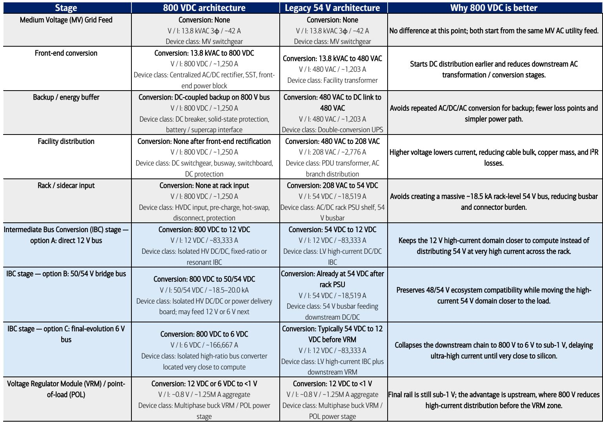
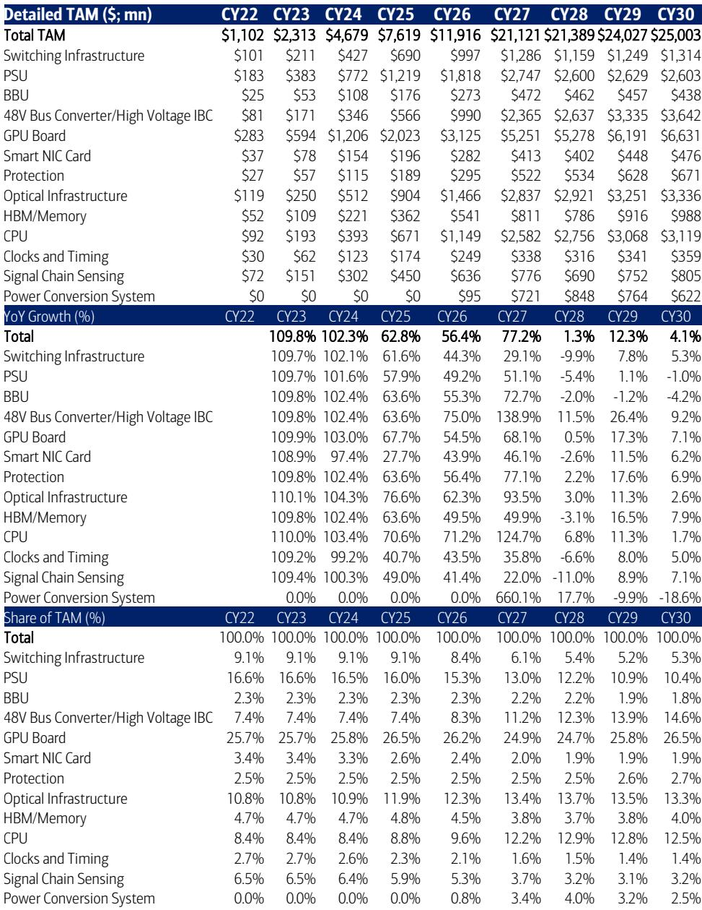
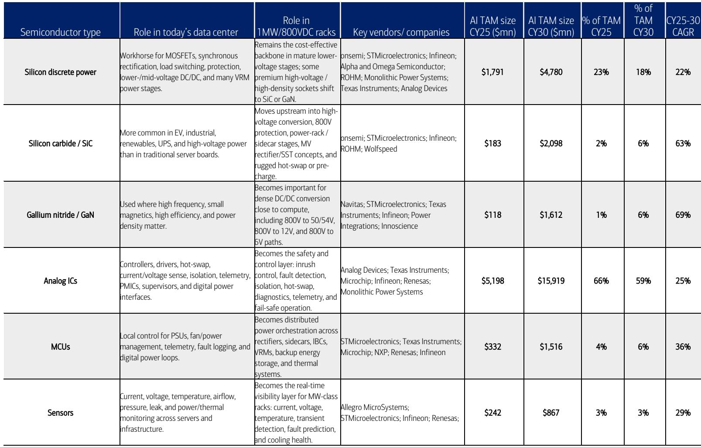

# AI Power Is the Next Great Semiconductor Opportunity: The $27 Billion Market Hiding Inside the Data Center Power Wall

The single most underappreciated bottleneck in artificial intelligence scaling is not compute, memory, or networking. It is power. While the market has focused on the race to build faster GPUs and larger clusters, the physical reality of delivering electricity to those clusters has become a binding constraint. By the end of this decade, a single server rack will consume more than one megawatt of power—enough to supply a thousand homes. The existing power delivery infrastructure, designed for an era of 10-kilowatt racks, is fundamentally obsolete. This creates a transformative opportunity for analog semiconductor companies, one that we estimate will expand the AI analog semiconductor market from $7.9 billion today to $27 billion by 2030, representing a 28 percent compound annual growth rate. The winners will not be the companies that build the fastest chips, but those that master the art of converting electrons into tokens efficiently, reliably, and at scale.

The argument is straightforward: as compute density increases, power density increases even faster. Nvidia's roadmap illustrates this trajectory with stark clarity. The Hopper generation required roughly 32 kilowatts per rack. The Blackwell generation jumped to 121 kilowatts. Rubin Ultra, expected in 2027, will demand over 600 kilowatts. By the time Feynman arrives in 2029 or 2030, rack power will exceed 1.5 megawatts. This is not a linear progression. It is a step-function change that forces a complete rethinking of how power is delivered, from the grid connection all the way down to the GPU core. Every component in that chain—voltage regulators, bus converters, transformers, circuit breakers—must be redesigned, upgraded, or replaced. For analog semiconductor vendors, this represents a secular demand shift away from cyclical automotive and industrial markets toward a durable, high-growth AI infrastructure buildout.

The implications extend well beyond the obvious beneficiaries. This is not merely a story about power management chips. It is a story about the transition to 800-volt direct current architectures inside data centers, the emergence of wide-bandgap semiconductors like silicon carbide and gallium nitride as critical materials, and the creation of entirely new product categories such as solid-state transformers and solid-state circuit breakers. The total addressable market for the "rack-to-core" power segment alone reaches $25 billion by 2030, while the "grid-to-data hall" infrastructure segment adds another $2 billion. For investors and strategists, the question is not whether this opportunity exists, but which companies are best positioned to capture it and how to evaluate their competitive moats.

## The 100x Jump in Rack Power Creates a $25 Billion Market from Rack to Core That Did Not Exist Five Years Ago

The most direct financial implication of rising rack power is the expansion of content per rack. A standard cloud server rack today contains roughly $36,000 worth of power-related semiconductor content. A 600-kilowatt rack in the Rubin Ultra era will contain nearly $300,000. A megawatt-class rack in the Feynman era will approach $1 million. This 25x increase in per-rack content is not evenly distributed. The value shifts disproportionately toward the components closest to the accelerator, where power density, efficiency, and thermal management are most critical.

Multi-phase voltage regulator modules, which manage the precise voltage delivery to GPUs and CPUs, become significantly more complex and expensive as power demands rise. Intermediate bus converters, which step down voltage from the rack level to the board level, require new architectures to handle the increased current. Even optical components, which might seem unrelated to power delivery, become part of the equation because higher power density generates more heat, which degrades optical signal integrity. The report identifies Texas Instruments, Infineon, Analog Devices, Renesas, ON Semiconductor, and STMicroelectronics as key beneficiaries, but the competitive dynamics are more nuanced.

The critical insight is that this is not a commodity market. Power delivery at these densities requires system-level design expertise. The companies that win will be those that can optimize the entire power tree from grid to core, not just individual components. This is why the report emphasizes the importance of portfolio breadth. Infineon, for example, has the broadest AI portfolio spanning silicon, silicon carbide, and gallium nitride, which gives it the ability to offer integrated solutions rather than discrete parts. Texas Instruments has the leading power semiconductor franchise and the highest absolute share of the market today. Analog Devices gains additional capability through its acquisition of Empower, which strengthens its position in high-density power conversion.

The strategic question for investors is whether the market will reward breadth or specialization. The report suggests that breadth will win in the near term because data center operators and system integrators prefer to work with fewer suppliers who can provide end-to-end solutions. However, as the market matures and standards emerge, specialization in high-value components like silicon carbide power switches or gallium nitride voltage regulators could create more durable competitive advantages. This tension between integration and specialization is one of the most important unresolved questions in the investment thesis.

## Silicon Carbide and Gallium Nitride Create Greenfield Revenue Opportunities That Did Not Exist in Traditional Data Centers

The transition to 800-volt direct current architectures is not incremental. It is a fundamental change in how data centers distribute power. Traditional data centers use 480-volt alternating current, which requires multiple conversion stages and suffers from significant losses. The 800-volt DC architecture eliminates several conversion stages, improving efficiency by 3 to 5 percent. That may sound modest, but at megawatt scale, it translates into millions of dollars in annual electricity savings and, more importantly, the ability to pack more compute into a fixed power envelope.

This architectural shift creates a greenfield market for wide-bandgap semiconductors. Silicon carbide and gallium nitride can operate at higher voltages, higher frequencies, and higher temperatures than traditional silicon. They are essential for the solid-state transformers and solid-state circuit breakers that will replace legacy equipment in 800-volt data centers. The report estimates that the power infrastructure TAM, which includes these components, grows to $1.8 billion by 2030 from $245 million today, a 49 percent compound annual growth rate.

The material opportunity is significant, but it is not without risks. Silicon carbide wafers remain expensive and difficult to manufacture at scale. Gallium nitride is still in the early stages of commercialization for high-voltage applications. The report identifies ON Semiconductor as having high leverage to these novel technologies, but the competitive landscape is evolving rapidly. Chinese manufacturers are investing heavily in silicon carbide capacity, which could drive prices down faster than expected and compress margins for Western suppliers.

The more strategic question is whether wide-bandgap semiconductors will remain a premium product or become commoditized. The report's analysis suggests that the performance requirements of megawatt-scale data centers are demanding enough to sustain premium pricing for the foreseeable future. However, the history of semiconductor manufacturing suggests that any technology that becomes essential at scale eventually becomes a volume business. The companies that invest in proprietary packaging, module-level integration, and system-level optimization will be better positioned than those that simply sell raw silicon carbide dies.

## The Grid-to-Data Hall Transition Creates a Second $2 Billion Market That Most Investors Are Overlooking

The most overlooked part of the AI power opportunity is the infrastructure that sits between the utility grid and the data center floor. This includes substations, transformers, switchgear, uninterruptible power supplies, and energy storage systems. In traditional data centers, these components are largely electromechanical and have minimal semiconductor content. In the AI era, they are being transformed into intelligent, digitally controlled systems with significant analog IC, microcontroller, and sensing content.

The report estimates that the semiconductor content per megawatt in this segment grows from $12,400 today to $38,900 during the 800-volt DC evolution. The total TAM reaches $1.8 billion by 2030. The key technologies are solid-state transformers, which replace bulky copper-and-iron transformers with compact, high-frequency power electronics, and solid-state circuit breakers, which can respond to faults in microseconds rather than milliseconds. Both require advanced power semiconductors, control ICs, and sensors.

The strategic significance of this segment is that it represents a new market where there was essentially none before. Traditional data center infrastructure was not a semiconductor market. The transition to microgrid architectures, where data centers can operate independently from the grid during peak demand or outages, creates a recurring need for power management, monitoring, and control semiconductors. This is a classic example of semiconductor content expansion into previously non-semiconductor applications.

The report does not fully address the competitive dynamics in this segment. The incumbents in power infrastructure are companies like ABB, Siemens, and Schneider Electric, which have strong relationships with data center operators but limited semiconductor expertise. The analog semiconductor companies that can partner with these infrastructure providers or develop reference designs for their systems will have a significant advantage. The open question is whether the semiconductor companies will sell components or move up the value chain into modules and subsystems.

## The Report Leaves Unanswered Questions About the Pace of Adoption and the Shape of the Competitive Landscape

No research report can answer every question, and this one leaves several important issues unresolved. The first is the pace of adoption. The report assumes that 800-volt DC architectures become widespread by 2027, coinciding with the Rubin Ultra generation. However, data center operators are conservative by nature, and the installed base of legacy infrastructure is enormous. The transition to new power architectures requires not just new equipment but new skills, new safety protocols, and new supply chains. It is possible that adoption is slower than the report assumes, particularly in regions with less aggressive AI buildout plans.

The second unresolved question is the impact of custom ASICs and merchant GPU alternatives on the power semiconductor market. The report notes that AMD and Intel platforms are currently less power-hungry than Nvidia's, and custom ASICs are even more efficient. If these alternative platforms gain market share, the total power demand per rack could be lower than the report's base case, reducing the TAM for power semiconductors. Conversely, if these platforms also converge toward higher power densities as they become more competitive, the TAM could be even larger.

The third question is about the durability of the competitive advantages that the report identifies. Texas Instruments has the leading power franchise today, but its portfolio is heavily weighted toward silicon-based products. Infineon has the broadest portfolio across silicon, silicon carbide, and gallium nitride, but it faces intense competition from both established players and new entrants. Analog Devices gains share through its Empower acquisition, but integration risks are real. The report provides a snapshot of the competitive landscape today, but the market is evolving rapidly, and today's leaders may not be tomorrow's.

## A Decision Framework for Evaluating AI Power Semiconductor Investments

For investors and strategists evaluating this opportunity, the following framework can help structure the analysis. The first dimension is portfolio breadth. Companies that can offer components across the entire power tree, from grid connection to GPU core, have a structural advantage because they can reduce the number of suppliers that data center operators need to qualify and manage. The second dimension is technology positioning, specifically exposure to wide-bandgap semiconductors. Silicon carbide and gallium nitride are essential for 800-volt architectures, and companies that have invested in proprietary processes and packaging will have higher margins and more durable competitive positions.

The third dimension is system-level capability. The most valuable suppliers will be those that can provide reference designs, simulation tools, and application support that help data center operators optimize their power delivery architectures. This is a consulting-adjacent capability that creates switching costs and customer stickiness. The fourth dimension is manufacturing scale and reliability. AI data centers cannot afford downtime, and power components must meet the highest reliability standards. Companies with proven track records in automotive and industrial markets, where reliability requirements are similarly stringent, have a credibility advantage.

The fifth dimension is financial exposure to the AI power market relative to legacy markets. Companies that generate a significant portion of their revenue from automotive and industrial end markets face cyclical headwinds that could offset their AI tailwinds. The purest plays on AI power are those where the AI data center segment is a large and growing share of total revenue. The report provides revenue share estimates for the major players, but investors should conduct their own sensitivity analysis on how changes in AI buildout pace affect each company's revenue trajectory.

## Join the Community to Read the Full Report and Review the Original Charts

The analysis presented here is based on a detailed bottoms-up model that translates accelerator and rack demand into specific content pools across components and device types. The full report includes the complete power budget analysis across all Nvidia generations, the detailed TAM build for both the rack-to-core and grid-to-data hall segments, the revenue share estimates for each major supplier, and the sensitivity analysis on key assumptions. It also includes the glossary of technical terms that is essential for understanding the nuances of power delivery architecture. The charts and exhibits in the original report provide visual clarity on the power scaling trends and competitive dynamics that are difficult to capture in text alone. Join the community to read the full report and review the original charts.

*This article is for learning and discussion only and does not constitute investment advice.*

Personal reading notes and learning share only. Not investment advice.

