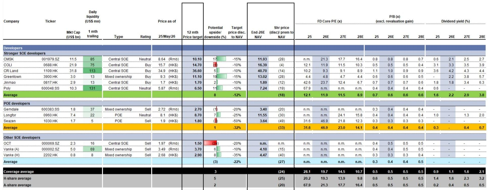
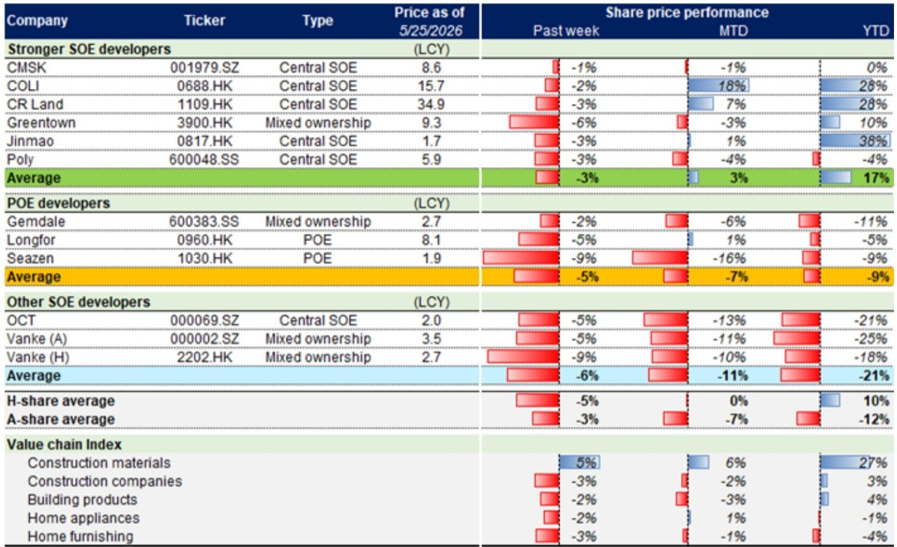
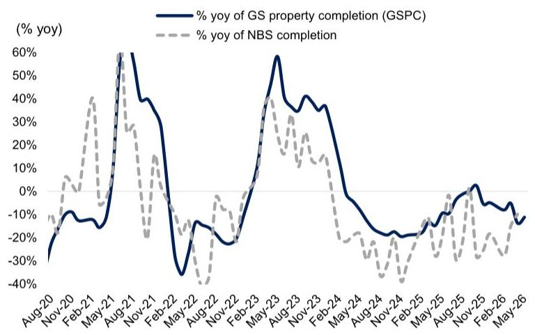

# China's Property Market Is Not Stabilizing: The Leading Indicators Are Telling a Different Story

The temptation to declare a bottom in China's property market is understandable. Month-to-date data for May shows primary market sales volumes holding steady, secondary transactions sustaining double-digit year-on-year growth, and inventory months edging down from recent peaks. For investors who have endured three years of contraction, these surface-level signals offer a flicker of hope that the worst may be behind us.

But a closer reading of the weekly data tells a more cautionary story. The leading indicators—those forward-looking metrics that predict where transactions and prices are heading, not where they have been—are decelerating across the board. Property visitations and subscription-based sales both declined 7% week-on-week in the most recent period. Agent confidence, measured by the Centraline Salesman Index, fell for the third consecutive week. Home seller price expectations continued to erode. These are not the signatures of a market preparing to turn.

The critical insight for investors is this: the apparent stability in transaction volumes is being achieved through price concessions and supply discipline, not through genuine demand recovery. Until the leading indicators inflect upward, the risk of another leg down in prices and developer cash flows remains material. This report examines what the data is actually saying, why Shanghai's trade-in program is not yet a scalable solution, and what framework investors should use to distinguish between noise and signal in the weeks ahead.

## Shanghai's Housing Trade-In Program Shows Early Promise, But Scalability Remains the Central Question

Three months after its launch, Shanghai's housing trade-in program has acquired 523 units across three pilot districts. This is a modest number in absolute terms, but it carries disproportionate strategic weight because the program represents China's most ambitious attempt to create a demand transmission mechanism from secondary to primary markets. The logic is sound: if homeowners can sell their existing properties to a government-backed entity and use the proceeds to purchase new homes, the liquidity bottleneck that has frozen the market for years could begin to thaw.

The geographic concentration of activity is striking. Xuhui District accounts for nearly 90% of acquired units, and these are predominantly older, structurally constrained residences that have been incorporated as part of broader urban renewal initiatives. The remaining acquisitions are concentrated in Pudong, which introduced an additional criterion requiring units to generate an annual rental yield above 2.5%. This is not random variation. It reveals that the program is functioning less as a broad-based liquidity mechanism and more as a targeted tool for specific urban renewal objectives and yield-accretive asset acquisition.

The program has now expanded to include all central districts, which collectively accounted for roughly 40% of new home transactions and 50% of secondary transactions in Shanghai throughout 2025. This expansion is necessary, but it also raises the question of whether the government's balance sheet can absorb the volume required to meaningfully move the market. The 523 units acquired to date represent a fraction of the inventory that would need to be cycled through to create a genuine liquidity bridge. The program's design is elegant, but its execution remains unproven at scale.

## Secondary Market Leading Indicators Are Broadly Decelerating, Signaling Weaker Transaction Volumes Ahead

The secondary market has been the relative bright spot in China's property narrative, sustaining low-teens percentage year-on-year growth in transaction volumes through the most recent week. But the leading indicators that typically precede transaction volumes by two to four weeks are flashing warnings. Subscription-based sales and property visitations both declined 7% week-on-week, and the pace of new listings also slowed by the same magnitude.

The deceleration in new listings is a double-edged sword. On one hand, it supports steady transaction prices by reducing supply pressure. On the other hand, it signals that potential sellers are choosing to wait rather than transact at current price levels. This wait-and-see behavior is consistent with a market where price expectations remain misaligned between buyers and sellers. The Centraline Seller Asking Index declined 0.4 percentage points week-on-week, and the Centraline Salesman Index dropped 1.6 percentage points. Both indices have now declined for three consecutive weeks.

The implication for investors is that the current level of secondary transaction volumes is unlikely to be sustained without a catalyst. The month-to-date data showing secondary volumes 10% below April levels is a statistical warning, not a seasonal anomaly. If the leading indicators continue to decelerate, we should expect secondary transaction volumes to follow in the coming weeks. This would remove the primary support pillar that has kept the market narrative from deteriorating further.

## Primary Market Stability Is a Function of Supply Discipline, Not Demand Recovery

Primary market transaction volumes declined 4% week-on-week and 5% year-on-year in the most recent period, bringing year-to-date volumes to 14% below the same period last year and 48% below the 2023 level. The stability that investors observe in the month-to-date median figures masks a structural reality: developers are not building, and this supply discipline is artificially supporting prices.

New starts are tracking toward a low-twenties percentage year-on-year decline in month-to-date May, based on land sales trends across 300 cities and nationwide cement shipment ratios. Completions are declining at a high-teens percentage year-on-year rate. The inventory balance is down only 0.2% week-on-week, and inventory months stand at 28.0, only marginally below the April average of 29.3. These are not the metrics of a market clearing inventory. They are the metrics of a market where the supply pipeline has been deliberately constrained to prevent a more disorderly price correction.

The risk is that this artificial stability creates a false sense of security. If demand does not recover organically, and if policy measures such as the Shanghai trade-in program fail to scale, the current supply discipline will eventually become unsustainable. Developers cannot indefinitely defer new starts and completions without sacrificing future revenue. When the supply pipeline eventually reopens, the market will need genuine demand absorption to prevent prices from declining further.

## What the Report Does Not Fully Answer: The Transmission Mechanism from Policy to Demand Remains Opaque

The weekly data provides an increasingly granular picture of what is happening in China's property market, but it leaves several critical questions unanswered. The most important of these concerns the transmission mechanism from policy initiatives to actual demand. The Shanghai trade-in program is the most concrete example of a policy designed to create a liquidity bridge, but the report does not address whether similar programs are being considered for other Tier 1 cities or for the broader Tier 2 market.

A second unresolved question concerns the behavior of home sellers. The Centraline indices show that price expectations are declining, but they do not reveal the distribution of these expectations across different segments of the market. Are luxury segment sellers more or less willing to adjust prices than mass-market sellers? Are sellers in cities with stronger demographic inflows behaving differently from sellers in cities with population outflows? These distributional questions matter because they determine whether price adjustments will be sufficient to clear inventory or whether the market will remain frozen.

The third unanswered question is perhaps the most consequential for investors: at what point do the declining leading indicators trigger a policy response? The report documents deceleration but does not model the threshold at which policymakers would consider additional intervention. This is not a criticism of the analysis, but it is a recognition that the most important variable for investment decisions remains outside the scope of the data.

## A Decision Framework for Investors: Distinguishing Between Stabilization Signals and False Positives

For investors trying to navigate this environment, the key challenge is distinguishing between genuine stabilization signals and statistical noise. The following framework is designed to help make that distinction.

First, watch the leading indicators, not the lagging ones. Transaction volumes are a lagging indicator. They tell you what has already happened. The leading indicators to monitor are property visitations, subscription-based sales, agent confidence indices, and seller price expectations. If these metrics inflect upward for two consecutive weeks, it is a genuine signal. If they continue to decline, the stability in transaction volumes is temporary.

Second, monitor the breadth of any recovery. A genuine stabilization would be characterized by broad-based improvement across city tiers and developer types. The current data shows divergence: stronger state-owned enterprise developers are outperforming private developers and other SOE developers by a wide margin. This divergence suggests that the market is discriminating based on perceived credit quality, not responding to a general improvement in fundamentals.

Third, track the relationship between new listings and transaction volumes. In a healthy market, new listings and transaction volumes move together. In the current market, new listings are declining faster than transaction volumes, which is a positive for price stability but a negative for market depth. If new listings begin to increase while transaction volumes remain stable, that would be a positive signal. If both decline, the market is contracting.

Fourth, watch the policy pipeline. The Shanghai trade-in program is the most important policy experiment to monitor. If it scales successfully to other districts and cities, it could become a genuine catalyst. If it remains confined to its current scope, the market will need to find its own bottom, which is likely to be lower than current levels.

## Join the Community to Read the Full Report and Review the Original Charts

The weekly data on China's property market contains far more signal than the headlines suggest, but extracting that signal requires a systematic framework and access to the underlying charts. The full report includes detailed exhibits on primary and secondary transaction volumes, agent and seller confidence indices, inventory trends, completion trajectories, and valuation comparisons across developer types and historical troughs. These charts reveal patterns that are invisible in summary statistics alone.

Join the community to read the full report and review the original charts. The data will continue to evolve, and the most important investment decisions will be made by those who can distinguish between genuine stabilization and statistical noise before the consensus catches up.

*This article is for learning and discussion only and does not constitute investment advice.*

Personal reading notes and learning share only. Not investment advice.

