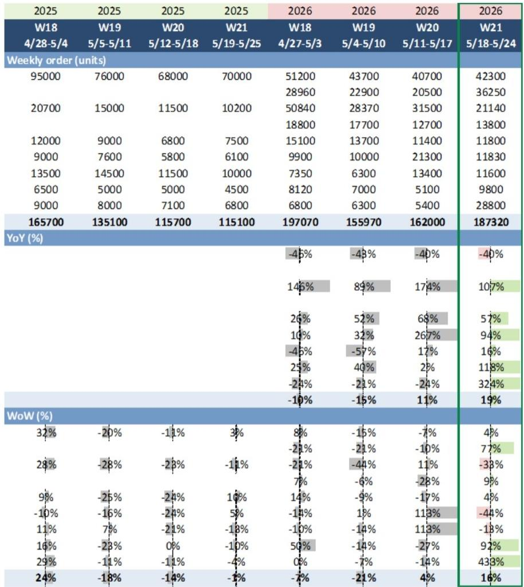
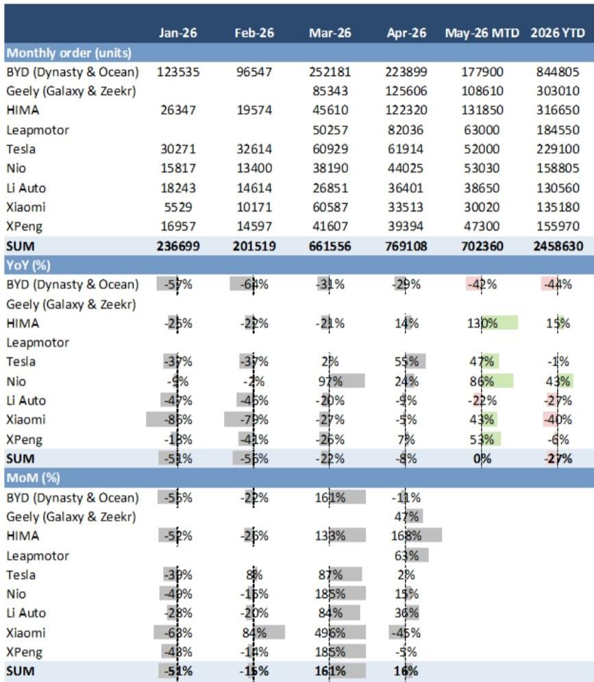
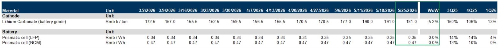

# The New Energy Vehicle Market Is No Longer Driven by Demand — It Is Driven by Product Cycles

China’s new energy vehicle market is often described in terms of penetration rates, policy tailwinds, or raw material costs. These are the comfortable narratives. But the data from Week 21 of 2026 tells a different story — one that is far more tactical, more volatile, and more revealing about the structural dynamics at play. Weekly NEV orders rebounded by 16% week-over-week and 9% year-over-year, but this aggregate figure masks a market that is now dominated by discrete product launches rather than sustained consumer demand. The headline number is not a signal of recovery; it is a signal of concentration.

The most striking data point is XPeng’s performance. The company booked 29,000 orders in a single week — a 433% week-over-week surge — driven almost entirely by the launch of the GX model, which accumulated nearly 25,000 non-refundable orders within its first 12 hours. This is not demand expansion. This is demand compression. Consumers are not buying more cars; they are waiting for specific models and then buying in a concentrated burst. For investors, this shifts the analytical lens from macro trend-following to micro product-timing.

The broader implication is uncomfortable: the market is becoming more binary, more event-driven, and harder to predict using traditional demand models. The winners are not necessarily the brands with the best technology or the strongest balance sheets. The winners are the brands that can orchestrate product launches with precision, manage supply chains to meet sudden spikes, and convert buzz into binding orders. The losers are those that rely on steady-state demand assumptions in a market that no longer operates that way.

This article unpacks the Week 21 data to argue that the NEV market has entered a new phase — one where product cycle management, not aggregate demand, is the primary driver of competitive outcomes. It then offers a decision framework for investors and operators who need to navigate this environment.

## New Model Launches Are Now the Dominant Source of Order Volatility, Not Market Growth

The Week 21 data makes this point with unusual clarity. XPeng’s 433% week-over-week surge is the most extreme example, but it is not an isolated case. Xiaomi posted a 92% week-over-week increase, and Geely’s Galaxy and Zeekr brands rose 77%. In each case, the catalyst was a new model launch or a significant product event. These are not incremental improvements; they are step-function jumps in weekly orders that distort any linear view of brand trajectory.

The implication is that traditional demand forecasting — based on seasonality, income growth, or fuel prices — is losing relevance. The market is becoming lumpy. A brand that launches a well-received model can see its weekly orders multiply by a factor of four or five in a single week. A brand that has no major launch in a given period can see orders stagnate or decline even if the broader market is stable.

This creates a new kind of risk for investors. Portfolio exposure to any single NEV brand is now effectively a bet on that brand’s product calendar. The data shows that the sum of orders across all tracked brands grew only 16% week-over-week, but the dispersion between individual brands was enormous. The range — from a 38% decline for HIMA to a 433% surge for XPeng — is far wider than any macroeconomic variable would suggest.

The strategic insight is that the competitive moat in this market is shifting from manufacturing scale or battery technology to launch execution. The ability to design, produce, and deliver a new model on schedule — and to generate pre-launch buzz that converts into non-refundable orders — is now the single most important competitive differentiator. Brands that excel at this can temporarily dominate the weekly order charts. Brands that do not will find themselves losing share even in a growing market.

## The BEV vs. PHEV Debate Is Being Settled by Product Design, Not Consumer Preference

One of the most revealing data points in the Week 21 report is that battery electric vehicles accounted for approximately 62% of XPeng GX’s total weekly orders. This is noteworthy because the broader market narrative has been shifting toward plug-in hybrids and extended-range electric vehicles as consumers express range anxiety and charging infrastructure concerns. Yet here, a new BEV model is dominating its own order mix.

The conventional explanation is that BEVs are winning on performance and technology. But the data suggests a more nuanced interpretation: the BEV share of a model’s orders is a function of product design, not inherent consumer preference for BEV over PHEV. The GX’s BEV version may have simply been better positioned — better range, better price, better features — than its PHEV counterpart. The same brand could launch another model where the PHEV version captures 70% of orders.

The implication for investors is that the BEV versus PHEV debate is not a binary choice at the industry level. It is a model-level decision that depends on engineering, marketing, and pricing. Brands that can design compelling BEVs will sell BEVs. Brands that design compelling PHEVs will sell PHEVs. The aggregate penetration rate is a lagging indicator of dozens of individual product decisions.

This means that analysts and investors should stop asking "Will BEVs win?" and start asking "Which brands have the product development capability to win with whichever powertrain they choose?" The answer to that question is not found in macro data. It is found in the order mix of individual models, the speed of new model iterations, and the ability to convert pre-launch interest into firm orders.

## Dealer Discounts Are Widening for Both NEVs and ICE Vehicles, Signaling a Price War That Is Structural, Not Cyclical

The report shows that average NEV dealer discounts versus MSRP widened to 7.79% as of May 23, up from 7.61% the previous week. ICE dealer discounts widened to 19.67% from 19.50%. These numbers are moving in the same direction for both powertrain types, which suggests that the pricing pressure is not a function of technology transition but of overall market saturation and inventory buildup.

The conventional view is that NEVs are still gaining share and therefore have pricing power. The data contradicts this. NEV discounts are widening even as penetration rates rise. This is a classic sign of a market that is becoming commoditized at the lower end, where brands compete on price rather than differentiation.

The strategic implication is that the margin structure of the NEV industry is under structural pressure. The days of premium pricing for any electric vehicle are over. Consumers now expect discounts, and brands that cannot offer them will lose volume. This is particularly dangerous for brands that have invested heavily in manufacturing capacity based on assumptions of stable pricing.

The widening discounts also have a second-order effect on the supply chain. If OEMs are under pricing pressure, they will push that pressure upstream to battery suppliers, component manufacturers, and raw material providers. The recent decline in battery-grade lithium carbonate prices — down 5.2% week-over-week to RMB 181,000 per ton — may be a leading indicator of this pass-through effect. Stable cell prices for LFP and NCM may not hold if OEMs demand lower input costs to protect their own margins.

## The Report Does Not Fully Answer Which Brands Can Sustain Order Momentum Beyond the Launch Window

The Week 21 data is rich in granularity, but it leaves a critical question unanswered: what happens in Week 22, Week 23, and beyond? XPeng’s 29,000 orders in one week is impressive, but the report does not provide data on how many of those orders convert into deliveries, how many are canceled, or what the weekly order run-rate looks like once the launch effect fades.

Historical patterns from other brand launches suggest that order spikes are often followed by sharp declines. The question is whether XPeng’s GX can sustain a higher baseline or whether the brand will revert to its pre-launch order levels within a few weeks. The same uncertainty applies to Xiaomi and Geely. Their 92% and 77% weekly increases are exciting, but they are not necessarily durable.

This is not a criticism of the report; it is an inherent limitation of weekly data. Weekly order numbers are noisy. They capture the excitement of a launch but not the sustainability of demand. For investors, the key metric to watch is not the peak weekly order number but the four-week or eight-week moving average after the launch. That will reveal whether the product has genuine staying power or whether it is a one-week wonder.

Until that data is available, the prudent interpretation is that the market is experiencing a product-cycle-driven spike, not a structural improvement in demand. Investors should be cautious about extrapolating Week 21’s winners into long-term winners.

## A Decision Framework for Navigating the Product-Cycle-Driven Market

For investors and operators who need to act on this data, the following framework may be useful. It is based on three dimensions: launch intensity, order conversion, and pricing discipline.

First, assess launch intensity by tracking the number and timing of new model introductions across the brands in your portfolio. A brand with multiple launches per quarter has more opportunities to generate order spikes, but also more risk of execution failure. A brand with no major launches in a given period is likely to underperform on orders, regardless of its underlying technology or brand strength.

Second, monitor order conversion rates. Non-refundable orders are a strong signal, but they are not final sales. The gap between orders and deliveries is a measure of production and supply chain capability. Brands that can close this gap quickly will capture the full benefit of a launch. Brands that cannot will see order cancellations and negative word-of-mouth.

Third, track pricing discipline. Widening dealer discounts are a warning sign that a brand is losing pricing power. Brands that can maintain or narrow discounts while growing orders are demonstrating genuine demand. Brands that need to cut prices to generate orders are showing weakness, even if the order numbers look strong.

This framework shifts the analytical focus from backward-looking market share to forward-looking competitive dynamics. It is not a substitute for fundamental analysis, but it provides a structured way to interpret the weekly noise.

## Join the Community to Read the Full Report and Review the Original Charts

The data presented here is a curated sample from a comprehensive weekly chartbook that tracks NEV orders, dealer discounts, upstream battery pricing, and key events across the Chinese automotive market. The full report includes detailed tables by brand, historical comparisons, and forward-looking event calendars that are essential for anyone making investment or operational decisions in this sector. The original charts provide the visual context that makes the trends immediately actionable. Join the community to read the full report and review the original charts.

*This article is for learning and discussion only and does not constitute investment advice.*

Personal reading notes and learning share only. Not investment advice.

