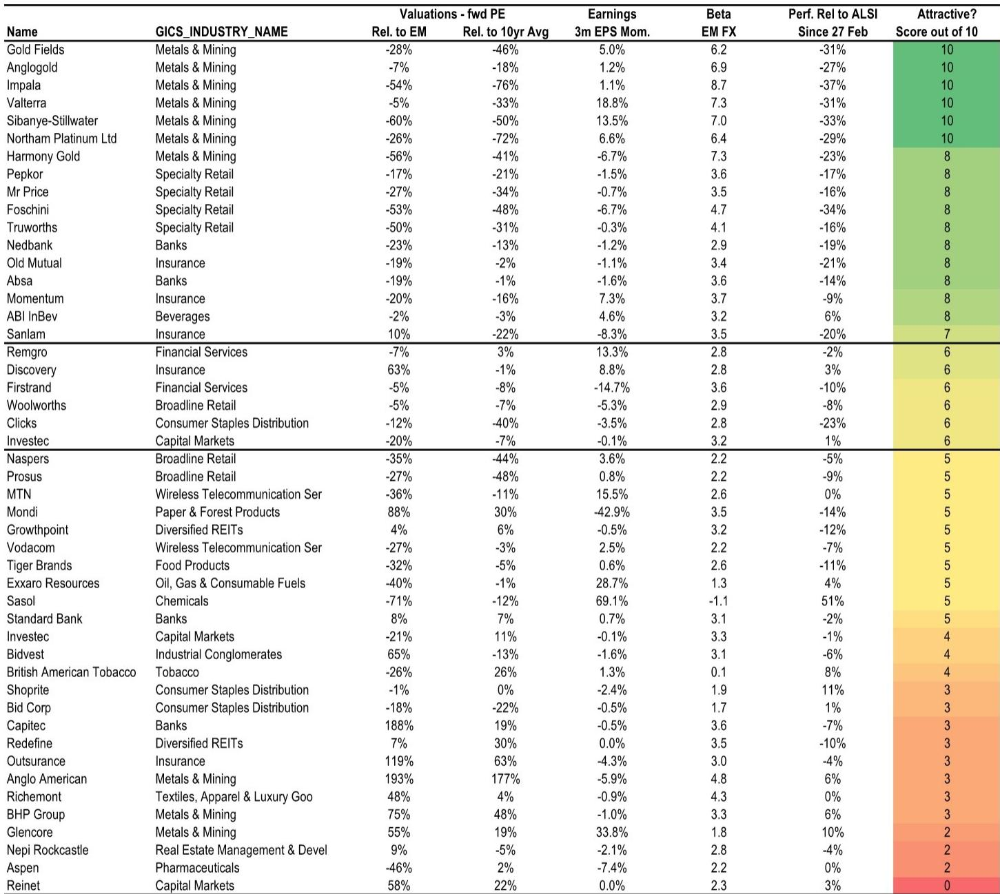
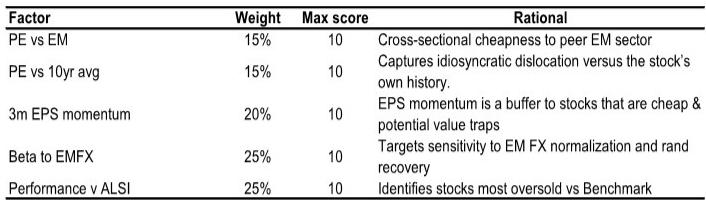

# The Strait Reopening Will Reshape South African Equity Returns: Buy Precious Metals and Banks, Trade Retail With Caution

The reopening of the Strait of Hormuz is no longer a distant scenario—it is becoming the central organizing principle for South African equity strategy in the second half of 2026. A global investment bank’s base case now assumes a June reopening, and recent diplomatic signals have accelerated the market’s focus on what comes next. For investors positioned in South Africa, the implications are profound: a stronger terms of trade, a recovering rand, and the return of offshore capital to domestic equities. But not all stocks will benefit equally, and the timing of entry matters as much as the selection.

A multi-factor screen applied to JSE mid- and large-cap stocks reveals a clear hierarchy. Precious metals miners score at the top, with several names achieving a perfect 10 out of 10 on the composite metric. Retailers and financials also screen well, but for fundamentally different reasons—and with very different risk profiles. The screen is not a simple buy list. It is a framework for understanding which stocks are best positioned to benefit from the specific sequence of events that a Strait reopening will trigger: lower oil prices, rand appreciation, improved consumer confidence, and a rotation back into domestic exposure.

The argument of this article is straightforward. Investors should overweight precious metals and select banks as core expressions of the reopening trade, treat retail as a tactical opportunity with a short shelf life, and avoid the temptation to treat all high-scoring stocks as equivalent. The factor screen provides the signal, but strategy—not screening—determines the outcome.

## Precious Metals Miners Score Highest Because They Combine Cheap Valuations, Strong Earnings Momentum, and Maximum Sensitivity to the Reopening

The screen assigns the highest scores to Gold Fields, AngloGold Ashanti, Impala Platinum, Valterra Platinum, Sibanye-Stillwater, and Northam Platinum—all achieving a score of 10 out of 10. Harmony Gold follows closely at 8. What makes these stocks stand out is not any single factor but the convergence of all four: they are deeply undervalued relative to both EM peers and their own 10-year histories, they have positive or stable earnings momentum, they exhibit high beta to emerging market FX (a proxy for rand recovery), and they have underperformed the JSE significantly since late February.

This combination is not coincidental. The sell-off in precious metals stocks since the Strait closure reflects a market that priced in prolonged uncertainty, higher input costs from oil, and the risk of sustained rand weakness. But the underlying commodity thesis remains intact. The report maintains a $6,000/oz gold price base case, and the reopening will remove one of the key headwinds—elevated oil prices—that had compressed margins. For platinum group metals, the demand story is reinforced by the critical minerals and alternative energy drive, which is a structural, not cyclical, tailwind.

The strategic insight here is that precious metals miners are not just a play on commodity prices. They are a play on the entire macro sequence that a reopening unlocks: lower oil, stronger rand, improved terms of trade, and renewed offshore interest in high-beta EM equities. No other sector captures all four dynamics with the same intensity.

## Retail Stocks Screen Well on Valuation and Underperformance, But Earnings Headwinds Make Them a Short-Term Trade, Not a Core Holding

The screen identifies Pepkor, Mr Price, Foschini, and Truworths all at a score of 8. On the surface, this looks compelling. These stocks have de-rated sharply, trade at significant discounts to their historical averages, and have underperformed the JSE by 16% to 34% since February. The valuation gap versus EM peers is also wide. For a momentum-driven reopening rally, these are exactly the kinds of names that attract capital.

But the report is explicit in its caution. Retail earnings are under pressure from a highly competitive environment for discretionary spending, and the headwinds from Chinese e-commerce competition are not going away. The chart on general retail EPS shows a clear downward trajectory, while banks’ earnings have remained resilient. The report argues that apparel retail may work for one to two months at most, and that the preferred expression of the trade should be through Pepkor—due to its diversified growth profile and the defensive nature of its Pep business against Chinese e-commerce—or Mr Price, where the NKD acquisition is already priced in.

The deeper point is that valuation alone is not a sufficient reason to buy. The factor screen captures cheapness and underperformance, but it cannot fully capture the structural erosion of earnings power that may persist even after the macro environment improves. Investors who treat retail as a core reopening position risk being caught in a value trap if earnings continue to disappoint. The trade is real, but it is tactical, and it requires a clear exit strategy.

## Banks Offer the Best Combination of Liquidity, Earnings Resilience, and Domestic Exposure for a Sustained Reopening Rally

Nedbank, Old Mutual, Absa, and Momentum Metropolitan all score 8 on the screen. Standard Bank scores only 5, and Capitec scores 3—a reminder that not all financials are created equal. The banks that screen well share common characteristics: they are cheap relative to EM peers and their own histories, they have stable to positive earnings momentum, and they have meaningful beta to rand recovery.

The report’s preference for banks over retailers for a six-month view is grounded in two observations. First, bank earnings are unlikely to disappoint or be cut in the near term, unlike retail earnings, which face mounting pressure. The chart comparing bank EPS to general retail EPS makes this divergence stark: bank earnings have been steadily rising, while retail earnings have plateaued and begun to decline. Second, banks are large, liquid, and well-understood by offshore investors. When the marginal buyer returns to South Africa—and the report expects this to happen as the Strait reopens and rand strengthens—banks will be the natural destination for capital seeking domestic exposure without idiosyncratic earnings risk.

The strategic implication is that banks are the best way to express a conviction that the reopening will be sustained and that the SA Inc. theme will resume in earnest. They are not the highest-beta expression of the trade—that belongs to precious metals—but they offer a more balanced risk-reward profile for investors who want exposure to domestic recovery without taking on commodity price risk.

## The Report Raises a Critical Unanswered Question: How Quickly Will Macro Fundamentals Catch Up With Equity Pricing?

The factor screen is designed to identify stocks that will benefit from the reopening, but it operates within a specific assumption about timing. The report assumes that equities will begin to price in the reopening before the macro fundamentals—oil prices, inflation, growth—actually reflect it. This is a reasonable assumption, but it leaves an open question that the screen cannot answer: what happens if the reopening is delayed, or if the macro adjustment is slower than expected?

The report acknowledges this uncertainty. It notes that Brent prices are expected to remain sticky in the low $100/bbl even after the reopening, as the bottleneck shifts from the Strait to tanker availability and inventory rebuilding. The growth forecast has been downgraded to 1%, with 50-75 basis points of rate hikes expected this year. These are not conditions that typically support a broad equity rally. The reopening trade, therefore, is not a bet on immediate improvement in the real economy. It is a bet on a change in narrative and a rotation in positioning.

This creates a tension that the screen does not fully resolve. Stocks that score highly on momentum reversal and beta to EMFX may rally sharply in the first weeks after a reopening announcement, but if the macro data does not follow, the rally may fade. The report’s suggestion to look through the initial two-week rally and focus on higher-quality names like Discovery, FirstRand, and Clicks—which score lower on the screen but are considered better long-term holdings—is an acknowledgment that the screen is a short-term tool, not a strategic compass.

## The Decision Framework for Investors: Three Questions to Determine Your Position in the Reopening Trade

The report provides the data and the analysis, but it does not prescribe a single portfolio. The following decision framework translates the screen into actionable choices based on an investor’s time horizon and risk tolerance.

First, what is your time horizon? If you are trading the first one to two months after a reopening announcement, the factor screen is your guide. Focus on stocks with scores of 8 or above, particularly in precious metals and retail, and be prepared to exit quickly. If your horizon is six to twelve months, the screen is a starting point, not a destination. Prioritize banks and select miners, where earnings are more defensible and the structural tailwinds are stronger.

Second, how do you weigh earnings risk versus valuation opportunity? The screen gives equal weight to cheapness and underperformance, but earnings momentum is only 20% of the score. For a long-term position, earnings momentum should be weighted more heavily. Stocks like FirstRand and Discovery score only 6 on the screen, but the report views them as higher quality than the apparel retailers that score 8. The framework should adjust for this by applying a quality overlay to the screen results.

Third, how do you manage the risk of a delayed or messy reopening? The report’s base case is June, but it acknowledges skepticism over an imminent resolution. The prudent approach is to phase into positions, starting with the most liquid and resilient names—banks and diversified miners—and adding tactical retail exposure only when the reopening appears imminent and credible. The screen can be updated as new information emerges, and the weights can be adjusted to reflect changing probabilities.

## Join the Community to Read the Full Report and Review the Original Charts

The factor screen presented here is only one layer of a much deeper analysis. The full report includes detailed sector-level valuation charts, EPS trajectory comparisons, and a breakdown of how each stock scores across the four factors. It also contains the original data tables and figures that support the arguments made in this article. For investors who want to build their own portfolios based on the reopening thesis, the full report is an essential reference.

Join the community to read the full report and review the original charts.

*This article is for learning and discussion only and does not constitute investment advice.*

Personal reading notes and learning share only. Not investment advice.

