# Chemicals

# The Long View: Chemicals - Analysing the lasting impact on upstream chemicals of the Iran war

James Hooper

+44 20 7676 6995

james.hooper@bernsteinsg.com

Abdessamad Raghibi, Ph.D.

+212 5 22 86 79 41

abdessamad.raghibi@bernsteinsg.com

Sebastien Afoy

sebastien.afoy@bernsteinsg.com

# Specialist Sales

James Brady

+44 20 7762 5272

james.brady@bernsteinsg.com

Steve Song

+1 917 344 8401

steve.song@bernsteinsg.com

With US-Iran negotiations often reported to be in their final stages, now is a good time to examine the long-term impacts of the crisis on upstream chemicals. On balance, we see some long-term benefits to market structure. Petrochemical demand is typically resilient, with many consumer-facing applications. On the supply side, we expect some lasting cuts, even if the majority of currently closed capacity comes back online. Better supply-demand combined with expected higher oil prices means we increase our long-term polyolefin price estimates by c. 5-15%. There are risks (e.g. demand destruction, no long-term capacity changes), but this analysis gives us conviction that if upstream chemical share prices decline materially on a peace agreement, there could be a long-term opportunity.

We see petrochemicals supply-demand as improving. Petrochemicals volume demand tends to be relatively resilient, with 2007-09 the only down years in the last 20, supported by many consumer-facing applications. On the supply side, in most currently impacted countries we believe petrochemicals is a nationally strategic industry (e.g. the Middle East, China, Taiwan), but we don't expect all capacity to reopen given the higher costs and lasting damage to Qatari LNG facilities.

We raise our long-term polyolefin price forecasts. Our proprietary polyolefins supply-demand model uses 3 factors to drive petrochemical prices: the operating rate, GDP growth and Brent Crude prices (the marginal commodity). With better supply-demand and higher oil prices outweighing a possible decline in GDP, we raise our estimates by between 5-15% over 2027-30.

The lasting changes: we see a steeper cost curve and therefore better economics for natural gas-based producers, mostly in the Middle East and North America. But possible \$5 Henry Hub looms as a risk for North America. The marginal commodity of most petrochemicals is oil, given the supply balance is in Europe and East Asia. The oil-gas spread has recently moved considerably in favour of gas, and North American petchem plants are currently beneficiaries. We believe Middle Eastern producers will also benefit once logistics costs normalise. But for North American capacity, our house \$5 Henry Hub view looms as a risk to the current prosperity. In oil-based feedstock regions, we see integration as a greater advantage in a higher cost environment, potentially benefiting BASF.

We're ready to buy a possible end-of-war dip in our upstream names. In our view, it's likely that share prices across our upstream coverage fall on a formal announcement of the end of the conflict. But we think this could create an opportunity. For BASF, our forecast structural improvements to upstream markets mean we think the €40-50 share price trading range of recent years is no longer merited, and the floor is higher. For Borouge and SABIC, although rated Market-Perform on the current challenges, we become more bullish on their long-term prospects. The industrial gases could also benefit across a variety of our scenarios, from supporting new North American petchem capacity to higher-for-longer commodities creating pricing opportunities.

BERNSTEIN TICKER TABLE 

<table><tr><td colspan="3"></td><td rowspan="2">22 May 2026 Closing Price</td><td rowspan="2">Price Target</td><td rowspan="2">TTM Rel. Perf.</td><td colspan="4">Adjusted EPS</td><td colspan="3">Adjusted P/E (x)</td></tr><tr><td>Ticker</td><td>Rating</td><td>Cur</td><td>Cur</td><td>2025A</td><td>2026E</td><td>2027E</td><td>2025A</td><td>2026E</td><td>2027E</td></tr><tr><td>AI.FP (Air Liquide)</td><td>O</td><td>EUR</td><td>180.38</td><td>207.00</td><td>(17.4)%</td><td>EUR</td><td>6.70</td><td>7.39</td><td>8.14</td><td>29.6</td><td>25.8</td><td>23.3</td></tr><tr><td>APD (Air Products )</td><td>O</td><td>USD</td><td>290.19</td><td>344.00</td><td>(21.2)%</td><td>USD</td><td>12.06</td><td>13.25</td><td>14.64</td><td>24.1</td><td>21.9</td><td>19.8</td></tr><tr><td>AKZA.NA (Akzo Nobel)</td><td>M</td><td>EUR</td><td>51.88</td><td>59.00</td><td>(29.1)%</td><td>EUR</td><td>3.63</td><td>3.99</td><td>4.24</td><td>14.3</td><td>13.0</td><td>12.2</td></tr><tr><td>AKE.FP (Arkema)</td><td>M</td><td>EUR</td><td>62.20</td><td>68.00</td><td>(21.4)%</td><td>EUR</td><td>4.34</td><td>4.62</td><td>5.24</td><td>14.3</td><td>13.5</td><td>11.9</td></tr><tr><td>BAS.GR (BASF)</td><td>O</td><td>EUR</td><td>52.05</td><td>61.00</td><td>6.3%</td><td>EUR</td><td>2.24</td><td>2.62</td><td>2.78</td><td>23.2</td><td>19.9</td><td>18.7</td></tr><tr><td>BOROUGE.UH (Borouge)</td><td>M</td><td>AED</td><td>2.51</td><td>2.48</td><td>(15.2)%</td><td>USD</td><td>0.04</td><td>0.03</td><td>0.05</td><td>18.6</td><td>21.2</td><td>12.8</td></tr><tr><td>CLN.SW (Clariant)</td><td>M</td><td>CHF</td><td>7.94</td><td>8.30</td><td>(27.8)%</td><td>CHF</td><td>0.68</td><td>0.64</td><td>0.75</td><td>11.7</td><td>12.4</td><td>10.6</td></tr><tr><td>LIN.UW (Linde)</td><td>O</td><td>USD</td><td>514.51</td><td>561.00</td><td>(2.0)%</td><td>USD</td><td>16.46</td><td>18.10</td><td>19.99</td><td>31.3</td><td>28.4</td><td>25.7</td></tr><tr><td>PPG (PPG )</td><td>O</td><td>USD</td><td>106.63</td><td>130.00</td><td>(32.0)%</td><td>USD</td><td>7.64</td><td>7.95</td><td>8.75</td><td>14.0</td><td>13.4</td><td>12.2</td></tr><tr><td>SOLB.BB (Solvay)</td><td>M</td><td>EUR</td><td>26.00</td><td>26.60</td><td>(24.4)%</td><td>EUR</td><td>2.82</td><td>2.28</td><td>2.74</td><td>9.2</td><td>11.4</td><td>9.5</td></tr><tr><td>SYENS.BB (Syensqo)</td><td>O</td><td>EUR</td><td>66.50</td><td>70.00</td><td>(13.6)%</td><td>EUR</td><td>3.72</td><td>3.85</td><td>4.36</td><td>17.9</td><td>17.3</td><td>15.3</td></tr><tr><td>SABIC.AB (Saudi Basic Industries)</td><td>M</td><td>SAR</td><td>57.20</td><td>67.80</td><td>(45.6)%</td><td>SAR</td><td>(0.51)</td><td>1.25</td><td>1.37</td><td>11.1</td><td>10.2</td><td>8.3</td></tr><tr><td>EDME</td><td></td><td></td><td>1,564.91</td><td></td><td></td><td></td><td></td><td></td><td></td><td></td><td></td><td></td></tr><tr><td>SPX</td><td></td><td></td><td>7,473.47</td><td></td><td></td><td></td><td></td><td></td><td></td><td></td><td></td><td></td></tr><tr><td>ASIAX</td><td></td><td></td><td>1,963.21</td><td></td><td></td><td></td><td></td><td></td><td></td><td></td><td></td><td></td></tr></table>

O - Outperform, M - Market-Perform, U - Underperform, NR - Not Rated, CS - Coverage Suspended   
SABIC.AB estimate is Reported EPS; AI.FP valuation is Reported P/E (x); SABIC.AB valuation is EV/EBITDA (x);   
Source: Bloomberg, Bernstein estimates and analysis.

# INVESTMENT IMPLICATIONS

We expect the Middle East's petrochemicals advantage to increase once logistics costs normalise. We rate Borouge and SABIC Market-Perform, given the short-term uncertainties about the conflict and its duration.

For BASF we see upstream conditions as slightly better, but margin improvements are more limited given their mostly oil-based feedstock. However, we see BASF as better-positioned than most in the new environment given that it benefits from the integration advantage, and over the next couple of years we expect greater European domestic demand before memories of the conflict fade. We therefore believe that BASF is now less likely to return to the €40-50 trading range we have seen in the last few years. We rate BASF Outperform.

If North American natural gas prices stay below \$5 for an extended period of time, that would encourage more North American petrochemicals capacity. This would benefit the industrial gas companies: Linde, Air Products and Air Liquide, all rated Outperform. If North American natural gas does go to \$5, higher commodity prices mean an excuse to use their ample pricing power (see report 7 May 2026 - The Bernstein Industrial Gases Primer: How the industry structure can support long-term outperformance).

Elsewhere in our coverage, higher-for-longer petchem prices will mean a test of pricing power. Both Paints & Coatings & downstream industrials will need to price for their likely higher-for-longer petrochemical input costs. We are less concerned about Paints & Coatings pricing power, albeit there may be an incoming volume blip. We rate PPG Outperform and Akzo Nobel Market-Perform. We are more concerned about our non-integrated diversified names, where some of the chemistry may lack the pricing power to address the higher upstream costs, and some end-uses are more discretionary. We rate Syensqo Outperform. We rate Arkema, Clariant and Solvay Market-Perform.

# DETAILS

# SUMMARISING THE MULTI-YEAR BULL CASE FOR UPSTREAM CHEMICALS

In our previous sector report, we set out the position that we're expecting an Iran-related cycle: short-term supernormal profits, but potentially a subsequent painful reset (see report Chemicals: Positioning for an Iran-related cycle and upgrading Arkema to Market-Perform). In this report we seek to look beyond the next few months or even year, and look for structural changes. We start by examining the bull case.

Higher for longer petrochemical prices without impacting demand will mean structurally higher margins. To start with the obvious: petrochemical prices are currently very high, and the recent price hikes were the steepest in almost 20 years (Exhibit 1). US olefin prices are currently very elevated, with ethylene up \~68% YTD (+64% YoY) and polymer-grade propylene up \~83% YTD. Butadiene stands out, surging \~194% YTD (+79% YoY), while China exhibit similar trends (Exhibit 2, Exhibit 3). In essence, the bull case is very simple. If petrochemical prices are sustained at historically high levels, that will likely imply higher profitability for producer. We can build this bull case using the two key pillars of commodity chemicals: supply and demand.

- Supply permanently reduces for upstream chemicals. It was well established that the petrochemicals industry has been suffering from oversupply in recent years (see link, link). The impact of this crisis has been to effectively reduce previous Asian overcapacity, such that the market is now undersupplied (link). If one assumes that much of these supply cuts become permanent, and that future capacity additions are slowed / cancelled, then the market immediately becomes structurally more balanced. The possible reasons for more permanent cuts include re-regionalisation to bring supply chains home from the Middle East / Asia; an opportunity to exit high-cost capacities in the context of Chinese anti-involution or other Asian / European petrochemical capacity cuts; or renewed inflation making new project construction in higher cost regions less economic.   
- Demand to stay resilient, or even increase. Tighter supply is likely to increase prices, but reduced supply would have little meaning if demand were to collapse under the weight of inflation. However, many petrochemicals are used as building blocks for important everyday items where demand is expected to be relatively inelastic (e.g. food packaging). And it is difficult to “downtrade” from petrochemicals given they are typically the cheapest chemical grade anyway; demand could even increase as R&D departments try to substitute cheaper materials and consumers stay in to save money. Therefore, demand could prove surprisingly resilient.

Dow Chemical and LyondellBasell (neither covered) in their recent 1Q26 results provided some visual accompaniments (Exhibit 4 to Exhibit 6).

We spend the next sections of the report looking in more detail at the supply and demand sides of this argument, before adjusting our proprietary polyolefin supply-demand model (Global Polyolefins Market Model) and drawing some conclusions.

EXHIBIT 1: A history of petchem prices since 2007   
Weekly price indices in NE Asia, NW Europe and US Gulf (Jan-19 = 100)   
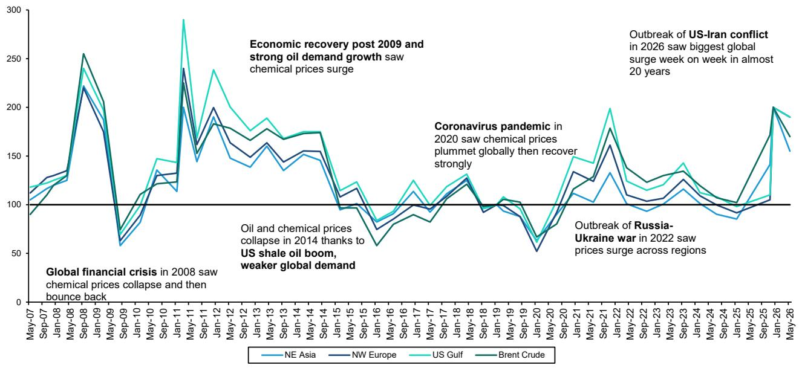  
NE Asia: CFR incoterm used for all chemicals, China location used for methanol   
Europe = CIF incoterm used for benzene and ethylene, FD used for propylene, FOB used for butadiene, methanol, toluene and xylenes   
US Gulf = CIF incoterm used for butadiene, DDP incoterm used for benzene, DEL incoterm used for ethylene and propylene, FOB used for methanol, toluene and xylenes   
Source: ICIS, Bernstein analysis

EXHIBIT 2: In the US, olefin prices have rallied since the onset of the Iran conflict and show no signs of easing.   
Olefin US-Gulf prices index - Rebased to 100   
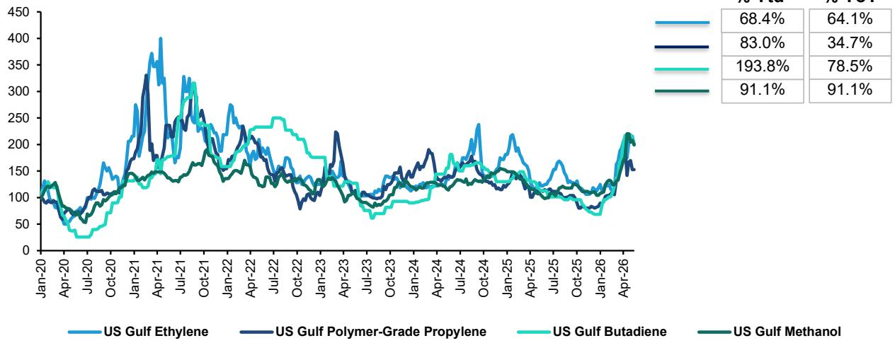

line

| Category                  | Value   |
| ------------------------- | ------- |
| US Gulf Ethylene          | 68.4%   |
| US Gulf Polymer-Grade Propylene | 83.0%   |
| US Gulf Butadiene         | 193.8%  |
| US Gulf Methanol          | 91.1%   |

Source: Bloomberg, Bernstein analysis

EXHIBIT 3: Chinese olefin prices have surged since the onset of the Iran conflict and began stabilizing in April.   
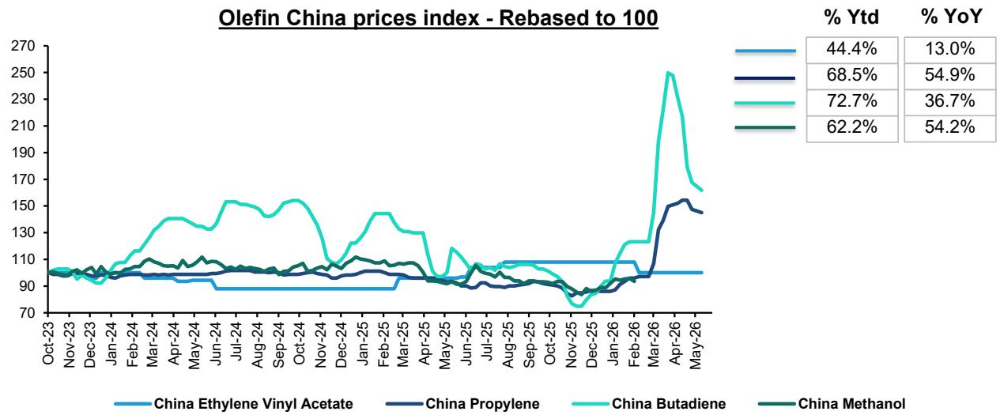

line

| Product                  | % Ytd  | % YoY  |
| ------------------------ | ------ | ------ |
| China Ethylene Vinyl Acetate | 44.4%  | 13.0%  |
| China Propylene          | 68.5%  | 54.9%  |
| China Butadiene          | 72.7%  | 36.7%  |
| China Methanol           | 62.2%  | 54.2%  |

Source: Bloomberg, Bernstein analysis

EXHIBIT 4: Dow provided a two-slide summary of the bull case for upstream chemicals in their most recent earnings presentation (1/2)

# GLOBAL DEMAND IS STEADY, SUPPLY DYNAMICS ARE CONSTRAINED

# Global Demand Largely Unchanged

+ Global PE packaging demand remains resilient   
+ Industry PE inventory remains at low levels   
+ Consumer spending rebounded modestly in February, signaling resilience   
+ Anticipate energy industry dynamics will lead to stronger EV demand   
- Elevated inflation continues to pressure U.S. interest rates, contributing to weaker-than-expected existing home sales

% of Dow Sales Exposed to Tightening Market Dynamics   
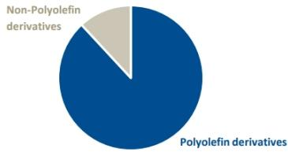

pie

| Category | Value (%) |
|---|---|
| Polyolefin derivatives | 50 |
| Non-Polyolefin derivatives | 15 |

# Polyethylene Supply Significantly Impacted

- \~20% $^{1}$ of global oil capacity offline   
- \~50% $^{1}$ of global ethylene & PE supply is offline, constrained or impacted   
■ Infrastructure damage increasing across the Middle East   
■ Transit through the Strait of Hormuz remains significantly impaired

Global PE Capacity $^{1}$   
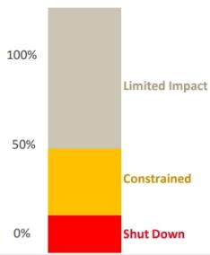

bar_stacked

| Category | Value (%) |
|---|---|
| Limited Impact | 50 |
| Constrained | 25 |
| Shut Down | 10 |

# Americas Feedstock Advantage Remains

■ Geopolitical supply disruption has significantly tightened oil markets   
■ Rapidly depleting oil cargoes straining physical market; expectations for higher U.S. supply   
■ North American LNG markets remain well supplied and regionally insulated   
■ U.S. Gulf Coast NGL's, including ethane, remain largely unimpacted

Oil to Gas Spread (\$/BOE) $^{1}$   
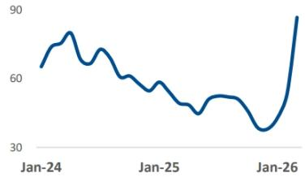

line

| Date   | Value |
|--------|-------|
| Jan-24 | 65    |
| Jan-25 | 55    |
| Jan-26 | 90    |

1. Dow analysis based on 3rd party data

# DOW

7

Source: Dow Chemical 1Q26 presentation

# EXHIBIT 5: Dow provided a two-slide summary of the bull case for upstream chemicals in their most recent earnings presentation (2/2)

# MIDDLE EAST CONFLICT REPRESENTS A MAJOR INDUSTRY DISRUPTION

# Global Supply Experiencing Significant Turmoil

- \~20% $^{1}$ of global oil capacity is offline   
- \~50% $^{1}$ of global ethylene & PE supply is offline, constrained or impacted   
■ Infrastructure damage increasing across the Middle East   
■ Transit through the Strait of Hormuz remains significantly impaired

Global Industry Ethylene Production (%)   
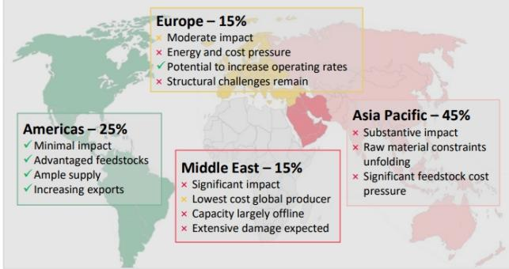

text_image

Europe – 15%
• Moderate impact
• Energy and cost pressure
• Potential to increase operating rates
• Structural challenges remain

Americas – 25%
✓ Minimal impact
✓ Advantaged feedstocks
✓ Ample supply
✓ Increasing exports

Middle East – 15%
• Significant impact
• Lowest cost global producer
• Capacity largely offline
• Extensive damage expected

Asia Pacific – 45%
• Substantive impact
• Raw material constraints unfolding
• Significant feedstock cost pressure

# Prolonged Industry Impact Expected

# Duration

■ Impact expected to last well beyond eventual conflict end   
■ Risk of lasting infrastructure damage

# Impact to Future Investments

■ Potential for reduced capacity adds, particularly for ethylene:   
○ \~75% $^{1}$ of announced adds impacted by conflict   
$\circ \sim 15\%^{1}$ of announced adds are behind the Strait of Hormuz

# Structural Reset

■ Structural risk premium in both oil and petrochemicals and a steeper global cost curve   
■ Potential for permanent capacity rationalization to accelerate, particularly in Asia, with intensifying feedstock supply and cost pressures

Dow's advantaged portfolio, European feedstock flexibility and agile global supply chains position us well to win in the markets we serve

1. Dow analysis based on 3rd party data

8

Source: Dow Chemical 1Q26 presentation

# EXHIBIT 6: LYB also have made the case for lasting changes to the petrochemical industry in their 1Q26 presentation

# Middle East war creating structural shifts in economics

LYB is well-positioned to benefit from strengthened cost advantage

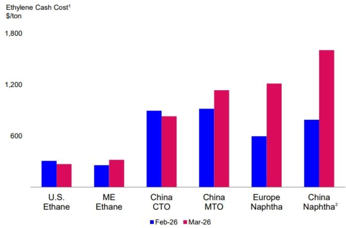

bar

Ethylene Cash Cost¹
| Company | Feb-26 ($/ton) | Mar-26 ($/ton) |
| :--- | :--- | :--- |
| U.S. Ethane | 450 | 430 |
| ME Ethane | 400 | 470 |
| China CTO | 950 | 800 |
| China MTO | 1050 | 1150 |
| Europe Naphtha | 600 | 1200 |
| China Naphtha² | 700 | 1500 |

CTO = Coal-to-Olefins; MTO = Methanol-to-Olefins

1. Source: Chemical Market Analysis and S&P Global; LYB internal analysis   
2. Feb-26 China naphtha ethylene cash cost assumes \$10/bbl discount to Brent (ICE) Crude

# War steepens the global petrochemical cost curve

- Higher crude prices increase costs for naphtha-based petchems   
- Crude oil discounts for China and India have largely disappeared   
• Security of supply questions for Asian and Middle East capacity

# Economic and logistical impacts will persist

- Higher risk premium for crude oil increases naphtha-based costs   
• Discounts on sanctioned crude oil unlikely to return   
- Direct damage to assets and prolonged logistical disruptions extend the duration of tight markets for petrochemicals   
- Some temporary shutdowns could become permanent   
- Idle capacity insufficient to fill supply gap   
• Downside risk to discretionary demand could materialize

# LYB US Gulf Coast (USGC) and European assets to benefit

• LYB USGC assets benefiting from low costs and export demand   
- LYB European assets quickly passing through higher feedstock costs; increasing volumes to address lack of imports   
• Similar cost curve benefits for most LYB O&P and I&D products

Source: LyondellBasell 1Q26 presentation

# PETROCHEMICALS DEMAND IS RELATIVELY RESILIENT

Our coverage has more focus on olefins and polyolefins, so we focus on those as a case study. Key olefins ethylene and propylene are two of the most manufactured petrochemicals by volume. 2/3 of them become polyolefins: polyethylene and polypropylene (Exhibit 7, Exhibit 8). These are typically used for plastic packaging, films, and other consumer-facing applications (Exhibit 9 to Exhibit 11). These everyday uses have meant that demand has historically been growing over time with the rise of the Asian middle class.

EXHIBIT 7: Key commodity chemicals are typically used as intermediates for other chemical processes: (1: Ethylene)   
World 2023 Ethylene Demand   
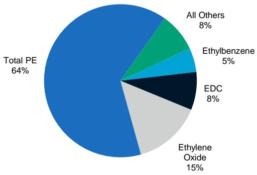

pie

| Category | Percentage (%) |
| :--- | :--- |
| Total PE | 64 |
| Ethylene Oxide | 15 |
| EDC | 8 |
| Ethylbenzene | 5 |
| All Others | 8 |

Source: OPIS, Bernstein analysis

EXHIBIT 8: Key commodity chemicals are typically used as intermediates for other chemical processes: (2: Propylene)   
World 2023 Propylene Demand   
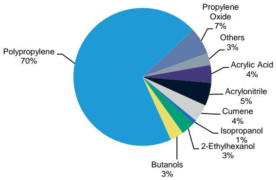

pie

| Category | Percentage (%) |
| :--- | :--- |
| Polypropylene | 70 |
| Butanols | 3 |
| 2-Ethylhexanol | 3 |
| Isopropanol | 1 |
| Cumene | 4 |
| Acrylonitrile | 5 |
| Acrylic Acid | 4 |
| Others | 3 |
| Propylene Oxide | 7 |

Source: OPIS, Bernstein analysis

EXHIBIT 9: Polyethylene uses vary by grade (part 1: high density)   
Global Uses of High Density Polyethylene   
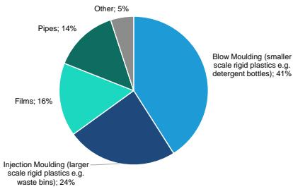

pie

| Category | Percentage (%) |
| :--- | :--- |
| Blow Moulding (smaller scale rigid plastics e.g. detergent bottles) | 41 |
| Injection Moulding (larger scale rigid plastics e.g. waste bins) | 24 |
| Films | 16 |
| Pipes | 14 |
| Other | 5 |

Source: The Essential Chemical Industry, Bernstein analysis

EXHIBIT 10: Polyethylene uses vary by grade (part 2: low density)   
Global Uses of Low Density Polyethylene   
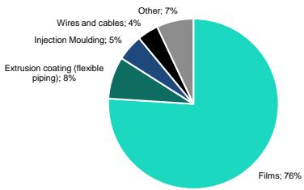

pie

| Category | Percentage (%) |
| :--- | :--- |
| Films | 76 |
| Extrusion coating (flexible piping) | 8 |
| Injection Moulding | 5 |
| Wires and cables | 4 |
| Other | 7 |

Source: The Essential Chemical Industry, Bernstein analysis

EXHIBIT 11: Polypropylene end uses are varied   
Polypropylene End Use by Application   
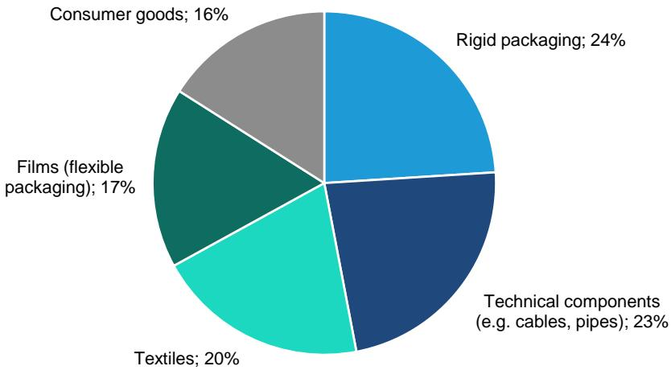

pie

| Category | Percentage (%) |
| :--- | :--- |
| Rigid packaging | 24 |
| Technical components (e.g. cables, pipes) | 23 |
| Textiles | 20 |
| Films (flexible packaging) | 17 |
| Consumer goods | 16 |

Source: ICIS, Bernstein analysis

Historically, polyolefin production has grown steadily, and is not correlated with GDP growth rates. Over the past 30 years, both global GDP and polyolefin production have increased steadily. However, we see no strong correlation between polyolefin production growth and GDP growth. We believe this is because one of the major drivers of GDP growth throughout our data set (1990-2024) has been the rise of the Asian, and especially Chinese, middle class, creating hundreds of millions more plastic consumers, with other parts of GDP composition providing more variance. This has meant that consumption downturns have been rare: our data set only shows a downturn in consumption in 2007-09 across the major polyolefins (Exhibit 12 - Exhibit 15).

EXHIBIT 12: Polypropylene production grows steadily over time ...   
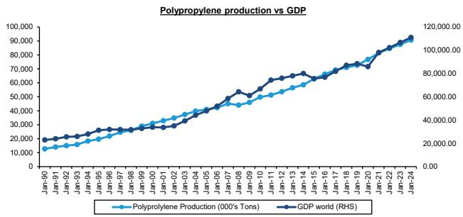

line

| Year | Polypropylene Production (000's Tons) | GDP world (RHS) |
|------|----------------------------------------|-----------------|
| Jan-90 | 15,000 | 20,000.00 |
| Jan-91 | 16,000 | 21,000.00 |
| Jan-92 | 17,000 | 22,000.00 |
| Jan-93 | 18,000 | 23,000.00 |
| Jan-94 | 19,000 | 24,000.00 |
| Jan-95 | 20,000 | 25,000.00 |
| Jan-96 | 21,000 | 26,000.00 |
| Jan-97 | 22,000 | 27,000.00 |
| Jan-98 | 23,000 | 28,000.00 |
| Jan-99 | 24,000 | 29,000.00 |
| Jan-00 | 25,000 | 30,000.00 |
| Jan-01 | 26,000 | 31,000.00 |
| Jan-02 | 27,000 | 32,000.00 |
| Jan-03 | 28,000 | 33,000.00 |
| Jan-04 | 29,000 | 34,000.00 |
| Jan-05 | 30,000 | 35,000.00 |
| Jan-06 | 31,000 | 36,000.00 |
| Jan-07 | 32,000 | 37,000.00 |
| Jan-08 | 33,000 | 38,000.00 |
| Jan-09 | 34,000 | 39,000.00 |
| Jan-10 | 35,000 | 40,000.00 |
| Jan-11 | 36,000 | 41,000.00 |
| Jan-12 | 37,000 | 42,000.00 |
| Jan-13 | 38,000 | 43,000.00 |
| Jan-14 | 39,000 | 44,000.00 |
| Jan-15 | 40,000 | 45,000.00 |
| Jan-16 | 41,000 | 46,000.00 |
| Jan-17 | 42,000 | 47,000.00 |
| Jan-18 | 43,000 | 48,000.00 |
| Jan-19 | 44,000 | 49,000.00 |
| Jan-21 | 45,566 | 55,566.66 |
| Jan-22 | 47,566 | 65,566.66 |
| Jan-23 | 49,566 | 75,566.66 |
| Jan-24 | 51,566 | 85,566.66 |

Source: Bloomberg, Bernstein analysis and estimates

EXHIBIT 13: ... with no strong correlation with GDP growth rates.   
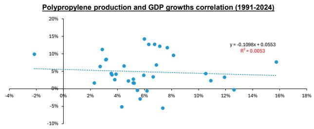

scatter

| x    | y     |
| ---- | ----- |
| 16%  | 7%    |
| 12%  | 3%    |
| 10%  | 5%    |
| 8%   | 10%   |
| 6%   | 15%   |
| 4%   | 5%    |
| 2%   | 10%   |
| -2%  | 10%   |

Source: Bloomberg, Bernstein analysis and estimates

EXHIBIT 14: The same applies for polyethylene (1/2)   
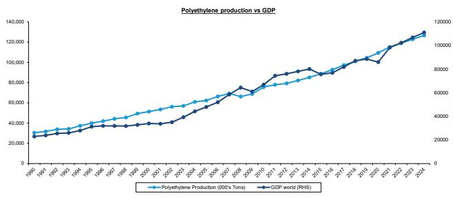  
Source: Bloomberg, Bernstein analysis and estimates

EXHIBIT 15: The same applies for polyethylene (2/2)   
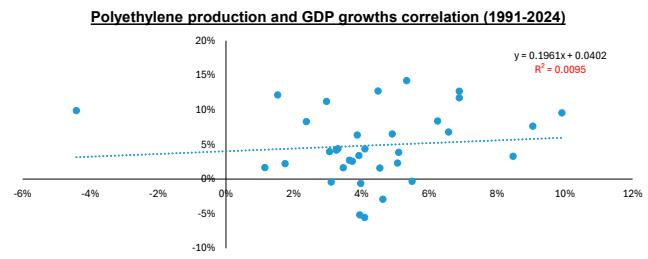

scatter

| x    | y     |
| ---- | ----- |
| -4%  | 10%   |
| 1%   | 5%    |
| 2%   | 10%   |
| 3%   | 5%    |
| 4%   | 10%   |
| 5%   | 5%    |
| 6%   | 10%   |
| 7%   | 5%    |
| 8%   | 10%   |
| 9%   | 5%    |
| 10%  | 10%   |
| 11%  | 5%    |
| 12%  | 10%   |

Source: Bloomberg, Bernstein analysis and estimates

Polyolefins demand appears relatively inelastic. Exhibit 16 to Exhibit 19 show that despite price declines or increases, consumption kept increasing steadily in the past 10 years. We believe this resilience reflects the fact that polyolefins are used in defensive, non-discretionary applications such as food packaging, and broader consumer goods. These end-markets are driven more by population growth, urbanisation, and basic consumption needs than by short-term price fluctuations, making demand structurally stable across economic cycles.

EXHIBIT 16: Despite price volatility, polypropylene consumption continue to grow steadily over time...   
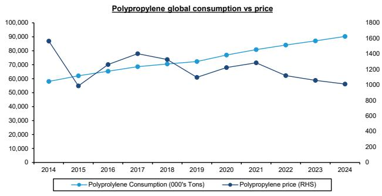

line

| Year | Polypropylene Consumption (000's Tons) | Polypropylene price (RHS) |
|------|----------------------------------------|---------------------------|
| 2014 | 58,000                                 | 1600                      |
| 2015 | 62,000                                 | 1000                      |
| 2016 | 65,000                                 | 1200                      |
| 2017 | 68,000                                 | 1400                      |
| 2018 | 70,000                                 | 1300                      |
| 2019 | 72,000                                 | 1100                      |
| 2020 | 75,000                                 | 1200                      |
| 2021 | 78,000                                 | 1300                      |
| 2022 | 82,000                                 | 1100                      |
| 2023 | 85,000                                 | 1000                      |
| 2024 | 88,000                                 | 950                       |

Source: Bloomberg, Bernstein analysis and estimates

EXHIBIT 17: ... so there's no strong correlation between consumption and price   
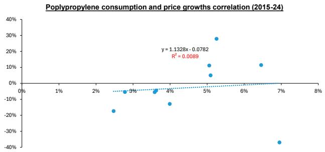

scatter

| x    | y     |
| ---- | ----- |
| 9%   | -15%  |
| 4%   | -5%   |
| 5%   | 10%   |
| 5%   | 25%   |
| 6.5% | 10%   |
| 7%   | -40%  |

Source: Bloomberg, Bernstein analysis and estimates

EXHIBIT 18: The same applies to polyethylene (1/2)   
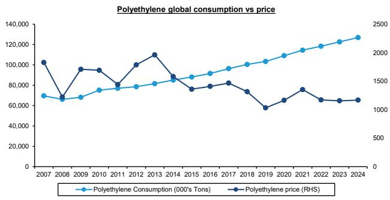

line

| Year | Polyethylene Consumption (000's Tons) | Polyethylene price (RHS) |
|------|--------------------------------------|--------------------------|
| 2007 | 70,000                               | 100,000                  |
| 2008 | 65,000                               | 70,000                   |
| 2009 | 68,000                               | 95,000                   |
| 2010 | 75,000                               | 95,000                   |
| 2011 | 78,000                               | 80,000                   |
| 2012 | 80,000                               | 100,000                  |
| 2013 | 82,000                               | 110,000                  |
| 2014 | 85,000                               | 90,000                   |
| 2015 | 88,000                               | 75,000                   |
| 2016 | 92,000                               | 80,000                   |
| 2017 | 95,000                               | 85,000                   |
| 2018 | 100,000                              | 75,000                   |
| 2019 | 105,000                              | 60,000                   |
| 2020 | 110,000                              | 65,000                   |
| 2021 | 115,000                              | 75,000                   |
| 2022 | 120,000                              | 65,000                   |
| 2023 | 125,000                              | 65,000                   |
| 2024 | 130,000                              | 65,000                   |

Source: Bloomberg, Bernstein analysis and estimates

EXHIBIT 19: The same applies to polyethylene (2/2)   
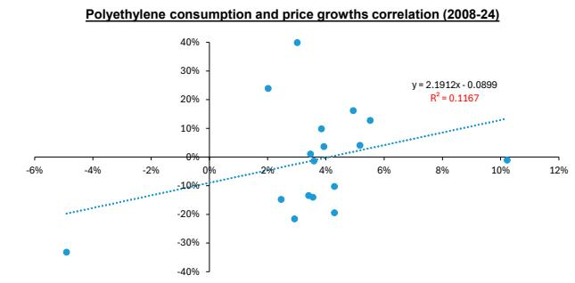

scatter

| x    | y     |
| ---- | ----- |
| -5%  | -35%  |
| -2%  | 25%   |
| 0%   | 40%   |
| 2%   | -10%  |
| 4%   | 10%   |
| 6%   | 15%   |
| 8%   | 5%    |
| 10%  | 0%    |
| 12%  | -5%   |

Source: Bloomberg, Bernstein analysis and estimates

But what if demand is as bad as 2008? So far it seems demand for key petrochemicals is very resilient, subject to major Global Financial Crisis-level shocks. But it would be remiss if we didn't cover the possibility of a major economic downturn. And for petrochemical demand specifically, we think Asia could be an area where the market could be underestimating the possibility of a demand crunch. Our analysis finds that major Asian economies have not had to grapple with much inflation over the last two decades, meaning that there is limited statistical correlation between polyolefin production and inflation (Exhibit 20, Exhibit 21). But with Asian inflation likely to accelerate, an extended crisis could considerably damage middle-class demand in key regions, and break the previous resilience.

EXHIBIT 20: Major Asian economies have dealt with little inflation in the last 20 years   
Inflation in major Asian economies vs Asian polyolefins consumption growth   
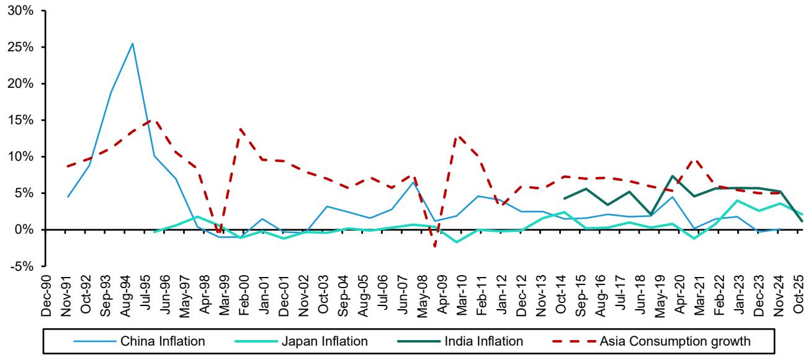

line

| Month    | China Inflation | Japan Inflation | India Inflation | Asia Consumption growth |
|----------|-----------------|-----------------|-----------------|--------------------------|
| Dec-90   | 4.5%            | -               | -               | 8.5%                     |
| Nov-91   | 6.0%            | -               | -               | 9.0%                     |
| Oct-92   | 8.0%            | -               | -               | 10.0%                    |
| Sep-93   | 18.0%           | -               | -               | 12.0%                    |
| Aug-94   | 25.0%           | -               | -               | 14.0%                    |
| Jul-95   | 10.0%           | -               | -               | 15.0%                    |
| Jun-96   | 7.0%            | -               | -               | 12.0%                    |
| May-97   | 2.0%            | 1.5%            | -               | 8.0%                     |
| Apr-98   | -1.0%           | 0.5%            | -               | 0.0%                     |
| Mar-99   | -2.0%           | -1.0%           | -               | 13.0%                    |
| Feb-00   | 1.5%            | -1.5%           | -               | 10.0%                    |
| Jan-01   | 1.0%            | -2.0%           | -               | 9.0%                     |
| Dec-01   | -1.0%           | -1.5%           | -               | 8.5%                     |
| Nov-02   | -1.5%           | -1.0%           | -               | 7.5%                     |
| Oct-03   | 3.0%            | -1.5%           | -               | 6.5%                     |
| Sep-04   | 2.5%            | -1.0%           | -               | 5.5%                     |
| Aug-05   | 1.5%            | -0.5%           | -               | 6.0%                     |
| Jul-06   | 2.5%            | 0.0%            | -               | 5.5%                     |
| Jun-07   | 6.5%            | 0.5%            | -               | 7.0%                     |
| May-08   | 1.0%            | 0.0%            | -               | -2.0%                    |
| Apr-09   | 1.5%            | -2.0%           | -               | 12.5%                    |
| Mar-10   | 4.5%            | -1.5%           | -               | 4.0%                     |
| Feb-11   | 4.0%            | -1.0%           | -               | 3.5%                     |
| Jan-12   | 3.5%            | -1.5%           | -               | 4.5%                     |
| Dec-12   | 2.5%            | -1.0%           | -               | 5.5%                     |
| Nov-13   | 2.0%            | 1.5%            | -               | 6.5%                     |
| Oct-14   | 1.5%            | 2.5%            | 4.5%            | 7.0%                     |
| Sep-15   | 1.0%            | 1.5%            | 5.5%            | 7.5%                     |
| Aug-16   | 2.0%            | 1.0%            | 3.5%            | 7.0%                     |
| Jul-17   | 1.5%            | 1.5%            | 4.5%            | 6.5%                     |
| Jun-18   | 1.0%            | 1.0%            | 2.0%            | 6.0%                     |
| May-19   | 4.5%            | 1.5%            | 7.5%            | 6.5%                     |
| Apr-20   | 2.0%            | -2.0%           | 4.5%            | 9.5%                     |
| Mar-21   | -1.0%           | -1.5%           | 5.5%            | 6.0%                     |
| Feb-22   | 1.5%            | 3.5%            | 6.0%            | 6.5%                     |
| Jan-23   | 2.0%            | 2.5%            | 6.5%            | 6.0%                     |
| Dec-23   | -1.0%           | 3.0%            | 6.0%            | 5.5%                     |
| Nov-24   | -1.5%           | 3.5%            | 6.5%            | 5.0%                     |
| Oct-25   | -2.0%           | 2.0%            | 4.0%            | 4.5%                     |

Source: Bloomberg, Bernstein analysis and estimates

EXHIBIT 21: Inflation therefore has little impact on polyolefin consumption growth rates   
Inflation in major Asian economies vs Asian polyolefins consumption growth correlation   
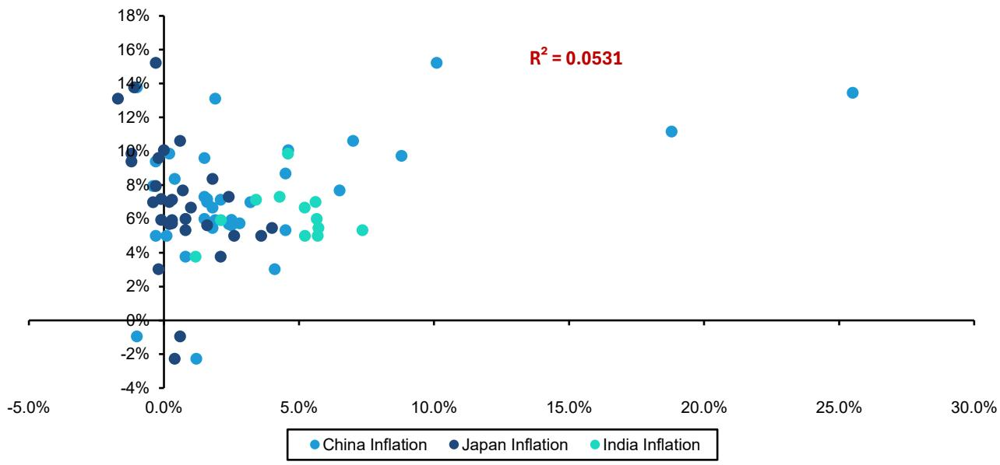

scatter

| Country       | Inflation Rate |
| ------------- | -------------- |
| China         | 10.0%          |
| China         | 25.0%          |
| Japan         | -2.0%          |
| Japan         | 0.0%           |
| Japan         | 1.0%           |
| Japan         | 2.0%           |
| Japan         | 3.0%           |
| Japan         | 4.0%           |
| Japan         | 5.0%           |
| Japan         | 6.0%           |
| Japan         | 7.0%           |
| Japan         | 8.0%           |
| Japan         | 9.0%           |
| Japan         | 10.0%          |
| Japan         | 11.0%          |
| Japan         | 12.0%          |
| Japan         | 13.0%          |
| Japan         | 14.0%          |
| Japan         | 15.0%          |
| Japan         | 16.0%          |
| Japan         | 17.0%          |
| Japan         | 18.0%          |
| Japan         | 19.0%          |
| Japan         | 20.0%          |
| Japan         | 21.0%          |
| Japan         | 22.0%          |
| Japan         | 23.0%          |
| Japan         | 24.0%          |
| Japan         | 25.0%          |
| Japan         | 26.0%          |
| Japan         | 27.0%          |
| Japan         | 28.0%          |
| Japan         | 29.0%          |
| Japan         | 30.0%          |
| India         | -2.0%          |
| India         | -1.0%          |
| India         | 0.0%           |
| India         | 1.0%           |
| India         | 2.0%           |
| India         | 3.0%           |
| India         | 4.0%           |
| India         | 5.0%           |
| India         | 6.0%           |
| India         | 7.0%           |
| India         | 8.0%           |
| India         | 9.0%           |
| India         | 10.0%          |
| India         | 11.0%          |
| India         | 12.0%          |
| India         | 13.0%          |
| India         | 14.0%          |
| India         | 15.0%          |
| India         | 16.0%          |
| India         | 17.0%          |
| India         | 18.0%          |
| India         | 19.0%          |
| India         | 20.0%          |
| India         | 21.0%          |
| India         | 22.0%          |
| India         | 23.0%          |
| India         | 24.0%          |
| India         | 25.0%          |
| India         | 26.0%          |
| India         | 27.0%          |
| India         | 28.0%          |
| India         | 29.0%          |
| India         | 30.0%          |

Source: Bloomberg, Bernstein analysis and estimates

# THE LASTING IMPACT ON SUPPLY: WE EXPECT A FEW PLANTS TO REMAIN CLOSED

Power and feedstock challenges have led to considerable amounts of Asian capacity declaring force majeure, and profits elsewhere. The combination of the Strait of Hormuz being closed and Qatar declaring force majeure has affected Asia the most (Exhibit 22, Exhibit 23). This has led to a long list of Asian chemicals plants declaring force majeure, particularly compared to other regions (Exhibit 24 to Exhibit 27), and many others also running with reduced output that are not captured by our data. In particular, with Asian operating rates significantly reduced - we estimate by close to 20 percentage points given outages in some countries (Exhibit 28) - upstream producers globally who have previously been struggling with overcapacity have benefitted from scarcity value and very strong pricing. Especially in North America, where gas-based production costs have changed little, much of this pricing is leading to increased profitability.

EXHIBIT 22: Qatar LNG exports mainly go to Asia   
Qatar LNG exports by region   
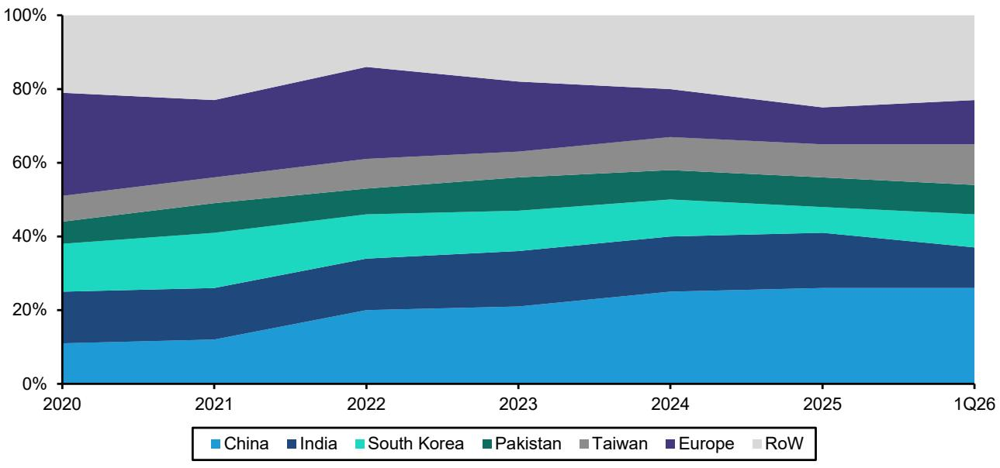

bar_stacked

| Year   | China | India | South Korea | Pakistan | Taiwan | Europe | RoW |
|--------|-------|-------|-------------|----------|--------|--------|-----|
| 2020   | 10%   | 15%   | 10%         | 5%       | 5%     | 30%    | 10% |
| 2021   | 10%   | 15%   | 15%         | 5%       | 5%     | 25%    | 10% |
| 2022   | 20%   | 15%   | 15%         | 5%       | 5%     | 30%    | 10% |
| 2023   | 20%   | 15%   | 15%         | 5%       | 5%     | 25%    | 10% |
| 2024   | 25%   | 15%   | 15%         | 5%       | 5%     | 20%    | 10% |
| 2025   | 25%   | 15%   | 15%         | 5%       | 5%     | 15%    | 10% |
| 1Q26   | 25%   | 10%   | 10%         | 5%       | 5%     | 15%    | 10% |

Source: ICIS, Bernstein analysis

EXHIBIT 23: The US represents 65% of European LNG imports   
European LNG imports by region   
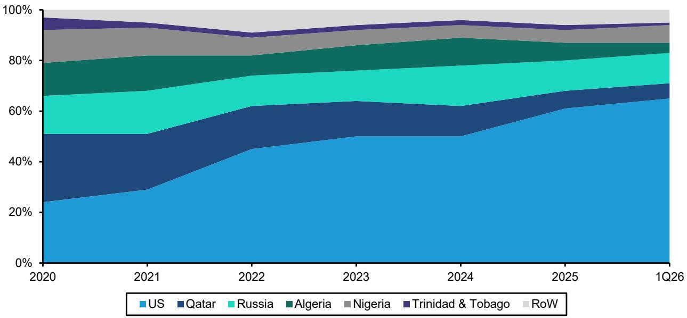

bar_stacked

| Year   | US   | Qatar | Russia | Algeria | Nigeria | Trinidad & Tobago | RoW  |
|--------|------|-------|--------|---------|---------|-------------------|------|
| 2020   | 24%  | 23%   | 12%    | 10%     | 15%     | 5%                | 5%   |
| 2021   | 28%  | 18%   | 13%    | 10%     | 10%     | 5%                | 5%   |
| 2022   | 45%  | 15%   | 10%    | 8%      | 8%      | 5%                | 5%   |
| 2023   | 50%  | 15%   | 12%    | 10%     | 8%      | 5%                | 5%   |
| 2024   | 50%  | 15%   | 15%    | 10%     | 8%      | 5%                | 5%   |
| 2025   | 60%  | 10%   | 10%    | 8%      | 8%      | 5%                | 5%   |
| 1Q26   | 65%  | 5%    | 5%     | 5%      | 5%      | 5%                | 5%   |

Source: ICIS, Bernstein analysis

EXHIBIT 24: Most of the sites that declared force majeure are located in the Middle East and in Asia   
Sites that declared force majeure by country   
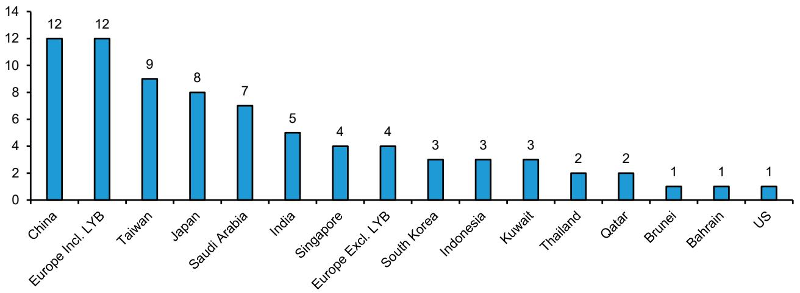

bar

| Country/Region | Value |
| :--- | :--- |
| China | 12 |
| Europe Incl. LYB | 12 |
| Taiwan | 9 |
| Japan | 8 |
| Saudi Arabia | 7 |
| India | 5 |
| Singapore | 4 |
| Europe Excl. LYB | 4 |
| South Korea | 3 |
| Indonesia | 3 |
| Kuwait | 3 |
| Thailand | 2 |
| Qatar | 2 |
| Brunei | 1 |
| Bahrain | 1 |
| US | 1 |

FM: 1 March - 30 April.   
\*We understand LyondellBasell's (LYB) European plants are currently running after previously declaring FM, so show Europe including and excluding LYB Source: ICIS, Bernstein analysis

EXHIBIT 25: Sites that announced force majeure in Asia and the Middle East 

<table><tr><td>Force Majeure date</td><td>Company</td><td>Region/Country</td><td>Sites</td><td>Major products</td></tr><tr><td>28 April</td><td>Thai Paraxylene</td><td>Thailand</td><td>Sriracha</td><td>Paraxylene (PX), benzene, toluene, xylene isomer, and mixed xylenes isomer grade (MX)</td></tr><tr><td>28 April</td><td>Hengyi</td><td>Brunei</td><td>Pulau Muara Besar</td><td>Paraxylene</td></tr><tr><td>21 April</td><td>Saudi Polyolefins (SPC)</td><td>Saudi Arabia</td><td>Al Jubail</td><td>HDPE, LDPE</td></tr><tr><td>21 April</td><td>Saudi Polyolefins (SPC)</td><td>Saudi Arabia</td><td>Al Jubail</td><td>Polypropylene (PP)</td></tr><tr><td>13 April</td><td>Al-Waha Petrochemical Co</td><td>Saudi Arabia</td><td>Al Jubail</td><td>Polypropylene (PP)</td></tr><tr><td>13 April</td><td>Hanwha TotalEnergies Petrochemical</td><td>South Korea</td><td>Daesan</td><td>Paraxylene</td></tr><tr><td>26 March</td><td>SABIC</td><td>Saudi Arabia</td><td>Ar Razi, Ibn Sina</td><td>Methanol</td></tr><tr><td>26 March</td><td>Petrokemya</td><td>Saudi Arabia</td><td>Al Jubail</td><td>Styrene monomer, ethanolamines</td></tr><tr><td>24 March</td><td>China Petrochemical Development Corporation (CPDC)</td><td>Taiwan</td><td>Kaohsiung, Miaoli</td><td>Caprolactam (capro), polyamide 6 (PA6) capacities</td></tr><tr><td>24 March</td><td>Formosa Chemicals &amp; Fibre Corp (FCFC)</td><td>Taiwan</td><td>Mailiao, Xingang, Dongshan</td><td>Styrene monomer, phenol, plastics, purified terephthalic acid (PTA)</td></tr><tr><td>17 March</td><td>SHARQ</td><td>Saudi Arabia</td><td>Al Jubail</td><td>Monoethylene glycol (MEG)</td></tr><tr><td>16 March</td><td>Alkyl Amines Chemicals</td><td>India</td><td>Patalganga, Kurkumbh, Dahej</td><td>Methylamines, ethylamines and their derivatives</td></tr><tr><td>16 March</td><td>Dairen Chemical</td><td>Taiwan</td><td>Kaohsiung, Mai Liao</td><td>Vinyl acetate monomer (VAM)</td></tr><tr><td>13 March</td><td>Sanfame Group</td><td>China</td><td>Jiangyin</td><td>Polyethylene terephthalate (PET)</td></tr><tr><td>13 March</td><td>Idemitsu Kosan</td><td>Japan</td><td>Chiba, Chita, Tokuyama</td><td>Paraxylene</td></tr><tr><td>12 March</td><td>Petro-Oxo Nusantara (PON)</td><td>Indonesia</td><td>Gresik</td><td>Oxo-alcohols</td></tr><tr><td>12 March</td><td>Tosoh Chemical Industries</td><td>China</td><td>Guangzhou</td><td>Polyvinyl chloride (PVC)</td></tr><tr><td>12 March</td><td>EQUATE</td><td>Kuwait</td><td>Shuaiba</td><td>Ethylene glycol</td></tr><tr><td>11 March</td><td>Tianjin Bohua Chemical Development</td><td>China</td><td>Dagang, Tanggu</td><td>Caustic soda, ethylene dichloride (EDC), vinyl chloride monomer (VCM), polyvinyl chloride (PVC)</td></tr><tr><td>11 March</td><td>China Resources Chemical Innovative Materials Holdings (CRC)</td><td>China</td><td>Zhuhai, Changzhou, Jiangyin</td><td>Polyethylene terephthalate (PET)</td></tr><tr><td>10 March</td><td>Shandong Longhua</td><td>China</td><td>Zibo (Shandong)</td><td>Polyether polyols</td></tr><tr><td>10 March</td><td>Tangshan Zhonghao</td><td>China</td><td>Tangshan</td><td>Adipic acid (ADA)</td></tr><tr><td>10 March</td><td>Formosa Plastics Corp (FPC)</td><td>Taiwan</td><td>Kaohsiung, Mai Liao, Lin Yuan, Jen-Wu</td><td>HDPE, LDPE, LLDPE, PP, PVC, EDC, VCM, Caustic soda</td></tr><tr><td>10 March</td><td>Tianjin LG Bohai</td><td>China</td><td>Tianjin, Dagu</td><td>Caustic soda, ethylene dichloride (EDC), vinyl chloride monomer (VCM), polyvinyl chloride (PVC)</td></tr><tr><td>9 March</td><td>Sadara Chemical Co</td><td>Saudi Arabia</td><td>Al Jubail</td><td>Glycol ethers</td></tr><tr><td>9 March</td><td>Sadara Chemical Co</td><td>Saudi Arabia</td><td>Al Jubail</td><td>Ethanolamines</td></tr><tr><td>9 March</td><td>Sulfindo Adiusaha</td><td>Indonesia</td><td>Bojonegara</td><td>Caustic soda, ethylene dichloride (EDC), vinyl chloride monomer (VCM), polyvinyl chloride (PVC)</td></tr><tr><td>9 March</td><td>Yisheng Petrochemical</td><td>China</td><td>Yangpu, Dalian</td><td>Polyethylene terephthalate (PET)</td></tr><tr><td>9 March</td><td>China Petrochemical Development Corp (CPDC)</td><td>Taiwan</td><td>Kaohsiung</td><td>Acrylonitrile</td></tr><tr><td>9 March</td><td>ENEOS Corp</td><td>Japan</td><td>Kawasaki, Mizushima, Oita, Sakai, Sendai</td><td>Paraxylene</td></tr><tr><td>9 March</td><td>Formosa Petrochemical Corp (FPCC)</td><td>Taiwan</td><td>Mai Liao</td><td>Olefins</td></tr><tr><td>9 March</td><td>Bahrain Petroleum Company (BAPCO)</td><td>Bahrain</td><td>Sitra</td><td>Group III base oil</td></tr><tr><td>9 March</td><td>The Polyolefin Co (Singapore)</td><td>Singapore</td><td>Jurong Island</td><td>Polypropylene, LDPE, EVA</td></tr><tr><td>8 March</td><td>Kuwait Styrene Company (TKSC)</td><td>Kuwait</td><td>Shuaiba</td><td>Styrene monomer</td></tr><tr><td>7 March</td><td>SAJ Industries</td><td>India</td><td>Surat (Gujarat)</td><td>Polyethylene terephthalate (PET) resins, polyester chips, biaxially oriented polyethylene terephthalate (BOPET) film</td></tr><tr><td>7 March</td><td>Deepak Phenolics</td><td>India</td><td>Dahej</td><td>Phenol, acetone</td></tr><tr><td>7 March</td><td>Wanhua Chemical Group</td><td>China</td><td>Yantai, Fuqing, Penglai</td><td>Ethylene, propylene, MDI, caustic soda, methanol, styrene monomer</td></tr><tr><td>6 March</td><td>Qatar Fertilizer Company (QAFCO)</td><td>Qatar</td><td>Mesaieed</td><td>Melamine</td></tr><tr><td>6 March</td><td>Rayong Olefins (Part of Siam Cement Group)</td><td>Thailand</td><td>Map Ta Phut</td><td>Ethylene, propylene</td></tr><tr><td>6 March</td><td>Hanwha Solutions</td><td>South Korea</td><td>Yeosu</td><td>Ethylene dichloride, caustic soda</td></tr><tr><td>6 March</td><td>Dairen Chemical Singapore</td><td>Singapore</td><td>Jurong Island</td><td>Vinyl acetate monomer</td></tr><tr><td>6 March</td><td>Aster Chemicals and Energy</td><td>Singapore</td><td>Bukom Island, Jurong Island</td><td>Ethylene, propylene, ethylbenzene, ethylene glycol, polyether polyols, propylene, propylene glycols, styrene, surfactants</td></tr><tr><td>5 March</td><td>PCS</td><td>Singapore</td><td>Jurong Island</td><td>Ethylene, benzene, butadiene, mixed xylenes, MTBE, propylene, toluene</td></tr><tr><td>4 March</td><td>Kuwait Aromatics</td><td>Kuwait</td><td>Shuaiba</td><td>Paraxylene</td></tr><tr><td>4 March</td><td>Yeochun NCC Co (YNCC)</td><td>South Korea</td><td>Yeosu</td><td>Ethylene, benzene, butadiene, mixed xylenes, MTBE, propylene, styrene, toluene</td></tr><tr><td>4 March</td><td>Chandra Asri</td><td>Indonesia</td><td>Cilegon</td><td>Ethylene, propylene, LLDPE, HDPE, PP</td></tr><tr><td>4 March</td><td>QatarEnergy Group</td><td>Qatar</td><td>Mesaieed</td><td>Urea, polymers, methanol</td></tr></table>

Until 30 $^{th}$ of April 2026   
Source: ICIS, Bernstein analysis

EXHIBIT 26: Sites that announced force majeure in Europe 

<table><tr><td>Force Majeure date</td><td>Company</td><td>Region/Country</td><td>Sites</td><td>Major products</td></tr><tr><td>8 April</td><td>MOL Petrochemicals</td><td>Europe</td><td>Tiszaujvaros, Hungary</td><td>HDPE, LDPE, PP</td></tr><tr><td>8 April</td><td>Sasol</td><td>Europe</td><td>Augusta, Italy</td><td>Linear alkyl benzene</td></tr><tr><td>11 March</td><td>Indorama</td><td>Europe</td><td>Full region</td><td>PET</td></tr><tr><td>10 March</td><td>LyondellBasell</td><td>Europe</td><td>Frankfurt, Munchmunster, Wesseling, Berre, Knapsack, Brindisi, Ferrara, Moerdijk, Tarragona, Carrington</td><td>HDPE, LDPE, LLDPE, PP</td></tr></table>

Until 30 $^{th}$ of April 2026

Source: ICIS, Bernstein analysis

EXHIBIT 27: Sites that announced force majeure in the Americas 

<table><tr><td>Force Majeure date</td><td>Company</td><td>Region/Country</td><td>Sites</td><td>Major products</td></tr><tr><td>10 March</td><td>Dow</td><td>US</td><td>Deer Park Texas</td><td>GMAA, MMA</td></tr></table>

Until 30 $^{th}$ of April 2026

Source: ICIS, Bernstein analysis

EXHIBIT 28: Operating rates in Asia are understood to be falling   
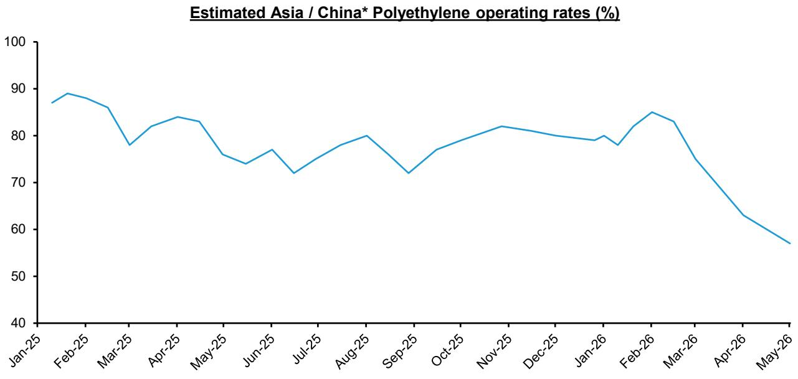

line

| Month   | Estimated Asia / China* Polyethylene operating rates (%) |
| ------- | ------------------------------------------------------ |
| Jan-25  | 87.0                                                   |
| Feb-25  | 89.0                                                   |
| Mar-25  | 86.0                                                   |
| Apr-25  | 83.0                                                   |
| May-25  | 82.0                                                   |
| Jun-25  | 74.0                                                   |
| Jul-25  | 77.0                                                   |
| Aug-25  | 80.0                                                   |
| Sep-25  | 72.0                                                   |
| Oct-25  | 77.0                                                   |
| Nov-25  | 82.0                                                   |
| Dec-25  | 81.0                                                   |
| Jan-26  | 79.0                                                   |
| Feb-26  | 85.0                                                   |
| Mar-26  | 83.0                                                   |
| Apr-26  | 63.0                                                   |
| May-26  | 57.0                                                   |

\* We use China polyethylene operating rates until Feb 26 and Asia crackers operating rates from Mar 26 onwards  
Source: Plasmatch, ICIS, Bernstein analysis and estimates

We think much of the closed Asian capacity will come back online once the crisis is resolved. The story of polyolefin capacity additions over the last 25 years has been one of increasing Asian self-sufficiency, and of the Middle East expanding their presence in order to diversify away from an oil-based economy (see MENA Energy: Chaos is a Ladder ... Initiating with a Positive Stance and Exhibit 29, Exhibit 30). Before the conflict started, this trend was expected to continue in key polyolefins (Exhibit 31 and Exhibit 32), despite Chinese anti-involution programmes and South Korean capacity cuts. We believed anti-involution progress would be slow (see report Chemicals Outlook 2026: A slow start, but there could be considerable upside potential. Downgrading Solvay to Market-Perform.), but if there was ever a time to accelerate the process, it would be now. However, we still believe that much of the reduced and force majeure capacity will come back for the following 4 reasons:

1. The feedstock advantage of the Middle East is undimmed. When the Strait reopens, the Middle East will likely remain the cheapest place in the world to make chemicals. Especially in the UAE, where natural gas is sold at very favourable prices. Volumes may ramp slowly as geopolitical risk encourages dual sourcing, or even legislation in some parts of the world. But we believe that as the memory of the crisis fades, price will again be the principal consideration behind buyer decisions, positioning the Middle East well.

2. China may slow the speed of anti-involution. We already expected anti-involution would be slow progress, perhaps following a one-in-one-out system. But the conflict has arguably provided a reminder of the resilience that strategic oil reserves can provide, and the need to be self-sufficient if there are broader conflicts. China has the most petrochemical plants that have declared force majeure - they may decide that they would prefer to have more output available during these times.   
3. For many countries with affected capacity in Exhibit 24, chemicals is a nationally strategic industry. Excluding Europe - as we believe the LyondellBasell force majeures were perhaps more of a pricing tool given we understand those plants are currently running - we expect many of the subsequent countries / regions in our chart are likely to restart their plants as soon as feasibly possible. Given the security backdrop, Taiwan has incentives to stay self-sufficient. We also see Japan and India as unlikely to seek to reduce their petrochemical industry sizes. In the Middle East, we also believe there will be some urgency to start up their chemical plants (MENA Energy: Chaos is a Ladder ... Initiating with a Positive Stance).   
4. We expect capacity additions to continue, particularly in the Middle East, for the aforementioned reasons: chemicals is existential to their economic health.

In mitigation, there will be some plants that have to remain closed because of direct damage to their feedstock suppliers. Particularly for countries relying on Qatari LNG, where the damage may take years to repair, there may be some ongoing supply constraints. Albeit we understand that a small percentage of the trains are starting up again. Furthermore, it seems likely that Iranian capacity has been damaged by the bombing, so may take time to become fully operational.

EXHIBIT 29: Asia is the leading global producer of Polypropylene...   
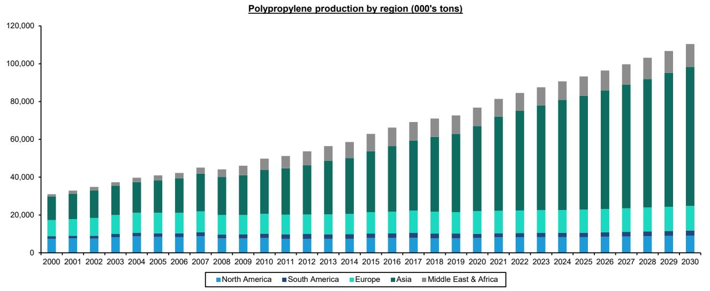  
Source: Bloomberg, Bernstein analysis and estimates

EXHIBIT 30: ... and polyethylene.   
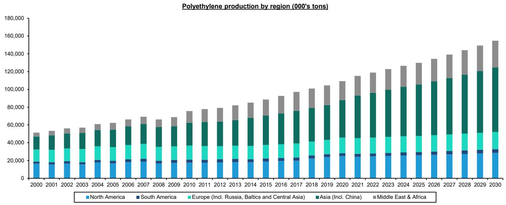  
Source: Bloomberg, Bernstein analysis and estimates

EXHIBIT 31: We see slightly more than 8mt of PE capacity coming online in 2026, stemming from multiple regions   
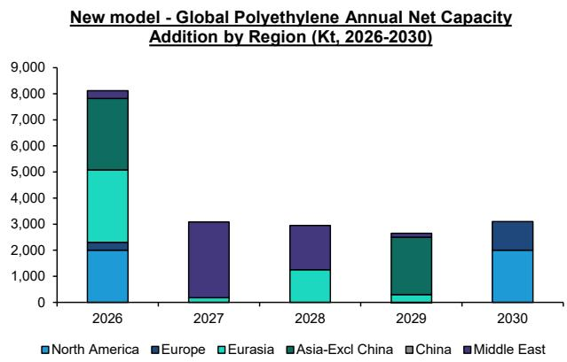

bar_stacked

New model - Global Polyethylene Annual Net Capacity Addition by Region (Kt, 2026-2030)
| Year | North America | Europe | Eurasia | Asia-Excl China | China | Middle East |
| :--- | :--- | :--- | :--- | :--- | :--- | :--- |
| 2026 | 2100 | 200 | 2500 | 2400 | 0 | 300 |
| 2027 | 0 | 0 | 150 | 150 | 0 | 3100 |
| 2028 | 0 | 0 | 1200 | 0 | 0 | 2900 |
| 2029 | 0 | 150 | 300 | 1800 | 150 | 150 |
| 2030 | 2100 | 700 | 0 | 0 | 150 | 150 |

Source: Wood Mackenzie, JLC, Bernstein analysis

EXHIBIT 32: Slightly less than 6mt of polypropylene capacity is expected to come online in 2026 mainly from China, wider Asia and the Middle East   
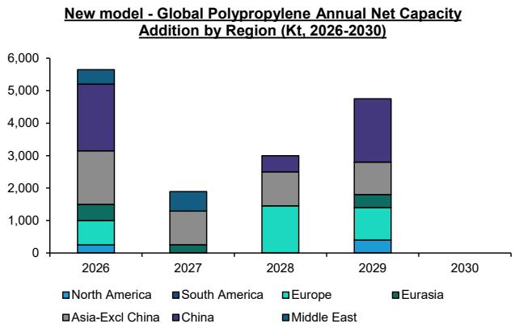

bar_stacked

New model - Global Polypropylene Annual Net Capacity Addition by Region (Kt, 2026-2030)
| Year | North America | South America | Europe | Eurasia | Asia-Excl China | China | Middle East |
| :--- | :--- | :--- | :--- | :--- | :--- | :--- | :--- |
| 2026 | 250 | 100 | 800 | 400 | 1200 | 1800 | 400 |
| 2027 | 0 | 0 | 0 | 300 | 800 | 0 | 400 |
| 2028 | 0 | 0 | 1400 | 0 | 800 | 400 | 0 |
| 2029 | 400 | 0 | 800 | 300 | 800 | 1500 | 0 |
| 2030 | 0 | 0 | 0 | 0 | 0 | 0 | 0 |

Source: Wood Mackenzie, Company websites, Bernstein analysis

# WHAT DOES THIS ALL MEAN? UPDATING OUR PROPRIETARY POLYOLEFIN PRICE FORECAST AND SUPPLY-DEMAND MODEL

In our Borouge initiation, we debuted our proprietary polyolefin supply demand model, which includes a price forecast. For a deep dive into the workings of the model, please see report Borouge: Mid-Metamorphosis. Initiating at Market-Perform. In this section we provide a brief refresher on how it works, and update our long-term view of polyolefin prices for the supply and demand views above. The model is linked below.

# Global Polyolefins Market Model

Our proprietary model uses over 30 years of historical supply and demand data to forecast polyolefin pricing through 2030 using a multivariate regression. Our forecasting method is driven by statistical analysis to analyse historical price trends, and we see three key determinants of polyolefin prices: 1) changes in operating rates (effectively production / demand divided by capacity for each polyolefin); 2) changes in the oil price; and 3) changes in GDP growth. Our model is not perfect, but it predicts the historical direction of prices 84% of the time for polypropylene and 87% of the time for polyethylene over a 30-year history (Exhibit 33 to Exhibit 36). It is also flexible, with scenarios for supply and demand scenarios, allowing you

to review our cases and overlay your own assumptions.

EXHIBIT 33: Our polyethylene model, back-tested, provides useful directional context for price forecasting (1/2)   
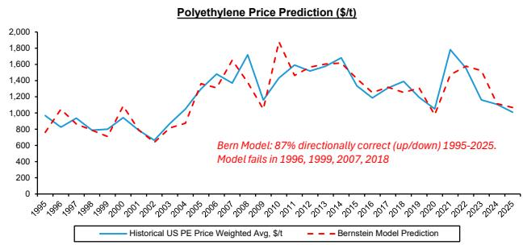

line

| Year | Historical US PE Price Weighted Avg, $/t | Bernstein Model Prediction |
|------|------------------------------------------|-----------------------------|
| 1995 | ~900                                     | ~900                        |
| 1996 | ~800                                     | ~800                        |
| 1997 | ~850                                     | ~850                        |
| 1998 | ~800                                     | ~800                        |
| 1999 | ~750                                     | ~750                        |
| 2000 | ~800                                     | ~800                        |
| 2001 | ~750                                     | ~750                        |
| 2002 | ~700                                     | ~700                        |
| 2003 | ~750                                     | ~750                        |
| 2004 | ~800                                     | ~800                        |
| 2005 | ~900                                     | ~900                        |
| 2006 | ~1,000                                   | ~1,000                      |
| 2007 | ~1,200                                   | ~1,200                      |
| 2008 | ~1,400                                   | ~1,400                      |
| 2009 | ~1,600                                   | ~1,600                      |
| 2010 | ~1,800                                   | ~1,800                      |
| 2011 | ~1,600                                   | ~1,600                      |
| 2012 | ~1,500                                   | ~1,500                      |
| 2013 | ~1,600                                   | ~1,600                      |
| 2014 | ~1,650                                   | ~1,650                      |
| 2015 | ~1,600                                   | ~1,600                      |
| 2016 | ~1,400                                   | ~1,400                      |
| 2017 | ~1,350                                   | ~1,350                      |
| 2018 | ~1,350                                   | ~1,350                      |
| 2019 | ~1,350                                   | ~1,350                      |
| 2020 | ~1,350                                   | ~1,350                      |
| 2021 | ~1,800                                   | ~1,800                      |
| 2022 | ~1,650                                   | ~1,650                      |
| 2023 | ~1,550                                   | ~1,550                      |
| 2024 | ~1,450                                   | ~1,450                      |
| 2025 | ~1,350                                   | ~1,350                      |

Source: Bloomberg, Nexant ChemSystems, Wood Mackenzie, JLC, Bernstein analysis and estimates

EXHIBIT 34: Our polyethylene model, back-tested, provides useful directional context for price forecasting (2/2)   
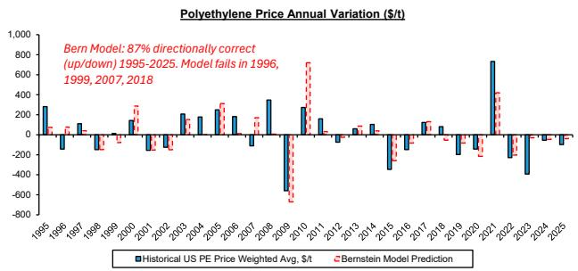

bar

| Year | Historical US PE Price Weighted Avg, $/t | Bernstein Model Prediction |
|------|------------------------------------------|-----------------------------|
| 1995 | ~300                                     | ~0                          |
| 1996 | ~-100                                    | ~0                          |
| 1997 | ~100                                     | ~0                          |
| 1998 | ~-100                                    | ~-100                       |
| 1999 | ~-100                                    | ~-100                       |
| 2000 | ~100                                     | ~200                        |
| 2001 | ~-200                                    | ~-200                       |
| 2002 | ~-100                                    | ~-100                       |
| 2003 | ~200                                     | ~200                        |
| 2004 | ~150                                     | ~150                        |
| 2005 | ~150                                     | ~300                        |
| 2006 | ~150                                     | ~300                        |
| 2007 | ~-100                                    | ~-100                       |
| 2008 | ~350                                     | ~-600                       |
| 2009 | ~-600                                    | ~-700                       |
| 2010 | ~250                                     | ~750                        |
| 2011 | ~150                                     | ~150                        |
| 2012 | ~-100                                    | ~-100                       |
| 2013 | ~-100                                    | ~-100                       |
| 2014 | ~-100                                    | ~-100                       |
| 2015 | ~-400                                    | ~-400                       |
| 2016 | ~-200                                    | ~-200                       |
| 2017 | ~150                                     | ~150                        |
| 2018 | ~-150                                    | ~-150                       |
| 2019 | ~-250                                    | ~-250                       |
| 2020 | ~-250                                    | ~-250                       |
| 2021 | ~750                                     | ~450                        |
| 2022 | ~-350                                    | ~-350                       |
| 2023 | ~-450                                    | ~-450                       |
| 2024 | ~-150                                    | ~-150                       |
| 2025 | ~-150                                    | ~-150                       |

Source: Bloomberg, Nexant ChemSystems, Wood Mackenzie, JLC, Bernstein analysis and estimates

EXHIBIT 35: Our polypropylene model, back-tested, provides useful directional context for price forecasting (1/2)   
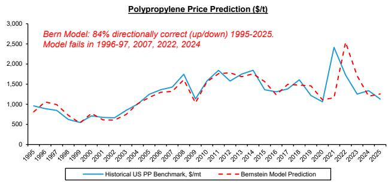

line

| Year | Historical US PP Benchmark, $/mt | Bernstein Model Prediction |
|------|----------------------------------|-----------------------------|
| 1995 | ~1,000                           | ~800                        |
| 1996 | ~1,000                           | ~800                        |
| 1997 | ~800                             | ~800                        |
| 1998 | ~600                             | ~600                        |
| 1999 | ~500                             | ~500                        |
| 2000 | ~600                             | ~600                        |
| 2001 | ~600                             | ~600                        |
| 2002 | ~600                             | ~600                        |
| 2003 | ~700                             | ~700                        |
| 2004 | ~800                             | ~800                        |
| 2005 | ~900                             | ~900                        |
| 2006 | ~1,000                           | ~1,000                      |
| 2007 | ~1,200                           | ~1,200                      |
| 2008 | ~1,400                           | ~1,400                      |
| 2009 | ~1,600                           | ~1,600                      |
| 2010 | ~1,800                           | ~1,800                      |
| 2011 | ~1,700                           | ~1,700                      |
| 2012 | ~1,800                           | ~1,800                      |
| 2013 | ~1,700                           | ~1,700                      |
| 2014 | ~1,800                           | ~1,800                      |
| 2015 | ~1,700                           | ~1,700                      |
| 2016 | ~1,500                           | ~1,500                      |
| 2017 | ~1,400                           | ~1,400                      |
| 2018 | ~1,500                           | ~1,500                      |
| 2019 | ~1,400                           | ~1,400                      |
| 2020 | ~1,200                           | ~1,200                      |
| 2021 | ~1,300                           | ~1,300                      |
| 2022 | ~2,500                           | ~2,500                      |
| 2023 | ~1,500                           | ~1,500                      |
| 2024 | ~1,300                           | ~1,300                      |
| 2025 | ~1,200                           | ~1,200                      |

Source: Bloomberg, Nexant ChemSystems, Wood Mackenzie, JLC, Bernstein analysis and estimates

EXHIBIT 36: Our polypropylene model, back-tested, provides useful directional context for price forecasting (2/2)   
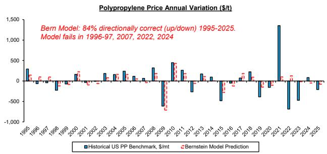

bar

| Year | Historical US PP Benchmark ($/mt) | Bernstein Model Prediction |
|------|----------------------------------|-----------------------------|
| 1995 | ~300                             | ~100                        |
| 1996 | ~0                               | ~0                          |
| 1997 | ~0                               | ~0                          |
| 1998 | ~-200                            | ~-100                       |
| 1999 | ~-100                            | ~-50                        |
| 2000 | ~100                             | ~200                        |
| 2001 | ~0                               | ~-50                        |
| 2002 | ~0                               | ~-50                        |
| 2003 | ~100                             | ~100                        |
| 2004 | ~200                             | ~200                        |
| 2005 | ~200                             | ~200                        |
| 2006 | ~100                             | ~100                        |
| 2007 | ~100                             | ~100                        |
| 2008 | ~300                             | ~300                        |
| 2009 | ~-600                            | ~-500                       |
| 2010 | ~300                             | ~400                        |
| 2011 | ~200                             | ~200                        |
| 2012 | ~-200                            | ~-100                       |
| 2013 | ~100                             | ~100                        |
| 2014 | ~100                             | ~100                        |
| 2015 | ~-400                            | ~-300                       |
| 2016 | ~-50                             | ~-50                        |
| 2017 | ~100                             | ~100                        |
| 2018 | ~200                             | ~200                        |
| 2019 | ~-300                            | ~-300                       |
| 2020 | ~-100                            | ~-100                       |
| 2021 | ~1400                            | ~150                        |
| 2022 | ~-600                            | ~-50                        |
| 2023 | ~-300                            | ~-30                        |
| 2024 | ~10                              | ~10                         |
| 2025 | ~-10                             | ~-10                        |

Source: Bloomberg, Nexant ChemSystems, Wood Mackenzie, JLC, Bernstein analysis and estimates

# 1) CHANGES IN OPERATING RATES

Operating rates matter because they show the balance between supply and demand in each polymer market. When operating rates are above their multi-year average, it generally signals robust demand, as production levels tend to align closely with consumption over time. Although higher operating rates reduce marginal production costs due to better fixed cost absorption, prices typically rise because strong demand outpaces the increased supply. Conversely, when operating rates are historically low, this suggests that polyolefin demand is weak relative to the available production capacity. In this scenario, prices usually fall because the demand shortfall outweighs the cost pressures from higher marginal costs associated with idle capacity and lower production efficiency.

We see no reason to change our overall assumptions from slower-than-historical growth. The pace of polyethylene and polypropylene consumption growth has been slowing since 2020 (Exhibit 37) as a result of weak European growth and lower consumer spending (and greater budgeting) in China. Fundamentally, with packaging and more general consumption such key drivers of demand, we see this slowdown as a consequence of weaker lower-income outcomes, caused by the squeezed consumer, as well as weaker demographics. In the context of renewed inflation, particularly in Asia, we see some new downside risks to the demand forecast. But at this time we're not expecting a full crisis, and our previous analysis indicates that the polyolefins have relatively inelastic volume demand. Therefore, our forecasts of consumption growth rates remain $3.6\%$ for HDPE and LDPE, $3.9\%$ for LLDPE and $3.4\%$ for Polypropylene. As production equals consumption over the long run, these growth rates also apply to production.

Over 2026-27, we increase our expectations of ethylene supply cuts from 8 to 10%, and now also expect some propylene supply cuts (3%). We also expect capacity additions to slow somewhat, given the lack of feedstock and some delays in shipping parts. Therefore, we model c.2,000kt and c.1,000kt less capacity additions in Polyethylene and Polypropylene in 2026 after applying a six months delay to all capacity additions coming from the Middle East and Asia.

EXHIBIT 37: We expect the more muted demand growth rates of the early 2020s to continue   
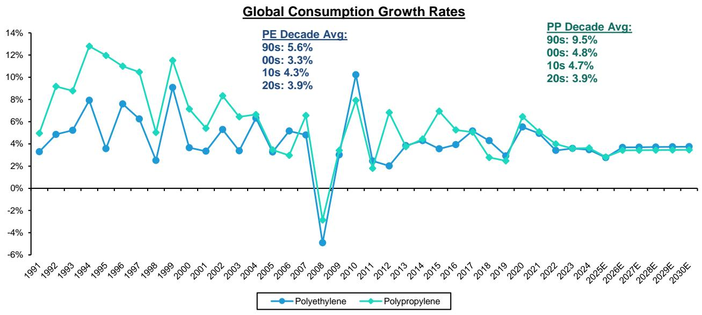

line

| Year | Polyethylene | Polypropylene |
|------|--------------|---------------|
| 1991 | 3.2%         | 5.0%          |
| 1992 | 4.8%         | 9.2%          |
| 1993 | 5.2%         | 8.7%          |
| 1994 | 8.0%         | 12.8%         |
| 1995 | 3.5%         | 12.0%         |
| 1996 | 7.5%         | 11.0%         |
| 1997 | 6.2%         | 10.5%         |
| 1998 | 2.5%         | 5.0%          |
| 1999 | 9.0%         | 11.5%         |
| 2000 | 3.5%         | 7.2%          |
| 2001 | 3.3%         | 5.5%          |
| 2002 | 5.2%         | 8.3%          |
| 2003 | 3.3%         | 6.5%          |
| 2004 | 6.2%         | 6.7%          |
| 2005 | 3.3%         | 3.5%          |
| 2006 | 5.0%         | 3.0%          |
| 2007 | 4.8%         | 6.5%          |
| 2008 | -5.0%        | -3.0%         |
| 2009 | 3.0%         | 3.5%          |
| 2010 | 10.2%        | 8.0%          |
| 2011 | 2.5%         | 1.8%          |
| 2012 | 2.0%         | 6.8%          |
| 2013 | 3.8%         | 3.8%          |
| 2014 | 4.0%         | 4.2%          |
| 2015 | 3.5%         | 7.0%          |
| 2016 | 3.8%         | 5.2%          |
| 2017 | 4.5%         | 5.0%          |
| 2018 | 4.2%         | 2.8%          |
| 2019 | 3.0%         | 2.5%          |
| 2020 | 5.5%         | 6.5%          |
| 2021 | 5.0%         | 5.0%          |
| 2022 | 3.5%         | 4.0%          |
| 2023 | 3.5%         | 3.5%          |
| 2024E| 3.5%         | 3.5%          |
| 2025E| 3.5%         | 3.5%          |
| 2026E| 3.5%         | 3.5%          |
| 2027E| 3.5%         | 3.5%          |
| 2028E| 3.5%         | 3.5%          |
| 2029E| 3.5%         | 3.5%          |
| 2030E| 3.5%         | 3.5%          |

Source: Bloomberg, Nexant ChemSystems, Wood Mackenzie, JLC, Bernstein analysis and estimates

EXHIBIT 38: We now see less PE capacity coming online in 2026 as a result of capacity delays in the Middle East and in Asia... (1/2)   
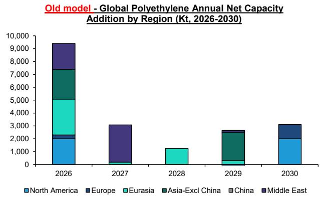

bar_stacked

Old model - Global Polyethylene Annual Net Capacity Addition by Region (Kt, 2026-2030)
| Year | North America | Europe | Eurasia | Asia-Excl China | China | Middle East |
| :--- | :--- | :--- | :--- | :--- | :--- | :--- |
| 2026 | 2100 | 200 | 4500 | 3000 | 0 | 2800 |
| 2027 | 0 | 0 | 300 | 0 | 0 | 3100 |
| 2028 | 0 | 0 | 1300 | 0 | 0 | 0 |
| 2029 | 0 | 300 | 300 | 2500 | 100 | 100 |
| 2030 | 2100 | 1500 | 0 | 0 | 100 | 1100 |

Source: Wood Mackenzie, JLC, Bernstein analysis

EXHIBIT 39: We now see less PE capacity coming online in 2026 as a result of capacity delays in the Middle East and in Asia... (2/2)   
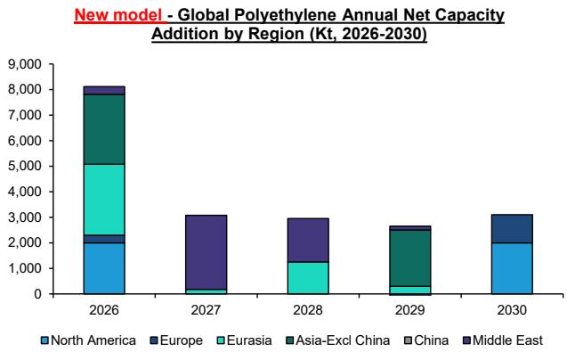

bar_stacked

New model - Global Polyethylene Annual Net Capacity Addition by Region (Kt, 2026-2030)
| Year | North America | Europe | Eurasia | Asia-Excl China | China | Middle East |
| :--- | :--- | :--- | :--- | :--- | :--- | :--- |
| 2026 | 2000 | 500 | 2000 | 3000 | 100 | 500 |
| 2027 | 0 | 100 | 100 | 100 | 0 | 3000 |
| 2028 | 0 | 100 | 1200 | 0 | 0 | 2500 |
| 2029 | 0 | 100 | 300 | 2500 | 100 | 150 |
| 2030 | 2000 | 800 | 100 | 100 | 50 | 300 |

Source: Wood Mackenzie, JLC, Bernstein analysis and estimates

EXHIBIT 40: ... which we also see happening for Polypropylene (1/2)   
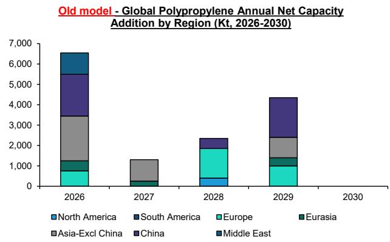

bar_stacked

Old model - Global Polypropylene Annual Net Capacity Addition by Region (Kt, 2026-2030)
| Year | North America | South America | Europe | Eurasia | Asia-Excl China | China | Middle East |
| :--- | :--- | :--- | :--- | :--- | :--- | :--- | :--- |
| 2026 | 800 | 1000 | 700 | 400 | 1900 | 1500 | 1000 |
| 2027 | 100 | 100 | 100 | 200 | 800 | 0 | 0 |
| 2028 | 400 | 300 | 1500 | 200 | 0 | 400 | 0 |
| 2029 | 100 | 150 | 800 | 300 | 0 | 1500 | 0 |
| 2030 | 0 | 0 | 0 | 0 | 0 | 0 | 0 |

Source: Wood Mackenzie, Company websites, Bernstein analysis

EXHIBIT 41: ... which we also see happening for Polypropylene (2/2)   
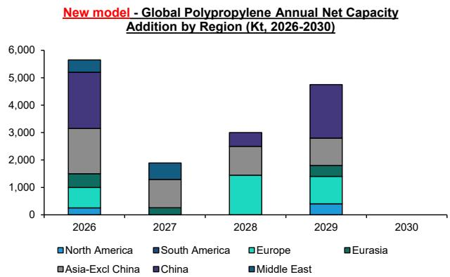

bar_stacked

New model - Global Polypropylene Annual Net Capacity Addition by Region (Kt, 2026-2030)
| Year | North America | South America | Europe | Eurasia | Asia-Excl China | China | Middle East |
| :--- | :--- | :--- | :--- | :--- | :--- | :--- | :--- |
| 2026 | 250 | 1000 | 800 | 400 | 1200 | 1700 | 400 |
| 2027 | 0 | 0 | 0 | 300 | 800 | 0 | 400 |
| 2028 | 0 | 0 | 1400 | 0 | 800 | 400 | 0 |
| 2029 | 400 | 0 | 800 | 300 | 800 | 1500 | 0 |
| 2030 | 0 | 0 | 0 | 0 | 0 | 0 | 0 |

Source: Wood Mackenzie, Company websites, Bernstein analysis and estimates

This leads to slightly better operating rates after a trough in 2025. The combination of sustained high capacity growth relative to production translated into global operating rates for polyethylene and polypropylene falling from 87% and 89.9% in 2020 to 82.8% and 79.0% in 2025 respectively. For the purposes of this long-term exercise If we assume “steady state” capacity in 2026 - i.e. excluding the current supply disruption - with now less capacity additions but resilient consumption, and thus production, we expect operating rates to slightly improve in 2026 to 80.3% and 79.2% in 2026 for PE and PP respectively, and continue to improve subsequently.

For our updated supply demand model, please see: Global Polyolefins Market Model

EXHIBIT 42: We increase our long-term operating rate assumptions for polyethylene   
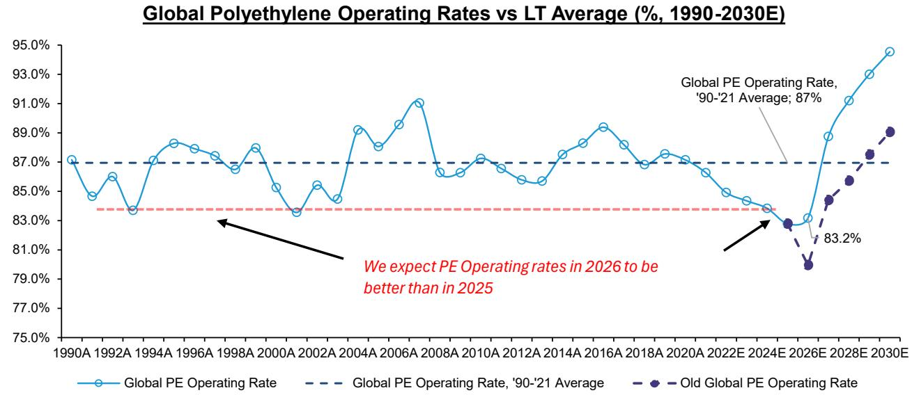

line

| Year | Global PE Operating Rate (%) |
|------|------------------------------|
| 2026E | 83.2% |
| 2026E | 87% |
| 2030E | 94.5% |

Source: Nexant ChemSystems, Bloomberg, Bernstein analysis and estimates

EXHIBIT 43: We increase our long-term operating rate assumptions for polypropylene   
Global Polyproylene Operating Rates vs LT Average (%, 1990-2030E)   
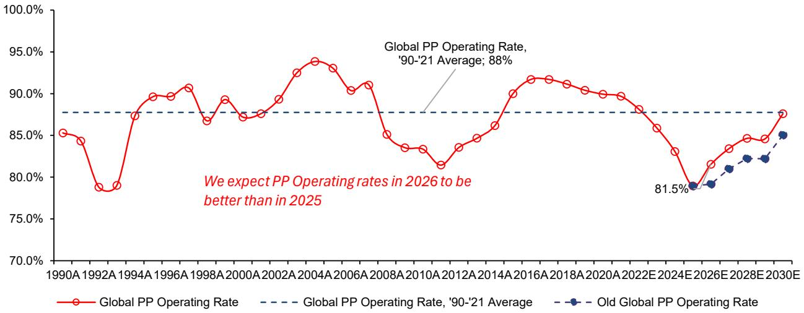

line

| Year | Global PP Operating Rate |
|------|--------------------------|
| 2026E | 81.5% |
| 2025E | 88% |
| 2024E | 81.5% |
| 2023E | 85% |
| 2022E | 87% |
| 2021E | 89% |
| 2020E | 90% |
| 2019E | 91% |
| 2018E | 91% |
| 2017E | 91% |
| 2016E | 92% |
| 2015E | 91% |
| 2014E | 90% |
| 2013E | 89% |
| 2012E | 88% |
| 2011E | 87% |
| 2010E | 86% |
| 2009E | 85% |
| 2008E | 84% |
| 2007E | 83% |
| 2006E | 82% |
| 2005E | 81% |
| 2004E | 80% |
| 2003E | 79% |
| 2002E | 78% |
| 2001E | 77% |
| 2000E | 76% |
| 1999E | 75% |
| 1998E | 74% |
| 1997E | 73% |
| 1996E | 72% |
| 1995E | 71% |
| 1994E | 70% |
| 1993E | 69% |
| 1992E | 68% |
| 1991E | 67% |
| 1990E | 66% |

Source: Nexant ChemSystems, Bloomberg, Bernstein analysis and estimates

# 2) CHANGES IN THE OIL PRICE

For the change in oil prices, we follow our house oil price forecast (see link), which goes to \$90/bbl in 2026 and then declines to settle at \$75/bbl by 2028 (Exhibit 44).

EXHIBIT 44: Our Global O&G colleagues expect the oil price to settle at \$70/bbl   
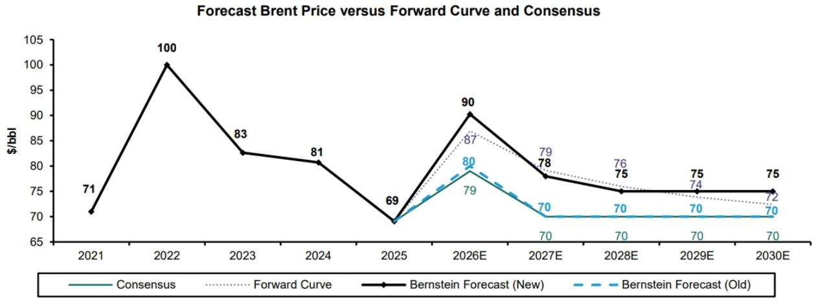

line

| Year   | Consensus | Forward Curve | Bernstein Forecast (New) | Bernstein Forecast (Old) |
|--------|-----------|---------------|--------------------------|--------------------------|
| 2021   |           |               | 71                       |                          |
| 2022   |           |               | 100                      |                          |
| 2023   |           |               | 83                       |                          |
| 2024   |           |               | 81                       |                          |
| 2025   |           |               | 69                       |                          |
| 2026E  | 79        | 87            | 90                       | 80                       |
| 2027E  | 70        | 78            | 79                       | 70                       |
| 2028E  | 70        | 76            | 75                       | 70                       |
| 2029E  | 70        | 75            | 74                       | 70                       |
| 2030E  | 70        | 72            | 75                       | 70                       |

Source: Bloomberg, Bernstein Global O&G Team analysis & estimates

# 3) CHANGES IN GDP

For the change in GDP, we follow the IMF's forecast GDP growth increase from 3.0% in 2025 to 3.1% 2026, and then trend this back to the 20-year historical global GDP growth average of 3.4% (Exhibit 45). This framework is broadly consistent with the IMF and World Bank's 2026–27 outlooks, but we note that the IMF's baseline assumes the Strait of Hormuz shock remains contained; a more prolonged disruption would likely weigh on growth and lift inflation, which would argue for caution in the long-term forecast.

EXHIBIT 45: We expect GDP to slowly trend back to historical average growth rates   
Global GDP Growth (IMF 1990-2026E, BernE improving to LT ave. thereafter)   
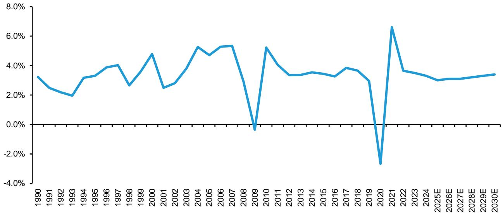

line

| Year | Value |
|------|-------|
| 1990 | 3.2%  |
| 1991 | 2.5%  |
| 1992 | 2.0%  |
| 1993 | 1.8%  |
| 1994 | 3.0%  |
| 1995 | 3.2%  |
| 1996 | 3.8%  |
| 1997 | 4.0%  |
| 1998 | 2.5%  |
| 1999 | 3.5%  |
| 2000 | 4.8%  |
| 2001 | 2.5%  |
| 2002 | 2.8%  |
| 2003 | 3.5%  |
| 2004 | 5.2%  |
| 2005 | 4.8%  |
| 2006 | 5.3%  |
| 2007 | 5.4%  |
| 2008 | 3.0%  |
| 2009 | -0.5% |
| 2010 | 5.2%  |
| 2011 | 4.0%  |
| 2012 | 3.3%  |
| 2013 | 3.4%  |
| 2014 | 3.5%  |
| 2015 | 3.4%  |
| 2016 | 3.2%  |
| 2017 | 3.8%  |
| 2018 | 3.6%  |
| 2019 | 3.0%  |
| 2020 | -3.0% |
| 2021 | 6.5%  |
| 2022 | 3.5%  |
| 2023 | 3.3%  |
| 2024 | 3.1%  |
| 2025E | 3.0% |
| 2026E | 3.1% |
| 2027E | 3.1% |
| 2028E | 3.2% |
| 2029E | 3.3% |
| 2030E | 3.4% |

Source: IMF, Bernstein estimates and analysis

# OUR NEW PRICE FORECASTS

As a result of healthier supply environment and resilient demand, we expect polyolefin prices to increase lover the long run. For PE, our 2027 price increases 10%, our 2028 price increases 6% and our 2029-30 prices increase 5% (Exhibit 46). For PP, our 2027 price increases 15%, our 2028 price increases 8% and our 2029-30 prices increase 7% (Exhibit 47)

EXHIBIT 46: We increase our long-term PE prices from 5-10%   
Polyethylene Price by Regional Benchmark and BERNe Forecasts (\$/mt, 1990-2030E)   
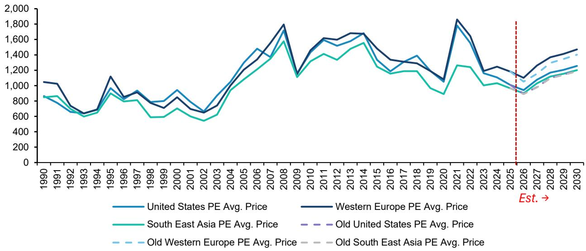  
PE Avg. prices for each region are price weighted averages of HDPE, LLDPE and LDPE benchmarks   
Source: Bloomberg, Nexant ChemSystems, Bernstein analysis and estimates

EXHIBIT 47: We increase our long-term PP prices from 7-15%   
Polypropylene Price by Regional Benchmark and BERNe Forecasts (\$/mt, 1990-2030E)   
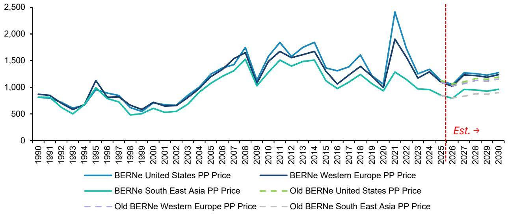  
Source: Bloomberg, Nexant ChemSystems, Bernstein analysis and estimates

# BULL AND BEAR CASE POLYOLEFIN PRICES: WHAT ASSUMPTIONS WOULD BE REQUIRED BY OUR MODEL?

In this section, we provide a thought exercise on what would need to happen to maintain the current spot prices using our polyolefins model, or reach renewed lows. In these assumptions we continue to use our house oil price forecasts.

# OUR SCENARIOS

\- Downside scenario: The only lasting impact is higher-for-longer inflation and therefore weaker demand

In this scenario, we assume a rapid return to normal conditions, including the oil price, but with one key difference: lasting inflation. This effectively brings the industry back to the pre-conflict oversupply environment, but with more constrained consumer demand. Therefore, we expect capacity growth to outpace a still modest demand recovery (GDP \~2.8%). Operating rates remain structurally low at around \~77%, reflecting persistent excess capacity. In this environment, oversupply dominates, and pricing remains under sustained pressure, with PE and PP prices falling to \$875/t and \$1,038/t, respectively over 2027-30.

\- Base case: Assumptions per the previous section.

PE and PP averaging \$1,177/t and \$1,256/t respectively over 2027-30.

• Upside scenario: Supply reductions and resilient demand

In an upside scenario, a prolonged or even renewed conflict delays the return of supply and keeps part of global capacity offline due to force majeure and logistical disruptions. In this context, some mothballed capacity is never brought back online and / or there is destruction of more facilities in the Middle East. Demand, however, remains resilient and in line with previous expectations, given the often inelastic demand for key petrochemical applications. This combination leads to a much tighter market, and operating rates rebounding quickly around \~92% (2015/2016 levels). As a result, the industry experiences a period of genuine tightness, driving strong prices, with PE and PP averaging \$1,471/t and \$1,708/t respectively over 2027-30.

EXHIBIT 48: Our polyolefin price scenarios   
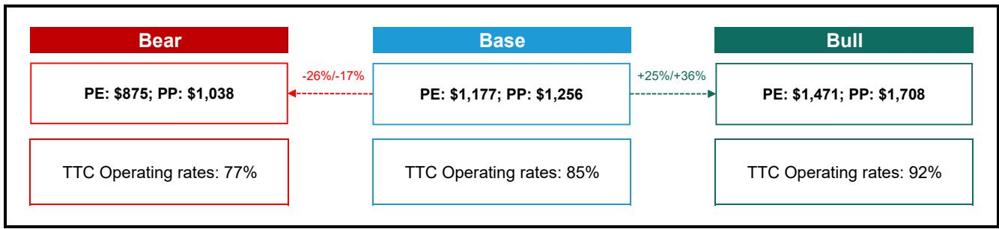

other

| Category         | Metric               | Value     |
| ---------------- | -------------------- | --------- |
| Bear             | PE: $875; PP: $1,038   | -26%/-17% |
| Base             | PE: $1,177; PP: $1,256  | +25%/+36% |
| Bull             | PE: $1,471; PP: $1,708  | -         |
| Bull             | TTC Operating rates  | 77%       |
| Bull             | TTC Operating rates  | 85%       |
| Bull             | TTC Operating rates  | 92%       |

Source: IMF, Bloomberg, Bernstein analysis and estimates

EXHIBIT 49: In a bull case scenario, we see polyolefin prices remain around current levels (1/2)   
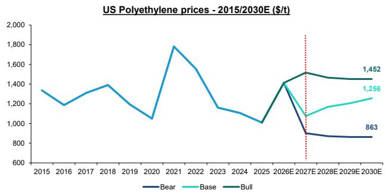

line

| Year   | Bear  | Base  | Bull  |
| ------ | ----- | ----- | ----- |
| 2015   |       |       |       |
| 2016   |       |       |       |
| 2017   |       |       |       |
| 2018   |       |       |       |
| 2019   |       |       |       |
| 2020   |       |       |       |
| 2021   |       |       |       |
| 2022   |       |       |       |
| 2023   |       |       |       |
| 2024   |       |       |       |
| 2025   |       |       |       |
| 2026E  |       |       |       |
| 2027E  | 863   | 1,256 | 1,452 |
| 2030E  | 863   | 1,256 | 1,452 |

Source: IMF, Bloomberg, Bernstein estimates and analysis

EXHIBIT 50: In a bull case scenario, we see polyolefin prices remain around current levels (2/2)   
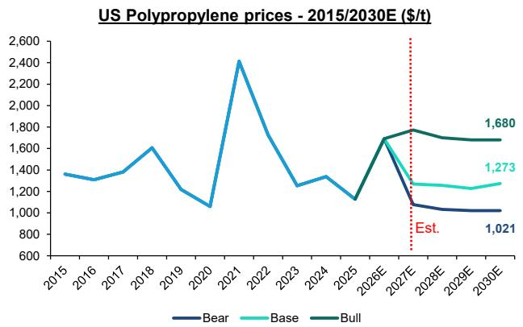

line

| Year   | Bear  | Base  | Bull  |
| ------ | ----- | ----- | ----- |
| 2015   |       |       |       |
| 2016   |       |       |       |
| 2017   |       |       |       |
| 2018   |       |       |       |
| 2019   |       |       |       |
| 2020   |       |       |       |
| 2021   |       |       |       |
| 2022   |       |       |       |
| 2023   |       |       |       |
| 2024   |       |       |       |
| 2025   |       |       |       |
| 2026E  |       |       |       |
| 2027E  | $1,021 | $1,273 | $1,680 |
| 2028E  |       |       |       |
| 2029E  |       |       |       |
| 2030E  |       |       |       |

Source: IMF, Bloomberg, Bernstein estimates and analysis

EXHIBIT 51: Bear case detailed output 

<table><tr><td colspan="17">Downside Case - Bernstein Oil Prices</td></tr><tr><td>GDP growth (%)</td><td>2.78%</td><td></td><td></td><td></td><td></td><td></td><td></td><td></td><td></td><td></td><td></td><td></td><td></td><td></td><td></td><td></td></tr><tr><td>Oil price ($/bbl) - 2027</td><td>78.00</td><td></td><td></td><td></td><td></td><td></td><td></td><td></td><td></td><td></td><td></td><td></td><td></td><td></td><td></td><td></td></tr><tr><td>Oil price ($/bbl) - 2028</td><td>75.00</td><td></td><td></td><td></td><td></td><td></td><td></td><td></td><td></td><td></td><td></td><td></td><td></td><td></td><td></td><td></td></tr><tr><td>Oil price ($/bbl) - 2029</td><td>75.00</td><td></td><td></td><td></td><td></td><td></td><td></td><td></td><td></td><td></td><td></td><td></td><td></td><td></td><td></td><td></td></tr><tr><td>Oil price ($/bbl) - 2030</td><td>75.00</td><td></td><td></td><td></td><td></td><td></td><td></td><td></td><td></td><td></td><td></td><td></td><td></td><td></td><td></td><td></td></tr><tr><td>Long-term operating rate</td><td>77%</td><td></td><td></td><td></td><td></td><td></td><td></td><td></td><td></td><td></td><td></td><td></td><td></td><td></td><td></td><td></td></tr><tr><td>Long-term Supply/demand balance*</td><td>1.30</td><td></td><td></td><td></td><td></td><td></td><td></td><td></td><td></td><td></td><td></td><td></td><td></td><td></td><td></td><td></td></tr><tr><td>Downside/Bernstein deck - BERNe PE/PP price forecasts</td><td>2015</td><td>2016</td><td>2017</td><td>2018</td><td>2019</td><td>2020</td><td>2021</td><td>2022</td><td>2023</td><td>2024</td><td>2025</td><td>2026E</td><td>2027E</td><td>2028E</td><td>2029E</td><td>2030E</td></tr><tr><td colspan="17">Parameters</td></tr><tr><td>GDP growth (%)</td><td>3.4%</td><td>3.2%</td><td>3.8%</td><td>3.6%</td><td>3.0%</td><td>-2.7%</td><td>6.6%</td><td>3.8%</td><td>3.5%</td><td>3.3%</td><td>3.3%</td><td>2.7%</td><td>2.8%</td><td>2.8%</td><td>2.8%</td><td>2.8%</td></tr><tr><td>Oil price ($/bbl)</td><td>39.2</td><td>54.7</td><td>64.1</td><td>57.7</td><td>65.2</td><td>50.1</td><td>74.6</td><td>81.5</td><td>77.6</td><td>73.1</td><td>61.6</td><td>90.0</td><td>78.00</td><td>75.00</td><td>75.00</td><td>75.00</td></tr><tr><td>PE Operating rate (%)</td><td>92.7%</td><td>92.6%</td><td>88.8%</td><td>88.4%</td><td>89.4%</td><td>89.0%</td><td>84.2%</td><td>82.6%</td><td>81.4%</td><td>80.3%</td><td>78.8%</td><td>77.0%</td><td>77.0%</td><td>77.0%</td><td>77.0%</td><td>77.0%</td></tr><tr><td>PP Operating rate (%)</td><td>89.4%</td><td>90.5%</td><td>91.8%</td><td>88.9%</td><td>88.8%</td><td>86.7%</td><td>86.6%</td><td>84.9%</td><td>83.5%</td><td>81.1%</td><td>79.9%</td><td>77.0%</td><td>77.0%</td><td>77.0%</td><td>77.0%</td><td>77.0%</td></tr><tr><td>PE Supply/Demand ratio</td><td>1.14</td><td>1.13</td><td>1.14</td><td>1.16</td><td>1.15</td><td>1.15</td><td>1.17</td><td>1.18</td><td>1.19</td><td>1.19</td><td>1.20</td><td>1.30</td><td>1.30</td><td>1.30</td><td>1.30</td><td>1.30</td></tr><tr><td>PP Supply/Demand ratio</td><td>1.13</td><td>1.11</td><td>1.10</td><td>1.11</td><td>1.11</td><td>1.11</td><td>1.12</td><td>1.14</td><td>1.17</td><td>1.21</td><td>1.27</td><td>1.30</td><td>1.30</td><td>1.30</td><td>1.30</td><td>1.30</td></tr><tr><td colspan="17">Polyolefin prices</td></tr><tr><td>Polyethylene weighted avg. price</td><td>1,335</td><td>1,186</td><td>1,309</td><td>1,390</td><td>1,193</td><td>1,050</td><td>1,782</td><td>1,554</td><td>1,161</td><td>1,107</td><td>1,009</td><td></td><td>901</td><td>871</td><td>863</td><td>863</td></tr><tr><td>Polypropylene price</td><td>1,361</td><td>1,309</td><td>1,382</td><td>1,607</td><td>1,218</td><td>1,059</td><td>2,413</td><td>1,726</td><td>1,253</td><td>1,337</td><td>1,127</td><td></td><td>1,077</td><td>1,033</td><td>1,021</td><td>1,021</td></tr><tr><td colspan="17">Downside/Bernstein deck - Through the cycle analysis (2026-2030)</td></tr><tr><td>Average Oil price ($/bbl)</td><td>78.6</td><td></td><td></td><td></td><td></td><td></td><td></td><td></td><td></td><td></td><td></td><td></td><td></td><td></td><td></td><td></td></tr><tr><td>Average PE operating rates (%)</td><td>77.0%</td><td></td><td></td><td></td><td></td><td></td><td></td><td></td><td></td><td></td><td></td><td></td><td></td><td></td><td></td><td></td></tr><tr><td>Average PP operating rates (%)</td><td>77.0%</td><td></td><td></td><td></td><td></td><td></td><td></td><td></td><td></td><td></td><td></td><td></td><td></td><td></td><td></td><td></td></tr><tr><td>Average PE Supply/demand ratio</td><td>1.30</td><td></td><td></td><td></td><td></td><td></td><td></td><td></td><td></td><td></td><td></td><td></td><td></td><td></td><td></td><td></td></tr><tr><td>Average PP Supply/demand ratio</td><td>1.30</td><td></td><td></td><td></td><td></td><td></td><td></td><td></td><td></td><td></td><td></td><td></td><td></td><td></td><td></td><td></td></tr><tr><td>Average US PE prices 2027-30 ($/t)</td><td>875</td><td></td><td></td><td></td><td></td><td></td><td></td><td></td><td></td><td></td><td></td><td></td><td></td><td></td><td></td><td></td></tr><tr><td>Average US PP prices 2027-30 ($/t)</td><td>1,038</td><td></td><td></td><td></td><td></td><td></td><td></td><td></td><td></td><td></td><td></td><td></td><td></td><td></td><td></td><td></td></tr></table>

\*Supply/demand is defined as capacity over consumption as production tends to meet consumption in the long-term   
Source: IMF, Bloomberg, Bernstein estimates and analysis

EXHIBIT 52: Bull case detailed output 

<table><tr><td colspan="17">Upside Case - Bernstein Oil Prices</td></tr><tr><td>GDP growth (%)</td><td>3.42%</td><td></td><td></td><td></td><td></td><td></td><td></td><td></td><td></td><td></td><td></td><td></td><td></td><td></td><td></td><td></td></tr><tr><td>Oil price ($/bbl) - 2027</td><td>78.00</td><td></td><td></td><td></td><td></td><td></td><td></td><td></td><td></td><td></td><td></td><td></td><td></td><td></td><td></td><td></td></tr><tr><td>Oil price ($/bbl) - 2028</td><td>75.00</td><td></td><td></td><td></td><td></td><td></td><td></td><td></td><td></td><td></td><td></td><td></td><td></td><td></td><td></td><td></td></tr><tr><td>Oil price ($/bbl) - 2029</td><td>75.00</td><td></td><td></td><td></td><td></td><td></td><td></td><td></td><td></td><td></td><td></td><td></td><td></td><td></td><td></td><td></td></tr><tr><td>Oil price ($/bbl) - 2030</td><td>75.00</td><td></td><td></td><td></td><td></td><td></td><td></td><td></td><td></td><td></td><td></td><td></td><td></td><td></td><td></td><td></td></tr><tr><td>Long-term operating rate</td><td>93%</td><td></td><td></td><td></td><td></td><td></td><td></td><td></td><td></td><td></td><td></td><td></td><td></td><td></td><td></td><td></td></tr><tr><td>Long-term Supply/demand balance*</td><td>1.08</td><td></td><td></td><td></td><td></td><td></td><td></td><td></td><td></td><td></td><td></td><td></td><td></td><td></td><td></td><td></td></tr><tr><td>Upside/Bernstein deck - BERNe PE/PP price forecasts</td><td>2015</td><td>2016</td><td>2017</td><td>2018</td><td>2019</td><td>2020</td><td>2021</td><td>2022</td><td>2023</td><td>2024</td><td>2025</td><td>2026E</td><td>2027E</td><td>2028E</td><td>2029E</td><td>2030E</td></tr><tr><td colspan="17">Parameters</td></tr><tr><td>GDP growth (%)</td><td>3.4%</td><td>3.2%</td><td>3.8%</td><td>3.6%</td><td>3.0%</td><td>-2.7%</td><td>6.6%</td><td>3.8%</td><td>3.5%</td><td>3.3%</td><td>3.3%</td><td>3.3%</td><td>3.4%</td><td>3.4%</td><td>3.4%</td><td>3.4%</td></tr><tr><td>Oil price ($/bbl)</td><td>39.2</td><td>54.7</td><td>64.1</td><td>57.7</td><td>65.2</td><td>50.1</td><td>74.6</td><td>81.5</td><td>77.6</td><td>73.1</td><td>61.6</td><td>90.0</td><td>78.00</td><td>75.00</td><td>75.00</td><td>75.00</td></tr><tr><td>PE Operating rate (%)</td><td>92.7%</td><td>92.6%</td><td>88.8%</td><td>88.4%</td><td>89.4%</td><td>89.0%</td><td>84.2%</td><td>82.6%</td><td>81.4%</td><td>80.3%</td><td>78.8%</td><td>93.0%</td><td>93.0%</td><td>93.0%</td><td>93.0%</td><td>93.0%</td></tr><tr><td>PP Operating rate (%)</td><td>89.4%</td><td>90.5%</td><td>91.8%</td><td>88.9%</td><td>88.8%</td><td>86.7%</td><td>86.6%</td><td>84.9%</td><td>83.5%</td><td>81.1%</td><td>79.9%</td><td>93.0%</td><td>93.0%</td><td>93.0%</td><td>93.0%</td><td>93.0%</td></tr><tr><td>PE Supply/Demand ratio</td><td>1.14</td><td>1.13</td><td>1.14</td><td>1.16</td><td>1.15</td><td>1.15</td><td>1.17</td><td>1.18</td><td>1.19</td><td>1.19</td><td>1.20</td><td>1.08</td><td>1.08</td><td>1.08</td><td>1.08</td><td>1.08</td></tr><tr><td>PP Supply/Demand ratio</td><td>1.13</td><td>1.11</td><td>1.10</td><td>1.11</td><td>1.11</td><td>1.11</td><td>1.12</td><td>1.14</td><td>1.17</td><td>1.21</td><td>1.27</td><td>1.08</td><td>1.08</td><td>1.08</td><td>1.08</td><td>1.08</td></tr><tr><td colspan="17">Polyolefin prices</td></tr><tr><td>Polyethylene weighted avg. price</td><td>1,335</td><td>1,186</td><td>1,309</td><td>1,390</td><td>1,193</td><td>1,050</td><td>1,782</td><td>1,554</td><td>1,161</td><td>1,107</td><td>1,009</td><td></td><td>1,517</td><td>1,465</td><td>1,452</td><td>1,452</td></tr><tr><td>Polypropylene price</td><td>1,361</td><td>1,309</td><td>1,382</td><td>1,607</td><td>1,218</td><td>1,059</td><td>2,413</td><td>1,726</td><td>1,253</td><td>1,337</td><td>1,127</td><td></td><td>1,773</td><td>1,700</td><td>1,680</td><td>1,680</td></tr><tr><td colspan="17">Upside/Bernstein deck - Through the cycle analysis (2026-2030)</td></tr><tr><td>Average Oil price ($/bbl)</td><td>78.6</td><td></td><td></td><td></td><td></td><td></td><td></td><td></td><td></td><td></td><td></td><td></td><td></td><td></td><td></td><td></td></tr><tr><td>Average PE operating rates (%)</td><td>93.0%</td><td></td><td></td><td></td><td></td><td></td><td></td><td></td><td></td><td></td><td></td><td></td><td></td><td></td><td></td><td></td></tr><tr><td>Average PP operating rates (%)</td><td>93.0%</td><td></td><td></td><td></td><td></td><td></td><td></td><td></td><td></td><td></td><td></td><td></td><td></td><td></td><td></td><td></td></tr><tr><td>Average PE Supply/demand ratio</td><td>1.08</td><td></td><td></td><td></td><td></td><td></td><td></td><td></td><td></td><td></td><td></td><td></td><td></td><td></td><td></td><td></td></tr><tr><td>Average PP Supply/demand ratio</td><td>1.08</td><td></td><td></td><td></td><td></td><td></td><td></td><td></td><td></td><td></td><td></td><td></td><td></td><td></td><td></td><td></td></tr><tr><td>Average US PE prices 2027-30 ($/t)</td><td>1,471</td><td></td><td></td><td></td><td></td><td></td><td></td><td></td><td></td><td></td><td></td><td></td><td></td><td></td><td></td><td></td></tr><tr><td>Average US PP prices 2027-30 ($/t)</td><td>1,708</td><td></td><td></td><td></td><td></td><td></td><td></td><td></td><td></td><td></td><td></td><td></td><td></td><td></td><td></td><td></td></tr></table>

\*Supply/demand is defined as capacity over consumption as production tends to meet consumption in the long-term   
Source: IMF, Bloomberg, Bernstein estimates and analysis

# KEY CONCLUSIONS: A SLIGHTLY HEALTHIER MARKET AND A STEEPER COST CURVE. THE MIDDLE EAST IS WELL POSITIONED AND SO IS NORTH AMERICA, UNLESS WE SEE \$5 HENRY HUB

We believe the petrochemical supply-demand balance is in a healthier state, as long as 1) some capacity never restarts, and 2) demand doesn't reach crisis levels. On the supply side, we do expect some lasting changes, albeit at a low level. Some Asian countries were looking to reduce capacity in any case (e.g. South Korea), but we see most supply strategic politically. On the demand side, we believe volumes are likely resilient unless we see a 2008-esque decline in demand. Which is definitely possible, with looming inflation in Asia our greatest concern, but not our base case.

The cost curve is going to get steeper. We believe this favours ethane / natural-gas based petrochemicals... The use of ethane as a feedstock has yielded operational and economical cost benefits when used in steam cracking in recent years compared to naphtha and propane. Ethane is generally cheaper as it is derived from NGL refining, compared to naphtha which is primarily derived from crude oil refining, with the advantage becoming more noticeable in recent decades. Higher for longer oil prices without a move in the US natural gas price, as we have seen in the last few months, magnify this ethane advantage (Exhibit 53 to Exhibit 55). Oil is the marginal commodity for most petrochemicals, and with higher oil setting the prices and limited changes in natural gas, the cost curve becomes steeper. This makes Middle Eastern and North American gas-based economics even more competitive (Exhibit 56, Exhibit 57). However...

... but North America won't see the upside if we get \$5 Henry Hub, like our Americas E&T colleagues forecast. With Middle Eastern natural gas feedstocks often under long-term sovereign-sponsored agreements, we see higher oil prices as supportive to their margins, as long as lower shipping-based logistics costs return. Given the Middle East's logistical challenges, we see North America as currently the most economic place to make petrochemicals. However, a threat to this position would emerge if our Americas E&T colleagues are correct, and Henry Hub prices increase to \$5, versus the high \$3 Bloomberg forward curve (Exhibit 58). This would therefore decrease the oil-gas spread, and lower margins.

EXHIBIT 53: After the Middle-East conflict, the oil spread with Henry Hub spiked making gas-based polyolefin feedstocks more economic than oil-based ones   
Brent to Henry Hub spread - 2000/2026   
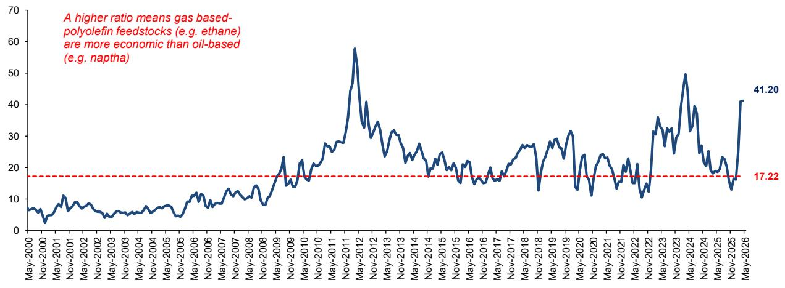

line

| Date       | Value |
| ---------- | ----- |
| May-2026   | 41.20 |
|            | 17.22 |

Source: Bloomberg, Bernstein analysis

EXHIBIT 54: The US Ethane advantage is high when oil prices are higher...   
Global Ethylene Variable Cost of Production by Feedstock on March 12 2025 with Brent Spot @ \$70.95 (\$/mt)   
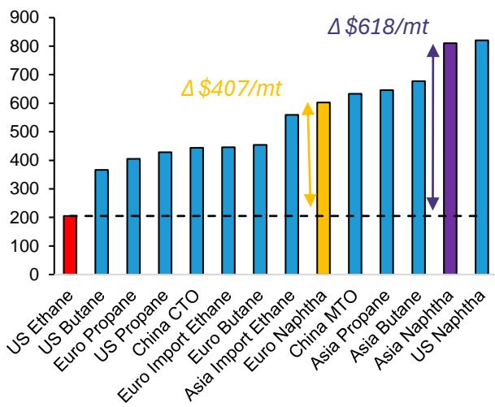

bar

| Category | Value ($/mt) |
| :--- | :--- |
| US Ethane | 200 |
| US Butane | 360 |
| Euro Propane | 400 |
| US Propane | 420 |
| China CTO | 440 |
| Euro Import Ethane | 440 |
| Euro Butane | 450 |
| Asia Import Ethane | 560 |
| Euro Naphtha | 600 |
| China MTO | 630 |
| Asia Propane | 640 |
| Asia Butane | 680 |
| Asia Naphtha | 810 |
| US Naphtha | 820 |
Δ $407/mt; Δ $618/mt

Source: S&P Commodity Insights Presentation APIC 2025, Bernstein analysis

EXHIBIT 55: ... but that advantage declines when oil prices are lower   
Global Ethylene Variable Cost of Production by Feedstock on April 9 2025 with Brent Spot @ \$65.48 (\$/mt)   
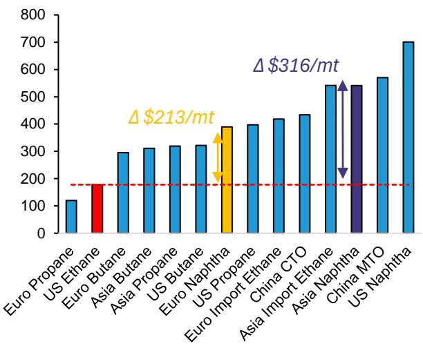

bar

| Category | Value |
| :--- | :--- |
| Euro Propane | 120 |
| US Ethane | 180 |
| Euro Butane | 295 |
| Asia Butane | 310 |
| Asia Propane | 320 |
| US Butane | 325 |
| Euro Naphtha | 385 |
| US Propane | 395 |
| Euro Import Ethane | 415 |
| China CTO | 435 |
| Asia Import Ethane | 540 |
| Asia Naphtha | 545 |
| China MTO | 570 |
| US Naphtha | 700 |
Δ $316/mt

Source: S&P Commodity Insights Presentation APIC 2025, Bernstein analysis

EXHIBIT 56: North America and the Middle East primarily rely on Ethane while Europe and China mainly produce petrochemicals with naphta   
Share of petrochemical feedstocks by region   
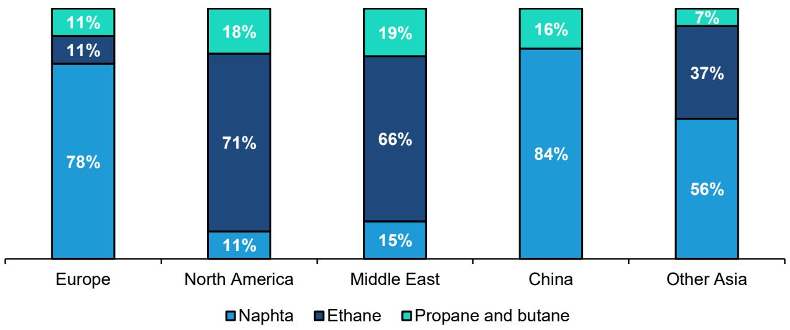

bar_stacked

| Region | Naphtha (%) | Ethane (%) | Propane and butane (%) |
| :--- | :--- | :--- | :--- |
| Europe | 78 | 11 | 11 |
| North America | 11 | 71 | 18 |
| Middle East | 15 | 66 | 19 |
| China | 84 | 0 | 16 |
| Other Asia | 56 | 37 | 7 |

Source: Deloitte, Bloomberg, Krungsri Research, Bernstein analysis and estimates

EXHIBIT 57: Using Bloomberg forward curve natural gas, the ethane advantage becomes greater. But North America also moves up if we see \$5 Henry Hub   
2025 Global Supply Curve before and after Iran, Ethylene Basis   
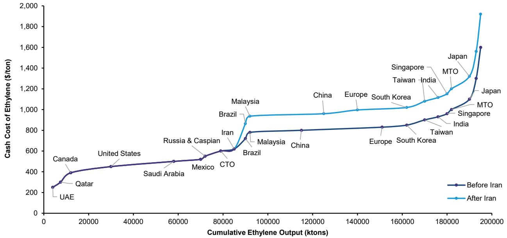  
Assumed Iran capacity not destroyed   
Source: Wood Mackenzie, Bloomberg, Bernstein analysis and estimates

EXHIBIT 58: On our house natural gas forecasts, the ethane advantage would disappear. But the on the market's...   
Henry Hub price forecast (\$/mmbtu)   
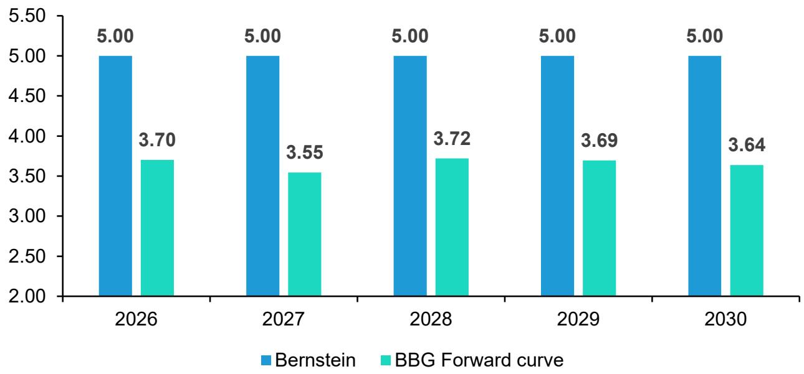

bar

| Year | Bernstein | BBG Forward curve |
| ---- | --------- | ----------------- |
| 2026 | 5.00      | 3.70              |
| 2027 | 5.00      | 3.55              |
| 2028 | 5.00      | 3.72              |
| 2029 | 5.00      | 3.69              |
| 2030 | 5.00      | 3.64              |

Source: Bloomberg, Bernstein Energy analysis and estimates

# STOCK-SPECIFIC CONSIDERATIONS

We expect the Middle East will regain its crown as the most efficient place to make petrochemicals once the logistical issues ease. It is possible that security of supply considerations will mean demand for Middle East upstream chemicals increases slowly in the next couple of years. But as memories of the crisis fade, we expect economics to become the key consideration. For Borouge, this makes us more bullish longer-term on their fundamentals. While their feedstock agreement means that higher polyolefin prices lead to higher feedstock prices, we consider the parameters of the contract very supportive for their margins. Especially once transport costs normalise. However, given the short-term uncertainty and higher logistics costs, we remain Market-Perform.

We initiated on SABIC at Market-Perform — not because the business is broken, but because it is structurally mispositioned: ROIC has collapsed from 21% in 2005 to \~1% in 2025E as domestic ethane costs nearly doubled from \$1.75 to \$3/mmbtu, eroding the GCC cost advantage from the inside, while 66% of revenues sit in commoditised segments where downside amplifies faster than upside recovers. The underappreciated catalyst flows directly from our report's central conclusion: the global petrochemical cost curve is steepening. Oil-derived feedstocks — naphtha across Europe and Asia — are anchored to crude; as oil stays higher for longer, the marginal cost of the majority of global capacity rises sharply, mechanically widening SABIC's cost gap versus oil-derived competition. The \$5/mmbtu HH gas scenario compounds this further, widening the gap with gas-based marginal producers by \$600–800/ton and compressing high-cost capacity. Aramco's fixed \$3/mmbtu supply — unlikely to be repriced given Saudi Arabia's strategic interest in its downstream sector — means SABIC does not participate in that cost inflation; it benefits from it. This is where Market-Perform becomes a re-rating candidate: not a commodity spike, but a steepening cost curve that turns the feedstock anchor from a margin headwind into the most durable competitive moat in global petrochemicals.

The fortunes of the petrochemical majors with considerable capacity in ethane-based North America could see their economics structurally improved, if the oil-gas spread holds. Or they could normalise if we get \$5 Henry Hub. We do not cover the possible beneficiaries such as Dow, LyondellBasell or Westlake, but on market natural gas expectations they become structurally more profitable. The economics of some of BASF's Verbunds in the Southern US (Geismar, Louisiana and Port Arthur, Texas) are also likely to improve, albeit the Americas is the smallest region for BASF's upstream business.

For oil-based regions, we see the overall impact as a small positive. Here we see conditions as slightly better, but margin improvements are more limited given their mostly oil-based feedstock. However, we see BASF as better-positioned than most in the new environment given that it benefits from the integration advantage (Exhibit 59) which we see as more important at higher prices, and over the next couple of years we expect greater European domestic demand before memories of the conflict fade. We therefore believe that the floor for BASF is now higher than the €40-50 trading range we have seen in the last few years.

The industrial gases would benefit from a rebalancing of capacity to NA over the longer-term, given petrochemical plants in North America are more likely to outsource. But reshoring and new capacity is likely years away, so this is a longer-term growth driver. In the shorter-term, higher-for-longer petrochemical and / or commodity prices are supportive for pricing.

Elsewhere in our coverage, higher-for-longer petchem prices will mean a test of pricing power. Both Paints & Coatings & downstream industrials will need to price for their likely higher-for-longer petrochemical input costs. We are less concerned about Paints & Coatings pricing power, albeit there may be an incoming volume blip. We are more concerned about our non-integrated diversified names, where some of the chemistry may lack the pricing power to address the higher upstream costs, and some end-uses are more discretionary.

EXHIBIT 59: We see being integrated, like BASF are, as an advantage in a world of higher petchem prices for longer

# We operate long and multiple-step value chains and sell products at every step in the value chain

EO value chain as an example   
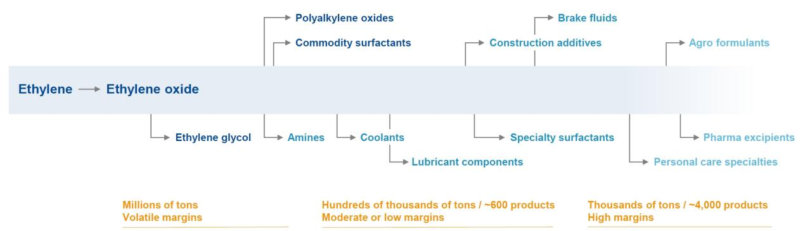

flowchart

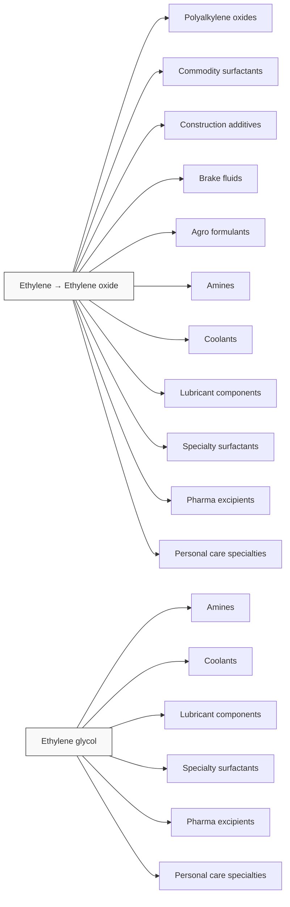
```mermaid
graph LR
    A["Ethylene → Ethylene oxide"] --> B["Polyalkylene oxides"]
    A --> C["Commodity surfactants"]
    A --> D["Construction additives"]
    A --> E["Brake fluids"]
    A --> F["Agro formulants"]
    A --> G["Amines"]
    A --> H["Coolants"]
    A --> I["Lubricant components"]
    A --> J["Specialty surfactants"]
    A --> K["Pharma excipients"]
    A --> L["Personal care specialties"]
    
    M["Ethylene glycol"] --> N["Amines"]
    M --> O["Coolants"]
    M --> P["Lubricant components"]
    M --> Q["Specialty surfactants"]
    M --> R["Pharma excipients"]
    M --> S["Personal care specialties"]
    
    style A fill:#f9f9f9,stroke:#333
    style M fill:#f9f9f9,stroke:#333
```

# Margins per C2 equivalent increase on average around 10-fold along the EO value chain

Simplified diagram for illustrative purposes only

21

October 2, 2025 | BASF Capital Market Update

BASF We create chemistry

Source: BASF Antwerp CMD 2025

# I. REQUIRED DISCLOSURES

References to "Bernstein" or the "Firm" in these disclosures relate to the following entities: Bernstein Institutional Services LLC (April 1, 2024 onwards), Bernstein & Co., LLC (pre April 1, 2024), Bernstein Autonomous LLP, BSG France S.A. (April 1, 2024 onwards), Bernstein (Hong Kong) Limited 盛博香港有限公司, Bernstein (Canada) Limited, Bernstein (India) Private Limited (SEBI registration no. INH000006378), Bernstein (Singapore) Private Limited, Bernstein Japan KK (サンフォード・C・バーンスタイン株式会社) and analysts employed by SG Africa Technologies & Services to produce Bernstein under a Global Services Agreement in place between Bernstein and SG.

Bernstein is part of a joint venture between SG (SG) and AllianceBernstein, L.P. (AB). Unless specifically noted otherwise, for purposes of these disclosures, references to Bernstein's “affiliates” relate to both SG and AB and their respective affiliates.

# VALUATION METHODOLOGY

This research publication covers six or more companies. For valuation methodology and other company disclosures:

Please visit: https://bernstein-autonomous.bluematrix.com/sellside/Disclosures.action.

Or, you can also write to the Director of Compliance, Bernstein Institutional Services LLC, 245 Park Avenue, New York, NY 10167.

# RISKS

This research publication covers six or more companies. For risks and other company disclosures:

Please visit: https://bernstein-autonomous.bluematrix.com/sellside/Disclosures.action.

Or, you can also write to the Director of Compliance, Bernstein Institutional Services LLC, 245 Park Avenue, New York, NY 10167.

# RATINGS DEFINITIONS, BENCHMARKS AND DISTRIBUTION

# EQUITY RATINGS DEFINITIONS

# Bernstein brand

The Bernstein brand rates stocks based on forecasts of relative performance for the next 12 months versus the S&P 500 for stocks listed on the U.S. and Canadian exchanges, versus the Bloomberg Europe Developed Markets Large and Mid Cap Price Return Index EUR (EDME) for stocks listed on the European exchanges and emerging markets exchanges outside of the Asia Pacific region, versus the Bloomberg Japan Large and Mid Cap Price Return Index USD (JPL) for stocks listed on the Japanese exchanges, and versus the Bloomberg Asia ex-Japan Large and Mid Cap Price Return Index (ASIAX) for stocks listed on the Asian (ex-Japan) exchanges -unless otherwise specified.

The Bernstein brand has three categories of ratings:

- Outperform: Stock will outpace the market index by more than 15 pp   
• Market-Perform: Stock will perform in line with the market index to within +/-15 pp   
• Underperform: Stock will trail the performance of the market index by more than 15 pp

Coverage Suspended: Coverage of a company under the Bernstein brand has been suspended. Ratings and price targets are suspended temporarily, are no longer current, and should therefore not be relied upon.

Not Rated: A rating assigned when the stock cannot be accurately valued, or the performance of the company accurately predicted, at the present time. The covering analyst may continue to publish research reports on the company to update investors on events and developments.

Not Covered (NC) denotes companies that are not under coverage.

Bernstein brand stock ratings are based on a 12-month time horizon.

# Autonomous brand – common stocks

The Autonomous brand rates common stocks as indicated below. As our benchmarks we use the Bloomberg Europe 500 Banks And Financial Services Index (BEBANKS) and Bloomberg Europe Dev Mkt Financials Large and Mid Cap Price Ret Index EUR (EDMFI) index for developed European banks and Payments, the Bloomberg Europe 500 Insurance Index (BEINSUR) for European insurers, the S&P 500 and S&P Financials for US banks and Payments coverage, S5LIFE for US Insurance, the S&P Insurance Select Industry (SPSIINS) for US Non-Life Insurers coverage, and the Bloomberg Emerging Markets Financials Large, Mid and Small Cap Price Return Index (EMLSF) for emerging market banks and insurers and Payments. Ratings are stated relative to the sector (not the market).

The Autonomous brand has three categories of common stock ratings:

- Outperform (OP): Stock will outpace the relevant index by more than 10 pp   
- Neutral (N): Stock will perform in line with the market index to within +/-10 pp   
• Underperform (UP): Stock will trail the performance of the relevant index by more than 10 pp

Coverage Suspended: Coverage of a company under the Autonomous research brand has been suspended. Ratings and price targets are suspended temporarily, are no longer current, and should therefore not be relied upon.

Not Rated: A rating assigned when the stock cannot be accurately valued, or the performance of the company accurately predicted, at the present time. The covering analyst may continue to publish research reports on the company to update investors on events and developments.

Those denoted as ‘Feature’ (e.g., Feature Outperform FOP, Feature Under Outperform FUP) are our core ideas.

Not Covered (NC) denotes companies that are not under coverage.

Autonomous brand common stock ratings are based on a 12-month time horizon.

# Autonomous brand – preferred stocks

The Autonomous brand has three categories of preferred stock ratings:

- Outperform (OP): The total return of the preferred instrument is expected to outperform preferred securities of other issuers operating in similar sectors or rating categories over the next six months.   
- Neutral (N): The total return of the preferred instrument is expected to perform in line with preferred securities of other issuers operating in similar sectors or rating categories over the next six months.   
- Underperform (UP): The total return of the preferred instrument is expected to underperform preferred securities of other issuers operating in similar sectors or rating categories over the next six months.

Autonomous preferred stock ratings are based on a 6-month time horizon.

# AUTONOMOUS CREDIT RESEARCH

Where this report contains investment recommendations for credit instruments, as defined in article 3(1)(35) of the Market Abuse Regulation, the information below is presented to comply with its disclosure requirements.

The report may also include reference(s) to published opinions by other Autonomous or Bernstein analysts covering the equity securities of the issuer(s) referenced herein. Please note an investment recommendation for credit instruments published by the author(s) of this report may differ from the published view of the analyst covering equity securities for the issuer(s) contained in this report and vice versa.

# CREDIT RATINGS DEFINITIONS

The Autonomous brand has three categories of credit ratings:

\- Credit Outperform (C-OP): The total return of the Reference Credit Instrument is expected to outperform the credit spread of bonds of other issuers operating in similar sectors or rating categories over the next six months.

- Credit Neutral (C-N): The total return of the Reference Credit Instrument is expected to perform in line with the credit spread of bonds of other issuers operating in similar sectors or rating categories over the next six months.   
- Credit Underperform (C-UP): The total return of the Reference Credit Instrument is expected to underperform the credit spread of bonds of other issuers operating in similar sectors or rating categories over the next six months.

Autonomous credit ratings are based on a 6-month time horizon.

A list of all investment recommendations produced by the author(s) of this report alongside credit ratings history are available upon request.

It is at the sole discretion of the Firm as to when to initiate, update and cease research coverage. The Firm has established, maintains and relies on information barriers to control the flow of information contained in one or more areas (i.e. the private side) within the Firm, and into other areas, units, groups or affiliates (i.e. public side) of the Firm

DISTRIBUTION OF EQUITY RATINGS/INVESTMENT BANKING SERVICES 

<table><tr><td>Equity Rating</td><td>Market Abuse Regulation (MAR) and FINRA Rating Category</td><td>Global Rating Distribution</td><td>Investment Banking Relationships*</td></tr><tr><td>Outperform</td><td>BUY</td><td>51.1%</td><td>16.5%</td></tr><tr><td>Market-Perform (Bernstein Brand) Neutral (Autonomous Brand)</td><td>HOLD</td><td>36.3%</td><td>17.8%</td></tr><tr><td>Underperform</td><td>SELL</td><td>12.6%</td><td>14.9%</td></tr></table>

\* These figures represent the percentage of companies within each equity rating category for which affiliates of Bernstein have provided investment banking services within the previous 12 months.
As of March 31, 2026. All figures are updated quarterly.

# PRICE CHARTS/ RATINGS AND PRICE TARGET HISTORY

This research publication covers six or more companies. For price chart and other company disclosures, please visit https://bernstein-autonomous.bluematrix.com/sellside/Disclosures.action or you can write to the Director of Compliance, Bernstein Institutional Services LLC, 245 Park Avenue, New York, NY 10167.

# CONFLICTS OF INTEREST

SG and/or an affiliate is acting as Joint Active Bookrunner in Linde plc's triple tranche bond issue (EUR 6Y/10Y/20Y). Bernstein Autonomous LLP or BSG France SA, beneficially, has either a net long or short position of 0.5% or more of the total issued share capital of a class of common equity securities of the following MiFID eligible securities: Arkema.

Bernstein and/or affiliates have received compensation for investment banking services in the past twelve months from Akzo Nobel NV, Arkema, Linde plc and PPG Industries.

An affiliate of Bernstein has received compensation for non-investment banking securities-related products or services in the previous twelve months from the following clients: Air Liquide SA, Arkema and Linde plc.

Bernstein and/or affiliates have received compensation for non-investment banking securities-related products or services in the previous twelve months from the following clients: Air Liquide SA, Akzo Nobel NV, Arkema, BASF SE, Borouge Plc, Linde plc and Solvay SA.

Bernstein has received compensation for non-investment banking securities-related products or services in the previous twelve months from the following clients: PPG Industries.

Bernstein and/or affiliates expect to receive or intend to seek compensation for investment banking services in the next three months from Air Liquide SA, Borouge Plc and Saudi Basic Industries.

Bernstein and/or affiliates had an investment banking client relationship during the past twelve months with Air Liquide SA, Akzo Nobel NV, Arkema, Borouge Plc, Linde plc, PPG Industries and Saudi Basic Industries.

Certain affiliates of Bernstein act as market maker or liquidity provider in the equities securities of: Air Liquide SA, Air Products & Chemicals Inc, Akzo Nobel NV, Arkema, BASF SE, Clariant AG, Linde plc, PPG Industries, Solvay SA and Syensqo.

Certain affiliates of Bernstein act as market maker or liquidity provider in the debt securities of: Air Liquide SA, Air Products & Chemicals Inc, Arkema, Linde plc and Solvay SA.

Affiliates of Bernstein managed or co-managed in the past twelve months a public offering of securities of Akzo Nobel NV, Arkema, Linde plc and PPG Industries.

# OTHER MATTERS

The legal entity(ies) employing the analyst(s) listed in this report, and their location, can be determined by the country code of their phone number, as follows:

+1 Bernstein Institutional Services LLC; New York, New York, USA

+44 Bernstein Autonomous LLP; London UK

+212 SG Africa Technologies & Services; Casablanca, Morocco

+33 BSG France S.A.; Paris, France

+34 BSG France S.A.; Madrid, Spain

+41 Bernstein Autonomous LLP; Geneva, Switzerland

+49 BSG France S.A.; Frankfurt, Germany

+91 Bernstein (India) Private Limited; Mumbai, India

+852 Bernstein (Hong Kong) Limited 盛博香港有限公司; Hong Kong, China

+65 Bernstein (Singapore) Private Limited; Singapore

+81 Bernstein Japan KK; Tokyo, Japan

Where this report has been prepared by research analyst(s) employed by a non-US affiliate, such analyst(s), is/are (unless otherwise expressly noted below) not registered as associated persons of Bernstein Institutional Services LLC or any other SEC-registered broker-dealer and are not licensed or qualified as research analysts with FINRA. Accordingly, such analyst(s) may not be subject to FINRA's restrictions regarding (among other things) communications by research analysts with a subject company, interactions between research analysts and investment banking personnel, participation by research analysts in solicitation and marketing activities relating to investment banking transactions, public appearances by research analysts, and trading securities held by a research analyst account.

Where this report has been prepared by research analyst(s) employed by SG Africa Technologies & Services (part of the SG group of companies), it has been prepared on behalf of a Bernstein company under a Global Services Agreement in place between Bernstein and SG.

# CERTIFICATION

Each research analyst listed in this report, who is primarily responsible for the preparation of the content of this report, certifies that all of the views expressed in this publication accurately reflect that analyst's personal views about any and all of the subject securities or issuers and that no part of that analyst's compensation was, is, or will be, directly or indirectly, related to the specific recommendations or views in this publication.

# II. ADDITIONAL GLOBAL CONFLICT DISCLOSURES

It is at the sole discretion of the Firm as to when to initiate, update and cease research coverage. The Firm has established, maintains and relies on information barriers to control the flow of information contained in one or more areas (i.e., the private side)

within the Firm, and into other areas, units, groups or affiliates (i.e., public side) of the Firm.

# III. OTHER IMPORTANT INFORMATION AND DISCLOSURES

Separate branding is maintained for “Bernstein” and “Autonomous” research products.

- Bernstein produces a number of different types of research products including, among others, fundamental analysis and quantitative analysis under both the “Autonomous” and “Bernstein” brands. Recommendations contained within one type of research product may differ from recommendations contained within other types of research products, whether as a result of differing time horizons, methodologies or otherwise. Furthermore, views or recommendations within a research product issued under one brand may differ from views or recommendations under the same type of research product issued under the other brand. The Research Ratings System for the two brands and other information related to those Rating Systems are included in the previous section.   
- Autonomous operates as a separate business unit within the following entities: Bernstein Institutional Services LLC, Bernstein Autonomous LLP, Bernstein (Hong Kong) Limited 盛博香港有限公司 and Bernstein (India) Private Limited. For information relating to “Autonomous” branded products (including certain Sales materials) please visit: www.autonomous.com. For information relating to Bernstein branded products please visit: www.bernsteinresearch.com.

Analysts are compensated based on aggregate contributions to the research franchise as measured by account penetration, productivity and proactivity of investment ideas. No analysts are compensated based on performance in, or contributions to, generating investment banking revenues.

This report has been produced by an independent analyst as defined in Article 3 (1)(34)(i) of EU 596/2014 Market Abuse Regulation (“MAR”) and the same article of MAR as it forms part of United Kingdom domestic law by virtue of the European Union (Withdrawal) Act 2018.

To our readers in the United States: Bernstein Institutional Services LLC, a broker-dealer registered with the U.S. Securities and Exchange Commission (“SEC”) and a member of the U.S. Financial Industry Regulatory Authority, Inc. (“FINRA”) is distributing this publication in the United States and accepts responsibility for its contents. Where this material contains an analysis of debt product(s), such material is intended only for institutional investors and is not subject to the US independence and disclosure standards applicable to debt research prepared for retail investors.

Bernstein Institutional Services LLC may act as principal for its own account or as agent for another person (including an affiliate) in sales or purchases of any security which is a subject of this report. This report does not purport to meet the objectives or needs of any specific individuals, entities or accounts.

To our readers in Canada: If this publication pertains to a Canadian domiciled company, it is being distributed in Canada by Bernstein (Canada) Limited, which is licensed and regulated by the Canadian Investment Regulatory Organization. If the publication pertains to a non-Canadian domiciled company, it is being distributed by Bernstein Institutional Services LLC, which is licensed and regulated by both the SEC and FINRA, into Canada under the International Dealers Exemption.

This document may not be passed onto any person in Canada unless that person qualifies as "permitted client" as defined in Section 1.1 of NI 31-103.

To our readers in Brazil: This report has been prepared by Bernstein Institutional Services LLC, and Banco BTG Pactual S.A. ("BTG") is responsible for the distribution of this report in Brazil.

To readers in the United Kingdom: This publication has been issued or approved for issue in the United Kingdom by Bernstein Autonomous LLP, authorised and regulated by the Financial Conduct Authority and located at 60 London Wall, London EC2M 5SH, +44 (0)20-7170-5000. Registered in England & Wales No OC343985.

This document is for distribution only to persons who (i) have professional experience in matters relating to investments falling within Article 19(5) of the Financial Services and Markets Act 2000 (Financial Promotion) Order 2005 (as amended, the “Financial Promotion Order”), (ii) are persons falling within Article 49(2)(a) to (d) (“high net worth companies, unincorporated associations, etc.”) of the Financial Promotion Order, (iii) are outside the United Kingdom, or (iv) are persons to whom an invitation or inducement to engage in investment activity (within the meaning of section 21 of the FSMA) in connection with the issue or sale of any securities may otherwise lawfully be communicated or caused to be communicated (all such persons together being referred to as “relevant persons”). This document is directed only at relevant persons and must not be acted on or relied on by persons who are not relevant persons. Any investment or investment activity to which this document relates is available only to relevant persons and will be engaged in only with relevant persons.

To our readers in the member states of the EEA: This publication is being distributed by BSG France SA, which is authorised and regulated by the Autorité de Contrôle Prudentiel et de Résolution (ACPR) and Autorité des Marchés Financiers (AMF).

To our readers in Hong Kong: This publication is being distributed in Hong Kong by Bernstein (Hong Kong) Limited 盛博香港有限公司, which is licensed and regulated by the Hong Kong Securities and Futures Commission (Central Entity No. AXC846) to carry out Type 4 (Advising on Securities) regulated activities and subject to the licensing conditions mentioned in the SFC Public Register (https://www.sfc.hk/publicregWeb/corp/AXC846/details)). This publication is solely for professional investors, as defined in the Securities and Futures Ordinance (Cap. 571). The purpose of this report is solely to provide an analysis of the issuers referred to in this report and is not intended for any purpose contrary to the laws of Hong Kong.

To our readers in Singapore: This publication is being distributed in Singapore by Bernstein (Singapore) Private Limited, only to accredited investors or institutional investors, as defined in the Securities and Futures Act 2001 of Singapore ("SFA"). Recipients in Singapore should contact Bernstein (Singapore) Private Limited in respect of matters arising from, or in connection with, this publication. Bernstein (Singapore) Private Limited is regulated by the Monetary Authority of Singapore and licensed under the SFA as a capital markets services licence holder for dealing in capital markets products that are securities and collective investment schemes and an exempt financial adviser for advising on, issuing and promulgating analyses and reports on securities. Bernstein (Singapore) Private Limited is registered in Singapore with Company Registration No. 20213710W and located at One Raffles Quay, #27-11 South Tower, Singapore 048583, +65-6230-4612.

To our readers in the People's Republic of China: The securities referred to in this document are not being offered or sold and may not be offered or sold, directly or indirectly, in the People's Republic of China (for such purposes, not including the Hong Kong and Macau Special Administrative Regions or Taiwan, the "PRC") in contravention of any applicable laws of the PRC.

This document does not constitute an offer to sell or the solicitation of an offer to buy any securities in the PRC to any person to whom it is unlawful to make the offer or solicitation in the PRC.

We do not represent that this document may be lawfully distributed, or that any securities may be lawfully offered, in compliance with any applicable registration or other requirements in the PRC, or pursuant to an exemption available thereunder, or assume any responsibility for facilitating any such distribution or offering. In particular, no action has been taken by us which would permit a public offering of any securities or distribution of this document in the PRC. Accordingly, the securities are not being offered or sold within the PRC by means of this document or any other document. Neither this document nor any advertisement or other offering material may be distributed or published in the PRC, except under circumstances that will result in compliance with any applicable laws and regulations.

To our readers in Japan: This publication is being distributed in Japan by Bernstein Japan KK (サンフォード・C・バーンスタイン株式会社), which is registered in Japan as a Financial Instruments Business Operator with the Kanto Local Finance Bureau (registration number: The Director-General of Kanto Local Finance Bureau (FIBO) No.3387) and regulated by the Financial Services Agency. It is also a member of Japan Investment Advisers Association. This publication is solely for qualified institutional investors in Japan only, as defined in Article 2, paragraph (3), items (i) of the Financial Instruments and Exchange Act.

For the institutional client readers in Japan who have been granted access to the Bernstein website by Daiwa Group Inc. ("Daiwa"), your access to this document should not be construed as meaning that Bernstein is providing you with investment advice for any purposes. Whilst Bernstein has prepared this document, your relationship is, and will remain with, Daiwa, and Bernstein has neither any contractual relationship with you nor any obligations towards you.

To our readers in Australia: Bernstein (Hong Kong) Limited 盛博香港有限公司 is responsible for distributing research in Australia. It is regulated by the Securities and Exchange Commission under U.S. laws, by the Financial Conduct Authority under U.K. laws, which differs from Australian laws. Bernstein (Hong Kong) Limited 盛博香港有限公司 is exempt from the requirement to hold an Australian financial services license under the Corporations Act 2001 in respect of the provision of the following financial services to wholesale clients:

• providing financial product advice;   
• dealing in a financial product;   
• making a market for a financial product; and   
• providing a custodial or depository service.

To our readers in India: This publication is being distributed in India by Bernstein (India) Private Limited (SCB India) which is licensed and regulated by Securities and Exchange Board of India ("SEBI") as a research analyst entity under the SEBI (Research Analyst) Regulations, 2014, having registration no. INH000006378 and as a stock broker having registration no. INZ000213537. SCB India is currently engaged in the business of providing research and stock broking services. Please refer to

www.bernsteinresearch.in for more information.

\- SCB India is a Private limited company incorporated under the Companies Act, 2013, on April 12, 2017 bearing corporate identification number U65999MH2017FTC293762, and registered office at Level 3A, 4th Floor, First International Financial Centre, Plot Nos C-54 and C-55, G Block, Near CBI Office, Bandra Kurla Complex, Bandra (East), Mumbai 400098, Maharashtra, India (Phone No: +91-22-68421401).

\- For details of Associates (i.e., affiliates/group companies) of SCB India, kindly email MUM-BERNSTEIN-InCompliance@bernsteinsg.com.

• SCB India does not have any disciplinary history as on the date of this report.

\- Except as noted above, SCB India and/or its Associates (i.e., affiliates/group companies), the Research Analysts authoring this report, and their relatives

• do not have any financial interest in the subject company   
• do not have actual/beneficial ownership of one percent or more in securities of the subject company;   
- is not engaged in any investment banking activities for Indian companies, as such;

• have not managed or co-managed a public offering in the past twelve months for any Indian companies;

\- have not received any compensation for investment banking services or merchant banking services from the subject company in the past 12 months;

• have not received compensation for brokerage services from the subject company in the past twelve months;

\- have not received any compensation or other benefits from the subject company or third party related to the specific recommendations or views in this report; and

\- do not currently, but may in the future, act as a market maker in the financial instruments of the companies covered in the report.

\- do not have any conflict of interest in the subject company as of the date of this report.

\- Except as noted above, the subject company has not been a client of SCB India during twelve months preceding the date of distribution of this research report. Neither SCB India nor its Associates (i.e., affiliates/group companies) have received compensation for products or services other than investment banking, merchant banking or brokerage services from the subject company in the past twelve months.

\- The principal research analyst(s) who prepared this report, members of the analysts' team, and members of their households are not an officer, director, employee or advisory board member of the companies covered in the report.

\- Our Compliance officer / Grievance officer is Ms. Rupal Talati, who can be reached at +91-22-68421451, or MUM-BERNSTEIN-InCompliance@bernsteinsg.com / Scbin-investorgrievance@bernsteinsg.com

\- The Research investor charter and Terms & Conditions of SCB India are available on its website and may be accessed at Bernstein (India) Private Limited (https://bernsteinresearch.in/) for your reference.

\- Disclaimer: Registration granted by SEBI, and certification from NISM, is in no way a guarantee of performance of the intermediary or provide any assurance of returns to investors. Investments in securities market are subject to market risks. Read all the related documents carefully before investing.

To our readers in Switzerland: This document is provided in Switzerland by or through Bernstein Autonomous LLP, and is provided only to qualified investors as defined in article 10 of the Swiss Collective Investment Scheme Act (“CISA”) and related provisions of the Collective Investment Scheme Ordinance and in strict compliance with applicable Swiss law and regulations. The products mentioned in this document may not be suitable for all types of investors. This document is based on the Directives on the Independence of Financial Research issued by the Swiss Bankers Association (SBA) in January 2008.

To our readers in the Middle East: Bernstein Autonomous LLP, DIFC branch has its principal office at Gate Village 06, DIFC, Dubai, UAE. Bernstein Autonomous LLP, DIFC branch is regulated by the Dubai Financial Services Authority (DFSA) with the registration number CL10040 and is provisioned for Arranging Deals in Investments and Advising on Financial Products. All communications and services are directed at Professional Clients and Market Counterparties only (as defined in the DFSA rulebook). Persons other than Professional Clients and Market Counterparties, such as Retail Clients, are not the intended recipients of our communications or services.

# LEGAL

All research publications are disseminated to our clients through posting on the firm's password protected websites, bernsteinresearch.com and autonomous.com. Certain, but not all, research publications are also made available to clients through third-party vendors or redistributed to clients through alternate electronic means as a convenience.

This publication has been published and distributed in accordance with the Firm's policy for management of conflicts of interest in investment research, a copy of which is available from Bernstein Institutional Services LLC, Director of Compliance, 245 Park Avenue, New York, NY 10167. Additional disclosures and information regarding Bernstein's business are available on our website www.bernsteinresearch.com.

The securities described herein may not be eligible for sale in all jurisdictions or to certain categories of investors where that permission profile is not consistent with the licenses held by the entities noted herein. This document is for distribution only as may be permitted by law. This publication is not directed to, or intended for distribution to or use by, any person or entity who is a citizen or resident of, or located in any locality, state, country or other jurisdiction where such distribution, publication, availability or use would be contrary to law or regulation or which would subject any of the entities referenced herein or any of their subsidiaries or affiliates to any registration or licensing requirement within such jurisdiction. This publication is based upon public sources we believe to be reliable, but no representation is made by us that the publication is accurate or complete. We do not undertake to advise you of any change in the reported information or in the opinions herein. This publication was prepared and issued by entity referred to herein for distribution to eligible counterparties or professional clients. This publication is not an offer to buy or sell any security, and it does not constitute investment, legal or tax advice. The investments referred to herein may not be suitable for you. Investors must make their own investment decisions in consultation with their professional advisors in light of their specific circumstances. The value of investments may fluctuate, and investments that are denominated in foreign currencies may fluctuate in value as a result of exposure to exchange rate movements. Information about past performance of an investment is not necessarily a guide to, indicator of, or assurance of, future performance.

This report is directed to and intended only for our clients who are “eligible counterparties”, “professional clients”, “institutional investors” and/or “professional investors” as defined by the aforementioned regulators, and must not be redistributed to retail clients as defined by the aforementioned regulators. Retail clients who receive this report should note that the services of the entities noted herein are not available to them and should not rely on the material herein to make an investment decision. The result of such act will not hold the entities noted herein liable for any loss thus incurred as the entities noted herein are not registered/authorised/licensed to deal with retail clients and will not enter into any contractual agreement/arrangement with retail clients. This report is provided subject to the terms and conditions of any agreement that the clients may have entered into with the entities noted herein. All research reports are disseminated on a simultaneous basis to eligible clients through electronic publication to our client portal.

The information in this report was prepared by Bernstein solely for the internal business use of our clients. Clients may store, display, analyze, reformat and print the information in this report for this limited use only. Clients may not copy, alter, create derivative works, resell, reverse engineer, commercially exploit, share or distribute any part of the information contained herein for any purpose without Bernstein's express written consent. These restrictions include extracting data or using the content to develop indices or other products. Further, you may not use this report, or any portion of this report, to train or finetune any third-party machine learning or artificial intelligence system, or as a prompt or input into any such system. You also may not, without Bernstein's express written consent, do any of the foregoing in connection with your own internal machine learning or artificial intelligence system.

Bernstein may use artificial intelligence tools in the preparation of its materials. Any such materials are reviewed by Bernstein's research analysts prior to publication.

This report has been prepared for information purposes only and is based on current public information that we consider reliable, but the entities noted herein do not warrant or represent (express or implied) as to the sources of information or data contained herein are accurate, complete, not misleading or as to its fitness for the purpose intended even though the entities noted herein rely on reputable or trustworthy data providers, it should not be relied upon as such. Opinions expressed are the author(s)' current opinions as of the date appearing on the material only and we do not undertake to advise you of any change in the reported information or in the opinions herein.

This publication was prepared and issued by the entity referred to herein for distribution to eligible counterparties or professional clients. The information in this report is intended for general circulation and does not constitute an offer to buy or sell any security, investment, legal or tax advice nor a personal recommendation, as defined by any of the aforementioned regulators. It does not take into account the particular investment objectives, financial situations, or needs of individual investors. The report has not been reviewed by any of the aforementioned regulators and does not represent any official recommendation from the aforementioned regulators. The investments referred to herein may not be suitable for you. Investors must make their own investment decisions in consultation with advice sought from a financial adviser regarding the suitability of the investment product, taking into account the specific investment objectives, financial situation or particular needs of any recipient of the recommendation, before the recipient makes a commitment to purchase the investment product.

The analysis contained herein is based on numerous assumptions. Different assumptions could result in materially different results. The information in this report does not constitute, or form part of, any offer to sell or issue, or any offer to purchase or subscribe for shares, or to induce engage in any other investment activity. The value of any securities or financial instruments mentioned in this report may fluctuate subject to market conditions. Information about past performance of an investment is not necessarily a guide to, indicative of, or assurance of future performance. Estimates of future performance mentioned by the research analyst in this report are based on assumptions that may not be realized due to unforeseen factors like market volatility/fluctuation. In relation to securities or financial instruments denominated in a foreign currency other than the clients' home currency, movements in exchange rates will have an effect on the value, either favorable or unfavorable. Before acting on any recommendations in this report, recipients should consider the appropriateness of investing in the subject securities or financial instruments mentioned in this report and, if necessary, seek for independent professional advice.

The securities described herein may not be eligible for sale in all jurisdictions or to certain categories of investors where that permission profile is not consistent with the licenses held by the entities noted herein. This document is for distribution only as may be permitted by law. It is not directed to, or intended for distribution to or use by, any person or entity who is a citizen or resident of or located in any locality, state, country or other jurisdiction where such distribution, publication, availability or use would be contrary to law or regulation or would subject the entities noted herein to any regulation or licensing requirement within such jurisdiction.

Source: Bloomberg Index Services Limited. BLOOMBERG® is a trademark and service mark of Bloomberg Finance L.P. and its affiliates (collectively “Bloomberg”). Bloomberg or Bloomberg’s licensors own all proprietary rights in the Bloomberg Indices. Neither Bloomberg nor Bloomberg’s licensors approves or endorses this material, or guarantees the accuracy or completeness of any information herein, or makes any warranty, express or implied, as to the results to be obtained therefrom and, to the maximum extent allowed by law, neither shall have any liability or responsibility for injury or damages arising in connection therewith.

No part of this material may be reproduced, distributed or transmitted or otherwise made available without prior consent of the entities noted herein. Copyright Bernstein Institutional Services LLC Bernstein Autonomous LLP, BSG France S.A., Bernstein (Hong Kong) Limited 盛博香港有限公司, Bernstein (Canada) Limited, Bernstein (India) Private Limited (SEBI registration no. INH000006378), Bernstein (Singapore) Private Limited and Bernstein Japan KK (サンフォード・C・バーンスタイン株式会社). All rights reserved. The trademarks and service marks contained herein are the property of their respective owners. Any unauthorized use or disclosure is strictly prohibited. The entities noted herein may pursue legal action if the unauthorized use results in any defamation and/or reputational risk to the entities noted herein and research published under the Bernstein and Autonomous brands.