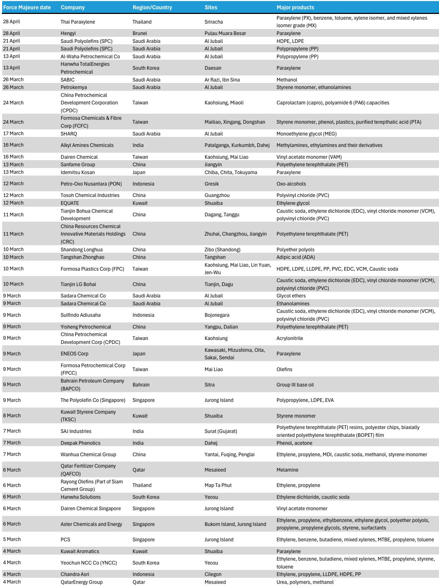
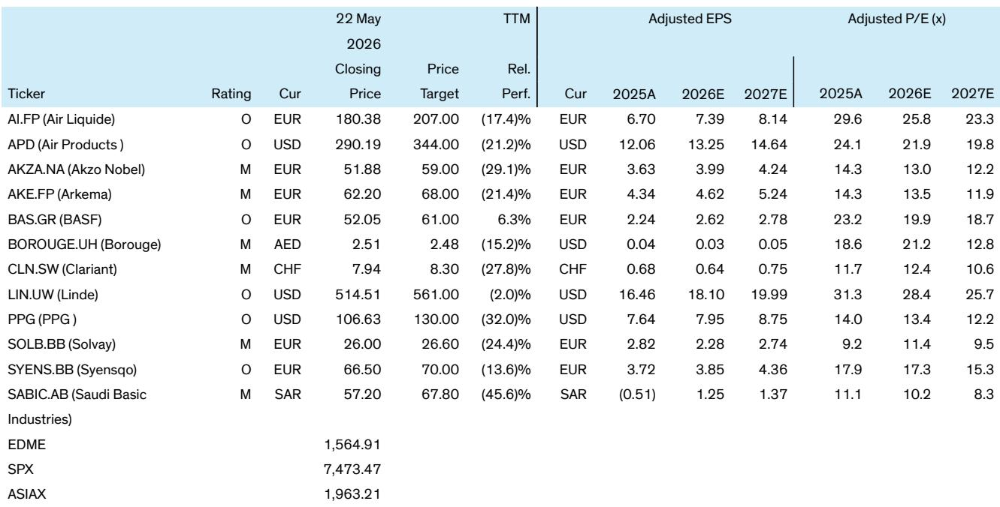

# The Iran Conflict Has Permanently Reshaped Upstream Petrochemicals: Why a Peace Deal May Create a Buying Opportunity

The conventional wisdom holds that a resolution to the Iran conflict will reverse the extraordinary gains in petrochemical prices and erase the profits that producers have captured over the past year. This view is dangerously simplistic. A careful examination of supply-side dynamics suggests that even if a peace agreement is announced tomorrow, the structural landscape of upstream chemicals has been altered in ways that will persist for years. The market may be preparing to sell the news of peace, but the smart money should be preparing to buy the dip.

The argument rests on three pillars that are often misunderstood. First, petrochemical demand has proven remarkably inelastic during the crisis, supported by essential consumer applications that cannot be easily substituted. Second, supply reductions are far more permanent than most investors assume, with significant capacity destruction and permanent closures that will not simply reverse. Third, the cost curve has steepened durably, creating lasting advantages for natural gas-based producers and integrated players while penalizing those dependent on oil-based feedstocks.

This is not a cyclical call. This is a structural re-rating of the upstream chemicals sector that most market participants have yet to fully price in. The implications for company selection are profound, and the timing of entry matters enormously.

## The Bull Case for Upstream Chemicals Is Built on Permanently Reduced Supply, Not Just Demand Resilience

The most common mistake investors make is treating the current petrochemical price spike as purely a function of war-related disruption that will normalize upon peace. This misses the critical distinction between temporary outages and permanent capacity destruction. In the Middle East, petrochemicals are a nationally strategic industry. Countries like Saudi Arabia, Qatar, and the UAE view their petrochemical assets as extensions of sovereign wealth and industrial policy. Yet even with this strategic imperative, not all capacity will return.

The evidence from the crisis is instructive. Approximately 50 percent of global ethylene and polyethylene supply has been offline, constrained, or impacted. But the nature of the damage matters. Qatari LNG facilities have suffered lasting infrastructure damage that will take years to repair, if they are repaired at all. The cost of restarting idled plants in a high-inflation environment, with damaged logistics networks and uncertain feedstock availability, makes many restarts uneconomic. Producers are quietly making decisions to shutter rather than rebuild.

This creates a structural supply deficit that will persist even after hostilities cease. The pre-crisis narrative of chronic oversupply, driven by massive Asian capacity additions, has been inverted. The crisis has effectively accomplished what years of market forces could not: it has rationalized excess capacity. Future capacity additions are also at risk, with approximately 75 percent of announced ethylene additions impacted by the conflict. The pipeline of new supply is thinner today than at any point in the past decade.

Demand resilience reinforces this supply story. Petrochemicals are the building blocks of essential goods: food packaging, medical supplies, construction materials, and automotive components. These end-markets do not vanish during geopolitical crises. In fact, the last twenty years have seen only one down year for petrochemical volumes, 2007-2009 during the global financial crisis. Consumer-facing applications provide a natural floor. Even if higher prices cause some demand destruction at the margin, the inelasticity of core petrochemical demand means that supply reductions translate directly into pricing power.

## The Steepened Cost Curve Creates Lasting Winners and Losers Among Producers

The crisis has not affected all producers equally. The most durable change in the industry is the steepening of the global cost curve, which has fundamentally shifted competitive dynamics. Natural gas-based producers, concentrated in the Middle East and North America, now enjoy a structural cost advantage that is wider than at any point in recent memory.

The mechanism is straightforward. The marginal commodity for most petrochemicals is oil, because the supply balance is determined by European and East Asian producers who depend on naphtha and other oil-based feedstocks. When oil prices rise, the entire cost curve shifts upward. But natural gas-based producers, who use ethane and other gas liquids, are insulated from this dynamic. The oil-gas spread has moved dramatically in favor of gas, creating a windfall for producers who can access cheap natural gas.

North American producers are the immediate beneficiaries. The US Gulf Coast, with its abundant and insulated natural gas supply, has become the most advantaged production region globally. However, this advantage carries a risk that is often overlooked. The house view that Henry Hub natural gas prices could reach $5 per MMBtu looms as a significant threat to North American competitiveness. At current spreads, even $5 gas would still leave US producers advantaged relative to oil-based competitors, but the margin of safety would narrow considerably.

Middle Eastern producers face a different calculus. Their natural gas advantage is even more pronounced, with some producers accessing gas at effectively zero marginal cost. But they must contend with damaged logistics infrastructure and the risk that transportation costs remain elevated even after peace. The normalization of shipping routes through the Strait of Hormuz and the rebuilding of port facilities will take time and capital. Middle Eastern producers will regain their advantage, but not immediately.

For oil-based feedstock regions, particularly Europe and parts of Asia, the outlook is more challenging. Integration becomes the critical differentiator. BASF, with its Verbund structure that links production sites and captures value across the chemical value chain, is better positioned than its oil-based peers. The ability to optimize feedstock use, co-generate power, and capture by-products provides a margin buffer that standalone crackers lack. In a higher-cost environment, integration is not a luxury; it is a survival mechanism.

## Proprietary Modeling Suggests Polyolefin Prices Will Settle 5 to 15 Percent Higher Than Pre-Crisis Estimates

To move beyond qualitative analysis, a structured framework is necessary. The proprietary polyolefins supply-demand model incorporates three primary drivers: operating rates, GDP growth, and Brent crude prices as the marginal commodity. Each of these factors has been recalibrated in light of the crisis.

Operating rates have tightened significantly because of permanent capacity reductions. Even assuming that 70 percent of currently closed capacity eventually returns, the remaining deficit creates a tighter market than pre-crisis projections. The model assumes that operating rates will remain above 85 percent through 2030, compared to pre-crisis estimates that had rates declining toward 80 percent as new capacity came online.

GDP growth assumptions have been revised downward modestly, reflecting the drag from higher energy costs and geopolitical uncertainty. However, the impact on petrochemical demand is muted by the inelasticity of essential applications. A 0.5 percent reduction in global GDP growth translates to roughly a 1 percent reduction in petrochemical demand growth, which is more than offset by the supply-side improvements.

Brent crude assumptions have been revised upward, reflecting the structural risk premium that the crisis has embedded in oil markets. The model now assumes Brent averaging $85-95 per barrel through 2028, compared to pre-crisis estimates of $70-80. This alone adds approximately 5-8 percent to polyolefin prices.

The combination of these factors yields a price forecast that is 5 to 15 percent higher than pre-crisis estimates for the 2027-2030 period. This is not a short-term spike. This is a structural re-pricing that reflects a fundamentally tighter market. The key insight is that the supply-demand balance has improved durably, and higher oil prices have shifted the entire cost curve upward. Even if GDP growth disappoints, the supply-side improvements provide a floor that did not exist before.

## What the Report Does Not Fully Answer: The Duration of Logistics Normalization and the Risk of Demand Destruction

No analysis is complete without acknowledging its limitations. The most significant unknown is the timeline for logistics normalization in the Middle East. The report assumes that transportation costs and shipping routes will eventually return to pre-crisis levels, but the pace of normalization is highly uncertain. If infrastructure damage is more extensive than currently assessed, or if insurance and risk premiums remain elevated for years, the cost advantage of Middle Eastern producers could be delayed indefinitely.

A second unresolved question is the elasticity of demand at sustained high prices. The report argues that petrochemical demand is inelastic because of essential applications, but this assumption has not been tested at current price levels for an extended period. If end-users begin to substitute materials, reduce packaging thickness, or accelerate recycling efforts in response to high prices, demand could erode more than the model projects. The history of petrochemical markets suggests that demand destruction is a slow-moving phenomenon, but it is real.

A third gap is the response of Chinese producers. China has been the primary driver of petrochemical oversupply in recent years, and the crisis has temporarily removed Chinese capacity from the global market. But Chinese producers have strong incentives to restart and even expand capacity once conditions allow. The report assumes that Chinese capacity additions will be slowed, but the Chinese government's industrial policy could override market logic. If China views petrochemical self-sufficiency as a national security priority, the supply response could be faster and larger than anticipated.

Finally, the report does not fully address the impact of higher petrochemical prices on downstream industries. Paints, coatings, and specialty chemicals all use petrochemical inputs. If these industries cannot pass through higher costs, margins will compress and volumes may decline. The report expresses confidence in pricing power for paints and coatings, but this confidence may prove misplaced if end-user demand weakens.

## A Decision Framework for Investors: How to Position for the Structural Shift

The analytical work supports a clear framework for investment decisions. The framework has three dimensions: feedstock advantage, integration, and exposure to downstream pricing power.

First, prioritize producers with natural gas-based feedstock advantages. This means overweighting Middle Eastern producers once logistics normalize, and North American producers as long as Henry Hub remains below $5. The key question for North American exposure is whether the structural gas advantage can survive a sustained period of $5 gas. If the answer is yes, then North American producers remain attractive. If the answer is no, then the advantage shifts entirely to the Middle East.

Second, favor integrated producers in oil-based feedstock regions. BASF is the clearest example, but the principle applies broadly. Integration provides margin buffers through feedstock flexibility, energy efficiency, and product diversification. Non-integrated crackers in Europe and Asia face the most existential threat from the steepened cost curve. These companies will need to rationalize capacity, merge, or exit entirely.

Third, assess downstream pricing power carefully. Companies that can pass through higher input costs without losing volume will thrive. Companies that cannot will face margin compression. The paints and coatings sector appears well-positioned, with strong brand loyalty and fragmented customer bases that limit buyer power. Specialty chemicals are more mixed, with some segments having pricing power and others facing intense competition from lower-cost alternatives.

The timing of entry matters enormously. A peace announcement will likely trigger a sell-off in upstream chemical stocks as investors extrapolate the end of the crisis into a return to pre-crisis conditions. This sell-off will be a buying opportunity for those who understand that the structural changes are permanent. The floor for companies like BASF is higher than the €40-50 trading range of recent years. For Borouge and SABIC, the long-term prospects have improved even if near-term uncertainties remain.

Industrial gas companies represent a different but equally compelling opportunity. Linde, Air Products, and Air Liquide benefit from any scenario that supports new North American petrochemical capacity, and they have pricing power that allows them to capture value from higher commodity prices. The industrial gas business model, with its long-term contracts and cost-plus pricing, provides natural insulation from the volatility that will characterize upstream chemicals in the coming years.

Join the community to read the full report and review the original charts.

*This article is for learning and discussion only and does not constitute investment advice.*

Personal reading notes and learning share only. Not investment advice.

