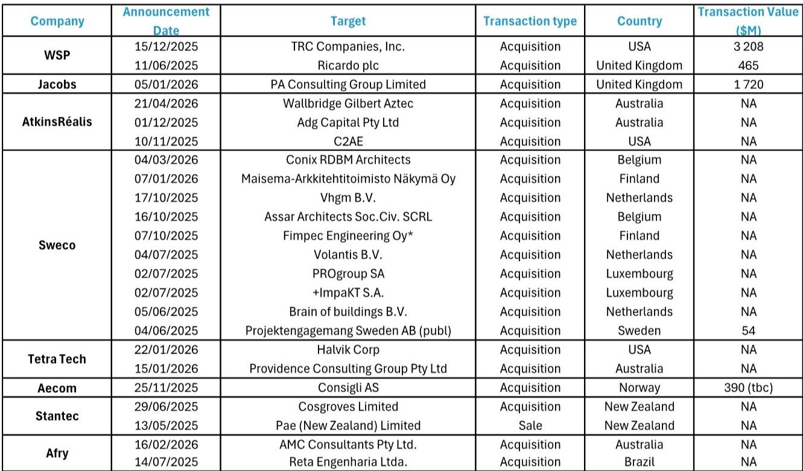
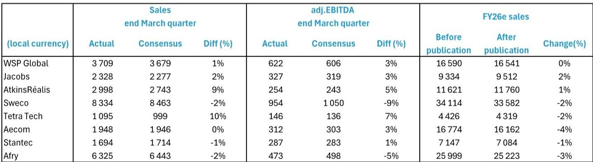
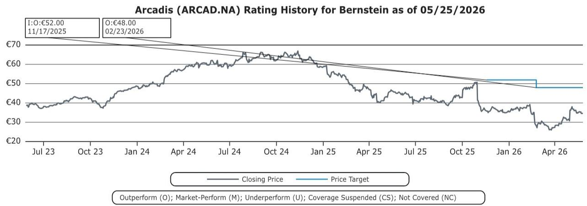

# 土木工程服务行业真正被低估的，是结构性需求切换对头部企业的重新定价

当一家公司的股价在财报发布日一天内上涨18%，而同行普遍下跌2%到12%，市场在传递一个远比“季度业绩好坏”更深的信号。

某外资投行最新发布的土木工程服务行业季度报告，跟踪了Arcadis及其八家全球可比公司的截至3月业绩。这份报告揭示了一个反直觉的图景：行业整体需求并未因中东冲突和经济不确定性而崩塌，但资本市场对各家公司的定价却出现了罕见的巨大分化。

真正值得关注的不是“需求好不好”，而是“谁有资格承接结构性的新需求”。

报告的核心判断是：土木工程服务行业正在经历一场需求侧的结构性切换——数据中心、生命科学、核能等新领域的高速增长，正在取代传统住宅和商业建筑的下行。但市场目前只看到了“某些公司增长快”，尚未充分定价的是：这一轮切换将永久性地改变行业竞争格局，并重塑头部公司的估值体系。

对于持有或关注Arcadis的投资者而言，这份报告提供了三个层次的关键信息：需求端并未恶化，但增长的质量比速度更重要；M&A正在成为区分赢家和输家的分水岭；以及，市场可能低估了运营效率改善对利润率的杠杆效应。

以下是我们基于这份报告的深度解析。

## 1. 客户需求韧性超出预期，但增长分布正在发生根本性位移

报告覆盖的样本公司在截至3月的季度中，有机收入增长总体与前一季度持平，并未出现市场此前担忧的显著放缓。更重要的是，季度收入和EBITDA整体超出市场预期2%和1%。在一个充斥着地缘政治不确定性的环境下，这本身就是值得注意的信号。

但真正关键的不是总量的韧性，而是结构的位移。

报告明确指出，需求加速最显著的领域是数据中心、生命科学和核能。这三者有一个共同特征：它们都是长期资本开支驱动的结构性需求，而非周期性波动。与此同时，对中东市场敞口过大、或依赖传统住宅建筑和特定政府项目（如USAID相关业务）的公司，则承受了明显的增长拖累。

这意味着什么？行业增长的“天花板”正在被重新定义。那些能够将业务重心转向数据中心电力配套、核设施更新、生命科学园区等领域的公司，将获得比同行更长的增长跑道。而那些仍以传统基础设施和住宅建筑为主的公司，即使短期业绩尚可，长期增长空间也将受到压制。

对于Arcadis而言，报告给出的信号是正面的：它是样本中唯一实现有机增长率环比加速的公司，且管理层已将“重新定位到客户需求最强的细分市场”列为首要任务。

## 2. 订单积压和订单流入的韧性，揭示了一个被忽视的“护城河”

如果说季度收入是“快照”，那么订单积压（backlog）和订单流入（order intake）就是行业的“心电图”。

报告显示，尽管宏观环境动荡，样本公司整体的订单积压和订单流入仍保持强劲韧性。这是一个容易被忽视但极为重要的信号：客户并没有因为不确定性而停止项目立项，只是可能更谨慎地选择供应商。

更值得深挖的是订单流入的分布。Jacobs的订单流入同比增长19%，WSP Global增长2%，AECOM增长14%，而Arcadis仅为3%。表面上看，Arcadis在订单获取上落后于同行。但结合报告上下文，这里需要更细致的解读：Arcadis正处于运营转型期，其挑战在于“将线索转化为签约合同、加速积压订单转化为收入、提高顾问利用率”。换言之，Arcadis的问题不是需求不足，而是执行效率有待改善。

这正是当前市场定价分歧的核心来源：市场对“执行改善”的定价是高度不确定的，而对“需求爆发”的定价则相对直接。如果Arcadis能够兑现运营改善的承诺，其当前的估值折价将构成一个不对称的机会。

## 3. M&A正在重塑行业格局，而“不买”本身就是一种战略选择

报告中最引人注目的主题之一，是行业内的M&A活跃度。WSP Global以32亿美元收购TRC，Jacobs以17亿美元整合PA Consulting，Stantec、AtkinsRéalis、Sweco等也在持续进行补强收购。

而Arcadis是唯一一家在M&A上保持静默的主要玩家。

这本身不是负面信号，但需要放在正确的框架里理解。报告指出，Arcadis选择将资本和精力集中于“运营扭转和日常业务管理流程的改善”。这是一个典型的“先练内功、再谋扩张”的战略。

从竞争格局的角度看，M&A正在加速行业集中度提升。WSP通过收购TRC获得了更强的能源和电力能力，Jacobs通过PA Consulting增强了咨询和高端服务能力。这些交易短期内会提升收购方的收入规模和客户覆盖面，但整合风险同样不容忽视。

对于Arcadis而言，当前的选择意味着：它放弃了通过并购快速扩大规模的机会，但保留了更高的财务灵活性和更低的整合风险。如果其内部运营改善能够顺利推进，它完全可以在未来以更有利的条件进行选择性收购。但如果改善进度不及预期，它可能面临在行业整合浪潮中被边缘化的风险。

这里有一个报告没有完全展开的关键问题：M&A创造的股东价值，在土木工程服务行业的历史上是否可持续？大量的实证研究表明，收购方的长期超额回报往往不及预期。Arcadis的“不买”策略，在当前估值水平下，可能恰恰是更理性的选择。

## 4. 季度业绩超预期未能转化为全年指引上调，暴露了市场的“信任赤字”

报告揭示了一个令人深思的现象：尽管样本公司整体业绩超出预期，但几乎没有一家公司因此上调全年指引。Exhibit 7的数据显示，在业绩发布后，分析师对多数公司的全年收入预测反而出现了小幅下调（AECOM下调4%，Afry下调3%，Sweco和Tetra Tech各下调2%）。

这背后折射出两个问题。

第一，管理层对短期业绩的可持续性缺乏信心。在中东冲突、美国政策不确定性、以及欧洲经济增长放缓的背景下，即使一个季度的表现不错，管理层也倾向于维持保守的全年展望。

第二，市场对公司的“可信度”正在重新定价。那些能够持续交付且管理层指引可靠的公司，将获得估值溢价；而那些经常miss或需要不断调整指引的公司，将被市场惩罚。

对于投资者而言，这意味着：在土木工程服务行业，运营纪律和指引质量正在成为比增长速度更重要的估值因子。这也是为什么Arcadis当前将“改善运营管理流程”作为首要任务——如果它能在未来几个季度持续展示执行力的提升，市场对其的信任溢价将逐步恢复。

## 5. 报告尚未完全回答的问题：运营改善的“可复制性”和“持续性”仍待验证

这份报告提供了丰富的数据和洞察，但有一个关键问题它没有完全展开：Arcadis正在推进的运营改善，究竟是一次性的成本削减，还是可持续的效率提升？

从报告的描述来看，Arcadis的挑战包括“提高顾问利用率、加速积压订单转化、以及改善签约转化率”。这些指标的改善需要系统性的管理变革，而不是简单的裁员或费用压缩。报告没有提供关于Arcadis具体运营改善措施、时间表、或中期目标的详细信息。

此外，报告提到Arcadis面临“住宅建设相关服务需求下滑”的逆风。虽然这类业务在收入中的占比持续下降，但其绝对规模和退出成本仍可能对短期利润率构成拖累。

这些未解问题，恰恰是决定Arcadis能否实现估值修复的核心变量。如果运营改善是可持续的，那么当前13倍的市盈率（基于2026年预期EPS）相对于同行明显偏低。但如果改善只是短期效应，或者被住宅业务的下行所抵消，那么当前的估值折价就是合理的。

对于希望深入理解这一问题的读者，建议阅读完整报告中的Exhibit 7至Exhibit 12，这些图表提供了更细分的利润率趋势和运营指标，可以帮助你独立判断Arcadis改善路径的可信度。

---

**写在最后**

土木工程服务行业正站在一个结构性拐点上。需求的韧性是真实的，但增长的分布正在发生根本性位移。M&A正在加速行业洗牌，而运营纪律正在成为新的估值分水岭。

对于Arcadis，市场目前给出的定价包含了太多的怀疑——怀疑其增长质量，怀疑其运营改善的可持续性，怀疑其在行业整合中的位置。这些怀疑有些是合理的，有些可能过度了。

我们在这篇文章中只能触及报告的一部分核心洞察。关于各家公司具体的利润率趋势、订单积压的质量分析、以及不同业务分部的增长拆解，还有大量值得深入讨论的内容。欢迎来星球微信群里继续讨论，我们会在群里分享完整报告的解读和关键图表的原始数据，也欢迎你带着自己的判断和分析来碰撞。

Personal reading notes and learning share only. Not investment advice.

