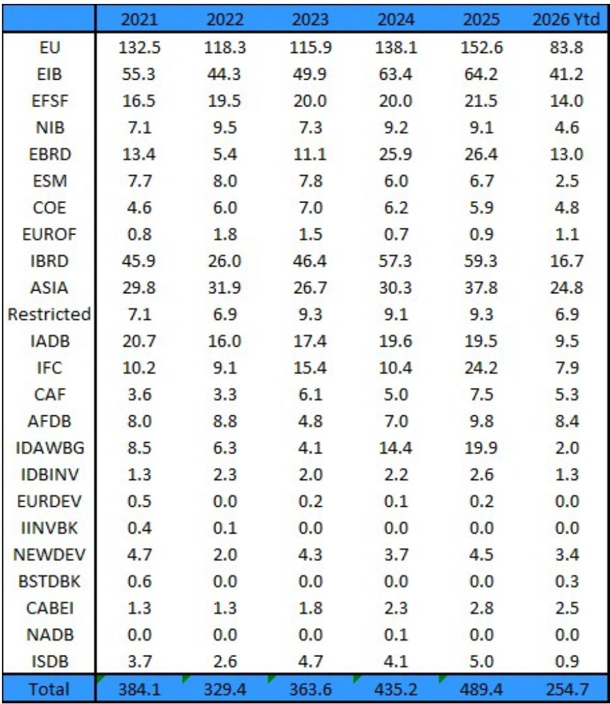
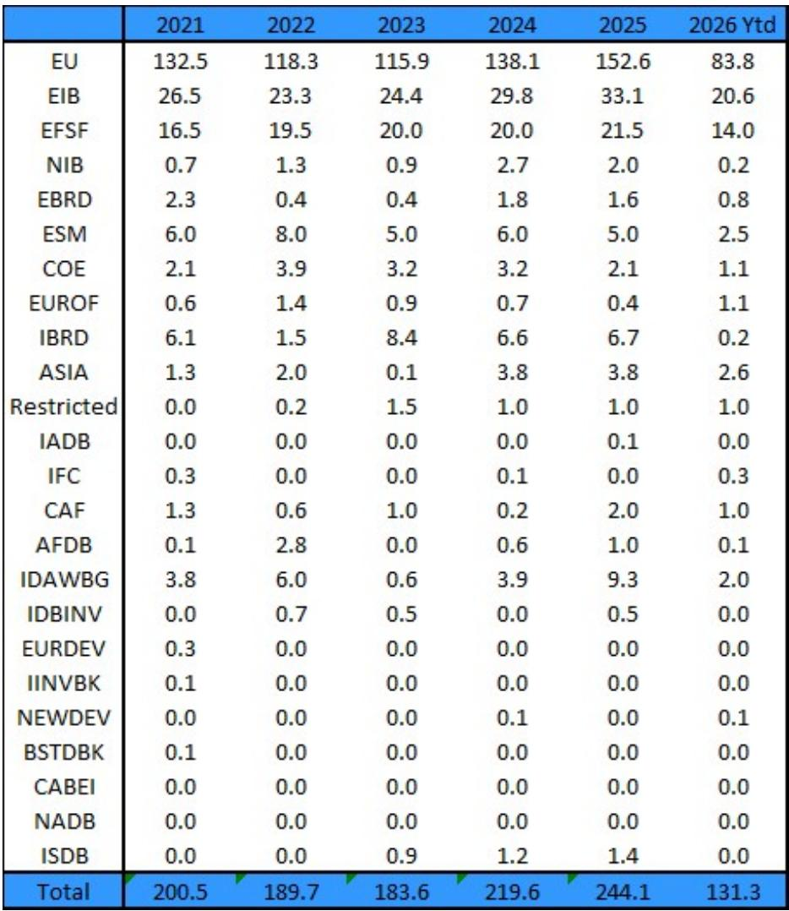
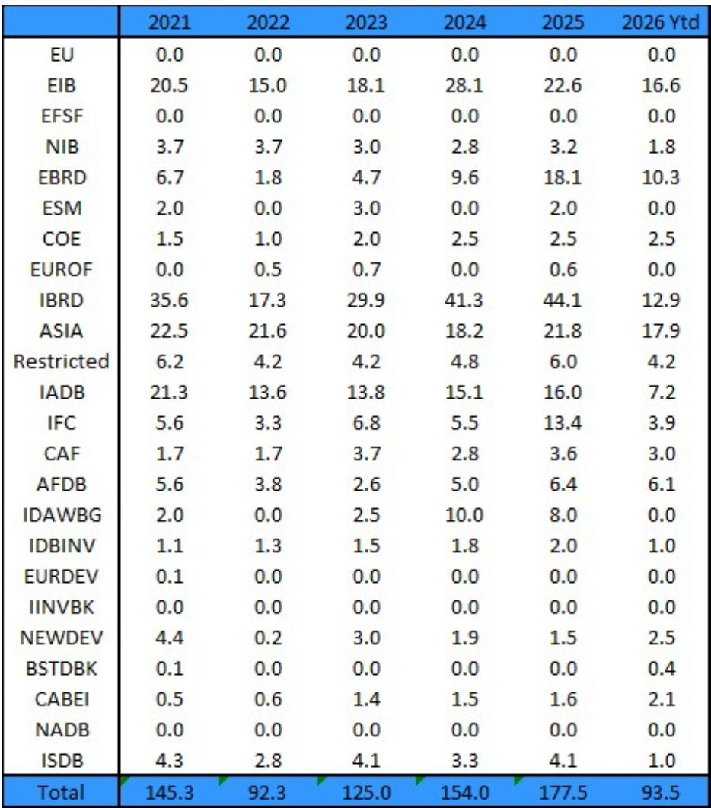

# Covered Bonds Are Gaining Regulatory Momentum, But the Real Story Is the Structural Shift in Global Supra Supply

The most underappreciated development in fixed income this year is not a rate move or a credit event. It is a quiet regulatory proposal from Canada's Office of the Superintendent of Financial Institutions that could reshape how covered bonds are treated in liquidity buffers across jurisdictions. OSFI has proposed elevating highly rated Canadian covered bonds to Level 1B status under the 2027 Liquidity Adequacy Requirements Guideline, subject to a 7 percent haircut. This is not a minor technical adjustment. It represents a deliberate attempt to achieve third-country equivalence with the European Union, where covered bonds with the EU Covered Premium Label already enjoy Level 1 treatment. If successful, this move would mark a significant departure from the Basel III framework, which currently caps covered bonds at Level 2A with a 15 percent haircut. The implications extend far beyond Canadian bank balance sheets.

At the same time, the global supranational bond market is undergoing a quieter but equally consequential transformation. After three consecutive years of rising supply, the year-to-date issuance from major supranational issuers stands at EUR 254.7 billion equivalent, or roughly 52 percent of full-year 2025 levels. On the surface, this suggests another year of robust supply. But the composition tells a different story. The World Bank group of entities, particularly IBRD and IFC, have dramatically reduced their issuance. IBRD's year-to-date supply is down 71 percent in USD terms compared to full-year 2025. IDAWBG has not tapped the USD or GBP markets at all this year. The growth is increasingly concentrated in European supras, led by the European Union, which has already increased its full-year supply indication to around EUR 180 billion. These two developments, the regulatory upgrade of covered bonds and the shifting composition of supra supply, are not unrelated. They point to a deeper structural realignment in how the highest-quality fixed income assets are created, regulated, and demanded.

The argument of this article is straightforward: the combination of regulatory tailwinds for covered bonds and the changing nature of supranational supply creates a new strategic landscape for institutional investors. The old assumption that supranational bonds are the default liquid, high-quality asset for buffers and benchmarks is being tested. Covered bonds, long treated as a second-tier liquidity instrument in many jurisdictions, are moving up the hierarchy. Investors who treat these two asset classes as separate, unrelated markets risk missing the convergence that is underway.

## OSFI's Proposal Is Not Just About Canada; It Is a Test Case for Global Covered Bond Harmonization

The OSFI consultation, which runs until July 20, 2026, with finalization expected in February 2027 and implementation by May 1, 2027, proposes to introduce a new Level 1B category of High-Quality Liquid Assets that includes highly rated covered bonds. Under the current Basel III framework, covered bonds can achieve at best Level 2A status with a 15 percent haircut. The EU has already gone beyond this by granting Level 1 treatment to covered bonds with the EU Covered Premium Label, but this is a regional exception. If Canada adopts a similar standard, it creates a precedent that other jurisdictions may follow.

The strategic logic for Canadian banks is compelling. Canadian banks have an outstanding covered bond volume of EUR 183.4 billion equivalent, with 46.5 percent denominated in euros, 30.5 percent in US dollars, and 15 percent in British pounds. A significant portion of this issuance is held by European investors. If Canadian covered bonds achieve third-country equivalence in the EU, they become more attractive to European banks for their own Liquidity Coverage Ratio portfolios. Currently, they are treated as Level 2A at best. The upgrade to Level 1 status would reduce the haircut from 15 percent to 7 percent, making them more capital-efficient for holders.

The second-order effect is equally important. If Canadian covered bonds become more attractive to domestic and foreign banks, Canadian issuers may increase domestic supply and reduce their reliance on international markets. The data already shows a significant decline in retained Canadian covered bonds, with only one issue amounting to USD 5 billion remaining. This suggests that Canadian banks are already positioning for a future where covered bonds are more liquid and more widely accepted as top-tier collateral. The question is whether other jurisdictions, particularly those with large covered bond markets such as Germany, France, and Spain, will push for similar regulatory upgrades.

There is, however, a note of caution. The report itself acknowledges that Canadian provincial bonds are already Level 1 eligible in Canada without any haircut. Covered bonds would still carry a 7 percent haircut under the new proposal. This means that for Canadian banks, provincial bonds remain more attractive for their own LCR portfolios. The demand for foreign covered bonds by Canadian banks may not increase dramatically. The real impact is on the demand side from European and other international investors who will now see Canadian covered bonds as more attractive relative to other Level 2A assets. This is a subtle but important distinction. The proposal is more about international harmonization and cross-border demand than about domestic liquidity management.

## Global Supra Supply Is Not Slowing; It Is Concentrating, and That Changes the Risk Profile

The aggregate numbers for supranational issuance in 2026 look strong. Year-to-date supply of EUR 254.7 billion equivalent represents 52 percent of full-year 2025 levels. If the second half of the year follows historical patterns, total 2026 supply could end up close to or even above 2025 levels. The European Union alone has raised its full-year issuance target from around EUR 160 billion to around EUR 180 billion. European supras as a group are up 8 percent year-to-date compared to the same period in 2025.

But the composition of this supply is shifting in ways that matter for investors. The World Bank group, particularly IBRD and IFC, has dramatically reduced its issuance. IBRD's year-to-date supply of EUR 16.7 billion equivalent is less than one-third of its full-year 2025 total of EUR 59.3 billion. In USD terms, the decline is even starker: IBRD has issued only USD 12.9 billion year-to-date compared to USD 44.1 billion in full-year 2025. IFC's year-to-date supply is EUR 7.9 billion equivalent versus EUR 24.2 billion in 2025. IDAWBG has issued exclusively in euros this year, with no USD or GBP issuance.

This concentration of supply in European issuers has implications for currency composition, credit quality, and investor base. European supras, particularly the EU and the EIB, are highly rated and deeply integrated into European monetary and fiscal frameworks. But they are also increasingly exposed to the political and fiscal dynamics of the European Union itself. The EU's increased borrowing is tied to programs such as NextGenerationEU and other fiscal initiatives that are themselves dependent on political consensus. If sovereign budgets remain stretched and defense spending demands increase, the EU's borrowing needs may grow further, but the political willingness to underwrite that borrowing is not guaranteed.

The report makes a critical observation that deserves more attention: supranationals with high paid-in and callable capital, and ratings that are not strongly linked to their shareholders, have a structural advantage in times of sovereign credit deterioration. Their preferred creditor status could become extremely important in the event of sovereign defaults. This is not a theoretical concern. With sovereign debt at staggeringly high levels across developed and emerging markets, and the direction of travel remaining upward, the probability of a sovereign credit event in the next cycle is higher than the market currently prices. In such a scenario, the differentiation between supranationals that have genuine preferred creditor status and those that are effectively proxies for their shareholders will become critical.

## The Report Does Not Fully Answer How Supply Dynamics Will Interact with Demand from Central Banks and Bank Treasuries

One of the most important open questions is how the changing supply of supranational bonds will interact with demand from the two largest buyer groups: central banks and commercial bank treasuries. Central banks have been significant buyers of supranational bonds as part of their reserve management and, in some cases, as part of quantitative easing programs. Commercial bank treasuries hold supranational bonds for liquidity buffers, LCR compliance, and as collateral for derivatives and secured funding.

If European supras increase supply while World Bank entities reduce issuance, the overall supply of AAA-rated, highly liquid bonds may remain high, but the distribution across currencies and maturities will change. The EU issues almost exclusively in euros. The EIB issues across currencies but is heavily euro-centric. The decline in IBRD and IFC issuance reduces the supply of USD-denominated supranational bonds, which are particularly important for US-based bank treasuries and for global reserve managers who need USD liquidity.

The report provides detailed supply data by currency, but it does not model the demand side with the same granularity. How much of the demand for supranational bonds is price-sensitive? How much is driven by regulatory requirements that are themselves changing? If covered bonds become more attractive as HQLA, will bank treasuries reduce their allocation to supranational bonds? These are not merely academic questions. They have direct implications for spread dynamics, new issue concessions, and the relative value between covered bonds and supranationals.

Another unanswered question is the role of the European Union's own credit quality. The EU is not a sovereign; it is a supranational entity backed by member state guarantees. Its rating is ultimately a function of the creditworthiness of its largest members. If sovereign credit quality deteriorates in key EU member states, the EU's own rating could come under pressure, even if its legal structure provides some insulation. The report notes that supranationals with high paid-in capital and preferred creditor status have assets that could become extremely important in times of sovereign stress. But not all supranationals are created equal. The EU's borrowing is not backed by paid-in capital in the same way as the World Bank's. This distinction will matter in a crisis.

## A Decision Framework for Investors Navigating the Covered Bond and Supra Convergence

For institutional investors, the convergence of covered bond regulation and supranational supply dynamics creates both opportunities and risks. The following framework can help in making allocation decisions.

First, assess the regulatory trajectory for covered bonds in your home jurisdiction and in the jurisdictions where you hold covered bonds. The OSFI proposal is a leading indicator. If other regulators follow suit, the liquidity premium on covered bonds will compress. Investors who position early may benefit from spread tightening. The key variable is the haircut differential. A move from Level 2A with a 15 percent haircut to Level 1B with a 7 percent haircut is material. It changes the capital efficiency of holding covered bonds relative to other HQLA. Investors should model the impact on their LCR ratio and their return on equity.

Second, evaluate the currency and maturity exposure of your supranational bond portfolio in light of the changing supply composition. If USD-denominated supranational supply continues to decline, the scarcity premium on existing USD supranational bonds may increase. This could create opportunities for holders of these bonds to sell into strength. Conversely, investors who need USD-denominated HQLA may need to look at alternatives, including US agency bonds or highly rated covered bonds issued in USD.

Third, stress-test your portfolio for a scenario in which sovereign credit quality deteriorates and the preferred creditor status of supranationals is tested. Not all supranationals are equally protected. The World Bank group, with its high paid-in capital and long history of preferred creditor treatment, is in a different position than newer or smaller supranationals. The European Union, despite its size and systemic importance, has a different credit structure. Investors should differentiate between supranationals based on their capital structure, not just their rating.

Fourth, consider the relative value between covered bonds and supranationals in the same currency and maturity bucket. If covered bonds are moving up the HQLA hierarchy, their yields should theoretically converge toward supranational yields, adjusted for the haircut differential. Any significant spread premium for covered bonds over supranationals may represent an opportunity, provided the credit quality of the covered bond issuer is robust.

Fifth, monitor the interaction between fiscal policy and supranational issuance. The report notes that increased defense spending needs and stretched sovereign budgets create a tailwind for supranational issuance. But they also create a tailwind for sovereign issuance. If sovereign bond supply increases dramatically, it could crowd out supranational and covered bond demand, particularly if bank treasuries have limited capacity to absorb additional HQLA. This is a risk that is not fully captured in the current data.

## The Full Report Contains Granular Data That Can Refine These Views

The analysis above draws on the strategic insights and supply data from the original report, but the full report contains detailed tables by issuer, currency, and year that allow investors to build their own models. The year-to-date supply figures for each supranational issuer, broken down by EUR, USD, and GBP, are essential for understanding which issuers are driving supply and which are pulling back. The data on retained Canadian covered bonds and the currency composition of Canadian covered bond issuance is critical for assessing the impact of the OSFI proposal.

The report also includes full names and tickers for all supranational issuers, which is helpful for investors who want to map the data to their own portfolio systems. The disclosure appendix provides important context on the methodology and limitations of the analysis, including the use of Bloomberg data and the treatment of non-benchmark bonds and taps.

Join the community to read the full report and review the original charts.

*This article is for learning and discussion only and does not constitute investment advice.*

Personal reading notes and learning share only. Not investment advice.

