CHINA FINANCIAL SERVICES

# Assessing Regulatory Impact on Online Brokers; FUTU to Neutral, reiterate Sell on TIGR

On May 22, the China Securities Regulatory Commission (CSRC) released the "Implementation Plan for the Comprehensive Rectification of Illegal Cross-Border Securities, Futures, and Fund Business Activities". Unlike the December 2022 regulation, which prohibited overseas institutions from continuing to solicit new domestic clients, the May 2026 regulation goes a step further by imposing a two-year "rectification" period to address existing non-compliant businesses. The CSRC also announced that online brokers including TIGR and FUTU will be subject to corresponding penalties. Both companies have since disclosed that these fines would amount to Rmb 1.85bn/412mn respectively, and committed to remediating non-compliant mainland accounts.

We expect the impact to earnings to be concentrated in 2H26, reaching US\$ -393/-66mn for FUTU and TIGR, with slower profit growth driven by higher new client acquisition costs (CAC) and lower AUM per client. We reduce 2026 net profit for FUTU and TIGR by -25%/-60%, leaving us -27%/-75% below BBG consensus. As the market factors in the full effect of these regulatory costs, we expect further downward revisions to consensus figures.

Benchmarking the last regulatory cycle in 2023-2024 and reflecting the CSRC's stricter regulatory stance, we set our target P/E multiples for FUTU and TIGR at 10x/9x (from 19x/10x previously), below the median level during 2023-2024. Our new target prices of US\$102.13/4.10 imply upside/downside of +14%/-6%, respectively. Accordingly, we downgrade FUTU to Neutral from Buy (see here), and maintain our Sell rating on TIGR.

From here, the trajectory of earnings and valuation will depend on the implementation of new regulations (such as the timing of penalties and the pace of remediation), and the corresponding impact to CAC and AUM per client as business models adapt. Our Bear/Base/Bull scenarios contextualize these drivers and imply valuations of US\$ 77/102/171 for FUTU, and US\$ 3/4/6 for TIGR.

Shuo Yang, Ph.D.

+852-2978-0701 | shuo.yang@gs.com

GS (Asia) L.L.C.

Claire Ouyang

+852-2978-6686

claire.x.ouyang@gs.com

GS (Asia) L.L.C.

Exhibit 1: Summary of Changes 

<table><tr><td></td><td colspan="3">FUTU</td><td colspan="3">TIGR</td></tr><tr><td></td><td>New</td><td>Old</td><td>Change</td><td>New</td><td>Old</td><td>Change</td></tr><tr><td>Rating</td><td>Neutral</td><td>Buy</td><td></td><td>Sell</td><td>Sell</td><td></td></tr><tr><td>2026E Net Profit</td><td>8,924</td><td>12,016</td><td>-26%</td><td>42</td><td>109</td><td>-62%</td></tr><tr><td>2027E Net Profit</td><td>11,077</td><td>13,910</td><td>-20%</td><td>81</td><td>108</td><td>-25%</td></tr><tr><td>Target P/E</td><td>10x</td><td>19x</td><td>-9x</td><td>9x</td><td>10x</td><td>-1x</td></tr><tr><td>Target Price(US$)</td><td>102.13</td><td>210.47</td><td>-51%</td><td>4.10</td><td>6.08</td><td>-33%</td></tr><tr><td>Implied share return</td><td>14%</td><td>134%</td><td></td><td>-6%</td><td>39%</td><td></td></tr></table>

NPAT Unit: HK\$ for FUTU and US\$ for TIGR   
Source: FactSet, GS Global Investment Research

The authors would like to thank Zihan Wang for her contribution to this report.

# What's Been Announced

On May 22, Chinese financial regulators led by CSRC released the “Implementation Plan for the Comprehensive Rectification of Illegal Cross-Border Securities, Futures, and Fund Business Activities”. In December 2022, overseas institutions (including those of online brokers) were barred from illegally soliciting onshore investors and opening new accounts for them. The May 22 announcement goes further by imposing a 2-year “rectification period” to remediate existing businesses that have been deemed illegal. Highlights:

During the 2-year concentrated rectification period, it will be illegal for overseas institutions to provide services such as buy transactions and fund transfers for existing investors that reside within the mainland. Only one-way sell transactions and fund withdrawals will be permitted.   
■ After the 2-year concentrated rectification period expires, overseas institutions will be required to completely shut down their domestic websites, trading software, and supporting servers, and will be prohibited from providing trading and other services to existing investors that reside within the mainland.   
The CSRC also announced that domestic and overseas entities of brokers such as TIGR and FUTU will face penalties.

# Immediate Impact of Announcement

On the same day as the CSRC announcement, FUTU and TIGR announced the following:

■ Fines: Rmb 1.8bn/412mn, respectively for FUTU/TIGR.   
■ Number of non-compliant mainland accounts to be remediated: FUTU: As of the end of 1Q26, 13% of its total paying clients are from mainland China. TIGR: As of 2025, mainland China clients accounted for 10% of its client AUM.   
■ Scope of regulation: Both FUTU and TIGR indicated that this regulation is aimed at all overseas financial institutions, not just online brokers.   
■ FUTU also announced a US\$ 160mn stock buyback.

At the close on May 22, shares of FUTU and TIGR fell by -28%/-25%.

# Known and Unknown Variables; What Can Be Incorporated Into Earnings

The impact to earnings will come from two channels:

1. Fines/penalties (the main component); and   
2. Loss of revenues from remediating non-compliant mainland accounts.

We forecast the cumulative earnings impact to FUTU and TIGR in 2026E at US\$ -393/-66mn respectively. This equates to:

-27%/-38% of FUTU's and TIGR's 2025 net profit,   
or $-25\% / -60\%$ of our previous 2026 net profit forecast.

Exhibit 2: Earnings will primarily be impacted by regulatory fines but also the loss of revenues from remediating non-compliant mainland accounts. 

<table><tr><td>US$ mn</td><td>FUTU</td><td>TIGR</td></tr><tr><td colspan="3">Cleanup of non-compliant mainland accounts</td></tr><tr><td>Mainland China AUM % (1Q26E)</td><td>17%</td><td>10%</td></tr><tr><td>Mainland China AUM (1Q26E)</td><td>26,855</td><td>6,028</td></tr><tr><td>Earnings Impact</td><td>-121</td><td>-5</td></tr><tr><td colspan="3">Regulatory Penalty</td></tr><tr><td>Proposed Regulatory Penalty (Rmb mn)</td><td>1,851</td><td>412</td></tr><tr><td>Earnings Impact</td><td>-272</td><td>-61</td></tr><tr><td>Total Earnings Impact</td><td>-393</td><td>-66</td></tr><tr><td>as % of 2025 earnings</td><td>-27%</td><td>-38%</td></tr><tr><td>as % of 2026E earnings</td><td>-25%</td><td>-60%</td></tr></table>

Source: Company data, GS Global Investment Research

Exhibit 3: The cumulative impact represents -27%/-38% of FUTU's and TIGR's 2025 net profit, or -25%/-60% our prior 2026 net profit forecast   
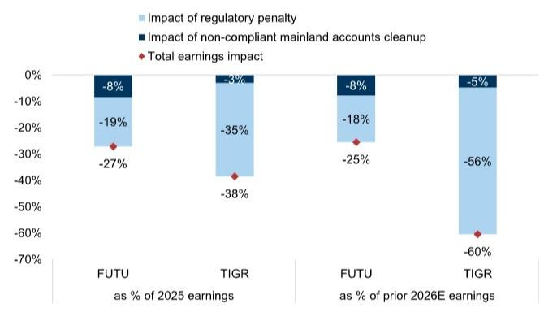

bar

| Category | Impact of regulatory penalty (%) | Impact of non-compliant mainland accounts cleanup (%) | Total earnings impact (%) |
| :--- | :---: | :---: | :---: |
| FUTU (as % of 2025 earnings) | -19 | -8 | -27 |
| TIGR (as % of 2025 earnings) | -35 | -3 | -38 |
| FUTU (as % of prior 2026E earnings) | -18 | -8 | -25 |
| TIGR (as % of prior 2026E earnings) | -56 | -5 | -60 |

Source: GS Global Investment Research

With the magnitude of fines already known, we expect the earnings impact to be concentrated in 2H26, implying a -18%/-56% reduction to our prior 2026 earnings forecast for FUTU/TIGR, respectively.

However, there is some uncertainty regarding the cost of remediating non-compliant mainland accounts, namely:

Whether non-compliant mainland accounts to be remediated can continue to generate revenue, i.e. if clients maintain funds in these accounts during the transition period, which could generate temporary revenue (like cash interest or selling fees) for these companies.   
The actual AUM of non-compliant mainland accounts is unknown (at least, it has not yet been disclosed).

# In our view:

1. While there is a 2-year period for remediation, FUTU and TIGR have not yet announced their own remediation timelines. Complicating this, management noted in their May 22 announcements that closing an account is ultimately a client decision. Existing accounts are only allowed to sell, not make new deposits or hold positions in stocks within the two-year rectification period. After this period ends, these accounts can no longer trade within the mainland, but it will not affect holding stocks indefinitely.

Due to restricted trading, these clients cannot generate trading commissions for the online brokers. Furthermore, even if the AUM in client custodian accounts still generate interest income, we do not expect it to be booked as revenue for the online brokers due to the above regulatory factors.

Therefore, we expect non-compliant mainland accounts will no longer generate revenue, and the impact to earnings will primarily be reflected in 2026. We forecast that remediating non-compliant mainland accounts will lower FUTU's net profit by US\$ 121mn, equivalent to an -8% cut to our prior 2026 earnings, and reduce TIGR's net profit by US\$ 5mn, a -5% reduction in our prior 2026 earnings.

2. The scale of AUM for non-compliant mainland accounts to be cleaned up is not yet clear. On May 22, FUTU only announced the number of mainland accounts to be cleaned up but did not disclose the corresponding AUM for these accounts.

As such, we use previous company guidance to estimate the AUM of non-compliant mainland accounts to be remediated. This creates a risk that actual AUM to be remediated differs from our estimates, which in turn could affect our earnings forecasts.

Our sensitivity analysis shows that every 5% of total AUM derived from non-compliant mainland accounts reduces 2026 EPS by \~3% (for both FUTU and TIGR), all else equal.

Exhibit 4: Every $5\%$ of total AUM from non-compliant mainland accounts reduces 2026 EPS (for both FUTU and TIGR) by $\sim 3\%$ EPS 

<table><tr><td></td><td>2025</td><td>Prior GSe 2026E</td><td>Scenario 1 2026E</td><td>Scenario 2 2026E</td><td>Scenario 3 2026E</td><td>Scenario 4 2026E</td><td>Scenario 5 2026E</td></tr><tr><td colspan="8">FUTU</td></tr><tr><td>Total AUM (HK$ bn)</td><td>1,230</td><td>1,447</td><td>1,375</td><td>1,302</td><td>1,230</td><td>1,158</td><td>1,085</td></tr><tr><td>vs. prior GSe (%)</td><td></td><td></td><td>-5%</td><td>-10%</td><td>-15%</td><td>-20%</td><td>-25%</td></tr><tr><td>EPS (US$)</td><td>10.4</td><td>11.0</td><td>10.7</td><td>10.5</td><td>10.2</td><td>9.9</td><td>9.6</td></tr><tr><td>vs. prior GSe (%)</td><td></td><td></td><td>-3%</td><td>-5%</td><td>-8%</td><td>-11%</td><td>-14%</td></tr><tr><td colspan="8">TIGR</td></tr><tr><td>Total AUM (US$ bn)</td><td>61</td><td>63</td><td>60</td><td>56</td><td>53</td><td>50</td><td>47</td></tr><tr><td>vs. prior GSe (%)</td><td></td><td></td><td>-5%</td><td>-10%</td><td>-15%</td><td>-20%</td><td>-25%</td></tr><tr><td>EPS (US$)</td><td>10.4</td><td>11.0</td><td>10.8</td><td>10.5</td><td>10.2</td><td>9.9</td><td>9.6</td></tr><tr><td>vs. prior GSe (%)</td><td></td><td></td><td>-3%</td><td>-5%</td><td>-8%</td><td>-10%</td><td>-13%</td></tr></table>

Source: Company data, GS Global Investment Research

# Forward Earnings Path And Drivers For The Next 12 Months

Following the regulatory crackdown on non-compliant mainland accounts, our key focus areas for FUTU and TIGR over the next 12 months are:

■ The trajectory of client growth (especially new client acquisitions);   
The potential for new client acquisition costs to be revised;   
■ Whether actual AUM growth will fall short of guidance.

# Adjustment to Client Base Outlook

Based on the number of non-compliant mainland accounts disclosed by FUTU and TIGR, we have lowered our client base projections by 467/128k clients (13%/10% of estimated 1Q26E paying clients). To fill this gap in the existing client base, FUTU and TIGR would need to acquire a corresponding number of new clients in non-mainland markets, which presents other challenges.

# Challenges in Acquiring New Clients

While we do not anticipate client outflows in non-mainland regions given the strong capital market performance and robust product offerings of online brokers, new client growth may face constraints given:

# 1. Limits to Mainland Clients with Hong Kong Visas

According to management, mainland clients holding Hong Kong visas can become legitimate clients of online brokers. However, from 2023 to 2025, the Hong Kong government cumulatively issued 230k work visas to mainland individuals, implying only \~70k each year. Even in the best case scenario where all of these individuals became clients of FUTU or TIGR, this would equate to client growth of only 2.3%/6.1% per year. In other words, mainland people with Hong Kong visas will not drive rapid or meaningful new client growth in the short term.

# 2. Growth Moderation in Core Markets

Hong Kong and Singapore remain the primary growth markets for both FUTU and TIGR. While high existing market share is not necessarily a bottleneck for continued growth — given the sizable opportunity to migrate clients from traditional financial institutions such as HSBC, Standard Chartered, and BOC HK — we believe their growth pace may moderate, as further customer acquisition will likely require progressively higher cost.

Exhibit 5: FUTU's competitive advantages include a significantly lower fee structure than traditional banks and brokers (3bps vs. \~25bps/\~7bps) and a willingness to invest in acquiring new clients 

<table><tr><td></td><td>Futu</td><td>Tiger</td><td>IBKR</td><td>Bright smart</td><td>HSBC</td><td>BOC HK</td><td>DBS</td></tr><tr><td colspan="8">HK market</td></tr><tr><td>Commission</td><td>0.03%</td><td>0.06%</td><td>0.08%</td><td>0.07%</td><td>0.25%</td><td>0.25%</td><td>0.20%</td></tr><tr><td>Other charges</td><td>HK$15/order</td><td></td><td></td><td></td><td>HK$25/month</td><td>HK$150/half year</td><td></td></tr><tr><td>Min charge</td><td>HK$ 3/order</td><td></td><td>HK$18/order</td><td>HK$50/order</td><td>HK$100/order</td><td>HK$100/order</td><td>HK$100/order</td></tr></table>

Source: Company data

Exhibit 6: FUTU has enjoyed rapid growth in ASEAN markets over the past few years, capturing $12\%$ in Singapore (aged 15-64) or $24\%$ of company guided SG TAM (as of 3Q25). FUTU's ability to make these inroads during a market downturn demonstrates its product competitiveness   
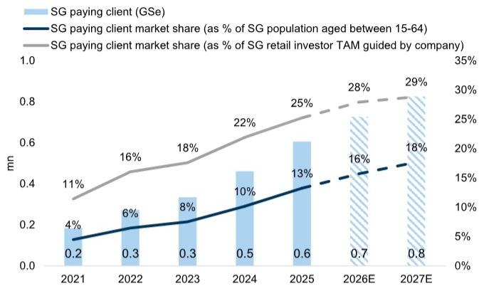

bar_line

| Year | SG paying client (GSe) (mn) | SG paying client market share (as % of SG population aged between 15-64) (%) | SG paying client market share (as % of SG retail investor TAM guided by company) (%) |
|---|---|---|---|
| 2021 | 0.2 | 4 | 11 |
| 2022 | 0.3 | 6 | 16 |
| 2023 | 0.3 | 8 | 18 |
| 2024 | 0.5 | 10 | 22 |
| 2025 | 0.6 | 13 | 25 |
| 2026E | 0.7 | 16 | 28 |
| 2027E | 0.8 | 18 | 29 |

Source: Company data, GS Global Investment Research, Singapore Department of Statistics

Exhibit 7: Moreover, FUTU's market share has been continuously increasing in HK, from $15\%$ in 2021 to $30\%$ in 3Q25, and we expect it to reach $47\%$ by 2027.   
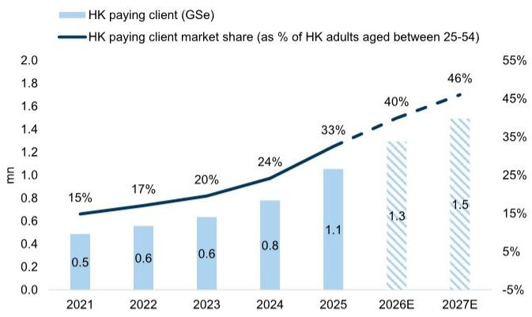

bar_line

| Year | HK paying client (GSe) (mn) | HK paying client market share (as % of HK adults aged between 25-54) (%) |
|---|---|---|
| 2021 | 0.5 | 15 |
| 2022 | 0.6 | 17 |
| 2023 | 0.6 | 20 |
| 2024 | 0.8 | 24 |
| 2025 | 1.1 | 33 |
| 2026E | 1.3 | 40 |
| 2027E | 1.5 | 46 |

Source: Company data, GS Global Investment Research, Hong Kong Census and Statistics Department

# 3. Higher Client Acquisition Cost (CACs) from International Expansion

Both FUTU and TIGR have announced plans to expand into international markets. FUTU aims to enter South Korea as soon as possible, and while it has been cultivating the Japanese market for many years, it has not disclosed user numbers there. Similarly, TIGR is attempting to penetrate new markets such as Australia and New Zealand, which we expect will further escalate its customer acquisition costs.

Entering new markets will require increased investments (e.g. marketing, compliance, localization), which will drive up CAC. Accordingly, we raise our 2026-2027 average CAC estimate for FUTU and TIGR by $8\% / 8\%$ .

Exhibit 8: We raise FUTU's 2026-2027 average CAC by $8\%$ ...   
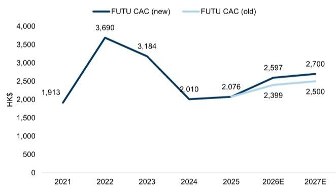

line

| Year | FUTU CAC (new) (HK$) | FUTU CAC (old) (HK$) |
|---|---|---|
| 2021 | 1,913 | - |
| 2022 | 3,690 | - |
| 2023 | 3,184 | - |
| 2024 | 2,010 | - |
| 2025 | 2,076 | 2,076 |
| 2026E | 2,597 | 2,399 |
| 2027E | 2,700 | 2,500 |

Source: Company data, GS Global Investment Research

Exhibit 9: ...and $8\%$ for TIGR   
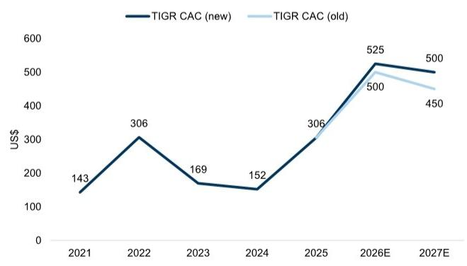

line

| Year | TIGR CAC (new) (US$) | TIGR CAC (old) (US$) |
|---|---|---|
| 2021 | 143 | - |
| 2022 | 306 | - |
| 2023 | 169 | - |
| 2024 | 152 | - |
| 2025 | - | 306 |
| 2026E | 525 | 500 |
| 2027E | 500 | 450 |

Source: Company data, GS Global Investment Research

# 4. Lower AUM per Client After Remediation

Historically, mainland clients have generated higher AUM than clients from other regions- with the management guidance indicating that average AUM per paying client in the Greater China (incl. HK) is several times higher than that of other international markets - implying that average AUM per new client will likely decline after non-compliant mainland accounts are remediated. Accordingly, we have lowered AUM per client for FUTU/TIGR by -6%/-3%.

Exhibit 10: We have lowered AUM per client by -6% for FUTU...   
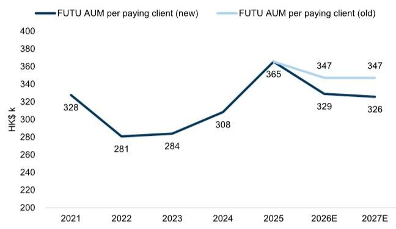

line

| Year | FUTU AUM per paying client (new) (HK$ k) | FUTU AUM per paying client (old) (HK$ k) |
|---|---|---|
| 2021 | 328 | |
| 2022 | 281 | |
| 2023 | 284 | |
| 2024 | 308 | |
| 2025 | 365 | 365 |
| 2026E | 329 | 347 |
| 2027E | 326 | 347 |

Source: Company data, GS Global Investment Research

Exhibit 11: ...and by -3% for TIGR   
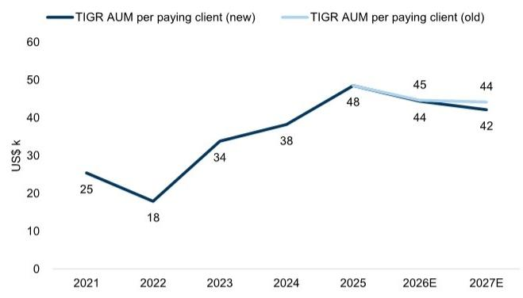

line

| Year | TIGR AUM per paying client (new) (US$ k) | TIGR AUM per paying client (old) (US$ k) |
|---|---|---|
| 2021 | 25 | |
| 2022 | 18 | |
| 2023 | 34 | |
| 2024 | 38 | |
| 2025 | 48 | |
| 2026E | 44 | 45 |
| 2027E | 42 | 44 |

Source: Company data, GS Global Investment Research

# Earnings Outlook

Neither FUTU nor TIGR have updated their new client growth guidance for 2026 (FUTU: 800k; TIGR: 150k). Even in a best case scenario that new client growth reaches guidance, higher corresponding CAC and lower AUM per new client will pressure revenues and profit margins.

For FUTU, we lower 2026-2027 average revenue/profit by $-15\% / -23\%$ .   
For TIGR, we cut 2026-2027 average revenue/profit by $-11\% / -43\%$ . prior.

Our estimates also incorporate the direct impact of fines and remediating non-complaint mainland account AUM (detailed in the prior section).

Exhibit 12: We lower FUTU's 2026-2027 average revenue/profit by $-15\% / -23\%$   
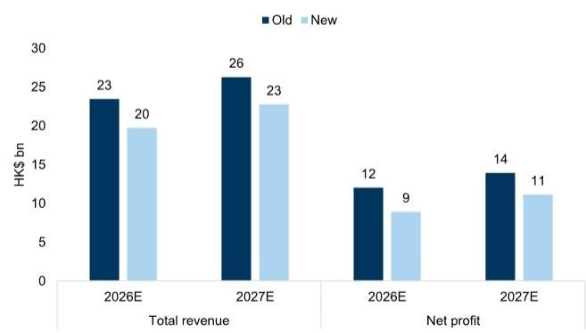

bar

| Category | Year | Old (HK$ bn) | New (HK$ bn) |
| :--- | :--- | :--- | :--- |
| Total revenue | 2026E | 23 | 20 |
| Total revenue | 2027E | 26 | 23 |
| Net profit | 2026E | 12 | 9 |
| Net profit | 2027E | 14 | 11 |

Source: GS Global Investment Research

Exhibit 13: We reduce TIGR's 2026-2027 average revenue/profit by $-11\% / -43\%$   
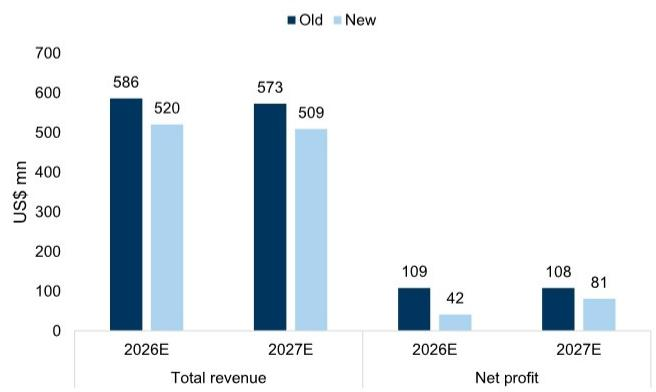

bar

| Category | Year | Old (US$ mn) | New (US$ mn) |
| :--- | :--- | :--- | :--- |
| Total revenue | 2026E | 586 | 520 |
| Total revenue | 2027E | 573 | 509 |
| Net profit | 2026E | 109 | 42 |
| Net profit | 2027E | 108 | 81 |

Source: GS Global Investment Research

# Valuation Anchored to Regulatory Action and Capital Market Volatility

In our view, capital market volatility and regulatory actions are the primary factors driving valuation levels of FUTU and TIGR.

Taking FUTU as an example, its P/E valuation has ranged from 9x-25x from December 2021 to the present, with a median of 14x.

Regulatory tightening escalated on December 30, 2022, when the CSRC prohibited FUTU and TIGR from adding new mainland clients but permitting existing ones to remain. During the 2023-2024 bear market in HK and the volatile US market, FUTU traded below 15x for most of the period, supported by the profit growth of $49\% / 26\%$ in 2023 and 2024, resulting in cumulative stock price change of $+98\%$ . TIGR enjoyed a similar return over the same period $(+91\%)$ , with net profit growth of $-1,563\% / +86\%$ .

The May 22 announcement is more stringent than the December 30, 2022 regulatory cycle, which allowed existing mainland accounts to continue generating revenue by not suspending services. In contrast, services for existing accounts will be suspended, effectively eliminating their revenue contribution.

Although the capital market backdrop is currently more favorable than in 2023-2024, the regulatory change necessitates a downward revision to our forecasts. All in, we have lowered our average 2026-2027 net profit estimates for FUTU and TIGR by -23%/-43%.

Given the magnitude of the earnings revision, we now assign target P/E multiples to FUTU and TIGR of $10\mathrm{x} / 9\mathrm{x}$ (from $19\mathrm{x} / 10\mathrm{x}$ ), at the lower end of the historical valuation range in 2023-24.

Given the stricter regulatory backdrop and lower earnings, we downgrade FUTU to Neutral from Buy, with a corresponding of 12-month TP US\$102.13, implying +14% upsides (see our separate report here). We maintain our Sell rating on TIGR, with our new of 12-month TP of US\$ 4.10 implying -6% downside.

Exhibit 14: FUTU valuation range   
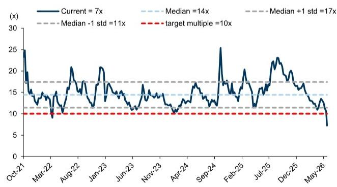

line

| Date    | Current | Median | Median +1 std | Median -1 std | target multiple |
|---------|---------|--------|---------------|--------------|-----------------|
| Oct-21  | 25      | 14     | 17            | 11           | 10              |
| Mar-22  | 10      | 14     | 17            | 11           | 10              |
| Aug-22  | 20      | 14     | 17            | 11           | 10              |
| Jan-23  | 20      | 14     | 17            | 11           | 10              |
| Jun-23  | 15      | 14     | 17            | 11           | 10              |
| Nov-23  | 15      | 14     | 17            | 11           | 10              |
| Apr-24  | 10      | 14     | 17            | 11           | 10              |
| Sep-24  | 25      | 14     | 17            | 11           | 10              |
| Feb-25  | 20      | 14     | 17            | 11           | 10              |
| Jul-25  | 25      | 14     | 17            | 11           | 10              |
| Dec-25  | 20      | 14     | 17            | 11           | 10              |
| May-26  | 8       | 14     | 17            | 11           | 10              |

Source: Wind, GS Global Investment Research

Exhibit 15: FUTU 12M P/E vs. AUM growth   
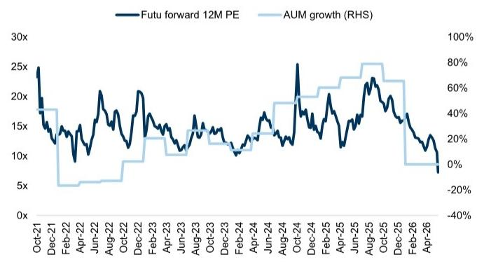

line

| Date    | Futu forward 12M PE | AUM growth (RHS) |
|---------|---------------------|------------------|
| Oct-21  | 25x                 | 100%             |
| Dec-21  | 15x                 | 50%              |
| Feb-22  | 10x                 | -20%             |
| Apr-22  | 15x                 | -20%             |
| Jun-22  | 20x                 | -20%             |
| Aug-22  | 15x                 | -20%             |
| Oct-22  | 20x                 | -20%             |
| Dec-22  | 15x                 | -20%             |
| Feb-23  | 10x                 | -20%             |
| Apr-23  | 15x                 | -20%             |
| Jun-23  | 10x                 | -20%             |
| Aug-23  | 15x                 | -20%             |
| Oct-23  | 10x                 | -20%             |
| Dec-23  | 15x                 | -20%             |
| Feb-24  | 10x                 | -20%             |
| Apr-24  | 15x                 | -20%             |
| Jun-24  | 10x                 | -20%             |
| Aug-24  | 15x                 | -20%             |
| Oct-24  | 25x                 | -20%             |
| Dec-24  | 15x                 | -20%             |
| Feb-25  | 10x                 | -20%             |
| Apr-25  | 15x                 | -20%             |
| Jun-25  | 20x                 | -20%             |
| Aug-25  | 15x                 | -20%             |
| Oct-25  | 10x                 | -20%             |
| Dec-25  | 15x                 | -20%             |
| Feb-26  | 10x                 | -20%             |
| Apr-26  | 5x                  | -40%             |

Source: Company data, GS Global Investment Research, Wind

Exhibit 16: TIGR valuation range   
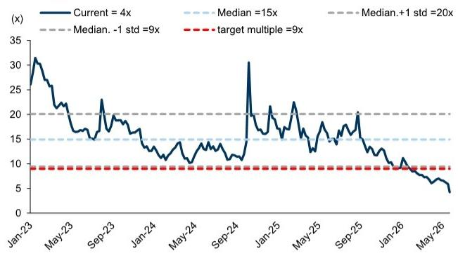

line

| Date   | Current | Median | Median.+1 std | Median.-1 std | target multiple |
|--------|---------|--------|---------------|--------------|-----------------|
| Jan-23 | 30      | 15     | 20            | 9            | 9               |
| May-23 | 25      | 15     | 20            | 9            | 9               |
| Sep-23 | 20      | 15     | 20            | 9            | 9               |
| Jan-24 | 15      | 15     | 20            | 9            | 9               |
| May-24 | 10      | 15     | 20            | 9            | 9               |
| Sep-24 | 30      | 15     | 20            | 9            | 9               |
| Jan-25 | 20      | 15     | 20            | 9            | 9               |
| May-25 | 15      | 15     | 20            | 9            | 9               |
| Sep-25 | 20      | 15     | 20            | 9            | 9               |
| Jan-26 | 10      | 15     | 20            | 9            | 9               |
| May-26 | 5       | 15     | 20            | 9            | 9               |

Source: Wind, GS Global Investment Research

Exhibit 17: FUTU 12M P/E vs. AUM growth   
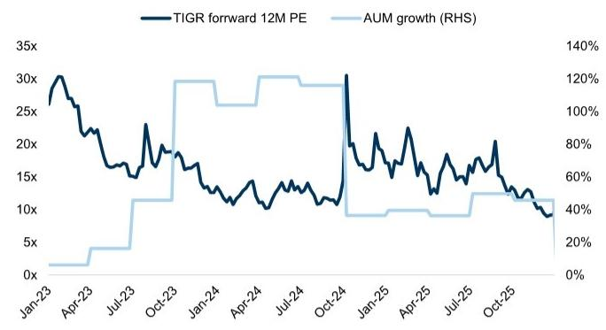

line

| Date   | TIGR forward 12M PE | AUM growth (RHS) |
|--------|---------------------|------------------|
| Jan-23 | ~30x                | ~0%              |
| Apr-23 | ~25x                | ~20%             |
| Jul-23 | ~18x                | ~60%             |
| Oct-23 | ~15x                | ~120%            |
| Jan-24 | ~12x                | ~100%            |
| Apr-24 | ~10x                | ~80%             |
| Jul-24 | ~15x                | ~60%             |
| Oct-24 | ~30x                | ~40%             |
| Jan-25 | ~25x                | ~40%             |
| Apr-25 | ~20x                | ~40%             |
| Jul-25 | ~15x                | ~40%             |
| Oct-25 | ~10x                | ~40%             |

Source: Company data, GS Global Investment Research, Wind

Exhibit 18: FUTU Model Revision   
HK\$ mn 

<table><tr><td rowspan="2">FUTU
In HK$ mn</td><td colspan="3">New</td><td colspan="3">Old</td><td colspan="3">Changes</td></tr><tr><td>2026E</td><td>2027E</td><td>2028E</td><td>2026E</td><td>2027E</td><td>2028E</td><td>2026E</td><td>2027E</td><td>2028E</td></tr><tr><td>Drivers</td><td></td><td></td><td></td><td></td><td></td><td></td><td></td><td></td><td></td></tr><tr><td>Paying clients (k)</td><td>3,701</td><td>4,360</td><td>4,963</td><td>4,168</td><td>4,827</td><td>5,430</td><td>(11%)</td><td>(10%)</td><td>(9%)</td></tr><tr><td>yoy</td><td>10%</td><td>18%</td><td>14%</td><td>24%</td><td>16%</td><td>12%</td><td>-13.9pp</td><td>2.0pp</td><td>1.3pp</td></tr><tr><td>New paying client (k)</td><td>335</td><td>659</td><td>603</td><td>802</td><td>659</td><td>603</td><td>(58%)</td><td>-</td><td>-</td></tr><tr><td>Client acquisition cost per new paying client (HK$)</td><td>-2,597</td><td>-2,700</td><td>-2,700</td><td>-2,399</td><td>-2,500</td><td>-2,500</td><td>8%</td><td>8%</td><td>8%</td></tr><tr><td>Client assets (HK$ bn)</td><td>1,217</td><td>1,420</td><td>1,616</td><td>1,447</td><td>1,676</td><td>1,885</td><td>(16%)</td><td>(15%)</td><td>(14%)</td></tr><tr><td>Per paying client asset (HK$ k)</td><td>329</td><td>326</td><td>326</td><td>347</td><td>347</td><td>347</td><td>(5%)</td><td>(6%)</td><td>(6%)</td></tr><tr><td>Trading volume (HK$ bn)</td><td>16,099</td><td>17,080</td><td>19,626</td><td>17,250</td><td>20,334</td><td>23,099</td><td>(7%)</td><td>(16%)</td><td>(15%)</td></tr><tr><td>yoy</td><td>10%</td><td>6%</td><td>15%</td><td>17%</td><td>18%</td><td>14%</td><td>-7.8pp</td><td>-11.8pp</td><td>1.3pp</td></tr><tr><td>Trading velocity</td><td>13x</td><td>13x</td><td>13x</td><td>13x</td><td>13x</td><td>13x</td><td>0.3x</td><td>-0.1x</td><td>0.0x</td></tr><tr><td>Margin finance balance</td><td>66,950</td><td>78,089</td><td>88,883</td><td>69,458</td><td>80,447</td><td>90,490</td><td>(4%)</td><td>(3%)</td><td>(2%)</td></tr><tr><td>ARPU (HK$)</td><td>5,337</td><td>5,203</td><td>5,199</td><td>5,625</td><td>5,444</td><td>5,497</td><td>(5%)</td><td>(4%)</td><td>(5%)</td></tr><tr><td>Cost to income ratio</td><td>36%</td><td>33%</td><td>31%</td><td>30%</td><td>28%</td><td>27%</td><td>6.6pp</td><td>4.7pp</td><td>4.6pp</td></tr><tr><td>Leverage (excl. client deposit)</td><td>2.6x</td><td>2.3x</td><td>2.1x</td><td>2.1x</td><td>2.1x</td><td>3.3x</td><td>0.5x</td><td>0.2x</td><td>-1.1x</td></tr><tr><td>Income statement</td><td></td><td></td><td></td><td></td><td></td><td></td><td></td><td></td><td></td></tr><tr><td>Total revenue</td><td>19,750</td><td>22,685</td><td>25,799</td><td>23,445</td><td>26,278</td><td>29,846</td><td>(16%)</td><td>(14%)</td><td>(14%)</td></tr><tr><td>yoy</td><td>-12%</td><td>15%</td><td>14%</td><td>4%</td><td>12%</td><td>14%</td><td>-16%</td><td>3%</td><td>0%</td></tr><tr><td>Brokerage commission</td><td>11,270</td><td>11,956</td><td>13,738</td><td>12,075</td><td>14,234</td><td>16,169</td><td>(7%)</td><td>(16%)</td><td>(15%)</td></tr><tr><td>Interest income</td><td>9,350</td><td>9,423</td><td>10,749</td><td>9,717</td><td>10,358</td><td>11,961</td><td>(4%)</td><td>(9%)</td><td>(10%)</td></tr><tr><td>Total expense and costs</td><td>(8,927)</td><td>(9,293)</td><td>(10,261)</td><td>(8,796)</td><td>(9,320)</td><td>(10,220)</td><td>1%</td><td>(0%)</td><td>0%</td></tr><tr><td>Net income</td><td>8,924</td><td>11,077</td><td>12,849</td><td>12,016</td><td>13,910</td><td>16,098</td><td>(26%)</td><td>(20%)</td><td>(20%)</td></tr><tr><td>yoy</td><td>-21%</td><td>24%</td><td>16%</td><td>6%</td><td>16%</td><td>16%</td><td>-27.4pp</td><td>8.4pp</td><td>0.3pp</td></tr></table>

Source: GS Global Investment Research

Exhibit 19: TIGR Model Revision

US\$ mn

<table><tr><td rowspan="2">TIGR
In US$ mn</td><td colspan="3">New</td><td colspan="3">Old</td><td colspan="3">Changes</td></tr><tr><td>2026E</td><td>2027E</td><td>2028E</td><td>2026E</td><td>2027E</td><td>2028E</td><td>2026E</td><td>2027E</td><td>2028E</td></tr><tr><td>Drivers</td><td></td><td></td><td></td><td></td><td></td><td></td><td></td><td></td><td></td></tr><tr><td>Paying clients (k)</td><td>1,278</td><td>1,387</td><td>1,485</td><td>1,406</td><td>1,525</td><td>1,633</td><td>(9%)</td><td>(9%)</td><td>(9%)</td></tr><tr><td>yoy</td><td>2%</td><td>8%</td><td>7%</td><td>12%</td><td>8%</td><td>7%</td><td>-10ppts</td><td>0ppts</td><td>0ppts</td></tr><tr><td>New paying client (k)</td><td>24</td><td>109</td><td>99</td><td>152</td><td>119</td><td>108</td><td>(84%)</td><td>(8%)</td><td>(9%)</td></tr><tr><td>Client acquisition cost (US$)</td><td>-525</td><td>-500</td><td>-450</td><td>-500</td><td>-450</td><td>-400</td><td>5%</td><td>11%</td><td>13%</td></tr><tr><td>Client assets</td><td>56,719</td><td>58,459</td><td>61,991</td><td>62,744</td><td>67,352</td><td>71,396</td><td>(10%)</td><td>(13%)</td><td>(13%)</td></tr><tr><td>Per paying client asset (US$ k)</td><td>44</td><td>42</td><td>42</td><td>45</td><td>44</td><td>44</td><td>(1%)</td><td>(5%)</td><td>(5%)</td></tr><tr><td>Trading volume (US$ bn)</td><td>1,019</td><td>802</td><td>756</td><td>1,028</td><td>941</td><td>865</td><td>(1%)</td><td>(15%)</td><td>(13%)</td></tr><tr><td>yoy</td><td>-1%</td><td>-21%</td><td>-6%</td><td>0%</td><td>-8%</td><td>-8%</td><td>-1ppts</td><td>-13ppts</td><td>2ppts</td></tr><tr><td>Trading velocity</td><td>17.3x</td><td>13.9x</td><td>12.6x</td><td>16.6x</td><td>14.5x</td><td>12.5x</td><td>0.7x</td><td>-0.5x</td><td>0.1x</td></tr><tr><td>Margin finance balance</td><td>5,105</td><td>5,261</td><td>5,579</td><td>5,647</td><td>6,062</td><td>6,426</td><td>(10%)</td><td>(13%)</td><td>(13%)</td></tr><tr><td>ARPU (US$)</td><td>407</td><td>367</td><td>340</td><td>417</td><td>375</td><td>347</td><td>(2%)</td><td>(2%)</td><td>(2%)</td></tr><tr><td>Cost to income ratio</td><td>76%</td><td>68%</td><td>66%</td><td>65%</td><td>64%</td><td>64%</td><td>11ppts</td><td>3ppts</td><td>3ppts</td></tr><tr><td>Leverage (excl. client deposit)</td><td>5.2x</td><td>4.9x</td><td>4.8x</td><td>5.3x</td><td>5.1x</td><td>4.9x</td><td>-0.1x</td><td>-0.2x</td><td>-0.1x</td></tr><tr><td>Income statement</td><td></td><td></td><td></td><td></td><td></td><td></td><td></td><td></td><td></td></tr><tr><td>Total revenue</td><td>520</td><td>509</td><td>505</td><td>586</td><td>573</td><td>566</td><td>(11%)</td><td>(11%)</td><td>(11%)</td></tr><tr><td>yoy</td><td>-15%</td><td>-2%</td><td>-1%</td><td>-4%</td><td>-2%</td><td>-1%</td><td>-11ppts</td><td>0ppts</td><td>0ppts</td></tr><tr><td>Brokerage commission</td><td>224</td><td>176</td><td>166</td><td>226</td><td>207</td><td>190</td><td>(1%)</td><td>(15%)</td><td>(13%)</td></tr><tr><td>Interest income</td><td>274</td><td>248</td><td>253</td><td>277</td><td>281</td><td>289</td><td>(1%)</td><td>(12%)</td><td>(13%)</td></tr><tr><td>Total expense and costs</td><td>(470)</td><td>(411)</td><td>(401)</td><td>(454)</td><td>(442)</td><td>(433)</td><td>3%</td><td>(7%)</td><td>(8%)</td></tr><tr><td>Attributable profit</td><td>42</td><td>81</td><td>86</td><td>109</td><td>108</td><td>110</td><td>(62%)</td><td>(25%)</td><td>(21%)</td></tr><tr><td>yoy</td><td>-76%</td><td>95%</td><td>7%</td><td>-36%</td><td>-1%</td><td>2%</td><td>-39ppts</td><td>95ppts</td><td>5ppts</td></tr></table>

Source: GS Global Investment Research

# What We Will Be Monitoring; Bull/Base/Bear Case Scenarios

1. Timing of fine payment, which will likely have a significant impact on quarterly results for that period.   
2. The progress in remediating non-compliant mainland accounts, primarily as an indicator of regulatory execution and potential secondary compliance risks.   
3. Whether 2026 guidance for new client growth guidance will be lowered, and the pace of expansion into non-China markets and degree of disclosure around that expansion.   
4. Whether AUM per new client declines meaningfully, which could cause total AUM growth to fall short of expectations and weigh on earnings growth, even if new client additions meet company guidance.

To better reflect the impact of these factors, we model three scenarios for FUTU and TIGR's earnings, along with their corresponding valuation multiples.

Base Case: This scenario reflects our current outlook. Fines and remediation of non-compliant accounts drive up CAC and reduce AUM per client, while target P/E is set at the median level of the 2023-2024 regulatory tightening cycle.

FUTU: 2026/27E net profit falls to HK\$ 9/11bn (-26%/-20%). CAC is 8%/8% higher and AUM per client is -5%/-6% lower. Our target P/E is 10x, implying a valuation of US\$ 102 and an upside of 14%.

TIGR: 2026/27E net profit falls to US\$ 42/81mn (-62%/-25%). CAC is 5%/11% higher and AUM per client is -1%/-5% lower. Our target P/E is 9x, implying a valuation of US\$ 4 and a downside of -6%.

Bear Case: Relative to our base case, CAC rises to double the base case level, AUM per client falls even more than our base case, and target P/E falls to the lowest level observed during 2023-2024 regulatory cycle. This scenario reflects a weaker capital market backdrop and stricter regulatory enforcement.

■ FUTU: 2026/27E net profit is -12%/-16% lower than our Base Case. CAC is 16%/11% higher, AUM per client is -11%/-10% lower, and our 2027E target P/E is 9x, implying a valuation of US\$ 77 and a downside of -15%.   
TIGR: 2026/27E net profit is -35%/-31% lower than our Base Case. CAC is 5%/10% higher, AUM per client is -7%/-7% lower, and our 2027E target P/E is 8x, implying a valuation of US\$ 3 and a downside of -42%.

Bull Case: Compared to our base case, CAC declines, AUM per client increases, and target P/E returns to near the median level of the 2023-2024 regulatory cycle. This reflects a strengthening capital market as seen in 2024-25 and diminishing regulatory risks.

■ FUTU: 2026/27E net profit is 14%/20% above our Base Case. CAC is -23%/-26% lower, AUM per client is 11%/12% higher, and our 2027E target P/E is 14x, implying a valuation of US\$ 171 and an upside of 91%.   
For TIGR: 2026/27E net profit is 37%/19% above our Base Case. CAC is -14%/-10% lower, AUM per client is 4%/4% higher, and the target 2027E P/E is 11x, implying a valuation of US\$ 6 and an upside of 38%.

Exhibit 20: Scenario analysis - FUTU 

<table><tr><td rowspan="2">FUTUHK$ mn</td><td></td><td></td><td colspan="3">Base case (GSe)</td><td colspan="2">Bear Case</td><td colspan="2">Bull Case</td></tr><tr><td>2023</td><td>2024</td><td>2025</td><td>2026E</td><td>2027E</td><td>2026E</td><td>2027E</td><td>2026E</td><td>2027E</td></tr><tr><td>Paying client (k)</td><td>1,710</td><td>2,411</td><td>3,365</td><td>3,701</td><td>4,360</td><td>3,701</td><td>4,360</td><td>3,701</td><td>4,360</td></tr><tr><td>yoy</td><td>15%</td><td>41%</td><td>40%</td><td>10%</td><td>18%</td><td>10%</td><td>18%</td><td>10%</td><td>18%</td></tr><tr><td>Net new paying client (k)</td><td>223</td><td>701</td><td>954</td><td>335</td><td>659</td><td>335</td><td>659</td><td>335</td><td>659</td></tr><tr><td>Marketing expense</td><td>710</td><td>1,409</td><td>1,980</td><td>2,084</td><td>1,780</td><td>2,407</td><td>1,978</td><td>1,604</td><td>1,319</td></tr><tr><td>CAC (HK$)</td><td>3,184</td><td>2,010</td><td>2,076</td><td>2,597</td><td>2,700</td><td>3,000</td><td>3,000</td><td>2,000</td><td>2,000</td></tr><tr><td>vs. base case (%)</td><td></td><td></td><td></td><td></td><td></td><td>16%</td><td>11%</td><td>-23%</td><td>-26%</td></tr><tr><td>AUM per paying client (HK$ k)</td><td>284</td><td>308</td><td>365</td><td>329</td><td>326</td><td>292</td><td>292</td><td>365</td><td>365</td></tr><tr><td>yoy</td><td>1%</td><td>9%</td><td>19%</td><td>-10%</td><td>-1%</td><td>-20%</td><td>0%</td><td>0%</td><td>0%</td></tr><tr><td>vs. base case (%)</td><td></td><td></td><td></td><td></td><td></td><td>-11%</td><td>-10%</td><td>11%</td><td>12%</td></tr><tr><td>Total AUM</td><td>485,600</td><td>743,300</td><td>1,230,000</td><td>1,217,265</td><td>1,419,808</td><td>1,082,013</td><td>1,274,799</td><td>1,352,517</td><td>1,593,499</td></tr><tr><td>yoy</td><td>16%</td><td>53%</td><td>65%</td><td>-1%</td><td>17%</td><td>-12%</td><td>18%</td><td>10%</td><td>18%</td></tr><tr><td>Turnover</td><td>9x</td><td>13x</td><td>15x</td><td>13x</td><td>13x</td><td>13x</td><td>13x</td><td>13x</td><td>13x</td></tr><tr><td colspan="10"></td></tr><tr><td>Revenue</td><td>10,042</td><td>13,504</td><td>22,479</td><td>19,750</td><td>22,685</td><td>18,603</td><td>20,413</td><td>20,897</td><td>25,189</td></tr><tr><td>NPAT</td><td>4,279</td><td>5,433</td><td>11,302</td><td>8,924</td><td>11,077</td><td>7,819</td><td>9,252</td><td>10,158</td><td>13,290</td></tr><tr><td>EPS (US$)</td><td>4.0</td><td>5.0</td><td>10.4</td><td>8.2</td><td>10.2</td><td>7.2</td><td>8.5</td><td>9.3</td><td>12.2</td></tr><tr><td>yoy</td><td>49%</td><td>26%</td><td>106%</td><td>-21%</td><td>24%</td><td>-31%</td><td>18%</td><td>-10%</td><td>31%</td></tr><tr><td>vs. base case (%)</td><td></td><td></td><td></td><td></td><td></td><td>-12%</td><td>-16%</td><td>14%</td><td>20%</td></tr><tr><td colspan="10"></td></tr><tr><td colspan="10">Trading PE</td></tr><tr><td>Median</td><td>14x</td><td>13x</td><td>17x</td><td></td><td></td><td></td><td></td><td></td><td></td></tr><tr><td>Max</td><td>17x</td><td>25x</td><td>23x</td><td></td><td></td><td></td><td></td><td></td><td></td></tr><tr><td>Min</td><td>11x</td><td>10x</td><td>11x</td><td></td><td></td><td></td><td></td><td></td><td></td></tr><tr><td>Applied P/E</td><td></td><td></td><td></td><td></td><td>10x</td><td></td><td>9x</td><td></td><td>14x</td></tr><tr><td>Implied valuation (US$)</td><td></td><td></td><td></td><td></td><td>102</td><td></td><td>77</td><td></td><td>171</td></tr><tr><td>Upside/Downside</td><td></td><td></td><td></td><td></td><td>14%</td><td></td><td>-15%</td><td></td><td>91%</td></tr></table>

Source: Company data, GS Global Investment Research

Exhibit 21: Scenario analysis - TIGR 

<table><tr><td rowspan="2">TIGRUS$ mn</td><td colspan="5">Base case (GSe)</td><td colspan="2">Bear Case</td><td colspan="2">Bull Case</td></tr><tr><td>2023</td><td>2024</td><td>2025</td><td>2026E</td><td>2027E</td><td>2026E</td><td>2027E</td><td>2026E</td><td>2027E</td></tr><tr><td>Paying client (k)</td><td>905</td><td>1,092</td><td>1,254</td><td>1,278</td><td>1,387</td><td>1,278</td><td>1,387</td><td>1,278</td><td>1,387</td></tr><tr><td>yoy</td><td>16%</td><td>21%</td><td>15%</td><td>2%</td><td>8%</td><td>2%</td><td>8%</td><td>2%</td><td>8%</td></tr><tr><td>Net new paying client (k)</td><td>123</td><td>187</td><td>162</td><td>24</td><td>109</td><td>24</td><td>109</td><td>24</td><td>109</td></tr><tr><td>Marketing expense</td><td>21</td><td>29</td><td>49</td><td>80</td><td>54</td><td>84</td><td>60</td><td>69</td><td>49</td></tr><tr><td>CAC (US$)</td><td>169</td><td>152</td><td>306</td><td>525</td><td>500</td><td>550</td><td>550</td><td>450</td><td>450</td></tr><tr><td>vs. base case (%)</td><td></td><td></td><td></td><td></td><td></td><td>5%</td><td>10%</td><td>-14%</td><td>-10%</td></tr><tr><td>AUM per paying client (US$ k)</td><td>34</td><td>38</td><td>48</td><td>44</td><td>42</td><td>41</td><td>39</td><td>46</td><td>44</td></tr><tr><td>yoy</td><td>89%</td><td>13%</td><td>27%</td><td>-9%</td><td>-5%</td><td>-15%</td><td>-5%</td><td>-5%</td><td>-5%</td></tr><tr><td>vs. base case (%)</td><td></td><td></td><td></td><td></td><td></td><td>-7%</td><td>-7%</td><td>4%</td><td>4%</td></tr><tr><td>Total AUM</td><td>30,598</td><td>41,725</td><td>60,807</td><td>56,719</td><td>58,459</td><td>52,690</td><td>54,306</td><td>58,888</td><td>60,695</td></tr><tr><td>yoy</td><td>118%</td><td>36%</td><td>46%</td><td>-7%</td><td>3%</td><td>-13%</td><td>3%</td><td>-3%</td><td>3%</td></tr><tr><td>Turnover</td><td>13x</td><td>15x</td><td>20x</td><td>17x</td><td>14x</td><td>17x</td><td>14x</td><td>17x</td><td>14x</td></tr><tr><td colspan="10"></td></tr><tr><td>Revenue</td><td>286</td><td>395</td><td>611</td><td>520</td><td>509</td><td>503</td><td>479</td><td>530</td><td>525</td></tr><tr><td>NPAT</td><td>33</td><td>61</td><td>171</td><td>42</td><td>81</td><td>27</td><td>57</td><td>58</td><td>97</td></tr><tr><td>EPS (US$)</td><td>0.21</td><td>0.36</td><td>0.97</td><td>0.24</td><td>0.46</td><td>0.15</td><td>0.32</td><td>0.33</td><td>0.55</td></tr><tr><td>yoy</td><td>-1542%</td><td>70%</td><td>168%</td><td>-75%</td><td>94%</td><td>-84%</td><td>107%</td><td>-66%</td><td>68%</td></tr><tr><td>vs. base case (%)</td><td></td><td></td><td></td><td></td><td></td><td>-35%</td><td>-31%</td><td>37%</td><td>19%</td></tr><tr><td colspan="10"></td></tr><tr><td>Trading PE</td><td></td><td></td><td></td><td></td><td></td><td></td><td></td><td></td><td></td></tr><tr><td>Median</td><td>18x</td><td>13x</td><td>15x</td><td></td><td></td><td></td><td></td><td></td><td></td></tr><tr><td>Max</td><td>31x</td><td>31x</td><td>22x</td><td></td><td></td><td></td><td></td><td></td><td></td></tr><tr><td>Min</td><td>13x</td><td>10x</td><td>9x</td><td></td><td></td><td></td><td></td><td></td><td></td></tr><tr><td>Applied P/E</td><td></td><td></td><td></td><td></td><td>9x</td><td></td><td>8x</td><td></td><td>11x</td></tr><tr><td>Implied valuation (US$)</td><td></td><td></td><td></td><td></td><td>4</td><td></td><td>3</td><td></td><td>6</td></tr><tr><td>Upside/Downside</td><td></td><td></td><td></td><td></td><td>-6%</td><td></td><td>-42%</td><td></td><td>38%</td></tr></table>

Source: Company data, GS Global Investment Research

# Price Target Risks and Methodology - FUTU Holdings

We are Neutral rated on FUTU with a 12-month TP of US\$102.13, based on a 12m forward 2027E P/E of 10x.

Downside Risks: 1) Further regulatory tightening, higher than expected AUM outflow, and lower new client and AUM growth in ex-mainland China markets; 2) A prolonged or meaningful downturn in the stock market leads to a decrease in the value of client AUM, and a greater-than-expected decline in client turnover rates; 3) A larger-than-expected decline in interest income after the U.S. Federal Reserve cuts interest rates.

# Price Target Risks and Methodology - UP Fintech Holding

We are Sell rated on TIGR with a 12-month TP of US\$ 4.10, based on a 12m forward 2027E P/E of 9x.

Upside risks: 1) better-than-expected paying client growth, 2) better-than-expected AUM growth, 3) better-than-expected stock market capitalization and trading volume growth, 4) better-than-expected cost control.

# Disclosure Appendix

# Reg AC

We, Shuo Yang, Ph.D. and Claire Ouyang, hereby certify that all of the views expressed in this report accurately reflect our personal views about the subject company or companies and its or their securities. We also certify that no part of our compensation was, is or will be, directly or indirectly, related to the specific recommendations or views expressed in this report.

Unless otherwise stated, the individuals listed on the cover page of this report are analysts in GS' Global Investment Research division.

Contributing Authors: Shuo Yang, Ph.D. GS (Asia) L.L.C., Claire Ouyang GS (Asia) L.L.C..

Unless otherwise stated, the individuals listed in the Contributing Authors disclosure of this report are analysts in GS' Global Investment Research division.

# GS Factor Profile

The GS Factor Profile provides investment context for a stock by comparing key attributes to the market (i.e. our universe of rated stocks) and its sector peers. The four key attributes depicted are: Growth, Financial Returns, Multiple (e.g. valuation) and Integrated (a composite of Growth, Financial Returns and Multiple). Growth, Financial Returns and Multiple are calculated by using normalized ranks for specific metrics for each stock. The normalized ranks for the metrics are then averaged and converted into percentiles for the relevant attribute. The precise calculation of each metric may vary depending on the fiscal year, industry and region, but the standard approach is as follows:

Growth is based on a stock's forward-looking sales growth, EBITDA growth and EPS growth (for financial stocks, only EPS and sales growth), with a higher percentile indicating a higher growth company. Financial Returns is based on a stock's forward-looking ROE, ROCE and CROCI (for financial stocks, only ROE), with a higher percentile indicating a company with higher financial returns. Multiple is based on a stock's forward-looking P/E, P/B, price/dividend (P/D), EV/EBITDA, EV/FCF and EV/Debt Adjusted Cash Flow (DACF) (for financial stocks, only P/E, P/B and P/D), with a higher percentile indicating a stock trading at a higher multiple. The Integrated percentile is calculated as the average of the Growth percentile, Financial Returns percentile and (100% - Multiple percentile).

Financial Returns and Multiple use the GS analyst forecasts at the fiscal year-end at least three quarters in the future. Growth uses inputs for the fiscal year at least seven quarters in the future compared with the year at least three quarters in the future (on a per-share basis for all metrics).

For a more detailed description of how we calculate the GS Factor Profile, please contact your GS representative.

# M&A Rank

Across our global coverage, we examine stocks using an M&A framework, considering both qualitative factors and quantitative factors (which may vary across sectors and regions) to incorporate the potential that certain companies could be acquired. We then assign a M&A rank as a means of scoring companies under our rated coverage from 1 to 3, with 1 representing high (30%-50%) probability of the company becoming an acquisition target, 2 representing medium (15%-30%) probability and 3 representing low (0%-15%) probability. For companies ranked 1 or 2, in line with our standard departmental guidelines we incorporate an M&A component into our target price. M&A rank of 3 is considered immaterial and therefore does not factor into our price target, and may or may not be discussed in research.

# Quantum

Quantum is GS' proprietary database providing access to detailed financial statement histories, forecasts and ratios. It can be used for in-depth analysis of a single company, or to make comparisons between companies in different sectors and markets.

# Disclosures

The rating(s) for Futu Holdings and UP Fintech Holding is/are relative to the other companies in its/their coverage universe: CITIC Co. (H), CITIC Co.(A), China International Capital Corp. (A), China International Capital Corp. (H), East Money Information Co., Futu Holdings, GF Securities Co. (A), GF Securities Co.(H), Hundsun, UP Fintech Holding

# Company-specific regulatory disclosures

The following disclosures relate to relationships between The GS Group, Inc. (with its affiliates, “GS”) and companies covered by GS Global Investment Research and referred to in this research.

GS has received compensation for investment banking services in the past 12 months: Futu Holdings (\$89.76)

GS expects to receive or intends to seek compensation for investment banking services in the next 3 months: Futu Holdings (\$89.76)

GS has received compensation for non-investment banking services during the past 12 months: Futu Holdings (\$89.76)

GS had an investment banking services client relationship during the past 12 months with: Futu Holdings (\$89.76)

GS had a non-investment banking securities-related services client relationship during the past 12 months with: Futu Holdings (\$89.76)

GS makes a market in the securities or derivatives thereof: Futu Holdings (\$89.76) and UP Fintech Holding (\$4.36)

# Distribution of ratings/investment banking relationships

GS Investment Research global Equity coverage universe

<table><tr><td rowspan="2"></td><td colspan="3">Rating Distribution</td><td colspan="3">Investment Banking Relationships</td></tr><tr><td>Buy</td><td>Hold</td><td>Sell</td><td>Buy</td><td>Hold</td><td>Sell</td></tr><tr><td>Global</td><td>50%</td><td>34%</td><td>16%</td><td>65%</td><td>60%</td><td>45%</td></tr></table>

As of April 1, 2026, GS Global Investment Research had investment ratings on 3,074 equity securities. GS assigns stocks as Buys and Sells on various regional Investment Lists; stocks not so assigned are deemed Neutral. Such assignments equate to Buy, Hold and Sell for the purposes of the above disclosure required by the FINRA Rules. See ‘Ratings, Coverage universe and related definitions’ below. The Investment Banking Relationships chart reflects the percentage of subject companies within each rating category for whom GS has provided investment

banking services within the previous twelve months.

Price target and rating history chart(s)   
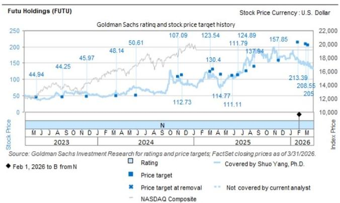  
The price targets shown should be considered in the context of all prior published GS, which may or may not have included price targets, as well as developments relating to the company, its industry and financial markets.

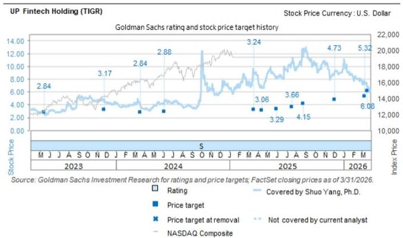

line

| Date       | Stock Price | Index Price |
|------------|-------------|-------------|
| M Mar 2023 | 2.84        | 3.17        |
| J Mar 2023 | 3.17        | 2.84        |
| A Jun 2023 | 2.88        | 2.88        |
| S Oct 2023 | 3.24        | 3.29        |
| N Dec 2023 | 3.66        | 4.15        |
| F Mar 2024 | 4.73        | 5.32        |
| M Jun 2024 | 6.08        |             |
| A Aug 2024 |             |             |
| A Sep 2024 |             |             |
| A Jan 2025 |             |             |
| A Apr 2025 |             |             |
| S Oct 2025 |             |             |
| N Dec 2025 |             |             |
| O Nov 2025 |             |             |
| D Feb 2026 |             |             |
| F Mar 2026 |             |             |
| M Mar 2026 |             |             |
Source: GS Investment Research for ratings and price targets; FactSet closing prices as of 3/31/2026.

The price targets shown should be considered in the context of all prior published GS, which may or may not have included price targets, as well as developments relating to the company, its industry and financial markets.

Target price history table(s)   
UP Fintech Holding (TIGR) 

<table><tr><td>Date of report</td><td>Target price ($)</td><td>Closing price ($)</td></tr><tr><td>20-Mar-26</td><td>6.08</td><td>6.57</td></tr><tr><td>12-Mar-26</td><td>5.32</td><td>7.35</td></tr><tr><td>04-Dec-25</td><td>4.73</td><td>9.01</td></tr><tr><td>27-Aug-25</td><td>4.15</td><td>11.57</td></tr><tr><td>21-Jul-25</td><td>3.66</td><td>10.42</td></tr><tr><td>02-Jun-25</td><td>3.29</td><td>8.37</td></tr><tr><td>15-Apr-25</td><td>3.06</td><td>6.81</td></tr><tr><td>20-Mar-25</td><td>3.24</td><td>8.86</td></tr><tr><td>06-Jun-24</td><td>2.88</td><td>4.49</td></tr><tr><td>21-Mar-24</td><td>2.84</td><td>3.81</td></tr><tr><td>27-Nov-23</td><td>3.17</td><td>4.46</td></tr></table>

Futu Holdings (FUTU) 

<table><tr><td>Date of report</td><td>Target price ($)</td><td>Closing price ($)</td></tr><tr><td>25-May-26</td><td>102.13</td><td>89.76</td></tr><tr><td>12-May-26</td><td>210.47</td><td>137.03</td></tr><tr><td>12-Mar-26</td><td>205.00</td><td>143.01</td></tr><tr><td>03-Mar-26</td><td>208.55</td><td>144.70</td></tr><tr><td>01-Feb-26</td><td>213.39</td><td>162.57</td></tr><tr><td>19-Nov-25</td><td>157.85</td><td>165.90</td></tr><tr><td>20-Aug-25</td><td>137.94</td><td>178.66</td></tr><tr><td>21-Jul-25</td><td>124.89</td><td>160.27</td></tr><tr><td>19-Jun-25</td><td>111.79</td><td>122.16</td></tr><tr><td>29-May-25</td><td>111.11</td><td>107.36</td></tr><tr><td>15-Apr-25</td><td>114.77</td><td>83.74</td></tr><tr><td>17-Mar-25</td><td>130.40</td><td>117.11</td></tr><tr><td>06-Mar-25</td><td>123.54</td><td>116.79</td></tr><tr><td>19-Nov-24</td><td>112.73</td><td>86.70</td></tr><tr><td>04-Nov-24</td><td>107.09</td><td>96.90</td></tr><tr><td>29-May-24</td><td>50.61</td><td>76.36</td></tr><tr><td>15-Mar-24</td><td>48.14</td><td>54.25</td></tr><tr><td>23-Nov-23</td><td>45.97</td><td>59.38</td></tr><tr><td>24-Aug-23</td><td>44.25</td><td>49.40</td></tr></table>

Price targets shown in table(s) are unadjusted for corporate actions.

# Regulatory disclosures

# Disclosures required by United States laws and regulations

See company-specific regulatory disclosures above for any of the following disclosures required as to companies referred to in this report: manager or co-manager in a pending transaction; $1\%$ or other ownership; compensation for certain services; types of client relationships; managed/co-managed public offerings in prior periods; directorships; for equity securities, market making and/or specialist role. GS trades or may trade as a principal in debt securities (or in related derivatives) of issuers discussed in this report.

The following are additional required disclosures: Ownership and material conflicts of interest: GS policy prohibits its analysts, professionals reporting to analysts and members of their households from owning securities of any company in the analyst's area of coverage. Analyst compensation: Analysts are paid in part based on the profitability of GS, which includes investment banking revenues. Analyst as officer or director: GS policy generally prohibits its analysts, persons reporting to analysts or members of their households from serving as an officer, director or advisor of any company in the analyst's area of coverage. Non-U.S. Analysts: Non-U.S. analysts may not be associated persons of GS & Co. LLC and therefore may not be subject to FINRA Rule 2241 or FINRA Rule 2242 restrictions on communications with a subject company, public appearances and trading in securities covered by the analysts.

Distribution of ratings: See the distribution of ratings disclosure above. Price chart: See the price chart, with changes of ratings and price targets in prior periods, above, or, if electronic format or if with respect to multiple companies which are the subject of this report, on the GS website at https://www.gs.com/research/hedge.html.

# Additional disclosures required under the laws and regulations of jurisdictions other than the United States

The following disclosures are those required by the jurisdiction indicated, except to the extent already made above pursuant to United States laws and regulations. Australia: GS Australia Pty Ltd and its affiliates are not authorised deposit-taking institutions (as that term is defined in the Banking Act 1959 (Cth)) in Australia and do not provide banking services, nor carry on a banking business, in Australia. This research, and any access to it, is intended only for “wholesale clients” within the meaning of the Australian Corporations Act, unless otherwise agreed by GS. In producing research reports, members of Global Investment Research of GS Australia may attend site visits and other meetings hosted by the companies and other entities which are the subject of its research reports. In some instances the costs of such site visits or meetings may be met in part or in whole by the issuers concerned if GS Australia considers it is appropriate and reasonable in the specific circumstances relating to the site visit or meeting. To the extent that the contents of this document contains any financial product advice, it is general advice only and has been prepared by GS without taking into account a client’s objectives, financial situation or needs. A client should, before acting on any such advice, consider the appropriateness of the advice having regard to the client’s own objectives, financial situation and needs. A copy of certain GS Australia and New Zealand disclosure of interests and a copy of GS’ Australian Sell-Side Research Independence Policy Statement are available at: https://www.goldmansachs.com/disclosures/australia-new-zealand/index.html. Brazil: Disclosure information in relation to CVM Resolution n. 20 is available at https://www.gs.com/worldwide/brazil/area/gir/index.html. Where applicable, the Brazil-registered analyst primarily responsible for the content of this research report, as defined in Article 20 of CVM Resolution n. 20, is the first author named at the beginning of this report, unless indicated otherwise at the end of the text. Canada: This information is being provided to you for information purposes only and is not, and under no circumstances should be construed as, an advertisement, offering or solicitation by GS & Co. LLC for purchasers of securities in Canada to trade in any Canadian security. GS & Co. LLC is not registered as a dealer in any jurisdiction in Canada under applicable Canadian securities laws and generally is not permitted to trade in Canadian securities and may be prohibited from selling certain securities and products in certain jurisdictions in Canada. If you wish to trade in any Canadian securities or other products in Canada please contact GS Canada Inc., an affiliate of The GS Group Inc., or another registered Canadian dealer. Hong Kong: Further information on the securities of covered companies referred to in this research may be obtained on request from GS (Asia) L.L.C. India: Further information on the subject company or companies referred to in this research may be obtained from GS (India) Securities Private Limited, Research Analyst - SEBI Registration Number INH000001493, 10th Floor, Ascent-Worli, Sudam Kalu Ahire Marg, Worli, Mumbai-400 025, India, Corporate Identity Number U74140MH2006FTC160634, Phone +91 22 6616 9000, Fax +91 22 6616 9001. GS may beneficially own 1% or more of the securities (as such term is defined in clause 2 (h) the Indian Securities Contracts (Regulation) Act, 1956) of the subject company or companies referred to in this research report. Investment in securities market are subject to market risks. Read all the related documents carefully before investing. Registration granted by SEBI and certification from NISM in no way guarantee performance of the intermediary or provide any assurance of returns to investors. GS (India) Securities Private Limited compliance officer and investor grievance contact details can be found at: https://www.goldmansachs.com/worldwide/india/documents/Grievance-Redressal-and-Escalation-Matrix.pdf, and a copy of the annual audit compliance report can be found at this link: https://publishing.gs.com/content/site/india-annual-compliance-report.html. Japan: See below. Korea: This research, and any access to it, is intended only for “professional investors” within the meaning of the Financial Services and Capital Markets Act, unless otherwise agreed by GS. Further information on the subject company or companies referred to in this research may be obtained from GS (Asia) L.L.C., Seoul Branch. New Zealand: GS New Zealand Limited and its affiliates are neither “registered banks” nor “deposit takers” (as defined in the Reserve Bank of New Zealand Act 1989) in New Zealand. This research, and any access to it, is intended for “wholesale clients” (as defined in the Financial Advisers Act 2008) unless otherwise agreed by GS. A copy of certain GS Australia and New Zealand disclosure of interests is available at: https://www.goldmansachs.com/disclosures/australia-new-zealand/index.html. Russia: Research reports distributed in the Russian Federation are not advertising as defined in the Russian legislation, but are information and analysis not having product promotion as their main purpose and do not provide appraisal within the meaning of the Russian legislation on appraisal activity. Research reports do not constitute a personalized investment recommendation as defined in Russian laws and regulations, are not addressed to a specific client, and are prepared without analyzing the financial circumstances, investment profiles or risk profiles of clients. GS assumes no responsibility for any investment decisions that may be taken by a client or any other person based on this research report. Singapore: GS (Singapore) Pte. (Company Number: 198602165W), which is regulated by the Monetary Authority of Singapore, accepts legal responsibility for this research, and should be contacted with respect to any matters arising from, or in connection with, this research. Taiwan: This material is for reference only and must not be reprinted without permission. Investors should carefully consider their own investment risk. Investment results are the responsibility of the individual investor. United Kingdom: Persons who would be categorized as retail clients in the United Kingdom, as such term is defined in the rules of the Financial Conduct Authority, should read this research in conjunction with prior GS on the covered companies referred to herein and should refer to the risk warnings that have been sent to them by GS International. A copy of these risks warnings, and a glossary of certain financial terms used in this report, are available from GS International on request.

European Union and United Kingdom: Disclosure information in relation to Article 6 (2) of the European Commission Delegated Regulation (EU) (2016/958) supplementing Regulation (EU) No 596/2014 of the European Parliament and of the Council (including as that Delegated Regulation is implemented into United Kingdom domestic law and regulation following the United Kingdom's departure from the European Union and the European Economic Area) with regard to regulatory technical standards for the technical arrangements for objective presentation of investment recommendations or other information recommending or suggesting an investment strategy and for disclosure of particular interests or indications of conflicts of interest is available at https://www.gs.com/disclosures/europeanpolicy.html which states the European Policy for Managing Conflicts of Interest in Connection with Investment Research.

Japan: GS Japan Co., Ltd. is a Financial Instrument Dealer registered with the Kanto Financial Bureau under registration number Kinsho 69, and a member of Japan Securities Dealers Association, Financial Futures Association of Japan Type II Financial Instruments Firms Association, and Investment Management Association of Japan. Sales and purchase of equities are subject to commission pre-determined with clients plus consumption tax. See company-specific disclosures as to any applicable disclosures required by Japanese stock exchanges, the Japanese Securities Dealers Association or the Japanese Securities Finance Company.

# Ratings, coverage universe and related definitions

Buy (B), Neutral (N), Sell (S) Analysts recommend stocks as Buys or Sells for inclusion on various regional Investment Lists. Being assigned a Buy or Sell on an Investment List is determined by a stock's total return potential relative to its coverage universe. Any stock not assigned as a Buy or a Sell on an Investment List with an active rating (i.e., a stock that is not Rating Suspended, Not Rated, Early-Stage Biotech, Coverage Suspended or Not Covered), is deemed Neutral. Each region manages Regional Conviction Lists, which are selected from Buy rated stocks on the respective region's Investment Lists and represent investment recommendations focused on the size of the total return potential and/or the likelihood of the realization of the return across their respective areas of coverage. The addition or removal of stocks from such Conviction Lists are managed by the Investment Review Committee or other designated committee in each respective region and do not represent a change in the analysts' investment rating for such stocks.

Total return potential represents the upside or downside differential between the current share price and the price target, including all paid or anticipated dividends, expected during the time horizon associated with the price target. Price targets are required for all covered stocks. The total return potential, price target and associated time horizon are stated in each report adding or reiterating an Investment List membership.

Coverage Universe: A list of all stocks in each coverage universe is available by primary analyst, stock and coverage universe at https://www.gs.com/research/hedge.html.

Not Rated (NR). The investment rating, target price and earnings estimates (where relevant) are removed pursuant to GS policy when

GS is acting in an advisory capacity in a merger or in a strategic transaction involving this company, when there are legal, regulatory or policy constraints due to GS' involvement in a transaction, and in certain other circumstances. Early-Stage Biotech (ES). An investment rating and a target price are not assigned pursuant to GS policy when this company has neither a drug, treatment or medical device that has passed a Phase II clinical trial nor a license to distribute a post-Phase II drug, treatment or medical device. Rating Suspended (RS). GS has suspended the investment rating and price target for this stock, because there is not a sufficient fundamental basis for determining an investment rating or target price. The previous investment rating and target price, if any, are no longer in effect for this stock and should not be relied upon. Coverage Suspended (CS). GS has suspended coverage of this company. Not Covered (NC). GS does not cover this company.

# Global product; distributing entities

GS Global Investment Research produces and distributes research products for clients of GS on a global basis. Analysts based in GS offices around the world produce research on industries and companies, and research on macroeconomics, currencies, commodities and portfolio strategy. This research is disseminated in Australia by GS Australia Pty Ltd (ABN 21 006 797 897); in Brazil by GS do Brasil Corretora de Títulos e Valores Mobiliários S.A.; Public Communication Channel GS Brazil: 0800 727 5764 and / or contatogoldmanbrasil@gs.com. Available Weekdays (except holidays), from 9am to 6pm. Canal de Comunicação com o Público GS Brasil: 0800 727 5764 e/ou contatogoldmanbrasil@gs.com. Horário de funcionamento: segunda-feira à sexta-feira (exceto feriados), das 9h às 18h; in Canada by GS & Co. LLC; in Hong Kong by GS (Asia) L.L.C.; in India by GS (India) Securities Private Ltd.; in Japan by GS Japan Co., Ltd.; in the Republic of Korea by GS (Asia) L.L.C., Seoul Branch; in New Zealand by GS New Zealand Limited; in Russia by OOO GS; in Singapore by GS (Singapore) Pte. (Company Number: 198602165W); and in the United States of America by GS & Co. LLC. GS International has approved this research in connection with its distribution in the United Kingdom.

GS International (“GSI”), authorised by the Prudential Regulation Authority (“PRA”) and regulated by the Financial Conduct Authority (“FCA”) and the PRA, has approved this research in connection with its distribution in the United Kingdom.

European Economic Area: GS Bank Europe SE ("GSBE") is a credit institution incorporated in Germany and, within the Single Supervisory Mechanism, subject to direct prudential supervision by the European Central Bank and in other respects supervised by German Federal Financial Supervisory Authority (Bundesanstalt für Finanzdienstleistungsaufsicht, BaFin) and Deutsche Bundesbank and disseminates research within the European Economic Area.

# General disclosures

This research is for our clients only. Other than disclosures relating to GS, this research is based on current public information that we consider reliable, but we do not represent it is accurate or complete, and it should not be relied on as such. The information, opinions, estimates and forecasts contained herein are as of the date hereof and are subject to change without prior notification. We seek to update our research as appropriate, but various regulations may prevent us from doing so. Other than certain industry reports published on a periodic basis, the large majority of reports are published at irregular intervals as appropriate in the analyst's judgment.

GS conducts a global full-service, integrated investment banking, investment management, and brokerage business. We have investment banking and other business relationships with a substantial percentage of the companies covered by Global Investment Research. GS & Co. LLC, the United States broker dealer, is a member of SIPC (https://www.sipc.org).

Our salespeople, traders, and other professionals may provide oral or written market commentary or trading strategies to our clients and principal trading desks that reflect opinions that are contrary to the opinions expressed in this research. Our asset management area, principal trading desks and investing businesses may make investment decisions that are inconsistent with the recommendations or views expressed in this research.

The analysts named in this report may have from time to time discussed with our clients, including GS salespersons and traders, or may discuss in this report, trading strategies that reference catalysts or events that may have a near-term impact on the market price of the equity securities discussed in this report, which impact may be directionally counter to the analyst's published price target expectations for such stocks. Any such trading strategies are distinct from and do not affect the analyst's fundamental equity rating for such stocks, which rating reflects a stock's return potential relative to its coverage universe as described herein.

We and our affiliates, officers, directors, and employees will from time to time have long or short positions in, act as principal in, and buy or sell, the securities or derivatives, if any, referred to in this research, unless otherwise prohibited by regulation or GS policy.

The views attributed to third party presenters at GS arranged conferences, including individuals from other parts of GS, do not necessarily reflect those of Global Investment Research and are not an official view of GS.

Any third party referenced herein, including any salespeople, traders and other professionals or members of their household, may have positions in the products mentioned that are inconsistent with the views expressed by analysts named in this report.

This research is not an offer to sell or the solicitation of an offer to buy any security in any jurisdiction where such an offer or solicitation would be illegal. It does not constitute a personal recommendation or take into account the particular investment objectives, financial situations, or needs of individual clients. Clients should consider whether any advice or recommendation in this research is suitable for their particular circumstances and, if appropriate, seek professional advice, including tax advice. The price and value of investments referred to in this research and the income from them may fluctuate. Past performance is not a guide to future performance, future returns are not guaranteed, and a loss of original capital may occur. Fluctuations in exchange rates could have adverse effects on the value or price of, or income derived from, certain investments.

Certain transactions, including those involving futures, options, and other derivatives, give rise to substantial risk and are not suitable for all investors. Investors should review current options and futures disclosure documents which are available from GS sales representatives or at https://www.theocc.com/about/publications/character-risks.jsp and https://www.goldmansachs.com/disclosures/cftc\_fcm\_disclosures. Transaction costs may be significant in option strategies calling for multiple purchase and sales of options such as spreads. Supporting documentation will be supplied upon request.

Differing Levels of Service provided by Global Investment Research: The level and types of services provided to you by GS Global Investment Research may vary as compared to that provided to internal and other external clients of GS, depending on various factors including your individual preferences as to the frequency and manner of receiving communication, your risk profile and investment focus and perspective (e.g., marketwide, sector specific, long term, short term), the size and scope of your overall client relationship with GS, and legal and regulatory constraints. As an example, certain clients may request to receive notifications when research on specific securities is published, and certain clients may request that specific data underlying analysts' fundamental analysis available on our internal client websites be delivered to them electronically through data feeds or otherwise. No change to an analyst's fundamental research views (e.g., ratings, price targets, or material changes to earnings estimates for equity securities), will be communicated to any client prior to inclusion of such information in a research report broadly disseminated through electronic publication to our internal client websites or through other means, as necessary, to all clients who are entitled to receive such reports.

All research reports are disseminated and available to all clients simultaneously through electronic publication to our internal client websites. Not all research content is redistributed to our clients or available to third-party aggregators, nor is GS responsible for the redistribution of our research by third party aggregators. For research, models or other data related to one or more securities, markets or asset classes (including related services) that may be available to you, please contact your GS representative or go to https://research.gs.com.

Disclosure information is also available at https://www.gs.com/research/hedge.html or from Research Compliance, 200 West Street, New York, NY 10282.

# © 2026 GS.

You are permitted to store, display, analyze, modify, reformat, and print the information made available to you via this service only for your own use. You may not resell or reverse engineer this information to calculate or develop any index for disclosure and/or marketing or create any other derivative works or commercial product(s), data or offering(s) without the express written consent of GS. You are not permitted to publish, transmit, or otherwise reproduce this information, in whole or in part, in any format to any third party without the express written consent of GS. This foregoing restriction includes, without limitation, using, extracting, downloading or retrieving this information, in whole or in part, to train or finetune a machine learning or artificial intelligence system, or to provide or reproduce this information, in whole or in part, as a prompt or input to any such system.