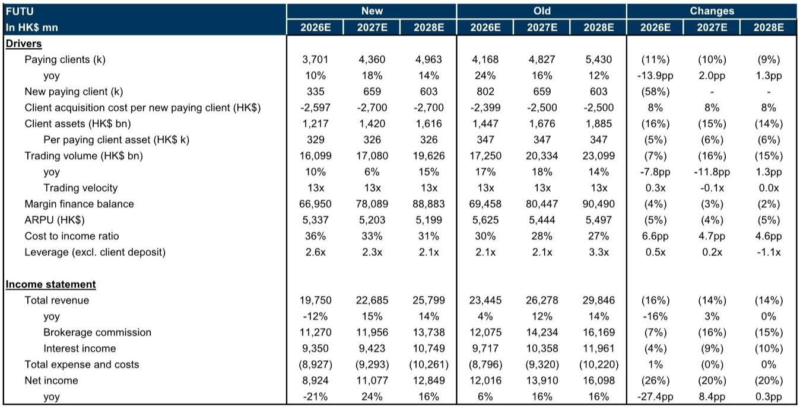
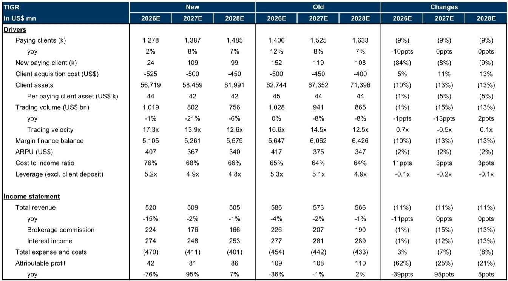
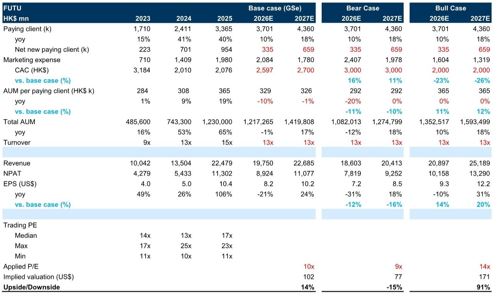

# 监管的代价不是一次性罚款，而是重构客户结构的长期成本

2026年5月22日，中国证监会发布《全面整治非法跨境证券、期货、基金业务活动实施方案》。这不是2022年12月那轮监管的简单延续。当时，监管要求境外机构停止向境内投资者招揽新客户。这一次，监管直接给出了一条两年“整改期”，要求对存量不合规业务进行清理。

市场当天用-28%和-25%的跌幅回应了富途和老虎的股价。但某外资投行最新发布的研报指出，市场对此次监管冲击的定价可能仍然不够充分。真正需要关注的，不是罚款金额本身，而是监管如何从根本上改变了这两家公司的客户结构、获客成本与单客户价值。

这份研报的核心判断是：罚款是一次性冲击，但客户结构调整是永久性的。富途和老虎未来几年的利润增长将同时面临收入端流失和成本端上升的双重挤压。

## 1. 罚款是已知的，但存量客户清理的财务影响仍被低估

罚款金额已经明确。富途被罚18.5亿元人民币，老虎被罚4.12亿元。按照该投行的测算，这两笔罚款在2026年对富途和老虎的净利润影响分别为-2.72亿美元和-0.61亿美元，分别占2025年净利润的-19%和-35%。

但罚款只是起点。更大的影响来自存量不合规内地账户的清理。截至2026年一季度末，富途13%的付费客户来自内地，老虎内地客户占其客户AUM的10%。在两年整改期内，这些账户只能进行单向卖出交易和资金转出，不能新增买入或入金。这意味着这些账户将不再产生交易佣金收入。

该投行测算，清理存量账户将使富途2026年净利润再减少1.21亿美元，老虎减少0.05亿美元。合计来看，监管对富途2026年净利润的总影响约为-3.93亿美元，相当于此前预测的-25%；对老虎的总影响约为-0.66亿美元，相当于此前预测的-60%。

这里有一个关键的不确定性：实际需要清理的存量账户AUM规模尚未完全披露。富途仅公布了账户数量，未公布相应AUM。该投行基于历史指引进行了估算，但敏感性分析显示，不合规内地账户AUM每增加5个百分点，两家公司2026年每股收益将下降约3%。实际数字若高于预期，盈利预测仍有进一步下修空间。

## 2. 填补客户缺口比想象中更难

富途需要清理约46.7万内地付费客户，老虎需要清理约12.8万。要填补这些缺口，两家公司必须在非内地市场获取等量新客户。但这面临三重约束。

第一，香港签证人口规模有限。根据管理层的说明，持有香港签证的内地人士可以成为券商的合法客户。但2023至2025年，香港政府累计向内地人士发放了约23万张工作签证，年均约7万张。即使所有这些人都成为富途或老虎的客户，年化客户增长率也仅为2.3%至6.1%。这不是一个能快速填补缺口的来源。

第二，核心市场增长空间在收窄。香港和新加坡是富途和老虎的主要增长市场。富途在香港的付费客户市场份额已从2021年的15%上升至2025年的33%，该投行预计到2027年将达到47%。新加坡市场方面，富途已占据当地15-64岁人口的13%，公司指引的TAM渗透率约为25%。市场份额持续提升固然可行——传统银行如HSBC、中银香港、星展银行的费率远高于富途——但进一步的客户获取将需要更高的成本投入。

第三，国际扩张将推高获客成本。富途计划进入韩国市场，老虎则试图开拓澳大利亚和新西兰。新市场意味着新的营销投入、合规成本和本地化支出。该投行已将富途和老虎2026-2027年平均获客成本分别上调8%和8%。富途2026年单客户获客成本预计为2597港元，高于此前预测的2399港元；老虎则从500美元升至525美元。

## 3. 单客户价值正在结构性下降，这不是周期性问题

内地客户历来是富途和老虎的高价值客户。管理层曾指引，大中华区（含香港）的付费客户平均AUM是其他国际市场的数倍。清理内地账户后，新客户的AUM结构将系统性下降。

该投行已将富途2026年单客户AUM预测从34.7万港元下调至32.9万港元，降幅约6%；老虎从约3.47万美元下调至3.36万美元，降幅约3%。这个调整看似温和，但考虑到客户数量也在下降，总AUM的影响是叠加的。

更重要的是，这不是一个周期性问题。即使资本市场回暖，新客户的资产配置能力、投资频率和产品使用深度，与存量内地客户之间仍存在结构性差距。这意味着收入端的中长期增长斜率将被压低。

## 4. 估值锚定已经改变，但市场可能还在用旧框架定价

该投行将富途的目标市盈率从19倍下调至10倍，老虎从10倍下调至9倍。参考2023-2024年监管周期中的估值区间，10倍和9倍分别低于当时的中位数水平。

新的目标价对应富途102.13美元（隐含约14%上行空间），老虎4.10美元（隐含约6%下行空间）。富途评级从“买入”下调至“中性”，老虎维持“卖出”。

估值下调的逻辑是清晰的：监管风险从一次性事件变成持续变量，客户结构从高价值内地客户主导转向多元化但低单价的国际客户，获客成本从可控变为上升通道。但市场是否已经完全消化这些变化？该投行的Bear/Base/Bull情景分析显示，富途的估值区间在77至171美元之间，老虎在3至6美元之间。当前股价仍处于区间中段，意味着市场尚未对极端情景充分定价。

## 5. 报告尚未完全回答的关键问题：新市场的真实获客效率

这份研报对富途和老虎的客户增长前景做了系统性分析，但有几个关键变量仍未完全展开，值得投资者持续跟踪。

第一，内地客户清理的实际节奏。两年整改期是上限，但公司可能选择更激进的清理速度。富途和老虎尚未公布自己的整改时间表。管理层的表述也留下了一个模糊地带：账户最终关闭取决于客户决策。整改期内，存量账户只能卖出不能买入；整改期结束后，这些账户在大陆境内不能再交易，但可以继续持有股票。这意味着部分AUM可能以“休眠持仓”的形式长期存在，其对财务报表的影响尚不清晰。

第二，新市场的获客效率。研报上调了获客成本，但上调幅度是基于历史趋势和行业可比，而非新市场实际运营数据。富途在韩国尚未正式上线，老虎在澳大利亚和新西兰的用户数据也未披露。这些市场的客户生命周期价值、留存率和交叉销售潜力，将决定当前获客成本假设是过于保守还是仍然乐观。

第三，竞争格局的变化。传统银行和券商正在加速数字化转型。HSBC和星展银行近年都在加大数字渠道投入。如果传统机构在费率和服务体验上的差距缩小，富途和老虎的竞争优势窗口可能比预期更短。

第四，监管的后续演进。此次整改方案针对的是所有境外金融机构，而非仅限互联网券商。这意味着其他中资券商、外资银行在内地的跨境业务同样面临调整。如果后续监管进一步收紧，整个行业的竞争格局可能发生更深刻的变化。

## 欢迎来星球微信群里继续讨论

以上分析基于该投行研报的核心逻辑和公开数据。但报告本身还有大量未在本文展开的内容，包括两家公司的分业务收入模型、客户粘性分析、以及不同情景下的估值敏感性表格。这些细节对于判断当前股价是否已经充分反映风险至关重要。

我们已经在知识星球微信群中上传了完整的中文解读笔记，并会持续跟踪富途和老虎的后续公告与财务数据。如果你对以下问题感兴趣，欢迎加入讨论：

富途在韩国市场的实际获客成本会高于还是低于研报假设？老虎在澳洲的扩张能否对冲内地客户的流失？如果监管进一步收紧，富途和老虎的“底线估值”在哪里？

这些问题的答案，可能需要几个月甚至更长时间才能逐步显现。但提前建立分析框架，是做出独立判断的前提。

Personal reading notes and learning share only. Not investment advice.

