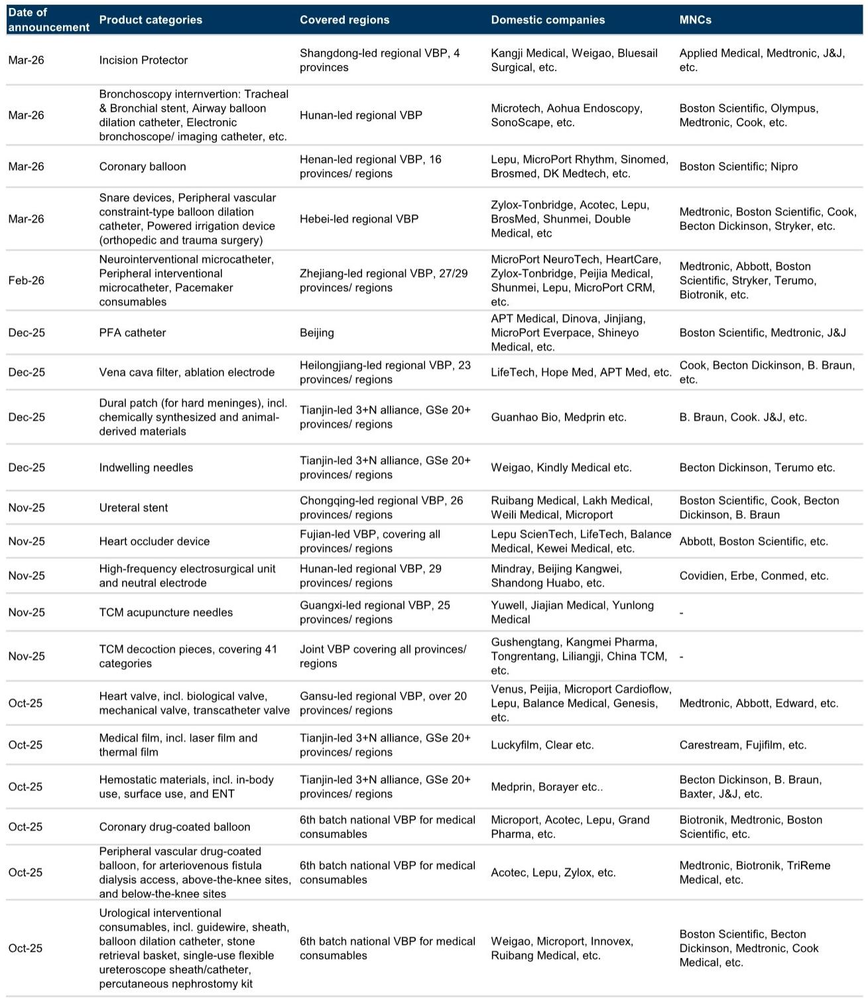
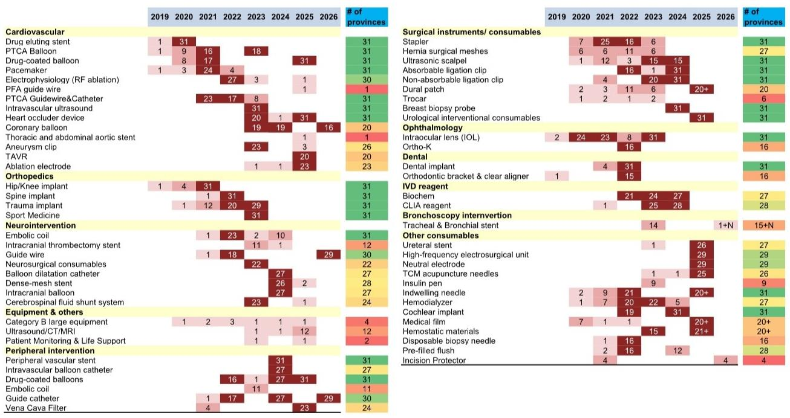
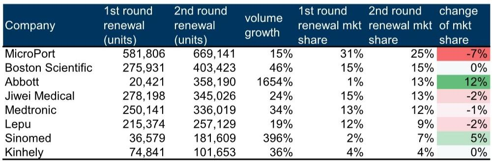

# The DES VBP Renewal Signals a Structural Shift: China's Device Procurement Is Maturing from a Price-Squeeze Mechanism into a Market-Stabilizing Framework

The second renewal of China's national volume-based procurement for drug-eluting stents, announced on May 20, delivered a result that challenges the prevailing narrative about Chinese healthcare policy. Pricing did not fall further. It rose. The average winning price band shifted upward to RMB 839-949 from RMB 730-848 in the 2022 renewal, marking the second consecutive cycle in which prices increased rather than declined. This is not a rounding error or a one-off anomaly. It is the clearest signal yet that the National Healthcare Security Administration is deliberately evolving the VBP mechanism from a blunt cost-cutting tool into a more sophisticated instrument designed to balance affordability with industry sustainability.

The implications extend well beyond the coronary stent market. If the DES renewal pattern becomes a template for other categories, the entire investment thesis for China medtech needs recalibration. The old assumption that VBP represents a permanent, ratcheting margin headwind is giving way to a new reality: VBP is increasingly a one-off price reset, followed by stabilization and, in some cases, gradual recovery. For investors who have avoided Chinese medical device stocks on VBP fears, the DES renewal is a data point that demands re-examination.

## The Second Renewal Confirms That Pricing Uptrends Are Becoming a Structural Feature, Not a Temporary Artifact

The most important number in this report is not the absolute price level but the direction of change. In the first DES VBP round in November 2020, the winning price was set at RMB 798 per unit. By the first renewal in November 2022, the range had moved to RMB 730-848. Now, in the second renewal, the range is RMB 839-949. The effective price ceiling has been raised from RMB 848 to RMB 949, a 12% increase. This is not a market in deflation. It is a market in which the regulator is actively choosing to allow higher prices to secure supply stability and innovation incentives.

The mechanism driving this outcome is the tiered volume allocation framework. Bidders who price at or below RMB 848 receive a 90% base committed-volume ratio. Those who price between RMB 848 and RMB 898 receive 75%. Those who price between RMB 898 and RMB 949 receive 60%. This structure creates a deliberate trade-off: companies can accept a slightly lower volume guarantee in exchange for a meaningfully higher price. The fact that the majority of bidders chose prices above RMB 848 indicates that the industry values margin preservation over maximum volume capture. This is rational behavior in a market where procedure volumes are growing at a 14% CAGR and hospital coverage is expanding.

The strategic implication is clear. The NHSA is signaling that it will not pursue price reductions to the point of industry distress. The agency appears to have internalized the lesson from the first round, where aggressive price cuts created margin compression that threatened R&D investment and supply chain resilience. The second renewal is a deliberate course correction. For companies participating in future VBP cycles across other categories, the DES precedent provides a framework for bidding strategy: price aggressively enough to secure allocation, but not so aggressively that you leave money on the table.

## Multinational Corporations Are Returning to the VBP Arena, Signaling That the Mechanism Is No Longer a Domestic Substitution Tool

The most surprising data point in the report is the rebound in multinational corporation participation. In the first renewal, MNCs accounted for approximately 32% of submitted volume. In the second renewal, that share rose to approximately 41%. Abbott's volume surged from 20,421 units to 358,190 units, a 1,654% increase that catapulted its market share from 1% to 13%. Boston Scientific and Medtronic also posted strong volume growth of 46% and 34%, respectively.

This reversal of the domestic substitution trend demands explanation. The conventional wisdom held that VBP would systematically favor domestic players, who could undercut MNC pricing while maintaining acceptable margins. That thesis is not wrong in absolute terms, but it is incomplete. What the DES renewal reveals is that MNCs are willing to compete aggressively on price when the VBP framework offers sufficient volume certainty and price stability. The tiered allocation mechanism reduces the risk of winning a bid but losing the market, because the volume guarantee is contractually enforced.

More fundamentally, the MNC return reflects a strategic reassessment of China's importance as a market. The report notes that Boston Scientific has highlighted China as a strategically important market, supported by ongoing innovation, broad hospital coverage, and deeper local engagement. This is not an isolated view. Multinational device companies recognize that China's aging population and rising healthcare spending create a demand trajectory that cannot be ignored. If VBP is the price of access, and if the price is stabilizing rather than declining, the calculus shifts in favor of participation.

The competitive implication for domestic players is sobering. Domestic brands such as MicroPort and Lepu saw their market shares decline by 7 and 2 percentage points, respectively, even as their absolute volumes grew. The MNC resurgence means that domestic companies cannot rely on VBP as a guaranteed pathway to market share gains. They must compete on innovation, clinical evidence, and hospital service, not just on price.

## Underlying Demand Growth Is Accelerating, Which Changes the Volume-Price Calculus for All Participants

The submitted demand for the second renewal reached approximately 2.73 million units, representing a 14% CAGR from the 1.86 million units in the 2022 renewal. This is not a mature market. It is a market in which PCI procedure volumes are projected to grow from 1.29 million in 2022 to 2.21 million in 2025, according to Frost & Sullivan. The number of participating hospitals increased from 2,408 to 4,468, indicating both expanded geographic coverage and deeper penetration of existing hospital networks.

This demand growth is the structural underpinning that makes the VBP framework workable. When volumes are growing rapidly, even a lower per-unit margin can generate attractive absolute returns. The tiered allocation system becomes a tool for optimizing the trade-off between price and volume rather than a zero-sum game. Companies that secure a 60% volume guarantee at a higher price may find that the absolute revenue and profit contribution exceeds what they would have achieved at a lower price with a 90% guarantee.

For investors, the demand growth trajectory is the most important variable to monitor. If PCI procedures continue to grow at double-digit rates, the DES market will remain attractive even at post-VBP pricing levels. The risk is not that prices fall further, but that volume growth decelerates due to hospital budget constraints or shifting clinical practice patterns. The report does not address this risk directly, but it is an open question that deserves attention.

## The Report Leaves a Critical Question Unanswered: Can the DES Pricing Model Be Replicated Across Other Device Categories?

The DES renewal is encouraging, but it is not necessarily representative. Coronary stents are a high-volume, relatively standardized product category with well-established clinical protocols and a concentrated competitive landscape. The conditions that enabled price stabilization in DES may not hold for lower-volume, higher-complexity categories such as neurointerventional devices, peripheral vascular products, or capital equipment.

The report's VBP tracker shows that procurement is expanding rapidly across consumables, with full coverage expected by year-end 2026, and is extending into capital equipment. The October 2025 round alone covered coronary drug-coated balloons, peripheral vascular drug-coated balloons, and urological interventional consumables. Each of these categories has different competitive dynamics, cost structures, and innovation cycles. The DES pricing framework may serve as a reference, but it cannot be mechanically applied.

The critical unknown is whether the NHSA will apply the same tiered allocation logic to categories with smaller volumes and higher per-unit costs. In capital equipment, where procurement cycles are longer and hospital purchasing decisions involve multiple stakeholders, the VBP mechanism may need to be fundamentally different. The report flags this expansion but does not provide a clear answer on how pricing dynamics will evolve.

This is the analytical gap that makes the full report worth reading. The DES renewal provides a directional signal, but the path forward for other categories remains uncertain. Investors who base their China medtech thesis solely on the DES precedent risk being caught offside when the next VBP round in a different category delivers a different outcome.

## A Decision Framework for Assessing VBP Exposure Across Device Companies

For investors constructing a China medtech portfolio, the DES renewal provides a framework for evaluating VBP risk and opportunity across different product categories and companies. The framework rests on four variables.

First, category volume growth trajectory. High-growth categories such as coronary stents, where procedure volumes are expanding at double-digit rates, can absorb moderate price reductions without destroying absolute returns. Low-growth or declining categories face a more challenging volume-price trade-off.

Second, competitive landscape concentration. Categories with a small number of dominant players, whether domestic or multinational, are more likely to see rational bidding behavior and price stabilization. Fragmented categories with many small competitors are at higher risk of price wars.

Third, product differentiation and innovation cycles. Categories in which innovation is rapid and product life cycles are short allow companies to offset VBP pressure on legacy products with premium pricing on new products. Commodity-like categories with long product cycles offer less room for differentiation.

Fourth, MNC participation intent. Categories in which MNCs have made strategic commitments to the China market are more likely to see competitive pricing discipline, because MNCs will defend their positions. Categories in which MNCs are marginal players or are exiting are at higher risk of domestic price competition.

Applying this framework to the DES renewal suggests that the category scores well on all four variables: high volume growth, concentrated competitive landscape, moderate innovation cycles, and strong MNC participation. The price stabilization outcome is therefore consistent with the framework. For other categories, the framework provides a systematic way to assess whether the DES precedent is likely to hold or whether a different outcome is more probable.

## The Broader Pattern Suggests a Maturing Policy Environment, but the Details Still Matter

The DES second renewal is not an isolated event. It is part of a broader pattern in which the NHSA is moving from a volume-based procurement model focused on price reduction to a value-based procurement model focused on price stability, supply security, and innovation incentives. The tiered allocation mechanism, the rising price ceiling, and the deliberate accommodation of MNC participation all point in the same direction.

This evolution is positive for the China medtech sector as a whole. It reduces the tail risk of catastrophic price declines and provides a more predictable regulatory environment for investment and planning. But it does not eliminate category-specific risk. The framework described above provides a structured way to differentiate between categories that are likely to follow the DES path and those that are not.

The full report contains additional data on pricing trends, competitive dynamics, and VBP expansion timelines that are essential for making these assessments. The charts on price progression, volume growth, and MNC market share provide the empirical foundation for the analysis. Investors who want to build a nuanced view of China medtech under VBP should review the original data rather than relying on second-hand summaries.

Join the community to read the full report and review the original charts.

*This article is for learning and discussion only and does not constitute investment advice.*

Personal reading notes and learning share only. Not investment advice.

