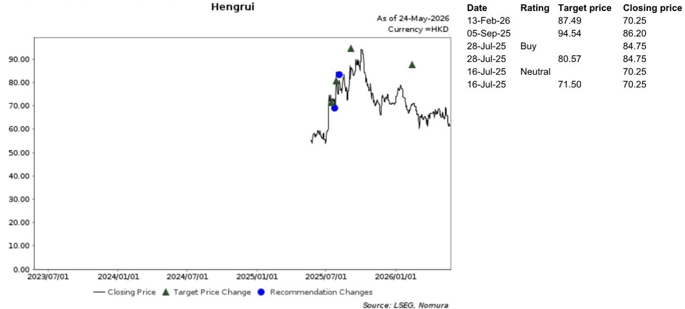
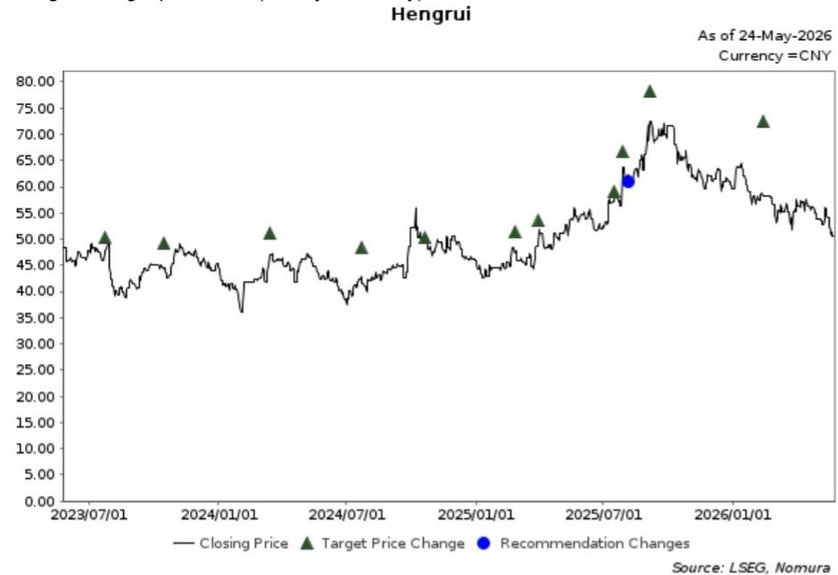
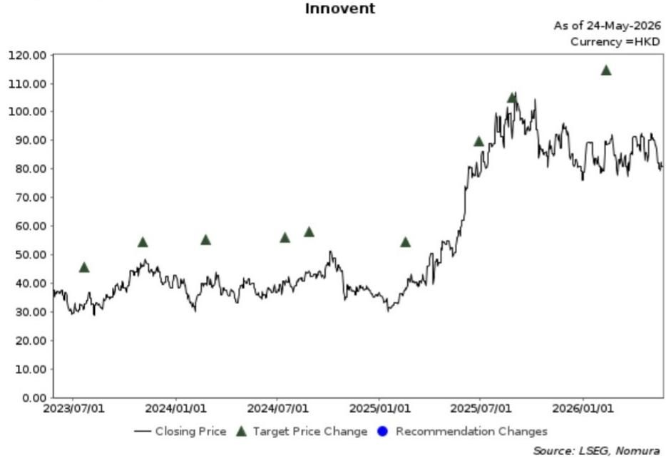

# The US-China Biotech Decoupling Threat Is Real, But the Market Is Misreading Its True Impact

A new proposal from a US congressional committee to add biotechnology to the list of prohibited technologies under the Comprehensive Outbound Investment National Security Act has rattled China healthcare investors. The timing is awkward: cross-Pacific life-science collaboration is surging, with Chinese biotechs out-licensing early-stage molecules to US pharmaceutical giants at a record pace. Two recent landmark deals—Innovent with Eli Lilly and Hengrui with BMS—exemplify this deepening interdependence. Yet the market has barely reacted to these collaborations, and now faces a fresh geopolitical headwind that threatens to cap sentiment just as the sector was gaining momentum.

The core tension is this: the long-term fundamentals of China-US life-science collaboration remain structurally intact, driven by mutual economic necessity and the sheer scale of trillions of dollars at stake. But the short-term sentiment dynamics are fragile, and the market is not pricing in the full range of outcomes from this political pressure. Investors who treat this as another Biosecure Act redux risk missing the distinct characteristics of this new threat. The real question is not whether the collaboration will be severed—it almost certainly will not—but how the uncertainty corridor will reshape risk premiums, deal structures, and competitive dynamics across the China healthcare ecosystem.

This is not a time for binary thinking. The intelligent investor must distinguish between the noise of political posturing and the signal of structural shifts in how capital and innovation flow across the Pacific. The report from a leading global investment bank provides the analytical scaffolding, but the strategic implications go well beyond what the headlines capture.

## The Outbound Investment Proposal Targets a Different Vulnerability Than the Biosecure Act

The Biosecure Act, which targeted Chinese biotech firms' access to US government contracts and federal funding, was a supply-chain containment measure. It sought to limit Chinese companies' ability to serve the US public health system. The market largely shrugged it off because the affected revenue streams were modest relative to the companies' total valuations, and the operational workarounds were manageable.

The new proposal is fundamentally different. It targets outbound investment—specifically, US capital flowing into Chinese biotechnology. This is not about blocking Chinese products from US markets; it is about restricting US investors, venture funds, and strategic partners from deploying capital into Chinese life-science innovation. The vulnerability here is not revenue but the financing engine that has powered China's biotech R&D boom over the past decade.

Consider the implications. Chinese biotech firms, particularly the pre-revenue and early-stage ones, have relied heavily on US venture capital and strategic partnerships to fund their clinical development. The out-licensing model itself is a form of capital flow: US pharma companies pay upfront fees, milestone payments, and royalties for access to Chinese molecules. If the proposal gains traction, it could chill this entire ecosystem. The market's benign reaction to the Innovent-Lilly and Hengrui-BMS deals—share prices barely moved—suggests investors are treating these as isolated commercial events rather than as signals of a fragile financing architecture.

The report correctly notes that a friendly US-China leaders' summit in mid-May might ease trade escalation. But the proposal's trajectory is not solely determined by diplomatic atmospherics. It is being driven by a congressional committee with a specific China-focused mandate, and it taps into a broader bipartisan consensus that US capital should not be used to build Chinese capabilities in sensitive technologies. The market may be underestimating the persistence of this pressure, even if the immediate legislative outcome is uncertain.

## The Structural Case for Resilience Is Strong, But It Depends on a Narrow Set of Conditions

The report argues that cross-border life-science collaboration will remain largely intact, citing the Biosecure Act's actual impact as a guide. This is a reasonable baseline scenario, but it requires several conditions to hold: that US pharmaceutical companies continue to see Chinese molecules as economically indispensable, that Chinese regulatory reforms sustain the innovation pipeline, and that the geopolitical temperature does not escalate into a full-blown technology war.

The economic case for collaboration is indeed powerful. US pharma companies face a patent cliff and declining R&D productivity. Chinese biotechs, by contrast, are generating a growing number of novel molecules at a fraction of the cost. The trillions of dollars at stake in global life-science markets create a powerful gravitational pull toward efficiency. No single political committee can easily override that logic.

But the resilience argument has a blind spot: it assumes that US pharmaceutical companies have the political clout to block the proposal. While they are formidable lobbyists, their interests are not monolithic. Some US firms may see Chinese competition as a threat to their own pipelines. The public narrative around "protecting American innovation" can be weaponized against the very deals that the industry depends on. The report does not fully explore how the interests of US pharma are fractured, and how that fracture could be exploited by those pushing for restrictions.

Furthermore, the resilience case is largely backward-looking. It extrapolates from past outcomes (Biosecure Act) to future scenarios. But the political context is evolving rapidly. The US is in a period of heightened China anxiety, and the 2026 election cycle will amplify rhetoric on both sides. Investors who assume that economic logic will always prevail may be caught off guard by a political shock that is not fully priced in.

## The Market's Benign Reaction to Out-Licensing Deals Is a Red Flag, Not a Green Light

The report notes that share prices of Innovent and Hengrui have not moved significantly despite the collaboration announcements. At first glance, this might suggest that investors are confident in the underlying value and see the deals as non-events. A deeper reading suggests the opposite: the market is already pricing in a geopolitical discount that neutralizes the positive news.

If the market were truly bullish on the collaboration model, these deals would have triggered re-ratings. Instead, they were absorbed without fanfare. This indicates that the prevailing sentiment is lukewarm, and that investors are assigning a higher risk premium to any China healthcare exposure, regardless of fundamental progress. The geopolitical uncertainty is acting as a ceiling on valuations.

This creates a dangerous asymmetry. If the political situation improves, the upside may be limited because the market has already discounted it. If it deteriorates, the downside could be severe because the discount was not large enough to absorb a full-blown investment ban. The report's concern about short-term pressure is well-founded, but the real risk is that the market is in a "wait and see" mode that leaves it vulnerable to sudden repricing.

The implication for investors is clear: do not rely on deal-specific catalysts to drive returns in this environment. The macro-political risk is the dominant factor, and it will overwhelm company-specific news until the regulatory picture becomes clearer. The deals themselves are evidence of the sector's vitality, but they are not sufficient to overcome the sentiment headwind.

## What the Report Does Not Fully Answer: The Second-Order Effects on Innovation and Capital Allocation

The report focuses on the direct impact of the proposal on stock prices and sentiment. It does not fully explore the second-order effects that could reshape the industry structure over a 12-24 month horizon. Three questions remain unresolved.

First, if US outbound investment is restricted, where will Chinese biotechs turn for capital? The obvious answer is domestic Chinese capital and other international sources such as European and Middle Eastern sovereign wealth funds. But the domestic Chinese venture capital market is already under strain from a broader economic slowdown and regulatory tightening. European and Middle Eastern investors are interested but lack the deep biotech expertise and networks that US venture capitalists provide. A capital gap could emerge, slowing the pace of clinical development and forcing Chinese firms to prioritize fewer programs.

Second, will the proposal alter the deal structure of out-licensing agreements? Currently, US pharma companies pay significant upfront fees to secure access to Chinese molecules. If the political risk increases, US firms may demand lower upfront payments and more milestone-based structures, shifting risk back to Chinese developers. This would reduce the near-term cash inflows that Chinese biotechs rely on to fund their operations, potentially triggering a wave of financing needs.

Third, how will the proposal affect the talent flow across the Pacific? Many Chinese biotech executives and scientists have ties to US institutions. A chill in collaboration could accelerate the reverse brain drain, with talent returning to China or moving to third countries. This would have long-term implications for the quality of innovation on both sides.

These are not speculative questions; they are logical extensions of the proposal's logic. The report's analytical framework is sound, but it stops at the first-order impact. Investors need to think through the chain of consequences.

## A Decision Framework for Navigating the Uncertainty

Given the complexity, a simple binary view is inadequate. A more useful approach is to map out scenarios and identify the key signposts that will determine which path the market takes.

Scenario one: the proposal fails to gain traction. In this case, the current sentiment headwind fades, and the sector re-rates upward. The key signpost is the lack of legislative progress over the next 3-6 months, combined with continued high-profile collaboration deals. Investors should overweight high-quality Chinese biotechs with strong pipelines and proven deal-making ability, as they are best positioned to benefit from the normalization.

Scenario two: the proposal advances but is watered down. In this case, the uncertainty persists, but the worst-case outcome is avoided. The market remains range-bound, with selective opportunities. Investors should focus on companies with diversified revenue streams that are less dependent on US capital, such as those with strong domestic sales or partnerships with non-US entities.

Scenario three: the proposal becomes law in its current form. In this case, the Chinese biotech sector faces a severe financing crunch. Investors should reduce exposure to early-stage, pre-revenue firms and focus on large-cap, cash-rich companies that can weather the storm. The report's Buy ratings on Innovent and Hengrui suggest they fall into this category, but even they would face headwinds.

The key decision variable is not the proposal's ultimate fate, but the speed and direction of the political process. Investors should monitor congressional hearings, industry lobbying efforts, and diplomatic signals from the US-China relationship. The mid-May summit is a positive data point, but it is only one data point.

## The Long-Term Thesis Remains Intact, But the Entry Point Demands Patience

The report's long-term positive view is justified. The underlying drivers of China-US life-science collaboration—cost efficiency, innovation quality, and market access—are structural, not cyclical. The trillions of dollars at stake ensure that economic incentives will eventually reassert themselves. The Biosecure Act precedent shows that even when political pressure is high, the actual disruption is often contained.

But the short-term is not the long-term. The current environment is characterized by low visibility, lukewarm sentiment, and a political process that is inherently unpredictable. The report's concern about short-term pressure is not a hedge; it is a central insight. Investors who rush in now, betting on a quick resolution, are taking on uncompensated risk.

The intelligent approach is to wait for greater clarity. That does not mean sitting on the sidelines indefinitely. It means building a watchlist of high-conviction names, monitoring the signposts outlined above, and being prepared to act decisively when the uncertainty corridor narrows. The sector's long-term potential is real, but the timing of entry matters enormously.

Join the community to read the full report and review the original charts.

*This article is for learning and discussion only and does not constitute investment advice.*

Personal reading notes and learning share only. Not investment advice.

