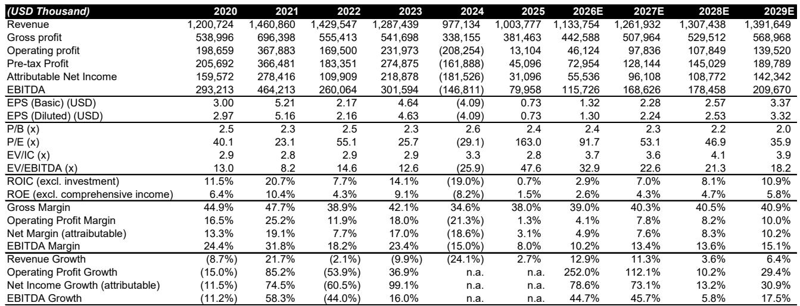
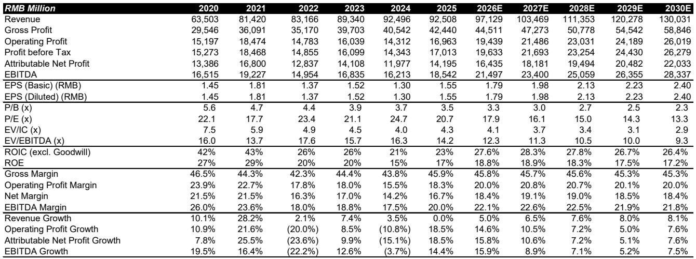
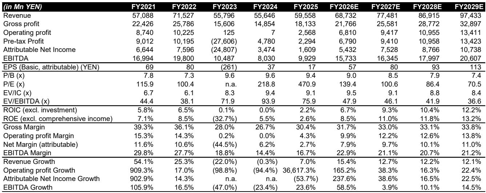

# The Automation Upcycle Is Real, But Only the Innovators Will Keep Their Margins

The global factory automation cycle is accelerating, and it is broad-based, not a narrow AI-driven spike. A recent Asia tour visiting 14 automation companies in China and Japan confirms that demand is recovering across regions and end industries, from semiconductors to automotive. Yet this recovery will not lift all players equally. The critical insight from this tour is not just that the upcycle is happening, but that pricing power and margin resilience during this cycle will separate the durable winners from the cyclical also-rans. Investors who focus only on revenue growth will miss the real story: in automation, innovation determines who keeps the profits.

The data is clear. In China, a leading domestic automation company reported April orders up 40% year-over-year, while Japanese factory automation companies confirmed continued strength despite weak April fixed asset investment data. The rest-of-world growth is also accelerating. Critically, automation companies have not seen abnormal "advance orders" from customers, meaning current demand is largely organic, not driven by inventory buildup. This suggests the cycle has real legs. The peak is expected in the first half of 2026 for China and the first quarter of 2027 globally, with the upcycle lasting more than a year after the peak.

But the real question is not when the cycle peaks. It is which companies will emerge from this cycle stronger, with wider moats and higher margins. The answer, based on the tour, is unambiguous: the innovators who make themselves moving targets for competition. Companies like Keyence and FANUC are maintaining or gaining share through continuous product innovation, while others are either losing share or resorting to low-end SKUs that will likely fail. This asymmetry in competitive outcomes is the most important strategic takeaway for anyone investing in or managing automation companies.

## The Upcycle Is Real and Broad, But It Is Not a Rising Tide That Lifts All Boats

The first-order takeaway from the Asia tour is that the global factory automation upcycle is genuine and spreading. By region, China's recovery is confirmed by both domestic and Japanese players. By end industry, semiconductors and AI-related investments lead, but these typically account for only 5-25% of automation demand. Crucially, all other verticals, including automotive, are recovering at different paces. This breadth matters because it reduces the risk that the cycle is a one-sector phenomenon that could reverse abruptly.

The absence of abnormal advance orders is particularly telling. In previous cycles, customers would double-order to secure supply, creating phantom demand that later reversed. This time, the order patterns reflect genuine end-user demand. The implication is that the current growth trajectory is more sustainable than it appears, and the cycle peak, when it comes, will be followed by a gradual normalization rather than a cliff.

Yet even within this favorable backdrop, the divergence among companies is striking. Some are thriving; others are merely surviving. The difference lies not in market concentration or scale, but in the ability to innovate and command pricing power. This is not a commodity cycle. It is a cycle that rewards differentiation.

## Physical AI Is Not a Disruption but a Complement, and FANUC Is Leading the Way

Many automation companies talk about Physical AI, but few are actually delivering. The tour revealed that FANUC is the clear outlier. It received orders for thousands of units just months after its Physical AI debut last December, compared to roughly 200 units from a major competitor two and a half years after its initial announcement. This is not a marketing gap. It reflects a fundamental strategic difference.

FANUC's advantage is twofold. First, all of its robots, rather than a specific product line, can be used in Physical AI platforms from Nvidia and Google. This universality dramatically expands the addressable market and reduces customer adoption friction. Second, FANUC views Physical AI not as a disruptive technology or near-term growth multiplier, but as a complementary tool to expand the scope of robotic applications and allow inexperienced customers to adopt existing applications with ease.

This is a critical insight for investors. The most successful automation companies are not chasing the "next big thing" as a standalone bet. They are integrating new capabilities into their existing platforms to make their core offerings more valuable and easier to use. Physical AI will not replace industrial robots. It will make them accessible to customers who previously found them too complex. Companies that understand this complementarity will compound their advantages; those chasing Physical AI as a separate product line will struggle.

## Humanoid Robots Are Coming, But They Complement, Not Replace, Industrial Automation

The excitement around humanoid robots is real and growing. The tour confirmed that the first killer applications are emerging in warehouses and factories for various types of material handling. Volume growth is more than 200% year-over-year based on comments from players in China. But the strategic framing matters more than the growth rate.

The tour visits further confirmed that humanoid robots are designed to complement rather than replace industrial robots. Even in the world's most automated factory, where FANUC robots are making their own copies, human workers are still present for packaging, loading and unloading, inspection and testing, and harness installation. These tasks have proven difficult to automate with existing factory automation equipment and are precisely the areas where humanoid robots will be most valuable.

This has direct implications for the supply chain. Factory automation components companies are already adjusting their approach to be more integrated: from individual components like reducers and motors to actuator modules and even entire robots. Companies like Harmonic Drive and Inovance are moving up the value chain to protect margins and accelerate application development. The implication is that the humanoid opportunity will not be captured by a single company or technology. It will reshape the entire automation supply chain, creating winners among component suppliers who can integrate upward and losers among those who remain commoditized.

## Pricing Power Is the Ultimate Test of Competitive Advantage, and Most Companies Are Failing It

The most revealing data from the tour is not about growth rates or order pipelines. It is about margins. Facing increasing costs of input, general inflation, and U.S. tariffs, factory automation companies have shown clear differentiation in pricing power. And this is not a function of market concentration. The best innovators in fragmented markets, such as Keyence and FANUC, pass through the additional costs entirely. Others, such as SMC and Harmonic Drive, albeit in more concentrated markets, can only partially pass through the costs.

The margin trends over the recent cycle are stark. Keyence and AirTAC have maintained stable operating profit margins through the downturn and recovery. FANUC and Harmonic Drive are making genuine efforts to drive margin recovery, although previous high levels are difficult to achieve. SMC, despite its market position, seems to allow margin erosion without a clear plan or intention to improve. This is not a cyclical issue. It is a structural reflection of competitive positioning.

For investors, this is the single most important metric to track. Revenue growth can be misleading in an upcycle. Margins reveal whether a company has real pricing power or is simply riding a wave. Companies that can maintain or expand margins through the cycle have durable competitive advantages. Those that cannot will revert to mean when the cycle turns. The tour data suggests that most automation companies, even in concentrated markets, lack true pricing power.

## What the Report Does Not Fully Answer: The Sustainability of Chinese Competitors' Rise

The tour confirms that all Japanese factory automation companies acknowledge the improvement of Chinese technologies. But the report leaves a critical question unanswered: How sustainable is the rise of Chinese competitors? Keyence and FANUC have maintained stable share through innovation, making themselves moving targets. Yaskawa allows its market share to decline to maintain margins in China. Omron introduces "low-end" China-only SKUs, hoping to regain market share, an approach the report views with skepticism.

The unanswered question is whether Chinese competitors can sustain their quality improvement and move up the value chain, or whether they will get stuck in the mid-market, unable to challenge the premium players. The evidence from the tour is mixed. Chinese companies like Inovance are showing strong order growth and moving into actuator modules and even entire robots. But the margin data shows that Chinese companies, despite growth, have not yet demonstrated the pricing power of the best Japanese innovators.

The next phase of the cycle will answer this question. If Chinese competitors can maintain their growth trajectory while improving margins, the competitive landscape will shift permanently. If they stall at the mid-market, the premium players will retain their moats. Investors should watch this dynamic closely, as it will determine the long-term winners in Asian automation.

## A Decision Framework for Investors: Three Questions to Separate Winners from Cyclicals

Based on the tour insights, investors should evaluate automation companies using three questions that go beyond traditional cycle analysis.

First, does the company have genuine pricing power? The margin data from the tour is the best proxy. Companies like Keyence and AirTAC that maintained stable margins through the cycle have it. Companies like SMC that allowed margin erosion do not. Pricing power is the ultimate test of competitive advantage, and it is not correlated with market share.

Second, is the company making itself a moving target through innovation? Keyence's microscope with laser-based element analysis remained unique in the market for two years after its launch. FANUC's universal Physical AI platform is another example. Companies that create products that competitors cannot easily replicate will maintain their pricing power. Companies that compete on price or low-end SKUs will not.

Third, is the company positioned to benefit from the humanoid and Physical AI trends as a complement, not a distraction? The companies that will win are those integrating these capabilities into existing platforms to expand their addressable market, not those chasing them as separate product lines. FANUC's approach is the model. Companies that treat Physical AI as a separate initiative will likely underperform.

## The Full Picture Requires Data That Only the Full Report Provides

The tour generated a wealth of data that cannot be fully captured in a single article. The original report includes detailed financial models for companies like SMC, Harmonic Drive, IPG Photonics, Han's Laser, Estun, and Hikvision, with updated forecasts reflecting the latest earnings results and tour insights. It also includes proprietary charts showing the acceleration of the global factory automation upcycle across regions and the margin trends that separate the winners from the rest.

These charts and models are essential for making informed investment decisions. The margin data alone, showing the divergence between companies like Keyence and AirTAC versus SMC and Harmonic Drive, tells a story that no summary can fully capture. The order growth data, broken down by region and end industry, provides the granularity needed to assess which parts of the cycle are most sustainable.

Join the community to read the full report and review the original charts.

*This article is for learning and discussion only and does not constitute investment advice.*

Personal reading notes and learning share only. Not investment advice.

