# Energy - China

# Weekly: China's coal safety supervision expected to tighten further

Industry Overview

# Coal: worst coal mine disaster in over 16 years

State media Xinhua reported that at least 82 people were killed in a gas explosion at a coal mine in Qinyuan County, Changzhi City (Shanxi) on 22 May. According to Mysteel (23 May), all 25 coal mines in Qinyuan—representing total capacity of 25.6mntpa—have suspended production. Local authorities indicated that comprehensive grid-style inspections will be conducted across the coal sector. Over the weekend, Mysteel estimated that the number of suspended coking coal mines in Shanxi increased to 73, with combined capacity of 78.9mntpa. While the timeline for resumption in Qinyuan remains uncertain, most other suspended mines are expected to complete self-inspections within 3–5 days before restarting operations. During the week ended 22 May 2026, the QHD 5,500kcal price was flat WoW at RMB834/t. Ports inventory (Northern +Southern) was +1.9% WoW to 23.83mnt as of 21 May 2026. Inventory at the six major IPPs edged up 0.7% WoW to 12.9mnt, daily-burn down 2.1% WoW to 739.7kt. The NEWC 6,000K price was +0.3% WoW to US\$132.05/t, at a 23.5% premium to the QHD price. The Liulin No.4 HCC price was 1,620/t, down 1.2% WoW.

# Oil & Gas: prices down with renewed hopes on agreement

Oil: Brent oil decreased by 5.2% WoW to US\$103.5/b and WTI oil prices decreased by 8.4% WoW to US\$96.6/b, during the week-ended 22 May 2026. The WTI discount to Brent expanded from US\$3.8/b to US\$6.9/b. Dirty VLCC (from Arab Gulf to China) dayrate was USD93k/day. Gas: The US Henry Hub natural gas price was down 1.8% WoW to US\$2.91/mmbtu; the Netherlands TTF natural gas price was down 4.2% WoW to US\$16.41/mmbtu, 34.7% higher YoY and the JKM swap was up 10.0% WoW to US\$18.8/mmbtu, 50.7% higher YoY.

Energy storage: In the week-ended 22 May, prices of 50/100/280/314Ah battery cell prices rose RMB0.001/0.001/0.002/0.001Wh WoW to RMB0.426/0.413/0.336/0.358Wh. The prices of 215KW string PCS, 2500KW/1725KW centralized PCS were flattish WoW at RMB0.091/0.065/0.07 per W.

# Refining runrate remained low; chemical cost slide

Refining: China's refining margin (one-month crude price lag) in May'26 was US\$11.3/b verse US\$31.5/b in Apr'26, per our calculation. The run-rate of independent refineries in Shandong in the week ended 22 May 2026 has down 1.1ppt. WoW to 52.5%. SOE refiners stayed at 67% for the third consecutive week.

Petrochemicals: North Asia naphtha prices decreased by 10.5% WoW to US\$915/t in the week ended 22 May, tracking the decrease in crude oil. Over the same period, ethylene prices slipped 6.8% WoW to USD 1,101/t, while propylene prices down 1.2% WoW to USD 1,231/t. Downstream, LLDPE decreased 0.9% WoW to USD1,133/t, while PP prices decreased by 2.0% WoW to USD 1,223/t.

# 25 May 2026

Equity

China

Energy

Matty Zhao >>

Research Analyst

BofA (Hong Kong)

+852 3508 4001

matty.zhao@bofa.com

Yiming Wang >>

Research Analyst

BofA (Hong Kong)

+852 3508 5037

yiming.wang@bofa.com

Peter Wang >>

Research Analyst

BofA (Hong Kong)

+852 3508 7185

peter.wang2@bofa.com

Edward Leung, CFA >>

Research Analyst

BofA (Hong Kong)

+852 3508 3282

edward.leung@bofa.com

Miriam Chan, CFA >>

Research Analyst

BofA (Hong Kong)

+852 3508 7478

miriam.chan@bofa.com

Yibing Xia >>

Research Analyst

BofA (Hong Kong)

+852 3508 8045

yibing.xia@bofa.com

See the Appendix for a list of abbreviations used in the report

# Weekly updates

# Coal

- The QHD 5,500kcal price was flat WoW at RMB834/t during the week-ended 15 May;   
- The NEWC 6,000K price was +0.3% WoW to US\$132.05/t, at a 23.5% premium to the QHD price;   
- The Liulin No.4 HCC price was RMB1,620/t, down 1.2% WoW, during the weekend ended 22 May 2026;   
- As of 20 May, the water inflow at the Three Gorges Reservoir was 20,000cm/s, 102% higher than the 2005-25 average of 10,881cm/s.

Exhibit 1: ASP at coal mine pits

Thermal coal prices at mine in Shanxi (Kcal5.5k)/Inner Mongolia (Kcal5.5k)/Shaanxi (Kcal5.8k) changed -0.4%/+0.3%/+0.9% WoW to RMB692/574/652/t as of 22 May 2026

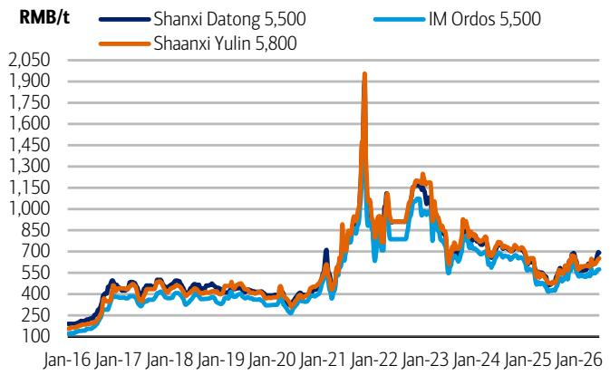

line

| Date    | Shanxi Datong 5,500 | Shaanxi Yulin 5,800 | IM Ordos 5,500 |
|---------|---------------------|---------------------|----------------|
| Jan-16  | ~100                | ~100                | ~100           |
| Jan-17  | ~400                | ~400                | ~350           |
| Jan-18  | ~450                | ~450                | ~400           |
| Jan-19  | ~400                | ~400                | ~350           |
| Jan-20  | ~350                | ~350                | ~300           |
| Jan-21  | ~700                | ~800                | ~600           |
| Jan-22  | ~1,150              | ~2,050              | ~1,150          |
| Jan-23  | ~1,150              | ~1,300              | ~1,150          |
| Jan-24  | ~700                | ~800                | ~700           |
| Jan-25  | ~600                | ~650                | ~550           |
| Jan-26  | ~700                | ~750                | ~650           |

Source: Sxcoal, BofA Global Research   
BofA GLOBAL RESEARCH   
NEWC 6,000K thermal coal was +0.3% WoW to US\$132.05/t as of 22 May 2026

Exhibit 3: NEWC 6,000K thermal coal

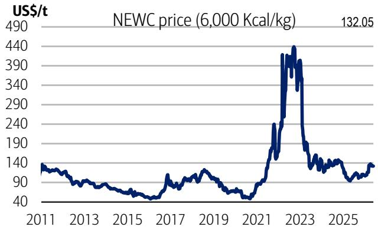

line

| Year | Price (US$/t) |
|------|---------------|
| 2025 | 132.05        |

Source: Sxcoal, BofA Global Research   
BofA GLOBAL RESEARCH   
As of 22 May, ASP of QHD 5,500kcal was flat WoW at RMB834/t

Exhibit 2: ASP at Qinhuangdao port (Kcal5,500)

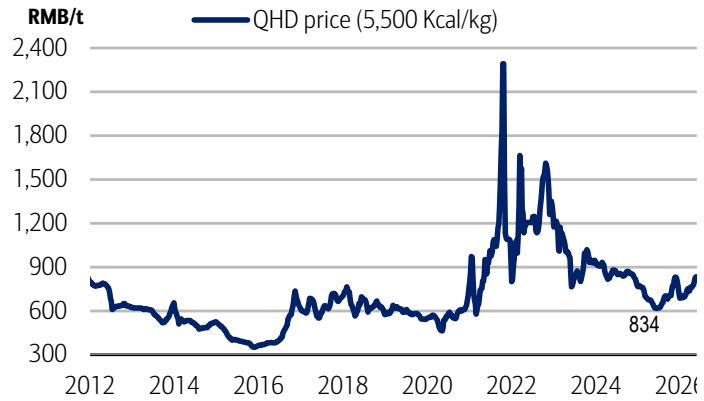

line

| Year | QHD price (5,500 Kcal/kg) |
| ---- | -------------------------- |
| 2026 | 834                        |

Source: Sxcoal, BofA Global Research   
BofA GLOBAL RESEARCH   
Liulin No. 4 hard coking coal price was RMB1,620/t, down 1.2% WoW, during the week-ended 22 May 2026

Exhibit 4: Liulin No. 4 hard coking coal price (incl. VAT)

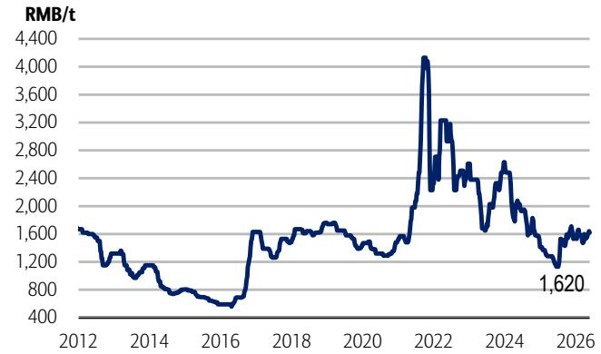

line

| Year | RMB/t |
| ---- | ----- |
| 2026 | 1,620 |

Source: Sxcoal, BofA Global Research   
BofA GLOBAL RESEARCH

Exhibit 5: Ports inventory (Northern and Southern)   
Ports inventory (Northern +Southern) was +1.9% WoW to 23.83mnt as of 21 May 2026   
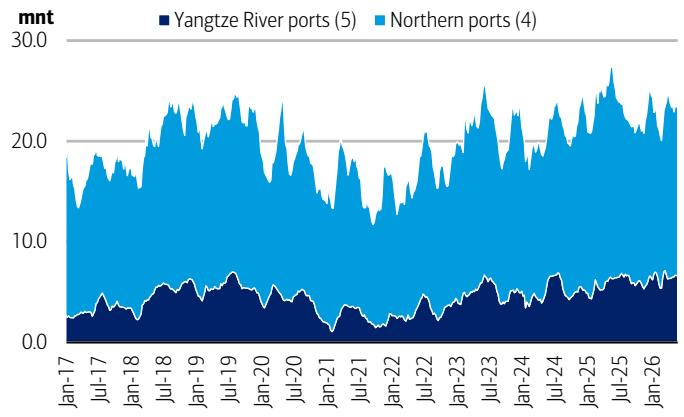

area

| Date   | Yangtze River ports (5) | Northern ports (4) |
|--------|--------------------------|--------------------|
| Jan-17 | ~2.0                     | ~18.0              |
| Jul-17 | ~3.0                     | ~19.0              |
| Jan-18 | ~4.0                     | ~20.0              |
| Jul-18 | ~5.0                     | ~21.0              |
| Jan-19 | ~6.0                     | ~22.0              |
| Jul-19 | ~7.0                     | ~23.0              |
| Jan-20 | ~5.0                     | ~21.0              |
| Jul-20 | ~4.0                     | ~20.0              |
| Jan-21 | ~3.0                     | ~19.0              |
| Jul-21 | ~2.0                     | ~18.0              |
| Jan-22 | ~3.0                     | ~17.0              |
| Jul-22 | ~4.0                     | ~16.0              |
| Jan-23 | ~5.0                     | ~15.0              |
| Jul-23 | ~6.0                     | ~14.0              |
| Jan-24 | ~5.0                     | ~13.0              |
| Jul-24 | ~6.0                     | ~12.0              |
| Jan-25 | ~7.0                     | ~11.0              |
| Jul-25 | ~6.0                     | ~10.0              |
| Jan-26 | ~7.0                     | ~9.0               |

Source: Sxcoal, BofA Global Research   
BofA GLOBAL RESEARCH

Exhibit 7: China coal social inventory   
China coal social inventory up 2% YoY to 704.5mnt by Mar '26   
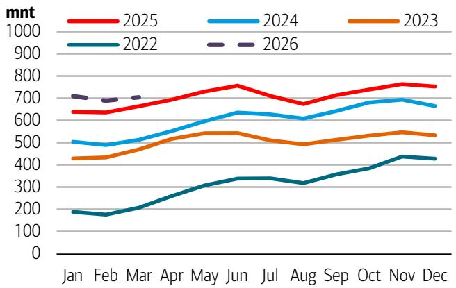

line

| Month | 2025 (mnt) | 2024 (mnt) | 2023 (mnt) | 2022 (mnt) | 2026 (mnt) |
|---|---|---|---|---|---|
| Jan | 640 | 500 | 430 | 180 | 700 |
| Feb | 630 | 490 | 435 | 170 | 690 |
| Mar | 650 | 510 | 460 | 200 | 700 |
| Apr | 680 | 550 | 500 | 250 | - |
| May | 720 | 600 | 530 | 300 | - |
| Jun | 750 | 640 | 540 | 340 | - |
| Jul | 710 | 620 | 510 | 330 | - |
| Aug | 670 | 600 | 490 | 310 | - |
| Sep | 710 | 650 | 510 | 360 | - |
| Oct | 740 | 680 | 530 | 390 | - |
| Nov | 760 | 700 | 540 | 430 | - |
| Dec | 750 | 670 | 520 | 420 | - |

Source: Sxcoal, BofA Global Research   
BofA GLOBAL RESEARCH

Exhibit 9: China monthly coal imports   
Total coal (including lignite) imports was 33mnt. down 13% YoY in Apr'26.   
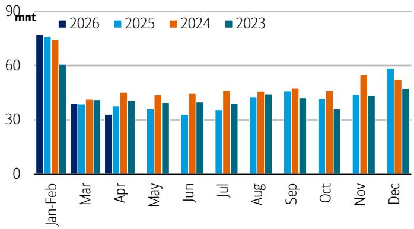

bar

| Month | 2026 (mmt) | 2025 (mmt) | 2024 (mmt) | 2023 (mmt) |
|---|---|---|---|---|
| Jan-Feb | 78 | 76 | 75 | 60 |
| Mar | 33 | 33 | 34 | 34 |
| Apr | 31 | 33 | 47 | 34 |
| May | - | 32 | 45 | 33 |
| Jun | - | 31 | 46 | 33 |
| Jul | - | 32 | 49 | 33 |
| Aug | - | 35 | 47 | 46 |
| Sep | - | 50 | 51 | 44 |
| Oct | - | 35 | 48 | 32 |
| Nov | - | 46 | 58 | 45 |
| Dec | - | 59 | 57 | 54 |

Source: China Customs, Wind, BofA Global Research   
Note: Since 2020, no single-month trade data are available for Jan-Feb   
BofA GLOBAL RESEARCH

Exhibit 8: China six major IPPs (unit: kt)   
Inventory at the six major IPPs increased by 0.7% WoW to 12.9mnt, as of 22 May 2026; daily-burn down 2.1% WoW to 739.7kt   
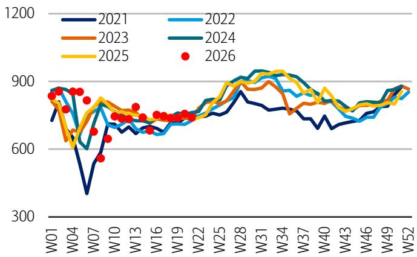

line

| Year | W01 | W04 | W07 | W10 | W13 | W16 | W19 | W22 | W25 | W28 | W31 | W34 | W40 | W43 | W46 | W49 | W52 |
|------|-----|-----|-----|-----|-----|-----|-----|-----|-----|-----|-----|-----|-----|-----|-----|-----|-----|
| 2021 | 850 | 800 | 350 | 650 | 650 | 650 | 650 | 650 | 650 | 850 | 850 | 850 | 650 | 650 | 650 | 650 | 850 |
| 2022 | 850 | 850 | 850 | 850 | 850 | 850 | 850 | 850 | 850 | 850 | 850 | 850 | 850 | 850 | 850 | 850 | 850 |
| 2023 | 850 | 850 | 850 | 850 | 850 | 850 | 850 | 850 | 850 | 850 | 850 | 850 | 850 | 850 | 850 | 850 | 850 |
| 2024 | 850 | 850 | 850 | 850 | 850 | 850 | 850 | 850 | 850 | 850 | 850 | 850 | 850 | 850 | 850 | 850 | 850 |
| 2025 | 850 | 850 | 850 | 850 | 850 | 850 | 850 | 850 | 850 | 850 | 850 | 850 | 850 | 850 | 850 | 850 | 850 |
| 2026 | 850 | 850 | 600 | 650 | 650 | 650 | 650 | 650 | 650 | 650 | 650 | 650 | 650 | 650 | 650 | 650 | 650 |
| Other (labeled) - Series: Red dots (W7, W13, W16, W19, W22, W28, W31, W34, W43, W49, W52) — Values range from ~35 to ~95. The series are labeled as '2' (e.g., '2', '3', '4', '6', '7', '9', '11', '13', '15', '17', '19', '21', '23') but not explicitly labeled in the image.

Source: Sxcoal, BofA Global Research   
BofA GLOBAL RESEARCH

Exhibit 8: YTD China coal production   
China coal production was 385.6mnt, down 1% YoY in Apr '26   
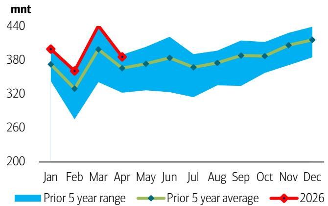

line

| Month | Prior 5 year range | Prior 5 year average | 2026 |
|-------|---------------------|----------------------|------|
| Jan   | ~370                | ~380                 | 385  |
| Feb   | ~260                | ~320                 | 370  |
| Mar   | ~320                | ~385                 | 440  |
| Apr   | ~320                | ~375                 | 380  |
| May   | ~320                | ~375                 | -    |
| Jun   | ~320                | ~380                 | -    |
| Jul   | ~315                | ~375                 | -    |
| Aug   | ~320                | ~375                 | -    |
| Sep   | ~320                | ~380                 | -    |
| Oct   | ~320                | ~380                 | -    |
| Nov   | ~325                | ~385                 | -    |
| Dec   | ~330                | ~390                 | -    |

Source: China NBS, Wind, BofA Global Research   
BofA GLOBAL RESEARCH

# Oil

Brent oil decreased by 5.2% WoW to US\$103.5/b and WTI oil prices decreased by 8.4% WoW to US\$96.6/b, during the week-ended 22 May 2026. The WTI discount to Brent expanded from US\$3.8/b to US\$6.9/b in the week ended 15 May.

Factors supporting oil prices include the following:

- Bloomberg reported Iran has refused to make concessions on its uranium stockpile and the issue of tolls for transit through the Strait of Hormuz, leaving US–Iran negotiations at a stalemate;   
- Bloomberg reported Iran is in discussions with Oman regarding the establishment of a permanent tolling system for the Strait of Hormuz;   
- The US total oil inventory (one-week lag) was down 18mb WoW to 819mb through the week ended 15 May 2026.

Factors suppressing oil prices include the following:

- US Secretary of State Marco Rubio said there had been “slight progress” in mediated talks with Iran. Tehran is currently reviewing the latest US proposal delivered through Pakistan, although no timeline has been provided for an official response;   
- Bloomberg reported The United States has issued a new waiver for Russian crude oil, with validity extended through June 17;   
- Bloomberg reported crude loadings at Russia's Black Sea port of Novorossiysk have fully resumed, with exports recovering to approximately 3.6mbd;

Exhibit 12: Brent and WTI weekly prices   
Brent oil decreased by 5.2% WoW to US\$103.5/b and WTI oil prices decreased by 8.4% WoW to US\$96.6/b   
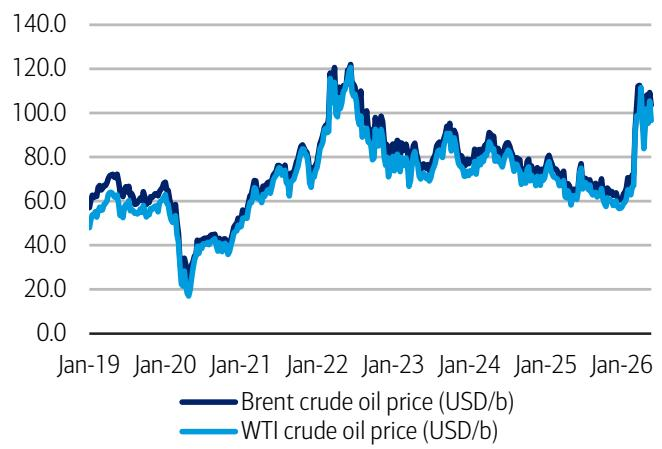

line

| Date   | Brent crude oil price (USD/b) | WTI crude oil price (USD/b) |
|--------|-------------------------------|-----------------------------|
| Jan-19 | ~60                           | ~55                         |
| Jan-20 | ~40                           | ~20                         |
| Jan-21 | ~70                           | ~60                         |
| Jan-22 | ~120                          | ~110                        |
| Jan-23 | ~90                           | ~85                         |
| Jan-24 | ~85                           | ~80                         |
| Jan-25 | ~75                           | ~70                         |
| Jan-26 | ~110                          | ~105                        |

Source: Bloomberg, BofA Global Research   
BofA GLOBAL RESEARCH

Exhibit 11: US weekly oil and gas rig count   
Oil rigs was +10 WoW to 425 and gas rigs -3 WoW to 125; total rig counts of 550 through the week ended 22 May 2026   
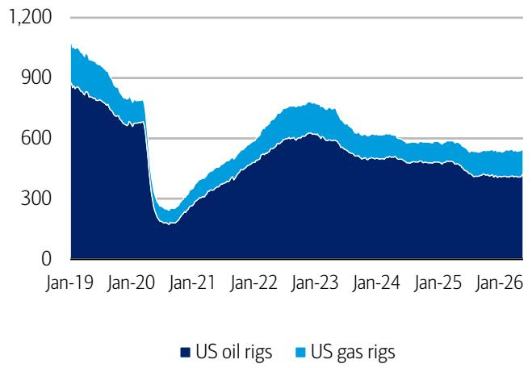

area

| Date   | US oil rigs | US gas rigs |
|--------|-------------|-------------|
| Jan-19 | 850         | 400         |
| Jan-20 | 600         | 200         |
| Jan-21 | 300         | 150         |
| Jan-22 | 500         | 300         |
| Jan-23 | 600         | 400         |
| Jan-24 | 550         | 350         |
| Jan-25 | 500         | 300         |
| Jan-26 | 450         | 250         |

Source: Baker Hughes, Bloomberg, BofA Global Research   
BofA GLOBAL RESEARCH

Exhibit 12: US crude oil production (one-week lag)   
Flat WoW at 13.7mbd   
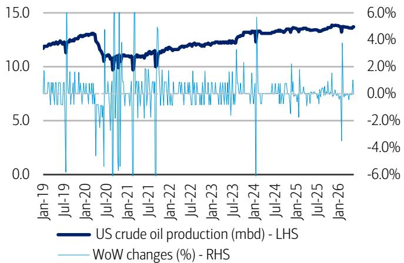

line

| Date   | US crude oil production (mbd) - LHS | WoW changes (%) - RHS |
|--------|-------------------------------------|------------------------|
| Jan-19 | ~12.5                               | ~0.0%                  |
| Jul-19 | ~13.0                               | ~0.0%                  |
| Jan-20 | ~13.5                               | ~0.0%                  |
| Jul-20 | ~10.0                               | ~-4.0%                 |
| Jan-21 | ~10.5                               | ~-6.0%                 |
| Jul-21 | ~11.0                               | ~0.0%                  |
| Jan-22 | ~11.5                               | ~0.0%                  |
| Jul-22 | ~12.0                               | ~0.0%                  |
| Jan-23 | ~12.5                               | ~0.0%                  |
| Jul-23 | ~13.0                               | ~0.0%                  |
| Jan-24 | ~13.5                               | ~0.0%                  |
| Jul-24 | ~14.0                               | ~0.0%                  |
| Jan-25 | ~14.5                               | ~0.0%                  |
| Jul-25 | ~14.5                               | ~0.0%                  |
| Jan-26 | ~14.5                               | ~0.0%                  |

Source: EIA, Bloomberg, BofA Global Research   
BofA GLOBAL RESEARCH

Exhibit 14: Dirty VLCC Arab Gulf to China spot rate (USD/day)   
Down 10.9% WoW to USD93k/day   
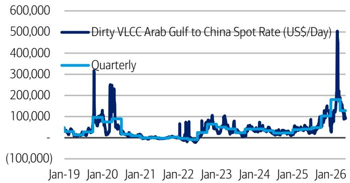

line

| Date    | Dirty VLCC Arab Gulf to China Spot Rate (US$/Day) | Quarterly |
|---------|--------------------------------------------------|-----------|
| Jan-19  | ~50,000                                          | ~50,000   |
| Jan-20  | ~350,000                                         | ~100,000  |
| Jan-21  | ~250,000                                         | ~50,000   |
| Jan-22  | ~50,000                                          | ~50,000   |
| Jan-23  | ~100,000                                         | ~50,000   |
| Jan-24  | ~50,000                                          | ~50,000   |
| Jan-25  | ~100,000                                         | ~50,000   |
| Jan-26  | ~500,000                                         | ~150,000  |

Source: Bloomberg, BofA Global Research   
BofA GLOBAL RESEARCH

Exhibit 13: US total oil inventory (mb) (one-week lag)   
Down 18mb WoW to 819mb   
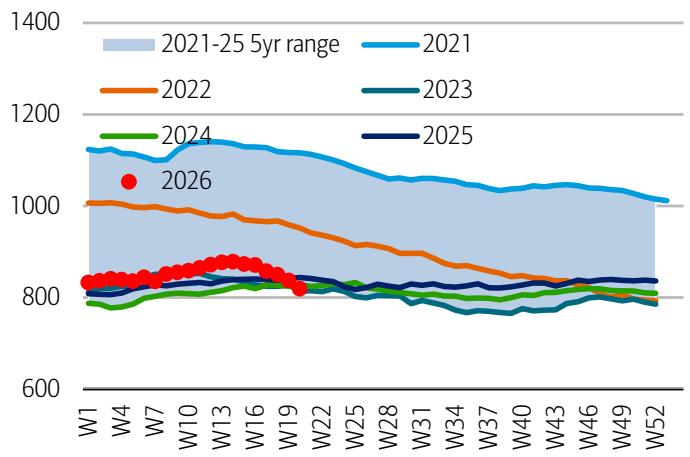

line

| Year | Value |
|------|-------|
| 2026 | 830   |
| 2021 | 1120  |
| 2022 | 1000  |
| 2023 | 850   |
| 2024 | 820   |
| 2025 | 830   |

Source: EIA, Bloomberg, BofA Global Research   
BofA GLOBAL RESEARCH

Exhibit 15: Saudi Arabian OSP (official selling price)   
Saudi trimmed Jun '26 OSP by USD4/bbl MoM   
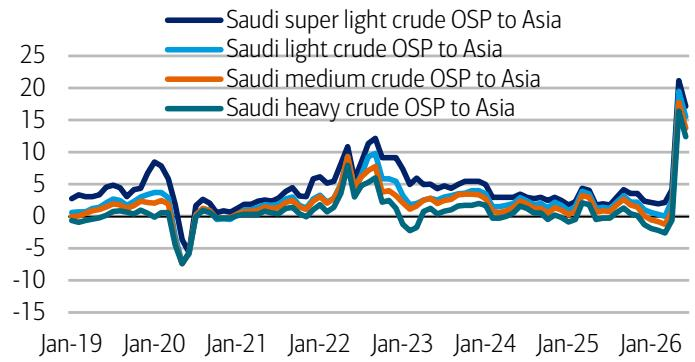

line

| Date   | Saudi super light crude OSP to Asia | Saudi light crude OSP to Asia | Saudi medium crude OSP to Asia | Saudi heavy crude OSP to Asia |
|--------|--------------------------------------|-------------------------------|--------------------------------|------------------------------|
| Jan-19 | ~3                                   | ~2                            | ~1                             | ~0                           |
| Jan-20 | ~8                                   | ~5                            | ~3                             | ~-5                          |
| Jan-21 | ~1                                   | ~0                            | ~0                             | ~0                           |
| Jan-22 | ~12                                  | ~8                            | ~6                             | ~4                           |
| Jan-23 | ~10                                  | ~7                            | ~5                             | ~3                           |
| Jan-24 | ~5                                   | ~3                            | ~2                             | ~1                           |
| Jan-25 | ~3                                   | ~2                            | ~1                             | ~0                           |
| Jan-26 | ~20                                  | ~15                           | ~10                            | ~5                           |

Source: Bloomberg, BofA Global Research   
BofA GLOBAL RESEARCH

# Natural gas

- In the week-ended 22 May 2026, the US Henry Hub natural gas price was down 1.8% WoW to US\$2.91/mmbtu, 12.8% lower YoY;   
- The Netherlands TTF natural gas price was down 4.2% WoW to US\$16.41/mmbtu, 34.7% higher YoY;   
• The JKM swap was up 10.0% WoW to US\$18.81/mmbtu, 50.7% higher YoY;   
- The China CIF LNG import price (one-week lag) was up 26.9% WoW to US\$14.1/mmbtu in the week ended 17 May, flat YoY.

Exhibit 18: US Henry Hub natural gas price (US\$/mmbtu)   
Down 1.8% WoW to US\$2.91/mmbtu during the week ended 22 May 2026   
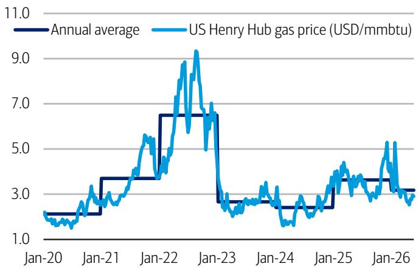

line

| Date   | Annual average | US Henry Hub gas price (USD/mmbtu) |
|--------|----------------|------------------------------------|
| Jan-20 | 2.5            | 2.0                                |
| Jan-21 | 3.0            | 3.0                                |
| Jan-22 | 6.5            | 7.0                                |
| Jan-23 | 2.5            | 3.0                                |
| Jan-24 | 2.5            | 3.0                                |
| Jan-25 | 3.0            | 4.0                                |
| Jan-26 | 3.0            | 3.0                                |

Source: Bloomberg, BofA Global Research   
BofA GLOBAL RESEARCH

Exhibit 18: Northern Asia LNG-JKM swap future (US\$/mmbtu)   
Up 10.0% WoW to US\$18.81/mmbtu  
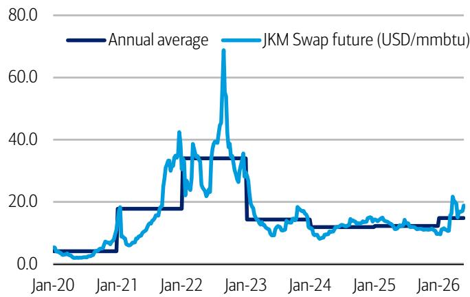

line

| Date   | Annual average | JKM Swap future (USD/mmbtu) |
|--------|----------------|----------------------------|
| Jan-20 | ~4.0           | ~4.0                       |
| Jan-21 | ~18.0          | ~18.0                      |
| Jan-22 | ~35.0          | ~42.0                      |
| Jan-23 | ~35.0          | ~70.0                      |
| Jan-24 | ~15.0          | ~18.0                      |
| Jan-25 | ~15.0          | ~15.0                      |
| Jan-26 | ~15.0          | ~20.0                      |

Source: Bloomberg, BofA Global Research   
BofA GLOBAL RESEARCH

Exhibit 19: Netherlands TTF Natural gas price (US\$/mmbtu)   
Down 4.2% WoW to US\$16.41/mmbtu   
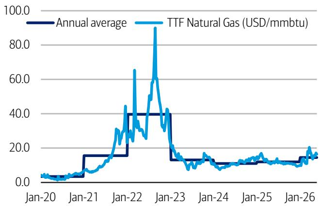

line

| Date    | Annual average | TTF Natural Gas (USD/mmbtu) |
|---------|----------------|-----------------------------|
| Jan-20  | ~2.0           | ~2.0                        |
| Jan-21  | ~15.0          | ~5.0                        |
| Jan-22  | ~40.0          | ~65.0                       |
| Jan-23  | ~40.0          | ~90.0                       |
| Jan-24  | ~10.0          | ~15.0                       |
| Jan-25  | ~10.0          | ~15.0                       |
| Jan-26  | ~15.0          | ~20.0                       |

Source: Bloomberg, BofA Global Research   
BofA GLOBAL RESEARCH

Exhibit 19: China CIF LNG import price (US\$/mmbtu)   
Up 26.9% WoW to US\$14.1/mmbtu in the week ended 17 May   
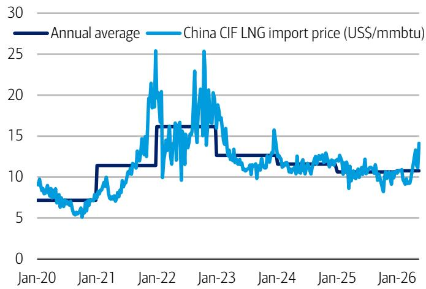

line

| Date   | Annual average | China CIF LNG import price (US$/mmbtu) |
|--------|----------------|----------------------------------------|
| Jan-20 | 7.0            | 9.0                                    |
| Jan-21 | 11.0           | 5.0                                    |
| Jan-22 | 16.0           | 25.0                                   |
| Jan-23 | 16.0           | 25.0                                   |
| Jan-24 | 12.0           | 15.0                                   |
| Jan-25 | 11.0           | 12.0                                   |
| Jan-26 | 11.0           | 14.0                                   |

Source: SHPGX, Wind, BofA Global Research   
Note: originally reported as an index by SHPGX with one unit=RMB28.53/t   
BofA GLOBAL RESEARCH

Exhibit 22: US natural gas storage (bcf)   
Up 4.4% WoW to 2,391bcf   
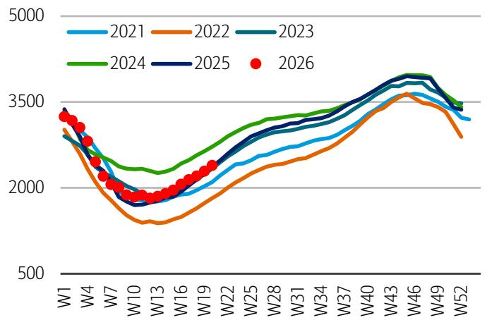

line

| Week | 2021 | 2022 | 2023 | 2024 | 2025 | 2026 |
|------|------|------|------|------|------|------|
| W1   | 3400 | 3300 | 3350 | 3450 | 3400 | 3450 |
| W4   | 3200 | 3100 | 3150 | 3250 | 3200 | 3250 |
| W7   | 3000 | 2900 | 2950 | 3050 | 3000 | 3050 |
| W10  | 2800 | 2700 | 2750 | 2850 | 2800 | 2850 |
| W13  | 2600 | 2500 | 2550 | 2650 | 2600 | 2650 |
| W16  | 2400 | 2300 | 2350 | 2450 | 2400 | 2450 |
| W19  | 2200 | 2100 | 2150 | 2250 | 2200 | 2250 |
| W22  | 2000 | 1900 | 1950 | 2050 | 2000 | 2050 |
| W25  | 1800 | 1700 | 1750 | 1850 | 1800 | 1850 |
| W28  | 1600 | 1500 | 1550 | 1650 | 1600 | 1650 |
| W31  | 1400 | 1300 | 1350 | 1450 | 1400 | 1450 |
| W34  | 1200 | 1100 | 1150 | 1250 | 1200 | 1250 |
| W37  | 1000 | 900  | 950  | 1050 | 1000 | 1050 |
| W40  | 800  | 700  | 750  | 850  | 800  | 850  |
| W43  | 600  | 500  | 550  | 650  | 600  | 650  |
| W46  | 400  | 300  | 350  | 450  | 400  | 450  |
| W49  | 350  | 335% | 375% | 475% | 475% | -    |
| W52  | -    | -    | -    | -    | -    | -    |

Source: EIA, Bloomberg, BofA Global Research   
BofA GLOBAL RESEARCH

Exhibit 23: European natural gas storage (bcf)   
Up 3.6% WoW to 1,446bcf   
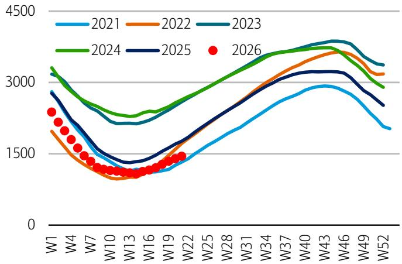  
Source: GIE, Bloomberg, BofA Global Research   
Note: Based on 1TWh=3.412bcf conversion rate   
BofA GLOBAL RESEARCH

# Energy storage

• In Apr'26, China inverters exports up 12% YoY (of which Anhui -30% YoY);   
- In Apr'26, China BESS bid-winning capacity was 32.6GWh, -35% MoM/8% YoY; average bid prices for BESS and EPC were RMB0.65/1.069/Wh;   
- Prices of 50/100/280/314Ah battery cell prices rose RMB0.001/0.001/0.002/0.001Wh WoW to RMB0.426/0.413/0.336/0.358Wh in the week ended 22 May 2026;   
- Prices of 215KW string PCS, 2500KW/1725KW centralized PCS was flattish WoW at RMB0.091/0.065/0.07 per W, respectively, in the week ended 22 May.

Exhibit 22: China BESS bidding prices and capacity   
In Apr'26, China BESS bid-winning capacity was 32.6GWh, -35% MoM/8% YoY; average bid prices for BESS and EPC were RMB0.65/1.069/Wh   
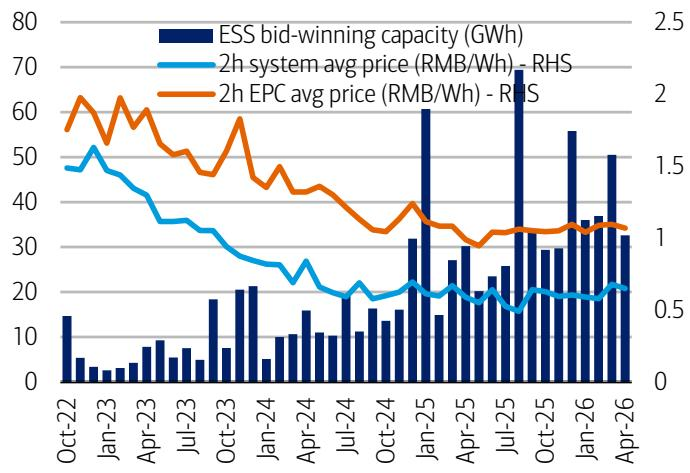

bar_line

| Date    | ESS bid-winning capacity (GWh) | 2h system avg price (RMB/Wh) - RHS | 2h EPC avg price (RMB/Wh) - RHS |
|---------|-------------------------------|-------------------------------------|----------------------------------|
| Oct-22  | 15                            | 48                                  | 1.8                              |
| Jan-23  | 5                             | 52                                  | 1.6                              |
| Apr-23  | 8                             | 45                                  | 1.4                              |
| Jul-23  | 7                             | 38                                  | 1.2                              |
| Oct-23  | 18                            | 32                                  | 1.0                              |
| Jan-24  | 20                            | 28                                  | 0.9                              |
| Apr-24  | 15                            | 25                                  | 0.8                              |
| Jul-24  | 10                            | 20                                  | 0.7                              |
| Oct-24  | 15                            | 18                                  | 0.6                              |
| Jan-25  | 30                            | 20                                  | 0.5                              |
| Apr-25  | 25                            | 18                                  | 0.4                              |
| Jul-25  | 70                            | 15                                  | 0.3                              |
| Oct-25  | 30                            | 12                                  | 0.2                              |
| Jan-26  | 55                            | 10                                  | 0.1                              |
| Apr-26  | 50                            | 8                                   | 0.0                              |

Source: CABIA, BofA Global Research   
BofA GLOBAL RESEARCH

Exhibit 24: China energy storage battery cell prices (RMB/Wh)   
Prices of 50/100/280/314Ah battery cell prices rose
RMB0.001/0.001/0.002/0.001Wh WoW to RMB0.426/0.413/0.336/0.358Wh in the week ended 22 May 2026   
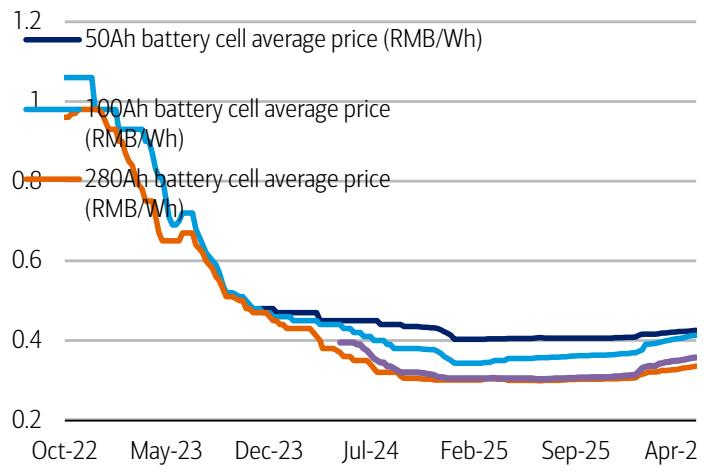

line

| Date   | 50Ah battery cell average price (RMB/Wh) | 100Ah battery cell average price (RMB/Wh) | 280Ah battery cell average price (RMB/Wh) |
|--------|------------------------------------------|-------------------------------------------|-------------------------------------------|
| Oct-22 | ~1.1                                     | ~1.0                                      | ~0.9                                      |
| May-23 | ~0.7                                     | ~0.6                                      | ~0.6                                      |
| Dec-23 | ~0.5                                     | ~0.5                                      | ~0.5                                      |
| Jul-24 | ~0.4                                     | ~0.4                                      | ~0.4                                      |
| Feb-25 | ~0.4                                     | ~0.4                                      | ~0.3                                      |
| Sep-25 | ~0.4                                     | ~0.4                                      | ~0.3                                      |
| Apr-2  | ~0.4                                     | ~0.4                                      | ~0.3                                      |

Source: SMM, BofA Global Research   
BofA GLOBAL RESEARCH

Exhibit 23: China inverters monthly export (RMBmn)   
In Apr'26, China inverters exports up 12% YoY, and Anhui -30% YoY   

bar_line

| Date    | China inverter export (RMBmn) - ex-Anhui | Anhui province export (RMBmn) | Total export YoY growth - RHS | Anhui export YoY growth - RHS |
|---------|------------------------------------------|-------------------------------|-------------------------------|-------------------------------|
| Jan-22  | ~3000                                    | ~100                          | ~50%                          | ~0%                           |
| Sep-22  | ~6000                                    | ~150                          | ~150%                         | ~50%                          |
| May-23  | ~7000                                    | ~200                          | ~200%                         | ~100%                         |
| Jan-24  | ~5000                                    | ~100                          | ~100%                         | ~50%                          |
| Sep-24  | ~6000                                    | ~150                          | ~150%                         | ~100%                         |
| May-25  | ~6500                                    | ~200                          | ~200%                         | ~150%                         |
| Jan-26  | ~6000                                    | ~150                          | ~150%                         | ~100%                         |

Source: China Customs, BofA Global Research   
BofA GLOBAL RESEARCH

Exhibit 25: China PCS prices (RMB/W)   
Prices of 215KW string PCS, 2500KW/1725KW centralized PCS was flattish WoW at RMB0.091/0.065/0.07 per W, respectively, in the week ended 22 May   
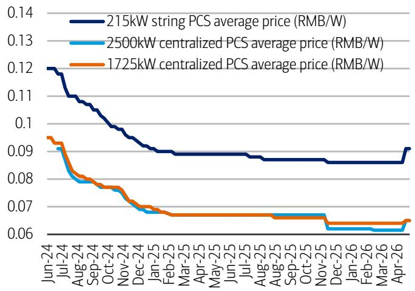

line

| Date    | 215kW string PCS average price (RMB/W) | 2500kW centralized PCS average price (RMB/W) | 1725kW centralized PCS average price (RMB/W) |
|---------|----------------------------------------|---------------------------------------------|---------------------------------------------|
| Jun-24  | 0.12                                   | 0.09                                        | 0.095                                       |
| Jul-24  | 0.115                                  | 0.085                                       | 0.085                                       |
| Aug-24  | 0.11                                   | 0.08                                        | 0.08                                        |
| Sep-24  | 0.105                                  | 0.075                                       | 0.075                                       |
| Oct-24  | 0.10                                   | 0.07                                        | 0.07                                        |
| Nov-24  | 0.095                                  | 0.065                                       | 0.065                                       |
| Dec-24  | 0.09                                   | 0.06                                        | 0.06                                        |
| Jan-25  | 0.085                                  | 0.06                                        | 0.06                                        |
| Feb-25  | 0.085                                  | 0.06                                        | 0.06                                        |
| Mar-25  | 0.085                                  | 0.06                                        | 0.06                                        |
| Apr-25  | 0.085                                  | 0.06                                        | 0.06                                        |
| May-25  | 0.085                                  | 0.06                                        | 0.06                                        |
| Jun-25  | 0.085                                  | 0.06                                        | 0.06                                        |
| Jul-25  | 0.085                                  | 0.06                                        | 0.06                                        |
| Aug-25  | 0.085                                  | 0.06                                        | 0.06                                        |
| Sep-25  | 0.085                                  | 0.06                                        | 0.06                                        |
| Oct-25  | 0.085                                  | 0.06                                        | 0.06                                        |
| Nov-25  | 0.085                                  | 0.06                                        | 0.06                                        |
| Dec-25  | 0.085                                  | 0.06                                        | 0.06                                        |
| Jan-26  | 0.085                                  | 0.06                                        | 0.06                                        |
| Feb-26  | 0.085                                  | 0.06                                        | 0.06                                        |
| Mar-26  | 0.085                                  | 0.06                                        | 0.06                                        |
| Apr-26  | 0.09                                   | 0.06                                        | 0.06                                        |

Source: SMM, BofA Global Research   
BofA GLOBAL RESEARCH

# Refining

- China's refining margin (one-month crude price lag) in May'26 was US\$11.3/b verse US\$31.5/b in Apr'26, per our calculation. The 2026 average GRM came in at US\$19.8/b vs. US\$10.1/b in 2025;   
- The National Development and Reform Commission (NDRC) had lifted the gasoline and diesel retail prices by RMB75/ 70/ton in the latest round of price adjustment on 21 May 2026; the prices are now RMB10,165/ton and RMB9,085/ton, respectively. The next round of price adjustment is scheduled at the night of 4 Jun. 2026;

Exhibit 26: China monthly processed crude oil (mnt)   
China crude throughput of 54.7mnt in Apr'26, down 5.8% YoY   

bar_line

| Date   | China processed crude oil (mbd) | YoY growth - RHS |
|--------|----------------------------------|------------------|
| Jan-19 | ~50                              | ~10%             |
| Jul-19 | ~55                              | ~15%             |
| Jan-20 | ~58                              | ~5%              |
| Jul-20 | ~60                              | ~10%             |
| Jan-21 | ~62                              | ~20%             |
| Jul-21 | ~60                              | ~5%              |
| Jan-22 | ~58                              | ~0%              |
| Jul-22 | ~55                              | ~-10%            |
| Jan-23 | ~60                              | ~10%             |
| Jul-23 | ~65                              | ~20%             |
| Jan-24 | ~60                              | ~5%              |
| Jul-24 | ~58                              | ~0%              |
| Jan-25 | ~60                              | ~10%             |
| Jul-25 | ~65                              | ~15%             |
| Jan-26 | ~60                              | ~5%              |

Source: NBS, CEIC, BofA Global Research   
BofA GLOBAL RESEARCH

Exhibit 28: SOE refinery run rates (%)   
Average run rate of SOE refinery was 67% in May '26 vs. 71% in Apr '26   
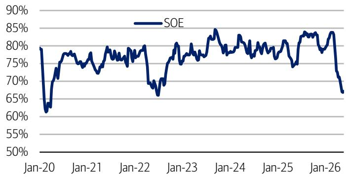

line

| Date   | SOE  |
|--------|------|
| Jan-20 | 78%  |
| Jan-21 | 75%  |
| Jan-22 | 78%  |
| Jan-23 | 75%  |
| Jan-24 | 85%  |
| Jan-25 | 80%  |
| Jan-26 | 68%  |

Source: SCI99   
BofA GLOBAL RESEARCH

Exhibit 27: Shandong teapots refinery run rates (%)   
Average run rate of teapots was 54.6% in May '26 vs. 55.0% in Apr '26   
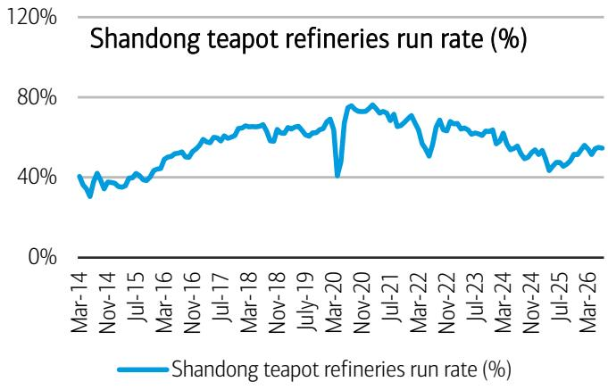

line

| Date    | Shandong teapot refineries run rate (%) |
|---------|----------------------------------------|
| Mar-14  | ~35%                                   |
| Nov-14  | ~40%                                   |
| Jul-15  | ~45%                                   |
| Mar-16  | ~50%                                   |
| Nov-16  | ~55%                                   |
| Jul-17  | ~60%                                   |
| Mar-18  | ~65%                                   |
| Nov-18  | ~70%                                   |
| Jul-19  | ~75%                                   |
| Mar-20  | ~40%                                   |
| Nov-20  | ~80%                                   |
| Jul-21  | ~75%                                   |
| Mar-22  | ~60%                                   |
| Nov-22  | ~70%                                   |
| Jul-23  | ~65%                                   |
| Mar-24  | ~60%                                   |
| Nov-24  | ~55%                                   |
| Jul-25  | ~50%                                   |
| Mar-26  | ~55%                                   |

Source: Bloomberg, S&P Global, BofA Global Research   
BofA GLOBAL RESEARCH

Exhibit 29: Independent petrochemical complex run rates (%)   
Average runrate of independent complex was 81% in May '26 vs. 89% in Apr '26   
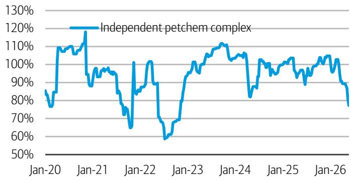

line

| Date   | Independent petchem complex |
|--------|-----------------------------|
| Jan-20 | 80%                         |
| Jan-21 | 120%                        |
| Jan-22 | 60%                         |
| Jan-23 | 90%                         |
| Jan-24 | 110%                        |
| Jan-25 | 90%                         |
| Jan-26 | 70%                         |

Source: SCI99   
BofA GLOBAL RESEARCH

Exhibit 30: China gross refining margin (GRM) with 1mo-lag crude price
Profit of US\$11.3/b in May'26 verse US\$31.5/b in Apr'26   
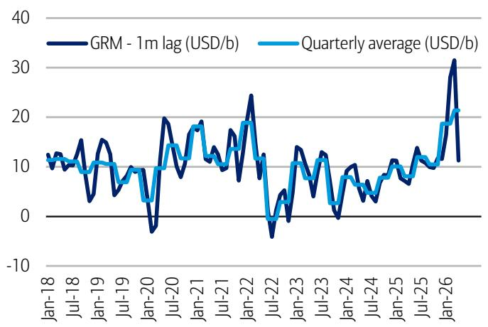

line

| Date   | GRM - 1m lag (USD/b) | Quarterly average (USD/b) |
|--------|----------------------|---------------------------|
| Jan-18 | ~10                  | ~10                       |
| Jul-18 | ~12                  | ~10                       |
| Jan-19 | ~5                   | ~10                       |
| Jul-19 | ~15                  | ~10                       |
| Jan-20 | ~-5                  | ~5                        |
| Jul-20 | ~20                  | ~15                       |
| Jan-21 | ~18                  | ~18                       |
| Jul-21 | ~10                  | ~15                       |
| Jan-22 | ~25                  | ~20                       |
| Jul-22 | ~-5                  | ~0                        |
| Jan-23 | ~5                   | ~5                        |
| Jul-23 | ~10                  | ~10                       |
| Jan-24 | ~0                   | ~5                        |
| Jul-24 | ~5                   | ~5                        |
| Jan-25 | ~10                  | ~10                       |
| Jul-25 | ~15                  | ~15                       |
| Jan-26 | ~30                  | ~20                       |

Source: Wind, BofA Global Research estimates   
BofA GLOBAL RESEARCH

Exhibit 32: Gasoline crack margin in China vs. Singapore (US\$/b)
China gasoline crack margin was US\$9/b for the week ended 22 May 2026   
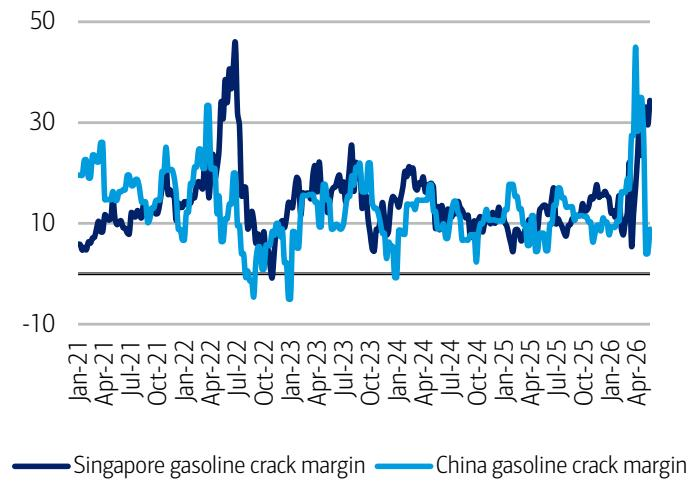

line

| Date    | Singapore gasoline crack margin | China gasoline crack margin |
|---------|----------------------------------|------------------------------|
| Jan-21  | ~7                               | ~15                          |
| Apr-21  | ~10                              | ~28                          |
| Jul-21  | ~12                              | ~15                          |
| Oct-21  | ~15                              | ~25                          |
| Jan-22  | ~18                              | ~30                          |
| Apr-22  | ~35                              | ~32                          |
| Jul-22  | ~48                              | ~15                          |
| Oct-22  | ~5                               | ~-5                          |
| Jan-23  | ~10                              | ~-10                         |
| Apr-23  | ~15                              | ~10                          |
| Jul-23  | ~20                              | ~15                          |
| Oct-23  | ~10                              | ~5                           |
| Jan-24  | ~15                              | ~10                          |
| Apr-24  | ~10                              | ~5                           |
| Jul-24  | ~10                              | ~5                           |
| Oct-24  | ~10                              | ~5                           |
| Jan-25  | ~10                              | ~5                           |
| Apr-25  | ~10                              | ~5                           |
| Jul-25  | ~10                              | ~5                           |
| Oct-25  | ~10                              | ~5                           |
| Jan-26  | ~10                              | ~5                           |
| Apr-26  | ~30                              | ~48                          |

Source: Bloomberg, Wind, BofA Global Research   
BofA GLOBAL RESEARCH

Exhibit 31: Diesel crack margin in China vs. Singapore (US\$/b)
China diesel crack margin was US\$17/b in the week ended 22 May 2026   
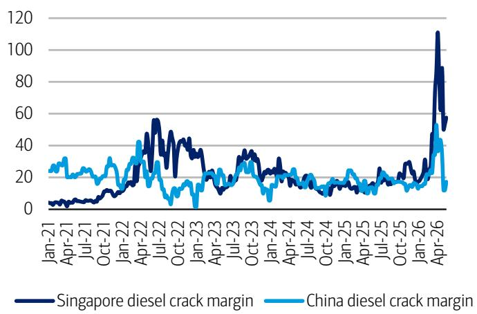

line

| Date    | Singapore diesel crack margin | China diesel crack margin |
|---------|----------------------------------|----------------------------|
| Jan-21  | ~5                               | ~25                        |
| Apr-21  | ~10                              | ~30                        |
| Jul-21  | ~15                              | ~25                        |
| Oct-21  | ~20                              | ~30                        |
| Jan-22  | ~25                              | ~40                        |
| Apr-22  | ~50                              | ~30                        |
| Jul-22  | ~55                              | ~20                        |
| Oct-22  | ~40                              | ~10                        |
| Jan-23  | ~30                              | ~5                         |
| Apr-23  | ~20                              | ~15                        |
| Jul-23  | ~30                              | ~25                        |
| Oct-23  | ~35                              | ~30                        |
| Jan-24  | ~25                              | ~15                        |
| Apr-24  | ~30                              | ~20                        |
| Jul-24  | ~20                              | ~15                        |
| Oct-24  | ~15                              | ~10                        |
| Jan-25  | ~10                              | ~15                        |
| Apr-25  | ~15                              | ~20                        |
| Jul-25  | ~20                              | ~25                        |
| Oct-25  | ~25                              | ~30                        |
| Jan-26  | ~30                              | ~40                        |
| Apr-26  | ~110                             | ~50                        |

Source: Bloomberg, Wind, BofA Global Research   
BofA GLOBAL RESEARCH   
BofA GLOBAL RESEARCH

Exhibit 33: Diesel/gasoline export arbitrage spread (US\$/b)
Export arbitrage spread for diesel and gasoline were US\$40/b and US\$26/b, respectively.   
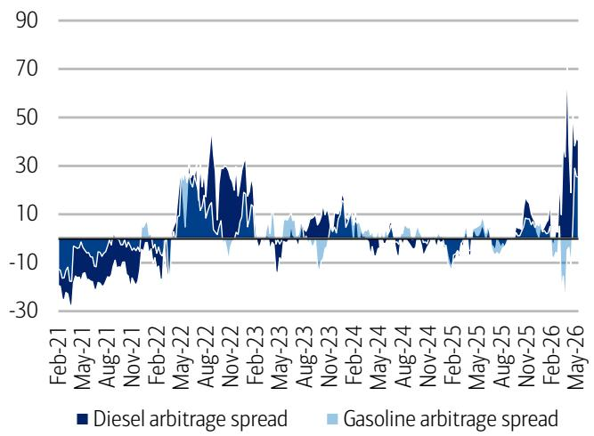

line

| Date    | Diesel arbitrage spread | Gasoline arbitrage spread |
|---------|--------------------------|----------------------------|
| Feb-21  | -25                      | -10                        |
| May-21  | -15                      | -5                         |
| Aug-21  | -10                      | -5                         |
| Nov-21  | -5                       | -5                         |
| Feb-22  | -10                      | -5                         |
| May-22  | 10                       | 5                          |
| Aug-22  | 30                       | 10                         |
| Nov-22  | 20                       | 5                          |
| Feb-23  | 10                       | 5                          |
| May-23  | -10                      | -5                         |
| Aug-23  | 5                        | 0                          |
| Nov-23  | 10                       | 5                          |
| Feb-24  | 5                        | 0                          |
| May-24  | -5                       | -5                         |
| Aug-24  | -5                       | -5                         |
| Nov-24  | -5                       | -5                         |
| Feb-25  | -10                      | -5                         |
| May-25  | -5                       | -5                         |
| Aug-25  | 0                        | -5                         |
| Nov-25  | 10                       | 0                          |
| Feb-26  | 5                        | 5                          |
| May-26  | 40                       | 30                         |

Source: Bloomberg, Wind, BofA Global Research   
BofA GLOBAL RESEARCH

# Chemicals

- During the week ended 22 May 2026, the Northeast Asia naphtha price decreased by 10.5% WoW to US\$915/ton   
- The Northeast Asia LLDPE price decreased by 0.9% WoW to US\$1,133/ton and PP price decreased by 2.0% WoW at US\$1,223/ton;   
- The LLDPE-ethylene spread expanded from negative US\$38/ton to US\$32/ton;   
- The PP-propylene spread turned to negative US\$8/ton from US\$8/ton a week before;

Exhibit 34: Ethylene-naphtha spread expanded to USD186/t   
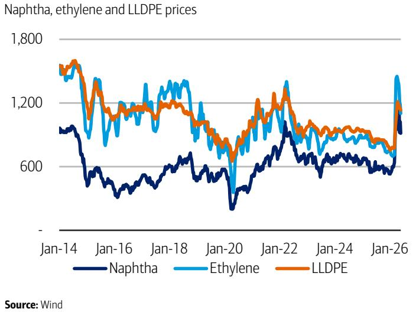

line

| Date   | Naphtha | Ethylene | LLDPE |
|--------|---------|----------|-------|
| Jan-14 | ~1,000  | ~1,300   | ~1,400 |
| Jan-16 | ~500    | ~1,200   | ~1,200 |
| Jan-18 | ~600    | ~1,300   | ~1,100 |
| Jan-20 | ~300    | ~900     | ~800  |
| Jan-22 | ~700    | ~1,300   | ~1,200 |
| Jan-24 | ~600    | ~1,100   | ~1,100 |
| Jan-26 | ~600    | ~1,300   | ~1,200 |

BofA GLOBAL RESEARCH

Exhibit 35: Propylene-naphtha spread expanded to USD316/t   
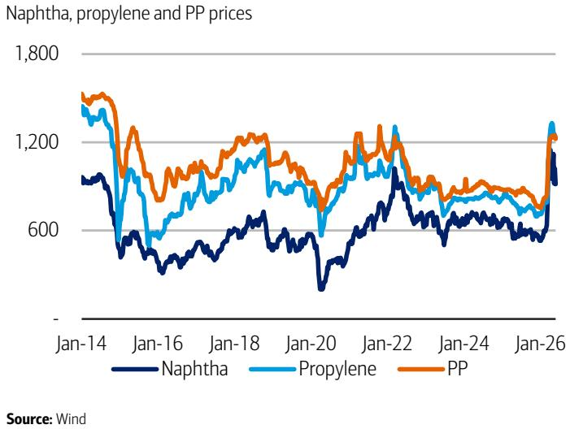

line

| Date   | Naphtha | Propylene | PP    |
|--------|---------|-----------|-------|
| Jan-14 | ~1,000  | ~1,300    | ~1,400|
| Jan-16 | ~500    | ~700      | ~1,200|
| Jan-18 | ~600    | ~900      | ~1,100|
| Jan-20 | ~300    | ~600      | ~800  |
| Jan-22 | ~1,100  | ~1,200    | ~1,300|
| Jan-24 | ~600    | ~800      | ~900  |
| Jan-26 | ~1,200  | ~1,300    | ~1,200|

BofA GLOBAL RESEARCH

Exhibit 36: In QTD, China runrate averaged at 69%, vs. average 79% in 2025   
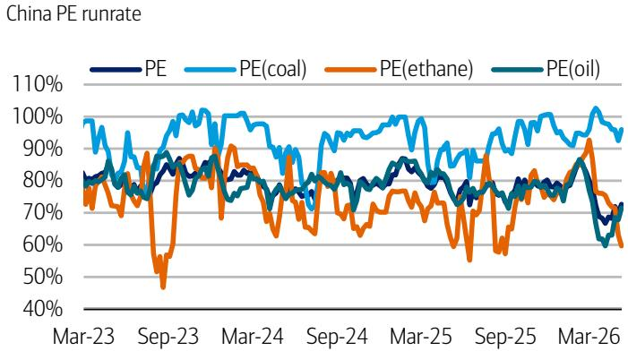

line

| Date   | PE    | PE(coal) | PE(ethane) | PE(oil) |
|--------|-------|----------|------------|---------|
| Mar-23 | 80%   | 95%      | 75%        | 80%     |
| Sep-23 | 85%   | 100%     | 50%        | 85%     |
| Mar-24 | 80%   | 95%      | 85%        | 80%     |
| Sep-24 | 75%   | 90%      | 65%        | 75%     |
| Mar-25 | 80%   | 95%      | 75%        | 80%     |
| Sep-25 | 75%   | 90%      | 60%        | 75%     |
| Mar-26 | 70%   | 95%      | 90%        | 70%     |

Source: SCI99   
BofA GLOBAL RESEARCH

Exhibit 37: China PP runrate averaged at 63%, vs. average 78% in 2025   
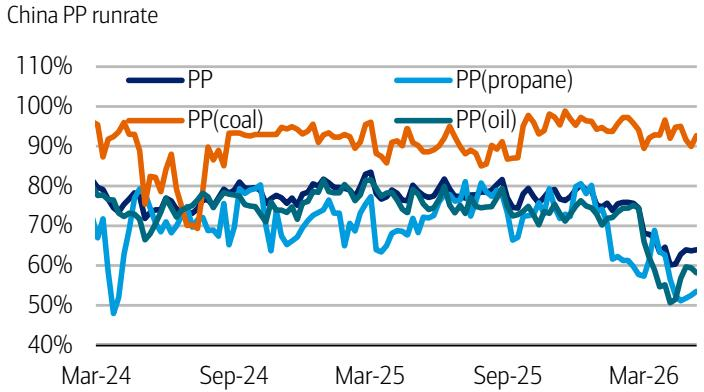

line

| Date   | PP    | PP(coal) | PP(oil) |
|--------|-------|----------|---------|
| Mar-24 | 80%   | 95%      | 70%     |
| Sep-24 | 75%   | 90%      | 75%     |
| Mar-25 | 80%   | 95%      | 75%     |
| Sep-25 | 75%   | 90%      | 70%     |
| Mar-26 | 60%   | 90%      | 50%     |

Source: SCI99   
BofA GLOBAL RESEARCH

Exhibit 38: East China m-MDI and p-MDI price (RMB/ton)   
East China m-MDI and p-MDI prices was -2.9% / -3.0% WoW to RMB23,100/ton and RMB17,800/ton in the week ended 22 May 2026, respectively   
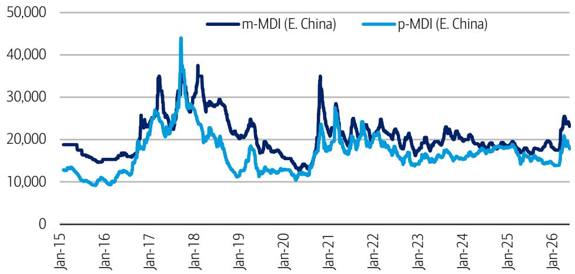

line

| Date   | m-MDI (E. China) | p-MDI (E. China) |
|--------|------------------|------------------|
| Jan-15 | ~19,000          | ~13,000          |
| Jan-16 | ~16,000          | ~10,000          |
| Jan-17 | ~25,000          | ~22,000          |
| Jan-18 | ~38,000          | ~45,000          |
| Jan-19 | ~28,000          | ~20,000          |
| Jan-20 | ~15,000          | ~12,000          |
| Jan-21 | ~35,000          | ~28,000          |
| Jan-22 | ~25,000          | ~22,000          |
| Jan-23 | ~22,000          | ~18,000          |
| Jan-24 | ~20,000          | ~17,000          |
| Jan-25 | ~18,000          | ~16,000          |
| Jan-26 | ~25,000          | ~19,000          |

Source: Wind, BofA Global Research

BofA GLOBAL RESEARCH

# Appendix

Exhibit 41: Abbreviations   
Abbreviations used in the report 

<table><tr><td colspan="2">Abbreviation Full name</td><td>Abbreviation</td><td>Full name</td></tr><tr><td>bbl/b</td><td>Barrel(s)</td><td>mntpa</td><td>Million tons per year</td></tr><tr><td>bcf</td><td>Billion cubic</td><td>MoM</td><td>Month on month</td></tr><tr><td>BESS</td><td>Battery energy storage system</td><td>NBS</td><td>National bureau of statistics</td></tr><tr><td>bnt</td><td>Billion tons</td><td>NEWC</td><td>Newcastle coal</td></tr><tr><td></td><td>Cost, insurance and freight liquified natural gas</td><td>OPEC</td><td>The organization of petroleum exporting countries</td></tr><tr><td>CIF LNG</td><td rowspan="2">Cubic meters</td><td rowspan="2">OSP</td><td rowspan="2">Official selling price</td></tr><tr><td>cm</td></tr><tr><td>CNESA</td><td>China Energy Storage Alliance</td><td>NDRC</td><td>National Development and Reform Commission</td></tr><tr><td>EIA</td><td>U.S. Energy Information Administration</td><td>PCS</td><td>Power conversion system</td></tr><tr><td>EPC</td><td>Engineering, procurement and construction</td><td>p-MDI</td><td>Polymeric methylene diphenyl isocyanate</td></tr><tr><td>FOB</td><td>Free on board</td><td>PP</td><td>Polypropylene</td></tr><tr><td>GIE</td><td>Gas Infrastructure Europe</td><td>PTR</td><td>PetroChina</td></tr><tr><td>GRM</td><td>Gross refining margin</td><td>PV</td><td>Photovoltaic</td></tr><tr><td>GWh</td><td>Gigawatt-hour</td><td>QHD</td><td>Qinhuangdao</td></tr><tr><td>HCC</td><td>Hard Coking Coal</td><td>SHPGX</td><td>Shanghai Petroleum and Natural Gas Exchange</td></tr><tr><td>IPP</td><td>Independent power plant</td><td>SMM</td><td>Shanghai Metals Market</td></tr><tr><td>JKM</td><td>Japan/Korea Marker (Northeast Asian spot price index for LNG delivered ex-ship to Japan and Korea)</td><td>SNP</td><td>Sinopec</td></tr><tr><td>ktpa</td><td>Thousand tons per year</td><td>SOE</td><td>State owned enterprise</td></tr><tr><td>LLDPE</td><td>Linear low-density polyethylene</td><td>t</td><td>Ton(s)</td></tr><tr><td>LNG</td><td>Liquefied natural gas</td><td>TTF</td><td>Title transfer facility</td></tr><tr><td>mb</td><td>Million barrels</td><td>VLCC</td><td>Very large crude carrier</td></tr><tr><td>mbd</td><td>Million barrels per day</td><td>W</td><td>Watt</td></tr><tr><td>MDI</td><td>Methylene diphenyl isocyanate</td><td>Wh</td><td>Watt-hour</td></tr><tr><td>mmbtu</td><td>Metric million British thermal unit</td><td>WoW</td><td>Week on week</td></tr><tr><td>m-MDI</td><td>Monomeric methylene diphenyl isocyanate</td><td>WTI</td><td>West Texas Intermediate</td></tr><tr><td>mnt</td><td>Million tons</td><td>YoY</td><td>Year on year</td></tr><tr><td></td><td></td><td>YTD</td><td>Year to date</td></tr></table>

Source: BofA Global Research   
BofA GLOBAL RESEARCH

# Disclosures

# Important Disclosures

FUNDAMENTAL EQUITY OPINION KEY: Opinions include a Volatility Risk Rating, an Investment Rating and an Income Rating. VOLATILITY RISK RATINGS, indicators of potential price fluctuation, are: A - Low, B - Medium and C - High. INVESTMENT RATINGS reflect the analyst's assessment of both a stock's absolute total return potential as well as its attractiveness for investment relative to other stocks within its Coverage Cluster (defined below). Our investment ratings are: 1 - Buy stocks are expected to have a total return of at least 10% and are the most attractive stocks in the coverage cluster; 2 - Neutral stocks are expected to remain flat or increase in value and are less attractive than Buy rated stocks and 3 - Underperform stocks are the least attractive stocks in a coverage cluster. An investment rating of 6 (No Rating) indicates that a stock is no longer trading on the basis of fundamentals. Analysts assign investment ratings considering, among other things, the 0-12 month total return expectation for a stock and the firm's guidelines for ratings dispersions (shown in the table below). The current price objective for a stock should be referenced to better understand the total return expectation at any given time. The price objective reflects the analyst's view of the potential price appreciation (depreciation).

<table><tr><td>Investment rating</td><td>Total return expectation (within 12-month period of date of initial rating)</td><td>Ratings dispersion guidelines for coverage cluster $^{R1}$ </td></tr><tr><td>Buy</td><td>≥ 10%</td><td>≤ 70%</td></tr><tr><td>Neutral</td><td>≥ 0%</td><td>≤ 30%</td></tr><tr><td>Underperform</td><td>N/A</td><td>≥ 20%</td></tr></table>

$^{R1}$ Ratings dispersions may vary from time to time where BofA Global Research believes it better reflects the investment prospects of stocks in a Coverage Cluster.

INCOME RATINGS, indicators of potential cash dividends, are: 7 - same/higher (dividend considered to be secure), 8 - same/lower (dividend not considered to be secure) and 9 - pays no cash dividend. Coverage Cluster is comprised of stocks covered by a single analyst or two or more analysts sharing a common industry, sector, region or other classification(s). A stock's coverage cluster is included in the most recent BofA Global Research report referencing the stock.

BofA Global Research personnel (including the analyst(s) responsible for this report) receive compensation based upon, among other factors, the overall profitability of BofA Corporation, including profits derived from investment banking. The analyst(s) responsible for this report may also receive compensation based upon, among other factors, the overall profitability of the Bank's sales and trading businesses relating to the class of securities or financial instruments for which such analyst is responsible.

# Other Important Disclosures

From time to time research analysts conduct site visits of covered issuers. BofA Global Research policies prohibit research analysts from accepting payment or reimbursement for travel expenses from the issuer for such visits.

Prices are indicative and for information purposes only. Except as otherwise stated in the report, for any recommendation in relation to an equity security, the price referenced is the publicly traded price of the security as of close of business on the day prior to the date of the report or, if the report is published during intraday trading, the price referenced is indicative of the traded price as of the date and time of the report and in relation to a debt security (including equity preferred and CDS), prices are indicative as of the date and time of the report and are from various sources including BofA trading desks.

The date and time of completion of the production of any recommendation in this report shall be the date and time of dissemination of this report as recorded in the report timestamp.

Recipients who are not institutional investors or market professionals should seek the advice of their independent financial advisor before considering information in this report in connection with any investment decision, or for a necessary explanation of its contents.

Officers of BofAS or one or more of its affiliates (other than research analysts) may have a financial interest in securities of the issuer(s) or in related investments.

Refer to BofA Global Research policies relating to conflicts of interest.

"BofA" includes BofA, Inc. ("BofAS") and its affiliates. Investors should contact their BofA representative or Merrill Global Wealth Management financial advisor if they have questions concerning this report or concerning the appropriateness of any investment idea described herein for such investor. "BofA" is a global brand for BofA Global Research.

# Information relating to Non-US affiliates of BofA and Distribution of Affiliate Research Reports:

BofAS and/or BofA, Pierce, Fenner & Smith Incorporated ("MLPF&S") may in the future distribute, information of the following non-US affiliates in the US (short name: legal name, regulator): BofA (South Africa): BofA South Africa (Pty) Ltd., regulated by the Financial Sector Conduct Authority; MLI (UK): BofA International, regulated by the Financial Conduct Authority (FCA) and the Prudential Regulation Authority (PRA); BofASE (France): BofA Europe SA is authorized by the Autorité de Contrôle Prudentiel et de Résolution (ACPR) and regulated by the ACPR and the Autorité des Marchés Financiers (AMF). BofA Europe SA ("BofASE") with registered address at 51, rue La Boétie, 75008 Paris is registered under no 842 602 690 RCS Paris. In accordance with the provisions of French Code Monétaire et Financier (Monetary and Financial Code), BofASE is an établissement de crédit et d'investissement (credit and investment institution) that is authorised and supervised by the European Central Bank and the Autorité de Contrôle Prudentiel et de Résolution (ACPR) and regulated by the ACPR and the Autorité des Marchés Financiers. BofASE's share capital can be found at www.bofaml.com/BofASEdisclaimer; BofA Europe (Milan): BofA Europe Designated Activity Company, Milan Branch, regulated by the Bank of Italy, the European Central Bank (ECB) and the Central Bank of Ireland (CBI); BofA Europe (Frankfurt): BofA Europe Designated Activity Company, Frankfurt Branch regulated by BaFin, the ECB and the CBI; BofA Europe (Zurich): BofA Europe Designated Activity Company, Zurich Branch, regulated by the Swiss Financial Market Supervisory Authority FINMA, the ECB and CBI; BofA Europe (Madrid): BofA Europe Designated Activity Company, Sucursal en España, regulated by the Bank of Spain, the ECB and the CBI; BofA (Australia): BofA Equities (Australia) Limited, regulated by the Australian Securities and Investments Commission; BofA (Hong Kong): BofA (Asia Pacific) Limited, regulated by the Hong Kong Securities and Futures Commission (HKSFC); BofA (Singapore): BofA (Singapore) Pte Ltd, regulated by the Monetary Authority of Singapore (MAS); BofA (Canada): BofA Canada Inc, regulated by the Canadian Investment Regulatory Organization; BofA (Mexico): BofA Mexico, SA de CV, Casa de Bolsa, regulated by the Comisión Nacional Bancaria y de Valores; BofAS Japan: BofA Japan Co., Ltd., regulated by the Financial Services Agency; BofA (Seoul): BofA International, LLC Seoul Branch, regulated by the Financial Supervisory Service; BofA (Taiwan): BofA (Taiwan) Ltd., regulated by the Securities and Futures Bureau; BofAS India: BofA India Limited, regulated by the Securities and Exchange Board of India (SEBI); BofA (Israel): BofA Israel Limited, regulated by Israel Securities Authority; BofA (DIFC): BofA International (DIFC Branch), regulated by the Dubai Financial Services Authority (DFSA); BofA (Brazil): BofA S.A. Corretora de Títulos e Valores Mobiliários, regulated by Comissão de Valores Mobiliários; BofA KSA Company: BofA Kingdom of Saudi Arabia Company, regulated by the Capital Market Authority. This information: has been approved for publication and is distributed in the United Kingdom (UK) to professional clients and eligible counterparties (as each is defined in the rules of the FCA and the PRA) by MLI (UK), which is authorized by the PRA and regulated by the FCA and the PRA - details about the extent of our regulation by the FCA and PRA are available from us on request; has been approved for publication and is distributed in the European Economic Area (EEA) by BofASE (France), which is authorized by the ACPR and regulated by the ACPR and the AMF; has been considered and distributed in Japan by BofAS Japan, a registered securities dealer under the Financial Instruments and Exchange Act in Japan, or its permitted affiliates; is issued and

distributed in Hong Kong by BofA (Hong Kong) which is regulated by HKSFC; is issued and distributed in Taiwan by BofA (Taiwan); is issued and distributed in India by BofAS India; and is issued and distributed in Singapore to institutional investors and/or accredited investors (each as defined under the Financial Advisers Regulations) by BofA (Singapore) (Company Registration No 198602883D). BofA (Singapore) is regulated by MAS. BofA Equities (Australia) Limited (ABN 65 006 276 795), AFS License 235132 (MLEA) distributes this information in Australia only to 'Wholesale' clients as defined by s.761G of the Corporations Act 2001. With the exception of BofA N.A., Australia Branch, neither MLEA nor any of its affiliates involved in preparing this information is an Authorised Deposit-Taking Institution under the Banking Act 1959 nor regulated by the Australian Prudential Regulation Authority. No approval is required for publication or distribution of this information in Brazil and its local distribution is by BofA (Brazil) in accordance with applicable regulations. BofA (DIFC) is authorized and regulated by the DFSA. Information prepared and issued by BofA (DIFC) is done so in accordance with the requirements of the DFSA conduct of business rules. BofA Europe (Frankfurt) distributes this information in Germany and is regulated by BaFin, the ECB and the CBI. BofA entities, including BofA Europe and BofASE (France), may outsource/delegate the marketing and/or provision of certain research services or aspects of research services to other branches or members of the BofA group. You may be contacted by a different BofA entity acting for and on behalf of your service provider where permitted by applicable law. This does not change your service provider. Please refer to the Electronic Communications Disclaimers for further information.

This information has been prepared and issued by BofAS and/or one or more of its non-US affiliates. The author(s) of this information may not be licensed to carry on regulated activities in your jurisdiction and, if not licensed, do not hold themselves out as being able to do so. BofAS and/or MLPF&S is the distributor of this information in the US and accepts full responsibility for information distributed to BofAS and/or MLPF&S clients in the US by its non-US affiliates. Any US person receiving this information and wishing to effect any transaction in any security discussed herein should do so through BofAS and/or MLPF&S and not such foreign affiliates. Hong Kong recipients of this information should contact BofA (Asia Pacific) Limited in respect of any matters relating to dealing in securities or provision of specific advice on securities or any other matters arising from, or in connection with, this information. Singapore recipients of this information should contact BofA (Singapore) Pte Ltd in respect of any matters arising from, or in connection with, this information. For clients that are not accredited investors, expert investors or institutional investors BofA (Singapore) Pte Ltd accepts full responsibility for the contents of this information distributed to such clients in Singapore.

# General Investment Related Disclosures:

Taiwan Readers: Neither the information nor any opinion expressed herein constitutes an offer or a solicitation of an offer to transact in any securities or other financial instrument. No part of this report may be used or reproduced or quoted in any manner whatsoever in Taiwan by the press or any other person without the express written consent of BofA. This document provides general information only, and has been prepared for, and is intended for general distribution to, BofA clients. Neither the information nor any opinion expressed constitutes an offer or an invitation to make an offer, to buy or sell any securities or other financial instrument or any derivative related to such securities or instruments (e.g., options, futures, warrants, and contracts for differences). This document is not intended to provide personal investment advice and it does not take into account the specific investment objectives, financial situation and the particular needs of, and is not directed to, any specific person(s). This document and its content do not constitute, and should not be considered to constitute, investment advice for purposes of ERISA, the US tax code, the Investment Advisers Act or otherwise. Investors should seek financial advice regarding the appropriateness of investing in financial instruments and implementing investment strategies discussed or recommended in this document and should understand that statements regarding future prospects may not be realized. Any decision to purchase or subscribe for securities in any offering must be based solely on existing public information on such security or the information in the prospectus or other offering document issued in connection with such offering, and not on this document.

Securities and other financial instruments referred to herein, or recommended, offered or sold by BofA, are not insured by the Federal Deposit Insurance Corporation and are not deposits or other obligations of any insured depository institution (including, BofA, N.A.). Investments in general and, derivatives, in particular, involve numerous risks, including, among others, market risk, counterparty default risk and liquidity risk. No security, financial instrument or derivative is suitable for all investors. Digital assets are extremely speculative, volatile and are largely unregulated. In some cases, securities and other financial instruments may be difficult to value or sell and reliable information about the value or risks related to the security or financial instrument may be difficult to obtain. Investors should note that income from such securities and other financial instruments, if any, may fluctuate and that price or value of such securities and instruments may rise or fall and, in some cases, investors may lose their entire principal investment. Past performance is not necessarily a guide to future performance. Levels and basis for taxation may change.

This report may contain a short-term trading idea or recommendation, which highlights a specific near-term catalyst or event impacting the issuer or the market that is anticipated to have a short-term price impact on the equity securities of the issuer. Short-term trading ideas and recommendations are different from and do not affect a stock's fundamental equity rating, which reflects both a longer term total return expectation and attractiveness for investment relative to other stocks within its Coverage Cluster. Short-term trading ideas and recommendations may be more or less positive than a stock's fundamental equity rating.

BofA is aware that the implementation of the ideas expressed in this report may depend upon an investor's ability to "short" securities or other financial instruments and that such action may be limited by regulations prohibiting or restricting "shortselling" in many jurisdictions. Investors are urged to seek advice regarding the applicability of such regulations prior to executing any short idea contained in this report.

Foreign currency rates of exchange may adversely affect the value, price or income of any security or financial instrument mentioned herein. Investors in such securities and instruments, including ADRs, effectively assume currency risk.

BofAS or one of its affiliates is a regular issuer of traded financial instruments linked to securities that may have been recommended in this report. BofAS or one of its affiliates may, at any time, hold a trading position (long or short) in the securities and financial instruments discussed in this report.

BofA, through business units other than BofA Global Research, may have issued and may in the future issue trading ideas or recommendations that are inconsistent with, and reach different conclusions from, the information presented herein. Such ideas or recommendations may reflect different time frames, assumptions, views and analytical methods of the persons who prepared them, and BofA is under no obligation to ensure that such other trading ideas or recommendations are brought to the attention of any recipient of this information. In the event that the recipient received this information pursuant to a contract between the recipient and BofAS for the provision of research services for a separate fee, and in connection therewith BofAS may be deemed to be acting as an investment adviser, such status relates, if at all, solely to the person with whom BofAS has contracted directly and does not extend beyond the delivery of this report (unless otherwise agreed specifically in writing by BofAS). If such recipient uses the services of BofAS in connection with the sale or purchase of a security referred to herein, BofAS may act as principal for its own account or as agent for another person. BofAS is and continues to act solely as a broker-dealer in connection with the execution of any transactions, including transactions in any securities referred to herein.

# Copyright and General Information:

Copyright 2026 BofA Corporation. All rights reserved. iQdatabase® is a registered service mark of BofA Corporation. This information is prepared for the use of BofA clients and may not be redistributed, retransmitted or disclosed, in whole or in part, or in any form or manner, without the express written consent of BofA. This document and its content is provided solely for informational purposes and cannot be used for training or developing artificial intelligence (AI) models or as an input in any AI application (collectively, an AI tool). Any attempt to utilize this document or any of its content in connection with an AI tool without explicit written permission from BofA Global Research is strictly prohibited. BofA Global Research utilizes AI, including machine learning and other technologies, to enhance the services we provide to our clients. These technologies assist our analysts in various aspects of their work, including but not limited to data analysis, content extraction, content creation, data aggregation and summarization and identifying relevant information from diverse sources. All AI-driven processes are subject to review by BofA Global Research employees. BofA Global Research information is distributed simultaneously to internal and client websites and other portals by BofA and is not publicly-available material. Any unauthorized use or disclosure is prohibited. Receipt and review of this information constitutes your agreement not to redistribute, retransmit, or disclose to others the contents, opinions, conclusion, or information contained herein (including any investment recommendations, estimates or price targets) without first obtaining express permission from an authorized officer of BofA.

Materials prepared by BofA Global Research personnel are based on public information. Facts and views presented in this material have not been reviewed by, and may not reflect information known to, professionals in other business areas of BofA, including investment banking personnel. BofA has established information barriers between BofA Global Research and certain business groups. As a result, BofA does not disclose certain client relationships with, or compensation received from, such issuers. To the extent this material discusses any legal proceeding or issues, it has not been prepared as nor is it intended to express any legal conclusion, opinion or advice. Investors should consult their own legal advisers as to issues of law relating to the subject matter of this material. BofA Global Research personnel's knowledge of legal proceedings in which any BofA entity and/or its directors, officers and employees may be plaintiffs, defendants, co-defendants or co-plaintiffs with or involving issuers mentioned in this material is based on public information. Facts and views presented in this material that relate to any such proceedings have not been reviewed by, discussed with, and may not reflect information known to, professionals in other business areas of BofA in connection with the legal proceedings or matters relevant to such proceedings.

This information has been prepared independently of any issuer of securities mentioned herein and not in connection with any proposed offering of securities or as agent of any issuer of any securities. None of BofAS any of its affiliates or their research analysts has any authority whatsoever to make any representation or warranty on behalf of the issuer(s). BofA Global Research policy prohibits research personnel from disclosing a recommendation, investment rating, or investment thesis for review by an issuer prior to the publication of a research report containing such rating, recommendation or investment thesis.

Any information relating to sustainability in this material is limited as discussed herein and is not intended to provide a comprehensive view on any sustainability claim with respect to any issuer or security.

Any information relating to the tax status of financial instruments discussed herein is not intended to provide tax advice or to be used by anyone to provide tax advice. Investors are urged to seek tax advice based on their particular circumstances from an independent tax professional.

The information herein (other than disclosure information relating to BofA and its affiliates) was obtained from various sources and we do not guarantee its accuracy. This information may contain links to third-party websites. BofA is not responsible for the content of any third-party website or any linked content contained in a third-party website. Content contained on such third-party websites is not part of this information and is not incorporated by reference. The inclusion of a link does not imply any endorsement by or any affiliation with BofA. Access to any third-party website is at your own risk, and you should always review the terms and privacy policies at third-party websites before submitting any personal information to them. BofA is not responsible for such terms and privacy policies and expressly disclaims any liability for them.

All opinions, projections and estimates constitute the judgment of the author as of the date of publication and are subject to change without notice. Prices also are subject to change without notice. BofA is under no obligation to update this information and BofA ability to publish information on the subject issuer(s) in the future is subject to applicable quiet periods. You should therefore assume that BofA will not update any fact, circumstance or opinion contained herein.

Certain outstanding reports or investment opinions relating to securities, financial instruments and/or issuers may no longer be current. Always refer to the most recent research report relating to an issuer prior to making an investment decision.

In some cases, an issuer may be classified as Restricted or may be Under Review or Extended Review. In each case, investors should consider any investment opinion relating to such issuer (or its security and/or financial instruments) to be suspended or withdrawn and should not rely on the analyses and investment opinion(s) pertaining to such issuer (or its securities and/or financial instruments) nor should the analyses or opinion(s) be considered a solicitation of any kind. Sales persons and financial advisors affiliated with BofAS or any of its affiliates may not solicit purchases of securities or financial instruments that are Restricted or Under Review and may only solicit securities under Extended Review in accordance with firm policies.

Neither BofA nor any officer or employee of BofA accepts any liability whatsoever for any direct, indirect or consequential damages or losses arising from any use of this information.