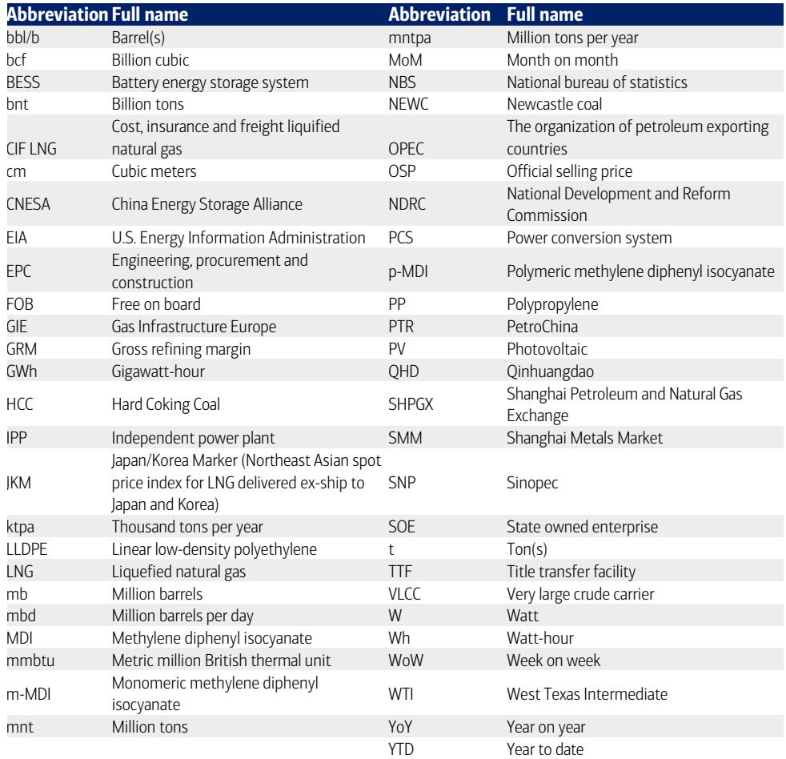
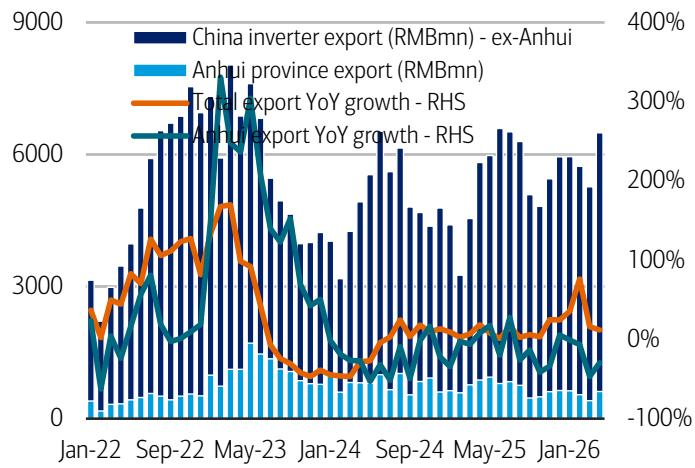
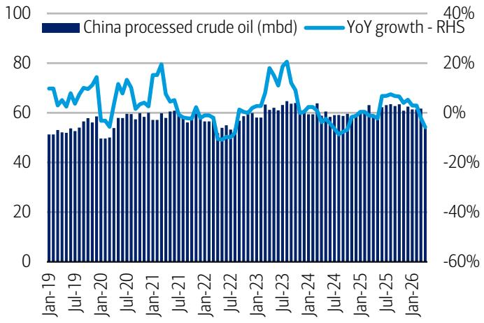

# China's Coal Safety Crisis Is Reshaping the Energy Supply Equation Faster Than Markets Price In

The worst coal mine disaster in over sixteen years has struck China's Shanxi province, killing at least 82 people and triggering an immediate suspension of all twenty-five coal mines in Qinyuan County. This is not merely a tragic headline. It is a structural supply shock that will reverberate through China's energy markets for months, and the market is only beginning to digest what a sustained tightening of safety supervision means for pricing, import dependency, and the relative economics of coal versus gas and renewables.

The immediate numbers are stark. Twenty-five mines in Qinyuan, representing 25.6 million tonnes per annum of capacity, have been halted. Over the weekend, the number of suspended coking coal mines in Shanxi expanded to seventy-three, with combined capacity of 78.9 million tonnes per annum. While most of these mines are expected to complete self-inspections within three to five days before restarting, the Qinyuan timeline remains uncertain. The pattern from previous Chinese safety crackdowns suggests that the political pressure for thorough inspections will not dissipate quickly. When the state media leads with a death toll of this magnitude, local officials understand that the cost of a premature restart far exceeds the cost of extended idling.

This event arrives at a moment when China's coal market was already delicately balanced. Thermal coal prices at Qinhuangdao port held flat at 834 yuan per tonne during the week ending 22 May, but this stability masks underlying tension. Port inventories across northern and southern China rose 1.9 percent week on week to 23.83 million tonnes, yet inventory at the six major independent power producers edged up only 0.7 percent to 12.9 million tonnes, while daily burn rates dropped 2.1 percent to 739.7 thousand tonnes. The supply chain is showing signs of congestion at the port level rather than genuine oversupply at the consumer level. The safety-driven production suspensions will tighten the upstream pipeline precisely when the summer demand peak approaches.

The strategic question for investors is not whether coal prices will rise in the near term. It is whether this accident marks an inflection point in China's regulatory posture toward coal mining, and what that means for the relative competitiveness of coal, gas, and storage over the next twelve to eighteen months.

## The Shanxi disaster will accelerate a structural shift in China's coal supply that has been building for two years

China's coal production data already told a story of cautious restraint before this accident. Year-to-date coal production through April 2026 stood at 385.6 million tonnes, down 1 percent year on year. Monthly production in April was 380 million tonnes, below the prior five-year average for that month. This is not a production boom. It is a plateau, and a slightly declining one at that.

The safety supervision tightening that will follow the Qinyuan disaster does not operate in a vacuum. It reinforces a regulatory trajectory that has been quietly tightening since 2024, when the government began enforcing stricter mine safety standards and closing smaller, less compliant operations. The difference now is that this accident provides political cover for more aggressive enforcement. Provincial officials in Shanxi, which accounts for roughly one-quarter of China's coal output, will now face intense pressure to demonstrate that they are taking safety seriously. The grid-style inspections announced by local authorities are not a one-week event. They will likely extend into the third quarter, reducing the effective operating rate of Shanxi's coal mines even after the immediate suspensions are lifted.

The implication is that China's coal supply curve is shifting leftward and becoming less elastic. Mines that might have operated at 90 percent utilization will now run at 80 percent because inspection teams will be present more frequently, and mine managers will be more risk-averse. This is not a demand-driven slowdown. It is a regulatory supply constraint that will persist regardless of what happens to electricity consumption or industrial production.

## The oil market is pricing a geopolitical détente that has not yet materialized, creating a disconnect with physical fundamentals

While coal markets are grappling with a domestic supply shock, oil markets are wrestling with the opposite problem: a price decline driven by renewed hopes for agreement that may prove premature. Brent crude fell 5.2 percent week on week to $103.5 per barrel, and WTI dropped 8.4 percent to $96.6 per barrel, widening the WTI discount to Brent from $3.8 to $6.9 per barrel.

The narrative driving the sell-off is progress in US-Iran negotiations, with Secretary of State Marco Rubio noting slight progress and a new US waiver for Russian crude oil extended through June 17. Yet the underlying facts are more ambiguous. Iran has refused to make concessions on its uranium stockpile and is reportedly in discussions with Oman about establishing a permanent tolling system for the Strait of Hormuz. These are not the actions of a party preparing to capitulate. They are the actions of a party testing the boundaries of what it can extract from the negotiation process.

Meanwhile, physical oil markets are tightening. US total oil inventory dropped by 18 million barrels week on week to 819 million barrels. Crude loadings at Russia's Black Sea port of Novorossiysk have fully resumed, with exports recovering to approximately 3.6 million barrels per day, but this is a restoration of existing supply rather than new supply entering the market. The US oil rig count rose by ten to 425, but production remained flat at 13.7 million barrels per day, suggesting that the rig additions are offsetting natural decline rather than expanding capacity.

The disconnect between the geopolitical optimism priced into the futures curve and the physical reality of declining inventories and unresolved tensions creates a risk premium that is being compressed too quickly. If the Iran talks stall or the Russian waiver is not extended beyond June 17, the oil market could see a sharp reversal of the recent price decline.

## China's refining and petrochemical margins are compressing, revealing the downstream cost of upstream supply disruption

The safety-driven coal supply tightening is not an isolated event for the coal sector. It has direct implications for China's refining and petrochemical complex, which is already under pressure from declining crude oil prices and weak domestic demand.

China's refining margin in May 2026, calculated using a one-month crude price lag, has fallen to $11.3 per barrel from $31.5 per barrel in April. This is a dramatic compression. The run-rate of independent refineries in Shandong dropped 1.1 percentage points week on week to 52.5 percent, while state-owned enterprise refiners held steady at 67 percent for the third consecutive week. The independent refiners, which are more sensitive to margin fluctuations and have less access to captive feedstock, are bearing the brunt of the adjustment.

The petrochemical chain is transmitting these pressures downstream. North Asia naphtha prices decreased 10.5 percent week on week to $915 per tonne, tracking crude oil. Ethylene prices slipped 6.8 percent to $1,101 per tonne, and propylene prices fell 1.2 percent to $1,231 per tonne. Downstream, LLDPE decreased 0.9 percent to $1,133 per tonne, and polypropylene prices fell 2.0 percent to $1,223 per tonne.

The strategic question is whether lower feedstock costs will stimulate demand or whether the margin compression will force further capacity rationalization. The answer depends on the trajectory of crude oil prices. If oil prices remain subdued, the petrochemical chain will benefit from lower input costs, but the refining margin will remain under pressure. If oil prices reverse higher, the refining margin will recover, but petrochemical costs will rise. The coal supply disruption complicates this calculus by raising the cost of coal-based chemicals and power, which could spill over into industrial production costs more broadly.

## The energy storage supply chain is pricing in demand acceleration, but the battery price increases are not yet justified by raw material costs

One of the more intriguing signals in the weekly data is the behavior of battery cell prices. During the week ending 22 May, prices for 50, 100, 280, and 314 ampere-hour battery cells rose by 0.001 to 0.002 yuan per watt-hour week on week, reaching levels between 0.336 and 0.426 yuan per watt-hour. Power conversion system prices remained flat.

These price increases are modest but noteworthy because they come at a time when raw material costs are generally stable or declining. The coal supply disruption and the broader energy market uncertainty may be driving expectations of higher electricity costs, which would improve the economics of behind-the-meter storage. However, the battery cell price increases are not yet supported by a visible surge in procurement volumes or a tightening of battery-grade material supply.

The more likely explanation is that battery manufacturers are testing the market's willingness to accept higher prices ahead of the summer demand season, when utility-scale storage deployments typically accelerate. If coal-fired power becomes more expensive or less reliable due to safety-driven capacity constraints, the case for storage as a grid balancing tool becomes stronger. But the data so far shows only a tentative price signal, not a confirmed demand inflection.

## The report's data raises three unanswered questions that will determine whether this is a trading event or a structural shift

The weekly report provides a comprehensive snapshot of the energy complex, but it leaves several critical questions unresolved. First, how long will the Qinyuan mine suspensions last? The report notes that most other suspended mines are expected to complete self-inspections within three to five days before restarting, but Qinyuan is the epicenter of the disaster, and local authorities face the highest political scrutiny. If Qinyuan remains closed for more than two weeks, the supply impact will become material for thermal coal prices.

Second, what is the demand response to higher coal prices? The six major IPPs have inventory of 12.9 million tonnes, which represents roughly seventeen days of consumption at current burn rates. If coal prices rise significantly, these utilities have limited room to reduce consumption without cutting power output. The summer peak demand period is approaching, and air conditioning load will increase regardless of coal prices.

Third, will the oil market's pricing of geopolitical détente prove correct? The US-Iran negotiations and the Russian crude waiver are inherently unpredictable. A breakdown in talks or a failure to extend the waiver would reverse the recent oil price decline and change the relative economics of coal, gas, and renewables.

## A decision framework for navigating the energy complex through the next quarter

For investors and strategists trying to position for the next three to six months, the key is to distinguish between the different time horizons of the shocks affecting each energy sub-sector.

In coal, the immediate response is to expect a price spike as the market prices in the production suspensions. But the more important trade is to assess whether the safety crackdown will persist into the third quarter. If it does, coal prices will remain elevated through the summer, benefiting producers with mines outside Shanxi and import-dependent utilities will face margin pressure. If the crackdown proves short-lived, the current price level may be a selling opportunity.

In oil, the risk is asymmetric. The recent price decline reflects optimism about negotiations that may not materialize. Physical inventory data is tightening, and the US oil rig count is rising only slowly. The prudent position is to assume that the downside is limited and the upside is significant if negotiations stall. The WTI-Brent spread widening to $6.9 per barrel suggests that the market is pricing in a regional divergence that may not persist.

In energy storage, the battery cell price increases are a leading indicator worth monitoring but not yet a conviction trade. The fundamental case for storage is improving as coal supply becomes less reliable, but the price signals are still too weak to confirm a demand acceleration. The next two months of procurement data will be decisive.

The most important insight from this weekly report is that China's energy system is becoming more fragmented and less predictable. Coal, oil, gas, and storage are not moving in tandem. They are responding to different drivers with different time horizons. The investor who treats them as a single energy complex will miss the nuances that create opportunity.

Join the community to read the full report and review the original charts.

*This article is for learning and discussion only and does not constitute investment advice.*

Personal reading notes and learning share only. Not investment advice.

