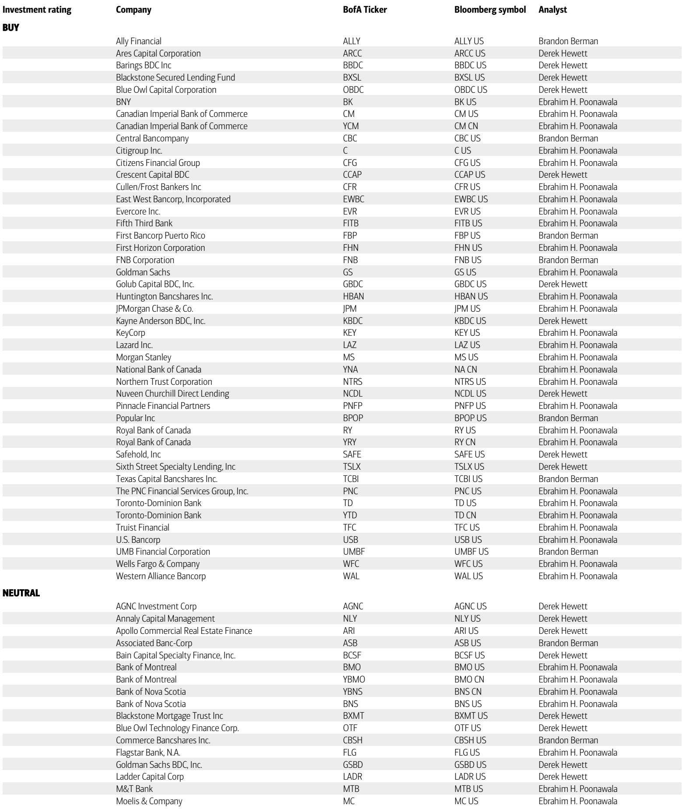
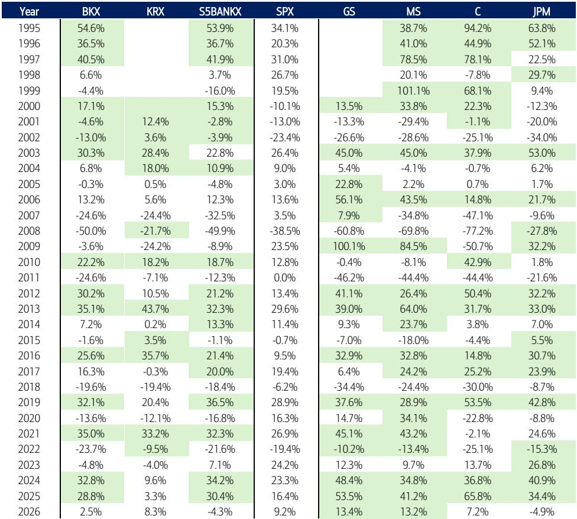
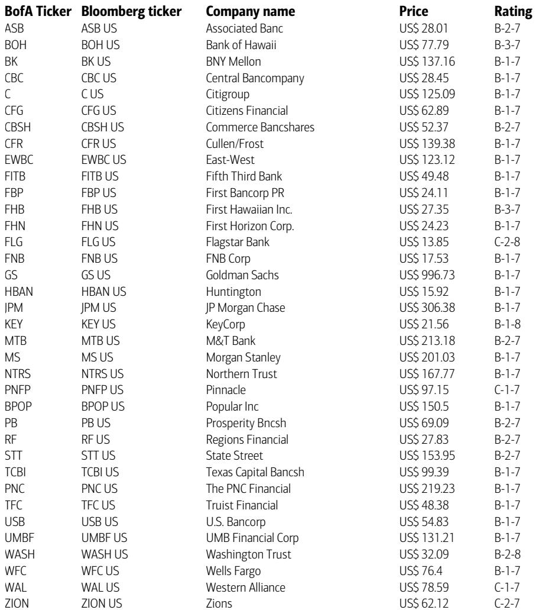

# 银行股真正的机会不在于降息，而在于一个被市场低估的结构性拐点

2026年已经过半，银行板块的表现却和年初多数投资者的预期大相径庭。大型银行股年内跑输标普500指数超过650个基点，在基本面并未恶化的背景下，这一幅度令人深思。年初时，市场普遍认为降息预期和监管放松将推动银行股持续跑赢大盘，但现实是，一系列负面标题——从信用卡利率上限提案到AI对财富管理业务的颠覆威胁，再到CLARITY法案对存款模式的冲击——层层叠加，压制了估值。

然而，一份来自某外资投行的最新年中研报提出了一个值得重新审视的判断：银行股当前面临的真正拐点，并不在于美联储何时降息，而在于一个更深层的结构性变化正在发生——后金融危机时代长达15年的监管压制周期正在终结，而这一变化对银行盈利能力和估值体系的影响，可能比利率路径更为持久。

这份报告的核心主张可以概括为一句话：当前银行股的估值折价，反映的不是基本面问题，而是市场对结构性变化的定价尚未完成。理解这一点，比预测下一次FOMC会议的结果更重要。

## 1. 银行股跑输大盘的本质不是基本面问题，而是市场被噪音干扰了定价

从研报提供的数据看，银行的基本面在2026年上半年其实相当稳健。一季度行业贷款增速达到6%的同比增长，大型银行更是达到9%。净利息收入在利率预期不断后移的背景下展现出韧性，投行业务收入同比增长30%，交易收入增长17%。盈利预期年内甚至在上修。

但与此同时，大型银行股却跑输了标普500指数670个基点。原因并非业绩，而是噪音。从1月份的信用卡利率上限提案开始，市场先后经历了对非银行贷款机构信用问题的担忧、AI对财富管理业务的颠覆恐惧、以及CLARITY法案对银行存款模式的长期质疑。这些负面标题像多米诺骨牌一样连续出现，每一次都让银行股承压，尽管这些风险对实际盈利的冲击远未兑现。

对于投资者而言，这意味着当前银行股的估值中包含了大量尚未实现的负面预期。大型银行目前交易在2027年预期盈利的9-10倍市盈率，而同期盈利增速约12%。这种估值与增速的错配，本身就是市场过度悲观的一个信号。当噪音消退——无论是通过政策明朗化还是实际业绩证明——估值修复的空间是相当可观的。

## 2. 当前环境与1990年代末高度相似，P/E扩张的历史可能在重演

研报中一个极具洞察力的历史类比，值得所有关注银行股的投资者认真思考。报告指出，当前银行股面临的宏观与监管环境，与1990年代末有着惊人的相似之处。

1990年代中后期，银行股经历了连续三年跑赢标普500的时期。当时的核心驱动力是两股力量同时作用：一是银行监管放松（跨州经营限制的取消），二是强劲的美国经济叠加互联网驱动的生产率提升预期。银行股的远期市盈率在这一时期从约9.5倍扩张至14.2倍，扩张幅度达约5倍。

而当前，类似的力量正在浮现。后金融危机时代的严苛监管正在被逐步放松（2026年3月宣布的资本提案是最重要的信号），AI投资正在催生市场对生产率提升的广泛期待，而美国经济在财政刺激和国内资本开支周期支撑下依然保持韧性。报告特别提到，1990年代末银行股在资本市场的强劲表现，正是投资者愿意在资本市场加速期持有这些股票的一个有力证据。

当然，历史不会简单重复。当前银行股的市盈率折价远超1990年代——大型银行相对标普500的折价已达到8-9倍，而1990年代这一折价几乎不存在。但恰恰是这种极端折价，为潜在的P/E扩张提供了更大的空间。如果监管放松和经济韧性能够持续，市场对银行股的重新定价可能比大多数人预期的更为剧烈。

## 3. 区域银行与大型银行的分化正在创造不对称的机会

年内银行股内部的分化非常明显。资本市场导向的股票（如GS、MS以及信托银行）和中小型银行表现领先，而大型货币中心银行和超级区域银行则相对落后。研报的判断是，这种分化正在从“规模驱动”转向“个股驱动”，这意味着选股的重要性在上升。

对于区域银行而言，等待的催化剂是宏观环境的进一步明朗化。报告特别指出，国内资本开支的持续动能和资本灵活性的改善（得益于标准化资本提案），是支撑2026-2027年区域银行实现双位数盈利增长的核心逻辑。推荐的标的中，第五第三银行、PNC、美国合众银行、KeyCorp、华BofA行等均被提及。

而对于大型银行，研报的观点更为分化。尽管资本市场主题仍然受到青睐，但JPM和Citi集团虽然提供了更具吸引力的风险回报比，却同时面临消费者放缓风险和AI驱动的存款颠覆担忧。纯投资银行如GS和MS则受益于积极的盈利修正周期和资本灵活性的改善，动能有望持续。

对于信托银行，报告认为它们同样是资本市场的受益者，其中纽约梅隆银行因其显著的自我改善空间和在AI与数字资产采纳方面的最佳定位而被特别推荐。

这一分化的含义是：投资者不应再将银行股视为一个同质化板块。不同子板块面临不同的驱动力和风险暴露，选股框架需要从“买银行”升级为“买哪一种银行”。

## 4. 资本市场的结构性繁荣可能被低估，但AI的叙事仍需要更精细的拆解

在报告的十个核心问题中，有两个判断值得特别关注：一是资本市场能否达到市场的过高预期（答案是“是”），二是银行股是否会成为AI主题（答案是“可能”）。

资本市场方面，研报的判断是明确的。投行业务的动能（并购、IPO、债券发行）、交易业务的韧性以及监管灵活性，共同构成了持续的支持。这与市场普遍担心的“资本市场繁荣不可持续”形成对比。报告认为，当前资本市场的活跃度并非纯粹由宽松货币驱动，而是反映了企业融资需求的真实回升和监管环境的改善。

而在AI问题上，报告的态度更为审慎。目前市场叙事更多地偏向AI对银行业的颠覆性影响——工作岗位流失、存款流失、软件替代——而非生产力提升带来的收益。报告认为银行最终将是AI的净受益者，但结构性ROE的提升不太可能发生。这意味着AI对银行的价值创造可能更多体现在成本端而非收入端，对估值的影响需要更长时间的验证。

对于投资者而言，这一判断意味着：不应简单地将AI主题套用到银行股上。真正受益的可能是那些能够将AI技术转化为运营效率提升和客户体验改善的银行，而非所有银行都会自动获得AI溢价。这是一个需要持续跟踪和验证的过程。

## 5. 报告尚未完全回答的关键问题：监管放松的节奏、AI对存款的颠覆、以及信用周期的真正拐点

尽管这份报告提供了丰富的分析框架和判断，仍有几个关键问题尚未完全展开，而这些恰恰是投资者在决策时需要重点关注的。

第一个问题是监管放松的实际节奏。虽然资本提案的方向是明确的，但“定制化”和“流动性规则”的后续进展仍存在不确定性。监管放松能否如期推进，以及不同规模银行受益程度的差异，将直接影响估值修复的幅度。

第二个问题是AI对存款模式的颠覆风险。CLARITY法案的推进和稳定币的机构化采纳，可能从根本上改变银行的资金来源结构。报告提到这一风险但未给出量化评估，而这对于评估银行的长期盈利能力至关重要。

第三个问题是信用周期的真正拐点。报告维持“信用质量不会改善”的判断，认为净坏账率将保持稳定，但C&I领域的“一次性事件”仍将持续。在没有衰退的前提下，一个完整的信用周期不太可能发生。但这里隐含的风险在于：如果经济韧性减弱，信用质量的下行可能比预期的更快。

这些问题在报告中都有提及但未充分展开，而它们恰恰是决定银行股中期走势的关键变量。对这些问题有更深入理解的投资者，将能够更准确地把握银行股的投资时机。

---

银行股当前面临的局面，用一个词来概括就是“错位”——基本面与市场情绪之间的错位，估值与盈利增长之间的错位，以及历史类比与现实节奏之间的错位。这种错位本身就是一种机会，但需要投资者有足够的耐心和洞察力去捕捉。

上述关于监管放松节奏、AI对存款的颠覆路径以及信用周期拐点的更深入分析，在完整报告中均有详细的图表和论证。欢迎加入我们的知识星球和微信群，与更多产业决策者和专业投资者一起，围绕这些尚未完全回答的问题继续讨论。在群内，你可以获取完整研报的原始图表和更细致的解读，也可以与我们直接交流你对银行股投资框架的看法。

Personal reading notes and learning share only. Not investment advice.

