Europe

Steel Steel

# Industry Steel Spread Tracker

Date 26 May 2026

Periodical

# US plate and HRC prices continue to rise, Chinese HRC softens

# Trade policy supports Western market prices, demand remains key concern

The recent dynamics in the Middle East have started to weigh on sentiment and a negative impact on demand remains the main concern in the near term. Nevertheless, Western prices and margins have been firm so far and the EU's plans for a significant step-up in trade protection should ultimately support a sustained rebound in European spreads, while the impact from CBAM adds to that. Hence, we maintain our constructive view on the sector. We published our take on the latest EU policy development last week (link). Our top picks in carbon steel are: Voestalpine (VOES.VI; Buy; EUR47.36; TP: EUR57), which remains the most solid equity story, based on steady FCF generation (despite peak decarb capex), self-help and an undervalued rail-infrastructure business; and thyssenkrupp (TKAG.DE, Buy; EUR11.39; TP: EUR14.50) on possible catalysts and policy tailwinds in steel. We recently upgraded the stock (link). In stainless steel, we prefer Acerinox (ACX.MC; Buy; EUR15.54; TP: EUR16), based on its exposure to the attractive US market and its solid cash returns. We also continue to like Aperam (APAM.AS; Buy; EUR50.90; TP: EUR65), based on its reversion potential and organic growth prospects, coupled with its strong mid-cycle FCF-generating ability and shareholder returns.

# Northern European HRC prices stable

Last week, indications for northern European HRC prices were up EUR2/t to the EUR680-695/t range (up USD3/t in USD terms to USD795-805/t). Southern European prices were down EUR8/t to the EUR675-685/t range (down USD9/t to USD785-795/t). The BOF price spread for German HRC vs the cost of key raw materials has increased to USD231/t (vs USD227/t last week), which is still significantly above mid-cycle levels. Marginal players remain around mid-cycle levels.

Bastian Synagowitz

Research Analyst

+41-44-227-3377

Liam Fitzpatrick

Research Analyst

+44-20-754-13233

Cody Hayden

Research Analyst

+44-20-754-13230

Figure 1: HRC prices   
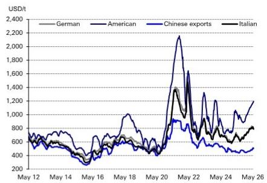

line

| Date | German (USD/t) | American (USD/t) | Chinese exports (USD/t) | Italian (USD/t) |
|---|---|---|---|---|
| May 12 | 600 | 650 | 620 | 630 |
| May 14 | 580 | 630 | 590 | 610 |
| May 16 | 550 | 600 | 560 | 580 |
| May 18 | 620 | 700 | 650 | 680 |
| May 20 | 500 | 550 | 520 | 530 |
| May 22 | 1400 | 2200 | 900 | 1350 |
| May 24 | 1200 | 1300 | 450 | 1100 |
| May 26 | 1100 | 1200 | 480 | 850 |

Source : CRU, Argus Media

Figure 2: Raw material prices   
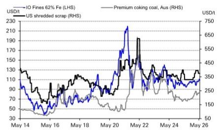

line

| Date   | 10 Fines 62% Fe (LHS) | Premium coking coal, Aus (RHS) | US shredded scrap (RHS) |
|--------|------------------------|----------------------------------|-------------------------|
| May 14 | 110                    | 150                              | 100                     |
| May 16 | 70                     | 100                              | 50                      |
| May 18 | 130                    | 150                              | 100                     |
| May 20 | 230                    | 250                              | 150                     |
| May 22 | 190                    | 650                              | 100                     |
| May 24 | 130                    | 150                              | 50                      |
| May 26 | 110                    | 150                              | 50                      |

Source : Kallanish, Bloomberg Finance LP

# US HRC and plate remain strong

Last week, US HRC prices were up USD13/t to the USD1190-1205/t range, and market sentiment remains strong on the back of solid lead times and domestic pricing discipline. Prices are up USD196/t this year. The BOF price spread vs the cost of key raw materials stands at USD638/t (up USD15/t vs the previous week). The EAF spread (HRC vs scrap) stands at USD616/t (up USD13/t vs the previous week). After fresh price hikes, US plate prices were up USD13/t to the USD1,350-1,365/t range and prices are currently up \~USD266/t in 2026.

# Chinese export prices down

Chinese domestic rebar prices were up RMB33/t to RMB3,331/t, while HRC prices were down RMB72/t to RMB3,413/t. Rebar prices have increased RMB125/t over the past three months, while HRC prices have increased RMB168/t. Chinese HRC export prices stand at USD500-510/t (down USD5/t vs last week). Considering transport costs and the 50% S232 duty, this implies a US parity price of USD910-930/t.

# Iron ore prices down

Iron ore (62% Fe) prices were down USD2/t to the USD108-110/t range last week. Coal prices were stable at the USD235-245/t range. US scrap prices were stable at the USD370-380/t range, while European scrap prices were down USD1/t to the USD360-375/t range.

# DB Steel & Mining team

# Europe

Bastian Synagowitz Liam Fitzpatrick

(+41) 44 227 3377 (+44) 207 541 3233

bastian.synagowitz@db.com liam.fitzpatrick@db.com

Cody Hayden

(+44) 207 541 3230

cody.hayden@db.com

# USA

Corinne Blanchard

+1 904 645 2360

corinne.blanchard@db.com

# Specialty sales

Alexander-J Butler

+(44) 207 541 5550

Alexander-j.butler@db.com

# Steel price summary

Figure 3: Steel price summary 

<table><tr><td rowspan="2">Prices for the week May 15 - May 22 Index</td><td rowspan="2">Price per tonne USD</td><td colspan="5">Absolute change (USD)</td><td colspan="5">% change (USD)</td></tr><tr><td>1w</td><td>1m</td><td>3m</td><td>ytd</td><td>y/y</td><td>1w</td><td>1m</td><td>3m</td><td>ytd</td><td>y/y</td></tr><tr><td>Hot Rolled Coil (HRC)</td><td></td><td></td><td></td><td></td><td></td><td></td><td></td><td></td><td></td><td></td><td></td></tr><tr><td>Germany</td><td>795-805</td><td>3</td><td>-14</td><td>0</td><td>67</td><td>112</td><td>0</td><td>-2</td><td>0</td><td>9</td><td>16</td></tr><tr><td>Italy</td><td>785-795</td><td>-9</td><td>-21</td><td>-5</td><td>49</td><td>111</td><td>-1</td><td>-3</td><td>-1</td><td>7</td><td>16</td></tr><tr><td>USA</td><td>1190-1205</td><td>13</td><td>41</td><td>109</td><td>196</td><td>207</td><td>1</td><td>4</td><td>10</td><td>20</td><td>21</td></tr><tr><td>Chinese exports</td><td>500-510</td><td>-5</td><td>10</td><td>42</td><td>52</td><td>53</td><td>-1</td><td>2</td><td>9</td><td>11</td><td>12</td></tr><tr><td>Cold Rolled Coil (CRC)</td><td></td><td></td><td></td><td></td><td></td><td></td><td></td><td></td><td></td><td></td><td></td></tr><tr><td>Germany</td><td>910-925</td><td>0</td><td>-18</td><td>-20</td><td>58</td><td>110</td><td>0</td><td>-2</td><td>-2</td><td>7</td><td>14</td></tr><tr><td>Italy</td><td>925-935</td><td>0</td><td>-15</td><td>-8</td><td>70</td><td>131</td><td>0</td><td>-2</td><td>-1</td><td>8</td><td>16</td></tr><tr><td>USA</td><td>1375-1390</td><td>23</td><td>69</td><td>134</td><td>184</td><td>161</td><td>2</td><td>5</td><td>11</td><td>15</td><td>13</td></tr><tr><td>Hot Dipped Galvanised Coil (HDG)</td><td></td><td></td><td></td><td></td><td></td><td></td><td></td><td></td><td></td><td></td><td></td></tr><tr><td>Germany</td><td>920-930</td><td>0</td><td>-15</td><td>-2</td><td>64</td><td>111</td><td>0</td><td>-2</td><td>0</td><td>7</td><td>14</td></tr><tr><td>Italy</td><td>920-930</td><td>-9</td><td>-24</td><td>-2</td><td>58</td><td>122</td><td>-1</td><td>-2</td><td>0</td><td>7</td><td>15</td></tr><tr><td>USA</td><td>1475-1485</td><td>17</td><td>76</td><td>175</td><td>249</td><td>248</td><td>1</td><td>5</td><td>13</td><td>20</td><td>20</td></tr><tr><td>Plate</td><td></td><td></td><td></td><td></td><td></td><td></td><td></td><td></td><td></td><td></td><td></td></tr><tr><td>Germany</td><td>950-960</td><td>2</td><td>2</td><td>76</td><td>127</td><td>119</td><td>0</td><td>0</td><td>9</td><td>15</td><td>14</td></tr><tr><td>Italy</td><td>910-920</td><td>1</td><td>12</td><td>51</td><td>131</td><td>172</td><td>0</td><td>1</td><td>6</td><td>17</td><td>23</td></tr><tr><td>USA</td><td>1350-1365</td><td>13</td><td>72</td><td>183</td><td>266</td><td>93</td><td>1</td><td>6</td><td>16</td><td>24</td><td>7</td></tr><tr><td>Rebar</td><td></td><td></td><td></td><td></td><td></td><td></td><td></td><td></td><td></td><td></td><td></td></tr><tr><td>Germany</td><td>820-830</td><td>6</td><td>74</td><td>106</td><td>128</td><td>90</td><td>1</td><td>10</td><td>15</td><td>18</td><td>12</td></tr><tr><td>USA</td><td>1050-1065</td><td>0</td><td>28</td><td>11</td><td>66</td><td>220</td><td>0</td><td>3</td><td>1</td><td>7</td><td>26</td></tr><tr><td>Iron ore as of 22 May 2026</td><td></td><td></td><td></td><td></td><td></td><td></td><td></td><td></td><td></td><td></td><td></td></tr><tr><td>Fines 62% Fe</td><td>108-110</td><td>-2</td><td>2</td><td>11</td><td>3</td><td>9</td><td>-1</td><td>2</td><td>11</td><td>3</td><td>9</td></tr><tr><td>Scrap as of 21 May 2026</td><td></td><td></td><td></td><td></td><td></td><td></td><td></td><td></td><td></td><td></td><td></td></tr><tr><td>US</td><td>370-380</td><td>0</td><td>0</td><td>-20</td><td>30</td><td>45</td><td>0</td><td>0</td><td>-5</td><td>9</td><td>14</td></tr><tr><td>Europe</td><td>360-375</td><td>-1</td><td>8</td><td>26</td><td>37</td><td>44</td><td>0</td><td>2</td><td>8</td><td>11</td><td>14</td></tr><tr><td>Coking coal as of 22 May 2026</td><td></td><td></td><td></td><td></td><td></td><td></td><td></td><td></td><td></td><td></td><td></td></tr><tr><td>Premium Coking Coal / Australian Exports</td><td>235-245</td><td>0</td><td>8</td><td>-6</td><td>19</td><td>50</td><td>0</td><td>3</td><td>-2</td><td>9</td><td>26</td></tr></table>

Source : DB, CRU, Argus Media, Kallanish, Bloomberg Finance LP

# Industry valuation and risks

We use various methodologies to value the steel companies under our coverage – from a DCF-based valuation to a normalised earnings approach and a sum-of-the-parts (SOTP) analysis. Key industry risks include (1) global economic growth not meeting/exceeding expectations; (2) lower- or higher-than-expected steel prices, which could result in an erosion of, or a boost to, earnings; (3) higher/lower raw material and other operating costs, which could limit/help earnings growth; (4) political influence of governments on the steel trade; (5) expansion projects failing to progress as expected; and (6) M&A valuation and integration risks.

# Spreads and cash costs

Figure 4: German HRC vs BOF HRC cash costs (average producers)   
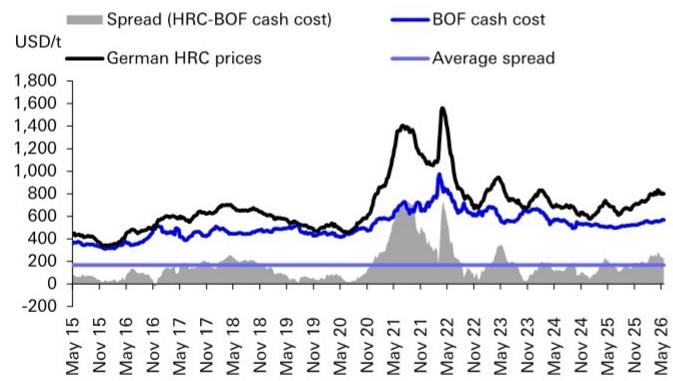

line

| Date   | German HRC prices | BOF cash cost | Average spread |
|--------|-------------------|---------------|----------------|
| May 15 | ~400              | ~300          | ~200           |
| Nov 15 | ~450              | ~350          | ~200           |
| May 16 | ~500              | ~400          | ~200           |
| Nov 16 | ~550              | ~450          | ~200           |
| May 17 | ~600              | ~500          | ~200           |
| Nov 17 | ~650              | ~550          | ~200           |
| May 18 | ~700              | ~600          | ~200           |
| Nov 18 | ~750              | ~650          | ~200           |
| May 19 | ~800              | ~700          | ~200           |
| Nov 19 | ~850              | ~750          | ~200           |
| May 20 | ~900              | ~800          | ~200           |
| Nov 20 | ~1,400            | ~850          | ~200           |
| May 21 | ~1,600            | ~900          | ~200           |
| Nov 21 | ~1,400            | ~950          | ~200           |
| May 22 | ~1,600            | ~1,000        | ~200           |
| Nov 22 | ~1,400            | ~950          | ~200           |
| May 23 | ~1,300            | ~900          | ~200           |
| Nov 23 | ~1,200            | ~850          | ~200           |
| May 24 | ~1,100            | ~800          | ~200           |
| Nov 24 | ~1,000            | ~750          | ~200           |
| May 25 | ~950              | ~700          | ~200           |
| Nov 25 | ~900              | ~650          | ~200           |
| May 26 | ~850              | ~600          | ~200           |

Source : DB estimates, Argus Media

Figure 5: German HRC vs BOF HRC cash costs (marginal producers with full CO₂ cost)   
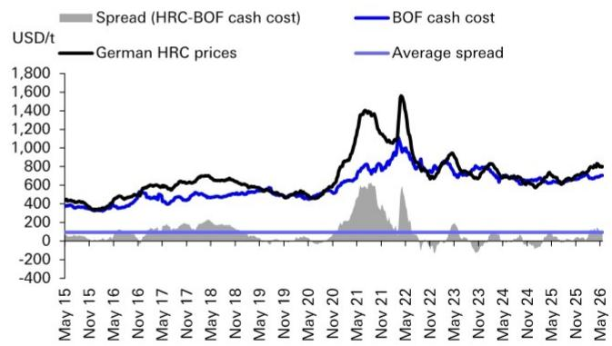

line

| Date   | German HRC prices | BOF cash cost | Average spread |
|--------|-------------------|---------------|----------------|
| May 15 | 400               | 400           | 0              |
| Nov 15 | 450               | 450           | 0              |
| May 16 | 500               | 500           | 0              |
| Nov 16 | 550               | 550           | 0              |
| May 17 | 600               | 600           | 0              |
| Nov 17 | 650               | 650           | 0              |
| May 18 | 700               | 700           | 0              |
| Nov 18 | 750               | 750           | 0              |
| May 19 | 800               | 800           | 0              |
| Nov 19 | 850               | 850           | 0              |
| May 20 | 900               | 900           | 0              |
| Nov 20 | 1,400             | 1,400         | 0              |
| May 21 | 1,600             | 1,600         | 0              |
| Nov 21 | 1,400             | 1,400         | 0              |
| May 22 | 1,600             | 1,600         | 0              |
| Nov 22 | 1,400             | 1,400         | 0              |
| May 23 | 1,200             | 1,200         | 0              |
| Nov 23 | 1,000             | 1,000         | 0              |
| May 24 | 800               | 800           | 0              |
| Nov 24 | 700               | 700           | 0              |
| May 25 | 650               | 650           | 0              |
| Nov 25 | 750               | 750           | 0              |
| May 26 | 850               | 850           | 0              |

Source : DB estimates, Argus Media

Figure 6: US HRC vs BOF HRC cash costs   
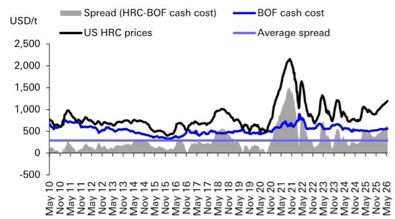

line

| Date   | US HRC prices | BOF cash cost | Average spread |
|--------|---------------|---------------|----------------|
| May 10 | ~700          | ~600          | ~300           |
| Nov 10 | ~800          | ~650          | ~300           |
| May 11 | ~900          | ~700          | ~300           |
| Nov 11 | ~850          | ~650          | ~300           |
| May 12 | ~800          | ~600          | ~300           |
| Nov 12 | ~750          | ~550          | ~300           |
| May 13 | ~700          | ~500          | ~300           |
| Nov 13 | ~650          | ~450          | ~300           |
| May 14 | ~600          | ~400          | ~300           |
| Nov 14 | ~550          | ~350          | ~300           |
| May 15 | ~500          | ~300          | ~300           |
| Nov 15 | ~450          | ~250          | ~300           |
| May 16 | ~400          | ~200          | ~300           |
| Nov 16 | ~350          | ~150          | ~300           |
| May 17 | ~300          | ~100          | ~300           |
| Nov 17 | ~250          | ~50           | ~300           |
| May 18 | ~200          | ~25           | ~300           |
| Nov 18 | ~150          | ~10           | ~300           |
| May 19 | ~100          | ~5            | ~300           |
| Nov 19 | ~50           | ~2            | ~300           |
| May 20 | ~25           | ~1            | ~300           |
| Nov 20 | ~15           | ~0.5          | ~300           |
| May 21 | ~1,50         | ~5            | ~300           |
| Nov 21 | ~2,20         | ~1,50         | ~3,50          |
| May 22 | ~1,80         | ~8            | ~3,50          |
| Nov 22 | ~1,50         | ~6            | ~3,50          |
| May 23 | ~1,20         | ~5            | ~3,50          |
| Nov 23 | ~1,40         | ~6            | ~3,50          |
| May 24 | ~1,30         | ~7            | ~3,50          |
| Nov 24 | ~1,20         | ~8            | ~3,50          |
| May 25 | ~1,10         | ~9            | ~3,50          |
| Nov 25 | ~1,25         | ~1,2           | ~3,50          |
| May 26 | ~1,35         | ~1,4           | ~3,50          |

Source : DB estimates, CRU

Figure 7: US HRC vs EAF HRC cash costs   
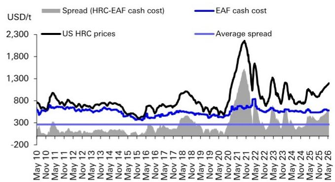

line

| Date   | US HRC prices | EAF cash cost | Spread (HRC-EAF cash cost) | Average spread |
|--------|---------------|---------------|-----------------------------|----------------|
| May 10 | 800           | 700           | -200                        | 300            |
| Nov 10 | 850           | 750           | -150                        | 300            |
| May 11 | 900           | 800           | -100                        | 300            |
| Nov 11 | 850           | 750           | -50                         | 300            |
| May 12 | 800           | 700           | 0                           | 300            |
| Nov 12 | 750           | 650           | 50                          | 300            |
| May 13 | 700           | 600           | 100                         | 300            |
| Nov 13 | 650           | 550           | 150                         | 300            |
| May 14 | 600           | 500           | 200                         | 300            |
| Nov 14 | 550           | 450           | 250                         | 300            |
| May 15 | 500           | 400           | 300                         | 300            |
| Nov 15 | 450           | 350           | 350                         | 300            |
| May 16 | 400           | 300           | 400                         | 300            |
| Nov 16 | 350           | 250           | 450                         | 300            |
| May 17 | 300           | 200           | 500                         | 300            |
| Nov 17 | 250           | 150           | 550                         | 300            |
| May 18 | 200           | 100           | 600                         | 300            |
| Nov 18 | 150           | 50            | 650                         | 300            |
| May 19 | 100           | 0             | 700                         | 300            |
| Nov 19 | 50            | -50           | 750                         | 300            |
| May 20 | 0             | -100          | 800                         | 300            |
| Nov 20 | -50           | -150          | 850                         | 300            |
| May 21 | -100          | -200          | 900                         | 300            |
| Nov 21 | -150          | -250          | 950                         | 300            |
| May 22 | -200          | -300          | 1,350                       | 350            |
| Nov 22 | -250          | -350          | 1,650                       | 400            |
| May 23 | -300          | -400          | 1,850                       | 450            |
| Nov 23 | -350          | -450          | 2,150                       | 500            |
| May 24 | -400          | -500          | 2,450                       | 550            |
| Nov 24 | -450          | -550          | 2,750                       | 600            |
| May 25 | -500          | -600          | 3,150                       | 650            |
| Nov 25 | -550          | -650          | 3,450                       | 700            |
| May 26 | -600          | -700          | 3,850                       | 750            |

Source : DB estimates, CRU

Figure 8: German plate vs BOF cash costs   
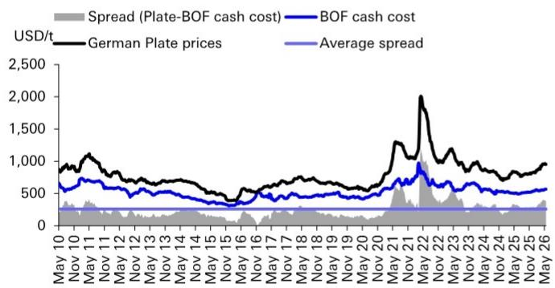

line

| Date   | German Plate prices | BOF cash cost | Average spread | Spread (Plate-BOF cash cost) |
|--------|---------------------|---------------|----------------|-------------------------------|
| May 10 | ~900                | ~600          | ~300           | ~300                          |
| Nov 10 | ~1,000              | ~650          | ~300           | ~300                          |
| May 11 | ~950                | ~600          | ~300           | ~300                          |
| Nov 11 | ~850                | ~550          | ~300           | ~300                          |
| May 12 | ~800                | ~500          | ~300           | ~300                          |
| Nov 12 | ~750                | ~450          | ~300           | ~300                          |
| May 13 | ~700                | ~400          | ~300           | ~300                          |
| Nov 13 | ~650                | ~350          | ~300           | ~300                          |
| May 14 | ~600                | ~300          | ~300           | ~300                          |
| Nov 14 | ~550                | ~250          | ~300           | ~300                          |
| May 15 | ~500                | ~200          | ~300           | ~300                          |
| Nov 15 | ~450                | ~150          | ~300           | ~300                          |
| May 16 | ~400                | ~100          | ~300           | ~300                          |
| Nov 16 | ~450                | ~150          | ~300           | ~300                          |
| May 17 | ~500                | ~200          | ~300           | ~300                          |
| Nov 17 | ~550                | ~250          | ~300           | ~300                          |
| May 18 | ~600                | ~300          | ~300           | ~300                          |
| Nov 18 | ~650                | ~350          | ~300           | ~300                          |
| May 19 | ~700                | ~400          | ~300           | ~300                          |
| Nov 19 | ~750                | ~450          | ~300           | ~300                          |
| May 20 | ~800                | ~500          | ~300           | ~300                          |
| Nov 20 | ~850                | ~550          | ~300           | ~300                          |
| May 21 | ~900                | ~600          | ~300           | ~300                          |
| Nov 21 | ~950                | ~650          | ~300           | ~300                          |
| May 22 | ~2,100              | ~750          | ~350           | ~850                          |
| Nov 22 | ~1,800              | ~75           | ~35            | ~85                           |
| May 23 | ~1,600              | ~75           | ~35            | ~85                           |
| Nov 23 | ~1,400              | ~75           | ~35            | ~85                           |
| May 24 | ~1,200              | ~75           | ~35            | ~85                           |
| Nov 24 | ~1,100              | ~75           | ~35            | ~85                           |
| May 25 | ~1,250              | ~75           | ~35            | ~85                           |
| Nov 25 | ~1,350              | ~75           | ~35            | ~85                           |
| May 26 | ~1,450              | ~75           | ~35            | ~85                           |

Source : DB estimates, Argus Media

Figure 9: US plate vs EAF cash costs   
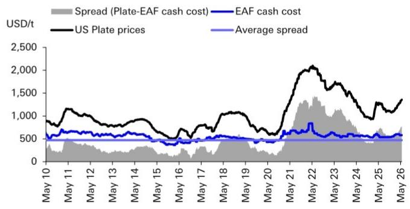

line

| Date   | US Plate prices | EAF cash cost | Average spread |
|--------|-----------------|---------------|----------------|
| May 10 | ~900            | ~600          | ~400           |
| May 11 | ~1,100          | ~650          | ~450           |
| May 12 | ~1,000          | ~600          | ~450           |
| May 13 | ~950            | ~550          | ~450           |
| May 14 | ~900            | ~500          | ~450           |
| May 15 | ~850            | ~450          | ~450           |
| May 16 | ~700            | ~400          | ~450           |
| May 17 | ~800            | ~450          | ~450           |
| May 18 | ~900            | ~500          | ~450           |
| May 19 | ~1,000          | ~550          | ~450           |
| May 20 | ~600            | ~450          | ~450           |
| May 21 | ~1,200          | ~600          | ~450           |
| May 22 | ~2,100          | ~700          | ~450           |
| May 23 | ~1,800          | ~650          | ~450           |
| May 24 | ~1,500          | ~600          | ~450           |
| May 25 | ~1,200          | ~550          | ~450           |
| May 26 | ~1,300          | ~550          | ~450           |

Source : DB estimates, CRU

Figure 10: German rebar vs EAF cash costs   
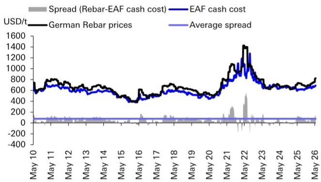

line

| Date   | German Rebar prices | EAF cash cost | Average spread | Spread (Rebar-EAF cash cost) |
|--------|---------------------|---------------|----------------|-------------------------------|
| May 10 | ~700                | ~650          | ~50            | ~0                            |
| May 11 | ~800                | ~700          | ~50            | ~0                            |
| May 12 | ~750                | ~650          | ~50            | ~0                            |
| May 13 | ~700                | ~600          | ~50            | ~0                            |
| May 14 | ~650                | ~550          | ~50            | ~0                            |
| May 15 | ~600                | ~500          | ~50            | ~0                            |
| May 16 | ~550                | ~450          | ~50            | ~0                            |
| May 17 | ~600                | ~500          | ~50            | ~0                            |
| May 18 | ~650                | ~550          | ~50            | ~0                            |
| May 19 | ~700                | ~600          | ~50            | ~0                            |
| May 20 | ~750                | ~650          | ~50            | ~0                            |
| May 21 | ~800                | ~700          | ~50            | ~0                            |
| May 22 | ~1400               | ~1300         | ~140           | ~300                          |
| May 23 | ~1200               | ~1100         | ~120           | ~20                           |
| May 24 | ~1000               | ~900          | ~100           | ~10                           |
| May 25 | ~900                | ~800          | ~90            | ~5                            |
| May 26 | ~850                | ~750          | ~85            | ~5                            |

Source : DB estimates, Argus Media

Figure 11: US rebar vs EAF cash costs   
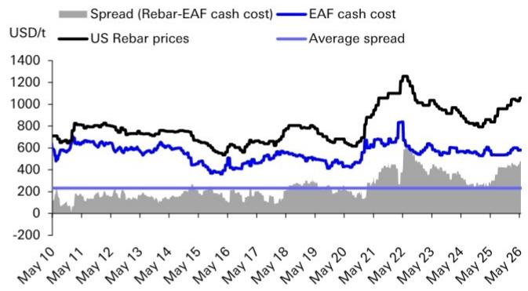

line

| Date   | US Rebar prices | EAF cash cost | Average spread | Spread (Rebar-EAF cash cost) |
|--------|-----------------|---------------|----------------|-------------------------------|
| May 10 | ~700            | ~500          | 200            | ~100                          |
| May 11 | ~800            | ~600          | 200            | ~150                          |
| May 12 | ~750            | ~550          | 200            | ~120                          |
| May 13 | ~700            | ~500          | 200            | ~100                          |
| May 14 | ~650            | ~450          | 200            | ~80                           |
| May 15 | ~600            | ~400          | 200            | ~60                           |
| May 16 | ~550            | ~350          | 200            | ~50                           |
| May 17 | ~600            | ~400          | 200            | ~70                           |
| May 18 | ~700            | ~450          | 200            | ~90                           |
| May 19 | ~750            | ~500          | 200            | ~110                          |
| May 20 | ~800            | ~550          | 200            | ~130                          |
| May 21 | ~900            | ~600          | 200            | ~150                          |
| May 22 | ~1300           | ~850          | 200            | ~450                          |
| May 23 | ~1250           | ~650          | 200            | ~350                          |
| May 24 | ~1100           | ~600          | 200            | ~300                          |
| May 25 | ~1150           | ~650          | 200            | ~350                          |
| May 26 | ~1200           | ~650          | 200            | ~450                          |

Source : DB estimates, CRU

Figure 12: Chinese HRC price-cost spread (using coke)   
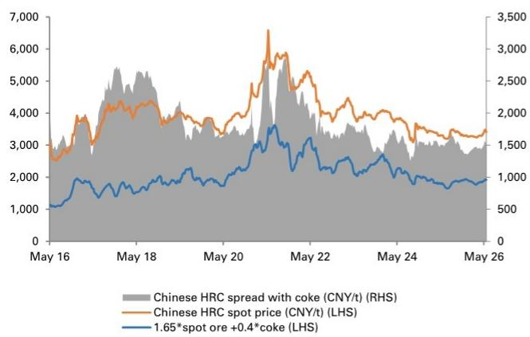

line

| Date   | Chinese HRC spread with coke (CNY/t) (RHS) | Chinese HRC spot price (CNY/t) (LHS) | 1.65*spot ore +0.4*coke (LHS) |
|--------|---------------------------------------------|--------------------------------------|--------------------------------|
| May 16 | ~3,000                                      | ~2,800                               | ~1,000                         |
| May 18 | ~5,000                                      | ~4,500                               | ~1,500                         |
| May 20 | ~3,500                                      | ~3,800                               | ~2,000                         |
| May 22 | ~6,000                                      | ~3,500                               | ~2,500                         |
| May 24 | ~3,500                                      | ~3,000                               | ~1,800                         |
| May 26 | ~3,000                                      | ~2,800                               | ~1,900                         |

Source : DB estimates, Bloomberg Finance LP

Figure 13: Chinese rebar price-cost spread (using coke)   
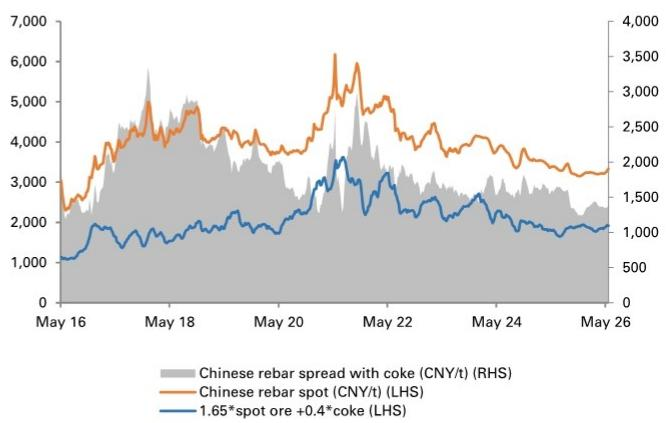

line

| Date   | Chinese rebar spread with coke (CNY/t) (RHS) | Chinese rebar spot (CNY/t) (LHS) | 1.65*spot ore +0.4*coke (LHS) |
|--------|-----------------------------------------------|----------------------------------|-------------------------------|
| May 16 | ~2,500                                        | ~2,500                           | ~1,000                        |
| May 18 | ~5,000                                        | ~5,000                           | ~1,500                        |
| May 20 | ~3,500                                        | ~3,500                           | ~2,000                        |
| May 22 | ~3,000                                        | ~3,000                           | ~2,500                        |
| May 24 | ~2,500                                        | ~2,500                           | ~2,000                        |
| May 26 | ~2,000                                        | ~2,000                           | ~1,500                        |

Source : DB estimates, Bloomberg Finance LP

# Primary steel-making raw material prices

Figure 14: Fines $62\%$ Fe, CFR Tianjin Port, China   
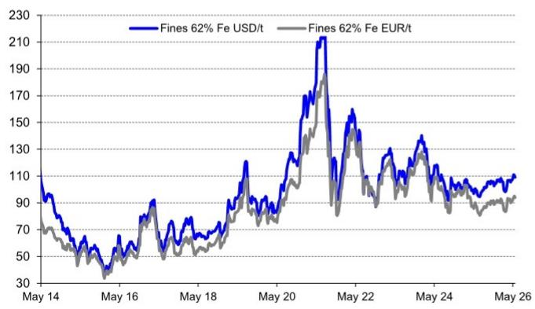

line

| Date   | Fines 62% Fe USD/t | Fines 62% Fe EUR/t |
|--------|---------------------|---------------------|
| May 14 | ~95                 | ~70                 |
| May 16 | ~35                 | ~40                 |
| May 18 | ~70                 | ~50                 |
| May 20 | ~130                | ~100                |
| May 22 | ~160                | ~140                |
| May 24 | ~130                | ~100                |
| May 26 | ~110                | ~90                 |

Source : Bloomberg Finance LP

Figure 15: QoQ performance   
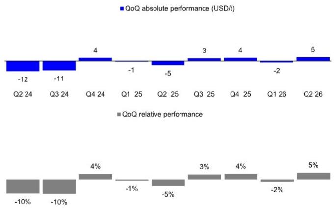

bar_line

| Quarter | QoQ absolute performance (USD/t) | QoQ relative performance (%) |
|---|---|---|
| Q2 24 | -12 | -10 |
| Q3 24 | -11 | -10 |
| Q4 24 | 4 | 4 |
| Q1 25 | -1 | -1 |
| Q2 25 | -5 | -5 |
| Q3 25 | 3 | 3 |
| Q4 25 | 4 | 4 |
| Q1 26 | -2 | -2 |
| Q2 26 | 5 | 5 |

Source : Bloomberg Finance LP

Figure 16: Premium coking coal (Australian exports)   
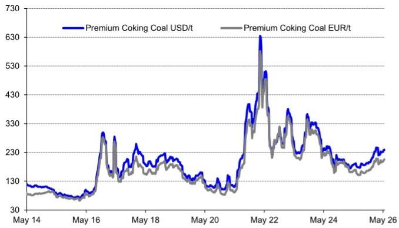

line

| Date   | Premium Coking Coal USD/t | Premium Coking Coal EUR/t |
|--------|---------------------------|---------------------------|
| May 14 | 130                       | 125                       |
| May 16 | 280                       | 270                       |
| May 18 | 220                       | 210                       |
| May 20 | 130                       | 120                       |
| May 22 | 630                       | 580                       |
| May 24 | 330                       | 310                       |
| May 26 | 230                       | 210                       |

Source : Bloomberg Finance LP

Figure 17: QoQ performance   
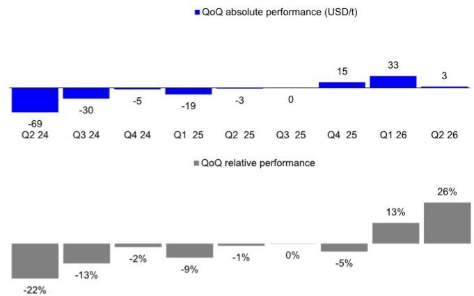

bar_line

| Quarter | QoQ absolute performance (USD/t) | QoQ relative performance (%) |
|---|---|---|
| Q2 24 | -69 | -22 |
| Q3 24 | -30 | -13 |
| Q4 24 | -5 | -2 |
| Q1 25 | -19 | -9 |
| Q2 25 | -3 | -1 |
| Q3 25 | 0 | 0 |
| Q4 25 | 15 | -5 |
| Q1 26 | 33 | 13 |
| Q2 26 | 3 | 26 |

Source : Bloomberg Finance LP

# Regional spreads and trade statistics

Figure 18: Italian HRC vs Chinese HRC   
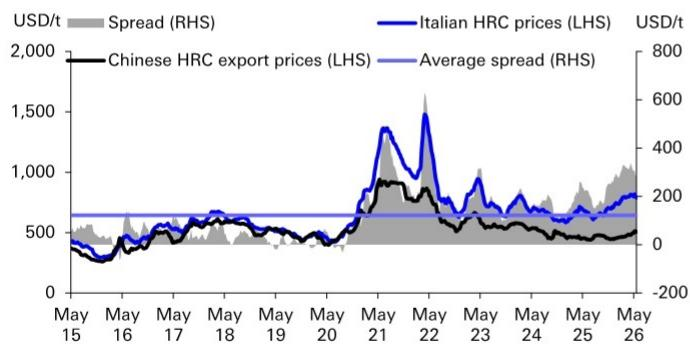

line

| Date  | Spread (RHS) | Italian HRC prices (LHS) | Chinese HRC export prices (LHS) | Average spread (RHS) |
|-------|--------------|--------------------------|----------------------------------|----------------------|
| May 15| ~400         | ~300                     | ~200                             | ~100                 |
| May 16| ~500         | ~400                     | ~300                             | ~100                 |
| May 17| ~600         | ~500                     | ~400                             | ~100                 |
| May 18| ~700         | ~600                     | ~500                             | ~100                 |
| May 19| ~600         | ~500                     | ~400                             | ~100                 |
| May 20| ~500         | ~400                     | ~300                             | ~100                 |
| May 21| ~800         | ~1,400                   | ~900                             | ~150                 |
| May 22| ~1,600       | ~1,500                   | ~800                             | ~150                 |
| May 23| ~700         | ~600                     | ~500                             | ~150                 |
| May 24| ~600         | ~500                     | ~400                             | ~150                 |
| May 25| ~700         | ~600                     | ~500                             | ~150                 |
| May 26| ~800         | ~700                     | ~600                             | ~150                 |

Source : DB estimates, Argus Media

Figure 19: German HRC vs US HRC   
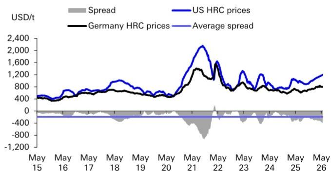

line

| Date  | US HRC prices | Germany HRC prices | Average spread |
|-------|---------------|--------------------|----------------|
| May 15| 400           | 400                | -200           |
| May 16| 600           | 500                | -200           |
| May 17| 800           | 600                | -200           |
| May 18| 1,000         | 700                | -200           |
| May 19| 800           | 600                | -200           |
| May 20| 600           | 500                | -200           |
| May 21| 2,200         | 1,500              | -200           |
| May 22| 1,600         | 1,300              | -200           |
| May 23| 1,200         | 1,000              | -200           |
| May 24| 800           | 700                | -200           |
| May 25| 1,000         | 800                | -200           |
| May 26| 1,200         | 900                | -200           |

Source : DB estimates, Argus Media

Figure 20: US HRC vs Chinese HRC   
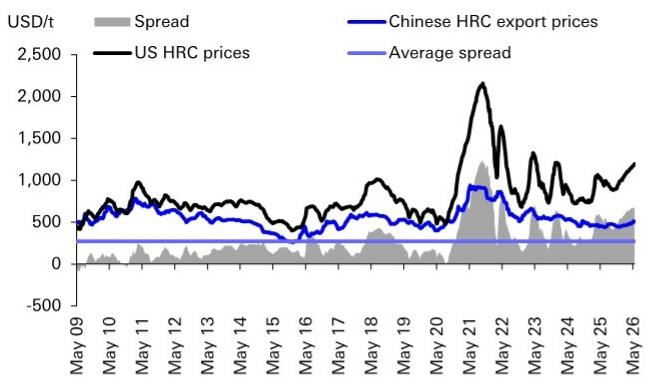

line

| Date   | US HRC prices | Chinese HRC export prices | Average spread |
|--------|---------------|---------------------------|----------------|
| May 09 | ~500          | ~500                      | ~300           |
| May 10 | ~700          | ~600                      | ~300           |
| May 11 | ~900          | ~700                      | ~300           |
| May 12 | ~800          | ~600                      | ~300           |
| May 13 | ~700          | ~500                      | ~300           |
| May 14 | ~600          | ~400                      | ~300           |
| May 15 | ~500          | ~300                      | ~300           |
| May 16 | ~400          | ~200                      | ~300           |
| May 17 | ~500          | ~300                      | ~300           |
| May 18 | ~700          | ~400                      | ~300           |
| May 19 | ~800          | ~500                      | ~300           |
| May 20 | ~900          | ~600                      | ~300           |
| May 21 | ~2,200        | ~800                      | ~300           |
| May 22 | ~1,500        | ~700                      | ~300           |
| May 23 | ~1,200        | ~600                      | ~300           |
| May 24 | ~1,300        | ~500                      | ~300           |
| May 25 | ~1,100        | ~400                      | ~300           |
| May 26 | ~1,200        | ~500                      | ~300           |

Source : DB estimates, Argus Media, CRU

Figure 21: US HRC vs Chinese HRC parity price   
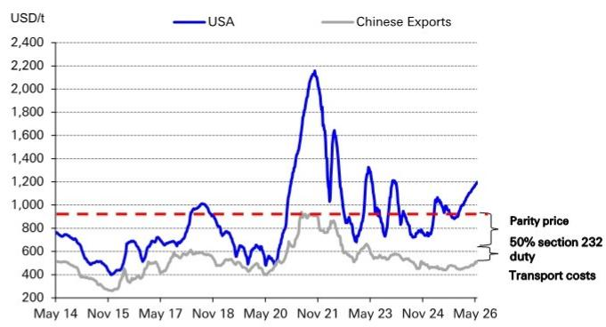

line

| Date   | USA   | Chinese Exports |
|--------|-------|-----------------|
| May 14 | 700   | 500             |
| Nov 15 | 400   | 300             |
| May 17 | 700   | 500             |
| Nov 18 | 1,000 | 600             |
| May 20 | 600   | 400             |
| Nov 21 | 2,200 | 900             |
| May 23 | 1,300 | 600             |
| Nov 24 | 1,000 | 500             |
| May 26 | 1,200 | 550             |

Source : DB estimates, Kallanish

# EU safeguard-quota utilisation

We entered a new quota period on 1 April 2026. The balance from the previous quarter was rolled over two weeks back. Hence, current balances for all the categories are with respect to adjusted numbers with previous balances wherever applicable. As of 22 May 2026, some categories have seen significant material inflow with 61% of HR sheet, 23% of CR, 56-65% of coated sheet and 49% of plate quotas already utilised. The entire country specific quarterly quota for Indian and Turkish HRC and Chinese coated sheet (4b) is exhausted while 92% of the S.Korean coated sheet (4a) quota has also been used. Overall, the quota usage remains lower than previous quarters in most of the categories. The European Commission has announced its proposal for the new trade protection regime, which is encouraging. All eyes will now be on the European Parliament final decision in May.

Figure 22: HR sheet exhausted-quota status   
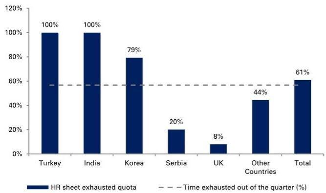

bar

| Country | HR sheet exhausted quota (%) |
| :--- | :--- |
| Turkey | 100 |
| India | 100 |
| Korea | 79 |
| Serbia | 20 |
| UK | 8 |
| Other Countries | 44 |
| Total | 61 |
Time exhausted out of the quarter (%)

Source: European Commission

Figure 23: CR sheet exhausted-quota status   
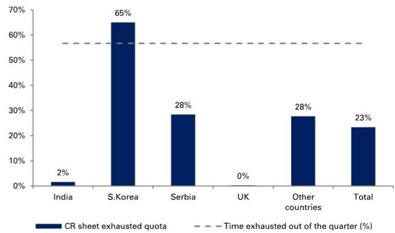

bar

| Country | CR sheet exhausted quota (%) |
| :--- | :--- |
| India | 2 |
| S.Korea | 65 |
| Serbia | 28 |
| UK | 0 |
| Other countries | 28 |
| Total | 23 |
Time exhausted out of the quarter (%)

Source : European Commission

Figure 24: Coated sheet (subject to AD duties) exhausted-quota status   
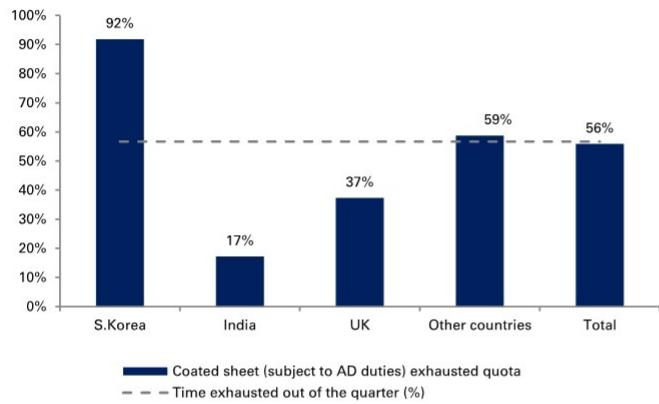

bar

| Country/Group | Coated sheet (subject to AD duties) exhausted quota (%) | Time exhausted out of the quarter (%) |
| :--- | :--- | :--- |
| S.Korea | 92 | 56 |
| India | 17 | 56 |
| UK | 37 | 56 |
| Other countries | 59 | 56 |
| Total | 56 | 56 |

Source: European Commission

Figure 25: Coated sheet (not subject to AD duties, including auto grades) exhausted-quota status   
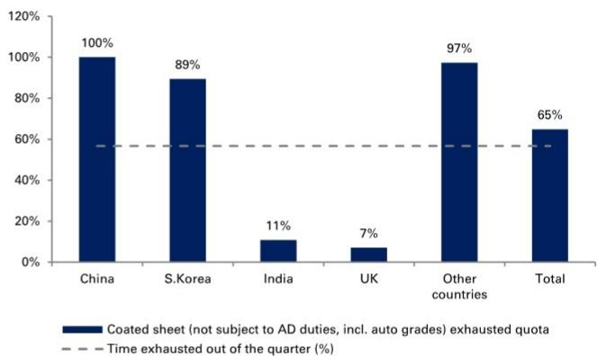

bar

| Country | Coated sheet (not subject to AD duties, incl. auto grades) exhausted quota (%) |
| :--- | :--- |
| China | 100 |
| S.Korea | 89 |
| India | 11 |
| UK | 7 |
| Other countries | 97 |
| Total | 65 |
Time exhausted out of the quarter (%)

Source : European Commission

Figure 26: Quarto plates exhausted-quota status   
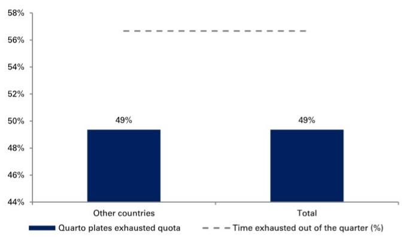

bar

| Category | Quarto plates exhausted quota (%) | Time exhausted out of the quarter (%) |
|---|---|---|
| Other countries | 49 | 56.5 |
| Total | 49 | 56.5 |

Source : European Commission

Figure 27: Stainless HR exhausted-quota status   
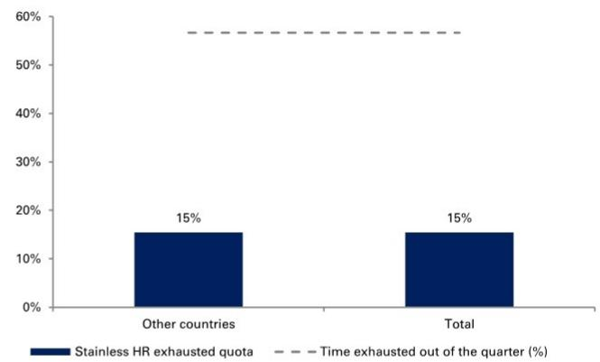

bar

| Category | Stainless HR exhausted quota (%) | Time exhausted out of the quarter (%) |
|---|---|---|
| Other countries | 15 | 57 |
| Total | 15 | 57 |

Source : European Commission

Figure 28: Stainless CR exhausted-quota status   
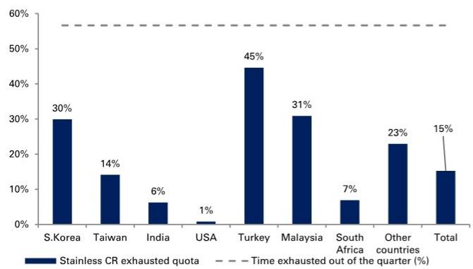

bar

| Country | Stainless CR exhausted quota (%) | Time exhausted out of the quarter (%) |
| :--- | :--- | :--- |
| S.Korea | 30 | 56 |
| Taiwan | 14 | 56 |
| India | 6 | 56 |
| USA | 1 | 56 |
| Turkey | 45 | 56 |
| Malaysia | 31 | 56 |
| South Africa | 7 | 56 |
| Other countries | 23 | 56 |
| Total | 15 | 56 |

Source : European Commission

# Key regional trade statistics

Figure 29: Total steel net imports vs net-import market share (%) – EU27+UK (long term)   
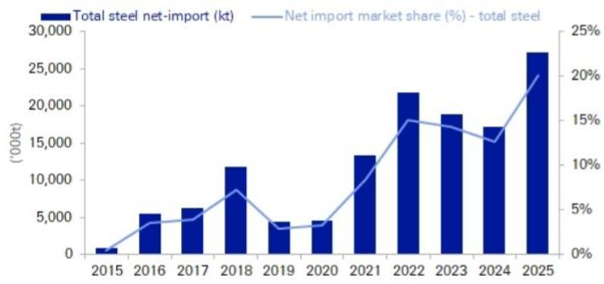

bar_line

| Year | Total steel net-import (kt) | Net import market share (%) - total steel (%) |
|---|---|---|
| 2015 | 800 | 1.5 |
| 2016 | 5500 | 4.5 |
| 2017 | 6000 | 5.5 |
| 2018 | 12000 | 8.5 |
| 2019 | 4000 | 3.5 |
| 2020 | 4500 | 4.0 |
| 2021 | 13500 | 8.5 |
| 2022 | 21500 | 15.5 |
| 2023 | 19000 | 14.5 |
| 2024 | 17000 | 13.5 |
| 2025 | 27000 | 20.5 |

Source : DB, Eurostat

Figure 30: Total steel net imports vs net-import market share (%) – EU27+UK (monthly)   
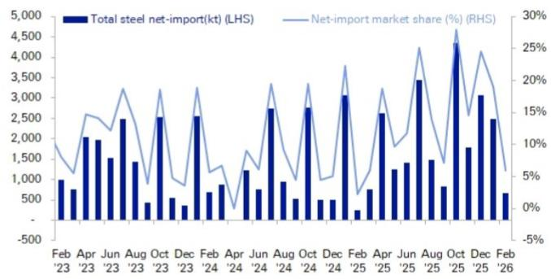

bar_line

| Month | Total steel net-import(kt) (LHS) | Net-import market share (%) (RHS) |
|---|---|---|
| Feb '23 | 1000 | 8 |
| Apr '23 | 1500 | 12 |
| Jun '23 | 2000 | 14 |
| Aug '23 | 2500 | 16 |
| Oct '23 | 500 | 10 |
| Dec '23 | 2500 | 14 |
| Feb '24 | 1000 | 8 |
| Apr '24 | 1200 | 10 |
| Jun '24 | 2700 | 18 |
| Aug '24 | 1000 | 10 |
| Oct '24 | 2700 | 18 |
| Dec '24 | 3000 | 22 |
| Feb '25 | 500 | 5 |
| Apr '25 | 2500 | 16 |
| Jun '25 | 1300 | 10 |
| Aug '25 | 3500 | 24 |
| Oct '25 | 800 | 7 |
| Dec '25 | 3000 | 24 |
| Feb '26 | 500 | 5 |

Source : DB, Eurostat

Figure 31: Total steel net imports vs net-import market share (%) – USA (long term)   
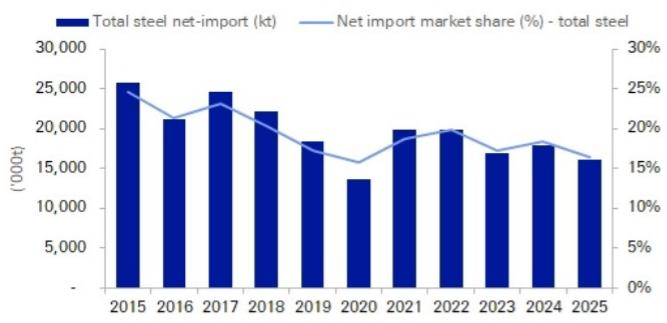

bar_line

| Year | Total steel net-import (kt) | Net import market share (%) - total steel (%) |
|---|---|---|
| 2015 | 25500 | 24.5 |
| 2016 | 20800 | 21.3 |
| 2017 | 24500 | 23.1 |
| 2018 | 22000 | 20.9 |
| 2019 | 18200 | 17.5 |
| 2020 | 13500 | 15.6 |
| 2021 | 19800 | 18.9 |
| 2022 | 19600 | 19.7 |
| 2023 | 16800 | 17.3 |
| 2024 | 17800 | 18.4 |
| 2025 | 15900 | 16.3 |

Source : DB, USITA

Figure 32: Total steel net imports vs net-import market share (%) – USA (monthly)   
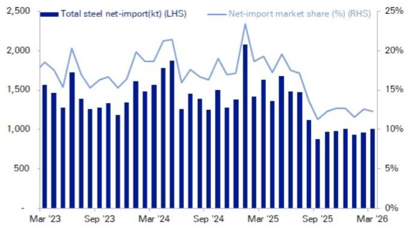

bar_line

| Month    | Total steel net-import(kt) (LHS) | Net-import market share (%) (RHS) |
| -------- | -------------------------------- | --------------------------------- |
| Mar '23  | 1500                             | 18%                               |
| Sep '23  | 1300                             | 15%                               |
| Mar '24  | 1800                             | 22%                               |
| Sep '24  | 1400                             | 17%                               |
| Mar '25  | 2100                             | 24%                               |
| Sep '25  | 900                              | 11%                               |
| Mar '26  | 1000                             | 12%                               |

Source : DB, USITA

Figure 33: China net steel exports (including semi-finished steel)   
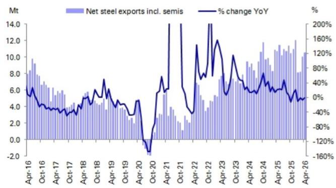

bar_line

| Date    | Net steel exports incl. semis (Mt) | % change YoY |
|---------|-------------------------------------|--------------|
| Apr-16  | 8.0                                 | 0%           |
| Oct-16  | 6.0                                 | -40%         |
| Apr-17  | 5.0                                 | -80%         |
| Oct-17  | 4.0                                 | -120%        |
| Apr-18  | 5.0                                 | -40%         |
| Oct-18  | 6.0                                 | 0%           |
| Apr-19  | 4.0                                 | 40%          |
| Oct-19  | 3.0                                 | 80%          |
| Apr-20  | -2.0                                | -160%        |
| Oct-20  | 0.0                                 | -40%         |
| Apr-21  | 14.0                                | 200%         |
| Oct-21  | 8.0                                 | 0%           |
| Apr-22  | 12.0                                | 160%         |
| Oct-22  | 14.0                                | 120%         |
| Apr-23  | 8.0                                 | 40%          |
| Oct-23  | 6.0                                 | 80%          |
| Apr-24  | 8.0                                 | 120%         |
| Oct-24  | 10.0                                | 160%         |
| Apr-25  | 12.0                                | 120%         |
| Oct-25  | 10.0                                | 40%          |
| Apr-26  | 8.0                                 | 0%           |

Source : DB, Bloomberg Finance LP

Figure 34: China implied steel demand (3mma) and y/y growth (%)   
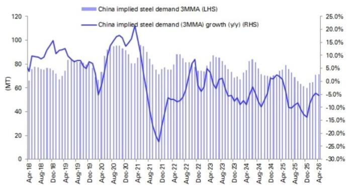

bar_line

| Date    | China implied steel demand 3MMA (LHS) (MT) | China implied steel demand (3MMA) growth (y/y) (%) |
|---------|-------------------------------------------|--------------------------------------------------|
| Apr-18  | ~75                                       | ~5.0                                             |
| Aug-18  | ~80                                       | ~7.5                                             |
| Dec-18  | ~95                                       | ~15.0                                            |
| Apr-19  | ~85                                       | ~10.0                                            |
| Aug-19  | ~80                                       | ~5.0                                             |
| Dec-19  | ~70                                       | ~0.0                                             |
| Apr-20  | ~90                                       | ~15.0                                            |
| Aug-20  | ~105                                      | ~20.0                                            |
| Dec-20  | ~110                                      | ~15.0                                            |
| Apr-21  | ~95                                       | ~-20.0                                           |
| Aug-21  | ~15                                       | ~-25.0                                           |
| Dec-21  | ~50                                       | ~-10.0                                           |
| Apr-22  | ~85                                       | ~5.0                                             |
| Aug-22  | ~80                                       | ~10.0                                            |
| Dec-22  | ~75                                       | ~5.0                                             |
| Apr-23  | ~85                                       | ~10.0                                            |
| Aug-23  | ~80                                       | ~5.0                                             |
| Dec-23  | ~75                                       | ~0.0                                             |
| Apr-24  | ~85                                       | ~5.0                                             |
| Aug-24  | ~75                                       | ~10.0                                            |
| Dec-24  | ~80                                       | ~5.0                                             |
| Apr-25  | ~75                                       | ~0.0                                             |
| Aug-25  | ~65                                       | ~-5.0                                            |
| Dec-25  | ~70                                       | ~-10.0                                           |
| Apr-26  | ~75                                       | ~-5.0                                            |

Source : DB, Bloomberg Finance LP

# Appendix 1

Important Disclosures

\*Other information available upon request

\*Prices are current as of the end of the previous trading session unless otherwise indicated and are sourced from local exchanges via Reuters, Bloomberg and other vendors. Other information is sourced from DB, subject companies, and other sources. For disclosures pertaining to recommendations or estimates made on securities other than the primary subject of this research, please see the most recently published company report or visit our global disclosure look-up page on our website at https://research.db.com/Research/Disclosures/EquityResearchDisclosures. Aside from within this report, important risk and conflict disclosures can also be found at https://research.db.com/Research/Disclosures/Disclaimer. Investors are strongly encouraged to review this information before investing.

# Analyst Certification

The views expressed in this report accurately reflect the personal views of the undersigned lead analyst about the subject issuers and the securities of those issuers. In addition, the undersigned lead analyst has not and will not receive any compensation for providing a specific recommendation or view in this report. Bastian Synagowitz.

Equity rating dispersion and banking relationships   
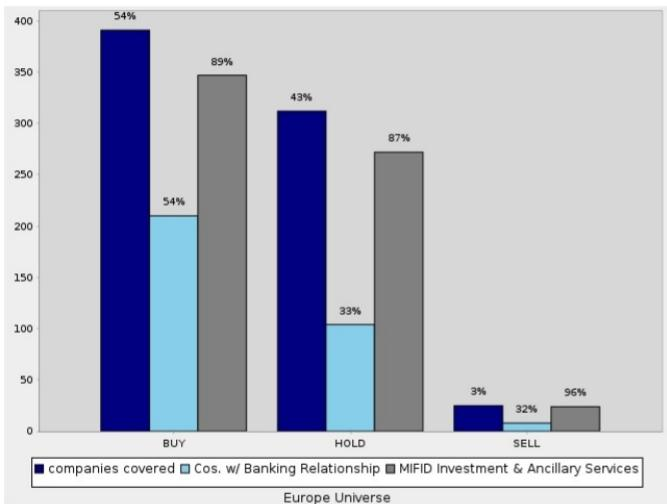

bar

| Category | companies covered (%) | Cos. w/ Banking Relationship (%) | MIFID Investment & Ancillary Services (%) |
| :--- | :--- | :--- | :--- |
| BUY | 54 | 54 | 89 |
| HOLD | 43 | 33 | 87 |
| SELL | 3 | 32 | 96 |
Europe Universe

# Equity Rating and Dispersion Key

The Equity Rating Dispersion Chart depicts the following:

The proportion of recommendations that are rated "buy", "sell" and "hold" over the previous 12 months. This is shown for securities issued in the stated region e.g. "Europe Universe". See rating definitions below. This is represented by the "Companies Covered" bars in the chart. The percentage value displayed above the bar is the proportion as a percentage. E.g. $50\%$ above the "buy" / "Companies Covered" bar means that $50\%$ of DB's equity research covered companies over the past 12 months have a "buy" rating.

Next to each of the three respective bars showing the proportion of "buy", "sell" and "hold" recommendations we provide two additional bars to show:

\- The proportion of "buy", "sell" or "hold recommendations where DB and or/Affiliates provided MIFID Investment or Ancillary Services in the past 12 months. This is represented in the "MIFID Investment and Ancillary Services" bar. The percentage value displayed above the bar shows the proportion of Companies Covered with the given rating where DB has also provided MIFID Investment and Ancillary Services in the past 12 months. E.g. $50\%$ above the "Cos. w/ MIFID Investment and Ancillary Services" bar means $50\%$ of the Companies Covered with the rating stated have also received MIFID Investment and Ancillary Services from DB.

\- The proportion of "buy" (or "sell" or "hold) recommendations where DB and or/Affiliates has provided Investment Banking services in the past 12 months for which it has received compensation. The percentage value displayed above the bar shows the proportion of Companies Covered with the stated rating where DB has also provided Investment Banking services in the past 12 months. E.g. $50\%$ above the "Cos. w/ Investment Banking relationship" bar means $50\%$ of the Companies Covered with the rating stated also have an Investment Banking Relationship with DB.

Buy: Based on a current 12- month view of TSR, we recommend that investors buy the stock.

Sell: Based on a current 12-month view of TSR, we recommend that investors sell the stock.

Hold: We take a neutral view on the stock 12-months out and, based on this time horizon, do not recommend either a Buy or Sell.

TSR = Total Shareholder Return. Percentage change in share price from current price to projected target price plus projected dividend yield

Newly issued research recommendations and target prices supersede previously published research.

# Additional Information

The information and opinions in this report were prepared by DB AG or one of its affiliates (collectively 'DB'). Though the information herein is believed to be reliable and has been obtained from public sources believed to be reliable, DB makes no representation as to its accuracy or completeness. Hyperlinks to third-party websites in this report are provided for reader convenience only. DB neither endorses the content nor is responsible for the accuracy or security controls of those websites.

If you use the services of DB in connection with a purchase or sale of a security that is discussed in this report, or is included or discussed in another communication (oral or written) from a DB analyst, DB may act as principal for its own account or as agent for another person.

DB may consider this report in deciding to trade as principal. It may also engage in transactions, for its own account or with customers, in a manner inconsistent with the views taken in this research report. Others within DB, including strategists, sales staff and other analysts, may take views that are inconsistent with those taken in this research report. DB issues a variety of research products, including fundamental analysis, equity-linked analysis, quantitative analysis and trade ideas. Recommendations contained in one type of communication may differ from recommendations contained in others, whether as a result of differing time horizons, methodologies, perspectives or otherwise. DB and/or its affiliates may also be holding debt or equity securities of the issuers it writes on. Analysts are paid in part based on the profitability of DB AG and its affiliates, which includes investment banking, trading and principal trading revenues.

Opinions, estimates and projections constitute the current judgment of the author as of the date of this report. They do not necessarily reflect the opinions of DB and are subject to change without notice. DB provides liquidity for buyers and sellers of securities issued by the companies it covers. DB analysts sometimes have shorter-term trade ideas that may be inconsistent with DB's existing longer-term ratings. Some trade ideas for equities are listed as Catalyst Calls on the Research Website (https://research.db.com/Research/), and can be found on the general coverage list and also on the covered company's page. A Catalyst Call represents a high-conviction belief by an analyst that a stock will outperform or underperform the market and/or a specified sector over a time frame of no less than two weeks and no more than three months. In addition to Catalyst Calls, analysts may occasionally discuss with our clients, and with DB salespersons and traders, trading strategies or ideas that reference catalysts or events that may have a near-term or medium-term impact on the market price of the securities discussed in this report, which impact may be directionally counter to the analysts' current 12-month view of total return or investment return as described herein. DB has no obligation to update, modify or amend this report or to otherwise notify a recipient thereof if an opinion, forecast or estimate changes or becomes inaccurate. Coverage and the frequency of changes in market conditions and in both general and company-specific economic prospects make it difficult to update research at defined intervals. Updates are at the sole discretion of the coverage analyst or of the Research Department Management, and the majority of reports are published at irregular intervals. This report is provided for informational purposes only and does not take into account the particular investment objectives, financial situations, or needs of individual clients. It is not an offer or a solicitation of an offer to buy or sell any financial instruments or to participate in any particular trading strategy. Target prices are inherently imprecise and a product of the analyst's judgment. The financial instruments discussed in this report may not be suitable for all investors, and investors must make their own informed investment decisions. Prices and availability of financial instruments are subject to change without notice, and investment transactions can lead to losses as a result of price fluctuations and other factors. If a financial instrument is denominated in a currency other than an investor's currency, a change in exchange rates may adversely affect the investment. Past performance is not necessarily indicative of future results. Performance calculations exclude transaction costs, unless otherwise indicated. Unless otherwise indicated, prices are current as of the end of the previous trading session and are sourced from local exchanges via Reuters, Bloomberg and other vendors. Data is also sourced from DB, subject companies, and other parties. Artificial intelligence tools may be used in the preparation of this material, including but not limited to assist in fact-finding, data analysis, pattern recognition, content drafting and editorial corrections pertaining to research material.

The DB Department is independent of other business divisions of the Bank. Details regarding our organizational arrangements and information barriers we have to prevent and avoid conflicts of interest with respect to our research are available on our website (https://research.db.com/Research/) under Disclaimer.

Macroeconomic fluctuations often account for most of the risks associated with exposures to instruments that promise to pay fixed or variable interest rates. For an investor who is long fixed-rate instruments (thus receiving these cash flows), increases in interest rates naturally lift the discount factors applied to the expected cash flows and thus cause a loss. The longer the maturity of a certain cash flow and the higher the move in the discount factor, the higher will be the loss. Upside surprises in inflation, fiscal funding needs, and FX depreciation rates are among the most common adverse macroeconomic shocks to receivers. But counterparty exposure, issuer creditworthiness, client segmentation, regulation (including changes in assets holding limits for different types of investors), changes in tax policies, currency convertibility (which may constrain currency conversion, repatriation of profits and/or liquidation of positions), and settlement issues related to local clearing houses are also important risk factors. The sensitivity of fixed-income instruments to macroeconomic shocks may be mitigated by indexing the contracted cash flows to inflation, to FX depreciation, or to specified interest rates - these are common in emerging markets. The index fixings may - by construction - lag or mis-measure the actual move in the underlying variables they are intended to track. The choice of the proper fixing (or metric) is particularly important in swaps markets, where floating coupon rates (i.e., coupons indexed to a typically short-dated interest rate reference index) are exchanged for fixed coupons. Funding in a currency that differs from the currency in which coupons are denominated carries FX risk. Options on swaps (swaptions) the risks typical to options in addition to the risks related to rates movements.

Derivative transactions involve numerous risks including market, counterparty default and illiquidity risk. The appropriateness of these products for use by investors depends on the investors' own circumstances, including their tax position, their regulatory environment and the nature of their other assets and liabilities; as such, investors should take expert legal and financial advice before entering into any transaction similar to or inspired by the contents of this publication. The risk of loss in futures trading and options, foreign or domestic, can be substantial. As a result of the high degree of leverage obtainable in futures and options trading, losses may be incurred that are greater than the amount of funds initially deposited - up to theoretically unlimited losses. Trading in options involves risk and is not suitable for all investors. Prior to buying or selling an option, investors must review the 'Characteristics and Risks of Standardized Options", at https://www.theocc.com/company-information/documents-and-archives/options-disclosure-document. If you are unable to access the website, please contact your DB representative for a copy of this important document.

Participants in foreign exchange transactions may incur risks arising from several factors, including the following: (i) exchange rates can be volatile and are subject to large fluctuations; (ii) the value of currencies may be affected by numerous market factors, including world and national economic, political and regulatory events, events in equity and debt markets and changes in interest rates; and (iii) currencies may be subject to devaluation or government-imposed exchange controls, which could affect the value of the currency. Investors in securities such as ADRs, whose values are affected by the currency of an underlying security, effectively assume currency risk.

Unless governing law provides otherwise, all transactions should be executed through the DB entity in the investor's home jurisdiction. Aside from within this report, important conflict disclosures can also be found at https://research.db.com/Research/ on each company's research page or under the 'Disclosures' tab. Investors are strongly encouraged to review this information before investing.

DB (which includes DB AG, its branches and affiliated companies) is not acting as a financial adviser, consultant or fiduciary to you or any of your agents (collectively, "You" or "Your") with respect to any information provided in this report. DB does not provide investment, legal, tax or accounting advice, DB is not acting as your impartial adviser, and does not express any opinion or recommendation whatsoever as to any strategies, products or any other information presented in the materials. Information contained herein is being provided solely on the basis that the recipient will make an independent assessment of the merits of any investment decision, and it does not constitute a recommendation of, or express an opinion on, any product or service or any trading strategy.

The information presented is general in nature and is not directed to retirement accounts or any specific person or account type, and is therefore provided to You on the express basis that it is not advice, and You may not rely upon it in making Your decision. The information we provide is being directed only to persons we believe to be financially sophisticated, who are capable of evaluating investment risks independently, both in general and with regard to particular transactions and investment strategies, and who understand that DB has financial interests in the offering of its products and services. If this is not the case, or if You are an IRA or other retail investor receiving this directly from us, we ask that you inform us immediately.

In July 2018, DB revised its rating system for short term ideas whereby the branding has been changed to Catalyst Calls ("CC") from SOLAR ideas; the rating categories for Catalyst Calls originated in the Americas region have been made consistent with the categories used by Analysts globally; and the effective time period for CCs has been reduced from a maximum of 180 days to 90 days.

United States: Approved and/or distributed by DB Securities Incorporated, a member of FINRA and SIPC. Analysts located outside of the United States are employed by non-US affiliates and are not registered/qualified as research analysts with FINRA.

European Economic Area (exc. United Kingdom): Approved and/or distributed by DB AG, a joint stock corporation with limited liability incorporated in the Federal Republic of Germany with its principal office in Frankfurt am Main. DB AG is authorized under German Banking Law and is subject to supervision by the European Central Bank and by BaFin, Germany's Federal Financial Supervisory Authority.

United Kingdom: Approved and/or distributed by DB AG acting through its London Branch at 21 Moorfields, London EC2Y 9DB. DB AG in the United Kingdom is authorised by the Prudential Regulation Authority and is subject to limited regulation by the Prudential Regulation Authority and Financial Conduct Authority. Details about the extent of our authorisation and regulation are available on request.

Hong Kong SAR: Distributed by DB AG, Hong Kong Branch except for any research content relating to futures contracts within the meaning of the Hong Kong Securities and Futures Ordinance Cap. 571. Research reports on such futures contracts are not intended for access by persons who are located, incorporated, constituted or resident in Hong Kong. The author(s) of a research report may not be licensed to carry on regulated activities in Hong Kong and, if not licensed, do not hold themselves out as being able to do so. The provisions set out above in the 'Additional Information' section shall apply to the fullest extent permissible by local laws and regulations, including without limitation the Code of Conduct for Persons Licensed or Registered with the Securities and Futures Commission. This report is intended for distribution only to 'professional investors' as defined in Part 1 of Schedule of the SFO. This document must not be acted or relied on by persons who are not professional investors. Any investment or investment activity to which this document relates is only available to professional investors and will be engaged only with professional investors.

India: Prepared by Deutsche Equities India Private Limited (DEIPL) having CIN: U65990MH2002PTC137431 and registered office at 14th Floor, The Capital, C-70, G Block, Bandra Kurla Complex, Mumbai (India) 400051. Tel: +91 22 7180 4444. It is registered by the Securities and Exchange Board of India (SEBI) as a Stock broker bearing registration no.: INZ000252437; Merchant Banker bearing SEBI Registration no.: INM000010833 and Research Analyst bearing SEBI Registration no.: INH000001741. DEIPL's Compliance / Grievance officer is Ms. Rashmi Poddar (Tel: +91 22 7180 4929 email ID: complaints.deipl@db.com). Registration granted by SEBI and certification from NISM in no way guarantee performance of DEIPL or provide any assurance of returns to investors. Investment in securities market are subject to market risks. Read all the related documents carefully before investing. DEIPL may have received administrative warnings from the SEBI for breaches of Indian regulations. DB and/or its affiliate(s) may have debt holdings or positions in the subject company. With regard to information on associates, please refer to the "Shareholdings" section in the Annual Report at: https://www.db.com/ir/en/annual-reports.htm. For latest India research audit report, refer https://country.db.com/india/deutsche-equities-india/index?language\_id=1.

Japan: Approved and/or distributed by Deutsche Securities Inc.(DSI). Registration number - Registered as a financial instruments dealer by the Head of the Kanto Local Finance Bureau (Kinsho) No. 117. Member of associations: JSDA, Type II Financial Instruments Firms Association and The Financial Futures Association of Japan. Commissions and risks involved in stock transactions - for stock transactions, we charge stock commissions and consumption tax by multiplying the transaction amount by the commission rate agreed with each customer. Stock transactions can lead to losses as a result of share price fluctuations and other factors. Transactions in foreign stocks can lead to additional losses stemming from foreign exchange fluctuations. We may also charge commissions and fees for certain categories of investment advice, products and services. Recommended investment strategies, products and services carry the risk of losses to principal and other losses as a result of changes in market and/or economic trends, and/or fluctuations in market value. Before deciding on the purchase of financial products and/or services, customers should carefully read the relevant disclosures, prospectuses and other documentation. 'Moody's', 'Standard Poor's', and 'Fitch' mentioned in this report are not registered credit rating agencies in Japan unless Japan or 'Nippon' is specifically designated in the name of the entity. Reports on Japanese listed companies not written by analysts of DSI are written by DB Group's analysts with the coverage companies specified by DSI. Some of the foreign securities stated on this report are not disclosed according to the Financial Instruments and Exchange Law of Japan. Target prices set by DB's equity analysts are based on a 12-month forecast period.

Korea: Distributed by Deutsche Securities Korea Co.

South Africa: DB AG Johannesburg is incorporated in the Federal Republic of Germany (Branch Register Number in South Africa: 1998/003298/10).

Singapore: This report is issued by DB AG, Singapore Branch (One Raffles Quay #18-00 South Tower Singapore 048583, 65 6423 8001), which may be contacted in respect of any matters arising from, or in connection with, this report. Where this report is issued or promulgated by DB in Singapore to a person who is not an accredited investor, expert investor or institutional investor (as defined in the applicable Singapore laws and regulations), they accept legal responsibility to such person for its contents.

Taiwan: Information on securities/investments that trade in Taiwan is for your reference only. Readers should independently evaluate investment risks and are solely responsible for their investment decisions. DB may not be distributed to the Taiwan public media or quoted or used by the Taiwan public media without written consent. Information on securities/instruments that do not trade in Taiwan is for informational purposes only and is not to be construed as a recommendation to trade in such securities/instruments.

Qatar: DB AG in the Qatar Financial Centre (registered no. 00032) is regulated by the Qatar Financial Centre Regulatory Authority. DB AG - QFC Branch may undertake only the financial services activities that fall within the scope of its existing QFCRA license. Its principal place of business in the QFC: Qatar Financial Centre, Tower, West Bay, Level 5, PO Box 14928, Doha, Qatar. This information has been distributed by DB AG. Related financial products or services are only available only to Business Customers, as defined by the Qatar Financial Centre Regulatory Authority.

Russia: The information, interpretation and opinions submitted herein are not in the context of, and do not constitute, any appraisal or evaluation activity requiring a license in the Russian Federation.

Kingdom of Saudi Arabia: Deutsche Securities Saudi Arabia (DSSA) is a closed joint stock company authorized by the Capital Market Authority of the Kingdom of Saudi Arabia with a license number (No. 37-07073) to conduct the following business activities: Dealing, Arranging, Advising, and Custody activities. DSSA registered office is Faisaliah Tower, 17th Floor, King Fahad Road - Al Olaya District Riyadh, Kingdom of Saudi Arabia P.O. Box 301806.

United Arab Emirates: DB AG in the Dubai International Financial Centre (registered no. 00045) is regulated by the Dubai Financial Services Authority. DB AG - DIFC Branch may only undertake the financial services activities that fall within the scope of its existing DFSA license. Principal place of business in the DIFC: Dubai International Financial Centre, The Gate Village, Building 5, PO Box 504902, Dubai, U.A.E. This information has been distributed by DB AG. Related financial products or services are available only to Professional Clients, as defined by the Dubai Financial Services Authority.

Australia and New Zealand: This research is intended only for 'wholesale clients' within the meaning of the Australian Corporations Act and New Zealand Financial Advisors Act, respectively. Please refer to Australia-specific research disclosures and related information at https://www.dbresearch.com/PROD/RPS\_EN-PROD/PROD0000000000521304.xhtml. Where research refers to any particular financial product recipients of the research should consider any product disclosure statement, prospectus or other applicable disclosure document before making any decision about whether to acquire the product. In preparing this report, the primary analyst or an individual who assisted in the preparation of this report has likely been in contact with the company that is the subject of this research for confirmation/clarification of data, facts, statements, permission to use company-sourced material in the report, and/or site-visit attendance. Without prior approval from Research Management, analysts may not accept from current or potential Banking clients the costs of travel, accommodations, or other expenses incurred by analysts attending site visits, conferences, social events, and the like. Similarly, without prior approval from Research Management and Anti-Bribery and Corruption ("ABC") team, analysts may not accept perks or other items of value for their personal use from issuers they cover.

Additional information relative to securities, other financial products or issuers discussed in this report is available upon request. This report may not be reproduced, distributed or published without DB's prior written consent.

Backtested, hypothetical or simulated performance results have inherent limitations. Unlike an actual performance record based on trading actual client portfolios, simulated results are achieved by means of the retroactive application of a backtested model itself designed with the benefit of hindsight. Taking into account historical events the backtesting of performance also differs from actual account performance because an actual investment strategy may be adjusted any time, for any reason, including a response to material, economic or market factors. The backtested performance includes hypothetical results that do not reflect the reinvestment of dividends and other earnings or the deduction of advisory fees, brokerage or other commissions, and any other expenses that a client would have paid or actually paid. No representation is made that any trading strategy or account will or is likely to achieve profits or losses similar to those shown. Alternative modeling techniques or assumptions might produce significantly different results and prove to be more appropriate. Past hypothetical backtest results are neither an indicator nor guarantee of future returns. Actual results will vary, perhaps materially, from the analysis.

The method for computing individual E,S,G and composite ESG scores set forth herein is a novel method developed by the Research department within DB AG, computed using a systematic approach without human intervention. Different data providers, market sectors and geographies approach ESG analysis and incorporate the findings in a variety of ways. As such, the ESG scores referred to herein may differ from equivalent ratings developed and implemented by other ESG data providers in the market and may also differ from equivalent ratings developed and implemented by other divisions within the DB Group. Such ESG scores also differ from other ratings and rankings that have historically been applied in research reports published by DB AG. Further, such ESG scores do not represent a formal or official view of DB AG. It should be noted that the decision to incorporate ESG factors into any investment strategy may inhibit the ability to participate in certain investment opportunities that otherwise would be consistent with your investment objective and other principal investment strategies. The returns on a portfolio consisting primarily of sustainable investments may be lower or higher than portfolios where ESG factors, exclusions, or other sustainability issues are not considered, and the investment opportunities available to such portfolios may differ. Companies may not necessarily meet high performance standards on all aspects of ESG or sustainable investing issues; there is also no guarantee that any company will meet expectations in connection with corporate responsibility, sustainability, and/or impact performance.

Copyright © 2026 DB AG

David Folkerts-Landau   
Group Chief Economist and Global Head of Research 

<table><tr><td>Pam Finelli 
Global Chief Operating Officer Research</td><td>Steve Pollard 
Global Head of Company Research and Sales</td><td>Jim Reid 
Global Head of Macro and Thematic Research</td><td>Tim Rokossa 
Head of Germany Research</td></tr><tr><td>Gerry Gallagher 
Head of European 
Company Research</td><td>Matthew Barnard 
Head of Americas 
Company Research</td><td>Peter Milliken 
Head of APAC 
Company Research</td><td>Debbie Jones 
Global Head of Sustainability and Data Innovation, Research</td></tr><tr><td>Sameer Goel 
Global Head of EM &amp; APAC Research</td><td>Francis Yared 
Global Head of Rates Research</td><td>George Saravelos 
Global Head of FX Research</td><td>Peter Hooper 
Vice-Chair of Research</td></tr></table>

International Production Locations 

<table><tr><td>DB AG</td><td>DB AG</td><td>DB AG</td><td>Deutsche Securities Inc.</td></tr><tr><td>DB Place</td><td>Equity Research</td><td>Filiale Hongkong</td><td>1-3-1 Azabudai</td></tr><tr><td>Level 16</td><td>Mainzer Landstrasse 11-17</td><td>International Commerce</td><td>Azabudai Hills Mori JP Tower</td></tr><tr><td>Corner of Hunter &amp; Phillip</td><td>60329 Frankfurt am Main</td><td>Centre,</td><td>Minato-ku, Tokyo 106-0041</td></tr><tr><td>Streets</td><td>Germany</td><td>1 Austin Road West,Kowloon,</td><td>Japan</td></tr><tr><td>Sydney, NSW 2000</td><td>Tel: (49) 69 910 00</td><td>Hong Kong</td><td>Tel: (81) 3 6730 1000</td></tr><tr><td>Australia</td><td></td><td>Tel: (852) 2203 8888</td><td></td></tr><tr><td>Tel: (61) 2 8258 1234</td><td></td><td></td><td></td></tr><tr><td>DB AG</td><td>DB Securities Inc.</td><td>DB AG</td><td></td></tr><tr><td>21 Moorfields</td><td>The DB Center</td><td>Filiale Singapur</td><td></td></tr><tr><td>London EC2Y 9DB</td><td>1 Columbus Circle</td><td>One Raffles Quay, South</td><td></td></tr><tr><td>United Kingdom</td><td>New York, NY 10019</td><td>Tower,</td><td></td></tr><tr><td>Tel: (44) 20 7545 8000</td><td>Tel: (1) 212 250 2500</td><td>Singapore 048583</td><td></td></tr><tr><td></td><td></td><td>Tel: +65 6423 8001</td><td></td></tr></table>