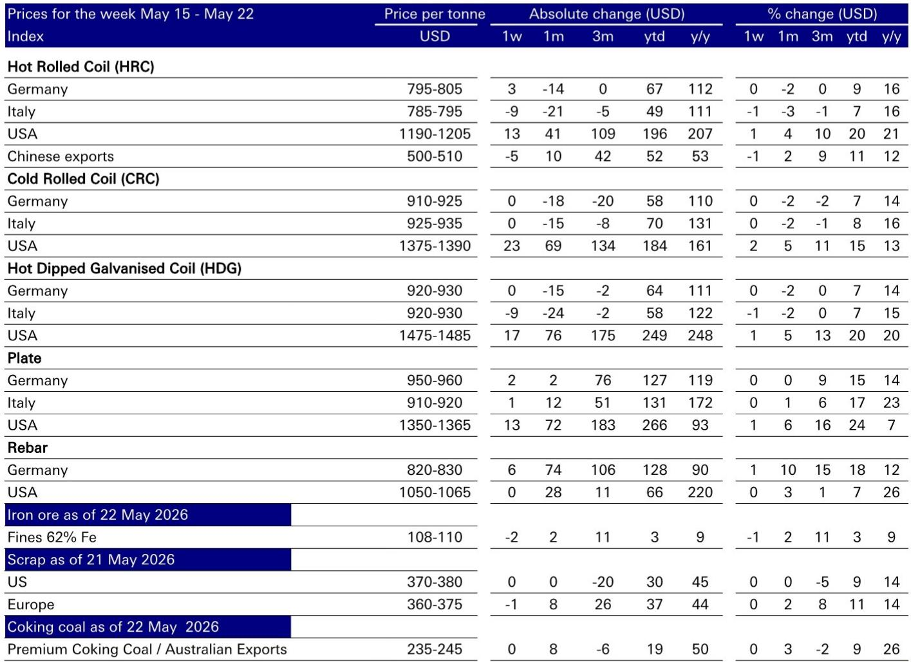

# 全球钢铁市场的真正主线：贸易保护正在重塑定价权，而非需求复苏

过去几周，全球钢铁市场的价格走势呈现出一种让许多投资者困惑的分化。美国热轧卷板价格继续攀升，年初至今已上涨近200美元每吨；欧洲价格虽在近期有所松动，但整体仍维持在远高于历史中周期的水平。与此同时，中国出口价格却在走软，铁矿石价格也在回落。

这一组合——西方价格坚挺、东方价格走弱、原材料成本下行——指向了一个比单纯的需求故事更复杂的结构性变化。某外资投行最新发布的钢铁价差追踪报告提供了一个关键判断：当前支撑西方钢铁企业利润率的，不是终端需求的强劲反弹，而是贸易政策正在重塑全球钢铁的定价体系。这一体系的重构，可能比任何短期的需求波动都更值得投资者认真审视。

**报告的核心主张是：西方钢铁企业的利润率正在经历一次由政策驱动的结构性抬升，而市场对这一变化的定价仍不够充分。** 这个判断之所以重要，是因为它挑战了一个常见的直觉——如果需求疲软，价格和利润就应该回落。但报告的数据显示，在需求仍然存在不确定性的背景下，欧洲和美国的价格和价差却表现出了超预期的韧性。这意味着，传统的“需求决定价格”框架，可能正在让位于“政策决定价格”的新范式。

以下，我们将从这份报告的数据和判断出发，层层拆解这一主线如何展开，以及它对不同市场、不同公司意味着什么。

## 1. 贸易保护的加码正在将西方市场与全球低成本的供应隔离开来

报告中反复出现的一个关键词是“贸易政策”。欧洲近期宣布了更为激进的贸易保护措施，而美国则维持着232条款关税。这些政策的核心作用，不是简单地抬高进口成本，而是从根本上改变了西方市场的竞争结构。

一个直观的数据点可以说明问题：美国热轧卷板当前价格在1190-1205美元每吨的区间，而中国出口价格仅为500-510美元每吨。即便考虑到运输成本和50%的232关税，中国资源进入美国的“平价价格”也在910-930美元每吨——仍然明显低于美国国内价格。这意味着，贸易壁垒已经成功地将美国市场与全球最低成本的供应割裂开来。美国钢铁企业面对的，不再是全球的过剩产能，而是被政策限定在一个相对封闭的高价市场内。

欧洲的情况虽然不如美国极端，但方向一致。报告提到，欧洲的BOF（高炉转炉）价差——即德国热轧卷板价格与关键原材料成本之间的差额——已升至231美元每吨，显著高于中周期水平。这个溢价，很大程度上来自于贸易保护对进口资源的限制，以及CBAM（碳边境调节机制）即将带来的额外成本。

**这里的含义是：对于投资于西方钢铁资产的投资者来说，评估企业价值的关键变量，已经从“全球钢铁价格”转变为“政策保护的可持续性”。** 如果贸易保护政策能够维持甚至加强，那么西方钢铁企业的利润中枢将永久性地高于历史平均水平。反之，如果政策出现松动，这些溢价将面临快速的回吐风险。

## 2. 欧洲价差的韧性证明：成本端的压力正在向价格端有效传导，但需求侧的风险并未消除

报告显示，尽管近期欧洲南部价格有所回落，但德国北部热轧卷板价格仍然稳定在680-695欧元每吨的区间，且BOF价差环比还在扩大。更值得关注的是，报告区分了“平均生产商”和“边际生产商”的价差情况。

对于平均生产商而言，当前的价差已经明显高于中周期水平。但对于边际生产商——那些成本更高、且需要承担全部二氧化碳成本的企业——它们的价差仍处于中周期水平。这意味着，当前的价格水平并不是由需求驱动的全面繁荣，而是由成本结构的分化所支撑。高成本产能的存在，为价格提供了一个天然的底部支撑。

但报告也坦诚地指出了需求侧的风险。中东局势的持续动荡已经开始影响市场情绪，而需求的下滑仍然是近期最令人担忧的因素。如果终端需求出现实质性萎缩，那么即使有贸易保护，价格也难以独善其身。届时，边际生产商将率先面临亏损，而平均生产商的高价差也将不可持续。

**这引出了一个重要的观察框架：欧洲钢铁企业的利润韧性，取决于两个条件的同步成立——贸易保护持续有效，以及需求不至于大幅萎缩。** 目前来看，第一个条件是成立的，但第二个条件仍然是一个未知数。投资者需要密切关注欧洲制造业的采购经理人指数（PMI）和下游订单数据，来判断需求侧的风险是否在累积。

## 3. 美国市场的利润结构已经与全球周期脱钩，其定价逻辑需要重新理解

美国钢铁市场是这份报告中数据最为突出的部分。美国热轧卷板价格年初至今上涨了20%，冷轧卷板上涨了15%，中厚板更是上涨了24%。这些涨幅远远超过了欧洲和中国市场。

更关键的是价差数据。美国BOF价差（热轧卷板价格与原材料成本之差）已高达638美元每吨，环比还在增加。EAF（电弧炉）价差（热轧卷板价格与废钢成本之差）也达到了616美元每吨。这些数字意味着什么？它们意味着美国钢铁企业的单位利润，已经达到了全球其他地区难以企及的水平。

这种利润水平的支撑，并非来自美国国内需求的特别强劲，而是来自于一个精心设计的政策组合。232关税限制了进口量，而国内生产商在定价上表现出的“纪律性”——即不通过降价来争夺市场份额——进一步巩固了价格。报告提到“市场情绪依然强劲，交货期坚实，国内定价纪律良好”，这实际上描述了一个寡头垄断市场的典型特征。

**对于投资者而言，这意味着美国钢铁股的价值评估，不能简单套用全球周期的框架。** 美国钢铁企业的利润，更多反映的是政策红利和市场竞争格局，而非全球供需平衡。因此，评估美国钢铁股的关键，在于判断这种政策红利还能持续多久，以及国内生产商的定价纪律是否会因新产能的投放而瓦解。报告没有完全展开的是，美国正在有新的电弧炉产能投产，这些新增产能是否会打破现有的定价平衡，仍是一个需要持续跟踪的问题。

## 4. 中国出口价格的走弱，正在为西方市场提供“压力测试”的参照系

报告显示，中国热轧卷板出口价格已降至500-510美元每吨，环比下跌了5美元。与此同时，中国国内热轧卷板价格也在下行，而螺纹钢价格则略有上涨。这种分化本身并不令人意外，但它提供了一个重要的参照系。

中国作为全球最大的钢铁生产国和出口国，其出口价格是全球钢铁市场的“基准线”。当中国出口价格走弱时，通常意味着中国国内需求不足，过剩产能正在向国际市场输出。如果西方市场没有贸易保护，那么中国的低价资源将迅速拉平全球价格。但报告的数据显示，这种情况并未发生。

**这意味着，中国出口价格的走弱，实际上是在测试西方贸易保护政策的有效性。** 如果西方价格能够在中国出口价格下跌的过程中保持稳定甚至上涨，那就证明了贸易保护确实起到了隔离作用。反之，如果西方价格开始跟随中国出口价格下行，那就说明保护政策的力度仍然不够，或者国内需求的下滑已经超过了政策的支撑作用。

目前来看，测试结果是积极的。但报告没有深入讨论的是，这种“隔离”能持续多久。如果中国出口价格进一步下跌至400美元每吨甚至更低，那么即使有232关税，美国国内价格是否还能维持在1100美元以上？这是一个没有在报告中完全回答的问题，但却是所有投资者都应该思考的情景。

## 5. 报告尚未完全回答的关键问题：政策红利的可持续性取决于一个尚未验证的假设

尽管这份报告提供了大量有价值的数据和判断，但它对于政策红利可持续性的论证，仍然建立在一个尚未完全验证的假设之上。这个假设是：西方国家的贸易保护政策，能够在不引发报复性措施或国内通胀压力的前提下，长期维持。

这个假设面临几个现实的挑战。首先，贸易保护政策本身可能成为政治博弈的筹码。如果美国通胀重新抬头，那么维持高钢价是否还会得到政策支持？其次，欧洲的CBAM虽然提高了进口成本，但也增加了国内生产商的合规负担，其净效果是否一定有利于利润率的提升，仍有待观察。最后，全球贸易摩擦的升级，本身就会对终端需求产生抑制作用，从而形成一种自我实现的循环。

报告提到了“中东局势对市场情绪和需求的负面影响”，但并未将其与政策可持续性联系起来。一个合理的推测是：如果地缘政治风险导致全球经济显著放缓，那么各国政府可能会重新评估贸易保护的成本与收益，甚至可能通过降低关税来刺激经济。届时，当前的高价差将面临急剧收缩的风险。

**对于投资者来说，这意味着当前的高利润水平并非无风险。** 最需要关注的风险点，不是钢铁价格本身，而是政策制定者的决策逻辑是否会发生转变。这是一个比供需分析更复杂、也更难预测的变量。

## 6. 一个实用的观察框架：从“价格追踪”转向“政策与成本结构追踪”

基于以上分析，我们认为，传统的钢铁投资框架需要做出调整。过去，投资者关注的是全球钢铁价格、产能利用率、以及下游需求的领先指标。但在当前环境下，这些指标的有效性正在下降。

一个更有效的观察框架，应该包括以下几个维度：

第一，贸易政策的动态。这不是一个“有或无”的问题，而是一个“强度”的问题。需要关注的是：关税税率是否调整、配额是否收紧、反倾销调查是否启动、以及CBAM的实施时间表是否提前。这些政策变量，直接决定了西方市场与全球市场的隔离程度。

第二，国内生产商的成本结构。报告的数据显示，平均生产商和边际生产商的价差差异巨大。这意味着，即使在同一市场内，不同企业的利润韧性也截然不同。投资者需要区分哪些企业拥有成本优势，哪些企业处于成本曲线的尾部。在政策红利退潮时，成本领先的企业将具有更强的生存能力。

第三，下游行业的承受能力。高钢价最终会传导到汽车、建筑、机械等下游行业。如果下游行业开始出现普遍的利润压缩和需求下滑，那么政策制定者可能会面临来自产业界的压力。观察下游行业的利润率变化，是判断政策可持续性的一个间接但有效的指标。

第四，中国出口价格的变化趋势。正如前文所述，中国出口价格是全球钢铁市场的“基准线”。持续跟踪这一价格，可以评估西方贸易保护政策的“隔离效果”。如果中国出口价格与西方价格的差距持续扩大，那说明隔离效果在增强；如果差距开始收窄，那说明隔离效果在减弱。

**这个框架的核心在于，它不再假设“钢铁价格回归均值”，而是将价格视为政策与成本结构共同作用的结果。** 这意味着，投资者需要投入更多精力去理解政策逻辑和成本曲线，而不是仅仅依赖价格图表。

---

以上分析基于某外资投行最新发布的钢铁价差追踪报告。报告本身提供了丰富的价格、成本和价差数据，以及对于欧洲和美国钢铁企业的具体投资建议。但正如我们在这篇文章中所讨论的，报告的核心价值不在于其短期价格预测，而在于它揭示了一个正在发生的结构性变化——贸易政策正在重塑全球钢铁的定价权。

然而，这个结构性变化的可持续性，仍然取决于多个尚未验证的假设。例如，政策红利的长期维持需要政治和经济条件的配合；中国出口价格的进一步走弱可能对西方价格形成新的压力；而新产能的投放也可能打破现有的定价纪律。这些关键问题，报告并没有给出确定的答案，但它们恰恰是投资者最需要深入讨论的部分。

如果你对这些未解问题感兴趣，欢迎来我们的星球微信群里继续讨论。我们会在群里分享完整报告的原始图表和更多数据细节，并围绕政策可持续性、成本曲线变化、以及具体公司的估值逻辑展开更深入的交流。

Personal reading notes and learning share only. Not investment advice.

