# US Tariff Impact Tracker: Import Outlook Remains Positive to End May Lapping Liberation Day

US Tariff Impact Tracker: This past week, laden vessels from China to USA were down sequentially (-3% WoW) and accelerated on a YoY basis (+23% YoY). Data suggests TEUs coming into Port of LA will turn positive next week (+14% WoW) following this past week's -15% sequential, before seeing an increase of +3% WoW two weeks out (YoY is expected to be +6% and +63% one week and two weeks out). What we will need to monitor is how levels move through May and June, which could suggest how shippers are deciding to restock with in some cases lower effective tariff rates amidst an uncertain geopolitical backdrop—so far, there appears to be strong restocking in addition to lapping Liberation Day, given the double-digit YoY import trajectory.

Trade uncertainty remains prevalent in global trade, especially following the recent Supreme Court ruling and the subsequent announcement from the administration for new tariffs under Sec. 122 (see our macro team's assessment). We believe that the uncertainty may have two near- to medium-term impacts on global freight. First, given that trade uncertainty has risen and the administration has not disclosed how it will proceed after the Sec. 122 tariffs expire in 150 days, this may impact medium- to longer-term freight planning. Second, a more near-term impact will be countries that now have a lower effective tariff rate may pick up exports into the U.S. We note that this may take time to show up in the data, particularly for freight out of mainland China as manufacturing and shipping pick back up following a later than usual LNY.

We do note that the ongoing geopolitical conflicts could impact ocean and air rates higher, but we need to disassociate the driver of rate increases from capacity constraints and surcharges versus import demand and the impact of tariffs. Impacts on ocean trade could be limited given the low-single-digit capacity in the Gulf; however, we do note there could be a rise on rates globally and Asia to U.S. in part as ocean carriers try to pass on fuel costs, specifically bunker fuel costs. The larger impact to keep in mind is how higher energy costs could impact overall global demand for freight and in particular for the American consumer, with greater impact depending on the duration of the conflict.

Jordan Alliger

+1(212)357-4913

jordan.alliger@gs.com

GS & Co. LLC

Paul Stoddard

+1(801)744-3761

paul.x.stoddard@gs.com

GS & Co. LLC

Andrzej Tomczyk, CFA

+1(212)357-4445

andrzej.tomczyk@gs.com

GS & Co. LLC

Key observations from this past week's report:

China freight flows (week ending Thursday, May 21st) showed a sequential decline in laden vessels from China to the US (-3%) with a positive YoY at +23% (vs +11% in the prior week).   
■ Port Optimizer sequentials indicate imports into the Port of Los Angeles are set to be up +14% TEUs (May 29) while the early read suggests an increase of +3% on a two-week out basis; on a YoY basis, imports into LA are set to remain strongly positive to 6% and 63%—likely from easy Liberation Day comps.   
Rail intermodal volumes along the West Coast were +9% YoY following last week's +4% performance.   
Ocean container rates were up +13% sequentially after declining -0.5% last week; rates on a YoY basis were +14% YoY this past week. We anticipate some choppiness could emerge over the coming weeks as global capacity shifts given ongoing geopolitical events; however, according to our European counterpart (see note), the current crisis is not likely to be a positive for container shipping rates—the Strait of Hormuz is not a material artery for liner networks and therefore unlikely to impact the supply side in the way the Red Sea crisis had—however, it is important to note that fuel is likely to drive prices higher.   
- Load availability for trucks on the West Coast increased last week sequentially (+25%) and was positive on a YoY basis (+41%); truck spot rates on the West Coast were up +30% YoY ex-fuel.

# What the Tracker Is:

What We Disseminate Weekly: High frequency data to help assess the ongoing impact of tariffs on global supply chains and the accompanying ramifications on the flows of freight (e.g., expected ships leaving from China to USA). While we think our data set is representative, we do plan to periodically add new data series as they become available.

It is important to recognize that weekly data can be volatile, with a fair bit of noise depending on timing—but we still think looking at the data collectively, and perhaps over a multi-week basis can be informative as to tariff-related trends.

# 2026 Trade and Transport Scenario Roadmap — Revised From First and Second Edition:

As we moved past the 2025 homestretch and into 2026, the ability to find a profit and earnings bottom and eventually see an earnings upgrade cycle comes down to one thing: volume growth, with an appropriate weighting towards higher margin business-to-business, commercial and/or manufacturing flows. Recent improved share price performance from the trucking sector could perhaps be tied to the notion that volumes (and in terms of truckload - supply) could indeed be at a more stable point with which improvement could come from at some point in 2026.

Ramifications from tariff-related uncertainty that caused pull-forward in demand—bracketed by shipper indecision as to how much product to manufacture and/or order for inventory—had been a culprit behind transports broad

# underperformance for much of 2025 and tied directly into our view that we may see subseasonal peak season shipping demand (for 4Q reporting).

That said, we remain positive on the cycle recovery story—despite the heretofore elusive bottom, and we note several factors that could finally stimulate a favorable and fulsome volume inflection into 2026 as we look to the medium to longer term.

Fed rate cut cycles are typically beneficial to transport shares (see Fed Rate Cuts and Transports); GS economists continue to predict 2 more rate cuts in 2026 to add to the three cuts in 2025.   
While tariff uncertainty still exists, we will lap Liberation Day on April 2, 2026—potentially yielding a more consistent playbook for shippers to work with and to plan.   
■ Various corporations are announcing increased investments in US manufacturing—including companies like Apple, Nvidia, IBM, Pfizer, Johnson & Johnson, etc.—which should auger-in more domestic freight flows.   
The bonus depreciation revival via the One Big Beautiful Bill Act could incentivize capital to reinvest in businesses.   
While tariff deployment is disruptive, any resulting re-shoring or nearshoring would bolster US manufacturing, which also should auger-in more domestic freight flows.   
■ Shifting logistics patterns and changing supply chain sourcing could drive secular global trade opportunity as companies potentially pursue a China Plus 1 or 2 strategy.

# What to do with Transport stocks:

For the time being we note that the volatile nature and potential air pocket in 2H25 will likely impact all transports as we end 2025 if consumer demand does not lift shipments post pull-forward. We did however upgrade the truckers (see our upgrade note), as we think the likelihood of recession has lessened, and the consumer can stay relatively resilient (GS economists lowered their recession forecast to $30\%$ earlier this summer and their GDP outlook in the 4Q26 is $+2.2\%$ YoY). While freight forwarders such as EXPD and CHRW could benefit from the volatility and surge in customs brokerage demand, we do note that YoY comparisons for ocean rates will be challenging, as we have seen ocean container rates turn sharply negative on a YoY basis. Should the Red Sea re-open, that could further add to effective capacity.

■ Other beneficiaries could be the parcels (UPS and FDX—both Buy rated) with their fast cycle logistics and air freight as well as large global footprints that can help shippers shift supply chains.

# High Frequency Weekly Data

We track weekly (and some daily) data that helps provide as real time as possible insights into trade volumes, demand and pricing. We note that much of this data is choppy in the near term and more than often shows trends developing over time as we receive more data, but also speaks to the volatility of trade flows. Therefore, we caution against drawing conclusions week to week but note that it can be helpful to see changes in the data week to week given the dynamic trade environment. Below, we track the high frequency data points that we believe are highly relevant to trade and US freight transportation.

Laden container vessels from China to the US were $+23\%$ YoY over the last week (5/15-5/21) versus $+11\%$ YoY in the prior week (5/8-5/14). The sequential vessel decrease of $-3\%$ in the most recent week follows last week's decrease of $-9\%$ .

Exhibit 1: Container ships to the US remain volatile; levels are still down from post-Liberation day increases   
Daily Laden Container Ship Vessels from China to US   
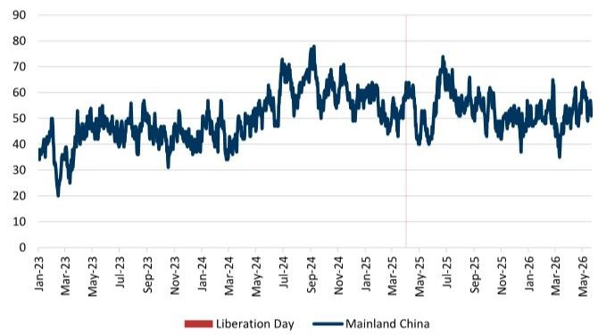

line

| Date    | Mainland China |
|---------|----------------|
| Jan-23  | 35             |
| Mar-23  | 20             |
| May-23  | 45             |
| Jul-23  | 50             |
| Sep-23  | 40             |
| Nov-23  | 35             |
| Jan-24  | 40             |
| Mar-24  | 50             |
| May-24  | 60             |
| Jul-24  | 70             |
| Sep-24  | 80             |
| Nov-24  | 70             |
| Jan-25  | 60             |
| Mar-25  | 65             |
| May-25  | 50             |
| Jul-25  | 75             |
| Sep-25  | 60             |
| Nov-25  | 50             |
| Jan-26  | 40             |
| Mar-26  | 65             |
| May-26  | 55             |

Data through 5/21/26 Captures the number of laden (i.e., cargo-carrying) container ships departing China en route to the US over a rolling 15-day window. Includes only vessels confirmed to be transporting cargo. Laden vessels are those reporting a draft of more than $75\%$ of maximum draft at the start of their journey to the US. Note that data is subject to revisions.

Exhibit 2: Laden container ships from China to US have improved on a YoY basis in the most recent week   
Daily Laden Container Ship Vessels from China to US, YoY   
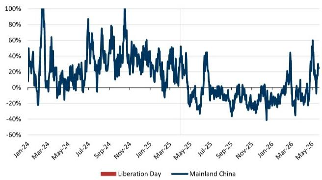

line

| Date    | Mainland China |
|---------|----------------|
| Jan-24  | ~50%           |
| Mar-24  | ~100%          |
| May-24  | ~30%           |
| Jul-24  | ~80%           |
| Sep-24  | ~70%           |
| Nov-24  | ~100%          |
| Jan-25  | ~60%           |
| Mar-25  | ~50%           |
| May-25  | ~40%           |
| Jul-25  | ~40%           |
| Sep-25  | ~-30%          |
| Nov-25  | ~-40%          |
| Jan-26  | ~-30%          |
| Mar-26  | ~40%           |
| May-26  | ~60%           |

Data through 5/21/26 captures the number of laden (i.e., cargo-carrying) container ships departing China en route to the US over a rolling 15-day window. Includes only vessels confirmed to be transporting cargo. Laden vessels are those reporting a draft of more than $75\%$ of maximum draft at the start of their journey to the US. Note that data is subject to revisions.   
Source: Bloomberg   
Source: Bloomberg

TEUs from China to the US were $+26.5\%$ YoY over the past week (5/15-5/21) versus $+4\%$ in the prior week (5/8-5/14). Sequentially, we saw a $+4\%$ change in TEUs from Mainland China.

Exhibit 3: TEUs have remained volatile Daily TEU from China to the US   
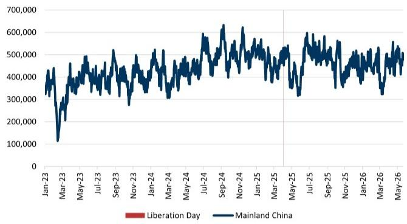

line

| Date    | Mainland China |
|---------|----------------|
| Jan-23  | ~400,000       |
| Mar-23  | ~120,000       |
| May-23  | ~450,000       |
| Jul-23  | ~480,000       |
| Sep-23  | ~520,000       |
| Nov-23  | ~450,000       |
| Jan-24  | ~500,000       |
| Mar-24  | ~480,000       |
| May-24  | ~520,000       |
| Jul-24  | ~580,000       |
| Sep-24  | ~620,000       |
| Nov-24  | ~580,000       |
| Jan-25  | ~550,000       |
| Mar-25  | ~520,000       |
| May-25  | ~580,000       |
| Jul-25  | ~600,000       |
| Sep-25  | ~580,000       |
| Nov-25  | ~550,000       |
| Jan-26  | ~520,000       |
| Mar-26  | ~580,000       |
| May-26  | ~550,000       |

Data as of 5/21/2026. Represents the aggregated container volume, measured in twenty-foot equivalent units (TEU), of vessels departing China for the United States over a 15-day rolling period. Accounts for the shipping capacity being utilized, irrespective of the number of vessels. Dry cargo vessels leaving China are monitored as they exit Chinese waters. The dataset is filtered for vessels that have left over the 15 previous days and have reported the US as their country of destination. Note that data is subject to revisions.

Source: Bloomberg

Exhibit 4: TEU growth was up in the most recent week Daily TEU from China to the US, YoY   
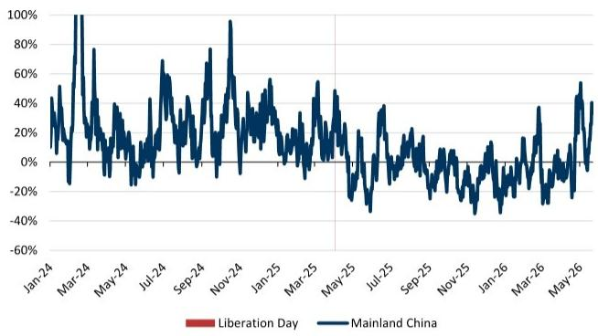

line

| Date    | Mainland China |
|---------|----------------|
| Jan-24  | ~40%           |
| Mar-24  | ~100%          |
| May-24  | ~30%           |
| Jul-24  | ~70%           |
| Sep-24  | ~80%           |
| Nov-24  | ~95%           |
| Jan-25  | ~50%           |
| Mar-25  | ~50%           |
| May-25  | ~-30%          |
| Jul-25  | ~30%           |
| Sep-25  | ~10%           |
| Nov-25  | ~-40%          |
| Jan-26  | ~-30%          |
| Mar-26  | ~30%           |
| May-26  | ~50%           |

Data as of 5/21/2026. Represents the aggregated container volume, measured in twenty-foot equivalent units (TEU), of vessels departing China for the United States over a 15-day rolling period. Accounts for the shipping capacity being utilized, irrespective of the number of vessels. Dry cargo vessels leaving China are monitored as they exit Chinese waters. The dataset is filtered for vessels that have left over the 15 previous days and have reported the US as their country of destination. Note that data is subject to revisions.

Source: Bloomberg

Exhibit 5: Week 20 China to US vessels were down while TEUs were up WoW Weekly Average TEUs and Vessels from China to US 

<table><tr><td colspan="8">Bloomberg China to US 6 Week Dashboard Weekly Average TEUs &amp; Vessels</td></tr><tr><td>Week</td><td>14</td><td>15</td><td>16</td><td>17</td><td>18</td><td>19</td><td>20</td></tr><tr><td>2026 Vessels</td><td>51</td><td>57</td><td>49</td><td>56</td><td>61</td><td>55</td><td>54</td></tr><tr><td>WoW</td><td></td><td>12.0%</td><td>-13.9%</td><td>12.4%</td><td>9.0%</td><td>-8.7%</td><td>-3.1%</td></tr><tr><td>2025 Vessels</td><td>60</td><td>60</td><td>55</td><td>42</td><td>46</td><td>50</td><td>44</td></tr><tr><td>2025 WoW</td><td></td><td>-0.9%</td><td>-8.6%</td><td>-23.6%</td><td>10.6%</td><td>8.0%</td><td>-12.6%</td></tr><tr><td>2026 YoY</td><td>-14.9%</td><td>-3.8%</td><td>-9.4%</td><td>33.2%</td><td>31.3%</td><td>10.9%</td><td>23.0%</td></tr><tr><td>2026 TEUs</td><td>461,271</td><td>504,128</td><td>437,736</td><td>504,355</td><td>514,918</td><td>457,469</td><td>473,908</td></tr><tr><td>WoW</td><td></td><td>9.3%</td><td>-13.2%</td><td>15.2%</td><td>2.1%</td><td>-11.2%</td><td>3.6%</td></tr><tr><td>2025 TEUs</td><td>495,552</td><td>500,552</td><td>479,555</td><td>366,182</td><td>384,265</td><td>440,938</td><td>374,691</td></tr><tr><td>2025 WoW</td><td></td><td>1.0%</td><td>-4.2%</td><td>-23.6%</td><td>4.9%</td><td>14.7%</td><td>-15.0%</td></tr><tr><td>2026 YoY</td><td>-6.9%</td><td>0.7%</td><td>-8.7%</td><td>37.7%</td><td>34.0%</td><td>3.7%</td><td>26.5%</td></tr></table>

Week 20 5/15/2026-5/21/2026; Note that data is subject to revisions.   
Source: Bloomberg

Mainland China's laden vessel and TEU growth vs. Asia Ex-Mainland China to US: On a laden vessel basis, Mainland China was up $+21\%$ YoY on average while Asia-Ex Mainland China was flat. On a TEU basis, Mainland China was up $+23\%$ YoY on average while Asia-Ex Mainland was up $6\%$ on average. We use the summation of Mainland China, Vietnam, South Korea, Taiwan and Japan as a proxy for Asia exports to the US.

# Exhibit 6: Mainland China and Asia-Ex Mainland: vessels were up YoY for Mainland China v. Asia Ex Mainland China up YoY

Daily Laden Container Ship Vessels from Asia ex-Mainland China and Mainland China to US, YoY

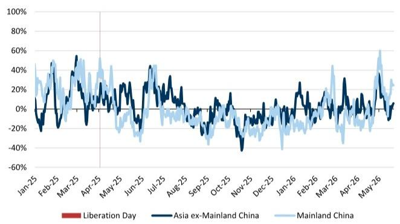

line

| Month    | Liberation Day | Asia ex-Mainland China | Mainland China |
| -------- | -------------- | --------------------- | -------------- |
| Jan-25   | ~40%           | ~30%                  | ~20%           |
| Feb-25   | ~-20%          | ~-10%                 | ~-5%           |
| Mar-25   | ~50%           | ~40%                  | ~30%           |
| Apr-25   | ~-10%          | ~-5%                  | ~-2%           |
| May-25   | ~-30%          | ~-20%                 | ~-10%          |
| Jun-25   | ~-10%          | ~-5%                  | ~-2%           |
| Jul-25   | ~40%           | ~30%                  | ~20%           |
| Aug-25   | ~-10%          | ~-5%                  | ~-2%           |
| Sep-25   | ~-30%          | ~-20%                 | ~-10%          |
| Oct-25   | ~-10%          | ~-5%                  | ~-2%           |
| Nov-25   | ~-40%          | ~-30%                 | ~-10%          |
| Dec-25   | ~-10%          | ~-5%                  | ~-2%           |
| Jan-26   | ~-30%          | ~-20%                 | ~-10%          |
| Feb-26   | ~-10%          | ~-5%                  | ~-2%           |
| Mar-26   | ~40%           | ~30%                  | ~20%           |
| Apr-26   | ~-10%          | ~-5%                  | ~-2%           |
| May-26   | ~30%           | ~20%                  | ~10%           |

Asia ex-Mainland China includes Vietnam, South Korea, Taiwan, and Japan Data as of 5/21/2026

Source: Bloomberg

# Exhibit 7: TEU growth from Mainland China was up vs Asia-Ex Mainland China was down this past week

Daily TEU from Asia ex-Mainland China and Mainland China to US, YoY

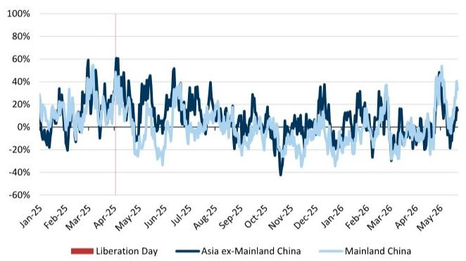

line

| Month    | Asia ex-Mainland China | Mainland China |
|----------|------------------------|----------------|
| Jan-25   | ~0%                    | ~20%           |
| Feb-25   | ~-20%                  | ~30%           |
| Mar-25   | ~60%                   | ~40%           |
| Apr-25   | ~60%                   | ~50%           |
| May-25   | ~40%                   | ~30%           |
| Jun-25   | ~50%                   | ~40%           |
| Jul-25   | ~30%                   | ~20%           |
| Aug-25   | ~40%                   | ~30%           |
| Sep-25   | ~20%                   | ~10%           |
| Oct-25   | ~-40%                  | ~-20%          |
| Nov-25   | ~-60%                  | ~-40%          |
| Dec-25   | ~30%                   | ~20%           |
| Jan-26   | ~10%                   | ~-10%          |
| Feb-26   | ~30%                   | ~20%           |
| Mar-26   | ~40%                   | ~30%           |
| Apr-26   | ~20%                   | ~10%           |
| May-26   | ~50%                   | ~40%           |

Asia ex-Mainland China includes Vietnam, South Korea, Taiwan and Japan Data as of 5/21/2026

Source: Bloomberg

Chinese major port weekly throughput was -1% w/w during the week ended 5/17 (latest available) after being -4% w/w the prior week. Throughput was +4% YoY vs +7% in the prior week.

# Exhibit 8: Chinese port activity was down -1% sequentially in the most recent week and up 4% YoY

Chinese major port weekly container throughput

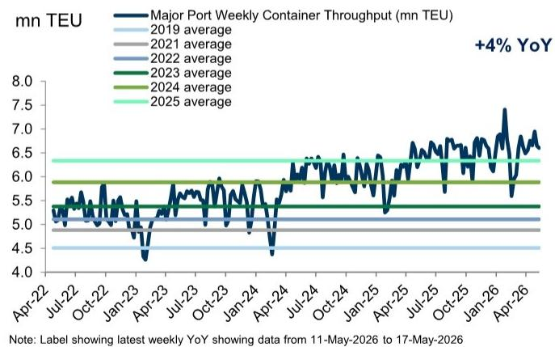

line

| Date     | Major Port Weekly Container Throughput (mn TEU) |
|----------|-----------------------------------------------|
| Apr-22   | ~5.3                                          |
| Jul-22   | ~5.4                                          |
| Oct-22   | ~5.5                                          |
| Jan-23   | ~4.8                                          |
| Apr-23   | ~5.0                                          |
| Jul-23   | ~5.6                                          |
| Oct-23   | ~5.8                                          |
| Jan-24   | ~5.0                                          |
| Apr-24   | ~4.5                                          |
| Jul-24   | ~6.0                                          |
| Oct-24   | ~6.2                                          |
| Jan-25   | ~5.8                                          |
| Apr-25   | ~6.0                                          |
| Jul-25   | ~6.5                                          |
| Oct-25   | ~6.8                                          |
| Jan-26   | ~7.0                                          |
| Apr-26   | ~6.8                                          |

Weekly through 5/17/2026. Data compiled by our Asia Analysts, Herbert Lu, Simon Cheung and Dorothy Wong

Source: Ministry of Transport

Ocean container rates from China/East Asia to the US West Coast were up $+13\%$ W/W and $+14\%$ YoY in the most recent week - the last month's growth represents the first positive YoY growth period since last June, partly reflecting easier comps and sequential uplifts. We anticipate some volatility over the coming weeks as global capacity shifts given ongoing geopolitical events.

Exhibit 9: Ocean rates were up $13\%$ WoW after $-0.5\%$ in the previous week   
China/East Asia to the North American West Coast, \$/FEU   
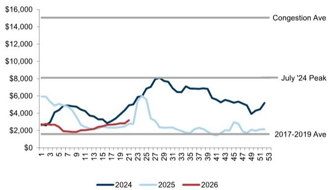

line

| Month | 2024   | 2025   | 2026   |
|-------|--------|--------|--------|
| 1     | $3,000 | $6,000 | $3,000 |
| 3     | $4,500 | $5,500 | $3,000 |
| 5     | $5,000 | $5,000 | $3,000 |
| 7     | $4,500 | $4,500 | $3,000 |
| 9     | $4,000 | $4,000 | $3,000 |
| 11    | $3,500 | $3,500 | $3,000 |
| 13    | $3,000 | $3,000 | $3,000 |
| 15    | $3,500 | $3,500 | $3,000 |
| 17    | $4,000 | $4,000 | $3,500 |
| 19    | $4,500 | $4,500 | $3,500 |
| 21    | $5,500 | $5,500 | $3,500 |
| 23    | $6,500 | $6,500 | $3,500 |
| 25    | $7,500 | $7,500 | $3,500 |
| 27    | $8,500 | $6,500 | $3,500 |
| 29    | $8,500 | $6,500 | $3,500 |
| 31    | $8,500 | $6,500 | $3,500 |
| 33    | $8,500 | $6,500 | $3,500 |
| 35    | $8,500 | $6,500 | $3,500 |
| 37    | $8,500 | $6,500 | $3,500 |
| 39    | $8,500 | $6,500 | $3,500 |
| 41    | $8,500 | $6,500 | $3,500 |
| 43    | $8,500 | $6,500 | $3,500 |
| 45    | $8,500 | $6,500 | $3,500 |
| 47    | $8,500 | $6,500 | $3,500 |
| 49    | $8,500 | $6,500 | $3,500 |
| 51    | $8,500 | $6,500 | $3,500 |
| 53    | $8,500 | $6,500 | $3,500 |

Weekly rate through 5/22/2026   
Source:Freightos

\- Planned TEUs into the Port of LA in the most recent week was down -15% sequentially after -4%/+6% WoW moves in the prior two weeks. Looking ahead, this week's negative sequential appears to increase next week to +14% before increasing +3% two-weeks out. YoY trends are expected to stay positive for TEUs up +6% YoY next week and +63% two weeks out.

Exhibit 10: Planned TEUs are expected to increase sequentially next week and 2 weeks out   
Planned TEUs into the Port of LA   
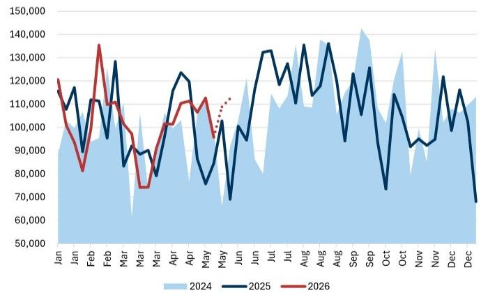

line

| Month | 2024   | 2025    | 2026    |
|-------|--------|---------|---------|
| Jan   | 115,000| 118,000 | 120,000 |
| Feb   | 95,000 | 110,000 | 135,000 |
| Mar   | 85,000 | 95,000  | 105,000 |
| Apr   | 115,000| 125,000 | 110,000 |
| May   | 75,000 | 85,000  | 95,000  |
| Jun   | 120,000| 135,000 | 115,000 |
| Jul   | 115,000| 138,000 | 118,000 |
| Aug   | 135,000| 138,000 | 125,000 |
| Sep   | 145,000| 125,000 | 128,000 |
| Oct   | 75,000 | 115,000 | 95,000  |
| Nov   | 95,000 | 125,000 | 118,000 |
| Dec   | 115,000| 118,000 | 115,000 |

Weekly data updated daily as of 5/22/2026 Port Optimizer data includes two week forward data for week ending 6/5   
Source: Port Optimizer

Exhibit 11: Tracking volumes over the last four weeks and upcoming 2 weeks  
Port Optimizer 6 Week Dashboard 

<table><tr><td colspan="8">Port Optimizer 6 Week Dashboard</td></tr><tr><td>Date</td><td>4/24/2026</td><td>5/1/2026</td><td>5/8/2026</td><td>5/15/2026</td><td>5/22/2026</td><td>5/29/2026</td><td>6/5/2026</td></tr><tr><td>Week</td><td>16</td><td>17</td><td>18</td><td>19</td><td>20</td><td>21</td><td>22</td></tr><tr><td>TEUs</td><td>110,401</td><td>111,337</td><td>106,533</td><td>112,656</td><td>95,830</td><td>108,881</td><td>112,490</td></tr><tr><td>WoW</td><td>N/A</td><td>0.8%</td><td>-4.3%</td><td>5.7%</td><td>-14.9%</td><td>13.6%</td><td>3.3%</td></tr><tr><td>2025 WoW</td><td>6.8%</td><td>-3.1%</td><td>-27.8%</td><td>-12.4%</td><td>11.8%</td><td>21.6%</td><td>-32.9%</td></tr><tr><td>2026 YoY</td><td>-10.7%</td><td>-7.1%</td><td>23.2%</td><td>48.8%</td><td>13.3%</td><td>5.8%</td><td>62.9%</td></tr><tr><td>Vessels</td><td>19</td><td>19</td><td>19</td><td>20</td><td>18</td><td>19</td><td>21</td></tr><tr><td>WoW</td><td>N/A</td><td>0.0%</td><td>0.0%</td><td>5.3%</td><td>-10.0%</td><td>5.6%</td><td>10.5%</td></tr><tr><td>2025 WoW</td><td>14.3%</td><td>-8.3%</td><td>-27.3%</td><td>0.0%</td><td>18.8%</td><td>10.5%</td><td>-23.8%</td></tr><tr><td>2026 YoY</td><td>-20.8%</td><td>-13.6%</td><td>18.8%</td><td>25.0%</td><td>-5.3%</td><td>-9.5%</td><td>31.3%</td></tr></table>

Weekly data update as of 5/22/2026 Port Optimizer data includes two week forward data for week ending 6/5   
Source: Port Optimizer

WorldACD Weekly Cargo Trends Asia Pacific to North America weights and rates (as of 5/14; latest), two week over two week was -6% and +3% last week, after +2% and +4% in the prior week, respectively. The sequential increase in rate is likely from the increase in higher jet fuel pricing. The sequential weight movements are figures to watch to ascertain the need for faster cycle logistics. We continue to monitor rate impact on global and regional rates from reduced air capacity in Gulf states in addition to increase in jet fuel pricing, noting the limited visibility on weekly rates, as well as recognizing the dynamic situation as some airports have limited reopening of flights.

Exhibit 12: Trends for air cargo out of Asia Pacific to North America: weight decreased in the most recent week (-6%) and rate increased (+3%)   
WorldACD Last Two Weeks Compared with the Preceding Two Weeks, Asia Pacific to North America Weight and Rate   
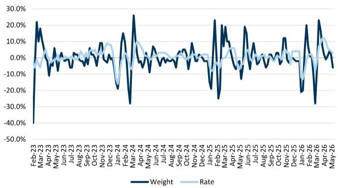

line

| Month    | Weight | Rate  |
|----------|--------|-------|
| Feb-23   | -40.0% | -10.0%|
| Mar-23   | 20.0%  | 0.0%  |
| Apr-23   | -10.0% | 0.0%  |
| May-23   | 0.0%   | 0.0%  |
| Jun-23   | 0.0%   | 0.0%  |
| Jul-23   | 0.0%   | 0.0%  |
| Aug-23   | 0.0%   | 0.0%  |
| Sep-23   | 0.0%   | 0.0%  |
| Oct-23   | 0.0%   | 0.0%  |
| Nov-23   | 0.0%   | 0.0%  |
| Dec-23   | 0.0%   | 0.0%  |
| Jan-24   | -20.0% | -10.0%|
| Feb-24   | -30.0% | -10.0%|
| Mar-24   | 25.0%  | 10.0% |
| Apr-24   | 0.0%   | 0.0%  |
| May-24   | 0.0%   | 0.0%  |
| Jun-24   | 0.0%   | 0.0%  |
| Jul-24   | 0.0%   | 0.0%  |
| Aug-24   | 0.0%   | 0.0%  |
| Sep-24   | 0.0%   | 0.0%  |
| Oct-24   | 0.0%   | 0.0%  |
| Nov-24   | 0.0%   | 0.0%  |
| Dec-24   | 0.0%   | 0.0%  |
| Jan-25   | -25.0% | -15.0%|
| Feb-25   | -35.0% | -25.0%|
| Mar-25   | -15.0% | -15.0%|
| Apr-25   | -15.0% | -15.0%|
| May-25   | -15.0% | -15.0%|
| Jun-25   | -15.0% | -15.0%|
| Jul-25   | -15.0% | -15.0%|
| Aug-25   | -15.0% | -15.0%|
| Sep-25   | -15.0% | -15.0%|
| Oct-25   | -15.0% | -15.0%|
| Nov-25   | -15.0% | -15.0%|
| Dec-25   | -25.0% | -15.0%|
| Jan-26   | -35.0% | -25.0%|
| Feb-26   | -35.0% | -25.0%|
| Mar-26   | -35.0% | -25.0%|
| Apr-26   | -35.0% | -25.0%|
| May-26   | -15.0% | -15.0%|

Weekly two week over two week change as of 5/14/2026   
Source: WorldACD

Intermodal traffic growth on the West Coast (UNP/BNSF) was +9% YoY in the most recent week, versus +4% last week.

Exhibit 13: West Coast intermodal carloads were +9% YoY versus +4% YoY last week   
Intermodal Carloads on the West Coast   
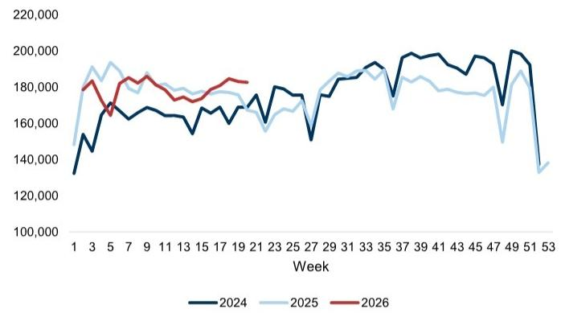  
Weekly intermodal carload as of 5/16/2026   
Source: AAR

Truckload spot rates ex-fuel on the West Coast from truckstop.com were up +13% w/w and +30% YoY in the most recent week.   
Truck load availability index on the West Coast was up +25% w/w and up +41% YoY.

Exhibit 14: Rates were +30% YoY last week on the West Coast   
Truckload Spot Rates ex-fuel West Coast   
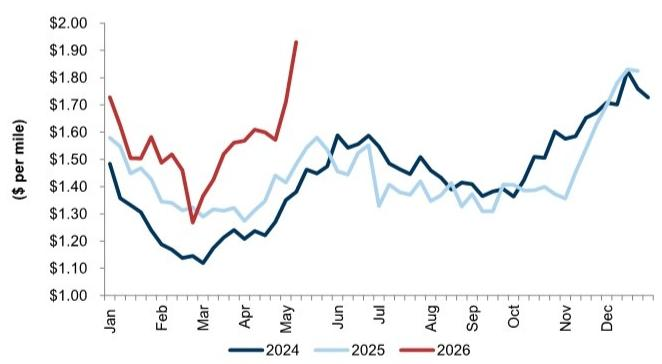

line

| Month | 2024  | 2025  | 2026  |
|-------|-------|-------|-------|
| Jan   | $1.50 | $1.55 | $1.75 |
| Feb   | $1.30 | $1.40 | $1.50 |
| Mar   | $1.15 | $1.30 | $1.30 |
| Apr   | $1.25 | $1.35 | $1.55 |
| May   | $1.45 | $1.55 | $1.95 |
| Jun   | $1.55 | $1.50 | -     |
| Jul   | $1.50 | $1.40 | -     |
| Aug   | $1.45 | $1.35 | -     |
| Sep   | $1.40 | $1.35 | -     |
| Oct   | $1.45 | $1.40 | -     |
| Nov   | $1.60 | $1.45 | -     |
| Dec   | $1.80 | $1.85 | -     |

Weekly data as of 5/18/2026   
Source: Truckstop.com

Exhibit 15: Truckload load availability was +41% YoY this past week on the West Coast   
Truckload Load Availability Index on the West Coast   
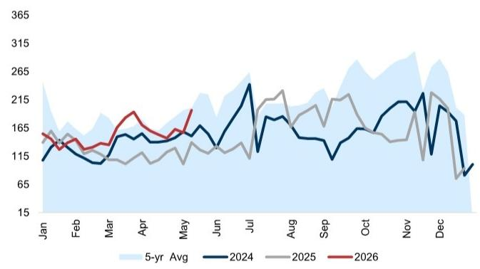

line

| Month | 5-yr Avg | 2024 | 2025 | 2026 |
|-------|----------|------|------|------|
| Jan   | ~300     | ~110 | ~115 | ~115 |
| Feb   | ~280     | ~110 | ~115 | ~115 |
| Mar   | ~270     | ~110 | ~115 | ~115 |
| Apr   | ~260     | ~115 | ~115 | ~120 |
| May   | ~270     | ~115 | ~115 | ~120 |
| Jun   | ~280     | ~120 | ~115 | ~120 |
| Jul   | ~290     | ~230 | ~120 | ~120 |
| Aug   | ~300     | ~160 | ~210 | ~160 |
| Sep   | ~310     | ~160 | ~210 | ~160 |
| Oct   | ~320     | ~160 | ~210 | ~160 |
| Nov   | ~330     | ~210 | ~210 | ~160 |
| Dec   | ~340     | ~160 | ~160 | ~160 |

Weekly data as of 5/18/2026   
Source: Truckstop.com

Our Supply Chain Congestion Tracker stayed at '2' this past week as the bottleneck index was decreased -2% w/w; overall fluidity levels are closer to the pre-Covid baseline.

Exhibit 16: Congestion remains fluid as per our supply chain congestion index, about in line with pre-Covid levels   
GS Weekly Supply Chain Congestion Index, Feb 2020 – May 2026   
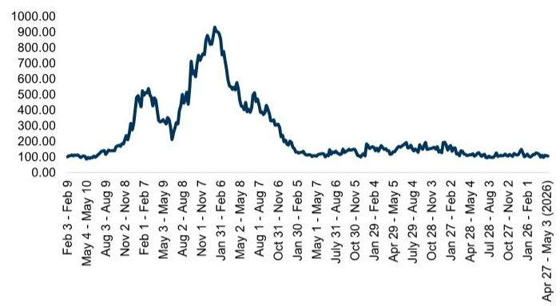

line

| Date       | Value   |
| ---------- | ------- |
| Feb 3 - Feb 9 | 100.00  |
| May 4 - May 10 | 150.00  |
| Aug 3 - Aug 9 | 250.00  |
| Nov 2 - Nov 8 | 500.00  |
| Feb 1 - Feb 7 | 550.00  |
| May 3 - May 9 | 300.00  |
| Aug 2 - Aug 8 | 700.00  |
| Nov 1 - Nov 7 | 950.00  |
| Jan 31 - Feb 6 | 500.00  |
| May 2 - May 8 | 450.00  |
| Aug 1 - Aug 7 | 350.00  |
| Oct 31 - Nov 6 | 250.00  |
| Jan 30 - Feb 5 | 150.00  |
| May 1 - May 7 | 120.00  |
| July 31 - Aug 6 | 130.00  |
| Oct 30 - Nov 5 | 140.00  |
| Jan 29 - Feb 4 | 160.00  |
| Apr 29 - May 4 | 170.00  |
| July 29 - Aug 4 | 180.00 |
| Oct 28 - Nov 3 | 190.00 |
| Jan 27 - Feb 2 | 200.00 |
| Apr 28 - May 4 | 210.00 |
| Jul 28 - Aug 3 | 220.00 |
| Oct 27 - Nov 2 | 230.00 |
| Jan 26 - Feb 1 | 240.00 |
| Apr 27 - May 3 (2026) | 250.00 |

Weekly data as of 5/10/2026   
Source: GS Global Investment Research

# Lagged Monthly Data

We include monthly data that we believe reflects the impact to freight flows from trade policy.

Big Three (Ports of LA, Long Beach and Oakland) volumes were -2% YoY and down -3.5% sequentially from February to March—below typical seasonality of +3%.

☐ Looking at March from the average of January and February, volumes were down -4% v. usually -2%.

Exhibit 17: Volumes into the West Coast were down $-3.5\%$ in March from February, below historical seasonality Big Three Volumes 

<table><tr><td>Mar-2025</td><td>YoY%</td><td>Seq%</td><td>M v. J/F Avg</td><td>5-yr YoY% Avg</td><td>5-yr Seq% Avg</td><td>5-yr Pre-Covid M v. J/F Avg</td></tr><tr><td>Port of Long Beach</td><td>-1.6%</td><td>1.7%</td><td>-3.7%</td><td>5.5%</td><td>-3.0%</td><td>-5.1%</td></tr><tr><td>Port of LA</td><td>-1.2%</td><td>-12.2%</td><td>-11.0%</td><td>2.3%</td><td>5.2%</td><td>-1.6%</td></tr><tr><td>Port of Oakland</td><td>-6.8%</td><td>24.9%</td><td>2.0%</td><td>7.4%</td><td>21.6%</td><td>12.8%</td></tr><tr><td>Big Three Total</td><td>-2.0%</td><td>-3.5%</td><td>-3.7%</td><td>3.5%</td><td>3.2%</td><td>-1.8%</td></tr></table>

Source: Port of Los Angeles, Port of Long Beach, Port of Oakland

Exhibit 18: Imports into the West Coast were -2% YoY in March   
Big Three Volumes YoY   
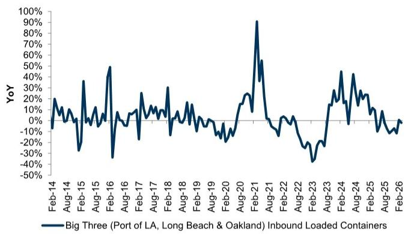

line

| Date    | YoY (%) |
|---------|---------|
| Feb-14  | 0       |
| Aug-14  | 20      |
| Feb-15  | -30     |
| Aug-15  | 30      |
| Feb-16  | 50      |
| Aug-16  | -30     |
| Feb-17  | 10      |
| Aug-17  | 20      |
| Feb-18  | 30      |
| Aug-18  | -10     |
| Feb-19  | 10      |
| Aug-19  | 20      |
| Feb-20  | -10     |
| Aug-20  | 20      |
| Feb-21  | 90      |
| Aug-21  | -10     |
| Feb-22  | -30     |
| Aug-22  | -40     |
| Feb-23  | -20     |
| Aug-23  | 40      |
| Feb-24  | 50      |
| Aug-24  | -10     |
| Feb-25  | 20      |
| Aug-25  | -10     |
| Feb-26  | 0       |

Source: Port of Los Angeles, Port of Long Beach, Port of Oakland

Drewry air rates from Shanghai to LA were up $+25\%$ MoM in April after being $+2\%$ in March. Depending on the development of geopolitical events, we could see a continued increase of rates in May as air capacity gets tied up in addition to the rise in jet fuel prices—to be determined.

Exhibit 19: April rates were up $25\%$ from March   
Drewry Air Rates Shanghai to LA   
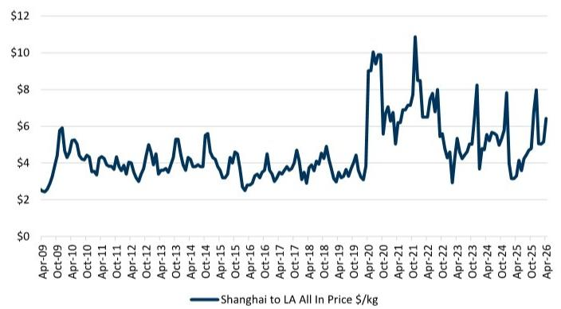

line

| Date   | Shanghai to LA All In Price $/kg |
|--------|----------------------------------|
| Apr-09 | $2.5                             |
| Oct-09 | $6.0                             |
| Apr-10 | $4.5                             |
| Oct-10 | $4.0                             |
| Apr-11 | $3.5                             |
| Oct-11 | $3.8                             |
| Apr-12 | $4.2                             |
| Oct-12 | $4.0                             |
| Apr-13 | $4.5                             |
| Oct-13 | $5.0                             |
| Apr-14 | $5.5                             |
| Oct-14 | $5.0                             |
| Apr-15 | $4.0                             |
| Oct-15 | $3.5                             |
| Apr-16 | $3.0                             |
| Oct-16 | $3.5                             |
| Apr-17 | $4.0                             |
| Oct-17 | $4.5                             |
| Apr-18 | $4.0                             |
| Oct-18 | $4.5                             |
| Apr-19 | $4.0                             |
| Oct-19 | $3.5                             |
| Apr-20 | $10.0                            |
| Oct-20 | $7.0                             |
| Apr-21 | $11.0                            |
| Oct-21 | $8.0                             |
| Apr-22 | $6.0                             |
| Oct-22 | $4.0                             |
| Apr-23 | $5.0                             |
| Oct-23 | $6.0                             |
| Apr-24 | $7.0                             |
| Oct-24 | $6.0                             |
| Apr-25 | $8.0                             |
| Oct-25 | $6.0                             |
| Apr-26 | $6.5                             |

Source: Drewry

Big Three YoY v. Monthly YoY growth of Bloomberg reported TEUs from China, Asia and Asia ex-China to US shows a strong relationship.

# Exhibit 20: Big Three growth tends to follow TEU growth out of Asia to the US

Big Three YoY v. China/Asia/Asia ex-China to US TEU Monthly YoY

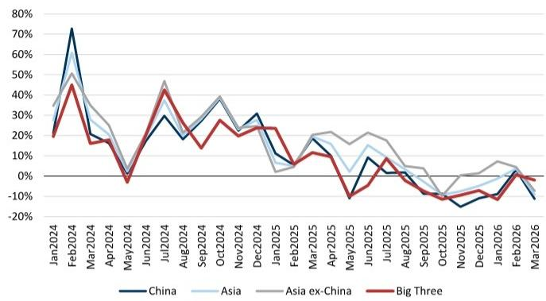

line

| Month | China (%) | Asia (%) | Asia ex-China (%) | Big Three (%) |
|---|---|---|---|---|
| Jan2024 | 25 | 30 | 35 | 20 |
| Feb2024 | 75 | 50 | 45 | 45 |
| Mar2024 | 18 | 30 | 35 | 18 |
| Apr2024 | 15 | 20 | 25 | -5 |
| May2024 | 10 | -5 | -10 | -10 |
| Jun2024 | 25 | 30 | 45 | 40 |
| Jul2024 | 30 | 20 | 35 | 45 |
| Aug2024 | 18 | 25 | 30 | 15 |
| Sep2024 | 20 | 35 | 38 | 25 |
| Oct2024 | 30 | 35 | 38 | 20 |
| Nov2024 | 30 | 25 | 30 | 25 |
| Dec2024 | 30 | 15 | 20 | 25 |
| Jan2025 | 10 | -5 | -10 | -5 |
| Feb2025 | 15 | 10 | 15 | 10 |
| Mar2025 | 18 | 15 | 20 | 10 |
| Apr2025 | -10 | -15 | -10 | -10 |
| May2025 | -15 | -10 | -5 | -15 |
| Jun2025 | 10 | 15 | 20 | 10 |
| Jul2025 | 5 | 10 | 15 | 5 |
| Aug2025 | -5 | -10 | -5 | -5 |
| Sep2025 | -10 | -15 | -10 | -10 |
| Oct2025 | -15 | -10 | -5 | -10 |
| Nov2025 | -18 | -5 | 0 | -10 |
| Dec2025 | -10 | 0 | 5 | -10 |
| Jan2026e | -5 | 5 | 10 | -10 |
| Feb2026e | -10 | -5 | 5 | -5 |
| Mar2026e | -15 | -10 | -5 | -5 |

China and Asia TEU YoY data through 2/26   
Source: Bloomberg, Port of Los Angeles, Port of Long Beach, Port of Oakland

We estimate that imports could have been down -\$1.2bn YoY in April following March's estimated slight YoY decrease of \~\$0.5bn (Exhibit 21). This follows the prior month declines September through January. The higher YoY February may be in part from a later than normal LNY.

☐ We leverage a similar analysis from the Longshoreman strike last October (see our longshoreman impact note). According to the Bureau of Transportation Statistics, Ocean trade was about \$2.3tn in trade in 2022. The top 25 ports in the U.S. moved 44mn loaded TEUs in 2022, meaning that each loaded container (TEU) on average in 2022 had a value of \~\$52,000. Growing this by inflation of \~3% for the last three years implied value per container of \~\$57,000. Multiplying the YoY change in TEUs with the value/TEU, we estimate the monthly imported value change YoY.

Exhibit 21: We estimate that April levels were lower YoY Implied Trade Value Change YoY Based on YoY TEU Change and Estimated Value/TEU   
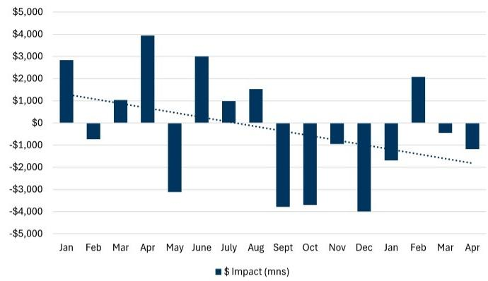

bar

| Month | $ Impact (mns) |
|-------|----------------|
| Jan   | $3,000         |
| Feb   | -$1,000        |
| Mar   | $1,000         |
| Apr   | $4,000         |
| May   | -$3,000        |
| June  | $3,000         |
| July  | $1,000         |
| Aug   | $1,500         |
| Sept  | -$4,000        |
| Oct   | -$3,500        |
| Nov   | -$1,500        |
| Dec   | -$4,500        |
| Jan   | -$1,500        |
| Feb   | $2,000         |
| Mar   | -$1,000        |
| Apr   | -$1,500        |

Source: Port Optimizer, US Bureau of Transportation Statistics (BTS), GS Global Investment Research

# ■ Logistics Managers Index Inventory Level Expansion

□ April upstream (B2B) inventories expanded at 57.9 vs 51.7 in March.   
☐ April downstream (Retail) inventories expanded slower at 53.3 after 62.5 in March.

Exhibit 22: LMI has shown upstream and downstream expansion

Logistics Manager Index – Inventory Level Expansion, Upstream (B2B) vs Downstream (Retail) Respondents

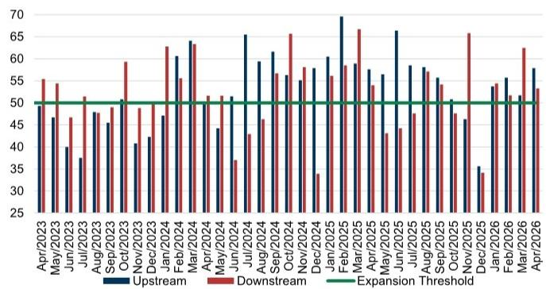

bar

| Month | Upstream | Downstream | Expansion Threshold |
|---|---|---|---|
| Apr/2023 | 49 | 55 | 50 |
| May/2023 | 47 | 54 | 50 |
| Jun/2023 | 40 | 47 | 50 |
| Jul/2023 | 38 | 51 | 50 |
| Aug/2023 | 48 | 49 | 50 |
| Sep/2023 | 45 | 50 | 50 |
| Oct/2023 | 41 | 59 | 50 |
| Nov/2023 | 42 | 49 | 50 |
| Dec/2023 | 47 | 62 | 50 |
| Jan/2024 | 48 | 55 | 50 |
| Feb/2024 | 64 | 51 | 50 |
| Mar/2024 | 63 | 51 | 50 |
| Apr/2024 | 44 | 51 | 50 |
| May/2024 | 45 | 51 | 50 |
| Jun/2024 | 66 | 43 | 50 |
| Jul/2024 | 60 | 47 | 50 |
| Aug/2024 | 61 | 57 | 50 |
| Sep/2024 | 57 | 66 | 50 |
| Oct/2024 | 56 | 58 | 50 |
| Nov/2024 | 58 | 34 | 50 |
| Dec/2024 | 60 | 57 | 50 |
| Jan/2025 | 70 | 59 | 50 |
| Feb/2025 | 69 | 67 | 50 |
| Mar/2025 | 58 | 54 | 50 |
| Apr/2025 | 57 | 43 | 50 |
| May/2025 | 67 | 44 | 50 |
| Jun/2025 | 59 | 48 | 50 |
| Jul/2025 | 59 | 58 | 50 |
| Aug/2025 | 57 | 58 | 50 |
| Sep/2025 | 55 | 48 | 50 |
| Oct/2025 | 47 | 66 | 50 |
| Nov/2025 | 46 | 34 | 50 |
| Dec/2025 | 35 | 54 | 50 |
| Jan/2026 | 56 | 53 | 50 |
| Feb/2026 | 51 | 62 | 50 |
| Mar/2026 | 58 | 53 | 50 |
| Apr/2026 | 58 | 53 | 50 |

Source: Logistics Managers Index

# ■ Logistics Managers Index Inventory Cost Index

☐ Inventory cost index was 74.7 in April vs 76.2 in March, reflecting still expanding inventory costs.

Exhibit 23: Inventory costs slowed in April   
LMI Inventory Cost Index   
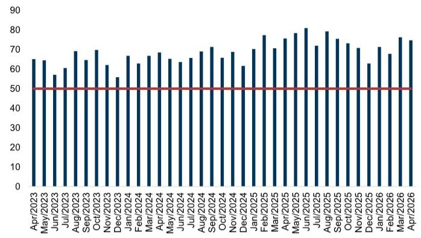

bar

| Month | Value |
|---|---|
| Apr/2023 | 65 |
| May/2023 | 64 |
| Jun/2023 | 57 |
| Jul/2023 | 61 |
| Aug/2023 | 69 |
| Sep/2023 | 64 |
| Oct/2023 | 70 |
| Nov/2023 | 62 |
| Dec/2023 | 55 |
| Jan/2024 | 67 |
| Feb/2024 | 63 |
| Mar/2024 | 67 |
| Apr/2024 | 68 |
| May/2024 | 65 |
| Jun/2024 | 64 |
| Jul/2024 | 66 |
| Aug/2024 | 69 |
| Sep/2024 | 71 |
| Oct/2024 | 65 |
| Nov/2024 | 68 |
| Dec/2024 | 61 |
| Jan/2025 | 70 |
| Feb/2025 | 77 |
| Mar/2025 | 70 |
| Apr/2025 | 75 |
| May/2025 | 78 |
| Jun/2025 | 81 |
| Jul/2025 | 71 |
| Aug/2025 | 79 |
| Sep/2025 | 74 |
| Oct/2025 | 71 |
| Nov/2025 | 63 |
| Dec/2025 | 71 |
| Jan/2026 | 68 |
| Feb/2026 | 76 |
| Mar/2026 | 75 |
| Apr/2026 | 74 |

Source: Logistics Managers Index

\- Inventory to sales for retailers/manufacturers/wholesalers were 1.09/1.51/1.21 for March which is lower versus February at 1.11/1.52/1.23.

# Exhibit 24: Inventory to sales have not shown an increase like in Trump 1.0...

Inventory to Sales Ratio: Retailers ex Motor Vehicle and Parts Dealers

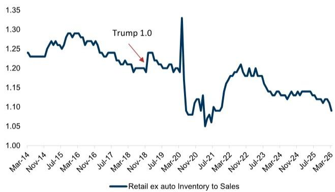

line

| Date     | Retail ex auto Inventory to Sales |
| -------- | ---------------------------------- |
| Mar-14   | 1.23                               |
| Nov-14   | 1.24                               |
| Jul-15   | 1.28                               |
| Mar-16   | 1.29                               |
| Nov-16   | 1.27                               |
| Jul-17   | 1.25                               |
| Mar-18   | 1.20                               |
| Nov-18   | 1.24                               |
| Jul-19   | 1.20                               |
| Mar-20   | 1.33                               |
| Nov-20   | 1.08                               |
| Jul-21   | 1.05                               |
| Mar-22   | 1.18                               |
| Nov-22   | 1.20                               |
| Jul-23   | 1.15                               |
| Mar-24   | 1.13                               |
| Nov-24   | 1.14                               |
| Jul-25   | 1.13                               |
| Mar-26   | 1.10                               |

# Exhibit 25: ...nor for manufacturers...

Inventory to Sales Manufacturers

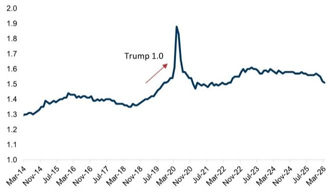

line

| Date     | Value |
| -------- | ----- |
| Nov-19   | 1.0   |
| Mar-20   | 1.9   |
| Jul-21   | 1.5   |
| Nov-22   | 1.6   |
| Mar-23   | 1.6   |
| Jul-24   | 1.6   |
| Nov-24   | 1.6   |
| Mar-25   | 1.6   |
| Jul-26   | 1.5   |

Source: Census Bureau

Source: Census Bureau

Exhibit 26: ...while wholesalers were also unchanged Inventory to Sales Wholesalers   
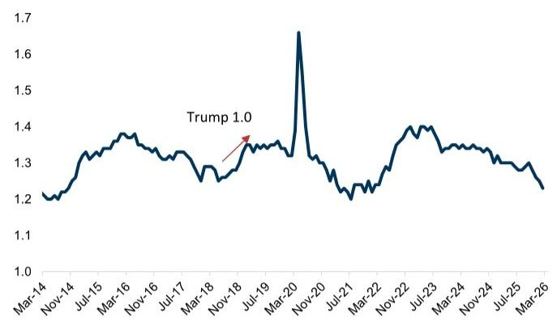

line

| Date     | Value |
| -------- | ----- |
| Nov-18   | 1.0   |

Source: Census Bureau

# Disclosure Appendix

# Reg AC

We, Jordan Alliger, Paul Stoddard and Andrzej Tomczyk, CFA, hereby certify that all of the views expressed in this report accurately reflect our personal views about the subject company or companies and its or their securities. We also certify that no part of our compensation was, is or will be, directly or indirectly, related to the specific recommendations or views expressed in this report.

Unless otherwise stated, the individuals listed on the cover page of this report are analysts in GS' Global Investment Research division.

Contributing Authors: Jordan Alliger GS & Co. LLC, Paul Stoddard GS & Co. LLC, Andrzej Tomczyk, CFA GS & Co. LLC.

Unless otherwise stated, the individuals listed in the Contributing Authors disclosure of this report are analysts in GS' Global Investment Research division.

# GS Factor Profile

The GS Factor Profile provides investment context for a stock by comparing key attributes to the market (i.e. our universe of rated stocks) and its sector peers. The four key attributes depicted are: Growth, Financial Returns, Multiple (e.g. valuation) and Integrated (a composite of Growth, Financial Returns and Multiple). Growth, Financial Returns and Multiple are calculated by using normalized ranks for specific metrics for each stock. The normalized ranks for the metrics are then averaged and converted into percentiles for the relevant attribute. The precise calculation of each metric may vary depending on the fiscal year, industry and region, but the standard approach is as follows:

Growth is based on a stock's forward-looking sales growth, EBITDA growth and EPS growth (for financial stocks, only EPS and sales growth), with a higher percentile indicating a higher growth company. Financial Returns is based on a stock's forward-looking ROE, ROCE and CROCI (for financial stocks, only ROE), with a higher percentile indicating a company with higher financial returns. Multiple is based on a stock's forward-looking P/E, P/B, price/dividend (P/D), EV/EBITDA, EV/FCF and EV/Debt Adjusted Cash Flow (DACF) (for financial stocks, only P/E, P/B and P/D), with a higher percentile indicating a stock trading at a higher multiple. The Integrated percentile is calculated as the average of the Growth percentile, Financial Returns percentile and (100% - Multiple percentile).

Financial Returns and Multiple use the GS analyst forecasts at the fiscal year-end at least three quarters in the future. Growth uses inputs for the fiscal year at least seven quarters in the future compared with the year at least three quarters in the future (on a per-share basis for all metrics).

For a more detailed description of how we calculate the GS Factor Profile, please contact your GS representative.

# M&A Rank

Across our global coverage, we examine stocks using an M&A framework, considering both qualitative factors and quantitative factors (which may vary across sectors and regions) to incorporate the potential that certain companies could be acquired. We then assign a M&A rank as a means of scoring companies under our rated coverage from 1 to 3, with 1 representing high (30%-50%) probability of the company becoming an acquisition target, 2 representing medium (15%-30%) probability and 3 representing low (0%-15%) probability. For companies ranked 1 or 2, in line with our standard departmental guidelines we incorporate an M&A component into our target price. M&A rank of 3 is considered immaterial and therefore does not factor into our price target, and may or may not be discussed in research.

# Quantum

Quantum is GS' proprietary database providing access to detailed financial statement histories, forecasts and ratios. It can be used for in-depth analysis of a single company, or to make comparisons between companies in different sectors and markets.

# Disclosures

# Rating and pricing information

FedEx Corp. (Buy, \$388.91) and United Parcel Service Inc. (Buy, \$98.25)

# Distribution of ratings/investment banking relationships

GS Investment Research global Equity coverage universe

<table><tr><td rowspan="2"></td><td colspan="3">Rating Distribution</td><td colspan="3">Investment Banking Relationships</td></tr><tr><td>Buy</td><td>Hold</td><td>Sell</td><td>Buy</td><td>Hold</td><td>Sell</td></tr><tr><td>Global</td><td>50%</td><td>34%</td><td>16%</td><td>65%</td><td>60%</td><td>45%</td></tr></table>

As of April 1, 2026, GS Global Investment Research had investment ratings on 3,074 equity securities. GS assigns stocks as Buys and Sells on various regional Investment Lists; stocks not so assigned are deemed Neutral. Such assignments equate to Buy, Hold and Sell for the purposes of the above disclosure required by the FINRA Rules. See ‘Ratings, Coverage universe and related definitions’ below. The Investment Banking Relationships chart reflects the percentage of subject companies within each rating category for whom GS has provided investment banking services within the previous twelve months.

# Regulatory disclosures

# Disclosures required by United States laws and regulations

See company-specific regulatory disclosures above for any of the following disclosures required as to companies referred to in this report: manager or co-manager in a pending transaction; $1\%$ or other ownership; compensation for certain services; types of client relationships; managed/co-managed public offerings in prior periods; directorships; for equity securities, market making and/or specialist role. GS trades or may trade as a principal in debt securities (or in related derivatives) of issuers discussed in this report.

The following are additional required disclosures: Ownership and material conflicts of interest: GS policy prohibits its analysts, professionals reporting to analysts and members of their households from owning securities of any company in the analyst's area of coverage. Analyst compensation: Analysts are paid in part based on the profitability of GS, which includes investment banking revenues. Analyst as officer or director: GS policy generally prohibits its analysts, persons reporting to analysts or members of their households from serving as an

officer, director or advisor of any company in the analyst's area of coverage. Non-U.S. Analysts: Non-U.S. analysts may not be associated persons of GS & Co. LLC and therefore may not be subject to FINRA Rule 2241 or FINRA Rule 2242 restrictions on communications with a subject company, public appearances and trading in securities covered by the analysts.

Distribution of ratings: See the distribution of ratings disclosure above. Price chart: See the price chart, with changes of ratings and price targets in prior periods, above, or, if electronic format or if with respect to multiple companies which are the subject of this report, on the GS website at https://www.gs.com/research/hedge.html.

# Additional disclosures required under the laws and regulations of jurisdictions other than the United States

The following disclosures are those required by the jurisdiction indicated, except to the extent already made above pursuant to United States laws and regulations. Australia: GS Australia Pty Ltd and its affiliates are not authorised deposit-taking institutions (as that term is defined in the Banking Act 1959 (Cth)) in Australia and do not provide banking services, nor carry on a banking business, in Australia. This research, and any access to it, is intended only for “wholesale clients” within the meaning of the Australian Corporations Act, unless otherwise agreed by GS. In producing research reports, members of Global Investment Research of GS Australia may attend site visits and other meetings hosted by the companies and other entities which are the subject of its research reports. In some instances the costs of such site visits or meetings may be met in part or in whole by the issuers concerned if GS Australia considers it is appropriate and reasonable in the specific circumstances relating to the site visit or meeting. To the extent that the contents of this document contains any financial product advice, it is general advice only and has been prepared by GS without taking into account a client’s objectives, financial situation or needs. A client should, before acting on any such advice, consider the appropriateness of the advice having regard to the client’s own objectives, financial situation and needs. A copy of certain GS Australia and New Zealand disclosure of interests and a copy of GS’ Australian Sell-Side Research Independence Policy Statement are available at: https://www.goldmansachs.com/disclosures/australia-new-zealand/index.html. Brazil: Disclosure information in relation to CVM Resolution n. 20 is available at https://www.gs.com/worldwide/brazil/area/gir/index.html. Where applicable, the Brazil-registered analyst primarily responsible for the content of this research report, as defined in Article 20 of CVM Resolution n. 20, is the first author named at the beginning of this report, unless indicated otherwise at the end of the text. Canada: This information is being provided to you for information purposes only and is not, and under no circumstances should be construed as, an advertisement, offering or solicitation by GS & Co. LLC for purchasers of securities in Canada to trade in any Canadian security. GS & Co. LLC is not registered as a dealer in any jurisdiction in Canada under applicable Canadian securities laws and generally is not permitted to trade in Canadian securities and may be prohibited from selling certain securities and products in certain jurisdictions in Canada. If you wish to trade in any Canadian securities or other products in Canada please contact GS Canada Inc., an affiliate of The GS Group Inc., or another registered Canadian dealer. Hong Kong: Further information on the securities of covered companies referred to in this research may be obtained on request from GS (Asia) L.L.C. India: Further information on the subject company or companies referred to in this research may be obtained from GS (India) Securities Private Limited, Research Analyst – SEBI Registration Number INH000001493, 10th Floor, Ascent-Worli, Sudam Kalu Ahire Marg, Worli, Mumbai-400 025, India, Corporate Identity Number U74140MH2006FTC160634, Phone +91 22 6616 9000, Fax +91 22 6616 9001. GS may beneficially own 1% or more of the securities (as such term is defined in clause 2 (h) the Indian Securities Contracts (Regulation) Act, 1956) of the subject company or companies referred to in this research report. Investment in securities market are subject to market risks. Read all the related documents carefully before investing. Registration granted by SEBI and certification from NISM in no way guarantee performance of the intermediary or provide any assurance of returns to investors. GS (India) Securities Private Limited compliance officer and investor grievance contact details can be found at: https://www.goldmansachs.com/worldwide/india/documents/Grievance-Redressal-and-Escalation-Matrix.pdf, and a copy of the annual audit compliance report can be found at this link: https://publishing.gs.com/content/site/india-annual-compliance-report.html. Japan: See below. Korea: This research, and any access to it, is intended only for “professional investors” within the meaning of the Financial Services and Capital Markets Act, unless otherwise agreed by GS. Further information on the subject company or companies referred to in this research may be obtained from GS (Asia) L.L.C., Seoul Branch. New Zealand: GS New Zealand Limited and its affiliates are neither “registered banks” nor “deposit takers” (as defined in the Reserve Bank of New Zealand Act 1989) in New Zealand. This research, and any access to it, is intended for “wholesale clients” (as defined in the Financial Advisers Act 2008) unless otherwise agreed by GS. A copy of certain GS Australia and New Zealand disclosure of interests is available at: https://www.goldmansachs.com/disclosures/australia-new-zealand/index.html. Russia: Research reports distributed in the Russian Federation are not advertising as defined in the Russian legislation, but are information and analysis not having product promotion as their main purpose and do not provide appraisal within the meaning of the Russian legislation on appraisal activity. Research reports do not constitute a personalized investment recommendation as defined in Russian laws and regulations, are not addressed to a specific client, and are prepared without analyzing the financial circumstances, investment profiles or risk profiles of clients. GS assumes no responsibility for any investment decisions that may be taken by a client or any other person based on this research report. Singapore: GS (Singapore) Pte. (Company Number: 198602165W), which is regulated by the Monetary Authority of Singapore, accepts legal responsibility for this research, and should be contacted with respect to any matters arising from, or in connection with, this research. Taiwan: This material is for reference only and must not be reprinted without permission. Investors should carefully consider their own investment risk. Investment results are the responsibility of the individual investor. United Kingdom: Persons who would be categorized as retail clients in the United Kingdom, as such term is defined in the rules of the Financial Conduct Authority, should read this research in conjunction with prior GS on the covered companies referred to herein and should refer to the risk warnings that have been sent to them by GS International. A copy of these risks warnings, and a glossary of certain financial terms used in this report, are available from GS International on request.

European Union and United Kingdom: Disclosure information in relation to Article 6 (2) of the European Commission Delegated Regulation (EU) (2016/958) supplementing Regulation (EU) No 596/2014 of the European Parliament and of the Council (including as that Delegated Regulation is implemented into United Kingdom domestic law and regulation following the United Kingdom's departure from the European Union and the European Economic Area) with regard to regulatory technical standards for the technical arrangements for objective presentation of investment recommendations or other information recommending or suggesting an investment strategy and for disclosure of particular interests or indications of conflicts of interest is available at https://www.gs.com/disclosures/europeanpolicy.html which states the European Policy for Managing Conflicts of Interest in Connection with Investment Research.

Japan: GS Japan Co., Ltd. is a Financial Instrument Dealer registered with the Kanto Financial Bureau under registration number Kinsho 69, and a member of Japan Securities Dealers Association, Financial Futures Association of Japan Type II Financial Instruments Firms Association, and Investment Management Association of Japan. Sales and purchase of equities are subject to commission pre-determined with clients plus consumption tax. See company-specific disclosures as to any applicable disclosures required by Japanese stock exchanges, the Japanese Securities Dealers Association or the Japanese Securities Finance Company.

# Ratings, coverage universe and related definitions

Buy (B), Neutral (N), Sell (S) Analysts recommend stocks as Buys or Sells for inclusion on various regional Investment Lists. Being assigned a Buy or Sell on an Investment List is determined by a stock's total return potential relative to its coverage universe. Any stock not assigned as a Buy or a Sell on an Investment List with an active rating (i.e., a stock that is not Rating Suspended, Not Rated, Early-Stage Biotech, Coverage Suspended or Not Covered), is deemed Neutral. Each region manages Regional Conviction Lists, which are selected from Buy rated stocks on the respective region's Investment Lists and represent investment recommendations focused on the size of the total return potential and/or the likelihood of the realization of the return across their respective areas of coverage. The addition or removal of stocks from such Conviction Lists are managed by the Investment Review Committee or other designated committee in each respective region and do not represent a change in the analysts' investment rating for such stocks.

Total return potential represents the upside or downside differential between the current share price and the price target, including all paid or anticipated dividends, expected during the time horizon associated with the price target. Price targets are required for all covered stocks. The total return potential, price target and associated time horizon are stated in each report adding or reiterating an Investment List membership.

Coverage Universe: A list of all stocks in each coverage universe is available by primary analyst, stock and coverage universe at https://www.gs.com/research/hedge.html.

Not Rated (NR). The investment rating, target price and earnings estimates (where relevant) are removed pursuant to GS policy when GS is acting in an advisory capacity in a merger or in a strategic transaction involving this company, when there are legal, regulatory or policy constraints due to GS' involvement in a transaction, and in certain other circumstances. Early-Stage Biotech (ES). An investment rating and a target price are not assigned pursuant to GS policy when this company has neither a drug, treatment or medical device that has passed a Phase II clinical trial nor a license to distribute a post-Phase II drug, treatment or medical device. Rating Suspended (RS). GS has suspended the investment rating and price target for this stock, because there is not a sufficient fundamental basis for determining an investment rating or target price. The previous investment rating and target price, if any, are no longer in effect for this stock and should not be relied upon. Coverage Suspended (CS). GS has suspended coverage of this company. Not Covered (NC). GS does not cover this company.

# Global product; distributing entities

GS Global Investment Research produces and distributes research products for clients of GS on a global basis. Analysts based in GS offices around the world produce research on industries and companies, and research on macroeconomics, currencies, commodities and portfolio strategy. This research is disseminated in Australia by GS Australia Pty Ltd (ABN 21 006 797 897); in Brazil by GS do Brasil Corretora de Títulos e Valores Mobiliários S.A.; Public Communication Channel GS Brazil: 0800 727 5764 and / or contatogoldmanbrasil@gs.com. Available Weekdays (except holidays), from 9am to 6pm. Canal de Comunicação com o Público GS Brasil: 0800 727 5764 e/ou contatogoldmanbrasil@gs.com. Horário de funcionamento: segunda-feira à sexta-feira (exceto feriados), das 9h às 18h; in Canada by GS & Co. LLC; in Hong Kong by GS (Asia) L.L.C.; in India by GS (India) Securities Private Ltd.; in Japan by GS Japan Co., Ltd.; in the Republic of Korea by GS (Asia) L.L.C., Seoul Branch; in New Zealand by GS New Zealand Limited; in Russia by OOO GS; in Singapore by GS (Singapore) Pte. (Company Number: 198602165W); and in the United States of America by GS & Co. LLC. GS International has approved this research in connection with its distribution in the United Kingdom.

GS International (“GSI”), authorised by the Prudential Regulation Authority (“PRA”) and regulated by the Financial Conduct Authority (“FCA”) and the PRA, has approved this research in connection with its distribution in the United Kingdom.

European Economic Area: GS Bank Europe SE (“GSBE”) is a credit institution incorporated in Germany and, within the Single Supervisory Mechanism, subject to direct prudential supervision by the European Central Bank and in other respects supervised by German Federal Financial Supervisory Authority (Bundesanstalt für Finanzdienstleistungsaufsicht, BaFin) and Deutsche Bundesbank and disseminates research within the European Economic Area.

# General disclosures

This research is for our clients only. Other than disclosures relating to GS, this research is based on current public information that we consider reliable, but we do not represent it is accurate or complete, and it should not be relied on as such. The information, opinions, estimates and forecasts contained herein are as of the date hereof and are subject to change without prior notification. We seek to update our research as appropriate, but various regulations may prevent us from doing so. Other than certain industry reports published on a periodic basis, the large majority of reports are published at irregular intervals as appropriate in the analyst's judgment.

GS conducts a global full-service, integrated investment banking, investment management, and brokerage business. We have investment banking and other business relationships with a substantial percentage of the companies covered by Global Investment Research. GS & Co. LLC, the United States broker dealer, is a member of SIPC (https://www.sipc.org).

Our salespeople, traders, and other professionals may provide oral or written market commentary or trading strategies to our clients and principal trading desks that reflect opinions that are contrary to the opinions expressed in this research. Our asset management area, principal trading desks and investing businesses may make investment decisions that are inconsistent with the recommendations or views expressed in this research.

The analysts named in this report may have from time to time discussed with our clients, including GS salespersons and traders, or may discuss in this report, trading strategies that reference catalysts or events that may have a near-term impact on the market price of the equity securities discussed in this report, which impact may be directionally counter to the analyst's published price target expectations for such stocks. Any such trading strategies are distinct from and do not affect the analyst's fundamental equity rating for such stocks, which rating reflects a stock's return potential relative to its coverage universe as described herein.

We and our affiliates, officers, directors, and employees will from time to time have long or short positions in, act as principal in, and buy or sell, the securities or derivatives, if any, referred to in this research, unless otherwise prohibited by regulation or GS policy.

The views attributed to third party presenters at GS arranged conferences, including individuals from other parts of GS, do not necessarily reflect those of Global Investment Research and are not an official view of GS.

Any third party referenced herein, including any salespeople, traders and other professionals or members of their household, may have positions in the products mentioned that are inconsistent with the views expressed by analysts named in this report.

This research is not an offer to sell or the solicitation of an offer to buy any security in any jurisdiction where such an offer or solicitation would be illegal. It does not constitute a personal recommendation or take into account the particular investment objectives, financial situations, or needs of individual clients. Clients should consider whether any advice or recommendation in this research is suitable for their particular circumstances and, if appropriate, seek professional advice, including tax advice. The price and value of investments referred to in this research and the income from them may fluctuate. Past performance is not a guide to future performance, future returns are not guaranteed, and a loss of original capital may occur. Fluctuations in exchange rates could have adverse effects on the value or price of, or income derived from, certain investments.

Certain transactions, including those involving futures, options, and other derivatives, give rise to substantial risk and are not suitable for all investors. Investors should review current options and futures disclosure documents which are available from GS sales representatives or at https://www.theocc.com/about/publications/character-risks.jsp and https://www.goldmansachs.com/disclosures/cftc\_fcm\_disclosures. Transaction costs may be significant in option strategies calling for multiple purchase and sales of options such as spreads. Supporting documentation will be supplied upon request.

Differing Levels of Service provided by Global Investment Research: The level and types of services provided to you by GS Global Investment Research may vary as compared to that provided to internal and other external clients of GS, depending on various factors including your individual preferences as to the frequency and manner of receiving communication, your risk profile and investment focus and perspective (e.g., marketwide, sector specific, long term, short term), the size and scope of your overall client relationship with GS, and legal and regulatory constraints. As an example, certain clients may request to receive notifications when research on specific securities is published, and certain clients may request that specific data underlying analysts' fundamental analysis available on our internal client websites be delivered to them electronically through data feeds or otherwise. No change to an analyst's fundamental research views (e.g., ratings, price targets, or material changes to earnings estimates for equity securities), will be communicated to any client prior to inclusion of such information in a research report broadly disseminated through electronic publication to our internal client websites or through other means, as necessary, to all clients who are entitled to receive such reports.

All research reports are disseminated and available to all clients simultaneously through electronic publication to our internal client websites. Not all research content is redistributed to our clients or available to third-party aggregators, nor is GS responsible for the redistribution of our research by third party aggregators. For research, models or other data related to one or more securities, markets or asset classes (including related services) that may be available to you, please contact your GS representative or go to https://research.gs.com.

Disclosure information is also available at https://www.gs.com/research/hedge.html or from Research Compliance, 200 West Street, New York, NY 10282.

# © 2026 GS.

You are permitted to store, display, analyze, modify, reformat, and print the information made available to you via this service only for your own use. You may not resell or reverse engineer this information to calculate or develop any index for disclosure and/or marketing or create any other derivative works or commercial product(s), data or offering(s) without the express written consent of GS. You are not permitted to publish, transmit, or otherwise reproduce this information, in whole or in part, in any format to any third party without the express written consent of GS. This foregoing restriction includes, without limitation, using, extracting, downloading or retrieving this information, in whole or in part, to train or finetune a machine learning or artificial intelligence system, or to provide or reproduce this information, in whole or in part, as a prompt or input to any such system.