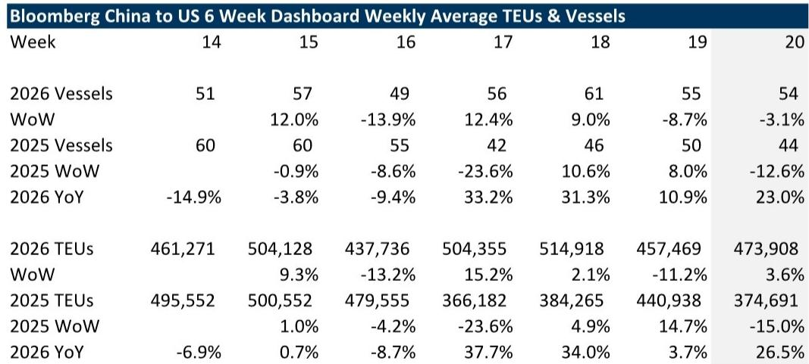
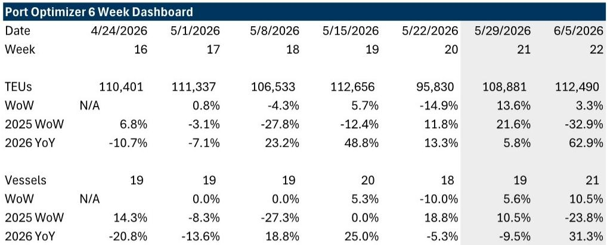

# Import Data Is Not a Demand Signal: What the Post-Liberation Day Surge Really Tells Us About the Next Phase of Global Trade

The weekly data from a global investment bank's tariff impact tracker shows laden vessels from China to the United States up 23% year-over-year as of late May 2026, with TEU volumes accelerating to +26.5% YoY. On the surface, this looks like a robust recovery in trans-Pacific trade. It is not. What we are witnessing is a powerful statistical illusion created by lapping the Liberation Day tariff shock of April 2025, layered on top of a genuine but fragile restocking cycle. The real story is not the YoY headline—it is the sequential volatility, the divergence between China and the rest of Asia, and the unresolved questions about what happens when the easy comparisons fade.

The critical insight for transport investors and supply chain strategists is this: the current data tells us more about what happened last year than what will happen next quarter. The double-digit YoY growth is a function of base effects, not demand acceleration. The sequential decline of 3% in laden vessels week-over-week, following a 9% decline the prior week, reveals a pattern of choppiness that is inconsistent with a sustainable volume inflection. The Port of Los Angeles data confirms this: imports are expected to rise 14% in the week of May 29, but only 3% two weeks out. The trajectory is decelerating.

The most important question the tracker raises is whether shippers are genuinely restocking or simply repositioning inventory in response to a shifting tariff landscape. The answer determines whether transport stocks have a durable earnings catalyst or merely a temporary reprieve.

## The Liberation Day Lap Produces a Statistical Sugar High That Will Dissipate by Mid-Third Quarter

The year-over-year comparisons are misleadingly favorable because they measure against the immediate aftermath of the April 2, 2025 Liberation Day tariff implementation. That event caused a sharp contraction in imports as shippers paused and reassessed. The current +23% vessel growth and +26.5% TEU growth are measured against that depressed base. When the data laps those low points, the YoY numbers will naturally compress, likely turning negative by late summer unless import volumes accelerate significantly in absolute terms.

The weekly dashboard data makes this dynamic explicit. In Week 20 of 2025, vessels from China to the US were down 12.6% sequentially, and TEUs were down 15%. The current week's comparisons benefit from that weakness. By Week 22 or 23 of 2026, the base becomes the recovery phase of 2025, when imports began rebounding. At that point, the YoY comparisons will tighten dramatically.

The implication for portfolio strategy is straightforward: investors who extrapolate the current YoY growth into a sustained volume recovery are making a statistical error. The earnings upgrades that some transport stocks have enjoyed may prove ephemeral if they are premised on this data. The real test will come in August and September, when the base effects normalize and we see whether underlying demand is actually strengthening.

## The China-Asia Divergence Reveals a Strategic Shift in Sourcing That Benefits Certain Transport Verticals

The most strategically significant data point in the tracker is not the aggregate China-to-US flow but the divergence between Mainland China and the rest of Asia. On a laden vessel basis, China was up 21% YoY on average, while Asia ex-China was flat. On a TEU basis, China was up 23% YoY versus only 6% for the rest of Asia. This gap is not random noise; it reflects a deliberate strategic calculus by shippers.

The explanation lies in the effective tariff rate differential created by the Sec. 122 tariffs and the uncertainty surrounding their 150-day expiration window. Countries with lower effective tariff rates—including Vietnam, South Korea, Taiwan, and Japan—should theoretically be gaining share as shippers diversify away from China. Yet the data shows the opposite: China is winning the volume battle in the near term. This suggests that the restocking wave is being driven by existing supply chain relationships and inventory positions that are heavily weighted toward China. The shift to alternative sourcing is happening, but it takes time to show up in the data.

For freight forwarders and logistics providers, this divergence creates a two-track opportunity. Companies that can manage complex, multi-country supply chain transitions will benefit from the secular shift to a China Plus One or Plus Two strategy. Meanwhile, those that are heavily exposed to China-centric volume may enjoy near-term tailwinds but face structural headwinds as diversification accelerates. The tracker's data suggests we are in the early innings of this transition, not the late stages.

## Geopolitical Risk Is a Price Driver, Not a Volume Driver, and the Two Must Be Disaggregated

The tracker correctly notes that ongoing geopolitical conflicts could push ocean and air rates higher, but it draws a crucial distinction that many market participants miss: the source of rate increases matters for investment conclusions. Rate increases driven by capacity constraints and fuel surcharges are fundamentally different from those driven by import demand.

The current crisis in the Middle East is not the Red Sea crisis redux. The Strait of Hormuz is not a material artery for liner networks, so the supply-side disruption is limited. The primary transmission mechanism is fuel costs, specifically bunker fuel. Higher fuel costs will push rates up, but they also compress carrier margins if they cannot fully pass through the increase. More importantly, higher energy costs are a demand destroyer for the American consumer, and consumer demand is the ultimate driver of import volumes.

The tracker's data shows ocean container rates up 13% sequentially and 14% YoY. This is a meaningful increase, but it is not yet a demand signal. It is a cost signal. The real risk is that sustained high fuel costs suppress consumer spending, which in turn reduces import demand in the second half of the year. This is the mechanism that could produce an "air pocket" in 2H25 or 2H26, as the tracker warns.

For transport investors, the key question is whether rate increases are translating into margin expansion for carriers and freight forwarders. If rates rise but volumes fall, the net effect on earnings is ambiguous. The tracker's data does not yet resolve this question, but it provides the framework for monitoring it.

## The Report Leaves Unanswered What Happens When the Sec. 122 Tariffs Expire and the Playbook Resets

The most consequential open question is what happens after the Sec. 122 tariffs expire in 150 days. The administration has not disclosed its post-expiration strategy, and this uncertainty is itself a drag on medium-term freight planning. Shippers cannot make multi-quarter inventory and sourcing decisions when the tariff regime is set to change.

The tracker acknowledges this but does not resolve it. The implication is that the current restocking wave may be front-loaded as shippers rush to bring in goods before the tariff regime shifts again. This would create a pull-forward dynamic similar to what we saw in 2025, followed by a demand vacuum. The sequential declines in vessels and TEUs in recent weeks could be the early signs of this pattern.

If the Sec. 122 tariffs are replaced with a permanent regime, the uncertainty resolves and shippers can plan. But the direction of the resolution matters enormously. A more protectionist regime would accelerate nearshoring and benefit domestic transport. A more moderate regime would restore the pre-2025 normal and benefit global freight. The tracker's data is consistent with both outcomes, which is why it is not yet a basis for conviction in either direction.

## A Decision Framework for Transport Investors: Three Signals to Watch in the Next 60 Days

The tracker's weekly data is noisy and volatile, but it can be organized into a decision framework that separates signal from noise. Investors should focus on three specific indicators over the next 60 days.

First, monitor the sequential trajectory of China-to-US vessels and TEUs, not the YoY comparisons. The YoY numbers will be distorted by base effects through early August. The sequential trend tells you whether restocking is accelerating or decelerating in real time. A sustained decline of more than 5% week-over-week for three consecutive weeks would be a cautionary signal.

Second, watch the Asia ex-China data for signs of diversification acceleration. If the flat-to-6% growth in the rest of Asia begins to accelerate while China's growth decelerates, that would confirm that the sourcing shift is gaining momentum. This would benefit freight forwarders with multi-country networks and domestic transport providers as manufacturing moves closer to the US.

Third, track the relationship between ocean rates and fuel costs. If rates rise faster than fuel costs, carriers are gaining pricing power and margins should expand. If rates rise in line with or slower than fuel costs, the rate increase is a pass-through, not a profit driver. The tracker's data on bunker fuel costs and ocean rates should be analyzed in tandem, not in isolation.

The framework is not predictive; it is diagnostic. It tells you what to look for, not what will happen. That is the appropriate stance given the uncertainty the report itself documents.

## Join the Community to Read the Full Report and Review the Original Charts

The weekly tracker contains high-frequency data that is impossible to replicate from public sources: daily laden vessel counts, TEU volumes, and port-level import projections that provide a real-time window into the most important trade corridor in the world. The exhibits in the full report show the volatility of these series over 18 months, revealing patterns that the text alone cannot convey. The divergence between China and Asia ex-China, the compression of sequential growth, and the relationship between rate movements and geopolitical events are all visible in the charts. Join the community to read the full report and review the original charts.

*This article is for learning and discussion only and does not constitute investment advice.*

Personal reading notes and learning share only. Not investment advice.

