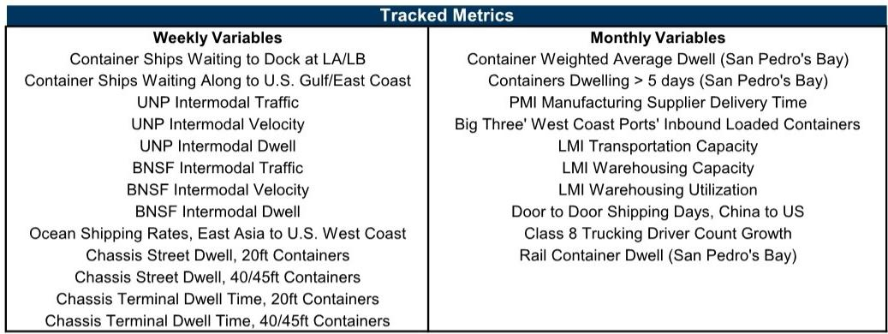
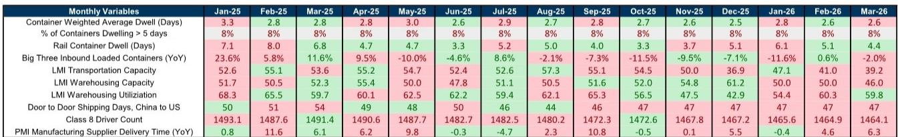
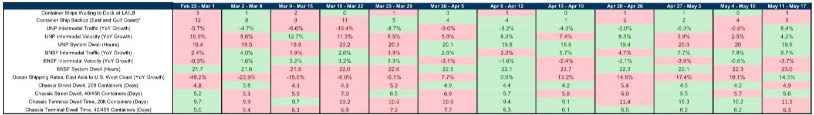

# 美国供应链瓶颈已降至疫情前水平，但真正的结构性压力才刚刚开始显现

过去三年，全球供应链从极度拥堵回归常态的速度，比大多数人的预期更快。某外资投行的最新供应链拥堵指数显示，截至5月最后一周，其周度瓶颈指数维持在“2”的水平——这是自2021年1月以来从未有过的低位，与2020年初疫情爆发前的基准线几乎重合。

这份报告的核心判断是：供应链的“量”已经正常化，但“价”和“结构”正在酝酿新的分化。市场目前定价的只是拥堵消退，却尚未充分计入两个正在叠加的变量——关税对贸易流向的重塑，以及运力供给侧的缓慢但不可逆的收缩。

对于关注全球贸易、物流、制造业和资产定价的读者而言，理解当前这个“2”与2020年那个“2”的本质不同，比盯着指数本身更重要。

## 1. 拥堵指数回到了疫情前，但驱动因素已经完全不同

2021年底，该投行的供应链瓶颈指数曾达到10的峰值——当时超过100艘集装箱船在洛杉矶和长滩港外排队，铁路堆场滞留天数以周计，海运运费同比涨幅超过500%。而现在，指数仅为2，西海岸港口等待靠泊的集装箱船数量从0变为1，东海岸从4增加到5。铁路联运量同比增速从前一周的约3%加速到约9%，但绝对值仍然温和。

如果将近期数据与2020年5月的“2”做一个简单的对比，会发现一个关键差异：2020年的低拥堵是因为需求突然冻结，而现在的低拥堵是因为供给端在过去三年经历了大规模扩张和效率修复。港口基础设施投资、数字化调度、多式联运协同等结构性改善，使得吞吐能力远高于疫情前。换句话说，即使需求恢复到疫情前的趋势线，拥堵指数也可能长期维持在低位。

但这并不意味着供应链问题已经“解决”。真正值得关注的是，在运力供给已经相对充裕的情况下，任何新的需求冲击或贸易路线调整，都可能在不引起广泛注意的情况下，在局部环节制造新的瓶颈。报告明确指出，当前指数的低水平“严重依赖于需求能否正常化以及全球贸易能否稳定”——这是一个值得反复咀嚼的限定条件。

## 2. 铁路联运量加速增长，背后可能不只是需求恢复

报告中最引人注意的数据点之一是西海岸一级铁路的联运量增速。联合太平洋铁路和伯灵顿北方圣塔菲铁路的联运量同比增速，从前一周的约3%跃升至约9%。其中联合太平洋铁路从几乎零增长跳升到+8.4%，伯灵顿北方圣塔菲铁路从+7.8%进一步加速至+9.7%。

表面上看，这是需求回暖的信号。但这里需要提出一个尚未被完全回答的问题：这一增速是否部分反映了关税预期下的“抢运”效应？报告本身在讨论部分明确提到，关税和地缘政治冲突对货运需求和时间节点的影响，是当前“关键问题”之一。如果企业为了规避新关税而提前发货，那么铁路联运量的短期加速可能只是前置需求，而非真实消费的持续改善。

从历史数据看，2024年下半年至2025年初，铁路联运量增速曾达到两位数，而后在2025年下半年迅速回落至负增长。这种“脉冲式”波动，与关税威胁的时间线高度吻合。如果当前增速的驱动因素与此类似，那么未来几个季度可能出现需求透支后的回落——这对铁路运营商、仓储物流企业以及依赖进口的制造商的库存管理策略，都有直接含义。

## 3. 海运运费增速放缓，但绝对水平仍在上行通道

另一个值得拆解的信号是海运运费的变化。报告显示，从东亚到美国西海岸的集装箱即期运费同比增速，从前一周的+18%放缓至+14%。从方向上看，这是增速的放缓，而非绝对水平的下降。

结合更长时间维度的数据来看，2024年下半年运费曾一度陷入同比负增长（低至-48%），而在2025年1月之后逐步转正并加速上行，到5月达到约+18%的峰值。当前14%的增速仍然处于近一年来的相对高位。这意味着，虽然拥堵指数已经回到低位，但运费的定价逻辑已经从“拥堵溢价”切换到了“结构性供需再平衡”。

这里的关键洞察是：运费不再反映港口拥堵的“量”，而是反映船公司运力管控、环保法规带来的有效运力减少、以及航线调整带来的成本上升。报告没有完全展开讨论的是，如果关税导致更多贸易从跨太平洋航线转向其他路线（如近岸外包或亚洲区域内航线），那么现有运力分布将出现错配，某些航线的运费可能持续高企，而另一些航线则面临运力过剩。这种分化，才是投资者真正需要关注的二阶效应。

## 4. 月度滞后指标显示了一个被忽视的结构性风险：仓储利用率与运输能力正在背离

报告提供了截至3月的月度滞后指标，其中一组数据值得单独拎出来看：物流经理指数中的运输能力指数从2月的55.1下降到3月的53.6（仍高于50的荣枯线），而仓储利用率指数则从65.5大幅下降至59.7。同时，仓储能力指数从50.5上升到52.3。

翻译成更直白的语言：运输能力仍然相对充裕，但仓储空间正在变得不那么紧张，利用率明显下降。这看似是“好事”，但结合另一个数据——从中国到美国的门到门运输天数已经从2025年初的51天下降到约47天，接近疫情前水平——会发现一个潜在的结构性矛盾：运输效率提升叠加仓储利用率下降，意味着整个供应链的“库存缓冲”正在被压缩。

在低库存缓冲的环境下，任何意外的需求冲击或供应中断，都可能比过去引发更剧烈的价格波动。这不是危言耸听——2021年供应链危机的起点，正是从“库存刚好够用”的状态开始。报告中的月度数据虽然滞后，但趋势方向是一致的。对于制造业企业而言，这一信号意味着“准时制”库存管理策略的风险正在重新上升，而“安全库存”的必要性可能被低估。

## 5. 报告尚未完全回答的关键问题：关税影响如何量化，以及“1”是否会成为新常态

报告在讨论部分提出了一个前瞻性判断：如果供应链压力持续缓解，“可以想象指数在2026年更持续地停留在‘1’的区间”。这是一个大胆的预测，因为指数为“1”意味着供应链完全通畅，与疫情前的最佳状态一致。

但报告也明确指出了实现这一情景的前提条件：“关税和地缘政治冲突对需求和货运时间的影响”需要得到有效控制。这里存在两个尚未被充分量化的不确定性：

第一，关税对贸易流量的影响是非线性的。如果关税导致部分商品从中国直接出口转向通过东南亚中转，或者从海运转向铁路和空运，那么现有的拥堵指标可能无法及时捕捉到这些结构性变化。报告跟踪的指标主要基于西海岸港口和铁路，对东海岸和墨西哥湾的覆盖相对有限，而这些区域正是近岸外包和贸易转移的主要受益者。

第二，运力供给侧的长期趋势是收缩还是扩张？环保法规（如国际海事组织的碳强度指标）正在加速老旧船舶拆解，而新船订单的交船周期在2-3年。如果需求在2026年出现超预期回升，而有效运力增长有限，那么即使港口不拥堵，运费也可能重新上行。报告对此着墨不多，但这是理解“1”是否可持续的核心变量。

## 6. 一个实用的观察框架：从“拥堵指数”转向“运费-运力-库存”三角

对于没有时间逐周追踪数据的读者，这里提供一个更简洁的观察框架。当前阶段，关注的重点应该从“港口排了多少船”转向三个更前置的指标：

第一，运费与运力的背离程度。如果运费持续上涨而拥堵指数维持低位，说明定价权正在从“拥堵”转向“运力控制”。这是船公司盈利能力改善的信号，但对货主是成本压力。

第二，仓储利用率与运输效率的相对变化。如果仓储利用率持续下降而运输天数保持稳定，说明供应链效率在提升，但也意味着缓冲空间在缩小。一旦运输效率出现扰动，库存风险会快速暴露。

第三，铁路联运量的波动方向。如果联运量增速在关税预期消退后出现明显回落，而公路运输量没有同步下降，说明贸易路线正在发生结构性调整。这对不同运输方式的投资价值有直接影响。

这三个维度结合起来，可以帮助判断当前供应链的“正常化”究竟是可持续的均衡，还是暴风雨前的宁静。

---

这份报告的完整版本包含了更详细的周度指标数据、月度滞后变量的趋势图表，以及按运输子行业分类的深度分析。报告中关于铁路服务指标的混合信号、底盘滞留时间的区域差异、以及月度PMI供应商交货时间的变化，都包含了尚未在本文中展开的洞察。

如果你希望在社群中继续讨论这些未解问题——比如关税对贸易流量的量化影响、运力供给侧的长期趋势、以及不同运输子行业的投资含义——欢迎来星球微信群里继续讨论。我们会定期分享对这些周度指标的跟踪解读，以及基于原始数据的独立判断。

Personal reading notes and learning share only. Not investment advice.

