US EQUITY VIEWS

# Earnings growth paves a bumpy path to higher returns

Continued earnings growth should drive continued equity market upside. We expect the S&P 500 will rise by 6% to our revised year-end target of 8000. Our previous target was 7600. The increased return forecast reflects increased estimates for S&P 500 earnings following an exceptionally strong Q1 reporting season. We raise our S&P 500 EPS forecasts to \$340 (+24% year/year) in 2026 and \$385 (+13%) in 2027. The beneficiaries of AI infrastructure investment will account for roughly half of S&P 500 EPS growth this year.

Valuation multiples have declined since the start of the year, and we expect little expansion in coming months. Year to date, the S&P 500 has risen by $10\%$ , forward EPS estimates have risen by $15\%$ , and the P/E multiple has declined by $4\%$ . Our return forecasts incorporate a P/E multiple that remains close to the current 21x. The combination of decelerating earnings growth and continued uncertainty around both AI and the macroeconomic outlook should prevent a major increase in valuations. AI sentiment and interest rates create risks in both directions.

The conditions that have marked the ends of high-valuation, high-concentration bull markets in the past remain mostly absent today, although some of those conditions appear to be drawing closer. Two of those dynamics are speculative mania and deteriorating macro fundamentals. Despite the sharp recent market rally, measures of froth including our Speculative Trading Indicator remain well below prior highs. Likewise, while IPO activity is increasing, recent issuance has been modest. Fundamentally, earnings strength has been the key differentiator between the recent market run and similar narrow rallies in the past. However, the earnings-driven outperformance of AI infrastructure stocks also raises their hurdle going forward, and the oil shock threatens to create the conditions of disappointing growth and tightening financial conditions that have marked the ends of previous bull markets.

The equity market outlook argues for owning exposure to earnings-driven upside with an eye toward risk management. Tactically, a number of factors argue for moderating equity market returns in coming months, including the strength of the recent Momentum-driven rally and midterm election seasonality. However, investor sentiment remains moderate, and an improvement in the geopolitical outlook would extend the market upswing. Low implied volatility makes implementing or hedging views with options an attractive strategy. Within equity portfolios, the stocks with the strongest earnings revisions have generally outperformed YTD, and we expect this will remain the pattern going forward. Among firms involved in the AI build-out, the hyperscalers and stocks tied to investment in

# Ben Snider

+1(212)357-1744 | ben.snider@gs.com
GS & Co. LLC

# Ryan Hammond

+1(212)902-5625 | ryan.hammond@gs.com GS & Co. LLC

# Jenny Ma

+1(212)357-5775 | jenny.ma@gs.com
GS & Co. LLC

# Daniel Chavez

+1(212)357-7657 | daniel.chavez@gs.com GS & Co. LLC

# Kartik Jayachandran

+1(212)855-7744 |  
kartik.jayachandran@gs.com  
GS & Co. LLC

# Christophe Sung

+1(212)902-3841 | christophe.sung@gs.com GS & Co. LLC

power infrastructure stand out as attractive opportunities. To balance AI exposures, investors should also own equities with earnings tailwinds and minimal correlation to the AI trade, such as the stocks in our “insensitive portfolio.”

# Raising our S&P 500 earnings and return forecasts

Continued earnings growth should drive continued equity market upside. We expect the S&P 500 will return 6% to our revised year-end target of 8000, up from 7600 previously. The revised target is driven by our increased EPS forecasts of \$340 in 2026 (+24% year/year growth) and \$385 in 2027 (+13%). Our 3-, 6-, and 12-month return forecasts are 1% (7600), 6% (8000), and 10% (8300).

Exhibit 1: Continued earnings growth should drive continued equity market upside   
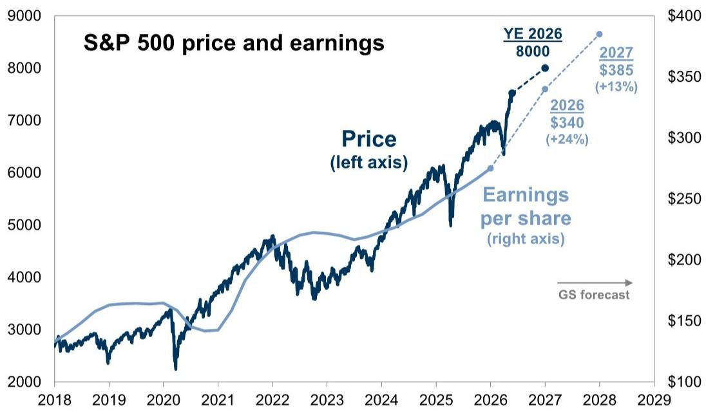

line

| Year | Price | Earnings per share |
|------|-------|---------------------|
| YE 2026 | 8000 | - |
| 2026 | 340 | +24% |
| 2027 | 385 | +13% |

Source: Compustat, GS Global Investment Research

Earnings growth has powered the entire S&P 500 return so far this year, and we expect this dynamic will continue in coming months. YTD, the increase in consensus forward EPS estimates has outpaced the S&P 500 price gain, resulting in a decline in the P/E multiple. In fact, during the past two years, near-term earnings growth has arithmetically accounted for the entire $40\%$ rise in the S&P 500, with today's 21x S&P 500 P/E multiple matching its multiple in May 2024. Going forward, our base case is for a market multiple that remains flat as the valuation tailwind from modestly lower Treasury yields is offset by the valuation headwind from decelerating economic and earnings growth, investor skepticism about the persistence of earnings tied to the AI infrastructure build-out, and continued uncertainty around both AI disruption and the geopolitical outlook.

Exhibit 2: Earnings estimates have outpaced recent equity market appreciation   
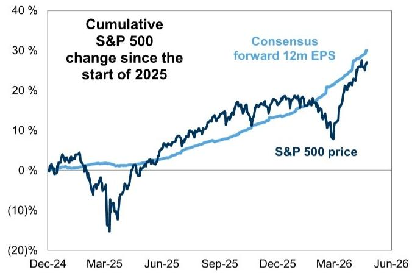

line

| Date    | S&P 500 price | Consensus forward 12m EPS |
|---------|---------------|---------------------------|
| Jun-26  | ~30%          | ~30%                      |

Source: FactSet, GS Global Investment Research

Exhibit 3: YTD change in S&P 500 price, earnings estimates, and P/E multiple   
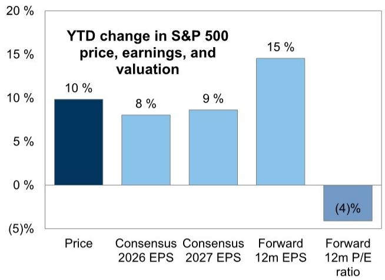

bar

YTD change in S&P 500 price, earnings, and valuation
| Category | YTD change (%) |
|---|---|
| Price | 10 |
| Consensus 2026 EPS | 8 |
| Consensus 2027 EPS | 9 |
| Forward 12m EPS | 15 |
| Forward 12m P/E ratio | -4 |

Source: FactSet, GS Global Investment Research

The recent equity market return has been narrow, but both its magnitude and composition have been driven primarily by earnings strength. Since the start of the war on February 27, the S&P 500 has returned $9\%$ , S&P 500 stocks involved in the AI infrastructure build-out have returned $33\%$ , and the equal-weight S&P 500 has returned just $1\%$ . However, the $33\%$ rally of S&P 500 AI infrastructure stocks has occurred alongside a $30\%$ increase in consensus forward earnings for the group.

Exhibit 4: Earnings strength has driven the YTD outperformance of the AI infrastructure complex   
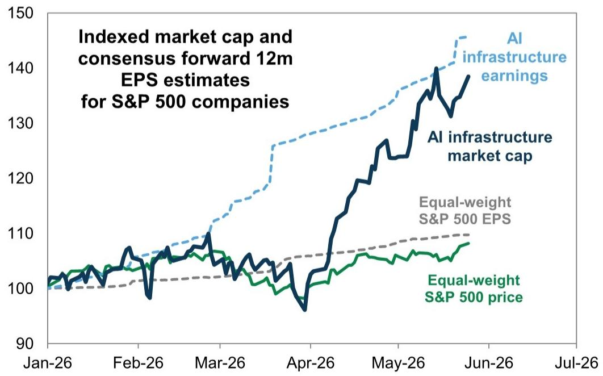

line

| Date   | AI infrastructure market cap | AI infrastructure earnings | Equal-weight S&P 500 EPS | Equal-weight S&P 500 price |
|--------|------------------------------|-----------------------------|--------------------------|----------------------------|
| Jan-26 | ~102                         | ~101                        | ~100                     | ~101                       |
| Feb-26 | ~107                         | ~105                        | ~101                     | ~103                       |
| Mar-26 | ~110                         | ~112                        | ~102                     | ~105                       |
| Apr-26 | ~98                          | ~125                        | ~103                     | ~104                       |
| May-26 | ~125                         | ~135                        | ~105                     | ~106                       |
| Jun-26 | ~140                         | ~145                        | ~108                     | ~108                       |
| Jul-26 | ~138                         | ~148                        | ~109                     | ~109                       |

Source: FactSet, GS Global Investment Research

The conditions that have marked the ends of past bull markets remain mostly absent today, although some yellow flags have recently begun to appear. The market trades at a lower near-term valuation multiple than it did at the start of the year, but the

P/E remains very elevated relative to history, as does the degree of equity market concentration. In broad terms, there are two recurring dynamics that typically characterize the ends of high-valuation, high-concentration bull markets. The first is an excess of speculative risk-taking that skews the distribution of market outcomes to the downside. The second is a deteriorating fundamental backdrop that has historically included a tightening Fed and a weakening outlook for earnings growth.

Exhibit 5: Current equity market valuations, concentration, and recent returns are reminiscent of past overextended markets   

line

| Year | Average Percentile Rank |
| ---- | ------------------------ |
| 1929 | ~80                      |
| 1973 | ~65                      |
| 1987 | ~70                      |
| 2000 | ~95                      |
| 2021 | ~85                      |

Source: GS Global Investment Research

The recent surges in investor risk appetite and the Momentum factor are two possible hints of speculative excess. The strength of the AI trade that has recently propelled the S&P 500 higher has also driven a narrowing of market breadth and a sharp rise in the Momentum factor, two dynamics that have historically signaled elevated market risk. In addition, while S&P 500 earnings estimates have risen more quickly than index price appreciation, the Semiconductor stocks at the heart of the AI infrastructure complex have recently outpaced their forward earnings.

However, speculative sentiment today appears far less extreme than at the ends of past overextended markets. For example, while retail trading activity has recently increased, it remains below historical and recent highs. Our Speculative Trading Indicator shows a similar pattern. Likewise, while the IPO calendar has been a major focus of recent investor conversations, capital markets activity has recently been light relative to past cycles. Although we expect a record year of issuance in 2026, we view that supply as a risk rather than a reason for pessimism, and expect corporate equity demand will outweigh supply this year.

Exhibit 6: Speculative Trading Indicator is well below recent and historical highs   
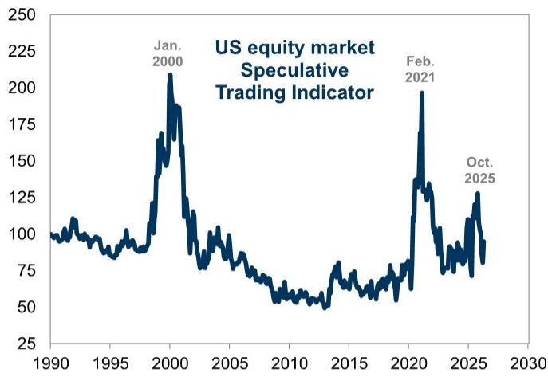

line

| Date       | Value |
| ---------- | ----- |
| Jan. 2000  | 210   |
| Feb. 2021  | 200   |
| Oct. 2025  | 130   |

Source: GS Global Investment Research

Exhibit 7: IPO activity has been relatively modest   
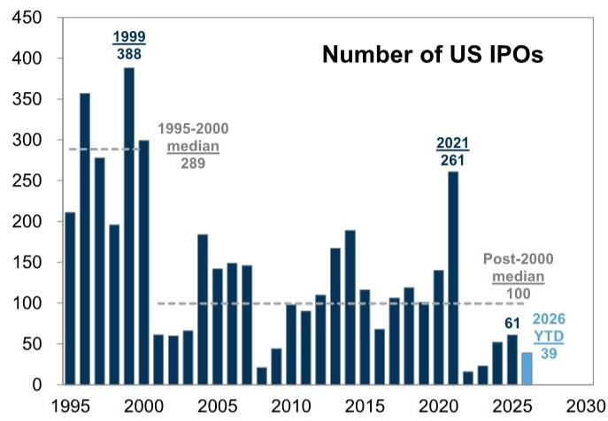

bar

Number of US IPOs
| Year | Number of IPOs |
| :--- | :--- |
| 1995 | 210 |
| 1996 | 358 |
| 1997 | 278 |
| 1998 | 196 |
| 1999 | 388 |
| 2000 | 300 |
| 2001 | 60 |
| 2002 | 60 |
| 2003 | 66 |
| 2004 | 184 |
| 2005 | 142 |
| 2006 | 148 |
| 2007 | 146 |
| 2008 | 21 |
| 2009 | 44 |
| 2010 | 98 |
| 2011 | 88 |
| 2012 | 110 |
| 2013 | 166 |
| 2014 | 191 |
| 2015 | 117 |
| 2016 | 68 |
| 2017 | 104 |
| 2018 | 118 |
| 2019 | 99 |
| 2020 | 139 |
| 2021 | 261 |
| Post-2000 median: 100 | 
| 2026 YTD: 39 | 
| 2026 YTD: 61 | 
| 2026 YTD: 39 | 
| 1995-2000 median: 289 |

Source: FactSet, GS Global Investment Research

# Earnings strength has been the key differentiator between the recent market run and similar narrow rallies in the past, but today's fundamental outlook also embeds

risks. The increase in energy prices resulting from the closure of the Strait of Hormuz should result in weaker consumer spending, more pressure on profit margins, higher inflation, and less Fed easing than we had expected coming into the year. Although our economists' base case remains constructive, the downside risks to the economic outlook also threaten to create the conditions of tightening monetary policy and growth disappointments that have characterized the ends of past overextended markets.

# Exhibit 8: Positive earnings revisions have recently outnumbered negative revisions

Revision breadth calculated based on changes in the last month to consensus FY2 EPS estimates as [(# pos. revisions - # neg. revisions)/ total revisions]

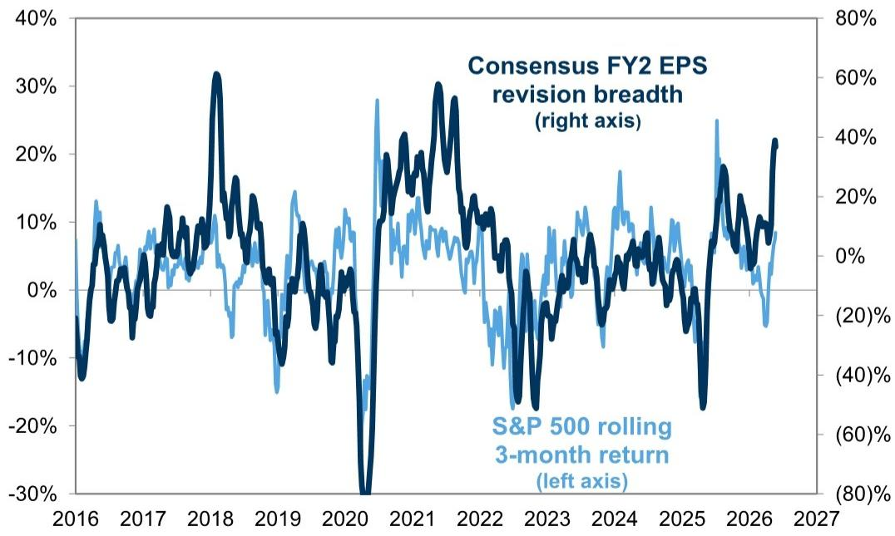

line

| Year | Consensus FY2 EPS revision breadth (right axis) | S&P 500 rolling 3-month return (left axis) |
|------|--------------------------------------------------|---------------------------------------------|
| 2016 | ~-15%                                            | ~-10%                                       |
| 2017 | ~10%                                             | ~5%                                         |
| 2018 | ~30%                                             | ~10%                                        |
| 2019 | ~-10%                                            | ~-5%                                        |
| 2020 | ~-30%                                            | ~-20%                                       |
| 2021 | ~30%                                             | ~10%                                        |
| 2022 | ~-15%                                            | ~-10%                                       |
| 2023 | ~-20%                                            | ~-15%                                       |
| 2024 | ~15%                                             | ~10%                                        |
| 2025 | ~-15%                                            | ~-10%                                       |
| 2026 | ~25%                                             | ~15%                                        |
| 2027 | ~40%                                             | ~30%                                        |

Source: FactSet, GS Global Investment Research

Tactically, there are a number of reasons to expect US equity market returns to moderate in coming months. In addition to the historical signals from Momentum and the Risk Appetite Indicator, the outlook for decelerating economic activity in coming months points to decelerating equity market gains. The large recent increases in AI capex estimates and associated earnings forecasts also create a high bar to sustain the pace of upward revisions going forward. In addition, historical equity market seasonality, especially ahead of midterm elections, argues for weaker returns in the months ahead.

However, our base case is for US equities to generate positive returns on net through year-end. Our US equity Sentiment Indicator currently registers just 0.3, pointing to modest investor positioning. An improvement in the geopolitical outlook or dovish shift in rate market pricing would spur further equity market upside. The wide array of tactical risks around the positive baseline outlook argues for implementing or hedging views with options, and an outlook for structurally higher volatility adds to that case.

Exhibit 9: Economic deceleration typically signals smaller, earnings-driven equity returns   
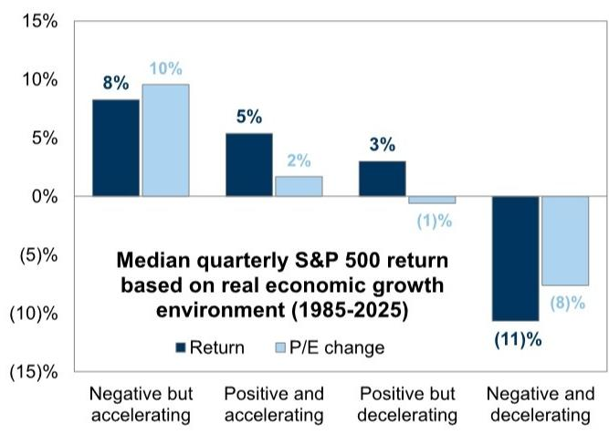

bar

Median quarterly S&P 500 return based on real economic growth environment (1985-2025)
| Category | Return (%) | P/E change (%) |
|---|---|---|
| Negative but accelerating | 8 | 10 |
| Positive and accelerating | 5 | 2 |
| Positive but decelerating | 3 | -1 |
| Negative and decelerating | -11 | -8 |

Economic growth environment classified based on average quarterly level and change of GS US Current Activity Indicator

Exhibit 10: Equities typically trade sideways in the months ahead of midterm elections   
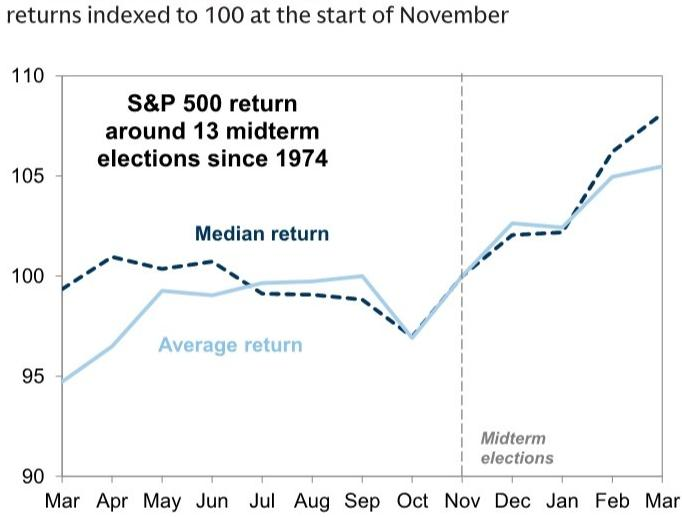

line

| Month | Median return | Average return |
|-------|---------------|----------------|
| Mar   | 99.5          | 95.0           |
| Apr   | 101.0         | 96.5           |
| May   | 100.5         | 99.0           |
| Jun   | 101.0         | 98.5           |
| Jul   | 99.5          | 99.0           |
| Aug   | 99.0          | 99.5           |
| Sep   | 98.5          | 100.0          |
| Oct   | 97.0          | 97.0           |
| Nov   | 100.0         | 100.0          |
| Dec   | 102.5         | 102.5          |
| Jan   | 102.0         | 102.0          |
| Feb   | 106.0         | 104.5          |
| Mar   | 108.0         | 105.5          |

Source: GS Global Investment Research   
Source: GS Global Investment Research

Within the equity market, the sectors and stocks with the strongest earnings revisions have generally outperformed, and we expect this will remain the case going forward. The likelihood that macro and micro uncertainty remain elevated further our view that the trajectory of near-term earnings will determine the trajectory of equity prices.

Exhibit 11: Stocks with the strongest earnings revisions have generally outperformed in recent months   
sector-neutral, equal-weight portfolios of S&P 500 stocks with top vs. bottom quintile FY2 EPS revisions   
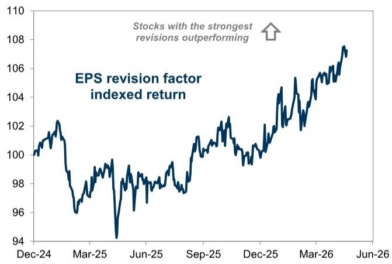

line

| Date   | EPS revision factor indexed return |
|--------|-------------------------------------|
| Jun-26 | 108                                 |

Source: GS Global Investment Research

Exhibit 12: Incremental market cap vs. incremental earnings since the start of the AI boom   
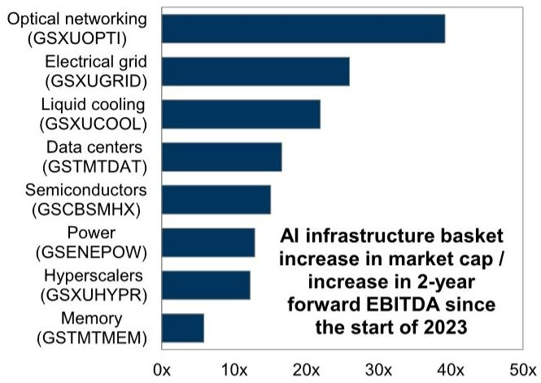

bar

AI infrastructure basket increase in market cap / increase in 2-year forward EBITDA since the start of 2023
| Component | Increase in Market Cap / Increase in 2-Year Forward EBITDA |
| :--- | :--- |
| Optical networking (GSXUOPTI) | 39x |
| Electrical grid (GSXUGRID) | 26x |
| Liquid cooling (GSXUCOOL) | 22x |
| Data centers (GSTMTDAT) | 17x |
| Semiconductors (GSCBSMHX) | 15x |
| Power (GSENEPOW) | 13x |
| Hyperscalers (GSXUHYPR) | 12x |
| Memory (GSTMTMEM) | 6x |

Baskets developed by GBM   
Source: GS FICC and Equities, GS Global Investment Research

# Among firms involved in the AI build-out, stocks tied to investment in power infrastructure and the hyperscalers stand out as particularly attractive

opportunities. Among stocks tied to the AI infrastructure build out, these groups, along with some of the Semiconductors, have experienced the smallest increase in market cap relative to incremental earnings since the start of the AI boom. While many of the Semiconductors at the heart of the AI trade have recently benefited from an increase in valuations, the hyperscalers have collectively rallied by less than the increase in forward earnings estimates.

Exhibit 13: The recent rally in Semiconductors has overshot near-term EPS revisions   
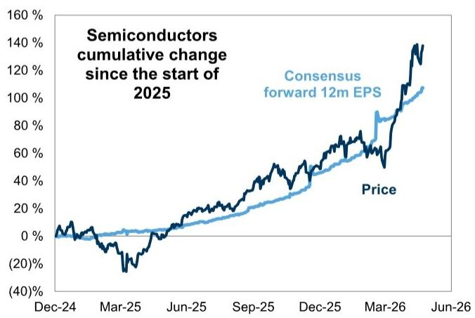

line

| Date   | Price  | Consensus forward 12m EPS |
|--------|--------|--------------------------|
| Dec-24 | ~0%    | ~0%                      |
| Mar-25 | ~-20%  | ~0%                      |
| Jun-25 | ~10%   | ~10%                     |
| Sep-25 | ~30%   | ~20%                     |
| Dec-25 | ~50%   | ~40%                     |
| Mar-26 | ~80%   | ~70%                     |
| Jun-26 | ~100%  | ~110%                    |

Source: FactSet, GS Global Investment Research

Exhibit 14: Average hyperscaler share price returns have lagged consensus earnings growth   
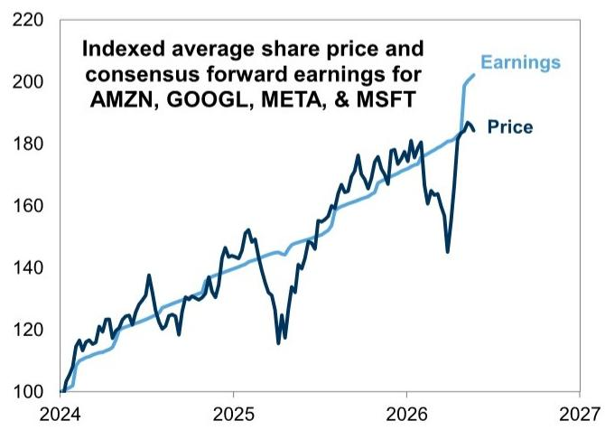

line

| Year | Earnings | Price |
|------|----------|-------|
| 2024 | 100      | 100   |
| 2025 | 140      | 130   |
| 2026 | 180      | 170   |
| 2027 | 200      | 190   |

Source: FactSet, GS Global Investment Research

However, against a backdrop of extremely elevated return dispersion, we believe investors should manage risks by diversifying portfolios beyond AI infrastructure companies. The backdrop of narrow market breadth points to continued Momentum factor volatility. In addition, with the earnings season behind us, the most likely positive macro catalyst in the near-term is an improvement in the geopolitical outlook, which would create a stronger short-term uplift for cyclical stocks like Consumer Discretionary companies than for AI companies. Exhibit 16 below shows the companies in our “insensitive portfolio” with strong recent earnings momentum but minimal correlation to the AI trade.

# Exhibit 15: Return dispersion is elevated relative to history

return dispersion calculated as two times the cross-sectional standard deviation of S&P 500 constituent trailing returns

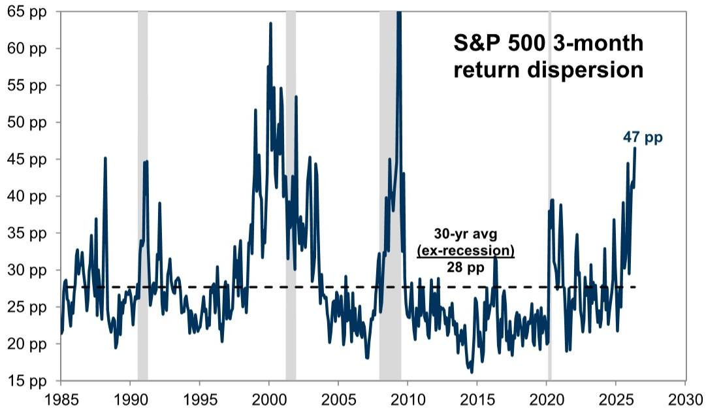

line

| Year | Return Dispersion (pp) |
|------|------------------------|
| 2025 | 47                     |

Source: GS Global Investment Research

Exhibit 16: Insensitive Portfolio

Russell 1000 stocks with low price sensitivity to AI and market pricing of growth, consensus 2026 and 2027 EPS growth of at least 5%, and upward recent revisions to 2026 and 2027 EPS estimates

<table><tr><td rowspan="2">Company</td><td rowspan="2">Ticker</td><td rowspan="2">Sector</td><td rowspan="2">Mkt cap (bn)</td><td rowspan="2">returns driven by US economic outlook and AI</td><td rowspan="2">YTD total return</td><td colspan="2">Consensus EPS growth</td><td colspan="2">3m revision to consensus EPS</td><td rowspan="2">Fwd 12m P/E</td></tr><tr><td>2026</td><td>2027</td><td>2026</td><td>2027</td></tr><tr><td>Permian Resources Corp</td><td>PR</td><td>Energy</td><td>$17</td><td>4 %</td><td>47 %</td><td>29 %</td><td>25 %</td><td>50 %</td><td>44 %</td><td>11 x</td></tr><tr><td>Matador Resources Company</td><td>MTDR</td><td>Energy</td><td>7</td><td>3</td><td>35</td><td>27</td><td>14</td><td>66</td><td>33</td><td>7</td></tr><tr><td>Darling Ingredients Inc</td><td>DAR</td><td>Consumer Staples</td><td>9</td><td>13</td><td>63</td><td>1030</td><td>10</td><td>52</td><td>29</td><td>13</td></tr><tr><td>Neurocrine Biosciences, Inc.</td><td>NBIX</td><td>Health Care</td><td>16</td><td>13</td><td>10</td><td>63</td><td>25</td><td>31</td><td>25</td><td>19</td></tr><tr><td>Cognex Corp</td><td>CGNX</td><td>Information Technology</td><td>11</td><td>15</td><td>84</td><td>45</td><td>20</td><td>19</td><td>17</td><td>41</td></tr><tr><td>Etsy, Inc.</td><td>ETSY</td><td>Consumer Discretionary</td><td>6</td><td>17</td><td>13</td><td>152</td><td>15</td><td>16</td><td>16</td><td>17</td></tr><tr><td>Newmont Corp</td><td>NEM</td><td>Materials</td><td>115</td><td>17</td><td>8</td><td>52</td><td>14</td><td>10</td><td>13</td><td>10</td></tr><tr><td>Reddit, Inc.</td><td>RDDT</td><td>Communication Services</td><td>27</td><td>20</td><td>(38)</td><td>88</td><td>31</td><td>20</td><td>12</td><td>26</td></tr><tr><td>Cboe Global Markets Inc</td><td>CBOE</td><td>Financials</td><td>37</td><td>8</td><td>43</td><td>25</td><td>6</td><td>14</td><td>12</td><td>26</td></tr><tr><td>Archer-Daniels-Midland Company</td><td>ADM</td><td>Consumer Staples</td><td>37</td><td>16</td><td>37</td><td>34</td><td>15</td><td>14</td><td>12</td><td>16</td></tr><tr><td>Chewy, Inc.</td><td>CHWY</td><td>Consumer Discretionary</td><td>9</td><td>11</td><td>(37)</td><td>54</td><td>38</td><td>9</td><td>11</td><td>21</td></tr><tr><td>Celanese Corp</td><td>CE</td><td>Materials</td><td>6</td><td>19</td><td>24</td><td>54</td><td>10</td><td>30</td><td>11</td><td>8</td></tr><tr><td>Centene Corp</td><td>CNC</td><td>Health Care</td><td>29</td><td>6</td><td>44</td><td>67</td><td>29</td><td>16</td><td>10</td><td>15</td></tr><tr><td>Fox Corp</td><td>FOXA</td><td>Communication Services</td><td>27</td><td>16</td><td>(12)</td><td>9</td><td>5</td><td>9</td><td>10</td><td>11</td></tr><tr><td>Bunge Global SA</td><td>BG</td><td>Consumer Staples</td><td>23</td><td>15</td><td>37</td><td>21</td><td>20</td><td>13</td><td>8</td><td>12</td></tr><tr><td>West Pharmaceutical Services, Inc.</td><td>WST</td><td>Health Care</td><td>22</td><td>15</td><td>15</td><td>18</td><td>11</td><td>8</td><td>8</td><td>35</td></tr><tr><td>Anglogold Ashanti PLC</td><td>AU</td><td>Materials</td><td>46</td><td>15</td><td>8</td><td>101</td><td>6</td><td>4</td><td>8</td><td>8</td></tr><tr><td>Globus Medical Inc</td><td>GMED</td><td>Health Care</td><td>12</td><td>16</td><td>(3)</td><td>19</td><td>9</td><td>9</td><td>7</td><td>17</td></tr><tr><td>Eli Lilly and Company</td><td>LLY</td><td>Health Care</td><td>1,003</td><td>9</td><td>(1)</td><td>51</td><td>22</td><td>7</td><td>6</td><td>27</td></tr><tr><td>Post Holdings, Inc.</td><td>POST</td><td>Consumer Staples</td><td>4</td><td>19</td><td>(2)</td><td>8</td><td>14</td><td>5</td><td>5</td><td>12</td></tr><tr><td>New York Times Company</td><td>NYT</td><td>Communication Services</td><td>12</td><td>6</td><td>9</td><td>16</td><td>12</td><td>6</td><td>5</td><td>25</td></tr><tr><td>Targa Resources Corp.</td><td>TRGP</td><td>Energy</td><td>59</td><td>7</td><td>51</td><td>23</td><td>12</td><td>6</td><td>5</td><td>25</td></tr><tr><td>Casey&#x27;s General Stores, Inc.</td><td>CASY</td><td>Consumer Staples</td><td>30</td><td>8</td><td>50</td><td>15</td><td>11</td><td>4</td><td>4</td><td>41</td></tr><tr><td>Cardinal Health, Inc.</td><td>CAH</td><td>Health Care</td><td>47</td><td>3</td><td>(2)</td><td>20</td><td>12</td><td>4</td><td>4</td><td>17</td></tr><tr><td>Texas Pacific Land Corp</td><td>TPL</td><td>Energy</td><td>28</td><td>8</td><td>40</td><td>31</td><td>11</td><td>10</td><td>3</td><td>42</td></tr><tr><td>Fortinet, Inc.</td><td>FTNT</td><td>Information Technology</td><td>98</td><td>19</td><td>69</td><td>14</td><td>9</td><td>6</td><td>3</td><td>41</td></tr><tr><td>Avis Budget Group, Inc.</td><td>CAR</td><td>Industrials</td><td>6</td><td>9</td><td>30</td><td>12</td><td>87</td><td>11</td><td>3</td><td>28</td></tr><tr><td>List median</td><td></td><td></td><td>$23</td><td>13 %</td><td>24 %</td><td>29 %</td><td>14 %</td><td>10 %</td><td>10 %</td><td>17 x</td></tr><tr><td>Russell 1000 median</td><td></td><td></td><td>17</td><td>30</td><td>3</td><td>10</td><td>12</td><td>1</td><td>1</td><td>17</td></tr></table>

Source: FactSet, GS Global Investment Research

# S&P 500 earnings

S&P 500 earnings growth was exceptionally strong in Q1 2026. S&P 500 EPS growth in Q1 2026 is tracking +18% year/year, excluding some idiosyncratic one-time benefits. Even without the tailwinds from the largest technology stocks, the median S&P 500 company is on track to grow earnings by +14% year/year, the strongest quarterly growth rate in the past decade outside of the boost following the TCJA tax cuts in 2018 and the COVID reopening period in 2021.

Exhibit 17: Earnings growth was exceptionally strong in Q1   
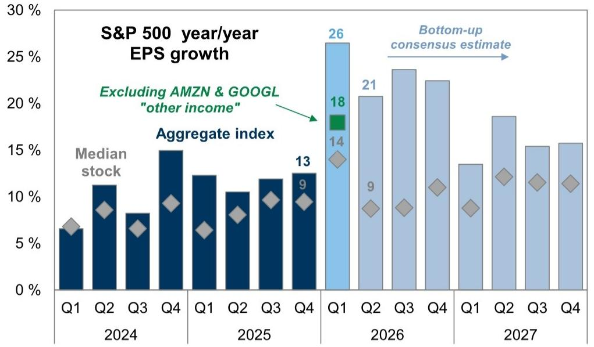

bar

| Quarter | S&P 500 year/year EPS growth (%) |
| ------- | --------------------------------- |
| Q1 2024 | 6.5                               |
| Q2 2024 | 11.0                              |
| Q3 2024 | 8.0                               |
| Q4 2024 | 15.0                              |
| Q1 2025 | 12.5                              |
| Q2 2025 | 10.5                              |
| Q3 2025 | 11.5                              |
| Q4 2025 | 12.5                              |
| Q1 2026 | 26.0                              |
| Q2 2026 | 21.0                              |
| Q3 2026 | 23.5                              |
| Q4 2026 | 22.5                              |
| Q1 2027 | 13.5                              |
| Q2 2027 | 18.5                              |
| Q3 2027 | 15.5                              |
| Q4 2027 | 15.5                              |

Source: Compustat, FactSet, GS Global Investment Research

We expect much of this earnings strength will continue, with S&P 500 EPS growing by +24% in 2026 (to \$340) and +13% in 2027 (to \$385). Our estimates are above the top-down strategist consensus and similar to the bottom-up analyst consensus. Relative to bottom-up consensus estimates, we expect a greater contribution to S&P 500 earnings from AI infrastructure beneficiaries, a greater drag from hyperscaler depreciation expense, and weaker earnings growth from companies outside of the AI investment complex.

Exhibit 18: GS vs. consensus EPS forecasts   
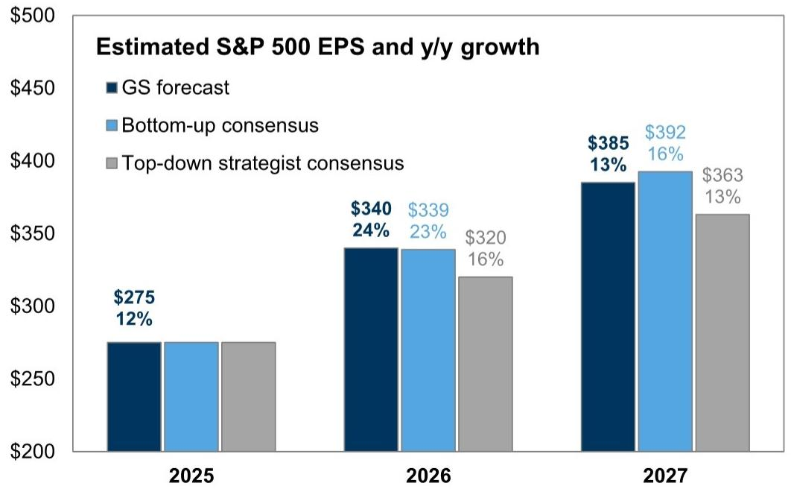

bar

Estimated S&P 500 EPS and y/y growth
| Year | GS forecast ($) | Bottom-up consensus ($) | Top-down strategist consensus ($) | Growth (%) |
| :--- | :--- | :--- | :--- | :--- |
| 2025 | 275 | 275 | 275 | 12 |
| 2026 | 340 | 339 | 320 | 24 |
| 2027 | 385 | 392 | 363 | 13 |
Estimated S&P 500 EPS and y/y growth

Source: Bloomberg, FactSet, GS Global Investment Research

From a macroeconomic perspective, softening consumer spending and elevated input cost pressures should create incremental earnings headwinds in coming quarters for much of the equity market. Recent consumer spending data have been resilient despite the oil shock largely because of tax refunds resulting from the One Big Beautiful Bill Act. However, our economists expect that fiscal impulse to fade in coming quarters, weighing on consumer income growth and spending, particularly among low income consumers. At the same time, recent inflation readings and corporate commentary have signaled the risk to profit margins from input cost pressures. Our top-down macro model for the median S&P 500 company points to limited margin expansion through 2027.

Exhibit 19: Real US GDP growth impulses   
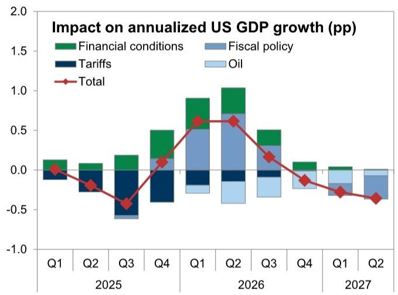

bar_line

Impact on annualized US GDP growth (pp)
| Quarter | Financial conditions (pp) | Fiscal policy (pp) | Tariffs (pp) | Oil (pp) | Total (pp) |
|---|---|---|---|---|---|
| Q1 2025 | 0.1 | -0.1 | -0.1 | -0.1 | 0.0 |
| Q2 2025 | 0.1 | -0.2 | -0.3 | -0.2 | -0.2 |
| Q3 2025 | 0.2 | -0.6 | -0.4 | -0.4 | -0.5 |
| Q4 2025 | 0.5 | -0.3 | -0.4 | -0.3 | 0.1 |
| Q1 2026 | 0.9 | 0.6 | -0.3 | -0.3 | 0.6 |
| Q2 2026 | 1.1 | 0.7 | -0.3 | -0.3 | 0.6 |
| Q3 2026 | 0.4 | 0.3 | -0.2 | -0.3 | 0.2 |
| Q4 2026 | 0.1 | -0.1 | -0.1 | -0.2 | -0.1 |
| Q1 2027 | 0.1 | -0.3 | -0.1 | -0.1 | -0.3 |
| Q2 2027 | 0.1 | -0.2 | -0.1 | -0.1 | -0.3 |

Source: GS Global Investment Research

Exhibit 20: Input cost pressures on profit margins have been mounting in recent quarters   
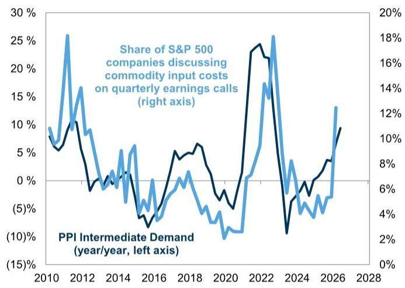

line

| Year | Share of S&P 500 companies discussing commodity input costs on quarterly earnings calls (right axis) | PPI Intermediate Demand (year/year, left axis) |
|------|------------------------------------------------------------------------|-----------------------------------------------|
| 2010 | ~9%                                                                    | ~-15%                                         |
| 2011 | ~26%                                                                   | ~-10%                                         |
| 2012 | ~17%                                                                   | ~-5%                                          |
| 2013 | ~5%                                                                    | ~0%                                           |
| 2014 | ~3%                                                                    | ~5%                                           |
| 2015 | ~6%                                                                    | ~-10%                                         |
| 2016 | ~-5%                                                                   | ~-15%                                         |
| 2017 | ~5%                                                                    | ~-10%                                         |
| 2018 | ~7%                                                                    | ~-5%                                          |
| 2019 | ~3%                                                                    | ~0%                                           |
| 2020 | ~-5%                                                                   | ~-10%                                         |
| 2021 | ~18%                                                                   | ~-5%                                          |
| 2022 | ~25%                                                                   | ~-10%                                         |
| 2023 | ~-10%                                                                  | ~-15%                                         |
| 2024 | ~5%                                                                    | ~-10%                                         |
| 2025 | ~8%                                                                    | ~-5%                                          |
| 2026 | ~13%                                                                   | ~-10%                                         |
| 2027 | ~15%                                                                   | ~-5%                                          |
| 2028 | ~18%                                                                   | ~-10%                                         |

Source: GS Global Investment Research

However, we expect macroeconomic earnings headwinds will be more than offset by the powerful tailwinds from the AI investment boom. The Q1 earnings season led to another wave of upgrades to hyperscaler capex estimates for 2026 and 2027. Analysts now forecast capex will grow by 83% this year to \$754 billion and by 20% in 2027 to \$905 billion. We believe there is upside risk to consensus capex estimates in 2027. Analysts have been too conservative during each of the past three years, commentary from the hyperscalers reiterated their commitment to strong investment spending in 2027, and revenue backlogs point to a continued supply/demand imbalance.

Exhibit 21: Estimates for AI investment spending jumped during the earnings season includes AMZN, GOOGL, META, MSFT, and ORCL   
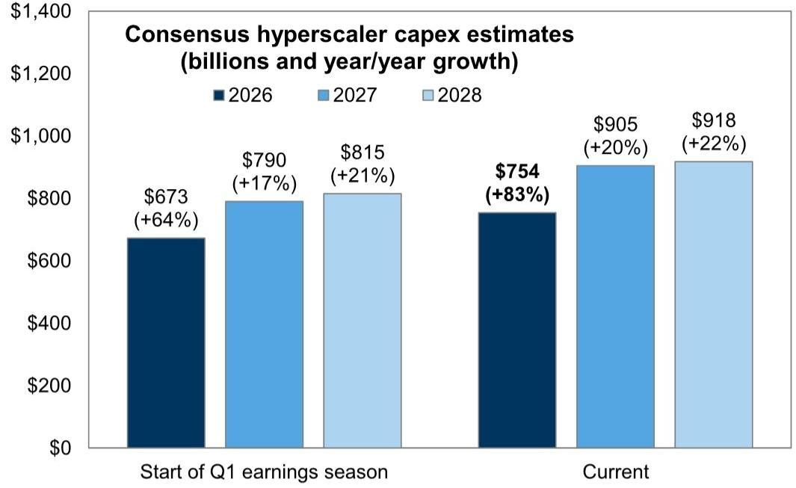

bar

Consensus hyperscaler capex estimates (billions and year/year growth)
| Period | Year | Capex ($B) | Growth (%) |
| :--- | :--- | :--- | :--- |
| Start of Q1 earnings season | 2026 | 673 | +64 |
| Start of Q1 earnings season | 2027 | 790 | +17 |
| Start of Q1 earnings season | 2028 | 815 | +21 |
| Current | 2026 | 754 | +83 |
| Current | 2027 | 905 | +20 |
| Current | 2028 | 918 | +22 |

Source: FactSet, GS Global Investment Research

We expect the beneficiaries of AI infrastructure investment will account for roughly half of S&P 500 EPS growth in 2026 and 2027. Semiconductors are the primary direct earnings beneficiaries of the AI investment boom, and consensus estimates show NVDA and MU together accounting for a third of S&P 500 EPS growth this year. A number of tech hardware, industrials, and utilities companies are also receiving large earnings boosts from the AI build out. Growing hyperscaler depreciation expense will partially offset the boost to S&P 500 earnings, with a larger impact in 2027 than in 2026.

Exhibit 22: Composition of our S&P 500 EPS growth forecast   
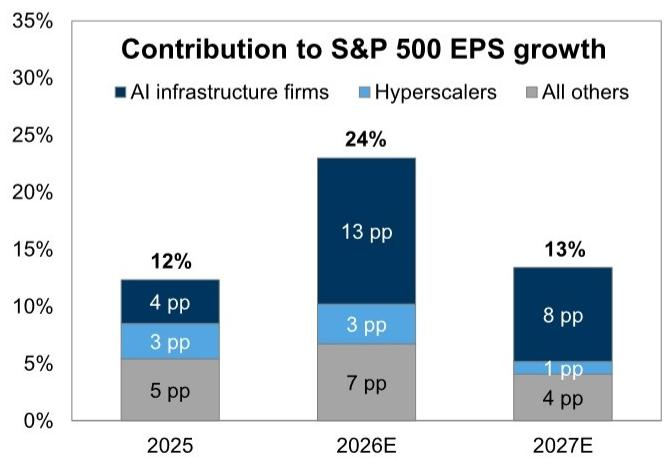

bar_stacked

Contribution to S&P 500 EPS growth
| Year | All others (pp) | Hyperscalers (pp) | AI infrastructure firms (pp) |
| :--- | :--- | :--- | :--- |
| 2025 | 5 | 3 | 4 |
| 2026E | 7 | 3 | 13 |
| 2027E | 4 | 1 | 8 |
The chart displays a stacked bar chart with three segments per year: 'All others', 'Hyperscalers', and 'AI infrastructure firms'. The percentage values above each segment are labeled above each bar.

Source: GS Global Investment Research

Exhibit 23: Top 10 contributors to consensus S&P 500 EPS growth in 2026 

<table><tr><td rowspan="2">Name</td><td rowspan="2">Ticker</td><td rowspan="2">S&amp;P 500 mkt cap weight</td><td rowspan="2">Share of S&amp;P 500 2026 EPS</td><td colspan="2">Share of S&amp;P 500 EPS growth</td></tr><tr><td>2026</td><td>2027</td></tr><tr><td>NVIDIA Corporation</td><td>NVDA</td><td>8 %</td><td>7 %</td><td>18 %</td><td>19 %</td></tr><tr><td>Micron Technology, Inc.</td><td>MU</td><td>1</td><td>3</td><td>14</td><td>7</td></tr><tr><td>Alphabet Inc.</td><td>GOOGL</td><td>6</td><td>5</td><td>7</td><td>1</td></tr><tr><td>Broadcom Inc.</td><td>AVGO</td><td>3</td><td>2</td><td>6</td><td>7</td></tr><tr><td>Meta Platforms Inc</td><td>META</td><td>2</td><td>2</td><td>4</td><td>1</td></tr><tr><td>Sandisk Corporation</td><td>SNDK</td><td>0</td><td>1</td><td>4</td><td>1</td></tr><tr><td>Microsoft Corporation</td><td>MSFT</td><td>5</td><td>5</td><td>3</td><td>5</td></tr><tr><td>Amazon.com, Inc.</td><td>AMZN</td><td>4</td><td>3</td><td>3</td><td>3</td></tr><tr><td>Exxon Mobil Corporation</td><td>XOM</td><td>1</td><td>2</td><td>3</td><td>(0)</td></tr><tr><td>Chevron Corporation</td><td>CVX</td><td>1</td><td>1</td><td>2</td><td>(1)</td></tr><tr><td>Top 10</td><td></td><td>32 %</td><td>31 %</td><td>64 %</td><td>43 %</td></tr></table>

Source: FactSet, GS Global Investment Research

Beyond the next several quarters, the sustainability of current earnings momentum will depend on the ability of corporate America to translate current AI investments into recurring profits. Large capex investments have led to a divergence between net income and free cash flow growth, reflecting to some degree a transfer from hyperscaler earnings in the future to semiconductor and other AI infrastructure companies' earnings today. Going forward, aggregate S&P 500 earnings growth will increasingly rely on the ability of the hyperscalers to generate large returns on those investments. While the Q1 earnings season drove positive revisions to the outlook for hyperscaler revenues and margins, generating sufficient returns on AI investment spending will ultimately require that enterprise end users enjoy sufficient productivity gains to justify spending on AI applications. Based on economy-wide surveys and corporate commentary, enterprise adoption remains in early stages, but we expect the impact of AI on productivity and earnings will become increasingly visible in coming years. Our forecasts embed a 0.4 pp boost to S&P 500 EPS growth from AI productivity this year and a 1.5 pp boost in 2027.

Exhibit 24: Recent S&P 500 net income growth has outpaced free cash flow growth   
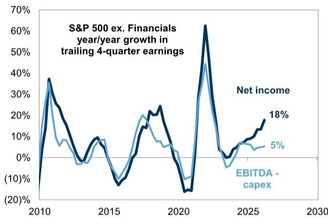

line

| Year | Net income | EBITDA - capex |
|------|------------|----------------|
| 2030 | 18%        | 5%             |

Source: Compustat, GS Global Investment Research

Exhibit 25: The hyperscaler revenue outlook has recently improved   
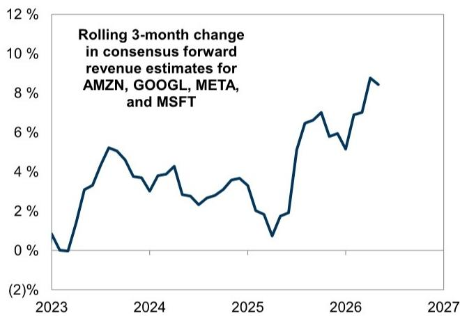

line

| Year | Rolling 3-month change in consensus forward revenue estimates for AMZN, GOOGL, META, and MSFT |
|------|----------------------------------------------------------------------------------|
| 2023 | 0.5%                                                                             |
| 2024 | 5.0%                                                                             |
| 2025 | 3.5%                                                                             |
| 2026 | 8.5%                                                                             |

Source: FactSet, GS Global Investment Research

# Equity valuations

Our forecasts for a $6\%$ S&P 500 rise to year-end 2026 and an $10\%$ price gain during the next 12 months embed an expectation for a P/E multiple of 21x, close to the current level. The P/E multiple today ranks in the 88th percentile relative to the past 40 years but stands in the middle of the recent range extending from 23x in late 2025 to 19x at the market low in March.

Our base case is for earnings to drive the market higher with little change in the multiple. A relaxation of inflation pressures in coming months should allow for a modest decline in Treasury yields, supporting equity valuations. However, decelerating economic and earnings growth, investor skepticism about the persistence of earnings tied to the AI infrastructure build-out, and continued uncertainty around both AI disruption and the geopolitical outlook should prevent much valuation multiple expansion. However, while valuations have been relatively steady during the last two years, flat multiples are not the historical norm, and we see risks around our forecast in both directions.

Exhibit 26: The S&P 500 trades at 21x 12-month forward EPS   
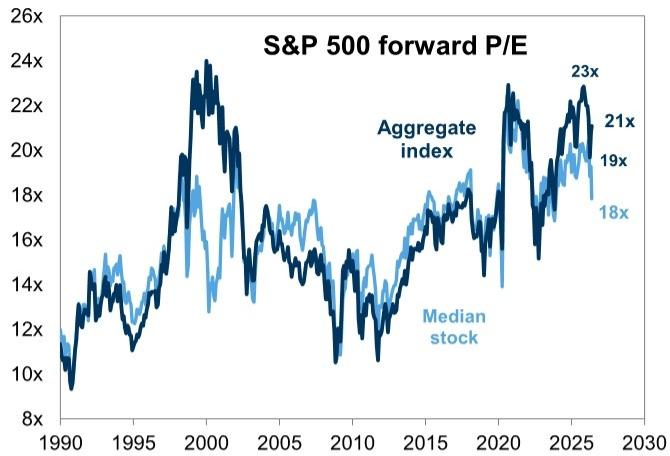

line

| Year | Aggregate index | Median stock |
|------|-----------------|--------------|
| 2025 | 23x             | 18x          |
| 2020 | 21x             | 19x          |
| 2015 | 19x             | 17x          |
| 2010 | 18x             | 16x          |
| 2005 | 17x             | 15x          |
| 2000 | 24x             | 20x          |
| 1995 | 15x             | 13x          |
| 1990 | 12x             | 10x          |

Source: FactSet, GS Global Investment Research

Exhibit 27: Sensitivity of S&P 500 price to EPS and valuation scenarios 

<table><tr><td rowspan="3" colspan="2"></td><td colspan="3">EPS scenarios</td></tr><tr><td>GS 2026 estimate</td><td>Consensus fwd 12m</td><td>GS 2027 estimate</td></tr><tr><td>$340</td><td>$355</td><td>$385</td></tr><tr><td rowspan="8">Forward P/E</td><td>23x Oct. 2025</td><td>7800</td><td>8200</td><td>8900</td></tr><tr><td>22x Jan. 2025</td><td>7500</td><td>7800</td><td>8500</td></tr><tr><td>21x Current</td><td>7100</td><td>7500</td><td>8100</td></tr><tr><td>20x 5-year avg</td><td>6800</td><td>7100</td><td>7700</td></tr><tr><td>19x 10-year avg</td><td>6500</td><td>6700</td><td>7300</td></tr><tr><td>18x</td><td>6100</td><td>6400</td><td>6900</td></tr><tr><td>17x 30-year avg</td><td>5800</td><td>6000</td><td>6500</td></tr><tr><td>16x</td><td>5400</td><td>5700</td><td>6200</td></tr></table>

Source: GS Global Investment Research

From a macro perspective, slowing economic growth and rising interest rates put pressure on equity valuations, but elevated corporate profitability helps justify elevated multiples. While valuations screen as elevated vs. history, most metrics remain far from the extremes reached 25 years ago. In addition, because of the near-record level of ROE, the S&P 500 P/E of 21x currently registers close to fair value in our models.

Exhibit 28: Equity valuations are elevated relative to the past several decades but not at historical extremes   
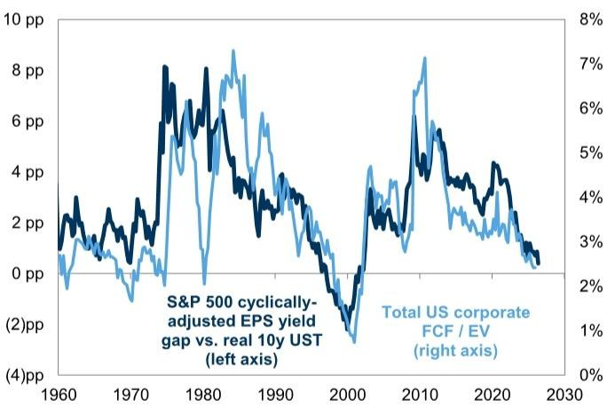

line

| Year | S&P 500 cyclically-adjusted EPS yield gap (pp) | Total US corporate FCF / EV (right axis) |
|------|-----------------------------------------------|------------------------------------------|
| 1960 | ~1.5                                          | ~2.5                                     |
| 1970 | ~3.0                                          | ~1.0                                     |
| 1980 | ~8.0                                          | ~4.0                                     |
| 1990 | ~4.0                                          | ~3.0                                     |
| 2000 | ~-2.0                                         | ~-1.0                                    |
| 2010 | ~8.5                                          | ~6.0                                     |
| 2020 | ~4.0                                          | ~3.0                                     |
| 2030 | ~1.0                                          | ~1.5                                     |

Source: BEA, Robert Shiller, GS Global Investment Research

Exhibit 29: Elevated corporate profitability helps support elevated valuation multiples   
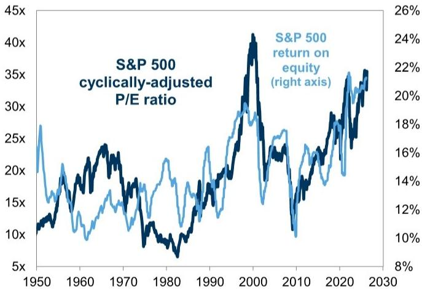

line

| Year | S&P 500 P/E ratio | S&P 500 Return on Equity (%) |
|------|-------------------|------------------------------|
| 1950 | ~10x              | ~18%                         |
| 1960 | ~15x              | ~14%                         |
| 1970 | ~18x              | ~16%                         |
| 1980 | ~10x              | ~12%                         |
| 1990 | ~15x              | ~16%                         |
| 2000 | ~42x              | ~24%                         |
| 2010 | ~10x              | ~14%                         |
| 2020 | ~35x              | ~22%                         |
| 2030 | ~35x              | ~22%                         |

Source: Compustat, Robert Shiller, GS Global Investment Research

From a bottom-up perspective, much of the earnings tied to AI investment spending warrants a below-average multiple. Compositionally, the Memory stocks driving a large share of S&P 500 earnings growth this year typically trade at low valuation multiples due to the cyclicality of their earnings. More broadly, earnings driven by a temporary investment boom should boost current equity valuations far less than earnings expected to be generated indefinitely. While some investors believe the AI investment boom is likely to last long enough that the associated earnings should be treated as secular, rather than cyclical, profit streams, enough investors remain skeptical that a major increase in valuation multiples seems unlikely.

Exhibit 30: Composition of consensus S&P 500 earnings growth and associated valuations 

<table><tr><td rowspan="2">Category</td><td rowspan="2">S&amp;P 500 mkt cap weight</td><td colspan="3">Share of consensus S&amp;P 500 EPS</td><td colspan="2">Median stock forward 12m P/E</td></tr><tr><td>2025</td><td>2027</td><td>Δ</td><td>Current</td><td>10y med</td></tr><tr><td>Mega-cap semiconductors</td><td>11 %</td><td>6 %</td><td>12 %</td><td>5 pp</td><td>27x</td><td>26x</td></tr><tr><td>Memory</td><td>2</td><td>1</td><td>4</td><td>4</td><td>9</td><td>12</td></tr><tr><td>Other semiconductors</td><td>5</td><td>2</td><td>3</td><td>1</td><td>35</td><td>18</td></tr><tr><td>Other AI infrastructure</td><td>4</td><td>3</td><td>3</td><td>0</td><td>31</td><td>19</td></tr><tr><td>Hyperscalers</td><td>18</td><td>15</td><td>15</td><td>(0)</td><td>26</td><td>24</td></tr><tr><td>Rest of the S&amp;P 500</td><td>60</td><td>73</td><td>63</td><td>(10)</td><td>17</td><td>19</td></tr><tr><td>S&amp;P 500</td><td>100 %</td><td>100 %</td><td>100 %</td><td>0 pp</td><td>18x</td><td>19x</td></tr></table>

Source: FactSet, GS Global Investment Research

The persistent gap between earnings and cash flows for some of the largest tech stocks should continue to weigh on their earnings multiples as well. The mega-cap hyperscalers AMZN, GOOGL, META, and MSFT trade at a collective P/E of 24x, near the low end of their range during the past decade, but at a price/FCF multiple greater than 150x. While last quarter's reports appeared to give investors incremental confidence in the likely returns to hyperscaler capex spending, the likelihood of continued capital intensity in coming years suggests uncertainty around long-term future free cash flows will remain elevated.

Exhibit 31: Earnings and FCF multiples for the 10 largest S&P 500 stocks   
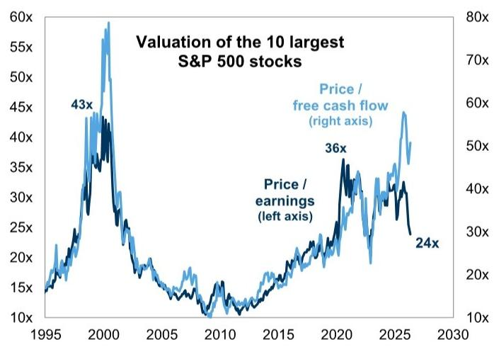

line

| Year | Price / free cash flow (right axis) | Price / earnings (left axis) |
|------|--------------------------------------|-------------------------------|
| 1995 | ~15x                                 | ~15x                          |
| 2000 | ~43x                                 | ~43x                          |
| 2010 | ~10x                                 | ~10x                          |
| 2020 | ~36x                                 | ~36x                          |
| 2025 | ~45x                                 | ~45x                          |
| 2030 | ~24x                                 | ~24x                          |

Source: Compustat, FactSet, GS Global Investment Research

Exhibit 32: P/E for the hyperscalers and the median S&P 500 stock   
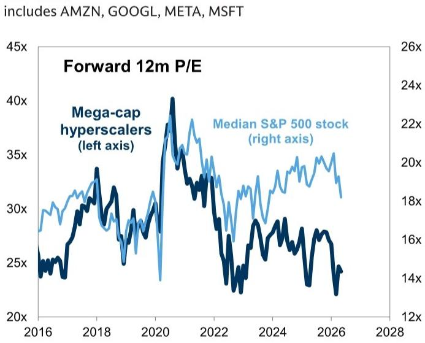

line

| Year | Mega-cap hyperscalers (left axis) | Median S&P 500 stock (right axis) |
|------|-----------------------------------|-----------------------------------|
| 2016 | ~25x                              | ~28x                              |
| 2018 | ~34x                              | ~30x                              |
| 2020 | ~38x                              | ~35x                              |
| 2022 | ~30x                              | ~32x                              |
| 2024 | ~28x                              | ~30x                              |
| 2026 | ~25x                              | ~28x                              |

Source: FactSet, GS Global Investment Research

The outlook for AI investment spending and earnings creates two-way risk to valuation multiples. While valuation multiples for many semiconductor companies have recently expanded, valuations in other parts of the AI infrastructure complex reflect a healthy skepticism regarding the persistence of current earnings strength. Memory stocks, for example, continue to trade at P/E multiples historically consistent with much slower growth than the rates embedded in consensus estimates. As the processes of AI build-out and AI adoption continue, a widening pool of companies perceived to be future winners will likely enjoy large boosts to their valuations, but it seems likely that many others will experience declining valuations as they are affected by AI disruption risk.

The biggest question for the valuations of most stocks in the market is the impact of AI on long-term earnings growth, but that question is unlikely to be resolved any time soon. One consequence is that near-term earnings will likely continue to be the primary driver of near-term equity returns. Most of the current value of an equity is attributable to earnings far in the future. The uncertainty surrounding which companies will experience long-term earnings uplifts from AI helps explain the practical focus of most investors on the near-term earnings impact from AI, even if the focus on near-term earnings creates the risk that investors overvalue the likely long-term earnings benefits of some AI infrastructure stocks.

Exhibit 33: Memory stock P/E multiples reflect skepticism regarding the sustainability of current growth rates   
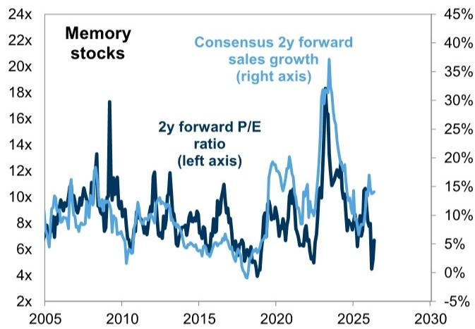

line

| Year | Consensus 2y forward sales growth (right axis) | 2y forward P/E ratio (left axis) |
|------|-----------------------------------------------|----------------------------------|
| 2005 | ~8x                                           | ~6x                              |
| 2010 | ~17x                                          | ~10x                             |
| 2015 | ~6x                                           | ~4x                              |
| 2020 | ~12x                                          | ~8x                              |
| 2025 | ~35x                                          | ~15x                             |
| 2030 | ~15x                                          | ~10x                             |

Source: FactSet, GS Global Investment Research

Exhibit 34: Most US equity value is based on long-term future earnings   
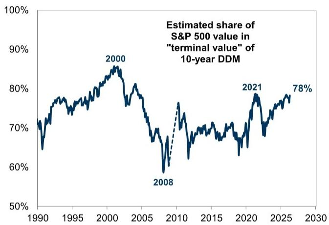

line

| Year | Estimated Share of S&P 500 value in "terminal value" of 10-year DDM |
| ---- | -------------------------------------------------------------------------- |
| 2000 | 85%                                                                      |
| 2008 | 60%                                                                      |
| 2021 | 78%                                                                      |

Source: GS Global Investment Research

# Disclosure Appendix

# Reg AC

We, Ben Snider, Ryan Hammond, Jenny Ma, Daniel Chavez, Kartik Jayachandran and Christophe Sung, hereby certify that all of the views expressed in this report accurately reflect our personal views, which have not been influenced by considerations of the firm's business or client relationships.

Unless otherwise stated, the individuals listed on the cover page of this report are analysts in GS' Global Investment Research division.

Contributing Authors: Ben Snider GS & Co. LLC, Ryan Hammond GS & Co. LLC, Jenny Ma GS & Co. LLC, Daniel Chavez GS & Co. LLC, Kartik Jayachandran GS & Co. LLC, Christophe Sung GS & Co. LLC.

Unless otherwise stated, the individuals listed in the Contributing Authors disclosure of this report are analysts in GS' Global Investment Research division.

# Disclosures

# Regulatory disclosures

# Disclosures required by United States laws and regulations

See company-specific regulatory disclosures above for any of the following disclosures required as to companies referred to in this report: manager or co-manager in a pending transaction; $1\%$ or other ownership; compensation for certain services; types of client relationships; managed/co-managed public offerings in prior periods; directorships; for equity securities, market making and/or specialist role. GS trades or may trade as a principal in debt securities (or in related derivatives) of issuers discussed in this report.

The following are additional required disclosures: Ownership and material conflicts of interest: GS policy prohibits its analysts, professionals reporting to analysts and members of their households from owning securities of any company in the analyst's area of coverage. Analyst compensation: Analysts are paid in part based on the profitability of GS, which includes investment banking revenues. Analyst as officer or director: GS policy generally prohibits its analysts, persons reporting to analysts or members of their households from serving as an officer, director or advisor of any company in the analyst's area of coverage. Non-U.S. Analysts: Non-U.S. analysts may not be associated persons of GS & Co. LLC and therefore may not be subject to FINRA Rule 2241 or FINRA Rule 2242 restrictions on communications with a subject company, public appearances and trading in securities covered by the analysts.

# Additional disclosures required under the laws and regulations of jurisdictions other than the United States

The following disclosures are those required by the jurisdiction indicated, except to the extent already made above pursuant to United States laws and regulations. Australia: GS Australia Pty Ltd and its affiliates are not authorised deposit-taking institutions (as that term is defined in the Banking Act 1959 (Cth)) in Australia and do not provide banking services, nor carry on a banking business, in Australia. This research, and any access to it, is intended only for “wholesale clients” within the meaning of the Australian Corporations Act, unless otherwise agreed by GS. In producing research reports, members of Global Investment Research of GS Australia may attend site visits and other meetings hosted by the companies and other entities which are the subject of its research reports. In some instances the costs of such site visits or meetings may be met in part or in whole by the issuers concerned if GS Australia considers it is appropriate and reasonable in the specific circumstances relating to the site visit or meeting. To the extent that the contents of this document contains any financial product advice, it is general advice only and has been prepared by GS without taking into account a client’s objectives, financial situation or needs. A client should, before acting on any such advice, consider the appropriateness of the advice having regard to the client’s own objectives, financial situation and needs. A copy of certain GS Australia and New Zealand disclosure of interests and a copy of GS’ Australian Sell-Side Research Independence Policy Statement are available at: https://www.goldmansachs.com/disclosures/australia-new-zealand/index.html. Brazil: Disclosure information in relation to CVM Resolution n. 20 is available at https://www.gs.com/worldwide/brazil/area/gir/index.html. Where applicable, the Brazil-registered analyst primarily responsible for the content of this research report, as defined in Article 20 of CVM Resolution n. 20, is the first author named at the beginning of this report, unless indicated otherwise at the end of the text. Canada: This information is being provided to you for information purposes only and is not, and under no circumstances should be construed as, an advertisement, offering or solicitation by GS & Co. LLC for purchasers of securities in Canada to trade in any Canadian security. GS & Co. LLC is not registered as a dealer in any jurisdiction in Canada under applicable Canadian securities laws and generally is not permitted to trade in Canadian securities and may be prohibited from selling certain securities and products in certain jurisdictions in Canada. If you wish to trade in any Canadian securities or other products in Canada please contact GS Canada Inc., an affiliate of The GS Group Inc., or another registered Canadian dealer. Hong Kong: Further information on the securities of covered companies referred to in this research may be obtained on request from GS (Asia) L.L.C. India: Further information on the subject company or companies referred to in this research may be obtained from GS (India) Securities Private Limited, Research Analyst - SEBI Registration Number INH000001493, 10th Floor, Ascent-Worli, Sudam Kalu Ahire Marg, Worli, Mumbai-400 025, India, Corporate Identity Number U74140MH2006FTC160634, Phone +91 22 6616 9000, Fax +91 22 6616 9001. GS may beneficially own 1% or more of the securities (as such term is defined in clause 2 (h) the Indian Securities Contracts (Regulation) Act, 1956) of the subject company or companies referred to in this research report. Investment in securities market are subject to market risks. Read all the related documents carefully before investing. Registration granted by SEBI and certification from NISM in no way guarantee performance of the intermediary or provide any assurance of returns to investors. GS (India) Securities Private Limited compliance officer and investor grievance contact details can be found at: https://www.goldmansachs.com/worldwide/india/documents/Grievance-Redressal-and-Escalation-Matrix.pdf, and a copy of the annual audit compliance report can be found at this link: https://publishing.gs.com/content/site/india-annual-compliance-report.html. Japan: See below. Korea: This research, and any access to it, is intended only for “professional investors” within the meaning of the Financial Services and Capital Markets Act, unless otherwise agreed by GS. Further information on the subject company or companies referred to in this research may be obtained from GS (Asia) L.L.C., Seoul Branch. New Zealand: GS New Zealand Limited and its affiliates are neither “registered banks” nor “deposit takers” (as defined in the Reserve Bank of New Zealand Act 1989) in New Zealand. This research, and any access to it, is intended for “wholesale clients” (as defined in the Financial Advisers Act 2008) unless otherwise agreed by GS. A copy of certain GS Australia and New Zealand disclosure of interests is available at: https://www.goldmansachs.com/disclosures/australia-new-zealand/index.html. Russia: Research reports distributed in the Russian Federation are not advertising as defined in the Russian legislation, but are information and analysis not having product promotion as their main purpose and do not provide appraisal within the meaning of the Russian legislation on appraisal activity. Research reports do not constitute a personalized investment recommendation as defined in Russian laws and regulations, are not addressed to a specific client, and are prepared without analyzing the financial circumstances, investment profiles or risk profiles of clients. GS assumes no responsibility for any investment decisions that may be taken by a client or any other person based on this research report. Singapore: GS (Singapore) Pte. (Company Number: 198602165W), which is regulated by the Monetary Authority of Singapore, accepts legal responsibility for this research, and should be contacted with respect to any matters arising from, or in connection with, this research. Taiwan: This material is for reference only and must not be reprinted without permission. Investors should carefully consider their own investment risk. Investment results are the responsibility of the individual investor. United Kingdom: Persons who would be categorized as retail clients in the United Kingdom, as such term is

defined in the rules of the Financial Conduct Authority, should read this research in conjunction with prior GS on the covered companies referred to herein and should refer to the risk warnings that have been sent to them by GS International. A copy of these risks warnings, and a glossary of certain financial terms used in this report, are available from GS International on request.

European Union and United Kingdom: Disclosure information in relation to Article 6 (2) of the European Commission Delegated Regulation (EU) (2016/958) supplementing Regulation (EU) No 596/2014 of the European Parliament and of the Council (including as that Delegated Regulation is implemented into United Kingdom domestic law and regulation following the United Kingdom's departure from the European Union and the European Economic Area) with regard to regulatory technical standards for the technical arrangements for objective presentation of investment recommendations or other information recommending or suggesting an investment strategy and for disclosure of particular interests or indications of conflicts of interest is available at https://www.gs.com/disclosures/europeanpolicy.html which states the European Policy for Managing Conflicts of Interest in Connection with Investment Research.

Japan: GS Japan Co., Ltd. is a Financial Instrument Dealer registered with the Kanto Financial Bureau under registration number Kinsho 69, and a member of Japan Securities Dealers Association, Financial Futures Association of Japan Type II Financial Instruments Firms Association, and Investment Management Association of Japan. Sales and purchase of equities are subject to commission pre-determined with clients plus consumption tax. See company-specific disclosures as to any applicable disclosures required by Japanese stock exchanges, the Japanese Securities Dealers Association or the Japanese Securities Finance Company.

# Global product; distributing entities

GS Global Investment Research produces and distributes research products for clients of GS on a global basis. Analysts based in GS offices around the world produce research on industries and companies, and research on macroeconomics, currencies, commodities and portfolio strategy. This research is disseminated in Australia by GS Australia Pty Ltd (ABN 21 006 797 897); in Brazil by GS do Brasil Corretora de Títulos e Valores Mobiliários S.A.; Public Communication Channel GS Brazil: 0800 727 5764 and / or contatogoldmanbrasil@gs.com. Available Weekdays (except holidays), from 9am to 6pm. Canal de Comunicação com o Público GS Brasil: 0800 727 5764 e/ou contatogoldmanbrasil@gs.com. Horário de funcionamento: segunda-feira à sexta-feira (exceto feriados), das 9h às 18h; in Canada by GS & Co. LLC; in Hong Kong by GS (Asia) L.L.C.; in India by GS (India) Securities Private Ltd.; in Japan by GS Japan Co., Ltd.; in the Republic of Korea by GS (Asia) L.L.C., Seoul Branch; in New Zealand by GS New Zealand Limited; in Russia by OOO GS; in Singapore by GS (Singapore) Pte. (Company Number: 198602165W); and in the United States of America by GS & Co. LLC. GS International has approved this research in connection with its distribution in the United Kingdom.

GS International (“GSI”), authorised by the Prudential Regulation Authority (“PRA”) and regulated by the Financial Conduct Authority (“FCA”) and the PRA, has approved this research in connection with its distribution in the United Kingdom.

European Economic Area: GS Bank Europe SE (“GSBE”) is a credit institution incorporated in Germany and, within the Single Supervisory Mechanism, subject to direct prudential supervision by the European Central Bank and in other respects supervised by German Federal Financial Supervisory Authority (Bundesanstalt für Finanzdienstleistungsaufsicht, BaFin) and Deutsche Bundesbank and disseminates research within the European Economic Area.

# General disclosures

This research is for our clients only. Other than disclosures relating to GS, this research is based on current public information that we consider reliable, but we do not represent it is accurate or complete, and it should not be relied on as such. The information, opinions, estimates and forecasts contained herein are as of the date hereof and are subject to change without prior notification. We seek to update our research as appropriate, but various regulations may prevent us from doing so. Other than certain industry reports published on a periodic basis, the large majority of reports are published at irregular intervals as appropriate in the analyst's judgment.

GS conducts a global full-service, integrated investment banking, investment management, and brokerage business. We have investment banking and other business relationships with a substantial percentage of the companies covered by Global Investment Research. GS & Co. LLC, the United States broker dealer, is a member of SIPC (https://www.sipc.org).

Our salespeople, traders, and other professionals may provide oral or written market commentary or trading strategies to our clients and principal trading desks that reflect opinions that are contrary to the opinions expressed in this research. Our asset management area, principal trading desks and investing businesses may make investment decisions that are inconsistent with the recommendations or views expressed in this research.

We and our affiliates, officers, directors, and employees will from time to time have long or short positions in, act as principal in, and buy or sell, the securities or derivatives, if any, referred to in this research, unless otherwise prohibited by regulation or GS policy.

The views attributed to third party presenters at GS arranged conferences, including individuals from other parts of GS, do not necessarily reflect those of Global Investment Research and are not an official view of GS.

Any third party referenced herein, including any salespeople, traders and other professionals or members of their household, may have positions in the products mentioned that are inconsistent with the views expressed by analysts named in this report.

This research is focused on investment themes across markets, industries and sectors. It does not attempt to distinguish between the prospects or performance of, or provide analysis of, individual companies within any industry or sector we describe.

Any trading recommendation in this research relating to an equity or credit security or securities within an industry or sector is reflective of the investment theme being discussed and is not a recommendation of any such security in isolation.

This research is not an offer to sell or the solicitation of an offer to buy any security in any jurisdiction where such an offer or solicitation would be illegal. It does not constitute a personal recommendation or take into account the particular investment objectives, financial situations, or needs of individual clients. Clients should consider whether any advice or recommendation in this research is suitable for their particular circumstances and, if appropriate, seek professional advice, including tax advice. The price and value of investments referred to in this research and the income from them may fluctuate. Past performance is not a guide to future performance, future returns are not guaranteed, and a loss of original capital may occur. Fluctuations in exchange rates could have adverse effects on the value or price of, or income derived from, certain investments.

Certain transactions, including those involving futures, options, and other derivatives, give rise to substantial risk and are not suitable for all investors. Investors should review current options and futures disclosure documents which are available from GS sales representatives or at https://www.theocc.com/about/publications/character-risks.jsp and https://www.goldmansachs.com/disclosures/cftc\_fcm\_disclosures. Transaction costs may be significant in option strategies calling for multiple purchase and sales of options such as spreads. Supporting documentation will be supplied upon request.

Differing Levels of Service provided by Global Investment Research: The level and types of services provided to you by GS Global Investment Research may vary as compared to that provided to internal and other external clients of GS, depending on various factors including your individual preferences as to the frequency and manner of receiving communication, your risk profile and investment focus and perspective (e.g., marketwide, sector specific, long term, short term), the size and scope of your overall client relationship with GS, and legal and regulatory constraints. As an example, certain clients may request to receive notifications when research on specific securities is published, and certain clients may request that specific data underlying analysts' fundamental analysis available on our internal client websites be delivered to them electronically through data feeds or otherwise. No change to an analyst's fundamental research views (e.g., ratings, price targets, or material changes to earnings estimates for equity securities), will be communicated to any client prior to inclusion of such information in a research report broadly disseminated through electronic publication to our internal client websites or through other means, as necessary, to all clients who are entitled to receive such reports.

All research reports are disseminated and available to all clients simultaneously through electronic publication to our internal client websites. Not all research content is redistributed to our clients or available to third-party aggregators, nor is GS responsible for the redistribution of our research by third party aggregators. For research, models or other data related to one or more securities, markets or asset classes (including related services) that may be available to you, please contact your GS representative or go to https://research.gs.com.

Disclosure information is also available at https://www.gs.com/research/hedge.html or from Research Compliance, 200 West Street, New York, NY 10282.

# © 2026 GS.

You are permitted to store, display, analyze, modify, reformat, and print the information made available to you via this service only for your own use. You may not resell or reverse engineer this information to calculate or develop any index for disclosure and/or marketing or create any other derivative works or commercial product(s), data or offering(s) without the express written consent of GS. You are not permitted to publish, transmit, or otherwise reproduce this information, in whole or in part, in any format to any third party without the express written consent of GS. This foregoing restriction includes, without limitation, using, extracting, downloading or retrieving this information, in whole or in part, to train or finetune a machine learning or artificial intelligence system, or to provide or reproduce this information, in whole or in part, as a prompt or input to any such system.