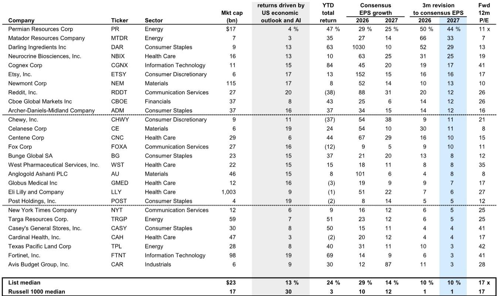
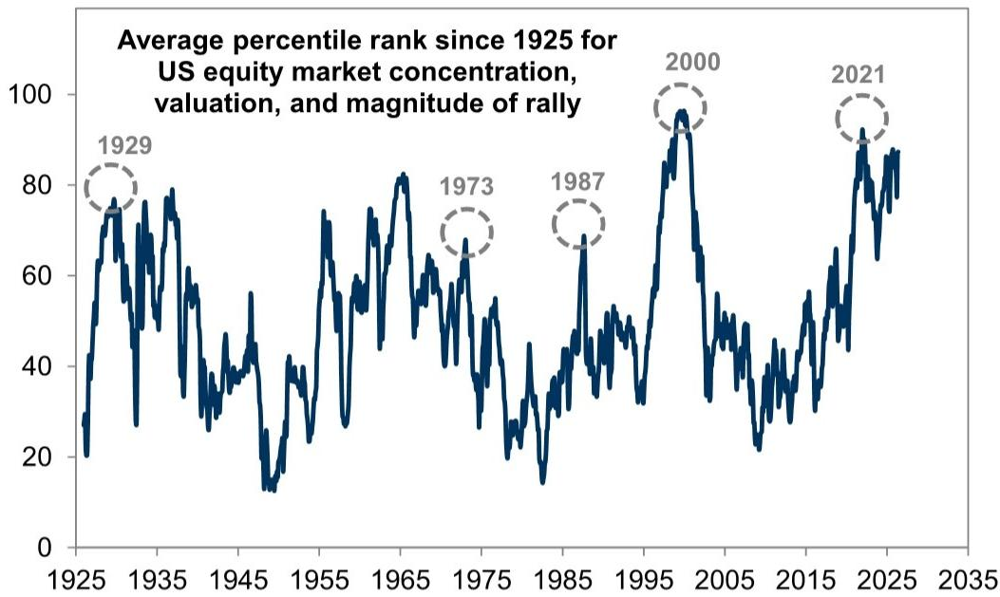

# 市场真正低估的不是AI泡沫，而是盈利增长正在重塑估值叙事

过去一个月，美国股市在AI热潮与宏观担忧的拉锯中再次创下新高。许多投资者在问同一个问题：这轮上涨是否已经透支了未来？当标普500的市盈率维持在21倍的历史高位，而市场集中度逼近2000年水平时，谨慎的声音无疑占据了主流。

但某外资投行最新发布的研报提供了一个值得深思的视角：市场真正的风险不在估值本身，而在于盈利增长能否持续支撑价格。报告的核心判断是，标普500指数有望在2026年底达到8000点，较当前水平仍有约6%的上行空间。这个看似乐观的预测，并非建立在对估值扩张的押注上，而是基于一个已经被数据验证的趋势——2026年标普500每股收益预计将达到340美元，同比增长24%；2027年进一步增长13%至385美元。

这份报告最值得注意的信号，不是目标价本身，而是它揭示了一个正在发生的结构性变化：过去两年标普500指数约40%的涨幅，在算术意义上完全由盈利增长贡献。市盈率在2024年5月是21倍，今天依然是21倍。这意味着，当前市场并非在“吹泡泡”，而是在为真实的盈利增长定价。真正值得讨论的问题，不是“泡沫何时破裂”，而是“盈利增长能持续多久”。

## 1. 盈利增长已经取代估值扩张，成为市场上涨的唯一引擎

理解当前市场状态的关键，在于区分价格变动的两个来源：盈利增长和估值变化。2026年至今，标普500指数上涨了约10%，但同期前瞻12个月每股收益预期上调了15%。结果是，市盈率反而下降了4%。这是一个反直觉但意义深远的信号。

从更长的时间维度看，这种模式更加清晰。过去两年，标普500指数的全部涨幅都可以归因于盈利增长。市盈率在2024年5月与今天完全相同。这与此前多个高估值市场周期截然不同——无论是2000年的互联网泡沫，还是2021年的疫情后反弹，估值扩张都扮演了核心角色。当前的市场上涨，基础要坚实得多。

这种模式对投资者的含义是：如果继续用传统的估值框架来评判市场是否“昂贵”，可能会错过真正的风险来源。真正的风险不在于市盈率是否会从21倍跌回18倍，而在于盈利增长是否会出现系统性下修。这也是为什么报告将2026年和2027年的EPS预测上调至340美元和385美元——这个判断的可靠性，远比目标价本身更重要。

## 2. AI基础设施的盈利支撑，远强于市场普遍认知的“炒作”

市场对AI主题的担忧主要集中在两点：一是估值过高，二是泡沫特征明显。但报告提供的证据表明，这两点担忧可能都被夸大了。

自2026年2月至今，标普500中参与AI基础设施建设的股票组合上涨了33%。同期，这一组合的前瞻盈利预期也上涨了30%。换言之，AI股票的涨幅几乎完全由盈利增长驱动，而非纯粹的估值扩张。这与市场普遍认为的“AI炒作”叙事形成了鲜明对比。

更值得关注的是盈利增长的集中度。报告指出，AI基础设施投资的受益者将贡献今年标普500盈利增长的大约一半。这意味着，AI主题不仅是市场上涨的催化剂，更是盈利增长的实质性来源。如果投资者因为担心泡沫而回避AI板块，可能同时错过了盈利增长最确定的部分。

当然，这并不意味着AI股票没有风险。盈利增长的高基数效应意味着，未来要保持同样的上修速度将越来越困难。但至少在当前阶段，市场对AI的定价并非空中楼阁，而是有真实的盈利数据在支撑。

## 3. 历史警示信号大多缺席，但两个“黄旗”正在升起

报告对历史周期的回溯提供了一个有用的框架：高估值、高集中度的牛市通常以两种方式终结——一是投机狂热导致市场尾部风险加大，二是基本面恶化（典型表现为美联储收紧和盈利增长前景走弱）。

从第一个维度看，当前市场的投机情绪远未达到历史极端水平。某外资投行的“投机性交易指标”目前约为130，远低于2000年1月的210和2021年2月的200。虽然零售交易活动近期有所增加，但仍低于历史高点。IPO活动虽然成为市场关注焦点，但2026年至今的发行数量仅为39宗，远低于1995-2000年期间的中位数289宗。这些数据表明，市场尚未进入典型的“泡沫末期”状态。

但第二个维度正在出现值得警惕的信号。霍尔木兹海峡局势导致的能源价格上涨，可能通过三个渠道传导至市场：消费者支出减弱、企业利润率承压、通胀上升导致美联储降息空间收窄。报告明确指出，这些风险“威胁着创造过去过度扩张市场结束时的条件”——即货币紧缩与增长失望同时出现。

这里需要特别注意的是，报告并没有将这些风险视为必然发生的场景，而是将其定义为“正在接近的警示信号”。对于投资者而言，关键不在于预判这些风险是否一定会兑现，而在于建立一个能够识别风险信号并做出应对的观察框架。

## 4. 中期选举前的季节性规律，可能被市场低估

报告在战术层面提供了一个容易被忽视的视角：中期选举前的季节性规律。历史数据显示，在中期选举前的几个月，美股通常表现为横盘震荡，而非趋势性上涨。从选举年前一年的9月到选举年10月，标普500指数的中位数回报率接近于零。

这一规律在当前环境下尤其值得关注。市场已经经历了强劲的Momentum驱动型上涨，而历史表明，Momentum因子的极端表现往往预示着短期风险的上升。结合经济活动的减速预期，未来几个月的回报率可能显著低于上半年的水平。

但报告同时指出，这种战术性回调并不改变对年底整体回报的正面预期。关键在于，投资者应该利用这段可能出现的震荡期来调整持仓结构，而非彻底离场。

## 5. 报告尚未完全回答的关键问题：盈利增长的“高基数陷阱”何时触发

这份报告最有价值的部分，也是它最谨慎的部分，在于对盈利增长可持续性的讨论。报告承认，AI基础设施股票的盈利增长已经创造了很高的比较基数，未来要维持同样的上修速度将越来越困难。

这里存在一个报告没有完全展开的二阶效应：如果AI盈利增长开始减速，而能源冲击导致的成本上升开始侵蚀非AI企业的利润率，那么标普500整体的盈利增长可能会出现“双杀”式的放缓。报告预计2027年盈利增速将从2026年的24%放缓至13%，这个假设本身已经包含了减速预期。但问题在于，13%的增速是否足够安全？如果实际增速降至10%甚至更低，当前21倍的市盈率是否还能维持？

报告对此的回答是，估值扩张的空间有限，但也不会大幅收缩，因为利率下行带来的正面效应将被增长减速的负面效应所抵消。这个平衡假设的可靠性，将取决于未来几个季度宏观数据的实际走向。

另一个值得持续跟踪的问题是AI盈利增长的分布。报告指出，AI基础设施的受益者将贡献今年盈利增长的一半，但并未详细分析这种集中度是否会进一步加剧。如果盈利增长继续向少数头部公司集中，那么指数层面的盈利增长数字可能掩盖大量个股的基本面恶化。这将是未来几个季度需要密切关注的动态。

## 6. 投资者的行动框架：用盈利修正方向替代估值判断

基于报告的完整逻辑，我们可以提炼出一个简洁但可操作的观察框架：在宏观和微观不确定性都处于高位的环境下，盈利修正的方向将成为股价最可靠的领先指标。

报告的数据显示，今年以来，盈利修正最强的板块和个股普遍跑赢市场。这种模式并非偶然，而是在不确定性环境中，市场将定价权交给了最“硬”的基本面数据——即实际的盈利变化，而非对未来的估值预期。

对于组合构建，报告提出了一个值得借鉴的思路：在持有AI相关头寸的同时，应该配置与AI主题相关性较低的盈利增长型股票。报告将其称为“不敏感组合”——即那些拥有独立盈利增长动力、且与AI交易相关性较低的个股。这种配置的逻辑在于，如果AI主题出现短期回调，这些股票可以提供组合层面的缓冲。

从更宏观的视角看，当前市场的核心矛盾已经从“估值是否合理”转向“盈利增长能否持续”。这个转变本身意味着，市场的定价基础比许多人想象的要坚实。但这也意味着，投资者需要将分析重心从估值比较转向盈利跟踪——特别是需要建立一套能够及时捕捉盈利修正变化的信号系统。

以上分析仅基于这份研报的公开逻辑进行推导。报告中还包含了大量未在此展开的细节，包括不同AI基础设施子板块的估值对比、期权策略的应用场景、以及能源冲击对盈利预测的具体影响路径。这些内容对于深入理解当前市场的风险收益特征至关重要。

欢迎来星球微信群里继续讨论：盈利增长的高基数何时会触发市场调整，以及如何在AI与非AI板块之间构建更精细的持仓结构。这些问题的答案，可能比目标价本身更有价值。

Personal reading notes and learning share only. Not investment advice.

