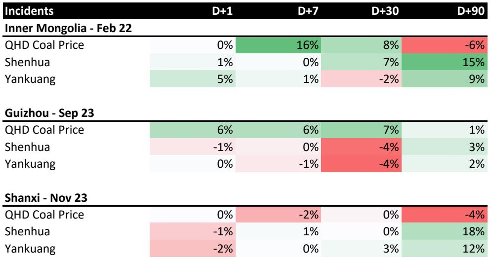
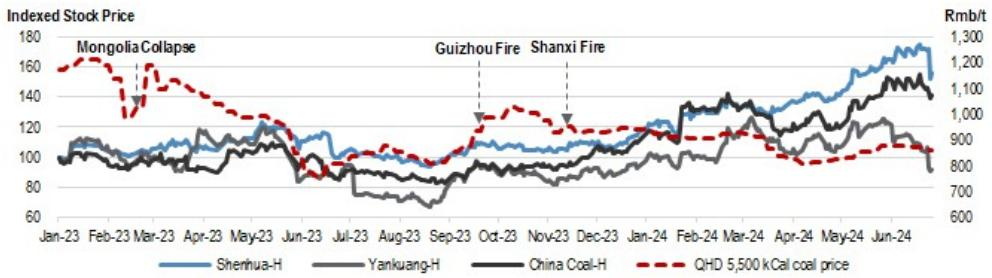
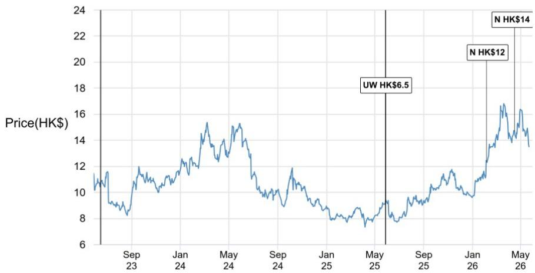

# 煤炭供给的再定价窗口已经打开，但市场仍在犹豫

山西沁源煤矿事故过去一周，82条生命的代价正在转化为中国煤炭行业最关键的供给侧变量。某外资投行在事故后第一时间发布的研报指出，这起自2009年以来最严重的矿难，可能不是一次性的价格脉冲，而是一个结构性收紧的开端。

市场当前的定价逻辑仍然停留在“短期停产、价格冲高、然后回落”的历史经验中。但这次的不同之处在于：事故发生在山西——中国焦煤的核心产区；发生在安全监管体系已经历过2023年三轮重大事故检验之后；发生在钢铁利润极度收窄、焦煤需求承压的周期底部。

报告的核心判断是：如果监管层选择扩Daiwa深化安全检查，2026年下半年的煤价中枢将系统性上移。但当前股票市场的反应远弱于现货市场的信号。这种错位，恰恰是值得关注的窗口。

## 1. 事故的直接冲击已经超出了沁源县的范围

5月22日沁源县刘神峪煤矿瓦斯爆炸后，长治市应急管理局立即要求沁源县所有煤矿停产。沁源县25座煤矿、2560万吨产能被全面叫停。这本身是一个标准的事故响应流程。

但关键的变化发生在5月24日。国家矿山安全监察局发布了针对全国煤矿瓦斯隐患的专项整治通知。这意味着，这起事故的监管影响不会局限在沁源县甚至山西省内。

根据Mysteel截至5月25日的调研数据，山西省已有109座焦煤矿停产，涉及约1.22亿吨产能。这相当于山西省总产能的9%，全国总产能的3%。而沁源县的产能仅占山西省约2%。也就是说，停产范围已经自发扩大到了事故所在县之外的地区。

报告特别指出，沁源县的复产时间表仍不确定，但其他地区的大多数停产预计仅持续3-5天。这里的关键变量是：自愿性的安全检查是否会转化为强制性的全省大检查。如果监管层选择升级，山西约30%的全国煤炭产能占比意味着，供给收紧将不再是边际性的。

## 2. 历史经验告诉我们，股票市场的反应往往滞后于现货

报告回顾了2023年三次重大煤矿事故后的市场反应，这个对照非常具有参考价值。

2023年2月22日内蒙古新井煤矿坍塌，53人死亡。事故后一周内，秦皇岛5500大卡煤价飙升16%。但中国神华和兖矿能源的股价仅在事故次日上涨1-5%后便归于平静。随后30天，神华股价累计上涨7%，兖矿反而下跌2%。

2023年9月24日贵州山脚树煤矿火灾，16人死亡。约5900万吨焦煤产能被停产三个月。一个月内煤价上涨6-7%，但两家煤炭股的股价在30天内均下跌约4%。

2023年11月16日山西吕梁火灾，26人死亡。涉及产能2190万吨。煤价和股价反应均较为平淡。

三次事故的共同特征是：现货价格在事件发生后1-4周内出现明显的脉冲式上涨，但股票价格的反应要么被压缩在1-2天内，要么需要60-90天才能逐步反映到估值中。报告给出的解释是，市场在等待“安全检查是否真正扩大”的确认信号。

这次事故的后续发展，正在提供这个确认信号。

## 3. 焦煤是最直接的受益品种，但钢厂的利润瓶颈不容忽视

报告明确指出了两个相互矛盾的力量。

正面力量来自供给端。沁源县以瘦煤和焦煤为主，山西全省停产的109座煤矿也主要集中在焦煤品种。这意味着焦煤的供给冲击最为直接。报告测算，约1.22亿吨焦煤产能的有效停产，对焦煤市场的影响远大于动力煤。

但制约因素同样明确：钢铁行业的利润已经收窄到极低水平。在钢厂利润承压的背景下，焦煤价格上涨的空间会受到下游需求的刚性约束。报告的核心判断是，焦煤价格的上行将受到“窄钢利润”的限制。

这意味着，这轮供给驱动的涨价不会是无限弹性的。煤价的最终高度取决于两个变量的互动：安全检查的持续时间和强度，以及钢铁行业能否承受原料成本的上升。如果钢价不能同步上涨，焦煤的涨价空间将被压缩。

## 4. 夏季补库叠加印尼出口限制，动力煤也有支撑逻辑

尽管焦煤是本次事故的直接受益者，但报告对动力煤同样给出了看多判断。这背后的逻辑是三重叠加。

第一重是安全检查的溢出效应。虽然停产主要集中在焦煤矿，但全省范围的安全检查不可避免地会影响部分动力煤产能。第二重是季节性需求。夏季用电高峰即将到来，电厂需要提前补库存。第三重是海运煤供给收紧。印尼的出口限制政策正在收窄海外煤的供应量。

报告预测，秦皇岛5500大卡煤价将在未来两个月内达到900元/吨。这个价格水平相较当前价格仍有上行空间，但报告同样强调了可持续性的问题——煤价能否维持高位，完全取决于停产和安全检查的持续时间与范围。

值得注意的是，报告在三个历史案例中均指出，煤价在事故后60-90天往往会出现回落。这意味着，如果这轮安全检查不能转化为制度性的产能约束，煤价的上涨可能仍然是脉冲式的。

## 5. 报告尚未完全回答的关键问题：这轮安全检查会不会变成制度性的产能约束

这是整份报告最值得追问的问题，也是报告没有完全展开的地方。

2023年的三次事故，每一次都引发了安全检查，但每一次都未能改变煤炭产能的长期供给曲线。内蒙古事故后，煤价在60天内回吐了全部涨幅。贵州事故后，煤价在90天内回到了事故前水平。山西吕梁事故后，煤价几乎没有反应。

但这次有一个潜在的不同：事故的严重程度。82人死亡是2009年以来的最高纪录。这个数字本身可能改变监管层的容忍阈值。报告提到，国家层面的专项整治通知已经下发。如果这轮整治从“自愿性”升级为“强制性”，并且从山西扩展到其他产煤省份，那么对供给的影响将是系统性的。

但报告没有给出这个判断。它只是提供了分析框架：如果监管层执行更广泛、更严格的安全检查，煤价将在2026年下半年维持高位。这个“如果”是当前所有投资判断的核心变量，也是报告留给读者自己去验证的关键假设。

## 6. 两种情景下的投资框架：关注兖矿的焦煤敞口

报告在个股层面给出了一个值得注意的区分：兖矿能源相较于中国神华，对焦煤的暴露度更高（约20%），且现货动力煤价格对其股价的影响也更直接。

在安全检查扩大化的情景下，焦煤的供给冲击最大，兖矿的弹性也最大。在安全检查仅限于短期停产的情景下，神华作为动力煤龙头，其稳定的产量和成本优势更具防御性。

但这里有一个值得警惕的历史规律。从报告提供的三次事故后股价表现看，兖矿在事故后30天的表现往往弱于神华，甚至在内蒙古事故后出现了负收益。这意味着，即使在供给冲击的背景下，焦煤股的短期波动风险也不容忽视。市场需要时间来确认供给收紧的真实性。

报告给出的评级是两者均为中性（Neutral），但这一评级是在事故前做出的。事故后的市场变化，可能需要重新评估这个评级框架。

## 7. 对产业决策者和投资者的观察框架

基于报告的分析，可以提炼出三个需要持续跟踪的变量。

第一个变量是山西省安全检查的范围和持续时间。如果停产从自愿性升级为强制性，从焦煤矿扩大到所有煤矿，从山西扩展到其他省份，那么供给收紧的力度将远超当前市场定价。

第二个变量是钢铁利润的边际变化。如果钢价在需求端获得支撑，焦煤的涨价空间将被打开。如果钢价继续承压，焦煤的涨幅将受到限制。这是一个双向约束。

第三个变量是印尼出口限制政策的执行力度。海运煤供给收紧与国内安全检查叠加，将放大动力煤的涨价弹性。但这也是一个需要持续验证的政策变量。

这三个变量中，任何一个的边际变化，都可能改变当前的市场定价。而报告的价值在于，它提供了分析这些变量的框架，但没有给出确定的答案。这正是专业研报与市场噪音的区别：它告诉你什么是关键问题，而不是告诉你标准答案。

---

这轮煤炭供给的再定价窗口已经打开，但市场仍在犹豫。犹豫的原因在于，安全检查能否从“事件驱动”转化为“制度驱动”，仍然是一个未解的问题。欢迎加入我们的社群，在微信群中继续讨论这三个核心变量的最新变化，以及它们对具体标的的定价含义。

Personal reading notes and learning share only. Not investment advice.

