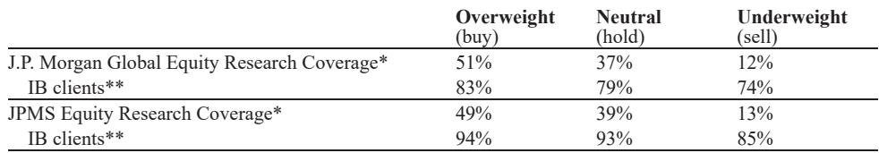

# 山西矿难真正冲击的不是煤炭，而是全球冶金煤的定价锚

5月22日山西沁源县柳神峪煤矿瓦斯爆炸，82人遇难，这是中国自2009年以来最严重的煤矿安全事故。市场第一时间做出反应：冶金煤期货跳涨，海外冶金煤股票集体走高。但某外资投行在事故后迅速发布的研报中传递了一个更值得细读的判断——这轮冲击的真正含义，不在于短期停产规模有多大，而在于它可能触发一个市场尚未充分定价的结构性重置。

这份报告的洞见在于：它没有停留在“停产多少吨”的简单叙事上，而是把事故放在中国冶金煤供给端长期收缩、全球海运冶金煤市场脆弱平衡、以及政策意图可能转向这三维框架中重新审视。读完这份报告，最核心的结论是——市场低估的不是事故本身的冲击力，而是事故可能成为政策拐点的概率。

以下是我们从报告中提炼的几个关键层次。

## 1. 停产规模看似巨大，但真正决定冲击烈度的是煤种等级而非吨数

根据Mysteel和路透的初步统计，此次安全检查和停产波及的产能折合年化约1.05亿吨原煤。这个数字乍看惊人——相当于全球海运冶金煤市场年交易量的约29%。但报告明确指出一个容易被忽略的关键变量：这些停产煤矿产出的煤种到底是什么。

沁源县所在的山西长治地区以低硫主焦煤闻名。如果停产产能确实以低挥发分主焦煤（PLV）为主，那么冲击将不成比例地放大——因为中国国内PLV基础产量仅有约5400万吨/年，且处于结构性下降通道。换句话说，1.05亿吨原煤中哪怕只有一小部分是PLV，对全球PLV市场的冲击也远大于吨数本身所暗示的。

反之，如果停产煤矿产出的主要是中挥发分硬焦煤（mid-vol HCC）或更低等级煤种，那么传导效应就有限得多。报告引用了一个数据点：当前低挥发分硬焦煤（Low Vol HCC）与PLV的价差比约为74%，且没有需求侧压力推动这一价差收窄。这意味着市场对低等级冶金煤的供需紧张程度并不敏感。

这个分析的深层含义是：投资者不能只看“停产了多少吨”，而要看“停产的是什么煤”。在PLV市场本就偏紧的背景下，任何PLV供给的边际减少都会产生不成比例的价格效应。而目前市场对煤种结构的判断仍然高度不确定——这正是研报没有完全回答、需要持续跟踪的第一个关键问题。

## 2. 持续时间是比规模更重要的变量，三个情景对应完全不同的资产定价逻辑

报告将持续时间分为三个情景，每个情景对应不同的市场含义和投资含义。

第一个情景：停产持续数天到数周。安全检查结束后产能逐步恢复，价格短期内冲高后回落。报告给出的概率约为35%。在这个情景下，事故对资产定价的影响是暂时性的，冶金煤相关股票的上涨更多是情绪驱动而非基本面变化。

第二个情景：停产持续2-3个月。这将造成真正的PLV供给紧张，并可能拉动优质硬焦煤（SSCC/SHCC）价格跟随上涨。报告给出的概率约为40%。在这个情景下，中国将不得不增加海运冶金煤进口来弥补国内缺口。考虑到山西成熟的铁路-港口基础设施（大秦铁路全长653公里），国内供给缺口将直接转化为海运进口需求的增量——这对全球冶金煤价格的影响将是实质性的。

第三个情景：多年度结构性重置。北京可能利用此次事故作为政策抓手，推动更深层次的安全导向型行业整合，实质性地压缩冶金煤产能。报告给出的概率约为25%。这个情景的参照系是2009年：当年中国同样经历了一次重大矿难后的安全整顿，结果是中国冶金煤进口量从约200万吨/年飙升至约3900万吨/年。虽然今天中国已经是一个近1亿吨/年的冶金煤进口国，边际进口冲击的弹性变小了，但考虑到全球海运冶金煤市场日均交易量仅约100万吨，任何额外的进口增量都足以推动价格重估。

这三个情景的划分本身就是一个分析框架：投资者需要做的不是押注单一情景，而是建立对概率变化的跟踪机制。如果政策信号和政策执行力度超出市场预期，那么概率权重就应该从第一情景逐步向第三情景倾斜。

## 3. 冶金煤与动力煤的需求基本面正在分化，市场对此定价不足

报告花了相当篇幅强调一个容易被忽视的区分：冶金煤和动力煤的供需逻辑正在背离。

冶金煤的需求端出现了独立改善信号。过去4-6周，中国钢铁市场状况持续好转——钢铁出口下降，国内钢价和钢厂利润回升。这一改善发生在矿难之前，与事故无关。报告认为，这一趋势为冶金煤价格提供了需求侧支撑。

而动力煤的基本面则明显疲弱。根据行业反馈，当前6000大卡动力煤现货价格较纽卡斯尔基准指数（GC Newcastle）存在7-9美元/吨的折价，日本和台湾电厂库存充足。这意味着，事故后动力煤相关股票的上涨更多是情绪驱动的空头回补，而非基本面变化的结果。

这个区分的投资含义很直接：如果投资者因为“煤炭股上涨”而笼统地看多整个煤炭板块，很可能犯下方向性错误。真正受益于此次事件的是冶金煤，尤其是PLV和优质冶金煤相关资产，而动力煤资产的基本面叙事并未改变。

## 4. 报告尚未完全回答的关键问题：政策意图的边界在哪里

尽管报告给出了清晰的分析框架，但它也坦诚地指出了几个尚未被回答的关键问题。

第一个是政策意图的边界。北京是否真的会将此次事故转化为结构性整合的契机？历史上中国有过类似先例，但今天的政策环境与2009年已经截然不同——中国正在推进“双碳”目标，对煤炭产能的态度本身就处于转型期。事故可能加速淘汰落后产能，但也可能只是暂时性的安全检查。报告给出的25%概率意味着结构性重置并非基准情景，但也不应被轻易忽视。

第二个是煤种等级的确认。停产煤矿的实际煤种构成目前仍是一个“spec unconfirmed”（规格未确认）的状态。这是整个分析链条中最关键的输入变量，却也是信息最不透明的一环。市场需要持续跟踪官方和行业的数据更新。

第三个是全球海运市场的传导弹性。中国已经是全球最大的冶金煤进口国，年进口量接近1亿吨。在这个基数上，边际进口增量的价格弹性取决于全球供给端的响应能力——澳大利亚、蒙古、美国等主要出口国的产能是否还有闲置空间，以及港口和物流瓶颈能否在短期内突破。报告没有对此展开详细分析，这恰恰是完整报告中可能包含的更深层内容。

## 5. 投资者应该建立什么样的观察框架

基于这份报告的推导逻辑，我们认为投资者可以建立一个三层的观察框架来跟踪事态发展。

第一层是“信号层”：关注停产产能的实际煤种构成、安全检查的持续时间、以及官方是否出台新的行业整合政策。这些信号将帮助判断概率权重的变化。

第二层是“传导层”：关注中国冶金煤进口量的月度变化、港口库存的变动、以及海外冶金煤价格（尤其是PLV和SSCC/SHCC）的走势。这些数据将验证供给冲击是否真正传导到了全球市场。

第三层是“定价层”：关注冶金煤相关资产的估值是否已经充分反映了不同情景的概率权重。如果市场仍然按照“数天到数周”的情景定价，而实际信号指向“2-3个月”甚至“结构性重置”，那么资产价格可能面临重估空间。

这三个层次相互递进：信号层的变化驱动传导层的数据，传导层的数据最终影响定价层的判断。投资者不需要预测最终结果，而是需要建立一套动态调整概率权重的机制。

---

这份报告的完整版本还包含了对具体公司的估值分析、历史可比事件的详细复盘、以及不同情景下的价格路径模拟。这些内容超出了本文能够覆盖的范围，但对于需要做出具体投资决策的读者来说至关重要。

报告中最令人深思的一点是：它并没有给出一个确定的结论，而是提供了一套分析框架和概率判断。在不确定性极高的环境下，这可能比任何“买入”或“卖出”的建议都更有价值。

如果您对完整报告中的具体公司分析、情景模拟和估值框架感兴趣，欢迎在我们的星球微信群里继续讨论。群内会定期分享这类深度研报的精读笔记，以及我们基于这些报告构建的观察框架和投资逻辑。期待与您进一步交流。

Personal reading notes and learning share only. Not investment advice.

