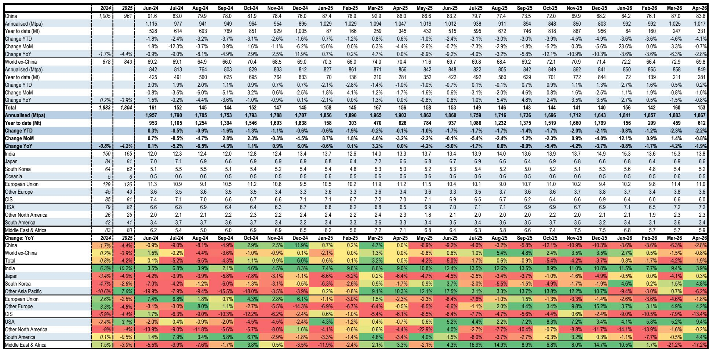
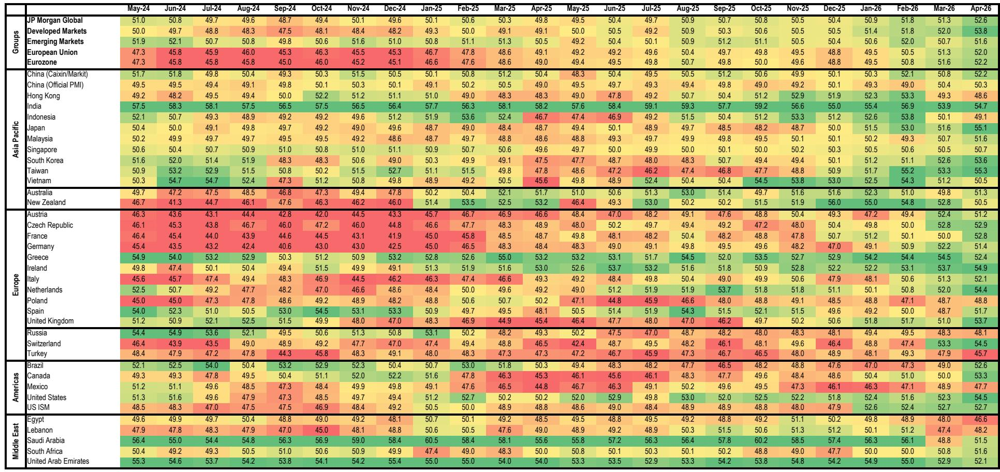
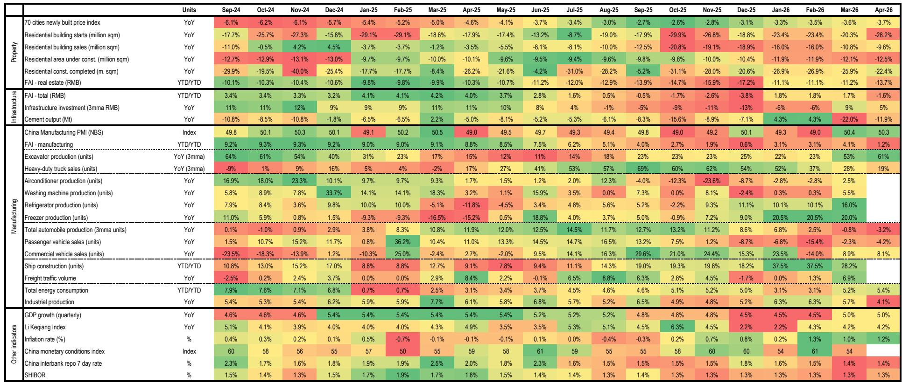

# Iron Ore's Price Floor Has Fundamentally Shifted: Why the Market Must Rethink Its Long-Term Assumptions

The iron ore market is delivering a message that many investors are misreading. Prices have held above USD 100 per tonne despite Chinese steel production declining 4.1% year-to-date through April, record port stockpiles, and increasing seaborne supply. This is not a demand-driven rally. It is a structural repricing of the cost floor. The marginal cost of producing the last tonne of iron ore needed to balance the market has risen permanently, and the implications extend far beyond near-term price forecasts. The market has been focused on the wrong variable—Chinese steel demand—when the real story is about the cost curve itself.

Three forces are converging to lift the entire cost structure of the industry. First, input cost inflation tied to the geopolitical environment has raised diesel, explosives, and freight expenses by an estimated USD 7 per tonne for marginal seaborne suppliers and USD 5 to 13 per tonne in freight from Australia and Brazil respectively. Second, miners are delivering lower quality ore, which increases the cost per iron unit even when tonnage remains constant. Third, the persistent resilience of Chinese steel output around one billion tonnes per annum means that the much-anticipated Simandou supply will displace less marginal production than previously assumed. Together, these factors justify a long-term real price increase of 12.5% to USD 90 per tonne, a shift that has not yet been fully priced into equity valuations or investment decisions across the mining complex.

The timing of this repricing matters. The last long-term price update occurred in the second quarter of 2023, a period when China's post-COVID recovery was uncertain and Simandou's threat loomed large. Since then, the market has experienced a series of cost shocks that were initially dismissed as temporary. They have proven persistent. For investors, the question is no longer whether iron ore will fall back to USD 80 per tonne in real terms, but whether the new equilibrium is sustainable and what it means for the relative positioning of producers, the viability of new projects, and the strategic calculus for steelmakers.

## Higher Freight Costs Have Created a Two-Tier Market That Rewrites Competitive Dynamics

The most immediate and visible change in the iron ore market is the asymmetric impact of freight cost inflation on different producers. Since the beginning of the Middle East conflict, bulk freight rates from Western Australia to China have risen by approximately USD 5 per tonne, while rates from Brazil to China have surged by USD 14 per tonne. This is not a minor logistical adjustment. It represents a structural shift in the relative competitiveness of the world's major iron ore basins.

The consequence is stark. Australian producers, which benefit from shorter shipping distances, have seen their free-on-board realised prices increase by roughly 1% since the conflict began. Brazilian producers, by contrast, have experienced a 10% decline in their FOB realisations. The same tonne of iron ore delivered to China now carries a very different value at the mine gate depending on its origin. This divergence has second-order effects that the market has not fully processed. Brazilian miners face margin compression that may accelerate decisions to rationalise higher-cost capacity, while Australian producers enjoy a relative cost advantage that strengthens their position in the seaborne market.

For investors, the freight differential creates a clear analytical framework. The value of a mining asset is no longer solely a function of its grade and strip ratio. It is increasingly a function of its location relative to the primary demand center. Assets in the Pilbara have gained a structural advantage that should persist as long as geopolitical risk keeps freight markets elevated. This has implications for portfolio construction, valuation multiples, and the attractiveness of growth projects in different regions. The market may be underestimating how much of the recent price strength is actually a transfer from Brazilian FOB margins to the shipping industry and, indirectly, to Australian competitiveness.

## The Cost Curve Has Not Only Shifted Upward, It Has Steepened, Exposing the Most Vulnerable Producers

The cost inflation story is not uniform across the industry. The report's analysis shows that FOB costs for Australian miners have increased by USD 1.1 to 7.4 per tonne, while CFR costs have risen by USD 6 to 12 per tonne. This range matters because it reveals that the cost curve has steepened. The gap between the lowest-cost tier-one producers and the marginal high-cost suppliers has widened. For the most efficient Australian operations, the margin impact of higher costs has been minimal because the increase in the iron ore price has roughly offset the cost increase. For marginal producers, particularly those in non-traditional supply regions, the math is far less forgiving.

This steepening of the cost curve has a direct implication for price support. When the marginal cost of the highest-cost tonne needed to meet demand rises, the floor under the entire price structure rises with it. The report's analysis suggests that any dip in iron ore prices below USD 90 per tonne has historically been met with supply curtailments from elastic producers, particularly in India. With the cost curve now higher, the price at which supply begins to exit the market has moved up. This creates a natural floor that is higher than the previous long-term equilibrium.

The steepening also creates strategic winners and losers. Tier-one producers with low costs and short shipping distances are well-positioned to maintain or expand margins. Mid-tier producers with higher costs and longer shipping distances face a more challenging environment. The most vulnerable are non-traditional suppliers in Africa and other regions that rely on higher prices to remain viable. As the cost curve steepens, the market is likely to see a consolidation of supply toward the lowest-cost quartile, a process that will accelerate if prices drift lower over the next several years.

## China's Steel Output Is More Resilient Than the Headline Numbers Suggest, Delaying the Simandou Displacement Thesis

The conventional bearish narrative for iron ore has long rested on two pillars: peak steel demand in China and the arrival of Simandou supply. The report's data challenges both assumptions in ways that matter for the long-term price outlook. Chinese steel production was down 4.1% year-to-date through April, but the annualised run rate in April was approximately one billion tonnes, a level that exceeds any month in the second half of 2025. This is not a market in collapse. It is a market that has found a new equilibrium at a higher base than most analysts expected.

The implications for Simandou are significant. When the long-term price was last set at USD 80 per tonne in 2023, the assumption was that Chinese steel output would decline more rapidly, leaving room for Simandou's 60 to 100 million tonnes of annual capacity to displace high-cost marginal supply. With Chinese output running at one billion tonnes, more marginal tonnes remain in the market. Simandou will still have a price impact, but the magnitude and timing of that impact are likely to be less severe than previously feared. The market may absorb Simandou supply without the catastrophic price collapse that has been priced into bearish scenarios.

There is also an important nuance in the Chinese data that the report flags but does not fully resolve. The gap between reported steel output and raw material consumption suggests that a meaningful volume of unreported production exists, estimated at approximately 60 million tonnes per annum. If this unreported output is real and persistent, it means that true Chinese steel demand is higher than official statistics indicate. This would further support the case for a higher long-term iron ore price. The analytical question that remains open is whether this unreported output is sustainable or whether it represents a temporary phenomenon that will be closed by environmental or regulatory pressure.

## What the Report Does Not Fully Answer: The Sustainability of Higher Freight Costs and the Elasticity of Non-Traditional Supply

Every analytical framework has its limits, and this report is no exception. Two critical uncertainties remain unresolved, and they will determine whether the new price equilibrium is durable or temporary. The first is the sustainability of higher freight costs. The report attributes the freight increase to the Middle East conflict, but it does not model how quickly freight markets might normalise if geopolitical tensions ease. If freight rates return to pre-conflict levels, Brazilian producers would regain competitiveness, and the two-tier market would narrow. The long-term price implication would depend on whether the cost curve shifts back down or whether other factors, such as higher input costs and lower ore quality, keep the floor elevated.

The second unresolved question is the elasticity of non-traditional supply. The report notes that Indian exports have been highly responsive to price signals, with supply curtailing when prices fall below USD 90 per tonne. But the report also argues that Indian net exports will decline over the longer term as domestic steel demand grows. These two statements are in tension. If Indian supply becomes less elastic over time, the price floor may be higher than the current analysis suggests. If Indian supply remains highly elastic, the floor may be lower. The interaction between domestic steel growth in India, export availability, and global iron ore prices is a dynamic that deserves deeper analytical attention than the report provides.

For investors, these uncertainties create a range of plausible outcomes. The bull case is that freight costs remain elevated, non-traditional supply becomes less elastic, and Chinese steel output stays above one billion tonnes. The bear case is that freight normalises, Simandou ramps faster than expected, and Chinese demand declines more rapidly. The report's updated forecasts sit in the middle of this range, but the balance of evidence suggests that the risks are skewed to the upside for prices over the next two to three years.

## A Decision Framework for Investors: How to Position Across the Iron Ore Value Chain

The report's analysis translates into a clear decision framework for investors navigating the iron ore market. The framework has three dimensions: cost position, geographic exposure, and balance sheet flexibility.

First, cost position is now the dominant variable. Producers in the lowest quartile of the cost curve, particularly those with short shipping distances to China, are best positioned to benefit from the higher price floor. Their margins are resilient even if prices drift lower, and they have the financial capacity to invest in growth or return capital to shareholders. Producers in the second and third quartiles face more risk, particularly if the cost curve continues to steepen. Their viability depends on maintaining cost discipline and avoiding value-destructive growth projects.

Second, geographic exposure matters more than it did before the freight shock. Australian producers have a structural advantage that should persist as long as freight rates remain elevated. Brazilian producers face margin headwinds that may require operational improvements or portfolio rationalisation. African producers with long shipping distances are the most vulnerable, particularly if non-traditional supply becomes less competitive.

Third, balance sheet flexibility provides an option value that is often overlooked. Companies with strong balance sheets can weather periods of price weakness, invest counter-cyclically, and acquire assets from distressed sellers. Companies with high leverage are exposed to the risk that prices fall below the new floor, however temporarily. The report's analysis suggests that the floor is higher than it was, but it is not guaranteed. A global recession, a sharp slowdown in Chinese construction, or a faster-than-expected Simandou ramp could still push prices lower.

For equity investors, the implication is to favour producers with low costs, short shipping distances, and strong balance sheets. For credit investors, the analysis supports a preference for investment-grade miners over high-yield operators with exposure to marginal supply. For commodity investors, the case for long-dated iron ore exposure has strengthened, but the entry point matters given that near-term prices are already reflecting much of the cost push.

Join the community to read the full report and review the original charts that detail the cost curve analysis, freight rate assumptions, and China steel production data that underpin this strategic reassessment.

*This article is for learning and discussion only and does not constitute investment advice.*

Personal reading notes and learning share only. Not investment advice.

