# 2026 US Securitized Credit Mid-Year Outlook

# More Pictures and Fewer Words

# Jim Egan

Strategist

MS & Co. LLC

James.F.Egan@morganstanley.com

+1 (212) 761-4715

# Catherine Liu

Strategist

MS & Co. LLC

Catherine.Liu2@morganstanley.com

+1 (212) 761-0222

# Joyce Jiang

Strategist

MS & Co. LLC

Joyce.Jiang@morganstanley.com

+1 (212) 761-0165

# Gabriel Reyes Esclasans

Strategist

MS & Co. LLC

Gabriel.Reyes.Esclasans@morganstanley.com

+1 (212) 761-4134

# Carolyn Campbell

Strategist

MS & Co. LLC

Carolyn.Campbell@morganstanley.com

+1 (212) 761-3748

# Raquel Kanner

Strategist

MS & Co. LLC

Raquel.Kanner@morganstanley.com

+1 (212) 761-1103

All data as of May 8, 2026 unless otherwise indicated.

MS does and seeks to do business with companies covered in MS. As a result, investors should be aware that the firm may have a conflict of interest that could affect the objectivity of MS. Investors should consider MS as only a single factor in making their investment decision.

For analyst certification and other important disclosures, refer to the Disclosure Section, located at the end of this report.

Table of Contents 

<table><tr><td></td><td>Page Number</td></tr><tr><td>Introduction</td><td>3</td></tr><tr><td>Housing</td><td>7</td></tr><tr><td>Residential Credit</td><td>15</td></tr><tr><td>CMBS</td><td>24</td></tr><tr><td>CLOs</td><td>34</td></tr><tr><td>US ABS</td><td>42</td></tr></table>

Macroeconomic Forecast Table 

<table><tr><td>Economic Forecasts</td><td>2025</td><td>2026E</td><td>2027E</td></tr><tr><td>Real GDP (%Y)</td><td>2.0%</td><td>2.3%</td><td>2.6%</td></tr><tr><td>CPI (%Y)</td><td>2.7%</td><td>3.4%</td><td>2.0%</td></tr><tr><td>Core PCE (%Y)</td><td>2.9%</td><td>2.8%</td><td>2.3%</td></tr><tr><td>Policy Rate</td><td>3.625%</td><td>3.625%</td><td>3.125%</td></tr><tr><td>Unemployment Rate</td><td>4.5%</td><td>4.3%</td><td>4.1%</td></tr><tr><td>Housing Forecasts</td><td>2025</td><td>2026E</td><td>2027E</td></tr><tr><td>HPA</td><td>1%</td><td>2%</td><td>2%</td></tr><tr><td>EHS</td><td>1%</td><td>0%</td><td>3%</td></tr><tr><td>NHS</td><td>-1%</td><td>-1%</td><td>6%</td></tr><tr><td>Macro Forecasts</td><td>Spot</td><td>4Q 2026E</td><td>2Q 2027E</td></tr><tr><td>10Y</td><td>4.36%</td><td>4.25%</td><td>4.20%</td></tr><tr><td>S&amp;P</td><td>7,399</td><td>8,000</td><td>8,300</td></tr><tr><td>USD/JPY</td><td>157</td><td>157</td><td>156</td></tr><tr><td>IG Corporates</td><td>77</td><td></td><td>90</td></tr><tr><td>HY Corporates</td><td>266</td><td></td><td>275</td></tr></table>

Source: MS forecasts

# MS 2Q27 Spread and Excess Return Forecasts Across Securitized Credit

<table><tr><td rowspan="2">Product</td><td rowspan="2">Current</td><td colspan="3">Spreads</td><td colspan="3">Excess Returns</td></tr><tr><td>Bull</td><td>Base</td><td>Bear</td><td>Bull</td><td>Base</td><td>Bear</td></tr><tr><td>YoY HPA Forecast</td><td></td><td></td><td></td><td></td><td>4.0%</td><td>2.0%</td><td>-2.0%</td></tr><tr><td>Agency MBS Index OAS</td><td>19</td><td>15</td><td>20</td><td>40</td><td>0.4%</td><td>0.1%</td><td>-1.1%</td></tr><tr><td>Non-QM AAA</td><td>125</td><td>95</td><td>120</td><td>175</td><td>1.9%</td><td>1.4%</td><td>0.2%</td></tr><tr><td>Non-QM BBB</td><td>195</td><td>150</td><td>185</td><td>290</td><td>3.7%</td><td>2.3%</td><td>-1.8%</td></tr><tr><td>Prime Auto AAA</td><td>35</td><td>15</td><td>25</td><td>55</td><td>0.9%</td><td>0.6%</td><td>-0.2%</td></tr><tr><td>Subprime Auto AAA</td><td>45</td><td>30</td><td>55</td><td>100</td><td>0.7%</td><td>0.3%</td><td>-0.4%</td></tr><tr><td>Subprime Auto BBB</td><td>115</td><td>100</td><td>140</td><td>225</td><td>1.7%</td><td>0.2%</td><td>-2.9%</td></tr><tr><td>Fiber A</td><td>145</td><td>120</td><td>140</td><td>180</td><td>2.7%</td><td>1.7%</td><td>-0.3%</td></tr><tr><td>Data Center A</td><td>180</td><td>150</td><td>175</td><td>225</td><td>3.3%</td><td>2.1%</td><td>-0.5%</td></tr><tr><td>CMBS AAA Secondary</td><td>71</td><td>60</td><td>75</td><td>110</td><td>1.8%</td><td>0.3%</td><td>-3.2%</td></tr><tr><td>CMBS BBB- Secondary</td><td>465</td><td>390</td><td>470</td><td>750</td><td>12.2%</td><td>4.2%</td><td>-23.9%</td></tr><tr><td>Agency CMBS KA2</td><td>30</td><td>25</td><td>30</td><td>50</td><td>0.8%</td><td>0.3%</td><td>-1.5%</td></tr><tr><td>US CLO AAA Primary</td><td>123</td><td>108</td><td>120</td><td>175</td><td>2.1%</td><td>1.4%</td><td>-1.6%</td></tr><tr><td>US CLO BB Primary</td><td>535</td><td>440</td><td>580</td><td>800</td><td>14.4%</td><td>1.1%</td><td>-19.8%</td></tr><tr><td>UK Prime Senior</td><td>50</td><td>40</td><td>48</td><td>65</td><td>0.8%</td><td>0.6%</td><td>0.1%</td></tr><tr><td>UK NC Senior</td><td>80</td><td>70</td><td>75</td><td>90</td><td>1.2%</td><td>1.0%</td><td>0.5%</td></tr><tr><td>EU CLO Primary Senior</td><td>128</td><td>118</td><td>125</td><td>160</td><td>1.8%</td><td>1.4%</td><td>-0.5%</td></tr></table>

Source: Bloomberg, MS forecasts

Alternative Economic Scenarios 

<table><tr><td>1: Aggregate demand upside</td><td>2: AI productivity boost with labor displacement</td><td>3: Permanent oil premium</td><td>4: A global recession</td></tr><tr><td>The oil shock abates, and elevated wealth and improving confidence support consumption and keep business spending elevated.Stronger demand also results in tighter labor markets.Inflation pressures step up as stronger demand keeps price pressures elevated.The Fed eventually raises rates, but only once it is clear that the stronger growth is coming from demand rather than productivity. It begins hiking in 4Q26, delivering 100bp of hikes to bring the policy rate to 4.50-4.75%.</td><td>Cautious businesses continue to expand output at about the same pace in 2027 as in 2026, but higher productivity allows layoffs. The unemployment rate rises to 4.5% by the end of 2026 and 4.8% by the end of 2027.Weaker employment spills into softer consumer spending, in turn discouraging business investment and hiring.With more labor market slack, core inflation slows decisively in late 2026. The Fed begins lowering rates at the start of 2027; three cuts take the funds rate to 2.875%.</td><td>Oil prices remain above $100/bbl through 2027. Prices weigh on consumption for longer, but AI capex remains robust; real GDP rises 2.0% in 2026 and 2.4% in 2027, slightly below the base case.Labor demand is slightly softer as well, though the unemployment rate remains low.A more prolonged oil shock means more supply-chain pressures and further passthrough to core inflation.Persistent inflation keeps the Fed cautious. The Fed keeps the target range unchanged at 3.50-3.75% through 2027.</td><td>A sharp rise in oil prices to $140-160/bbl through 3Q 2026 triggers supply shortages and demand destruction, pushing the economy into a mild recession.Inflation surges in the near term. Real consumer spending falls, and businesses pull back on investment and hiring.Payrolls decline throughout 2026, and the unemployment rate rises to a peak of 5.5% this year. The Fed delivers 200bps of cuts in 2026, lowering rates 1.50-1.75%, although there is no QE.As growth recovers in 2027 and inflation stabilizes, the Fed hikes by 100bp to a target range of 2.50-2.75%.</td></tr></table>

# Bank Demand Is Supported by Deregulation

The 2026 Basel Endgame proposal unlocked excess capital banks had been holding to satisfy the 2023 proposal, improving bank portfolio capacity to net add investment securities

Aggregate CET1 Capital Requirement Impacts   
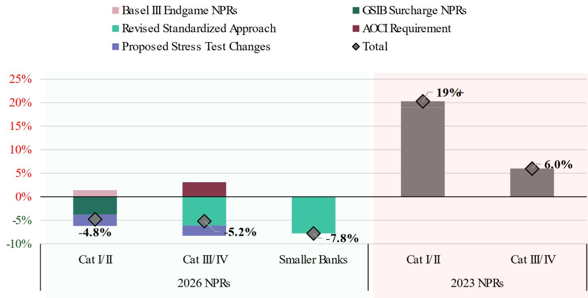

bar

| Category         | 2026 NPRs | 2023 NPRs |
| ---------------- | --------- | --------- |
| Cat I/II         | -4.8%     | -       |
| Cat III/IV       | -5.2%     | -       |
| Smaller Banks    | -7.8%     | -       |
| Cat I/II         | 19%       | 20%       |
| Cat III/IV       | 6.0%      | 6%        |

Note: NPR = Notice of Proposed Rulemaking. Inclusive of the recent changes to eSLR, capital requirements for Cat I/II banks go down by 6%; Source: Federal Reserve, MS

# US Housing

Nowhere to Go But Up...

...But That Route Seems to be Under Construction 

<table><tr><td rowspan="2"></td><td colspan="4">Percent Change</td><td colspan="4">Actual Values</td></tr><tr><td>2024a</td><td>2025a</td><td>2026e</td><td>2027e</td><td>2024a</td><td>2025a</td><td>2026e</td><td>2027e</td></tr><tr><td>HPA</td><td>4%</td><td>1%</td><td>2%</td><td>2%</td><td></td><td></td><td></td><td></td></tr><tr><td>Existing Home Sales</td><td>-1%</td><td>1%</td><td>0%</td><td>3%</td><td>4.06mm</td><td>4.08mm</td><td>4.10mm</td><td>4.25mm</td></tr><tr><td>New Home Sales</td><td>3%</td><td>-1%</td><td>-1%</td><td>6%</td><td>685k</td><td>679k</td><td>675k</td><td>715k</td></tr><tr><td>1-Unit Housing Starts</td><td>7%</td><td>-7%</td><td>1%</td><td>3%</td><td>1016k</td><td>942k</td><td>950k</td><td>980k</td></tr></table>

Source: MS estimates

# Affordability

With 10yr Treasuries stuck above 4.15, our affordability assumptions estimates assume a 30yr mortgage rate that finishes 2026 at $\sim 6\frac{1}{4}$ before ending 2027 at $\sim 6\frac{1}{8}$ . Affordability improves over the forecast horizon as income growth exceeds HPA, but it remains near the most challenged it has been in decades.

# Housing Activity

The combination of challenged affordability and geopolitical uncertainty/volatility should keep home sales range-bound. Meanwhile, accelerating weakness in new home pricing and the stubbornly elevated inventories there should keep building volumes muted.

# Home Prices

As inventory growth has outpaced demand, the pace of YoY HPA has decelerated. As we approach 0% nationally, we expect home prices to find a floor. There simply is not enough for-sale inventory to drive meaningfully negative home prices. As mortgage rates languish above 6%, we expect the pace of existing inventory growth to slow, which will allow for a slight acceleration of HPA back to +2% by the end of 2026, where we expect it to stay for 2027.

# Affordability to Improve on the Margins, Remain Challenged

With mortgage rates stuck above 6% through the end of 2027, affordability to only improve slightly as income growth outpaces home price growth

Monthly Payment as % of Income   
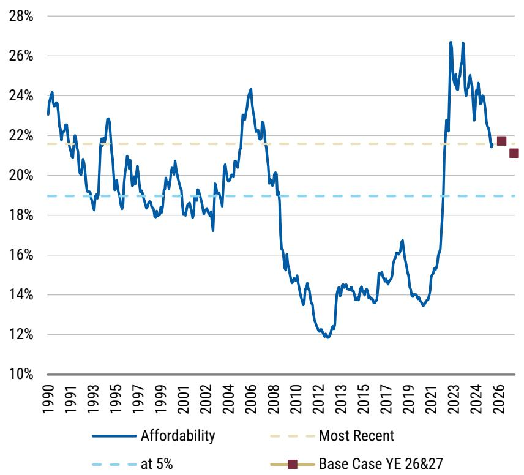

line

| Year | Affordability | Most Recent | at 5% | Base Case YE 26&27 |
|------|---------------|-------------|-------|-------------------|
| 2026 | ~21.5%        | ~21.5%      | ~19.0%| ~21.5%            |

Pace of affordability improvement moderates with mortgage rates stuck above 6%   
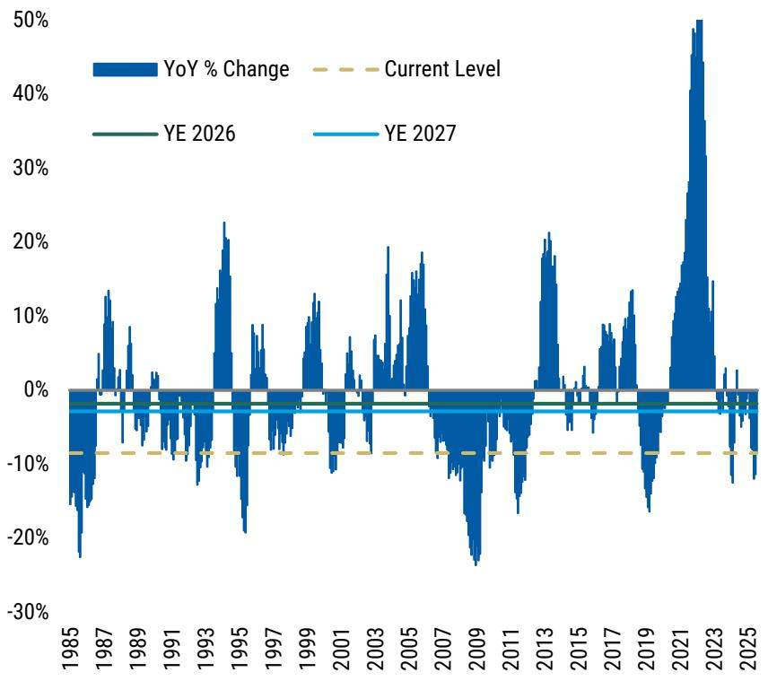  
Source: NAR, Freddie Mac, US Census Bureau, MS estimates

# Improved Affordability in Recent Years Has Not Helped Sales

Existing home sales volumes have materially underperformed prior periods of similar affordability improvement as market remains very locked in

Existing home sales in the 12 months following 10%+ affordability improvements   
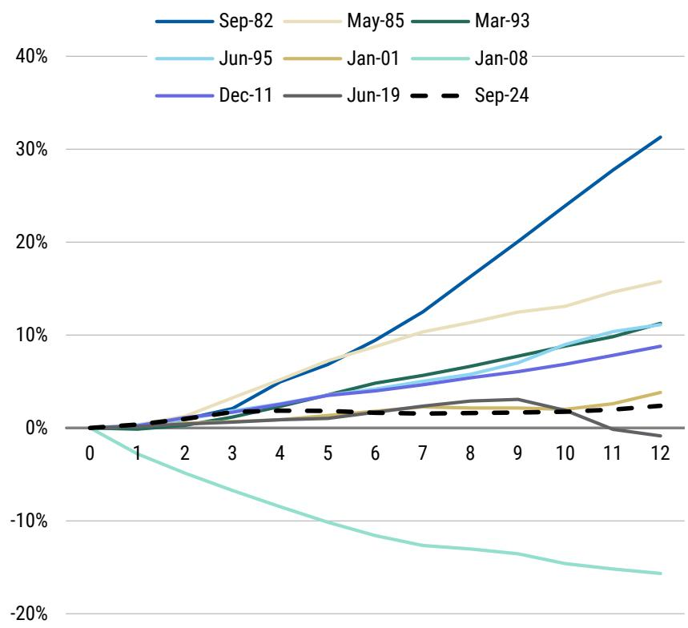

line

| Month    | Sep-82 | May-85 | Mar-93 | Jun-95 | Jan-01 | Jan-08 | Dec-11 | Jun-19 | Sep-24 |
| -------- | ------ | ------ | ------ | ------ | ------ | ------ | ------ | ------ | ------ |
| 0        | 0%     | 0%     | 0%     | 0%     | 0%     | 0%     | 0%     | 0%     | 0%     |
| 1        | ~0%    | ~0%    | ~0%    | ~0%    | ~0%    | ~-5%   | ~0%    | ~0%    | ~0%    |
| 2        | ~0%    | ~0%    | ~0%    | ~0%    | ~0%    | ~-10%  | ~0%    | ~0%    | ~0%    |
| 3        | ~2%    | ~3%    | ~1%    | ~1%    | ~1%    | ~-15%  | ~1%    | ~0%    | ~1%    |
| 4        | ~5%    | ~6%    | ~2%    | ~2%    | ~2%    | ~-20%  | ~2%    | ~1%    | ~1%    |
| 5        | ~7%    | ~8%    | ~3%    | ~3%    | ~3%    | ~-25%  | ~3%    | ~1%    | ~1%    |
| 6        | ~9%    | ~10%   | ~4%    | ~4%    | ~4%    | ~-30%  | ~4%    | ~1%    | ~1%    |
| 7        | ~12%   | ~11%   | ~5%    | ~5%    | ~5%    | ~-35%  | ~5%    | ~1%    | ~1%    |
| 8        | ~15%   | ~12%   | ~6%    | ~6%    | ~6%    | ~-40%  | ~6%    | ~1%    | ~1%    |
| 9        | ~18%   | ~13%   | ~7%    | ~7%    | ~7%    | ~-45%  | ~7%    | ~2%    | ~1%    |
| 10       | ~22%   | ~14%   | ~8%    | ~8%    | ~8%    | ~-50%  | ~8%    | ~2%    | ~1%    |
| 11       | ~26%   | ~15%   | ~9%    | ~9%    | ~9%    | ~-55%  | ~9%    | ~1%    | ~1%    |
| 12       | ~31%   | ~16%   | ~10%   | ~10%   | ~10%   | ~-60%  | ~10%   | ~0%    | ~2%    |

Outstanding mortgage rate distribution is moving higher...gradually   
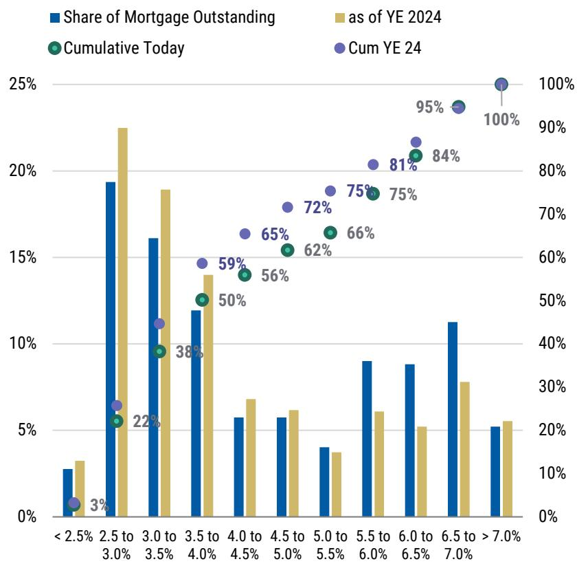

bar_line

| Maturity Range | Share of Mortgage Outstanding (%) | Cumulative Today (%) | Cumulative Year-over-Year (%) |
|---|---|---|---|
| < 2.5% | 2.8 | 3 | 3 |
| 2.5 to 3.0% | 19.3 | 5.6 | 22 |
| 3.0 to 3.5% | 16.1 | 9.5 | 11.3 |
| 3.5 to 4.0% | 11.9 | 12.6 | 14.7 |
| 4.0 to 4.5% | 5.7 | 14.0 | 59 |
| 4.5 to 5.0% | 5.7 | 15.6 | 65 |
| 5.0 to 5.5% | 3.9 | 16.6 | 72 |
| 5.5 to 6.0% | 8.9 | 18.4 | 75 |
| 6.0 to 6.5% | 8.7 | 20.8 | 81 |
| 6.5 to 7.0% | 11.3 | 27.8 | 95 |
| > 7.0% | 5.2 | 5.4 | 100 |

Source: eMBS, NAR, MS

# Locked In at Turnover Floor

For 10 quarters, existing home sales as a percentage of housing stock have been bouncing around \~40yr lows; we expect support at these levels to hold

Median monthly payment as a share of household income based on when the home was purchased   
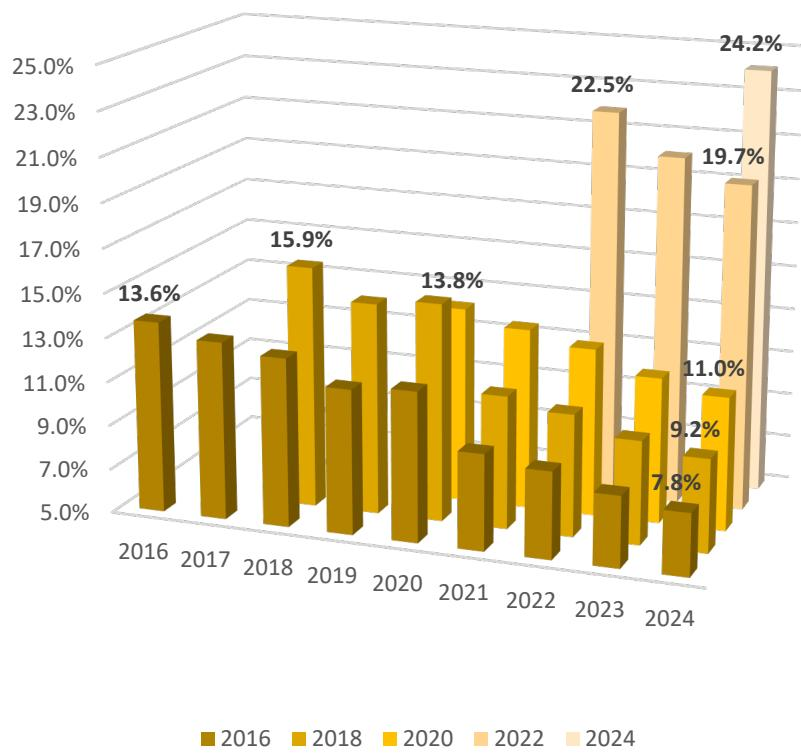

bar

| Year | 2016 (%) | 2018 (%) | 2020 (%) | 2022 (%) | 2024 (%) |
|---|---|---|---|---|---|
| 2016 | 13.6 | | | | |
| 2017 | | 13.0 | | | |
| 2018 | | 12.5 | 15.9 | | |
| 2019 | | 11.0 | 14.8 | | |
| 2020 | 11.0 | 14.8 | 14.5 | | |
| 2021 | | 8.0 | 10.8 | | |
| 2022 | 7.0 | | 13.3 | | |
| 2023 | 6.0 | | 12.8 | 22.5 | |
| 2024 | 5.8 | 9.2 | 11.0 | 19.7 | 24.2 |

Existing home sales as % of ownership stock at 40+ year lows   
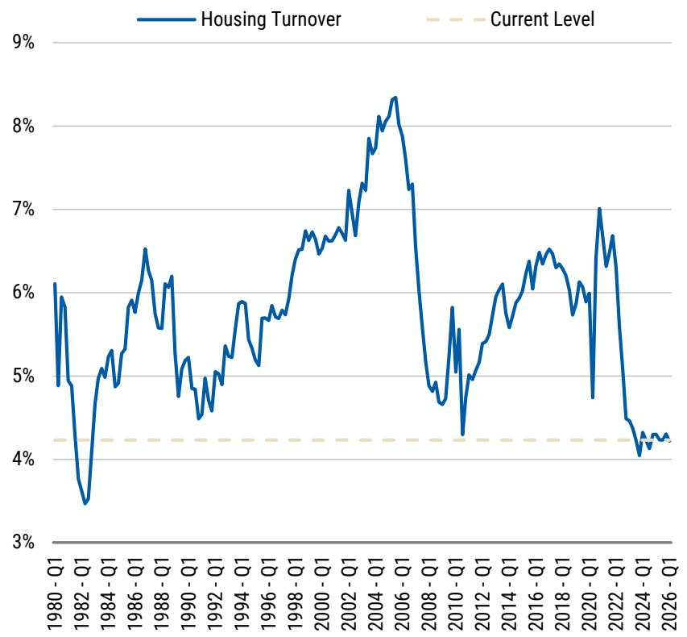

line

| Quarter | Housing Turnover |
| ------- | ---------------- |
| 1980 Q1 | 6.0%             |
| 1982 Q1 | 3.5%             |
| 1984 Q1 | 5.0%             |
| 1986 Q1 | 6.5%             |
| 1988 Q1 | 5.5%             |
| 1990 Q1 | 4.5%             |
| 1992 Q1 | 5.0%             |
| 1994 Q1 | 5.8%             |
| 1996 Q1 | 5.5%             |
| 1998 Q1 | 6.5%             |
| 2000 Q1 | 7.0%             |
| 2002 Q1 | 7.5%             |
| 2004 Q1 | 8.0%             |
| 2006 Q1 | 8.5%             |
| 2008 Q1 | 7.0%             |
| 2010 Q1 | 4.5%             |
| 2012 Q1 | 5.5%             |
| 2014 Q1 | 6.0%             |
| 2016 Q1 | 6.5%             |
| 2018 Q1 | 6.0%             |
| 2020 Q1 | 7.0%             |
| 2022 Q1 | 4.5%             |
| 2024 Q1 | 4.0%             |
| 2026 Q1 | 4.2%             |

Source: eMBS, NAR, US Census Bureau, MS

# The New Home Discount?

Elevated new home inventory has weighed on pricing, with new home prices falling below existing home prices for the first time in the multi-decade history of our data

1-unit construction backlog is clearing while inventory near historical high   
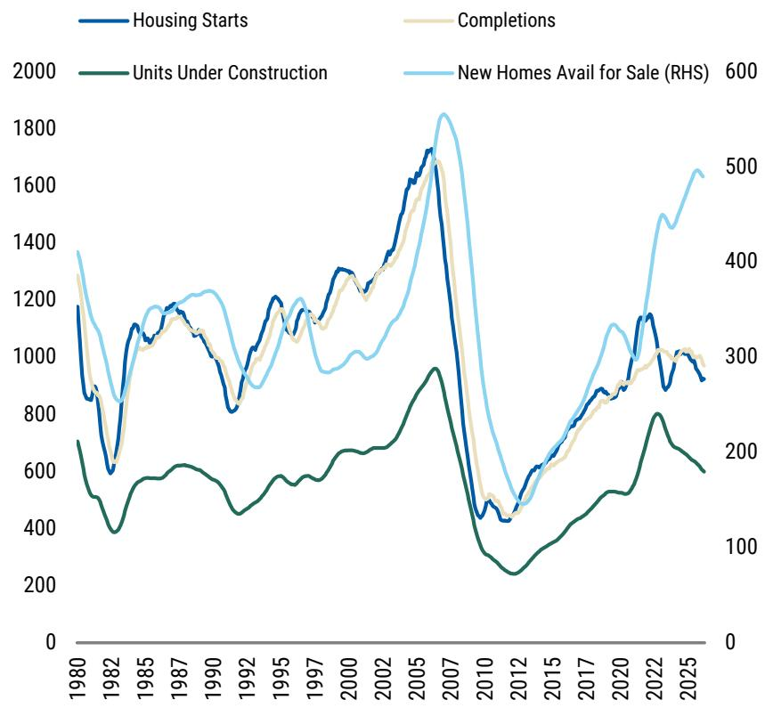

line

| Year | Housing Starts | Completions | Units Under Construction | New Homes Avail for Sale (RHS) |
|------|----------------|-------------|--------------------------|-------------------------------|
| 1980 | 1200           | 1300        | 700                      | 400                           |
| 1982 | 600            | 800         | 400                      | 300                           |
| 1985 | 1100           | 1100        | 600                      | 350                           |
| 1987 | 1150           | 1150        | 650                      | 380                           |
| 1990 | 1050           | 1100        | 600                      | 360                           |
| 1992 | 800            | 900         | 450                      | 340                           |
| 1995 | 1200           | 1150        | 550                      | 370                           |
| 1997 | 1150           | 1100        | 600                      | 350                           |
| 2000 | 1300           | 1250        | 650                      | 380                           |
| 2002 | 1400           | 1350        | 700                      | 400                           |
| 2005 | 1600           | 1550        | 850                      | 450                           |
| 2007 | 1750           | 1700        | 950                      | 550                           |
| 2010 | 450            | 450         | 300                      | 350                           |
| 2012 | 450            | 450         | 250                      | 350                           |
| 2015 | 600            | 650         | 350                      | 450                           |
| 2017 | 750            | 750         | 450                      | 550                           |
| 2020 | 850            | 850         | 550                      | 650                           |
| 2022 | 1150           | 1150        | 800                      | 750                           |
| 2025 | 950            | 950         | 650                      | 650                           |

New home prices below existing home prices for the first time   
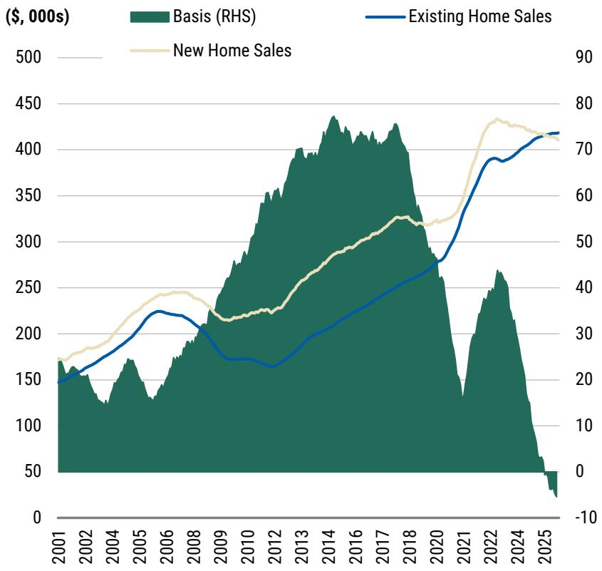  
Source: NAR, US Census Bureau, MS

# HPA to Increase +2% in 2026 and 2027

HPA has decelerated, but as we approach 0% we expect prices to find a floor. There simply is not enough for-sale inventory to drive meaningfully negative home prices

Months of supply continue to support positive home price trajectory   
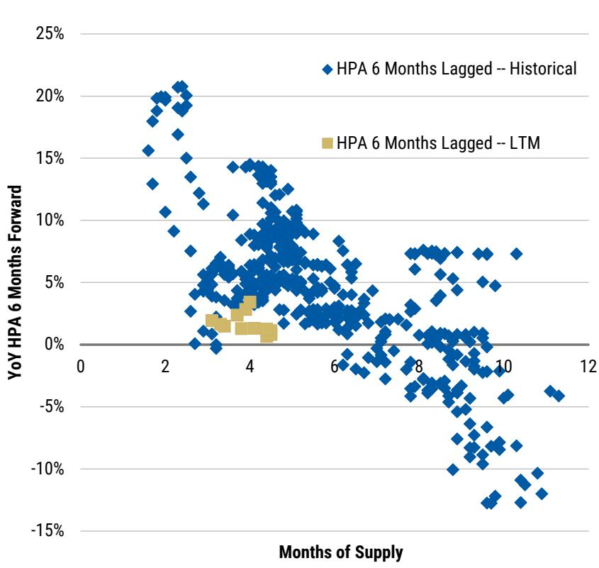

scatter

| Months of Supply | YoY HPA 6 Months Forward | Series                     |
| ---------------- | ------------------------ | -------------------------- |
| 2                | ~20%                     | HPA 6 Months Lagged -- Historical |
| 4                | ~3%                      | HPA 6 Months Lagged -- LTM   |

Home price forecasts   
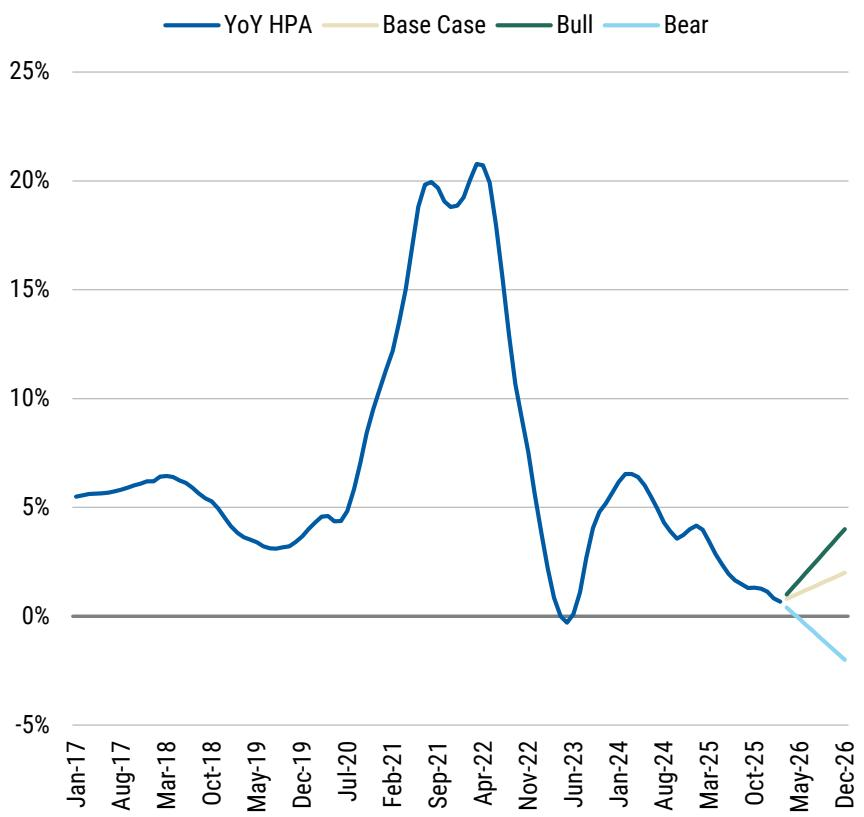

line

| Date    | YoY HPA | Base Case | Bull | Bear |
|---------|---------|-----------|------|------|
| Jan-17  | 5.5%    |           |      |      |
| Aug-17  | 6.0%    |           |      |      |
| Mar-18  | 6.5%    |           |      |      |
| Oct-18  | 5.0%    |           |      |      |
| May-19  | 3.5%    |           |      |      |
| Dec-19  | 4.0%    |           |      |      |
| Jul-20  | 4.5%    |           |      |      |
| Feb-21  | 12.0%   |           |      |      |
| Sep-21  | 20.0%   |           |      |      |
| Apr-22  | 21.0%   |           |      |      |
| Nov-22  | 10.0%   |           |      |      |
| Jun-23  | 0.0%    |           |      |      |
| Jan-24  | 6.5%    |           |      |      |
| Aug-24  | 4.0%    |           |      |      |
| Mar-25  | 4.5%    |           |      |      |
| Oct-25  | 1.5%    |           |      |      |
| May-26  | 0.5%    |           | 1.0% | 0.5% |
| Dec-26  |         | 2.0%      | 4.0% | -2.0%|

Source: NAR, Case-Shiller, MS estimates

# Location, Location, Location

We expect recent trends to continue with the Northeast and Midwest outperforming our 2% national forecast and Florida underperforming

HPA dispersion between top and bottom decile of MSAs increasing in recent months, low vs. past 20 years

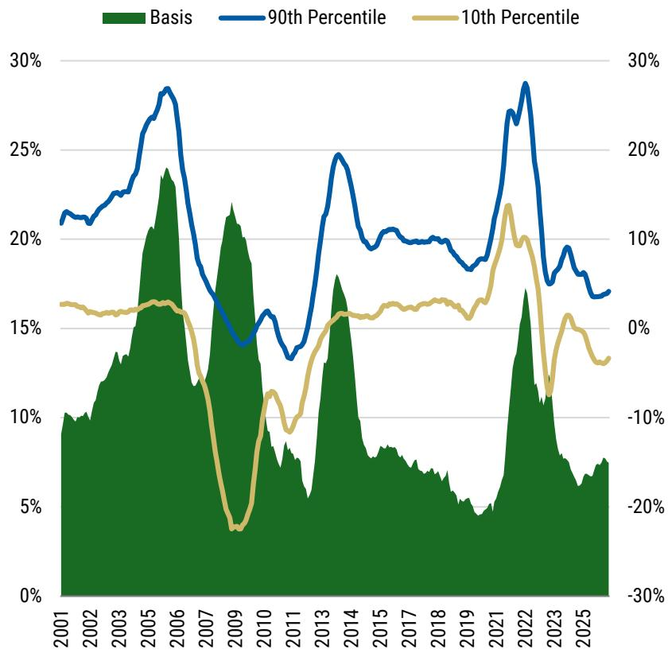

line

| Year | Basis | 90th Percentile | 10th Percentile |
|------|-------|-----------------|-----------------|
| 2001 | ~10%  | ~21%            | ~16%            |
| 2002 | ~11%  | ~20%            | ~15%            |
| 2003 | ~13%  | ~22%            | ~15%            |
| 2004 | ~15%  | ~24%            | ~15%            |
| 2005 | ~17%  | ~28%            | ~16%            |
| 2006 | ~24%  | ~28%            | ~16%            |
| 2007 | ~18%  | ~18%            | ~12%            |
| 2008 | ~15%  | ~15%            | ~8%             |
| 2009 | ~12%  | ~12%            | ~4%             |
| 2010 | ~14%  | ~14%            | ~8%             |
| 2011 | ~16%  | ~16%            | ~10%            |
| 2012 | ~18%  | ~18%            | ~12%            |
| 2013 | ~20%  | ~20%            | ~14%            |
| 2014 | ~18%  | ~24%            | ~16%            |
| 2015 | ~16%  | ~20%            | ~15%            |
| 2016 | ~14%  | ~18%            | ~14%            |
| 2017 | ~12%  | ~16%            | ~13%            |
| 2018 | ~10%  | ~14%            | ~12%            |
| 2019 | ~8%   | ~12%            | ~10%            |
| 2020 | ~6%   | ~10%            | ~8%             |
| 2021 | ~8%   | ~14%            | ~10%            |
| 2022 | ~16%  | ~28%            | ~14%            |
| 2023 | ~14%  | ~18%            | ~8%             |
| 2024 | ~12%  | ~16%            | ~6%             |
| 2025 | ~10%  | ~14%            | ~4%             |

Source: Zillow, MS

MSAs with a higher amount of inventory today than in 4Q19 are where home prices are falling YoY

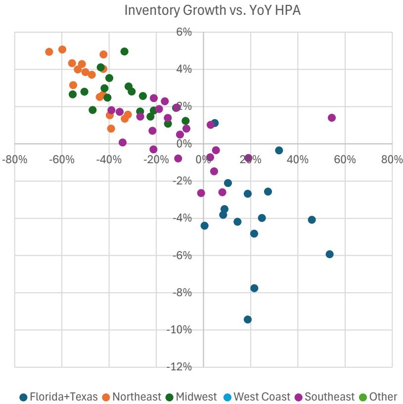

scatter

| Region         |   Inventory Growth (%) |   YoY HPA (%) |
|:---------------|------------------------:|--------------:|
| Florida+Texas  |                    35.2 |          29.7 |
| Florida+Texas  |                    45.1 |          31.2 |
| Florida+Texas  |                    55.3 |          32.5 |
| Florida+Texas  |                    66.8 |          33.9 |
| Florida+Texas  |                    77.2 |          35.3 |
| Florida+Texas  |                    88.5 |          36.7 |
| Florida+Texas  |                    99.9 |          38.1 |
| Florida+Texas  |                   110.3 |          39.5 |
| Florida+Texas  |                   121.6 |          40.9 |
| Florida+Texas  |                   132.9 |          42.3 |
| Florida+Texas  |                   144.2 |          43.7 |
| Florida+Texas  |                   155.5 |          45.1 |
| Florida+Texas  |                   166.8 |          46.5 |
| Florida+Texas  |                   178.1 |          47.9 |
| Florida+Texas  |                   189.4 |          49.3 |
| Florida+Texas  |                   200.7 |          50.7 |
| Florida+Texas  |                   211.0 |          52.1 |
| Florida+Texas  |                   222.3 |          53.5 |
| Florida+Texas  |                   233.6 |          54.9 |
| Florida+Texas  |                   244.9 |          56.3 |
| Florida+Texas  |                   256.2 |          57.7 |
| Florida+Texas  |                   267.5 |          59.1 |
| Florida+Texas  |                   278.8 |          60.5 |
| Florida+Texas  |                   289.1 |          61.9 |
| Florida+Texas  |                   290.4 |          63.3 |
| Florida+Texas  |                   301.7 |          64.7 |
| Florida+Texas  |                   312.0 |          66   |
| Florida+Texas  |                   323.3 |          67.4 |
| Florida+Texas  |                   334.6 |          68.8 |
| Florida+Texas  |                   345.9 |          70.2 |
| Florida+Texas  |                   357.2 |          71.6 |
| Florida+Texas  |                   368.5 |          72.0 |
| Florida+Texas  |                   379.8 |          73.4 |
| Florida+Texas  |                   391   |          74.8 |
| Florida+Texas  |                   402.3 |          76.2 |
| Florida+Texas  |                   413.6 |          77.6 |
| Florida+Texas  |                   424.9 |          78.0 |
| Florida+Texas  |                   436.2 |          79.4 |
| Florida+Texas  |                   447.5 |          80.8 |
| Florida+ Texas  |                   458.8 |          82   |
| Florida+ Texas  |                   470   |          83.4 |
| Florida+ Texas  |                   481.3 |          84.8 |
| Florida+ Texas  |                   492.6 |          86   |
| Florida+ Texas  |                   503.9 |          87.4 |
| Florida+ Texas  |                   515   |          88.8 |
| Florida+ Texas  |                   526.3 |          90   |
| Florida+ Texas  |                   537.6 |          91.4 |
| Florida+ Texas  |                   548.9 |          92.8 |
| Florida+ Texas  |                   560   |          94   |
| Florida+ Texas  |                   571.3 |          95.4 |
| Florida+ Texas  |                   582.6 |          96   |
| Florida+ Texas  |                   593.9 |          97   |
| Florida+ Texas  |                   605   |          98   |
| Florida+ Texas  |                   616.3 |          99   |
| Florida+ Texas  |                   627.6 |         nan    |

# US Residential Credit

# Enduring Demand

# Demand to Remain Resilient in the Face of Record Issuance

<table><tr><td colspan="2">Non-QM Spread Forecasts</td><td colspan="3">Spreads</td><td colspan="3">Excess Returns</td></tr><tr><td>Tranche</td><td>Current</td><td>Bull</td><td>Base</td><td>Bear</td><td>Bull</td><td>Base</td><td>Bear</td></tr><tr><td>AAA</td><td>125</td><td>95</td><td>120</td><td>175</td><td>1.9%</td><td>1.4%</td><td>0.2%</td></tr><tr><td>BBB</td><td>195</td><td>150</td><td>185</td><td>290</td><td>3.7%</td><td>2.3%</td><td>-1.8%</td></tr></table>

# Supply

Through the first four months of 2026, non-agency RMBS issuance is up 45% vs. the same window in 2025. That growth has largely been fueled by two products: Non-QM and 2nd liens/HELOCs. We expect full-year 2026 new issuance volumes to finish at a 2.0 record of \$235bn, up 13% from 2025.

# Dialing In on Delinquencies

While non-agency lending in general, and Non-QM lending in particular, have been making up a growing slice of the total origination pie, we do not think it has been easing lending standards that have driven that share gain. In fact, Non-QM delinquencies in recent vintages have been climbing at a slower pace than they did in 2023. We do not expect materially higher delinquencies over the next 12 months.

# Find Value in Non-QM

Non-agency RMBS more broadly, and Non-QM in particular, is well aligned with our positive demand narrative. The bid from insurance companies should remain robust in a stubbornly high rate environment, and we expect banks to play a larger role than they have historically given specific benefits to Non-QM from the de-regulatory backdrop. We like Non-QM across the capital structure at today's levels.

# Elevated Issuance Volumes

Growth in Residential Credit has been fueled by two products: Non-QM and 2nd liens/HELOCs. We estimate Non-QM +106% and second-lien deals up 200% YoY

Non-Agency RMBS issuance forecasted for 2.0 record of \$235bn   
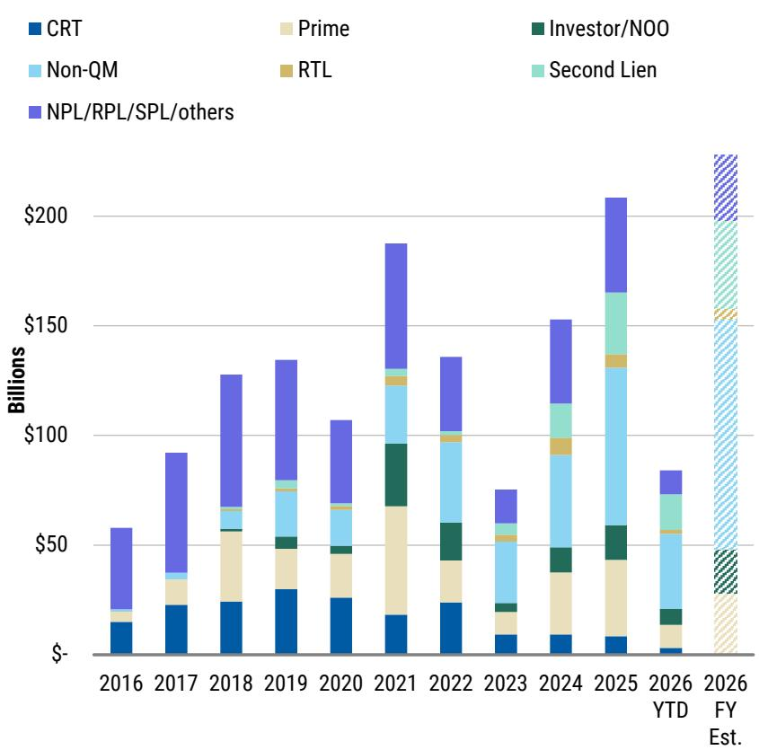  
Source: Bloomberg, MS

Non-QM paydown evolution, net issuance not as big a technical headwind as gross issuance   
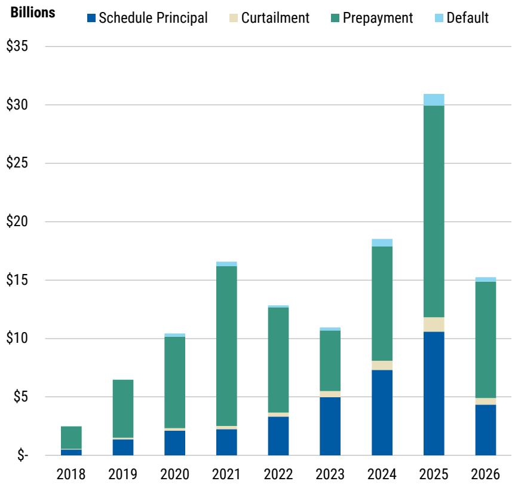

bar_stacked

| Year | Schedule Principal (Billions) | Curtailment (Billions) | Prepayment (Billions) | Default (Billions) |
| :--- | :--- | :--- | :--- | :--- |
| 2018 | 0.5 | 0.0 | 2.0 | 0.0 |
| 2019 | 1.5 | 0.0 | 4.5 | 0.0 |
| 2020 | 2.0 | 0.5 | 7.5 | 0.5 |
| 2021 | 2.5 | 0.5 | 13.5 | 0.5 |
| 2022 | 3.5 | 0.5 | 8.5 | 0.5 |
| 2023 | 5.0 | 0.5 | 6.0 | 0.5 |
| 2024 | 7.5 | 1.0 | 11.5 | 1.0 |
| 2025 | 10.5 | 1.5 | 19.5 | 1.0 |
| 2026 | 4.5 | 1.0 | 9.5 | 0.5 |

# Prepayment Speeds in Focus

Over the past 12-24 months, we've seen a healthy increase in prepayment speeds for products like Prime Jumbo, Non-QM, and second Liens, while other products like investor deals and RPL have remained much more range-bound

Prepayment speeds across products   
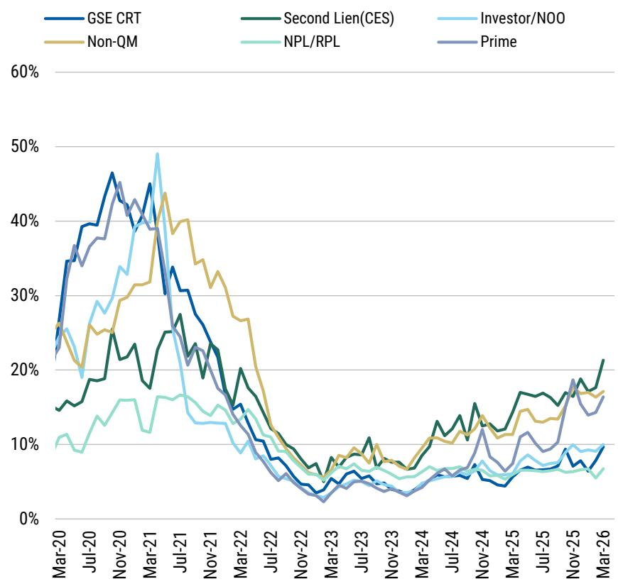

line

| Date   | GSE CRT | Second Lien(CES) | Investor/NOO | Non-QM | NPL/RPL | Prime |
|--------|---------|------------------|--------------|--------|---------|-------|
| Mar-20 | ~25%    | ~15%             | ~20%         | ~25%   | ~10%    | ~25%  |
| Jul-20 | ~40%    | ~18%             | ~30%         | ~25%   | ~12%    | ~35%  |
| Nov-20 | ~45%    | ~20%             | ~35%         | ~30%   | ~15%    | ~40%  |
| Mar-21 | ~48%    | ~25%             | ~45%         | ~40%   | ~18%    | ~45%  |
| Jul-21 | ~40%    | ~20%             | ~30%         | ~35%   | ~15%    | ~40%  |
| Nov-21 | ~30%    | ~15%             | ~25%         | ~30%   | ~12%    | ~30%  |
| Mar-22 | ~20%    | ~10%             | ~15%         | ~25%   | ~8%     | ~20%  |
| Jul-22 | ~10%    | ~5%              | ~10%         | ~15%   | ~5%     | ~10%  |
| Nov-22 | ~5%     | ~3%              | ~5%          | ~8%    | ~3%     | ~5%   |
| Mar-23 | ~3%     | ~2%              | ~3%          | ~5%    | ~2%     | ~3%   |
| Jul-23 | ~5%     | ~3%              | ~5%          | ~8%    | ~3%     | ~5%   |
| Nov-23 | ~7%     | ~4%              | ~7%          | ~9%    | ~4%     | ~7%   |
| Mar-24 | ~8%     | ~5%              | ~8%          | ~10%   | ~5%     | ~8%   |
| Jul-24 | ~10%    | ~6%              | ~10%         | ~12%   | ~6%     | ~10%  |
| Nov-24 | ~12%    | ~7%              | ~12%         | ~14%   | ~7%     | ~12%  |
| Mar-25 | ~14%    | ~8%              | ~14%         | ~16%   | ~8%     | ~14%  |
| Jul-25 | ~16%    | ~9%              | ~16%         | ~18%   | ~9%     | ~16%  |
| Nov-25 | ~18%    | ~10%             | ~18%         | ~20%   | ~10%    | ~18%  |
| Mar-26 | ~20%    | ~12%             | ~20%         | ~22%   | ~12%    | ~20%  |

Source: Loan Performance, MS

S-Curve: Non-QM vs. Prime Jumbo aggregate and investor   
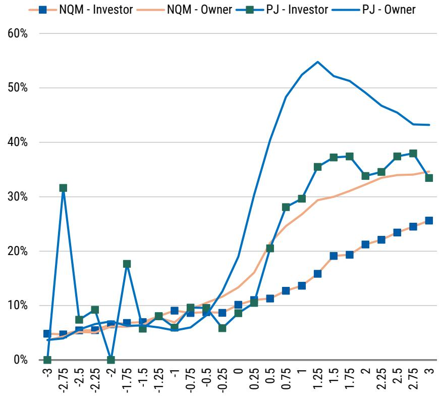

line

| X Value | NQM - Investor | NQM - Owner | PJ - Investor | PJ - Owner |
|---------|----------------|-------------|---------------|------------|
| -3      | 5%             | 4%          | 0%            | 4%         |
| -2.75   | 5%             | 4%          | 32%           | 32%        |
| -2.5    | 6%             | 5%          | 7%            | 9%         |
| -2.25   | 6%             | 6%          | 9%            | 6%         |
| -2      | 6%             | 6%          | 0%            | 0%         |
| -1.75   | 7%             | 7%          | 18%           | 18%        |
| -1.5    | 7%             | 7%          | 5%            | 5%         |
| -1.25   | 8%             | 8%          | 8%            | 8%         |
| -1      | 9%             | 9%          | 6%            | 6%         |
| -0.75   | 9%             | 9%          | 10%           | 10%        |
| -0.5    | 10%            | 10%         | 9%            | 9%         |
| -0.25   | 10%            | 10%         | 5%            | 5%         |
| 0       | 10%            | 10%         | 8%            | 8%         |
| 0.25    | 11%            | 11%         | 10%           | 10%        |
| 0.5     | 11%            | 11%         | 20%           | 20%        |
| 0.75    | 12%            | 12%         | 28%           | 28%        |
| 1       | 13%            | 13%         | 30%           | 30%        |
| 1.25    | 15%            | 15%         | 36%           | 36%        |
| 1.5     | 19%            | 19%         | 38%           | 38%        |
| 1.75    | 20%            | 20%         | 38%           | 38%        |
| 2       | 21%            | 21%         | 34%           | 34%        |
| 2.25    | 22%            | 22%         | 34%           | 34%        |
| 2.5     | 23%            | 23%         | 38%           | 38%        |
| 2.75    | 24%            | 24%         | 38%           | 38%        |
| 3       | 25%            | 25%         | 33%           | 33%        |

# Consider Convexity

Within Non-QM, there are several other ways to think about evolving convexity profiles. As we think through relative value within Non-QM pools, income documentation and loan balance are two characteristics we'll be paying attention to

S-Curves – Non-QM by income documentation   
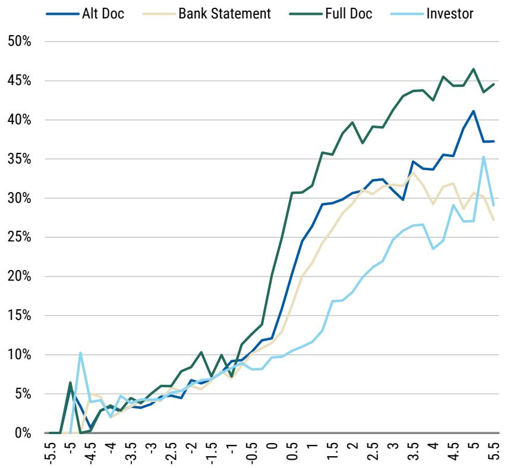

line

| Date  | Alt Doc | Bank Statement | Full Doc | Investor |
|-------|---------|----------------|----------|----------|
| -5.5  | 0%      | 0%             | 0%       | 0%       |
| -5.0  | 6%      | 0%             | 6%       | 10%      |
| -4.5  | 0%      | 0%             | 0%       | 0%       |
| -4.0  | 2%      | 2%             | 2%       | 2%       |
| -3.5  | 3%      | 3%             | 3%       | 3%       |
| -3.0  | 4%      | 4%             | 4%       | 4%       |
| -2.5  | 5%      | 5%             | 5%       | 5%       |
| -2.0  | 6%      | 6%             | 6%       | 6%       |
| -1.5  | 7%      | 7%             | 7%       | 7%       |
| -1.0  | 8%      | 8%             | 8%       | 8%       |
| -0.5  | 9%      | 9%             | 9%       | 9%       |
| 0.0   | 10%     | 10%            | 10%      | 10%      |
| 0.5   | 15%     | 15%            | 15%      | 15%      |
| 1.0   | 20%     | 20%            | 20%      | 20%      |
| 1.5   | 25%     | 25%            | 25%      | 25%      |
| 2.0   | 30%     | 30%            | 30%      | 30%      |
| 2.5   | 32%     | 32%            | 32%      | 32%      |
| 3.0   | 30%     | 30%            | 30%      | 30%      |
| 3.5   | 35%     | 35%            | 35%      | 35%      |
| 4.0   | 34%     | 34%            | 34%      | 34%      |
| 4.5   | 36%     | 36%            | 36%      | 36%      |
| 5.0   | 41%     | 41%            | 41%      | 41%      |
| 5.5   | 37%     | 27%            | 44%      | 29%      |

S-Curves – Non-QM by loan balance   
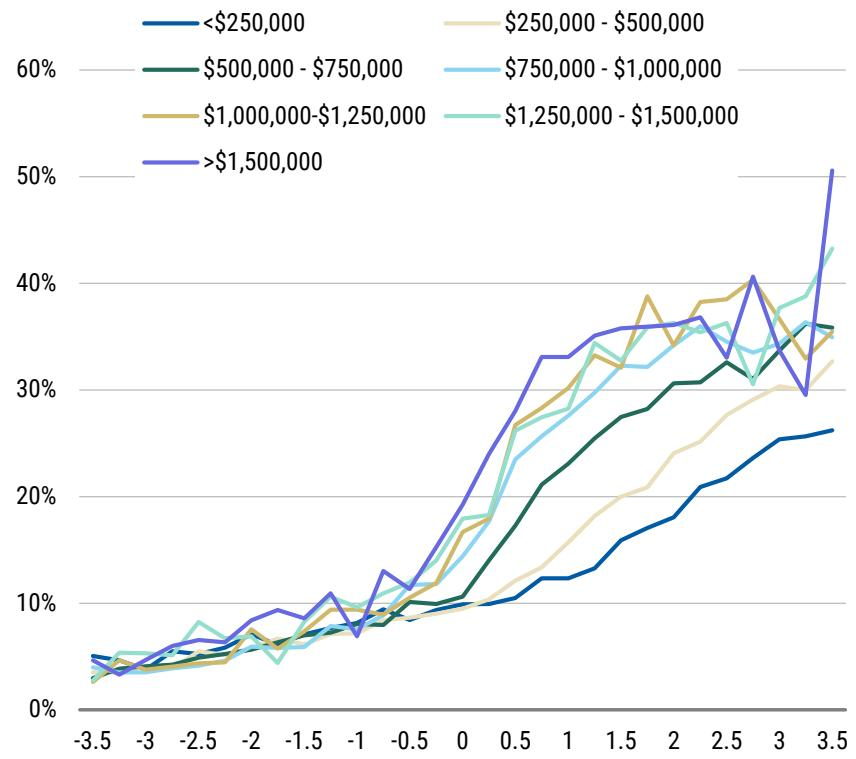

line

| X Value | <$250,000 | $250,000 - $500,000 | $500,000 - $750,000 | $750,000 - $1,000,000 | $1,000,000-$1,250,000 | $1,250,000 - $1,500,000 | >$1,500,000 |
| ------- | --------- | ------------------- | ------------------- | --------------------- | --------------------- | ---------------------- | ----------- |
| -3.5    | ~4%       | ~3%                 | ~3%                 | ~3%                   | ~3%                   | ~3%                    | ~3%         |
| -3      | ~4%       | ~4%                 | ~4%                 | ~4%                   | ~4%                   | ~4%                    | ~4%         |
| -2.5    | ~5%       | ~5%                 | ~5%                 | ~5%                   | ~5%                   | ~5%                    | ~5%         |
| -2      | ~6%       | ~6%                 | ~6%                 | ~6%                   | ~6%                   | ~6%                    | ~6%         |
| -1.5    | ~7%       | ~7%                 | ~7%                 | ~7%                   | ~7%                   | ~7%                    | ~7%         |
| -1      | ~8%       | ~8%                 | ~8%                 | ~8%                   | ~8%                   | ~8%                    | ~8%         |
| -0.5    | ~9%       | ~9%                 | ~9%                 | ~9%                   | ~9%                   | ~9%                    | ~9%         |
| 0       | ~10%      | ~10%                | ~10%                | ~10%                  | ~10%                  | ~10%                   | ~10%        |
| 0.5     | ~12%      | ~12%                | ~12%                | ~12%                  | ~12%                  | ~12%                   | ~12%        |
| 1       | ~15%      | ~15%                | ~15%                | ~15%                  | ~15%                  | ~15%                   | ~15%        |
| 1.5     | ~18%      | ~18%                | ~18%                | ~18%                  | ~18%                  | ~18%                   | ~18%        |
| 2       | ~22%      | ~22%                | ~22%                | ~22%                  | ~22%                  | ~22%                   | ~22%        |
| 2.5     | ~25%      | ~25%                | ~25%                | ~25%                  | ~25%                  | ~25%                   | ~25%        |
| 3       | ~28%      | ~28%                | ~28%                | ~28%                  | ~28%                  | ~28%                   | ~28%        |
| 3.5     | ~30%      | ~30%                | ~30%                | ~30%                  | ~30%                  | ~30%                   | 50%         |

Source: Loan Performance, MS

# Discussing Diminishing Delinquencies

Non-QM DQs in recent vintages have been climbing at a slower pace than they did in 2023. Prime Jumbo is seeing a slight increase in 2024 and 2025 DQs compared to 2023 at the 12-month mark, but the absolute level remains exceedingly low

Non-QM 60+ DQs - vintage and controlled for FICO and LTV   
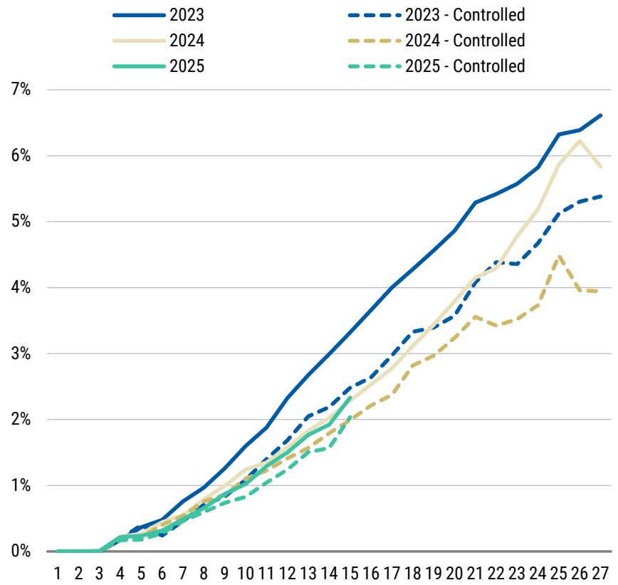

line

| Year | 2023 | 2024 | 2025 |
|------|------|------|------|
| 2023 | 0.3% | 0.4% | 0.3% |
| 2023 - Controlled | 1.8% | 1.5% | 1.2% |
| 2023 - Controlled | 3.5% | 3.0% | 2.5% |
| 2023 - Controlled | 5.0% | 4.5% | 4.0% |
| 2023 - Controlled | 6.5% | 6.0% | 5.5% |
| 2024 - Controlled | 0.4% | 0.5% | 0.3% |
| 2024 - Controlled | 1.0% | 1.2% | 0.8% |
| 2024 - Controlled | 1.8% | 1.5% | 1.2% |
| 2024 - Controlled | 3.0% | 2.5% | 1.8% |
| 2024 - Controlled | 4.5% | 3.5% | 2.8% |
| 2024 - Controlled | 6.0% | 5.0% | 4.0% |
| 2024 - Controlled | 7.0% | 6.0% | 4.5% |
| 2025 - Controlled | 0.3% | 0.4% | 0.3% |
| 2025 - Controlled | 0.8% | 0.9% | 0.6% |
| 2025 - Controlled | 1.5% | 1.6% | 1.3% |
| 2025 - Controlled | 2.5% | 2.8% | 2.4% |
| 2025 - Controlled | 4.0% | 4.5% | 3.8% |
| 2025 - Controlled | 5.5% | 5.8% | 4.8% |
| 2025 - Controlled | 6.8% | 6.5% | 5.5% |
| 2025 - Controlled | 7.5% | 6.8% | 5.8% |
| 2024 - Controlled | 0.3% | 0.4% | 0.3% |
| 2024 - Controlled | 0.8% | 1.0% | 0.7% |
| 2024 - Controlled | 1.5% | 1.6% | 1.3% |
| 2024 - Controlled | 2.8% | 3.0% | 2.5% |
| 2024 - Controlled | 4.5% | 4.8% | 4.0% |
| 2024 - Controlled | 6.0% | 6.5% | 5.8% |
| 2024 - Controlled | 7.0% | 7.5% | 6.8% |
| 2024 - Controlled | 7.8% | 7.8% | 7.5% |
| 2024 - Controlled | 8.5% | 8.0% | 7.8% |
| 2024 - Controlled | 9.0% | 8.5% | 8.0% |
| 2024 - Controlled | 9.5% | 9.0% | 8.5% |
| 2024 - Controlled | 10.0% | 9.5% | 9.0% |
| 2024 - Controlled | 10.5% | 10.0% | 9.5% |
| 2024 - Controlled | 11.0% | 10.5% | 10.0% |
| 2024 - Controlled | 11.5% | 11.0% | 10.5% |
| 2024 - Controlled | 12.0% | 11.5% | 11.0% |
| 2024 - Controlled | 12.5% | 12.0% | 11.5% |
| 2024 - Controlled | 13.0% | 12.5% | 12.0% |
| 2024 - Controlled | 13.5% | 13.0% | 12.5% |
| 2024 - Controlled | 14.0% | 13.5% | 13.0% |
| 2024 - Controlled | 14.5% | 14.0% | 13.5% |
| 2024 - Controlled | 15.0% | 14.5% | 14.0% |
| 2024 - Controlled | 15.5% | 15.0% | 14.5% |
| 2024 - Controlled | 16.0% | 15.5% | 15.0% |
| 2024 - Controlled | 16.5% | 16.0% | 15.5% |
| 2024 - Controlled | 17.0% | 16.5% | 16.0% |
| 2024 - Controlled | 17.5% | 17.0% | 16.5% |
| 2024 - Controlled | 18.0% | 17.5% | 17.0% |
| 2024 - Controlled | 18.5% | 18.0% | 17.5% |
| 2024 - Controlled | 19.0% | 18.5% | 18.0% |
| 2024 - Controlled | 19.5% | 19.0% | 18.5% |
| 2024 - Controlled | 20.0% | 19.5% | 19.0% |
| 2024 - Controlled | 20.5% | 20.0% | 19.5% |
| 2024 - Controlled | 21.0% | 20.5% | 20.0% |
| 2024 - Controlled | 21.5% | 21.0% | 20.5% |
| 2024 - Controlled | 22.0% | 21.5% | 21.0% |
| 2024 - Controlled | 22.5% | 22.0% | 21.5% |
| 2024 - Controlled | 23.0% | 22.5% | 22.0% |
| 2024 - Controlled | 23.5% | 23.0% | 22.5% |
| 2024 - Controlled | 24.0% | 23.5% | 23.0% |
| 2024 - Controlled | 24.5% | 24.0% | 23.5% |
| 2024 - Controlled | 25.0% | 24.5% | 24.0% |
| 2024 - Controlled | 25.5% | 25.0% | 24.5% |
| Note: The actual values are not provided in the code provided in the image, so they are estimated based on the visual scale of the chart type (e.g., bar, line, pie). The actual values may vary due to the use of the data series or the number of data points used in the chart type (e.g., bar, line, pie).)

Source: Loan Performance, MS
Note: Controlled lines include FICO score 720 – 780 and LTV 70-80

Prime Jumbo 60+ DQs by vintage   
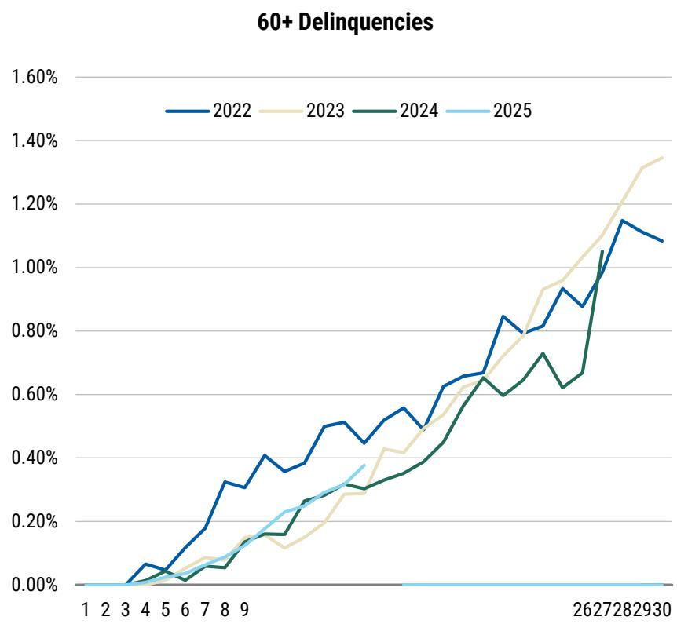

line

| Day | 2022 | 2023 | 2024 | 2025 |
|-----|------|------|------|------|
| 1   | 0.00% | 0.00% | 0.00% | 0.00% |
| 2   | 0.00% | 0.00% | 0.00% | 0.00% |
| 3   | 0.00% | 0.00% | 0.00% | 0.00% |
| 4   | 0.05% | 0.00% | 0.00% | 0.00% |
| 5   | 0.05% | 0.05% | 0.05% | 0.05% |
| 6   | 0.15% | 0.10% | 0.10% | 0.10% |
| 7   | 0.25% | 0.15% | 0.15% | 0.15% |
| 8   | 0.35% | 0.25% | 0.25% | 0.25% |
| 9   | 0.45% | 0.35% | 0.35% | 0.35% |
| 10  | 0.55% | 0.45% | 0.45% | 0.45% |
| 11  | 0.65% | 0.55% | 0.55% | 0.55% |
| 12  | 0.75% | 0.65% | 0.65% | 0.65% |
| 13  | 0.85% | 0.75% | 0.75% | 0.75% |
| 14  | 0.95% | 0.85% | 0.85% | 0.85% |
| 15  | 1.05% | 0.95% | 0.95% | 0.95% |
| 16  | 1.15% | 1.05% | 1.05% | 1.05% |
| 17  | 1.25% | 1.15% | 1.15% | 1.15% |
| 18  | 1.35% | 1.25% | 1.25% | 1.25% |
| 19  | 1.45% | 1.35% | 1.35% | 1.35% |
| 26   | -    | -    | -    | -    |
| 27   | -    | -    | -    | -    |
| 28   | -    | -    | -    | -    |
| 29   | -    | -    | -    | -    |
| 30   | -    | -    | -    | -    |

# Non-QM Lending Standard Evolution

Within Non-QM, there has been a clear move toward borrowers above 780 and a decrease in the share of mortgages with a down payment less than 20%

<table><tr><td>FICO Scores</td><td>2021H1</td><td>2021H2</td><td>2022H1</td><td>2022H2</td><td>2023H1</td><td>2023H2</td><td>2024H1</td><td>2024H2</td><td>2025H1</td><td>2025H2</td></tr><tr><td>&lt;600</td><td>0.20%</td><td>0.17%</td><td>0.17%</td><td>0.27%</td><td>0.20%</td><td>0.19%</td><td>0.15%</td><td>0.11%</td><td>0.09%</td><td>0.08%</td></tr><tr><td>600-660</td><td>2.79%</td><td>3.37%</td><td>3.86%</td><td>4.55%</td><td>3.60%</td><td>3.93%</td><td>3.17%</td><td>2.69%</td><td>2.45%</td><td>2.32%</td></tr><tr><td>660-720</td><td>25.62%</td><td>25.34%</td><td>27.26%</td><td>31.67%</td><td>30.42%</td><td>27.77%</td><td>24.32%</td><td>22.68%</td><td>23.32%</td><td>21.53%</td></tr><tr><td>720-780</td><td>49.97%</td><td>50.18%</td><td>49.39%</td><td>47.52%</td><td>47.13%</td><td>48.50%</td><td>49.62%</td><td>49.36%</td><td>48.71%</td><td>48.72%</td></tr><tr><td>&gt;780</td><td>21.41%</td><td>20.93%</td><td>19.32%</td><td>15.99%</td><td>18.64%</td><td>19.61%</td><td>22.75%</td><td>25.16%</td><td>25.43%</td><td>27.35%</td></tr><tr><td>LTVs</td><td colspan="10"></td></tr><tr><td>&lt;70</td><td>37.62%</td><td>37.18%</td><td>30.69%</td><td>28.90%</td><td>33.32%</td><td>31.58%</td><td>33.99%</td><td>34.17%</td><td>33.91%</td><td>31.93%</td></tr><tr><td>70-80</td><td>34.15%</td><td>32.27%</td><td>34.51%</td><td>33.66%</td><td>35.48%</td><td>33.51%</td><td>33.78%</td><td>33.50%</td><td>34.36%</td><td>33.36%</td></tr><tr><td>80</td><td>16.72%</td><td>17.84%</td><td>21.06%</td><td>23.63%</td><td>23.58%</td><td>25.35%</td><td>24.58%</td><td>25.14%</td><td>24.58%</td><td>25.77%</td></tr><tr><td>&gt;80</td><td>11.51%</td><td>12.71%</td><td>13.74%</td><td>13.82%</td><td>7.63%</td><td>9.56%</td><td>7.64%</td><td>7.20%</td><td>7.15%</td><td>8.95%</td></tr></table>

Source: Bloomberg, MS

# Prime Jumbo Lending Standard Evolution

Prime Jumbo collateral is experiencing a similar transition toward higher FICO scores and away from high LTVs

<table><tr><td>FICO Scores</td><td>2021H1</td><td>2021H2</td><td>2022H1</td><td>2022H2</td><td>2023H1</td><td>2023H2</td><td>2024H1</td><td>2024H2</td><td>2025H1</td><td>2025H2</td></tr><tr><td>&lt;660</td><td>0.00%</td><td>0.00%</td><td>0.00%</td><td>0.00%</td><td>0.01%</td><td>0.04%</td><td>0.06%</td><td>0.14%</td><td>0.00%</td><td>0.00%</td></tr><tr><td>660-700</td><td>1.86%</td><td>3.78%</td><td>7.07%</td><td>8.39%</td><td>1.93%</td><td>1.48%</td><td>1.63%</td><td>1.66%</td><td>1.88%</td><td>1.00%</td></tr><tr><td>700-740</td><td>13.34%</td><td>17.99%</td><td>20.41%</td><td>19.86%</td><td>14.55%</td><td>13.36%</td><td>11.99%</td><td>11.75%</td><td>11.20%</td><td>10.12%</td></tr><tr><td>740-780</td><td>38.68%</td><td>40.69%</td><td>40.54%</td><td>39.96%</td><td>41.23%</td><td>40.56%</td><td>39.22%</td><td>38.53%</td><td>37.34%</td><td>37.36%</td></tr><tr><td>780-820</td><td>45.97%</td><td>37.44%</td><td>31.90%</td><td>31.78%</td><td>42.20%</td><td>44.45%</td><td>46.93%</td><td>47.78%</td><td>49.42%</td><td>51.28%</td></tr><tr><td>&gt;820</td><td>0.15%</td><td>0.10%</td><td>0.07%</td><td>0.00%</td><td>0.09%</td><td>0.11%</td><td>0.16%</td><td>0.14%</td><td>0.16%</td><td>0.24%</td></tr><tr><td colspan="11">LTVs</td></tr><tr><td>&lt;70</td><td>46.10%</td><td>33.31%</td><td>22.28%</td><td>20.45%</td><td>19.00%</td><td>23.08%</td><td>22.13%</td><td>26.53%</td><td>25.41%</td><td>26.40%</td></tr><tr><td>70-80</td><td>26.47%</td><td>22.82%</td><td>21.71%</td><td>27.85%</td><td>26.45%</td><td>30.08%</td><td>27.80%</td><td>27.11%</td><td>26.29%</td><td>27.98%</td></tr><tr><td>80</td><td>22.98%</td><td>31.78%</td><td>38.07%</td><td>43.48%</td><td>53.69%</td><td>45.90%</td><td>47.10%</td><td>42.96%</td><td>41.68%</td><td>39.32%</td></tr><tr><td>&gt;80</td><td>4.45%</td><td>12.09%</td><td>17.93%</td><td>8.22%</td><td>0.86%</td><td>0.93%</td><td>2.96%</td><td>3.39%</td><td>6.62%</td><td>6.29%</td></tr></table>

Source: Bloomberg, MS

# Finding Value in Non-QM

Given the relative size and liquidity of Non-QM, we prefer to express our overweight in non-agency RMBS across the Non-QM capital structure

Non-QM AAA spreads offer attractive value vs. Agency MBS spreads   
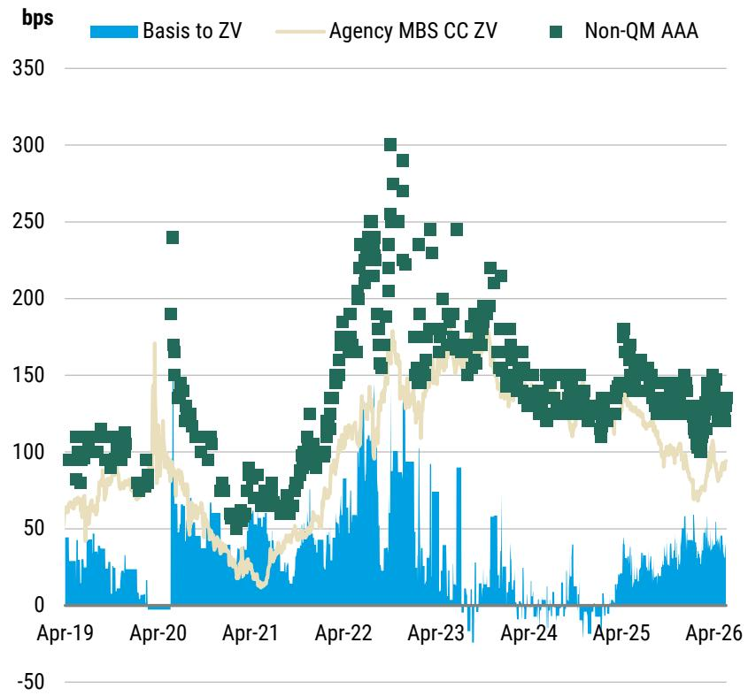

bar_line

| Date   | Basis to ZV | Agency MBS CC ZV | Non-QM AAA |
|--------|-------------|------------------|------------|
| Apr-19 | ~40         | ~60              | ~100       |
| Apr-20 | ~50         | ~170             | ~240       |
| Apr-21 | ~60         | ~30              | ~80        |
| Apr-22 | ~100        | ~140             | ~300       |
| Apr-23 | ~90         | ~160             | ~250       |
| Apr-24 | ~50         | ~130             | ~150       |
| Apr-25 | ~30         | ~100             | ~180       |
| Apr-26 | ~40         | ~90              | ~130       |

Primary spreads vs. WALs across Non-Agency RMBS products   
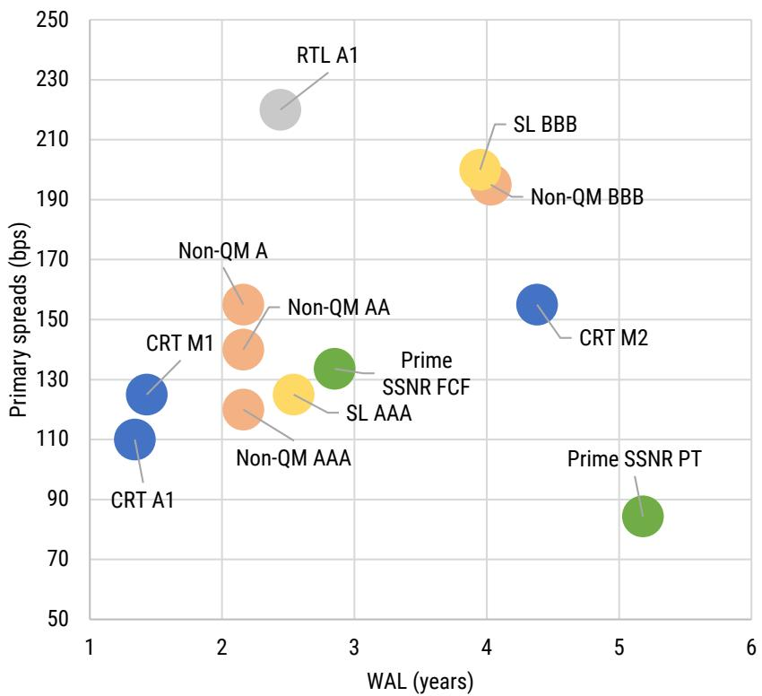

bubble

| Category       | WAL (years) | Primary spreads (bps) |
| -------------- | ----------- | -------------------- |
| CRT A1         | 1.3         | 110                  |
| CRT M1         | 1.4         | 120                  |
| Non-QM AAA     | 2.1         | 135                  |
| Non-QM AA      | 2.2         | 150                  |
| Non-QM AAA     | 2.3         | 130                  |
| RTL A1         | 2.4         | 220                  |
| SL AAA         | 2.5         | 125                  |
| SL BBB         | 4.0         | 190                  |
| Non-QM BBB     | 4.0         | 190                  |
| CRT M2         | 4.5         | 150                  |
| Prime SSNR FCF | 2.8         | 130                  |
| Prime SSNR PT  | 5.2         | 80                   |

Source: Loan Performance, MS

# US CMBS

# Redefining the Narrative

# CRE Market Finding Its Footing

# CRE Fundamentals Continue to Demonstrate Resilience

CRE recovery momentum is building, with transaction volumes up 27% YoY in 1Q26 (\$135bn), CRE prices tracking toward a \~4.9% annualized increase, origination volumes ending FY 2025 up +40% YoY, and distressed flows turning negative for the first time in 15 quarters.

# SASB Emerging as Dominant Deal Type

We revise our 2026 non-agency CMBS supply forecast lower to \$175bn, reflecting an upward revision to CRE CLO issuance (\$40–50bn) and downward revisions to both conduit (\$25-35bn) and SASB (\$95-105bn) volumes. We think SASBs could overtake conduit as the dominant CMBS deal type in 2027, with the current rate backdrop acting as a headwind for long-duration, fixed-rate conduit issuance.

# Inflection in Distress Indicators taking Shape

The rate of deterioration in conduit 2.0 distress metrics has slowed with issuance, paydowns, and extensions largely offsetting the inflow of newly delinquent loans. SASB delinquencies have remained choppy, while the reading for CRE CLOs has declined sharply, falling 225bp over the past six months. However, persistently higher rates could pressure borrower cashflows and hamper refi prospects.

# CMBS to Outperform Corporate Credit

We expect US CMBS to outperform corporate credit over the forecast horizon, helped by more favorable supply/demand technicals. We particularly like SASB new issue/CRE CLO top of structures for carry and see relval opportunities in data center exposures where the pricing differential vs other property types reflects investor caution rather than weaker fundamentals.

# 2026 CMBS Issuance Up 15% YoY Through April

We reduce our non-agency CMBS supply forecast to \$175bn based on increased risk of H2'26 slowdown against a shifting macro backdrop

We expect CRE CLO issuance to surpass that of conduit this year   
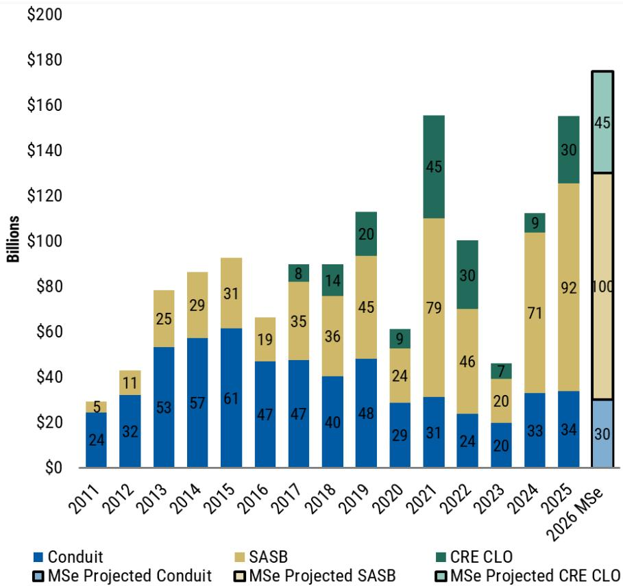

Office and lodging represent the largest concentration of new issue YTD   
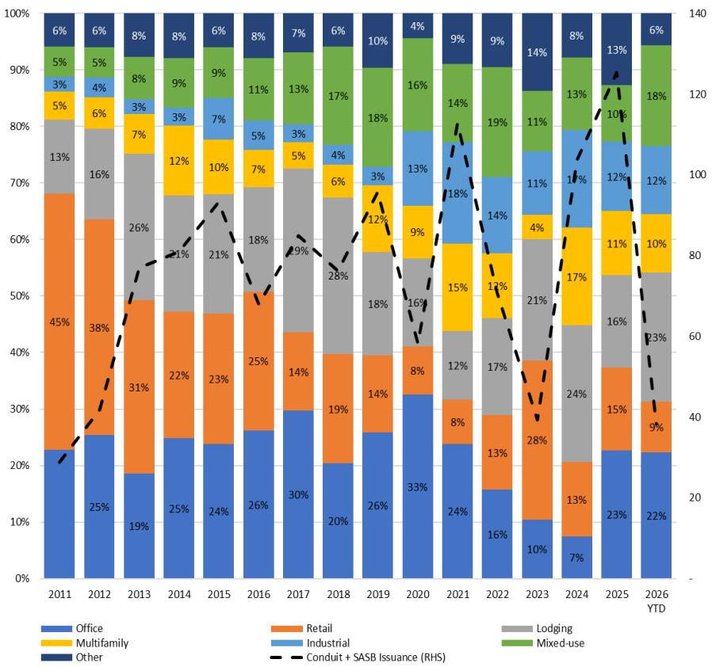

bar_stacked

| Year | Office (%) | Retail (%) | Multifamily (%) | Industrial (%) | Mixed-use (%) | Other (%) |
|---|---|---|---|---|---|---|
| 2011 | 23 | 45 | 5 | 3 | 5 | 6 |
| 2012 | 25 | 38 | 6 | 4 | 5 | 6 |
| 2013 | 19 | 31 | 7 | 3 | 8 | 8 |
| 2014 | 25 | 22 | 12 | 3 | 9 | 8 |
| 2015 | 24 | 23 | 10 | 7 | 9 | 6 |
| 2016 | 26 | 25 | 7 | 5 | 11 | 8 |
| 2017 | 30 | 14 | 5 | 3 | 13 | 7 |
| 2018 | 20 | 19 | 6 | 4 | 17 | 6 |
| 2019 | 26 | 14 | 12 | 3 | 18 | 10 |
| 2020 | 33 | 8 | 9 | 13 | 16 | 4 |
| 2021 | 24 | 8 | 15 | 18 | 14 | 9 |
| 2022 | 16 | 13 | 13 | 14 | 19 | 9 |
| 2023 | 10 | 28 | 4 | 11 | 11 | 14 |
| 2024 | 7 | 13 | 17 | 17 | 13 | 8 |
| 2025 | 23 | 15 | 11 | 12 | 10 | 13 |
| YTD (Conduit + SASB Issuance) (RHS) | - | - | - | - | - | - |
| (Note: The RHS value in the chart is estimated based on the provided code) is not provided in the data. The actual values for 'Conduit + SASB Issuance' are not available as they are not explicitly labeled in the image. )

Source: Green Street Advisors, Trepp, MS forecasts

# CRE Recovery Gains Momentum

CRE fundamentals continue to strengthen, with improvements across key indicators including origination volumes, transaction activity, and distress flows

Net change in CRE distress flows turned negative in Q1'26 for the first time in 15 quarters   
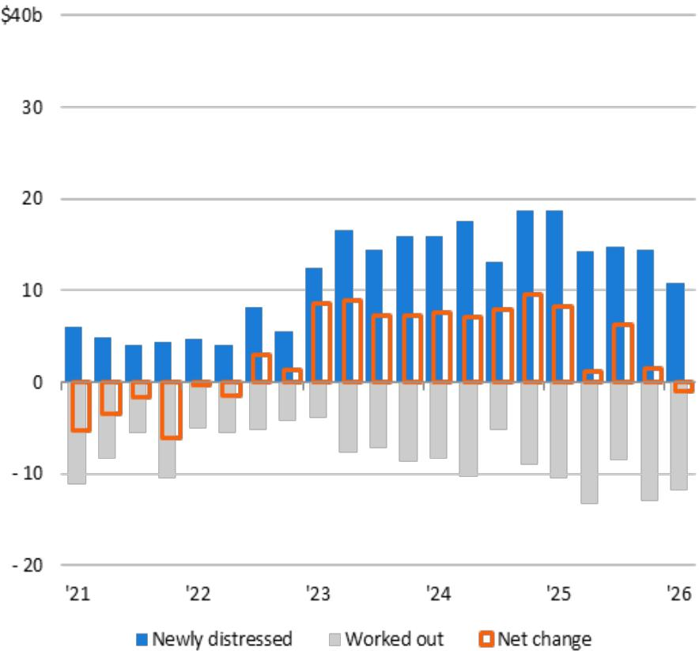

bar

| Year | Newly distressed | Worked out | Net change |
|------|------------------|----------|----------|
| '21  | 6                | -11      | -5       |
| '22  | 4                | -10      | -7       |
| '23  | 8                | -5       | 3        |
| '24  | 17               | -10      | 7        |
| '25  | 19               | -10      | 9        |
| '26  | 11               | -12      | 0        |

Distressed office sales represented \~7.3% of total sales in Q1'26   
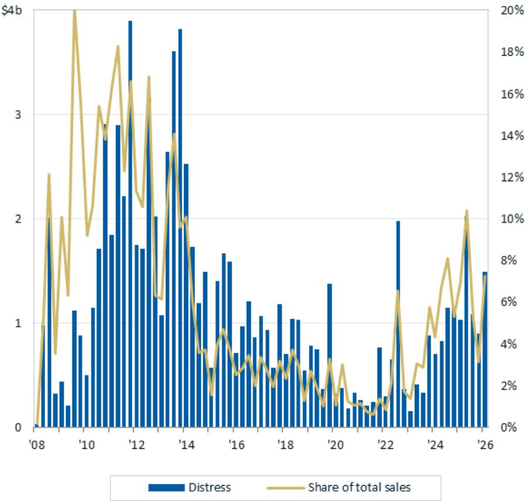

bar_line

| Year | Distress ($b) | Share of total sales (%) |
|------|---------------|--------------------------|
| '08  | 0.0           | 0.0                      |
| '09  | 0.3           | 12.0                     |
| '10  | 0.9           | 18.0                     |
| '11  | 1.7           | 16.0                     |
| '12  | 3.8           | 14.0                     |
| '13  | 2.0           | 12.0                     |
| '14  | 3.7           | 14.0                     |
| '15  | 1.7           | 6.0                      |
| '16  | 1.6           | 4.0                      |
| '17  | 1.2           | 3.0                      |
| '18  | 1.1           | 3.5                      |
| '19  | 0.8           | 2.5                      |
| '20  | 1.4           | 3.0                      |
| '21  | 0.3           | 1.5                      |
| '22  | 0.7           | 6.0                      |
| '23  | 2.0           | 4.0                      |
| '24  | 0.9           | 8.0                      |
| '25  | 1.1           | 10.0                     |
| '26  | 1.5           | 7.0                      |

Source: Real Capital Analytics, MS

# Banks/Alternative Lenders Gaining CRE Origination Share

Competition across CRE lending intensified last year and is likely to remain a defining feature of the market through 2026

CMBS market share in CRE originations fell to 18% in FY 2025, near recent pre-COVID averages   
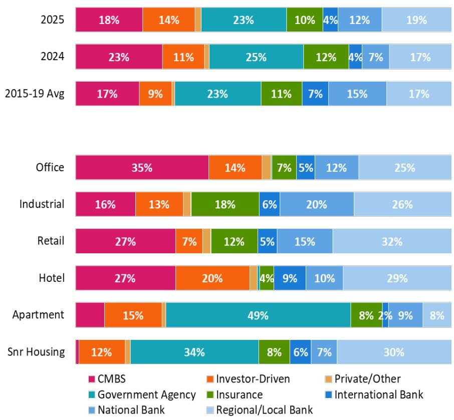

LTVs have been rising across lender types; the increase is most pronounced for CMBS   
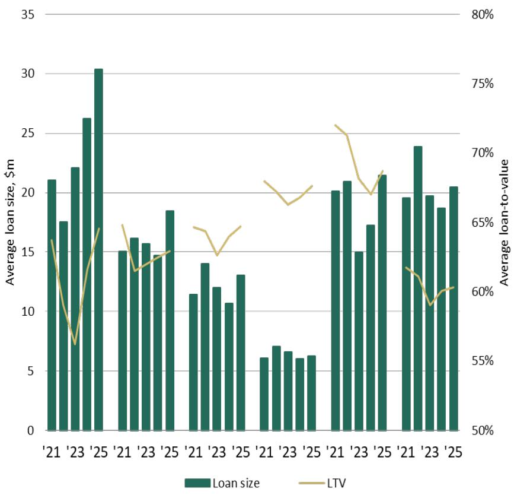

bar_line

| Year | Average loan size ($m) | Average loan-to-value |
|------|------------------------|-----------------------|
| '21  | 21                     | 64                    |
| '23  | 26                     | 56                    |
| '25  | 30                     | 75                    |
| '21  | 15                     | 63                    |
| '23  | 18                     | 64                    |
| '25  | 14                     | 65                    |
| '21  | 11                     | 67                    |
| '23  | 13                     | 64                    |
| '25  | 10                     | 66                    |
| '21  | 6                      | 68                    |
| '23  | 7                      | 69                    |
| '25  | 6                      | 70                    |
| '21  | 20                     | 72                    |
| '23  | 21                     | 70                    |
| '25  | 15                     | 68                    |
| '21  | 17                     | 69                    |
| '23  | 19                     | 67                    |
| '25  | 24                     | 68                    |
| '21  | 19                     | 63                    |
| '23  | 20                     | 60                    |
| '25  | 21                     | 61                    |

Source: Green Street Advisors, Trepp, MS

# Persistently Higher Rates Likely a Headwind for Refi Prospects

Roughly \$155bn in CMBS loans are up for maturity through YE; another \~\$81bn in SASBs are reaching their final maturity through 2027

CMBS Maturity Overview by Deal Type   
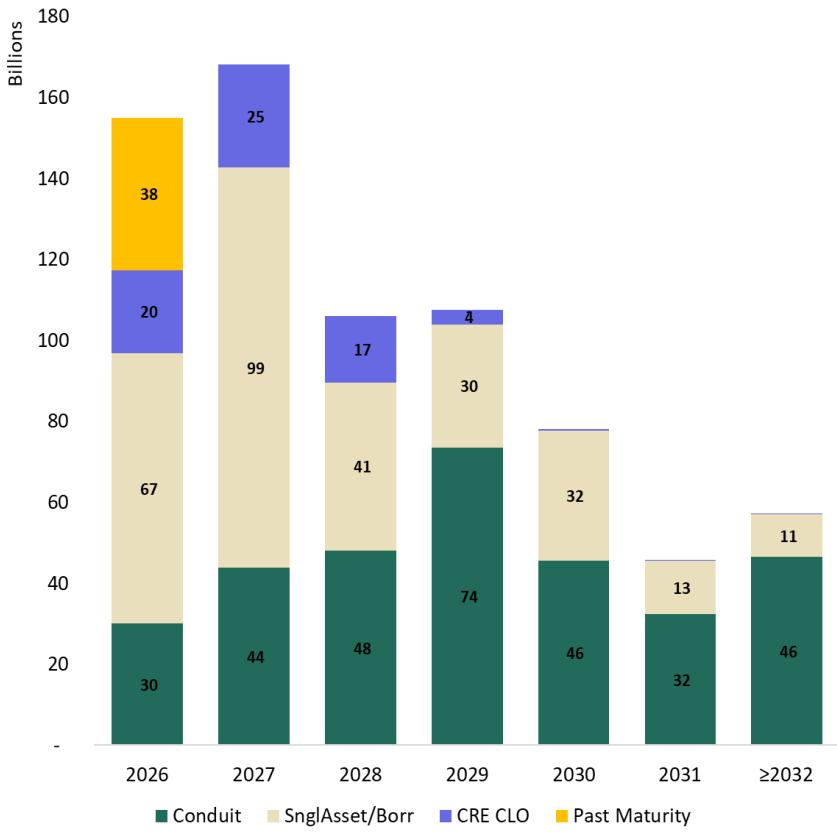

bar_stacked

| Year | Conduit (Billions) | SnglAsset/Borr (Billions) | CRE CLO (Billions) | Past Maturity (Billions) |
| :--- | :--- | :--- | :--- | :--- |
| 2026 | 30 | 67 | 20 | 38 |
| 2027 | 44 | 99 | 25 | - |
| 2028 | 48 | 41 | 17 | - |
| 2029 | 74 | 30 | 4 | - |
| 2030 | 46 | 32 | - | - |
| 2031 | 32 | 13 | - | - |
| ≥2032 | 46 | 11 | - | - |

SASB Current vs Fully-Extended Maturity   
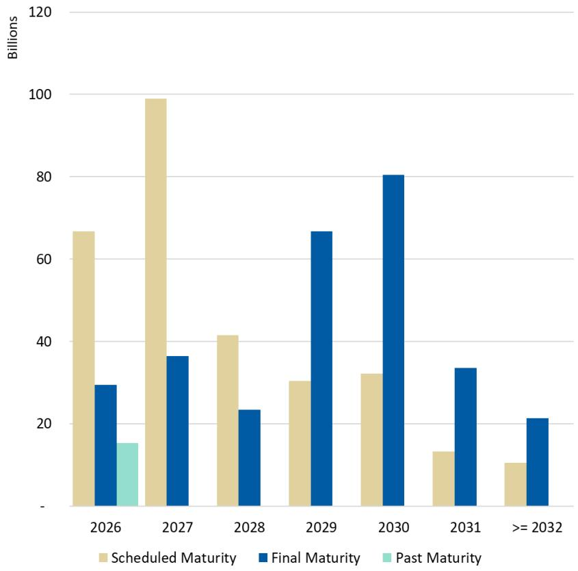

bar

| Year | Scheduled Maturity (Billions) | Final Maturity (Billions) | Past Maturity (Billions) |
| :--- | :--- | :--- | :--- |
| 2026 | 67 | 29 | 15 |
| 2027 | 99 | 36 | - |
| 2028 | 41.5 | 23 | - |
| 2029 | 30.5 | 67 | - |
| 2030 | 32 | 80.5 | - |
| 2031 | 13.5 | 33.5 | - |
| >= 2032 | 10.5 | 21.5 | - |

Source: Trepp, MS

# Persistently Higher Rates to Serve as Headwind for Refi Prospects

The recent backup in rates may hinder conduit refis, putting upward pressure on DQs, while delayed Fed easing continues to weigh on borrower cashflows

CMBS Maturity Overview Through 2027   
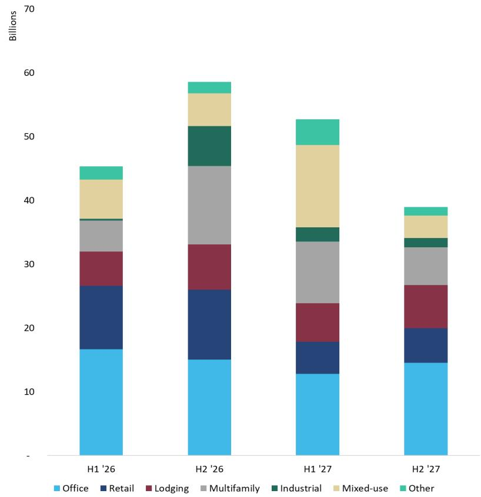

bar_stacked

| Period | Office | Retail | Lodging | Multifamily | Industrial | Mixed-use | Other |
|--------|--------|--------|---------|-------------|------------|-----------|-------|
| H1 '26 | 16.0   | 10.0   | 5.0     | 4.0         | 0.5        | 5.0       | 2.0   |
| H2 '26 | 15.0   | 10.0   | 7.0     | 13.0        | 6.0        | 5.0       | 2.0   |
| H1 '27 | 13.0   | 5.0    | 6.0     | 10.0        | 3.0        | 14.0      | 4.0   |
| H2 '27 | 14.0   | 5.0    | 7.0     | 5.0         | 2.0        | 4.0       | 2.0   |

CMBS Maturity Overview by Property Type   
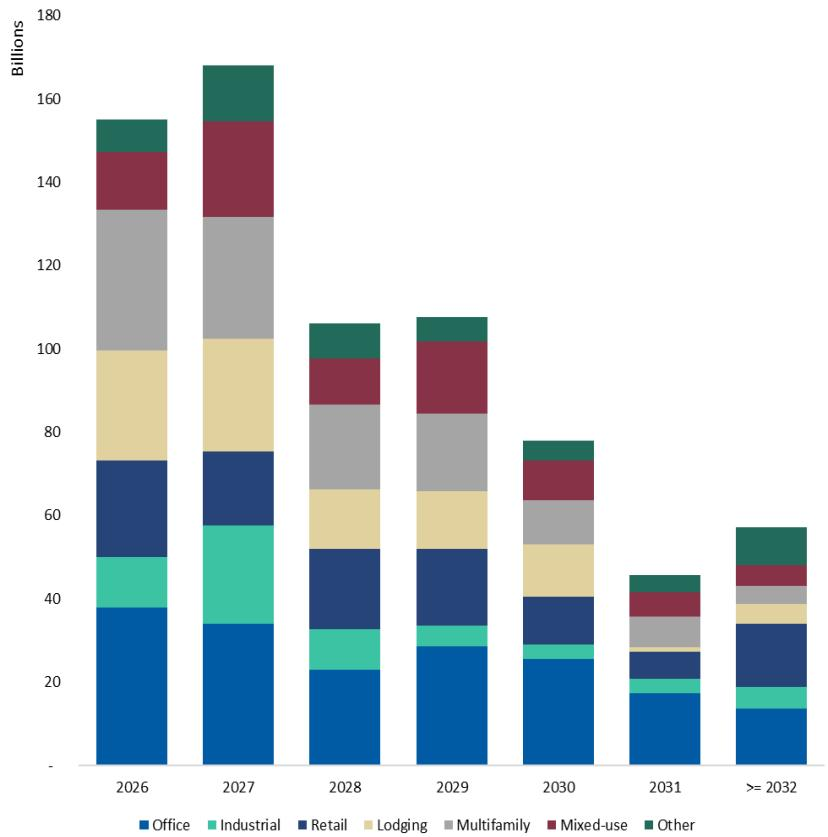

bar_stacked

| Year | Office (Billions) | Industrial (Billions) | Retail (Billions) | Lodging (Billions) | Multifamily (Billions) | Mixed-use (Billions) | Other (Billions) |
| :--- | :--- | :--- | :--- | :--- | :--- | :--- | :--- |
| 2026 | 38 | 14 | 25 | 27 | 45 | 19 | 8 |
| 2027 | 34 | 25 | 20 | 30 | 35 | 30 | 14 |
| 2028 | 23 | 12 | 25 | 18 | 25 | 14 | 10 |
| 2029 | 29 | 5 | 23 | 17 | 25 | 25 | 7 |
| 2030 | 26 | 3 | 14 | 16 | 14 | 10 | 5 |
| 2031 | 18 | 4 | 8 | 6 | 10 | 7 | 5 |
| >= 2032 | 14 | 6 | 18 | 5 | 6 | 7 | 10 |

Source: Trepp, MS

# CMBS Distress Indicators Showing Signs of Inflection

Headline CMBS 2.0 delinquency rates showing signs of gradual improvement across deal types

New issue, paydowns, and loan mods have offset inflow of new delinquencies   
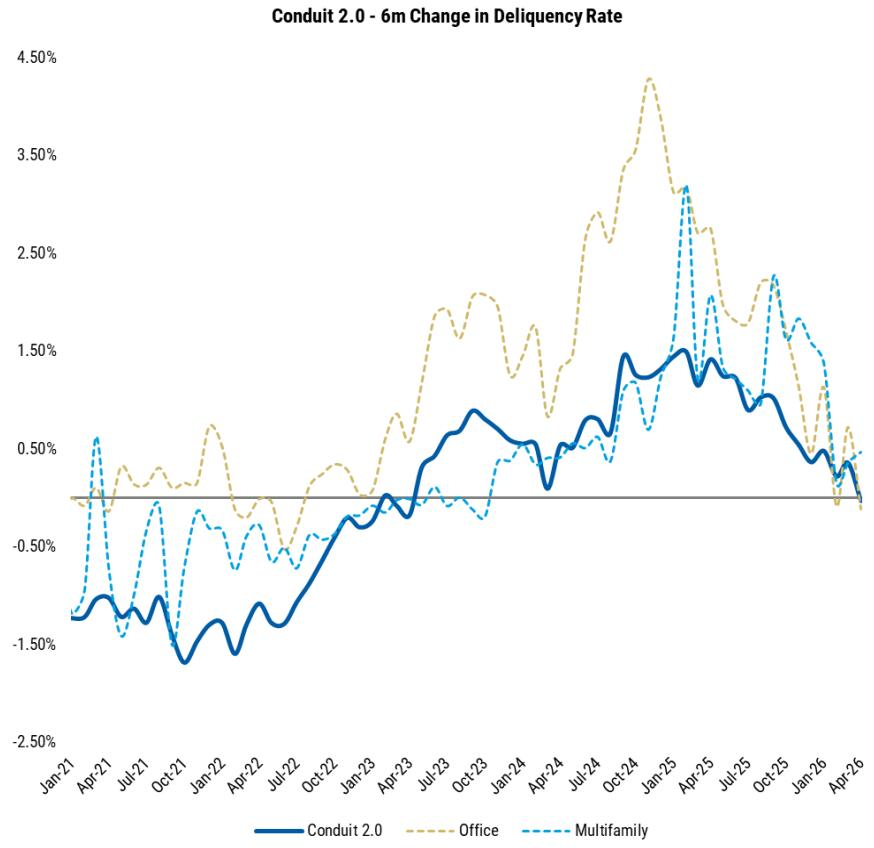

line

| Date    | Conduit 2.0 | Office | Multifamily |
|---------|-------------|--------|-------------|
| Jan-21  | -1.3%       | -0.2%  | -0.8%       |
| Apr-21  | -1.2%       | -0.1%  | -0.9%       |
| Jul-21  | -1.1%       | 0.1%   | -0.7%       |
| Oct-21  | -1.4%       | 0.3%   | -0.5%       |
| Jan-22  | -1.3%       | 0.4%   | -0.6%       |
| Apr-22  | -1.2%       | 0.2%   | -0.7%       |
| Jul-22  | -1.1%       | 0.1%   | -0.8%       |
| Oct-22  | -0.9%       | 0.0%   | -0.9%       |
| Jan-23  | -0.7%       | -0.1%  | -0.8%       |
| Apr-23  | -0.5%       | 0.2%   | -0.7%       |
| Jul-23  | -0.3%       | 0.5%   | -0.6%       |
| Oct-23  | -0.1%       | 0.8%   | -0.5%       |
| Jan-24  | 0.1%        | 1.0%   | -0.4%       |
| Apr-24  | 0.3%        | 1.2%   | -0.3%       |
| Jul-24  | 0.5%        | 1.5%   | -0.2%       |
| Oct-24  | 0.7%        | 1.8%   | -0.1%       |
| Jan-25  | 0.9%        | 2.0%   | 0.0%        |
| Apr-25  | 1.1%        | 2.5%   | 0.1%        |
| Jul-25  | 1.3%        | 2.8%   | 0.2%        |
| Oct-25  | 1.5%        | 3.0%   | 0.3%        |
| Jan-26  | 1.7%        | 3.2%   | 0.4%        |
| Apr-26  | 1.9%        | 3.5%   | 0.5%        |

Source: Trepp, MS

SASB DQs are stabilizing, meanwhile the readings for CRE CLOs have declined notably   
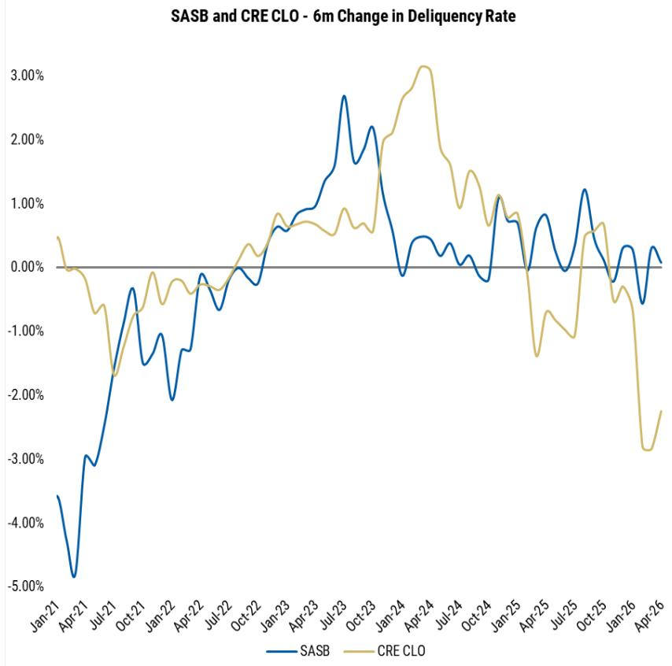

line

| Date    | SASB   | CRE CLO |
|---------|--------|---------|
| Jan-21  | -3.50% | 0.50%   |
| Apr-21  | -5.00% | -0.50%  |
| Jul-21  | -3.00% | -1.50%  |
| Oct-21  | -1.50% | -0.50%  |
| Jan-22  | -2.00% | -0.50%  |
| Apr-22  | -1.00% | -0.50%  |
| Jul-22  | -0.50% | -0.50%  |
| Oct-22  | -0.50% | 0.50%   |
| Jan-23  | 0.50%  | 0.50%   |
| Apr-23  | 1.00%  | 0.50%   |
| Jul-23  | 2.50%  | 1.00%   |
| Oct-23  | 1.50%  | 1.50%   |
| Jan-24  | -0.50% | 2.50%   |
| Apr-24  | 0.50%  | 3.00%   |
| Jul-24  | 0.50%  | 1.50%   |
| Oct-24  | -0.50% | 1.00%   |
| Jan-25  | 1.00%  | 1.50%   |
| Apr-25  | -1.50% | -1.50%  |
| Jul-25  | -1.00% | -1.00%  |
| Oct-25  | 1.50%  | 1.50%   |
| Jan-26  | -1.50% | -3.00%  |
| Apr-26  | 0.50%  | -2.50%  |

# Office Losses Reflect Magnitude of Post-COVID Valuation Resets

Office liquidation pathway has shortened significantly in 2025-26, though lender liquidity remains selective with 12-month conduit payoff rates hovering \~50%

Avg months in default for conduit office loans prior to liquidation have fallen to <20 months   
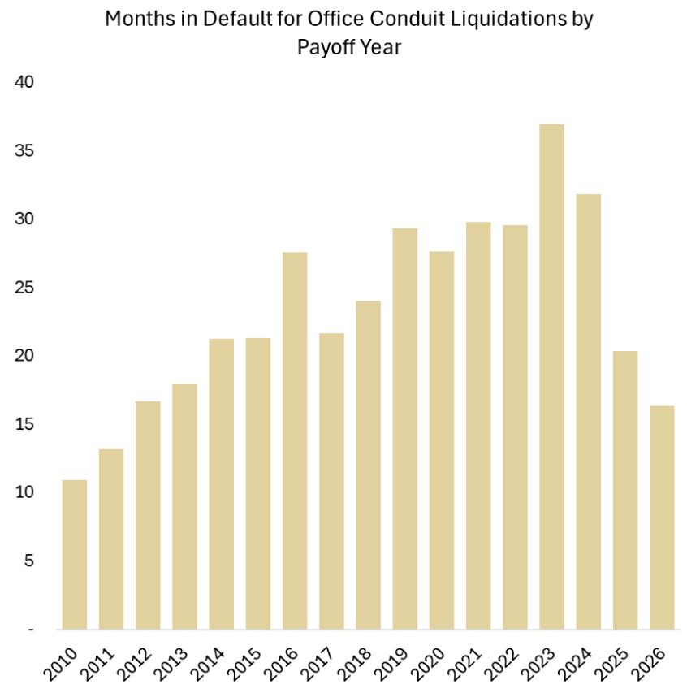

bar

Months in Default for Office Conduit Liquidations by Payoff Year
| Payoff Year | Months in Default |
| :--- | :--- |
| 2010 | 10.8 |
| 2011 | 13.2 |
| 2012 | 16.6 |
| 2013 | 18.0 |
| 2014 | 21.2 |
| 2015 | 21.2 |
| 2016 | 27.6 |
| 2017 | 21.6 |
| 2018 | 24.0 |
| 2019 | 29.3 |
| 2020 | 27.6 |
| 2021 | 29.8 |
| 2022 | 29.5 |
| 2023 | 37.0 |
| 2024 | 31.8 |
| 2025 | 20.3 |
| 2026 | 16.3 |

Source: Trepp, MS

Conduit office liquidations are concentrated in higher loss severity buckets   
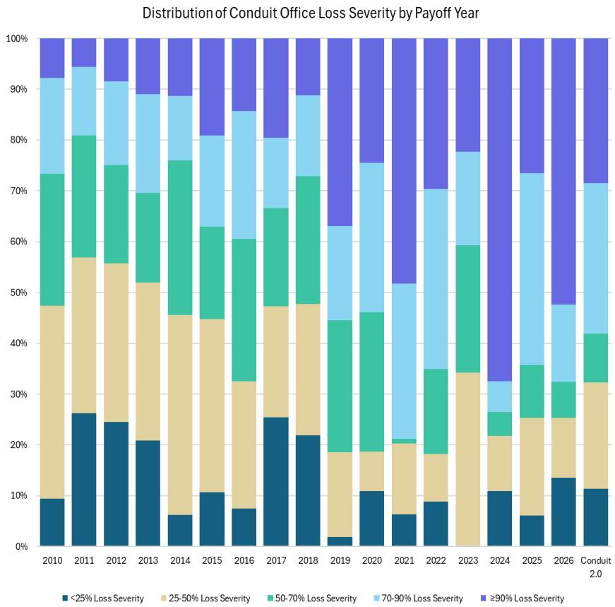

bar_stacked

| Year | <25% Loss Severity | 25-50% Loss Severity | 50-70% Loss Severity | 70-90% Loss Severity | ≥90% Loss Severity |
|------|---------------------|-----------------------|-----------------------|-----------------------|---------------------|
| 2010 | 10                  | 35                    | 25                    | 15                    | 5                   |
| 2011 | 26                  | 30                    | 20                    | 12                    | 4                   |
| 2012 | 24                  | 32                    | 18                    | 14                    | 5                   |
| 2013 | 21                  | 30                    | 16                    | 16                    | 6                   |
| 2014 | 6                   | 35                    | 20                    | 13                    | 7                   |
| 2015 | 10                  | 30                    | 18                    | 15                    | 10                  |
| 2016 | 7                   | 25                    | 20                    | 20                    | 12                  |
| 2017 | 25                  | 20                    | 18                    | 15                    | 15                  |
| 2018 | 22                  | 20                    | 18                    | 15                    | 15                  |
| 2019 | 2                   | 15                    | 20                    | 20                    | 35                  |
| 2020 | 11                  | 8                     | 25                    | 25                    | 30                  |
| 2021 | 6                   | 10                    | 2                     | 30                    | 45                  |
| 2022 | 9                   | 8                     | 15                    | 35                    | 40                  |
| 2023 | -                   | 35                    | 18                    | 20                    | 35                  |
| 2024 | -                   | 10                    | 5                     | 8                     | 65                  |
| 2025 | -                   | 15                    | 10                    | 30                    | 45                  |
| 2026 | -                   | 10                    | 8                     | 15                    | 65                  |
| Conduit 2.0 | -                 | -                   | -                     | -                     | -                   |

# CMBS Valuations at Multi-Year Tights

We expect CMBS to outperform corporates and think it is better insulated from supply/technical headwinds compared to other asset classes

CRE recovery has lagged that of the resi market coming out of COVID   
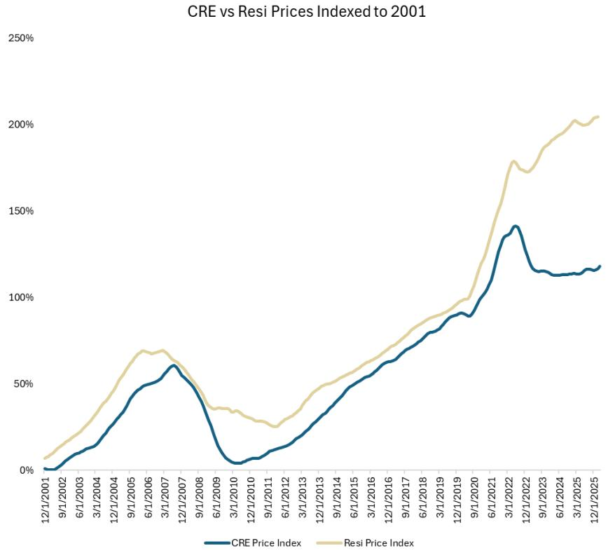

line

| Date       | CRE Price Index | Resi Price Index |
| ---------- | --------------- | ---------------- |
| 12/1/2001  | ~0%             | ~5%              |
| 9/1/2002   | ~5%             | ~15%             |
| 6/1/2003   | ~15%            | ~30%             |
| 3/1/2004   | ~30%            | ~50%             |
| 12/1/2005  | ~45%            | ~70%             |
| 9/1/2006   | ~55%            | ~75%             |
| 6/1/2007   | ~60%            | ~70%             |
| 3/1/2008   | ~50%            | ~60%             |
| 12/1/2009  | ~30%            | ~40%             |
| 9/1/2010   | ~5%             | ~35%             |
| 6/1/2011   | ~10%            | ~30%             |
| 3/1/2012   | ~15%            | ~35%             |
| 12/1/2013  | ~25%            | ~45%             |
| 9/1/2014   | ~40%            | ~55%             |
| 6/1/2015   | ~50%            | ~65%             |
| 3/1/2016   | ~60%            | ~75%             |
| 12/1/2017  | ~70%            | ~85%             |
| 9/1/2018   | ~80%            | ~95%             |
| 6/1/2019   | ~90%            | ~105%            |
| 3/1/2020   | ~95%            | ~115%            |
| 12/1/2021  | ~110%           | ~140%            |
| 9/1/2022   | ~140%           | ~175%            |
| 6/1/2023   | ~115%           | ~185%            |
| 3/1/2024   | ~115%           | ~195%            |
| 12/1/2025  | ~118%           | ~205%            |

CMBS Excess Spread Forecast and Returns 

<table><tr><td rowspan="2">Industrial Sector</td><td colspan="6">CMBS Returns</td></tr><tr><td>YTD</td><td>1Q</td><td>FY 2025</td><td>FY 2024</td><td>FY 2023</td><td>FY 2022</td></tr><tr><td>CMBS AAA</td><td>0.7%</td><td>0.3%</td><td>7.7%</td><td>5.6%</td><td>5.8%</td><td>-9.7%</td></tr><tr><td>CMBS BBB-IG Corp</td><td>1.3%</td><td>0.5%</td><td>8.4%</td><td>14.3%</td><td>-4.9%</td><td>-8.6%</td></tr><tr><td>HY Corp</td><td>0.3%</td><td>-0.5%</td><td>7.8%</td><td>2.0%</td><td>8.2%</td><td>-15.3%</td></tr><tr><td>US Treasuries</td><td>1.3%</td><td>-0.5%</td><td>8.6%</td><td>8.2%</td><td>13.4%</td><td>-11.2%</td></tr><tr><td>US Long Maturity Ts</td><td>-0.1%</td><td>0.0%</td><td>6.3%</td><td>0.6%</td><td>4.1%</td><td>-12.5%</td></tr><tr><td></td><td>-0.8%</td><td>-0.4%</td><td>5.6%</td><td>-6.4%</td><td>3.1%</td><td>-29.3%</td></tr></table>

<table><tr><td rowspan="3"></td><td colspan="7">2Q 2027 Forecast</td></tr><tr><td colspan="4">Spreads</td><td colspan="3">Excess Returns</td></tr><tr><td>Current</td><td>Bull</td><td>Base</td><td>Bear</td><td>Bull</td><td>Base</td><td>Bear</td></tr><tr><td>CMBS AAA Secondary</td><td>71</td><td>60</td><td>75</td><td>110</td><td>1.8%</td><td>0.3%</td><td>-3.2%</td></tr><tr><td>US IG</td><td>77</td><td>70</td><td>90</td><td>125</td><td>1.3%</td><td>-0.1%</td><td>-2.0%</td></tr><tr><td>CMBS BBB-Secondary</td><td>465</td><td>390</td><td>470</td><td>750</td><td>12.2%</td><td>4.2%</td><td>-23.9%</td></tr><tr><td>US HY</td><td>266</td><td>230</td><td>275</td><td>425</td><td>3.7%</td><td>1.8%</td><td>-3.3%</td></tr></table>

# US CLOs

# The Push and Pull

# Curve Steepening : Forces ‘Pulling’ & ‘Pushing’ the CLO Market

# Demand (Pull)

The conclusion of Basel III Endgame and favorable NAIC treatment should reinforce demand for senior IG tranches. Robust fixed annuity sales and continued CLO ETF inflows amid elevated rate expectations should also support demand for senior and floating-rate CLO exposure.

# AI Concerns Remain a Key Theme (Push)

We see AI disruption creating meaningful refinancing challenges for B- rated software names with maturities through 2028. We expect a significant portion of them will face impending downgrade pressure with constrained market access and may have to pursue LMEs to extend maturities.

# Supply

We revise down our 2026 NI forecast to \$180bn (\$140bn BSL, \$40bn PC). The revision reflects the slower pace of issuance YTD and a still-challenging arb. We also expect a modest slowdown in refi/reset activity. As a steeper CLO liability curve, wider mezz, and the need for managers to clean up lower-quality collateral pools increase the cost of resets, we expect activity to skew toward partial refis.

# BSL Over PC at the Aggregate Level, But Selective Buying Opportunities Have Emerged

PC CLO spread premia over BSL have widened recently amid growing AI concerns (\~30bp now vs. \~20bp YE25). We expect the basis to widen further from here, reflecting a more balanced supply-demand backdrop compared with BSL and incrementally weaker fundamental dynamics within private credit. However, we view a 40bp spread pickup versus BSL as an interesting entry point for PC AAAs.

# CLO Spreads: The Push and Pull

We expect the credit curve to steepen and favor an up-in-quality bias: owning AAAs to clip high-quality coupons while awaiting a better entry point for mezz

CLOs retraced much of March's widening   
New Issue Spreads (bp)   
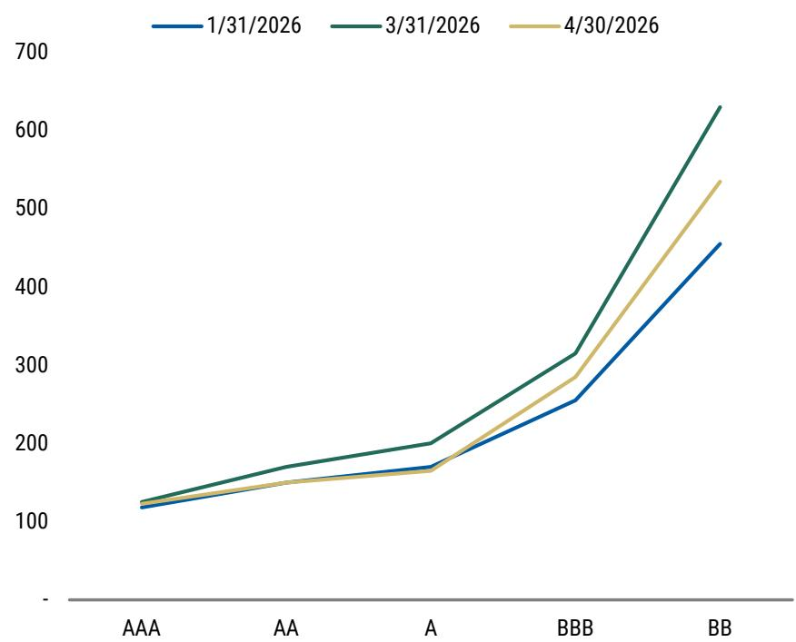

line

| Rating | 1/31/2026 | 3/31/2026 | 4/30/2026 |
| ------ | --------- | --------- | --------- |
| AAA    | 120       | 130       | 125       |
| AA     | 150       | 170       | 155       |
| A      | 160       | 200       | 165       |
| BBB    | 250       | 310       | 280       |
| BB     | 450       | 630       | 530       |

Spread and return forecasts for US CLO AAAs and BBs through 2Q27

<table><tr><td>T1 Primary CLO AAAs</td><td colspan="3">Forecast</td></tr><tr><td>Current: 3mS + 123bp</td><td>Bull</td><td>Base</td><td>Bear</td></tr><tr><td>Spread (bp)</td><td>108</td><td>120</td><td>175</td></tr><tr><td>Excess Return</td><td>2.1%</td><td>1.4%</td><td>-1.6%</td></tr></table>

<table><tr><td>T1 Primary CLO BBs</td><td colspan="3">Forecast</td></tr><tr><td>Current: 3mS + 535bp</td><td>Bull</td><td>Base</td><td>Bear</td></tr><tr><td>Spread (bp)</td><td>440</td><td>580</td><td>800</td></tr><tr><td>Excess Return</td><td>14.4%</td><td>1.1%</td><td>-19.8%</td></tr></table>

# CLO Volume: Not Matching Last Year's Record Levels

We cut our 2026 new issue forecast to \$180bn (\$140bn BSL / \$40bn PC) and \$240bn of refi/reset transactions, reflecting slower YTD issuance and a still-challenging arb

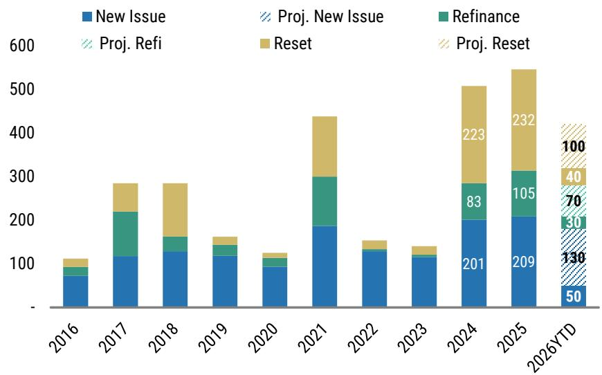

bar_stacked

| Year | New Issue | Proj. New Issue | Refinance | Proj. Refi | Reset | Proj. Reset |
| :--- | :--- | :--- | :--- | :--- | :--- | :--- |
| 2016 | 75 | 0 | 20 | 0 | 20 | 0 |
| 2017 | 115 | 0 | 130 | 0 | 80 | 0 |
| 2018 | 125 | 0 | 30 | 0 | 140 | 0 |
| 2019 | 115 | 0 | 25 | 0 | 20 | 0 |
| 2020 | 95 | 0 | 20 | 0 | 15 | 0 |
| 2021 | 185 | 0 | 135 | 0 | 155 | 0 |
| 2022 | 130 | 0 | 0 | 0 | 25 | 0 |
| 2023 | 115 | 0 | 15 | 0 | 15 | 0 |
| 2024 | 201 | 0 | 83 | 0 | 223 | 0 |
| 2025 | 209 | 0 | 105 | 0 | 232 | 0 |
| 2026 YTD | 50 | 130 | 30 | 70 | 40 | 100 |

US CLO Creation Breakdown   
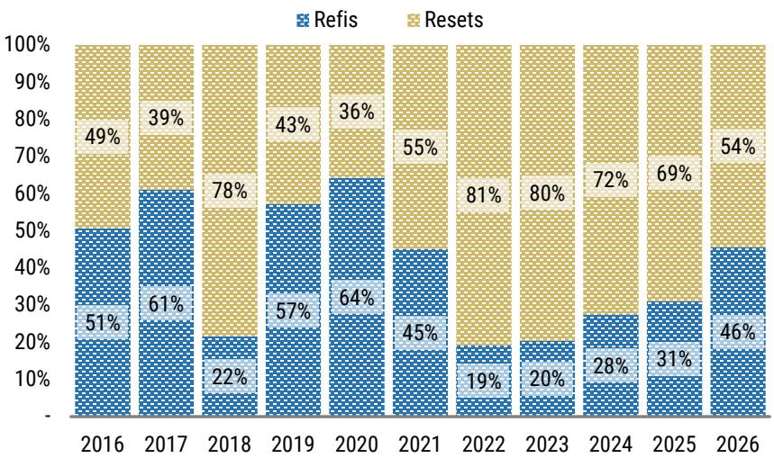

bar_stacked

| Year | Refis (%) | Resets (%) |
| :--- | :--- | :--- |
| 2016 | 51 | 49 |
| 2017 | 61 | 39 |
| 2018 | 22 | 78 |
| 2019 | 57 | 43 |
| 2020 | 64 | 36 |
| 2021 | 45 | 55 |
| 2022 | 19 | 81 |
| 2023 | 20 | 80 |
| 2024 | 28 | 72 |
| 2025 | 31 | 69 |
| 2026 | 46 | 54 |

<table><tr><td>HY and Loan Issuance Forecasts ($bn)</td><td>2022</td><td>2023</td><td>2024</td><td>2025</td><td>2026 Est</td><td>&#x27;26/&#x27;25 ($)</td><td>&#x27;26/&#x27;25 (%)</td></tr><tr><td colspan="8">High Yield Bonds</td></tr><tr><td>Total Bond Refinancing</td><td>49</td><td>110</td><td>197</td><td>231</td><td>280</td><td>+49</td><td>21%</td></tr><tr><td>Bond Non-Refinancing</td><td>53</td><td>66</td><td>84</td><td>96</td><td>160</td><td>+64</td><td>67%</td></tr><tr><td>Gross HY Bond Issuance</td><td>102</td><td>176</td><td>282</td><td>327</td><td>440</td><td>+113</td><td>34%</td></tr><tr><td colspan="8">Leveraged Loans</td></tr><tr><td>Total Loan Refinancing</td><td>59</td><td>137</td><td>261</td><td>195</td><td>175</td><td>(20)</td><td>(10%)</td></tr><tr><td>Loan Non-Refinancing</td><td>167</td><td>97</td><td>241</td><td>245</td><td>250</td><td>+5</td><td>2%</td></tr><tr><td>Gross Institutional Loan Issuance</td><td>225</td><td>234</td><td>502</td><td>440</td><td>425</td><td>+93</td><td>(3%)</td></tr></table>

Source: MS forecasts, PitchBook | LCD, Intex. Note: 2026 volumes are through May 8, 2026.

# CLO Demand: Insurance and ETF Channels Remain Supportive

# Robust fixed annuity sales and continued CLO ETF inflows amid elevated rate expectations should support demand for senior and floating-rate CLO exposure

Fixed annuity sales tracked robust levels   
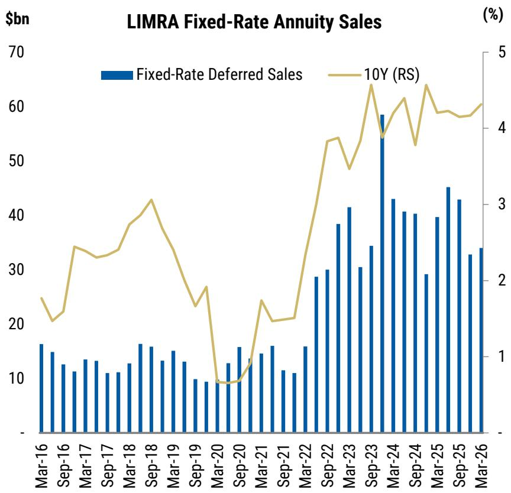

bar_line

LIMRA Fixed-Rate Annuity Sales
| Date | Fixed-Rate Deferred Sales ($bn) | 10Y (RS) (%) |
| :--- | :--- | :--- |
| Mar-16 | 16 | 2.5 |
| Sep-16 | 14 | 2.1 |
| Mar-17 | 11 | 3.4 |
| Sep-17 | 13 | 3.2 |
| Mar-18 | 11 | 3.4 |
| Sep-18 | 16 | 4.3 |
| Mar-19 | 13 | 3.5 |
| Sep-19 | 13 | 2.3 |
| Mar-20 | 9 | 0.8 |
| Sep-20 | 13 | 0.9 |
| Mar-21 | 15 | 2.4 |
| Sep-21 | 11 | 2.0 |
| Mar-22 | 16 | 3.0 |
| Sep-22 | 29 | 4.4 |
| Mar-23 | 38 | 3.7 |
| Sep-23 | 41 | 4.5 |
| Mar-24 | 58 | 4.0 |
| Sep-24 | 40 | 3.7 |
| Mar-25 | 29 | 4.4 |
| Sep-25 | 45 | 4.1 |
| Mar-26 | 33 | 4.2 |

CLO ETF AUM has grown to \~\$45bn, with robust inflows over the past 3 years   
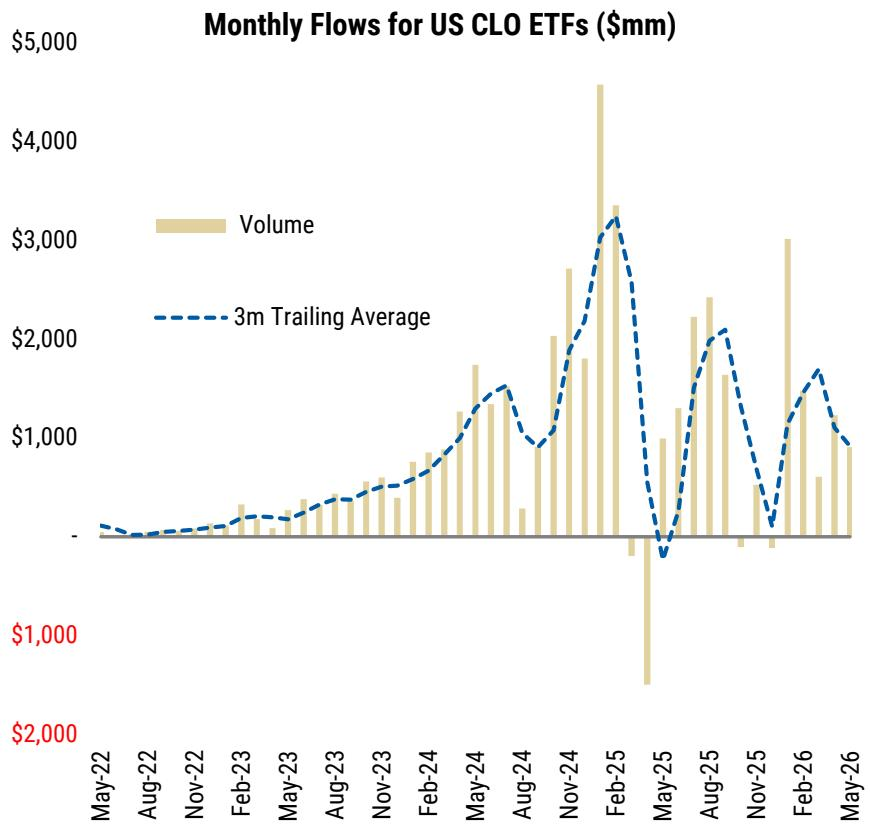

bar_line

Monthly Flows for US CLO ETFs ($mm)
| Month | Volume ($mm) | 3m Trailing Average ($mm) |
|---|---|---|
| May-22 | 100 | 150 |
| Aug-22 | 100 | 140 |
| Nov-22 | 100 | 160 |
| Feb-23 | 300 | 250 |
| May-23 | 200 | 280 |
| Aug-23 | 400 | 350 |
| Nov-23 | 600 | 450 |
| Feb-24 | 800 | 600 |
| May-24 | 1700 | 1500 |
| Aug-24 | 300 | 950 |
| Nov-24 | 2700 | 1800 |
| Feb-25 | 4500 | 3200 |
| May-25 | 500 | 100 |
| Aug-25 | 2200 | 2000 |
| Nov-25 | 1600 | 150 |
| Feb-26 | 3000 | 1700 |
| May-26 | 900 | 1000 |

Source: LIMRA, Bloomberg, MS. Note: No investment recommendation is made with respect to any of the ETFs or mutual funds referenced herein. Investors should not rely on the information included in making investment decisions with respect to those funds.

# Scenario Analysis: CCC Downgrades on CLO Portfolios

In our central scenario, we see AI disruption creating meaningful refinancing challenges for B- rated software names with maturities through 2028

Trailing 12M Default Rate (incl. DEs)   
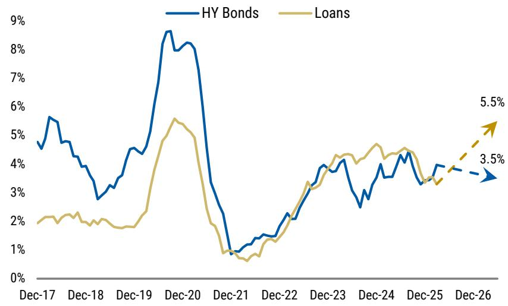

line

| Date   | HY Bonds | Loans |
|--------|----------|-------|
| Dec-26 | 3.5%     | 5.5%  |

Px Distribution of B- Loan Borrowers (% by Issr Ct)   
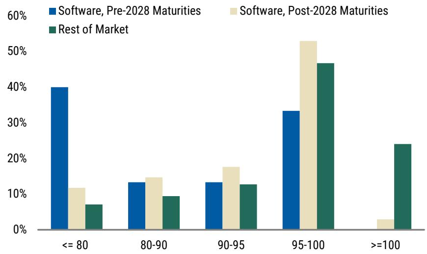

bar

| Maturity | Software, Pre-2028 Maturities (%) | Software, Post-2028 Maturities (%) | Rest of Market (%) |
| :--- | :--- | :--- | :--- |
| <= 80 | 40 | 11 | 7 |
| 80-90 | 13 | 14.5 | 9.5 |
| 90-95 | 13 | 17.5 | 12.5 |
| 95-100 | 33.5 | 53 | 46.5 |
| >=100 | 0 | 2.5 | 24 |

CLO Sensitivity to B- Downgrades Under AI Disruption Scenarios 

<table><tr><td>Scenarios</td><td>Aggregate B- Downgrade Rate</td><td>▲ BB MVOC(Current: 104.7)</td><td>▲ BBB MVOC(Current: 109.4)</td><td>▲ CCC(Current: 4.2%)</td></tr><tr><td>Upside Scenario: Easing Market Access</td><td>9.5%</td><td>-39bp</td><td>-41bp</td><td>+1.7%</td></tr><tr><td>Central Scenario: Concentrated Refi Pressure</td><td>16%</td><td>-71bp</td><td>-74bp</td><td>+2.9%</td></tr><tr><td>Downside Scenario: Restricting Market Access</td><td>22%</td><td>-102bp</td><td>-106bp</td><td>+4.0%</td></tr></table>

Source: PitchBook, Intex, MS

# Positioning: Favoring Sr. Debt While Remaining Cautious on Equity

We continue to favor the senior part of the capital structure. We remain cautious on equity as it continues to face pressure from both the IO and PO side of the trade

AAA spreads \~20th %-tile vs. past 10yr   
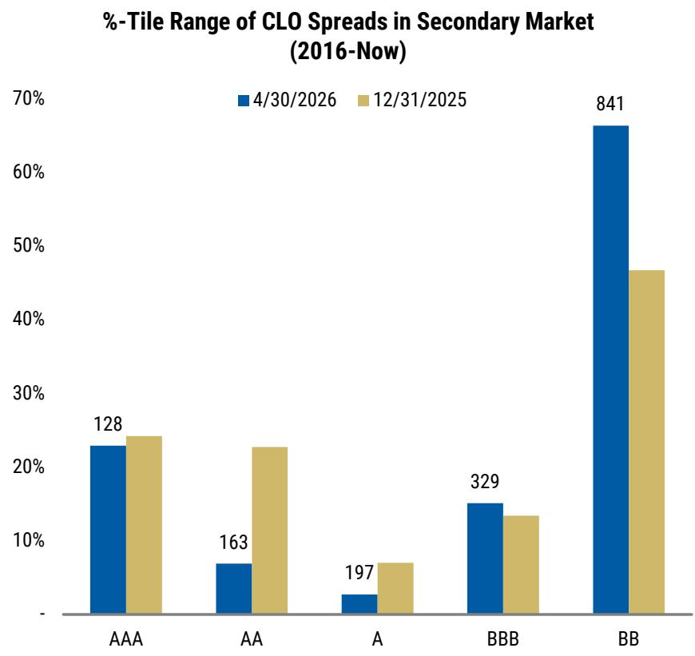

bar

%-Tile Range of CLO Spreads in Secondary Market (2016-Nov)
| Tile | 4/30/2026 (%) | 12/31/2025 (%) |
| :--- | :--- | :--- |
| AAA | 128 | 24 |
| AA | 163 | 22.5 |
| A | 197 | 7 |
| BBB | 329 | 13 |
| BB | 841 | 46.5 |

Source: Intex, Markit, Bloomberg, MS

Equity cash distribution remains subpar   
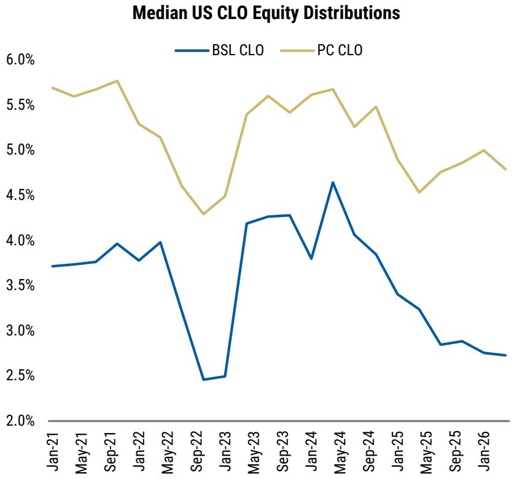

line

| Date   | BSL CLO | PC CLO |
|--------|---------|--------|
| Jan-21 | 3.7%    | 5.7%   |
| May-21 | 3.8%    | 5.6%   |
| Sep-21 | 4.0%    | 5.8%   |
| Jan-22 | 3.8%    | 5.3%   |
| May-22 | 4.0%    | 5.1%   |
| Sep-22 | 2.5%    | 4.3%   |
| Jan-23 | 2.5%    | 4.5%   |
| May-23 | 4.2%    | 5.4%   |
| Sep-23 | 4.3%    | 5.6%   |
| Jan-24 | 3.8%    | 5.7%   |
| May-24 | 4.7%    | 5.6%   |
| Sep-24 | 4.0%    | 5.5%   |
| Jan-25 | 3.4%    | 4.9%   |
| May-25 | 3.2%    | 4.5%   |
| Sep-25 | 2.9%    | 4.8%   |
| Jan-26 | 2.7%    | 5.0%   |

# PC CLOs: Widening Spreads Creating Selective Opportunities

We prefer BSL over PC CLOs at the aggregate level, but recent widening opens buying opportunities for PC CLO AAAs

We expect PC defaults to reach 8% by 1H27   
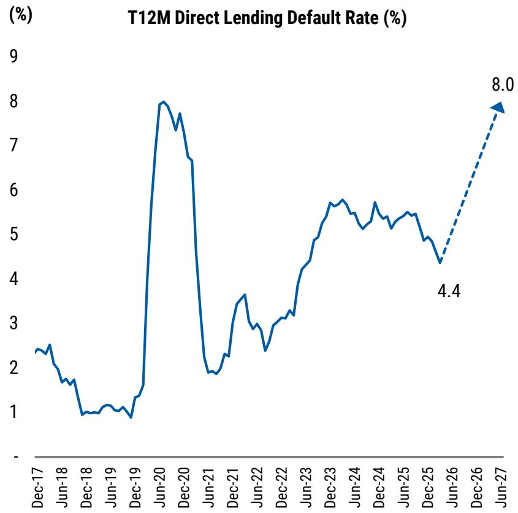

line

| Date    | T12M Direct Lending Default Rate (%) |
|---------|--------------------------------------|
| Jun-27  | 8.0                                  |
| Dec-26  | 4.4                                  |

Source: PitchBook | LCD, S&P, MS

PC CLO spread premia has widened   
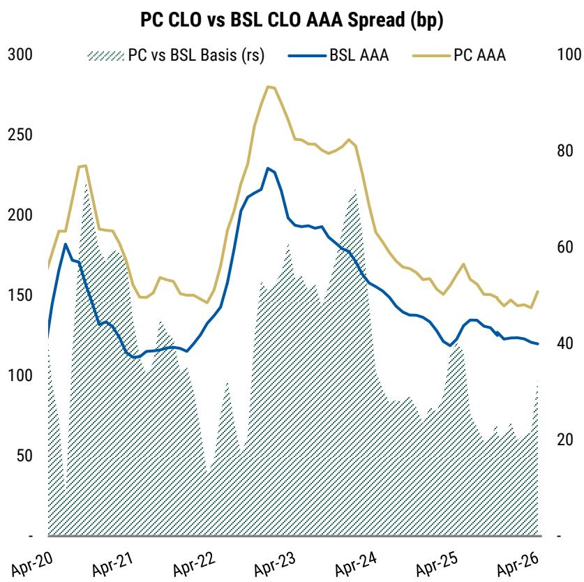

line

| Date   | PC vs BSL Basis (rs) | BSL AAA | PC AAA |
|--------|----------------------|---------|--------|
| Apr-20 | 100                  | 120     | 60     |
| Apr-21 | 180                  | 110     | 70     |
| Apr-22 | 140                  | 115     | 55     |
| Apr-23 | 230                  | 220     | 90     |
| Apr-24 | 180                  | 160     | 75     |
| Apr-25 | 120                  | 130     | 50     |
| Apr-26 | 60                   | 120     | 45     |

# ABS

Down the Stack in Digital Infra

# Down the Stack in Digital Infra

# Digital Infra Rises to the Top

We think data center ABS offer attractive relative value to where deals are getting done in the HY/IG secured corporate space, especially when considering investor protections/credit enhancements, tenant diversification, and the presence of fully stabilized assets. Fiber continues to be a well-liked expression of the critical infrastructure build. We see value across the capital stack, with the best rel val opportunities in Data Center BBB and Fiber BB.

# Prime Over Subprime, Again

We are more cautious on the consumer given the elevated inflation, lack of relief from rate cuts, and shallower-than-expected tax refunds. A steady forecast for the labor market should help keep increases in delinquencies contained, but the fundamental backdrop is not as optimistic as we initially thought. We think investor sentiment has waned for subprime. We prefer Prime AAAs over Subprime.

# A New Record for Supply?

The busiest start to the year in terms of ABS issuance... again. We now expect \$440bn of ABS issuance this year, up from \$390 last year. Both the consumer and commercial sides of ABS are engines for growth this year, with healthy auto and MPL supply being met by consistent esoteric paper from a wide range of industries. We look for \$290bn of consumer to end the year and \$150bn of commercial.

# Raising our 2026 Gross Issuance Forecast to \$440bn from \$360bn

After the busiest start to the year in issuance, we raise our gross supply forecast to \$440bn and see the total outstanding balance growing to just over \$1.2tr

ABS Historical Gross Issuance & Forecast   
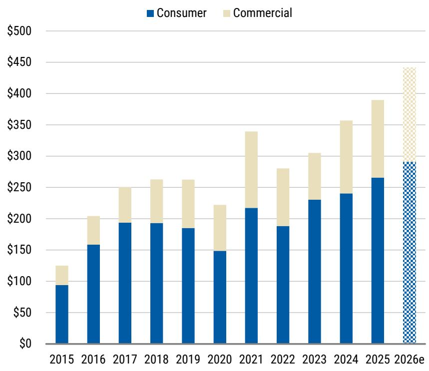

bar_stacked

| Year | Consumer ($) | Commercial ($) |
| :--- | :--- | :--- |
| 2015 | 93 | 47 |
| 2016 | 158 | 64 |
| 2017 | 193 | 88 |
| 2018 | 193 | 103 |
| 2019 | 184 | 109 |
| 2020 | 147 | 109 |
| 2021 | 216 | 173 |
| 2022 | 187 | 144 |
| 2023 | 230 | 95 |
| 2024 | 240 | 145 |
| 2025 | 265 | 135 |
| 2026e | 293 | 173 |

ABS Outstanding Balance & Forecasts   
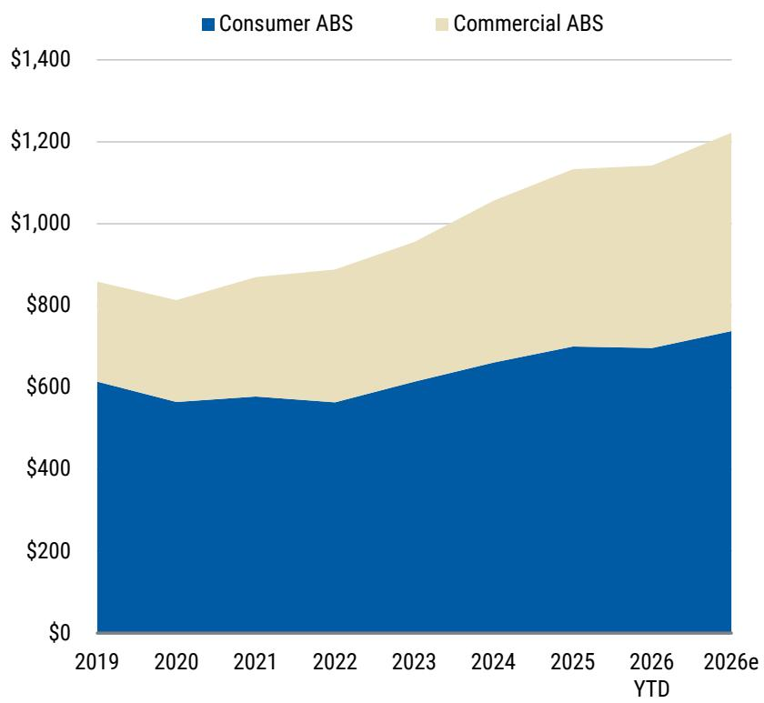

bar_stacked

| Year   | Consumer ABS | Commercial ABS |
| ------ | ------------ | -------------- |
| 2019   | $600         | $250           |
| 2020   | $550         | $270           |
| 2021   | $570         | $300           |
| 2022   | $560         | $320           |
| 2023   | $600         | $350           |
| 2024   | $650         | $400           |
| 2025   | $700         | $450           |
| 2026e  | $730         | $500           |

Source: Intex, Bloomberg, MS

# 2Q27 ABS Spread Forecasts

# We see more value over NTM in digital infrastructure than consumer ABS

<table><tr><td rowspan="2"></td><td colspan="4">Spreads</td><td colspan="3">Excess Returns</td></tr><tr><td>Current</td><td>Bull</td><td>Base</td><td>Bear</td><td>Bull</td><td>Base</td><td>Bear</td></tr><tr><td>Prime Auto AAA</td><td>35</td><td>15</td><td>25</td><td>55</td><td>0.9%</td><td>0.6%</td><td>-0.2%</td></tr><tr><td>Subprime Auto AAA</td><td>45</td><td>30</td><td>55</td><td>100</td><td>0.7%</td><td>0.3%</td><td>-0.4%</td></tr><tr><td>Subprime Auto BBB</td><td>115</td><td>100</td><td>140</td><td>225</td><td>1.7%</td><td>0.2%</td><td>-2.9%</td></tr><tr><td>Fiber A</td><td>145</td><td>120</td><td>140</td><td>180</td><td>2.7%</td><td>1.7%</td><td>-0.3%</td></tr><tr><td>Data Center A</td><td>180</td><td>150</td><td>175</td><td>225</td><td>3.3%</td><td>2.1%</td><td>-0.5%</td></tr></table>

Source: TRACE, Bloomberg, MS estimates

# Delinquencies Fall Mostly In Line With Seasonal Patterns

While the material correction we anticipated has not yet occurred in either Prime or Subprime, DQs are down to start the year, and defaults are below expected levels

Prime Auto 60+ DQs 2026 Implied Path   
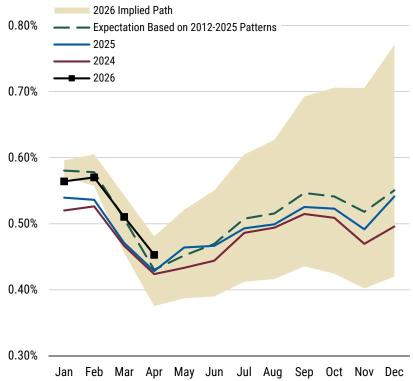

line

| Month | 2026 Implied Path | Expectation Based on 2012-2025 Patterns | 2025 | 2024 | 2026 |
|-------|-------------------|------------------------------------------|------|------|------|
| Jan   | ~0.59%            | ~0.58%                                   | ~0.54% | ~0.52% | ~0.57% |
| Feb   | ~0.60%            | ~0.58%                                   | ~0.54% | ~0.53% | ~0.57% |
| Mar   | ~0.55%            | ~0.53%                                   | ~0.48% | ~0.47% | ~0.51% |
| Apr   | ~0.48%            | ~0.45%                                   | ~0.43% | ~0.42% | ~0.45% |
| May   | ~0.52%            | ~0.47%                                   | ~0.46% | ~0.44% | -    |
| Jun   | ~0.55%            | ~0.48%                                   | ~0.47% | ~0.45% | -    |
| Jul   | ~0.60%            | ~0.51%                                   | ~0.49% | ~0.48% | -    |
| Aug   | ~0.63%            | ~0.52%                                   | ~0.50% | ~0.49% | -    |
| Sep   | ~0.68%            | ~0.54%                                   | ~0.53% | ~0.51% | -    |
| Oct   | ~0.70%            | ~0.53%                                   | ~0.52% | ~0.51% | -    |
| Nov   | ~0.71%            | ~0.52%                                   | ~0.49% | ~0.47% | -    |
| Dec   | ~0.78%            | ~0.55%                                   | ~0.54% | ~0.50% | -    |

Prime Auto 60+ DQs vs Defaults   
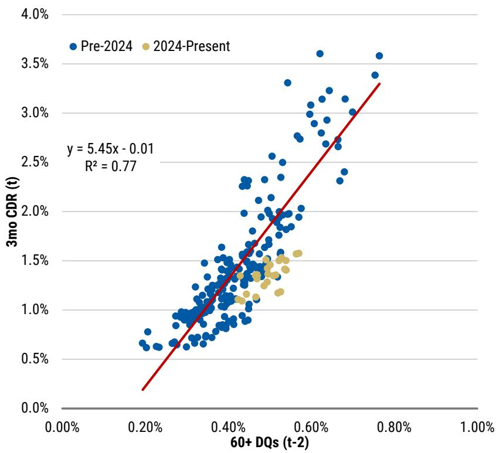

scatter

| 60+ DQs (t-2) | 3mo CDR (t) | Group        |
| ------------- | ----------- | ------------ |
| 0.20%         | 0.6%        | Pre-2024     |
| 0.40%         | 1.5%        | 2024-Present |
| 0.60%         | 2.5%        | Pre-2024     |
| 0.80%         | 3.5%        | Pre-2024     |

# Subprime Auto DQs Softer Than Expected, Too

... but defaults also remain below expected levels. We think a shift in mix is responsible for driving elevated delinquencies in Subprime

Subprime Auto 60+ DQs 2026 Implied Path   
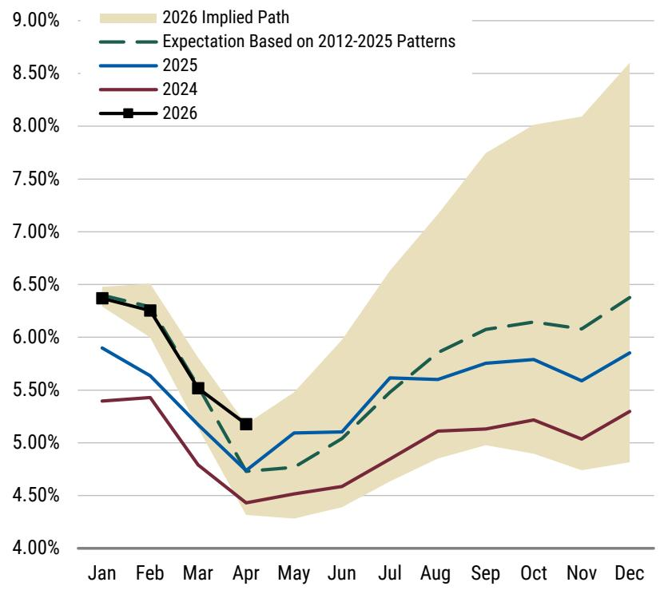

line

| Month | 2026 Implied Path | Expectation Based on 2012-2025 Patterns | 2025 | 2024 | 2026 |
|-------|-------------------|------------------------------------------|------|------|------|
| Jan   | 6.3%              | 6.3%                                     | 5.9% | 5.4% | 6.3% |
| Feb   | 6.2%              | 6.2%                                     | 5.7% | 5.4% | 6.2% |
| Mar   | 5.5%              | 5.5%                                     | 5.3% | 4.8% | 5.5% |
| Apr   | 5.2%              | 5.2%                                     | 4.7% | 4.4% | 5.2% |
| May   | 5.4%              | 5.4%                                     | 5.1% | 4.5% | 5.4% |
| Jun   | 5.8%              | 5.8%                                     | 5.1% | 4.6% | 5.8% |
| Jul   | 6.5%              | 6.5%                                     | 5.6% | 4.8% | 6.5% |
| Aug   | 7.0%              | 7.0%                                     | 5.6% | 5.1% | 7.0% |
| Sep   | 7.5%              | 7.5%                                     | 5.7% | 5.1% | 7.5% |
| Oct   | 8.0%              | 8.0%                                     | 5.8% | 5.2% | 8.0% |
| Nov   | 8.1%              | 8.1%                                     | 5.6% | 5.0% | 8.1% |
| Dec   | 8.5%              | 8.3%                                     | 5.8% | 5.3% | 8.3% |

Subprime Auto 60+ DQs vs Defaults   
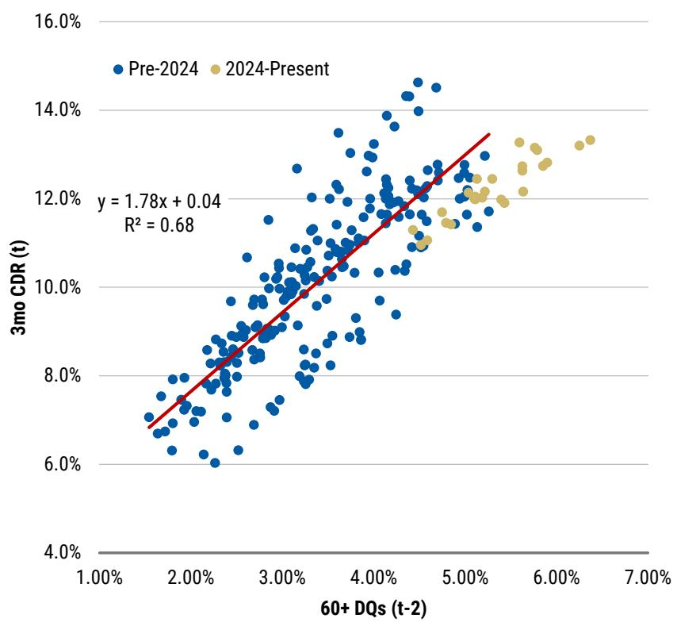

scatter

| 60+ DQs (t-2) | 3mo CDR (t) | Group        |
| ------------- | ----------- | ------------ |
| 1.00%         | 6.0%        | Pre-2024     |
| 2.00%         | 7.0%        | Pre-2024     |
| 3.00%         | 8.0%        | Pre-2024     |
| 4.00%         | 9.0%        | Pre-2024     |
| 5.00%         | 10.0%       | Pre-2024     |
| 6.00%         | 11.0%       | Pre-2024     |
| 7.00%         | 12.0%       | Pre-2024     |
| 1.00%         | 7.5%        | 2024-Present |
| 2.00%         | 8.5%        | 2024-Present |
| 3.00%         | 9.5%        | 2024-Present |
| 4.00%         | 10.5%       | 2024-Present |
| 5.00%         | 11.5%       | 2024-Present |
| 6.00%         | 12.5%       | 2024-Present |
| 7.00%         | 13.5%       | 2024-Present |

# Slightly Increasing Pace of 60+ DQs and 3mo CDR Across Autos

While the pace of DQ increase is still positive, as is true for defaults, we do not observe real acceleration in either, albeit with a different pattern for both

60+ DQs Y/Y Change   
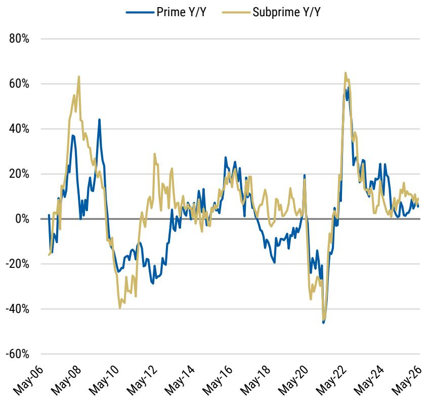

line

| Date   | Prime Y/Y | Subprime Y/Y |
|--------|-----------|--------------|
| May-06 | -15%      | -10%         |
| May-08 | 35%       | 60%          |
| May-10 | 40%       | 20%          |
| May-12 | -25%      | -40%         |
| May-14 | 5%        | 10%          |
| May-16 | 25%       | 15%          |
| May-18 | -15%      | 5%           |
| May-20 | -20%      | -30%         |
| May-22 | 55%       | 65%          |
| May-24 | 20%       | 15%          |
| May-26 | 5%        | 10%          |

Source: Intex, MS

3mo CDR Y/Y Change   
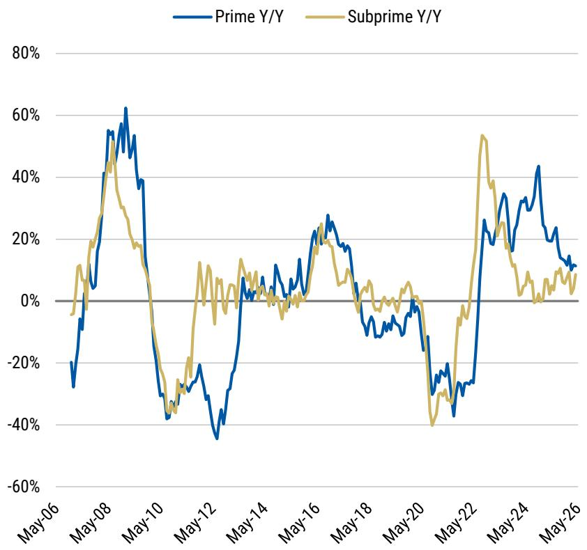

line

| Date   | Prime Y/Y | Subprime Y/Y |
|--------|-----------|--------------|
| May-06 | -30%      | -5%          |
| May-08 | 55%       | 50%          |
| May-10 | 60%       | 40%          |
| May-12 | -45%      | -30%         |
| May-14 | 5%        | 0%           |
| May-16 | 25%       | 20%          |
| May-18 | -10%      | -5%          |
| May-20 | -30%      | -40%         |
| May-22 | 25%       | 50%          |
| May-24 | 35%       | 10%          |
| May-26 | 10%       | 5%           |

# We Prefer Prime AAA Over Subprime AAA Over the Next 12 Months

Given the macro uncertainty that should most affect the low-to-middle income consumer and weaker investor sentiment for subprime paper, we think there will be better entry points ahead for Subprime and prefer Prime instead

Prime AAA vs Subprime AAA Secondary Spreads   
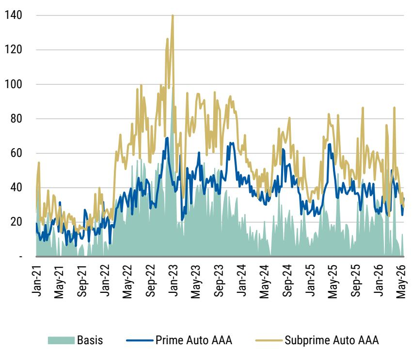

line

| Date   | Basis | Prime Auto AAA | Subprime Auto AAA |
|--------|-------|----------------|-------------------|
| Jan-21 | 15    | 18             | 55                |
| May-21 | 12    | 20             | 35                |
| Sep-21 | 10    | 15             | 25                |
| Jan-22 | 18    | 22             | 38                |
| May-22 | 25    | 30             | 50                |
| Sep-22 | 30    | 35             | 65                |
| Jan-23 | 40    | 45             | 75                |
| May-23 | 35    | 40             | 60                |
| Sep-23 | 38    | 42             | 68                |
| Jan-24 | 30    | 35             | 55                |
| May-24 | 25    | 30             | 45                |
| Sep-24 | 30    | 35             | 50                |
| Jan-25 | 20    | 25             | 35                |
| May-25 | 25    | 30             | 40                |
| Sep-25 | 30    | 35             | 45                |
| Jan-26 | 25    | 30             | 40                |
| May-26 | 15    | 25             | 30                |

Subprime AAA and BBB Secondary Spreads   
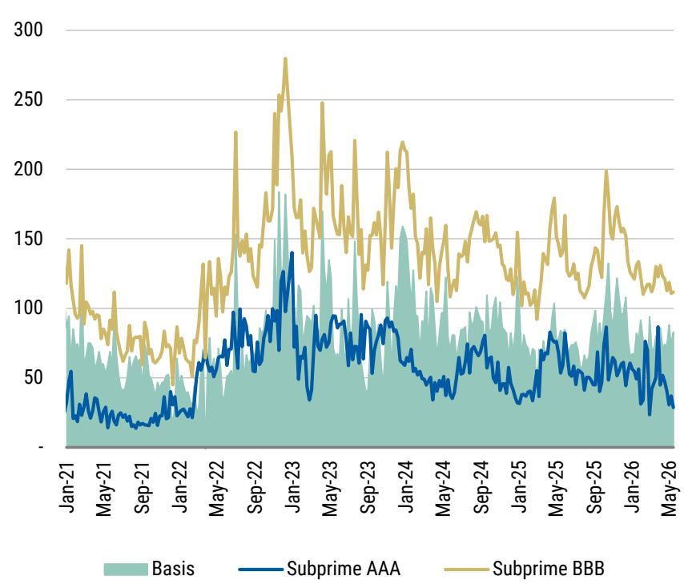

line

| Date   | Basis | Subprime AAA | Subprime BBB |
|--------|-------|--------------|--------------|
| Jan-21 | ~90   | ~50          | ~140         |
| May-21 | ~70   | ~30          | ~100         |
| Sep-21 | ~60   | ~20          | ~80          |
| Jan-22 | ~50   | ~30          | ~70          |
| May-22 | ~60   | ~50          | ~130         |
| Sep-22 | ~100  | ~90          | ~230         |
| Jan-23 | ~180  | ~140         | ~280         |
| May-23 | ~130  | ~90          | ~250         |
| Sep-23 | ~100  | ~80          | ~220         |
| Jan-24 | ~150  | ~60          | ~210         |
| May-24 | ~110  | ~50          | ~160         |
| Sep-24 | ~100  | ~70          | ~170         |
| Jan-25 | ~90   | ~60          | ~150         |
| May-25 | ~100  | ~80          | ~180         |
| Sep-25 | ~130  | ~70          | ~200         |
| Jan-26 | ~110  | ~60          | ~170         |
| May-26 | ~80   | ~30          | ~110         |

Source: TRACE, MS

# Digital Infra ABS Gross Issuance Set to Reach Record Levels in 2026

# We forecast \~\$40bn of digital infra supply this year with growth propelled by both data centers and fiber

Digital Infrastructure Gross Issuance (\$bn)   
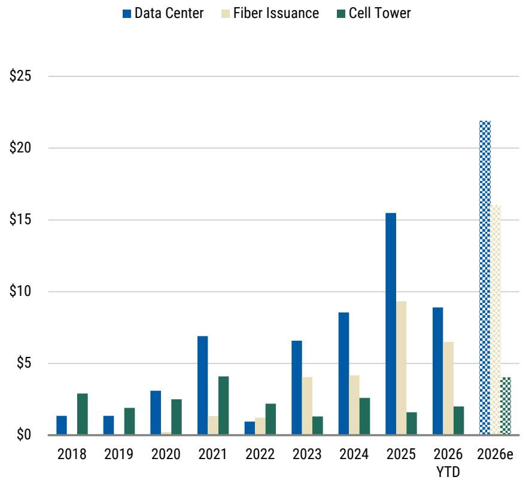

bar

| Year | Data Center ($) | Fiber Issuance ($) | Cell Tower ($) |
| :--- | :--- | :--- | :--- |
| 2018 | 1.2 | - | 2.8 |
| 2019 | 1.1 | - | 1.8 |
| 2020 | 3.0 | 0.2 | 2.5 |
| 2021 | 6.8 | 1.3 | 4.0 |
| 2022 | 0.8 | 1.1 | 2.1 |
| 2023 | 6.5 | 4.0 | 1.2 |
| 2024 | 8.5 | 4.1 | 2.5 |
| 2025 | 15.5 | 9.3 | 1.5 |
| 2026 YTD | 8.8 | 6.4 | 1.9 |
| 2026e | 21.8 | 16.0 | 4.0 |

Digital Infrastructure Outstanding Balance (\$bn)   
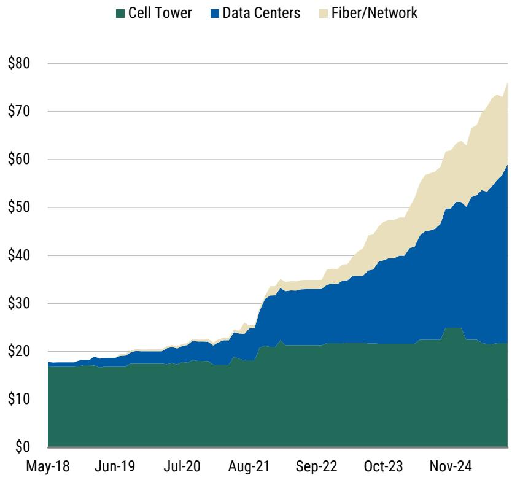

bar_stacked

| Month    | Cell Tower | Data Centers | Fiber/Network |
| -------- | ---------- | ------------ | ------------- |
| May-18   | $17        | $1      | $0            |
| Jun-19   | $17        | $2      | $0            |
| Jul-20   | $17        | $5      | $0            |
| Aug-21   | $20        | $10    | $2            |
| Sep-22   | $21        | $15    | $5            |
| Oct-23   | $21        | $25    | $10           |
| Nov-24   | $22        | $40    | $15           |
| Dec-24   | $22        | $60    | $20           |

Source: Bloomberg, Intex, CreditFlow, MS

# Data Center & AI-Related Paper Experiencing Rapid Growth Across Fixed Income

Given the supply we expect technicals rather than fundamentals to drive price action

Gross Issuance and Forecast, Data Center Securitized Credit (\$mm)   
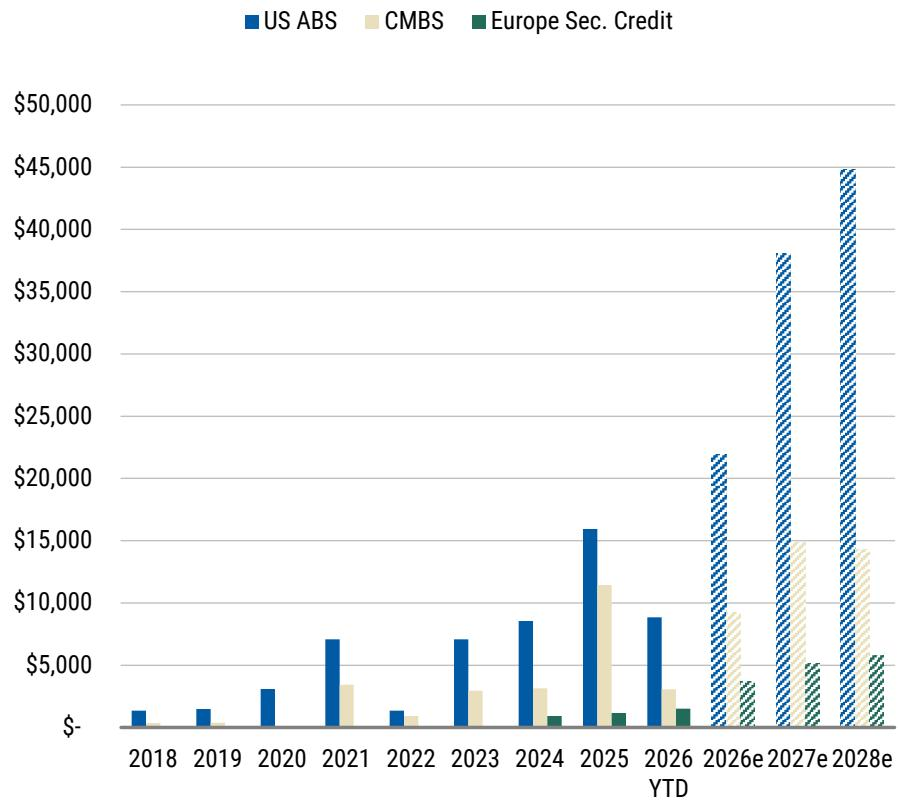

bar

| Year | US ABS ($) | CMBS ($) | Europe Sec. Credit ($) |
| :--- | :--- | :--- | :--- |
| 2018 | 1500 | 300 | - |
| 2019 | 1600 | 400 | - |
| 2020 | 3200 | - | - |
| 2021 | 7000 | 3500 | - |
| 2022 | 1500 | 800 | - |
| 2023 | 7000 | 3000 | - |
| 2024 | 8500 | 3200 | 800 |
| 2025 | 16000 | 11500 | 1200 |
| 2026 | 8800 | 3100 | 1500 |
| 2026e | 22000 | 9500 | 4000 |
| 2027e | 38000 | 15000 | 5000 |
| 2028e | 45000 | 14500 | 5800 |

AI-Related Gross Issuance (USD), \$bn   
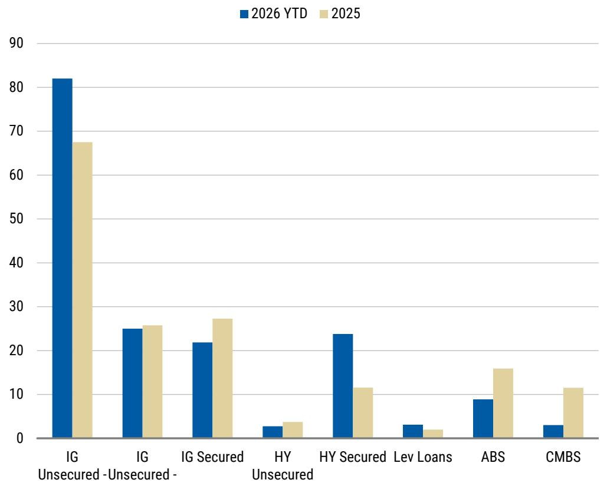

bar

| Category         | 2026 YTD | 2025 |
| ---------------- | -------- | ---- |
| IG Unsecured     | 82       | 67   |
| IG Secured       | 22       | 27   |
| HY Unsecured     | 3        | 4    |
| HY Secured       | 24       | 11   |
| Lev Loans        | 3        | 2    |
| ABS              | 9        | 16   |
| CMBS             | 3        | 11   |

Hyperscaler Oracle   
Source: Bloomberg, Intex, CreditFlow, Trepp, Pitchbook, MS estimates

# We Like Going Down the Stack in Data Centers and Fiber

# We think there is clear relative value in mezz tranches

Data Center Spreads Have Seen Recent Sensitivity to Issuance Across Fixed Income   
5y Data Center NI Spreads vs A-Rated 5y IG Spreads   
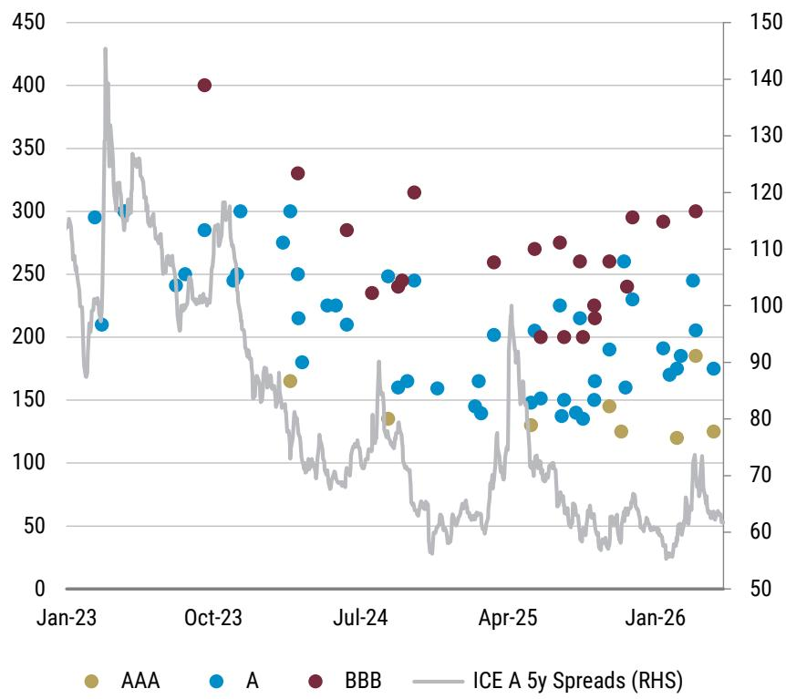

bar_line

| Date   | AAA  | A    | BBB  | ICE A 5y Spreads (RHS) |
|--------|------|------|------|------------------------|
| Jan-23 | -    | 295  | -    | 145                    |
| Oct-23 | -    | 280  | 400  | 130                    |
| Jul-24 | -    | 250  | 330  | 100                    |
| Apr-25 | -    | 200  | 260  | 70                     |
| Jan-26 | 120  | 180  | 300  | 60                     |

We See Value in Mezz Fiber ABS Given Strong Fundamental Backdrop   
5y Fiber NI Spreads vs A-Rated 5y IG Spreads   
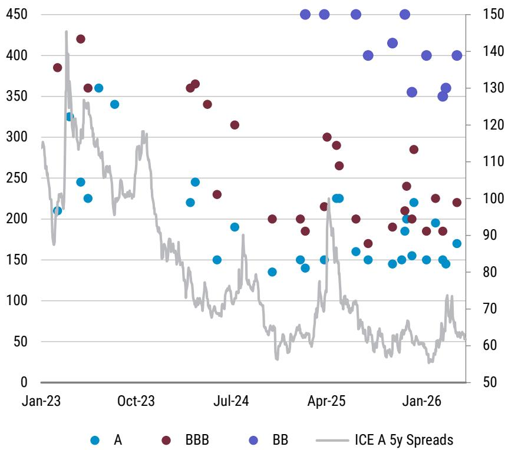  
Source: Bloomberg, CreditFlow, ICE, MS

# Disclosure Section

# Mortgage Backed Securities (MBS) and Collateralized Mortgage Obligations (CMO)

Principal is returned on a monthly basis over the life of the security. Principal prepayment can significantly affect the monthly income stream and the maturity of any type of MBS, including standard MBS, CMOs and Lottery Bonds. Yields and average lives are estimated based on prepayment assumptions and are subject to change based on actual prepayment of the mortgages in the underlying pools. The level of predictability of an MBS/CMO's average life, and its market price, depends on the type of MBS/CMO class purchased and interest rate movements. In general, as interest rates fall, prepayment speeds are likely to increase, thus shortening the MBS/CMO's average life and likely causing its market price to rise. Conversely, as interest rates rise, prepayment speeds are likely to decrease, thus lengthening average life and likely causing the MBS/CMO's market price to fall. Some MBS/CMOs may have "original issue discount" (OID). OID occurs if the MBS/CMO's original issue price is below its stated redemption price at maturity, and results in "imputed interest" that must be reported annually for tax purposes, resulting in a tax liability even though interest was not received. Investors are urged to consult their tax advisors for more information. Government agency backing applies only to the face value of the CMO and not to any premium paid.

The information and opinions in MS were prepared by MS & Co. LLC, and/or MS C.T.V.M. S.A., and/or MS Mexico, Casa de Bolsa, S.A. de C.V., and/or MS Canada Limited. As used in this disclosure section, "MS" includes MS & Co. LLC, MS C.T.V.M. S.A., MS Mexico, Casa de Bolsa, S.A. de C.V., MS Canada Limited and their affiliates as necessary.

For important disclosures, stock price charts and equity rating histories regarding companies that are the subject of this report, please see the MS Disclosure Website at www.morganstanley.com/eqr/disclosures/webapp/generalresearch, or contact your investment representative or MS at 1585 Broadway, (Attention: Research Management), New York, NY, 10036 USA.

For valuation methodology and risks associated with any recommendation, rating or price target referenced in this research report, please contact the Client Support Team as follows: US/Canada +1 800 303-2495; Hong Kong +852 2848-5999; Latin America +1 718 754-5444 (U.S.); London +44 (0)20-7425-8169; Singapore +65 6834-6860; Sydney +61 (0)2-9770-1505; Tokyo +81 (0)3-6836-9000. Alternatively you may contact your investment representative or MS at 1585 Broadway, (Attention: Research Management), New York, NY 10036 USA.

# Analyst Certification

The following analysts hereby certify that their views about the companies and their securities discussed in this report are accurately expressed and that they have not received and will not receive direct or indirect compensation in exchange for expressing specific recommendations or views in this report: James Egan; Joyce Jiang; Carolyn L Campbell; Catherine Liu; Gabriel Reyes Esclasans; Raquel Kanner

# Global Research Conflict Management Policy

MS has been published in accordance with our conflict management policy, which is available at www.morganstanley.com/institutional/research/conflictpolicies. A Portuguese version of the policy can be found at www.morganstanley.com.br

# Important Regulatory Disclosures on Subject Companies

The equity research analysts or strategists principally responsible for the preparation of MS have received compensation based upon various factors, including quality of research, investor client feedback, stock picking, competitive factors, firm revenues and overall investment banking revenues. Equity Research analysts' or strategists' compensation is not linked to investment banking or capital markets transactions performed by MS or the profitability or revenues of particular trading desks.

MS and its affiliates do business that relates to companies/instruments covered in MS, including market making, providing liquidity, fund management, commercial banking, extension of credit, investment services and investment banking. MS sells to and buys from customers the securities/instruments of companies covered in MS on a principal basis. MS may have a position in the debt of the Company or instruments discussed in this report. MS trades or may trade as principal in the debt securities (or in related derivatives) that are the subject of the debt research report.

Certain disclosures listed above are also for compliance with applicable regulations in non-US jurisdictions.

# Disclosure Section (Cont.)

# STOCK RATINGS

MS uses a relative rating system using terms such as Overweight, Equal-weight, Not-Rated or Underweight (see definitions below). MS does not assign ratings of Buy, Hold or Sell to the stocks we cover. Overweight, Equal-weight, Not-Rated and Underweight are not the equivalent of buy, hold and sell. Investors should carefully read the definitions of all ratings used in MS. In addition, since MS contains more complete information concerning the analyst's views, investors should carefully read MS, in its entirety, and not infer the contents from the rating alone. In any case, ratings (or research) should not be used or relied upon as investment advice. An investor's decision to buy or sell a stock should depend on individual circumstances (such as the investor's existing holdings) and other considerations.

# Global Stock Ratings Distribution

(as of April 30, 2026)

The Stock Ratings described below apply to MS's Fundamental Equity Research and do not apply to Debt Research produced by the Firm.

For disclosure purposes only (in accordance with FINRA requirements), we include the category headings of Buy, Hold, and Sell alongside our ratings of Overweight, Equal-weight, Not-Rated and Underweight. MS does not assign ratings of Buy, Hold or Sell to the stocks we cover. Overweight, Equal-weight, Not-Rated and Underweight are not the equivalent of buy, hold, and sell but represent recommended relative weightings (see definitions below). To satisfy regulatory requirements, we correspond Overweight, our most positive stock rating, with a buy recommendation; we correspond Equal-weight and Not-Rated to hold and Underweight to sell recommendations, respectively.

<table><tr><td rowspan="2">Stock Rating Category</td><td colspan="2">Coverage Universe</td><td colspan="3">Investment Banking Clients (IBC)</td><td colspan="2">Other Material Investment Services Clients (MISC)</td></tr><tr><td>Count</td><td>% of Total</td><td>Count</td><td>% of Total IBC</td><td>% of Rating Category</td><td>Count</td><td>% of Total Other MISC</td></tr><tr><td>Overweight/Buy</td><td>1546</td><td>42%</td><td>467</td><td>51%</td><td>30%</td><td>709</td><td>44%</td></tr><tr><td>Equal-weight/Hold</td><td>1568</td><td>43%</td><td>358</td><td>39%</td><td>23%</td><td>715</td><td>44%</td></tr><tr><td>Not-Rated/Hold</td><td>4</td><td>0%</td><td>0</td><td>0%</td><td>0%</td><td>1</td><td>0%</td></tr><tr><td>Underweight/Sell</td><td>555</td><td>15%</td><td>84</td><td>9%</td><td>15%</td><td>202</td><td>12%</td></tr><tr><td>Total</td><td>3,673</td><td></td><td>909</td><td></td><td></td><td>1627</td><td></td></tr></table>

Data include common stock and ADRs currently assigned ratings. Investment Banking Clients are companies from whom MS received investment banking compensation in the last 12 months. Due to rounding off of decimals, the percentages provided in the "% of total" column may not add up to exactly 100 percent.

# Analyst Stock Ratings

Overweight (O). The stock's total return is expected to exceed the average total return of the analyst's industry (or industry team's) coverage universe, on a risk-adjusted basis, over the next 12-18 months.

Equal-weight (E). The stock's total return is expected to be in line with the average total return of the analyst's industry (or industry team's) coverage universe, on a risk-adjusted basis, over the next 12-18 months.

Not-Rated (NR). Currently the analyst does not have adequate conviction about the stock's total return relative to the average total return of the analyst's industry (or industry team's) coverage universe, on a risk-adjusted basis, over the next 12-18 months.

Underweight (U). The stock's total return is expected to be below the average total return of the analyst's industry (or industry team's) coverage universe, on a risk-adjusted basis, over the next 12-18 months.

Unless otherwise specified, the time frame for price targets included in MS is 12 to 18 months.

# Disclosure Section (Cont.)

# Analyst Industry Views

Attractive (A): The analyst expects the performance of his or her industry coverage universe over the next 12-18 months to be attractive vs. the relevant broad market benchmark, as indicated below.

In-Line (I): The analyst expects the performance of his or her industry coverage universe over the next 12-18 months to be in line with the relevant broad market benchmark, as indicated below.

Cautious (C): The analyst views the performance of his or her industry coverage universe over the next 12-18 months with caution vs. the relevant broad market benchmark, as indicated below.

Benchmarks for each region are as follows: North America - S&P 500; Latin America - relevant MSCI country index or MSCI Latin America Index; Europe - MSCI Europe; Japan - TOPIX; Asia - relevant MSCI country index or MSCI sub-regional index or MSCI AC Asia Pacific ex Japan Index.

# Important Disclosures for MS Smith Barney LLC Customers

Important disclosures regarding any material conflict of interest that can reasonably be expected to have influenced MS Smith Barney LLC's choice of a third-party research provider or the subject company of a third-party research report, are available on the MS Wealth Management disclosure website at

www.morganstanley.com/online/researchdisclosures. For MS specific disclosures, you may refer to https://www.morganstanley.com/eqr/disclosures/webapp/generalresearch.

Each MS report is reviewed and approved on behalf of MS Smith Barney LLC. This review and approval is conducted by the same person who reviews the research report on behalf of MS. This could create a conflict of interest.

# Other Important Disclosures

MS policy is to update research reports as and when the Research Analyst and Research Management deem appropriate, based on developments with the issuer, the sector, or the market that may have a material impact on the research views or opinions stated therein. In addition, certain Research publications are intended to be updated on a regular periodic basis (weekly/monthly/quarterly/annual) and will ordinarily be updated with that frequency, unless the Research Analyst and Research Management determine that a different publication schedule is appropriate based on current conditions.

MS is not acting as a municipal advisor and the opinions or views contained herein are not intended to be, and do not constitute, advice within the meaning of Section 975 of the Dodd-Frank Wall Street Reform and Consumer Protection Act.

MS produces an equity research product called a "Tactical Idea." Views contained in a "Tactical Idea" on a particular stock may be contrary to the recommendations or views expressed in research on the same stock. This may be the result of differing time horizons, methodologies, market events, or other factors. For all research available on a particular stock, please contact your sales representative or go to Matrix at http://www.morganstanley.com/matrix.

MS is provided to our clients through our proprietary research portal on Matrix and also distributed electronically by MS to clients. Certain, but not all, MS products are also made available to clients through third-party vendors or redistributed to clients through alternate electronic means as a convenience. For access to all available MS, please contact your sales representative or go to Matrix at http://www.morganstanley.com/matrix.

Any access and/or use of MS is subject to MS's Terms of Use (http://www.morganstanley.com/terms.html). By accessing and/or using MS, you are indicating that you have read and agree to be bound by our Terms of Use (http://www.morganstanley.com/terms.html). In addition you consent to MS processing your personal data and using cookies in accordance with our Privacy Policy and our Global Cookies Policy (http://www.morganstanley.com/privacy\_pledge.html), including for the purposes of setting your preferences and to collect readership data so that we can deliver better and more personalized service and products to you. To find out more information about how MS processes personal data, how we use cookies and how to reject cookies see our Privacy Policy and our Global Cookies Policy

(http://www.morganstanley.com/privacy\_pledge.html). Please use the provided link to review the Terms and Conditions and Most Important Terms and Conditions for MS India Company Private Limited (https://www.morganstanley.com/assets/pdfs/about-us-global-offices/india/Terms\_and\_conditions.pdf) and the following link to review the audit report (https://ny.matrix.ms.com/eqr/research/webapp/researchdocs/MSICPL\_Morgan\_Stanley\_Research\_Audit\_Report.pdf).

If you do not agree to our Terms of Use and/or if you do not wish to provide your consent to MS processing your personal data or using cookies please do not access our research.

MS does not provide individually tailored investment advice. MS has been prepared without regard to the circumstances and objectives of those who receive it. MS recommends that investors independently evaluate particular investments and strategies, and encourages investors to seek the advice of a financial adviser. The appropriateness of an investment or strategy will depend on an investor's circumstances and objectives. The securities, instruments, or strategies discussed in MS may not be suitable for all investors, and certain investors may not be eligible to purchase or participate in some or all of them. MS is not an offer to buy or sell or the solicitation of an offer to buy or sell any security/instrument or to participate in any particular trading strategy. The value of and income from your investments may vary because of changes in interest rates, foreign exchange rates, default rates, prepayment rates, securities/instruments prices, market indexes, operational or financial conditions of companies or other

# Disclosure Section (Cont.)

factors. There may be time limitations on the exercise of options or other rights in securities/instruments transactions. Past performance is not necessarily a guide to future performance. Estimates of future performance are based on assumptions that may not be realized. If provided, and unless otherwise stated, the closing price on the cover page is that of the primary exchange for the subject company's securities/instruments.

The fixed income research analysts, strategists or economists principally responsible for the preparation of MS have received compensation based upon various factors, including quality, accuracy and value of research, firm profitability or revenues (which include fixed income trading and capital markets profitability or revenues), client feedback and competitive factors. Fixed Income Research analysts', strategists' or economists' compensation is not linked to investment banking or capital markets transactions performed by MS or the profitability or revenues of particular trading desks.

The "Important Regulatory Disclosures on Subject Companies" section in MS lists all companies mentioned where MS owns 1% or more of a class of common equity securities of the companies. For all other companies mentioned in MS, MS may have an investment of less than 1% in securities/instruments or derivatives of securities/instruments of companies and may trade them in ways different from those discussed in MS. Employees of MS not involved in the preparation of MS may have investments in securities/instruments or derivatives of securities/instruments of companies mentioned and may trade them in ways different from those discussed in MS. Derivatives may be issued by MS or associated persons.

With the exception of information regarding MS, MS is based on public information. MS makes every effort to use reliable, comprehensive information, but we make no representation that it is accurate or complete. We have no obligation to tell you when opinions or information in MS change apart from when we intend to discontinue equity research coverage of a subject company. Facts and views presented in MS have not been reviewed by, and may not reflect information known to, professionals in other MS business areas, including investment banking personnel.

MS personnel may participate in company events such as site visits and are generally prohibited from accepting payment by the company of associated expenses unless pre-approved by authorized members of Research management.

MS may make investment decisions that are inconsistent with the recommendations or views in this report.

To our readers based in Taiwan or trading in Taiwan securities/instruments: Information on securities/instruments that trade in Taiwan is distributed by MS Taiwan Limited ("MSTL"). Such information is for your reference only. The reader should independently evaluate the investment risks and is solely responsible for their investment decisions. MS may not be distributed to the public media or quoted or used by the public media without the express written consent of MS. Any non-customer reader within the scope of Article 7-1 of the Taiwan Stock Exchange Recommendation Regulations accessing and/or receiving MS is not permitted to provide MS to any third party (including but not limited to related parties, affiliated companies and any other third parties) or engage in any activities regarding MS which may create or give the appearance of creating a conflict of interest. Information on securities/instruments that do not trade in Taiwan is for informational purposes only and is not to be construed as a recommendation or a solicitation to trade in such securities/instruments. MSTL may not execute transactions for clients in these securities/instruments.

MS is not incorporated under PRC law and the research in relation to this report is conducted outside the PRC. MS does not constitute an offer to sell or the solicitation of an offer to buy any securities in the PRC. PRC investors shall have the relevant qualifications to invest in such securities and shall be responsible for obtaining all relevant approvals, licenses, verifications and/or registrations from the relevant governmental authorities themselves. Neither this report nor any part of it is intended as, or shall constitute, provision of any consultancy or advisory service of securities investment as defined under PRC law. Such information is provided for your reference only.

MS is disseminated in Brazil by MS C.T.V.M. S.A. located at Av. Brigadeiro Faria Lima, 3600, 6th floor, São Paulo - SP, Brazil; and is regulated by the Comissão de Valores Mobiliários; in Mexico by MS México, Casa de Bolsa, S.A. de C.V which is regulated by Comision Nacional Bancaria y de Valores. Paseo de los Tamarindos 90, Torre 1, Col. Bosques de las Lomas Floor 29, 05120 Mexico City; in Japan by MS MUFG Securities Co., Ltd. and, for Commodities related research reports only, MS Capital Group Japan Co., Ltd; in Hong Kong by MS Asia Limited (which accepts responsibility for its contents) and by MS Bank Asia Limited; in Singapore by MS Asia (Singapore) Pte. (Registration number 199206298Z) and/or MS Asia (Singapore) Securities Pte Ltd (Registration number 200008434H), regulated by the Monetary Authority of Singapore (which accepts legal responsibility for its contents and should be contacted with respect to any matters arising from, or in connection with, MS) and by MS Bank Asia Limited, Singapore Branch (Registration number T14FC0118J); in Australia to "wholesale clients" within the meaning of the Australian Corporations Act by MS Australia Limited A.B.N. 67 003 734 576, holder of Australian financial services license No. 233742, which accepts responsibility for its contents; in Australia to "wholesale clients" and "retail clients" within the meaning of the Australian Corporations Act by MS Wealth Management Australia Pty Ltd (A.B.N. 19 009 145 555, holder of Australian financial services license No. 240813, which accepts responsibility for its contents; in Korea by MS & Co International plc, Seoul Branch; in India by MS India Company Private Limited having Corporate Identification No (CIN) U22990MH1998PTC115305, regulated by the Securities and Exchange Board of India ("SEBI") and holder of licenses as a Research Analyst (SEBI Registration No. INH000001105); Stock Broker (SEBI Stock Broker Registration No. INZ000244438), Merchant Banker (SEBI Registration No. INM000011203), and depository participant with National Securities Depository Limited (SEBI Registration No. IN-DP-NSDL-567-2021) having registered office at Altimus, Level 39 & 40, Pandurang Budhkar Marg, Worli, Mumbai 400018, India; Telephone no. +91-22-61181000; Compliance Officer Details: Mr. Tejarshi Hardas, Tel. No.: +91-22-61181000 or

# Disclosure Section (Cont.)

Email: tejarshi.hardas@morganstanley.com; Grievance officer details: Mr. Tejarshi Hardas, Tel. No.: +91-22-61181000 or Email: msic-compliance@morganstanley.com. MS India Company Private Limited (MSICPL) may use AI tools in providing research services. All recommendations contained herein are made by the duly qualified research analysts; in Canada by MS Canada Limited; in Germany and the European Economic Area where required by MS Europe S.E., authorised and regulated by Bundesanstalt fuer Finanzdienstleistungsaufsicht (BaFin) under the reference number 149169; in the US by MS & Co. LLC, which accepts responsibility for its contents. MS & Co. International plc, authorized by the Prudential Regulation Authority and regulated by the Financial Conduct Authority and the Prudential Regulation Authority, disseminates in the UK research that it has prepared, and research which has been prepared by any of its affiliates, only to persons who (i) are investment professionals falling within Article 19(5) of the Financial Services and Markets Act 2000 (Financial Promotion) Order 2005 (as amended, the "Order"); (ii) are persons who are high net worth entities falling within Article 49(2)(a) to (d) of the Order; or (iii) are persons to whom an invitation or inducement to engage in investment activity (within the meaning of section 21 of the Financial Services and Markets Act 2000, as amended) may otherwise lawfully be communicated or caused to be communicated. RMB MS Proprietary Limited is a member of the JSE Limited and A2X (Pty) Ltd. RMB MS Proprietary Limited is a joint venture owned equally by MS International Holdings Inc. and RMB Investment Advisory (Proprietary) Limited, which is wholly owned by FirstRand Limited. The information in MS is being disseminated by MS Saudi Arabia, regulated by the Capital Market Authority in the Kingdom of Saudi Arabia, and is directed at Sophisticated investors only.

The information in MS is being communicated by MS & Co. International plc (DIFC Branch), regulated by the Dubai Financial Services Authority (the DFSA) or by MS & Co. International plc (ADGM Branch), regulated by the Financial Services Regulatory Authority Abu Dhabi (the FSRA), and is directed at Professional Clients only, as defined by the DFSA or the FSRA, respectively. The financial products or financial services to which this research relates will only be made available to a customer who we are satisfied meets the regulatory criteria of a Professional Client. A distribution of the different MS Research ratings or recommendations, in percentage terms for Investments in each sector covered, is available upon request from your sales representative.

The information in MS is being communicated by MS & Co. International plc (QFC Branch), regulated by the Qatar Financial Centre Regulatory Authority (the QFCRA), and is directed at business customers and market counterparties only and is not intended for Retail Customers as defined by the QFCRA.

As required by the Capital Markets Board of Turkey, investment information, comments and recommendations stated here, are not within the scope of investment advisory activity. Investment advisory service is provided exclusively to persons based on their risk and income preferences by the authorized firms. Comments and recommendations stated here are general in nature. These opinions may not fit to your financial status, risk and return preferences. For this reason, to make an investment decision by relying solely to this information stated here may not bring about outcomes that fit your expectations.

The trademarks and service marks contained in MS are the property of their respective owners. Third-party data providers make no warranties or representations relating to the accuracy, completeness, or timeliness of the data they provide and shall not have liability for any damages relating to such data. The Global Industry Classification Standard (GICS) was developed by and is the exclusive property of MSCI and S&P.

MS, or any portion thereof may not be reprinted, sold or redistributed without the written consent of MS.

Indicators and trackers referenced in MS may not be used as, or treated as, a benchmark under Regulation EU 2016/1011, or any other similar framework.

The issuers and/or fixed income products recommended or discussed in certain fixed income research reports may not be continuously followed. Accordingly, investors should regard those fixed income research reports as providing stand-alone analysis and should not expect continuing analysis or additional reports relating to such issuers and/or individual fixed income products.

MS may hold, from time to time, material financial and commercial interests regarding the company subject to the Research report.

Registration granted by SEBI and certification from the National Institute of Securities Markets (NISM) in no way guarantee performance of the intermediary or provide any assurance of returns to investors. Investment in securities market are subject to market risks. Read all the related documents carefully before investing. Is052226

# The Americas

1585 Broadway

New York, NY 10036-8293

United States

+1 212 761 4000

# Europe

20 Bank Street, Canary Wharf

London E14 4AD

United Kingdom

+44 (0)20 7425 8000

# Japan

1-9-7 Otemachi, Chiyoda-ku

Tokyo 100-8104

Japan

+81 (0) 3 6836 5000

# Asia/Pacific

1 Austin Road West

Kowloon

Hong Kong

+852 2848 5200

©2026 MS