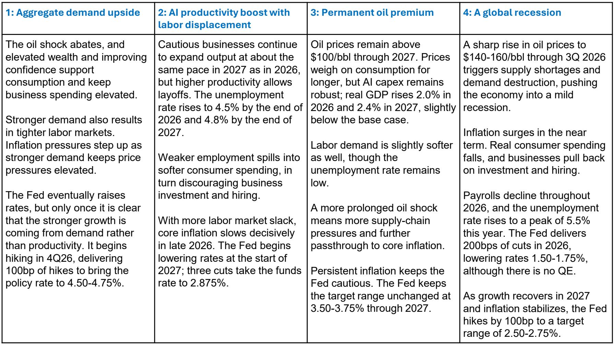
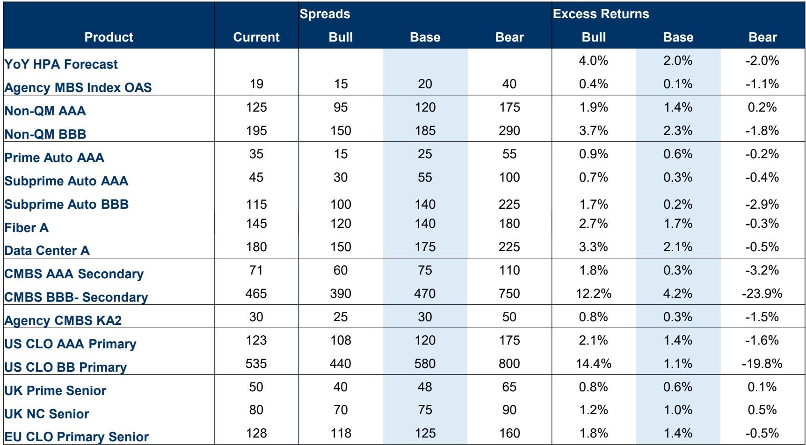

# Securitized Credit Is Entering a Regime of Narrow Dispersion: The Real Opportunity Lies in Structural Selection, Not Beta

The most dangerous conviction in fixed income today is that the macro picture will provide a clear directional trade. For the first time in several years, the macroeconomic outlook across the major scenarios — from aggregate demand upside to a global recession — does not produce a single, decisive winner for securitized credit as a whole. The base case is one of modest growth, sticky but decelerating inflation, and a Federal Reserve that remains on hold through 2026 before cutting gradually in 2027. This is not a crisis environment, but it is also not a recovery that will lift all tranches equally.

The implication is uncomfortable for investors who have grown accustomed to making large, directional bets on spread compression or widening. The report from a leading global investment bank makes this tension explicit: in the base case, excess returns across securitized products range from barely positive for agency MBS to moderate single digits for BBB-rated non-QM and CMBS mezzanine tranches. The bull and bear cases produce dramatically different outcomes, but the base case itself is a story of narrow dispersion. The real alpha will come from structural positioning — understanding which parts of the capital stack are mispriced relative to their fundamental support, and which are being compensated for risks that may not materialize.

This is a market that rewards precision over conviction. The question is not whether to be long or short securitized credit, but rather which securities, which subordination levels, and which underlying asset classes offer the best risk-adjusted carry in a regime where the macro path is uncertain but the structural floor is visible.

## The Housing Market Has Reached a Structural Turnover Floor That Supports Residential Credit, but the Path to Recovery Is Blocked by Affordability Constraints

The single most important insight in the housing section of the report is not about home prices. It is about the lock-in effect and its permanence. Existing home sales as a percentage of housing stock have been bouncing around 40-year lows for ten consecutive quarters. This is not a cyclical trough that will snap back when rates fall. It is a structural feature of a market where the vast majority of outstanding mortgages carry rates below 4%, and where the current 30-year mortgage rate is stuck above 6.25% through the end of 2027 in the base case.

The report shows that even when affordability improves — as it did in late 2024 — the response in sales volumes has been muted compared to prior cycles. In previous episodes of 10% or greater affordability improvement, existing home sales rose 10% to 30% over the following twelve months. In the current cycle, the response has been barely 2%. This is the clearest evidence yet that the lock-in effect is not a transitory friction but a semi-permanent feature of the market. Homeowners with sub-4% mortgages will not list their homes simply because rates move from 7% to 6%. The gap is too large, and the incentive to stay put is too strong.

What does this mean for residential credit? It means that the supply of existing homes for sale will remain constrained, which puts a floor under home prices. The report forecasts year-over-year home price appreciation of 2% in both 2026 and 2027, and argues that there is simply not enough for-sale inventory to drive meaningfully negative home prices. This is a critical support for mortgage credit quality. Even if affordability remains challenged, the absence of a supply-driven price decline means that loan-to-value ratios are not deteriorating at the aggregate level.

The risk, however, is that the new home market is telling a different story. For the first time in the multi-decade history of the data, new home prices have fallen below existing home prices. This is a direct consequence of elevated new home inventory and a construction backlog that is clearing. Builders are cutting prices to move units, and this dynamic could eventually pressure existing home prices if the discount becomes too large to ignore. The report acknowledges this tension but concludes that the structural shortage of existing inventory will prevent a broad price decline. Investors in residential credit should watch this dynamic closely, but the base case remains one of stable collateral performance.

## Deregulation Is Reshaping Bank Demand for Securitized Products, but the Impact Is Concentrated in Specific Sectors

The 2026 Basel Endgame proposal represents a material shift in the regulatory landscape for U.S. banks. The report highlights that the revised notice of proposed rulemaking has unlocked excess capital that banks had been holding in anticipation of the more stringent 2023 proposal. The aggregate CET1 capital requirement impact is now negative for all bank categories — meaning banks will need less capital, not more, relative to the current regime. For Category I and II banks, the reduction is approximately 4.8%; for smaller banks, it is nearly 7.8%.

This is not just a capital relief story. It is a demand story. Banks that were forced to hold excess capital against investment securities can now redeploy that capacity into securitized credit. The report does not quantify the exact amount of incremental demand, but the directional implication is clear: bank buying should provide a structural bid for agency MBS, agency CMBS, and high-quality residential credit. This is particularly important at a time when the Federal Reserve is no longer actively purchasing these securities.

The nuance, however, is that this demand is not evenly distributed. The capital relief is most pronounced for smaller banks, which tend to be more focused on agency MBS and simpler securitized structures. Larger, systemically important banks may see more modest relief and may prioritize CLOs and CMBS where they have established trading and warehousing capabilities. The report's spread forecasts reflect this: agency MBS OAS is expected to remain in a narrow range of 15 to 40 basis points, with a base case of 20. That is not a trade that offers significant upside, but it is a trade that offers stability and carry in a portfolio context.

The more interesting question is whether deregulation will also increase bank appetite for riskier tranches. The report suggests the answer is no. The capital relief applies primarily to the standardized approach, and the advanced approaches for risk-weighted assets remain largely unchanged. Banks will increase their demand for high-quality, low-risk securitized assets. They will not become buyers of BBB- CMBS or BB CLO tranches. That demand must come from other sources.

## The CLO Market Is Pricing in a Soft Landing, but the Dispersion in Returns Across Tranches Reveals a Critical Mispricing

The CLO section of the report contains one of the most striking data points in the entire outlook: the base case excess return for US CLO AAA primary is 1.4%, while the base case for US CLO BB primary is also 1.1%. In other words, the market is offering almost identical expected returns for the safest and the riskiest tranches of the CLO capital stack. This is a profound mispricing.

The bull and bear cases reveal the asymmetry. In the bull case, CLO BB returns jump to 14.4%, while AAA returns rise only modestly to 2.1%. In the bear case, CLO BB returns collapse to negative 19.8%, while AAA returns fall to negative 1.6%. The BB tranche is essentially a leveraged option on loan default rates and recovery assumptions. The AAA tranche is a carry instrument with minimal credit risk. The fact that the base case expected returns are nearly identical means that the market is either overcompensating AAA buyers or undercompensating BB buyers — or both.

The report does not explicitly resolve this tension, but the data suggests that the mispricing is most acute for BB tranches. The base case spread forecast for CLO BB primary is 580 basis points, with a bull case of 440 and a bear case of 800. This implies a base case spread that is roughly in line with the historical average, but the volatility of outcomes is extreme. An investor in CLO BB is being paid to take loan default risk, but the compensation is not high enough relative to the downside scenario unless one has a very strong conviction that the economy will avoid recession.

The more compelling opportunity may be in the AAA and AA tranches, where spreads are tight but the structural protections are robust. CLO AAA tranches have never experienced a principal loss in the history of the asset class, and the base case spread of 120 basis points offers a reasonable carry in a low-yield environment. The report's excess return forecasts suggest that AAA CLOs offer a better risk-adjusted return than agency MBS, prime auto ABS, or UK prime senior RMBS. For investors who are constrained by rating mandates or who prioritize capital preservation, this is a meaningful signal.

## The Non-QM and CMBS Markets Are Priced for Divergent Outcomes, and the Difference Is a Function of Liquidity, Not Fundamentals

A comparison of the non-QM and CMBS forecasts reveals a striking divergence in how the market is pricing credit risk across residential and commercial mortgage exposure. Non-QM AAA spreads are forecast at 120 basis points in the base case, with a bear case of 175. CMBS AAA secondary spreads are forecast at 75 basis points, with a bear case of 110. On a relative basis, non-QM AAA is trading wider and has a wider potential dispersion than CMBS AAA, despite the fact that the residential housing market has a clearer fundamental floor.

The more dramatic divergence is in the mezzanine tranches. Non-QM BBB is forecast at 185 basis points, with a bear case of 290. CMBS BBB- secondary is forecast at 470 basis points, with a bear case of 750. The base case excess return for CMBS BBB- is 4.2%, but the bear case is negative 23.9%. This is not a market that is pricing in a soft landing for commercial real estate. It is pricing in a material probability of stress, particularly for office and retail properties that are still adjusting to post-pandemic demand patterns.

The report does not explicitly argue that one of these markets is mispriced relative to the other, but the data invites the question. Non-QM loans are originated to borrowers who do not meet standard agency guidelines, but they are still secured by residential real estate in a market with stable home prices and a structural supply shortage. CMBS, by contrast, is exposed to commercial properties where vacancy rates, lease rolls, and refinancing risk are more acute. The fact that CMBS BBB- trades at a spread nearly 300 basis points wider than non-QM BBB suggests that the market is already discounting significant commercial real estate stress. The question is whether that discount is sufficient.

For investors with a long time horizon and a tolerance for mark-to-market volatility, CMBS BBB- may offer a compelling entry point if the base case holds. But the report's own bear case — which envisions a global recession with oil prices spiking to $140-160 per barrel — would be catastrophic for commercial real estate. The CMBS BBB- trade is not a carry trade. It is a tail-risk trade, and investors should size it accordingly.

## The Report Leaves an Unanswered Question About the Interaction Between Deregulation and Credit Quality

The report provides extensive analysis of how deregulation will affect bank demand for securitized products, but it does not fully explore how deregulation might affect the underlying credit quality of the loans being securitized. This is a critical gap. If banks are holding less capital against their investment securities, they may also be incentivized to originate more loans, particularly in the non-QM and commercial real estate sectors where margins are wider. The question is whether this increase in origination will come with a corresponding decline in underwriting standards.

The report's housing forecasts show that new home prices are already falling relative to existing home prices, and that builders are discounting to move inventory. If banks respond to deregulation by easing credit standards for construction loans or non-QM mortgages, the collateral backing new securitizations could be weaker than the existing stock. This would create a vintage effect, where older securitizations perform better than newer ones, and where the spread compression in AAA tranches masks deteriorating fundamentals in the underlying collateral.

This is not a forecast. It is a risk that investors should monitor. The report does not address it directly, and that omission is itself a signal. The most important analytical work for investors in the second half of 2026 may not be about where spreads are going, but about what is being securitized and under what terms.

## A Decision Framework for Navigating the Second Half of 2026

Based on the report's analysis, investors should evaluate securitized credit opportunities along three dimensions: structural support, spread compensation, and tail-risk asymmetry. The following framework translates the report's insights into actionable decisions.

First, for the core of a portfolio — the part that must generate stable carry with minimal credit risk — the optimal allocation is to CLO AAA and agency MBS. CLO AAA offers a spread of approximately 120 basis points with a structural track record of zero principal losses. Agency MBS offers a spread of 20 basis points but with explicit government backing and the tailwind of bank deregulation. The trade-off is that CLO AAA offers higher carry, while agency MBS offers higher liquidity and lower volatility. For most institutional portfolios, a blend of both is appropriate.

Second, for the opportunistic portion of a portfolio — the part that can tolerate higher volatility in exchange for higher expected returns — the report points to non-QM BBB and CMBS BBB-. Non-QM BBB offers a base case spread of 185 basis points with a bear case of 290. CMBS BBB- offers a base case spread of 470 basis points with a bear case of 750. The non-QM trade is more defensive because it is backed by residential real estate with stable home prices. The CMBS trade is more aggressive because it is backed by commercial real estate with uncertain demand. Investors should size these positions inversely to their conviction in the commercial real estate recovery.

Third, for the hedging portion of a portfolio — the part that must protect against tail risks — the report's alternative scenarios provide a guide. In a global recession scenario, the best performing securitized assets would be agency MBS and CLO AAA, which benefit from flight-to-quality flows and structural protections. In an AI productivity boost scenario with labor displacement, the best performing assets would be non-QM and prime auto ABS, which benefit from stable employment and consumer spending. Investors should ensure that their portfolio has exposure to both sets of outcomes.

The report does not provide a single recommended portfolio. It provides a set of probabilities and outcomes. The decision framework above is an interpretation of those probabilities, and it is designed to help investors build portfolios that are robust across multiple scenarios rather than optimized for a single one.

## Join the Community to Read the Full Report and Review the Original Charts

The analysis presented here is based on a detailed reading of the report, but it is necessarily selective. The full report contains dozens of charts, scenario analyses, and sector-specific forecasts that cannot be fully captured in a single article. The most valuable insights — the ones that will drive investment decisions in the second half of 2026 — are embedded in the data itself.

The report's spread forecasts for each product, its alternative economic scenarios, and its detailed analysis of bank deregulation all deserve careful study. The original charts showing the lock-in effect, the new home discount, and the CLO return dispersion are worth reviewing in full resolution. They tell a story that no summary can fully convey.

Join the community to read the full report and review the original charts. The conversation about where securitized credit is headed is just beginning, and the most informed participants will be those who engage directly with the data.

*This article is for learning and discussion only and does not constitute investment advice.*

Personal reading notes and learning share only. Not investment advice.

