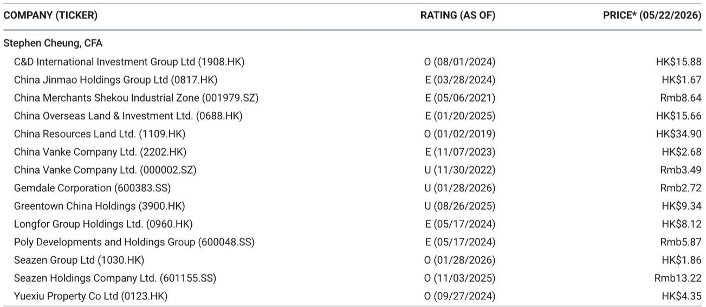
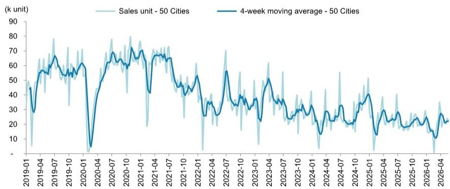
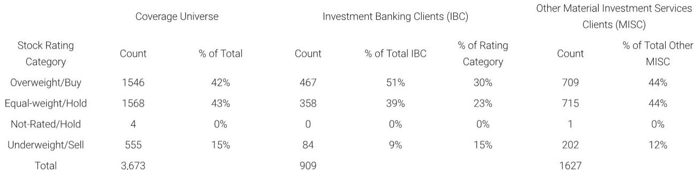

# 中国楼市正在发生一个被忽视的结构性变化：二手房正在成为新的定价锚

如果你还在用新房成交数据判断中国房地产市场的温度，你可能已经错过了最重要的信号。

某外资投行在最新一期周度数据追踪中披露了一个看似矛盾的现象：截至5月24日当周，50城新房周度成交同比下降9%，而同期10城二手房周度成交却同比增长45%。这不是一周的异常波动——年初至今，新房累计成交同比下降15%，二手房累计成交同比上升5%。

这两条曲线正在以越来越大的幅度背离。而背离本身，就是最重要的信息。

过去二十年，中国房地产市场的基本分析框架是“新房为王”。新房开盘量、去化率、价格指数，构成了市场判断的三大支柱。二手房只是新房的影子市场，价格跟随新房波动，流动性受制于新房周期。但这个框架正在失效。二手房成交规模已经超越新房，且其波动逻辑正在从“跟随”转向“主导”。

这份研报用周度数据呈现了背离的即时状态，但更值得追问的是：这种背离是短暂的统计现象，还是市场定价权转移的早期信号？如果是后者，那么它对房地产企业的战略选择、投资者的资产配置、政策制定者的调控框架，都意味着根本性的重新思考。

以下是我们从这份周度数据中提炼出的五个层次判断。

## 1. 新房与二手房的分化不是短期波动，而是市场定价机制正在切换

周度数据最直观的冲击在于方向相反。新房周成交同比下滑9%，而二手房周成交同比飙升45%。这不是一周的偶然——前一周新房同比+5%，二手房同比+49%，方向同样相反，只是幅度略有不同。

更值得关注的是年初至今的累计数据。新房累计同比-15%，二手房累计同比+5%。20个百分点的差距，已经无法用“季节性”“推盘节奏”等短期因素解释。

这意味着什么？新房市场正在失去作为价格发现主战场的地位。过去，新房开盘价被视为区域房价的基准，二手房业主据此定价。但现在，二手房成交的活跃度远超新房，其价格发现功能正在增强。当二手房日成交套数超过新房数倍时，定价权就已经发生了转移。

对行业而言，这意味着开发商不能再仅凭“新盘定价”来锚定市场预期。二手房市场正在形成独立的价格参考系，开发商的定价策略需要从“参考周边新盘”转向“参考周边二手房成交价”。这一转变将直接影响利润率测算和去化速度预期。

## 2. 一线城市正在成为这轮分化的加速器，而非稳定器

分城市能级看，背离在一线城市最为极端。当周一线城市新房成交同比+11%，看似稳健，但二手房成交同比+63%，增速是新房的近6倍。二线城市新房同比-14%，二手房同比+36%；三线城市新房同比-10%，二手房数据未单独列出，但整体二手房增速45%说明其贡献同样可观。

一线城市新房成交增速为正，说明供给端和政策端仍在发挥作用。但二手房成交增速高达63%，说明需求端正在大规模向二手房市场迁移。这背后的驱动因素是多重的：新房交付风险仍然存在，二手房所见即所得；部分城市新房价格与二手房价格倒挂收窄，二手房性价比提升；换房需求主导市场，卖一买一的链条中，二手房成交是前置条件。

但这里有一个尚未被充分讨论的含义：一线城市二手房成交的爆发，可能正在加速新房市场的“边缘化”。当二手房成交成为主流，新房的定价权、产品定位、营销节奏都需要重新校准。开发商如果继续沿用“以新房为中心”的销售策略，可能会发现自己的客户群体正在被二手房市场分流。

## 3. 去化率数据揭示了一个更深的矛盾：供应节奏与需求结构不匹配

报告披露，当周总体去化率为66%，一线城市同样为66%。这个数字本身并不低，但需要结合另一个关键信息来看：二线城市当周没有新盘入市。

没有新盘入市，意味着去化率计算的分母为零或极小。这组数据实际上告诉我们：开发商正在主动放缓推盘节奏。背后的逻辑不难理解——在市场预期不明、二手房成交活跃但价格承压的环境下，新盘入市面临“定价高了卖不动，定价低了伤利润”的两难。与其冒险推盘，不如观望。

但这又反过来加剧了新房市场的萎缩。供给端主动收缩，需求端向二手房迁移，新房市场正在陷入一种“低成交-低推盘-更低成交”的循环。66%的去化率看似不错，但如果放在推盘量大幅下降的背景下，它反映的不是需求强劲，而是供给端极度谨慎。

对投资者而言，需要关注的不是去化率本身，而是推盘量的变化趋势。如果推盘量持续低迷，新房市场的收入确认节奏将受到影响，进而影响开发商的财务报表表现。

## 4. 价格信号正在走弱，但尚未触发系统性风险

报告中的另一个关键数据是中原六城二手房挂牌价格指数，当周读数为18.2%，低于前一周的18.5%。同时，一线城市中介指数从55.6降至53.5。

这两个指标都在下行，但幅度温和。挂牌价格指数下降0.3个百分点，中介指数下降2.1点。这告诉我们：二手房市场虽然成交活跃，但价格并未出现普遍上涨。相反，业主挂牌价仍在缓慢下调，中介活跃度也在下降。

这是典型的“以价换量”格局。二手房成交放量，靠的不是价格上涨预期，而是业主主动降价促成交。这种格局对买方有利，对持有资产的业主和开发商不利。它意味着资产价格的重估仍在进行中，尚未触底。

但这里有一个关键的区别：新房市场的价格调整是显性的——折扣、送装修、降标等；二手房市场的价格调整是隐性的——挂牌价下调、议价空间扩大。两种调整方式对市场情绪的影响不同。二手房隐性调整的冲击更小，但持续时间可能更长。

## 5. 报告尚未完全回答的关键问题：成交结构能否持续改善

这份周度数据提供了清晰的快照，但有几个关键问题尚未展开。

第一，二手房成交的放量，是存量需求的集中释放，还是增量需求的持续入场？如果是前者，那么当前的高成交可能只是“积压需求”的一次性释放，后续可持续性存疑。如果是后者，那么市场正在经历一个更健康的结构性转变。报告没有提供新购房者画像或贷款数据来区分这两种情况。

第二，新房成交的下滑，在多大程度上是供给端主动收缩的结果，又在多大程度上是需求端主动放弃的结果？如果是供给收缩，那么一旦推盘恢复，成交可能回升；如果是需求放弃，那么即使推盘增加，成交也难以改善。报告没有区分这两个因素。

第三，去化率数据在推盘量极低的情况下是否有意义？当二线城市当周推盘量为零时，去化率这个指标实际上已经失去了比较基础。报告没有讨论这一方法论问题。

这些问题不是报告的缺陷，而是周度数据天然的限制。要回答这些问题，需要更长的时间序列、更细颗粒度的成交数据，以及更深入的需求侧调研。

---

这份周度数据揭示了一个正在发生的结构性变化，但它的意义远不止于数字本身。它提醒我们，中国房地产市场的分析框架需要更新。新房不再是唯一的定价锚，二手房正在成为新的参照系。对于决策者而言，这意味着政策工具箱需要从“稳新房”扩展到“稳二手房”；对于投资者而言，这意味着资产定价的逻辑需要从“新房周期”转向“二手房流动性”。

但这些判断都建立在有限的周度数据之上。更完整的结论，需要结合更长周期的数据、更细分的城市分析、以及更深入的需求侧调研。我们将在社群中持续追踪这些数据，并分享更完整的研报解读和原始图表。如果你对这些未解问题感兴趣，欢迎来星球微信群里继续讨论。

Personal reading notes and learning share only. Not investment advice.

