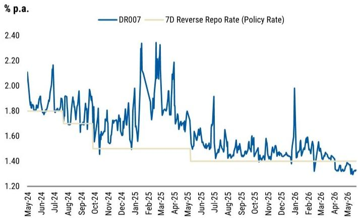
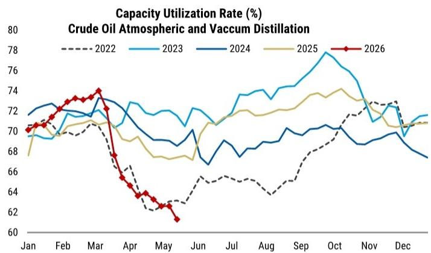
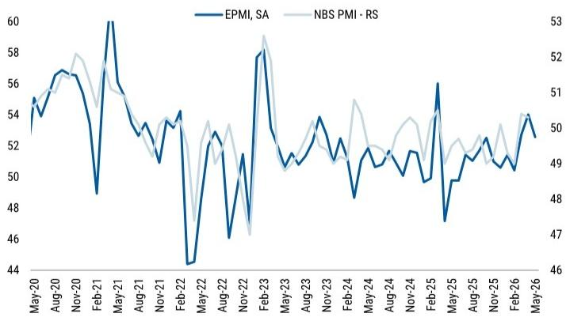

# 市场真正低估的不是四月数据，而是两速经济中“出口韧性”的定价权

四月经济数据的全面走弱，让市场参与者经历了一次情绪上的快速降温。工业增加值、固定资产投资、社会消费品零售总额等关键指标均低于预期，部分读数甚至触及年内低点。一时间，“复苏见顶”“二次探底”等声音再次浮现。

但这份来自某外资投行的最新中国情绪追踪报告，给出了一个与市场直觉不完全相同的判断框架：四月的疲软更多是一次性的“双重挤压”——油价冲击与财政节奏放缓的叠加，而非趋势性拐点。报告的核心主张是，中国经济正在经历一场结构性的“K型分化”，而这种分化本身，恰恰是理解当前市场定价偏差的关键。

这份报告真正值得关注的，不是四月数据本身，而是它揭示的一个被低估的结构性事实：在传统内需持续承压的背景下，高端制造业与出口部门正在成为中国经济新的“压舱石”，其韧性可能比市场预期的更强。而油价，则是决定这种两速经济能否实现稳定增长的最关键变量。

以下，我们从报告中提炼出四个核心洞察，逐一拆解。

## 1. 四月的走弱不是趋势拐点，而是油价冲击与财政节奏放缓的共振

报告明确指出，四月经济数据的全面走弱，根源在于两个因素的叠加。第一是油价冲击。这不仅仅是贸易条件恶化带来的收入压缩效应，更直接体现在生产端：石化行业的产能利用率自三月起大幅下滑，原油蒸馏装置开工率从三月的74%骤降至四月的65%，沥青生产利用率更是跌至多年低位。这种上游生产的骤冷，通过产业链向下游传导，对工业增加值形成了直接拖累。

第二个因素是财政节奏的阶段性放缓。一季度GDP增速超出预期，这可能在一定程度上降低了政策层面对四月经济数据的紧迫感。报告中的数据显示，一般政府债券和地方专项债的净发行量在四月和五月上旬均出现放缓，预算内财政支出在四月甚至出现了同比负增长，尽管同期财政收入仍有正增长。

这两个因素的共振，使得四月经济数据看起来比实际趋势更差。报告的逻辑是：如果剔除油价冲击和财政节奏的暂时性放缓，二季度整体的经济活动数据仍然支持其结构性叙事。这意味着，市场对四月数据的过度解读，可能正在制造一个短暂的定价偏差。

对于投资者而言，关键问题不是四月数据有多差，而是这些扰动因素能否在未来几个月内消退。报告给出的判断是，只要油价不再进一步恶化，财政从六月起加速发力，二季度GDP增速大概率不会大幅低于4.5%，这为全年4.8%的增长预测提供了支撑。

## 2. 两速经济已经不是一个概念，而是一个可观测、可交易的结构事实

报告用高频数据清晰地描绘了当前经济的“两速”图景。在减速的一侧，是消费和传统基建。汽车和家电的零售增速在五月进一步走弱，同比降幅分别达到20%和25%，这既反映了高基数效应，也暗示了前期消费刺激政策的效果正在递减。水泥发运量和螺纹钢需求仍在多年低位徘徊，这背后是房地产新开工持续低迷和传统基建投资力度不足的机械性结果。

但在加速的一侧，报告给出了截然不同的信号。集装箱吞吐量增速在五月仍保持正增长，尽管面临油价冲击。战略性新兴产业PMI虽然较四月有所回落，但仍处于53的扩张区间，且新出口订单指数依然强劲。这些数据共同指向一个结论：高端制造业和出口部门，正在成为中国经济中唯一保持韧性的增长极。

这种分化意味着什么？它意味着当前中国经济的主要矛盾，已经从“总量能不能增长”转变为“结构性的增长能否对冲结构性的下滑”。对于资产定价而言，这意味着投资者不能再简单地用“看多中国”或“看空中国”的二元框架来决策。真正有价值的机会，可能只存在于那些能够受益于出口韧性和高端制造升级的细分领域，而传统内需相关的资产，则需要更谨慎地评估其下行风险。

报告没有直接给出投资建议，但它提供的分析框架暗示：那些能够将全球AI和能源资本开支超级周期转化为自身订单增长的企业，其估值逻辑应该与依赖国内消费复苏的企业完全不同。

## 3. 油价是当前预测框架中最关键的摇摆变量，但报告的假设仍需验证

报告的核心预测——2026年实际GDP增速4.8%——建立在一个关键假设之上：油价相关的尾部风险能够在二季度末得到足够及时和可见的缓解。这个假设目前尚未被验证。

报告的数据显示，五月的高频数据仍然喜忧参半。一方面，上游利用率继续承压，沥青生产利用率进一步恶化至17%；另一方面，出口订单和新兴制造业PMI依然坚挺。这种分化本身就是油价冲击下经济韧性的体现，但也意味着，一旦油价继续上行或海峡局势持续扰动超过六月，整个预测框架的风险平衡将发生偏移。

报告对此有清醒的认识：“如果油价正常化，强劲的出口、财政追赶以及较低的下半年基数，应该能够支持温和的同比增速回升。但如果油价进一步上涨，风险平衡将转向更弱的增长，并重新打开进一步政策宽松的空间。”

这里有一个值得注意的细节：报告没有对油价的未来走势给出明确预测。它只是将油价作为外生变量，分析了不同情境下的经济含义。这意味着，对于读者而言，如果希望基于这份报告做出判断，必须自己形成对油价走势的看法。报告提供了一个分析框架，但没有给出最终的答案。这个“未完成”的部分，恰恰是报告最有价值的地方——它让读者意识到，当前市场的核心不确定性不是政策、不是房地产、不是消费，而是油价这个外部变量。

## 4. 政策正在从“总量宽松”转向“结构精准”，但执行节奏是关键变量

报告对政策面的分析也值得关注。它指出，五月上旬的政府债券净发行仍然偏软，表明政策执行尚未在四月放缓后明显提速。这背后可能是一个结构性问题：合格项目的供给不足。这与中国当前面临的“项目荒”困境是一致的——地方政府在债务约束下，能够快速上马的优质项目越来越少。

但报告同时指出，考虑到四月单月GDP增速可能已降至4%左右，以及五月高频数据的疲软，北京可能需要从六月开始追赶财政进度，以防止二季度GDP增速大幅低于4.5%。这暗示了一个政策窗口：未来几周，财政发力的节奏可能会显著加快。

值得注意的是，报告提到的“六网”基础设施规划——水网、新型电网、算力网、下一代通信网、城市地下管网和物流网——反映了政策制定者的务实态度。这个框架巧妙地连接了短期稳增长和长期结构性优先事项，包括能源安全、AI基础设施和供应链韧性。这意味着，未来的财政支出将更加聚焦于这些领域，而非传统的“铁公基”。

对于投资者而言，这意味着需要调整对政策受益标的的预期。过去那种“全面宽松、普涨行情”的格局可能不会重现，取而代之的是“精准滴灌、结构分化”的格局。那些能够进入“六网”规划的企业，其订单可见性和现金流稳定性将远优于那些依赖传统基建的企业。

## 报告尚未完全回答的关键问题：出口韧性能否持续消化油价冲击？

这是整份报告最值得追问的问题。报告展示了出口和高端制造业的韧性，但也承认油价冲击正在压缩国内收入和抑制生产。这两个力量之间的博弈，将决定二季度乃至下半年的经济走向。

报告的核心假设是“油价正常化”，但如果我们问一个更尖锐的问题：即使油价不进一步恶化，但也不回落，保持在当前水平，出口的韧性还能维持多久？报告没有给出明确的答案。它只是指出，如果油价持续高位，石化下游行业的生产和利润将受到持续挤压，而这可能会通过就业和收入渠道进一步传导到消费端。

这个问题的答案，可能需要更长时间的数据积累才能验证。但正是这种不确定性，使得这份报告的价值超越了简单的数据汇总。它提供了一个思考框架，让读者能够根据后续数据的变化，动态调整自己的判断。

对于希望获得完整报告原文、原始图表以及更深层次讨论的读者，欢迎加入我们的知识星球微信群。在那里，我们会围绕这些未解问题继续展开讨论，分享更多基于报告的衍生分析和投资框架。同时，我们也欢迎读者在群内提出自己的疑问和判断，共同深化对这一轮经济周期的理解。

Personal reading notes and learning share only. Not investment advice.

