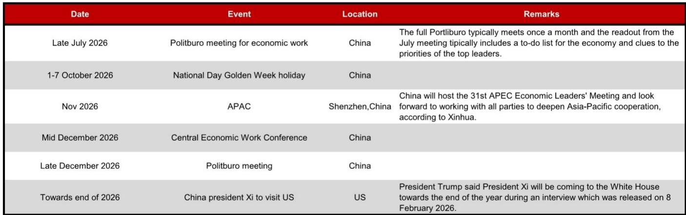
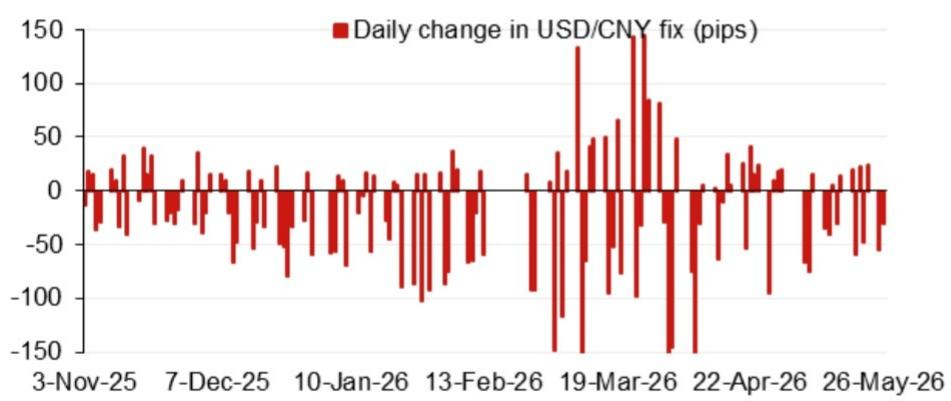
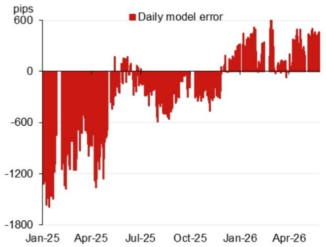

# 人民币中间价模型正在发出一个被市场忽视的信号

人民币汇率在2026年的定价逻辑，正在经历一场从“政策锚”到“模型锚”的静默切换。某外资投行最新发布的USD/CNY中间价预测模型显示，其不含逆周期因子的模型预测值为6.7876，较前一日官方中间价6.8288低412个基点。这个数字本身并不令人意外——市场对人民币阶段性走弱已有预期。真正值得关注的，是模型预测值与实际中间价之间的持续偏离，以及这一偏离背后折射出的政策意图与市场力量的再平衡。

这份报告的核心判断是：当前市场对人民币汇率的讨论，过度聚焦于中美利差、关税博弈等宏观叙事，却低估了中间价定价机制本身正在发生的结构性变化。模型所捕捉到的信号，并非短期波动，而是政策层在汇率形成机制中逐步让渡空间给市场供求的信号。理解这一点，比预测下个月的点位更重要。

为什么现在要讨论一个看似技术性的中间价模型？因为2026年下半年，中国将迎来一系列关键事件节点——7月政治局会议、11月APEC峰会、年底中美领导人会晤。这些事件对汇率的影响路径，很大程度上取决于中间价定价机制所处的状态。如果模型预测持续偏离实际定价，意味着政策层在主动管理预期；如果偏差收敛，则意味着市场力量正在回归主导。这两种情景对应的资产定价逻辑截然不同。

报告的核心贡献，不在于给出了一个具体预测值，而在于提供了一个观察框架：通过模型误差的走势、逆周期因子的使用频率、以及关键事件前后的定价行为，来推断政策层的真实意图。以下将逐层拆解这份报告的核心洞察。

## 1. 模型预测与实际中间价之间的偏差，才是真正有价值的信号

报告的核心输出是两个数字：不含逆周期因子的模型预测值为6.7876，含逆周期因子的预测值为6.8050。前者比前一天实际中间价低412个基点，后者低238个基点。这意味着，即使加上逆周期因子，模型仍然认为中间价应该明显低于实际水平。

这个偏差本身就是一个信号。如果模型持续高估人民币（即预测值低于实际中间价），说明政策层在有意放缓人民币升值节奏，或者主动引导贬值以应对某些外部压力。反之，如果模型低估人民币，则说明市场力量正在推动升值，而政策层在通过中间价进行平滑。

从报告提供的模型误差图（Fig. 2）来看，2025年初模型误差一度达到-1800个基点（即模型预测远低于实际中间价），随后逐步收敛，到2025年7月接近零，2026年初又转为正值。这个走势清晰地反映了政策层在不同阶段的干预力度：2025年初的剧烈偏离对应着关税冲击下的主动管理，而2026年初误差转正，则暗示政策层可能正在放松对升值方向的压制。

对于投资者而言，关键不是记住这些数字，而是理解一个分析框架：模型误差的方向和幅度，是衡量政策干预力度的温度计。当误差持续处于极端区间时，意味着汇率定价脱离市场供求，此时政策信号比经济数据更重要；当误差收敛至零附近，则意味着市场定价回归主导，此时利差、资本流动等基本面因素将重新成为核心驱动力。

## 2. 逆周期因子的使用频率和幅度，揭示了政策层的容忍区间

报告特别区分了“不含逆周期因子”和“含逆周期因子”两个模型预测值。两者之间的差距，就是逆周期因子的贡献。在当前数据中，逆周期因子贡献了约174个基点（412减238），意味着政策层正在通过这一工具，将模型预测向实际中间价方向“拉回”约40%。

逆周期因子的本质，是政策层在中间价形成机制中保留的“手动挡”。当市场情绪极端或外部冲击剧烈时，政策层通过调整这一因子，在不改变模型框架的前提下，实现对中间价的定向干预。因此，逆周期因子的使用频率和幅度，直接反映了政策层对当前汇率水平的满意程度。

从报告的数据来看，2026年初逆周期因子仍在被使用，但幅度较2025年初明显收窄。这传递了一个重要信号：政策层认为人民币汇率的偏离程度在缩小，主动干预的必要性在下降。但干预并未完全退出，说明政策层仍对汇率波动保持警惕，尤其是在下半年多个关键事件临近的背景下。

这里需要指出一个报告没有完全展开的推论：逆周期因子并非一个对称工具。它在贬值压力下使用得更频繁、幅度更大，而在升值压力下则相对克制。因此，当前逆周期因子仍在发挥作用，可能更多是在防范贬值预期过度发酵，而非压制升值。这一点对于判断下半年汇率方向至关重要。

## 3. 中间价的实际变动节奏，暗示了“事件驱动型定价”的特征

报告提供了2025年11月至2026年5月期间USD/CNY中间价的日度变动数据（Fig. 3）。这张图最显著的特征是：大部分时间中间价变动接近于零，只有在2026年3月19日出现了约150个基点的跳升。

这种“长期平稳、偶发跳变”的定价节奏，与自由浮动汇率下的连续波动截然不同。它表明政策层在大多数时间维持中间价稳定，以提供可预期性；但在特定时点，会利用中间价调整来释放信号或应对冲击。

3月19日的跳升尤其值得注意。这一天恰好处于中美关税谈判的关键阶段。政策层选择在这一时点让中间价一次性贬值，既避免了持续贬值预期的形成，又向市场传递了“汇率可以双向波动”的信号。这种“一步到位”的操作手法，在2015年汇改后多次出现，是政策层管理预期的成熟工具。

对于投资者而言，这意味着不能简单用连续时间序列模型来预测中间价。更有效的分析框架是：识别关键事件窗口（如政治局会议、APEC峰会、中美领导人会晤），在这些窗口内，中间价可能出现非线性变化；而在窗口之外，中间价大概率保持稳定。报告提供的2026年下半年事件日历（Fig. 4）正是这一框架的基础。

## 4. 报告尚未完全回答的关键问题：模型误差何时会收敛

这份报告最吸引人的地方，恰恰是它没有完全解决的问题。模型预测值与实际中间价之间的偏差，究竟会在什么条件下收敛？报告给出了模型框架和当前数据，但对收敛路径的分析相对有限。

从逻辑上推演，偏差收敛需要满足至少以下条件之一：第一，市场供求力量发生根本性逆转，使得实际中间价向模型预测值靠拢；第二，政策层调整逆周期因子参数，主动缩小偏差；第三，模型本身被重新校准，以更好地拟合新的政策框架。

目前来看，三种路径都存在不确定性。市场供求方面，资本外流压力在2026年上半年有所缓解，但下半年中美关系走向仍存变数。政策层面，逆周期因子的使用频率已在下降，但完全退出尚无明确时间表。模型校准方面，报告没有讨论模型参数是否可能被调整。

这一不确定性，恰恰是这份报告最有价值的部分。它提示投资者：当前模型预测值不应被理解为“合理汇率”，而应被理解为“在现行模型框架下，如果市场力量完全主导，汇率应该在哪里”。实际汇率与模型预测的差距，就是政策干预的定价。理解这个定价，比猜测具体点位更有意义。

## 5. 一个实用的观察框架：盯住三个信号来判断定价权归属

基于以上分析，可以构建一个简洁的观察框架，用于判断人民币中间价的定价权正在向哪一方倾斜。

第一个信号是模型误差的方向和幅度。当误差持续超过200个基点时，政策干预力度较大，此时应更多关注政策信号而非市场数据。当误差收敛至100个基点以内时，市场力量重新占主导，此时利差、资本流动等基本面因素将驱动汇率。

第二个信号是逆周期因子的使用变化。如果逆周期因子贡献的偏差幅度持续扩大，说明政策层在主动引导汇率偏离市场供求；如果贡献幅度收窄甚至转为负值，说明政策层在容忍甚至欢迎市场定价。

第三个信号是中间价在关键事件前后的变动模式。如果中间价在事件窗口内出现一次性大幅调整，之后迅速恢复平稳，说明政策层在利用事件进行预期管理；如果中间价在事件窗口内依然保持平稳，说明政策层对当前汇率水平较为满意，无意主动调整。

这三个信号结合起来，可以帮助投资者判断当前处于“政策主导”还是“市场主导”的阶段，从而选择相应的分析工具和交易策略。

---

以上讨论，只是这份研报所蕴含信息的一角。模型的具体参数设定、不同货币对预测的权重分配、历史误差的详细分解、以及逆周期因子在极端情景下的可能调整路径，这些内容在原报告中都有更详尽的展开。尤其是报告附录中关于模型方法论的部分，对于理解预测值背后的逻辑链条至关重要。

如果您希望进一步探讨模型误差的收敛条件、逆周期因子的历史使用规律，或者2026年下半年关键事件的汇率影响路径，欢迎加入我们的星球微信群，与更多关注汇率定价机制的读者一起讨论。群内会定期分享完整研报原文、模型数据表格，以及我们基于这些数据的二次分析。

Personal reading notes and learning share only. Not investment advice.

