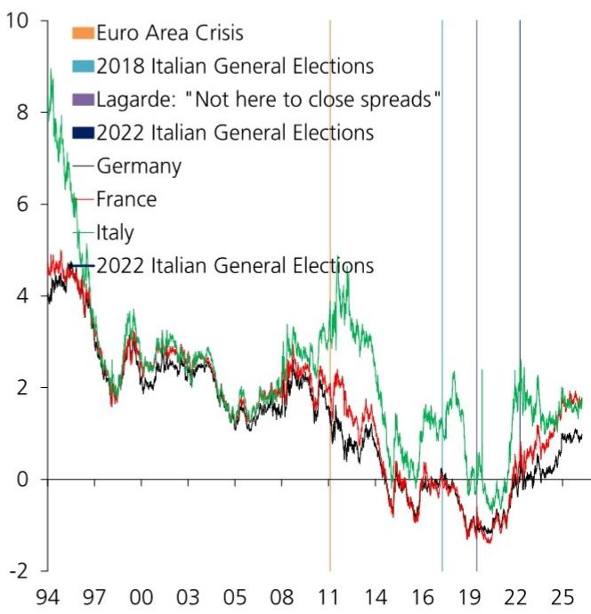
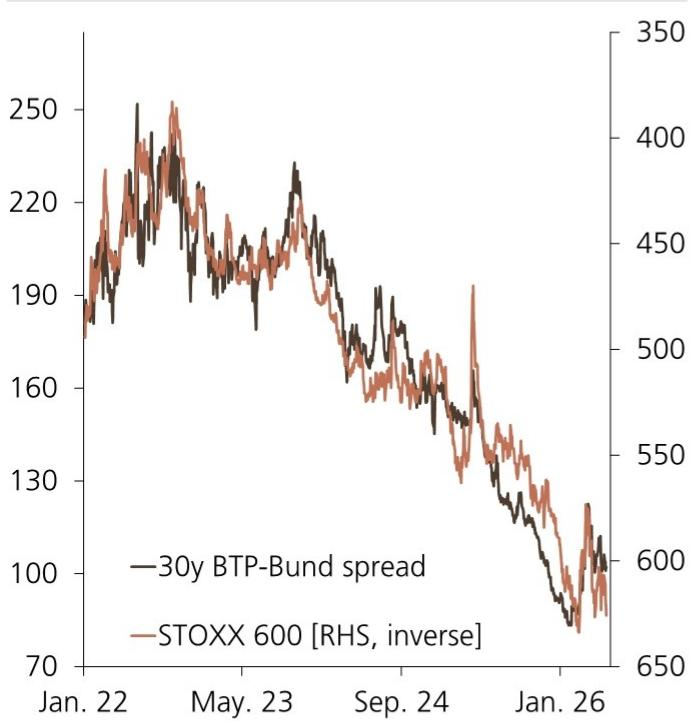
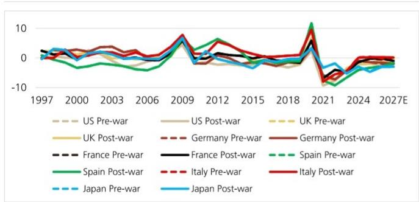

# 欧洲利差收窄并非警报解除，这轮放松的边界比市场想象的更窄

欧洲主权债市场正在经历一段难得的平静。意大利与德国10年期国债利差从2022年超过250个基点的危机水平，回落至当前约80个基点。法国、西班牙的利差同样显著收窄。风险情绪回暖、财政纪律预期回归、以及市场对欧洲核心资产的再定价，共同推动了这一轮压缩。

但这份来自某外资投行的全球利率策略报告，在标题中给出了一个值得细品的判断：利差可以继续收窄，但远未到可以放松警惕的时候。报告的核心主张并非看空欧洲边缘国家债券，而是提醒市场——当前的平静建立在脆弱的支撑之上，真正的结构性压力正在水面下积累。

这份报告最值得关注的判断是什么？不是利差还会收窄多少，而是市场正在低估一个根本性的转变：欧洲财政纪律的回归，将从根本上改变过去几年“宽松财政+央行兜底”的定价逻辑。2026年的预算讨论、2028年的选举周期、以及意大利NGEU资金退潮后的增长缺口，这些看似遥远的事件，正在以比市场预期更快的速度逼近。

## 1. 财政纪律回归，意味着过去两年的“宽松溢价”正在被系统性地挤出

报告明确指出，欧洲委员会正在重新审查财政规则的豁免条款。这意味着，疫情期间和2022年能源危机期间那种大规模财政支持，不会重演。对于市场参与者来说，这是一个需要重新校准的变量。

过去两年，欧洲边缘国家债券的利差收窄，很大程度上受益于两个因素：一是欧洲央行的利差管控工具（TPI）提供了尾部风险保护；二是市场预期财政政策将继续保持宽松。但报告的核心洞察在于，第一个因素仍然存在，第二个因素正在消失。

当财政纪律回归，市场对主权信用的定价将更多回归到基本面——赤字率、债务率、增长前景。意大利的预算赤字已经从疫情高峰期的超过9%降至约3%GDP，这是一个积极信号。但报告提醒，这种改善很大程度上得益于名义GDP的高速增长，而非真正的财政整顿。一旦增长放缓，赤字率可能重新走高。

这意味着，当前利差水平所隐含的财政改善溢价，可能已经过度反映了短期数据，而低估了中期结构性压力。对于持有欧洲边缘国家债券的投资者来说，这是一个需要认真审视的风险。

## 2. 意大利与法国的利差博弈：短期看息差，中期看增长，长期看政治

报告对意大利和法国的利差关系给出了一个看似矛盾但逻辑严密的判断：意大利可能最终跑输法国，但不要把一个未来的担忧当作今天的交易信号。

意大利相对于法国的利差，在2025年第四季度一度接近零，随后在2026年3月反弹至22个基点。市场曾试图做空意大利，但被打了回来。当前，息差交易（carry trade）重新成为主导力量——投资者更关注持有意大利债券相对于法国的额外收益，而非中长期的基本面差异。

但报告用图2揭示了关键的结构性变化：意大利的名义利率（r）与名义增长率（g）的关系正在发生转折。过去几年，意大利受益于r-g为负的环境——经济增长高于融资成本，这降低了债务动态的脆弱性。但报告估计，到2026年，意大利的r-g将收敛至-1%左右，远低于2023年的-5%。这意味着，债务可持续性的自动改善机制正在弱化。

更值得关注的是，NGEU（欧盟下一代复苏基金）对意大利的财政支持正在退潮。过去几年，NGEU资金为意大利提供了约每年GDP的1-2%的财政空间。当这笔资金逐步耗尽，而意大利又面临财政纪律回归的约束，其财政灵活性将显著下降。

报告虽然没有完全展开，但一个自然的推论是：如果意大利的增长无法内生性地加速，其相对于法国的利差可能在中长期重新走阔。问题在于，市场何时开始定价这一预期？报告给出的时间线是2026年8月底，届时关于2027年预算的讨论将正式开始。

## 3. 德国30年期收益率已达到目标价，但市场仍在定价更持久的财政风险

报告对德国长期国债的观察提供了一个重要的市场信号。德国30年期收益率已经达到该行设定的2026年底目标——3.50%。这个水平本身并不令人意外，但报告关注的是德国30年期收益率相对于30年期欧元掉期利率的利差。

当前，这个利差约为35个基点，比年初扩大了12个基点。报告指出，当主权债持续以高于掉期利率的收益率融资时，无论幅度多么微小，都表明市场正在定价更持久的财政风险。对于德国这样传统上被视为“财政保守”的国家来说，这是一个值得注意的变化。

德国正在经历一次历史性的财政转型。从“黑零”（Schwarze Null，平衡预算原则）到大规模国防和基础设施投资的转向，正在改变市场对德国债务轨迹的预期。报告没有直接讨论这一点，但利差的扩大表明，市场已经开始消化这一变化——尽管可能还不够充分。

对于投资者来说，这意味着德国国债的“安全溢价”正在被重新定价。如果德国30年期收益率继续上行，将对整个欧洲利率曲线产生连锁影响，尤其是对边缘国家债券的估值压力。

## 4. 融资市场没有发出警报，但这恰恰可能是最大的警报

报告一个引人注目的观察是，该行的客户会议中几乎没有听到对欧元或美元融资市场的实质担忧。同时，欧洲政府债券（EGB）的发行量略低于三年平均水平。

从表面看，这是一个积极信号：融资需求温和，市场参与者没有感到紧张。但报告隐含的担忧是，融资市场的“狗没有叫”，可能只是因为当前的宽松环境掩盖了结构性压力。

报告提到，近期EGB发行可能导致主权债相对于掉期利率的利差温和走阔，但最近的久期反弹（duration rally）缓解了部分担忧。这意味着，市场对利率下行的乐观情绪，暂时压制了供给压力的影响。

但这里有一个需要警惕的推论：如果风险情绪反转，或利率重新上行，融资市场的压力可能迅速显现。当前没有警报，不等于警报不会到来。报告虽然没有明确说，但一个合理的判断是：融资市场的平静，恰恰是当前市场最脆弱的地方——因为它让投资者低估了尾部风险。

## 5. 报告尚未完全回答的关键问题：利差收窄的可持续性取决于一个无法验证的假设

这份报告提供了严谨的分析框架，但有一个关键假设尚未得到充分验证：欧洲财政纪律的回归，是否真的能够在不引发政治反弹的情况下落实？

报告提到，2027年预算讨论和2028年选举可能带来波动和利差走阔，但认为这些事件“相对遥远”。这个判断本身是合理的，但它忽略了一个可能性：市场可能提前定价这些事件，尤其是如果经济数据出现意外下行。

另一个未回答的问题是：欧洲央行TPI工具的实际有效性。TPI从未被真正激活过，市场对其的信任建立在“威慑”而非“使用”之上。如果市场开始怀疑TPI的可用性（例如，因为德国宪法法院挑战或政治条件过于严格），利差的定价逻辑将发生根本性变化。

报告对意大利r-g动态的分析非常透彻，但没有深入讨论：如果意大利的增长无法达到预期，而利率维持高位，r-g转正的时间点可能比预期更早到来。这将从根本上改变意大利债务可持续性的叙事。

这些未解问题，正是继续深入阅读完整报告的价值所在。报告中的图表——尤其是关于r-g趋势的跨国比较、意大利名义利率与增长率的动态、以及期限溢价的结构性变化——包含了比文字更丰富的信息。每一张图表背后，都有多个二阶影响值得推敲。

如果你正在关注欧洲利率市场的定价逻辑变化，或者需要为资产配置中的主权债部分寻找更坚实的分析框架，欢迎来星球的微信群里继续讨论。我们会基于这份报告和其他交叉验证，持续追踪利差走势的关键转折点，以及那些被市场系统性低估的结构性变量。

Personal reading notes and learning share only. Not investment advice.

