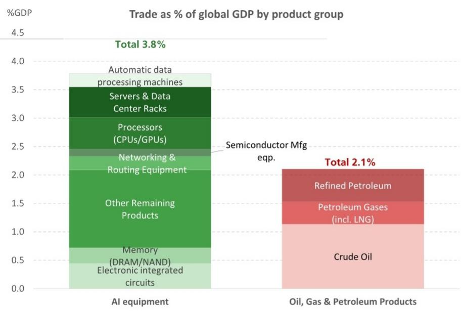

# The AI Terms of Trade Are Already Reshaping the Global Economy—And Energy Shocks May No Longer Decide the Outcome

The conventional wisdom holds that higher energy prices are an unambiguous drag on global growth. Rising oil costs squeeze margins, depress consumer spending, and force central banks into tighter policy. This view is not wrong, but it is incomplete. A global investment bank report published this week introduces a critical counterweight: the AI capex cycle. For economies embedded in the artificial intelligence supply chain, the positive terms of trade effects from exporting AI equipment and semiconductors may be large enough to offset—and in some cases surpass—the damage from higher energy prices.

This is not a theoretical possibility. It is happening now. The value of global trade in AI-enabling technology products is nearly twice that of energy trade. Since mid-2025, prices for memory and semiconductors have risen by 455 percent, compared with a 55 percent increase in Brent crude. The implication is profound: the traditional relationship between energy shocks and economic performance is breaking down. For over half of global GDP, the AI tailwind is already a meaningful hedge against energy headwinds.

The strategic question for investors, policymakers, and corporate leaders is no longer simply how high oil prices will go. It is whether their economy or portfolio is positioned on the right side of this structural shift. The answer determines not just short-term returns, but the distribution of global economic power over the next decade.

## The Scale of AI Trade Has Already Surpassed Energy Trade, Making Terms of Trade Effects the New Battleground

The most striking data point in the report is the comparison of trade flows. AI-enabling products—including automatic data processing machines, servers, processors, networking equipment, and memory chips—now account for a larger share of global GDP than oil, gas, and refined petroleum products combined. This is not a niche technology sector. It is the dominant trade category in the global economy.

The magnitude matters because terms of trade effects are the mechanism through which this plays out. When a country exports goods whose prices rise faster than its import prices, its national income increases without any change in output. This is precisely what is happening for AI-supply-chain economies. Semiconductor and memory prices are surging at nearly eight times the rate of crude oil. The result is a transfer of real income from energy-importing, non-AI economies to those that produce the hardware and infrastructure enabling the artificial intelligence revolution.

This is not a temporary cyclical phenomenon. The AI capex cycle is driven by structural demand for compute capacity, data center buildout, and next-generation networking. Unlike past technology booms that were consumption-led, this one is investment-led. Capital expenditure on AI infrastructure is creating durable production capacity and supply chains that will persist even if energy prices moderate. The terms of trade advantage for AI exporters is therefore likely to be more sustained than typical commodity cycles.

## Over 50 Percent of Global GDP Now Comes from Economies Where AI Gains Outweigh Energy Costs, But the Distribution Is Highly Uneven

The report estimates that economies where the positive AI terms of trade effect exceeds the negative energy price impact account for more than half of global GDP. This is a stunning number. It means that for the majority of the world economy, the net effect of simultaneous energy and technology shocks is positive—or at least neutral.

But the distribution is not uniform. The beneficiaries are concentrated in a handful of economies: the United States, Taiwan, South Korea, Japan, parts of Southeast Asia, and select European countries with semiconductor manufacturing or data center exposure. The losers are energy-importing economies without AI supply chain participation: much of emerging Asia outside the tech corridor, large parts of Africa, and many European countries that are heavy energy consumers but light AI producers.

This asymmetry creates a new cleavage in the global economy. Traditional classifications—developed versus emerging, commodity exporter versus importer—are being overlaid with a new distinction: AI supply chain participant versus non-participant. The policy implications are stark. For countries on the outside, the combination of high energy costs and no AI offset represents a double hit to real incomes and growth potential. For those on the inside, the AI tailwind provides a buffer that may allow them to absorb energy shocks without the usual macroeconomic damage.

## The AI-Energy Relationship Is Not Linear: There Are Thresholds at Which Energy Costs Could Undermine AI Investment

The report introduces a crucial caveat that should give pause to the most optimistic interpretations. The relationship between AI gains and energy costs is not linear. There is a price level for oil at which the economic and confidence effects become so severe that they constrain funding for AI infrastructure investment.

This is not a distant risk. Oil inventories are depleting, and the report notes that upside risks to prices remain material. If energy costs push the global economy into a recessionary or near-recessionary state, corporate balance sheets will weaken, risk appetite will collapse, and the capital-intensive AI investment cycle could slow sharply. The AI supply chain broadly mirrors US spending patterns, so any disruption to US corporate capex would have outsized effects on Asia's technology exporters.

Moreover, the report emphasizes that focusing on net trade or GDP shares understates the broader macroeconomic impact of higher energy prices. Energy-driven inflation feeds through fertilizer and food costs, tightening monetary policy and squeezing real incomes. The risk of physical rationing—historically associated with GDP effects roughly four times larger than those implied by price changes alone—cannot be dismissed. If energy prices remain elevated for a sustained period, the share of energy trade in global GDP will rise, narrowing the gap with AI trade and reducing the offset effect.

## The Report Raises Unresolved Questions About the Durability of AI Demand and the Resilience of Supply Chains

For all its analytical rigor, the report leaves several critical questions unanswered. The first concerns the durability of AI demand. The current capex cycle is driven by a relatively small number of hyperscale cloud providers and technology companies. If their investment appetite wanes—whether due to regulatory pressure, diminishing returns on model scaling, or a shift in competitive dynamics—the terms of trade benefit for AI exporters could reverse quickly.

The second question is about supply chain concentration. The AI equipment trade is heavily dependent on a narrow set of geographies and companies. Any disruption—geopolitical, logistical, or technological—could create sharp price dislocations that undermine the stability of the AI terms of trade advantage. The report notes that Asia's outlook is closely tied to the US capex cycle, but it does not fully explore what happens if that cycle decouples due to policy divergence or geopolitical tension.

The third unresolved issue is the feedback loop between AI and energy itself. AI data centers are enormous consumers of electricity. As AI infrastructure scales, it will increase energy demand, potentially putting upward pressure on energy prices. This creates a self-limiting dynamic: the very success of AI investment could erode the terms of trade advantage it provides, as energy costs rise in response to AI-driven demand. The report does not model this feedback loop, but it is a critical consideration for long-term investors.

## A Decision Framework for Investors and Policymakers: Three Questions to Determine Your Exposure to the AI-Energy Nexus

The report's insights can be distilled into a practical decision framework. Any investor, corporate strategist, or policymaker should ask three questions to assess their exposure to the AI-energy terms of trade shift.

First, what is your economy's or portfolio's net exposure to AI supply chain trade? This is not simply about technology sector allocation. It requires understanding the full value chain—from semiconductor design and manufacturing to data center construction, networking equipment, and memory production. Economies and portfolios with concentrated exposure to these segments are likely to benefit disproportionately from the current terms of trade dynamic.

Second, what is your sensitivity to energy price thresholds? The report suggests that there is a tipping point beyond which energy costs begin to undermine AI investment. Investors need to estimate where that threshold lies for their specific holdings or geographies. This requires not just a view on oil prices, but an understanding of how energy costs feed through to corporate balance sheets, consumer confidence, and monetary policy in the relevant markets.

Third, do you have a hedge against the feedback loop? The AI-energy dynamic is not static. As AI infrastructure scales, it will increase energy demand, potentially eroding the terms of trade advantage. Investors and policymakers need to consider whether their positioning accounts for this self-limiting mechanism. This might mean diversifying across energy-efficient AI technologies, investing in energy production capacity, or building in assumptions about rising energy costs into long-term AI investment models.

## Join the Community to Read the Full Report and Review the Original Charts

The analysis presented here draws on proprietary data and estimates that cannot be fully captured in a summary. The original report includes detailed breakdowns of trade flows by product group, historical comparisons of price movements, and scenario analyses that explore the range of possible outcomes for the AI-energy relationship. These charts and data points are essential for anyone making investment or policy decisions in this environment.

Join the community to read the full report and review the original charts. The discussion around these findings is already generating important debates about the future of global trade, the resilience of the AI supply chain, and the true nature of the energy transition. The questions raised here are not academic. They will determine which economies thrive and which struggle in the coming decade.

*This article is for learning and discussion only and does not constitute investment advice.*

Personal reading notes and learning share only. Not investment advice.

