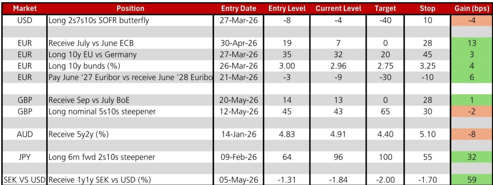
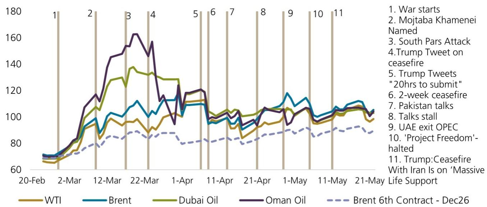
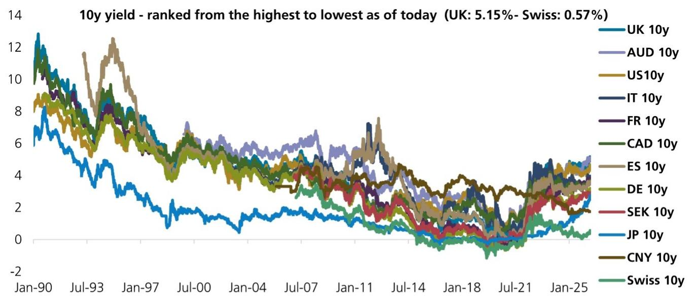

# 债券市场正在为“后伯南克时代”的利率波动重新定价

过去二十年，全球债券投资者习惯于一个可预测的锚：美联储的决策路径可以在相当程度上被提前预判。市场由此形成了一套稳定的定价逻辑，核心债券资产也因此成为全球资产配置的“压舱石”。然而，一份最新研报揭示了一个正在发生的深层变化——这个锚正在被主动移除。这不仅仅是换了一位美联储主席，而是一次哲学层面的“体制更迭”。市场真正低估的，不是短期通胀的高低，也不是降息的速度，而是利率波动率将从“事件性”转变为“结构性”的长期趋势。这份报告的核心判断是：投资者需要为一个更不可预测的利率环境重建自己的观察框架。

## 1. “房间里做决定”的新范式将系统性抬升利率波动率

研报明确指出，新任美联储主席倾向于一种与伯南克时代截然不同的决策哲学。后者推崇的“渐进主义”和“前瞻指引”，本质上是向市场提供一张政策路线图，以降低不确定性。而新主席所倡导的“体制更迭”，核心在于决策过程将更加封闭和即时，重大决定将在“房间里”做出，而非提前向市场释放信号。

这意味着什么？从市场定价的角度来看，过去债券市场所享有的“可预测性溢价”将被收回。根据报告引用的分析，这种更少渐进、更多“休克疗法”式的央行操作模式，很可能导致长期利率中枢上移，并引发更高的利率波动率。这种波动率的上升不是偶发的，而是结构性的。对于任何持有固定收益资产组合的机构而言，这意味着对冲成本的系统性上升，以及传统久期管理策略有效性的下降。这并非短期交易噪音，而是资产定价底层逻辑的转变。

## 2. 债券市场对AI的“生产力故事”仍持怀疑态度，这本身就是关键信号

当前市场的一大叙事焦点是人工智能将带来生产力革命，从而压低长期通胀和利率。但研报提供了一个极具反差的观察结果：自2023年以来，超过30次主要AI模型发布日，美国国债收益率均未出现有意义的变动。

这个事实的So what含义非常清晰：债券市场目前并未将AI视为一个能改变宏观格局的“变革性冲击”，而是将其看作一个渐进的扩散过程。更值得关注的是，报告指出了AI发展可能面临的几大结构性阻力：高能耗的数据中心、芯片瓶颈、国家安全审查，以及无法在短期内完成再培训的劳动力市场。这些因素叠加，使得AI在现阶段更可能成为通胀的推手，而非通缩的助力。欧洲央行官员此前也表达了类似观点。只要生产力的提升没有在财政盈余上得到可衡量、可持续的体现，债券市场对AI的怀疑就不会轻易消散。这意味着，当前基于AI主题的多头利率押注，可能面临一个长期而顽固的“现实检验”。

## 3. 即将到来的高通胀读数并非最大风险，市场定价暗示的是“暂时性”共识

研报提示，未来几个月，美国和欧元区都将迎来通胀读数的阶段性高点。但市场反应却出奇的平静。数据显示，美国一年期一年期通胀互换利率约为2.60%，欧元区则为2.16%。这表明，尽管短期数据承压，但市场并未陷入恐慌。

更关键的信号来自五年期欧元区通胀盈亏平衡利率。该指标正在接近一个临界水平，使得持有一些中期通胀上行风险的头寸开始变得具有吸引力。这告诉我们，市场当前的定价隐含了一个判断：即将到来的高通胀是“暂时性”的，是基数效应和一次性冲击的结果。然而，报告并未完全认同这一判断。这恰恰是当前市场的核心分歧所在，也是投资者需要独立判断的风险点：如果市场错了，通胀从“暂时性”演变为“顽固性”，那么当前所有基于宽松预期的资产定价都将面临重估。

## 4. 全球收益率曲线正在分化：美国趋平，而日本和英国存在陡化机会

在统一的“利率波动率上升”大背景下，不同经济体的收益率曲线形态正走向分化。研报观点鲜明地指出，随着美联储决策风格的转变，以及美国二季度增长和通胀的组合，美债收益率曲线（例如5s30s）的陡化交易需要更长时间才能奏效。这背后反映的逻辑是：一个更不稳定的美联储会压制长端风险偏好，同时短期利率预期难以快速下行。

与之形成对比的是，日本和英国的收益率曲线则存在陡化的空间。日本央行仍在正常化其货币政策，而英国则面临财政不确定性、政治风险以及结构性通胀压力。对于全球宏观投资者而言，这意味着跨市场的相对价值交易（Relative Value Trade）机会正在出现。不再是一味地做多或做空全球久期，而是需要精细地判断哪个市场、哪一段曲线会率先发生结构性变化。

## 5. 报告尚未完全回答的关键问题：“冷火鸡”式的央行如何影响风险资产定价

研报深入讨论了债券市场的反应，但对于这种“体制更迭”如何传导至股票、信用债等风险资产，着墨有限。这是一个值得所有投资者追问的延伸问题。如果利率波动率结构性上升，且长期利率中枢抬高，那么过去十几年“TINA（There Is No Alternative）”策略的根基——即债券作为稳定收益来源的吸引力下降，从而推高股票估值——是否会发生动摇？更高的波动率意味着风险资产的贴现率将变得更加不稳定，这对于依赖稳定现金流折现模型进行估值的成长型股票来说，可能构成一个持续性的压制因素。这或许是当前市场最需要被解答，却尚未被充分定价的下一层逻辑。

## 6. 你的观察框架：从“押注方向”转向“管理波动率”

面对这样的市场环境，传统的“看多”或“看空”利率的二元框架可能不再足够。基于报告的启示，投资者或许需要将核心观察框架调整为以下三个维度：

第一，关注各国央行沟通方式的根本性变化，而不仅仅是利率决议本身。一个不再提供前瞻指引的央行，意味着市场需要从价格信号中反推政策意图，这本身就会放大波动。

第二，监控通胀预期是否从“短期暂时”向“中期顽固”迁移。五年期盈亏平衡利率是一个比月度CPI更重要的领先指标。一旦该指标突破关键阈值，市场对央行政策的定价将需要全面修正。

第三，在跨资产层面，评估利率波动率上升对信用利差和股票风险溢价的传导效应。如果利率波动率成为了新的“风险因子”，那么传统的60/40股债组合的风险收益特征将发生根本性变化。

这份研报的价值不在于提供一个确定的交易方向，而在于指出一个正在发生的、深层次的制度性变化。它提醒我们，有时市场最大的风险，不是数据本身，而是我们赖以解读数据的那个框架，已经不再适用。

---

以上讨论的，如美联储决策哲学的转变如何具体影响不同期限的利率定价，以及AI对生产力影响的更多数据细节，都只在这份完整研报中才有详尽的图表和逻辑推导。我们无法在一篇导读中穷尽所有。欢迎来星球微信群里继续讨论，获取完整报告原文及更多独家解读。

Personal reading notes and learning share only. Not investment advice.

