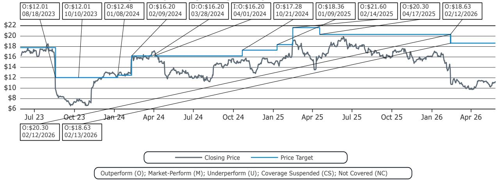
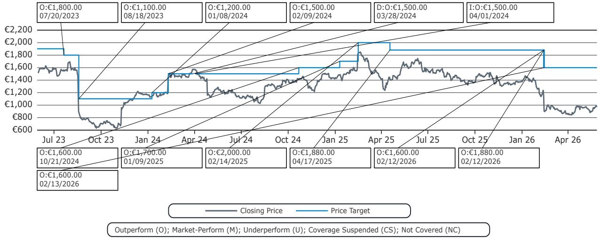
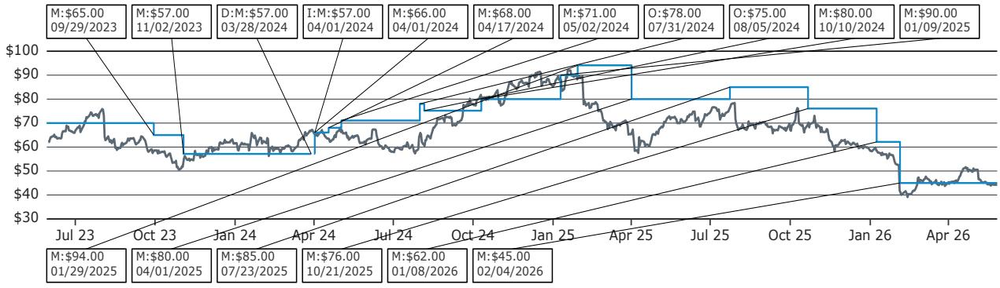

# Payments, Processors & IT Services

# Payments: Shopify's platform partnerships with payment companies - key takeaways from our expert conversation

Harshita Rawat, CFA

+1 917 344 8485

harshita.rawat@bernsteinsg.com

Simran Ratani

+1 917 344 8329

simran.ratani@bernsteinsg.com

Viola Chen

+1 917 344 8614

viola.chen@bernsteinsg.com

We recently hosted an expert call with the Former Head of Payments Platform Partnerships at Shopify. We discussed Shopify's evolving payment platform partnerships, including with players such as Adyen and PayPal. The note provides key takeaways from the call. Please reach out to us for a replay of the call. Key takeaways:

Shopify's payments strategy is naturally maturing from a single-partner infrastructure model into a deliberately multi-provider orchestration layer, with first-party payments as the profit engine. Not surprisingly, third-party integrations yields are significantly lower vs. that of first-party's. This is driving Shopify's insistence on converting as much GMV as possible from third-party to first-party, when possible. From a payments risk perspective, Shopify's prior dependency on a single acquirer presented unacceptable concentration and geo constraints. This naturally led to Shopify pursuing redundancy (e.g., with multiple PSPs) not as a negotiating tactic, but as a platform necessity.

The evolution of the relationship with Adyen reflects Shopify's enterprise inflection point, especially in Europe. As Shopify moved upstream, payments became the primary friction point in large-merchant replatforming, not core commerce software. Enterprises already embedded with Adyen were unwilling to sacrifice existing payment data, local payment methods, omnichannel integrations, and fraud models simply to adopt Shopify. Shopify has accommodated this demand through a third-party Adyen integration, but the unintended consequence has been some GMV leakage away from Shopify Payments.

As such, the relationship between Shopify and Adyen on first-party payments is evolving e.g., in France.

Shopify-PayPal Unbranded relationship is an example of the limits of competing on price alone. Despite PayPal's historical dominance on branded checkout (especially important in Europe) and its ability to win Shopify's RFP through attractive commercial terms, operational fragility (e.g., outages, conversion) outweighed pricing (e.g., in France where PayPal had won unbranded processing for Shopify). This reinforces our view that large merchant acquiring relationships are often more about ‘value’ vs. simply a pricing question (i.e. there is moat in PSPs), and Adyen can win wallet share despite being more ‘expensive’. Rather than unbranded processing, PayPal's strategic value to Shopify is more around the branded button, particularly in markets where consumer protection materially influences checkout behavior.

Shop Pay's evolution is an example of Shopify's intent to own the consumer interface while abstracting the payment rail. While transaction execution still flows through Shopify Payments partners, the authentication, data, and consumer relationship sit firmly with Shopify. This positioning (of Shop Pay) weakens external branded wallets over time and explains Shopify's sensitivity to allowing third-party players to build consumer ecosystems atop its merchant base. Shop Pay is less about near-term take-rate expansion and more about long-term conversion control and negotiating leverage across processors/digital wallets. See edited transcript (including discussion on Agentic Commerce) in the details section.

BERNSTEIN TICKER TABLE 

<table><tr><td rowspan="3"></td><td rowspan="3"></td><td rowspan="3"></td><td colspan="2">26 May</td><td rowspan="2" colspan="2">TTM</td><td rowspan="2" colspan="4">Adjusted EPS</td><td rowspan="2" colspan="3">Adjusted P/E (x)</td></tr><tr><td colspan="2">2026</td></tr><tr><td rowspan="2">Closing Price</td><td rowspan="2">Price Target</td><td rowspan="2">Rel. Perf.</td><td rowspan="2">Cur</td><td rowspan="2">2025A</td><td rowspan="2">2026E</td><td rowspan="2">2027E</td><td rowspan="2">2025A</td><td rowspan="2">2026E</td><td rowspan="2">2027E</td><td></td></tr><tr><td>Ticker</td><td>Rating</td><td>Cur</td><td></td></tr><tr><td>ADYEY (Adyen)</td><td>O</td><td>USD</td><td>11.27</td><td>18.63</td><td>(67.0)%</td><td>USD</td><td>0.39</td><td>0.50</td><td>0.60</td><td>28.7</td><td>22.4</td><td>18.8</td><td></td></tr><tr><td>ADYEN.NA (Adyen)</td><td>O</td><td>EUR</td><td>969.60</td><td>1,600.00</td><td>(53.3)%</td><td>EUR</td><td>33.62</td><td>42.83</td><td>51.05</td><td>28.8</td><td>22.6</td><td>19.0</td><td></td></tr><tr><td>PYPL (PayPal)</td><td>M</td><td>USD</td><td>44.16</td><td>45.00</td><td>(66.4)%</td><td>USD</td><td>5.31</td><td>5.23</td><td>5.30</td><td>8.3</td><td>8.4</td><td>8.3</td><td></td></tr><tr><td>SPX</td><td></td><td></td><td>7,519.12</td><td></td><td></td><td></td><td></td><td></td><td></td><td></td><td></td><td></td><td></td></tr><tr><td>EDME</td><td></td><td></td><td>1,555.68</td><td></td><td></td><td></td><td></td><td></td><td></td><td></td><td></td><td></td><td></td></tr></table>

O - Outperform, M - Market-Perform, U - Underperform, NR - Not Rated, CS - Coverage Suspended   
ADYEY estimate is Adjusted EPS Income from discontinued operations;   
Source: Bloomberg, Bernstein estimates and analysis.

# INVESTMENT IMPLICATIONS

We rate Adyen OP. We rate PayPal MP.

Please also reach out to us for a replay of our recent fireside chat with Adyen's Co-CEO.

# PLEASE SEE LINKS TO OUR RECENT RESEARCH

- Adyen, Braintree, Stripe, Checkout: Part 1 — A look at key metrics (April 2026)   
- PayPal: Under siege; a look at checkout wars - has the ship sailed? (February 2026)   
• Adyen: An open letter to management (February 2026)   
- Adyen Investor Day: Greater conviction in the next decade of growth (November 2025)   
- Adyen: eCommerce Turf Wars — a deeper look at competitive dynamics; slide deck from our call (August 2023)   
• Adyen: Broken or a Blip? (August 2023)

# DETAILS

# EDITED TRANSCRIPT

Brief expert bio: Former Head of Payments Platform Partnerships at Shopify. From 2022 to 2025, the Expert led global payments strategy for Shopify, overseeing a platform processing hundreds of billions in annual volume and managing critical relationships with the world's largest providers, including Adyen, Braintree, and Worldpay.

# Harshita Rawat

Good morning. Thanks for joining us today. Why don't you give us a little bit of an intro to kick off our conversation?

# Expert

Yes, absolutely. Thanks for that. I've been in the financial services/financial technology space for about two decades now. I worked at large corporate banks, moved over to payment organizations, so have worked at organizations like PayU, Paytm, across the globe. But relevant to today's conversation, I've been at a few platforms now over the last almost ten years or so, including Lightspeed Commerce, initially, where I was leading payment partnerships, again, very similar to Shopify. I did that for about two years. And then over the last four years or so, I was at Shopify, as you mentioned, leading the Payments Platform Partnerships, which is essentially the ecosystem of all payment companies who have built out applications or integrations onto the software ecosystem. So, yes, left them last year in September. And since then, I'm now at a cross-border merchant of record payments entity.

# Harshita Rawat

Great. And I guess just to level set, can you maybe talk about the platforms you looked at while at Shopify? We know the big names, but I think it will be good for everyone to be at that same starting point.

# Expert

Yes, absolutely. I think, broadly, and I think it's important to clarify just the different payments pillars at Shopify and how they were operating, because I think that will address your question more directly, but for payments at Shopify, we had two or three broad buckets.

The first bucket is called Shopify Payments, which is the first-party white label solution, where Shopify owns the merchant experience. We initially owned the relationship, the pricing, as well as the go-to-market aspect. Any merchant that signs on to Shopify's software, in markets where it's available, Shopify Payments would be shown up as default. So that's one bucket, which does about $67\%$ of the volume now, as per the reported numbers.

On Shopify Payments, historically we only had Stripe, and Shopify Payments as a product has existed since 2014. So it's been about 12 years that Shopify has worked with Stripe. Sometime around 2022 is when the first foray outside of Stripe as a payment partner within Shopify Payments happened. We did an RFP back in the day, and I think to your question - the partner selected was PayPal/Braintree for a specific market at that time, which was France. The idea was, hey, we want to make this platform more flexible, and we can add more payment companies eventually. We can go deeper there, but that's sort of the first bucket of payments.

The other bucket is called the Payments Partner Platform, or the third-party payments platform, which does about 35% of the volume or 33% of the volume. This is where actually Shopify has that capability, and the power, I would say, because it has integrations with almost every large payment company across the globe. So, when we think of, to your question of identifying which payment partner should Shopify select for the first-party solution, Shopify actually has access to hundreds, about 600-plus integrations, with almost every large payment company across different regions. And when they decide to launch or expand into a new market, like let's take the example, let's just use Mexico or Brazil, if they were launching in, say, Brazil tomorrow, they would just look at the data on the third-party side of which are the top partners. And then based on the volume, based on platform, based on complexity or product build, they would move or start building that third-party, or moving that volume to first-party Shopify Payments. So that's more holistically how we operated. Specifically to the partners considered, they were, as you can imagine, all the large names. PayPal/Braintree eventually won the RFP, but Adyen was considered. I'm talking about 2022, Adyen was considered and so were specific regional players - think of Checkout.com in Europe, think of Razorpay in India, somebody else in Brazil. At that time, we decided on PayPal because we had to build out the platform to support an additional player. And now, over the last year or so, there has been, again, expansion of payments into two or three different spaces, or discovery is happening in few spaces.

One is in the enterprise as a merchant segment space. That's why you now see discussions with Adyen coming through, because they have that platform to support enterprises, and/or you have expansion into new regions. Think of markets like Southeast Asia, where Stripe does not exist or has pretty limited presence, or even in other markets in Europe, where Adyen or other players might be pretty powerful. Same for Latin America, right? So that's the second theme where partners could be. Think of all the top partners in those regions. I can't really name the exact ones, but the top regional players are being considered for regional expansion, and Adyen has been selected more from a global enterprise standpoint.

# Harshita Rawat

So much to unpack there. And before we get there, maybe talk about the economics from a first-party or a third-party kind of perspective, and net of interchange and network fees, etc. Kind of a net take rate, gross profit, if you will. So maybe talk about the typical economics, what Shopify keeps, like what the payments partner get. And I know it's a little bit of a nuanced answer, because I think Shopify obviously does use these partners for so many different services and varies domestically, cross-border, etc.

# Expert

That's right. I think that's the crux of the whole partnership, right? Who gets what kind of value from this sort of integration? Again, it's good to break it into these two buckets because the economics are widely different, and not just the economics in terms of numbers, but just the model of how we are operating between first-party and third-party. And I'll elaborate there.

For Shopify Payments, the economic model is a typical buy rate/sell rate model, which means that historically, Stripe, and now PayPal, and now even Adyen, would offer a buy rate to Shopify and say, hey, for any transaction that is processed through their platform, Shopify will be charged X percentage. But then Shopify also has this advantage and flexibility to offer a sell rate to its merchants and to add its own margin on top. So, whatever that buy rate could be, and it varies by platform. Stripe typically offers a blended rate because that's just how the platform is kind of set up. Shopify will add its own margin. And you see the published rates in certain markets. Let's take US for an example. It's 2.9% plus a few cents. So that's the final sell rate Shopify charges.

Within that, to your point, to try and figure out the model, Shopify would keep, again, can't share the exact number, as you can imagine, but, say, double-digit basis points from that number, and remaining would go back to Stripe. Now, Stripe takes care of the payout for interchange, the payout to networks and all of that. That's completely within Stripe or the payment partner's bucket.

So that's the economic model that historically we've had with Stripe. Very similar with PayPal and Adyen. One key difference here, however, is both those platforms operate on an interchange plus model. So the cost that was given to Shopify is on an IC+ model. Again, from an economic standpoint, they still cover interchange, so they still cover the network costs, issuer acquiring economics, etc. Shopify still has the ability to add their margins, which is, again double-digit basis points, to keep that end pricing at 2.9%. Or if they choose to change it tomorrow, they could do that as well. But that's on the first-party side of things.

As you can imagine, because Shopify is the one who's actually pricing the customers, merchants, in this case, Shopify has the ability to book the entire revenue. So the same 2.9% is booked as Shopify's gross revenue, which is why you see such high numbers on the transaction revenue piece.

Within this bucket, Shopify's margin actually is double-digit basis points. And on top of that, just to clarify, Shopify also takes care of the fraud and the risk and some of these chargebacks. So you can shave off a few basis points because of whatever fraud issues may have come through. So, that is how the Shopify Payments economics operate on the first-party side of things, and irrespective of the partner, typically, that's how Shopify would work.

On the third-party side, it's actually entirely different, the same transaction that is processed through Shopify Payments versus 3P. In case of third-party, Shopify does not actually control merchant pricing. It's simply a third-party integration. So, the merchant would go to the partner. It could be, say, Checkout.com, Mollie, or anybody else in different markets. The merchant would get onboarded directly with the payment partner and negotiate on the pricing and then come back to Shopify's admin to just add the payment integration technically. So it's just a technical kind of support that Shopify has kind of built out. Commercially, for every \$100 processed, that payment partner would pay Shopify a range of revenue share, essentially, which could be between 20 basis points to 40 basis points, depending on markets. If it's a buy now, pay later, it might be a higher revenue share. If it's a gateway which is just routing a transaction, it might be a smaller rev share. But that's the thing. So in case of a third party, Shopify can only book that 20 or 40, whatever that basis point structure, as the economics. So it's wildly different between both these platforms on how it books its margins and the revenue.

# Harshita Rawat

And I think if I then think about this push into enterprise from Shopify, I guess this becomes a little bit more of that contentious dynamic. One of the reasons that they probably started partnership with Adyen several years ago, that as you're going into enterprise, they would want to have their own kind of interchange plus pricing that they're bringing to the table. So how has Shopify's partnership stance around these enterprise relationships evolved?

# Expert

Yes, that's a great question. And I think you touched upon it a bit. Shopify's main foray into enterprise, it was announced sometime in, I think, January 2023, so about two or three years back now.

So a few things that Shopify had to do to even address that segment. One, in general, and again, touching upon what you said, enterprises typically have a lot of complex integrations already built into their websites, into their technology stacks. That's one, which means that if they are thinking about replatforming to a new partner like Shopify, even on the software side, they needed to have that flexibility for Shopify to actually support some of their existing integrations.

One of those integrations, I would say, and one of the most important ones, was definitely payments. But more broadly, when Shopify started thinking about enterprises, they realized that, hey, today their pitch to merchants has been, take this product off the shelf, it just works, which includes your software capabilities, your product SKU level mapping, your inventory analytics, etc., the software side of things, but also the payments part, where a merchant could just come in typically take Shopify Payments in larger markets, or could use a third-party provider, but there are limits to what that third-party ecosystem could do, even today.

So, with enterprise as a segment and keeping that in the forefront, Shopify had to make changes on software. They announced something called Commerce Components, which is important even for today's conversation, because they essentially said that Shopify now is able to break down its platform into different components or make it more modular. One of those components was actually the purple button, the Shop Pay commerce component, which now you see is available even on merchants outside the platform. But there were other things around inventory, ERP, etc.

And then another large component was around the payments part of it. Within payments, Shopify did go out to the market, and they realized that although their priority was always to sell Shopify Payments to every merchant, whether it's large or small, there are constraints when you talk to an enterprise merchant, because of a few things: they will be so deeply ingrained with a payment company across the globe. Think of hardware devices for a large enterprise in omnichannel. Think of their different websites, different global setups that they have with those providers, the data that they have collected over the years with that payment company outside of Shopify. And they want to protect all of that, because that's helpful for fraud, that's helpful for conversion rates, for loyalty, etc.

So those were the challenges that Shopify started seeing. So that's one. And coupled with the challenge, Shopify was also expanding into Europe as a market. And both of those things, Europe and enterprise, if you put both of them together, every other deal that we were trying to win in the enterprise space was working with Adyen.

So it was the answer to, who do we actually work with to win these enterprise deals or bring them over? The writing was on the wall, because most of these merchants were coming to us and saying, hey, if you want us to move, we want you to support Adyen, and not just purely from a third-party standpoint, we want it to be deeper than what we have today. So the partner was also kind of selected for us because merchants were talking about Adyen and asking for it. So we decided to build a deeper partnership with them at that point in time.

# Harshita Rawat

So we'll come back to Adyen. Let's talk about Stripe for a second. These two companies are so closely, I think, knit together, although I think that relationship is evolving. So maybe talk about the nature of the relationship, Stripe/Shopify, and how is that evolving?

# Expert

Yes. It is one of the largest fintech partnerships on the planet, right, in terms of the volume that is being processed between the entities. But if you go look under the hood, both entities are deeply involved with each other around what products to build out. The product roadmaps are actually pretty much intertwined. A lot of products that you see coming out for Stripe, there is some sort of request or a demand that Shopify would have made for that, interestingly, over the years, and which is why it also gets prioritized within Stripe's own roadmap.

So I think that that sort of dynamic exists. In parallel, the executive engagement is massive. Shopify also has this investment relationship in Stripe, so that also helps move things along because the executives across both entities, the Collison brothers, Toby, they know each other. They meet every six months or so, discuss future opportunities and what's new and what we should build together. So, that sort of engagement has actually existed for a very long time.

So, if you look at both entities, they actually operate very similarly, build towards each other's roadmap, have that kind of engagement and the investment relationship, which is why it's also kind of become so massive over the years. And as I was saying before, 2014 is when Stripe actually initially launched Shopify Payments with Shopify. Stripe Connect was not even a thing at that point in time. If you look at the product itself, which is now being offered to other platforms, it actually got built along with Shopify.

So, one of the biggest go-to-market pillars for Stripe, which is the platform product, was actually built for Shopify and then evolved from there. But that was back in 2014. It's been ten, 12 years. Over the years, however, a few things have happened. And this is now if you wear the hat of somebody at Shopify or from the ecosystem standpoint. The volumes at Shopify became really massive. Somewhere around 2019, 2020, we already were seeing e-commerce growth, but then COVID really accelerated that. A lot of merchants started coming in. This partnership evolved and became billions of dollars, so much so that as COVID came in, and we saw a lot of push towards e-commerce globally, Shopify and Shopify's volumes really became massive, right? That acceleration was almost like an L curve at that point in time. And that really became huge for Shopify, as well as Stripe.

And a few things happened. Because of this volume, it became very important for Shopify to even start exploring other partnerships or other platforms, just to build out more redundancy in the ecosystem. Just think of a platform like Shopify, which has millions of merchants and which works with only one payment partner at the back end. If Stripe were to go down tomorrow, that leaves the entire merchant ecosystem at risk for payments. And as you were saying before, that payments transaction revenue itself is so powerful for Shopify. You cannot risk that amount of business, and Stripe has been awesome and great for us. That said, we don't want to risk that sort of dependency on a single player.

# Harshita Rawat

There's a dependency, and there's also, I think, in different regions around the world, you want to have different processors. I think Stripe cannot service you. And then there's an agentic kind of interesting angle, right, like we were talking about earlier.

# Expert

Yes, that's actually true. So, just from an evolution standpoint, again, it reached a stage where volumes were pretty high. With the volumes, to your point, Shopify also wanted to expand its payments' footprint beyond the US, Canada, UK, Australia corridors, which were the top four markets. So a lot of expansion had to happen in Europe. They were seeing merchant demand coming in from Southeast Asia, purely from a software standpoint.

And what they realized was that if Shopify software was available in 175 markets, Shopify Payments was only in 24. Stripe on its own, as a platform, was only available in 40 or probably 35 at that point in time. So, to your point, there was a constraint or a ceiling to how much we could operate with Stripe, because our ambitions as a software company was to have every payment or every transaction go through Shopify Payments versus third-party.

So we wanted to have Shopify Payments everywhere, which is actually, to your point, we started exploring and figuring out that, hey, one, the redundancy still being the top goal, we did not want to have almost 50% at that time volume go through just a single partner. But then even the remaining 50% or the third-party platform, the idea is, how do you actually move that volume to another payment company in that particular region and call it Shopify Payments? So you can book almost 100% of revenue as gross transaction revenue. That's almost ten times of the rev share that you get.

So, yes, those were some of the things that were needed, and the rationale behind expanding this partnership beyond. However, in those initial ten, 12 years, as you can imagine, Stripe also did a great job by continuously launching new products. So they built out the payment rails, got a lot of data on Shopify through Shopify's merchants. Shopify did the same. They realized, you know what, maybe financial services or launching a financial services product could be an interesting feature here. So they kind of built out the capital product.

# Harshita Rawat

That's built on Stripe's rails, right? I think issuing, working capital, balances, that's all Stripe.

# Expert

Exactly. 100% of the US is Stripe. For lending, because Stripe does not have a license in UK and others, we do work with other partners like YouLend. But the majority of all the financial services solutions that you see, issuance, balance, which is the bank account as well as credit in the US, this is all built on top of Stripe's rails, as well as, importantly, Stripe's banking network. It's important, it's a good distinction because for payments, Stripe does the acquiring and also offers the actual APIs, because they have the acquiring licenses.

But for lending, for issuance, we actually need a sponsor bank at the back end to kind of give an underwriting, to give basically their books to lend us money or to have us open accounts into their licenses, which Stripe does not have. So in those cases, Stripe's basically powering the whole integration through their APIs and the reporting and the admin that they have created. So, that's the extent of Stripe.

# Harshita Rawat

And I guess, one thing you didn't mention is Shop Pay. And I'm guessing, obviously, Stripe has Link. Maybe talk about that also in the context of the Stripe/Shopify relationship.

# Expert

Yes, absolutely. Shop Pay, I think, was a vision, I would say, for Shopify originally to say that, hey, we see we have this merchant side ecosystem and merchant side network that has been created, but we typically do not have any consumer information or product available in the market today.

So, Shop Pay's evolution has actually been interesting. Shop Pay started off by Shopify wanted to get into the consumer side of the business. They did not really know what to do. So they built out a package tracking app.

It was called the Shop application, which was built out to just get consumers, once they do a transaction on a Shopify merchant, in order to track their package, they just had to sign up for this product called Shop, which was the Shop application or Shop ecosystem. And Shopify would scrape their data from emails and see when the package was being delivered and tracking, etc.

So they started seeing some traction there, and they started building out some consumer ecosystem and consumer base there. Over a period of time, they realized, and Shopify realized that, you know what, rather than just having this package tracking use case, we should actually convert this into a stored value or payments or a wallet use case, where we can then connect both consumers as well as merchants, and hopefully over a period of time also monetize it.

# Harshita Rawat

And I guess that the Shop Pay infrastructure, it looks like that's Shopify owned, right? I think what you're describing, that's not linked to Stripe.

# Expert

So the Shop Pay idea, the Shop Pay mission, is all Shopify owned. The data around all of that is completely owned by Shopify. But think of the situation where, once you come as a customer, you enter your credit card details at checkout, you add it on Shop Pay, that is all maintained by Shopify, again, on top of a stored value / vault. But when the payment transaction actually happens, that is still owned by Shopify Payments.

That's a key distinction because, historically, because Shopify Payments has 100% been Stripe, which means every payment transaction, even on Shop Pay, actually goes through Stripe. However, the way Shopify set this up was that, depending on the market, Shop Pay would go to any partner that is processing Shopify Payments. So now that Adyen is here, now that PayPal was here, you could argue that it's easy for Shopify to move other partners under Shopify's Shop Pay as well. But right now, it is only Stripe for those transactions.

# Harshita Rawat

And I guess I want to also talk about PayPal and Adyen a little bit more. Before we get there, let's maybe talk about agentic a little bit, because now that we are talking about Stripe and Shopify already, and I think it's interesting, we were chatting about it earlier that whole evolution of that relationship, also with regard to agentic. Initially, I think Shopify was kind of a partner with

# OpenAI, Stripe in their ACP protocol. But then Shopify became the partner with Google. So, talk about that aspect and how the relationship got impacted in all that process.

# Expert

Yes. Agentic is such a fast-moving space right now that whatever we talk about today could become completely irrelevant in the next six weeks. And I think that's also the theme of how this has progressed over the last year. But to your point, again, whenever we think of payments at Shopify, in general, the default partner or the first partner that we reach out to for any of these capabilities ends up being Stripe.

So last year, around April-May, this is exactly what was happening. So OpenAI essentially came to us or came to Shopify and said, hey, we want to have checkout within our rails or within the agent. That was the problem statement or the objective, which was, hey, we want the checkout to actually happen within the agent. A customer should be able to complete a transaction on ChatGPT without leaving it and without taking it to any other platform.

Now, historically, over the last many years, even before last year, search and discovery had really become massive on ChatGPT. So customers were coming to ChatGPT more than they were coming to Google at that time and asking for products, searching for recommendations. And till the time of actual purchase, everything was happening within that chat agent.

# Harshita Rawat

And they added the instant checkout, right?

# Expert

Exactly. And then the idea was, ChatGPT's aim was, you know what, now we have all of this, they could technically just build out capabilities for a merchant, any small merchant out there to say, hey, why don't you build a store on ChatGPT itself? So they could actually have a web front, a storefront, or that capability added within the agent to do it.

Now, that was a risk that Shopify actually understood as well. For ChatGPT also, that would have been a massive foray into a different segment, and instead of allowing ChatGPT to independently build any of that, they said, okay, let's work together to build this out, which is, let's have order completion capability given within your platform.

Now, the challenge with that is, sure, ChatGPT is bringing in the demand from the customer and the customer context and intent. Shopify could bring in very easily the data around inventory, around product, the merchant brand, etc. But how do you actually complete a transaction?

ChatGPT did not want to get into the payments space, or did not want to carry the risk of a transaction. And Shopify already had Shopify Payments as a payment rail built on top of Stripe. And this is typically how some of these situations occur within the partnership, where, when we are thinking of white space opportunities, it was agentic even before it was stablecoins. Shopify and Stripe then collaborate and figure out how to make it work. So the thing is not that, hey, it is already existing, because nothing was available at that time to support this flow, which is instant checkout on ChatGPT. Networks or issuers, etc., were concerned that if a transaction goes through and tomorrow if something goes wrong...

# Harshita Rawat

And there's lot of fraud...

# Expert

Exactly. So, who takes the liability, right? All of that had to be figured out. So Stripe came in as the third partner. And the idea was, hey, how do we actually capture this transaction at the point of sale, which is within ChatGPT, while using the same merchant account rails that Shopify Payments had (powered by Stripe). So, Stripe would have access and know about the merchant account, the bank account at the back end, the fraud details, the chargeback rates, etc. And then how do you marry all of these three, is how the agentic commerce protocol was built out originally.

# Harshita Rawat

And then Shopify went and created that merchant catalogue. And then OpenAI abandoned instant checkout. So I just wonder, this whole U-turn from OpenAI and Shopify went and did all of that, how did that impact the relationship?

# Expert

I think it's an interesting one, because if you think about it, it's also, I would say, obvious. It was an obvious evolution, in my opinion. Tough to say, I don't think it will impact the relationship that much, to be honest, between Stripe and Shopify. But OpenAI and Shopify, we'll see how they collaborate further, because Stripe and Shopify, as I said, the ACP was built to support a flow. It wasn't to say, hey, we are leaving anything else, and then this is something that Shopify wanted.

Stripe also wanted to be into that whole ecosystem because they wanted to be in the money flow. They did not want somebody else to build it. So I think the way it has evolved, and also, I think it's important to look at the commerce infrastructure in general. I spoke of supply, I spoke of demand and infrastructure. And in the case of ACP, all of that was kind of getting bubbled together into ChatGPT in their platform, as well as within these specific partners.

ACP was going to be powered by Stripe. Similarly, PayPal launched something called APP, which was going to be powered by PayPal. So those were more payments focused protocols. Now you could have OpenAI at one end and Shopify as a launch pad at the other end. But largely, those still needed to have Stripe.

With the UCP, or over a period of time what Shopify realized was that we were seeing very little adoption on the ACP, because merchants, if you think about it, if you're selling your products directly on an agent, an agent does not really know what your brand looks like. Sure, they might understand the value prop for the particular product, but typically, the merchant was losing connect with the end customer when these transactions were happening through ChatGPT, and customers were not even coming to their website, which they had painstakingly built over the years, along with brand messaging and all of that. So we started seeing more of that.

So I think this is an evolution where Shopify then realized, as well as ChatGPT realized, that we're not seeing adoption here. Merchants want to maintain and protect their brand, which was built on top of Shopify. So, rather than getting into this mishmash of search, discovery, and payments and checkout within one space, why don't we keep it broken down? And every player has its lane to operate in.

And I think that's the evolution. I would say instant checkout was more of a trial that OpenAI wanted to do to keep everything within them. Shopify and Stripe played along because they had fear of missing out on that flow. But they realized that merchants were not really keen on doing that. So now UCP is largely around search and discovery, and it's more about cataloging and data.

So Shopify, by launching UCP with Google, and tomorrow it could be with OpenAI or any other chat search agent as well, it is partner agnostic on the payment side. So any merchant, any partner, could build on to it. And it's also partner agnostic on the search side. So they've kind of broken down the supply and demand pillar into individual segments.

# Harshita Rawat

There's so much to discuss there, but I think in the interest of time, I'll switch gears and talk about Adyen. I know you talked about the evolution of that relationship where, initially, I think it was informed by adding redundancy, expansion into Europe, expansion into enterprises, the desire of enterprises to, I think, have more control. Maybe talk about how that partnership is now evolving, how Shopify may be looking at Adyen for first-party processing, and also, how is that working for third-party? And then I have a specific question for Europe.

# Expert

Yes, sure. I spoke about the enterprise foray of Shopify as well as the foray into Europe. So 2023, both entities realized that we needed to have a much deeper partnership between Adyen and Shopify, and we had to figure out what's the best way to onboard some of these larger merchants. And these are now live, but at that time, it was On Running, which was a billion-dollar entity in terms of volumes, which wanted to move over.

And On Running was very clear that we are so deeply integrated with Adyen that without having Adyen supported by Shopify the way they would imagine it, not just on Shopify's third-party platform, because that has constraints and capability restrictions, On Running wanted their version of Adyen or an enterprise version of Adyen to actually exist on Shop.

So that was the origin of the partnership. Originally, as part of that deal, as part of that strategic relationship, the focus was only on third-party. We could not actually build an integration onto Adyen through Shopify Payments because, again, Stripe, we had a contractual obligation, and it was a much deeper integration as well. You had to kind of build on to a completely white label solution, etc., versus third-party was the faster go-to-market play. And third-party was what On Running was already using.

So for Adyen, it was important to protect their direct volumes as well. And they were like, hey, if you want On Running, you will have to allow us to build this third-party integration in the proper manner. So, additional capabilities, which typically Shopify keeps only for first-party, like fraud protection services, the terminal services, etc., we actually opened them up on the third-party site for Adyen to support On Running, and eventually other merchants as well in that space.

So that was the origin of the partnership. Over the initial year or so, On Running as well as a few other merchants moved over. And that that relationship became from zero dollar to \$2 billion, \$3 billion annual GMV in total. And what Shopify started seeing was a lot of merchants in Europe, whether they were large or small, they started moving over to Adyen's third-party application.

So, because Adyen was such a big brand name in that market, as a merchant was coming on to Shopify, they used to see Adyen as a listed provider, and they started selecting that instead of using Shopify Payments or Stripe, or even any other third-party partner. And that was the power of that brand. And I think that's where somewhere we started seeing channel conflict, because Shopify Payments did not appreciate that they were losing volume to a third party.

And then Adyen, as much as you would tell them, hey, you know what, if a merchant is on Shopify, do not pitch their services directly, we actually added constraints to say Adyen can only support a merchant which is above 100 million, to specifically target enterprise, etc. But we started seeing merchants of all sizes and shapes move over.

So that was the origin. The discussions evolved from a third party to a first-party platform, where Shopify and Adyen decided that, hey, it's tough to fight over every large relationship where every merchant in Europe wants to use Adyen. And we don't have that, and Shopify does not want to lose that volume on Shopify Payments. The difference is massive on 1P versus 3P. So why don't we just improve this or rebrand this third-party application and make it first-party, and build out those additional capabilities around onboarding, around settlement rails, etc., so that tomorrow, if a merchant now asks for Adyen, we can actually position Adyen as the provider under Shopify Payments. So both parties essentially get their volume and revenue.

So that's the evolution. That's how it has kind of moved over. Just because there was just so much volume coming in on 3P, they recognized that there is value in going deeper there. And then also important to note, on the omnichannel, the in-store payments piece, Shopify actually does not have the third-party payments platform. In-store, it was only Stripe so far. And Stripe's capability in in-store was actually not that great. So, by adding Adyen into that space, they are also massively opening up that in-store channel for payments. And I think that could actually help them grow their payments volume in even more markets now, with Adyen coming in.

# Harshita Rawat

And, we have talked about this earlier. There is this perception in the market that somehow Shopify's enterprise growth in Europe, particularly on that first-party, is a risk for players like Adyen as Shopify is taking that payments relationship. And I think from Adyen's perspective, being a third party versus a first-party kind of processor could have different economics. How do you see this?

# Expert

No, that's actually right. And I agree with the sentiment. Before this whole Shopify Payments and Adyen partnership was announced, or has now kind of built out, because that was exactly the problem that we were seeing in the market and within Shopify and Adyen as well, where Adyen had all of these merchants who were using their direct rails today. So they were booking that revenue, looking all of that volume.

Those merchants also were looking to replatform to Shopify, because as Shopify expanded into that space and region, and then enterprise, a lot of these merchants wanted to get the benefit of a much better stack and all of that, so wanted to move over to Shop.

And that's where the biggest conflict came in, because as soon as a merchant moves to Shopify, even if they were an existing Adyen merchant, initially, they could continue to use the Adyen third-party application if they were fitting into some of those constraints that Shopify had built out. But over a period of time, there was nothing stopping them from moving away from Adyen 3P to actually use Shopify Payments or any other payments partner.

Taking a step back, the toughest thing for a payments partner to get to win a merchant is actually the integration effort. That's the reason so many orchestration providers also exist, that you integrate with one player and the entire ecosystem opens up. Shopify actually does the same, because Shopify has the technical integrations with these 600 players, and this massive Shopify Payments first-party product, which has a much better experience, much better economics, no third-party transaction fee, and no revenue share in that sense.

Of course, merchants are more likely to move over once they come in, and that channel conflict is exactly, I think the crux of your question, is what we started seeing in the market. It definitely was a thing. There were a few cases of merchants who actually moved away from Adyen to Shopify and vice versa as well. The difference being, while Shopify's existing merchants were much smaller because they were typically going after SMB and mid-market, migration of Shopify's merchants from Shopify Payments to Adyen were still limited in terms of volume.

But when an Adyen merchant moves over, those were larger enterprises. And there were massive, massive pushbacks we were getting from Adyen's team to say, hey, we can't have this, we need to have non-solicits, etc. And that's actually how now, if you think of Shopify Payments powered by Adyen or Adyen for Platforms, that risk actually goes away in some aspects, in the sense that if a merchant is now coming over to Shopify, and they say that we are on Adyen, Shopify can very well position Shopify Payments powered by Adyen to them in those specific markets. And over a period of time, I know it will expand. Right now, it's just been announced for a single market or so.

But that is the idea. So Adyen does not lose volume or lose that merchant relationship holistically, but internally, sure, Adyen will still see more volume move away from their direct rails to AFP. Now, I don't know how they position both of them, and economics might be different, but that's the only nuance. But in general, they are still protecting that base now. As soon as a merchant moves to Shopify, at least they are protected from a Shopify Payments business kind of standpoint.

# Harshita Rawat

And Adyen for Platforms, basically, is that first-party Shopify?

# Expert

Adyen for Platform is the Stripe Connect equivalent platform.

# Harshita Rawat

No, sorry, I think I meant from Shopify's perspective.

# Expert

Yes.

# Harshita Rawat

So, I guess, if I'm an enterprise let's say in Europe, and I'm doing 50 million, 100 million annually in terms of sales, I probably have some leverage in my relationship with Shopify because I think Adyen, particularly with their deep connectivity into local payment methods in Europe, and I think the reporting and everything that I can do with them, I probably want that platform. So, how does that kind of relationship work? Because I think it's also a bottleneck for Shopify also, if they try and force Shopify Payments onto those merchants.

# Expert

Yes. And see, it's a good question. I think this is something that will evolve over a period of time. The objective or the end goal or the end state of your question would be that the merchant should not actually face an issue. When they are moving from Adyen's direct rails, and if they decide to move over to Shopify as a platform, they should be able to seamlessly migrate from Adyen's current rails to the AFP solution and the Shopify Payments product, essentially powered by Adyen, right?

That's the end goal of both entities, to actually resolve this channel conflict, because to your point, you can't have, an ongoing basis, these issues where a merchant comes in, and you don't really know whether they can be supported by Adyen, or both entities are kind of fighting over the same volume. So that's the end goal.

And in a way, it also can operate seamlessly because Adyen is the entity which is creating the merchant account. The only difference could be the pricing and the economics, which also, there are ways to contractually manage that between the entities, like between 3P to 1P. If there is a migration, what does the economic look like out in the market? If the new merchant comes in, what does the economic look like?

In the short run, however, in the short term, there will still be these issues because, and I presume, and of course I have not been there for the last two or three quarters now, but I can tell you that typically, the way Shopify builds out these solutions is that they always do it in phases.

And in the initial phases, even though they may not be able to support every merchant under Adyen today, under Shopify Payments immediately, they would be building out this pipeline with contractual obligation to say, hey, even if a merchant is on Adyen today, and we don't support it and Shopify Payments are not able to do it today, let's keep that as a bucket on third-party with the link and view that, hey, tomorrow, in six months or seven months, we will build this capability and move them over to Shopify Payments. So, that migration clause, those kinds of terms are always included. Even with Stripe, actually, that's included.

# Harshita Rawat

And the transaction fee, I'm guessing, is waived, right, for geographies such as Europe, even if you're using third-party?

# Expert

Originally, it was included. So originally, there was a third-party transaction fee charged for Adyen merchants. Even at the 2023 mark when we launched this more broadly, first when On Running were using that. Now, when this is happening under Shopify Payments powered by Adyen, there is no transaction fee, for sure. How is that evolution going to be? Or what does the third-party transaction fee look like for these merchants? I'm not really sure at this time because, again, this might be more contractual, and this would have just happened like a month or two back.

# Harshita Rawat

I see. And this could be, I think, on a merchant-by-merchant basis.

# Expert

I presume so because, again, the pricing model of enterprises at Shopify has also evolved. Instead of having a payment pricing separate from a platform pricing, they introduce something called a variable platform fee, VPF, which kind of included a complete entity, which included platform as well as payments and all of that, in which case, if it was a third-party fee, they were not really breaking it down by third-party. If somebody was using a third-party payment partner, they were just bringing that into a single VPF versus calling it a third-party fee.

# Harshita Rawat

So I guess let's switch gears and talk about PayPal and Braintree. Interesting dynamic, frenemies, right, where Shopify is taking share on the branded side of the business with Shop Pay. And I think at the same time also, I think PayPal used to be the processor, the third-party processor, and I think Shopify is trying to get more and more of those volumes into this first-party relationship. And I think PayPal's economics get squeezed in the process. And I'm guessing revenue share is probably also going up to Shopify over time. So maybe talk about that frenemy dynamic between PayPal and Shopify.

# Expert

Yes. And I think it's a very interesting partnership because, again, if you look at the evolution, the difference between Stripe and PayPal and their partnership with Shopify was exactly this. Stripe always entered into this partnership being behind the scenes, being the infrastructure provider and all of that. PayPal was massive back in the day. It still is.

But the kind of transaction volume that was moving under PayPal's branded checkout, the PayPal button, especially in markets like US, where Shopify was pretty big. Even today, Shop US is 60% of the total merchant base, right? Earlier, it was even larger. And in US as a market, to operate, you need to have a PayPal checkout button specifically for the merchant segments as well, which was more SMB focused historically.

So I think that was the evolution. And over a period of time, PayPal has existed ever since I think Shopify built out the payment rails for merchants. So PayPal was always around. We started seeing a lot of consumers actually trust the PayPal checkout button and use that payment trail to transact on a Shopify merchant, so much so that PayPal's express checkout, if you look at Shopify's checkout even today, PayPal is the only entity that actually has a few things which were given to them.

One, they have placement right on top of checkout. Although they are a third-party partner, they still have an express checkout because customers were defaulting to that as a payment method. Second, for certain merchants or certain plan types like Shopify

Plus and I think Advanced, PayPal also does not have a third-party transaction fee. So they were getting those benefits.

And because of this, if you look under the hood, PayPal is processing, or at least even until a few years back was processing billions of billions of dollars of volume. Again, slightly lower than 100 billion, but way, way higher than 50, somewhere in the middle. That's the amount of volume that they actually were processing on Shopify. If you look at that as a percentage of total Shopify volume, it was massive.

Because of that, just the same dynamic, as I was saying before, Shopify wants a better merchant experience for their end customers. However, in this case, PayPal was not just taking this larger share of volume. They were also generating their consumer business or building out their consumer business on top of Shopify's merchant ecosystem, which was also the origin behind Shop Pay. They realized, hey, you know what? Why do we let a third party actually build their consumer business on top of us? That's one.

And second, now this volume that we are seeing on PayPal go over to third-party, how do we convert this back into a Shopify Payments sort of branded name, so that, again, we can book more revenue, bring PayPal under Shopify Payments at least for our merchants.

So, that was sort of the opportunity that we had identified back in 2022. When we did the RFP for identifying or building out a new partner under Shopify Payments, as I said, for Shopify, it was to do a few things. Reduce redundancy on Stripe, reduce dependency there, and also understand, as we are expanding into new markets, can we add another player easily?

And then along with that, when they did the RFP, PayPal was one of the partners that came in. And then to your point, because Shopify already was seeing so much volume go through PayPal, that was one big lever on the reason behind why PayPal actually won that.

Second, the economics behind PayPal were also very, very aggressive. So the way PayPal entered into this partnership for Shopify Payments was that, hey, we are already seeing so much go through Shopify with PayPal kind of powering this, that whole competition between Shopify trying to move away volume to Shopify Payments or to Shop Pay, the idea was that, hey, PayPal will at least be, to your point, more of a frenemy, that at least they're more deeply integrated within Shopify's ecosystem so that they can cover not just the PayPal volume, they can protect that. Also on the unbranded or credit card volume in general, they could route that to Braintree. So they came in with very, very aggressive commercials. I don't think they can be lower than that, basically. It's like that.

# Harshita Rawat

We heard that about them in many instances.

# Expert

So that was what they came back in. So, while technically I would say the RFP was won by someone else, commercially and more holistically, we had to go with PayPal. That was the thing. Now, that's 2022, 2023. We launched with them initially only in France. And that's the thing, the reason we launched in France with PayPal was because there was already so much volume of PayPal in France, that once we launched Shopify Payments, it was easier for us to convert a third party to a first-party Shopify Payments platform, and then book that revenue.

But then, because product and technical competency of PayPal and the infrastructure was more legacy, ever since then we started seeing challenges. So PayPal actually never really scaled to that level. We started seeing much higher fraud in those markets, even though PayPal was already doing it. But then when once it came under Shopify Payments, it became Shopify's liability. So we had much larger issues with the kind of fraud that we were seeing, the chargebacks that were coming through. That was one big issue. The platform, I would say the uptimes, etc., started going for a toss. PayPal actually went down multiple times just in the first month of launch.

And then, just so you know, comparing to Stripe, in ten years Stripe has not gone down even once more than a few minutes. PayPal went off for half a day. So the entire market was black, imagine, for Shopify Payments, which actually countered the purpose of launching with them in the first place. So all of that happened. So we did that with France. We still worked with them, tried to build out more capabilities. As part of the contract, US as a market was also available to PayPal. So, in the 2022 RFP, PayPal also won the rights to be a secondary provider under Stripe. So we also had to contractually build that, and that was also done in 2024 sometime.

And we still started seeing the same issues. Technically not really great, conversion rate going for a toss. But the advantage for Shopify was that they were able to convert some of this PayPal volume, the branded volume, under Shopify Payments and book that revenue. Braintree never really see a lot of transactions come through. So PayPal really, I would say, lost out in that deal, but for no other reason than the fact that their platform just could not support it.

So I think that's been the evolution. And now you see Adyen coming in, and the first market that Adyen is actually taking over is France, which is actually not a loss to Stripe, it's actually a loss to PayPal. And you then kind of fit the whole thing together, and you realize that it's by design, because PayPal was given that chance.

Yes, commercials made a lot of difference initially, but the amount of effort Shopify was building, putting into it to just manage the merchant issues and escalations and keep the platforms up, they were losing credibility in the market on the payments side, and they just could not live with that. So that's sort of how the evolution is. Shop Pay you've seen has become massive now. So now the default on the express checkout, Shop Pay is typically the first button used. And we're also seeing what's happening to PayPal as an entity right now, a lot of churn. The same use cases that were really helpful earlier are not as valuable today for small and medium business, I would say.

# Harshita Rawat

So, we have a couple of minutes left. So maybe, I guess, the last question for you. We already talked about the challenges with PayPal. So maybe talk about, as you have worked with these platforms, the differences or the differentiation between Stripe and Adyen's offerings, both in the payments and on the embedded finance, banking licenses. Obviously, Stripe, the APIs are very rich, the documentation is very rich. The capabilities are, I think, very strong, and then I think the roadmaps are aligned, but Adyen is obviously this enterprise-grade great platform. So maybe talk about that, I think, to close things off.

# Expert

Yes. No, absolutely. And I think the way I differentiate them in my mind is a few things, So, to your point, the kind of merchants that they support. That's, I think, the biggest differentiator for each of these entities. Stripe originally was launched to support developers, and those developers are agencies who could work with, and they typically were bringing in SMBs or those kinds of merchants, but it was more self-serve. So it was built to have that self-serve use case in mind, which really married well with Shopify originally, because Shopify was also going after making the whole commerce process easier, setting up of a store and going after the SMB segment, which is why that partnership at that time made so much sense.

And all the APIs were built accordingly. Stripe does not really focus a lot on white glove treatment or on customer support in that sense. It's more around, hey, we'll just go build these APIs and build the best product, and the merchants and developers would follow. So that's the philosophy. And that was also the philosophy of Shopify over the years.

As they got into enterprise is when they learned that enterprises don't actually operate like this, which is also the shortcoming of Stripe as a platform, because Stripe was always focused on, initially, these developer-friendly APIs, and then after large platforms like Shopify, to actually win the SMB business.

So they were not going direct after SMBs going through Shopify and Lightspeed, etc., whereas in the case of Adyen, their approach has always been opposite. From day one, they are going deeper into the merchants' ecosystem. The size and shape of their merchants has always been larger, which has its own nuances, because they were building to the merchants' use case. Shopify and Stripe have always been built to, hey, what do you think the next thing would be? Because the typical SMB merchant does not really know what they need. You have to pitch a product to them, build a product, and then offer.

In the case of Adyen, because they were working with larger merchants, they were building to the market. So their capabilities, when you think of in-store capabilities, the kind of hardware they built out, the global integration solution that they built out, the LPM capability, all came because the merchants on their integration space were actually asking for it.

So I would say the kind of merchant, the use case is absolutely different. Adyen actually evolved their product and built out AFP to compete with Stripe's Connect solution, so that they can go after SMBs as well. So the SMB market for both Stripe and Adyen is now through platforms like Shopify, which is why it's going to get pretty heated up in that segment, in my view. I would say the only place where PayPal wins, even today, if it can, is in the consumer branded checkout piece. So, if you think from a consumer lens, in places where the consumer may not trust a merchant or the product, whether it's legitimate or not, by looking at PayPal as a branded button, that helps build out that trust more.

That part, because with buyer protection, merchant protection, I think that part still works for people, even on an ecosystem like Shop, which is why it's important for them to keep them close, even for Shopify to have them there, though they are competing with Shop Pay, because emerging markets or other markets across the globe, you just cannot not have PayPal on the checkout. Otherwise, you'll lose the transaction. So I think that's the dynamic I see, and that's the way I see it, but very legacy. Stripe and Adyen, from a product standpoint, fast moving, they play to the demand of the customer or figure out what the demand is and build it out.

PayPal is extremely slow in doing that. They have almost this cash cow on the branded checkout, and they've kind of rested on that laurel for a very long time. And Braintree as a legacy platform just does not work well. So I think that's where they have a lot of updates to make, I would say.

# Harshita Rawat

It was great chatting, and we learned a lot. Thank you so much for your time today.

# Expert

Thank you so much for having me. Have a good one. Bye.

# I. REQUIRED DISCLOSURES

References to "Bernstein" or the "Firm" in these disclosures relate to the following entities: Bernstein Institutional Services LLC (April 1, 2024 onwards), Bernstein & Co., LLC (pre April 1, 2024), Bernstein Autonomous LLP, BSG France S.A. (April 1, 2024 onwards), Bernstein (Hong Kong) Limited 盛博香港有限公司, Bernstein (Canada) Limited, Bernstein (India) Private Limited (SEBI registration no. INH000006378), Bernstein (Singapore) Private Limited, Bernstein Japan KK (サンフォード・C・バーンスタイン株式会社) and analysts employed by SG Africa Technologies & Services to produce Bernstein under a Global Services Agreement in place between Bernstein and SG.

Bernstein is part of a joint venture between SG (SG) and AllianceBernstein, L.P. (AB). Unless specifically noted otherwise, for purposes of these disclosures, references to Bernstein's “affiliates” relate to both SG and AB and their respective affiliates.

# VALUATION METHODOLOGY

# Adyen NV

We value Adyen (ADYEN.NA) using a Price-Earnings-Growth (PEG) Multiple approach. Our EUR 1,600 target price is based on FY27E 1.3x PEG multiple, our FY25-27 earnings growth CAGR estimate of 23% and our FY27 EPS estimate of EUR 51.05 as we roll forward estimates to use 2027 numbers. We use a PEG multiple to account for the expected growth of Adyen and determine the PEG multiple based on comparisons with similar companies.

We value Adyen (ADYEY) using a Price-Earnings-Growth (PEG) Multiple approach. Our \$18.63 target price is based on a FY27E 1.3x PEG multiple, our FY25-27 earnings growth CAGR estimate of 23% and our FY27 EPS estimate of \$0.60 as we roll forward estimates to use 2027 numbers. We use a PEG multiple to account for the expected growth of Adyen and determine the PEG multiple based on comparisons with similar companies.

# PayPal Holdings Inc

We value PayPal using a Price-Earnings (PE) Multiple approach. Our \$45 price target is based on a FY27E 8.5x PE Multiple, based on our FY27 Non-GAAP EPS (incl. SBC) estimate of \$5.30. In choosing the multiple, we take into account many factors, including PayPal's relative valuation and competitive position vs. its peer set.

# RISKS

# Adyen NV

# Downside risks to our price target include:

• Continued deceleration in margins beyond 2023   
- Limited room to win share from existing merchants   
- Weak execution on existent POS opportunity   
• Intensifying competitive environment

# PayPal Holdings Inc

# Upside Risks to our price target include:

- Buybacks   
- Better than expected traction of new checkout experiences, Fastlane, PayPal Everywhere   
• Strong operating leverage driving earnings growth

# Downside risks to our price target include:

- Macro — sensitivity for both revenue and multiple   
• FX and resulting impact on cross-border volumes   
• Execution hiccups in partnership implementation,   
- eBay roll-off occurring faster vs. expectations   
• Greater pricing pressures

\- Steeper than expected deceleration of the core volumes due to competition, market maturity

# RATINGS DEFINITIONS, BENCHMARKS AND DISTRIBUTION

# EQUITY RATINGS DEFINITIONS

# Bernstein brand

The Bernstein brand rates stocks based on forecasts of relative performance for the next 12 months versus the S&P 500 for stocks listed on the U.S. and Canadian exchanges, versus the Bloomberg Europe Developed Markets Large and Mid Cap Price Return Index EUR (EDME) for stocks listed on the European exchanges and emerging markets exchanges outside of the Asia Pacific region, versus the Bloomberg Japan Large and Mid Cap Price Return Index USD (JPL) for stocks listed on the Japanese exchanges, and versus the Bloomberg Asia ex-Japan Large and Mid Cap Price Return Index (ASIAX) for stocks listed on the Asian (ex-Japan) exchanges -unless otherwise specified.

The Bernstein brand has three categories of ratings:

- Outperform: Stock will outpace the market index by more than 15 pp   
• Market-Perform: Stock will perform in line with the market index to within +/-15 pp   
• Underperform: Stock will trail the performance of the market index by more than 15 pp

Coverage Suspended: Coverage of a company under the Bernstein brand has been suspended. Ratings and price targets are suspended temporarily, are no longer current, and should therefore not be relied upon.

Not Rated: A rating assigned when the stock cannot be accurately valued, or the performance of the company accurately predicted, at the present time. The covering analyst may continue to publish research reports on the company to update investors on events and developments.

Not Covered (NC) denotes companies that are not under coverage.

Bernstein brand stock ratings are based on a 12-month time horizon.

# Autonomous brand – common stocks

The Autonomous brand rates common stocks as indicated below. As our benchmarks we use the Bloomberg Europe 500 Banks And Financial Services Index (BEBANKS) and Bloomberg Europe Dev Mkt Financials Large and Mid Cap Price Ret Index EUR (EDMFI) index for developed European banks and Payments, the Bloomberg Europe 500 Insurance Index (BEINSUR) for European insurers, the S&P 500 and S&P Financials for US banks and Payments coverage, S5LIFE for US Insurance, the S&P Insurance Select Industry (SPSIINS) for US Non-Life Insurers coverage, and the Bloomberg Emerging Markets Financials Large, Mid and Small Cap Price Return Index (EMLSF) for emerging market banks and insurers and Payments. Ratings are stated relative to the sector (not the market).

The Autonomous brand has three categories of common stock ratings:

- Outperform (OP): Stock will outpace the relevant index by more than 10 pp   
- Neutral (N): Stock will perform in line with the market index to within +/-10 pp

• Underperform (UP): Stock will trail the performance of the relevant index by more than 10 pp

Coverage Suspended: Coverage of a company under the Autonomous research brand has been suspended. Ratings and price targets are suspended temporarily, are no longer current, and should therefore not be relied upon.

Not Rated: A rating assigned when the stock cannot be accurately valued, or the performance of the company accurately predicted, at the present time. The covering analyst may continue to publish research reports on the company to update investors on events and developments.

Those denoted as ‘Feature’ (e.g., Feature Outperform FOP, Feature Under Outperform FUP) are our core ideas.

Not Covered (NC) denotes companies that are not under coverage.

Autonomous brand common stock ratings are based on a 12-month time horizon.

# Autonomous brand – preferred stocks

The Autonomous brand has three categories of preferred stock ratings:

- Outperform (OP): The total return of the preferred instrument is expected to outperform preferred securities of other issuers operating in similar sectors or rating categories over the next six months.   
- Neutral (N): The total return of the preferred instrument is expected to perform in line with preferred securities of other issuers operating in similar sectors or rating categories over the next six months.   
- Underperform (UP): The total return of the preferred instrument is expected to underperform preferred securities of other issuers operating in similar sectors or rating categories over the next six months.

Autonomous preferred stock ratings are based on a 6-month time horizon.

# AUTONOMOUS CREDIT RESEARCH

Where this report contains investment recommendations for credit instruments, as defined in article 3(1)(35) of the Market Abuse Regulation, the information below is presented to comply with its disclosure requirements.

The report may also include reference(s) to published opinions by other Autonomous or Bernstein analysts covering the equity securities of the issuer(s) referenced herein. Please note an investment recommendation for credit instruments published by the author(s) of this report may differ from the published view of the analyst covering equity securities for the issuer(s) contained in this report and vice versa.

# CREDIT RATINGS DEFINITIONS

The Autonomous brand has three categories of credit ratings:

- Credit Outperform (C-OP): The total return of the Reference Credit Instrument is expected to outperform the credit spread of bonds of other issuers operating in similar sectors or rating categories over the next six months.   
- Credit Neutral (C-N): The total return of the Reference Credit Instrument is expected to perform in line with the credit spread of bonds of other issuers operating in similar sectors or rating categories over the next six months.   
- Credit Underperform (C-UP): The total return of the Reference Credit Instrument is expected to underperform the credit spread of bonds of other issuers operating in similar sectors or rating categories over the next six months.

Autonomous credit ratings are based on a 6-month time horizon.

A list of all investment recommendations produced by the author(s) of this report alongside credit ratings history are available upon request.

It is at the sole discretion of the Firm as to when to initiate, update and cease research coverage. The Firm has established, maintains and relies on information barriers to control the flow of information contained in one or more areas (i.e. the private side) within the Firm, and into other areas, units, groups or affiliates (i.e. public side) of the Firm

DISTRIBUTION OF EQUITY RATINGS/INVESTMENT BANKING SERVICES 

<table><tr><td>Equity Rating</td><td>Market Abuse Regulation (MAR) and FINRA Rating Category</td><td>Global Rating Distribution</td><td>Investment Banking Relationships*</td></tr><tr><td>Outperform</td><td>BUY</td><td>51.1%</td><td>16.5%</td></tr><tr><td>Market-Perform (Bernstein Brand) Neutral (Autonomous Brand)</td><td>HOLD</td><td>36.3%</td><td>17.8%</td></tr><tr><td>Underperform</td><td>SELL</td><td>12.6%</td><td>14.9%</td></tr></table>

\* These figures represent the percentage of companies within each equity rating category for which affiliates of Bernstein have provided investment banking services within the previous 12 months.

As of March 31, 2026. All figures are updated quarterly.

# PRICE CHARTS / RATINGS AND PRICE TARGET HISTORY

Prior to April 1, 2024, Bernstein & Co., LLC. issued the ratings and price target information in the graph(s) below for the following companies: Adyen NV and PayPal Holdings Inc.

Adyen NV (ADYEY) Rating History for Bernstein as of 05/26/2026   

line

| Date       | Closing Price | Price Target |
|------------|---------------|--------------|
| 08/18/2023 | $12.01        | $12.01       |
| 10/10/2023 | $12.01        | $12.01       |
| 01/08/2024 | $12.48        | $12.48       |
| 02/09/2024 | $16.20        | $16.20       |
| 03/28/2024 | $16.20        | $16.20       |
| 04/01/2024 | $16.20        | $16.20       |
| 10/21/2024 | $17.28        | $17.28       |
| 01/09/2025 | $18.36        | $18.36       |
| 02/14/2025 | $21.60        | $21.60       |
| 04/17/2025 | $20.30        | $20.30       |
| 02/12/2026 | $18.63        | $18.63       |
| 02/12/2026 | $20.30        | $20.30       |
| 02/13/2026 | $18.63        | $18.63       |

Adyen NV (ADYEN.NA) Rating History for Bernstein as of 05/26/2026   

line

| Date       | Closing Price | Price Target |
|------------|---------------|--------------|
| 07/20/2023 | €1,800.00     | €1,800.00    |
| 08/18/2023 | €1,100.00     | €1,100.00    |
| 01/08/2024 | €1,200.00     | €1,200.00    |
| 02/09/2024 | €1,500.00     | €1,500.00    |
| 03/28/2024 | €1,500.00     | €1,500.00    |
| 04/01/2024 | €1,500.00     | €1,500.00    |
| 10/21/2024 | €1,600.00     | €1,600.00    |
| 01/09/2025 | €1,760.00     | €1,760.00    |
| 02/14/2025 | €2,000.00     | €2,000.00    |
| 04/17/2025 | €1,880.00     | €1,880.00    |
| 02/12/2026 | €1,600.00     | €1,600.00    |
| 02/12/2026 | €1,880.00     | €1,880.00    |
| 02/13/2026 | €1,600.00     | €1,600.00    |

PayPal Holdings Inc (PYPL) Rating History for Bernstein as of 05/26/2026   

line

| Date       | Value  |
| ---------- | ------ |
| 09/29/2023 | $65.00 |
| 11/02/2023 | $57.00 |
| 03/28/2024 | $57.00 |
| 04/01/2024 | $57.00 |
| 04/01/2024 | $66.00 |
| 04/17/2024 | $68.00 |
| 05/02/2024 | $71.00 |
| 07/31/2024 | $78.00 |
| 08/05/2024 | $75.00 |
| 10/10/2024 | $80.00 |
| 01/09/2025 | $90.00 |
| 01/29/2025 | $94.00 |
| 04/01/2025 | $80.00 |
| 07/23/2025 | $85.00 |
| 10/21/2025 | $76.00 |
| 01/08/2026 | $62.00 |
| 02/04/2026 | $45.00 |

text_image

Closing Price
Price Target
Outperform (O); Market-Perform (M); Underperform (U); Coverage Suspended (CS); Not Covered (NC)

Adyen NV and PayPal Holdings Inc are covered by both the Autonomous and Bernstein brands. For the research ratings and price target history please go to https://bernstein-autonomous.bluematrix.com/sellside/Disclosures.action.

All price target and closing price data in the chart(s) above are denominated in the currency noted in the Ticker Table of this report.

# CONFLICTS OF INTEREST

SG and/or its affiliates beneficially own 1% or more of a class of common equity securities of the following company: PayPal Holdings Inc.

Certain affiliates of Bernstein act as market maker or liquidity provider in the equities securities of: Adyen NV and PayPal Holdings Inc.

# OTHER MATTERS

The legal entity(ies) employing the analyst(s) listed in this report, and their location, can be determined by the country code of their phone number, as follows:

+1 Bernstein Institutional Services LLC; New York, New York, USA

+44 Bernstein Autonomous LLP; London UK

+212 SG Africa Technologies & Services; Casablanca, Morocco

+33 BSG France S.A.; Paris, France

+34 BSG France S.A.; Madrid, Spain

+41 Bernstein Autonomous LLP; Geneva, Switzerland

+49 BSG France S.A.; Frankfurt, Germany

+91 Bernstein (India) Private Limited; Mumbai, India

+852 Bernstein (Hong Kong) Limited 盛博香港有限公司; Hong Kong, China

+65 Bernstein (Singapore) Private Limited; Singapore

+81 Bernstein Japan KK; Tokyo, Japan

Where this report has been prepared by research analyst(s) employed by a non-US affiliate, such analyst(s), is/are (unless otherwise expressly noted below) not registered as associated persons of Bernstein Institutional Services LLC or any other SEC-registered broker-dealer and are not licensed or qualified as research analysts with FINRA. Accordingly, such analyst(s) may not be subject to FINRA's restrictions regarding (among other things) communications by research analysts with a subject company, interactions between research analysts and investment banking personnel, participation by research analysts in solicitation and marketing activities relating to investment banking transactions, public appearances by research analysts, and trading securities held by a research analyst account.

Where this report has been prepared by research analyst(s) employed by SG Africa Technologies & Services (part of the SG group of companies), it has been prepared on behalf of a Bernstein company under a Global Services Agreement in place between Bernstein and SG.

# CERTIFICATION

Each research analyst listed in this report, who is primarily responsible for the preparation of the content of this report, certifies that all of the views expressed in this publication accurately reflect that analyst's personal views about any and all of the subject securities or issuers and that no part of that analyst's compensation was, is, or will be, directly or indirectly, related to the specific recommendations or views in this publication.

# II. ADDITIONAL GLOBAL CONFLICT DISCLOSURES

It is at the sole discretion of the Firm as to when to initiate, update and cease research coverage. The Firm has established, maintains and relies on information barriers to control the flow of information contained in one or more areas (i.e., the private side) within the Firm, and into other areas, units, groups or affiliates (i.e., public side) of the Firm.

# III. OTHER IMPORTANT INFORMATION AND DISCLOSURES

Separate branding is maintained for “Bernstein” and “Autonomous” research products.

- Bernstein produces a number of different types of research products including, among others, fundamental analysis and quantitative analysis under both the “Autonomous” and “Bernstein” brands. Recommendations contained within one type of research product may differ from recommendations contained within other types of research products, whether as a result of differing time horizons, methodologies or otherwise. Furthermore, views or recommendations within a research product issued under one brand may differ from views or recommendations under the same type of research product issued under the other brand. The Research Ratings System for the two brands and other information related to those Rating Systems are included in the previous section.   
- Autonomous operates as a separate business unit within the following entities: Bernstein Institutional Services LLC, Bernstein Autonomous LLP, Bernstein (Hong Kong) Limited 盛博香港有限公司 and Bernstein (India) Private Limited. For information relating to “Autonomous” branded products (including certain Sales materials) please visit: www.autonomous.com. For information relating to Bernstein branded products please visit: www.bernsteinresearch.com.

Analysts are compensated based on aggregate contributions to the research franchise as measured by account penetration, productivity and proactivity of investment ideas. No analysts are compensated based on performance in, or contributions to, generating investment banking revenues.

This report has been produced by an independent analyst as defined in Article 3 (1)(34)(i) of EU 596/2014 Market Abuse Regulation (“MAR”) and the same article of MAR as it forms part of United Kingdom domestic law by virtue of the European Union (Withdrawal) Act 2018.

To our readers in the United States: Bernstein Institutional Services LLC, a broker-dealer registered with the U.S. Securities and Exchange Commission (“SEC”) and a member of the U.S. Financial Industry Regulatory Authority, Inc. (“FINRA”) is distributing this publication in the United States and accepts responsibility for its contents. Where this material contains an analysis of debt product(s), such material is intended only for institutional investors and is not subject to the US independence and disclosure standards applicable to debt research prepared for retail investors.

Bernstein Institutional Services LLC may act as principal for its own account or as agent for another person (including an affiliate) in sales or purchases of any security which is a subject of this report. This report does not purport to meet the objectives or needs of any specific individuals, entities or accounts.

To our readers in Canada: If this publication pertains to a Canadian domiciled company, it is being distributed in Canada by Bernstein (Canada) Limited, which is licensed and regulated by the Canadian Investment Regulatory Organization. If the publication pertains to a non-Canadian domiciled company, it is being distributed by Bernstein Institutional Services LLC, which is licensed and regulated by both the SEC and FINRA, into Canada under the International Dealers Exemption.

This document may not be passed onto any person in Canada unless that person qualifies as "permitted client" as defined in Section 1.1 of NI 31-103.

To our readers in Brazil: This report has been prepared by Bernstein Institutional Services LLC, and Banco BTG Pactual S.A. ("BTG") is responsible for the distribution of this report in Brazil.

To readers in the United Kingdom: This publication has been issued or approved for issue in the United Kingdom by Bernstein Autonomous LLP, authorised and regulated by the Financial Conduct Authority and located at 60 London Wall, London EC2M 5SH, +44 (0)20-7170-5000. Registered in England & Wales No OC343985.

This document is for distribution only to persons who (i) have professional experience in matters relating to investments falling within Article 19(5) of the Financial Services and Markets Act 2000 (Financial Promotion) Order 2005 (as amended, the “Financial Promotion Order”), (ii) are persons falling within Article 49(2)(a) to (d) (“high net worth companies, unincorporated associations, etc.”) of the Financial Promotion Order, (iii) are outside the United Kingdom, or (iv) are persons to whom an invitation or inducement to engage in investment activity (within the meaning of section 21 of the FSMA) in connection with the issue or sale of any securities may otherwise lawfully be communicated or caused to be communicated (all such persons together being referred to as “relevant persons”). This document is directed only at relevant persons and must not be acted on or relied on by persons who are not relevant persons. Any investment or investment activity to which this document relates is available only to relevant persons and will be engaged in only with relevant persons.

To our readers in the member states of the EEA: This publication is being distributed by BSG France SA, which is authorised and regulated by the Autorité de Contrôle Prudentiel et de Résolution (ACPR) and Autorité des Marchés Financiers (AMF).

To our readers in Hong Kong: This publication is being distributed in Hong Kong by Bernstein (Hong Kong) Limited 盛博香港有限公司, which is licensed and regulated by the Hong Kong Securities and Futures Commission (Central Entity No. AXC846) to carry out Type 4 (Advising on Securities) regulated activities and subject to the licensing conditions mentioned in the SFC Public Register (https://www.sfc.hk/publicregWeb/corp/AXC846/details)). This publication is solely for professional investors, as defined in the Securities and Futures Ordinance (Cap. 571). The purpose of this report is solely to provide an analysis of the issuers referred to in this report and is not intended for any purpose contrary to the laws of Hong Kong.

To our readers in Singapore: This publication is being distributed in Singapore by Bernstein (Singapore) Private Limited, only to accredited investors or institutional investors, as defined in the Securities and Futures Act 2001 of Singapore ("SFA"). Recipients in Singapore should contact Bernstein (Singapore) Private Limited in respect of matters arising from, or in connection with, this publication. Bernstein (Singapore) Private Limited is regulated by the Monetary Authority of Singapore and licensed under the SFA as a capital markets services licence holder for dealing in capital markets products that are securities and collective investment schemes and an exempt financial adviser for advising on, issuing and promulgating analyses and reports on securities. Bernstein (Singapore) Private Limited is registered in Singapore with Company Registration No. 20213710W and located at One Raffles Quay, #27-11 South Tower, Singapore 048583, +65-6230-4612.

To our readers in the People's Republic of China: The securities referred to in this document are not being offered or sold and may not be offered or sold, directly or indirectly, in the People's Republic of China (for such purposes, not including the Hong Kong and Macau Special Administrative Regions or Taiwan, the “PRC”) in contravention of any applicable laws of the PRC.

This document does not constitute an offer to sell or the solicitation of an offer to buy any securities in the PRC to any person to whom it is unlawful to make the offer or solicitation in the PRC.

We do not represent that this document may be lawfully distributed, or that any securities may be lawfully offered, in compliance with any applicable registration or other requirements in the PRC, or pursuant to an exemption available thereunder, or assume any responsibility for facilitating any such distribution or offering. In particular, no action has been taken by us which would permit a public offering of any securities or distribution of this document in the PRC. Accordingly, the securities are not being offered or sold within the PRC by means of this document or any other document. Neither this document nor any advertisement or other offering material may be distributed or published in the PRC, except under circumstances that will result in compliance with any applicable laws and regulations.

To our readers in Japan: This publication is being distributed in Japan by Bernstein Japan KK (サンフォード・C・バーンスタイン株式会社), which is registered in Japan as a Financial Instruments Business Operator with the Kanto Local Finance Bureau (registration number: The Director-General of Kanto Local Finance Bureau (FIBO) No.3387) and regulated by the Financial Services Agency. It is also a member of Japan Investment Advisers Association. This publication is solely for qualified institutional investors in Japan only, as defined in Article 2, paragraph (3), items (i) of the Financial Instruments and Exchange Act.

For the institutional client readers in Japan who have been granted access to the Bernstein website by Daiwa Group Inc. ("Daiwa"), your access to this document should not be construed as meaning that Bernstein is providing you with investment advice for any purposes. Whilst Bernstein has prepared this document, your relationship is, and will remain with, Daiwa, and Bernstein has neither any contractual relationship with you nor any obligations towards you.

To our readers in Australia: Bernstein (Hong Kong) Limited 盛博香港有限公司 is responsible for distributing research in Australia. It is regulated by the Securities and Exchange Commission under U.S. laws, by the Financial Conduct Authority under U.K. laws, which differs from Australian laws. Bernstein (Hong Kong) Limited 盛博香港有限公司 is exempt from the requirement to hold an Australian financial services license under the Corporations Act 2001 in respect of the provision of the following financial services to wholesale clients:

• providing financial product advice;   
• dealing in a financial product;   
- making a market for a financial product; and   
• providing a custodial or depository service.

To our readers in India: This publication is being distributed in India by Bernstein (India) Private Limited (SCB India) which is licensed and regulated by Securities and Exchange Board of India ("SEBI") as a research analyst entity under the SEBI (Research Analyst) Regulations, 2014, having registration no. INH000006378 and as a stock broker having registration no. INZ000213537. SCB India is currently engaged in the business of providing research and stock broking services. Please refer to www.bernsteinresearch.in for more information.

\- SCB India is a Private limited company incorporated under the Companies Act, 2013, on April 12, 2017 bearing corporate identification number U65999MH2017FTC293762, and registered office at Level 3A, 4th Floor, First International Financial Centre, Plot Nos C-54 and C-55, G Block, Near CBI Office, Bandra Kurla Complex, Bandra (East), Mumbai 400098, Maharashtra, India (Phone No: +91-22-68421401).

\- For details of Associates (i.e., affiliates/group companies) of SCB India, kindly email MUM-BERNSTEIN-InCompliance@bernsteinsg.com.

• SCB India does not have any disciplinary history as on the date of this report.

\- Except as noted above, SCB India and/or its Associates (i.e., affiliates/group companies), the Research Analysts authoring this report, and their relatives

• do not have any financial interest in the subject company   
- do not have actual/beneficial ownership of one percent or more in securities of the subject company;   
• is not engaged in any investment banking activities for Indian companies, as such;   
• have not managed or co-managed a public offering in the past twelve months for any Indian companies;   
- have not received any compensation for investment banking services or merchant banking services from the subject company in the past 12 months;   
• have not received compensation for brokerage services from the subject company in the past twelve months;   
- have not received any compensation or other benefits from the subject company or third party related to the specific recommendations or views in this report; and   
- do not currently, but may in the future, act as a market maker in the financial instruments of the companies covered in the report.   
- do not have any conflict of interest in the subject company as of the date of this report.

\- Except as noted above, the subject company has not been a client of SCB India during twelve months preceding the date of distribution of this research report. Neither SCB India nor its Associates (i.e., affiliates/group companies) have received compensation for products or services other than investment banking, merchant banking or brokerage services from the subject company in the past twelve months.

- The principal research analyst(s) who prepared this report, members of the analysts' team, and members of their households are not an officer, director, employee or advisory board member of the companies covered in the report.   
- Our Compliance officer / Grievance officer is Ms. Rupal Talati, who can be reached at +91-22-68421451, or MUM-BERNSTEIN-InCompliance@bernsteinsg.com / Scbin-investorgrievance@bernsteinsg.com   
- The Research investor charter and Terms & Conditions of SCB India are available on its website and may be accessed at Bernstein (India) Private Limited (https://bernsteinresearch.in/) for your reference.   
- Disclaimer: Registration granted by SEBI, and certification from NISM, is in no way a guarantee of performance of the intermediary or provide any assurance of returns to investors. Investments in securities market are subject to market risks. Read all the related documents carefully before investing.

To our readers in Switzerland: This document is provided in Switzerland by or through Bernstein Autonomous LLP, and is provided only to qualified investors as defined in article 10 of the Swiss Collective Investment Scheme Act (“CISA”) and related provisions of the Collective Investment Scheme Ordinance and in strict compliance with applicable Swiss law and regulations. The products mentioned in this document may not be suitable for all types of investors. This document is based on the Directives on the Independence of Financial Research issued by the Swiss Bankers Association (SBA) in January 2008.

To our readers in the Middle East: Bernstein Autonomous LLP, DIFC branch has its principal office at Gate Village 06, DIFC, Dubai, UAE. Bernstein Autonomous LLP, DIFC branch is regulated by the Dubai Financial Services Authority (DFSA) with the registration number CL10040 and is provisioned for Arranging Deals in Investments and Advising on Financial Products. All communications and services are directed at Professional Clients and Market Counterparties only (as defined in the DFSA rulebook). Persons other than Professional Clients and Market Counterparties, such as Retail Clients, are not the intended recipients of our communications or services.

# LEGAL

All research publications are disseminated to our clients through posting on the firm's password protected websites, bernsteinresearch.com and autonomous.com. Certain, but not all, research publications are also made available to clients through third-party vendors or redistributed to clients through alternate electronic means as a convenience.

This publication has been published and distributed in accordance with the Firm's policy for management of conflicts of interest in investment research, a copy of which is available from Bernstein Institutional Services LLC, Director of Compliance, 245 Park Avenue, New York, NY 10167. Additional disclosures and information regarding Bernstein's business are available on our website www.bernsteinresearch.com.

The securities described herein may not be eligible for sale in all jurisdictions or to certain categories of investors where that permission profile is not consistent with the licenses held by the entities noted herein. This document is for distribution only as may be permitted by law. This publication is not directed to, or intended for distribution to or use by, any person or entity who is a citizen or resident of, or located in any locality, state, country or other jurisdiction where such distribution, publication, availability or use would be contrary to law or regulation or which would subject any of the entities referenced herein or any of their subsidiaries or affiliates to any registration or licensing requirement within such jurisdiction. This publication is based upon public sources we believe to be reliable, but no representation is made by us that the publication is accurate or complete. We do not undertake to advise you of any change in the reported information or in the opinions herein. This publication was prepared and issued by entity referred to herein for distribution to eligible counterparties or professional clients. This publication is not an offer to buy or sell any security, and it does not constitute investment, legal or tax advice. The investments referred to herein may not be suitable for you. Investors must make their own investment decisions in consultation with their professional advisors in light of their specific circumstances. The value of investments may fluctuate, and investments that are denominated in foreign currencies may fluctuate in value as a result of exposure to exchange rate movements. Information about past performance of an investment is not necessarily a guide to, indicator of, or assurance of, future performance.

This report is directed to and intended only for our clients who are “eligible counterparties”, “professional clients”, “institutional investors” and/or “professional investors” as defined by the aforementioned regulators, and must not be redistributed to retail clients as defined by the aforementioned regulators. Retail clients who receive this report should note that the services of the entities noted herein are not available to them and should not rely on the material herein to make an investment decision. The result of such act will not hold the entities noted herein liable for any loss thus incurred as the entities noted herein are not registered/authorised/licensed to deal with retail clients and will not enter into any contractual agreement/arrangement with retail clients. This report is provided subject to the terms and conditions of any agreement that the clients may have entered into with the entities noted herein. All research reports are disseminated on a simultaneous basis to eligible clients through electronic publication to our client portal.

The information in this report was prepared by Bernstein solely for the internal business use of our clients. Clients may store, display, analyze, reformat and print the information in this report for this limited use only. Clients may not copy, alter, create derivative works, resell, reverse engineer, commercially exploit, share or distribute any part of the information contained herein for any purpose without Bernstein's express written consent. These restrictions include extracting data or using the content to develop indices or other products. Further, you may not use this report, or any portion of this report, to train or finetune any third-party machine learning or artificial intelligence system, or as a prompt or input into any such system. You also may not, without Bernstein's express written consent, do any of the foregoing in connection with your own internal machine learning or artificial intelligence system.

Bernstein may use artificial intelligence tools in the preparation of its materials. Any such materials are reviewed by Bernstein's research analysts prior to publication.

This report has been prepared for information purposes only and is based on current public information that we consider reliable, but the entities noted herein do not warrant or represent (express or implied) as to the sources of information or data contained herein are accurate, complete, not misleading or as to its fitness for the purpose intended even though the entities noted herein rely on reputable or trustworthy data providers, it should not be relied upon as such. Opinions expressed are the author(s)' current opinions as of the date appearing on the material only and we do not undertake to advise you of any change in the reported information or in the opinions herein.

This publication was prepared and issued by the entity referred to herein for distribution to eligible counterparties or professional clients. The information in this report is intended for general circulation and does not constitute an offer to buy or sell any security, investment, legal or tax advice nor a personal recommendation, as defined by any of the aforementioned regulators. It does not take into account the particular investment objectives, financial situations, or needs of individual investors. The report has not been reviewed by any of the aforementioned regulators and does not represent any official recommendation from the aforementioned regulators. The investments referred to herein may not be suitable for you. Investors must make their own investment decisions in consultation with advice sought from a financial adviser regarding the suitability of the investment product, taking into account the specific investment objectives, financial situation or particular needs of any recipient of the recommendation, before the recipient makes a commitment to purchase the investment product.

The analysis contained herein is based on numerous assumptions. Different assumptions could result in materially different results. The information in this report does not constitute, or form part of, any offer to sell or issue, or any offer to purchase or subscribe for shares, or to induce engage in any other investment activity. The value of any securities or financial instruments mentioned in this report may fluctuate subject to market conditions. Information about past performance of an investment is not necessarily a guide to, indicative of, or assurance of future performance. Estimates of future performance mentioned by the research analyst in this report are based on assumptions that may not be realized due to unforeseen factors like market volatility/fluctuation. In relation to securities or financial instruments denominated in a foreign currency other than the clients' home currency, movements in exchange rates will have an effect on the value, either favorable or unfavorable. Before acting on any recommendations in this report, recipients should consider the appropriateness of investing in the subject securities or financial instruments mentioned in this report and, if necessary, seek for independent professional advice.

The securities described herein may not be eligible for sale in all jurisdictions or to certain categories of investors where that permission profile is not consistent with the licenses held by the entities noted herein. This document is for distribution only as may be permitted by law. It is not directed to, or intended for distribution to or use by, any person or entity who is a citizen or resident of or located in any locality, state, country or other jurisdiction where such distribution, publication, availability or use would be contrary to law or regulation or would subject the entities noted herein to any regulation or licensing requirement within such jurisdiction.

Source: Bloomberg Index Services Limited. BLOOMBERG® is a trademark and service mark of Bloomberg Finance L.P. and its affiliates (collectively “Bloomberg”). Bloomberg or Bloomberg’s licensors own all proprietary rights in the Bloomberg Indices. Neither Bloomberg nor Bloomberg’s licensors approves or endorses this material, or guarantees the accuracy or completeness of any information herein, or makes any warranty, express or implied, as to the results to be obtained therefrom and, to the maximum extent allowed by law, neither shall have any liability or responsibility for injury or damages arising in connection therewith.

No part of this material may be reproduced, distributed or transmitted or otherwise made available without prior consent of the entities noted herein. Copyright Bernstein Institutional Services LLC Bernstein Autonomous LLP, BSG France S.A., Bernstein (Hong Kong) Limited 盛博香港有限公司, Bernstein (Canada) Limited, Bernstein (India) Private Limited (SEBI registration no. INH000006378), Bernstein (Singapore) Private Limited and Bernstein Japan KK (サンフォード・C・バーンスタイン株式会社). All rights reserved. The trademarks and service marks contained herein are the property of their respective owners. Any unauthorized use or disclosure is strictly prohibited. The entities noted herein may pursue legal action if the unauthorized use results in any defamation and/or reputational risk to the entities noted herein and research published under the Bernstein and Autonomous brands.