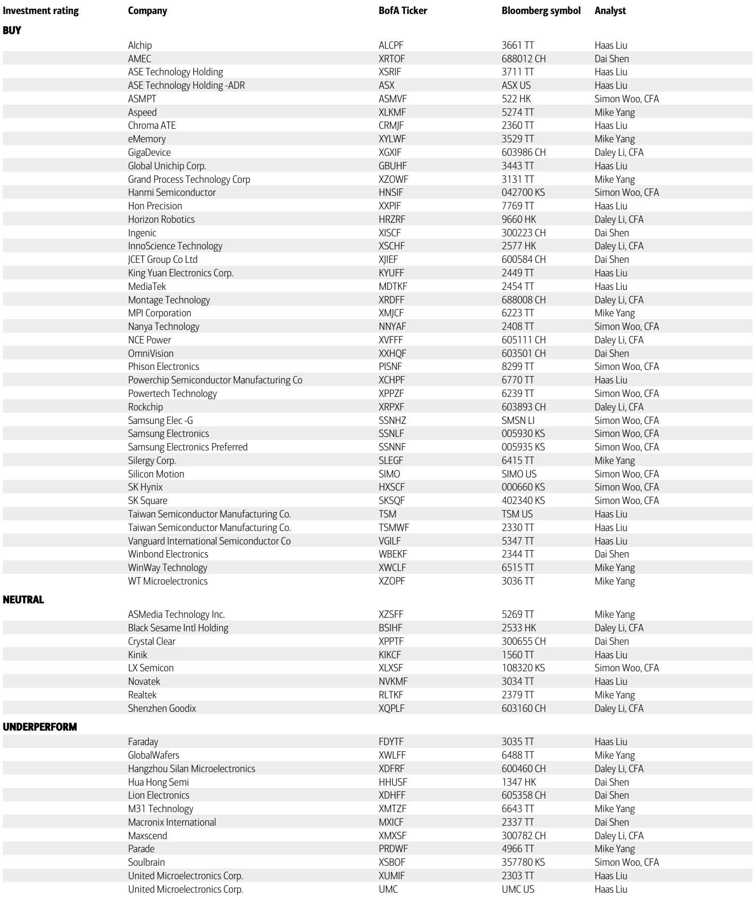
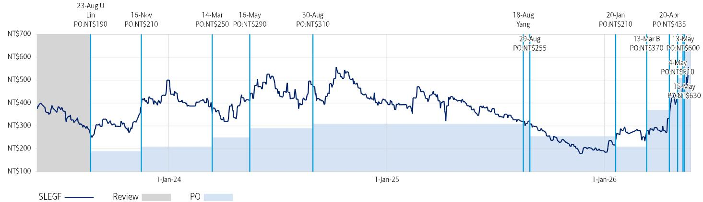
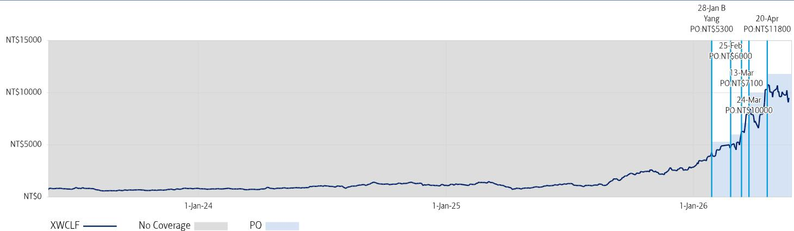

# The Next Bottleneck in Semiconductors Is Not in Logic. It Is in Power Management and Testing.

The semiconductor industry’s attention has been riveted on advanced logic nodes, high-bandwidth memory, and the packaging constraints around AI chips. That focus is understandable but increasingly incomplete. As supply-demand dynamics tighten across the broader semiconductor value chain, the most acute shortages are now emerging in two less glamorous but structurally critical segments: power management chips and testing interface components. A global investment bank report published in May 2026 makes a compelling case that these two areas are entering a period of sustained undersupply, driven by forces that are not temporary. Price hikes are being confirmed, lead times are lengthening, and order visibility is extending. This is not a cyclical spike. It is the beginning of a structural repricing of capacity in the analog and testing ecosystem.

The implications are strategic, not just tactical. Investors who continue to treat power semiconductors and testing sockets as secondary considerations risk missing the most actionable supply-chain inflection of the next 18 months. The report identifies two Taiwanese companies—Silergy in power management and WinWay in testing sockets—as direct beneficiaries. But the argument runs deeper: it signals a broader shift in how the semiconductor industry must allocate capital and attention as AI demand cascades beyond the GPU die into the surrounding infrastructure of power delivery and quality assurance.

## Pricing Power Is Returning to Power Semiconductors, and It Is Confirmed by Upstream Supply Constraints

The most direct signal in the report is the confirmation of a product ASP increase by Silergy, effective July 1, 2026. This is not speculative. The company has acted on the pricing signal. The report attributes this to a more favorable supply-demand outlook from upstream manufacturers, which in practice means that foundry capacity for power management ICs is becoming tighter. For a fabless company, this would normally raise concerns about wafer supply. Yet the report explicitly states that capacity support is not a worry for Silergy, citing its virtual IDM business model—a structure that gives it preferential access to foundry output, especially through its key partner’s overseas capacity expansion in Japan and Singapore.

This is the first-order insight: pricing power is returning because supply is structurally constrained, and the companies with the strongest relationships to foundry partners are the ones that can monetize it. The report raises its price objective for Silergy from NT$630 to NT$740, applying a 35x 2027E P/E multiple, up from 30x. That multiple expansion is justified by a clearer outlook for price hikes and a recovering operating margin of 27% and ROE of 20% in the 2027-2028 period. The valuation is not aggressive by historical standards—the company has traded between 10x and 80x—and the report positions it at the low-to-mid end of that range.

The strategic question for readers is whether this pricing power is durable. The report suggests it is, because the supply constraints are not temporary. The gen-5 platform ramp in 2027 and the overseas capacity buildout by the foundry partner will add volume, but the demand side is also shifting. Specifically, the report flags a significant opportunity from datacenter customers starting in 2027, as cloud service providers become more active in seeking lower-cost solutions and supply chain diversification. This is a critical point: the AI infrastructure buildout is creating a second wave of demand for power management, not just for GPUs but for the broader server ecosystem. As CSPs look to reduce total cost of ownership, they will increasingly turn to power management specialists that can offer cost-effective alternatives to incumbents.

## The Testing Interface Is Becoming a Structural Growth Story, Not Just a Cyclical One

The report’s analysis of WinWay is equally instructive but for different reasons. The near-term revenue pattern shows volatility—a large month-over-month increase in March driven by probe card recognition, followed by a decline in April. The report does not gloss over this; it treats it as noise. The real story is the testing socket business, which the report identifies as the more meaningful long-term growth driver. The logic is based on structural spec upgrades in ABF substrate, which are driving increases in pin count and socket demand per project. As chips become more complex and substrate densities rise, the testing interface must evolve to accommodate higher signal integrity requirements. This is not a one-time event; it is a secular upgrade cycle.

WinWay is currently ramping capacity to approximately 6 million pins per month, and the report expects this to support continuous revenue growth through 2027-2028. The lead time for delivery is lengthening, which is the classic hallmark of a seller’s market. The report applies a 37x 2H27-1H28E P/E multiple to arrive at a price objective of NT$11,800, supported by operating margin expansion to 40%, ROE expansion to around 71%, and free cash flow generation of NT$316 per share in 2027-2028. These are not speculative numbers; they are the financial expression of a capacity-constrained business serving a structurally growing end-market.

The deeper implication is that the testing interface is becoming a bottleneck in the AI supply chain. As AI accelerators and ASICs proliferate, the number of test sockets required per project is rising. Each new chip design requires a dedicated testing solution, and the complexity of those solutions is increasing. WinWay’s revenue exposure to AI and HPC applications is higher than 50%, which means its growth trajectory is directly tied to the pace of datacenter capex. The report does not shy away from the risks: a slowdown in CSP capex, execution challenges in capacity expansion due to energy shortages, or share loss in key customers could all derail the thesis. But the direction of travel is clear.

## What the Report Does Not Fully Answer: The Sustainability of Pricing Power and the Risk of Overcapacity

For all its analytical rigor, the report leaves several open questions that are worth examining. The first is whether the pricing power in power management is sustainable beyond 2027. The report’s bullish case for Silergy rests on a 52% EPS CAGR from 2026 to 2028, which implies that the current pricing environment is not a one-off but a multiyear trend. Yet the report also notes that the upside risks include smaller-than-expected pricing pressure from global analog leaders and Chinese domestic peers. This is a reminder that the power management market is highly competitive, and Chinese domestic players are aggressively scaling. If they succeed in capturing market share, the pricing environment could deteriorate faster than the report assumes.

The second unanswered question is about capacity expansion in the testing interface. WinWay’s capacity ramp to 6 million pins per month is impressive, but the report does not specify whether this is sufficient to meet demand over the next three years. The lead times are lengthening, which suggests that even at current capacity, supply is falling short. If demand continues to accelerate, WinWay may need to invest significantly more, which would pressure free cash flow and potentially dilute returns. The report’s valuation assumes a high ROE of 71%, but that assumes that capacity additions are funded efficiently and that pricing remains strong. Both assumptions are reasonable but not guaranteed.

The third open question is about the broader competitive landscape. The report focuses on two companies, but the semiconductor value chain is interconnected. If power management pricing rises, it could incentivize new entrants or accelerate the development of alternative technologies such as gallium nitride or silicon carbide. Similarly, if testing socket lead times remain long, customers may seek alternative testing methodologies or push for standardization that reduces the need for customized sockets. The report does not address these substitution risks, and they are worth monitoring.

## A Decision Framework for Investors: How to Position for the Power and Testing Tightening

For readers who want to translate the report’s analysis into an actionable framework, the following three-step approach is useful.

First, assess the exposure of your portfolio to the analog and testing value chain. The report makes clear that the tightening is not uniform across semiconductors. It is concentrated in power management and testing interface. If your portfolio is overweight in logic or memory, you are not positioned for this inflection. The companies that benefit are those with direct exposure to the supply-demand imbalance in these specific segments.

Second, evaluate the pricing power of each company in your universe. The report’s analysis of Silergy shows that pricing power is confirmed by actual ASP increases, not just analyst estimates. The key question is whether a company has the business model and foundry relationships to sustain pricing. Virtual IDM models, preferential access to capacity, and long-term partnerships with foundries are structural advantages. Companies that lack these may not be able to pass through cost increases.

Third, consider the duration of the demand driver. The report’s thesis for WinWay is based on structural spec upgrades in ABF substrate and the proliferation of AI chips. These are multiyear trends. The risk is that if CSP capex slows, the demand for testing sockets could weaken. The report acknowledges this downside risk explicitly. The decision framework should therefore include a scenario analysis: what happens to the investment thesis if datacenter capex growth decelerates by 20%? If the answer is that the company still generates positive free cash flow and maintains pricing, the thesis is robust. If not, the position should be sized accordingly.

## The Full Picture Requires a Deeper Dive into the Data

The report provides a clear and convincing argument that power management and testing interface are entering a structural tightening cycle. The price target changes, the valuation methodology, and the risk analysis are all laid out with the rigor expected of a top-tier research shop. But as with any research report, the charts and data tables contain nuances that cannot be fully captured in a summary. The exhibit on price objective changes, the summary of valuation methods, and the detailed risk factors for each company all contain information that is essential for a complete investment decision.

Join the community to read the full report and review the original charts.

*This article is for learning and discussion only and does not constitute investment advice.*

Personal reading notes and learning share only. Not investment advice.

