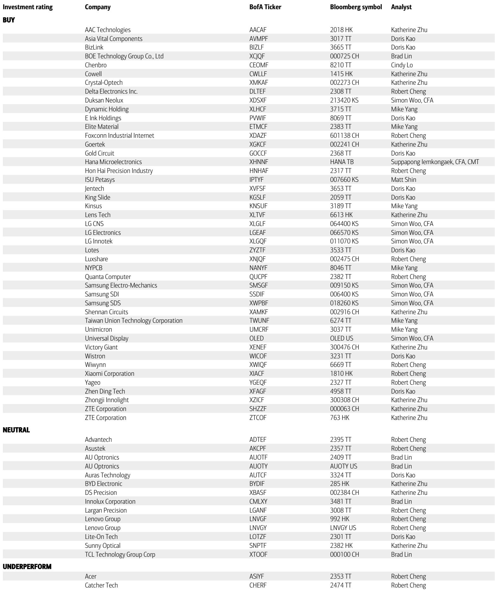
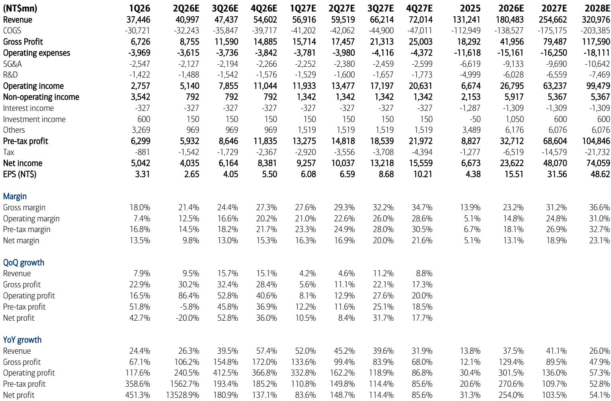
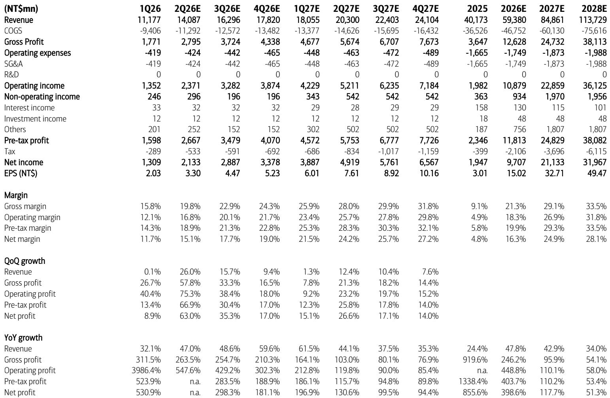

# The ABF Substrate Bottleneck Is the Most Underappreciated Structural Constraint in the AI Supply Chain

The conventional narrative around artificial intelligence hardware has focused obsessively on GPU compute capacity, memory bandwidth, and foundry node access. This focus, while understandable, has left a critical structural bottleneck under-analyzed: the supply of advanced ABF (Ajinomoto Build-up Film) substrates. These substrates are the physical and electrical interface between a high-performance AI chip and the rest of the system. They are not merely a packaging component; they are a gating factor for AI server production. A recent analysis from a major investment bank makes a compelling case that the supply-demand dynamic for ABF substrates is entering a period of extended tightness that extends well into 2028. This is not a cyclical upswing. It is a structural shift driven by the relentless increase in substrate content per chip across successive generations of AI accelerators and CPUs. For investors focused on the semiconductor ecosystem, the three Taiwanese substrate makers—Unimicron, NYPCB, and Kinsus—represent a direct, high-conviction bet on this tightening. The bank raised its price targets on all three by 13% to 18%, reflecting 10-20% upward revisions to 2026-28 earnings estimates. The logic is clear: demand is accelerating faster than supply is being added, and the market has not fully priced in the multi-year margin expansion this implies.

Why now? The catalyst is a convergence of signals from both the demand side and the supply side. On the demand side, AMD’s management recently reaffirmed a 35% compound annual growth rate for the server CPU total addressable market through 2030, and its executives visited Taiwan specifically to reassure their substrate supply. This is a direct signal that the largest non-Nvidia AI chip designer sees substrate availability as a strategic risk. On the supply side, global peers AT&S and Ibiden have guided to revenue growth rates of 30-35% and have pointed to structural increases in substrate size and layer count driven by larger reticle sizes. The implication is that the substrate industry is capacity-constrained not just by its own capital expenditure, but by the upstream availability of specialized materials like T-glass. This double bind—demand surging while supply is capped by a niche materials bottleneck—creates a pricing environment that favors incumbents with long-term relationships. The three Taiwanese names are precisely those incumbents. The bank’s analysis suggests that the market has underestimated the duration and magnitude of this tightness. The question is not whether ABF substrate makers will benefit. The question is how much of that benefit is already in the price, and what second-order effects could amplify or disrupt the thesis.

## The Consumption of ABF Substrate Per AI Chip Is Not Just Growing; It Is Accelerating Geometrically

The most critical data point in the report is the indexed consumption of ABF substrate across generations of AI CPU and GPU. Using a standard PC processor as a baseline of 1.0, the Hopper GPU consumed 3.5 times that amount. The Blackwell GPU consumed 10.5 times. The Rubin GPU, expected in the next cycle, is estimated at 17.0 times. This is not a linear progression. The jump from Blackwell to Rubin represents a 62% increase in substrate consumption per chip. The jump from Grace CPU to Vera CPU is even more dramatic: from 4.5x to 9.0x, a 100% increase. The pattern is clear: as reticle sizes expand to accommodate larger dies and more complex chiplets, the substrate must grow both in physical area and in layer count. The report details that substrate body size per layer is expected to move from 80x80 millimeters in 2025 to over 130x130 millimeters by 2030. This geometric expansion in substrate area has a compounding effect on demand. It is not just that more AI servers are being built; each server is consuming a more expensive and more complex substrate. The bank’s demand model projects that server CPU and accelerators will account for 54% of industry demand in 2026, rising to 66% by 2028. This means the substrate industry is rapidly becoming a pure AI play. The implication for investors is that traditional demand drivers like PCs and networking are becoming less relevant as a percentage of the mix. Any weakness in those legacy end-markets will be more than offset by the relentless growth in AI substrate consumption. The risk is not on the demand side; it is entirely on the supply side.

## The Supply Side Is Constrained by a Capital Cycle That Cannot Respond Quickly Enough

The bank’s constructive view on supply-demand is reinforced by commentary from global peers. AT&S has guided for 30-35% year-over-year revenue growth in its fiscal 2026-27, but it explicitly noted that this growth is capped by the tight supply of T-glass, a specialized material used in high-end substrates. This is a critical insight. The substrate industry’s bottleneck is not just about building new factories. It is about securing a steady supply of upstream materials that have their own capacity constraints. Kinsus has previously echoed similar concerns. The implication is that even if substrate makers wanted to accelerate their capacity additions, they would be limited by the availability of T-glass and other specialty inputs. This creates a structural floor under pricing. In a normal cyclical industry, high prices would incentivize rapid capacity expansion, which would then lead to oversupply and margin compression. In this case, the expansion is constrained by a material that is itself difficult to scale. The result is a prolonged period of elevated pricing and margin expansion for the substrate makers that have secured long-term supply agreements for T-glass. The bank’s earnings revisions reflect this. For Unimicron, the largest of the three, the bank now expects gross margin to reach 31.2% in 2027 and 36.6% in 2028, up from 23.2% in 2026. This is a dramatic expansion. The operating margin follows a similar trajectory, reaching 31.0% by 2028. These numbers imply that Unimicron’s profitability will approach levels that were historically reserved for the most capital-efficient fabless semiconductor companies. The substrate business is being re-rated from a cyclical manufacturing play to a structural growth story with high barriers to entry. The market has not fully absorbed this re-rating.

## The Report Leaves an Unresolved Question: How Much of the Upside Is Already Discounted, and What Could Break the Thesis?

The bank’s analysis is compelling, but it leaves several meaningful questions open. First, the price targets imply significant upside from current levels. Unimicron is priced at NT$970, with a target of NT$1,300. NYPCB is at NT$934, with a target of NT$1,170. Kinsus is at NT$609, with a target of NT$695. These targets are based on forward P/E multiples of 28.5x to 30.5x on 2H27-1H28 earnings. This is a reasonable multiple for a structural growth story, but it is not cheap. The market is already pricing in some of the margin expansion. The question is whether the consensus estimates are too conservative. The bank’s own estimates for Unimicron are 7% ahead of consensus for 2026-27 EPS. This suggests that consensus has not yet fully baked in the magnitude of the operating leverage. However, by 2028, the bank’s EPS estimate for Unimicron is actually slightly below consensus, implying that the sell-side is catching up. The window for being ahead of the curve may be narrowing. Second, the thesis is vulnerable to a disruption in the AI capex cycle. If the hyperscalers reduce their AI server spending, the demand for ABF substrates would drop sharply. The bank’s demand model assumes a continuation of the current trajectory, but that trajectory is not guaranteed. A recession or a shift in AI architecture away from large, power-hungry accelerators could reset the substrate consumption curve. Third, there is a technology risk. The report notes that substrate makers are moving to more advanced processes like SAP (semi-additive process) with increasing layer counts. If the Taiwanese makers fall behind Ibiden or AT&S in this technology transition, they could lose share precisely when the market is most attractive. The bank does not fully address this competitive dynamic. These open questions do not invalidate the thesis, but they do suggest that the investment is not without risk. The most prudent approach is to treat the ABF substrate theme as a high-conviction position that requires active monitoring of both AI demand signals and technology roadmaps.

## A Decision Framework for Investors Evaluating the ABF Substrate Opportunity

For institutional investors considering a position in this theme, the bank’s analysis provides a clear framework for decision-making. The first variable is the duration of the supply-demand tightness. The bank argues it extends into 2027-28. If you believe the AI capex cycle will sustain through that period, the thesis holds. If you believe a downturn is imminent, the thesis breaks. The second variable is the ability of the three Taiwanese companies to execute on capacity expansion. The bank has already modeled in the ramp of new factories and debottlenecking at existing sites. Any delays in these expansions would cap the upside, but any acceleration would amplify it. The third variable is the T-glass supply constraint. If new sources of T-glass come online faster than expected, the substrate makers could add capacity more quickly, which would eventually lead to price normalization. The bank views this as a positive in the near term—more supply means more revenue—but it is a negative for the long-term pricing power. The fourth variable is the technology roadmap. The move to larger substrates and more layers plays to the strengths of the Taiwanese makers, who have deep experience in high-volume manufacturing. However, the race to the next generation of packaging technology, such as glass core substrates, could disrupt the current ABF substrate cycle. Investors should monitor the pace of glass core adoption. If it accelerates, the ABF cycle could peak earlier than expected. The decision framework boils down to a bet on the persistence of AI-driven demand growth and the ability of incumbent substrate makers to capture that growth through capacity and technology leadership. The bank has placed its bet on the side of persistence and leadership.

## The Full Report Contains the Charts and Data That Support This Structural Thesis

The analysis above draws on a detailed research report that includes earnings models, supply-demand projections, and technology roadmaps. The original report contains charts that show the indexed growth in ABF consumption across AI chip generations, the trajectory of substrate size and layer counts, and the earnings revisions for each of the three companies. These charts are essential for understanding the magnitude of the shift. The report also includes a comparison of the bank’s estimates versus consensus, which highlights where the market may be mispricing the opportunity. For investors who want to make an informed decision, reviewing the original data is not optional; it is necessary. The charts provide the visual evidence that supports the structural argument. They also reveal the assumptions that underpin the price targets. Without seeing the data, it is difficult to assess the confidence level of the thesis. The report is available in full through the analyst’s distribution channel.

Join the community to read the full report and review the original charts.

*This article is for learning and discussion only and does not constitute investment advice.*

Personal reading notes and learning share only. Not investment advice.

