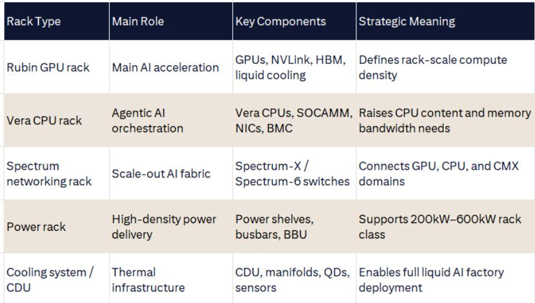
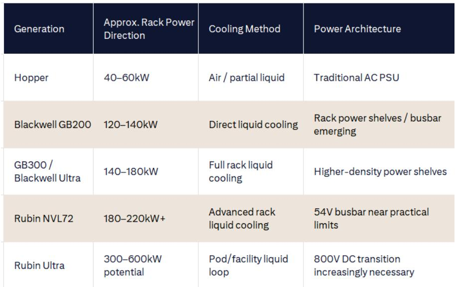

# AI基础设施正在经历一场从“堆GPU”到“造工厂”的范式转换

每年Computex都是观察AI硬件供应链风向的窗口。但今年的信号，比过去任何一届都更值得产业链决策者认真对待。

某外资投行在最新发布的Computex 2026前瞻报告中，提出了一个核心判断：AI基础设施的叙事正在发生结构性转移。过去两年，投资者的注意力高度集中在GPU、HBM、CoWoS产能和Blackwell机架出货量上。这些变量当然仍然重要，但今年Computex的主角将不再是单一芯片或单一封装，而是一整套“AI工厂”级别的系统架构。

这意味着什么？简单来说，AI基础设施的竞争门槛，正在从“谁能造出最快的芯片”转向“谁能把芯片、网络、存储、散热、供电整合成一个可组合、可扩展的工厂级系统”。对于台湾供应链而言，这既是机遇，也是筛选。那些只能提供单一组件的厂商，可能会逐渐被边缘化；而具备系统级整合能力的ODM和关键零部件供应商，将获得更高的议价权和更长的价值链条。

报告认为，NVIDIA正在从服务器级设计走向机架级、乃至Pod级设计。Blackwell GB200 NVL72是第一步，它把机架本身变成了系统边界。而Rubin系列则将这一逻辑推到了极致。这意味着，未来的AI部署不再是买几台服务器插上GPU，而是像建设一座工厂一样，规划计算模块、CPU编排层、网络互连、供电和散热基础设施。这是一个全新的系统设计阶段。

以下是我们从这份报告中提炼出的五个关键洞察，以及它们对产业格局和资产定价的含义。

## 1. 机架不再是服务器，而是AI工厂的模块化单元

报告最核心的观察之一是：NVIDIA正在定义多种机架类别，而不仅仅是GPU机架。根据GTC上的披露，NVIDIA已经勾勒出GPU机架、Vera CPU机架、LPU机架、CMX上下文内存机架、Spectrum网络机架、电源机架以及冷却/液体分配基础设施。这已经不是传统的服务器部署模型，而是一个可组合的AI工厂模型。

这一转变的深层含义是：机架本身正在成为系统设计的原子单位。Blackwell NVL72已经将72颗GPU整合进一个机架级的NVLink域，而Rubin Ultra NVL576则更进一步，将八个独立的MGX NVL机架组合成一个576-GPU的NVLink域。这意味着，机架只是更大规模Pod级计算域中的一个模块。

对于ODM厂商而言，这既是技术能力的试金石，也是商业模式升级的契机。那些能够展示完整机架解决方案的厂商——如Hon Hai、Quanta、Wistron/Wiwynn——将在Computex上获得更多关注。而对于投资者来说，评估一家ODM的价值，不能再只看它组装了多少台服务器，而要看他能否交付一个包含计算、网络、供电、散热的完整系统模块。

## 2. Vera CPU的出现，意味着CPU在AI工厂中的角色被重新定义

这一判断可能是Computex 2026最重要的技术主题之一。Vera CPU不是传统意义上的服务器CPU。它不是为了与Intel和AMD在通用服务器市场正面竞争而设计的，而是为了控制AI工厂的编排层。

在Agentic AI（代理型AI）场景中，CPU的工作负载远不止是给GPU喂数据。它还包括请求调度、代理工作流控制、工具调用协调、内存索引、检索管理、仿真、网络控制以及系统遥测。CPU正在变成AI工厂的“交通指挥中心”。随着推理工作负载变得越来越长、越来越持久，CPU侧的内存带宽和容量也变得更重要。

报告特别指出，SOCAMM设计对Vera至关重要。SOCAMM为Vera提供了更密集、更低功耗、高带宽的内存架构，比传统的DIMM重服务器设计更适合AI编排。这意味着，随着AI推理变得更具代理性和CPU密集型，CPU需求将与GPU需求同步扩张，而不是被加速器所替代。

NVIDIA CEO在最新财报电话会议上重申了公司对约2000亿美元CPU市场机会的预期，并明确将Vera CPU定位为AI基础设施战略的一部分。报告预计Vera CPU在2026年的生产准备量约为200万颗。如果这一数字被Computex上的展示所确认，那么CPU供应链——包括ABF基板、插座、散热模块——将迎来一个被低估的增长驱动力。

## 3. 网络和CPO正在成为AI性能的下一个瓶颈

报告明确指出，随着AI系统从单机架扩展到Pod级别，瓶颈正在从芯片计算转向数据移动。超大规模云厂商偏好以太网的经济性和运营熟悉度，但AI需要更严格的拥塞控制、遥测、路由和工作负载感知优化。NVIDIA的Spectrum-X路线图指向了一个方向：以太网正在变成一种专门的AI网络，而不是通用的数据中心网络。

CPO（共封装光学）将是Computex上争议最大的技术话题之一。NVIDIA已经将Spectrum-X Ethernet Photonics和Quantum-X Photonics纳入其AI工厂网络路线图。对于Rubin Ultra来说，CPO变得更重要，因为NVL576的物理规模已经超出了铜缆能够高效处理的范围。

但报告也给出了务实的判断：实际采用曲线可能是：2025-2026年采用可插拔光学和LPO/NPO，2026-2027年采用交换机侧CPO和直连光学，Rubin Ultra之后才出现更广泛的光学Scale-up网络。这意味着，CPO的供应链机会是渐进的，但光学引擎、硅光子PIC、FAU、主动对准设备、光纤连接器、光纤管理和液体兼容光子封装等环节，都将在未来2-3年内变得更加重要。

不过，报告也提醒了一个容易被忽视的细节：FAU和光学引擎不应被机械地视为一一对应关系。一个光学引擎通常需要一个光纤连接接口，但映射关系取决于Tx/Rx布局、通道数、WDM架构以及光纤是共享、拆分还是聚合。这种复杂性意味着，CPO供应链的价值分配可能比市场预期的更不均匀。

## 4. 供电和散热：从辅助系统变成核心约束

报告中最具冲击力的数据，可能是不同世代AI系统的功耗对比。Hopper机架功耗约为40-60kW，采用空气或混合冷却即可。Blackwell NVL72将这一数字推高至120-140kW，使得直接液体冷却成为标配。而Rubin NVL72的机架功耗预计将达到180-220kW以上，Rubin Ultra甚至可能达到300-600kW。

这意味着什么？一个200kW以上的机架，如果采用54V供电，电流将达到约4000A。这在铜缆、母排、连接器和热管理上都变得极其困难。这就是为什么NVIDIA正在推动800V DC、电源机架、110kW电源架、BBU支持以及DC数据中心架构。未来的机架不再只是一个服务器机柜，而是一个电气-热力系统，需要协调电源转换、备用能源、液体流动、遥测和安全系统。

对于投资者来说，这意味着电源和散热供应链正在从“辅助”角色升级为“核心”角色。Delta、AVC、Auras等厂商在Computex上展示的供电和散热解决方案，将不仅仅是产品展示，而是对整个行业技术路线的验证。那些能够提供800V DC电源架、高效CDU和先进液冷系统的厂商，将在Rubin时代获得结构性增长机会。

## 5. 报告尚未完全回答的关键问题：系统级整合的利润分配

尽管报告对AI工厂架构的描绘非常清晰，但有一个关键问题尚未被充分回答：在这个新的系统级整合阶段，利润将如何分配？

传统上，GPU和HBM占据了AI服务器BOM成本的最大份额，但利润也高度集中在这些环节。随着系统复杂度提升，ODM需要投入更多的研发资源来设计、集成和验证完整的机架系统。这些投入是否能够转化为更高的利润率？还是说，ODM仍然只能获得组装环节的微薄利润？

报告提到了ABF基板、插座、散热模块、电源架、母排、光学组件、BMC控制器和机架整合等环节的机会，但没有给出具体的利润分配估算。这需要投资者在Computex期间密切观察ODM和关键零部件厂商的毛利率指引和研发投入计划。

另一个未解问题是：Vera CPU的客户接受度。虽然NVIDIA对2000亿美元CPU市场机会的判断令人印象深刻，但Vera CPU能否真正获得超大规模云厂商的认可，仍然需要验证。传统CPU巨头Intel和AMD在通用服务器市场的地位并非一朝一夕可以撼动，而云厂商对单一供应商锁定的警惕也在增加。

---

这些未解问题，正是我们希望在接下来的深度讨论中继续探讨的方向。AI工厂架构的落地节奏、供应链利润分配的变化、以及Vera CPU的真实竞争力，都将对未来的投资判断产生重大影响。欢迎来星球微信群里继续讨论，我们将基于Computex现场的更多信息和数据，持续更新对这一轮AI基础设施范式转换的理解。

Personal reading notes and learning share only. Not investment advice.

