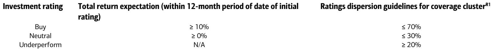

# 市场真正低估的不是AI需求，而是供给侧的再定价

当全球投资者还在争论AI资本开支的持续性时，一份来自某外资投行在2026年5月香港路演的反馈纪要，揭示了一个更紧迫的议题：半导体供应链的供需结构正在发生质变，而市场对“紧缺”的定价仍停留在旧框架里。

这份报告的核心判断并非关于AI需求是否见顶——事实上，市场对服务器CPU和AMD供应链的关注已相当充分。真正的信号在于，供给侧的紧张正在从ABF载板向测试接口、功率半导体等更广泛的环节蔓延，且这种紧缺的持续性和结构性，远超过多数投资者的预期。

报告通过与约30位机构投资者的交流反馈，提炼出五个关键议题：AMD服务器供应链受益者识别、估值与盈利增长的权衡、硬件载板/PCB/CCL的排序、供应短缺动态的扩散，以及PC Fabless的布局机会。这些议题表面上是技术性的，但合在一起指向一个更深的判断：科技硬件投资的焦点，正在从“谁在增长”转向“谁拥有不可复制的产能和议价权”。

以下是我们基于该报告解析的核心洞察与未尽问题。

## 1. 这轮变化真正考验的是企业能否把规模转化为议价权

报告中最值得关注的信号之一是，投资者对测试接口公司（如MPI、WinWay）的估值产生了明显疑虑。过去几年的股价重估和估值倍数扩张，让部分参与者开始怀疑“贵了”。但报告分析师给出的回应值得深思：不要只看估值倍数，要看盈利能见度。

这意味着什么？在供给紧张的周期中，拥有议价权的公司往往能够持续超越盈利预期，而市场习惯性地用历史估值框架去定价未来现金流。当产能受限、交期拉长时，决定股价的已经不是需求增速，而是企业能否将规模优势转化为定价能力。

这一逻辑同样适用于ABF载板领域。报告明确指出，对载板和CCL（铜箔基板）更为看好，因为供给紧张持续时间更长。而在PCB领域，由于竞争格局更分散且受到CPO（共封装光学）技术的影响，面临的逆风更大。这本质上是一个“供给侧护城河”的排序：供给越难复制、技术壁垒越高，企业的定价权就越强。

对于产业决策者而言，这意味着在评估供应链合作伙伴时，不能只看其产能规模，更要看其产能的稀缺性和不可替代性。对于投资者而言，这意味着选股框架应从“谁受益于增长”转向“谁在紧缺中拥有定价权”。

## 2. 测试接口与功率半导体的供给紧张，是一个被低估的结构性变量

报告提到，投资者最关心的问题之一是哪些子行业面临更严重的供应约束。分析师的回答是：测试接口和功率半导体的供给紧张正在加剧，产品交付周期显著拉长。

这一判断的关键在于，它并非短期的产能瓶颈，而是结构性供需错配。测试接口（如探针卡）的需求增长与先进制程的研发和量产密切相关，而功率半导体则受益于汽车、工业、AI基础设施等多重需求的叠加。这两者的供给扩张都面临技术门槛高、认证周期长、资本开支回报不确定等问题。

更重要的是，这种紧缺的扩散效应值得关注。当测试接口和功率半导体的交期拉长，下游系统厂商的出货节奏可能受到影响，进而对更广泛的供应链产生连锁反应。报告没有完全展开这一点，但这是读者需要自行推演的二阶影响：供给紧张是否会从单一环节蔓延至整个电子制造产业链，从而改变终端产品的定价和竞争格局？

## 3. 在PC Fabless的布局中，时机比技术更重要

报告还捕捉到投资者对PC Fabless公司的兴趣，特别是ASMedia和Parade。分析师表示，对ASMedia相对更为看好，因为Parade要等到2027年下半年（最早）才能进入AMD阵营的ASIC-like业务供应链。

这里的关键洞察并非技术优劣，而是“进入供应链的时间窗口”。在半导体行业，先发优势不仅意味着更早的营收贡献，更意味着更长的客户验证周期和更稳固的供应关系。一旦进入供应链，切换成本极高。因此，即便两家公司技术实力相当，进入时间点的差异也可能导致数年内的业绩分化。

这一点对于所有关注半导体供应链的读者都具有普遍意义：在技术迭代加速的背景下，押注于“即将进入供应链”的公司，其风险收益比可能优于押注于“技术更优但仍在等待时机”的公司。报告没有给出具体的估值比较，但这一逻辑框架本身已足够指导后续的深度研究。

## 4. 报告尚未完全回答的关键问题：供给紧张的可持续性如何验证

尽管报告提供了清晰的子行业排序和选股逻辑，但有一个关键问题尚未充分展开：当前供给紧张的可持续性到底有多强？换句话说，这些紧缺是周期性的，还是结构性的？

测试接口和功率半导体的供给紧张，部分源于AI和汽车需求的爆发，但部分也源于过去几年资本开支的不足。如果未来需求增速放缓，或者产能扩张加速，当前的紧缺状态可能迅速逆转。报告提到了“更长的交付周期”，但没有量化这些交期何时可能缓解，也没有给出产能扩张的具体时间表。

此外，CPO技术对PCB行业的冲击，报告只是点到为止。CPO的采用是否会从根本上改变载板、PCB和CCL的需求结构？如果CPO在2027-2028年大规模商用，当前对ABF载板的乐观预期是否需要重新校准？这些问题都需要更详细的产业链调研和数据支撑。

对于读者而言，这意味着在参考报告的投资框架时，需要自行跟踪几个关键变量：测试接口和功率半导体的产能扩张计划、交期变化趋势、以及CPO技术的商用进展。这些变量将决定当前供给紧张的判断是“买入信号”还是“短期噪音”。

## 5. 一个更实用的观察框架：从“谁受益”到“谁不可替代”

综合以上分析，我们可以提炼出一个更实用的观察框架，用于评估任何供给紧张背景下的科技硬件投资机会。

第一步，判断供给紧张的性质。是周期性的（如产能爬坡延迟）还是结构性的（如技术壁垒、认证周期、客户锁定）？结构性紧缺的可持续性更强，对应的估值容忍度更高。

第二步，评估企业的议价权来源。是源于规模优势、技术独特性、客户关系，还是政策壁垒？不同的来源决定了议价权的持久性。

第三步，识别供给紧张的扩散路径。一个环节的紧缺是否会传导至上下游？是否会改变终端产品的定价或竞争格局？例如，测试接口的紧缺是否会限制先进芯片的出货量，从而影响服务器CPU厂商的营收？

第四步，关注技术替代的风险。任何供给紧张都会催生替代方案。CPO对PCB的影响、先进封装对传统载板的影响，都是需要持续跟踪的变量。

这个框架并非来自报告的直接表述，而是从报告的逻辑中推导出的“二阶洞察”。它可以帮助读者在报告的基础上，自行判断不同细分领域的投资价值，而不是被动接受分析师的观点。

---

报告中的路演反馈，本质上是一次“市场情绪的体检”。它揭示了投资者在估值、增长和供给之间摇摆的真实状态。但比情绪更重要的，是供给结构的底层变化正在重塑整个半导体硬件领域的竞争格局。那些能够将供给紧张转化为可持续议价权的公司，将在未来几个季度中获得超越市场的表现。

然而，我们仍有一些问题需要更深入的讨论：测试接口和功率半导体的供给紧张何时可能缓解？CPO的商用时间表是否被市场低估？PC Fabless的进入时间窗口是否已经被股价充分反映？这些问题的答案，往往藏在更细致的产业链调研、更长的数据回溯和更开放的讨论中。

欢迎来星球微信群里继续讨论，我们会在群内分享更详细的产业链数据、供需模型推演，以及对关键公司产能扩张计划的跟踪分析。只有通过持续的对话，才能将一份路演反馈转化为真正可操作的判断框架。

Personal reading notes and learning share only. Not investment advice.

