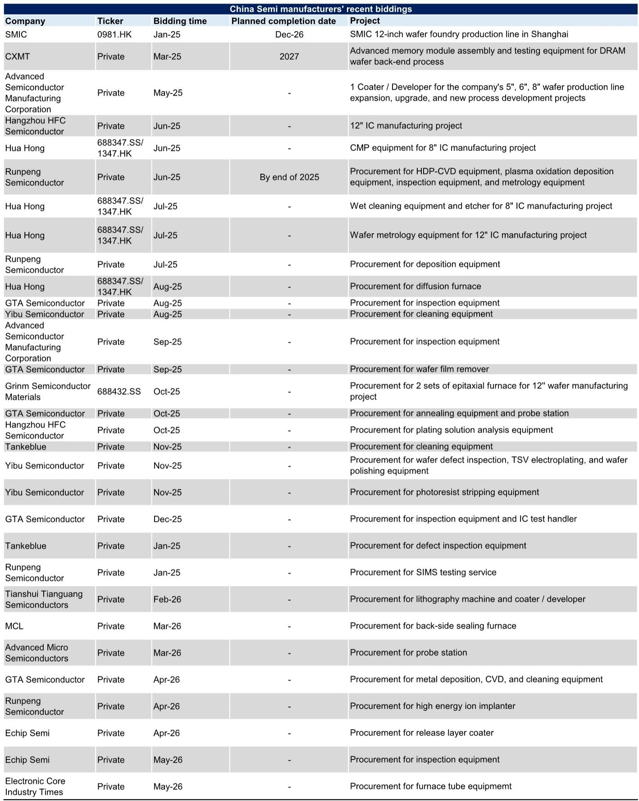
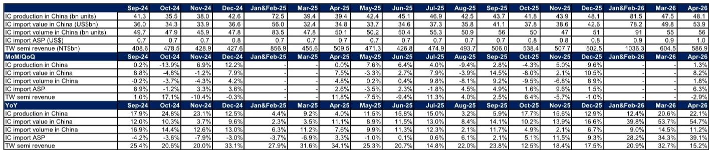

# 市场真正低估的不是需求，而是中国半导体进口均价的持续重构

2026年4月的中国半导体进出口数据，表面上是一组强劲的同比增幅：IC进口额同比+54.7%，IC出口额同比+99.6%，IC产量同比+22.1%。但这份投行研报的核心洞见，并不在于这些数字本身有多高，而在于它们共同指向一个被大多数投资者低估的结构性变化——中国半导体进口均价正在经历系统性抬升，而这一趋势的持续性将重新定义整个产业链的竞争格局与资产定价逻辑。

为什么说进口均价才是关键？因为量的增长是市场普遍预期的，但价的提升意味着中国正在进口更高价值的芯片，这既反映了国内对高端算力、AI和ADAS芯片的需求爆发，也暗示着国产替代在高端领域的渗透仍处于早期阶段。而出口均价的同步抬升，则暗示中国半导体制造能力的结构性升级正在发生。

这份报告提供的最新数据信号是：2026年4月，中国IC进口均价同比上升39.1%，连续三个月保持30%以上的同比增幅，而2025年同期这一数字仅为3.3%。这不是一个季节性波动，而是一个趋势的确认。

## 1. 进口均价连续三个月同比超30%，背后是AI与ADAS驱动的需求结构升级

2026年4月，中国IC进口均价达到1.0美元/颗，而2025年4月仅为0.7美元/颗。从数据看，2026年1-2月均价为0.9美元/颗，3月为0.9美元/颗，4月进一步升至1.0美元/颗，呈现逐月攀升态势。

这一变化的驱动因素非常清晰：进口均价提升并非因为中国减少了低端芯片的进口，而是因为高价值芯片的进口增速远超低端芯片。报告显示，4月IC进口量同比仅增长11.2%，但进口额同比增长54.7%，两者之间的差距正是由均价拉动的。这意味着，中国正在大量进口用于AI训练、云端推理、自动驾驶等场景的高性能计算芯片、高带宽存储器和先进制程逻辑芯片。

对于产业链的启示是：中国半导体需求的增长已经从“量的扩张”进入“质的提升”阶段。那些能够提供高附加值芯片设计、先进封装和高端设备的企业，将获得远超行业平均的增长弹性。而投资者如果仅仅关注IC产量或进口量的同比增速，可能会低估这一轮需求周期的强度。

## 2. IC产量增速持续上行，但真正值得关注的是“量价背离”背后的产能结构

2026年4月，中国IC产量同比增长22.1%，较3月的20.6%进一步加速，也远高于2025年4月的4.0%。从绝对值看，4月产量达到48.1亿颗，已接近2025年12月的历史高位48.1亿颗。

但这里有一个值得深挖的细节：IC产量的增速（22.1%）与IC进口额的增速（54.7%）之间存在巨大差距。这意味着，尽管国内产量在快速增长，但国内需求中高价值部分仍然严重依赖进口。报告中的数据也佐证了这一点：2026年4月，中国半导体总收入同比增长74.1%至267亿美元，而其中大部分增长仍来自进口芯片的销售。

这种“量价背离”暗示了一个关键判断：中国半导体的国产替代进程在低端市场已经相当深入，但在高端市场仍有巨大的替代空间。对于投资者而言，这意味着两类机会：一是那些已经在中低端市场建立规模优势、并正在向高端迁移的企业；二是那些直接受益于高端芯片进口需求增长的供应链环节，如先进封装、测试设备和EDA工具。

## 3. 出口额同比翻倍，中国半导体正在从“纯进口国”向“出口竞争者”转变

2026年4月，中国IC出口额同比大增99.6%至311亿美元，环比也增长6.6%。2026年前四个月，累计出口额已达1036亿美元，同比增长83.5%。这一增速远超进口额的增幅，也远高于市场预期。

出口额的爆发式增长，意味着中国半导体制造能力正在经历质的飞跃。报告虽然没有详细拆解出口产品的结构，但从逻辑上推断，出口增长的主要驱动力应该是成熟制程的功率器件、MCU、模拟芯片等产品，以及部分先进封装后的成品。这些产品在全球市场具有成本竞争力，且受益于全球半导体产能向中国转移的趋势。

这一变化对全球半导体竞争格局的影响是深远的。中国正在从“最大的半导体消费市场”同时变成“重要的半导体供应方”。对于已在全球布局的半导体企业而言，这意味着竞争压力的上升；对于中国本土的设备、材料企业而言，则意味着下游需求的持续扩容。报告中也提到，中国半导体设备制造商在2026年5月持续进行招标采购，这进一步印证了国内产能扩张的势头。

## 4. 台湾半导体营收增速放缓，暗示全球半导体周期进入“分化阶段”

2026年4月，台湾主要上市半导体公司合计营收同比增长15.2%，但环比下降2.9%。其中，晶圆代工环比下降0.8%，IC设计环比下降17.6%，封测环比增长1.6%。这与2025年4月34.1%的同比增速相比，放缓明显。

台湾半导体营收的放缓，与中国大陆IC进口额的持续高增长形成鲜明对比。这背后反映的是全球半导体周期正在进入“分化阶段”：中国大陆市场受益于AI、ADAS和国产替代的三重驱动，需求保持强劲；而全球其他市场可能正在经历库存调整和需求正常化。

报告中的库存数据也支持这一判断：2026年3月，中国电子制造业库存天数为55天，与过去几年同期水平基本一致，处于健康区间。这意味着中国市场的需求增长是真实的、可持续的，而非由补库存驱动的短期现象。

对于投资者而言，这一分化意味着选择的重要性。那些深度绑定中国市场需求、尤其是AI和汽车电子领域的企业，将获得更强的业绩韧性；而那些依赖全球市场、尤其是消费电子领域的企业，可能面临更大的不确定性。

## 5. 半导体设备进口的“量减价升”信号，报告尚未完全回答的关键问题

2026年4月，中国半导体设备（SPE）进口额同比下降4.2%至30亿美元，环比下降19.8%。但测试设备进口额同比增长48.4%，进口均价环比暴涨234.9%至5.92万美元/台。与此同时，光刻机进口量同比下降29%至55台，进口均价同比下降43%至260万美元/台。

这一组数据传递了一个复杂但重要的信号：中国正在调整半导体设备的进口结构。光刻机进口量的下降和均价的下降，可能意味着国内正在减少对高端光刻机的依赖，转而采购更多成熟制程设备。而测试设备进口的大幅增长和均价飙升，则暗示国内先进封装和测试能力的建设正在加速。

报告没有完全回答的关键问题是：这种设备进口结构的调整，究竟是短期策略性的“绕道采购”，还是长期技术路线的根本性转变？如果国内企业在先进制程设备受限的情况下，选择通过先进封装和异构集成来提升芯片性能，那么测试设备的需求将保持强劲增长。但如果这只是短期库存调整或订单延迟，那么设备进口数据可能会在未来几个月出现反弹。

这个问题对投资者的含义是：在设备领域，短期内应关注测试、封装和成熟制程设备供应商；而先进制程设备的投资逻辑，则需要等待更明确的政策和技术信号。

## 6. 投资者需要建立的新观察框架：从“量”到“价”，从“需求”到“结构”

基于以上分析，投资者在跟踪中国半导体行业时，需要建立一个更精细的观察框架，而不仅仅是关注IC产量和进口量的同比增速。

第一，关注进口均价的趋势。进口均价是衡量中国高端芯片需求最直接的指标。如果进口均价持续上行，说明AI、ADAS等高端应用的需求仍在扩张；如果进口均价出现拐点，则可能意味着需求结构正在发生变化。

第二，关注出口增速与产品结构。中国IC出口增速的可持续性，取决于出口产品是否从低端向中高端迁移。投资者需要跟踪出口均价的变化，以及出口产品在AI、汽车、工业等领域的渗透率。

第三，关注设备进口结构的变化。光刻机、刻蚀机、测试设备的进口数据，是判断国内产能建设方向的重要信号。如果测试设备进口持续增长，说明国内正在加大先进封装和测试能力的投入；如果光刻机进口量反弹，则可能意味着先进制程产能扩张仍在继续。

第四，关注台湾半导体营收与中国大陆半导体需求的“剪刀差”。如果两者持续背离，说明中国本土供应链的独立性在增强，全球半导体产业链正在被重塑。

这份研报提供了丰富的数据和清晰的判断框架，但受限于公开信息的边界，报告对上述设备进口结构变化、出口产品结构、以及高端芯片国产替代的进展等关键问题，并没有给出完整的答案。这些未解问题恰恰是当前投资决策中最重要的变量。

---

**欢迎来星球微信群里继续讨论**：以上分析中提到的“设备进口结构调整能否持续”、“出口产品结构是否在向高端迁移”、“AI芯片国产替代的真实进度”等问题，都是我们在社群中持续跟踪和讨论的核心议题。完整的研报原文、原始图表以及我们对关键数据的深度拆解，已同步上传至知识星球。如果你希望获得更完整的分析框架和实时讨论，欢迎加入我们的社群。

Personal reading notes and learning share only. Not investment advice.

